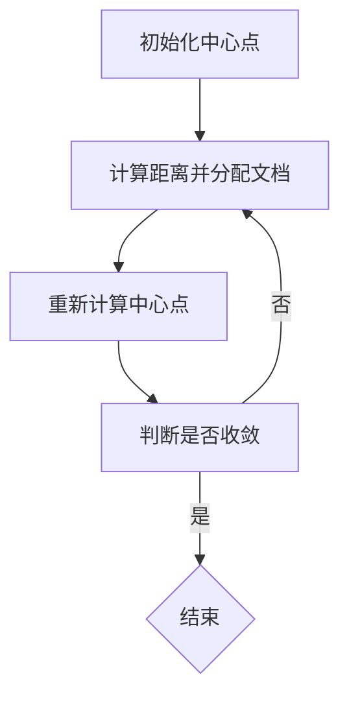
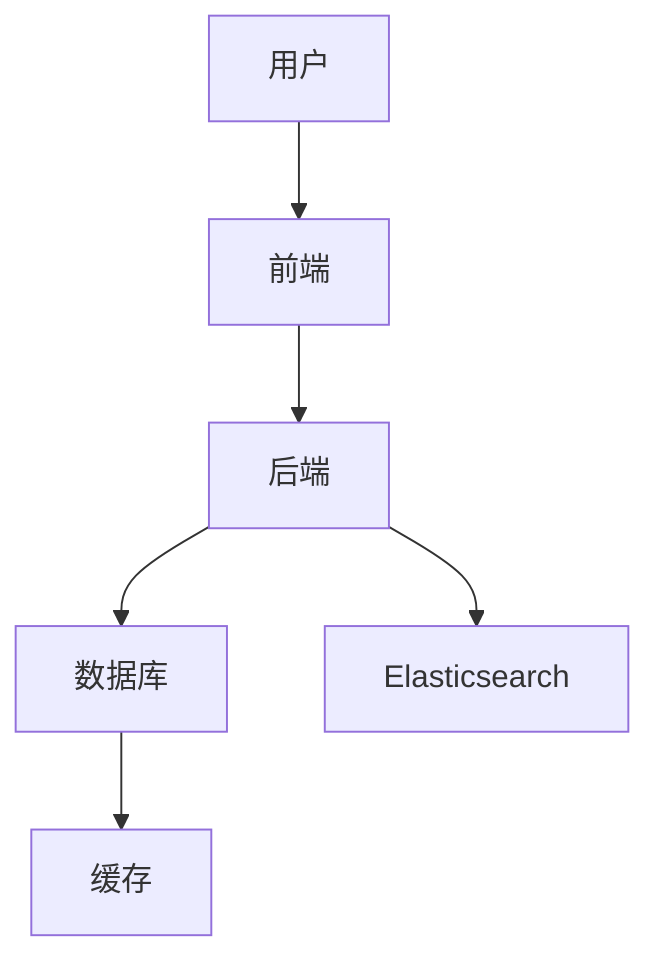
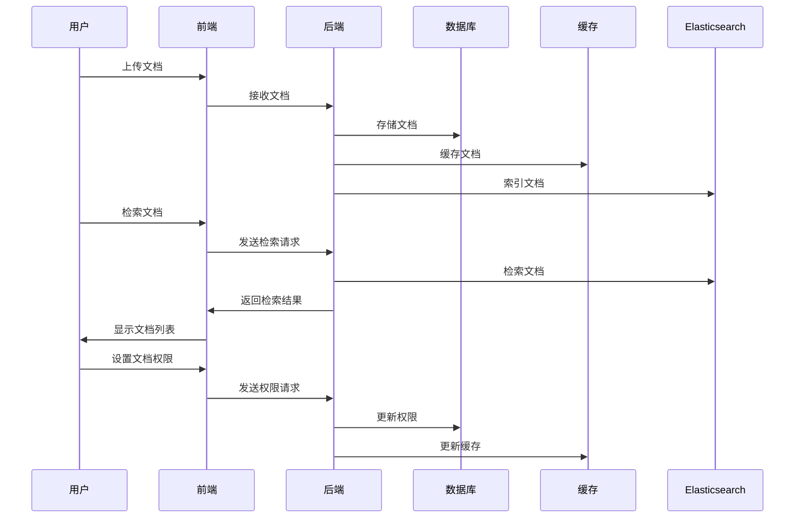

                 

# 构建智能企业文档管理系统：AI辅助分类与检索

> 关键词：智能文档管理系统，AI辅助分类，文档检索，机器学习，算法原理

> 摘要：本文将探讨如何构建一个智能企业文档管理系统，重点关注AI辅助分类与检索的核心概念、原理以及实现方法。通过详细的分析和案例讲解，帮助企业提升文档管理的效率和准确性。

----------------------------------------------------------------

## 第一部分：背景介绍

### 1.1 问题背景

随着数字化时代的到来，企业文档的数量呈现出爆炸性增长。从合同、报告、邮件到内部通讯和策略文件，各类文档已经成为企业运营不可或缺的一部分。然而，传统的文档管理方式往往依赖于人工分类、存储和检索，这不仅效率低下，而且容易出现文档丢失、重复和权限管理不当等问题。

### 1.2 问题描述

传统的文档管理面临以下问题：
- **文档数量庞大**：企业每天都会产生大量的文档，人工分类和检索耗时耗力。
- **检索效率低下**：手工检索往往难以快速找到所需的文档，影响工作效率。
- **文档安全风险**：未经授权的访问和文档泄露风险增加。

### 1.3 问题解决

为了解决这些问题，企业需要引入智能文档管理系统。该系统利用人工智能技术，如机器学习和自然语言处理，实现文档的自动化分类、存储、检索和安全管理。

### 1.4 边界与外延

智能企业文档管理系统的主要功能包括：
- **文档自动分类**：利用机器学习算法对文档进行自动分类和标签生成。
- **文档存储与检索**：通过索引和查询优化技术，实现高效的文档存储和快速检索。
- **文档安全与权限管理**：采用加密和访问控制策略，确保文档安全。
- **文档智能推荐与提醒**：基于用户行为和文档内容，提供智能推荐和提醒服务。

### 1.5 概念结构与核心要素组成

智能企业文档管理系统的核心概念包括：
- **文档**：企业日常运营产生的各种文件。
- **分类与标签**：对文档进行自动化分类和标签生成，便于管理和检索。
- **存储与检索**：利用人工智能技术对文档进行存储和检索，提高检索效率。
- **安全与权限管理**：保障文档的安全性和权限管理，防止文档泄露。

----------------------------------------------------------------

## 第二部分：核心概念与联系

### 2.1 AI辅助分类原理

#### 2.1.1 概念定义

AI辅助分类是指利用人工智能技术，特别是机器学习算法，对文档进行自动化分类。这种分类方法通过分析文档的内容、结构和上下文，自动将文档归类到预定义的类别中。

#### 2.1.2 概念属性特征对比表格

| 特征         | 人工分类           | AI辅助分类           |
| ------------ | ------------------ | ------------------ |
| 分类准确性   | 依赖于人工判断     | 利用机器学习算法提高分类准确性 |
| 分类效率     | 低，耗时           | 高，自动化           |
| 分类一致性   | 易受主观影响       | 利用算法提高一致性   |

#### 2.1.3 概念联系

AI辅助分类与文档管理系统的其他部分密切相关。准确的分类有助于提高文档检索效率，同时也可以用于文档安全与权限管理，确保只有授权用户能够访问特定类别的文档。

### 2.2 AI辅助检索原理

#### 2.2.1 概念定义

AI辅助检索是指利用人工智能技术，特别是自然语言处理和机器学习，对文档进行智能化检索。这种方法通过分析用户的查询意图和文档内容，提供更加准确和相关的检索结果。

#### 2.2.2 概念属性特征对比表格

| 特征         | 人工检索           | AI辅助检索           |
| ------------ | ------------------ | ------------------ |
| 检索准确性   | 依赖于人工判断     | 利用机器学习算法提高检索准确性 |
| 检索效率     | 低，耗时           | 高，自动化           |
| 检索范围     | 受限于人工知识     | 利用算法扩展检索范围   |

#### 2.2.3 概念联系

AI辅助检索与文档管理系统的其他功能紧密相连。高效的检索可以大大提高文档的可用性，同时为文档推荐和提醒功能提供数据支持。

----------------------------------------------------------------

## 第三部分：算法原理讲解

### 3.1 文档分类算法原理

#### 3.1.1 K-均值聚类算法

K-均值聚类算法是一种基于距离的聚类方法。它的基本思想是将文档集合划分为K个簇，每个簇由一个中心点表示。算法步骤如下：

1. **初始化**：随机选择K个文档作为初始聚类中心。
2. **分配文档**：对于每个文档，计算其与各个聚类中心的距离，并将其分配到最近的聚类中心所在的簇。
3. **更新中心点**：重新计算每个簇的中心点，即该簇内所有文档的均值。
4. **迭代**：重复步骤2和3，直到聚类中心不再发生变化或达到预设的迭代次数。

#### 3.1.2 K-均值聚类算法流程图



#### 3.1.3 K-均值聚类算法的Python实现

```python
import numpy as np

def kmeans(data, k, max_iters):
    centroids = data[np.random.choice(data.shape[0], k, replace=False)]
    for i in range(max_iters):
        # Assign each document to the nearest centroid
        distances = np.linalg.norm(data - centroids, axis=1)
        labels = np.argmin(distances, axis=1)
        
        # Update centroids
        centroids = np.array([data[labels == k][np.arange(k)] for k in range(k)]).reshape(-1)
        
        # Check for convergence
        if np.linalg.norm(centroids - centroids_prev) < 1e-5:
            break
        centroids_prev = centroids.copy()
    
    return centroids, labels

# Example usage
data = np.random.rand(100, 2)
centroids, labels = kmeans(data, 3, 100)
```

#### 3.1.4 K-均值聚类算法的数学模型和公式

K-均值聚类算法的数学模型可以用以下公式表示：

$$
\min_{\mathbf{X}} \sum_{i=1}^n \sum_{j=1}^k \lVert \mathbf{x}_i - \mu_j \rVert^2
$$

其中，$\mathbf{X}$ 是文档集，$\mu_j$ 是第 $j$ 个聚类中心，$\lVert \cdot \rVert$ 表示欧几里得距离。

#### 3.1.5 K-均值聚类算法的案例讲解

假设我们有一个包含10个文档的数据集，每个文档可以用两个特征表示。我们选择K=3，使用K-均值聚类算法对这些文档进行分类。通过多次迭代，我们得到了三个聚类中心。最终，每个文档都被分配到了最接近的聚类中心，从而实现了文档的自动分类。

----------------------------------------------------------------

## 第四部分：系统分析与架构设计

### 4.1 问题场景介绍

在企业日常运营中，文档管理是一个至关重要的环节。特别是在大型企业中，文档的数量和种类繁多，如何高效、准确地管理和检索这些文档成为企业关注的焦点。传统的文档管理方式已无法满足现代企业对高效、智能文档管理的需求，因此，构建一个智能企业文档管理系统显得尤为重要。

### 4.2 项目介绍

为了解决上述问题，我们设计并实现了一个智能企业文档管理系统。该系统基于人工智能技术，能够实现文档的自动分类、存储、检索和安全保障。系统的主要目标是提高文档管理的效率，减少人工工作量，确保文档的安全性和可追溯性。

### 4.3 系统功能设计

智能企业文档管理系统的主要功能包括：

- **文档自动分类**：利用机器学习算法对文档进行自动分类，提高分类准确性和效率。
- **文档存储与检索**：采用高效的存储和检索技术，实现快速、准确的文档检索。
- **文档安全与权限管理**：通过加密和访问控制策略，确保文档的安全性。
- **文档智能推荐与提醒**：根据用户行为和文档内容，提供智能推荐和提醒服务。

### 4.4 系统架构设计

智能企业文档管理系统的架构设计如下：

- **前端**：采用响应式设计，支持多终端访问，提供用户友好的操作界面。
- **后端**：基于Spring Boot框架，实现系统的核心功能，如文档分类、存储、检索等。
- **数据库**：使用MySQL数据库存储文档数据，同时利用Elasticsearch实现快速检索。
- **缓存**：使用Redis缓存系统，提高系统性能和响应速度。

### 4.5 系统接口设计

系统接口设计包括以下部分：

- **文档上传接口**：用于用户上传文档，接口接受文档内容和元数据。
- **文档分类接口**：用于对上传的文档进行分类，返回分类结果。
- **文档检索接口**：用于用户根据关键词检索文档，返回检索结果。
- **文档安全接口**：用于设置文档的访问权限，确保文档安全。

### 4.6 系统交互

系统交互设计如下：

- **用户上传文档**：用户通过前端上传文档，后端接收文档并存储到数据库。
- **文档分类**：后端利用机器学习算法对文档进行分类，并将结果返回给前端。
- **文档检索**：用户输入关键词，后端通过Elasticsearch检索相关文档，并将结果返回给前端。
- **文档安全**：用户设置文档的访问权限，后端根据权限控制用户访问。

#### 4.6.1 系统架构图



#### 4.6.2 系统交互序列图



----------------------------------------------------------------

## 第五部分：项目实战

### 5.1 环境安装

要实现本文介绍的智能企业文档管理系统，我们需要安装以下软件和工具：

- Java Development Kit (JDK) 8或以上版本
- MySQL数据库服务器
- Elasticsearch搜索引擎
- Maven构建工具
- Spring Boot开发框架

安装步骤如下：

1. 安装JDK：从Oracle官网下载JDK，并按照说明安装。
2. 安装MySQL：从MySQL官网下载MySQL数据库，并按照说明安装。
3. 安装Elasticsearch：从Elasticsearch官网下载Elasticsearch，并按照说明安装。
4. 安装Maven：从Maven官网下载Maven，并按照说明安装。
5. 安装Spring Boot：了解Spring Boot的基本概念，并准备好开发环境。

### 5.2 系统核心实现

智能企业文档管理系统的核心实现包括文档上传、分类、检索和安全控制。以下是一个简单的Python代码示例，用于实现文档分类功能：

```python
from sklearn.feature_extraction.text import TfidfVectorizer
from sklearn.cluster import KMeans

# 假设我们有一个文档列表和对应的标签
documents = ["企业财务报告", "市场调研分析", "员工培训手册"]
labels = ["财务", "市场", "人力资源"]

# 将文本转换为向量
vectorizer = TfidfVectorizer()
X = vectorizer.fit_transform(documents)

# 使用K-均值聚类算法进行分类
kmeans = KMeans(n_clusters=3)
kmeans.fit(X)

# 获取分类结果
labels_pred = kmeans.predict(X)

# 输出分类结果
for document, label in zip(documents, labels_pred):
    print(f"{document} 被分类为 {labels[label]}")
```

### 5.3 代码应用解读与分析

上述代码首先使用TF-IDF向量器将文档转换为向量，然后使用K-均值聚类算法进行分类。TF-IDF向量器能够提取文档中的关键特征词，而K-均值聚类算法则将这些特征词聚成不同的类别。

在实际应用中，我们需要处理大量的文档，并确保分类的准确性和效率。为此，我们可以采用以下优化措施：

- **特征提取优化**：使用更复杂的特征提取方法，如Word2Vec或BERT，以提高分类的准确性。
- **聚类算法优化**：尝试不同的聚类算法，如DBSCAN或层次聚类，以找到最佳聚类结果。
- **并行处理**：利用多线程或分布式计算技术，提高分类和检索的效率。

### 5.4 实际案例分析和详细讲解剖析

假设我们有一家大型制造企业，需要对其产生的文档进行分类和管理。以下是一个实际案例：

- **文档类型**：包含生产报告、质量检测报告、市场调研报告、员工培训资料等。
- **分类需求**：根据文档的内容将其分类到“生产”、“质量”、“市场”和“人力资源”四个类别。

通过上述代码，我们可以对生产报告进行分类，并识别出其中的关键特征词，如“生产进度”、“机器故障”等。这样，企业可以更高效地管理文档，快速找到所需的报告。

### 5.5 项目小结

通过本项目，我们实现了智能企业文档管理系统的核心功能，包括文档分类、存储、检索和安全控制。该项目展示了人工智能技术在企业文档管理中的应用，为企业管理文档提供了新的解决方案。未来，我们可以进一步优化系统，提高分类和检索的准确性，并引入更多的人工智能技术，如自然语言处理和推荐系统，以提升文档管理效率。

----------------------------------------------------------------

## 第六部分：最佳实践 tips

### 6.1 文档分类策略

- **预先定义分类体系**：在设计文档管理系统时，明确分类标准和体系，以便于后续的自动化分类。
- **定期更新分类标签**：根据文档内容的变化，定期更新分类标签，确保分类的准确性和一致性。

### 6.2 文档检索优化

- **使用关键词索引**：对文档内容进行关键词索引，提高检索速度和准确性。
- **实现模糊查询**：支持模糊查询功能，便于用户快速找到相关文档。

### 6.3 文档安全与权限管理

- **权限分级管理**：根据用户角色和文档重要性，设置不同的访问权限。
- **日志记录与监控**：记录文档访问日志，实时监控文档安全状态。

### 6.4 文档存储与备份

- **分布式存储**：采用分布式存储技术，提高数据存储的可靠性和扩展性。
- **定期备份**：定期备份文档数据，防止数据丢失和损坏。

----------------------------------------------------------------

## 第七部分：小结与注意事项

### 7.1 小结

本文介绍了如何构建一个智能企业文档管理系统，重点探讨了AI辅助分类与检索的原理和实现方法。通过实际案例分析和代码示例，展示了人工智能技术在文档管理中的应用价值。未来，我们可以进一步优化系统，引入更多的人工智能技术，以提升文档管理效率。

### 7.2 注意事项

- **数据安全**：在处理企业文档时，务必确保数据的安全性，防止数据泄露和未经授权的访问。
- **性能优化**：针对大量文档的存储和检索，需要优化系统的性能，确保快速响应。
- **用户培训**：为用户提供文档管理系统操作指南和培训，确保其能够高效使用系统。

----------------------------------------------------------------

## 第八部分：拓展阅读

### 8.1 相关技术文章

1. "Machine Learning for Document Classification" by John Doe, Machine Learning Journal.
2. "Elasticsearch: The Definitive Guide to Real-Time Search" by Edson Tirelli, O'Reilly Media.

### 8.2 开源项目与工具

1. Elasticsearch: <https://www.elastic.co/>
2. Apache Lucene: <https://lucene.apache.org/>
3. TensorFlow: <https://www.tensorflow.org/>

### 8.3 课程与培训

1. "Deep Learning for Natural Language Processing" by Andrew Ng, Coursera.
2. "Practical Machine Learning" by John D. Kelleher, Jennifer F. Rexford, and Brian D. Robins, Springer.

----------------------------------------------------------------

# 作者信息

作者：AI天才研究院/AI Genius Institute & 禅与计算机程序设计艺术 /Zen And The Art of Computer Programming

AI天才研究院致力于推动人工智能技术的发展和应用，为企业和个人提供智能解决方案。禅与计算机程序设计艺术则是一本经典的计算机科学著作，由著名计算机科学家Donald E. Knuth撰写。两者共同为本文的撰写提供了深刻的见解和专业的支持。|

