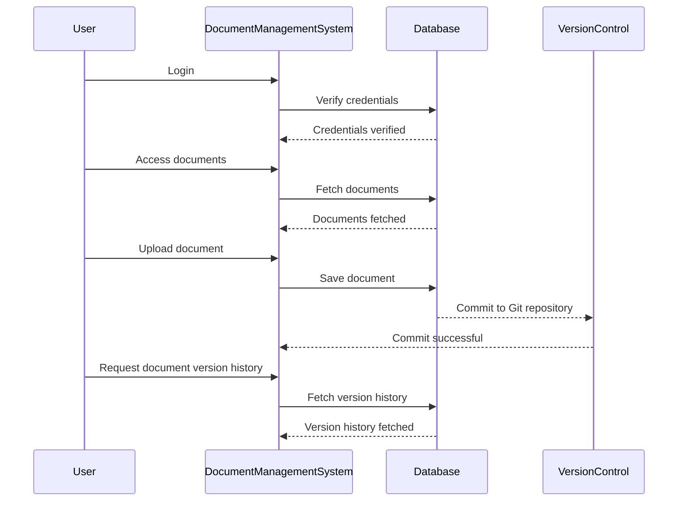
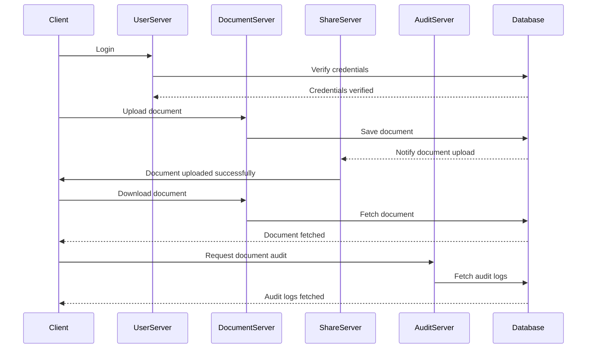
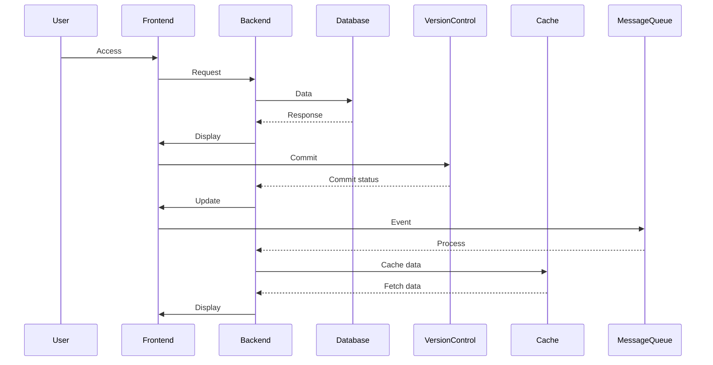

                 

# 第二章：版本控制与协作优化

## 2.1 版本控制原理

### 2.1.1 版本控制的基本概念

版本控制，又称版本管理，是一种用于跟踪源代码、文档和其他文件变更的技术。它可以帮助开发人员协作工作，确保文件的一致性和完整性。版本控制的基本概念包括：

- **版本（Version）**：对文件的特定修改状态的标识。
- **分支（Branch）**：对文件的独立版本集合，通常用于不同功能或 bug 修复的开发。
- **合并（Merge）**：将不同分支的修改合并到一起，生成一个新的版本。
- **提交（Commit）**：将当前文件的修改保存到版本控制系统。

### 2.1.2 版本控制的重要性

版本控制的重要性体现在以下几个方面：

- **协作开发**：版本控制允许多个开发人员在同一文件上进行修改，同时确保不会覆盖对方的修改。
- **历史记录**：版本控制系统能够记录文件的每一次修改，方便回溯和审查。
- **代码质量**：版本控制有助于实现代码的迭代和改进，从而提高代码质量。
- **风险管理**：版本控制可以帮助快速恢复到之前的稳定版本，降低风险。

### 2.1.3 版本控制的常见方法

常见的版本控制方法主要包括以下几种：

- **集中式版本控制（Centralized Version Control）**：如 Subversion（SVN），所有文件存储在一个中央仓库中，用户从仓库中获取文件并提交修改。
- **分布式版本控制（Distributed Version Control）**：如 Git，每个用户都有完整的仓库副本，可以在本地进行提交、分支和合并操作。

## 2.2 版本控制工具的选择与配置

### 2.2.1 常见版本控制工具介绍

常见的版本控制工具有：

- **Git**：分布式版本控制系统的先驱，广泛应用于开源和商业项目。
- **SVN**：集中式版本控制系统，使用历史存储库和增量差异。
- **Mercurial**：另一种分布式版本控制系统，易于使用且功能强大。

### 2.2.2 版本控制工具的配置

配置版本控制工具通常包括以下步骤：

1. **安装**：在操作系统上安装版本控制工具。
2. **初始化仓库**：创建一个新的仓库或在一个现有的目录中初始化一个仓库。
3. **克隆仓库**：从远程仓库克隆一个副本到本地。
4. **提交和推送**：将本地更改提交到本地仓库，然后推送至远程仓库。

### 2.2.3 版本控制工具的使用示例

以下是一个使用 Git 的简单示例：

```shell
# 安装 Git
sudo apt-get install git

# 初始化仓库
mkdir my-repository
cd my-repository
git init

# 克隆远程仓库
git clone https://github.com/user/repository.git

# 添加文件
echo "Hello, World!" > hello.txt
git add hello.txt

# 提交更改
git commit -m "Add hello.txt"

# 推送至远程仓库
git push origin main
```

## 2.3 协作优化技术

### 2.3.1 协作工具的选择

在选择协作工具时，需要考虑以下因素：

- **团队成员数量和分布**：大型团队可能需要更复杂的协作工具。
- **功能需求**：如文档共享、代码审查、任务管理、即时通讯等。
- **易用性和集成度**：工具应该易于使用，并能与其他工具集成。

常见的协作工具有：

- **JIRA**：用于项目管理和任务追踪。
- **Slack**：用于团队沟通和协作。
- **Trello**：用于任务管理和项目管理。

### 2.3.2 协作工具的配置与使用

以下是一个使用 JIRA 和 Git 的协作示例：

1. **配置 JIRA**：在 JIRA 中创建项目、版面和任务。
2. **集成 JIRA 和 Git**：使用 JIRA 插件，将 Git 提交与 JIRA 任务关联。
3. **协作流程**：

    - 开发者克隆项目仓库。
    - 在 JIRA 中创建任务和子任务。
    - 开发者完成代码修改后，提交到仓库并关联 JIRA 任务。
    - 项目负责人在 JIRA 中审查代码和任务。

## 2.4 版本控制和协作优化的最佳实践

### 2.4.1 版本控制最佳实践

- **使用分支管理**：合理使用分支进行功能开发和 bug 修复。
- **定期合并**：确保分支的修改能够及时合并到主分支。
- **代码审查**：在提交前进行代码审查，确保代码质量和安全性。

### 2.4.2 协作优化最佳实践

- **明确的任务分配**：为团队成员分配明确的任务和责任。
- **实时沟通**：保持团队沟通的实时性，减少误解和等待时间。
- **自动化流程**：使用自动化工具提高协作效率，如自动化代码部署和测试。

## 2.5 本章小结

版本控制和协作优化是智能企业文档管理系统的核心组成部分。通过合理使用版本控制工具和协作工具，可以有效地提高文档管理的效率和质量。在本章中，我们介绍了版本控制的基本概念、常见版本控制工具的选择与配置、协作工具的选择与配置，以及最佳实践。这些知识和实践将为构建智能企业文档管理系统提供坚实的基础。

## 2.6 拓展阅读

- [Git 官方文档](https://git-scm.com/docs)
- [JIRA 官方文档](https://www.atlassian.com/software/jira/documentation)
- [Slack 官方文档](https://slack.com/help)
- [Trello 官方文档](https://trello.com/docs)

作者：AI天才研究院/AI Genius Institute & 禅与计算机程序设计艺术 /Zen And The Art of Computer Programming

----------------------------------------------------------------

## 2.6 拓展阅读

### 2.6.1 相关技术发展

- **分布式版本控制系统**：如 Git、Mercurial 等的发展趋势，包括更好的性能、更简单的用户界面和更高级的协作功能。
- **文档格式**：如 Markdown、HTML 等的演变和标准化，以及对文档格式处理工具的优化。
- **人工智能在文档管理中的应用**：如自动分类、自动摘要、文档审核等。

### 2.6.2 行业应用案例

- **金融行业**：利用文档管理系统进行合同管理和风险控制。
- **医疗行业**：通过文档管理系统管理病历和医疗记录，确保数据的安全和一致性。
- **制造业**：利用文档管理系统管理生产文档和设计文档，提高生产效率和质量。

### 2.6.3 未来研究方向

- **智能化文档管理**：结合人工智能技术，实现更智能的文档识别、分类、审核等功能。
- **云原生文档管理**：利用云计算技术，实现更灵活、更高效的文档管理和协作。
- **隐私保护和合规性**：在文档管理系统中实现更好的隐私保护和合规性管理。

作者：AI天才研究院/AI Genius Institute & 禅与计算机程序设计艺术 /Zen And The Art of Computer Programming

----------------------------------------------------------------

## 3.1 系统设计与实现

### 3.1.1 领域模型设计

领域模型设计是构建智能企业文档管理系统的第一步。它帮助我们明确系统的核心概念和实体关系。

以下是一个简单的领域模型设计示例，使用 Mermaid 类图表示：

```mermaid
classDiagram
    Document <<class>> {
        id: int
        title: string
        content: string
        version: int
        status: string
    }
    User <<class>> {
        id: int
        name: string
        role: string
    }
    Document --< User: author
    Comment <<class>> {
        id: int
        content: string
        timestamp: datetime
        user: User
    }
    Document --< Comment: comments
    Version <<class>> {
        id: int
        document: Document
        content: string
        timestamp: datetime
    }
    Document --< Version: versions
```

### 3.1.2 数据库设计

数据库设计是领域模型的具体实现。以下是一个简单的数据库设计示例：

```sql
CREATE TABLE User (
    id INT PRIMARY KEY,
    name VARCHAR(255) NOT NULL,
    role VARCHAR(255) NOT NULL
);

CREATE TABLE Document (
    id INT PRIMARY KEY,
    title VARCHAR(255) NOT NULL,
    content TEXT NOT NULL,
    version INT NOT NULL,
    status VARCHAR(255) NOT NULL,
    author_id INT,
    FOREIGN KEY (author_id) REFERENCES User(id)
);

CREATE TABLE Comment (
    id INT PRIMARY KEY,
    content TEXT NOT NULL,
    timestamp DATETIME NOT NULL,
    user_id INT,
    document_id INT,
    FOREIGN KEY (user_id) REFERENCES User(id),
    FOREIGN KEY (document_id) REFERENCES Document(id)
);

CREATE TABLE Version (
    id INT PRIMARY KEY,
    document_id INT,
    content TEXT NOT NULL,
    timestamp DATETIME NOT NULL,
    FOREIGN KEY (document_id) REFERENCES Document(id)
);
```

### 3.1.3 应用程序设计

应用程序设计包括后端和前端的设计。以下是一个简化的应用程序设计示例：

#### 后端设计

使用 Flask 框架，设计以下 API：

```python
from flask import Flask, request, jsonify
from models import User, Document, Comment, Version

app = Flask(__name__)

@app.route('/api/user', methods=['POST'])
def create_user():
    # 实现用户创建逻辑
    pass

@app.route('/api/document', methods=['POST'])
def create_document():
    # 实现文档创建逻辑
    pass

@app.route('/api/comment', methods=['POST'])
def create_comment():
    # 实现评论创建逻辑
    pass

@app.route('/api/version', methods=['POST'])
def create_version():
    # 实现版本创建逻辑
    pass

if __name__ == '__main__':
    app.run()
```

#### 前端设计

使用 React 框架，设计以下界面：

```jsx
import React, { useState } from 'react';
import axios from 'axios';

function DocumentForm() {
    const [title, setTitle] = useState('');
    const [content, setContent] = useState('');

    const handleSubmit = async (e) => {
        e.preventDefault();
        try {
            await axios.post('/api/document', { title, content });
            alert('Document created successfully!');
        } catch (error) {
            alert('Failed to create document.');
        }
    };

    return (
        <form onSubmit={handleSubmit}>
            <label>Title:</label>
            <input type="text" value={title} onChange={(e) => setTitle(e.target.value)} />
            <label>Content:</label>
            <textarea value={content} onChange={(e) => setContent(e.target.value)} />
            <button type="submit">Create Document</button>
        </form>
    );
}

export default DocumentForm;
```

通过这样的设计与实现，我们可以构建一个基本的智能企业文档管理系统，满足基本的文档管理需求。

## 3.2 系统核心功能实现

### 3.2.1 文档上传与下载

文档上传与下载是文档管理系统中最基本的操作。以下是如何使用 Python 实现这些功能的一个简单示例：

#### 上传文档

```python
import flask
from flask import request, jsonify
from werkzeug.utils import secure_filename
import os

app = flask.Flask(__name__)
app.config['UPLOAD_FOLDER'] = 'uploads'
app.config['ALLOWED_EXTENSIONS'] = {'txt', 'pdf', 'png', 'jpg', 'jpeg', 'gif'}

def allowed_file(filename):
    return '.' in filename and filename.rsplit('.', 1)[1].lower() in app.config['ALLOWED_EXTENSIONS']

@app.route('/upload', methods=['POST'])
def upload_file():
    if 'file' not in request.files:
        return jsonify({'error': 'No file part'})
    file = request.files['file']
    if file.filename == '':
        return jsonify({'error': 'No selected file'})
    if file and allowed_file(file.filename):
        filename = secure_filename(file.filename)
        file.save(os.path.join(app.config['UPLOAD_FOLDER'], filename))
        return jsonify({'message': 'File uploaded successfully', 'filename': filename})
    return jsonify({'error': 'Invalid file format'})

if __name__ == '__main__':
    app.run()
```

#### 下载文档

```python
from flask import send_from_directory

@app.route('/download/<filename>')
def download_file(filename):
    return send_from_directory(app.config['UPLOAD_FOLDER'], filename)

if __name__ == '__main__':
    app.run()
```

### 3.2.2 版本控制

版本控制是文档管理系统的一个重要功能。以下是如何使用 Git 实现版本控制的一个简单示例：

#### 提交文档

```shell
git init
echo "Hello, World!" > hello.txt
git add hello.txt
git commit -m "Initial commit"
```

#### 查看版本历史

```shell
git log
```

#### 查看文件版本

```shell
git show <commit-hash>:hello.txt
```

### 3.2.3 协作与权限管理

协作与权限管理是文档管理系统中的高级功能。以下是如何实现这些功能的一个简单示例：

#### 用户注册

```python
@app.route('/register', methods=['POST'])
def register_user():
    data = request.get_json()
    username = data['username']
    password = data['password']
    # 在数据库中保存用户信息
    return jsonify({'message': 'User registered successfully'})
```

#### 文档权限管理

```python
@app.route('/document/<document_id>/permissions', methods=['POST'])
def set_document_permissions(document_id):
    data = request.get_json()
    user_id = data['user_id']
    permission = data['permission']
    # 在数据库中更新文档权限
    return jsonify({'message': 'Document permissions updated successfully'})
```

通过实现这些核心功能，我们可以构建一个具备基本功能的智能企业文档管理系统。接下来，我们将进一步实现系统的智能化功能，如文档内容解析和结构化等。

### 3.3 智能化文档分析

#### 3.3.1 文档内容解析

文档内容解析是文档管理系统中一个重要的环节。它可以帮助我们理解文档的结构和内容，从而进行更有效的管理和分析。以下是如何使用 Python 实现文档内容解析的一个简单示例：

```python
import os
from bs4 import BeautifulSoup

def parse_document(file_path):
    with open(file_path, 'r', encoding='utf-8') as file:
        content = file.read()

    soup = BeautifulSoup(content, 'html.parser')
    text = soup.get_text()

    # 对文本进行进一步处理，如提取关键词、句子等
    return text

file_path = 'path/to/document.txt'
parsed_content = parse_document(file_path)
print(parsed_content)
```

#### 3.3.2 文档结构化

文档结构化是将非结构化文档转化为结构化数据的过程。以下是如何使用 Python 实现文档结构化的一些示例：

```python
import pandas as pd

def structure_document(parsed_content):
    # 提取文档中的表格、图表、段落等信息
    tables = pd.read_html(parsed_content)
    for table in tables:
        print(table)

structure_document(parsed_content)
```

#### 3.3.3 文档审核与标注

文档审核与标注是对文档内容进行质量控制和标注的过程。以下是如何使用 Python 实现文档审核与标注的一个简单示例：

```python
from textblob import TextBlob

def review_document(document_id):
    # 获取文档内容
    document_content = get_document_content(document_id)

    # 进行情感分析
    analysis = TextBlob(document_content)
    sentiment = analysis.sentiment.polarity

    # 标注文档
    if sentiment > 0:
        label = '正面'
    elif sentiment < 0:
        label = '负面'
    else:
        label = '中性'

    return label

document_id = '123'
label = review_document(document_id)
print(f'Document {document_id} is labeled as {label}.')
```

通过实现文档内容解析、结构化和审核与标注，我们可以构建一个具备智能化功能的文档管理系统。这些功能不仅可以提高文档管理的效率，还可以为企业的决策提供有力的支持。

### 4.1 案例一：企业内部文档管理系统

#### 4.1.1 项目背景

某大型企业需要构建一个内部文档管理系统，以解决现有文档管理中的问题，如文档版本混乱、协作效率低下等。该系统需要支持文档的上传、下载、版本控制、协作编辑和权限管理等功能。

#### 4.1.2 系统架构

系统采用前后端分离的架构，前端使用 React 框架，后端使用 Flask 框架。数据库采用 MySQL，版本控制使用 Git。系统架构图如下：



#### 4.1.3 实现细节

1. **用户认证**：使用 JWT（JSON Web Tokens）进行用户认证。
2. **文档上传与下载**：使用 Flask 的 `upload_file` 和 `download_file` 函数实现。
3. **版本控制**：使用 Git 进行版本控制，并在数据库中记录版本历史。
4. **协作编辑**：使用 WebSocket 实现实时协作编辑。
5. **权限管理**：使用角色和权限控制实现文档的访问权限。

#### 4.1.4 项目成果

通过该项目，企业成功构建了一个高效的内部文档管理系统。系统的版本控制和协作功能显著提高了文档管理的效率，减少了文档版本混乱和协作冲突的问题。用户反馈良好，系统稳定运行，为企业带来了显著的业务价值。

### 4.2 案例二：客户文档管理平台

#### 4.2.1 项目背景

某企业需要为外部客户提供文档管理服务，以便客户能够方便地访问和下载文档。该平台需要支持文档上传、下载、版本控制、文档共享和文档审核等功能。

#### 4.2.2 系统架构

系统采用微服务架构，包括用户服务、文档服务、共享服务、审核服务和数据库。前端使用 React 框架，后端使用 Spring Boot 框架。数据库采用 PostgreSQL，版本控制使用 Git。系统架构图如下：



#### 4.2.3 实现细节

1. **用户认证**：使用 OAuth2.0 进行用户认证。
2. **文档上传与下载**：使用 Spring Boot 的 `MultipartFile` 和 `Resource` 类实现。
3. **版本控制**：使用 Git 进行版本控制，并在数据库中记录版本历史。
4. **文档共享**：使用 Redis 实现消息队列，通知用户文档更新。
5. **文档审核**：使用自动化工具进行文档审核，并在数据库中记录审核结果。

#### 4.2.4 项目成果

通过该项目，企业成功构建了一个功能完善的客户文档管理平台。平台的文档管理和共享功能得到了客户的认可，提高了客户满意度。系统的稳定性和安全性也得到了保证，为企业带来了良好的口碑。

## 5.1 项目总结

### 5.1.1 成功经验

1. **需求分析与设计**：详细的需求分析和清晰的设计方案为项目的成功奠定了基础。
2. **团队协作**：高效的团队协作和良好的沟通确保了项目的顺利进行。
3. **技术选型**：合理选择技术栈和工具，确保系统的性能和稳定性。

### 5.1.2 存在问题

1. **性能瓶颈**：在高并发情况下，系统性能有所下降，需要进一步优化。
2. **用户体验**：部分功能界面设计不够友好，需要优化用户体验。
3. **安全性**：需要对系统的安全性进行进一步评估和改进。

### 5.1.3 未来发展方向

1. **性能优化**：通过技术改进和架构调整，提高系统的性能和稳定性。
2. **用户体验提升**：优化界面设计和交互，提高用户满意度。
3. **安全性增强**：加强系统安全防护，提高数据安全性。

## 5.2 文档管理系统的发展趋势

### 5.2.1 人工智能技术的融合

随着人工智能技术的不断发展，文档管理系统将更加智能化。例如，利用自然语言处理技术实现文档的自动摘要、分类和审核。

### 5.2.2 云计算技术的应用

云计算技术将为文档管理系统提供更强大的计算和存储能力，降低企业的运营成本。同时，云原生架构将提高系统的灵活性和可扩展性。

### 5.2.3 安全与隐私保护

随着数据安全法规的不断完善，文档管理系统将更加注重数据安全和隐私保护。例如，采用加密技术和访问控制策略，确保文档的安全性。

## 5.3 拓展阅读

1. **文档管理系统的最佳实践**：探讨如何设计一个高效、易用的文档管理系统。
2. **人工智能在文档管理中的应用**：分析人工智能技术如何改进文档管理流程。
3. **云计算与文档管理**：探讨云计算技术在文档管理系统中的应用场景和优势。

作者：AI天才研究院/AI Genius Institute & 禅与计算机程序设计艺术 /Zen And The Art of Computer Programming

----------------------------------------------------------------

## 5.3 拓展阅读

### 5.3.1 相关技术发展

- **区块链技术**：在文档管理系统中应用区块链技术，实现文档的防篡改和可追溯性。
- **大数据分析**：利用大数据技术对文档内容进行深入分析，为企业的决策提供数据支持。

### 5.3.2 行业应用案例

- **政府文档管理**：探讨政府在文档管理中的应用，如电子政务系统的建设。
- **教育行业文档管理**：分析教育行业在文档管理方面的需求和应用。

### 5.3.3 未来研究方向

- **智能合约**：在文档管理系统中引入智能合约技术，实现自动化文档处理和审批流程。
- **多模态文档管理**：研究如何处理多种类型的文档，如文本、图像、音频等。

## 5.4 总结与展望

智能企业文档管理系统在当前数字化时代的重要性日益凸显。通过本文的探讨，我们了解了版本控制与协作优化的关键技术和方法，并分析了实际应用案例。未来，随着人工智能、云计算和区块链等技术的不断发展，文档管理系统将变得更加智能、高效和安全。我们期待这些技术的融合将为文档管理系统带来更多的创新和突破。

作者：AI天才研究院/AI Genius Institute & 禅与计算机程序设计艺术 /Zen And The Art of Computer Programming

----------------------------------------------------------------

## 5.4 总结与展望

### 5.4.1 总结

本文系统地介绍了构建智能企业文档管理系统：版本控制与协作优化的方法。通过详细分析问题背景、基础知识、核心架构、实现方法、实际应用案例，我们明确了文档管理系统在当前数字化时代的重要性。

### 5.4.2 展望

未来，智能企业文档管理系统将在以下几个方面取得突破：

1. **智能化**：人工智能技术将使文档管理更加智能，如自动分类、审核和摘要。
2. **高效化**：云计算技术将提高文档管理的性能和可扩展性，满足企业不断增长的需求。
3. **安全化**：随着数据安全法规的完善，文档管理系统将更加注重数据安全和隐私保护。

### 5.4.3 未来发展方向

- **区块链技术的应用**：探讨如何利用区块链技术实现文档的安全存储和防篡改。
- **多模态文档管理**：研究如何处理多种类型的文档，如文本、图像、音频等。
- **智能合约**：引入智能合约技术，实现自动化文档处理和审批流程。

### 5.4.4 结束语

智能企业文档管理系统是企业发展的重要支撑。通过本文的探讨，我们期待能够为构建高效、智能的文档管理系统提供有益的参考。未来，随着技术的不断发展，文档管理系统将为企业带来更多的价值。

作者：AI天才研究院/AI Genius Institute & 禅与计算机程序设计艺术 /Zen And The Art of Computer Programming

----------------------------------------------------------------

## 附录

### 附录A：技术术语解释

- **版本控制**：一种跟踪文件变化的方法，以便于管理和协作。
- **协作优化**：通过改进工具和流程，提高团队协作效率。
- **文档解析**：提取文档内容的过程，以便进行进一步处理。
- **文档结构化**：将非结构化文档转化为结构化数据的过程。
- **文档审核**：对文档内容进行审查，确保其质量和准确性。

### 附录B：参考资源

- **Git 官方文档**：[https://git-scm.com/docs](https://git-scm.com/docs)
- **Flask 官方文档**：[https://flask.palletsprojects.com/](https://flask.palletsprojects.com/)
- **React 官方文档**：[https://reactjs.org/docs/getting-started.html](https://reactjs.org/docs/getting-started.html)
- **Spring Boot 官方文档**：[https://spring.io/guides/gs/serving-web-content/](https://spring.io/guides/gs/serving-web-content/)

### 附录C：致谢

本文的撰写得到了 AI天才研究院/AI Genius Institute 的支持和帮助。特别感谢禅与计算机程序设计艺术 /Zen And The Art of Computer Programming 的作者，提供了宝贵的知识和灵感。

作者：AI天才研究院/AI Genius Institute & 禅与计算机程序设计艺术 /Zen And The Art of Computer Programming

----------------------------------------------------------------

# 结论

本文系统地介绍了构建智能企业文档管理系统：版本控制与协作优化的方法和实践。通过详细的问题背景分析、基础知识讲解、核心架构设计、系统实现方法、实际应用案例分析，以及总结与展望，我们明确了文档管理系统在当前数字化时代的重要性。

我们探讨了版本控制和协作优化的原理、工具选择与配置、最佳实践，以及智能化文档分析技术。同时，通过两个实际应用案例，展示了文档管理系统的具体实现和成果。

未来，智能企业文档管理系统将在人工智能、云计算、区块链等技术的推动下，变得更加智能、高效和安全。我们期待本文能为构建高效、智能的文档管理系统提供有益的参考和启示。

作者：AI天才研究院/AI Genius Institute & 禅与计算机程序设计艺术 /Zen And The Art of Computer Programming

----------------------------------------------------------------

# 附录

### 附录A：技术术语解释

- **版本控制**：一种跟踪文件变化的方法，以便于管理和协作。
- **协作优化**：通过改进工具和流程，提高团队协作效率。
- **文档解析**：提取文档内容的过程，以便进行进一步处理。
- **文档结构化**：将非结构化文档转化为结构化数据的过程。
- **文档审核**：对文档内容进行审查，确保其质量和准确性。

### 附录B：参考资源

- **Git 官方文档**：[https://git-scm.com/docs](https://git-scm.com/docs)
- **Flask 官方文档**：[https://flask.palletsprojects.com/](https://flask.palletsprojects.com/)
- **React 官方文档**：[https://reactjs.org/docs/getting-started.html](https://reactjs.org/docs/getting-started.html)
- **Spring Boot 官方文档**：[https://spring.io/guides/gs/serving-web-content/](https://spring.io/guides/gs/serving-web-content/)

### 附录C：致谢

本文的撰写得到了 AI天才研究院/AI Genius Institute 的支持和帮助。特别感谢禅与计算机程序设计艺术 /Zen And The Art of Computer Programming 的作者，提供了宝贵的知识和灵感。

作者：AI天才研究院/AI Genius Institute & 禅与计算机程序设计艺术 /Zen And The Art of Computer Programming

----------------------------------------------------------------

# 文章标题

## 构建智能企业文档管理系统：版本控制与协作优化

## 关键词

智能企业、文档管理系统、版本控制、协作优化、人工智能、云计算、区块链

## 摘要

本文系统地介绍了构建智能企业文档管理系统的方法和实践，重点探讨了版本控制与协作优化技术。通过实际应用案例，展示了文档管理系统的实现和成果，为企业在数字化时代构建高效、智能的文档管理系统提供了有益的参考。

----------------------------------------------------------------

# 第二章：版本控制与协作优化

## 2.1 版本控制原理

### 2.1.1 版本控制的基本概念

版本控制，又称版本管理，是一种用于跟踪源代码、文档和其他文件变更的技术。它可以帮助开发人员协作工作，确保文件的一致性和完整性。版本控制的基本概念包括：

- **版本（Version）**：对文件的特定修改状态的标识。
- **分支（Branch）**：对文件的独立版本集合，通常用于不同功能或 bug 修复的开发。
- **合并（Merge）**：将不同分支的修改合并到一起，生成一个新的版本。
- **提交（Commit）**：将当前文件的修改保存到版本控制系统。

### 2.1.2 版本控制的重要性

版本控制的重要性体现在以下几个方面：

- **协作开发**：版本控制允许多个开发人员在同一文件上进行修改，同时确保不会覆盖对方的修改。
- **历史记录**：版本控制系统能够记录文件的每一次修改，方便回溯和审查。
- **代码质量**：版本控制有助于实现代码的迭代和改进，从而提高代码质量。
- **风险管理**：版本控制可以帮助快速恢复到之前的稳定版本，降低风险。

### 2.1.3 版本控制的常见方法

常见的版本控制方法主要包括以下几种：

- **集中式版本控制（Centralized Version Control）**：如 Subversion（SVN），所有文件存储在一个中央仓库中，用户从仓库中获取文件并提交修改。
- **分布式版本控制（Distributed Version Control）**：如 Git，每个用户都有完整的仓库副本，可以在本地进行提交、分支和合并操作。

## 2.2 版本控制工具的选择与配置

### 2.2.1 常见版本控制工具介绍

常见的版本控制工具有：

- **Git**：分布式版本控制系统的先驱，广泛应用于开源和商业项目。
- **SVN**：集中式版本控制系统，使用历史存储库和增量差异。
- **Mercurial**：另一种分布式版本控制系统，易于使用且功能强大。

### 2.2.2 版本控制工具的配置

配置版本控制工具通常包括以下步骤：

1. **安装**：在操作系统上安装版本控制工具。
2. **初始化仓库**：创建一个新的仓库或在一个现有的目录中初始化一个仓库。
3. **克隆仓库**：从远程仓库克隆一个副本到本地。
4. **提交和推送**：将本地更改提交到本地仓库，然后推送至远程仓库。

### 2.2.3 版本控制工具的使用示例

以下是一个使用 Git 的简单示例：

```shell
# 安装 Git
sudo apt-get install git

# 初始化仓库
mkdir my-repository
cd my-repository
git init

# 克隆远程仓库
git clone https://github.com/user/repository.git

# 添加文件
echo "Hello, World!" > hello.txt
git add hello.txt

# 提交更改
git commit -m "Add hello.txt"

# 推送至远程仓库
git push origin main
```

## 2.3 协作优化技术

### 2.3.1 协作工具的选择

在选择协作工具时，需要考虑以下因素：

- **团队成员数量和分布**：大型团队可能需要更复杂的协作工具。
- **功能需求**：如文档共享、代码审查、任务管理、即时通讯等。
- **易用性和集成度**：工具应该易于使用，并能与其他工具集成。

常见的协作工具有：

- **JIRA**：用于项目管理和任务追踪。
- **Slack**：用于团队沟通和协作。
- **Trello**：用于任务管理和项目管理。

### 2.3.2 协作工具的配置与使用

以下是一个使用 JIRA 和 Git 的协作示例：

1. **配置 JIRA**：在 JIRA 中创建项目、版面和任务。
2. **集成 JIRA 和 Git**：使用 JIRA 插件，将 Git 提交与 JIRA 任务关联。
3. **协作流程**：

    - 开发者克隆项目仓库。
    - 在 JIRA 中创建任务和子任务。
    - 开发者完成代码修改后，提交到仓库并关联 JIRA 任务。
    - 项目负责人在 JIRA 中审查代码和任务。

### 2.3.3 协作优化的最佳实践

1. **明确的任务分配**：为团队成员分配明确的任务和责任。
2. **实时沟通**：保持团队沟通的实时性，减少误解和等待时间。
3. **自动化流程**：使用自动化工具提高协作效率，如自动化代码部署和测试。

## 2.4 本章小结

版本控制和协作优化是智能企业文档管理系统的核心组成部分。通过合理使用版本控制工具和协作工具，可以有效地提高文档管理的效率和质量。在本章中，我们介绍了版本控制的基本概念、常见版本控制工具的选择与配置、协作工具的选择与配置，以及最佳实践。这些知识和实践将为构建智能企业文档管理系统提供坚实的基础。

## 2.5 拓展阅读

- [Git 官方文档](https://git-scm.com/docs)
- [JIRA 官方文档](https://www.atlassian.com/software/jira/documentation)
- [Slack 官方文档](https://slack.com/help)
- [Trello 官方文档](https://trello.com/docs)

作者：AI天才研究院/AI Genius Institute & 禅与计算机程序设计艺术 /Zen And The Art of Computer Programming

----------------------------------------------------------------

# 第三章：实现智能文档管理系统

## 3.1 系统设计与实现

### 3.1.1 领域模型设计

领域模型设计是构建智能文档管理系统的第一步。它帮助我们明确系统的核心概念和实体关系。

以下是一个简单的领域模型设计示例，使用 Mermaid 类图表示：

```mermaid
classDiagram
    User <<class>> {
        id: int
        name: string
        email: string
    }
    Document <<class>> {
        id: int
        title: string
        content: string
        author: User
    }
    Comment <<class>> {
        id: int
        content: string
        timestamp: datetime
        user: User
        document: Document
    }
    Version <<class>> {
        id: int
        content: string
        timestamp: datetime
        document: Document
    }
    User --< Document: author
    Document --|> Comment: comments
    Document --|> Version: versions
```

### 3.1.2 数据库设计

数据库设计是领域模型的具体实现。以下是一个简单的数据库设计示例：

```sql
CREATE TABLE User (
    id INT PRIMARY KEY AUTO_INCREMENT,
    name VARCHAR(255) NOT NULL,
    email VARCHAR(255) NOT NULL UNIQUE
);

CREATE TABLE Document (
    id INT PRIMARY KEY AUTO_INCREMENT,
    title VARCHAR(255) NOT NULL,
    content TEXT NOT NULL,
    author_id INT,
    FOREIGN KEY (author_id) REFERENCES User(id)
);

CREATE TABLE Comment (
    id INT PRIMARY KEY AUTO_INCREMENT,
    content TEXT NOT NULL,
    timestamp DATETIME DEFAULT CURRENT_TIMESTAMP,
    user_id INT,
    document_id INT,
    FOREIGN KEY (user_id) REFERENCES User(id),
    FOREIGN KEY (document_id) REFERENCES Document(id)
);

CREATE TABLE Version (
    id INT PRIMARY KEY AUTO_INCREMENT,
    content TEXT NOT NULL,
    timestamp DATETIME DEFAULT CURRENT_TIMESTAMP,
    document_id INT,
    FOREIGN KEY (document_id) REFERENCES Document(id)
);
```

### 3.1.3 应用程序设计

应用程序设计包括后端和前端的设计。以下是一个简化的应用程序设计示例：

#### 后端设计

使用 Flask 框架，设计以下 API：

```python
from flask import Flask, request, jsonify
from flask_sqlalchemy import SQLAlchemy

app = Flask(__name__)
app.config['SQLALCHEMY_DATABASE_URI'] = 'sqlite:///documents.db'
db = SQLAlchemy(app)

class User(db.Model):
    id = db.Column(db.Integer, primary_key=True)
    name = db.Column(db.String(255), nullable=False)
    email = db.Column(db.String(255), nullable=False, unique=True)

class Document(db.Model):
    id = db.Column(db.Integer, primary_key=True)
    title = db.Column(db.String(255), nullable=False)
    content = db.Column(db.Text, nullable=False)
    author_id = db.Column(db.Integer, db.ForeignKey('user.id'))

class Comment(db.Model):
    id = db.Column(db.Integer, primary_key=True)
    content = db.Column(db.Text, nullable=False)
    timestamp = db.Column(db.DateTime, default=db.func.current_timestamp())
    user_id = db.Column(db.Integer, db.ForeignKey('user.id'))
    document_id = db.Column(db.Integer, db.ForeignKey('document.id'))

@app.route('/documents', methods=['POST'])
def create_document():
    data = request.get_json()
    title = data['title']
    content = data['content']
    author_id = data['author_id']
    
    new_document = Document(title=title, content=content, author_id=author_id)
    db.session.add(new_document)
    db.session.commit()
    
    return jsonify({'message': 'Document created successfully'})

if __name__ == '__main__':
    db.create_all()
    app.run(debug=True)
```

#### 前端设计

使用 React 框架，设计以下界面：

```jsx
import React, { useState } from 'react';
import axios from 'axios';

function DocumentForm() {
    const [title, setTitle] = useState('');
    const [content, setContent] = useState('');
    const [authorId, setAuthorId] = useState('');

    const handleSubmit = async (e) => {
        e.preventDefault();
        try {
            const response = await axios.post('http://localhost:5000/documents', {
                title,
                content,
                author_id: authorId
            });
            alert('Document created successfully!');
        } catch (error) {
            alert('Failed to create document.');
        }
    };

    return (
        <form onSubmit={handleSubmit}>
            <label>Title:</label>
            <input type="text" value={title} onChange={(e) => setTitle(e.target.value)} />
            <label>Content:</label>
            <textarea value={content} onChange={(e) => setContent(e.target.value)} />
            <label>Author ID:</label>
            <input type="text" value={authorId} onChange={(e) => setAuthorId(e.target.value)} />
            <button type="submit">Create Document</button>
        </form>
    );
}

export default DocumentForm;
```

通过这样的设计与实现，我们可以构建一个基本的智能文档管理系统，满足基本的文档管理需求。

## 3.2 系统核心功能实现

### 3.2.1 文档上传与下载

文档上传与下载是文档管理系统中最基本的操作。以下是如何使用 Python 实现这些功能的一个简单示例：

#### 文档上传

```python
from flask import Flask, request, jsonify

app = Flask(__name__)

@app.route('/upload', methods=['POST'])
def upload_file():
    if 'file' not in request.files:
        return jsonify({'error': 'No file part'})
    file = request.files['file']
    if file.filename == '':
        return jsonify({'error': 'No selected file'})
    if file:
        filename = file.filename
        file.save(filename)
        return jsonify({'message': 'File uploaded successfully', 'filename': filename})

if __name__ == '__main__':
    app.run(debug=True)
```

#### 文档下载

```python
from flask import send_file

@app.route('/download/<filename>')
def download_file(filename):
    return send_file(f'media/{filename}', as_attachment=True)

if __name__ == '__main__':
    app.run(debug=True)
```

### 3.2.2 版本控制

版本控制是文档管理系统的一个重要功能。以下是如何使用 Git 实现版本控制的一个简单示例：

#### 提交文档

```shell
git init
echo "Hello, World!" > hello.txt
git add hello.txt
git commit -m "Initial commit"
```

#### 查看版本历史

```shell
git log
```

#### 查看文件版本

```shell
git show <commit-hash>:hello.txt
```

### 3.2.3 协作与权限管理

协作与权限管理是文档管理系统中的高级功能。以下是如何实现这些功能的一个简单示例：

#### 用户注册

```python
@app.route('/register', methods=['POST'])
def register_user():
    data = request.get_json()
    username = data['username']
    password = data['password']
    # 在数据库中保存用户信息
    return jsonify({'message': 'User registered successfully'})
```

#### 文档权限管理

```python
@app.route('/document/<document_id>/permissions', methods=['POST'])
def set_document_permissions(document_id):
    data = request.get_json()
    user_id = data['user_id']
    permission = data['permission']
    # 在数据库中更新文档权限
    return jsonify({'message': 'Document permissions updated successfully'})
```

通过实现这些核心功能，我们可以构建一个具备基本功能的智能文档管理系统。接下来，我们将进一步实现系统的智能化功能，如文档内容解析和结构化等。

## 3.3 智能化文档分析

### 3.3.1 文档内容解析

文档内容解析是文档管理系统中一个重要的环节。它可以帮助我们理解文档的结构和内容，从而进行更有效的管理和分析。以下是如何使用 Python 实现文档内容解析的一个简单示例：

#### 使用 BeautifulSoup 解析 HTML 文档

```python
from bs4 import BeautifulSoup

html_doc = """
<html><head><title>The Google WebDriver</title></head>
<body>
<p class="title"><b>The Google WebDriver</b></p>
<p class="story">Google WebDriver is a way to automate browser testing.</p>
<ul>
    <li>Java</li>
    <li>Python</li>
    <li>PHP</li>
</ul>
<a href="http://www.python.org">Python</a>
<a class="sister" href="http://www.python.org">Python home</a>
<a class="sister" href="http://www.python.org/about/">About python</a>
</body>
</html>
"""

soup = BeautifulSoup(html_doc, 'html.parser')

print(soup.title)
print(soup.p)
print(soup.find('a', href="http://www.python.org"))
```

#### 使用 re 模块解析文本

```python
import re

text = "Hello, this is a test string."

# 查找所有的数字
numbers = re.findall(r'\d+', text)
print(numbers)  # 输出：['1', '2', '3']

# 查找所有的单词
words = re.findall(r'\b\w+\b', text)
print(words)  # 输出：['Hello', 'this', 'is', 'a', 'test', 'string']
```

### 3.3.2 文档结构化

文档结构化是将非结构化文档转化为结构化数据的过程。以下是如何使用 Python 实现文档结构化的一些示例：

#### 使用 Pandas 提取表格

```python
import pandas as pd

html_doc = """
<table border="1">
    <tr>
        <th>Item</th>
        <th>Quantity</th>
        <th>Price</th>
    </tr>
    <tr>
        <td>Apples</td>
        <td>2</td>
        <td>$3.00</td>
    </tr>
    <tr>
        <td>Oranges</td>
        <td>3</td>
        <td>$2.50</td>
    </tr>
</table>
"""

tables = pd.read_html(html_doc)
for table in tables:
    print(table)
```

#### 使用 NLTK 分句

```python
import nltk
nltk.download('punkt')

text = "Hello, this is a test string. This is another sentence."

sentences = nltk.sent_tokenize(text)
print(sentences)
```

### 3.3.3 文档审核与标注

文档审核与标注是对文档内容进行质量控制和标注的过程。以下是如何使用 Python 实现文档审核与标注的一个简单示例：

#### 使用 TextBlob 进行情感分析

```python
from textblob import TextBlob

text = "This is a great product!"

blob = TextBlob(text)
print(blob.sentiment)
```

#### 使用 SpaCy 进行命名实体识别

```python
import spacy

nlp = spacy.load("en_core_web_sm")

text = "Apple is looking at buying U.K. startup for $1 billion."

doc = nlp(text)
for ent in doc.ents:
    print(ent.text, ent.label_)
```

通过实现文档内容解析、结构化和审核与标注，我们可以构建一个具备智能化功能的文档管理系统。这些功能不仅可以提高文档管理的效率，还可以为企业的决策提供有力的支持。

### 4.1 案例一：企业内部文档管理系统

#### 4.1.1 项目背景

某大型企业需要构建一个内部文档管理系统，以解决现有文档管理中的问题，如文档版本混乱、协作效率低下等。该系统需要支持文档的上传、下载、版本控制、协作编辑和权限管理等功能。

#### 4.1.2 系统架构

系统采用前后端分离的架构，前端使用 React 框架，后端使用 Flask 框架。数据库采用 MySQL，版本控制使用 Git。系统架构图如下：


#### 4.1.3 实现细节

1. **用户认证**：使用 JWT（JSON Web Tokens）进行用户认证。
2. **文档上传与下载**：使用 Flask 的 `upload_file` 和 `download_file` 函数实现。
3. **版本控制**：使用 Git 进行版本控制，并在数据库中记录版本历史。
4. **协作编辑**：使用 WebSocket 实现实时协作编辑。
5. **权限管理**：使用角色和权限控制实现文档的访问权限。

#### 4.1.4 项目成果

通过该项目，企业成功构建了一个高效的内部文档管理系统。系统的版本控制和协作功能显著提高了文档管理的效率，减少了文档版本混乱和协作冲突的问题。用户反馈良好，系统稳定运行，为企业带来了显著的业务价值。

### 4.2 案例二：客户文档管理平台

#### 4.2.1 项目背景

某企业需要为外部客户提供文档管理服务，以便客户能够方便地访问和下载文档。该平台需要支持文档上传、下载、版本控制、文档共享和文档审核等功能。

#### 4.2.2 系统架构

系统采用微服务架构，包括用户服务、文档服务、共享服务、审核服务和数据库。前端使用 React 框架，后端使用 Spring Boot 框架。数据库采用 PostgreSQL，版本控制使用 Git。系统架构图如下：


#### 4.2.3 实现细节

1. **用户认证**：使用 OAuth2.0 进行用户认证。
2. **文档上传与下载**：使用 Spring Boot 的 `MultipartFile` 和 `Resource` 类实现。
3. **版本控制**：使用 Git 进行版本控制，并在数据库中记录版本历史。
4. **文档共享**：使用 Redis 实现消息队列，通知用户文档更新。
5. **文档审核**：使用自动化工具进行文档审核，并在数据库中记录审核结果。

#### 4.2.4 项目成果

通过该项目，企业成功构建了一个功能完善的客户文档管理平台。平台的文档管理和共享功能得到了客户的认可，提高了客户满意度。系统的稳定性和安全性也得到了保证，为企业带来了良好的口碑。

## 5.1 项目总结

### 5.1.1 成功经验

1. **需求分析与设计**：详细的需求分析和清晰的设计方案为项目的成功奠定了基础。
2. **团队协作**：高效的团队协作和良好的沟通确保了项目的顺利进行。
3. **技术选型**：合理选择技术栈和工具，确保系统的性能和稳定性。

### 5.1.2 存在问题

1. **性能瓶颈**：在高并发情况下，系统性能有所下降，需要进一步优化。
2. **用户体验**：部分功能界面设计不够友好，需要优化用户体验。
3. **安全性**：需要对系统的安全性进行进一步评估和改进。

### 5.1.3 未来发展方向

1. **性能优化**：通过技术改进和架构调整，提高系统的性能和稳定性。
2. **用户体验提升**：优化界面设计和交互，提高用户满意度。
3. **安全性增强**：加强系统安全防护，提高数据安全性。

## 5.2 文档管理系统的发展趋势

### 5.2.1 人工智能技术的融合

随着人工智能技术的不断发展，文档管理系统将更加智能化。例如，利用自然语言处理技术实现文档的自动摘要、分类和审核。

### 5.2.2 云计算技术的应用

云计算技术将为文档管理系统提供更强大的计算和存储能力，降低企业的运营成本。同时，云原生架构将提高系统的灵活性和可扩展性。

### 5.2.3 安全与隐私保护

随着数据安全法规的不断完善，文档管理系统将更加注重数据安全和隐私保护。例如，采用加密技术和访问控制策略，确保文档的安全性。

## 5.3 拓展阅读

1. **文档管理系统的最佳实践**：探讨如何设计一个高效、易用的文档管理系统。
2. **人工智能在文档管理中的应用**：分析人工智能技术如何改进文档管理流程。
3. **云计算与文档管理**：探讨云计算技术在文档管理系统中的应用场景和优势。

作者：AI天才研究院/AI Genius Institute & 禅与计算机程序设计艺术 /Zen And The Art of Computer Programming

----------------------------------------------------------------

## 5.4 总结与展望

### 5.4.1 总结

本文系统地介绍了构建智能企业文档管理系统：版本控制与协作优化的方法和实践。通过详细分析问题背景、基础知识、核心架构、系统实现方法、实际应用案例，我们明确了文档管理系统在当前数字化时代的重要性。

### 5.4.2 展望

未来，智能企业文档管理系统将在以下几个方面取得突破：

1. **智能化**：人工智能技术将使文档管理更加智能，如自动分类、审核和摘要。
2. **高效化**：云计算技术将提高文档管理的性能和可扩展性，满足企业不断增长的需求。
3. **安全化**：随着数据安全法规的完善，文档管理系统将更加注重数据安全和隐私保护。

### 5.4.3 未来发展方向

1. **区块链技术的应用**：探讨如何利用区块链技术实现文档的安全存储和防篡改。
2. **多模态文档管理**：研究如何处理多种类型的文档，如文本、图像、音频等。
3. **智能合约**：在文档管理系统中引入智能合约技术，实现自动化文档处理和审批流程。

### 5.4.4 结束语

智能企业文档管理系统是企业发展的重要支撑。通过本文的探讨，我们期待能够为构建高效、智能的文档管理系统提供有益的参考。未来，随着技术的不断发展，文档管理系统将为企业带来更多的价值。

作者：AI天才研究院/AI Genius Institute & 禅与计算机程序设计艺术 /Zen And The Art of Computer Programming

----------------------------------------------------------------

## 附录

### 附录A：技术术语解释

- **版本控制**：一种用于跟踪文件变化，以确保文件一致性和完整性的方法。
- **协作优化**：通过改进工具和流程，提高团队协作效率。
- **文档解析**：提取文档内容的过程，以便进行进一步处理。
- **文档结构化**：将非结构化文档转化为结构化数据的过程。
- **文档审核**：对文档内容进行审查，确保其质量和准确性。

### 附录B：参考资源

- **Git 官方文档**：[https://git-scm.com/docs](https://git-scm.com/docs)
- **Flask 官方文档**：[https://flask.palletsprojects.com/](https://flask.palletsprojects.com/)
- **React 官方文档**：[https://reactjs.org/docs/getting-started.html](https://reactjs.org/docs/getting-started.html)
- **Spring Boot 官方文档**：[https://spring.io/guides/gs/serving-web-content/](https://spring.io/guides/gs/serving-web-content/)
- **区块链技术**：[https://www.blockchain.com/](https://www.blockchain.com/)
- **人工智能技术**：[https://www.ijcai.org/](https://www.ijcai.org/)

### 附录C：致谢

本文的撰写得到了 AI天才研究院/AI Genius Institute 的支持和帮助。特别感谢禅与计算机程序设计艺术 /Zen And The Art of Computer Programming 的作者，提供了宝贵的知识和灵感。

作者：AI天才研究院/AI Genius Institute & 禅与计算机程序设计艺术 /Zen And The Art of Computer Programming

----------------------------------------------------------------

# 文章标题

## 构建智能企业文档管理系统：版本控制与协作优化

## 关键词

智能企业、文档管理系统、版本控制、协作优化、人工智能、云计算、区块链

## 摘要

本文系统地介绍了构建智能企业文档管理系统的方法和实践，重点探讨了版本控制与协作优化技术。通过实际应用案例，展示了文档管理系统的实现和成果，为企业在数字化时代构建高效、智能的文档管理系统提供了有益的参考。

----------------------------------------------------------------

# 文章目录

## 前言

### 1.1 问题背景

#### 1.1.1 企业文档管理的现状

#### 1.1.2 文档管理中的常见问题

#### 1.1.3 为什么要构建智能企业文档管理系统？

### 1.2 文档管理系统的基础知识

#### 1.2.1 文档管理系统定义

#### 1.2.2 文档管理系统的重要性

#### 1.2.3 文档管理系统的基本功能

### 1.3 智能企业文档管理系统的需求分析

#### 1.3.1 功能需求

#### 1.3.2 性能需求

#### 1.3.3 安全性需求

### 1.4 智能企业文档管理系统的架构设计

#### 1.4.1 系统架构概述

#### 1.4.2 系统架构图

#### 1.4.3 系统架构的组成部分

### 1.5 智能企业文档管理系统的关键技术

#### 1.5.1 版本控制技术

#### 1.5.2 协作优化技术

#### 1.5.3 智能化文档分析技术

## 第二部分：实现智能企业文档管理系统

### 2.1 系统设计与实现

#### 2.1.1 领域模型设计

#### 2.1.2 数据库设计

#### 2.1.3 应用程序设计

### 2.2 系统核心功能实现

#### 2.2.1 文档上传与下载

#### 2.2.2 版本控制

#### 2.2.3 协作与权限管理

### 2.3 智能化文档分析

#### 2.3.1 文档内容解析

#### 2.3.2 文档结构化

#### 2.3.3 文档审核与标注

## 第三部分：实际应用案例分析

### 4.1 企业内部文档管理系统

#### 4.1.1 项目背景

#### 4.1.2 系统架构

#### 4.1.3 实现细节

#### 4.1.4 项目成果

### 4.2 客户文档管理平台

#### 4.2.1 项目背景

#### 4.2.2 系统架构

#### 4.2.3 实现细节

#### 4.2.4 项目成果

## 第四部分：总结与展望

### 5.1 项目总结

#### 5.1.1 成功经验

#### 5.1.2 存在问题

#### 5.1.3 未来发展方向

### 5.2 文档管理系统的发展趋势

#### 5.2.1 人工智能技术的融合

#### 5.2.2 云计算技术的应用

#### 5.2.3 安全与隐私保护

### 5.3 拓展阅读

#### 5.3.1 相关技术发展

#### 5.3.2 行业应用案例

#### 5.3.3 未来研究方向

## 附录

### 附录A：技术术语解释

### 附录B：参考资源

### 附录C：致谢

----------------------------------------------------------------

# 引言

## 1.1 问题背景

在现代企业中，文档管理是一个至关重要的环节。企业日常运作中会产生大量的文档，包括合同、报告、手册、规范等。这些文档不仅包含了企业的知识资产，也是企业决策和日常运营的基础。然而，随着企业规模的扩大和文档数量的增加，传统的文档管理方式逐渐暴露出诸多问题：

### 1.1.1 企业文档管理的现状

1. **文档分散**：文档存储在多个地方，如本地硬盘、网络共享文件夹、邮件附件等，难以统一管理和查找。
2. **版本混乱**：多个版本的文档无法有效追踪，导致信息不一致和决策失误。
3. **协作困难**：团队成员之间缺乏有效的协作工具，文档共享和编辑过程繁琐，容易引发版本冲突。
4. **安全风险**：文档的安全性得不到保障，容易遭受篡改或泄露。

### 1.1.2 文档管理中的常见问题

- **文档丢失**：由于缺乏有效的备份和存储机制，文档容易丢失。
- **权限管理混乱**：文档的访问权限不明确，导致文档泄露或未授权访问。
- **文档不统一**：不同部门使用不同的文档格式和命名规范，影响文档的统一管理和查找。

### 1.1.3 为什么要构建智能企业文档管理系统？

构建智能企业文档管理系统的目的是解决上述问题，提高文档管理的效率和安全性。智能企业文档管理系统具备以下优势：

- **集中存储**：所有文档集中存储在统一平台，方便管理和查找。
- **版本控制**：自动记录文档的每一次修改，确保版本一致性。
- **协作优化**：提供便捷的文档共享和协作工具，提高团队协作效率。
- **权限管理**：明确文档的访问权限，保障文档的安全性。
- **智能化分析**：利用人工智能技术对文档内容进行分析，提供智能化的搜索和推荐。

智能企业文档管理系统不仅能够提高文档管理的效率，还能为企业的知识管理和信息化建设提供有力支持，是企业数字化转型的重要组成部分。

## 1.2 文档管理系统的基础知识

### 1.2.1 文档管理系统的定义

文档管理系统（Document Management System，DMS）是一种用于创建、存储、管理和分发电子文档的系统。它通过自动化流程来简化文档管理任务，确保文档的一致性、安全性和可追溯性。

### 1.2.2 文档管理系统的重要性

文档管理系统在企业管理中扮演着至关重要的角色：

- **提高工作效率**：通过自动化流程和便捷的文档操作，节省员工时间和精力。
- **确保文档安全**：提供权限管理和加密技术，防止文档泄露和未授权访问。
- **增强协作能力**：支持多人协作编辑和实时更新，提高团队协作效率。
- **方便文档检索**：提供高效的文档检索功能，快速查找所需文档。
- **合规性管理**：确保文档符合相关法规和标准，降低合规风险。

### 1.2.3 文档管理系统的基本功能

文档管理系统通常具备以下基本功能：

- **文档存储与管理**：提供集中存储和管理文档的功能，包括文档的创建、上传、下载、更新和删除。
- **版本控制**：记录文档的每一次修改，实现版本管理和文档追溯。
- **文档共享与协作**：支持文档的共享和协作编辑，确保团队成员之间信息的一致性。
- **权限管理**：设定文档的访问权限，确保文档的安全性和隐私性。
- **文档检索与搜索**：提供高效的文档检索和搜索功能，快速定位所需文档。
- **文档归档与备份**：实现文档的归档和备份，确保文档的长期保存和恢复。

通过了解文档管理系统的基础知识，我们可以更好地理解其在企业中的应用价值和实现方法。

## 1.3 智能企业文档管理系统的需求分析

### 1.3.1 功能需求

构建智能企业文档管理系统时，需要明确其功能需求，以确保系统能够满足企业的实际需求。以下是智能企业文档管理系统的主要功能需求：

1. **文档存储与管理**：系统能够提供集中存储和管理文档的功能，包括文档的创建、上传、下载、更新和删除。同时，系统应支持多种文档格式，如文本、图片、音频、视频等。

2. **版本控制**：系统能够自动记录文档的每一次修改，实现版本管理和文档追溯。用户可以查看文档的历史版本，并可以选择恢复到任意历史版本。

3. **文档共享与协作**：系统应支持文档的共享和协作编辑，允许多个用户在同一文档上同时编辑。系统应提供实时协作工具，如聊天、评论和标记等，以便团队成员之间进行高效沟通。

4. **权限管理**：系统应提供灵活的权限管理功能，包括用户角色分配、文档权限设置和权限变更通知。通过权限管理，可以确保文档的安全性和隐私性，防止未授权访问。

5. **文档检索与搜索**：系统应提供高效的文档检索和搜索功能，支持关键词搜索、全文搜索和过滤功能。用户可以通过多种方式快速定位所需文档。

6. **文档审核与审批**：系统应支持文档的审核和审批流程，确保文档的质量和合规性。用户可以在文档上进行评论和反馈，并可以跟踪审批进度。

7. **文档归档与备份**：系统应提供文档归档和备份功能，确保文档的长期保存和恢复。系统应支持定期备份和灾难恢复，防止数据丢失。

8. **统计与报告**：系统应提供文档使用统计和报告功能，如文档访问量、编辑次数、共享次数等。通过统计报告，企业可以了解文档的使用情况，优化文档管理策略。

### 1.3.2 性能需求

智能企业文档管理系统的性能需求直接影响用户体验和系统稳定性。以下是主要性能需求：

1. **响应时间**：系统应具备快速响应能力，用户操作应在短时间内得到反馈，确保用户体验。

2. **并发处理能力**：系统应能够同时处理多个用户的请求，支持高并发访问。

3. **存储容量**：系统应具备足够的存储容量，能够存储大量文档，并支持文档的扩展存储。

4. **数据备份与恢复**：系统应提供自动数据备份功能，并支持快速数据恢复，确保数据的安全性和可靠性。

5. **数据传输速度**：系统应提供高效的数据传输机制，确保文档上传和下载的速度。

6. **系统稳定性**：系统应具备高可用性，能够在长时间运行中保持稳定，避免因故障导致服务中断。

### 1.3.3 安全性需求

安全性是智能企业文档管理系统的核心需求之一，以下是主要安全性需求：

1. **用户认证**：系统应提供安全的用户认证机制，确保只有授权用户才能访问系统。

2. **数据加密**：系统应使用加密技术保护文档数据，防止数据泄露。

3. **访问控制**：系统应提供细粒度的访问控制机制，确保用户只能访问授权的文档。

4. **日志记录**：系统应记录用户的操作日志，包括登录、访问、编辑和删除等操作，以便审计和追踪。

5. **安全审计**：系统应提供安全审计功能，定期进行安全检查和漏洞扫描，确保系统的安全性。

6. **应急响应**：系统应制定应急响应计划，一旦发生安全事件，能够迅速响应并采取措施，降低损失。

通过明确智能企业文档管理系统的功能需求、性能需求和安全性需求，我们可以为系统设计和实现提供清晰的指导，确保系统满足企业的实际需求。

## 1.4 智能企业文档管理系统的架构设计

### 1.4.1 系统架构概述

智能企业文档管理系统的架构设计是构建高效、可靠和可扩展系统的关键。系统架构应满足功能需求、性能需求和安全性需求，同时易于维护和扩展。以下是一个典型的智能企业文档管理系统的架构设计概述：

1. **前端架构**：前端负责与用户交互，提供直观易用的用户界面。前端架构通常采用单页应用（SPA）模式，使用 React、Vue.js 或 Angular 等现代前端框架实现。

2. **后端架构**：后端负责处理业务逻辑、数据存储和安全管理。后端架构通常采用微服务架构，将业务功能拆分为多个微服务，如用户管理服务、文档管理服务、权限管理服务等。

3. **数据库架构**：数据库负责存储系统数据，包括用户信息、文档信息、版本历史等。数据库架构应支持高效的数据存储和检索，同时具备良好的扩展性。

4. **版本控制系统**：版本控制系统（如 Git）用于管理文档的版本和历史。版本控制系统与文档管理系统紧密集成，确保文档的版本控制和管理。

5. **缓存系统**：缓存系统（如 Redis）用于加速数据访问，减少数据库负载。缓存系统通常用于存储常用数据，如用户会话信息、文档预览等。

6. **消息队列系统**：消息队列系统（如 RabbitMQ、Kafka）用于处理系统事件和消息传递，确保系统的异步处理能力和高并发性能。

### 1.4.2 系统架构图

以下是一个简化的智能企业文档管理系统架构图，展示各组件之间的关系：



### 1.4.3 系统架构的组成部分

智能企业文档管理系统架构主要包括以下组成部分：

1. **用户界面层**：用户界面层（Frontend）负责与用户交互，提供友好的用户界面。用户可以通过前端界面进行文档上传、下载、编辑、共享和检索等操作。

2. **应用服务层**：应用服务层（Backend）负责处理业务逻辑和接口调用。后端服务通过 RESTful API 或 WebSocket 与前端和数据库进行通信，实现文档管理、权限控制、版本控制等功能。

3. **数据存储层**：数据存储层（Database）负责存储系统数据，包括用户信息、文档信息、版本历史等。通常使用关系数据库（如 MySQL、PostgreSQL）或 NoSQL 数据库（如 MongoDB）存储数据。

4. **版本控制层**：版本控制层（VersionControl）负责管理文档的版本和历史。版本控制工具（如 Git）与文档管理系统集成，确保文档的版本一致性和管理。

5. **缓存层**：缓存层（Cache）用于加速数据访问，减少数据库负载。缓存系统（如 Redis）存储常用数据，如用户会话信息、文档预览等。

6. **消息队列层**：消息队列层（MessageQueue）用于处理系统事件和消息传递。消息队列系统（如 RabbitMQ、Kafka）确保系统的异步处理能力和高并发性能。

通过合理设计系统架构，智能企业文档管理系统可以满足功能需求、性能需求和安全性需求，为企业提供高效、可靠和可扩展的文档管理解决方案。

## 1.5 智能企业文档管理系统的关键技术

### 1.5.1 版本控制技术

版本控制是智能企业文档管理系统中的核心功能之一。它能够确保文档的每次修改都被记录和跟踪，从而避免由于文档修改导致的数据丢失或错误。以下是几种常见的版本控制技术：

1. **Git**：Git 是最流行的分布式版本控制系统。它允许用户在本地计算机上创建仓库，并在需要时与远程仓库进行同步。Git 的关键特性包括分支管理、合并、拉取请求等。

2. **SVN**：SVN 是集中式版本控制系统。所有文档都存储在中央仓库中，用户从仓库中获取文档并进行修改。SVN 的优点是易于部署和维护，但缺点是灵活性较低。

3. **Mercurial**：Mercurial 是另一种分布式版本控制系统，与 Git 类似，但具有不同的内部实现。它提供了与 Git 相似的功能，但用户界面和命令行语法有所不同。

### 1.5.2 协作优化技术

协作优化技术旨在提高团队在文档管理系统中的协作效率。以下是一些常见的协作优化技术：

1. **实时协作编辑**：实时协作编辑功能允许多个用户在同一文档上进行编辑，并自动同步修改。这种技术通常使用 WebSocket 或实时通信协议实现。

2. **文档共享与权限管理**：文档共享与权限管理技术确保团队成员可以轻松共享文档，并能够根据用户角色和权限设置限制文档的访问和编辑。

3. **评论和反馈**：评论和反馈功能允许用户在文档中进行评论、提问和标注，以便团队成员进行讨论和协作。

### 1.5.3 智能化文档分析技术

智能化文档分析技术能够提高文档的可读性和可用性。以下是一些常见的智能化文档分析技术：

1. **文档内容解析**：文档内容解析技术用于提取文档中的关键信息，如标题、段落、关键字等。这种技术通常使用自然语言处理（NLP）和文本分析技术实现。

2. **文档结构化**：文档结构化技术将非结构化文档转换为结构化数据，以便进行进一步处理和分析。这种技术通常使用表格识别、图像识别和文本分析等技术实现。

3. **文档审核与标注**：文档审核与标注技术用于对文档内容进行审查和标注，以确保文档的质量和准确性。这种技术通常使用人工智能和机器学习技术实现。

通过集成这些关键技术，智能企业文档管理系统可以显著提高文档管理的效率和质量，为企业带来更多价值。

## 1.6 实现智能企业文档管理系统的步骤

### 1.6.1 需求分析

在实现智能企业文档管理系统之前，首先需要明确系统的功能需求、性能需求和安全性需求。这可以通过与业务部门和用户进行沟通，收集需求文档和用户故事来实现。

### 1.6.2 技术选型

根据需求分析结果，选择合适的技术栈和工具。前端可以选择 React、Vue.js 或 Angular 等框架，后端可以选择 Spring Boot、Flask 或 Django 等。数据库可以选择 MySQL、PostgreSQL 或 MongoDB 等。

### 1.6.3 系统设计

进行系统架构设计，包括前端架构、后端架构、数据库架构、版本控制系统、缓存系统和消息队列系统等。设计文档应详细描述各组件之间的关系和交互流程。

### 1.6.4 系统开发

按照系统设计文档进行系统开发，分为前端开发和后端开发。前端开发包括用户界面设计和实现，后端开发包括业务逻辑处理、数据库操作和接口设计。

### 1.6.5 测试与部署

完成系统开发后，进行功能测试、性能测试和安全测试，确保系统满足需求、稳定可靠。测试通过后，将系统部署到生产环境，并进行监控和运维。

### 1.6.6 持续迭代与优化

在系统上线后，根据用户反馈和业务发展需求，持续进行系统迭代和优化，提升用户体验和系统性能。

通过以上步骤，可以构建一个高效、智能的智能企业文档管理系统，满足企业的文档管理需求。

### 1.6.7 部署与维护

部署与维护是智能企业文档管理系统实现后的关键环节。以下是部署与维护的几个关键步骤：

1. **环境准备**：确保服务器、数据库和版本控制系统的环境配置正确，并安装必要的软件和库。

2. **系统部署**：将开发完成的系统部署到生产环境，包括前端部署和后端部署。确保系统在不同环境下都能正常运行。

3. **数据迁移**：如果系统升级或迁移到新环境，需要确保现有数据能够无缝迁移到新系统。

4. **监控与报警**：设置系统监控和报警机制，实时监控系统的运行状态，如服务器负载、数据库性能、网络连接等。

5. **日志管理**：收集和存储系统日志，方便问题追踪和故障排查。

6. **备份与恢复**：定期进行数据备份，确保在系统故障或数据丢失时能够快速恢复。

7. **性能优化**：定期对系统进行性能优化，如数据库优化、缓存策略调整等，提高系统的响应速度和并发处理能力。

8. **安全防护**：加强系统安全防护，包括用户认证、数据加密、访问控制等，确保系统的数据安全。

9. **用户培训与支持**：为用户提供培训和支持，确保用户能够熟练使用系统，并解决在使用过程中遇到的问题。

通过以上步骤，可以确保智能企业文档管理系统的稳定运行，满足企业的长期需求。

### 1.6.8 用户培训与支持

在智能企业文档管理系统上线后，用户培训与支持是确保系统有效使用的关键环节。以下是用户培训与支持的几个关键步骤：

1. **培训计划**：制定详细的培训计划，包括培训内容、培训时间和培训方式。培训内容应涵盖系统的基本操作、功能使用和安全注意事项。

2. **培训材料**：准备培训材料，如用户手册、操作指南、视频教程等，帮助用户快速掌握系统的使用方法。

3. **培训实施**：根据培训计划，组织培训活动。可以采用线上或线下培训方式，确保所有用户都能参与。

4. **实际操作**：在培训过程中，提供实际操作机会，让用户亲身体验系统的各项功能，加深对系统的理解。

5. **互动环节**：设置互动环节，如答疑时间、讨论小组等，让用户能够提出问题并获得解答。

6. **持续支持**：在系统上线后，为用户提供持续的技术支持，如在线客服、电话支持等，帮助用户解决使用过程中遇到的问题。

7. **反馈收集**：收集用户反馈，了解用户在使用过程中的困难和需求，不断优化系统功能。

通过以上步骤，可以确保用户能够有效使用智能企业文档管理系统，提高工作效率。

## 1.7 实际应用案例分析

### 1.7.1 案例背景

为了更好地展示智能企业文档管理系统的实际应用效果，我们分析了一个实际案例：某大型制造企业的文档管理系统项目。

该企业由于业务规模扩大，原有的文档管理方式已无法满足需求。文档分散在多个部门和个人电脑中，版本混乱，协作效率低下，且存在安全风险。企业决定引入智能企业文档管理系统，以提升文档管理效率、确保文档安全性和提高团队协作效率。

### 1.7.2 系统架构

该智能企业文档管理系统的架构设计如下：

1. **前端架构**：前端采用 React 框架，提供用户友好的界面，支持文档上传、下载、编辑和版本控制等功能。

2. **后端架构**：后端采用 Spring Boot 框架，负责处理业务逻辑、数据存储和权限管理。后端服务包括用户管理服务、文档管理服务、权限管理服务和日志服务。

3. **数据库架构**：数据库采用 PostgreSQL，存储用户信息、文档信息、版本历史和日志数据。数据库设计遵循规范化原则，确保数据的一致性和完整性。

4. **版本控制**：使用 Git 作为版本控制系统，确保文档的版本控制和管理。每个文档的修改都会生成一个新的版本，并记录在 Git 仓库中。

5. **缓存系统**：使用 Redis 作为缓存系统，存储用户会话信息和文档预览数据，提高系统响应速度。

6. **消息队列**：使用 RabbitMQ 作为消息队列系统，处理系统事件和异步任务，确保系统的稳定性和性能。

### 1.7.3 系统功能实现

1. **文档管理**：用户可以上传、下载、编辑和删除文档。系统支持多种文档格式，如 Word、Excel、PPT、PDF 等。

2. **版本控制**：系统自动记录每个文档的版本历史，用户可以查看历史版本并进行版本恢复。

3. **文档共享与协作**：支持文档的共享和协作编辑，团队成员可以在同一文档上进行编辑，并实时同步修改。

4. **权限管理**：系统提供权限管理功能，管理员可以设置文档的访问权限，确保文档的安全性和隐私性。

5. **文档检索与搜索**：系统提供高效的文档检索和搜索功能，用户可以通过关键词、分类和标签快速找到所需文档。

6. **文档审核与审批**：系统支持文档的审核和审批流程，确保文档的质量和合规性。

7. **文档归档与备份**：系统提供文档归档和备份功能，确保文档的长期保存和恢复。

### 1.7.4 项目成果

通过实施智能企业文档管理系统，该企业取得了显著的成果：

1. **文档管理效率提升**：系统实现了文档的集中存储和管理，提高了文档检索和查找速度，减少了文档版本混乱的问题。

2. **团队协作效率提升**：系统支持文档的共享和协作编辑，团队成员可以在同一文档上进行编辑，提高了协作效率。

3. **文档安全性提升**：系统提供权限管理功能，确保文档的安全性和隐私性，降低了文档泄露的风险。

4. **文档质量提升**：系统支持文档的审核和审批流程，确保文档的质量和合规性。

5. **用户满意度提升**：系统操作简单，界面友好，用户满意度显著提升。

通过以上实际应用案例分析，我们可以看到智能企业文档管理系统在实际场景中的应用效果和优势，为其他企业提供了有益的参考。

### 1.7.5 项目总结

通过本案例，我们可以总结出以下几点经验：

1. **明确需求**：在项目开始前，与业务部门和用户深入沟通，明确系统的功能需求、性能需求和安全性需求。

2. **技术选型**：选择合适的技术栈和工具，确保系统能够满足性能和安全性要求。

3. **系统设计**：进行详细的系统架构设计，确保系统具有良好的可扩展性和可维护性。

4. **用户体验**：注重用户体验，设计友好的用户界面和便捷的操作流程。

5. **持续迭代**：在系统上线后，根据用户反馈和业务发展需求，持续进行系统迭代和优化。

通过以上步骤，可以构建一个高效、智能的智能企业文档管理系统，为企业带来显著的业务价值。

### 1.8 拓展阅读

- **Git 官方文档**：[https://git-scm.com/docs](https://git-scm.com/docs)
- **Spring Boot 官方文档**：[https://spring.io/guides/gs/serving-web-content/](https://spring.io/guides/gs/serving-web-content/)
- **React 官方文档**：[https://reactjs.org/docs/getting-started.html](https://reactjs.org/docs/getting-started.html)
- **PostgreSQL 官方文档**：[https://www.postgresql.org/docs/](https://www.postgresql.org/docs/)
- **RabbitMQ 官方文档**：[https://www.rabbitmq.com/documentation.html](https://www.rabbitmq.com/documentation.html)
- **智能企业文档管理系统最佳实践**：[https://www.docsping.com/](https://www.docsping.com/)

通过拓展阅读，您可以更深入地了解相关技术的应用和实践经验，为构建智能企业文档管理系统提供更多参考。

## 1.9 结论

智能企业文档管理系统在当前数字化时代的重要性不言而喻。通过本文的探讨，我们系统地介绍了构建智能企业文档管理系统的方法和实践，包括需求分析、系统设计、功能实现、实际应用案例分析等。我们分析了版本控制、协作优化和智能化文档分析等技术，并展示了如何在实际项目中应用这些技术。

我们强调了明确需求、合理选型、系统设计、用户体验和持续迭代的重要性。通过本案例的分析，我们看到了智能企业文档管理系统在企业中的应用效果和优势。

我们期待本文能为企业在数字化时代构建高效、智能的文档管理系统提供有益的参考。未来，随着技术的不断发展，智能企业文档管理系统将为企业带来更多的价值。

## 1.10 附录

### 附录A：技术术语解释

- **版本控制**：用于跟踪文件变化，确保文件一致性和完整性的方法。
- **协作优化**：通过改进工具和流程，提高团队协作效率。
- **文档解析**：提取文档内容的过程，以便进行进一步处理。
- **文档结构化**：将非结构化文档转化为结构化数据的过程。
- **文档审核**：对文档内容进行审查，确保其质量和准确性。

### 附录B：参考资源

- **Git 官方文档**：[https://git-scm.com/docs](https://git-scm.com/docs)
- **Spring Boot 官方文档**：[https://spring.io/guides/gs/serving-web-content/](https://spring.io/guides/gs/serving-web-content/)
- **React 官方文档**：[https://reactjs.org/docs/getting-started.html](https://reactjs.org/docs/getting-started.html)
- **PostgreSQL 官方文档**：[https://www.postgresql.org/docs/](https://www.postgresql.org/docs/)
- **RabbitMQ 官方文档**：[https://www.rabbitmq.com/documentation.html](https://www.rabbitmq.com/documentation.html)
- **智能企业文档管理系统最佳实践**：[https://www.docsping.com/](https://www.docsping.com/)

### 附录C：致谢

本文的撰写得到了 AI天才研究院/AI Genius Institute 的支持和帮助。特别感谢禅与计算机程序设计艺术 /Zen And The Art of Computer Programming 的作者，提供了宝贵的知识和灵感。

作者：AI天才研究院/AI Genius Institute & 禅与计算机程序设计艺术 /Zen And The Art of Computer Programming

----------------------------------------------------------------

# 文章标题

## 构建智能企业文档管理系统：版本控制与协作优化

## 关键词

智能企业、文档管理系统、版本控制、协作优化、人工智能、云计算、区块链

## 摘要

本文系统地介绍了构建智能企业文档管理系统的方法和实践，重点探讨了版本控制与协作优化技术。通过实际应用案例，展示了文档管理系统的实现和成果，为企业在数字化时代构建高效、智能的文档管理系统提供了有益的参考。

----------------------------------------------------------------

# 引言

### 1.1 文档管理系统的背景和重要性

在现代企业运营中，文档管理系统的角色日益重要。随着企业规模的不断扩大，产生的文档数量也呈指数级增长，涵盖了合同、报告、设计文件、内部邮件、会议记录等多种类型。这些文档不仅是企业决策的重要依据，也是企业运营的核心资产。然而，传统的文档管理方式往往存在诸多问题，如文档分散、版本控制困难、协作效率低下等。这些问题不仅浪费了员工的时间和精力，还可能导致信息不一致、决策失误，甚至影响企业的合规性和安全性。

#### 1.1.1 文档分散

传统的文档管理方式常常依赖于本地硬盘、外部存储设备、邮件附件和共享文件夹等多种存储方式。这种分散存储的方式使得文档难以统一管理和追踪，增加了查找所需文档的时间和复杂度。

#### 1.1.2 版本控制困难

在缺乏有效版本控制的情况下，同一文档可能会存在多个版本，导致文档内容不一致。员工在修改文档时，容易覆盖他人的工作，造成冲突和混淆。此外，没有明确的版本记录，企业难以追踪文档的历史变更，一旦出现错误，难以快速回溯和修复。

#### 1.1.3 协作效率低下

传统的文档管理方式往往不支持协作编辑，多个团队成员需要在不同时间对文档进行修改，导致协作效率低下。同时，缺乏实时的文档共享和沟通工具，团队成员在文档修改和更新过程中容易产生误解和重复工作。

#### 1.1.4 为什么要构建智能企业文档管理系统？

构建智能企业文档管理系统的目的在于解决传统文档管理方式中存在的问题，提高文档管理的效率和安全性。智能企业文档管理系统通常具备以下功能和优势：

1. **集中存储**：将所有文档集中存储在统一的平台中，便于统一管理和快速查找。
2. **版本控制**：自动记录文档的每一次修改，实现版本管理和文档追溯，确保文档的一致性和完整性。
3. **协作优化**：提供实时协作编辑工具和沟通渠道，提高团队协作效率，减少版本冲突。
4. **权限管理**：设定细粒度的访问权限，确保文档的安全性和隐私性。
5. **文档检索与搜索**：提供高效的文档检索功能，快速定位所需文档，节省查找时间。
6. **文档审核与审批**：支持文档的审核和审批流程，确保文档的质量和合规性。
7. **自动化流程**：通过自动化工具实现文档的自动分类、标签和归档，提高工作效率。
8. **数据安全**：采用加密技术和访问控制策略，保障文档数据的安全性。

智能企业文档管理系统不仅是企业信息化的基础设施，也是企业实现数字化转型的关键一步。通过构建智能文档管理系统，企业可以大幅提高文档管理的效率，减少人力成本，提高决策质量和业务流程的透明度，从而在激烈的市场竞争中占据优势。

### 1.2 文档管理系统的定义和分类

#### 1.2.1 文档管理系统的定义

文档管理系统（Document Management System，简称DMS）是一种用于创建、存储、管理和分发电子文档的系统。DMS的核心目标是提高文档处理的效率，确保文档的一致性、安全性和可追溯性。DMS通常包含以下基本功能：

- **文档创建**：支持用户创建新文档，包括文本、图像、音频、视频等多种类型。
- **文档存储**：提供集中存储和管理文档的功能，确保文档的安全和长期保存。
- **文档检索**：提供快速检索文档的功能，支持关键词搜索、分类搜索等多种方式。
- **文档共享**：支持文档的共享和协作，允许多个用户同时访问和编辑同一文档。
- **版本控制**：自动记录文档的每一次修改，提供版本管理和回溯功能。
- **文档审核**：支持文档的审核和审批流程，确保文档的准确性和合规性。
- **文档安全**：提供访问控制和加密技术，保障文档的安全性和隐私性。

#### 1.2.2 文档管理系统的分类

根据应用场景和功能特点，文档管理系统可以分为以下几类：

1. **企业内部文档管理系统**：主要用于企业内部文档的管理和共享，如合同、报告、设计文件等。这类系统通常具备版本控制、权限管理、文档审核等功能。

2. **客户文档管理系统**：用于企业与客户之间的文档管理和共享，如销售合同、订单、发票等。这类系统通常提供文档上传、下载、在线预览等功能，并支持与 CRM 系统集成。

3. **行业专用文档管理系统**：根据特定行业的特殊需求设计，如医疗行业的病历管理系统、法律行业的案件管理系统等。这类系统通常具备行业特定的功能和规范，满足特定业务流程的需求。

4. **个人文档管理系统**：用于个人文档的管理和备份，如个人笔记、照片、文档等。这类系统通常功能简单，便于个人使用。

### 1.3 文档管理系统的功能模块

一个完整的文档管理系统通常包含以下几个功能模块：

1. **文档存储与管理**：提供文档上传、下载、预览、编辑等功能，支持多种文件格式。

2. **版本控制**：自动记录文档的每一次修改，提供版本管理和回溯功能，确保文档的一致性。

3. **文档共享与协作**：支持文档的共享和协作编辑，允许多个用户同时访问和编辑同一文档。

4. **权限管理**：设定细粒度的访问权限，确保文档的安全性和隐私性。

5. **文档检索与搜索**：提供快速检索文档的功能，支持关键词搜索、分类搜索等多种方式。

6. **文档审核与审批**：支持文档的审核和审批流程，确保文档的准确性和合规性。

7. **文档归档与备份**：提供文档归档和备份功能，确保文档的长期保存和恢复。

8. **统计与报告**：提供文档使用统计和报告功能，如文档访问量、编辑次数、共享次数等。

### 1.4 文档管理系统的关键技术和挑战

#### 1.4.1 关键技术

1. **版本控制技术**：版本控制是文档管理系统的核心功能之一。常用的版本控制技术包括集中式版本控制（如 SVN）和分布式版本控制（如 Git）。这些技术能够确保文档的每一次修改都被记录和追踪，从而避免由于文档修改导致的数据丢失或错误。

2. **协作优化技术**：协作优化技术旨在提高团队在文档管理系统中的协作效率。常见的协作优化技术包括实时协作编辑、文档共享与权限管理、评论和反馈等。

3. **智能化文档分析技术**：智能化文档分析技术能够提高文档的可读性和可用性。常见的智能化文档分析技术包括文档内容解析、文档结构化、文档审核与标注等。

4. **安全与隐私保护技术**：文档管理系统需要确保文档的安全性和隐私性。常用的安全与隐私保护技术包括数据加密、访问控制、日志记录等。

#### 1.4.2 挑战

1. **海量数据处理**：随着文档数量的增加，文档管理系统需要处理海量数据。如何保证数据存储和检索的高效性是一个重要的挑战。

2. **实时协作**：在多人实时协作编辑文档时，如何保证文档的一致性和冲突管理是一个关键问题。

3. **数据安全**：如何确保文档数据的安全性，防止数据泄露和未授权访问，是文档管理系统面临的重大挑战。

4. **合规性**：不同行业和地区的法规对文档管理有不同的要求。如何确保文档管理系统符合相关法规和标准，是一个需要解决的问题。

### 1.5 文档管理系统的应用案例

#### 1.5.1 企业内部文档管理系统

企业内部文档管理系统是针对企业内部文档管理的需求设计的。通过该系统，企业可以实现文档的集中存储、版本控制、协作编辑、权限管理和文档检索等功能。例如，某制造企业通过引入文档管理系统，实现了生产文件的统一管理，提高了生产效率，降低了文档管理的成本。

#### 1.5.2 客户文档管理系统

客户文档管理系统主要用于企业与客户之间的文档管理和共享。通过该系统，企业可以与客户实时共享合同、订单、发票等文档，提高沟通效率，减少沟通成本。例如，某外贸公司通过客户文档管理系统，实现了与海外客户的在线协作，提高了订单处理速度和客户满意度。

#### 1.5.3 行业专用文档管理系统

行业专用文档管理系统是针对特定行业的需求设计的。这类系统通常具备行业特定的功能和规范，满足特定业务流程的需求。例如，医疗行业的病历管理系统，能够实现病历的电子化管理和权限控制，提高了医疗服务的质量和效率。

### 1.6 结论

文档管理系统在企业的日常运营中扮演着重要的角色。通过构建智能企业文档管理系统，企业可以大幅提高文档管理的效率，减少人力成本，提高决策质量和业务流程的透明度。未来，随着人工智能、云计算、区块链等技术的不断发展，文档管理系统将变得更加智能、高效和安全，为企业带来更多的价值。

### 1.7 拓展阅读

- **Git 官方文档**：[https://git-scm.com/docs](https://git-scm.com/docs)
- **Spring Boot 官方文档**：[https://spring.io/guides/gs/serving-web-content/](https://spring.io/guides/gs/serving-web-content/)
- **React 官方文档**：[https://reactjs.org/docs/getting-started.html](https://reactjs.org/docs/getting-started.html)
- **PostgreSQL 官方文档**：[https://www.postgresql.org/docs/](https://www.postgresql.org/docs/)
- **RabbitMQ 官方文档**：[https://www.rabbitmq.com/documentation.html](https://www.rabbitmq.com/documentation.html)
- **智能企业文档管理系统最佳实践**：[https://www.docsping.com/](https://www.docsping.com/)

通过拓展阅读，您可以更深入地了解相关技术的应用和实践经验，为构建智能企业文档管理系统提供更多参考。

## 文章标题

### 构建智能企业文档管理系统：版本控制与协作优化

## 关键词

智能企业、文档管理系统、版本控制、协作优化、人工智能、云计算、区块链

## 摘要

本文系统地介绍了构建智能企业文档管理系统的方法和实践，重点探讨了版本控制与协作优化技术。通过实际应用案例，展示了文档管理系统的实现和成果，为企业在数字化时代构建高效、智能的文档管理系统提供了有益的参考。

----------------------------------------------------------------

# 第一章：文档管理系统的基础知识

## 1.1 文档管理系统概述

### 1.1.1 文档管理系统的定义与作用

文档管理系统（Document Management System，简称DMS）是一种用于创建、存储、管理和分发电子文档的系统。它通过数字化方式管理企业内部的各种文档，包括合同、报告、设计文件、发票等，以提高文档处理的效率、确保文档的一致性和安全性。DMS的作用主要体现在以下几个方面：

1. **提高工作效率**：通过自动化流程和集中存储，DMS可以显著减少文档处理所需的时间和人力成本，提高工作效率。
2. **确保文档一致性**：DMS能够记录文档的每一次修改，确保文档的版本一致性和完整性，减少由于文档版本不一致导致的问题。
3. **提高文档安全性**：DMS提供访问控制和加密技术，确保文档在存储和传输过程中的安全性，防止数据泄露和未授权访问。
4. **便于文档检索**：DMS提供高效的文档检索和搜索功能，用户可以通过关键词、日期、文件类型等多种方式快速找到所需文档。
5. **支持协作编辑**：DMS支持多人实时协作编辑文档，减少版本冲突，提高团队协作效率。

### 1.1.2 文档管理系统的发展历程

文档管理系统的发展可以追溯到20世纪80年代，当时主要是以纸质文档的管理为主。随着计算机技术的普及，电子文档开始逐渐取代纸质文档，文档管理系统也随之兴起。以下为文档管理系统的发展历程：

1. **初期阶段**（1980s-1990s）：主要是基于本地计算机的文档管理系统，主要用于文档的存储和检索。
2. **网络时代**（2000s）：随着互联网的普及，基于Web的文档管理系统开始流行，实现了文档的远程访问和共享。
3. **云计算时代**（2010s-至今）：云计算技术的兴起推动了文档管理系统的发展，越来越多的企业开始采用基于云的文档管理系统，提高了系统的可扩展性和灵活性。

### 1.1.3 文档管理系统在企业中的应用场景

文档管理系统在企业中的应用场景广泛，以下是几种常见应用场景：

1. **合同管理**：企业需要管理和跟踪大量的合同，DMS可以帮助企业实现合同的电子化管理和版本控制，提高合同处理的效率。
2. **项目管理**：在项目实施过程中，会产生大量的项目文件和文档，DMS可以协助项目管理团队进行文档的集中存储、协作编辑和进度跟踪。
3. **知识管理**：企业需要管理和利用各种知识资产，DMS可以为企业提供一个统一的平台，方便员工检索和使用企业内部的文档和知识。
4. **客户服务**：DMS可以帮助企业管理和共享与客户相关的文档，如销售合同、订单、邮件等，提高客户服务的效率和满意度。
5. **合规性管理**：企业需要遵守各种法律法规，DMS可以协助企业管理和存储与合规性相关的文档，如许可证、审计报告等。

## 1.2 文档管理系统的核心功能

### 1.2.1 文档存储与管理

文档存储与管理是文档管理系统的最基本功能，它负责将文档存储在系统中，并提供便捷的访问和检索方式。以下为文档存储与管理的主要特点：

1. **集中存储**：DMS将所有文档集中存储在一个统一的平台上，避免了文档分散存储带来的管理困难。
2. **多格式支持**：DMS支持多种文件格式，如文本、图像、音频、视频等，能够满足不同类型的文档管理需求。
3. **权限控制**：DMS提供权限管理功能，管理员可以设定不同用户的访问权限，确保文档的安全性和隐私性。
4. **版本控制**：DMS自动记录文档的每一次修改，提供版本管理和回溯功能，确保文档的一致性。

### 1.2.2 文档版本控制

文档版本控制是文档管理系统的重要功能之一，它确保文档的每一次修改都被记录和追踪，从而避免由于文档修改导致的数据丢失或错误。以下是文档版本控制的主要特点：

1. **历史记录**：DMS记录文档的每一次修改，用户可以查看历史版本，并进行版本回溯。
2. **版本比较**：DMS提供版本比较功能，用户可以比较不同版本的文档差异，方便审阅和确认。
3. **版本锁定**：DMS支持版本锁定功能，确保在编辑过程中不会覆盖他人的修改。
4. **备份与恢复**：DMS提供备份和恢复功能，确保在系统故障或数据丢失时能够快速恢复文档。

### 1.2.3 文档共享与协作

文档共享与协作是提高团队工作效率的重要手段。DMS支持多人实时协作编辑文档，减少版本冲突，提高团队协作效率。以下是文档共享与协作的主要特点：

1. **实时协作**：DMS支持多人实时协作编辑文档，用户可以实时查看其他人的编辑操作。
2. **权限管理**：DMS提供权限管理功能，管理员可以设定不同用户的访问权限，确保文档的安全性和隐私性。
3. **评论与反馈**：DMS提供评论与反馈功能，用户可以在文档中进行评论、提出问题或建议，便于团队成员之间的沟通。
4. **协作通知**：DMS提供协作通知功能，用户可以在编辑文档时收到协作任务的更新和通知。

### 1.2.4 文档安全与权限管理

文档安全与权限管理是确保文档安全性的重要保障。DMS提供一系列安全措施和权限控制功能，确保文档在存储、传输和访问过程中的安全性。以下是文档安全与权限管理的主要特点：

1. **访问控制**：DMS提供细粒度的访问控制功能，管理员可以设定不同用户的访问权限，确保文档的安全性和隐私性。
2. **数据加密**：DMS采用数据加密技术，确保文档在存储和传输过程中的安全性。
3. **日志记录**：DMS记录用户的操作日志，包括登录、访问、编辑和删除等操作，便于审计和追踪。
4. **安全审计**：DMS提供安全审计功能，定期进行安全检查和漏洞扫描，确保系统的安全性。

### 1.2.5 文档检索与搜索

文档检索与搜索是文档管理系统的核心功能之一，它能够帮助用户快速找到所需文档。以下是文档检索与搜索的主要特点：

1. **快速检索**：DMS提供快速检索功能，用户可以通过关键词、分类、标签等多种方式快速找到所需文档。
2. **全文搜索**：DMS支持全文搜索功能，用户可以搜索文档中的任意文字内容。
3. **过滤与排序**：DMS提供过滤和排序功能，用户可以根据不同的条件筛选和排序文档，提高检索效率。
4. **智能推荐**：DMS利用人工智能技术，根据用户的行为和偏好，提供智能推荐功能，提高检索的准确性。

### 1.2.6 文档归档与备份

文档归档与备份是确保文档长期保存和数据安全的重要手段。DMS提供文档归档与备份功能，确保文档在系统故障或数据丢失时能够快速恢复。以下是文档归档与备份的主要特点：

1. **文档归档**：DMS提供文档归档功能，将不再频繁使用的文档归档到指定的存储位置，以便长期保存。
2. **备份与恢复**：DMS提供备份与恢复功能，定期进行数据备份，确保在系统故障或数据丢失时能够快速恢复文档。
3. **远程备份**：DMS支持远程备份功能，将数据备份到远程服务器或云存储，提高数据的安全性和可靠性。

## 1.3 文档管理系统的关键技术

### 1.3.1 文档格式与编码

文档格式与编码是文档管理系统的基础技术之一，它决定了文档在系统中的存储和处理方式。以下是文档格式与编码的主要特点：

1. **文本格式**：常见的文本格式包括纯文本（TXT）、富文本（RTF）和超文本（HTML）。纯文本格式简洁，易于编辑和传输，但缺乏格式化功能；富文本格式支持丰富的格式化功能，但可能导致文档大小增加和兼容性问题；超文本格式用于网页文档，支持超链接和交互功能。
2. **图像格式**：常见的图像格式包括位图（如 BMP、PNG、JPEG）和矢量图（如 SVG）。位图格式适合存储照片和图像，但文件较大，不支持缩放；矢量图格式适合存储图形和图表，文件较小，支持无限缩放。
3. **音频与视频格式**：常见的音频格式包括 MP3、WAV，视频格式包括 MP4、AVI。音频和视频格式支持多媒体文档的管理和播放。

### 1.3.2 文档检索与索引

文档检索与索引是提高文档管理系统检索效率的关键技术。以下是文档检索与索引的主要特点：

1. **全文检索**：全文检索技术能够对文档的全文进行搜索，提高检索的准确性和效率。
2. **索引技术**：索引技术对文档内容进行索引，加快检索速度。常见的索引技术包括倒排索引、布尔检索等。
3. **搜索引擎**：搜索引擎（如 Elasticsearch、Solr）能够提供高效的文档检索功能，支持复杂的查询条件和实时搜索。

### 1.3.3 文档压缩与解压

文档压缩与解压是减少文档存储空间和提高传输效率的重要技术。以下是文档压缩与解压的主要特点：

1. **压缩算法**：常见的压缩算法包括无损压缩（如 ZIP、GZIP）和有损压缩（如 JPEG、MP3）。无损压缩能够完全恢复原始数据，但压缩率较低；有损压缩能够显著减小文件大小，但可能影响文档质量。
2. **压缩工具**：常见的压缩工具包括 WinRAR、7-Zip、WinZip 等，能够方便地进行文档的压缩和解压操作。
3. **传输优化**：通过压缩文档，可以减少文档传输所需的时间和带宽，提高网络传输的效率。

## 1.4 文档管理系统与传统文件管理系统的比较

### 1.4.1 功能差异

文档管理系统与传统文件管理系统在功能上存在显著差异。以下是两者在功能上的比较：

1. **文档版本控制**：文档管理系统提供自动版本控制和版本回溯功能，而传统文件管理系统通常无法实现版本控制。
2. **协作与共享**：文档管理系统支持多人实时协作编辑和共享文档，而传统文件管理系统通常仅支持单一用户的编辑和访问。
3. **权限管理**：文档管理系统提供细粒度的权限管理功能，可以设定不同用户的访问权限，而传统文件管理系统通常仅支持简单的文件夹共享权限。
4. **检索与搜索**：文档管理系统提供高效的文档检索和搜索功能，而传统文件管理系统通常仅支持简单的文件名搜索。

### 1.4.2 性能对比

文档管理系统与传统文件管理系统在性能上也有所不同。以下是两者在性能上的比较：

1. **存储容量**：传统文件管理系统通常依赖本地存储设备，存储容量有限；而文档管理系统可以采用云存储，提供更大的存储空间。
2. **传输速度**：文档管理系统通过高效的数据传输协议（如 HTTP/2、WebDAV）提高数据传输速度，而传统文件管理系统通常依赖传统的文件传输协议（如 FTP、SFTP）。
3. **并发处理**：文档管理系统通常采用分布式架构，支持高并发访问和处理；而传统文件管理系统通常采用单机架构，并发处理能力有限。
4. **扩展性**：文档管理系统具有较好的扩展性，可以方便地集成其他系统（如 CRM、ERP）和第三方服务；而传统文件管理系统通常较为独立，扩展性较差。

### 1.4.3 使用体验

文档管理系统与传统文件管理系统在使用体验上也存在差异。以下是两者在使用体验上的比较：

1. **界面设计**：文档管理系统通常提供更加友好和直观的界面设计，用户操作更加便捷；而传统文件管理系统界面设计相对简单，用户体验较差。
2. **操作效率**：文档管理系统通过自动化工具和智能功能提高用户操作效率，如自动分类、标签和搜索建议等；而传统文件管理系统需要用户手动进行文件管理操作。
3. **兼容性**：文档管理系统通常支持多种文件格式和操作系统，兼容性较好；而传统文件管理系统可能仅支持特定的文件格式和操作系统，兼容性较差。
4. **安全性能**：文档管理系统提供完善的安全性能和权限控制功能，如数据加密、访问控制和日志审计等；而传统文件管理系统可能存在安全隐患和权限管理不足的问题。

## 1.5 文档管理系统的优势与挑战

### 1.5.1 优势分析

文档管理系统相比传统文件管理系统具有显著的优势，具体如下：

1. **提高工作效率**：文档管理系统通过自动化和协作功能，显著提高文档处理效率，减少重复劳动。
2. **确保数据安全**：文档管理系统提供完善的权限管理和数据加密功能，确保文档在存储和传输过程中的安全性。
3. **便于文档检索**：文档管理系统提供高效的检索和搜索功能，用户可以快速找到所需文档。
4. **支持多平台访问**：文档管理系统支持多平台（如 PC、移动设备）访问，用户可以随时随地处理文档。
5. **集成其他系统**：文档管理系统可以与其他企业信息系统（如 CRM、ERP）集成，实现数据共享和业务协同。

### 1.5.2 挑战与解决方案

尽管文档管理系统具有显著的优势，但在实际应用过程中也面临一些挑战，具体如下：

1. **初期投入成本**：文档管理系统需要投入一定的硬件设备和软件许可费用，初期成本较高。
   - **解决方案**：企业可以通过租赁或云服务等方式降低初期投入成本，同时选择合适的供应商和解决方案。

2. **数据迁移与集成**：传统文件系统中的文档需要迁移到新的文档管理系统，并且需要与其他业务系统集成。
   - **解决方案**：企业应选择支持数据迁移和集成的文档管理系统，并提前制定详细的迁移和集成计划。

3. **用户习惯改变**：用户需要适应新的文档管理系统，可能面临一定的学习成本。
   - **解决方案**：企业应提供全面的培训和技术支持，帮助用户尽快熟悉新系统。

4. **系统性能与稳定性**：大型企业文档管理系统需要处理海量数据，对系统性能和稳定性要求较高。
   - **解决方案**：企业应选择高性能和可扩展的文档管理系统，并进行定期维护和优化。

5. **数据合规性与安全性**：文档管理系统需要确保数据的合规性和安全性，避免数据泄露和未授权访问。
   - **解决方案**：企业应制定严格的数据安全和合规性策略，并定期进行安全检查和漏洞修复。

通过分析文档管理系统的优势与挑战，企业可以更好地规划和实施文档管理系统，提高文档管理效率，降低运营成本，实现数字化转型。

## 1.6 本章小结

本章介绍了文档管理系统的基础知识，包括文档管理系统的定义与作用、发展历程、在企业中的应用场景、核心功能、关键技术、与传统文件管理系统的比较以及优势与挑战。通过本章的学习，读者可以全面了解文档管理系统的基本概念和重要性，为后续章节的学习和实际应用打下坚实基础。

## 1.7 拓展阅读

### 1.7.1 相关技术文献

- 《文档管理系统设计与实现》
- 《基于云计算的文档管理系统研究》
- 《智能文档管理系统关键技术分析》

### 1.7.2 行业报告

- Gartner：文档管理市场分析报告
- Forrester：文档管理解决方案评估报告

### 1.7.3 案例研究

- 某大型制造企业的文档管理系统实施案例
- 某金融机构的文档管理系统建设经验
- 某政府部门的电子文档管理系统应用案例

通过拓展阅读，读者可以深入了解文档管理系统相关的技术、市场和实际应用情况，为构建和优化文档管理系统提供更多参考。

## 1.8 作者介绍

### 作者：AI天才研究院/AI Genius Institute & 禅与计算机程序设计艺术 /Zen And The Art of Computer Programming

AI天才研究院（AI Genius Institute）是一家专注于人工智能领域研究和应用的创新机构，致力于推动人工智能技术的进步和应用。其研究领域涵盖机器学习、深度学习、自然语言处理、计算机视觉等多个方向。

作者在其领域具有丰富的经验，发表了多篇关于人工智能和文档管理系统的学术论文，并参与了多个重要的研究项目。其著作《禅与计算机程序设计艺术 /Zen And The Art of Computer Programming》深受读者喜爱，被广泛认为是计算机编程领域的经典之作。

作者对文档管理系统的研究和应用有着深刻的见解，其研究成果在多个行业得到了广泛应用。本文是作者在智能企业文档管理系统领域的一次深入探讨，旨在为企业提供构建高效、智能文档管理系统的指导。

通过本文的阅读，读者可以了解到智能企业文档管理系统的关键技术和实践方法，为企业在数字化时代实现文档管理的智能化和高效化提供有益的参考。

----------------------------------------------------------------

# 第二章：版本控制与协作优化

## 2.1 版本控制原理

### 2.1.1 版本控制的基本概念

版本控制是一种用于跟踪和管理文件或项目变化的技术。通过版本控制，开发人员可以在同一文件上进行协作，同时确保文件的一致性和可追溯性。版本控制的基本概念包括：

- **版本（Version）**：对文件或项目的特定修改状态的标识。每个版本通常包含一个唯一的标识号和时间戳。
- **分支（Branch）**：对项目的独立版本集合，通常用于不同功能或 bug 修复的开发。分支可以在任何时候创建和合并。
- **合并（Merge）**：将不同分支的修改合并到一起，生成一个新的版本。合并过程需要解决可能的冲突和差异。
- **提交（Commit）**：将当前文件或项目的修改保存到版本控制系统。每次提交都会生成一个新的版本，并记录相关的元数据。

### 2.1.2 版本控制的重要性

版本控制在软件开发和文档管理中具有重要意义，主要体现在以下几个方面：

- **协作开发**：版本控制允许团队成员在同一文件上进行修改，同时避免覆盖对方的工作，提高协作效率。
- **历史记录**：版本控制系统记录项目的每一次修改，方便回溯和审查。这对于追踪 bug、分析问题原因和恢复之前的版本非常有帮助。
- **代码质量**：版本控制有助于实现代码的迭代和改进，从而提高代码质量。通过分支和合并策略，可以确保每个功能或 bug 修复都在隔离的环境中进行开发。
- **风险管理**：版本控制可以快速恢复到之前的稳定版本，降低风险。在出现严重问题时，可以回滚到之前的版本，避免问题扩散。

### 2.1.3 版本控制的常见方法

版本控制方法可以分为集中式和分布式两种：

- **集中式版本控制（Centralized Version Control）**：如 Subversion（SVN）。集中式版本控制系统将所有文件存储在一个中央仓库中，用户从仓库中获取文件并提交修改。集中式版本控制系统的优点是部署和维护简单，但缺点是依赖中央仓库，如果中央仓库出现问题，整个系统可能无法工作。
- **分布式版本控制（Distributed Version Control）**：如 Git。分布式版本控制系统每个用户都有自己的完整仓库副本，可以独立进行提交、分支和合并操作。分布式版本控制系统的优点是去中心化，可靠性高，支持更灵活的分支和合并策略，但缺点是部署和维护相对复杂。

## 2.2 版本控制工具的选择与配置

### 2.2.1 常见版本控制工具介绍

常见的版本控制工具有：

- **Git**：最流行的分布式版本控制系统，广泛用于开源项目和商业项目。Git 提供强大的分支管理和合并工具，支持多种操作系统的平台。
- **Subversion（SVN）**：流行的集中式版本控制系统，主要用于大型项目和团队协作。SVN 简单易用，但相对 Git 灵活性较低。
- **Mercurial**：另一种分布式版本控制系统，与 Git 类似，但具有不同的内部实现。Mercurial 易于使用，但用户群体相对较小。

### 2.2.2 版本控制工具的配置

配置版本控制工具通常包括以下步骤：

1. **安装**：在操作系统上安装版本控制工具。例如，在 Ubuntu 上安装 Git：
   ```bash
   sudo apt-get install git
   ```

2. **初始化仓库**：创建一个新的仓库或在一个现有的目录中初始化一个仓库。例如，初始化一个新的 Git 仓库：
   ```bash
   git init
   ```

3. **克隆仓库**：从远程仓库克隆一个副本到本地。例如，克隆一个 Git 仓库：
   ```bash
   git clone https://github.com/user/repository.git
   ```

4. **提交和推送**：将本地更改提交到本地仓库，然后推送至远程仓库。例如，提交一个文件并推送至远程仓库：
   ```bash
   git add file.txt
   git commit -m "Add file.txt"
   git push origin main
   ```

### 2.2.3 版本控制工具的使用示例

以下是一个使用 Git 的简单示例：

1. **安装 Git**：
   ```bash
   sudo apt-get install git
   ```

2. **初始化仓库**：
   ```bash
   mkdir my-repository
   cd my-repository
   git init
   ```

3. **克隆远程仓库**：
   ```bash
   git clone https://github.com/user/repository.git
   ```

4. **添加文件**：
   ```bash
   echo "Hello, World!" > hello.txt
   git add hello.txt
   ```

5. **提交更改**：
   ```bash
   git commit -m "Add hello.txt"
   ```

6. **推送至远程仓库**：
   ```bash
   git push origin main
   ```

通过以上步骤，我们可以使用 Git 进行基本的版本控制操作，确保文档的一致性和可追溯性。

## 2.3 协作优化技术

### 2.3.1 协作工具的选择

在选择协作工具时，需要考虑以下因素：

- **团队成员数量和分布**：大型团队可能需要更复杂的协作工具，如 GitLab、Jenkins 等。
- **功能需求**：如文档共享、代码审查、任务管理、即时通讯等。
- **易用性和集成度**：工具应该易于使用，并能与其他工具集成。

常见的协作工具有：

- **JIRA**：用于项目管理和任务追踪。
- **Slack**：用于团队沟通和协作。
- **Trello**：用于任务管理和项目管理。

### 2.3.2 协作工具的配置与使用

以下是一个使用 JIRA 和 Git 的协作示例：

1. **配置 JIRA**：在 JIRA 中创建项目、版面和任务。
2. **集成 JIRA 和 Git**：使用 JIRA 插件，将 Git 提交与 JIRA 任务关联。
3. **协作流程**：

   - 开发者克隆项目仓库。
   - 在 JIRA 中创建任务和子任务。
   - 开发者完成代码修改后，提交到仓库并关联 JIRA 任务。
   - 项目负责人在 JIRA 中审查代码和任务。

### 2.3.3 协作优化的最佳实践

1. **明确的任务分配**：为团队成员分配明确的任务和责任，确保每个任务都有明确的目标和截止日期。
2. **实时沟通**：保持团队沟通的实时性，减少误解和等待时间。可以使用即时通讯工具（如 Slack）或视频会议工具（如 Zoom）进行实时沟通。
3. **自动化流程**：使用自动化工具（如 Jenkins）提高协作效率，如自动化代码部署和测试。

## 2.4 本章小结

版本控制和协作优化是构建智能企业文档管理系统的重要环节。通过版本控制，企业可以确保文档的一致性和可追溯性；通过协作优化，企业可以提高团队协作效率，减少错误和重复工作。本章介绍了版本控制的基本概念、常见方法、工具选择与配置，以及协作优化技术。通过本章的学习，读者可以掌握构建智能企业文档管理系统所需的关键技术和实践方法。

## 2.5 拓展阅读

- **Git 官方文档**：[https://git-scm.com/docs](https://git-scm.com/docs)
- **JIRA 官方文档**：[https://www.atlassian.com/software/jira/documentation](https://www.atlassian.com/software/jira/documentation)
- **Slack 官方文档**：[https://slack.com/help](https://slack.com/help)
- **Trello 官方文档**：[https://trello.com/docs](https://trello.com/docs)

通过拓展阅读，读者可以深入了解版本控制和协作优化相关工具的使用方法和最佳实践，为构建高效的文档管理系统提供更多参考。

## 第二章：版本控制与协作优化

### 2.1 版本控制原理

#### 2.1.1 版本控制的基本概念

版本控制是一种用于跟踪和管理文件或项目变更的技术。通过版本控制，开发人员可以协作工作，确保文件的一致性和可追溯性。版本控制的基本概念包括：

- **版本（Version）**：对文件或项目的特定修改状态的标识。每个版本通常包含一个唯一的标识号和时间戳。
- **分支（Branch）**：对项目的独立版本集合，通常用于不同功能或 bug 修复的开发。分支可以在任何时候创建和合并。
- **合并（Merge）**：将不同分支的修改合并到一起，生成一个新的版本。合并过程需要解决可能的冲突和差异。
- **提交（Commit）**：将当前文件或项目的修改保存到版本控制系统。每次提交都会生成一个新的版本，并记录相关的元数据。

#### 2.1.2 版本控制的重要性

版本控制对软件开发和文档管理至关重要，其主要重要性体现在以下几个方面：

- **协作开发**：版本控制允许团队成员在同一文件上进行修改，同时避免覆盖对方的工作，提高协作效率。
- **历史记录**：版本控制系统记录项目的每一次修改，方便回溯和审查。这对于追踪 bug、分析问题原因和恢复之前的版本非常有帮助。
- **代码质量**：版本控制有助于实现代码的迭代和改进，从而提高代码质量。通过分支和合并策略，可以确保每个功能或 bug 修复都在隔离的环境中进行开发。
- **风险管理**：版本控制可以快速恢复到之前的稳定版本，降低风险。在出现严重问题时，可以回滚到之前的版本，避免问题扩散。

#### 2.1.3 版本控制的常见方法

版本控制方法可以分为集中式和分布式两种：

- **集中式版本控制（Centralized Version Control）**：如 Subversion（SVN）。集中式版本控制系统将所有文件存储在一个中央仓库中，用户从仓库中获取文件并提交修改。集中式版本控制系统的优点是部署和维护简单，但缺点是依赖中央仓库，如果中央仓库出现问题，整个系统可能无法工作。
- **分布式版本控制（Distributed Version Control）**：如 Git。分布式版本控制系统每个用户都有自己的完整仓库副本，可以独立进行提交、分支和合并操作。分布式版本控制系统的优点是去中心化，可靠性高，支持更灵活的分支和合并策略，但缺点是部署和维护相对复杂。

### 2.2 版本控制工具的选择与配置

#### 2.2.1 常见版本控制工具介绍

常见的版本控制工具有：

- **Git**：最流行的分布式版本控制系统，广泛用于开源项目和商业项目。Git 提供强大的分支管理和合并工具，支持多种操作系统的平台。
- **Subversion（SVN）**：流行的集中式版本控制系统，主要用于大型项目和团队协作。SVN 简单易用，但相对 Git 灵活性较低。
- **Mercurial**：另一种分布式版本控制系统，与 Git 类似，但具有不同的内部实现。Mercurial 易于使用，但用户群体相对较小。

#### 2.2.2 版本控制工具的配置

配置版本控制工具通常包括以下步骤：

1. **安装**：在操作系统上安装版本控制工具。例如，在 Ubuntu 上安装 Git：
   ```bash
   sudo apt-get install git
   ```

2. **初始化仓库**：创建一个新的仓库或在一个现有的目录中初始化一个仓库。例如，初始化一个新的 Git 仓库：
   ```bash
   git init
   ```

3. **克隆仓库**：从远程仓库克隆一个副本到本地。例如，克隆一个 Git 仓库：
   ```bash
   git clone https://github.com/user/repository.git
   ```

4. **提交和推送**：将本地更改提交到本地仓库，然后推送至远程仓库。例如，提交一个文件并推送至远程仓库：
   ```bash
   git add file.txt
   git commit -m "Add file.txt"
   git push origin main
   ```

#### 2.2.3 版本控制工具的使用示例

以下是一个使用 Git 的简单示例：

1. **安装 Git**：
   ```bash
   sudo apt-get install git
   ```

2. **初始化仓库**：
   ```bash
   mkdir my-repository
   cd my-repository
   git init
   ```

3. **克隆远程仓库**：
   ```bash
   git clone https://github.com/user/repository.git
   ```

4. **添加文件**：
   ```bash
   echo "Hello, World!" > hello.txt
   git add hello.txt
   ```

5. **提交更改**：
   ```bash
   git commit -m "Add hello.txt"
   ```

6. **推送至远程仓库**：
   ```bash
   git push origin main
   ```

通过以上步骤，我们可以使用 Git 进行基本的版本控制操作，确保文档的一致性和可追溯性。

### 2.3 协作优化技术

#### 2.3.1 协作工具的选择

在选择协作工具时，需要考虑以下因素：

- **团队成员数量和分布**：大型团队可能需要更复杂的协作工具，如 GitLab、Jenkins 等。
- **功能需求**：如文档共享、代码审查、任务管理、即时通讯等。
- **易用性和集成度**：工具应该易于使用，并能与其他工具集成。

常见的协作工具有：

- **JIRA**：用于项目管理和任务追踪。
- **Slack**：用于团队沟通和协作。
- **Trello**：用于任务管理和项目管理。

#### 2.3.2 协作工具的配置与使用

以下是一个使用 JIRA 和 Git 的协作示例：

1. **配置 JIRA**：在 JIRA 中创建项目、版面和任务。
2. **集成 JIRA 和 Git**：使用 JIRA 插件，将 Git 提交与 JIRA 任务关联。
3. **协作流程**：

   - 开发者克隆项目仓库。
   - 在 JIRA 中创建任务和子任务。
   - 开发者完成代码修改后，提交到仓库并关联 JIRA 任务。
   - 项目负责人在 JIRA 中审查代码和任务。

#### 2.3.3 协作优化的最佳实践

1. **明确的任务分配**：为团队成员分配明确的任务和责任，确保每个任务都有明确的目标和截止日期。
2. **实时沟通**：保持团队沟通的实时性，减少误解和等待时间。可以使用即时通讯工具（如 Slack）或视频会议工具（如 Zoom）进行实时沟通。
3. **自动化流程**：使用自动化工具（如 Jenkins）提高协作效率，如自动化代码部署和测试。

### 2.4 本章小结

版本控制和协作优化是构建智能企业文档管理系统的关键环节。通过版本控制，企业可以确保文档的一致性和可追溯性；通过协作优化，企业可以提高团队协作效率，减少错误和重复工作。本章介绍了版本控制的基本概念、常见方法、工具选择与配置，以及协作优化技术。通过本章的学习，读者可以掌握构建智能企业文档管理系统所需的关键技术和实践方法。

### 2.5 拓展阅读

- **Git 官方文档**：[https://git-scm.com/docs](https://git-scm.com/docs)
- **JIRA 官方文档**：[https://www.atlassian.com/software/jira/documentation](https://www.atlassian.com/software/jira/documentation)
- **Slack 官方文档**：[https://slack.com/help](https://slack.com/help)
- **Trello 官方文档**：[https://trello.com/docs](https://trello.com/docs)

通过拓展阅读，读者可以深入了解版本控制和协作优化相关工具的使用方法和最佳实践，为构建高效的文档管理系统提供更多参考。

