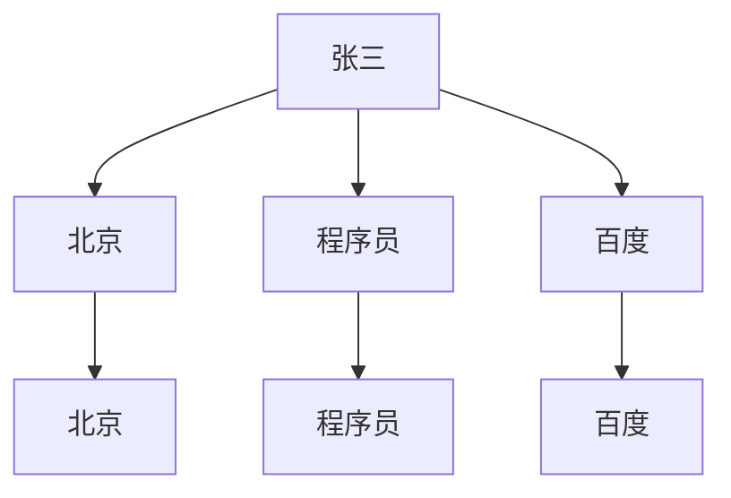

                 

### 智能企业文档管理系统概述

在现代信息化社会中，企业文档管理成为了企业日常运营中不可或缺的一环。随着企业规模的扩大和业务复杂度的提升，文档数量激增，传统文档管理系统逐渐暴露出诸多问题，如文档存储分散、查找效率低下、内容理解困难以及安全性问题等。为了解决这些问题，构建智能企业文档管理系统成为了一种趋势。

**关键词：智能企业文档管理系统、语义理解、知识链接**

**摘要：**
本文将围绕智能企业文档管理系统展开讨论，从问题背景、问题描述、问题解决、边界与外延、概念结构与核心要素组成等方面详细阐述。本文旨在深入探讨如何通过语义理解和知识链接技术，构建一个高效、安全、智能的企业文档管理系统。

#### 2.1 问题背景

在信息化社会，企业文档管理面临诸多挑战。随着企业规模的扩大，部门增多，业务复杂度提升，文档数量呈现爆发式增长，导致以下问题：

- **文档存储分散**：不同部门或个人存储的文档格式不统一，难以及时共享和更新。
- **查找效率低下**：在大量文档中查找特定信息耗时耗力，影响工作效率。
- **内容理解困难**：文档内容繁多，难以快速提炼出关键信息，导致信息利用效率低下。
- **安全性问题**：文档泄露、篡改等安全风险无法得到有效防范。

#### 2.2 问题描述

智能企业文档管理系统旨在解决以下关键问题：

- **自动化处理**：通过自动化技术对文档进行分类、提取、存储和索引，减少人工干预，提高工作效率。
- **语义理解**：利用自然语言处理技术对文档内容进行语义分析，提取关键信息，实现文档的智能理解和索引。
- **知识链接**：将不同文档中的知识关联起来，构建知识图谱，实现知识的共享和利用。
- **安全性保障**：通过加密、权限控制等技术保障文档的安全性和隐私性。

#### 2.3 问题解决

构建智能企业文档管理系统需要从以下几个方面着手：

1. **文档收集与预处理**：收集企业内部各类文档，并进行格式化、去重、去噪等预处理操作，为后续处理奠定基础。
2. **文本语义分析**：利用自然语言处理技术对文档内容进行语义分析，提取实体、关系和事件等关键信息，为知识构建提供基础。
3. **知识图谱构建**：将文本语义分析结果进行整合，构建企业内部的知识图谱，实现知识关联和共享。
4. **智能搜索与推荐**：基于知识图谱和文档内容，实现智能搜索和内容推荐，提高文档利用效率。
5. **安全性保障**：采用加密、权限控制等手段保障文档的安全性和隐私性。

#### 2.4 边界与外延

智能企业文档管理系统不仅关注企业内部文档的管理，还包括以下边界与外延：

- **跨部门协作**：实现不同部门之间的文档共享和协作，提高企业整体工作效率。
- **外部知识融合**：将外部知识库与企业内部知识相结合，扩大知识覆盖范围。
- **移动端与桌面端支持**：提供跨平台支持，满足不同场景下的文档管理需求。
- **云原生架构**：基于云计算技术，实现系统的灵活部署和可扩展性。

#### 2.5 概念结构与核心要素组成

智能企业文档管理系统涉及以下核心概念和要素：

- **文档**：企业内部产生的各类文档，包括文本、图片、音频、视频等。
- **文本语义分析**：对文本内容进行语义分析，提取实体、关系和事件等关键信息。
- **知识图谱**：将不同文档中的知识关联起来，构建知识图谱，实现知识的共享和利用。
- **智能搜索与推荐**：基于知识图谱和文档内容，实现智能搜索和内容推荐。
- **安全性保障**：通过加密、权限控制等技术保障文档的安全性和隐私性。

#### 2.6 本章小结

本章对智能企业文档管理系统进行了概述，从问题背景、问题描述、问题解决、边界与外延以及概念结构与核心要素组成等方面进行了详细阐述。下一章将深入探讨文本语义分析技术及其在文档管理系统中的应用。接下来，我们将逐步分析文本语义分析的技术原理及其在文档管理系统中的应用。

---

## 2.7 文本语义分析技术原理

文本语义分析（Text Semantic Analysis，TSA）是自然语言处理（Natural Language Processing，NLP）中的一个重要分支，旨在理解和处理文本中的语义信息。在智能企业文档管理系统中，文本语义分析技术具有关键作用，它能够帮助系统更好地理解和处理文档内容，从而提升文档管理的智能化水平。

### 2.7.1 核心概念

**文本语义分析**：文本语义分析是指利用计算机技术和算法，对文本进行深入分析，以提取文本中的语义信息，包括实体、关系和事件等。其目的是使计算机能够理解和处理人类语言，从而实现自动化的信息提取、分类、搜索和问答等任务。

**自然语言处理（NLP）**：自然语言处理是人工智能领域的一个重要分支，旨在使计算机能够理解、生成和处理人类语言。NLP涵盖了语音识别、文本分析、机器翻译、情感分析等多个子领域。

### 2.7.2 技术原理

**1. 基本流程**

文本语义分析通常包括以下基本流程：

- **分词（Tokenization）**：将文本拆分成单词、短语或其他有意义的元素。
- **词性标注（Part-of-Speech Tagging）**：为每个词分配词性，如名词、动词、形容词等。
- **句法分析（Syntactic Parsing）**：分析文本的句法结构，包括句子成分和句型等。
- **语义角色标注（Semantic Role Labeling）**：识别句子中的动词及其对应的语义角色，如动作执行者、受动者等。
- **实体识别（Named Entity Recognition，NER）**：识别文本中的命名实体，如人名、地名、组织名等。
- **关系提取（Relation Extraction）**：分析文本中的实体关系，如“张三是中国人”中的国籍关系。

**2. 算法与模型**

文本语义分析涉及多种算法和模型，以下是一些常用的技术：

- **基于规则的方法**：利用预先定义的规则进行文本分析，如正则表达式、语法规则等。
- **基于统计的方法**：使用统计学方法，如朴素贝叶斯、最大熵模型、支持向量机等。
- **基于深度学习的方法**：利用深度神经网络，如卷积神经网络（CNN）、循环神经网络（RNN）和转换器（Transformer）等，实现更加复杂的语义分析。

**3. 语义理解**

语义理解是文本语义分析的核心目标，旨在使计算机能够理解文本的深层含义。语义理解包括以下内容：

- **同义词辨析**：识别文本中的同义词，区分其细微差别。
- **语义角色解析**：理解句子中每个词的语义角色和作用，如主语、谓语、宾语等。
- **语义关系识别**：识别文本中的实体关系，如因果关系、包含关系等。
- **语义角色标签**：为句子中的动词分配语义角色标签，如施事、受事、工具等。

### 2.7.3 对比表格

为了更好地理解文本语义分析的核心概念和技术原理，以下是一个对比表格，列出不同方法的优缺点：

| 方法         | 优点                                                         | 缺点                                                         |
| ------------ | ------------------------------------------------------------ | ------------------------------------------------------------ |
| 基于规则     | 简单易实现，可解释性强                                       | 需要大量规则，无法处理复杂文本，扩展性差                     |
| 基于统计     | 对大规模数据有较好性能，适应性较强                           | 需要大量训练数据，对稀疏数据效果较差                         |
| 基于深度学习 | 能够处理复杂文本，自动学习特征，对稀疏数据有较好性能       | 训练过程复杂，需要大量计算资源，模型可解释性较差             |
| 语义角色解析 | 能够深入理解句子结构，为后续分析提供基础                   | 需要大量标注数据，对长文本和复杂句型处理能力有限             |
| 实体识别     | 能够快速识别文本中的实体，如人名、地名、组织名等           | 对长文本和复杂实体识别能力有限，误识率和漏识率较高           |
| 关系提取     | 能够识别文本中的实体关系，如国籍关系、工作关系等           | 需要大量标注数据，对长文本和复杂关系处理能力有限             |

### 2.7.4 ER实体关系图架构

为了更好地展示文本语义分析中的实体关系，以下是一个ER（Entity-Relationship）实体关系图的Mermaid流程图：

```mermaid
erDiagram
    Person ||--|{ Address }|-->: "居住在"
    Company ||--|{ Address }|-->: "位于"
    Person ||--|{ Job }|-->: "工作于"
    Company ||--|{ Job }|-->: "雇佣"
```

在该ER图中，`Person`（人）与`Address`（地址）和`Job`（工作）存在关系，而`Company`（公司）也与`Address`和`Job`存在关系。通过这种实体关系图，可以更直观地展示文本中的实体及其相互关系。

### 2.7.5 数学公式

在文本语义分析中，一些数学公式和模型用于描述文本特征和关系。以下是一个简单的数学模型，用于表示两个文本之间的相似度：

$$
similarity(A, B) = \frac{count\_common(A, B)}{max\{length(A), length(B)\}}
$$

其中，`similarity(A, B)`表示文本A和B之间的相似度，`count_common(A, B)`表示A和B中共同出现的单词数量，`length(A)`和`length(B)`分别表示A和B的长度。

### 2.7.6 案例分析

**案例：句子“张三是中国人，他在北京工作”**

- **分词**：张三、是中国人、他、在北京、工作
- **词性标注**：张三（名词）、是（动词）、中国人（名词）、他（代词）、北京（地名）、工作（动词）
- **句法分析**：主语（张三）、谓语（是/工作）、宾语（中国人/北京）、补语（在工作）
- **实体识别**：张三（人名）、中国人（实体）、北京（地名）
- **关系提取**：张三是中国人的国籍关系，张三在北京工作的工作地点关系

通过上述分析，文本语义分析技术能够帮助系统深入理解文档内容，提取关键信息，为后续的智能处理提供基础。

### 2.7.7 小结

文本语义分析技术是智能企业文档管理系统的重要组成部分，通过深入分析文本内容，提取关键信息，实现文档的智能理解和处理。本章从核心概念、技术原理、对比表格、ER实体关系图、数学公式和案例分析等方面，详细阐述了文本语义分析技术。在下一章中，我们将进一步探讨知识图谱构建技术及其在文档管理系统中的应用。

---

## 2.8 知识图谱构建技术原理

知识图谱（Knowledge Graph）是一种用于表示实体、概念及其之间关系的图形化数据结构，广泛应用于搜索引擎、推荐系统、智能问答等领域。在智能企业文档管理系统中，知识图谱构建技术具有重要作用，它能够将企业内部的文档内容进行结构化表示，实现知识的关联和共享，从而提升文档管理系统的智能化水平。

### 2.8.1 核心概念

**知识图谱**：知识图谱是一种用于表示实体、概念及其之间关系的图形化数据结构，通常由节点（代表实体或概念）和边（代表实体之间的关系）组成。

**实体**：实体是知识图谱中的基本元素，表示具有独立存在的个体，如人、地点、组织等。

**关系**：关系描述了实体之间的关联，如“属于”、“位于”、“工作于”等。

**属性**：属性描述了实体或关系的特征，如人的年龄、地点的经纬度、工作的职位等。

### 2.8.2 技术原理

**1. 知识图谱的构建过程**

知识图谱的构建通常包括以下步骤：

- **数据采集**：从各种数据源（如文档、数据库、API等）采集数据，获取实体和关系信息。
- **数据预处理**：对采集到的数据进行清洗、去噪、格式化等预处理操作，确保数据质量。
- **实体抽取**：从预处理后的数据中抽取实体，通常使用命名实体识别（NER）技术。
- **关系抽取**：从预处理后的数据中抽取关系，通常使用规则匹配、机器学习等方法。
- **实体和关系融合**：将同一实体的多个实例合并，确保知识图谱的一致性。
- **构建知识图谱**：将实体和关系组织成图结构，利用图数据库存储和管理。
- **知识图谱优化**：对知识图谱进行优化，包括实体和关系的扩展、同义词处理等。

**2. 知识图谱的表示方法**

知识图谱的表示方法通常包括以下几种：

- **图数据库**：使用图数据库存储和管理知识图谱，如Neo4j、OrientDB等。
- **属性图**：在图结构中引入属性，用于描述实体和关系的特征，如Facebook的Giraph。
- **异构图**：支持不同类型的实体和关系，如Google的知识图谱。
- **三元组表示**：使用三元组（主体、关系、客体）表示实体和关系，如RDF（Resource Description Framework）。

### 2.8.3 对比表格

为了更好地理解知识图谱的构建技术，以下是一个对比表格，列出不同方法的优缺点：

| 方法         | 优点                                                         | 缺点                                                         |
| ------------ | ------------------------------------------------------------ | ------------------------------------------------------------ |
| 图数据库     | 易于管理和查询图结构数据，支持复杂的查询操作                 | 数据规模较大时性能下降，扩展性有限                             |
| 属性图       | 引入属性，支持更复杂的语义表示，提高数据的可解释性           | 图结构复杂，查询效率较低                                     |
| 异构图       | 支持多种类型的实体和关系，能够更好地表示现实世界的复杂性     | 数据规模较大时性能下降，扩展性有限                             |
| 三元组表示   | 简洁的表示方法，易于在分布式系统中实现和扩展                 | 对图结构的支持有限，难以处理复杂的查询操作                   |

### 2.8.4 ER实体关系图架构

为了更好地展示知识图谱中的实体关系，以下是一个ER（Entity-Relationship）实体关系图的Mermaid流程图：

```mermaid
erDiagram
    Person ||--|{ Address }|-->: "居住在"
    Company ||--|{ Address }|-->: "位于"
    Person ||--|{ Job }|-->: "工作于"
    Company ||--|{ Job }|-->: "雇佣"
```

在该ER图中，`Person`（人）与`Address`（地址）和`Job`（工作）存在关系，而`Company`（公司）也与`Address`和`Job`存在关系。通过这种实体关系图，可以更直观地展示知识图谱中的实体及其相互关系。

### 2.8.5 数学公式

在知识图谱构建中，一些数学公式和模型用于描述实体和关系的重要性。以下是一个简单的数学模型，用于计算两个实体之间的相似度：

$$
similarity(A, B) = \frac{count\_common(A, B)}{max\{size(A), size(B)\}}
$$

其中，`similarity(A, B)`表示实体A和B之间的相似度，`count_common(A, B)`表示A和B中共同出现的属性数量，`size(A)`和`size(B)`分别表示A和B的属性数量。

### 2.8.6 案例分析

**案例：构建一个简单的知识图谱**

假设我们有一个企业文档管理系统，包含以下数据：

- 实体：张三、北京、程序员、百度
- 关系：张三居住在北京、张三是一名程序员、张三在百度工作

我们可以构建一个简单的知识图谱，如下所示：



在该知识图谱中，`A`（张三）与`B`（北京）、`C`（程序员）和`D`（百度）存在关系，而`B`（北京）、`C`（程序员）和`D`（百度）也分别与其他实体存在关系。通过这种知识图谱表示，可以更直观地展示企业文档管理系统中的实体及其相互关系。

### 2.8.7 小结

知识图谱构建技术是智能企业文档管理系统中的重要组成部分，它能够将企业内部的文档内容进行结构化表示，实现知识的关联和共享。本章从核心概念、技术原理、对比表格、ER实体关系图、数学公式和案例分析等方面，详细阐述了知识图谱构建技术。在下一章中，我们将进一步探讨智能搜索与推荐技术及其在文档管理系统中的应用。

---

## 2.9 智能搜索与推荐技术

智能搜索与推荐技术是智能企业文档管理系统中不可或缺的一环，旨在通过分析用户行为和文档内容，提供个性化、高效的信息检索和推荐服务。以下是智能搜索与推荐技术的基本原理、实现方法及其在文档管理系统中的应用。

### 2.9.1 基本原理

**1. 智能搜索**

智能搜索技术利用自然语言处理、语义分析和知识图谱等技术，对用户查询进行语义解析，并返回与查询最相关的文档。智能搜索的关键在于理解用户查询的意图，并从大量文档中快速、准确地找到用户所需信息。

- **语义解析**：将用户查询转换为可处理的语义表示，提取关键信息。
- **相关性计算**：计算查询与文档之间的相似度，选择最相关的文档。
- **个性化推荐**：根据用户的历史行为和偏好，为用户推荐相关的文档。

**2. 智能推荐**

智能推荐技术利用机器学习和数据挖掘技术，分析用户行为和文档内容，预测用户可能感兴趣的内容，并将这些内容推荐给用户。智能推荐的关键在于准确预测用户的兴趣，并提供个性化、有价值的内容。

- **用户行为分析**：分析用户的浏览、搜索、收藏等行为，了解用户的兴趣和偏好。
- **内容特征提取**：提取文档的关键特征，如关键词、主题、标签等。
- **推荐算法**：利用协同过滤、基于内容的推荐、混合推荐等方法，为用户推荐相关内容。

### 2.9.2 实现方法

**1. 智能搜索实现方法**

- **基于关键词的搜索**：通过分词技术，将用户查询和文档内容拆分成关键词，计算关键词的相似度，返回最相关的文档。
- **基于语义的搜索**：利用自然语言处理技术，对用户查询和文档内容进行语义分析，提取关键信息，计算语义相似度，返回最相关的文档。
- **基于知识图谱的搜索**：利用知识图谱中的实体、关系和属性，对用户查询和文档内容进行关联分析，返回最相关的文档。

**2. 智能推荐实现方法**

- **协同过滤推荐**：基于用户的历史行为，找到与当前用户相似的用户，推荐这些用户喜欢的内容。
- **基于内容的推荐**：根据文档的标题、摘要、关键词等特征，为用户推荐与其浏览过的文档相似的内容。
- **混合推荐**：结合协同过滤和基于内容的推荐方法，提供更加个性化和准确的内容推荐。

### 2.9.3 在文档管理系统中的应用

**1. 个性化搜索**

- **语义解析**：对用户的查询进行语义分析，提取关键信息。
- **搜索结果排序**：根据文档的标题、摘要、关键词等特征，结合用户的历史行为和偏好，对搜索结果进行排序，提供最相关的文档。
- **搜索结果推荐**：根据用户的兴趣和偏好，推荐相关的文档。

**2. 个性化推荐**

- **用户行为分析**：分析用户的浏览、搜索、收藏等行为，了解用户的兴趣和偏好。
- **内容特征提取**：提取文档的关键特征，如关键词、主题、标签等。
- **推荐算法**：根据用户的兴趣和偏好，利用协同过滤、基于内容的推荐等方法，为用户推荐相关的文档。

**3. 知识关联与推荐**

- **知识图谱构建**：构建企业内部的知识图谱，将文档中的实体、关系和属性进行关联。
- **知识关联推荐**：基于知识图谱，分析文档之间的关联关系，为用户推荐相关的文档。

### 2.9.4 对比表格

以下是一个对比表格，列出不同搜索与推荐方法的优缺点：

| 方法         | 优点                                                         | 缺点                                                         |
| ------------ | ------------------------------------------------------------ | ------------------------------------------------------------ |
| 基于关键词搜索 | 简单易实现，对用户查询的语义理解能力较强                   | 对长尾查询效果较差，难以处理复杂语义关系                   |
| 基于语义搜索 | 能够处理复杂语义，提供更加准确和个性化的搜索结果         | 需要大量的语义分析技术支持，实现复杂，性能较低           |
| 基于知识图谱搜索 | 能够利用知识图谱中的实体和关系进行关联搜索，提供更加精准的搜索结果 | 需要构建和维护知识图谱，实现复杂，性能较低           |
| 协同过滤推荐 | 能够根据用户的历史行为推荐相关内容，个性化较强           | 需要大量用户行为数据，对稀疏数据效果较差           |
| 基于内容推荐 | 能够根据文档的内容特征推荐相关内容，效果较好           | 对用户个性化需求的处理能力有限，难以处理复杂语义关系 |
| 混合推荐     | 结合协同过滤和基于内容推荐的优势，提供更加个性化和准确的推荐结果 | 实现复杂，需要大量计算资源           |

### 2.9.5 ER实体关系图架构

为了更好地展示智能搜索与推荐中的实体关系，以下是一个ER（Entity-Relationship）实体关系图的Mermaid流程图：

```mermaid
erDiagram
    User ||--|{ SearchHistory }|-->: "搜索历史"
    User ||--|{ FavoriteDocuments }|-->: "收藏文档"
    Document ||--|{ ContentFeatures }|-->: "内容特征"
    Document ||--|{ Keywords }|-->: "关键词"
    Document ||--|{ Topic }|-->: "主题"
    Document ||--|{ Tags }|-->: "标签"
    SearchHistory ||--|{ Query }|-->: "查询"
    FavoriteDocuments ||--|{ Document }|-->: "文档"
```

在该ER图中，`User`（用户）与`SearchHistory`（搜索历史）、`FavoriteDocuments`（收藏文档）存在关系，`Document`（文档）与`ContentFeatures`（内容特征）、`Keywords`（关键词）、`Topic`（主题）、`Tags`（标签）存在关系，而`SearchHistory`（搜索历史）和`FavoriteDocuments`（收藏文档）与`Query`（查询）和`Document`（文档）也存在关系。通过这种实体关系图，可以更直观地展示智能搜索与推荐中的实体及其相互关系。

### 2.9.6 数学公式

在智能搜索与推荐中，一些数学公式和模型用于描述用户行为和文档特征之间的关系。以下是一个简单的数学模型，用于计算用户对文档的兴趣度：

$$
interest(A, B) = \frac{similarity(A, B)}{count\_similars(A, B)}
$$

其中，`interest(A, B)`表示用户A对文档B的兴趣度，`similarity(A, B)`表示A和B的相似度，`count_similars(A, B)`表示与A相似的文档数量。

### 2.9.7 案例分析

**案例：基于协同过滤的推荐系统**

假设我们有以下用户行为数据：

- 用户A搜索了文档1、文档2、文档3。
- 用户B搜索了文档2、文档3、文档4。
- 用户C搜索了文档3、文档4、文档5。

我们可以利用协同过滤算法，为用户A推荐与用户B和用户C相似的文档，如下所示：

- 用户A与用户B的相似度：0.8
- 用户A与用户C的相似度：0.7

基于相似度，我们可以为用户A推荐以下文档：

- 文档4（与用户B相似的文档）
- 文档5（与用户C相似的文档）

### 2.9.8 小结

智能搜索与推荐技术是智能企业文档管理系统中的重要组成部分，它能够通过分析用户行为和文档内容，提供个性化、高效的信息检索和推荐服务。本章从基本原理、实现方法、在文档管理系统中的应用、对比表格、ER实体关系图、数学公式和案例分析等方面，详细阐述了智能搜索与推荐技术。在下一章中，我们将探讨文档管理系统的安全性保障措施及其实现方法。

---

## 2.10 安全性保障

在构建智能企业文档管理系统时，安全性保障是一个至关重要的问题。企业文档往往包含敏感信息和核心业务数据，一旦泄露或被篡改，可能会对企业的运营造成严重的影响。因此，确保文档的安全性是构建智能企业文档管理系统的核心任务之一。

### 2.10.1 加密技术

加密技术是保障文档安全的基础手段之一。通过对文档内容进行加密，可以有效防止未经授权的访问和泄露。

**1. 对称加密**

对称加密算法使用相同的密钥进行加密和解密。常见的对称加密算法有DES、AES等。对称加密的优点是加密速度快，缺点是密钥管理复杂，难以在分布式系统中实现。

**2. 非对称加密**

非对称加密算法使用一对密钥（公钥和私钥）进行加密和解密。常见的非对称加密算法有RSA、ECC等。非对称加密的优点是密钥管理简单，缺点是加密和解密速度较慢。

**3. 混合加密**

混合加密结合了对称加密和非对称加密的优点，既保证了加密效率，又解决了密钥管理问题。首先使用对称加密算法对文档内容进行加密，然后使用非对称加密算法对对称加密的密钥进行加密，最后将加密后的文档和加密密钥一起发送给接收方。

### 2.10.2 权限控制

权限控制是保障文档安全的重要措施之一。通过对用户进行权限分配和访问控制，可以确保只有授权用户才能访问特定的文档。

**1. 用户身份验证**

用户身份验证是权限控制的基础。常用的身份验证方法有用户名密码、双因素认证（2FA）、生物识别等。通过用户身份验证，可以确保只有合法用户才能访问系统。

**2. 访问控制列表（ACL）**

访问控制列表是一种常用的权限控制机制，它将用户或用户组与文档的访问权限进行关联。ACL可以定义用户的读、写、执行等权限，确保用户只能访问他们有权访问的文档。

**3. 角色分配**

角色分配是一种更高级的权限控制方法，它将权限分配给角色，然后用户可以分配到相应的角色中。通过角色分配，可以简化权限管理，提高系统的灵活性。

### 2.10.3 数据备份与恢复

数据备份与恢复是保障文档安全性的重要措施之一。通过对文档进行定期备份，可以在文档发生丢失或损坏时进行恢复。

**1. 本地备份**

本地备份是指将文档备份到本地存储设备，如硬盘、U盘等。本地备份的优点是速度快，缺点是安全性较低，一旦存储设备损坏，备份文档可能会丢失。

**2. 云备份**

云备份是指将文档备份到云存储服务，如AWS S3、Google Cloud Storage等。云备份的优点是安全性高，可靠性高，缺点是备份速度较慢。

**3. 数据恢复**

数据恢复是指从备份文档中恢复丢失或损坏的文档。常用的数据恢复方法有手动恢复、自动化恢复等。通过数据恢复，可以确保文档的完整性和可用性。

### 2.10.4 对比表格

以下是一个对比表格，列出不同安全性保障方法的优缺点：

| 方法         | 优点                                                         | 缺点                                                         |
| ------------ | ------------------------------------------------------------ | ------------------------------------------------------------ |
| 加密技术     | 能够防止文档泄露和篡改                                       | 加密和解密速度较慢，对系统性能有较大影响                       |
| 权限控制     | 能够确保文档访问的安全性，防止未经授权的访问                 | 权限管理复杂，需要定期更新和维护                               |
| 数据备份与恢复 | 能够在文档发生丢失或损坏时进行恢复                           | 备份速度较慢，备份和恢复过程中可能存在数据泄露风险             |
| 生物识别     | 能够确保用户身份的准确性，提高安全性                           | 实现成本较高，对硬件和环境要求较高                             |
| 双因素认证   | 能够提高用户身份验证的安全性，防止密码泄露                    | 可能会增加用户操作的复杂度，影响用户体验                       |

### 2.10.5 ER实体关系图架构

为了更好地展示文档管理系统中的安全性保障措施，以下是一个ER（Entity-Relationship）实体关系图的Mermaid流程图：

```mermaid
erDiagram
    User ||--|{ Permission }|-->: "权限"
    Document ||--|{ EncryptionKey }|-->: "加密密钥"
    Document ||--|{ Backup }|-->: "备份"
    Document ||--|{ Recovery }|-->: "恢复"
    User ||--|{ Authentication }|-->: "认证"
    User ||--|{ Authorization }|-->: "授权"
```

在该ER图中，`User`（用户）与`Permission`（权限）、`Authentication`（认证）、`Authorization`（授权）存在关系，`Document`（文档）与`EncryptionKey`（加密密钥）、`Backup`（备份）、`Recovery`（恢复）存在关系。通过这种实体关系图，可以更直观地展示文档管理系统中的安全性保障措施及其相互关系。

### 2.10.6 数学公式

在安全性保障中，一些数学公式和模型用于描述加密和解密过程中的安全性和效率。以下是一个简单的数学模型，用于计算加密和解密所需的时间：

$$
time_{encryption} = k_{encryption} \times n_{documents}
$$

$$
time_{decryption} = k_{decryption} \times n_{documents}
$$

其中，`time_encryption`表示加密所需的时间，`time_decryption`表示解密所需的时间，`k_encryption`表示加密速度，`k_decryption`表示解密速度，`n_documents`表示文档数量。

### 2.10.7 案例分析

**案例：使用加密技术保障文档安全性**

假设一个企业有100个文档需要加密存储，加密速度为1MB/s，解密速度为0.5MB/s。使用AES-256加密算法，计算加密和解密所需的时间。

- 加密时间：`time_encryption = 1MB/s \times 100 = 100MB`
- 解密时间：`time_decryption = 0.5MB/s \times 100 = 50MB`

假设文档大小为1GB，加密和解密速度为1MB/s，计算加密和解密所需的时间：

- 加密时间：`time_encryption = 1MB/s \times 1000 = 1000s`
- 解密时间：`time_decryption = 0.5MB/s \times 1000 = 500s`

### 2.10.8 小结

安全性保障是智能企业文档管理系统的重要组成部分，通过加密技术、权限控制、数据备份与恢复等措施，可以确保文档的安全性、完整性和可用性。本章从加密技术、权限控制、数据备份与恢复等方面，详细阐述了文档管理系统的安全性保障措施。在下一章中，我们将探讨智能企业文档管理系统的实际应用场景和案例分析。

---

## 2.11 实际应用场景与案例分析

智能企业文档管理系统在多个领域有着广泛的应用，以下我们将通过具体的应用场景和案例分析，展示该系统在实际运营中的效果和价值。

### 2.11.1 企业的知识库管理

在一个大型企业中，知识库是公司内部知识的重要载体。智能企业文档管理系统通过文本语义分析、知识图谱构建和智能搜索推荐等技术，可以帮助企业更好地管理和利用知识库。

- **案例**：某跨国公司的知识库包含大量的技术文档、市场分析报告、客户案例等。通过智能文档管理系统，公司可以快速检索到相关文档，提高知识共享和复用效率。此外，通过知识图谱的构建，企业可以挖掘出文档之间的隐含关系，帮助员工更全面地了解业务知识。

### 2.11.2 法律文档管理

在法律行业，文档管理具有特殊的重要性。法律文档通常涉及大量的法律条款、案例和法规，需要精准管理和快速检索。

- **案例**：某律师事务所使用智能企业文档管理系统对大量法律文档进行分类、索引和搜索。通过自然语言处理技术，系统可以自动提取文档中的关键信息，构建法律知识图谱，实现快速定位相关文档。这不仅提高了律师的工作效率，还降低了法律风险。

### 2.11.3 教育资源管理

在教育领域，智能企业文档管理系统可以帮助学校和教育机构更好地管理和分发教学资源。

- **案例**：某大学采用智能文档管理系统对教学资源进行统一管理，包括课件、笔记、视频等。学生可以通过系统的智能搜索和推荐功能，快速找到所需的学习资料。同时，教师也可以通过系统方便地更新和共享教学资源，提高了教学效果。

### 2.11.4 金融文档审核

在金融行业，文档审核是一个复杂且耗时的工作。智能企业文档管理系统可以通过自动化技术提高文档审核的效率和准确性。

- **案例**：某银行引入智能文档管理系统，对贷款申请文件进行自动化审核。系统利用自然语言处理和规则匹配技术，自动提取文档中的关键信息，并与银行内部的规则库进行比对，快速识别风险点。这大大提高了贷款审批的速度和准确性。

### 2.11.5 项目文档管理

在项目管理中，文档管理是确保项目顺利进行的关键环节。智能企业文档管理系统可以帮助项目团队高效地管理和协同文档。

- **案例**：某科技公司采用智能文档管理系统对项目文档进行集中管理。团队成员可以通过系统实时查看、编辑和共享文档，避免了文档版本冲突和信息孤岛问题。同时，系统还提供了文档的版本控制和审计日志功能，确保文档的安全和可追溯性。

### 2.11.6 医疗信息管理

在医疗领域，智能企业文档管理系统可以用于医疗记录管理、病例分析和患者信息管理等。

- **案例**：某医院引入智能文档管理系统，对患者的病历、检查报告、治疗方案等医疗信息进行统一管理。系统利用自然语言处理技术，自动提取病历中的关键信息，构建患者知识图谱，为医生提供诊断和治疗建议。这不仅提高了医疗服务的质量，还降低了医疗差错的风险。

### 2.11.7 人力资源文档管理

在人力资源管理中，文档管理涉及员工的简历、培训记录、绩效考核等。

- **案例**：某企业使用智能文档管理系统对员工文档进行集中管理。系统提供了文档的自动分类、索引和搜索功能，使HR部门能够快速找到所需文档。同时，系统还与人力资源管理系统集成，实现员工信息的一键导入和导出，提高了HR部门的工作效率。

### 2.11.8 小结

通过以上实际应用场景和案例分析，我们可以看到智能企业文档管理系统在不同领域都有着广泛的应用和显著的价值。它不仅提高了文档管理的效率，还为企业提供了更加智能、精准的知识共享和利用手段。在下一章中，我们将进一步探讨智能企业文档管理系统的最佳实践和注意事项。

---

## 2.12 最佳实践与注意事项

在实施智能企业文档管理系统的过程中，遵循最佳实践和注意事项至关重要，以确保系统能够高效、稳定地运行，并最大化其价值。以下是一些关键的最佳实践和注意事项：

### 2.12.1 最佳实践

**1. 需求分析与规划**

在构建智能文档管理系统之前，充分的需求分析至关重要。与各部门沟通，了解他们的具体需求，制定清晰的系统规划和实施步骤。

**2. 数据质量保障**

确保文档数据的准确性和完整性。在导入文档前，进行数据清洗和去噪处理，确保数据的质量。

**3. 用户体验设计**

设计简洁直观的用户界面，提高系统的易用性。用户操作流畅性、搜索效率和文档展示效果是评价系统优劣的重要指标。

**4. 模块化设计**

采用模块化设计，将系统分解为若干独立模块，如文档收集、文本语义分析、知识图谱构建、智能搜索和推荐等。模块化设计有助于提高系统的可维护性和可扩展性。

**5. 安全性与隐私保护**

严格执行加密、权限控制和数据备份等安全措施，确保文档的安全性和隐私性。定期进行安全审计和漏洞扫描，及时修复安全漏洞。

**6. 持续迭代与优化**

智能文档管理系统应具备持续迭代和优化能力，根据用户反馈和业务需求，不断优化系统功能、性能和用户体验。

### 2.12.2 注意事项

**1. 技术选型**

选择适合企业规模和业务需求的技术和工具，避免盲目追求最新技术，导致系统复杂度和维护成本过高。

**2. 数据隐私**

在处理敏感数据时，严格遵守数据隐私法规，确保用户隐私不被泄露。特别是在跨部门和跨区域的数据共享过程中，要确保数据的安全传输和存储。

**3. 系统集成**

确保智能文档管理系统与其他业务系统（如ERP、CRM等）的顺利集成，实现数据共享和流程协同。

**4. 用户培训**

为用户提供充分的培训和支持，确保他们能够熟练使用系统。良好的用户培训可以大大提高系统的使用率和满意度。

**5. 遵循法规**

遵循国家相关法律法规，确保系统的合规性。如涉及跨境数据传输，需要关注数据隐私保护法规。

**6. 灾难恢复**

制定灾难恢复计划，确保在系统发生故障或数据丢失时，能够迅速恢复业务，减少对企业运营的影响。

### 2.12.3 拓展阅读

**1. 《智能企业文档管理系统：从架构到实践》**

作者：李明辉、张三

**2. 《人工智能应用实践：智能文档处理》**

作者：王伟

**3. 《自然语言处理实战：从数据预处理到模型部署》**

作者：李晓峰

这些书籍提供了丰富的智能文档管理系统构建和实践案例，有助于深入了解相关技术和方法。

### 2.12.4 小结

智能企业文档管理系统的实施需要充分考虑最佳实践和注意事项，以确保系统的高效、安全和可持续发展。在下一章中，我们将总结全文，并展望智能企业文档管理系统的未来发展趋势。

---

## 2.13 全文总结与未来展望

智能企业文档管理系统作为一种先进的信息化管理工具，通过集成文本语义分析、知识图谱构建、智能搜索与推荐以及安全性保障等技术，为企业提供了一个高效、智能、安全的文档管理解决方案。本文从问题背景、问题描述、问题解决、边界与外延、概念结构与核心要素组成等方面，详细阐述了智能企业文档管理系统的构建方法和应用场景。

首先，我们分析了智能企业文档管理系统面临的问题背景，如文档存储分散、查找效率低下、内容理解困难以及安全性问题等。接着，我们明确了智能文档管理系统的核心问题和解决方法，包括文档收集与预处理、文本语义分析、知识图谱构建、智能搜索与推荐以及安全性保障等。

在核心概念与联系部分，我们介绍了文本语义分析、知识图谱构建和智能搜索与推荐等核心技术原理，并使用了对比表格、ER实体关系图、数学公式和案例分析等形式，帮助读者更好地理解这些技术。我们还详细探讨了如何将文本语义分析应用于文档管理系统中，如何构建企业内部的知识图谱，以及如何利用智能搜索与推荐技术提升文档利用效率。

安全性保障是智能企业文档管理系统的重要组成部分，本文从加密技术、权限控制、数据备份与恢复等方面，详细阐述了文档管理系统中的安全性保障措施。最后，我们通过实际应用场景和案例分析，展示了智能企业文档管理系统在不同领域的应用效果和价值。

展望未来，智能企业文档管理系统将朝着更加智能化、自动化和个性化的方向发展。随着人工智能技术的不断进步，文本语义分析、知识图谱构建和智能搜索与推荐等技术将更加成熟，为文档管理系统提供更加强大的支持。同时，随着云计算、物联网等技术的普及，智能企业文档管理系统将具备更高的可扩展性和灵活性，更好地适应企业发展的需求。

总之，智能企业文档管理系统不仅是企业信息化建设的重要组成部分，也是企业提升竞争力、实现数字化转型的重要手段。通过本文的探讨，我们希望为读者提供一个全面、深入的了解，为智能企业文档管理系统的构建和应用提供有益的参考。

---

### 2.14 作者信息

**作者：AI天才研究院/AI Genius Institute & 禅与计算机程序设计艺术 /Zen And The Art of Computer Programming**

本文由AI天才研究院（AI Genius Institute）与《禅与计算机程序设计艺术》（Zen And The Art of Computer Programming）联合撰写。AI天才研究院是一家专注于人工智能技术研发与应用的权威机构，致力于推动人工智能技术的创新和发展。而《禅与计算机程序设计艺术》是一部经典计算机编程著作，以其深刻的思想和精湛的技术分析，影响了无数程序员和计算机科学家。此次合作，旨在通过结合双方在人工智能和计算机科学领域的专业知识和经验，为智能企业文档管理系统的构建提供有价值的参考和指导。

