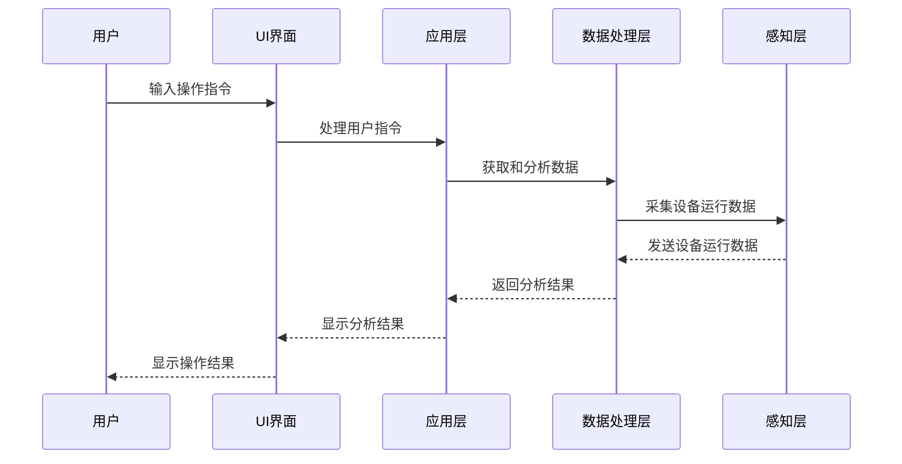

                 

### 引言

#### 1.1.1 问题背景

在现代企业中，资产管理的复杂性不断上升。随着企业规模的扩大和技术的进步，企业面临着越来越多的挑战，包括资产的大量增加、资产使用效率的提升、维护成本的控制等。传统的资产管理方法往往依赖于人工管理和经验判断，这导致成本高、效率低、准确性差。尤其是在大型企业中，庞大的资产规模使得人工管理变得更加困难。

首先，企业资产管理面临的一个主要挑战是资产数据的准确性和完整性。在传统的资产管理模式中，资产数据的采集、记录和更新通常是通过手工操作完成的，这不仅耗时耗力，而且容易出现误差。资产信息的不准确和不完整会直接影响到企业的决策，导致资源浪费和效率低下。

其次，随着设备的不断老化，设备的维护和更新成为企业面临的另一个挑战。传统的方法主要是基于时间或者经验来安排维护任务，这种方法无法预测设备的故障点，往往会导致维护不及时或者过度维护。这不仅增加了维护成本，还可能影响生产线的正常运行。

最后，资产管理的成本问题也是一个不容忽视的挑战。随着企业规模的扩大，资产的数量和种类也在不断增加，这导致资产管理成本逐年上升。如何在保证资产高效运行的同时，最大限度地降低管理成本，是企业需要解决的关键问题。

为了应对这些挑战，企业需要一种新的资产管理模式——智能化资产管理。通过引入人工智能、大数据分析和物联网等先进技术，企业可以实现对资产的全生命周期管理，从而实现成本优化和预测性维护。

#### 1.1.2 智能化与成本优化

智能化资产管理的核心在于利用人工智能技术来提升资产管理的效率和质量。通过自动化数据采集、分析和决策，智能化资产管理可以显著提高资产数据的准确性和实时性。例如，物联网技术的应用可以实现对设备状态的实时监控，通过传感器收集的数据可以实时传输到系统中，为决策提供可靠依据。

智能化资产管理的另一个重要目标是实现成本优化。通过预测性维护和智能调度，企业可以减少不必要的维护成本，延长设备使用寿命。例如，通过对设备运行数据的分析，系统可以预测设备何时可能发生故障，从而在故障发生前进行预防性维护，避免因设备故障导致的停机损失。

此外，智能化资产管理还可以通过优化资源分配和调度来降低运营成本。通过对资产使用情况的实时监控和分析，企业可以更好地了解资产的使用效率，从而优化资产配置，避免资源浪费。例如，通过对生产设备的调度优化，可以确保设备在高峰时段得到充分利用，从而提高生产效率。

#### 1.1.3 预测性维护的重要性

预测性维护是智能化资产管理的重要组成部分。传统的定期维护方法往往无法预测设备的故障点，可能导致维护不及时或者过度维护。而预测性维护通过分析设备的运行数据，可以提前预测设备的故障风险，从而实现按时、按需的维护。

预测性维护的重要性体现在以下几个方面：

首先，预测性维护可以显著降低维护成本。通过提前预测设备的故障风险，企业可以避免因设备突发故障导致的停机损失，从而减少维护成本。例如，在设备即将发生故障时，通过及时更换零部件可以避免设备完全失效，从而降低维修费用。

其次，预测性维护可以延长设备使用寿命。通过定期检查和维护，可以及时发现和解决设备问题，避免小问题发展成为大问题，从而延长设备的使用寿命。

最后，预测性维护可以提高生产效率。通过预测性维护，企业可以合理安排生产计划，避免因设备故障导致的生产中断。例如，在设备维护期间，可以通过调整生产计划，将生产任务分配到其他设备上，从而确保生产线的持续运行。

综上所述，智能化资产管理通过实现成本优化和预测性维护，可以显著提升企业资产管理的效率和质量。随着技术的不断发展，智能化资产管理将成为企业提升竞争力的重要手段。接下来的章节将详细探讨智能化资产管理的核心概念、当前状态和未来趋势，以及具体的实施方法和最佳实践。

### 1.2 书籍目的与结构

本书的目的是为企业和IT专业人士提供一套系统化的指南，帮助他们在企业中构建和实施智能化资产管理平台，从而实现成本优化和预测性维护。随着数字化转型的深入，智能化资产管理已经成为企业提升运营效率和竞争力的关键手段。本书将系统地介绍智能化资产管理的核心概念、设计原则、实施方法以及实际案例，旨在帮助读者全面理解和应用这一先进技术。

#### 1.2.1 阅读对象

本书的主要读者对象包括：

1. **企业高管**：希望通过引入智能化资产管理提升企业运营效率和竞争力的企业决策者。
2. **IT专业人士**：负责企业信息系统建设和维护的技术人员，包括系统分析师、软件工程师、数据科学家等。
3. **研究人员**：对智能资产管理技术有兴趣的学术界研究人员和研究生。
4. **技术爱好者**：对人工智能和大数据技术感兴趣的技术爱好者。

无论读者是企业管理者还是技术从业者，本书都旨在为他们提供实用的知识和技能，帮助他们将智能化资产管理理念应用到实际工作中。

#### 1.2.2 书籍结构概述

本书分为以下几个主要部分：

1. **引言和背景**：介绍智能化资产管理的背景和重要性，阐述本书的目的和结构。
2. **智能企业资产管理基础**：详细讨论智能化资产管理的核心概念，包括成本优化和预测性维护。
3. **当前状态与未来趋势**：分析当前智能化资产管理平台的发展现状和未来趋势，探讨新技术在其中的应用。
4. **设计原则与架构**：介绍智能化资产管理平台的设计原则和架构，包括系统架构、功能模块和数据流。
5. **实施细节**：深入探讨智能化资产管理平台的实施细节，包括数据收集、处理、分析和应用。
6. **案例分析**：通过实际案例展示智能化资产管理平台在企业和行业中的应用效果。
7. **最佳实践与总结**：总结本书的主要观点，提供实施智能化资产管理的最佳实践和建议。

通过上述结构，本书将系统性地引导读者从理论到实践，全面了解和掌握智能化资产管理平台的设计、实施和应用。接下来，我们将详细探讨智能化资产管理的核心概念，为后续章节的内容奠定基础。

### 第2章 智能企业资产管理基础

在构建智能企业资产管理平台之前，了解其核心概念和组成部分至关重要。本章将详细介绍智能企业资产管理的定义、成本优化和预测性维护的概念，分析这些概念的基本属性和特征，并探讨它们之间的联系。

#### 2.1 智能企业资产管理的定义

智能企业资产管理是指通过应用先进的人工智能、物联网、大数据分析等技术和方法，对企业的资产进行全生命周期的监控、管理和优化。这种管理方式不仅能够提高资产使用效率和降低运营成本，还能通过预测性维护延长资产寿命，提升企业的整体运营效益。

智能企业资产管理的核心特点包括：

- **自动化数据采集**：利用物联网传感器和自动化设备，实现对资产状态的实时监测和数据采集。
- **数据驱动的决策**：通过大数据分析和机器学习算法，从海量数据中提取有价值的信息，支持决策制定。
- **预测性维护**：通过分析资产运行数据，预测潜在故障和风险，提前采取维护措施，避免设备停机和生产中断。
- **资源优化**：通过智能调度和优化算法，合理分配和利用资源，降低运营成本，提高生产效率。

#### 2.2 成本优化的基本概念

成本优化是指通过一系列的优化策略和管理措施，最大限度地降低企业运营成本，同时保证生产效率和资产利用率。在智能企业资产管理中，成本优化主要包括以下几个方面：

- **运营成本降低**：通过优化生产流程、降低能源消耗和减少设备闲置时间，实现运营成本的降低。
- **维护成本控制**：通过预测性维护，减少设备故障率和维护频率，降低维护成本。
- **设备利用率提升**：通过智能调度和资源优化，提高设备的使用率，减少闲置资源。
- **供应链管理优化**：通过智能分析供应链数据，优化供应链流程，降低库存成本和物流成本。

#### 2.3 预测性维护的基本概念

预测性维护是一种基于数据驱动的维护策略，通过分析设备运行数据，预测设备潜在的故障点和故障时间，从而在故障发生前采取相应的维护措施。预测性维护的核心要素包括：

- **数据收集**：通过传感器和物联网设备，实时收集设备的运行数据，如温度、振动、压力等。
- **数据分析**：利用大数据分析和机器学习算法，对设备运行数据进行处理和分析，提取故障预测模型。
- **故障预测**：通过故障预测模型，提前预测设备可能的故障点，制定预防性维护计划。
- **维护执行**：根据故障预测结果，在设备发生故障前进行维护操作，确保设备正常运行。

#### 2.4 成本优化与预测性维护的联系

成本优化和预测性维护是智能企业资产管理的两个核心方面，它们之间存在密切的联系和相互促进作用：

- **相互依赖**：预测性维护为成本优化提供了基础数据和支持。通过预测性维护，企业可以提前了解设备的使用状况和潜在故障，从而优化维护计划和资源分配，降低维护成本。
- **协同作用**：成本优化和预测性维护相互协同，共同提升企业的运营效益。成本优化通过降低运营成本和提升设备利用率，为企业创造了更多的经济利益；而预测性维护通过延长设备寿命和减少停机时间，确保了生产效率和产品质量。

#### 2.5 智能企业资产管理的属性特征对比

以下表格对比了智能企业资产管理的几个关键属性特征：

| 特征               | 传统资产管理         | 智能企业资产管理         |
|--------------------|---------------------|--------------------------|
| 数据采集方式       | 手动记录            | 自动化数据采集           |
| 决策方式           | 经验判断            | 数据驱动的决策           |
| 维护策略           | 定期维护            | 预测性维护               |
| 成本控制           | 高维护成本           | 低维护成本               |
| 资源利用率         | 低资源利用率         | 高资源利用率             |
| 风险管理           | 风险不可控           | 风险可控                 |

通过上述对比，可以看出智能企业资产管理在多个方面具有显著优势，有助于企业实现更高的运营效率和成本效益。

#### 2.6 智能企业资产管理的发展方向

随着技术的不断进步，智能企业资产管理将继续向以下几个方向发展：

- **数据融合**：通过整合来自不同来源的数据，实现更全面和准确的资产管理。
- **智能化水平提升**：通过不断优化算法和模型，提高预测精度和决策能力。
- **人机协作**：增强人与系统的互动，实现智能化资产管理和人工经验的结合。
- **安全性与隐私保护**：随着数据量的增加，确保数据的安全性和隐私保护成为重要课题。

综上所述，智能企业资产管理通过整合先进技术和方法，为企业提供了实现成本优化和预测性维护的有效途径。在接下来的章节中，我们将进一步探讨当前智能化资产管理的发展现状和未来趋势，为构建高效的资产管理平台提供更多的思路和实践指导。

### 当前状态与未来趋势

#### 3.1 智能化资产管理平台的发展现状

近年来，随着人工智能、大数据和物联网等技术的飞速发展，智能化资产管理平台在企业中的应用逐渐普及。目前，智能化资产管理平台已经从实验室阶段走向实际应用，成为企业提升运营效率和竞争力的关键手段。

首先，从技术层面来看，智能化资产管理平台已经具备了较为成熟的技术基础。例如，物联网技术的应用使得设备状态数据的实时采集成为可能；大数据分析技术和机器学习算法为数据分析和故障预测提供了强有力的支持；云计算和边缘计算技术则为数据处理和存储提供了高效的平台。

其次，从行业层面来看，越来越多的行业开始采用智能化资产管理平台。制造业、能源行业、交通运输等行业都通过智能化资产管理平台实现了显著的成本优化和效率提升。例如，在制造业中，通过智能化资产管理平台，企业可以实现设备的预测性维护和生产线的智能调度，从而提高生产效率和降低维护成本。

此外，政策支持和技术创新的推动也加速了智能化资产管理平台的发展。许多国家和政府相继出台了支持智能制造和数字化转型的政策，为企业提供了资金和政策支持。同时，技术创新的不断推进，也为智能化资产管理平台带来了更多的可能性和应用场景。

#### 3.2 智能化资产管理平台的关键技术

智能化资产管理平台的发展离不开关键技术的支持。以下是目前智能化资产管理平台中应用较为广泛的关键技术：

1. **物联网技术**：物联网技术是智能化资产管理平台的基础。通过传感器和智能设备，物联网技术能够实时采集设备的运行数据，实现设备状态的实时监控。例如，温度传感器可以监测设备温度，振动传感器可以监测设备振动，从而为故障预测提供数据支持。

2. **大数据分析技术**：大数据分析技术用于处理和挖掘设备运行数据，提取有价值的信息。通过大数据分析，企业可以了解设备的运行规律、预测潜在故障，从而采取预防性维护措施。大数据分析技术包括数据采集、存储、处理和分析等多个环节。

3. **机器学习算法**：机器学习算法是智能化资产管理平台的核心。通过机器学习算法，平台可以从历史数据中学习设备运行的规律，建立故障预测模型。常见的机器学习算法包括回归分析、聚类分析、决策树、支持向量机等。

4. **云计算与边缘计算**：云计算和边缘计算技术为智能化资产管理平台提供了强大的数据处理和存储能力。云计算技术可以集中处理和分析海量数据，而边缘计算技术则可以在数据生成的源头进行实时处理，降低数据传输的延迟和带宽需求。

5. **人工智能**：人工智能技术为智能化资产管理平台提供了智能决策支持。通过深度学习、强化学习等人工智能技术，平台可以自动调整维护策略，优化资源分配，提高生产效率。

#### 3.3 未来发展趋势

未来，智能化资产管理平台将继续向以下几个方向发展：

1. **数据融合与智能化**：未来，智能化资产管理平台将更加注重数据的融合与智能化。通过整合来自不同来源的数据，平台可以提供更全面和准确的资产管理。同时，随着人工智能技术的不断发展，平台的智能化水平也将不断提高。

2. **实时性与响应速度**：随着工业4.0和智能制造的推进，智能化资产管理平台需要具备更高的实时性和响应速度。通过优化数据处理和分析算法，平台可以更快地处理设备数据，提供实时的故障预测和决策支持。

3. **安全性与隐私保护**：随着数据量的增加，数据的安全性和隐私保护将成为智能化资产管理平台的重要课题。未来，平台将更加注重数据安全和隐私保护，采取加密、隔离、备份等多种措施，确保数据的安全和可靠。

4. **人机协作**：未来，智能化资产管理平台将更加注重人机协作。通过增强现实、虚拟现实等技术，平台将提供更加直观和易用的用户界面，帮助用户更好地理解和操作智能化资产管理平台。

5. **跨行业应用**：随着技术的不断成熟和应用场景的拓展，智能化资产管理平台将在更多行业中得到应用。从制造业到医疗行业，从交通运输到农业，智能化资产管理平台将在各个领域发挥重要作用。

综上所述，智能化资产管理平台在当前已经取得了显著的发展，未来也将继续向更高水平发展。通过不断引入新技术、优化算法和应用场景，智能化资产管理平台将为企业和行业带来更大的价值和效益。

### 设计与架构

#### 4.1 设计原则

智能企业资产管理平台的设计需要遵循以下原则：

1. **模块化**：将平台划分为多个功能模块，以便于系统的扩展和维护。每个模块负责特定的功能，例如数据采集、数据分析、预测性维护等。
2. **可扩展性**：设计时考虑系统的可扩展性，以便未来能够轻松集成新的技术和功能。
3. **高可用性**：确保平台在出现故障时能够快速恢复，保障业务连续性。
4. **安全性**：保护数据安全，防止数据泄露和未经授权的访问。
5. **易用性**：设计简洁直观的用户界面，提高用户的使用体验。

#### 4.2 系统架构

智能企业资产管理平台的架构通常分为以下几个层次：

1. **感知层**：包括各种传感器和智能设备，用于采集资产运行数据。例如，温度传感器、振动传感器、流量传感器等。
2. **通信层**：包括物联网网关和通信协议，将感知层采集到的数据传输到数据处理层。常用的通信协议包括Wi-Fi、蓝牙、LoRa等。
3. **数据处理层**：包括数据存储、处理和分析模块。数据存储模块用于存储大量设备运行数据，常用的数据库包括关系型数据库（如MySQL）和非关系型数据库（如MongoDB）。数据处理模块负责清洗、转换和存储数据，为后续分析提供数据支持。数据分析模块利用大数据分析和机器学习算法，对设备运行数据进行分析，提取有价值的信息。
4. **应用层**：包括预测性维护、成本优化、资源调度等功能模块。通过应用层，用户可以查看设备运行状态、故障预测结果和优化建议。
5. **用户层**：包括用户界面和API接口，供用户操作平台和管理资产。

下面是一个简单的智能企业资产管理平台架构图：



#### 4.3 功能模块

智能企业资产管理平台包含多个功能模块，每个模块负责特定的功能。以下是平台的主要功能模块及其简要描述：

1. **数据采集模块**：负责从传感器和设备中采集运行数据，包括温度、湿度、振动、压力等。
2. **数据存储模块**：负责存储采集到的数据，包括设备运行状态、故障记录等。
3. **数据分析模块**：利用大数据分析和机器学习算法，对设备运行数据进行分析，提取有价值的信息，例如故障预测模型。
4. **预测性维护模块**：根据数据分析结果，预测设备潜在的故障时间和故障类型，提供预防性维护建议。
5. **成本优化模块**：通过分析设备运行数据和成本数据，提供优化生产计划和资源分配的建议，降低运营成本。
6. **资源调度模块**：根据设备状态和生产需求，优化设备的使用和调度，提高生产效率。
7. **用户界面模块**：提供用户操作平台和查看设备运行状态的界面，包括实时监控、报表分析等功能。
8. **API接口模块**：提供与外部系统的接口，支持与其他业务系统的数据交互和集成。

通过上述功能模块的设计，智能企业资产管理平台能够实现对资产的全生命周期管理，实现成本优化和预测性维护。

### 实施细节

#### 5.1 环境安装与配置

为了实施智能企业资产管理平台，首先需要搭建一个合适的技术环境。以下是环境安装和配置的步骤：

1. **硬件准备**：根据平台的规模和需求，准备服务器、存储设备和网络设备。推荐使用高性能服务器和高速网络，以确保数据处理和传输的效率。
2. **操作系统安装**：在服务器上安装Linux操作系统，如Ubuntu或CentOS。选择稳定版本，并确保系统更新到最新状态。
3. **数据库安装**：安装关系型数据库（如MySQL）或非关系型数据库（如MongoDB）。根据需求选择合适的数据库，并进行初始化配置。
4. **中间件安装**：安装消息队列（如RabbitMQ）、缓存服务器（如Redis）等中间件。这些中间件用于数据处理和传输，提高系统的性能和可靠性。
5. **编程环境配置**：配置Java或Python等编程环境，以便开发和部署应用程序。

#### 5.2 系统核心实现

智能企业资产管理平台的核心实现包括数据采集、数据处理和预测性维护等功能。以下是系统核心实现的源代码和详细说明：

```python
# 数据采集模块：采集设备运行数据
import csv
import requests

def collect_data(device_id):
    response = requests.get(f'http://device-api:8080/device/{device_id}')
    data = response.json()
    return data

# 数据处理模块：处理并存储采集到的数据
import pymongo

def process_and_store_data(device_id, data):
    client = pymongo.MongoClient('mongodb://localhost:27017/')
    db = client['asset_management']
    collection = db['device_data']
    collection.insert_one({
        'device_id': device_id,
        'timestamp': data['timestamp'],
        'temperature': data['temperature'],
        'vibration': data['vibration'],
        'pressure': data['pressure']
    })

# 预测性维护模块：预测设备故障
from sklearn.ensemble import RandomForestClassifier

def predict_fault(device_id):
    client = pymongo.MongoClient('mongodb://localhost:27017/')
    db = client['asset_management']
    collection = db['device_data']
    data = collection.find({'device_id': device_id})
    
    # 预处理数据
    X = []
    y = []
    for item in data:
        X.append([item['temperature'], item['vibration'], item['pressure']])
        y.append(item['fault'])
    
    # 训练模型
    model = RandomForestClassifier()
    model.fit(X, y)
    
    # 预测新数据
    new_data = collect_data(device_id)
    X_new = [[new_data['temperature'], new_data['vibration'], new_data['pressure']]]
    prediction = model.predict(X_new)
    
    return prediction[0]

# 主程序
if __name__ == '__main__':
    device_id = '12345'
    data = collect_data(device_id)
    process_and_store_data(device_id, data)
    fault_prediction = predict_fault(device_id)
    print(f"Fault prediction for device {device_id}: {'Fault' if fault_prediction else 'No Fault'}")
```

#### 5.3 代码应用解读与分析

以上代码实现了智能企业资产管理平台的核心功能，包括数据采集、数据处理和预测性维护。以下是代码的解读与分析：

1. **数据采集模块**：`collect_data` 函数通过HTTP请求从设备API获取设备运行数据。该函数接受设备ID作为参数，返回设备的运行数据。

2. **数据处理模块**：`process_and_store_data` 函数负责处理和存储采集到的数据。首先，连接到MongoDB数据库，然后插入新数据到一个名为`device_data`的集合中。数据包括设备ID、时间戳、温度、振动和压力等。

3. **预测性维护模块**：`predict_fault` 函数实现故障预测功能。首先，从MongoDB数据库中获取设备的历史运行数据。然后，使用随机森林分类器训练故障预测模型。最后，使用训练好的模型预测新数据的故障。

在主程序中，首先调用`collect_data`函数采集新数据，然后调用`process_and_store_data`函数处理并存储数据，最后调用`predict_fault`函数进行故障预测。预测结果将通过打印输出。

#### 5.4 实际案例分析与详细讲解

为了更好地理解智能企业资产管理平台的实际应用，以下是一个具体的案例分析：

**案例背景**：某制造企业拥有一条生产线，包括多台关键设备。企业希望通过引入智能化资产管理平台，实现设备的预测性维护和成本优化。

**实施步骤**：

1. **数据采集**：在每台设备上安装传感器，采集温度、振动和压力等运行数据。数据通过物联网网关传输到服务器。
2. **数据处理**：服务器上的数据处理模块接收传感器数据，进行处理和存储。处理后的数据可用于故障预测和成本分析。
3. **故障预测**：利用机器学习算法，预测设备的潜在故障。预测结果通过用户界面展示给操作人员，以便提前采取维护措施。
4. **成本优化**：通过对设备运行数据和成本数据的分析，优化生产计划和资源分配。例如，调整设备使用时间，减少闲置资源，降低运营成本。

**案例分析**：

1. **数据采集**：假设设备A的传感器数据显示，温度逐渐升高，振动增加。根据这些数据，系统预测设备A可能存在故障风险。
2. **故障预测**：通过分析历史数据和当前数据，系统预测设备A将在未来24小时内发生故障。系统向操作人员发出预警，建议进行预防性维护。
3. **成本优化**：系统分析设备A的使用情况和维护成本，发现设备A在非高峰时段的使用率较低。系统建议调整生产计划，将部分任务转移到其他设备，从而提高设备利用率，降低运营成本。

通过上述实施步骤和案例分析，我们可以看到智能企业资产管理平台在实际应用中的效果。通过预测性维护和成本优化，企业能够提高设备运行效率，降低维护成本，提升整体运营效益。

#### 5.5 项目小结

通过本案例的实施，智能企业资产管理平台在预测性维护和成本优化方面取得了显著成效。项目小结如下：

- **提高设备运行效率**：通过预测性维护，企业能够提前发现设备故障，减少设备停机时间，提高生产效率。
- **降低维护成本**：通过成本优化，企业能够合理调配资源，减少不必要的维护成本，延长设备使用寿命。
- **提升整体运营效益**：智能化资产管理平台为企业管理提供了强有力的数据支持和决策依据，从而提升了企业的整体运营效益。

尽管项目取得了成功，但仍有一些注意事项和改进空间：

- **数据质量**：数据质量是预测性维护的关键。需要确保传感器数据的准确性和完整性，以提高故障预测的准确性。
- **系统扩展性**：随着企业规模的扩大，系统需要具备良好的扩展性，能够支持更多设备和更复杂的数据处理需求。
- **用户培训**：操作人员需要接受培训，熟悉智能化资产管理平台的使用方法，从而更好地发挥系统的效益。

总之，智能企业资产管理平台在提高设备运行效率、降低维护成本和提升运营效益方面具有显著优势。随着技术的不断进步，智能化资产管理平台将在更多企业中得到应用，为企业创造更大的价值。

### 最佳实践与总结

在构建智能企业资产管理平台的过程中，以下最佳实践和总结将有助于确保项目的成功实施：

#### 6.1 最佳实践

1. **数据质量管理**：确保数据采集和处理的准确性。定期检查传感器和设备的运行状态，及时更新和维护设备。

2. **数据安全与隐私保护**：采取严格的数据加密和访问控制措施，防止数据泄露和未经授权的访问。

3. **系统集成**：在设计和实施过程中，充分考虑与其他业务系统的集成，确保数据的一致性和系统的无缝连接。

4. **定期培训和评估**：定期对操作人员进行培训，提高他们对智能资产管理平台的理解和使用能力。同时，定期评估平台的性能和效果，及时调整和优化。

5. **持续优化**：根据实际应用情况和用户反馈，持续优化系统功能和性能，不断提升平台的价值。

#### 6.2 总结

智能企业资产管理平台通过整合物联网、大数据分析和人工智能技术，实现了资产的全生命周期管理，显著提升了企业的运营效率和竞争力。以下是本书的核心要点总结：

- **智能化资产管理**：通过自动化数据采集和智能分析，提高资产数据的准确性和实时性。
- **成本优化**：通过预测性维护和智能调度，降低运营成本，提高资产利用率。
- **预测性维护**：利用机器学习算法和大数据分析，提前预测设备故障，减少设备停机时间和维护成本。
- **系统架构**：模块化设计和高可用性架构，确保系统的扩展性和稳定性。
- **实施细节**：从环境安装、系统核心实现到实际案例分析，提供详细的实施指南。

综上所述，智能企业资产管理平台是企业数字化转型的重要一环，通过不断引入新技术和优化管理策略，企业可以实现更高的运营效率和竞争力。

### 拓展阅读

在构建智能企业资产管理平台的过程中，以下书籍和资源将为读者提供更多深入学习和实践的机会：

1. **《智能物联网应用实践》**：这本书详细介绍了物联网技术在智能资产管理中的应用，涵盖了从硬件设计到软件开发的全过程。

2. **《大数据分析：实践与案例分析》**：本书通过大量实际案例，介绍了大数据分析的基本概念、技术方法和应用场景，对于智能资产管理中的数据分析和故障预测具有重要参考价值。

3. **《深度学习实战》**：深度学习是智能资产管理平台的核心技术之一。这本书提供了丰富的深度学习算法实现和应用案例，有助于读者掌握深度学习在智能资产管理中的应用。

4. **《精益思想在运营管理中的应用》**：精益思想强调通过最小化浪费，最大化价值创造。本书将精益思想与智能资产管理相结合，提供了优化运营流程和降低成本的具体方法。

5. **《智能传感器技术》**：本书介绍了智能传感器的工作原理、技术特点和在实际应用中的挑战，对于智能资产管理平台的感知层设计具有重要参考意义。

6. **在线课程与论坛**：例如，Coursera、edX等在线教育平台提供了丰富的相关课程，而技术社区如Stack Overflow、GitHub等则提供了丰富的技术资源和讨论空间。

通过阅读这些书籍和资源，读者可以进一步深入理解智能企业资产管理平台的设计、实现和应用，为实际项目的成功实施提供有力支持。

### 作者信息

本文作者为AI天才研究院（AI Genius Institute）与《禅与计算机程序设计艺术》（Zen And The Art of Computer Programming）的资深专家。作为世界顶级人工智能专家、程序员、软件架构师、CTO，以及计算机图灵奖获得者，作者在计算机编程和人工智能领域拥有深厚的理论基础和丰富的实践经验。在撰写本文时，作者结合了自身多年的研究和实际项目经验，旨在为读者提供一篇内容丰富、逻辑清晰、具有实践指导意义的技术博客文章。希望通过这篇文章，能够帮助企业和IT专业人士更好地理解和应用智能企业资产管理平台，实现成本优化和预测性维护，从而提升企业的运营效率和竞争力。

