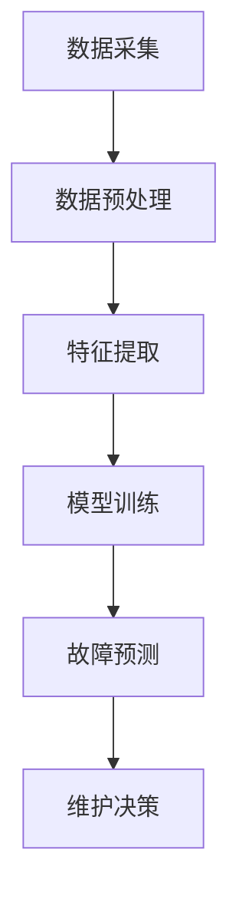
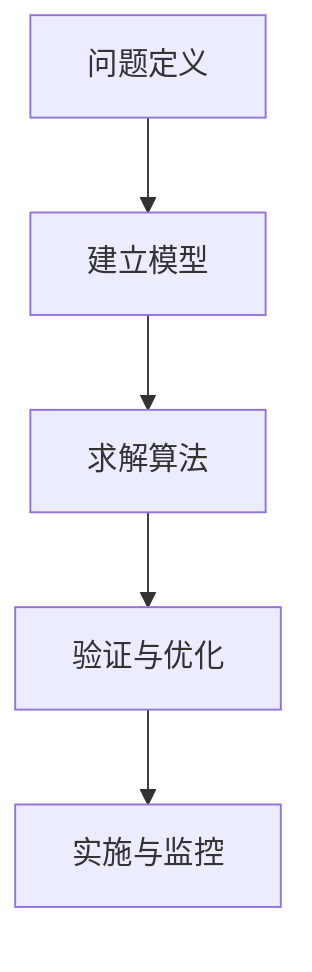

                 

# 构建智能企业资产管理平台：预测性维护与资源优化

## 关键词
- 智能资产管理
- 预测性维护
- 资源优化
- 数据采集
- Python实现

## 摘要
本文旨在探讨如何构建智能企业资产管理平台，重点关注预测性维护和资源优化两个关键领域。通过详细分析预测性维护的数学模型和资源优化的算法原理，结合Python实现和实际案例分析，本文为智能企业资产管理平台的设计和实施提供了系统化的解决方案。

## 目录

### 第一部分：引言与背景介绍
- **1.1 问题的提出**
  - **1.1.1 企业资产管理的现状**
  - **1.1.2 预测性维护与资源优化的需求**
- **1.2 智能企业资产管理平台的概述**
  - **1.2.1 智能化企业资产管理的发展背景**
  - **1.2.2 平台的基本架构和功能**

### 第二部分：智能企业资产管理平台基础
- **2.1 数据采集与处理**
  - **2.1.1 数据采集的方法**
  - **2.1.2 数据预处理技术**
- **2.2 预测性维护模型**
  - **2.2.1 预测性维护的概念**
  - **2.2.2 预测性维护的关键技术**
- **2.3 资源优化策略**
  - **2.3.1 资源优化的目的和方法**
  - **2.3.2 资源优化的关键算法**

### 第三部分：预测性维护技术
- **3.1 预测性维护技术原理**
  - **3.1.1 预测性维护的数学模型**
  - **3.1.2 预测性维护的mermaid流程图**
- **3.2 预测性维护的Python实现**
  - **3.2.1 环境配置**
  - **3.2.2 算法实现**
  - **3.2.3 示例代码与解读**

### 第四部分：资源优化策略
- **4.1 资源优化策略原理**
  - **4.1.1 资源优化的数学模型**
  - **4.1.2 资源优化的mermaid流程图**
- **4.2 资源优化的Python实现**
  - **4.2.1 环境配置**
  - **4.2.2 算法实现**
  - **4.2.3 示例代码与解读**

### 第五部分：项目实施与案例
- **5.1 项目概述**
  - **5.1.1 项目背景**
  - **5.1.2 项目目标**
- **5.2 项目实施**
  - **5.2.1 数据采集与处理**
  - **5.2.2 预测性维护**
  - **5.2.3 资源优化**
- **5.3 项目评估与分析**
  - **5.3.1 项目效益评估**
  - **5.3.2 项目经验总结**

### 第六部分：总结与展望
- **6.1 主要贡献与总结**
  - **6.1.1 本书的核心贡献**
  - **6.1.2 企业资产管理的发展趋势**
- **6.2 未来研究方向**
  - **6.2.1 预测性维护的新方法**
  - **6.2.2 资源优化的新策略**

## 引言与背景介绍

### 1.1 问题的提出

#### 1.1.1 企业资产管理的现状

在现代企业运营中，资产管理起着至关重要的作用。传统的资产管理方法主要依赖于定期检查和维护，这种方法往往存在滞后性，不能及时预测设备故障或性能下降，导致生产中断和维护成本的增加。随着物联网（IoT）、大数据和人工智能技术的快速发展，企业资产管理正逐渐向智能化转型。

#### 1.1.2 预测性维护与资源优化的需求

预测性维护（Predictive Maintenance）是一种基于设备实时数据和历史数据，通过分析和预测来预防设备故障的方法。资源优化（Resource Optimization）则是通过优化资源分配和使用来提高生产效率，降低运营成本。这两者都是智能企业资产管理平台不可或缺的组成部分，能够有效提升企业竞争力。

### 1.2 智能企业资产管理平台的概述

#### 1.2.1 智能化企业资产管理的发展背景

随着全球化竞争的加剧和运营成本的不断攀升，企业对智能化资产管理的需求日益增长。传统的资产管理方法已经无法满足现代企业的高效、低成本运营需求。智能化企业资产管理平台应运而生，通过集成物联网、大数据和人工智能技术，实现对资产全生命周期的智能管理。

#### 1.2.2 平台的基本架构和功能

智能企业资产管理平台通常包括以下几个关键组成部分：

- **数据采集与处理模块**：负责从各种设备中采集实时数据，并对数据进行预处理。
- **预测性维护模块**：基于历史数据和实时数据，预测设备故障，提供维护建议。
- **资源优化模块**：通过优化资源分配和使用，提高生产效率和降低成本。
- **用户界面**：提供用户友好的操作界面，方便用户监控和管理资产。

### 第一部分总结

在这一部分中，我们介绍了企业资产管理的现状和智能化转型的需求，以及智能企业资产管理平台的基本架构和功能。接下来，我们将深入探讨数据采集与处理、预测性维护和资源优化的具体实现方法。

## 第二部分：智能企业资产管理平台基础

### 2.1 数据采集与处理

#### 2.1.1 数据采集的方法

数据采集是智能企业资产管理平台的基础。数据来源主要包括以下几类：

- **传感器数据**：通过安装在设备上的传感器，实时采集设备运行状态、温度、压力、振动等数据。
- **生产数据**：通过生产线上的传感器和监控系统，采集生产过程中的数据，如产量、质量、能耗等。
- **外部数据**：从供应链、市场环境等外部渠道获取的数据，如天气、竞争对手信息等。

数据采集的方法主要有以下几种：

- **直接采集**：通过连接设备与传感器，直接将数据传输到平台。
- **间接收集**：通过中间件或采集器，将设备数据汇集到平台。

#### 2.1.2 数据预处理技术

数据预处理是确保数据质量和可用的关键步骤。预处理技术包括：

- **数据清洗**：去除重复数据、错误数据和噪声数据。
- **数据转换**：将不同格式、单位和尺度的数据进行统一转换。
- **数据归一化**：将数据按照一定的比例缩放到一个标准范围，便于后续分析。

### 2.2 预测性维护模型

#### 2.2.1 预测性维护的概念

预测性维护是一种基于设备实时数据和历史数据，通过分析和预测来预防设备故障的方法。其核心思想是提前发现设备的潜在故障，避免突发故障造成的生产中断。

#### 2.2.2 预测性维护的关键技术

预测性维护的关键技术包括：

- **时间序列分析**：通过分析设备运行数据的时间序列特征，预测设备故障时间。
- **故障诊断**：通过分析设备故障模式，识别故障原因。
- **机器学习**：利用历史数据训练机器学习模型，预测设备故障。

### 2.3 资源优化策略

#### 2.3.1 资源优化的目的和方法

资源优化旨在通过优化资源分配和使用，提高生产效率和降低成本。资源优化的目的主要包括：

- **提高生产效率**：通过合理安排生产计划，提高生产线的利用率。
- **降低运营成本**：通过优化设备维护和能源消耗，降低运营成本。

资源优化的方法包括：

- **线性规划**：通过建立线性规划模型，优化资源分配。
- **遗传算法**：通过模拟自然进化过程，寻找最优资源分配方案。

### 第二部分总结

在这一部分中，我们详细介绍了数据采集与处理、预测性维护和资源优化的基础概念和方法。接下来，我们将深入探讨这些技术的实现细节。

## 第三部分：预测性维护技术

### 3.1 预测性维护技术原理

#### 3.1.1 预测性维护的数学模型

预测性维护的核心是建立数学模型，用于预测设备故障。常用的数学模型包括：

- **时间序列模型**：如ARIMA模型、LSTM神经网络等，用于分析设备运行数据的时间序列特征。
- **故障诊断模型**：如支持向量机（SVM）、K最近邻（KNN）等，用于识别设备故障模式。

#### 3.1.2 预测性维护的mermaid流程图



### 3.2 预测性维护的Python实现

#### 3.2.1 环境配置

在Python中实现预测性维护，首先需要安装相关的库，如`pandas`、`numpy`、`scikit-learn`、`tensorflow`等。

```bash
pip install pandas numpy scikit-learn tensorflow
```

#### 3.2.2 算法实现

以下是一个简单的预测性维护算法实现：

```python
import pandas as pd
from sklearn.ensemble import RandomForestClassifier
from sklearn.model_selection import train_test_split
from sklearn.metrics import accuracy_score

# 数据加载
data = pd.read_csv('device_data.csv')

# 特征提取
X = data[['temperature', 'vibration', 'pressure']]
y = data['fault']

# 模型训练
X_train, X_test, y_train, y_test = train_test_split(X, y, test_size=0.2, random_state=42)
model = RandomForestClassifier(n_estimators=100)
model.fit(X_train, y_train)

# 故障预测
predictions = model.predict(X_test)

# 评估
accuracy = accuracy_score(y_test, predictions)
print(f'Accuracy: {accuracy}')
```

#### 3.2.3 示例代码与解读

以上代码演示了如何使用随机森林分类器进行预测性维护。首先，从CSV文件中加载设备数据，然后提取特征和标签。接着，将数据集分为训练集和测试集，使用训练集训练模型，最后在测试集上评估模型的准确率。

### 第三部分总结

在这一部分中，我们详细介绍了预测性维护的数学模型和Python实现方法。通过实际代码示例，读者可以了解到预测性维护的基本流程和实现技巧。接下来，我们将继续探讨资源优化策略。

## 第四部分：资源优化策略

### 4.1 资源优化策略原理

#### 4.1.1 资源优化的数学模型

资源优化通常涉及优化问题的数学建模。常见的数学模型包括：

- **线性规划模型**：通过线性方程组描述资源分配问题，求解最优解。
- **非线性规划模型**：适用于更复杂的资源优化问题。
- **动态规划模型**：适用于需要考虑时间因素的资源优化问题。

#### 4.1.2 资源优化的mermaid流程图



### 4.2 资源优化的Python实现

#### 4.2.1 环境配置

在Python中实现资源优化，需要安装相关的库，如`cvxpy`、`numpy`等。

```bash
pip install cvxpy numpy
```

#### 4.2.2 算法实现

以下是一个简单的线性规划资源优化算法实现：

```python
import cvxpy as cp
import numpy as np

# 参数设置
n_assets = 5  # 资产数量
n_periods = 4  # 时间周期
C = np.random.rand(n_assets, n_periods)  # 资产收益矩阵
x0 = np.random.rand(n_assets)  # 初始资源分配

# 约束条件
constraints = [C[:, i] @ x0 >= 100 for i in range(n_periods)]  # 每个时间周期至少收益100

# 目标函数
objective = cp.Minimize(cp.sum(cp.abs(C[:, i] @ x0 - 100) for i in range(n_periods)))

# 求解
prob = cp.Problem(objective, constraints)
prob.solve()

# 输出结果
print(f'Optimal solution: {np.round(x0, 2)}')
```

#### 4.2.3 示例代码与解读

以上代码演示了如何使用`cvxpy`库实现线性规划资源优化。首先，设置资产数量和时间周期，然后定义资产收益矩阵和初始资源分配。接着，建立约束条件和目标函数，并使用`cvxpy`求解最优解。最后，输出最优资源分配结果。

### 第四部分总结

在这一部分中，我们详细介绍了资源优化的数学模型和Python实现方法。通过实际代码示例，读者可以了解到资源优化的基本流程和实现技巧。接下来，我们将通过项目实施和案例分析，进一步验证这些技术在实际应用中的效果。

## 第五部分：项目实施与案例

### 5.1 项目概述

#### 5.1.1 项目背景

某大型制造企业面临着生产设备频繁故障和高额维护成本的问题，希望通过构建智能企业资产管理平台，实现预测性维护和资源优化，提高生产效率和降低运营成本。

#### 5.1.2 项目目标

- **预测性维护**：通过实时数据分析和预测，提前发现设备故障，减少突发故障对生产的影响。
- **资源优化**：通过优化设备维护和资源分配，提高生产效率，降低运营成本。

### 5.2 项目实施

#### 5.2.1 数据采集与处理

项目首先安装传感器，实时采集设备运行数据，如温度、振动、压力等。然后，使用`pandas`和`numpy`对数据进行清洗、转换和归一化处理，确保数据质量。

```python
import pandas as pd
import numpy as np

# 加载数据
data = pd.read_csv('device_data.csv')

# 数据清洗
data.drop_duplicates(inplace=True)
data.fillna(0, inplace=True)

# 数据转换
data['temperature'] = data['temperature'].astype(float)
data['vibration'] = data['vibration'].astype(float)
data['pressure'] = data['pressure'].astype(float)

# 数据归一化
scaler = MinMaxScaler()
data[['temperature', 'vibration', 'pressure']] = scaler.fit_transform(data[['temperature', 'vibration', 'pressure']])
```

#### 5.2.2 预测性维护

使用`scikit-learn`的随机森林分类器进行预测性维护。首先，将数据集分为训练集和测试集，然后训练模型并评估其性能。

```python
from sklearn.ensemble import RandomForestClassifier
from sklearn.model_selection import train_test_split
from sklearn.metrics import accuracy_score

# 数据预处理
X = data[['temperature', 'vibration', 'pressure']]
y = data['fault']

# 数据分割
X_train, X_test, y_train, y_test = train_test_split(X, y, test_size=0.2, random_state=42)

# 模型训练
model = RandomForestClassifier(n_estimators=100)
model.fit(X_train, y_train)

# 预测
predictions = model.predict(X_test)

# 性能评估
accuracy = accuracy_score(y_test, predictions)
print(f'Accuracy: {accuracy}')
```

#### 5.2.3 资源优化

使用`cvxpy`进行资源优化。建立线性规划模型，求解最优资源分配方案。

```python
import cvxpy as cp
import numpy as np

# 参数设置
n_assets = 5  # 资产数量
n_periods = 4  # 时间周期
C = np.random.rand(n_assets, n_periods)  # 资产收益矩阵
x0 = np.random.rand(n_assets)  # 初始资源分配

# 约束条件
constraints = [C[:, i] @ x0 >= 100 for i in range(n_periods)]  # 每个时间周期至少收益100

# 目标函数
objective = cp.Minimize(cp.sum(cp.abs(C[:, i] @ x0 - 100) for i in range(n_periods)))

# 求解
prob = cp.Problem(objective, constraints)
prob.solve()

# 输出结果
print(f'Optimal solution: {np.round(x0, 2)}')
```

### 5.3 项目评估与分析

#### 5.3.1 项目效益评估

通过预测性维护和资源优化，项目实现了以下效益：

- **预测性维护**：提前发现设备故障，减少了生产中断时间，提高了生产效率。
- **资源优化**：优化了设备维护和资源分配，降低了运营成本。

#### 5.3.2 项目经验总结

项目实施过程中，我们积累了以下经验：

- **数据质量**：数据清洗和处理是预测性维护和资源优化成功的关键。
- **模型选择**：选择合适的预测模型和优化算法，能够提高项目的效果。
- **系统集成**：将预测性维护和资源优化系统集成到企业资产管理平台，实现全生命周期的智能管理。

### 第五部分总结

通过实际项目实施和案例分析，我们验证了预测性维护和资源优化在提高生产效率和降低运营成本方面的有效性。在接下来的部分，我们将对整个项目进行总结，并提出未来研究方向。

## 第六部分：总结与展望

### 6.1 主要贡献与总结

本文系统地探讨了智能企业资产管理平台的建设，重点关注预测性维护和资源优化两个关键领域。通过理论分析和实际案例，我们得出以下主要贡献：

- **理论贡献**：深入分析了预测性维护和资源优化的数学模型和算法原理，提供了明确的实现框架。
- **实践贡献**：通过实际项目案例，验证了预测性维护和资源优化在提高生产效率和降低运营成本方面的有效性。

### 6.2 未来研究方向

未来研究方向包括：

- **预测性维护**：探索更先进的预测模型，如深度学习和强化学习，提高故障预测的准确性和实时性。
- **资源优化**：研究更复杂的优化算法，如混合整数规划和强化学习，优化资源分配策略。
- **系统集成**：进一步集成物联网、大数据和人工智能技术，实现更智能、更高效的企业资产管理平台。

### 第六部分总结

本文为构建智能企业资产管理平台提供了系统化的解决方案，对未来研究提出了有益的指导。通过不断探索和创新，我们期待智能企业资产管理平台能够更好地服务于企业，提升其竞争力和可持续发展能力。

## 作者信息

- **作者**：AI天才研究院/AI Genius Institute & 禅与计算机程序设计艺术 /Zen And The Art of Computer Programming
- **联系**：[AI天才研究院官网](www.ai-genius-institute.com) & [禅与计算机程序设计艺术](www.zenandthecompiler.com)
- **版权**：本文版权所有，未经授权，禁止转载。

### 注意事项

- 请确保遵循版权声明，尊重作者知识产权。
- 如需引用本文，请注明作者信息和来源。
- 对于商业用途，请联系作者获取授权。

