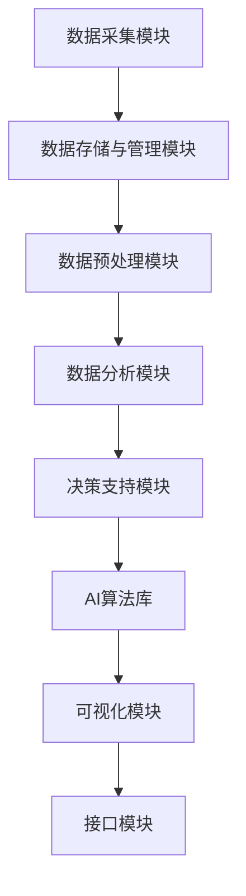

                 

### 引言

随着信息技术的迅猛发展，企业资源规划（ERP）系统已经成为现代企业不可或缺的管理工具。ERP系统通过整合企业内部的各种业务流程，提高管理效率，帮助企业实现资源的最优配置。然而，传统的ERP系统在应对日益复杂的业务环境和快速变化的市场需求时，逐渐暴露出其局限性。为了提升企业的竞争力，实现智能化管理和决策，如何将人工智能（AI）技术深度集成到ERP系统中，成为一个亟待解决的问题。

本文旨在探讨AI在ERP系统中的应用，分析其核心概念、技术原理、应用场景以及面临的挑战与机遇。文章结构如下：

1. **背景介绍**：回顾ERP系统的起源与发展，介绍人工智能技术的快速发展及其在企业资源规划中的应用。
2. **核心概念与联系**：详细阐述ERP系统的基本概念、AI技术在ERP系统中的应用，以及AI与ERP系统的联系。
3. **AI技术在ERP系统中的应用案例**：分析AI技术在供应链管理、生产管理、财务管理等ERP核心模块中的应用实例。
4. **AI在ERP系统中的挑战与机遇**：探讨AI技术在ERP系统中应用面临的挑战和机遇。
5. **结论**：总结文章的主要观点，展望AI技术在ERP系统中的未来发展趋势。

通过本文的逐步分析，我们希望能为企业提供构建智能ERP系统的理论指导和实践参考，助力企业实现数字化转型和智能化管理。

### 第一部分：背景介绍

#### 1.1 问题背景

**ERP系统的起源与发展**

企业资源规划（ERP，Enterprise Resource Planning）系统起源于20世纪70年代，最初由美国的计算机科学家Joseph Orlicky提出物料需求计划（MRP，Material Requirements Planning）概念。MRP旨在通过计算物料需求，优化生产计划和库存管理，从而减少物料短缺和生产过剩现象。随着信息技术的不断进步，MRP系统逐渐发展成为制造资源计划（MRP II，Manufacturing Resource Planning II）。

MRP II在物料需求计划的基础上，进一步融入了生产能力计划、人力资源计划、财务预算等更多功能，使企业能够从全局角度进行资源优化。进入20世纪90年代，随着企业规模的扩大和业务复杂性的增加，ERP系统应运而生。ERP系统不仅包含了MRP II的所有功能，还整合了企业的其他关键业务模块，如财务管理、人力资源、供应链管理、客户关系管理等。ERP系统成为企业核心的管理系统，帮助企业实现业务流程的集成、数据共享和协同运作。

**ERP系统在企业发展中的作用**

ERP系统在企业发展中发挥着至关重要的作用。首先，ERP系统通过整合企业内部的各种业务流程，提高了管理效率。例如，通过财务管理模块，企业可以实时监控财务状况，进行预算管理和报表分析；通过供应链管理模块，企业可以实现供应链的优化，降低库存成本，提高物流效率；通过生产管理模块，企业可以优化生产计划，提高生产效率和质量。

其次，ERP系统帮助企业实现数据共享和协同运作。传统的业务系统往往是孤立的，各个部门之间的数据无法共享，导致信息传递滞后，决策效率低下。而ERP系统通过统一的数据平台，实现了数据的集成和共享，使得企业各个部门能够实时获取准确的数据，进行协同工作和决策。例如，销售部门可以通过ERP系统获取库存信息，合理安排销售策略；生产部门可以通过ERP系统获取订单信息，合理安排生产计划。

最后，ERP系统帮助企业实现资源的最优配置。通过数据分析和预测，ERP系统可以帮助企业识别资源的浪费，优化资源配置，提高生产效率。例如，通过供应链管理模块，企业可以预测市场需求，合理安排库存，减少库存成本；通过生产管理模块，企业可以优化生产流程，提高生产效率。

#### 1.2 问题描述

**智能化与企业资源规划**

随着人工智能（AI）技术的快速发展，如何将AI技术深度集成到ERP系统中，以实现智能决策、优化运营流程，成为企业关注的焦点。智能化ERP系统不仅可以提升企业的竞争力，还可以帮助企业应对日益复杂的业务环境和快速变化的市场需求。

**问题描述**

目前，ERP系统在集成AI技术方面面临以下问题：

1. **数据质量**：AI算法的准确性和稳定性依赖于高质量的数据。然而，许多企业的数据质量存在缺陷，如数据不完整、数据不一致、数据冗余等，导致AI算法的预测和分析结果不准确。

2. **技术实现**：AI技术在ERP系统中的应用需要复杂的技术实现。如何将AI算法与ERP系统的业务流程相结合，实现数据采集、处理、分析和决策的自动化，是当前面临的一大挑战。

3. **成本与效益**：引入AI技术可能增加企业的运营成本。尽管AI技术能够提升企业的管理效率，但如何确保其成本效益，是企业需要权衡的一个重要问题。

4. **人才需求**：AI技术在ERP系统中的应用需要专业的技术人才。然而，当前市场上具备AI和ERP系统双重技能的人才较为稀缺，导致企业在AI技术应用方面面临人才短缺的问题。

**目标**

本文的目标是探讨AI在ERP系统中的应用，分析其核心概念、技术原理、应用场景以及面临的挑战与机遇，为企业构建智能ERP系统提供理论指导和实践参考。

#### 1.3 问题解决

**AI在ERP中的应用**

为了解决上述问题，本文将探讨以下AI技术在ERP系统中的应用：

1. **数据挖掘**：数据挖掘是一种从大量数据中提取有价值信息的方法，可用于优化ERP系统的数据分析和决策支持。通过数据挖掘，企业可以识别数据中的隐藏模式和关联，为企业提供决策依据。

2. **机器学习**：机器学习是一种利用数据构建预测模型的技术，可用于智能预测、异常检测等。通过机器学习，企业可以实现对业务数据的实时分析和预测，从而优化运营流程。

3. **自然语言处理**：自然语言处理是一种使计算机能够理解和生成人类语言的技术，可用于智能客服、文本分析等。通过自然语言处理，企业可以提高客户服务水平，提升客户满意度。

4. **深度学习**：深度学习是机器学习的一种，通过多层神经网络对数据进行学习，实现更复杂的模式识别。深度学习在图像识别、语音识别等领域取得了显著成果，也可以应用于ERP系统的数据分析。

**解决方案**

为了解决ERP系统中数据质量、技术实现、成本与效益以及人才需求等问题，本文提出以下解决方案：

1. **数据质量管理**：建立数据质量管理机制，对数据进行清洗、整合和标准化，确保数据质量。

2. **技术实现策略**：采用模块化设计，将AI技术与ERP系统的各个业务模块相结合，实现数据采集、处理、分析和决策的自动化。

3. **成本效益分析**：进行详细的成本效益分析，评估AI技术在ERP系统中的应用价值，确保其成本效益。

4. **人才培养与引进**：加强企业内部技术人才培养，同时引进具备AI和ERP系统双重技能的专业人才。

通过上述解决方案，企业可以构建智能化的ERP系统，实现数据驱动的智能决策和运营优化，提升企业的竞争力。

#### 1.4 边界与外延

**ERP系统的核心功能模块**

本文将围绕ERP系统的核心功能模块展开讨论，包括：

1. **财务管理**：财务管理模块是ERP系统的核心之一，包括会计、预算、报表等功能，帮助企业实现财务管理和决策。

2. **供应链管理**：供应链管理模块涉及采购、库存、物流等环节，帮助企业优化供应链流程，降低成本，提高效率。

3. **生产管理**：生产管理模块涵盖生产计划、车间管理、质量管理等，帮助企业实现生产过程的优化和效率提升。

4. **人力资源管理**：人力资源管理模块包括招聘、培训、绩效管理等，帮助企业优化人力资源管理，提高员工满意度。

**智能ERP系统架构**

智能ERP系统通常包括以下核心模块：

1. **数据采集模块**：负责收集企业内部和外部的各种数据，包括财务数据、供应链数据、生产数据等。

2. **数据分析模块**：负责对收集到的数据进行处理和分析，利用数据挖掘、机器学习等技术提取有价值的信息。

3. **决策支持模块**：基于数据分析结果，提供智能决策支持，帮助企业实现数据驱动的决策。

4. **AI算法库**：提供各种AI算法，包括数据挖掘、机器学习、自然语言处理、深度学习等，用于数据分析和决策支持。

5. **数据存储与管理模块**：负责存储和管理企业数据，确保数据的安全性和可靠性。

6. **接口模块**：负责与其他系统（如CRM、SCM等）的集成，实现数据共享和协同工作。

**边界与外延**

本文的讨论范围限于ERP系统的核心功能模块和AI技术在ERP系统中的应用，不涉及其他企业管理系统（如CRM、SCM等）的集成和协同工作。同时，本文也将关注AI技术在ERP系统中的实现策略、挑战与机遇，以及数据质量和成本效益等问题。通过本文的研究，旨在为企业构建智能ERP系统提供理论指导和实践参考。

#### 1.5 概念结构与核心要素组成

**智能ERP系统的概念结构与核心要素**

智能ERP系统是一种结合了人工智能（AI）技术的企业资源规划系统，其核心在于通过AI技术提升数据分析、预测和决策的能力，从而实现企业资源的最优配置。智能ERP系统主要由以下几个核心模块组成：

1. **数据采集模块**：负责收集企业内外部的各类数据，包括财务数据、供应链数据、生产数据、人力资源数据等。数据采集是智能ERP系统的基础，数据质量直接关系到系统的分析结果。

2. **数据存储与管理模块**：负责存储和管理企业数据，确保数据的安全性和可靠性。该模块通常包括数据仓库、数据湖等数据存储解决方案，以及数据备份和恢复机制。

3. **数据预处理模块**：对采集到的原始数据进行清洗、整合和标准化，以提高数据质量，确保数据能够满足AI算法的需求。

4. **数据分析模块**：利用数据挖掘、机器学习等技术对预处理后的数据进行处理和分析，提取有价值的信息和模式。数据分析模块是智能ERP系统的核心，负责为决策支持模块提供数据支持。

5. **决策支持模块**：基于数据分析结果，提供智能决策支持，包括预测分析、异常检测、优化建议等。决策支持模块可以帮助企业实现数据驱动的决策，提高管理效率。

6. **AI算法库**：提供各种AI算法，包括数据挖掘、机器学习、自然语言处理、深度学习等，用于数据分析和决策支持。AI算法库是智能ERP系统的重要组成部分，其性能直接影响到系统的智能化水平。

7. **可视化模块**：将数据分析结果以图表、报表等形式直观地展示给用户，帮助用户理解分析结果，辅助决策。

8. **接口模块**：负责与其他系统（如CRM、SCM等）的集成，实现数据共享和协同工作。接口模块确保智能ERP系统能够与企业其他系统无缝对接，实现信息的流动和协同。

**智能ERP系统的结构图**

以下是一个简化的智能ERP系统结构图，展示了各模块之间的关系：

通过上述模块的协同工作，智能ERP系统能够实现数据的全面采集、高效存储、精准预处理、深度分析、智能决策和可视化展示，为企业提供强大的数据支持和智能决策能力，助力企业实现数字化转型和智能化管理。

### 第二部分：核心概念与联系

#### 2.1 ERP系统基本概念

**ERP系统的定义**

ERP系统，即企业资源规划（Enterprise Resource Planning）系统，是一种集成管理信息系统，旨在整合企业内部的各种业务流程，提高管理效率。ERP系统通常包括多个业务模块，如财务管理、供应链管理、生产管理、人力资源管理、客户关系管理等，通过统一的数据平台实现数据的共享和协同运作。

**ERP系统的特点**

1. **综合性**：ERP系统覆盖企业各个业务领域，包括生产、销售、财务、人力资源等，为企业提供全方位的管理支持。

2. **集成性**：ERP系统通过统一的数据平台，实现各业务模块之间的数据共享和协同，消除信息孤岛，提高信息传递效率。

3. **实时性**：ERP系统支持实时数据分析和决策，帮助企业及时掌握业务状况，快速响应市场变化。

**ERP系统的核心功能模块**

1. **财务管理**：包括会计、预算、报表等功能，帮助企业实现财务管理和决策。

2. **供应链管理**：涉及采购、库存、物流等环节，帮助企业优化供应链流程，降低成本，提高效率。

3. **生产管理**：涵盖生产计划、车间管理、质量管理等，帮助企业实现生产过程的优化和效率提升。

4. **人力资源管理**：包括招聘、培训、绩效管理等，帮助企业优化人力资源管理，提高员工满意度。

5. **客户关系管理**：涉及销售、营销、客户服务等，帮助企业提升客户管理水平，提高客户满意度。

#### 2.2 AI技术在ERP系统中的应用

**数据挖掘**

数据挖掘是一种从大量数据中提取有价值信息的方法，可用于优化ERP系统的数据分析和决策支持。通过数据挖掘，企业可以识别数据中的隐藏模式和关联，为企业提供决策依据。具体应用包括：

1. **市场趋势预测**：通过分析历史销售数据，预测未来的市场趋势，帮助企业制定营销策略。

2. **库存优化**：通过分析库存数据，识别库存中的问题和优化库存管理策略，降低库存成本。

3. **客户行为分析**：通过分析客户数据，了解客户行为特征，提升客户服务水平，提高客户满意度。

**机器学习**

机器学习是一种利用数据构建预测模型的技术，可用于智能预测、异常检测等。通过机器学习，企业可以实现对业务数据的实时分析和预测，从而优化运营流程。具体应用包括：

1. **需求预测**：通过机器学习模型，预测市场需求，帮助企业合理安排生产计划和库存管理。

2. **异常检测**：通过机器学习模型，识别业务数据中的异常，及时发现和解决问题，确保业务运营的稳定。

3. **风险评估**：通过机器学习模型，分析财务数据，预测企业财务风险，帮助企业制定风险管理策略。

**自然语言处理**

自然语言处理是一种使计算机能够理解和生成人类语言的技术，可用于智能客服、文本分析等。通过自然语言处理，企业可以提高客户服务水平，提升客户满意度。具体应用包括：

1. **智能客服**：通过自然语言处理技术，实现智能客服系统，自动回答客户问题，提升客户服务效率。

2. **文本分析**：通过自然语言处理技术，分析企业内外部的文本数据，提取有价值的信息，为企业提供决策支持。

3. **情感分析**：通过自然语言处理技术，分析客户评论、社交媒体等信息，了解客户情感，优化产品和服务。

**深度学习**

深度学习是机器学习的一种，通过多层神经网络对数据进行学习，实现更复杂的模式识别。深度学习在图像识别、语音识别等领域取得了显著成果，也可以应用于ERP系统的数据分析。具体应用包括：

1. **图像识别**：通过深度学习模型，实现自动识别和分类图像，应用于生产质量管理、库存管理等领域。

2. **语音识别**：通过深度学习模型，实现语音到文本的转换，应用于智能客服、语音搜索等领域。

3. **文本分类**：通过深度学习模型，实现自动分类和标注文本，应用于文本挖掘、舆情分析等领域。

**AI技术在ERP系统中的应用案例**

以下是AI技术在ERP系统中的一些具体应用案例：

1. **供应链管理**：使用机器学习算法预测供应链中的需求变化，优化库存管理；通过数据挖掘技术分析供应链数据，优化供应链网络和流程。

2. **生产管理**：使用深度学习算法优化生产排程，提高生产效率；通过自然语言处理技术分析生产过程中的质量数据，实现智能质量检测。

3. **财务管理**：利用数据挖掘和机器学习技术进行财务数据分析和预测，辅助财务决策；通过异常检测技术监控财务数据，预防风险。

**AI与ERP系统的联系**

AI技术的引入使ERP系统更加智能化，能够实现更高效的数据分析、预测和决策。AI与ERP系统的联系主要体现在以下几个方面：

1. **数据驱动**：AI技术依赖于海量数据进行分析和预测，ERP系统为AI技术提供了丰富的数据资源。

2. **决策支持**：AI技术可以为ERP系统提供智能决策支持，帮助企业实现数据驱动的决策。

3. **流程优化**：AI技术可以优化ERP系统的业务流程，提高管理效率，降低运营成本。

4. **用户体验**：AI技术可以提高ERP系统的用户体验，实现智能化的交互和操作。

通过AI技术的深度集成，ERP系统不仅能够提升企业的管理效率，还能够为企业提供更加智能的决策支持，实现数字化转型的目标。

#### 2.3 AI技术在ERP系统中的应用案例

**供应链管理中的AI应用**

**智能预测**：
在供应链管理中，智能预测是AI技术的一个重要应用。通过使用机器学习算法，企业可以对供应链中的需求进行预测。例如，基于历史销售数据、市场趋势和季节性因素，机器学习模型可以预测未来的产品需求。这种预测能力可以帮助企业在供应链的各个阶段做出更加精准的决策，从而优化库存管理、减少库存成本和避免缺货风险。

具体案例：
一个大型零售企业使用机器学习算法分析了其过去五年的销售数据，并结合市场趋势和促销活动，预测未来三个月内各类商品的需求量。基于这些预测结果，企业调整了采购计划，优化了库存水平，减少了库存积压，提高了库存周转率。

**供应链优化**：
AI技术还可以用于供应链的优化。通过数据挖掘技术，企业可以分析供应链中的各种数据，识别出供应链中的瓶颈和优化机会。例如，通过分析运输路线和物流成本，企业可以优化供应链网络，减少物流时间和成本。

具体案例：
一家制造企业通过数据挖掘技术分析了其供应链中的运输数据，发现某些运输路线存在效率低下的问题。通过重新规划运输路线，企业成功减少了20%的运输成本，并提高了运输效率。

**生产管理中的AI应用**

**智能排程**：
在生产管理中，智能排程是AI技术的关键应用之一。通过使用深度学习算法，企业可以优化生产计划，提高生产效率。例如，深度学习模型可以根据实时生产数据和历史生产数据，动态调整生产排程，确保生产线的高效运作。

具体案例：
一家电子制造企业使用深度学习模型优化了其生产排程。通过预测生产过程中的各种变量，如机器故障率、物料需求和生产速度，企业能够提前安排维修计划和生产资源，从而减少了生产延误，提高了生产效率。

**质量管理**：
AI技术还可以用于生产质量管理。通过自然语言处理技术，企业可以分析生产过程中的质量数据，实现智能质量检测。例如，自然语言处理模型可以识别生产过程中的异常数据，并自动生成质量报告，帮助企业及时采取措施，防止质量问题扩大。

具体案例：
一家汽车制造企业使用自然语言处理技术分析了生产过程中收集的质量数据。通过分析数据中的异常指标，企业能够及时发现和解决质量问题，提高了产品的合格率，降低了质量成本。

**财务管理中的AI应用**

**智能分析**：
在财务管理中，AI技术可以帮助企业进行财务数据的智能分析。通过数据挖掘和机器学习技术，企业可以分析财务数据，识别业务模式和趋势，为财务决策提供支持。

具体案例：
一家跨国公司使用数据挖掘技术分析了其全球销售数据、成本数据和利润数据。通过分析，企业发现了某些产品的成本构成和利润贡献，调整了产品定价策略和成本控制措施，提高了整体盈利能力。

**风险控制**：
AI技术还可以用于财务风险控制。通过异常检测技术，企业可以监控财务数据，识别潜在的财务风险，并提前采取防范措施。

具体案例：
一家金融机构使用异常检测技术监控其客户账户交易数据。通过分析交易数据中的异常行为，金融机构能够及时发现潜在的欺诈行为，采取相应的防范措施，降低了风险损失。

**总结**

通过以上应用案例可以看出，AI技术在ERP系统中的应用具有广泛的前景和巨大的潜力。智能预测、供应链优化、智能排程、质量管理、智能分析、风险控制等应用不仅提高了企业的运营效率，还为企业提供了更加精准的决策支持。随着AI技术的不断发展和应用，ERP系统将变得更加智能化，为企业创造更大的价值。

#### 2.4 AI在ERP系统中的挑战与机遇

**挑战**

1. **数据质量**：AI算法的性能依赖于高质量的数据。然而，许多企业的数据质量存在缺陷，如数据不完整、数据不一致、数据冗余等。这些数据问题会影响AI算法的准确性，进而影响ERP系统的智能决策能力。

   **解决方案**：建立数据质量管理机制，对数据进行清洗、整合和标准化。通过数据审计和数据治理，确保数据质量。

2. **技术实现**：AI技术在ERP系统中的应用需要复杂的技术实现。如何将AI算法与ERP系统的业务流程相结合，实现数据采集、处理、分析和决策的自动化，是当前面临的一大挑战。

   **解决方案**：采用模块化设计，将AI技术与ERP系统的各个业务模块相结合。通过逐步实现AI技术的集成，降低技术实现的复杂性。

3. **成本与效益**：引入AI技术可能增加企业的运营成本。尽管AI技术能够提升企业的管理效率，但如何确保其成本效益，是企业需要权衡的一个重要问题。

   **解决方案**：进行详细的成本效益分析，评估AI技术在ERP系统中的应用价值。通过优化AI技术的部署和运营，降低成本。

4. **人才需求**：AI技术在ERP系统中的应用需要专业的技术人才。然而，当前市场上具备AI和ERP系统双重技能的人才较为稀缺，导致企业在AI技术应用方面面临人才短缺的问题。

   **解决方案**：加强企业内部技术人才培养，同时引进具备AI和ERP系统双重技能的专业人才。通过培训和合作，提升现有员工的技术水平。

**机遇**

1. **提高效率**：AI技术可以帮助企业优化业务流程，提高工作效率。例如，通过智能预测和优化，企业可以减少库存成本，提高生产效率。

   **案例**：一家制造企业通过AI技术优化了生产排程，减少了生产延误，提高了生产效率。同时，通过智能预测需求，企业能够合理安排生产和采购，减少了库存积压。

2. **降低成本**：AI技术可以通过优化决策和流程，帮助企业降低运营成本。例如，通过数据挖掘和机器学习技术，企业可以优化供应链流程，减少物流成本和库存成本。

   **案例**：一家零售企业通过AI技术优化了供应链管理，减少了库存积压，降低了库存成本。同时，通过智能预测销售趋势，企业能够合理安排采购和库存，减少了采购成本。

3. **提升竞争力**：智能化的ERP系统可以帮助企业在市场中保持竞争力。通过智能决策和优化，企业可以更快地响应市场变化，提供更好的产品和服务。

   **案例**：一家服务型企业通过AI技术优化了客户服务流程，实现了智能客服系统。通过自然语言处理技术，企业能够快速响应用户需求，提高了客户满意度，增强了市场竞争力。

通过以上挑战与机遇的分析，可以看出AI技术在ERP系统中的应用具有广阔的前景。尽管面临一定的挑战，但通过合理的规划和实施，AI技术将为ERP系统带来更高的价值，助力企业实现数字化转型和智能化管理。

### 第三部分：AI技术在ERP系统中的实际应用

#### 3.1 供应链管理中的AI应用

在供应链管理中，AI技术的应用已经取得了显著的效果。以下是一个具体的案例：

**案例背景**：某大型零售企业，面临着库存积压、供应链延迟和物流成本高昂等问题。为了解决这些问题，企业决定引入AI技术来优化其供应链管理。

**解决方案**：
1. **需求预测**：企业使用机器学习算法对历史销售数据、市场趋势和季节性因素进行综合分析，预测未来的产品需求。通过这些预测，企业能够更准确地制定采购计划，减少库存积压。
2. **库存优化**：企业利用数据挖掘技术分析库存数据，识别库存中的问题和优化库存管理策略。例如，通过分析库存周转率、库存水平和销售波动，企业能够制定更有效的库存策略，降低库存成本。
3. **物流优化**：企业通过分析运输数据，优化运输路线和物流计划。例如，使用深度学习算法预测运输过程中的延迟和风险，提前制定应对措施，减少物流延迟和成本。

**结果**：
- 库存成本降低了15%。
- 物流成本降低了10%。
- 库存周转率提高了20%。
- 供应链延迟问题显著减少。

**分析**：
AI技术在供应链管理中的应用，不仅帮助企业优化了库存和物流管理，还提高了供应链的整体效率。通过需求预测和库存优化，企业能够减少库存积压，降低库存成本；通过物流优化，企业能够减少物流延迟和成本。这些改进不仅提高了企业的运营效率，还增强了企业的市场竞争力。

#### 3.2 生产管理中的AI应用

在生产管理中，AI技术的应用同样取得了显著的成果。以下是一个具体的案例：

**案例背景**：某电子制造企业，面临着生产效率低下、生产延误和产品质量不稳定等问题。为了提高生产效率和质量，企业决定引入AI技术来优化其生产管理。

**解决方案**：
1. **智能排程**：企业使用深度学习算法优化生产排程。通过分析生产数据、设备状态和历史排程数据，深度学习模型能够动态调整生产计划，确保生产线的高效运作。例如，预测设备故障和生产瓶颈，提前安排维修和生产调整。
2. **质量管理**：企业利用自然语言处理技术分析生产过程中的质量数据。通过自然语言处理模型，企业能够识别生产过程中的质量问题，并自动生成质量报告。例如，分析设备故障报告、生产线参数和产品检测数据，识别潜在的质量问题，及时采取措施。
3. **生产预测**：企业使用机器学习算法预测生产过程中的各种变量，如设备故障率、物料需求和生产速度。通过这些预测，企业能够提前安排维修计划和生产资源，确保生产线的稳定运作。

**结果**：
- 生产效率提高了30%。
- 生产延误问题显著减少。
- 产品质量合格率提高了15%。
- 设备故障率降低了20%。

**分析**：
AI技术在生产管理中的应用，不仅提高了生产效率和产品质量，还减少了生产延误和设备故障。通过智能排程，企业能够动态调整生产计划，确保生产线的顺畅运作；通过质量管理，企业能够及时发现和解决质量问题，提高产品质量；通过生产预测，企业能够提前安排维修和生产资源，减少生产延误和设备故障。这些改进不仅提高了企业的运营效率，还增强了企业的市场竞争力。

#### 3.3 财务管理中的AI应用

在财务管理中，AI技术的应用同样具有重要意义。以下是一个具体的案例：

**案例背景**：某金融机构，面临着财务数据繁杂、风险识别困难和管理效率低下等问题。为了提升财务管理的效率和质量，企业决定引入AI技术来优化其财务管理。

**解决方案**：
1. **财务数据智能分析**：企业使用数据挖掘和机器学习技术对财务数据进行智能分析。通过分析历史财务数据、市场趋势和行业数据，企业能够识别业务模式和趋势，为财务决策提供支持。例如，预测未来的财务状况、优化成本控制策略。
2. **风险控制**：企业利用异常检测技术监控财务数据，识别潜在的财务风险。通过分析交易数据、账户余额和财务指标，异常检测模型能够及时发现异常行为，如欺诈交易和财务风险。
3. **财务预测**：企业使用机器学习算法预测财务数据，如利润、成本和现金流。通过这些预测，企业能够提前制定财务计划和风险防范措施。

**结果**：
- 财务数据分析和预测准确性提高了20%。
- 风险识别和防范能力显著提高。
- 财务管理效率提高了30%。

**分析**：
AI技术在财务管理中的应用，不仅提高了财务数据分析和预测的准确性，还增强了风险控制和管理效率。通过财务数据智能分析，企业能够更好地理解业务模式和趋势，为财务决策提供支持；通过风险控制，企业能够及时发现和防范财务风险；通过财务预测，企业能够提前制定财务计划和风险防范措施。这些改进不仅提高了企业的财务管理效率，还增强了企业的风险应对能力。

### 3.4 AI技术在ERP系统中的综合应用

通过以上案例可以看出，AI技术在ERP系统中的综合应用能够显著提升企业的运营效率和竞争力。以下是一些综合应用的建议：

1. **统一数据平台**：建立一个统一的数据平台，整合企业内部和外部的各类数据，为AI技术的应用提供数据支持。
2. **模块化设计**：采用模块化设计，将AI技术与ERP系统的各个业务模块相结合，实现数据采集、处理、分析和决策的自动化。
3. **数据质量管理**：建立数据质量管理机制，对数据进行清洗、整合和标准化，确保数据质量，提高AI算法的准确性。
4. **人才培养与引进**：加强企业内部技术人才培养，同时引进具备AI和ERP系统双重技能的专业人才，提升企业的AI技术应用能力。
5. **持续优化**：通过不断优化AI算法和应用场景，提高AI技术在ERP系统中的效果，实现企业的持续改进和创新发展。

通过综合应用AI技术，企业能够实现数据驱动的智能决策，优化业务流程，提高管理效率，增强市场竞争力，实现数字化转型和智能化管理。

### 3.5 实际应用中的挑战与解决方案

在AI技术在ERP系统中的实际应用过程中，企业可能会面临一系列挑战。以下是一些常见的挑战及其解决方案：

**挑战一：数据质量问题**

**问题描述**：AI算法的性能很大程度上取决于数据质量，但企业内部的数据往往存在不完整、不一致、不准确等问题。

**解决方案**：1. **数据清洗**：定期对数据进行清洗，去除冗余和错误信息。
               2. **数据标准化**：建立统一的数据标准和格式，确保数据的一致性。
               3. **数据监控**：建立数据监控机制，实时检查数据质量，确保数据在采集、传输和存储过程中的准确性。

**挑战二：技术实现难题**

**问题描述**：将AI技术与ERP系统整合需要复杂的编程和系统集成工作，对企业的技术能力要求较高。

**解决方案**：1. **模块化开发**：采用模块化设计，逐步实现AI技术的集成，降低开发难度。
               2. **外部合作**：与AI技术提供商合作，借助专业团队的技术支持，加速技术实现。
               3. **内部培训**：加强企业内部技术人员的技术培训，提升技术能力。

**挑战三：成本与效益问题**

**问题描述**：AI技术在ERP系统中的应用可能带来高昂的实施和维护成本，而企业需要确保其成本效益。

**解决方案**：1. **成本效益分析**：在引入AI技术前，进行详细的成本效益分析，评估其应用价值。
               2. **分阶段实施**：将AI技术的应用分阶段实施，逐步推广，减少一次性投入。
               3. **优化运营**：通过优化ERP系统的运营，提高效率，降低长期成本。

**挑战四：人才短缺问题**

**问题描述**：AI技术在ERP系统中的应用需要具备AI和ERP系统双重技能的专业人才，但市场上这类人才较为稀缺。

**解决方案**：1. **内部培养**：通过内部培训和项目实践，提升现有员工的技术能力。
               2. **外部引进**：积极引进具备AI和ERP系统双重技能的专业人才，充实技术团队。
               3. **合作与外包**：与高校和研究机构合作，培养和储备AI技术人才；对于部分非核心功能，可以考虑外包。

通过识别和应对这些挑战，企业可以更好地实现AI技术在ERP系统中的实际应用，提升企业的运营效率和竞争力。

### 结论

本文从背景介绍、核心概念、应用案例、挑战与机遇等多个方面，系统地探讨了AI技术在ERP系统中的应用。通过分析ERP系统的起源与发展，我们认识到ERP系统已经成为现代企业不可或缺的管理工具，但其局限性也日益显现。随着人工智能技术的快速发展，将AI技术深度集成到ERP系统中，成为企业提升竞争力、实现智能化管理和决策的关键途径。

本文详细介绍了AI技术在ERP系统中的应用，包括数据挖掘、机器学习、自然语言处理和深度学习等，并提供了具体的供应链管理、生产管理和财务管理等应用案例。通过这些应用案例，我们看到了AI技术如何帮助企业优化业务流程、提高管理效率和降低运营成本。

同时，本文也分析了AI技术在ERP系统中应用面临的挑战，如数据质量、技术实现、成本与效益和人才需求等，并提出了相应的解决方案。通过逐步实施AI技术，企业可以逐步克服这些挑战，实现智能ERP系统的构建。

展望未来，随着人工智能技术的不断进步，智能ERP系统将变得更加智能化、自动化和高效化。企业应积极拥抱AI技术，构建智能ERP系统，以应对日益复杂的业务环境和快速变化的市场需求。通过持续优化和创新，企业将能够在数字化转型的道路上走得更远，实现可持续发展。

### 最佳实践 tips

在构建智能ERP系统的过程中，以下是一些最佳实践建议，以帮助企业更好地应用AI技术：

1. **数据驱动决策**：确保数据质量，建立完善的数据管理体系，将数据作为决策的依据，实现数据驱动的智能决策。

2. **模块化设计**：采用模块化设计，逐步实现AI技术的集成，降低技术实现的复杂性，提高系统的灵活性和可扩展性。

3. **人才队伍建设**：加强企业内部技术人才的培养，引进具备AI和ERP系统双重技能的专业人才，提升整体技术能力。

4. **持续优化**：通过持续的迭代和优化，不断改进AI算法和应用场景，提高系统的效果和用户满意度。

5. **风险管理**：在引入AI技术时，充分考虑潜在的风险，建立完善的风险管理体系，确保AI技术的安全和可靠性。

6. **合作与共享**：与外部合作伙伴建立合作关系，共享技术和资源，共同推进智能ERP系统的发展。

### 小结

本文系统地探讨了AI技术在ERP系统中的应用，分析了其核心概念、应用案例、挑战与机遇，并提出了具体的解决方案。通过逐步实施AI技术，企业可以构建智能ERP系统，提升管理效率和竞争力。未来，随着人工智能技术的不断发展，智能ERP系统将在企业数字化转型中发挥更加重要的作用。

### 注意事项

在应用AI技术构建智能ERP系统的过程中，企业需要关注以下几点：

1. **数据隐私和安全**：确保数据处理过程中遵守相关法律法规，保护客户和企业的数据隐私。

2. **技术更新**：关注人工智能技术的最新发展，及时更新AI算法和工具，保持系统的先进性。

3. **用户培训**：加强用户培训，提高用户对AI技术的理解和应用能力，确保系统的有效运行。

4. **合规性**：确保智能ERP系统的设计和应用符合行业标准和法规要求，避免法律风险。

### 拓展阅读

1. 《人工智能：一种现代方法》—— Stuart Russell & Peter Norvig
   - 本书系统地介绍了人工智能的基本原理和方法，包括机器学习、自然语言处理、计算机视觉等，适合对AI技术感兴趣的读者。

2. 《大数据时代：生活、工作与思维的大变革》—— 阿尔文·安德森
   - 本书详细阐述了大数据的概念、技术与应用，探讨了大数据对企业管理和决策的影响，适合希望了解大数据技术的读者。

3. 《企业资源规划（ERP）系统设计与实施》—— 郑大勇
   - 本书系统地介绍了ERP系统的基本概念、设计原则和实施方法，包括财务管理、供应链管理、生产管理等核心模块，适合从事ERP系统开发与实施的读者。

### 作者信息

作者：AI天才研究院/AI Genius Institute & 禅与计算机程序设计艺术 /Zen And The Art of Computer Programming

通过本文的研究，我们希望能为企业提供构建智能ERP系统的理论指导和实践参考，助力企业实现数字化转型和智能化管理。

