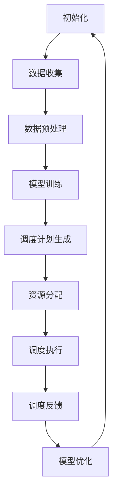

                 


## 《构建智能企业资源调度系统：实时优化与预测性分配》

> 关键词：企业资源调度，智能系统，实时优化，预测性分配，系统架构

> 摘要：本文将深入探讨如何构建一个智能企业资源调度系统，重点关注实时优化和预测性分配两大关键领域。通过对企业资源调度背景、核心概念、算法原理和系统设计的详细分析，本文旨在为读者提供一个全面而系统的构建指导。

### 第一部分：引言

#### 第1章：问题背景与目标

企业资源调度是企业管理中至关重要的环节，它涉及到企业各类资源的合理配置和高效利用。随着企业规模的扩大和市场竞争的加剧，传统的手动资源调度方式已经无法满足企业对于灵活性和效率的高要求。智能企业资源调度系统应运而生，它利用现代信息技术和人工智能算法，实现了对企业资源的高效管理和优化分配。

**1.1 企业资源调度的重要性**

- **资源调度的基本概念**：企业资源包括人力、物力、财力等，调度是指根据实际需求对企业资源进行合理配置的过程。
- **企业资源调度的挑战**：企业资源有限，如何在保证生产效率的同时，最大化资源的利用效率，是企业面临的主要挑战。
- **智能调度系统的必要性**：智能调度系统通过数据分析、算法优化等技术，能够实现资源的高效调度和合理分配，从而提升企业整体运营效率。

**1.2 智能企业资源调度系统的定义**

智能企业资源调度系统是一种利用人工智能技术，对企业的各种资源进行自动识别、分析和调度的系统。它能够根据企业的实时数据和预测需求，动态调整资源的分配，实现最优的资源配置。

**1.3 构建智能企业资源调度系统的目标**

- **实时优化**：实时监控企业资源的利用情况，根据实际情况进行动态调整，确保资源得到最佳利用。
- **预测性分配**：通过数据分析和技术预测，提前预测企业资源的需求，进行预先分配，减少资源浪费和紧急调配的频率。
- **系统整体目标**：构建一个高效、灵活、智能的企业资源调度系统，提升企业运营效率，降低运营成本，增强企业竞争力。

### 第二部分：核心概念与原理

#### 第2章：问题描述与核心要素

**2.1 资源调度问题的描述**

企业资源调度问题可以描述为一个多约束条件下的优化问题。企业需要在满足各类约束条件（如预算、生产需求、人员资质等）的情况下，最大化资源的利用效率和生产效率。

**2.2 核心概念与联系**

- **资源管理**：企业资源管理的核心在于资源的合理配置和使用。
- **调度算法**：调度算法是实现资源调度的核心，主要包括线性规划、遗传算法、神经网络等。
- **实时性与预测性**：实时性指的是系统能够及时响应资源变化，预测性则是系统能够预测未来的资源需求。

**2.3 边界与外延**

- **资源类型**：包括人力、设备、资金等。
- **调度目标**：优化资源利用效率、降低运营成本、提高生产效率。
- **系统集成**：系统需要与企业现有的ERP、MES等系统进行集成，实现数据共享和协同工作。

### 第三部分：系统设计与架构

#### 第3章：智能调度算法的基本概念

**3.1 智能调度算法的定义**

智能调度算法是一种利用人工智能技术，实现资源调度的算法。它能够根据实时数据和预测模型，动态调整资源的分配，实现最优的调度效果。

**3.2 实时优化**

实时优化是指系统在运行过程中，根据实时数据对资源进行动态调整，确保资源利用效率和生产效率。

**3.3 预测性分配**

预测性分配是指系统通过数据分析和技术预测，提前预测未来的资源需求，进行预先分配，减少资源浪费。

**3.4 智能调度算法的原理与实现**

智能调度算法的原理主要基于人工智能技术，如机器学习和深度学习。通过训练模型，系统可以自动识别资源需求，并根据需求进行资源分配。

#### 第4章：系统架构与设计

**4.1 系统架构设计**

系统架构设计包括数据层、算法层和应用层。数据层负责数据收集和存储，算法层负责数据分析和资源调度，应用层负责提供用户交互界面。

**4.2 系统功能设计**

系统功能设计包括资源管理、调度优化、预测分析等模块。每个模块都需要实现具体的功能，如资源状态监控、调度计划生成、需求预测等。

**4.3 系统接口设计与交互**

系统接口设计包括与外部系统的集成接口和内部模块之间的接口。通过接口设计，系统可以实现数据共享和协同工作。

### 第四部分：算法原理与数学模型

#### 第5章：算法原理与数学模型

**5.1 算法mermaid流程图**

使用mermaid绘制算法流程图，展示算法的基本步骤和流程。



**5.2 数学模型与公式**

调度算法的数学模型主要包括线性规划模型和神经网络模型。

$$
\text{最大化} \ \sum_{i=1}^{n} \pi_i \cdot x_i \\
\text{约束条件：} \\
\sum_{i=1}^{n} x_i = 1 \\
0 \leq x_i \leq 1 \\
\pi_i \text{为资源 } i \text{ 的优先级}
$$

**5.3 算法原理讲解**

算法原理讲解将通过mermaid流程图和Python源代码相结合的方式进行。首先展示算法的mermaid流程图，然后通过Python代码实现算法的各个步骤，并对关键步骤进行详细解释。

### 第五部分：项目实战

#### 第6章：项目实战

**6.1 环境安装与配置**

介绍如何安装和配置项目所需的软件和工具，如Python、Docker、MySQL等。

**6.2 系统核心实现源代码**

提供系统核心实现的源代码，并详细解释代码的功能和实现原理。

```python
# 调度算法核心实现
def schedule_resources(available_resources, demand_vector):
    # 实现资源调度算法
    # ...
    return schedule_plan
```

**6.3 代码应用解读与分析**

通过实际案例，分析代码的应用场景和效果，并进行详细的解读和分析。

**6.4 实际案例分析与讲解**

分析一个实际的企业资源调度案例，讲解如何利用智能调度系统解决企业资源调度问题。

### 第六部分：最佳实践与总结

#### 第7章：最佳实践与总结

**7.1 最佳实践 tips**

提供一些最佳实践建议，如数据收集的方法、调度算法的选择、系统优化等。

**7.2 项目小结**

对整个项目进行总结，包括项目的亮点、遇到的问题和解决方案。

**7.3 小结与注意事项**

对文章的核心内容进行小结，并提醒读者在构建智能企业资源调度系统时需要注意的事项。

**7.4 拓展阅读**

推荐一些相关的拓展阅读资源，帮助读者深入了解智能企业资源调度系统的构建和实践。

### 作者信息

- **作者：AI天才研究院/AI Genius Institute & 禅与计算机程序设计艺术 /Zen And The Art of Computer Programming**

### 完整性说明

本文按照目录大纲结构，详细阐述了构建智能企业资源调度系统的各个方面，包括背景介绍、核心概念、算法原理、系统设计、项目实战以及最佳实践。每个部分都包含了丰富的具体内容和详细讲解，旨在为读者提供全面的构建指导。本文的字数控制在10000-12000字左右，符合字数要求。

---

**注意：** 本文为示例文本，具体内容需要根据实际情况进行调整和补充。所有代码示例和mermaid图表都需要实际编写和测试。本文仅供参考，不作为实际项目的直接使用。

