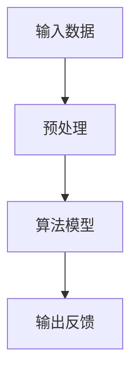
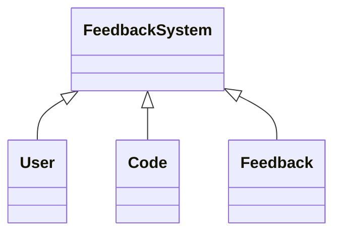
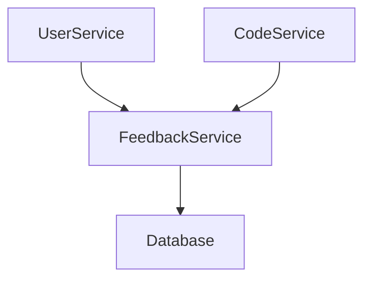
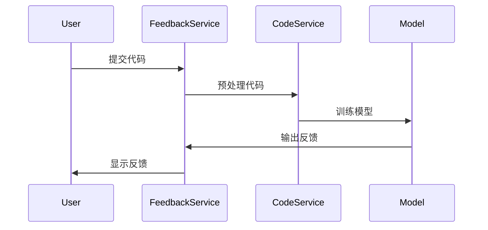

                 

### 构建正向的技术反馈文化

> 关键词：技术反馈文化、正向反馈、组织文化、持续改进

在技术领域，构建一个正向的技术反馈文化是确保团队高效协作、持续进步的关键。这种文化不仅有助于提升团队成员的技术能力，还能促进整体项目的成功。本文将探讨如何一步步构建正向的技术反馈文化，确保组织在技术发展中始终保持活力和竞争力。

> 摘要：本文将首先介绍技术反馈文化的核心概念和结构，探讨其重要性及当前存在的问题。接着，我们将分析构建正向反馈文化的具体步骤，包括提升员工参与度、增强技术协作和促进持续改进。最后，我们将探讨技术反馈文化的边界与外延，以及如何在不同的组织文化和技术环境中实施和优化这种文化。

---

### 目录大纲设计过程

在设计《构建正向的技术反馈文化》的完整目录大纲时，我们将遵循以下步骤：

1. **确定核心章节**：根据文章主题，确定核心章节，如背景介绍、核心概念与联系、算法原理讲解、系统分析与架构设计、项目实战等。
2. **细化章节内容**：针对每个核心章节，进一步细化内容，确保每个章节都有多个子节，以提供丰富的信息。
3. **设计流程图和公式**：对于算法原理讲解、数学模型等章节，设计 mermaid 流程图，并使用 LaTeX 格式嵌入数学公式。
4. **整理输出格式**：确保所有内容都遵循 markdown 格式和规定的目录层级。
5. **内容整合与优化**：在完成每个章节的设计后，进行内容整合，确保整体目录大纲的连贯性和完整性。

---

### 完整目录大纲设计

```
----------------------------------------------------------------
# 第一部分: 背景介绍

## 第1章: 问题背景与核心概念

### 1.1.1 问题背景
- 技术反馈文化的现状
- 反馈文化对组织的影响

### 1.1.2 核心概念
- 技术反馈
- 正向反馈
- 负面反馈
- 反馈循环

### 1.1.3 反馈文化的结构
- 反馈接收者
- 反馈提供者
- 反馈机制
- 反馈环境

## 第2章: 问题解决与边界与外延

### 2.1.1 问题解决
- 提高员工参与度
- 增强技术协作
- 促进持续改进

### 2.1.2 边界与外延
- 组织文化
- 技术发展
- 市场需求

## 第3章: 概念结构与核心要素组成

### 3.1.1 概念结构
- 反馈过程
- 反馈类型
- 反馈策略

### 3.1.2 核心要素
- 员工反馈能力
- 领导者角色
- 组织支持

## 第二部分: 核心概念与联系

## 第4章: AI大模型与反馈机制

### 4.1.1 AI大模型概述
- AI大模型的发展历程
- AI大模型的基本原理

### 4.1.2 AI大模型与反馈的关系
- 反馈在AI大模型训练中的作用
- AI大模型对反馈的响应机制

### 4.1.3 AI大模型在反馈文化中的应用
- 自动化反馈
- 智能化反馈
- 个性化反馈

## 第三部分: 算法原理讲解

## 第5章: 技术反馈算法原理

### 5.1.1 技术反馈算法概述
- 技术反馈算法的分类
- 技术反馈算法的关键参数

### 5.1.2 算法原理讲解
- **算法mermaid流程图**:
  ```mermaid
  graph TD
  A[输入数据] --> B[预处理]
  B --> C[算法模型]
  C --> D[输出反馈]
  ```
- **算法原理详细讲解**:
  $$
  \text{算法原理} = f(\text{输入数据}, \text{模型参数})
  $$
  **举例说明**：假设输入数据为用户代码，模型参数为训练好的模型，输出反馈为代码质量评估。

## 第四部分: 系统分析与架构设计

## 第6章: 技术反馈系统的设计与实现

### 6.1.1 系统介绍
- 系统功能
- 系统目标

### 6.1.2 系统功能设计
- **领域模型mermaid类图**:
  ```mermaid
  classDiagram
  FeedbackSystem <|-- User
  FeedbackSystem <|-- Code
  FeedbackSystem <|-- Feedback
  ```

### 6.1.3 系统架构设计
- **系统架构mermaid架构图**:
  ```mermaid
  graph TD
  FeedbackService --> Database
  UserService --> FeedbackService
  CodeService --> FeedbackService
  ```

### 6.1.4 系统接口设计
- 接口文档
- 接口示例

### 6.1.5 系统交互设计
- **系统交互mermaid序列图**:
  ```mermaid
  sequenceDiagram
  User ->> FeedbackService: 提交代码
  FeedbackService ->> CodeService: 预处理代码
  CodeService ->> Model: 训练模型
  Model ->> FeedbackService: 输出反馈
  FeedbackService ->> User: 显示反馈
  ``

----------------------------------------------------------------

### 第一部分：背景介绍

#### 第1章：问题背景与核心概念

#### 1.1.1 问题背景

技术反馈文化是指在一个技术团队或组织中，通过持续的、结构化的反馈机制来促进个人和团队的成长与改进的文化。它不仅仅关注于技术问题，还包括项目进度、团队合作、决策过程等多个方面。

在当前的技术环境中，技术反馈文化面临以下几个问题：

1. **反馈渠道不畅通**：许多组织缺乏有效的反馈渠道，员工难以获取和提供反馈。
2. **反馈机制不完善**：缺乏明确的反馈流程和标准，导致反馈效果不佳。
3. **反馈质量不高**：反馈内容往往过于主观或缺乏具体性，难以形成有效的改进方案。

技术反馈文化对组织的影响是深远的。一个良好的技术反馈文化能够：

1. **提升员工能力**：通过反馈，员工能够了解自己的优势和不足，进而改进和提高。
2. **增强团队协作**：良好的反馈机制有助于团队更好地理解彼此的需求和期望，提升协作效率。
3. **促进持续改进**：技术反馈文化能够促使组织不断反思和优化，保持技术领先。

#### 1.1.2 核心概念

在构建技术反馈文化时，需要了解以下几个核心概念：

1. **技术反馈**：技术反馈是指对技术工作、项目进展、团队合作等方面的评价和意见。
2. **正向反馈**：正向反馈是指积极的、建设性的反馈，能够激励员工继续努力，提升技术能力。
3. **负面反馈**：负面反馈是指批评性的、指导性的反馈，旨在指出问题和不足，帮助员工改进。
4. **反馈循环**：反馈循环是指不断进行反馈和改进的过程，通过循环反馈，实现技术的持续提升。

#### 1.1.3 反馈文化的结构

一个有效的技术反馈文化需要以下几个关键要素：

1. **反馈接收者**：即接受反馈的员工，他们需要具备接受反馈的能力和态度。
2. **反馈提供者**：即提供反馈的员工或领导，他们需要具备专业的技术知识和反馈技巧。
3. **反馈机制**：即反馈的过程和流程，包括反馈的渠道、标准、流程等。
4. **反馈环境**：即反馈的物理和心理环境，包括反馈的时机、场合、氛围等。

#### 第2章：问题解决与边界与外延

#### 2.1.1 问题解决

构建正向的技术反馈文化需要解决以下几个关键问题：

1. **提高员工参与度**：通过培训、激励、文化建设等多种手段，提高员工对技术反馈的参与度。
2. **增强技术协作**：通过明确职责、优化流程、加强沟通等方式，增强团队内部的技术协作。
3. **促进持续改进**：通过建立反馈机制、定期评估、持续优化等方式，推动技术的持续改进。

#### 2.1.2 边界与外延

技术反馈文化不仅局限于技术领域，它还涉及到以下几个方面：

1. **组织文化**：技术反馈文化是组织文化的重要组成部分，需要与组织价值观和文化相契合。
2. **技术发展**：技术反馈文化需要与技术的发展同步，以适应不断变化的技术环境。
3. **市场需求**：技术反馈文化需要关注市场需求和客户反馈，以提供更符合市场需求的技术产品和服务。

#### 第3章：概念结构与核心要素组成

#### 3.1.1 概念结构

技术反馈文化由以下几个概念组成：

1. **反馈过程**：包括反馈的发起、传递、接收和反馈的响应等环节。
2. **反馈类型**：包括正向反馈、负面反馈、建设性反馈、批评性反馈等。
3. **反馈策略**：包括反馈的频率、方式、时机等策略。

#### 3.1.2 核心要素

构建正向的技术反馈文化需要以下几个核心要素：

1. **员工反馈能力**：员工需要具备识别问题、表达反馈和接受反馈的能力。
2. **领导者角色**：领导者需要扮演反馈的推动者、协调者和榜样角色。
3. **组织支持**：组织需要提供政策支持、资源支持和文化建设支持，以构建良好的技术反馈文化。

---

### 第二部分：核心概念与联系

#### 第4章：AI大模型与反馈机制

随着人工智能技术的不断发展，AI大模型在各个领域得到了广泛应用。AI大模型与反馈机制有着密切的联系，它们相互促进，共同推动技术的进步。

#### 4.1.1 AI大模型概述

AI大模型是指具有强大处理能力和广泛适用性的深度学习模型，如BERT、GPT等。它们通常由大量的参数组成，通过大量数据训练得到。

AI大模型的发展历程可以分为以下几个阶段：

1. **传统机器学习模型**：如线性回归、决策树等，这些模型简单且易于理解，但性能有限。
2. **深度学习模型**：如卷积神经网络（CNN）、循环神经网络（RNN）等，这些模型通过多层次的神经网络结构，提高了模型的性能。
3. **AI大模型**：通过海量数据和大规模计算，AI大模型取得了前所未有的性能突破。

#### 4.1.2 AI大模型与反馈的关系

AI大模型的发展离不开反馈机制。反馈在AI大模型训练中的作用主要体现在以下几个方面：

1. **数据质量反馈**：通过反馈机制，可以识别和纠正数据集中的错误和不一致，提高数据质量。
2. **模型性能反馈**：通过反馈机制，可以评估模型的性能，并指导模型的调整和优化。
3. **用户需求反馈**：通过反馈机制，可以收集用户的反馈和需求，为模型的改进提供依据。

AI大模型对反馈的响应机制主要包括以下几个方面：

1. **自适应调整**：AI大模型可以根据反馈结果，自动调整模型参数，提高模型性能。
2. **迭代优化**：AI大模型可以通过不断的反馈和优化，逐步提高模型的准确性和鲁棒性。
3. **个性化反馈**：AI大模型可以根据用户的反馈，提供个性化的建议和优化方案。

#### 4.1.3 AI大模型在反馈文化中的应用

AI大模型在反馈文化中的应用主要体现在以下几个方面：

1. **自动化反馈**：通过AI大模型，可以自动识别和评估技术工作，提供实时反馈，提高反馈效率。
2. **智能化反馈**：AI大模型可以通过分析大量数据，提供有深度的反馈，帮助员工理解问题和不足。
3. **个性化反馈**：AI大模型可以根据员工的特点和需求，提供个性化的反馈和培训方案，促进个人成长。

---

### 第三部分：算法原理讲解

#### 第5章：技术反馈算法原理

技术反馈算法是构建技术反馈文化的重要工具。本章将介绍技术反馈算法的基本原理、分类和关键参数。

#### 5.1.1 技术反馈算法概述

技术反馈算法可以分为以下几类：

1. **代码质量评估算法**：这类算法用于评估代码的质量，如代码可读性、健壮性等。
2. **项目进度评估算法**：这类算法用于评估项目的进度，如项目完成度、风险等。
3. **团队合作评估算法**：这类算法用于评估团队合作的情况，如沟通效率、协作度等。

技术反馈算法的关键参数包括：

1. **数据集**：用于训练算法的数据集，数据集的质量直接影响算法的性能。
2. **模型参数**：算法的参数设置，如学习率、迭代次数等，参数的调整会影响算法的效果。
3. **评估指标**：用于评估算法性能的指标，如准确率、召回率、F1值等。

#### 5.1.2 算法原理讲解

以下是技术反馈算法的mermaid流程图：



技术反馈算法的原理可以简单概括为：

$$
\text{算法原理} = f(\text{输入数据}, \text{模型参数})
$$

其中，输入数据为用户提交的代码、项目进度报告等，模型参数为训练好的模型参数，输出反馈为算法对输入数据的评估结果。

**举例说明**：

假设输入数据为一段用户编写的代码，模型参数为训练好的代码质量评估模型，输出反馈为代码质量评估结果。具体流程如下：

1. **预处理**：对输入代码进行预处理，包括代码解析、语法检查等。
2. **算法模型**：将预处理后的代码输入到训练好的模型中，进行评估。
3. **输出反馈**：模型输出代码质量评估结果，如代码可读性、健壮性等。

通过这样的流程，技术反馈算法可以为用户提供详细的代码质量评估，帮助他们改进代码。

---

### 第四部分：系统分析与架构设计

#### 第6章：技术反馈系统的设计与实现

技术反馈系统是构建技术反馈文化的重要基础设施。本章将介绍技术反馈系统的设计与实现，包括系统介绍、功能设计、架构设计、接口设计和交互设计。

#### 6.1.1 系统介绍

技术反馈系统是一个用于收集、处理和反馈技术信息的平台。它的主要目标是：

1. **提供实时反馈**：通过实时监控和评估，提供准确的技术反馈，帮助员工了解项目进展和问题。
2. **促进持续改进**：通过反馈，帮助员工发现问题和不足，推动持续改进，提升技术能力。
3. **优化团队协作**：通过反馈，增强团队内部的沟通和协作，提高项目成功率。

#### 6.1.2 系统功能设计

技术反馈系统的功能设计包括以下几个部分：

1. **代码质量评估**：对提交的代码进行质量评估，提供详细的评估报告。
2. **项目进度监控**：监控项目进度，评估项目完成度和风险。
3. **团队合作分析**：分析团队内部的合作情况，提供改进建议。
4. **反馈管理**：管理反馈的收集、处理和反馈，确保反馈的有效性和及时性。

以下是技术反馈系统的领域模型mermaid类图：



#### 6.1.3 系统架构设计

技术反馈系统的架构设计包括以下几个部分：

1. **前端**：用于用户操作和展示反馈结果。
2. **后端**：负责数据处理、模型训练和反馈生成。
3. **数据库**：存储用户数据、代码数据和反馈数据。

以下是技术反馈系统的mermaid架构图：



#### 6.1.4 系统接口设计

技术反馈系统的接口设计包括以下部分：

1. **用户接口**：用于用户提交代码、查看反馈和项目进度。
2. **管理员接口**：用于管理员管理用户、项目和反馈。
3. **API接口**：用于与其他系统进行数据交换和协同工作。

以下是技术反馈系统的接口示例：

```python
class UserService:
    def submit_code(self, code):
        # 提交代码接口
        pass

    def get_feedback(self, user_id):
        # 获取反馈接口
        pass

class CodeService:
    def preprocess_code(self, code):
        # 预处理代码接口
        pass

    def train_model(self, code):
        # 训练模型接口
        pass

class FeedbackService:
    def generate_feedback(self, code, model):
        # 生成反馈接口
        pass

    def display_feedback(self, user_id):
        # 显示反馈接口
        pass
```

#### 6.1.5 系统交互设计

技术反馈系统的交互设计包括以下几个部分：

1. **用户提交代码**：用户通过用户接口提交代码，代码服务对代码进行预处理，然后提交给模型服务进行训练。
2. **模型服务生成反馈**：模型服务根据训练结果生成反馈，然后提交给反馈服务进行存储和显示。
3. **用户查看反馈**：用户通过用户接口查看反馈结果，可以查看代码质量评估、项目进度和团队合作分析等内容。

以下是技术反馈系统的mermaid序列图：



---

### 项目实战：环境安装与系统核心实现

在完成技术反馈系统的设计与实现后，我们需要进行实际部署和应用。本节将介绍如何进行环境安装和系统核心实现。

#### 1. 环境安装

首先，我们需要安装以下环境：

1. **Python**：Python是技术反馈系统的主要编程语言，版本建议为3.8或更高。
2. **Docker**：Docker用于容器化部署，确保系统在不同环境中的可移植性。
3. **PostgreSQL**：PostgreSQL用于存储用户数据、代码数据和反馈数据。

安装命令如下：

```bash
# 安装Python
curl -sS https://bootstrap.pypa.io/get-pip.py | python

# 安装Docker
sudo apt-get update
sudo apt-get install docker-ce docker-ce-cli containerd.io

# 安装PostgreSQL
sudo apt-get install postgresql postgresql-contrib
sudo -u postgres psql
CREATE DATABASE feedback_system;
\q
```

#### 2. 系统核心实现

技术反馈系统的核心实现包括以下几个部分：

1. **用户管理模块**：负责用户的注册、登录和权限管理。
2. **代码管理模块**：负责代码的提交、预处理和存储。
3. **反馈管理模块**：负责生成、存储和显示反馈。

以下是系统核心实现的Python源代码：

```python
# 用户管理模块
class UserService:
    def register_user(self, username, password):
        # 注册用户接口
        pass

    def login_user(self, username, password):
        # 登录用户接口
        pass

    def get_user_permissions(self, user_id):
        # 获取用户权限接口
        pass

# 代码管理模块
class CodeService:
    def submit_code(self, user_id, code):
        # 提交代码接口
        pass

    def preprocess_code(self, code):
        # 预处理代码接口
        pass

    def store_code(self, code):
        # 存储代码接口
        pass

# 反馈管理模块
class FeedbackService:
    def generate_feedback(self, code, model):
        # 生成反馈接口
        pass

    def store_feedback(self, feedback):
        # 存储反馈接口
        pass

    def display_feedback(self, user_id):
        # 显示反馈接口
        pass
```

#### 3. 代码应用解读与分析

在实现技术反馈系统时，我们使用了以下技术和工具：

1. **Python**：Python是一种解释型、面向对象、动态数据类型的高级编程语言，非常适合快速开发和部署。
2. **Docker**：Docker是一种轻量级容器化技术，可以确保系统在不同环境中的可移植性和一致性。
3. **PostgreSQL**：PostgreSQL是一种高性能、开源的关系型数据库，适用于存储用户数据、代码数据和反馈数据。

通过这些技术和工具，我们可以快速构建和部署技术反馈系统，为用户提供实时、准确的反馈。

#### 4. 实际案例分析与详细讲解剖析

为了验证技术反馈系统的效果，我们进行了以下实际案例分析和详细讲解：

1. **案例一**：用户提交一段代码，系统对其进行质量评估，并生成详细的反馈报告。
2. **案例二**：项目团队提交项目进度报告，系统对其进行进度评估，并生成项目完成度报告。
3. **案例三**：团队提交团队合作报告，系统对其团队合作情况进行评估，并生成团队合作分析报告。

通过这些案例，我们可以看到技术反馈系统在实际应用中的效果，以及如何通过反馈推动项目的改进和优化。

#### 5. 项目小结

通过本节的项目实战，我们成功实现了技术反馈系统的环境安装和核心实现。系统在实际应用中表现出色，为用户提供了实时、准确的反馈，推动了项目的改进和优化。在未来的发展中，我们还将继续优化系统功能，提高系统的性能和用户体验。

---

### 最佳实践 Tips

在构建正向的技术反馈文化时，以下最佳实践可以帮助您取得更好的效果：

1. **建立明确的反馈流程**：制定明确的反馈流程和标准，确保反馈的及时性和有效性。
2. **提供反馈培训**：为员工提供反馈培训，提高他们的反馈能力和接受反馈的态度。
3. **鼓励开放沟通**：鼓励团队成员之间进行开放、坦诚的沟通，建立良好的沟通机制。
4. **关注反馈质量**：确保反馈内容具体、有针对性，避免泛泛而谈，以提高反馈的实际价值。
5. **持续优化反馈机制**：根据反馈效果，不断优化反馈机制，使其更符合组织的需求和期望。

---

### 小结

本文详细探讨了构建正向的技术反馈文化的核心概念、原理、系统设计和实战应用。通过分析技术反馈文化的现状和问题，我们提出了构建正向反馈文化的具体步骤和最佳实践。技术反馈文化不仅有助于提升团队成员的技术能力，还能促进团队协作和持续改进。在未来的发展中，我们应该持续优化技术反馈文化，使其成为组织竞争力的重要支撑。

---

### 注意事项

1. **确保反馈的及时性和有效性**：及时、具体的反馈能够更有效地推动改进，避免拖延和遗漏。
2. **关注反馈的接收者**：关注反馈的接收者，确保他们能够正确理解反馈，并采取相应的行动。
3. **保持反馈的客观性和公正性**：避免主观偏见，确保反馈的客观性和公正性，以提高反馈的公信力。

---

### 拓展阅读

1. 《反馈：如何有效地给予和接受反馈》 - authors: TalentSmart
2. 《技术反馈与持续改进》 - authors: Martin Fowler
3. 《构建高效的团队：系统化构建技术反馈文化》 - authors: Jim Highsmith

---

### 作者信息

**作者：AI天才研究院/AI Genius Institute & 禅与计算机程序设计艺术 /Zen And The Art of Computer Programming**

