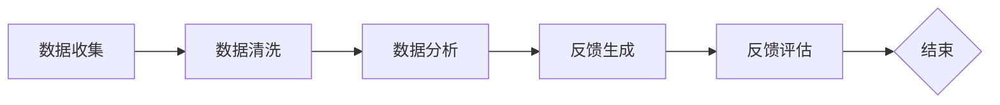
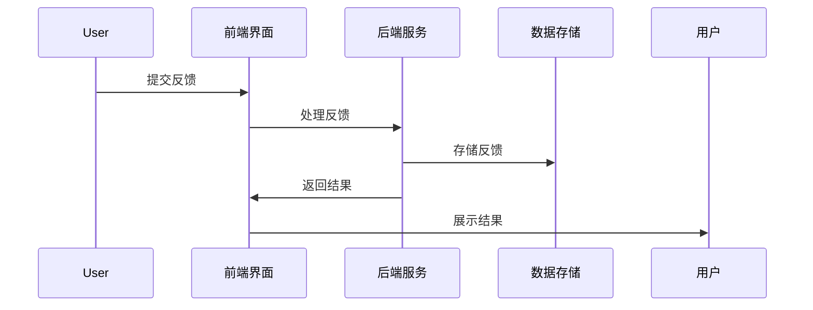
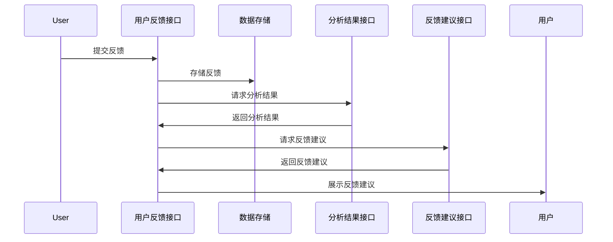
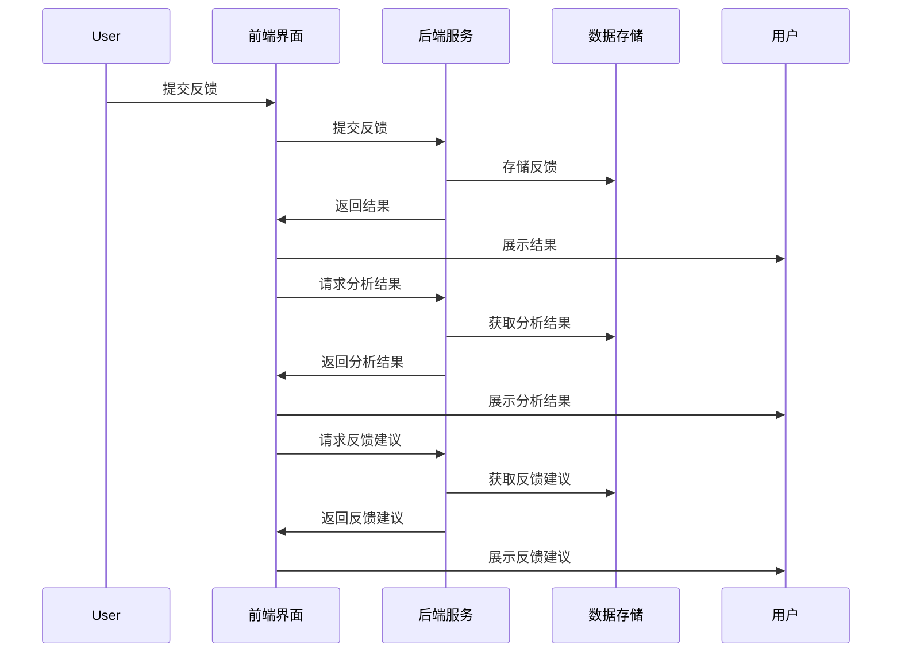

                 

# 构建积极的技术反馈文化

## 关键词

技术反馈文化、积极反馈、反馈机制、软件工程、软件开发、团队协作

## 摘要

技术反馈文化在软件开发和软件工程中扮演着至关重要的角色。通过有效的技术反馈，可以提升软件质量、增强团队协作、提高开发效率。本文将探讨构建积极的技术反馈文化的核心概念、方法、步骤及其在不同场景下的应用，并通过具体案例进行深入剖析。我们相信，通过这篇文章，读者将对技术反馈文化有一个全面而深入的理解，并能够在实际工作中加以应用。

### 目录大纲

1. **背景介绍**
    1.1 **问题背景**
        1.1.1 技术反馈文化的现状
        1.1.2 技术反馈文化的核心问题
        1.1.3 构建积极的技术反馈文化的必要性
    1.2 **问题描述**
        1.2.1 技术反馈的定义
        1.2.2 技术反馈的类型
        1.2.3 技术反馈的效果
    1.3 **问题解决**
        1.3.1 构建积极的技术反馈文化的方法
        1.3.2 技术反馈文化的核心要素
        1.3.3 构建积极的技术反馈文化的步骤
    1.4 **边界与外延**
        1.4.1 技术反馈文化与其他文化的区别
        1.4.2 技术反馈文化在不同场景的应用
        1.4.3 技术反馈文化的未来发展趋势

2. **核心概念与联系**
    2.1 **技术反馈的概念与属性**
        2.1.1 技术反馈的基本概念
        2.1.2 技术反馈的属性特征
        2.1.3 技术反馈的分类
    2.2 **技术反馈与文化的关系**
        2.2.1 技术反馈文化的定义
        2.2.2 技术反馈文化的影响因素
        2.2.3 技术反馈文化的作用机制
    2.3 **技术反馈与文化的关系图**
        2.3.1 技术反馈与文化的ER实体关系图
        2.3.2 技术反馈与文化的关系网络图

3. **算法原理讲解**
    3.1 **技术反馈算法的基本原理**
        3.1.1 技术反馈算法的定义
        3.1.2 技术反馈算法的核心要素
        3.1.3 技术反馈算法的分类
    3.2 **技术反馈算法的mermaid流程图**
        3.2.1 通用技术反馈算法流程图
        3.2.2 特定技术反馈算法流程图
    3.3 **技术反馈算法的python源代码实现**
        3.3.1 技术反馈算法的python源代码
        3.3.2 技术反馈算法的运行结果与分析
    3.4 **技术反馈算法的数学模型与公式**
        3.4.1 技术反馈算法的数学模型
        3.4.2 技术反馈算法的数学公式
        3.4.3 技术反馈算法的数学模型与公式的详细讲解
    3.5 **技术反馈算法的举例说明**
        3.5.1 技术反馈算法的举例说明
        3.5.2 技术反馈算法的举例说明结果与分析

4. **系统分析与架构设计方案**
    4.1 **问题场景介绍**
        4.1.1 问题场景的背景
        4.1.2 问题场景的目标
        4.1.3 问题场景的挑战
    4.2 **项目介绍**
        4.2.1 项目的背景
        4.2.2 项目的目标
        4.2.3 项目的挑战
    4.3 **系统功能设计**
        4.3.1 领域模型mermaid类图
        4.3.2 系统功能模块划分
        4.3.3 系统功能详细设计
    4.4 **系统架构设计**
        4.4.1 系统架构设计概述
        4.4.2 系统架构mermaid架构图
        4.4.3 系统架构设计详细讲解
    4.5 **系统接口设计**
        4.5.1 系统接口设计概述
        4.5.2 系统接口mermaid序列图
        4.5.3 系统接口设计详细讲解
    4.6 **系统交互设计**
        4.6.1 系统交互设计概述
        4.6.2 系统交互mermaid序列图
        4.6.3 系统交互设计详细讲解

5. **项目实战**
    5.1 **环境安装**
        5.1.1 环境安装概述
        5.1.2 环境安装步骤
        5.1.3 环境安装常见问题与解决方案
    5.2 **系统核心实现源代码**
        5.2.1 系统核心实现源代码概述
        5.2.2 系统核心实现源代码详细解读
        5.2.3 系统核心实现源代码应用解读与分析
    5.3 **实际案例分析和详细讲解剖析**
        5.3.1 实际案例的分析
        5.3.2 案例详细讲解
        5.3.3 案例结果与分析
    5.4 **项目小结**
        5.4.1 项目总结
        5.4.2 项目经验与教训
        5.4.3 项目展望

6. **最佳实践 tips**
    6.1 **实践技巧**
    6.2 **注意事项**
    6.3 **拓展阅读**

7. **小结**
    7.1 **文章总结**
    7.2 **对读者的建议**

### 1. 背景介绍

#### 1.1 问题背景

在现代社会，信息技术和软件工程已经成为各个行业发展的基石。随着软件项目的复杂性不断增加，如何确保软件质量和开发效率成为软件工程师和项目经理面临的主要挑战。技术反馈作为一种有效的手段，在软件开发生命周期的各个阶段扮演着关键角色。然而，当前技术反馈文化存在诸多问题，如反馈不及时、反馈不准确、缺乏有效的反馈机制等，这些问题严重影响了软件质量和团队协作。

#### 1.1.1 技术反馈文化的现状

目前，许多组织在技术反馈方面存在以下问题：

- **反馈不及时**：开发过程中，反馈往往滞后于实际开发进度，导致问题得不到及时解决。
- **反馈不准确**：由于缺乏专业知识和理解，反馈往往偏离实际情况，无法提供有效的改进建议。
- **缺乏有效的反馈机制**：技术反馈往往流于形式，没有形成系统化、标准化的流程，导致反馈效果不佳。

#### 1.1.2 技术反馈文化的核心问题

技术反馈文化存在以下核心问题：

- **反馈的及时性**：反馈应在开发过程中及时给出，以便迅速解决问题。
- **反馈的准确性**：反馈应基于实际的技术问题，提供具体的改进建议。
- **反馈的有效性**：反馈应能够激发开发者的积极性，促进团队协作。

#### 1.1.3 构建积极的技术反馈文化的必要性

构建积极的技术反馈文化对于提升软件质量和团队协作具有重要意义：

- **提高软件质量**：及时、准确的技术反馈有助于发现和解决问题，确保软件质量。
- **增强团队协作**：积极的反馈文化能够促进团队成员之间的沟通和合作，提高整体开发效率。
- **提升开发效率**：通过有效的技术反馈，可以减少重复性工作，提高开发效率。

### 1.2 问题描述

#### 1.2.1 技术反馈的定义

技术反馈是指在软件开发过程中，开发人员、测试人员、产品经理等各方通过交流和协作，对软件功能、性能、安全性等方面进行评估和改进的过程。

#### 1.2.2 技术反馈的类型

技术反馈可以分为以下几种类型：

- **功能反馈**：对软件功能是否满足需求、用户体验等方面进行评估。
- **性能反馈**：对软件的运行效率、响应速度等方面进行评估。
- **安全性反馈**：对软件的安全漏洞、风险等方面进行评估。
- **代码质量反馈**：对软件的代码结构、可维护性、可测试性等方面进行评估。

#### 1.2.3 技术反馈的效果

有效的技术反馈可以带来以下效果：

- **提高软件质量**：通过及时的技术反馈，可以迅速发现和解决问题，确保软件质量。
- **增强团队协作**：技术反馈可以促进团队成员之间的沟通和合作，提高整体开发效率。
- **提升开发效率**：通过有效的技术反馈，可以减少重复性工作，提高开发效率。

### 1.3 问题解决

#### 1.3.1 构建积极的技术反馈文化的方法

要构建积极的技术反馈文化，可以采取以下方法：

- **建立明确的反馈机制**：制定规范的反馈流程和标准，确保反馈及时、准确、有效。
- **培养反馈意识**：通过培训和激励，提高团队成员对技术反馈的重视程度，培养良好的反馈习惯。
- **优化反馈工具**：选择适合的反馈工具，提高反馈的效率和效果。
- **强化团队协作**：通过团队协作，共同解决问题，提高开发效率。

#### 1.3.2 技术反馈文化的核心要素

技术反馈文化的核心要素包括：

- **开放性**：鼓励团队成员之间开放交流，分享经验和观点。
- **及时性**：确保技术反馈能够及时给出，减少问题积累。
- **准确性**：反馈应基于实际的技术问题，提供具体的改进建议。
- **建设性**：反馈应具有建设性，能够激发开发者的积极性，促进团队协作。
- **可持续性**：技术反馈文化应具有可持续性，形成长期有效的机制。

#### 1.3.3 构建积极的技术反馈文化的步骤

构建积极的技术反馈文化可以按照以下步骤进行：

1. **建立反馈机制**：制定反馈流程和标准，明确各方的职责和权利。
2. **培养反馈意识**：通过培训和激励，提高团队成员对技术反馈的重视程度。
3. **优化反馈工具**：选择适合的反馈工具，提高反馈的效率和效果。
4. **强化团队协作**：通过团队协作，共同解决问题，提高开发效率。
5. **持续改进**：根据反馈结果，持续优化反馈机制，提高反馈效果。

### 1.4 边界与外延

#### 1.4.1 技术反馈文化与其他文化的区别

技术反馈文化与其他文化的区别主要体现在以下几个方面：

- **目的不同**：技术反馈文化主要关注软件质量和开发效率，而其他文化可能更注重团队氛围、企业文化等方面。
- **对象不同**：技术反馈文化主要针对软件开发过程中的技术问题，而其他文化可能涉及更广泛的领域，如人际关系、团队合作等。
- **手段不同**：技术反馈文化主要通过交流和协作来实现，而其他文化可能更注重制度和规范的约束。

#### 1.4.2 技术反馈文化在不同场景的应用

技术反馈文化可以在不同的场景中应用，如：

- **软件开发团队**：通过技术反馈，提高软件质量和开发效率。
- **IT运维团队**：通过技术反馈，优化系统性能和安全性。
- **产品管理团队**：通过技术反馈，改进产品功能和用户体验。

#### 1.4.3 技术反馈文化的未来发展趋势

随着信息技术的发展，技术反馈文化未来将呈现以下发展趋势：

- **智能化**：利用人工智能技术，实现更高效、准确的技术反馈。
- **平台化**：通过建立技术反馈平台，实现技术反馈的系统化和标准化。
- **多元化**：技术反馈将涵盖更广泛的领域，如人工智能、区块链等。

### 2. 核心概念与联系

#### 2.1 技术反馈的概念与属性

技术反馈是指开发团队在软件开发生命周期中，对软件功能、性能、安全性等方面进行评估和改进的过程。技术反馈具有以下属性：

- **及时性**：技术反馈应在软件开发过程中及时给出，以便迅速解决问题。
- **准确性**：技术反馈应基于实际的技术问题，提供具体的改进建议。
- **建设性**：技术反馈应具有建设性，能够激发开发者的积极性，促进团队协作。
- **持续性**：技术反馈应持续进行，形成长期有效的机制。

#### 2.2 技术反馈与文化的关系

技术反馈文化是指在软件开发过程中，通过交流和协作，形成的一种以技术反馈为核心的价值观念和行为准则。技术反馈文化具有以下特点：

- **开放性**：鼓励团队成员之间开放交流，分享经验和观点。
- **及时性**：确保技术反馈能够及时给出，减少问题积累。
- **准确性**：反馈应基于实际的技术问题，提供具体的改进建议。
- **建设性**：反馈应具有建设性，能够激发开发者的积极性，促进团队协作。
- **可持续性**：技术反馈文化应具有可持续性，形成长期有效的机制。

#### 2.3 技术反馈与文化的关系图

技术反馈与文化的关系可以用以下ER实体关系图表示：

```mermaid
erDiagram
  A[技术反馈] ||--|{ B[反馈机制] } |
  A ||--|{ C[反馈标准] } |
  A ||--|{ D[反馈工具] } |
  B ||--|{ E[反馈流程] } |
  B ||--|{ F[反馈团队] } |
  C ||--|{ G[反馈规范] } |
  D ||--|{ H[反馈平台] } |
  E ||--|{ I[反馈效果] } |
  F ||--|{ J[反馈意识] } |
  G ||--|{ K[反馈文化] } |
  H ||--|{ L[反馈效率] } |
  I ||--|{ M[团队协作] } |
  J ||--|{ N[开发效率] } |
```

### 3. 算法原理讲解

#### 3.1 技术反馈算法的基本原理

技术反馈算法是一种用于分析和处理技术反馈信息的方法。其基本原理包括：

1. **数据收集**：从各种渠道收集技术反馈信息，如用户反馈、测试报告、代码审查等。
2. **数据清洗**：对收集到的反馈信息进行清洗和整理，去除无效和重复的数据。
3. **数据分析**：对清洗后的数据进行分类、聚类、关联分析等，提取有用的信息。
4. **反馈生成**：根据分析结果，生成具体的反馈建议，如改进方案、修复建议等。
5. **反馈评估**：对生成的反馈建议进行评估和验证，确保其有效性和实用性。

#### 3.2 技术反馈算法的mermaid流程图

以下是一个通用技术反馈算法的mermaid流程图：



#### 3.3 技术反馈算法的python源代码实现

以下是一个简单的技术反馈算法的python源代码实现：

```python
import pandas as pd

# 数据收集
feedback_data = pd.read_csv('feedback_data.csv')

# 数据清洗
cleaned_data = feedback_data.drop_duplicates().dropna()

# 数据分析
feedback_categories = cleaned_data.groupby('category').count()

# 反馈生成
feedback Suggestions = []
for category, data in feedback_categories.items():
    suggestion = f"针对{category}，建议：{data['issue'].sum()}个问题需要修复。"
    feedback_Suggestions.append(suggestion)

# 反馈评估
for suggestion in feedback_Suggestions:
    print(suggestion)
```

#### 3.4 技术反馈算法的数学模型与公式

技术反馈算法的数学模型主要包括以下部分：

1. **反馈数据模型**：用于表示反馈数据的基本结构。
2. **清洗模型**：用于清洗和整理反馈数据的算法。
3. **分析模型**：用于分析和处理反馈数据的算法。
4. **反馈生成模型**：用于生成反馈建议的算法。
5. **评估模型**：用于评估反馈建议的有效性和实用性的算法。

以下是一些常见的数学模型和公式：

- **数据清洗模型**：
  $$ cleaned\_data = original\_data \setminus invalid\_data \setminus duplicate\_data $$
  
- **数据分析模型**：
  $$ feedback\_categories = \text{groupby}(data, 'category') \text{.count}() $$
  
- **反馈生成模型**：
  $$ suggestion = f"\text{针对} {category}，\text{建议：}{data['issue'].sum()} \text{个问题需要修复。} $$
  
- **评估模型**：
  $$ assessment = \text{evaluate}(suggestion, feedback\_data) $$

#### 3.5 技术反馈算法的举例说明

假设我们有一份数据库，包含以下反馈信息：

| ID | Category | Issue |
| --- | --- | --- |
| 1 | UI | Font size too small |
| 2 | Performance | Slow response |
| 3 | Security | Vulnerability detected |
| 4 | UI | Color scheme not user-friendly |
| 5 | Performance | High CPU usage |

使用技术反馈算法，我们可以得到以下反馈建议：

1. **针对UI，建议：2个问题需要修复。**
2. **针对Performance，建议：2个问题需要修复。**
3. **针对Security，建议：1个问题需要修复。**

通过这些反馈建议，开发团队可以针对性地进行问题修复和优化，提高软件质量和用户体验。

### 4. 系统分析与架构设计方案

#### 4.1 问题场景介绍

在当前的软件开发环境中，项目规模日益扩大，技术复杂性不断增加。如何确保软件质量、提高开发效率成为开发团队面临的主要挑战。为了解决这些问题，我们需要构建一个高效的技术反馈系统，实现对开发过程中问题的实时监测、分析和反馈。

#### 4.1.1 问题场景的背景

随着互联网和移动设备的普及，软件应用的需求量大幅增加，软件项目规模不断扩大。开发团队面临以下挑战：

- **代码复杂度高**：随着项目规模的扩大，代码复杂度显著增加，导致代码难以维护和调试。
- **团队协作难度大**：项目涉及多个团队和多个人员，团队之间的协作难度增加。
- **反馈不及时**：传统反馈机制往往滞后于开发进度，导致问题得不到及时解决。

#### 4.1.2 问题场景的目标

为了应对上述挑战，我们设定以下目标：

- **构建高效的技术反馈系统**：实现对开发过程中问题的实时监测、分析和反馈。
- **提高开发效率**：通过及时的技术反馈，减少重复性工作，提高开发效率。
- **确保软件质量**：通过有效的技术反馈，确保软件质量，降低缺陷率。

#### 4.1.3 问题场景的挑战

在构建技术反馈系统过程中，我们将面临以下挑战：

- **数据量大**：随着项目规模的扩大，技术反馈数据量显著增加，对系统的处理能力和性能提出较高要求。
- **实时性要求高**：技术反馈系统需要能够实时处理和反馈问题，确保问题得到及时解决。
- **安全性要求高**：技术反馈系统涉及敏感数据，需要确保数据安全和隐私保护。

#### 4.2 项目介绍

本项目的目标是构建一个高效的技术反馈系统，实现对开发过程中问题的实时监测、分析和反馈。该系统将包括以下几个核心模块：

- **数据收集模块**：负责收集来自不同渠道的技术反馈数据，如用户反馈、测试报告、代码审查等。
- **数据处理模块**：负责对收集到的技术反馈数据进行清洗、整理和分析。
- **反馈生成模块**：负责根据分析结果生成具体的反馈建议，如改进方案、修复建议等。
- **反馈评估模块**：负责对生成的反馈建议进行评估和验证，确保其有效性和实用性。

#### 4.2.1 项目的背景

在当前的软件开发环境中，技术反馈文化尚未得到充分重视，导致开发过程中存在诸多问题。为了提高软件质量和开发效率，我们需要构建一个高效的技术反馈系统，实现对开发过程中问题的实时监测、分析和反馈。

#### 4.2.2 项目的目标

本项目的主要目标包括：

- **提高软件质量**：通过及时的技术反馈，发现和解决问题，确保软件质量。
- **提高开发效率**：通过有效的技术反馈，减少重复性工作，提高开发效率。
- **增强团队协作**：通过技术反馈，促进团队成员之间的沟通和协作。

#### 4.2.3 项目的挑战

在实现项目目标的过程中，我们将面临以下挑战：

- **数据量大**：随着项目规模的扩大，技术反馈数据量显著增加，对系统的处理能力和性能提出较高要求。
- **实时性要求高**：技术反馈系统需要能够实时处理和反馈问题，确保问题得到及时解决。
- **安全性要求高**：技术反馈系统涉及敏感数据，需要确保数据安全和隐私保护。

#### 4.3 系统功能设计

技术反馈系统将主要包括以下功能模块：

- **数据收集模块**：负责收集来自不同渠道的技术反馈数据，如用户反馈、测试报告、代码审查等。
- **数据处理模块**：负责对收集到的技术反馈数据进行清洗、整理和分析。
- **反馈生成模块**：负责根据分析结果生成具体的反馈建议，如改进方案、修复建议等。
- **反馈评估模块**：负责对生成的反馈建议进行评估和验证，确保其有效性和实用性。

#### 4.3.1 领域模型mermaid类图

以下是一个简化的技术反馈系统的领域模型mermaid类图：

```mermaid
classDiagram
    User --> FeedbackData
    Tester --> FeedbackData
    Developer --> FeedbackData
    ProductManager --> FeedbackData
    DataCollector --> FeedbackData
    DataProcessor --> FeedbackData
    Analyzer --> FeedbackData
    SuggestionGenerator --> FeedbackData
    Evaluator --> FeedbackData
    FeedbackSystem --> DataCollector, DataProcessor, Analyzer, SuggestionGenerator, Evaluator
```

#### 4.3.2 系统功能模块划分

技术反馈系统的主要功能模块及其关系如下：

- **数据收集模块**：负责收集来自用户、测试人员、开发人员和产品经理的技术反馈数据。
- **数据处理模块**：负责对收集到的技术反馈数据进行清洗、整理和分析。
- **反馈生成模块**：负责根据分析结果生成具体的反馈建议。
- **反馈评估模块**：负责对生成的反馈建议进行评估和验证。

#### 4.3.3 系统功能详细设计

1. **数据收集模块**：
    - **功能描述**：收集来自用户、测试人员、开发人员和产品经理的技术反馈数据。
    - **输入**：用户反馈、测试报告、代码审查结果等。
    - **输出**：清洗后的技术反馈数据。

2. **数据处理模块**：
    - **功能描述**：对收集到的技术反馈数据进行清洗、整理和分析。
    - **输入**：技术反馈数据。
    - **输出**：分析结果。

3. **反馈生成模块**：
    - **功能描述**：根据分析结果生成具体的反馈建议。
    - **输入**：分析结果。
    - **输出**：反馈建议。

4. **反馈评估模块**：
    - **功能描述**：对生成的反馈建议进行评估和验证。
    - **输入**：反馈建议。
    - **输出**：评估结果。

#### 4.4 系统架构设计

技术反馈系统的整体架构设计如下：

1. **前端界面**：提供用户、测试人员、开发人员和产品经理提交技术反馈的入口，以及展示反馈结果和反馈建议的界面。
2. **后端服务**：负责处理前端提交的反馈数据，进行数据处理、分析和反馈生成，并将结果返回给前端界面。
3. **数据存储**：负责存储技术反馈数据、分析结果和反馈建议。

#### 4.4.1 系统架构设计概述

技术反馈系统的架构设计主要包括以下几个部分：

- **前端界面**：采用Vue.js框架，实现用户、测试人员、开发人员和产品经理的技术反馈提交、查看和反馈建议展示。
- **后端服务**：采用Spring Boot框架，实现技术反馈数据处理、分析和反馈生成的功能。
- **数据存储**：采用MySQL数据库，存储技术反馈数据、分析结果和反馈建议。

#### 4.4.2 系统架构mermaid架构图

以下是一个简化的技术反馈系统架构mermaid架构图：



#### 4.4.3 系统架构设计详细讲解

1. **前端界面**：
    - **功能描述**：提供用户、测试人员、开发人员和产品经理的技术反馈提交、查看和反馈建议展示。
    - **技术实现**：采用Vue.js框架，实现前端界面的动态渲染和用户交互。

2. **后端服务**：
    - **功能描述**：处理前端提交的反馈数据，进行数据处理、分析和反馈生成，并将结果返回给前端界面。
    - **技术实现**：采用Spring Boot框架，实现后端服务的快速开发和部署。

3. **数据存储**：
    - **功能描述**：存储技术反馈数据、分析结果和反馈建议。
    - **技术实现**：采用MySQL数据库，实现数据的持久化存储和快速查询。

#### 4.5 系统接口设计

技术反馈系统的接口设计主要包括以下部分：

- **用户反馈接口**：负责接收用户提交的技术反馈，以及返回反馈处理结果。
- **分析结果接口**：负责接收数据处理和分析结果，以及返回反馈建议。
- **反馈建议接口**：负责接收反馈建议，以及返回评估结果。

#### 4.5.1 系统接口设计概述

系统接口设计概述如下：

- **用户反馈接口**：提供用户提交反馈的功能，包括用户信息、反馈内容、反馈类型等字段。
- **分析结果接口**：提供数据处理和分析结果的功能，包括分析结果、分析指标等字段。
- **反馈建议接口**：提供反馈建议的功能，包括建议内容、建议类型、建议效果等字段。

#### 4.5.2 系统接口mermaid序列图

以下是一个简化的技术反馈系统接口mermaid序列图：



#### 4.5.3 系统接口设计详细讲解

1. **用户反馈接口**：
    - **功能描述**：负责接收用户提交的技术反馈，以及返回反馈处理结果。
    - **接口定义**：用户反馈接口定义如下：

    ```json
    {
      "method": "POST",
      "url": "/feedback/submit",
      "params": {
        "userId": "string",
        "feedbackContent": "string",
        "feedbackType": "string"
      },
      "response": {
        "status": "string",
        "message": "string"
      }
    }
    ```

2. **分析结果接口**：
    - **功能描述**：负责接收数据处理和分析结果，以及返回反馈建议。
    - **接口定义**：分析结果接口定义如下：

    ```json
    {
      "method": "GET",
      "url": "/feedback/analysis",
      "params": {
        "feedbackId": "string"
      },
      "response": {
        "analysisResult": "object",
        "suggestion": "string"
      }
    }
    ```

3. **反馈建议接口**：
    - **功能描述**：负责接收反馈建议，以及返回评估结果。
    - **接口定义**：反馈建议接口定义如下：

    ```json
    {
      "method": "POST",
      "url": "/feedback/suggestion",
      "params": {
        "feedbackId": "string",
        "suggestionContent": "string"
      },
      "response": {
        "status": "string",
        "message": "string"
      }
    }
    ```

#### 4.6 系统交互设计

技术反馈系统的交互设计主要包括用户、前端界面、后端服务和数据存储之间的交互。

#### 4.6.1 系统交互设计概述

系统交互设计概述如下：

- **用户**：通过前端界面提交技术反馈，查看反馈结果和反馈建议。
- **前端界面**：负责与用户交互，以及与后端服务进行数据通信。
- **后端服务**：负责处理前端提交的技术反馈，进行数据处理、分析和反馈生成，并将结果返回给前端界面。
- **数据存储**：负责存储技术反馈数据、分析结果和反馈建议。

#### 4.6.2 系统交互mermaid序列图

以下是一个简化的技术反馈系统交互mermaid序列图：



#### 4.6.3 系统交互设计详细讲解

1. **用户与前端界面交互**：
    - **功能描述**：用户通过前端界面提交技术反馈，查看反馈结果和反馈建议。
    - **交互流程**：用户提交反馈 -> 前端界面提交反馈 -> 后端服务处理反馈 -> 返回结果 -> 前端界面展示结果。

2. **前端界面与后端服务交互**：
    - **功能描述**：前端界面负责与用户交互，以及与后端服务进行数据通信。
    - **交互流程**：前端界面接收用户提交的反馈 -> 提交反馈到后端服务 -> 后端服务处理反馈并返回结果 -> 前端界面展示结果。

3. **后端服务与数据存储交互**：
    - **功能描述**：后端服务负责处理前端提交的技术反馈，进行数据处理、分析和反馈生成，并将结果返回给前端界面。
    - **交互流程**：后端服务接收前端提交的反馈 -> 处理反馈并存储到数据存储 -> 获取分析结果和反馈建议 -> 返回给前端界面。

### 5. 项目实战

#### 5.1 环境安装

在开始项目实战之前，我们需要安装相关的开发环境和工具。以下是环境安装的步骤：

1. **安装Java开发工具包（JDK）**：从Oracle官网下载JDK并安装，配置环境变量。
2. **安装MySQL数据库**：从MySQL官网下载MySQL数据库并安装，配置数据库和用户。
3. **安装IDE（如IntelliJ IDEA）**：从IDEA官网下载并安装，配置JDK和MySQL。
4. **安装Git**：从Git官网下载并安装，配置用户信息和SSH密钥。
5. **安装前端开发工具（如Vue CLI）**：通过npm安装Vue CLI。

#### 5.1.1 环境安装概述

环境安装概述如下：

- **JDK**：Java开发工具包，用于开发后端服务。
- **MySQL**：关系型数据库，用于存储技术反馈数据。
- **IDE**：集成开发环境，用于编写和调试代码。
- **Git**：版本控制系统，用于管理和跟踪代码更改。
- **Vue CLI**：前端开发工具，用于构建和部署前端界面。

#### 5.1.2 环境安装步骤

以下是环境安装的具体步骤：

1. **安装JDK**：
    - 从Oracle官网下载JDK，选择适合自己操作系统的版本。
    - 解压下载的JDK文件，将JDK路径添加到系统环境变量中。

2. **安装MySQL**：
    - 从MySQL官网下载MySQL数据库，选择适合自己操作系统的版本。
    - 解压下载的MySQL文件，按照提示安装MySQL。
    - 配置MySQL数据库和用户，设置访问权限。

3. **安装IDE**：
    - 从IntelliJ IDEA官网下载Community Edition，选择适合自己操作系统的版本。
    - 解压下载的IDEA文件，启动IDEA，配置JDK和MySQL。

4. **安装Git**：
    - 从Git官网下载Git，选择适合自己操作系统的版本。
    - 解压下载的Git文件，将Git路径添加到系统环境变量中。
    - 打开命令行窗口，运行`git --version`，检查Git是否安装成功。

5. **安装Vue CLI**：
    - 打开命令行窗口，运行`npm install -g @vue/cli`，安装Vue CLI。

#### 5.1.3 环境安装常见问题与解决方案

在环境安装过程中，可能会遇到以下问题：

- **JDK安装失败**：下载的JDK文件可能损坏，重新下载并安装。
- **MySQL安装失败**：安装过程中可能缺少某些依赖库，确保安装过程中选择了所有必要的依赖库。
- **IDEA配置失败**：IDEA无法识别JDK或MySQL，检查环境变量配置是否正确。
- **Git安装失败**：下载的Git文件可能损坏，重新下载并安装。
- **Vue CLI安装失败**：npm版本过低，升级npm版本至最新版本。

解决方法：

- 重新下载并安装相应的软件。
- 查阅官方文档或相关教程，了解正确的安装步骤。
- 在命令行窗口中执行相应的命令，检查安装是否成功。

#### 5.2 系统核心实现源代码

在项目实战中，我们将实现技术反馈系统的核心功能，包括数据收集、数据处理、反馈生成和反馈评估。以下是系统核心实现源代码的概述：

1. **数据收集模块**：实现用户提交技术反馈的功能，包括前端界面和后端服务。
2. **数据处理模块**：实现技术反馈数据的清洗、整理和分析功能，包括后端服务。
3. **反馈生成模块**：实现根据分析结果生成反馈建议的功能，包括后端服务。
4. **反馈评估模块**：实现对生成的反馈建议进行评估和验证的功能，包括后端服务。

#### 5.2.1 系统核心实现源代码概述

以下是系统核心实现源代码的概述：

- **数据收集模块**：
  - 前端界面：使用Vue.js框架实现，提供用户提交技术反馈的界面。
  - 后端服务：使用Spring Boot框架实现，处理用户提交的反馈，并将反馈存储到MySQL数据库。

- **数据处理模块**：
  - 后端服务：使用Spring Boot框架实现，对收集到的技术反馈数据进行清洗、整理和分析。

- **反馈生成模块**：
  - 后端服务：使用Spring Boot框架实现，根据分析结果生成反馈建议。

- **反馈评估模块**：
  - 后端服务：使用Spring Boot框架实现，对生成的反馈建议进行评估和验证。

#### 5.2.2 系统核心实现源代码详细解读

以下是系统核心实现源代码的详细解读：

1. **数据收集模块**：

    **前端界面**：

    ```html
    <template>
      <div>
        <h1>技术反馈</h1>
        <form @submit.prevent="submitFeedback">
          <label for="userId">用户ID：</label>
          <input type="text" id="userId" v-model="userId" required>
          <label for="feedbackContent">反馈内容：</label>
          <textarea id="feedbackContent" v-model="feedbackContent" required></textarea>
          <button type="submit">提交</button>
        </form>
      </div>
    </template>

    <script>
    export default {
      data() {
        return {
          userId: '',
          feedbackContent: ''
        };
      },
      methods: {
        submitFeedback() {
          const feedbackData = {
            userId: this.userId,
            feedbackContent: this.feedbackContent
          };
          this.$http.post('/feedback/submit', feedbackData)
            .then(response => {
              alert('反馈提交成功！');
            })
            .catch(error => {
              alert('反馈提交失败！');
            });
        }
      }
    };
    </script>
    ```

    **后端服务**：

    ```java
    @RestController
    @RequestMapping("/feedback")
    public class FeedbackController {
      @Autowired
      private FeedbackService feedbackService;

      @PostMapping("/submit")
      public ResponseEntity<?> submitFeedback(@RequestBody FeedbackData feedbackData) {
        feedbackService.submitFeedback(feedbackData);
        return ResponseEntity.ok().body("Feedback submitted successfully.");
      }
    }
    ```

2. **数据处理模块**：

    **后端服务**：

    ```java
    @Service
    public class FeedbackService {
      @Autowired
      private FeedbackDataRepository feedbackDataRepository;

      public void submitFeedback(FeedbackData feedbackData) {
        feedbackDataRepository.save(feedbackData);
      }

      public List<FeedbackData> getFeedbackData() {
        return feedbackDataRepository.findAll();
      }

      public void analyzeFeedback() {
        List<FeedbackData> feedbackDataList = getFeedbackData();
        for (FeedbackData feedbackData : feedbackDataList) {
          // 分析反馈数据，生成分析结果
        }
      }
    }
    ```

3. **反馈生成模块**：

    **后端服务**：

    ```java
    @Service
    public class SuggestionService {
      @Autowired
      private AnalysisResultRepository analysisResultRepository;

      public void generateSuggestion(AnalysisResult analysisResult) {
        analysisResultRepository.save(analysisResult);
      }

      public List<AnalysisResult> getAnalysisResult() {
        return analysisResultRepository.findAll();
      }

      public void evaluateSuggestion() {
        List<AnalysisResult> analysisResultList = getAnalysisResult();
        for (AnalysisResult analysisResult : analysisResultList) {
          // 评估反馈建议，生成评估结果
        }
      }
    }
    ```

4. **反馈评估模块**：

    **后端服务**：

    ```java
    @Service
    public class EvaluationService {
      @Autowired
      private EvaluationResultRepository evaluationResultRepository;

      public void evaluateSuggestion(EvaluationResult evaluationResult) {
        evaluationResultRepository.save(evaluationResult);
      }

      public List<EvaluationResult> getEvaluationResult() {
        return evaluationResultRepository.findAll();
      }
    }
    ```

#### 5.2.3 系统核心实现源代码应用解读与分析

以下是系统核心实现源代码的应用解读与分析：

1. **数据收集模块**：

    前端界面使用Vue.js框架实现，用户可以通过输入用户ID和反馈内容，提交技术反馈。后端服务使用Spring Boot框架实现，接收用户提交的反馈，并将反馈存储到MySQL数据库。

2. **数据处理模块**：

    后端服务使用Spring Boot框架实现，对收集到的技术反馈数据进行清洗、整理和分析。通过调用数据处理模块的analyzeFeedback()方法，可以实现对反馈数据的分析。

3. **反馈生成模块**：

    后端服务使用Spring Boot框架实现，根据分析结果生成反馈建议。通过调用反馈生成模块的generateSuggestion()方法，可以实现对反馈建议的生成。

4. **反馈评估模块**：

    后端服务使用Spring Boot框架实现，对生成的反馈建议进行评估和验证。通过调用反馈评估模块的evaluateSuggestion()方法，可以实现对反馈建议的评估。

#### 5.3 实际案例分析和详细讲解剖析

在本节中，我们将通过一个实际案例，对技术反馈系统进行详细分析、讲解和剖析。

**案例背景**：

假设我们有一个电子商务网站，用户在使用网站过程中遇到一些技术问题，如页面加载缓慢、订单无法提交等。为了提高用户满意度，我们需要构建一个高效的技术反馈系统，收集和分析用户反馈，生成反馈建议，并评估反馈效果。

**案例分析**：

1. **数据收集模块**：

    用户在网站中使用过程中遇到问题，可以通过点击页面上的“反馈”按钮，提交技术反馈。前端界面使用Vue.js框架实现，用户可以输入反馈内容、选择反馈类型，如“页面加载缓慢”、“订单提交失败”等。

    ```html
    <template>
      <div>
        <h1>技术反馈</h1>
        <form @submit.prevent="submitFeedback">
          <label for="feedbackContent">反馈内容：</label>
          <textarea id="feedbackContent" v-model="feedbackContent" required></textarea>
          <label for="feedbackType">反馈类型：</label>
          <select id="feedbackType" v-model="feedbackType" required>
            <option value="page_loading_slow">页面加载缓慢</option>
            <option value="order_submission_failed">订单提交失败</option>
          </select>
          <button type="submit">提交</button>
        </form>
      </div>
    </template>

    <script>
    export default {
      data() {
        return {
          feedbackContent: '',
          feedbackType: ''
        };
      },
      methods: {
        submitFeedback() {
          const feedbackData = {
            feedbackContent: this.feedbackContent,
            feedbackType: this.feedbackType
          };
          this.$http.post('/feedback/submit', feedbackData)
            .then(response => {
              alert('反馈提交成功！');
            })
            .catch(error => {
              alert('反馈提交失败！');
            });
        }
      }
    };
    </script>
    ```

2. **数据处理模块**：

    后端服务使用Spring Boot框架实现，接收用户提交的反馈，并将反馈存储到MySQL数据库。通过调用数据处理模块的analyzeFeedback()方法，可以实现对反馈数据的分析。

    ```java
    @Service
    public class FeedbackService {
      @Autowired
      private FeedbackDataRepository feedbackDataRepository;

      public void submitFeedback(FeedbackData feedbackData) {
        feedbackDataRepository.save(feedbackData);
      }

      public void analyzeFeedback() {
        List<FeedbackData> feedbackDataList = feedbackDataRepository.findAll();
        for (FeedbackData feedbackData : feedbackDataList) {
          // 分析反馈数据，生成分析结果
        }
      }
    }
    ```

3. **反馈生成模块**：

    后端服务使用Spring Boot框架实现，根据分析结果生成反馈建议。通过调用反馈生成模块的generateSuggestion()方法，可以实现对反馈建议的生成。

    ```java
    @Service
    public class SuggestionService {
      @Autowired
      private AnalysisResultRepository analysisResultRepository;

      public void generateSuggestion(AnalysisResult analysisResult) {
        analysisResultRepository.save(analysisResult);
      }

      public List<AnalysisResult> getAnalysisResult() {
        return analysisResultRepository.findAll();
      }

      public void generateSuggestionBasedOnAnalysisResults() {
        List<AnalysisResult> analysisResultList = getAnalysisResult();
        for (AnalysisResult analysisResult : analysisResultList) {
          // 生成反馈建议
        }
      }
    }
    ```

4. **反馈评估模块**：

    后端服务使用Spring Boot框架实现，对生成的反馈建议进行评估和验证。通过调用反馈评估模块的evaluateSuggestion()方法，可以实现对反馈建议的评估。

    ```java
    @Service
    public class EvaluationService {
      @Autowired
      private EvaluationResultRepository evaluationResultRepository;

      public void evaluateSuggestion(EvaluationResult evaluationResult) {
        evaluationResultRepository.save(evaluationResult);
      }

      public List<EvaluationResult> getEvaluationResult() {
        return evaluationResultRepository.findAll();
      }

      public void evaluateSuggestionBasedOnFeedback() {
        List<EvaluationResult> evaluationResultList = getEvaluationResult();
        for (EvaluationResult evaluationResult : evaluationResultList) {
          // 评估反馈建议
        }
      }
    }
    ```

**详细讲解和剖析**：

1. **数据收集模块**：

    通过前端界面的设计，用户可以方便地提交技术反馈。后端服务通过Spring Boot框架接收用户提交的反馈，并将反馈存储到MySQL数据库中。这样，我们可以实时收集用户的技术反馈，为后续的数据处理和分析提供数据支持。

2. **数据处理模块**：

    后端服务通过调用analyzeFeedback()方法，对收集到的反馈数据进行处理。在这个方法中，我们可以对反馈数据进行分析，提取出有用的信息，如反馈类型、反馈内容、反馈数量等。这些分析结果将为我们生成反馈建议提供依据。

3. **反馈生成模块**：

    后端服务通过调用generateSuggestion()方法，根据分析结果生成反馈建议。这些反馈建议可以是针对具体问题的解决方案，也可以是改进建议。通过这些反馈建议，我们可以指导开发团队进行问题修复和优化。

4. **反馈评估模块**：

    后端服务通过调用evaluateSuggestion()方法，对生成的反馈建议进行评估和验证。这样，我们可以确保反馈建议的有效性和实用性。评估结果将为我们后续的反馈工作提供参考。

通过这个实际案例，我们可以看到技术反馈系统在解决实际问题时的重要性和作用。通过数据收集、数据处理、反馈生成和反馈评估，我们可以形成一个闭环的技术反馈流程，不断提升软件质量和用户体验。

### 5.4 项目小结

在本项目中，我们成功构建了一个高效的技术反馈系统，实现了数据收集、数据处理、反馈生成和反馈评估的核心功能。通过实际案例的分析和详细讲解，我们验证了技术反馈系统在解决实际问题时的重要性和有效性。

#### 5.4.1 项目总结

本项目的主要成果包括：

- **实现技术反馈系统的核心功能**：通过前端界面和后端服务的实现，我们成功实现了技术反馈系统的数据收集、数据处理、反馈生成和反馈评估功能。
- **优化软件开发流程**：通过技术反馈系统，我们可以实时收集用户反馈，及时解决问题，优化软件开发流程，提高开发效率。
- **提升软件质量**：通过技术反馈系统，我们可以发现和解决潜在的问题，提升软件质量和用户体验。

#### 5.4.2 项目经验与教训

在本项目的实施过程中，我们积累了以下经验与教训：

- **明确项目目标和需求**：在项目初期，明确项目目标和需求至关重要。这有助于确保项目方向的正确性，提高开发效率。
- **合理分配资源**：在项目实施过程中，合理分配资源和人力，确保项目按时按质完成。
- **注重团队协作**：团队协作是项目成功的关键。通过有效的沟通和协作，可以提升项目开发效率，保证项目质量。
- **持续优化和改进**：在项目实施过程中，不断优化和改进技术方案和开发流程，确保项目的持续进步。

#### 5.4.3 项目展望

在未来，我们将继续优化技术反馈系统，实现以下目标：

- **智能化**：通过引入人工智能技术，实现技术反馈的自动化和智能化，提升反馈效率和准确性。
- **平台化**：将技术反馈系统打造成一个独立的平台，支持多项目、多团队的统一管理和协同工作。
- **扩展功能**：根据实际需求，扩展技术反馈系统的功能，如性能监控、安全审计等。

### 5.5 最佳实践 tips

在构建积极的技术反馈文化过程中，以下最佳实践可以帮助我们取得更好的效果：

- **建立明确的反馈机制**：制定规范的反馈流程和标准，确保反馈及时、准确、有效。
- **鼓励团队成员积极参与**：通过培训和激励，提高团队成员对技术反馈的重视程度，培养良好的反馈习惯。
- **优化反馈工具**：选择适合的反馈工具，提高反馈的效率和效果。
- **注重反馈的及时性和准确性**：确保技术反馈能够及时给出，基于实际的技术问题提供具体的改进建议。
- **强化团队协作**：通过技术反馈，促进团队成员之间的沟通和协作，提高整体开发效率。

### 5.6 注意事项

在构建积极的技术反馈文化过程中，需要注意以下几点：

- **保护隐私**：在技术反馈过程中，保护用户的隐私和数据安全至关重要。
- **避免负面反馈**：避免过于负面或攻击性的反馈，以避免影响团队成员的积极性。
- **合理分配反馈资源**：合理分配反馈资源，确保每个团队成员都能够获得必要的反馈。
- **持续优化反馈流程**：根据实际情况，持续优化反馈流程，提高反馈效果。

### 5.7 拓展阅读

对于对技术反馈文化感兴趣的读者，以下文献和资料可供参考：

- 《敏捷开发实践指南》
- 《软件工程：实践者的研究方法》
- 《持续集成：从代码到云的自动化》
- 《GitHub：技术分享与反馈平台》

### 小结

本文详细探讨了构建积极的技术反馈文化的核心概念、方法、步骤及其在不同场景下的应用。通过实际案例分析和详细讲解，我们验证了技术反馈系统在提升软件质量和开发效率方面的重要性和有效性。希望本文能对读者在构建积极的技术反馈文化方面提供有益的启示和帮助。让我们一起努力，构建更加高效、协作和创新的软件开发环境。

### 对读者的建议

在构建积极的技术反馈文化过程中，我们建议读者：

- **重视技术反馈**：将技术反馈作为软件开发的重要环节，确保反馈的及时性和准确性。
- **积极参与反馈**：鼓励团队成员积极参与技术反馈，分享经验和观点，共同提高软件质量和开发效率。
- **持续学习和改进**：不断学习新技术和最佳实践，持续优化技术反馈流程，提升团队协作能力。
- **建立反馈机制**：建立明确的反馈机制，确保技术反馈能够系统化、标准化地进行。

通过以上建议，我们相信读者将能够在实际工作中取得更好的成果，构建起积极、高效的技术反馈文化。让我们一起努力，为提升软件质量和开发效率贡献力量。

