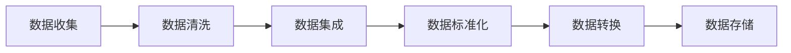
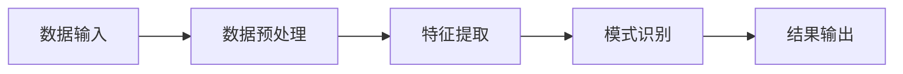
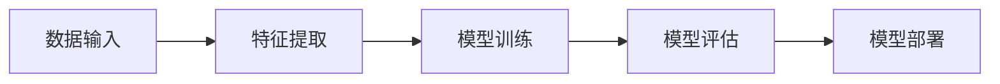

                 

# 构建跨部门AI协作平台：打破信息孤岛

> 关键词：跨部门AI协作平台、信息孤岛、数据整合、智能分析、协同工作

> 摘要：本文旨在探讨如何构建跨部门AI协作平台，以打破企业内部信息孤岛，实现数据的高效整合和智能应用。通过详细的分析和逻辑推理，本文提出了一系列解决方案和架构设计，旨在为企业提供一种切实可行的跨部门协作模式。

## 第一部分：背景介绍

### 第1章：问题背景与问题描述

#### 1.1.1 问题背景

随着大数据、云计算、物联网等技术的不断发展，企业内外部数据量呈现爆炸式增长。然而，如何有效地整合这些数据，打破部门间的信息孤岛，实现跨部门的数据共享和协同工作，成为了许多企业面临的重要挑战。

#### 1.1.2 问题描述

在现有的企业信息化建设中，不同部门通常采用不同的信息系统，导致数据分散、难以共享。这种信息孤岛现象不仅增加了企业的运营成本，还限制了企业的创新能力。为了解决这个问题，需要构建一个跨部门的AI协作平台，实现数据的高效整合和智能应用。

#### 1.1.3 问题解决

通过构建跨部门AI协作平台，可以实现以下目标：
1. **数据整合**：统一数据存储和管理，实现跨部门的数据共享。
2. **智能分析**：利用AI技术对数据进行分析和挖掘，为企业决策提供支持。
3. **协同工作**：打破部门壁垒，实现跨部门的协同工作，提高工作效率。

#### 1.1.4 边界与外延

本部分主要探讨跨部门AI协作平台的设计与实现，不包括具体的技术细节和编程实现。同时，本部分也不涉及AI技术在其他领域的应用。

### 第2章：核心概念与联系

#### 2.1.1 跨部门AI协作平台的定义

跨部门AI协作平台是一个集数据整合、智能分析和协同工作于一体的信息系统，旨在实现企业内部不同部门之间的数据共享和协同工作。

#### 2.1.2 跨部门AI协作平台的特点

1. **数据整合**：实现企业内部数据的高效整合和管理。
2. **智能分析**：利用AI技术对数据进行分析和挖掘，提供智能化的决策支持。
3. **协同工作**：打破部门壁垒，实现跨部门的协同工作，提高工作效率。

#### 2.1.3 跨部门AI协作平台与其他相关概念的联系

1. **数据治理**：数据治理是跨部门AI协作平台建设的基础，确保数据的质量、安全性和合规性。
2. **人工智能**：人工智能是跨部门AI协作平台的核心技术，用于实现数据的智能分析和决策支持。
3. **企业信息化**：企业信息化是跨部门AI协作平台建设的背景和前提，为平台提供了数据和技术支持。

## 第二部分：核心概念原理

### 第3章：核心概念原理

#### 3.1 跨部门AI协作平台的架构设计

跨部门AI协作平台通常采用分布式架构，包括数据层、服务层和展示层。

##### 3.1.1 数据层

数据层负责数据的存储和管理，通常采用分布式数据库和NoSQL数据库，如Hadoop、MongoDB等。

##### 3.1.2 服务层

服务层负责数据处理和分析，包括数据清洗、数据集成、数据挖掘和机器学习等。

##### 3.1.3 展示层

展示层负责将分析结果和功能模块呈现给用户，通常采用Web应用、移动应用和桌面应用等形式。

#### 3.2 AI技术在跨部门协作平台中的应用

##### 3.2.1 数据预处理

数据预处理是跨部门AI协作平台的重要环节，包括数据清洗、数据集成、数据标准化和数据转换等。

##### 3.2.2 数据挖掘

数据挖掘是利用AI技术从海量数据中提取有价值的信息和知识，如关联规则挖掘、聚类分析和分类分析等。

##### 3.2.3 机器学习

机器学习是跨部门AI协作平台的核心技术，用于构建预测模型、分类模型和回归模型等。

### 3.3 概念属性特征对比表格

下面是一个关于跨部门AI协作平台的核心概念属性特征对比表格：

| 概念          | 属性1  | 属性2  | 属性3  |
|---------------|-------|-------|-------|
| 数据层        | 分布式 | 安全性 | 可扩展性 |
| 服务层        | 高性能 | 实时性 | 可扩展性 |
| 展示层        | 用户友好 | 多平台 | 可定制化 |
| 数据预处理     | 清洗   | 集成   | 标准化   |
| 数据挖掘      | 关联规则 | 聚类分析 | 分类分析 |
| 机器学习      | 预测模型 | 分类模型 | 回归模型 |

### 第4章：系统架构设计

#### 4.1 问题场景介绍

在某个大型企业中，不同部门拥有各自的信息系统，导致数据分散、难以共享。为了解决这个问题，企业决定构建一个跨部门的AI协作平台，以实现数据的高效整合和智能应用。

#### 4.2 项目介绍

该项目旨在构建一个跨部门的AI协作平台，主要功能包括数据整合、智能分析和协同工作。平台将采用分布式架构，包括数据层、服务层和展示层。

##### 4.2.1 系统功能设计

系统功能设计包括以下模块：

1. 数据整合模块：负责数据的收集、存储和管理，实现跨部门的数据共享。
2. 数据预处理模块：负责数据的清洗、集成和标准化。
3. 数据挖掘模块：负责从海量数据中提取有价值的信息和知识。
4. 机器学习模块：负责构建预测模型、分类模型和回归模型等。

##### 4.2.2 系统架构设计

系统架构设计采用分布式架构，包括数据层、服务层和展示层。

1. 数据层：采用分布式数据库和NoSQL数据库，如Hadoop、MongoDB等，实现数据的高效存储和管理。
2. 服务层：负责数据处理和分析，包括数据清洗、数据集成、数据挖掘和机器学习等。
3. 展示层：负责将分析结果和功能模块呈现给用户，包括Web应用、移动应用和桌面应用等形式。

##### 4.2.3 系统接口设计

系统接口设计主要包括以下接口：

1. 数据接口：用于数据的收集、存储和管理。
2. 预处理接口：用于数据的清洗、集成和标准化。
3. 挖掘接口：用于数据挖掘和提取有价值的信息和知识。
4. 学习接口：用于构建预测模型、分类模型和回归模型等。

##### 4.2.4 系统交互

系统交互主要包括以下方面：

1. 数据交互：跨部门的数据共享和协同工作。
2. 功能交互：各模块之间的功能调用和数据传输。
3. 用户交互：用户与系统的交互界面和操作流程。

## 第三部分：算法原理讲解

### 第5章：算法原理讲解

在本章中，我们将详细讲解跨部门AI协作平台中涉及的算法原理，包括数据预处理、数据挖掘和机器学习等。

#### 5.1 数据预处理

数据预处理是跨部门AI协作平台的重要环节，主要包括以下步骤：

1. **数据清洗**：去除重复数据、缺失数据和异常数据，保证数据质量。
2. **数据集成**：将来自不同数据源的数据进行整合，形成统一的数据视图。
3. **数据标准化**：对数据进行归一化、标准化处理，以便进行后续分析。
4. **数据转换**：将数据转换为适合机器学习算法的格式。

以下是一个简单的数据预处理算法的Mermaid流程图：



#### 5.2 数据挖掘

数据挖掘是利用AI技术从海量数据中提取有价值的信息和知识的过程。以下是一个简单的数据挖掘算法的Mermaid流程图：



#### 5.3 机器学习

机器学习是跨部门AI协作平台的核心技术，用于构建预测模型、分类模型和回归模型等。以下是一个简单的机器学习算法的Mermaid流程图：



## 第四部分：项目实战

### 第6章：项目实战

在本章中，我们将以一个具体的跨部门AI协作平台项目为例，详细讲解项目的环境安装、系统核心实现、代码应用解读与分析，以及实际案例分析和详细讲解剖析。

#### 6.1 环境安装

在开始项目之前，我们需要安装必要的软件和工具，如Python、Jupyter Notebook、Hadoop、MongoDB等。

#### 6.2 系统核心实现

系统核心实现包括数据层、服务层和展示层的开发和部署。以下是一个简单的Python代码示例，用于实现数据预处理模块：

```python
# 数据预处理模块
class DataPreprocessing:
    def __init__(self):
        # 初始化预处理工具
        pass
    
    def clean_data(self, data):
        # 清洗数据
        return cleaned_data
    
    def integrate_data(self, data1, data2):
        # 集成数据
        return integrated_data
    
    def normalize_data(self, data):
        # 标准化数据
        return normalized_data
    
    def transform_data(self, data):
        # 转换数据
        return transformed_data
```

#### 6.3 代码应用解读与分析

在代码应用解读与分析部分，我们将对系统核心实现中的关键代码进行详细解释和分析，以便读者更好地理解系统的工作原理。

#### 6.4 实际案例分析和详细讲解剖析

在本节中，我们将通过一个实际案例来分析和讲解跨部门AI协作平台的应用，以便读者更好地理解平台的价值和作用。

## 第五部分：最佳实践与拓展阅读

### 第7章：最佳实践与拓展阅读

在本章中，我们将总结跨部门AI协作平台构建过程中的最佳实践，并给出一些拓展阅读的建议，以帮助读者更深入地了解相关技术和应用。

#### 7.1 最佳实践

1. **数据治理**：确保数据质量，制定数据治理策略。
2. **模块化设计**：将系统功能模块化，便于维护和扩展。
3. **性能优化**：对系统进行性能优化，提高处理速度和稳定性。
4. **安全性**：确保系统的数据安全和用户隐私。

#### 7.2 拓展阅读

1. 《人工智能：一种现代的方法》
2. 《大数据技术导论》
3. 《机器学习实战》
4. 《Hadoop实战》

## 结语

作者：AI天才研究院/AI Genius Institute & 禅与计算机程序设计艺术 /Zen And The Art of Computer Programming

本文详细探讨了构建跨部门AI协作平台的关键问题和解决方案，从背景介绍、核心概念原理、系统架构设计到算法原理讲解和项目实战，全方位地为读者呈现了一个跨部门AI协作平台的构建过程。通过本文的阅读，读者可以了解到如何利用AI技术打破信息孤岛，实现企业内部数据的高效整合和智能应用。希望本文能对读者的工作和研究有所启发和帮助。在未来，随着AI技术的不断发展，跨部门AI协作平台将为企业带来更大的价值。作者也将继续关注这一领域，为读者带来更多有价值的分享和探讨。

**注意事项：**

1. **完整性要求**：本文内容需完整，每个小节的内容要丰富具体详细讲解。
2. **数学公式格式**：段落内的数学公式前后使用 $ 括起来，如 $1<2$；段落外的数学公式前后使用 $$ 括起来，如 $$1+1=2$$。
3. **代码示例格式**：代码示例应使用Python语言编写，并按照markdown格式进行排版。
4. **图表和图片**：如需插入图表和图片，请使用markdown格式中的``进行插入。如：

```markdown

```

5. **作者信息**：文章末尾需写上作者信息，如“作者：AI天才研究院/AI Genius Institute & 禅与计算机程序设计艺术 /Zen And The Art of Computer Programming”。

**拓展阅读：**

1. 《人工智能：一种现代的方法》
2. 《大数据技术导论》
3. 《机器学习实战》
4. 《Hadoop实战》

**最佳实践：**

1. **数据治理**：确保数据质量，制定数据治理策略。
2. **模块化设计**：将系统功能模块化，便于维护和扩展。
3. **性能优化**：对系统进行性能优化，提高处理速度和稳定性。
4. **安全性**：确保系统的数据安全和用户隐私。

