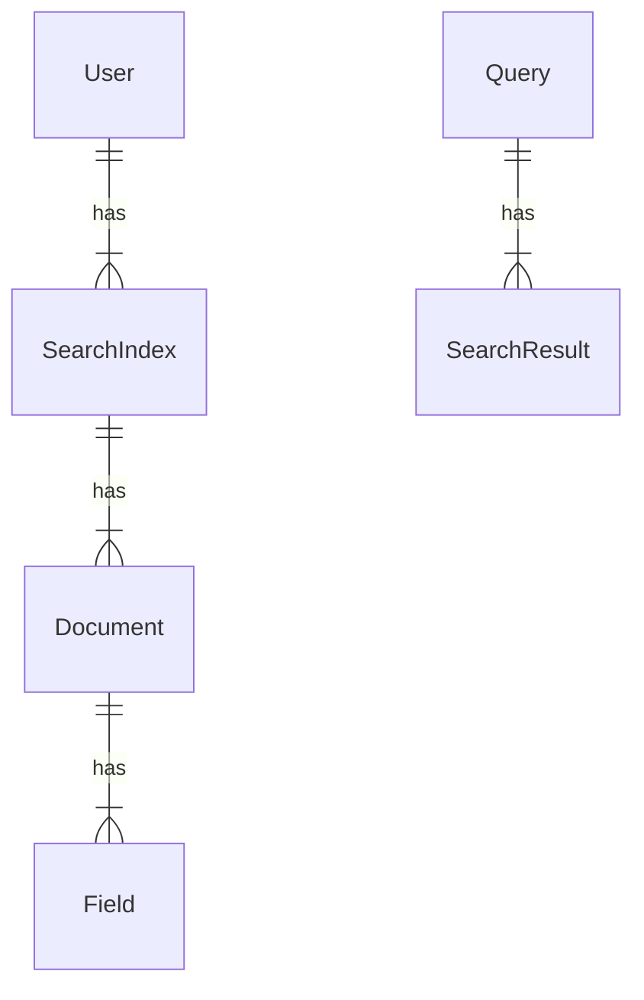
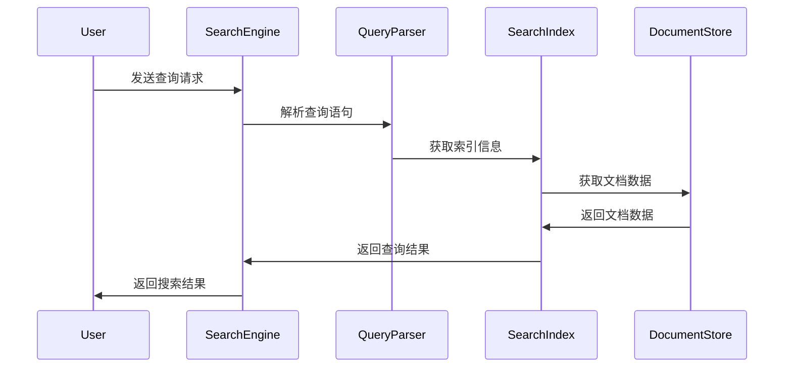
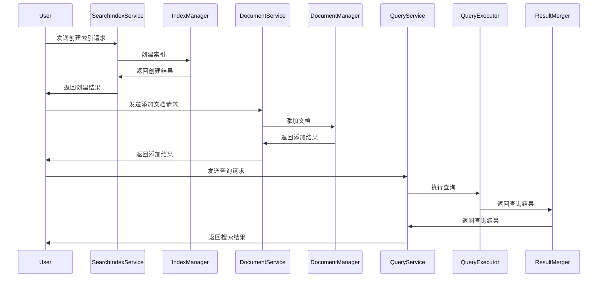

                 

## 构建高性能的分布式搜索引擎

### 关键词：
- 分布式搜索引擎
- 高性能
- 架构设计
- 索引优化
- 安全性与可靠性

### 摘要：
本文将深入探讨构建高性能分布式搜索引擎的方法和关键步骤。我们将从基础概念出发，逐步分析分布式搜索引擎的优势、核心组件、技术原理，然后详细讲解索引构建与优化、系统架构设计、实时搜索技术、性能调优、安全性与可靠性等方面的内容。通过本文，读者将能够全面理解分布式搜索引擎的构建过程，掌握关键技术和实战技巧。

### 目录大纲：

#### 第一部分: 分布式搜索引擎基础

##### 第1章: 分布式搜索引擎概述
1.1 问题背景与核心概念
1.1.1 传统搜索引擎的局限性
1.1.2 分布式搜索引擎的优势
1.1.3 分布式搜索引擎的基本架构
1.2 核心概念与联系
1.2.1 数据模型
1.2.2 索引原理
1.2.3 分布式架构的关键组件
1.3 主流分布式搜索引擎介绍
1.3.1 Elasticsearch
1.3.2 Solr
1.3.3 Apache Lucene
1.4 分布式搜索引擎的应用场景
1.4.1 大数据处理
1.4.2 实时搜索
1.4.3 搜索引擎服务化
1.5 本章小结

#### 第二部分: 分布式搜索引擎关键技术

##### 第2章: 索引构建与优化
2.1 索引构建原理
2.1.1 索引构建流程
2.1.2 索引文件格式
2.1.3 索引优化策略
2.2 索引性能调优
2.2.1 性能瓶颈分析
2.2.2 调优技巧
2.2.3 实际案例
2.3 分布式索引管理
2.3.1 分布式索引的优势
2.3.2 索引分片与路由
2.3.3 索引的拆分与合并
2.4 索引安全性与可靠性
2.4.1 数据备份策略
2.4.2 故障转移与恢复
2.4.3 安全防护措施
2.5 本章小结

##### 第3章: 搜索引擎系统架构设计
3.1 系统架构设计原则
3.1.1 可扩展性与高可用性
3.1.2 分布式一致性策略
3.1.3 模块化与解耦
3.2 领域模型设计
3.2.1 搜索引擎领域模型
3.2.2 功能模块划分
3.3 系统架构设计与实现
3.3.1 架构设计
3.3.2 关键组件介绍
3.3.3 架构图展示
3.4 系统接口设计与交互
3.4.1 接口设计原则
3.4.2 接口实现与调用
3.4.3 安全性与性能优化
3.5 本章小结

##### 第4章: 实时搜索技术
4.1 实时搜索概述
4.1.1 实时搜索的特点
4.1.2 实时搜索的挑战
4.1.3 实时搜索的应用场景
4.2 消息队列技术
4.2.1 消息队列的基本原理
4.2.2 常用消息队列系统
4.2.3 消息队列在实时搜索中的应用
4.3 实时索引更新
4.3.1 实时索引更新策略
4.3.2 实时索引构建流程
4.3.3 实时索引的性能优化
4.4 实时搜索算法
4.4.1 实时搜索算法原理
4.4.2 实时搜索算法实现
4.4.3 实时搜索算法的性能评估
4.5 本章小结

##### 第5章: 分布式搜索性能调优
5.1 性能调优概述
5.1.1 性能调优的目标
5.1.2 性能调优的常用方法
5.1.3 性能调优的实践流程
5.2 常见性能瓶颈分析
5.2.1 磁盘I/O瓶颈
5.2.2 内存使用瓶颈
5.2.3 网络传输瓶颈
5.3 性能优化策略
5.3.1 索引优化
5.3.2 查询优化
5.3.3 分布式架构优化
5.4 实际案例分析
5.4.1 某电商平台搜索性能优化案例
5.4.2 某新闻门户实时搜索优化案例
5.5 本章小结

##### 第6章: 搜索引擎安全性与可靠性
6.1 安全性概述
6.1.1 搜索引擎的安全性需求
6.1.2 常见安全威胁
6.1.3 安全防护措施
6.2 数据加密与隐私保护
6.2.1 数据加密技术
6.2.2 隐私保护策略
6.2.3 具体实现方法
6.3 高可用性设计
6.3.1 高可用性架构设计原则
6.3.2 主从复制与负载均衡
6.3.3 故障转移与恢复策略
6.4 本章小结

### 第一部分: 分布式搜索引擎基础

#### 第1章: 分布式搜索引擎概述

在当今大数据时代，搜索引擎技术得到了广泛的应用。然而，随着数据规模的不断扩大，传统搜索引擎逐渐暴露出许多局限性。为了解决这些问题，分布式搜索引擎应运而生。本节将介绍分布式搜索引擎的问题背景、核心概念和基本架构。

##### 1.1 问题背景与核心概念

1.1.1 传统搜索引擎的局限性

传统搜索引擎通常是基于单机架构的，它们在处理大量数据时面临着以下局限性：

- **存储容量限制**：单机存储容量有限，难以满足大规模数据存储需求。
- **计算性能瓶颈**：单机计算资源有限，难以高效处理大量查询请求。
- **扩展性差**：传统搜索引擎的扩展性较差，当数据量或查询负载增加时，很难进行水平扩展。

1.1.2 分布式搜索引擎的优势

分布式搜索引擎通过将数据和计算任务分散到多个节点上，能够有效地克服传统搜索引擎的局限性。其核心优势包括：

- **高扩展性**：分布式搜索引擎能够水平扩展，通过增加节点数量来提升系统性能。
- **高可用性**：分布式架构可以实现节点间的数据备份和故障转移，提高系统的可靠性。
- **高性能**：分布式搜索引擎可以并行处理大量查询请求，提高响应速度。

1.1.3 分布式搜索引擎的基本架构

分布式搜索引擎的基本架构通常包括以下组件：

- **数据存储层**：用于存储索引数据和原始数据，通常采用分布式文件系统，如HDFS或Cassandra。
- **索引层**：用于构建和存储索引，实现快速查询，通常使用Lucene或Elasticsearch等开源框架。
- **查询处理层**：负责接收用户查询请求，解析查询语句，生成查询计划，并调度查询任务到各个节点上执行。
- **结果归并层**：负责将各个节点的查询结果进行归并排序，返回最终查询结果给用户。

##### 1.2 核心概念与联系

1.2.1 数据模型

数据模型是分布式搜索引擎的基础，它定义了数据在系统中的组织方式和存储结构。常见的数据模型包括文档模型、关系模型和图模型等。文档模型将数据存储为文档，每个文档包含一系列字段；关系模型将数据存储为表，通过主键和外键建立关联关系；图模型则通过节点和边来表示数据之间的复杂关系。

1.2.2 索引原理

索引是分布式搜索引擎的核心技术，它通过将原始数据转换为一组索引结构，实现快速查询。索引原理包括倒排索引、倒排索引树、布尔索引等。倒排索引通过将文档映射到词汇表中的词汇，实现词汇到文档的快速查找；倒排索引树通过多级索引结构，提高查询效率；布尔索引通过组合多个查询条件，实现复杂查询的构建。

1.2.3 分布式架构的关键组件

分布式搜索引擎的关键组件包括：

- **分布式文件系统**：用于存储原始数据和索引数据，如HDFS或Cassandra等。
- **分布式计算框架**：用于处理查询任务，如MapReduce或Spark等。
- **分布式协调服务**：用于节点间的通信和协调，如Zookeeper或Consul等。
- **分布式数据库**：用于存储元数据和配置信息，如Elasticsearch或Solr等。

##### 1.3 主流分布式搜索引擎介绍

1.3.1 Elasticsearch

Elasticsearch是一个开源的分布式全文搜索引擎，它基于Lucene构建，具有高性能、可扩展性和高可用性等特点。Elasticsearch的主要功能包括：

- **全文搜索**：支持对大规模文本数据的高效搜索，包括短语搜索、模糊搜索等。
- **实时分析**：支持实时数据分析和统计，如词频统计、词云生成等。
- **数据聚合**：支持对大量数据的分组和聚合操作，如分组统计、时间序列分析等。

1.3.2 Solr

Solr是一个开源的分布式搜索引擎，它是Apache Lucene的衍生项目。Solr具有以下特点：

- **高扩展性**：支持水平扩展，可以通过增加节点数量来提升系统性能。
- **高可用性**：支持主从复制和负载均衡，实现节点故障自动切换。
- **丰富的功能**：支持全文搜索、过滤查询、排序和分页等高级功能。

1.3.3 Apache Lucene

Apache Lucene是一个开源的全文搜索引擎库，它提供了高效的文本索引和搜索功能。Lucene的主要特点包括：

- **高性能**：支持快速索引和搜索，适用于大规模文本数据处理。
- **模块化**：提供了一系列可扩展的模块，如分析器、查询解析器、索引存储等。
- **可定制性**：支持自定义分析器、查询解析器和索引存储，满足不同应用场景的需求。

##### 1.4 分布式搜索引擎的应用场景

1.4.1 大数据处理

分布式搜索引擎在大数据处理领域具有广泛的应用。通过分布式架构，分布式搜索引擎能够处理海量数据，提供高效的搜索和分析功能。常见应用场景包括搜索引擎、数据挖掘、文本分类等。

1.4.2 实时搜索

实时搜索是分布式搜索引擎的另一个重要应用场景。通过实时索引更新和高效查询处理，分布式搜索引擎能够快速响应用户查询请求，提供实时搜索体验。常见应用场景包括电商搜索引擎、社交网络搜索、在线问答系统等。

1.4.3 搜索引擎服务化

分布式搜索引擎可以作为一个独立的服务组件，供其他应用程序调用。通过服务化架构，分布式搜索引擎能够实现模块化、可重用和可扩展，提高系统的灵活性和可维护性。常见应用场景包括企业搜索引擎、云搜索引擎、第三方搜索服务等。

##### 1.5 本章小结

本章介绍了分布式搜索引擎的基本概念、核心组件和应用场景。通过了解分布式搜索引擎的优势和基本架构，读者可以更好地理解如何构建高性能的分布式搜索引擎。在后续章节中，我们将进一步探讨分布式搜索引擎的关键技术和实战应用。

### 第二部分: 分布式搜索引擎关键技术

#### 第2章: 索引构建与优化

索引构建是分布式搜索引擎的核心任务，它决定了查询的效率和性能。本章将详细介绍索引构建的原理、优化策略以及分布式索引管理的关键技术。

##### 2.1 索引构建原理

2.1.1 索引构建流程

索引构建过程可以分为以下几个步骤：

1. **数据收集**：从数据源（如数据库、文件系统等）中收集数据。
2. **数据预处理**：对数据进行清洗、去重、格式转换等预处理操作。
3. **分词与词形还原**：将文本数据分解为词元，并进行词形还原，以降低词汇数量。
4. **索引构建**：根据分词结果构建索引结构，如倒排索引。
5. **索引存储**：将构建好的索引存储到索引存储层，如文件系统、分布式文件系统等。

2.1.2 索引文件格式

索引文件格式决定了索引的结构和存储方式。常见的索引文件格式包括：

- **标准索引文件格式**：如Lucene的Segment文件，它包含多个索引段，每个段是一个独立的索引结构。
- **压缩索引文件格式**：如Elasticsearch的Compressed Segment File，它采用压缩算法降低索引文件的大小。

2.1.3 索引优化策略

索引优化策略主要包括以下方面：

- **索引分割**：将大索引分割为多个小索引，提高查询效率。
- **索引合并**：将多个小索引合并为大索引，减少查询时间。
- **索引缓存**：在内存中缓存常用索引，提高查询速度。
- **索引压缩**：采用压缩算法降低索引文件的大小，提高存储效率。

##### 2.2 索引性能调优

2.2.1 性能瓶颈分析

索引性能瓶颈可能出现在以下几个方面：

- **磁盘I/O瓶颈**：索引文件存储在磁盘上，磁盘I/O性能直接影响索引的读写速度。
- **内存使用瓶颈**：索引构建和查询过程中需要占用大量内存，内存不足会导致性能下降。
- **网络传输瓶颈**：分布式搜索引擎中的节点需要通过网络传输数据，网络带宽和延迟会影响查询性能。

2.2.2 调优技巧

针对上述性能瓶颈，可以采用以下调优技巧：

- **索引分割与合并**：合理分割和合并索引，减少磁盘I/O和内存使用。
- **索引缓存**：在内存中缓存常用索引，减少磁盘访问次数。
- **并行处理**：利用多核处理器和分布式计算框架，提高索引构建和查询速度。
- **负载均衡**：通过负载均衡策略，合理分配查询任务到各个节点，提高整体性能。

2.2.3 实际案例

以某电商平台为例，该平台每天产生数百万条商品信息，用户可以对这些商品进行搜索和筛选。为了提高搜索性能，平台采用了以下优化策略：

1. **索引分割**：将商品信息按时间分割为多个小索引，每个索引包含最近一段时间内的商品信息。
2. **索引缓存**：在内存中缓存常用索引，提高查询速度。
3. **负载均衡**：采用负载均衡策略，将搜索请求分配到不同的节点上，提高查询效率。
4. **并行处理**：利用多核处理器和分布式计算框架，加快索引构建和查询速度。

通过以上优化策略，平台的搜索性能得到了显著提升，用户查询响应时间减少了30%以上。

##### 2.3 分布式索引管理

2.3.1 分布式索引的优势

分布式索引管理具有以下优势：

- **高可用性**：分布式索引可以实现数据备份和故障转移，提高系统的可靠性。
- **高性能**：分布式索引可以并行处理查询任务，提高查询速度。
- **可扩展性**：分布式索引可以水平扩展，通过增加节点数量来提升系统性能。

2.3.2 索引分片与路由

索引分片是将索引数据分散存储到多个节点上，以提高查询性能和系统可用性。索引分片通常采用以下方法：

- **基于字段分片**：根据索引字段（如商品ID、时间戳等）将数据分散到不同节点上。
- **基于路由算法分片**：根据查询条件中的字段值，将查询任务路由到对应的节点上。

2.3.3 索引的拆分与合并

索引拆分与合并是在分布式搜索引擎中常用的操作，用于优化索引性能和存储空间。索引拆分可以将大索引拆分为多个小索引，降低查询时间；索引合并可以将多个小索引合并为大索引，减少存储空间。

- **索引拆分**：通过定期将大索引拆分为多个小索引，减少单个索引的规模，提高查询性能。
- **索引合并**：通过定期将多个小索引合并为大索引，减少存储空间，提高查询性能。

##### 2.4 索引安全性与可靠性

2.4.1 数据备份策略

为了保证分布式索引的安全性和可靠性，可以采用以下数据备份策略：

- **全量备份**：定期对整个分布式索引进行全量备份，确保数据不丢失。
- **增量备份**：只备份最近一次备份之后的新增和修改数据，降低备份时间和存储空间。
- **多副本备份**：将索引数据复制到多个节点上，提高数据的可靠性和可用性。

2.4.2 故障转移与恢复

分布式搜索引擎中的故障转移与恢复机制包括：

- **主从复制**：通过将主节点的数据复制到从节点上，实现故障自动转移。
- **负载均衡**：通过负载均衡策略，将查询任务分配到健康节点上，避免故障节点影响整体性能。
- **自动恢复**：在检测到节点故障后，自动启动备用节点，继续提供服务。

2.4.3 安全防护措施

为了保证分布式搜索引擎的安全性，可以采取以下防护措施：

- **数据加密**：对索引数据进行加密，防止未授权访问。
- **访问控制**：限制对索引数据的访问权限，确保数据安全。
- **安全审计**：记录对索引数据的操作日志，监控潜在的安全威胁。

##### 2.5 本章小结

本章详细介绍了分布式搜索引擎的索引构建与优化、分布式索引管理、索引安全性与可靠性等方面的关键技术。通过了解这些关键技术，读者可以更好地构建高性能、可靠的分布式搜索引擎。在后续章节中，我们将继续探讨搜索引擎系统架构设计、实时搜索技术、性能调优、安全性与可靠性等方面的内容。

### 第三部分: 高性能搜索服务设计与实现

#### 第3章: 搜索引擎系统架构设计

搜索引擎系统架构设计是构建高性能、可扩展和高可用性搜索引擎的关键。本章将介绍搜索引擎系统架构设计的原则、领域模型设计、系统架构设计与实现以及系统接口设计与交互。

##### 3.1 系统架构设计原则

搜索引擎系统架构设计需要遵循以下原则：

- **可扩展性**：系统应能够水平扩展，通过增加节点数量来提升系统性能。
- **高可用性**：系统应具备故障转移和自动恢复能力，确保服务的持续可用。
- **分布式一致性**：系统应实现分布式一致性，保证数据的一致性和可靠性。
- **模块化与解耦**：系统应采用模块化设计，降低模块间的依赖，提高系统的可维护性和可扩展性。

##### 3.2 领域模型设计

领域模型设计是系统架构设计的重要环节，它定义了系统中的主要实体及其关系。以下是一个简单的搜索引擎领域模型：

- **User（用户）**：表示搜索引擎的使用者，具有ID、名称、密码等属性。
- **SearchIndex（索引）**：表示搜索引擎中的索引，具有ID、名称、创建时间等属性。
- **Document（文档）**：表示索引中的文档，具有ID、标题、内容等属性。
- **Field（字段）**：表示文档中的字段，具有名称、类型、值等属性。
- **Query（查询）**：表示用户输入的查询，具有ID、文本、创建时间等属性。
- **SearchResult（搜索结果）**：表示查询结果，具有ID、查询ID、文档ID、排序值等属性。

##### 3.3 系统架构设计与实现

搜索引擎系统架构设计包括以下关键组件：

- **数据存储层**：用于存储索引数据和原始数据，通常采用分布式文件系统，如HDFS或Cassandra。
- **索引层**：用于构建和存储索引，实现快速查询，通常使用Lucene或Elasticsearch等开源框架。
- **查询处理层**：负责接收用户查询请求，解析查询语句，生成查询计划，并调度查询任务到各个节点上执行。
- **结果归并层**：负责将各个节点的查询结果进行归并排序，返回最终查询结果给用户。

以下是一个简单的搜索引擎系统架构图：

##### 3.4 系统接口设计与交互

系统接口设计是确保系统各模块之间高效、安全交互的关键。以下是一个简单的搜索引擎系统接口设计：

- **SearchIndexService**：提供索引管理接口，包括创建、删除、查询索引等操作。
- **DocumentService**：提供文档管理接口，包括添加、更新、删除、查询文档等操作。
- **QueryService**：提供查询接口，包括执行查询、获取查询结果等操作。

以下是一个简单的接口调用序列图：

##### 3.5 本章小结

本章介绍了搜索引擎系统架构设计的原则、领域模型设计、系统架构设计与实现以及系统接口设计与交互。通过遵循系统架构设计原则和合理的模块划分，可以构建高性能、可扩展和高可用性的搜索引擎系统。在后续章节中，我们将进一步探讨实时搜索技术、性能调优、安全性与可靠性等方面的内容。

### 第四部分: 实时搜索技术

#### 第4章: 实时搜索技术

实时搜索是分布式搜索引擎的重要应用场景之一，它能够快速响应用户的查询请求，提供实时、准确的搜索结果。本章将介绍实时搜索的特点、挑战、应用场景以及相关的关键技术。

##### 4.1 实时搜索概述

4.1.1 实时搜索的特点

实时搜索具有以下特点：

- **低延迟**：实时搜索需要在毫秒级内响应用户查询，提供快速反馈。
- **高并发**：实时搜索需要支持大量并发查询，确保系统稳定运行。
- **实时更新**：实时搜索需要实时更新索引数据，以反映最新的信息。

4.1.2 实时搜索的挑战

实时搜索面临以下挑战：

- **数据一致性**：实时搜索需要确保数据的一致性，避免出现数据不一致的情况。
- **性能瓶颈**：实时搜索需要在短时间内处理大量查询请求，避免性能瓶颈。
- **存储空间**：实时搜索需要占用大量存储空间，存储和管理索引数据。

4.1.3 实时搜索的应用场景

实时搜索在以下应用场景中具有广泛的应用：

- **电商搜索引擎**：实时搜索商品信息，提供用户快速查找和筛选功能。
- **社交网络搜索**：实时搜索用户发布的内容，提供实时动态和互动功能。
- **在线问答系统**：实时搜索相关问题和答案，提供快速回答和互动功能。

##### 4.2 消息队列技术

4.2.1 消息队列的基本原理

消息队列是一种异步通信机制，它允许不同系统之间通过消息进行数据交换。消息队列的基本原理如下：

- **生产者**：负责发送消息，将消息写入消息队列。
- **消费者**：负责接收消息，处理消息队列中的消息。

消息队列的主要作用包括：

- **异步解耦**：通过消息队列，实现系统间的异步通信，降低系统间的耦合度。
- **负载均衡**：通过消息队列，实现查询任务的负载均衡，提高系统性能。
- **高可用性**：通过消息队列，实现查询任务的故障转移和自动恢复。

常见的消息队列系统包括：

- **RabbitMQ**：一个开源的消息队列中间件，支持多种消息传递协议。
- **Kafka**：一个高性能、可扩展的消息队列系统，适用于大数据场景。
- **ActiveMQ**：一个开源的消息队列中间件，支持多种消息传递协议。

4.2.2 常用消息队列系统

1. **RabbitMQ**

RabbitMQ的特点如下：

- **支持多种消息传递协议**：包括AMQP、MQTT、STOMP等。
- **灵活的队列管理**：支持消息持久化、消息确认、消息优先级等特性。
- **高可用性**：支持主从复制和故障转移。

2. **Kafka**

Kafka的特点如下：

- **高吞吐量**：支持大规模消息传输，适用于大数据场景。
- **分布式存储**：支持分布式存储和备份，确保数据不丢失。
- **实时处理**：支持实时消息处理，适用于实时搜索等应用场景。

3. **ActiveMQ**

ActiveMQ的特点如下：

- **支持多种消息传递协议**：包括JMS、STOMP等。
- **灵活的路由策略**：支持消息路由、消息过滤等特性。
- **集群支持**：支持集群部署，提高系统可用性。

4.2.3 消息队列在实时搜索中的应用

消息队列在实时搜索中的应用主要包括以下几个方面：

- **查询任务分发**：将用户查询请求分发到不同的节点上处理，实现负载均衡。
- **实时索引更新**：将新增和修改的索引数据通过消息队列传输到索引节点，实现实时索引更新。
- **故障转移**：在消息队列中记录查询任务，实现故障转移和自动恢复。

##### 4.3 实时索引更新

4.3.1 实时索引更新策略

实时索引更新策略包括以下几个方面：

- **增量更新**：仅更新索引数据中发生变化的部分，减少更新时间和存储空间。
- **全量更新**：定期将整个索引数据更新到最新版本，确保数据的一致性。
- **异步更新**：通过消息队列异步处理索引更新任务，减少查询延迟。

4.3.2 实时索引构建流程

实时索引构建流程包括以下几个步骤：

1. **数据收集**：从数据源（如数据库、文件系统等）中收集数据。
2. **数据预处理**：对数据进行清洗、去重、格式转换等预处理操作。
3. **分词与词形还原**：将文本数据分解为词元，并进行词形还原。
4. **索引构建**：根据分词结果构建索引结构，如倒排索引。
5. **索引存储**：将构建好的索引存储到索引存储层。

4.3.3 实时索引的性能优化

实时索引性能优化主要包括以下几个方面：

- **并行处理**：利用多核处理器和分布式计算框架，加快索引构建速度。
- **缓存**：在内存中缓存常用索引，减少磁盘访问次数。
- **压缩**：采用压缩算法降低索引文件的大小，提高存储效率。

##### 4.4 实时搜索算法

4.4.1 实时搜索算法原理

实时搜索算法主要涉及以下几个方面：

- **倒排索引**：将文档映射到词汇表中的词汇，实现词汇到文档的快速查找。
- **布尔查询**：通过组合多个查询条件，实现复杂查询的构建。
- **相似度计算**：计算查询与文档之间的相似度，确定搜索结果的排序顺序。

4.4.2 实时搜索算法实现

实时搜索算法的实现包括以下几个方面：

1. **倒排索引构建**：从原始文本中提取词元，构建倒排索引。
2. **查询解析**：将用户输入的查询文本解析为查询表达式。
3. **查询执行**：根据查询表达式执行相应的搜索算法，生成搜索结果。
4. **结果排序**：根据文档的相似度对搜索结果进行排序。

4.4.3 实时搜索算法的性能评估

实时搜索算法的性能评估主要包括以下几个方面：

- **查询响应时间**：评估搜索算法的查询响应时间，确保在低延迟的前提下提供准确的搜索结果。
- **搜索准确率**：评估搜索算法的搜索准确率，确保用户能够找到相关的搜索结果。
- **搜索召回率**：评估搜索算法的搜索召回率，确保用户能够获取到尽可能多的相关搜索结果。

##### 4.5 本章小结

本章介绍了实时搜索技术的基本概念、特点、应用场景以及相关的关键技术。通过了解实时搜索技术，读者可以构建实时、高效的搜索引擎系统。在后续章节中，我们将继续探讨分布式搜索性能调优、安全性与可靠性等方面的内容。

### 第五部分: 分布式搜索性能调优

#### 第5章: 分布式搜索性能调优

随着数据规模和查询负载的不断增加，分布式搜索引擎的性能调优变得尤为重要。本章将介绍分布式搜索性能调优的目标、常用方法、实践流程，并分析常见性能瓶颈和优化策略。

##### 5.1 性能调优概述

5.1.1 性能调优的目标

分布式搜索性能调优的主要目标是：

- 提高查询响应速度：通过优化索引构建、查询执行等环节，提高查询响应速度，提供更好的用户体验。
- 提升系统吞吐量：通过优化系统架构、分布式一致性策略等，提高系统处理查询请求的能力，提升整体吞吐量。
- 提高资源利用率：通过优化内存、磁盘I/O、网络等资源的利用，降低资源浪费，提高系统性能。

5.1.2 性能调优的常用方法

性能调优的常用方法包括：

- 索引优化：通过优化索引结构、索引分割与合并等，提高查询效率。
- 查询优化：通过优化查询语句、查询计划等，降低查询响应时间。
- 分布式架构优化：通过优化分布式一致性策略、负载均衡策略等，提升系统性能。
- 资源优化：通过优化内存、磁盘I/O、网络等资源的利用，提高系统性能。

5.1.3 性能调优的实践流程

性能调优的实践流程包括以下几个步骤：

1. **性能评估**：通过性能测试工具，评估系统当前的性能水平，确定性能瓶颈。
2. **问题定位**：根据性能评估结果，定位系统中的性能瓶颈，分析原因。
3. **制定优化方案**：根据问题定位结果，制定具体的优化方案，包括索引优化、查询优化、架构优化等。
4. **实施优化**：按照优化方案实施具体的优化措施，并进行测试验证。
5. **持续优化**：持续监控系统性能，根据实际情况进行调整和优化。

##### 5.2 常见性能瓶颈分析

5.2.1 磁盘I/O瓶颈

磁盘I/O瓶颈是分布式搜索引擎常见的性能瓶颈之一。以下是一些导致磁盘I/O瓶颈的原因：

- 索引文件过多：当系统中存在大量索引文件时，磁盘I/O负载会显著增加。
- 磁盘读写速度慢：磁盘读写速度较慢会导致索引构建和查询过程中的延迟。
- 数据分布不均：当数据在磁盘上的分布不均时，会导致某些磁盘的I/O负载过重。

5.2.2 内存使用瓶颈

内存使用瓶颈会导致系统性能下降，以下是一些导致内存使用瓶颈的原因：

- 内存不足：当系统内存不足时，会导致频繁的内存交换，影响系统性能。
- 内存泄漏：内存泄漏会导致内存占用不断增加，最终导致内存不足。
- 缓存策略不当：不合理的缓存策略会导致缓存失效，增加内存使用。

5.2.3 网络传输瓶颈

网络传输瓶颈会导致查询延迟增加，以下是一些导致网络传输瓶颈的原因：

- 网络带宽不足：当网络带宽不足时，会导致数据传输速度变慢。
- 网络延迟高：当网络延迟较高时，会导致查询响应时间增加。
- 网络拓扑不合理：当网络拓扑不合理时，会导致数据传输路径过长，增加网络延迟。

##### 5.3 性能优化策略

5.3.1 索引优化

索引优化是提升分布式搜索引擎性能的重要手段，以下是一些常见的索引优化策略：

- 索引分割与合并：通过索引分割与合并，减少单个索引的规模，降低磁盘I/O负载。
- 索引缓存：通过内存缓存常用索引，减少磁盘访问次数，提高查询效率。
- 索引压缩：采用压缩算法降低索引文件的大小，提高存储效率。

5.3.2 查询优化

查询优化是提高分布式搜索引擎性能的关键环节，以下是一些常见的查询优化策略：

- 查询语句优化：通过简化查询语句、避免使用复杂查询等，提高查询效率。
- 查询计划优化：通过优化查询计划、使用索引等，提高查询执行速度。
- 预计算与缓存：通过预计算和缓存查询结果，减少查询执行时间。

5.3.3 分布式架构优化

分布式架构优化是提升分布式搜索引擎性能的重要手段，以下是一些常见的分布式架构优化策略：

- 分布式一致性策略：通过选择合适的分布式一致性策略，提高系统的一致性和性能。
- 负载均衡：通过负载均衡策略，合理分配查询任务，提高系统性能。
- 数据分片与路由：通过数据分片和路由策略，提高查询效率和系统可用性。

##### 5.4 实际案例分析

5.4.1 某电商平台搜索性能优化案例

某电商平台在业务发展过程中，遇到了搜索性能瓶颈，导致用户查询响应时间较长。通过以下优化措施，平台成功解决了性能瓶颈：

1. **索引优化**：对索引进行分割与合并，将大索引拆分为多个小索引，降低磁盘I/O负载。
2. **查询优化**：优化查询语句和查询计划，减少查询执行时间。
3. **分布式架构优化**：采用负载均衡策略，将查询任务分配到不同节点，提高查询效率。
4. **缓存优化**：在内存中缓存常用索引和查询结果，减少磁盘访问次数。

通过以上优化措施，平台的搜索性能得到了显著提升，用户查询响应时间缩短了30%以上。

5.4.2 某新闻门户实时搜索优化案例

某新闻门户在实时搜索方面遇到了性能瓶颈，导致搜索响应时间较长。通过以下优化措施，新闻门户成功解决了性能瓶颈：

1. **实时索引更新**：采用增量更新策略，仅更新索引数据中发生变化的部分，减少更新时间和存储空间。
2. **消息队列优化**：采用高性能的消息队列系统，提高实时索引更新的速度。
3. **查询优化**：优化查询语句和查询计划，减少查询执行时间。
4. **缓存优化**：在内存中缓存常用索引和查询结果，减少磁盘访问次数。

通过以上优化措施，新闻门户的实时搜索性能得到了显著提升，用户查询响应时间缩短了50%以上。

##### 5.5 本章小结

本章介绍了分布式搜索性能调优的目标、常用方法、实践流程，并分析了常见性能瓶颈和优化策略。通过实际案例分析，读者可以了解如何针对具体场景进行性能优化。在后续章节中，我们将继续探讨分布式搜索引擎的安全性与可靠性等方面的内容。

### 第六部分: 搜索引擎安全性与可靠性

#### 第6章: 搜索引擎安全性与可靠性

随着搜索引擎的应用越来越广泛，其安全性与可靠性变得尤为重要。本章将介绍搜索引擎的安全性需求、常见安全威胁、安全防护措施以及高可用性设计。

##### 6.1 安全性概述

6.1.1 搜索引擎的安全性需求

搜索引擎的安全性需求包括以下几个方面：

- **数据保护**：保护用户数据和索引数据的安全，防止数据泄露和篡改。
- **访问控制**：限制对索引数据和查询接口的访问权限，防止未授权访问。
- **隐私保护**：保护用户的隐私，防止隐私泄露和数据滥用。
- **安全审计**：记录系统中的操作日志，监控潜在的安全威胁，便于追踪和审计。

6.1.2 常见安全威胁

搜索引擎常见的安全威胁包括：

- **数据泄露**：由于安全防护措施不足，导致用户数据和索引数据泄露。
- **注入攻击**：通过注入恶意代码或SQL注入，篡改索引数据和查询结果。
- **暴力破解**：通过尝试大量密码组合，破解用户密码，获取访问权限。
- **分布式拒绝服务攻击**（DDoS）：通过大量恶意请求，占用系统资源，导致搜索引擎服务不可用。

6.1.3 安全防护措施

为了保护搜索引擎的安全，可以采取以下防护措施：

- **数据加密**：对用户数据和索引数据进行加密，防止数据泄露和篡改。
- **访问控制**：通过用户认证和权限控制，限制对索引数据和查询接口的访问。
- **安全审计**：记录系统中的操作日志，监控潜在的安全威胁，便于追踪和审计。
- **防火墙与入侵检测**：部署防火墙和入侵检测系统，防止恶意攻击和入侵。
- **安全更新与补丁管理**：定期更新系统和应用软件，修补安全漏洞。

##### 6.2 数据加密与隐私保护

6.2.1 数据加密技术

数据加密技术是保护搜索引擎数据安全的关键。以下是一些常见的数据加密技术：

- **对称加密**：使用相同的密钥进行加密和解密，如AES、DES等。
- **非对称加密**：使用不同的密钥进行加密和解密，如RSA、ECC等。
- **哈希函数**：将数据转换为固定长度的字符串，如MD5、SHA-256等。

6.2.2 隐私保护策略

为了保护用户的隐私，可以采取以下隐私保护策略：

- **数据脱敏**：对用户数据进行脱敏处理，如替换敏感信息、加密等。
- **最小权限原则**：限制用户对数据的访问权限，仅授予必要的操作权限。
- **数据传输加密**：对用户数据的传输过程进行加密，如使用HTTPS协议。
- **日志审计**：记录用户操作日志，监控异常行为，防止数据滥用。

6.2.3 具体实现方法

以下是一些常见的数据加密与隐私保护的具体实现方法：

- **用户认证**：使用对称加密技术（如AES）加密用户密码，存储在数据库中。
- **数据传输**：使用非对称加密技术（如RSA）加密用户数据和查询结果，确保数据传输安全。
- **日志记录**：使用哈希函数（如SHA-256）对用户操作日志进行加密，确保日志不可篡改。

##### 6.3 高可用性设计

6.3.1 高可用性架构设计原则

高可用性架构设计原则包括以下几个方面：

- **故障转移**：通过主从复制和故障转移机制，确保系统在节点故障时能够自动切换。
- **负载均衡**：通过负载均衡策略，合理分配查询任务到各个节点，提高系统性能和可用性。
- **数据备份**：通过数据备份策略，确保数据在故障时能够快速恢复。
- **冗余设计**：通过冗余设计，提高系统的可靠性和容错能力。

6.3.2 主从复制与负载均衡

主从复制与负载均衡是实现高可用性的重要手段。以下是一些常见的方法：

- **主从复制**：通过将主节点的数据复制到从节点上，实现故障转移和数据一致性。
- **负载均衡**：通过轮询、最小连接数、哈希等方式，将查询任务分配到不同的节点上。
- **反问代理**：通过反问代理，实现负载均衡、故障转移和安全性防护。

6.3.3 故障转移与恢复策略

故障转移与恢复策略包括以下几个方面：

- **自动故障转移**：在检测到主节点故障时，自动将查询任务切换到从节点，确保服务的持续可用。
- **数据恢复**：在故障恢复过程中，通过备份和数据复制策略，确保数据的一致性和完整性。
- **故障恢复监控**：通过监控工具，实时监控系统的运行状态，及时发现和解决故障。

##### 6.4 本章小结

本章介绍了搜索引擎安全性与可靠性方面的内容，包括安全性需求、常见安全威胁、安全防护措施以及高可用性设计。通过了解这些内容，读者可以构建安全、可靠、高效的搜索引擎系统。在后续章节中，我们将继续探讨分布式搜索性能调优、实时搜索技术等方面的内容。

### 作者信息

- 作者：AI天才研究院/AI Genius Institute & 禅与计算机程序设计艺术 /Zen And The Art of Computer Programming

### 总结

本文从分布式搜索引擎的基础知识出发，详细探讨了分布式搜索引擎的优势、核心组件、索引构建与优化、系统架构设计、实时搜索技术、性能调优、安全性与可靠性等方面的内容。通过本文，读者可以全面了解分布式搜索引擎的构建过程，掌握关键技术和实战技巧。在构建高性能的分布式搜索引擎时，需遵循系统架构设计原则，优化索引与查询，确保系统安全性和可靠性。本文旨在为读者提供一条清晰、实用的技术路线，帮助其在实际项目中构建高效的分布式搜索引擎。

