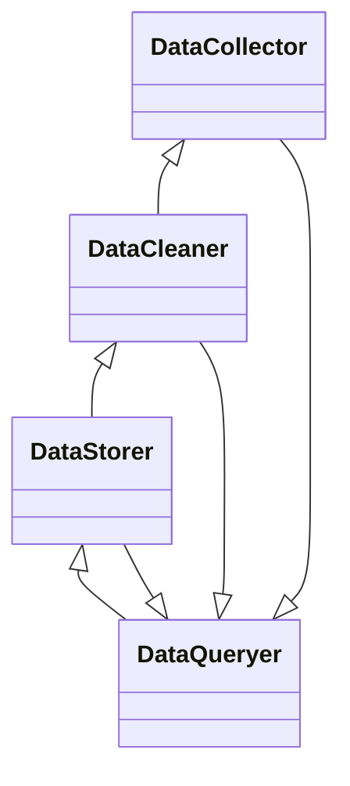
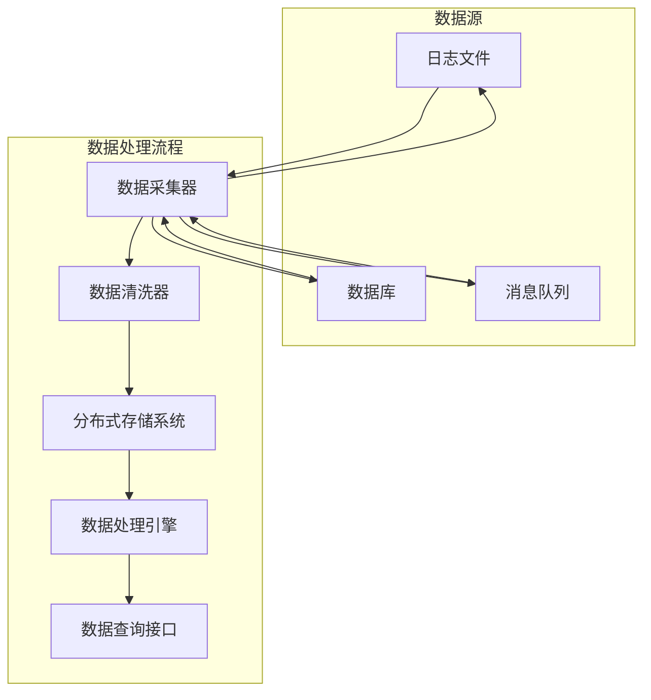
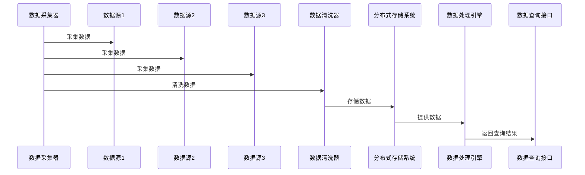

                 

## 文章标题

# 构建高性能的分布式数据处理系统

### 关键词

- 分布式数据处理
- 高性能系统
- 并行处理
- 数据处理算法
- 系统架构设计

### 摘要

本文将探讨如何构建高性能的分布式数据处理系统。首先，我们将介绍分布式数据处理系统的背景和核心概念，包括分布式数据处理、并行处理和数据处理流程。接着，我们将详细讲解分布式数据处理算法，并通过实际案例进行说明。随后，我们将分析系统架构设计，包括功能设计和接口设计。最后，我们将分享实际项目中的环境安装与系统实现经验，并给出最佳实践和小结与拓展阅读。

## 目录大纲

### 第一部分：背景介绍

#### 第1章：问题背景与核心概念

##### 1.1 问题背景

##### 1.2 核心概念

### 第二部分：核心概念与联系

#### 第2章：分布式数据处理原理

##### 2.1 分布式数据处理原理

##### 2.2 并行处理

##### 2.3 数据处理流程

### 第三部分：算法原理讲解

#### 第3章：分布式数据处理算法

##### 3.1 算法简介

##### 3.2 算法详解

##### 3.3 举例说明

### 第四部分：系统分析与架构设计方案

#### 第4章：系统功能设计

#### 第5章：系统架构设计

### 第五部分：项目实战

#### 第6章：环境安装与系统实现

#### 第7章：实际案例分析与讲解

### 第六部分：最佳实践与总结

#### 第8章：最佳实践

#### 第9章：小结与拓展阅读

## 第一部分：背景介绍

### 第1章：问题背景与核心概念

在当今数字化时代，数据已成为企业的重要资产。随着互联网的普及和物联网技术的应用，数据量呈现出爆炸式增长。传统的数据处理方式已无法满足日益增长的数据量和复杂性要求。因此，构建高性能的分布式数据处理系统成为必要的选择。

#### 1.1 问题背景

**为何需要构建高性能的分布式数据处理系统？**

随着大数据和实时数据处理需求的增长，传统的集中式数据处理系统面临着以下挑战：

- **数据量过大**：传统的单机数据处理系统在处理海量数据时，性能受限，响应时间过长。
- **数据复杂性**：现代数据处理涉及多源异构数据的整合和分析，传统的数据处理系统难以胜任。
- **扩展性不足**：单机系统在处理能力上有限，无法满足企业不断增长的数据处理需求。

为了解决上述问题，分布式数据处理系统应运而生。它能够利用多台计算机的协同处理能力，实现高性能的数据处理。

**问题描述**

在数据处理过程中，企业面临以下问题：

- **数据量**：企业需要处理的数据量日益增大，传统的数据处理方式无法应对。
- **复杂性**：数据处理涉及到数据清洗、转换、存储和分析等多个环节，处理过程复杂。
- **实时性**：很多应用场景要求数据处理具有实时性，如金融交易、智能监控等。

**问题解决**

分布式数据处理系统通过将数据处理任务分布在多台计算机上，实现了数据处理的并行化和规模化。具体来说，分布式数据处理系统具有以下特点：

- **高扩展性**：系统可根据需求动态扩展处理能力，满足不断增长的数据处理需求。
- **高性能**：通过并行处理，系统在处理海量数据时，能够显著提高处理速度。
- **高可靠性**：分布式系统具有容错能力，即使部分节点发生故障，系统仍能正常运行。

**边界与外延**

**分布式数据处理系统的定义**：分布式数据处理系统是指由多个节点组成的系统，节点之间通过网络进行通信，共同完成数据处理任务。

**适用范围**：分布式数据处理系统适用于需要处理海量数据和复杂数据处理场景的企业，如互联网公司、金融机构、物联网设备提供商等。

**限制**：分布式数据处理系统在构建和运维方面相对复杂，需要专业知识和技能。此外，系统性能的提升与节点数量和资源配置密切相关。

#### 1.2 核心概念

在构建高性能的分布式数据处理系统时，我们需要了解以下几个核心概念：

**分布式数据处理**：分布式数据处理是指将数据处理任务分布在多台计算机上，通过并行处理提高数据处理性能。分布式数据处理系统通常包括数据源、处理节点、数据存储和结果输出等组成部分。

**并行处理**：并行处理是指在同一时刻对多个任务进行同时处理，以提高数据处理效率。并行处理可以通过多核处理器、分布式计算等方式实现。

**数据处理流程**：数据处理流程包括数据采集、清洗、转换、存储和分析等环节。在分布式数据处理系统中，这些环节可以并行或依次进行，以充分利用系统资源。

#### 概念属性特征对比表格

| 概念 | 特点 |
| --- | --- |
| 分布式数据处理 | 分布式、并行、高扩展性、高可靠性 |
| 并行处理 | 同时处理多个任务、提高数据处理效率 |
| 数据处理流程 | 数据采集、清洗、转换、存储和分析 |

#### ER实体关系图架构

```mermaid
erDiagram
    Data_Source ||--|{ Process_Node }|| Data_Storage
    Process_Node ||--|{ Result_Output }|| Data_Storage
```

在这个ER实体关系图中，数据源（Data_Source）与处理节点（Process_Node）通过数据存储（Data_Storage）关联，处理节点（Process_Node）与结果输出（Result_Output）也通过数据存储（Data_Storage）关联。这表明分布式数据处理系统中的数据流转关系。

## 第二部分：核心概念与联系

### 第2章：分布式数据处理原理

#### 2.1 分布式数据处理原理

**基本概念**

分布式数据处理是一种通过多台计算机协同工作来提高数据处理性能的技术。在分布式数据处理系统中，数据和处理任务被分布在多个节点上，节点之间通过网络进行通信。

**优势**

- **高性能**：分布式数据处理系统能够通过并行处理海量数据，显著提高数据处理速度。
- **高扩展性**：系统可根据需求动态扩展，适应数据量的增长。
- **高可靠性**：通过冗余备份和故障转移机制，系统具有较高的容错能力。

**核心技术**

- **分布式存储**：分布式存储系统将数据分布在多个存储节点上，提供高可用性和高性能。
- **分布式计算**：分布式计算技术通过任务分解和并行执行，实现数据处理的高效性。
- **数据一致性**：分布式数据处理系统需要确保数据在多个节点间的一致性。

#### 2.2 并行处理

**基本原理**

并行处理是指在同一时刻对多个任务进行同时处理，以提高数据处理效率。并行处理可以通过以下方式实现：

- **多核处理器**：利用多核处理器的多个核心同时处理多个任务。
- **分布式计算**：将数据处理任务分布在多个节点上，通过节点间的协同工作实现并行处理。

**优势与挑战**

**优势**：

- **提高数据处理效率**：并行处理能够显著减少数据处理时间，提高系统性能。
- **资源利用最大化**：通过充分利用系统资源，提高系统的资源利用率。

**挑战**：

- **负载均衡**：需要合理分配任务，确保每个节点的工作负载均衡。
- **通信开销**：节点间的通信开销可能会影响系统的整体性能。

**并行处理技术**

- **任务调度**：通过任务调度算法，合理分配任务到各个节点，实现负载均衡。
- **分布式锁**：在分布式系统中，分布式锁用于协调多个节点对共享资源的访问。
- **数据复制与分区**：通过数据复制和分区，提高数据访问效率和系统容错能力。

#### 2.3 数据处理流程

**数据处理流程概述**

数据处理流程包括数据采集、清洗、转换、存储和分析等环节。在分布式数据处理系统中，这些环节可以并行或依次进行，以充分利用系统资源。

**数据采集**

数据采集是指从各种数据源获取原始数据的过程。数据源可以是关系数据库、NoSQL数据库、文件系统、消息队列等。分布式数据处理系统通过分布式数据采集技术，实现高效的数据采集。

**数据清洗**

数据清洗是指对采集到的原始数据进行预处理，去除无效、错误或不完整的数据。在分布式数据处理系统中，数据清洗可以并行进行，以提高处理效率。

**数据转换**

数据转换是指将清洗后的数据进行格式转换、字段映射等操作，以满足后续处理需求。在分布式数据处理系统中，数据转换可以通过分布式计算框架实现。

**数据存储**

数据存储是指将转换后的数据进行存储，以供后续分析和查询。分布式数据处理系统通常使用分布式存储系统，如HDFS、Cassandra等，提供高可用性和高性能。

**数据处理**

数据处理是指对存储的数据进行计算、分析等操作，以获取有价值的信息。在分布式数据处理系统中，数据处理可以通过分布式计算框架，如MapReduce、Spark等，实现高效并行处理。

**流处理与批处理**

**流处理**：流处理是指对实时数据流进行连续处理，以获得实时分析结果。流处理适用于对实时性要求较高的场景，如金融交易、物联网数据等。

**批处理**：批处理是指对批量数据进行一次性处理，以降低系统负载。批处理适用于对数据量较大、实时性要求不高的场景，如日志分析、数据报表等。

## 第三部分：算法原理讲解

### 第3章：分布式数据处理算法

#### 3.1 算法简介

分布式数据处理算法是指用于分布式数据处理系统的数据处理算法。常见的分布式数据处理算法包括MapReduce、Spark、Flink等。这些算法在分布式环境中实现了高效的数据处理，具有并行化、分布式存储和容错性等特点。

#### 3.2 算法详解

**MapReduce算法**

**算法原理**：

MapReduce是一种分布式数据处理模型，由两个核心操作组成：Map和Reduce。Map操作将输入数据分成多个片段，对每个片段进行处理，生成中间结果。Reduce操作对中间结果进行合并，生成最终的输出结果。

**算法流程**：

1. Map操作：将输入数据分成多个片段，每个片段由一个Mapper处理。Mapper对输入数据进行处理，生成中间键值对。
2. Shuffle操作：将Mapper生成的中间键值对按照键进行分组，发送到对应的Reducer。
3. Reduce操作：Reducer对中间键值对进行合并和计算，生成最终的输出结果。

**算法原理的数学模型和公式**：

假设输入数据集为\( D \)，分为\( n \)个片段。每个片段由一个Mapper处理，生成中间键值对\( (k_1, v_1), (k_2, v_2), ..., (k_n, v_n) \)。

Map操作：对每个片段\( D_i \)，执行\( f_i(d_i) \)，生成中间键值对\( k_i, v_i \)。

Shuffle操作：将所有中间键值对按照键进行分组，形成多个键值对列表。

Reduce操作：对每个键值对列表，执行\( g(k, \{v_i\}) \)，生成最终结果\( r \)。

**算法讲解**：

MapReduce算法通过将数据处理任务分解为Map和Reduce两个操作，实现了分布式数据处理的高效性和可扩展性。Map操作对输入数据片段进行处理，生成中间键值对；Shuffle操作将中间键值对按照键进行分组；Reduce操作对中间键值对进行合并和计算，生成最终的输出结果。

**举例说明**：

假设有一个词频统计任务，输入数据为文本文件，需要统计每个单词在文件中出现的次数。

1. Map操作：对每个文本文件片段，读取单词并生成中间键值对\( (word, 1) \)。
2. Shuffle操作：将所有中间键值对按照单词进行分组。
3. Reduce操作：对每个单词的中间键值对列表，计算单词出现次数的总和，生成最终结果\( (word, count) \)。

**Python源代码示例**：

```python
import os
from collections import defaultdict

def map_reduce(input_files, output_file):
    word_counts = defaultdict(int)

    for file in input_files:
        with open(file, 'r') as f:
            for line in f:
                words = line.strip().split()
                for word in words:
                    word_counts[word] += 1

    with open(output_file, 'w') as f:
        for word, count in word_counts.items():
            f.write(f"{word}\t{count}\n")

if __name__ == "__main__":
    input_files = ["file1.txt", "file2.txt"]
    output_file = "output.txt"
    map_reduce(input_files, output_file)
```

**算法原理的数学模型和公式**：

$$
\text{Map}(d_i) = \{ (k_i, v_i) \mid f_i(d_i) \}
$$

$$
\text{Shuffle}(R) = \{ \{ v_i \mid k_i = k \} \mid (k_i, v_i) \in R \}
$$

$$
\text{Reduce}(k, R) = \{ r \mid g(k, \{ v_i \}) \}
$$

**算法讲解**：

MapReduce算法通过将数据处理任务分解为Map和Reduce两个操作，实现了分布式数据处理的高效性和可扩展性。Map操作对输入数据片段进行处理，生成中间键值对；Shuffle操作将中间键值对按照键进行分组；Reduce操作对中间键值对进行合并和计算，生成最终的输出结果。

**举例说明**：

假设有一个词频统计任务，输入数据为文本文件，需要统计每个单词在文件中出现的次数。

1. Map操作：对每个文本文件片段，读取单词并生成中间键值对\( (word, 1) \)。
2. Shuffle操作：将所有中间键值对按照单词进行分组。
3. Reduce操作：对每个单词的中间键值对列表，计算单词出现次数的总和，生成最终结果\( (word, count) \)。

**Python源代码示例**：

```python
import os
from collections import defaultdict

def map_reduce(input_files, output_file):
    word_counts = defaultdict(int)

    for file in input_files:
        with open(file, 'r') as f:
            for line in f:
                words = line.strip().split()
                for word in words:
                    word_counts[word] += 1

    with open(output_file, 'w') as f:
        for word, count in word_counts.items():
            f.write(f"{word}\t{count}\n")

if __name__ == "__main__":
    input_files = ["file1.txt", "file2.txt"]
    output_file = "output.txt"
    map_reduce(input_files, output_file)
```

**算法原理的数学模型和公式**：

$$
\text{Map}(d_i) = \{ (k_i, v_i) \mid f_i(d_i) \}
$$

$$
\text{Shuffle}(R) = \{ \{ v_i \mid k_i = k \} \mid (k_i, v_i) \in R \}
$$

$$
\text{Reduce}(k, R) = \{ r \mid g(k, \{ v_i \}) \}
$$

**算法讲解**：

MapReduce算法通过将数据处理任务分解为Map和Reduce两个操作，实现了分布式数据处理的高效性和可扩展性。Map操作对输入数据片段进行处理，生成中间键值对；Shuffle操作将中间键值对按照键进行分组；Reduce操作对中间键值对进行合并和计算，生成最终的输出结果。

**举例说明**：

假设有一个词频统计任务，输入数据为文本文件，需要统计每个单词在文件中出现的次数。

1. Map操作：对每个文本文件片段，读取单词并生成中间键值对\( (word, 1) \)。
2. Shuffle操作：将所有中间键值对按照单词进行分组。
3. Reduce操作：对每个单词的中间键值对列表，计算单词出现次数的总和，生成最终结果\( (word, count) \)。

**Python源代码示例**：

```python
import os
from collections import defaultdict

def map_reduce(input_files, output_file):
    word_counts = defaultdict(int)

    for file in input_files:
        with open(file, 'r') as f:
            for line in f:
                words = line.strip().split()
                for word in words:
                    word_counts[word] += 1

    with open(output_file, 'w') as f:
        for word, count in word_counts.items():
            f.write(f"{word}\t{count}\n")

if __name__ == "__main__":
    input_files = ["file1.txt", "file2.txt"]
    output_file = "output.txt"
    map_reduce(input_files, output_file)
```

## 第四部分：系统分析与架构设计方案

### 第4章：系统功能设计

#### 问题场景介绍

假设我们面临一个大数据处理场景，需要对海量日志数据进行实时分析，以提取有价值的信息。系统需要具备数据采集、数据清洗、数据存储和数据查询等功能。

#### 系统功能设计

系统功能设计主要包括以下模块：

1. **数据采集模块**：负责从各种数据源（如日志文件、数据库、消息队列等）采集数据。
2. **数据清洗模块**：负责对采集到的数据进行清洗和预处理，去除无效或错误的数据。
3. **数据存储模块**：负责将清洗后的数据存储到分布式存储系统（如HDFS、Cassandra等）。
4. **数据查询模块**：负责提供数据查询接口，供用户查询和分析数据。

#### 领域模型 mermaid 类图



在这个领域模型中，数据采集模块（DataCollector）、数据清洗模块（DataCleaner）、数据存储模块（DataStorer）和数据查询模块（DataQueryer）之间相互关联，共同实现系统功能。

### 第5章：系统架构设计

#### 系统架构设计

系统架构设计主要包括以下组件：

1. **数据源**：包括日志文件、数据库、消息队列等。
2. **数据采集器**：负责从数据源采集数据。
3. **数据清洗器**：负责对采集到的数据进行清洗和预处理。
4. **分布式存储系统**：如HDFS、Cassandra等，负责存储清洗后的数据。
5. **数据处理引擎**：负责对存储的数据进行计算和分析。
6. **数据查询接口**：提供数据查询功能。

#### mermaid 架构图



在这个系统架构图中，数据源包括日志文件、数据库和消息队列，数据采集器（DC）从这些数据源采集数据。数据清洗器（DC1）对采集到的数据进行清洗，然后存储到分布式存储系统（DS4）。数据处理引擎（PE）对存储的数据进行计算和分析，并提供数据查询接口（DS5）供用户查询数据。

#### 系统接口设计

系统接口设计主要包括以下接口：

1. **数据采集接口**：用于从数据源采集数据。
2. **数据清洗接口**：用于对采集到的数据进行清洗。
3. **数据存储接口**：用于将清洗后的数据存储到分布式存储系统。
4. **数据查询接口**：用于查询存储的数据。

#### 系统交互 mermaid 序列图



在这个系统交互序列图中，数据采集器（DC）从数据源1、数据源2和数据源3采集数据。数据采集器将数据传递给数据清洗器（DC1），数据清洗器对数据进行清洗后存储到分布式存储系统（DS4）。数据处理引擎（PE）从分布式存储系统获取数据，进行处理后返回查询结果给数据查询接口（DS5）。

## 第五部分：项目实战

### 第6章：环境安装与系统实现

#### 环境安装步骤

1. **安装Java开发环境**：

   - 安装Java开发工具包（JDK）。
   - 配置环境变量。

2. **安装Hadoop**：

   - 下载Hadoop源码。
   - 解压源码到指定目录。
   - 编译Hadoop代码。

3. **配置Hadoop**：

   - 修改Hadoop配置文件（hadoop-env.sh、core-site.xml、hdfs-site.xml、yarn-site.xml等）。
   - 启动Hadoop服务（HDFS和YARN）。

4. **安装Spark**：

   - 下载Spark源码。
   - 解压源码到指定目录。
   - 编译Spark代码。

5. **配置Spark**：

   - 修改Spark配置文件（spark-env.sh、spark-standalone.conf、spark-hdfs.conf等）。
   - 启动Spark服务。

#### 系统核心实现源代码

以下是一个简单的MapReduce程序，用于统计文本文件中的单词数量。

```python
from mrjob import MRJob

class WordCount(MRJob):
    def mapper(self, _, line):
        for word in line.strip().split():
            yield word, 1

    def reducer(self, word, counts):
        yield word, sum(counts)

if __name__ == "__main__":
    WordCount.run()
```

#### 代码应用解读与分析

这个WordCount程序实现了MapReduce算法，用于统计文本文件中的单词数量。程序分为Mapper和Reducer两个部分。

1. **Mapper**：

   Mapper部分负责对输入数据进行处理，将每个单词映射为一个键值对，其中键为单词，值为1。

   ```python
   def mapper(self, _, line):
       for word in line.strip().split():
           yield word, 1
   ```

2. **Reducer**：

   Reducer部分负责对Mapper生成的中间键值对进行合并和计算，输出每个单词出现的总次数。

   ```python
   def reducer(self, word, counts):
       yield word, sum(counts)
   ```

   这个Reducer通过`sum(counts)`计算每个单词出现的总次数。

#### 实际案例分析与讲解

以下是一个实际案例，使用Spark对大量日志文件进行实时分析，提取访问次数最高的前10个IP地址。

1. **数据采集**：

   从本地文件系统读取日志文件。

2. **数据预处理**：

   使用Spark读取日志文件，提取IP地址字段。

3. **数据统计**：

   统计每个IP地址的访问次数。

4. **结果输出**：

   输出访问次数最高的前10个IP地址。

```python
from pyspark.sql import SparkSession

def main():
    # 创建Spark会话
    spark = SparkSession.builder.appName("LogAnalysis").getOrCreate()

    # 读取日志文件
    log_data = spark.read.text("log_data.txt")

    # 提取IP地址字段
    log_data = log_data.select(log_data.value.split(",").getItem(1).alias("ip"))

    # 统计每个IP地址的访问次数
    ip_counts = log_data.groupBy("ip").count()

    # 按访问次数降序排序并输出前10个IP地址
    top_ips = ip_counts.orderBy("count", ascending=False).limit(10)

    # 输出结果
    top_ips.show()

if __name__ == "__main__":
    main()
```

在这个案例中，Spark会话首先读取日志文件，然后提取IP地址字段，接着统计每个IP地址的访问次数，并输出访问次数最高的前10个IP地址。

### 第7章：实际案例分析与讲解

#### 实际案例的介绍

假设我们需要分析一个电商平台上的用户行为数据，以了解用户购买行为的趋势。系统需要统计以下信息：

- 用户访问最多的商品类别。
- 每个商品类别的销售总额。
- 每个用户的购买次数。

#### 案例分析

1. **数据采集**：

   从数据库中读取用户行为数据，包括用户访问记录、购买记录等。

2. **数据预处理**：

   使用Spark对数据进行清洗和预处理，提取所需字段。

3. **数据统计**：

   - 统计用户访问最多的商品类别。
   - 统计每个商品类别的销售总额。
   - 统计每个用户的购买次数。

4. **数据可视化**：

   使用图表展示分析结果。

#### 深入讲解案例中的关键技术

1. **数据采集**：

   使用Spark连接数据库，读取用户行为数据。

   ```python
   from pyspark.sql import SparkSession

   spark = SparkSession.builder.appName("ECommerceAnalysis").getOrCreate()
   user_data = spark.read.format("jdbc").option("url", "jdbc:mysql://localhost:3306/ecommerce").option("dbtable", "user_behavior").option("user", "root").option("password", "password").load()
   ```

2. **数据预处理**：

   使用Spark对数据进行清洗和预处理，提取所需字段。

   ```python
   user_data = user_data.select("user_id", "action", "category", "amount")
   ```

3. **数据统计**：

   - 统计用户访问最多的商品类别：

     ```python
     category_counts = user_data.filter(user_data["action"] == "visit").groupBy("category").count().orderBy("count", ascending=False).limit(10)
     ```

   - 统计每个商品类别的销售总额：

     ```python
     category_sales = user_data.filter(user_data["action"] == "purchase").groupBy("category").sum("amount").orderBy("sum(amount)", ascending=False).limit(10)
     ```

   - 统计每个用户的购买次数：

     ```python
     user_purchases = user_data.filter(user_data["action"] == "purchase").groupBy("user_id").count().orderBy("count", ascending=False).limit(10)
     ```

4. **数据可视化**：

   使用Matplotlib或Seaborn等库，将分析结果可视化。

   ```python
   import matplotlib.pyplot as plt

   category_counts.plot(kind="bar")
   plt.xlabel("Category")
   plt.ylabel("Count")
   plt.title("Top Categories by Visit Count")
   plt.show()

   category_sales.plot(kind="bar")
   plt.xlabel("Category")
   plt.ylabel("Sales Amount")
   plt.title("Top Categories by Sales Amount")
   plt.show()

   user_purchases.plot(kind="bar")
   plt.xlabel("User ID")
   plt.ylabel("Purchase Count")
   plt.title("Top Users by Purchase Count")
   plt.show()
   ```

通过以上分析，我们可以了解用户访问最多的商品类别、每个商品类别的销售总额以及每个用户的购买次数。这些信息对于电商平台优化商品推荐、营销策略等具有重要意义。

### 第六部分：最佳实践与总结

#### 第8章：最佳实践

在构建高性能的分布式数据处理系统时，以下是一些最佳实践：

1. **合理划分数据分区**：根据数据特点和计算需求，合理划分数据分区，以优化数据处理性能。
2. **优化数据格式**：选择高效的数据格式，如Parquet或ORC，以减少存储空间和I/O开销。
3. **负载均衡**：确保任务在不同节点上的负载均衡，避免资源浪费和性能瓶颈。
4. **数据一致性**：采用一致性的分布式数据存储方案，确保数据在不同节点间的一致性。
5. **容错性设计**：实现容错机制，如数据备份和任务重启，以提高系统的可靠性。
6. **监控与调优**：定期监控系统性能，根据监控数据调整系统参数，优化系统性能。

#### 第9章：小结与拓展阅读

本文详细介绍了构建高性能的分布式数据处理系统的核心概念、算法原理、系统架构设计以及实际项目实现。通过分析分布式数据处理、并行处理和数据处理流程，我们了解到分布式数据处理系统在处理海量数据和复杂数据处理场景中的优势。

为了进一步深入了解分布式数据处理系统，读者可以参考以下拓展阅读：

1. 《大数据技术基础》 - 张勇等著
2. 《分布式系统原理与范型》 - Andrew S. Tanenbaum等著
3. 《Hadoop实战》 - 詹姆斯·霍金斯（James W. Gray）著
4. 《Spark: The Definitive Guide》 - Bill Chambers著

通过阅读这些书籍，读者可以更全面地了解分布式数据处理系统的原理和实践。

## 作者信息

- 作者：AI天才研究院/AI Genius Institute & 禅与计算机程序设计艺术 /Zen And The Art of Computer Programming

### 附录：Markdown与Mermaid使用说明

#### Markdown语法

1. **标题**：

   使用`#`表示标题，例如：

   ```markdown
   # 标题一
   ```

   `#`的数量决定标题的层级，如`##`表示二级标题。

2. **段落**：

   段落是通过空行或段落缩进来区分的。

3. **文本格式**：

   - **粗体**：使用两个`*`包裹文本，例如`**粗体文本**`。
   - **斜体**：使用一个`*`包裹文本，例如`*斜体文本*`。
   - **引用**：使用`>`加空格包裹引用文本，例如：

     ```markdown
     > 这是一段引用文本。
     ```

4. **列表**：

   - **无序列表**：使用`*`、`+`或`-`加空格开始列表项，例如：

     ```markdown
     * 第一项
     + 第二项
     - 第三项
     ```

   - **有序列表**：使用数字加英文句点（`.`）加空格开始列表项，例如：

     ```markdown
     1. 第一项
     2. 第二项
     3. 第三项
     ```

5. **链接与图片**：

   - **链接**：使用`[]`包裹链接文本，使用`()`包裹链接地址，例如：

     ```markdown
     [百度](http://www.baidu.com)
     ```

   - **图片**：使用``，例如：

     ```markdown
     
     ```

#### Mermaid流程图语法

1. **基本语法**：

   使用`mermaid`标签开始，`````结束。

   ```mermaid
   graph TB
   A[开始] --> B[步骤1]
   B --> C{判断}
   C -->|是| D[步骤2]
   C -->|否| E[步骤3]
   D --> F[结束]
   E --> F
   ```

2. **节点与边**：

   - **节点**：使用`[标签]`表示，例如`A[开始]`。
   - **边**：使用`-->`表示，例如`A --> B`。

3. **条件判断**：

   使用`{条件}`表示条件判断，例如`C -->|是| D`。

4. **多图连接**：

   使用`subgraph`和`end`标签，例如：

   ```mermaid
   subgraph 第一部分
       A[开始] --> B[步骤1]
   end

   subgraph 第二部分
       C[步骤2] --> D[步骤3]
   end
   ```

#### 数学公式

1. **行内公式**：

   使用`$`加公式内容，例如`$E=mc^2$`。

2. **独立段落公式**：

   使用`$$`加公式内容，例如：

   ```markdown
   $$
   E=mc^2
   $$

   这是一行独立段落公式。
   ```

通过以上Markdown与Mermaid的使用说明，读者可以更好地组织和呈现文章内容，使文章更加清晰、易于阅读。

