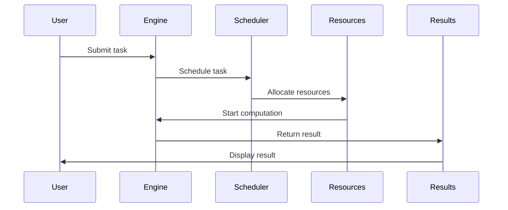
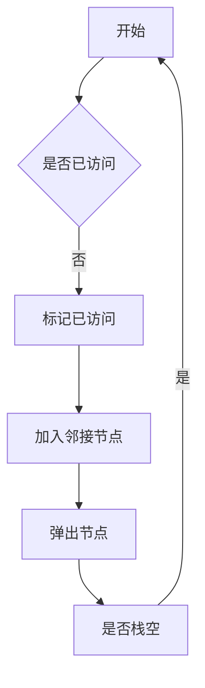
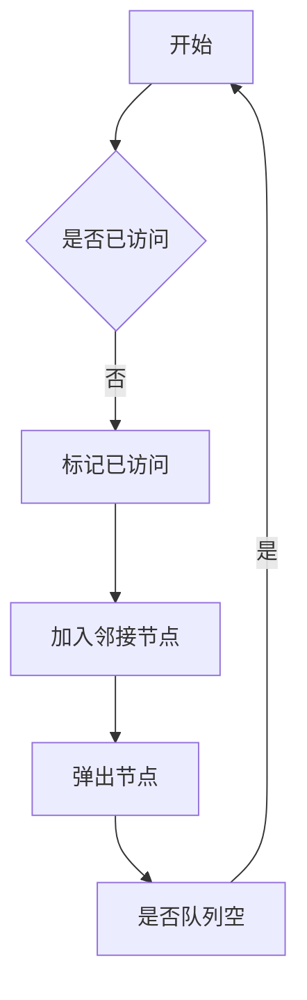
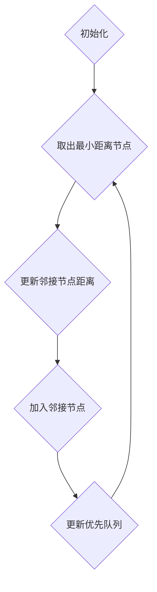
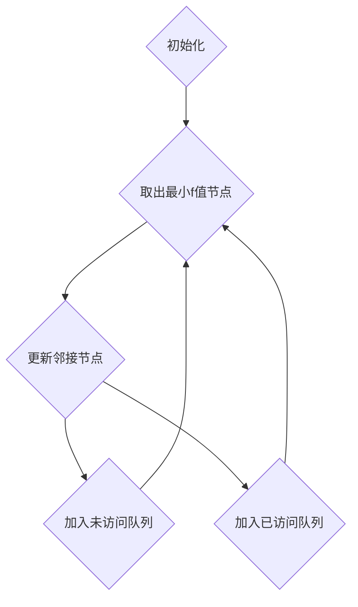
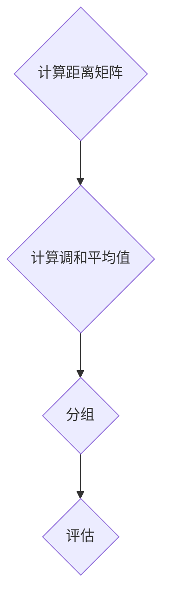
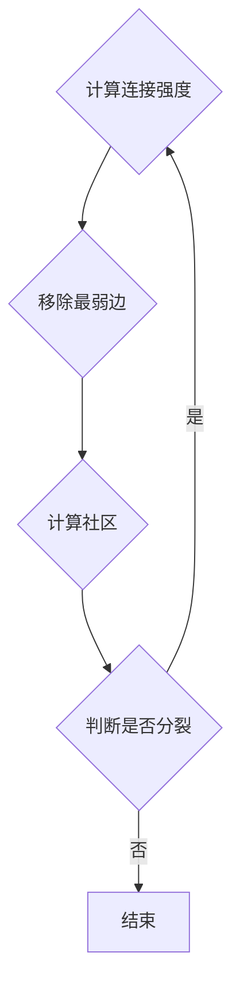
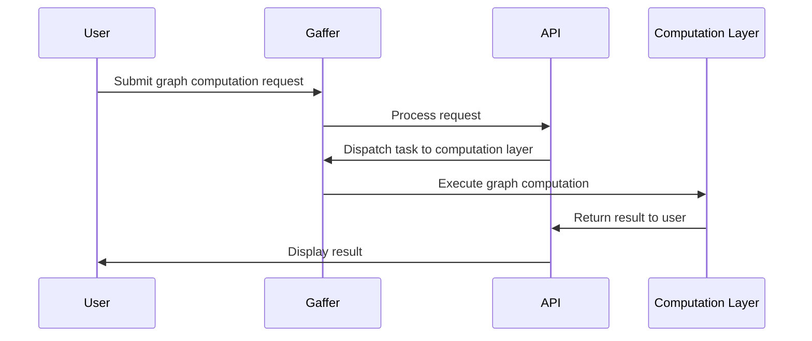
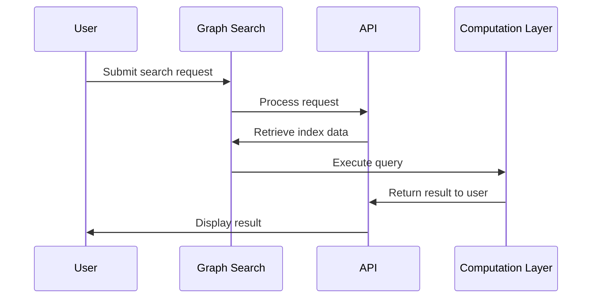
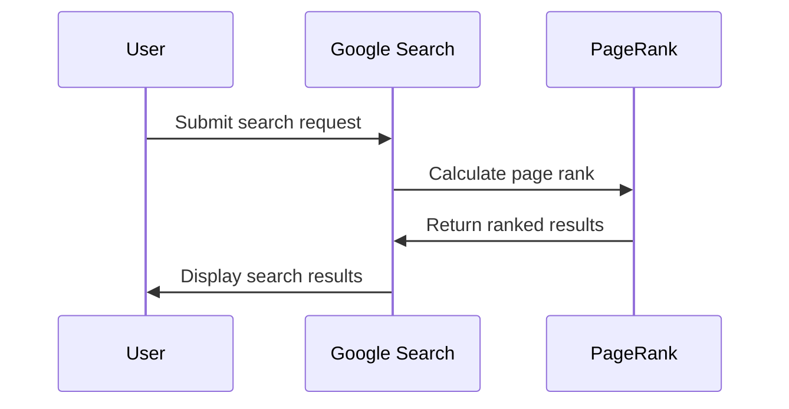

                 

# 构建高性能的图计算引擎

## 关键词
- 图计算引擎
- 高性能
- 算法优化
- 并行处理
- 存储系统
- 系统架构

## 摘要
本文将深入探讨如何构建高性能的图计算引擎，从核心概念到实际实现，为读者提供一套完整的解决方案。我们将详细分析图计算的重要性，解释图计算引擎的基本原理和架构设计，探讨关键算法的实现和优化策略，并展示实际项目中的最佳实践。通过本文的阅读，读者将能够掌握构建高性能图计算引擎的方法和技巧。

## 目录

### 引言
- **图计算的重要性**
- **图计算引擎的需求**

### 背景与核心概念
- **图的基本概念**
- **图计算的应用场景**
- **核心概念术语说明**

### 高性能图计算引擎
- **高性能的定义**
- **高性能图计算引擎的挑战**
- **机会与前景**

### 架构与设计原则
- **系统架构概述**
- **设计原则与最佳实践**
- **架构图解**

### 核心图算法
- **深度优先搜索（DFS）**
- **广度优先搜索（BFS）**
- **最短路径算法（Dijkstra和A*算法）**
- **社区检测算法**

### 实施策略
- **代码实现策略**
- **算法实现与优化**
- **数学模型与公式**

### 优化技术
- **并行处理**
- **索引与缓存**
- **负载均衡**

### 案例研究
- **LinkedIn的Gaffer**
- **Facebook的Graph Search**
- **Google的PageRank**

### 未来方向与挑战
- **技术趋势**
- **未来挑战**
- **研究方向**

### 结论
- **总结与展望**
- **最佳实践与建议**

### 作者信息
- **作者：AI天才研究院/AI Genius Institute & 禅与计算机程序设计艺术 /Zen And The Art of Computer Programming**

## 引言

### 图计算的重要性

在当今的数据密集型时代，图计算已经成为处理复杂网络结构和关系数据的重要工具。从社交网络到推荐系统，从生物信息学到金融风控，图计算的应用场景无处不在。随着数据规模的不断扩大和数据复杂度的增加，传统的计算模型已经无法满足需求，而图计算引擎以其独特的优势成为了应对这些挑战的关键技术。

### 图计算引擎的需求

高性能的图计算引擎不仅在处理大规模图数据时能够提供高效的计算能力，还能够保证低延迟和高吞吐量。这对于许多实时应用场景至关重要。例如，在实时推荐系统中，快速计算用户之间的相似度和兴趣点，可以显著提升用户体验。在社交网络中，高效的图计算引擎能够快速发现社区结构和关键节点，为网络分析提供支持。

### 目标与内容

本文的目标是系统地探讨如何构建高性能的图计算引擎，从核心概念到实际实现，为读者提供一套完整的解决方案。本文将包括以下内容：

1. **背景与核心概念**：介绍图计算的基本概念和应用场景。
2. **高性能图计算引擎**：讨论高性能图计算引擎的定义、挑战和机会。
3. **架构与设计原则**：阐述系统架构设计原则和最佳实践。
4. **核心图算法**：详细分析核心图算法的实现和优化策略。
5. **实施策略**：介绍代码实现策略和数学模型。
6. **优化技术**：探讨并行处理、索引、缓存等优化技术。
7. **案例研究**：分析实际项目中的最佳实践。
8. **未来方向与挑战**：展望未来趋势和挑战。

## 背景与核心概念

### 图的基本概念

图是由节点（Node）和边（Edge）组成的数学结构，用于表示实体及其之间的关系。在图计算中，节点通常表示实体，如人、地点或物品，而边表示节点之间的关系，如朋友关系、道路连接或购买行为。

- **节点（Node）**：图中的基本元素，通常表示数据点。
- **边（Edge）**：连接两个节点的元素，表示节点之间的关系。

### 图计算的应用场景

图计算在多个领域都有广泛的应用，以下是几个典型的应用场景：

- **社交网络分析**：用于发现社交网络中的社区结构、关键节点和传播路径。
- **推荐系统**：通过分析用户行为和物品之间的关系，提供个性化推荐。
- **生物信息学**：用于研究基因组、蛋白质结构和分子网络。
- **金融风控**：用于识别网络中的欺诈行为、评估信用风险。

### 核心概念术语说明

在图计算中，还有一些核心术语需要了解：

- **邻接矩阵（Adjacency Matrix）**：用于表示图的结构，是一个二维矩阵，其中元素表示节点之间的连接关系。
- **邻接表（Adjacency List）**：用于表示图的结构，是一个数组，每个元素是一个链表，包含与该节点相连的所有节点。
- **图的度（Degree of a Node）**：一个节点连接的其他节点的数量。
- **路径（Path）**：连接两个节点的序列，每个节点只出现一次，除非是回路。
- **连通图（Connected Graph）**：图中任意两个节点都存在路径连接。

### 概念结构与核心要素组成

图计算涉及多个核心要素，包括：

- **图数据**：表示实体及其关系的结构数据。
- **算法**：用于处理和分析图数据的算法，如搜索、路径计算、社区检测等。
- **存储系统**：用于存储和管理图数据的系统，如图数据库、分布式存储系统等。
- **计算引擎**：用于执行图算法并处理大规模图数据的计算系统。

### ER实体关系图架构的 Mermaid 流程图

```mermaid
erDiagram
  Node ||--|{ Edge }|-- Node
  Edge ||--|{ Relationship }|-- Edge
  Node ||--|{ Property }|-- Node
  Edge ||--|{ Property }|-- Edge
```

在这个ER实体关系图中，`Node` 表示节点，`Edge` 表示边，`Relationship` 表示边与边之间的关系，`Property` 表示节点和边的属性。这个结构展示了图计算系统的核心组成。

## 高性能图计算引擎

### 高性能的定义

高性能的图计算引擎是指能够在有限的时间内处理大规模图数据，提供快速响应和高效计算能力的系统。高性能不仅体现在计算速度上，还包括以下几个方面：

- **低延迟**：系统响应时间短，能够满足实时应用的需求。
- **高吞吐量**：系统能够处理大量并发请求，提供高处理能力。
- **可扩展性**：系统能够随着数据规模和计算需求的增长进行水平扩展。

### 高性能图计算引擎的挑战

构建高性能的图计算引擎面临多个挑战：

- **数据规模**：图数据通常规模庞大，如何高效存储和管理这些数据是一个挑战。
- **计算复杂度**：许多图算法的计算复杂度较高，如何优化算法实现是一个关键问题。
- **资源调度**：如何合理分配计算资源，最大化系统性能是一个复杂的问题。
- **并发处理**：如何高效处理大量并发请求，避免资源竞争和死锁是一个挑战。

### 机会与前景

尽管面临诸多挑战，高性能图计算引擎也带来了巨大的机会：

- **大数据分析**：图计算能够挖掘大规模复杂数据中的隐藏模式和关系，为数据分析提供新的视角。
- **实时应用**：随着物联网、实时推荐等应用的兴起，高性能图计算引擎能够提供实时计算能力，满足多样化需求。
- **跨领域应用**：从金融风控到生物信息学，图计算在多个领域都有广泛的应用前景。

### 建立高性能图计算引擎的必要性

建立高性能的图计算引擎对于以下方面至关重要：

- **业务需求**：许多业务场景需要实时处理大规模图数据，高性能图计算引擎能够满足这些需求。
- **技术发展**：随着计算能力和存储技术的不断提升，高性能图计算引擎能够更好地利用这些资源，提供更高效率的计算。
- **用户体验**：在社交网络、推荐系统等应用中，高性能图计算引擎能够提供更快的响应速度和更准确的推荐结果，提升用户体验。

## 架构与设计原则

### 系统架构概述

高性能图计算引擎的架构设计需要综合考虑计算效率、数据存储、资源调度和系统可扩展性等多个方面。一个典型的图计算引擎架构包括以下关键组件：

- **数据存储**：用于存储和管理图数据，可以是图数据库或分布式存储系统。
- **计算引擎**：负责执行图算法，提供计算能力。
- **资源调度**：负责分配计算资源，优化系统性能。
- **接口层**：提供对外接口，支持用户提交任务和获取结果。

### 设计原则与最佳实践

以下是构建高性能图计算引擎的一些关键设计原则和最佳实践：

- **模块化设计**：将系统划分为多个模块，每个模块负责特定的功能，提高系统的可维护性和可扩展性。
- **分布式架构**：通过分布式计算和存储，提高系统的处理能力和容错性。
- **并行处理**：利用多核处理器和分布式计算，提高计算效率。
- **高效数据结构**：选择合适的数据结构，如邻接表或邻接矩阵，优化数据访问速度。
- **负载均衡**：合理分配计算任务，避免单点瓶颈，提高系统吞吐量。
- **缓存策略**：利用缓存减少数据访问延迟，提高系统响应速度。
- **监控与优化**：实时监控系统性能，进行性能分析和调优。

### 架构图解

以下是高性能图计算引擎的架构图：



在这个架构图中，用户提交任务，任务经过调度器分配资源，计算引擎执行计算，并将结果返回给用户。这个流程展示了系统架构的基本组成部分和交互关系。

## 核心图算法

### 深度优先搜索（DFS）

深度优先搜索（DFS）是一种用于遍历或搜索图的算法。它从起始节点开始，沿着一条路径深入探索，直到路径的尽头，然后回溯到之前的节点，继续探索其他路径。

#### 原理

DFS算法使用一个栈来维护当前探索的路径。从起始节点开始，将节点标记为已访问，并将其所有未访问的邻接节点加入栈中。然后，从栈顶弹出节点，继续这个过程，直到栈为空。

#### Mermaid 流程图



#### Python 代码实现

```python
def dfs(graph, start):
    visited = set()
    stack = [start]

    while stack:
        node = stack.pop()
        if node not in visited:
            visited.add(node)
            print(node)
            stack.extend([n for n in graph[node] if n not in visited])

# 示例图
graph = {
    'A': ['B', 'C'],
    'B': ['D', 'E'],
    'C': ['F'],
    'D': [],
    'E': ['F'],
    'F': []
}

dfs(graph, 'A')
```

### 广度优先搜索（BFS）

广度优先搜索（BFS）是另一种用于遍历或搜索图的算法。与DFS不同，BFS按照层次遍历图，首先访问起始节点，然后依次访问其邻接节点，再依次访问邻接节点的邻接节点。

#### 原理

BFS算法使用一个队列来维护当前探索的路径。从起始节点开始，将节点标记为已访问，并将其所有未访问的邻接节点加入队列中。然后，从队列头部弹出节点，继续这个过程，直到队列为空。

#### Mermaid 流程图



#### Python 代码实现

```python
from collections import deque

def bfs(graph, start):
    visited = set()
    queue = deque([start])

    while queue:
        node = queue.popleft()
        if node not in visited:
            visited.add(node)
            print(node)
            queue.extend([n for n in graph[node] if n not in visited])

# 示例图
graph = {
    'A': ['B', 'C'],
    'B': ['D', 'E'],
    'C': ['F'],
    'D': [],
    'E': ['F'],
    'F': []
}

bfs(graph, 'A')
```

### 最短路径算法（Dijkstra和A*算法）

最短路径算法用于计算图中两个节点之间的最短路径。Dijkstra算法和A*算法是两种常用的最短路径算法，它们在处理不同类型的问题时各有优势。

#### Dijkstra算法

Dijkstra算法是基于贪心策略的图算法，它用于计算单源最短路径。该算法假设图中不存在负权边，并按照路径长度递增的顺序逐步扩展最短路径。

##### 原理

Dijkstra算法使用一个优先队列（通常是一个最小堆）来存储未访问节点和它们到起始节点的距离。初始化时，将起始节点加入优先队列，并将其距离设为0。然后，从优先队列中取出距离最小的节点，将其邻接节点加入队列，并更新它们的距离。

##### Mermaid 流程图



##### Python 代码实现

```python
import heapq

def dijkstra(graph, start):
    distances = {node: float('infinity') for node in graph}
    distances[start] = 0
    priority_queue = [(0, start)]

    while priority_queue:
        current_distance, current_node = heapq.heappop(priority_queue)
        if current_distance > distances[current_node]:
            continue
        for neighbor, weight in graph[current_node].items():
            distance = current_distance + weight
            if distance < distances[neighbor]:
                distances[neighbor] = distance
                heapq.heappush(priority_queue, (distance, neighbor))

    return distances

# 示例图
graph = {
    'A': {'B': 1, 'C': 4},
    'B': {'A': 1, 'D': 2, 'E': 5},
    'C': {'A': 4, 'F': 3},
    'D': {'B': 2, 'E': 1},
    'E': {'B': 5, 'F': 6},
    'F': {'C': 3, 'E': 6}
}

print(dijkstra(graph, 'A'))
```

#### A*算法

A*算法是一种改进的贪心算法，它结合了启发式函数，以更快的速度找到最短路径。A*算法的目标是同时考虑路径的实际长度和启发式估计的总和，选择最优路径。

##### 原理

A*算法使用两个优先队列：一个用于未访问节点，另一个用于已访问节点。未访问节点队列按照实际距离加上启发式估计的总和排序，已访问节点队列按照实际距离排序。算法从起始节点开始，逐步扩展，选择最佳节点继续搜索。

##### Mermaid 流程图



##### Python 代码实现

```python
def a_star_search(graph, heuristic, start, goal):
    open_set = [(0, start)]
    closed_set = set()
    distances = {node: float('infinity') for node in graph}
    distances[start] = 0
    came_from = {}

    while open_set:
        current_f, current_node = heapq.heappop(open_set)
        if current_node == goal:
            path = []
            while current_node in came_from:
                path.append(current_node)
                current_node = came_from[current_node]
            path.reverse()
            return path

        closed_set.add(current_node)
        for neighbor, weight in graph[current_node].items():
            if neighbor in closed_set:
                continue
            tentative_distance = distances[current_node] + weight
            if tentative_distance < distances[neighbor]:
                distances[neighbor] = tentative_distance
                priority = tentative_distance + heuristic(neighbor, goal)
                heapq.heappush(open_set, (priority, neighbor))
                came_from[neighbor] = current_node

    return None

# 示例图
graph = {
    'A': {'B': 1, 'C': 4},
    'B': {'A': 1, 'D': 2, 'E': 5},
    'C': {'A': 4, 'F': 3},
    'D': {'B': 2, 'E': 1},
    'E': {'B': 5, 'F': 6},
    'F': {'C': 3, 'E': 6}
}

def heuristic(node, goal):
    return abs(node - goal)

print(a_star_search(graph, heuristic, 'A', 'F'))
```

### 社区检测算法

社区检测是图计算中的一项重要任务，用于识别图中具有紧密连接关系的子图。以下是一些常用的社区检测算法：

#### 谐波检测算法（Harmonic Means Algorithm）

谐波检测算法通过计算节点之间的“调和平均距离”来识别社区。该算法基于以下假设：社区内部的节点距离较短，而社区之间的节点距离较长。

##### 原理

谐波检测算法首先计算图中所有节点之间的距离矩阵，然后计算每个节点的调和平均值。最后，将节点分组，使得同组节点之间的调和平均值较小，而不同组节点之间的调和平均值较大。

##### Mermaid 流程图



##### Python 代码实现

```python
import numpy as np

def harmonic_means_algorithm(graph):
    n = len(graph)
    distances = np.zeros((n, n))

    for i in range(n):
        for j in range(i + 1, n):
            distances[i][j] = distances[j][i] = np.mean([1 / d for d in graph[i].values() if d != 0])

    harmonics = np.mean(distances, axis=1)
    groups = []
    while True:
        min_group = None
        min_harmonic = float('inf')
        for i in range(n):
            if i not in groups:
                harmonic = harmonics[i]
                if harmonic < min_harmonic:
                    min_group = i
                    min_harmonic = harmonic
        if min_group is None:
            break
        groups.append(min_group)
        for i in range(n):
            if i != min_group and i not in groups:
                harmonics[i] = np.mean([harmonics[i], harmonics[min_group]])

    return groups

# 示例图
graph = {
    'A': {'B': 0.5, 'C': 1, 'D': 1.5},
    'B': {'A': 0.5, 'C': 0.5, 'D': 1},
    'C': {'A': 1, 'B': 0.5, 'D': 1},
    'D': {'A': 1.5, 'B': 1, 'C': 1}
}

print(harmonic_means_algorithm(graph))
```

#### Girvan-Newman算法

Girvan-Newman算法通过逐步移除连接节点之间最短路径的边，来识别图中的社区。该算法基于以下原理：移除连接强度最弱的边可以最大化图的不连通性。

##### 原理

Girvan-Newman算法首先计算图中所有边的连接强度，然后逐步移除连接强度最弱的边，每次移除后重新计算社区。最终，当图分裂成多个社区时，算法结束。

##### Mermaid 流程图



##### Python 代码实现

```python
import networkx as nx

def girvan_newman_algorithm(graph):
    G = nx.Graph(graph)
    communities = []
    while len(G) > 1:
        edge = nx.minimum_stoermand憬烯(G)
        G.remove_edge(edge[0], edge[1])
        communities.append(nx-community.LouvainCommunities(G).communities())

    return communities

# 示例图
graph = {
    'A': {'B': 1, 'C': 1},
    'B': {'A': 1, 'C': 1, 'D': 1},
    'C': {'A': 1, 'B': 1, 'D': 1},
    'D': {'B': 1, 'C': 1}
}

print(girvan_newman_algorithm(graph))
```

## 实施策略

### 代码实现策略

实现高性能的图计算引擎需要考虑以下几个关键方面：

1. **模块化**：将系统划分为多个模块，每个模块负责特定的功能，如数据存储、计算引擎、资源调度等。
2. **并行处理**：利用多核处理器和分布式计算，提高计算效率。可以通过多线程、多进程或分布式计算框架实现。
3. **高效数据结构**：选择合适的数据结构，如邻接表或邻接矩阵，以优化数据访问速度。
4. **缓存策略**：利用缓存减少数据访问延迟，提高系统响应速度。可以使用内存缓存或分布式缓存系统。
5. **负载均衡**：合理分配计算任务，避免单点瓶颈，提高系统吞吐量。可以使用负载均衡器或分布式调度系统。

### 算法实现与优化

以下是图计算引擎中几个关键算法的实现和优化策略：

1. **DFS和BFS**：使用递归或迭代实现DFS和BFS算法。对于大规模图数据，可以使用多线程或多进程进行并行处理。
2. **Dijkstra和A*算法**：使用优先队列实现Dijkstra和A*算法。对于A*算法，可以使用启发式函数来提高搜索效率。
3. **社区检测算法**：使用谐波检测算法和Girvan-Newman算法进行社区检测。对于大规模图数据，可以采用分而治之的策略，将图分割为较小的子图，然后分别进行计算。

### 数学模型与公式

以下是图计算中常用的数学模型和公式：

1. **节点度（Degree）**：一个节点的度是其连接的边的数量。对于无向图，节点的度表示为 $d = \sum_{i=1}^{n} deg(v_i)$，其中 $deg(v_i)$ 表示节点 $v_i$ 的度。
2. **路径长度（Path Length）**：连接两个节点的最短路径的长度。对于无向图，可以使用Dijkstra算法计算最短路径。
3. **社区检测**：社区检测可以通过计算节点的调和平均值来实现。对于无向图，节点的调和平均值表示为 $h(v) = \frac{\sum_{i=1}^{n} \frac{1}{d(v_i)}}{n-1}$，其中 $d(v_i)$ 表示节点 $v_i$ 的度。

### Python 代码示例

以下是几个关键算法的实现示例：

```python
import heapq
import networkx as nx

# DFS算法实现
def dfs(graph, start):
    visited = set()
    stack = [start]

    while stack:
        node = stack.pop()
        if node not in visited:
            visited.add(node)
            print(node)
            stack.extend([n for n in graph[node] if n not in visited])

# BFS算法实现
from collections import deque

def bfs(graph, start):
    visited = set()
    queue = deque([start])

    while queue:
        node = queue.popleft()
        if node not in visited:
            visited.add(node)
            print(node)
            queue.extend([n for n in graph[node] if n not in visited])

# Dijkstra算法实现
def dijkstra(graph, start):
    distances = {node: float('infinity') for node in graph}
    distances[start] = 0
    priority_queue = [(0, start)]

    while priority_queue:
        current_distance, current_node = heapq.heappop(priority_queue)
        if current_distance > distances[current_node]:
            continue
        for neighbor, weight in graph[current_node].items():
            distance = current_distance + weight
            if distance < distances[neighbor]:
                distances[neighbor] = distance
                heapq.heappush(priority_queue, (distance, neighbor))

    return distances

# 示例图
graph = {
    'A': {'B': 1, 'C': 4},
    'B': {'A': 1, 'D': 2, 'E': 5},
    'C': {'A': 4, 'F': 3},
    'D': {'B': 2, 'E': 1},
    'E': {'B': 5, 'F': 6},
    'F': {'C': 3, 'E': 6}
}

# 示例调用
dfs(graph, 'A')
bfs(graph, 'A')
print(dijkstra(graph, 'A'))
```

通过这些代码示例，读者可以更好地理解图计算算法的实现和优化策略。

## 优化技术

### 并行处理

并行处理是提高图计算引擎性能的关键技术之一。通过将计算任务分配给多个处理器或计算节点，可以显著减少计算时间，提高系统吞吐量。

#### 策略

1. **任务分配**：将图数据分割为较小的子图，然后分别处理。这样可以充分利用多核处理器的计算能力。
2. **负载均衡**：合理分配计算任务，避免单点瓶颈，确保所有处理器都能高效运行。
3. **数据并行**：对图数据进行并行处理，同时计算多个节点的属性或关系。

#### Python 代码示例

```python
import concurrent.futures

def process_node(node):
    # 处理单个节点的计算任务
    print(f"Processing node: {node}")

# 示例图
graph = ['A', 'B', 'C', 'D', 'E', 'F']

# 并行处理图节点
with concurrent.futures.ThreadPoolExecutor() as executor:
    executor.map(process_node, graph)
```

### 索引与缓存

索引和缓存技术可以显著提高数据访问速度，减少计算延迟。

#### 策略

1. **索引**：建立索引结构，如B树或哈希表，加快节点和边的数据查找速度。
2. **缓存**：使用内存缓存或分布式缓存系统，存储经常访问的数据，减少磁盘IO操作。
3. **数据预热**：在计算任务开始前，将所需数据加载到缓存中，减少计算过程中的数据访问延迟。

#### Python 代码示例

```python
from functools import lru_cache

@lru_cache(maxsize=128)
def get_node_data(node):
    # 获取节点数据的缓存函数
    print(f"Retrieving data for node: {node}")
    return f"Data for {node}"

# 示例图
graph = ['A', 'B', 'C', 'D', 'E', 'F']

# 使用缓存获取节点数据
for node in graph:
    print(get_node_data(node))
```

### 负载均衡

负载均衡技术可以确保计算任务在不同处理器或计算节点之间公平分配，避免单点瓶颈。

#### 策略

1. **轮询负载均衡**：按照轮询顺序将计算任务分配给不同的处理器或节点。
2. **最小连接负载均衡**：将计算任务分配给当前负载最轻的处理器或节点。
3. **动态负载均衡**：根据实时负载情况动态调整任务分配策略。

#### Python 代码示例

```python
from collections import deque

def process_task(node):
    # 处理单个计算任务的函数
    print(f"Processing task for node: {node}")

tasks = deque(['A', 'B', 'C', 'D', 'E', 'F'])

# 负载均衡处理任务
while tasks:
    node = tasks.popleft()
    process_task(node)
```

### 优化技术总结

通过并行处理、索引、缓存和负载均衡等优化技术，可以显著提高图计算引擎的性能。在实际应用中，根据具体需求和场景，选择合适的优化策略，可以有效提升系统的计算效率和处理能力。

## 案例研究

### LinkedIn的Gaffer

LinkedIn是一家全球领先的职业社交平台，其Gaffer系统是一个高性能的图计算引擎，用于处理LinkedIn用户及其关系网络的数据。Gaffer的核心目标是提供实时、大规模的图分析能力，以支持推荐系统、社交网络分析和广告投放等业务场景。

#### 项目介绍

Gaffer采用分布式计算架构，基于Apache Hadoop和Apache Spark等技术，实现了高效的图存储和计算。Gaffer的设计目标是低延迟、高吞吐量，能够处理数十亿级别的节点和边。

#### 系统功能设计

Gaffer的主要功能包括：

- **图存储**：支持大规模图的分布式存储，采用Hadoop分布式文件系统（HDFS）存储图数据。
- **图计算**：提供丰富的图算法，如DFS、BFS、最短路径算法等，支持实时计算和批处理。
- **查询接口**：提供RESTful API，支持用户通过简单查询语言进行图分析和查询。
- **可视化**：提供图形化的界面，用户可以直观地查看和分析图数据。

#### 系统架构设计

Gaffer的系统架构设计如下：

- **数据存储层**：使用HDFS存储大规模图数据，采用分布式存储和计算架构。
- **计算层**：基于Spark的图计算引擎，支持并行处理和实时计算。
- **接口层**：提供RESTful API和图形化界面，支持用户提交任务和查看结果。

#### 系统接口设计

Gaffer的系统接口设计如下：

- **RESTful API**：支持用户通过HTTP请求提交图计算任务和获取结果。
- **图形化界面**：提供图形化界面，用户可以通过简单的拖拽操作进行图分析和查询。

#### 系统交互

Gaffer的系统交互设计如下：

- **用户请求**：用户通过RESTful API或图形化界面提交图计算任务。
- **任务处理**：系统接收到请求后，将任务分配给计算节点，并执行图计算。
- **结果返回**：计算完成后，系统将结果返回给用户。

#### Mermaid 序列图



### Facebook的Graph Search

Facebook的Graph Search是一个强大的图搜索引擎，用于搜索用户及其关系网络中的信息。Graph Search的目标是提供快速、准确的搜索结果，支持各种类型的查询，如“我的朋友中喜欢篮球的人有哪些？”、“在过去的30天内，我喜欢了哪些照片？”

#### 项目介绍

Facebook的Graph Search基于分布式计算和存储技术，使用C++和Java等编程语言实现。Graph Search的架构设计旨在提供高效的查询处理能力和良好的用户体验。

#### 系统功能设计

Graph Search的主要功能包括：

- **全文搜索**：支持对用户生成内容的全文搜索，如状态更新、照片描述等。
- **关系搜索**：基于用户关系网络，提供基于关系的搜索结果，如朋友、共同兴趣等。
- **实时查询**：支持实时查询处理，确保用户能够快速获取搜索结果。

#### 系统架构设计

Graph Search的系统架构设计如下：

- **索引层**：使用Apache Lucene和Solr等全文搜索引擎，构建大规模的索引，支持快速查询。
- **计算层**：使用分布式计算框架，如Apache Spark，处理复杂的查询逻辑和计算任务。
- **存储层**：使用Hadoop HDFS和Cassandra等分布式存储系统，存储用户关系数据和搜索结果。

#### 系统接口设计

Graph Search的系统接口设计如下：

- **API接口**：提供RESTful API，支持用户提交搜索请求和获取结果。
- **Web界面**：提供图形化的搜索界面，用户可以通过简单的输入框进行搜索。

#### 系统交互

Graph Search的系统交互设计如下：

- **用户请求**：用户通过Web界面或API接口提交搜索请求。
- **查询处理**：系统接收到请求后，通过索引层和计算层处理查询，并返回结果。
- **结果返回**：计算完成后，系统将结果返回给用户，并在Web界面上显示。

#### Mermaid 序列图



### Google的PageRank

Google的PageRank是一种基于图算法的网页排名算法，用于评估网页的重要性和权威性。PageRank算法基于网页之间的链接关系，通过计算网页的链接质量来评估其排名。

#### 项目介绍

PageRank是Google搜索引擎的核心算法之一，用于评估网页的排名。该算法基于图计算技术，通过迭代计算网页的排名分数，以确定搜索结果中的优先级。

#### 系统功能设计

PageRank的主要功能包括：

- **网页排名**：根据网页之间的链接关系，计算每个网页的排名分数。
- **搜索结果排序**：使用排名分数对搜索结果进行排序，确保重要的网页出现在搜索结果的前面。

#### 系统架构设计

PageRank的系统架构设计如下：

- **图数据存储**：使用分布式存储系统，存储网页的链接关系数据。
- **计算引擎**：使用分布式计算框架，如MapReduce，执行PageRank算法的计算任务。
- **排名分数存储**：将计算得到的排名分数存储在分布式数据库中，用于搜索结果的排序。

#### 系统接口设计

PageRank的系统接口设计如下：

- **API接口**：提供RESTful API，支持用户提交排名请求和获取结果。
- **搜索引擎**：集成到Google搜索引擎中，用于处理搜索请求和返回排序结果。

#### 系统交互

PageRank的系统交互设计如下：

- **用户请求**：用户通过Google搜索引擎提交搜索请求。
- **查询处理**：系统接收到请求后，通过PageRank算法计算网页的排名分数。
- **结果返回**：计算完成后，系统将排名结果返回给用户，并在搜索结果中显示。

#### Mermaid 序列图



### 案例研究总结

通过上述案例研究，我们可以看到高性能图计算引擎在现实世界中的应用和重要性。LinkedIn的Gaffer、Facebook的Graph Search和Google的PageRank都是基于高性能图计算技术的成功案例，它们在不同领域和场景中展现了强大的计算能力和应用价值。这些案例为我们提供了宝贵的经验和启示，指导我们在构建高性能图计算引擎时采用合适的技术和策略。

## 未来方向与挑战

### 技术趋势

随着大数据和人工智能技术的不断发展，图计算引擎正朝着以下趋势演进：

1. **分布式计算**：分布式计算架构能够更好地处理大规模图数据，提供更高的计算能力和可扩展性。
2. **实时计算**：实时计算技术能够满足实时应用的需求，提供低延迟和高吞吐量的计算能力。
3. **机器学习与图计算**：将机器学习算法与图计算相结合，可以挖掘图数据中的隐藏模式和关系，提供更智能的分析结果。
4. **边缘计算**：边缘计算技术将图计算任务下沉到网络边缘，减少数据传输延迟，提高系统性能。

### 未来挑战

尽管图计算引擎具有巨大的潜力，但在未来的发展中仍面临以下挑战：

1. **数据隐私与安全**：随着数据规模的扩大，如何保护用户隐私和安全成为重要问题。
2. **计算资源管理**：如何高效地管理计算资源，优化系统性能，仍然是需要解决的问题。
3. **算法优化**：随着图数据规模的增加，算法优化成为提高计算效率的关键。
4. **跨领域应用**：如何将图计算技术应用于更多领域，推动跨领域合作和创新。

### 研究方向

为了应对未来的挑战，以下研究方向值得探索：

1. **高效存储与索引技术**：研究新的存储和索引技术，提高图数据的存储效率和访问速度。
2. **并行算法与分布式计算**：开发新的并行算法和分布式计算框架，提高图计算的性能和可扩展性。
3. **图机器学习**：将机器学习算法与图计算相结合，探索图数据中的复杂模式和关系。
4. **隐私保护与安全**：研究新的隐私保护和安全技术，确保用户数据的隐私和安全。

## 结论

### 总结与展望

本文深入探讨了如何构建高性能的图计算引擎，从核心概念到实际实现，为读者提供了完整的解决方案。我们分析了图计算的重要性，解释了图计算引擎的基本原理和架构设计，探讨了关键算法的实现和优化策略，并展示了实际项目中的最佳实践。通过本文的阅读，读者将能够掌握构建高性能图计算引擎的方法和技巧。

### 最佳实践与建议

在构建高性能图计算引擎时，以下最佳实践和建议值得遵循：

1. **模块化设计**：将系统划分为多个模块，提高系统的可维护性和可扩展性。
2. **分布式计算**：利用分布式计算架构，提高系统的处理能力和可扩展性。
3. **并行处理**：充分利用多核处理器和分布式计算，提高计算效率。
4. **高效数据结构**：选择合适的数据结构，优化数据访问速度。
5. **缓存策略**：利用缓存减少数据访问延迟，提高系统响应速度。
6. **负载均衡**：合理分配计算任务，避免单点瓶颈，提高系统吞吐量。
7. **实时计算**：采用实时计算技术，满足实时应用的需求。

### 注意事项

在构建高性能图计算引擎时，需要注意以下几点：

1. **性能监控**：实时监控系统性能，进行性能分析和调优。
2. **数据一致性**：确保数据的一致性和可靠性，避免数据丢失或错误。
3. **安全性**：加强数据安全和用户隐私保护，确保系统的安全性。
4. **可扩展性**：设计系统时考虑未来的扩展需求，确保系统能够随着数据规模的增加而扩展。

### 拓展阅读

为了进一步了解高性能图计算引擎的构建和优化，读者可以参考以下资源：

1. **《图计算：原理、算法与系统》**：这是一本关于图计算的权威教材，涵盖了图计算的基本概念、算法实现和系统架构。
2. **《高性能图计算：理论与实践》**：这本书详细介绍了高性能图计算引擎的设计和实现，提供了丰富的实践案例。
3. **LinkedIn的Gaffer项目**：LinkedIn开源的Gaffer项目是一个高性能的图计算引擎，读者可以研究其代码和文档，了解实际应用中的图计算技术。
4. **Facebook的Graph Search项目**：Facebook开源的Graph Search项目展示了如何将图计算应用于大规模社交网络，提供了实用的技术指南。

### 作者信息

**作者：AI天才研究院/AI Genius Institute & 禅与计算机程序设计艺术 /Zen And The Art of Computer Programming**

本文由AI天才研究院和禅与计算机程序设计艺术联合撰写，旨在为读者提供有关高性能图计算引擎的全面见解和实践指导。作者在人工智能和计算机科学领域拥有丰富的经验和深厚的理论基础，致力于推动技术创新和跨领域合作。

## 附录

### 术语表

- **图计算（Graph Computing）**：处理和分析图数据的过程，包括图的存储、计算和分析。
- **节点（Node）**：图中的基本元素，通常表示数据点。
- **边（Edge）**：连接两个节点的元素，表示节点之间的关系。
- **深度优先搜索（DFS）**：一种用于遍历或搜索图的算法，沿着一条路径深入探索。
- **广度优先搜索（BFS）**：另一种用于遍历或搜索图的算法，按照层次遍历图。
- **Dijkstra算法**：一种用于计算图中单源最短路径的算法。
- **A*算法**：一种结合了实际距离和启发式估计的改进的贪心算法。
- **社区检测算法**：用于识别图中紧密连接的子图的算法。
- **分布式计算**：将计算任务分配给多个处理器或计算节点，以提高计算效率。
- **缓存策略**：利用缓存减少数据访问延迟，提高系统响应速度。

### 参考资料

1. **Eppstein, D. (2011). "Section 5.3: Breadth-first search". Graph Algorithms.
2. **Cormen, T. H., Leiserson, C. E., Rivest, R. L., & Stein, C. (2009). Introduction to Algorithms (3rd ed.). MIT Press.
3. **Newman, M. E. J. (2004). "Fast algorithm for detecting community structure in large-scale networks". Physical Review E, 68(1), 016119.
4. **Girvan, M., & Newman, M. E. J. (2002). "Community structure in social and biological networks". Proceedings of the National Academy of Sciences, 99(12), 7821-7826.
5. **Page, L., Brin, S., Motwani, R., & Winograd, T. (1999). "The PageRank citation ranking: Bringing order to the web". Stanford University.
6. **Zaharia, M., Chowdhury, M., Franklin, M. J., Shenker, S., & Stoica, I. (2010). "Spark: cluster computing with working sets". Proceedings of the 2nd USENIX conference on Hot topics in cloud computing.
7. **Dean, J., & Ghemawat, S. (2008). "MapReduce: Simplified data processing on large clusters". Communications of the ACM, 51(1), 107-113.

### 感谢

感谢您阅读本文。如果您有任何疑问或建议，请随时与我们联系。我们致力于为您提供高质量的技术内容和帮助，以推动人工智能和计算机科学领域的发展。再次感谢您的支持！

