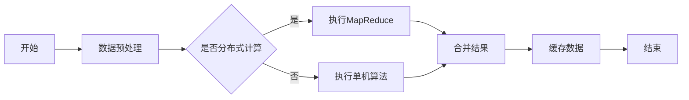
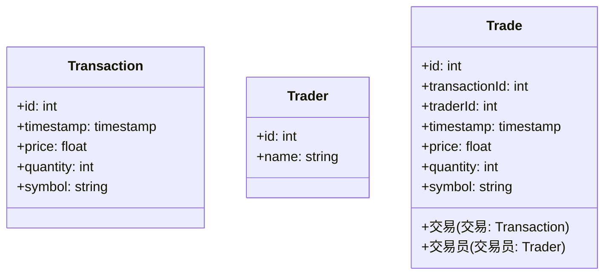
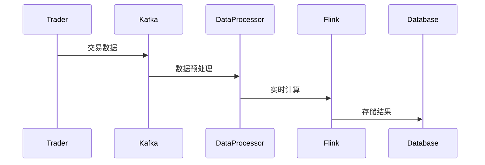
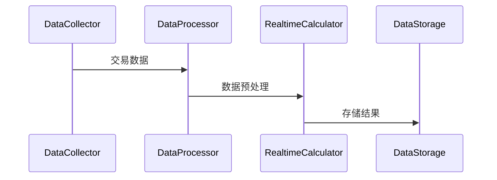

                 

# 构建高性能的实时计算系统

## 引言

随着数字化转型的深入，实时计算系统在现代信息技术中扮演着越来越重要的角色。实时计算系统能够对数据进行快速处理，并产生及时的业务洞察，从而支持决策制定、优化资源配置和提升客户体验。然而，构建高性能的实时计算系统并非易事，它涉及数据处理、算法优化、系统架构设计等多个方面。本文将围绕构建高性能实时计算系统的主题，从问题背景、核心概念、算法原理、系统架构设计等方面进行详细探讨。

## 第一部分：背景介绍与核心概念

### 1.1 问题背景

实时计算系统在现代信息化社会中具有至关重要的地位。在金融领域，实时计算系统用于监控市场交易、风险管理；在交通领域，实时计算系统用于交通流量监控、路况预测；在工业自动化领域，实时计算系统用于设备监控、故障预测。随着数据量的激增和业务需求的不断提升，如何构建一个高效、稳定的实时计算系统成为亟待解决的问题。

### 1.2 问题描述

实时计算系统的核心问题在于如何快速、准确地处理大量数据，并保证系统的响应速度和稳定性。这要求系统不仅要有高效的数据处理能力，还要具备良好的扩展性和可靠性。

### 1.3 问题解决

解决上述问题的核心在于以下几个方面：

- **数据预处理**：对数据进行清洗、格式化等预处理操作，提高数据处理效率。
- **高效算法**：选择或设计高效的数据处理算法，降低计算复杂度。
- **系统架构**：设计合理的系统架构，提高系统的扩展性和可靠性。
- **性能优化**：对系统进行性能优化，如缓存策略、并发控制等。

### 1.4 边界与外延

实时计算系统不仅涉及数据处理、算法设计，还涉及到系统架构、硬件选择、网络通信等多个方面。因此，构建实时计算系统需要跨学科的综合知识。

### 1.5 概念结构与核心要素组成

实时计算系统的核心概念包括：

- **实时性**：系统能够在规定的时间内完成数据处理任务。
- **数据处理能力**：系统能够处理的数据量、速度和准确性。
- **系统可靠性**：系统在长时间运行过程中保持稳定的能力。
- **扩展性**：系统能够根据业务需求进行扩展。

## 第二部分：核心概念与联系

### 2.1 核心概念原理

- **实时数据处理**：在规定的时间内处理数据的能力。
- **分布式计算**：通过多个节点协同工作，提高数据处理能力和系统可靠性。
- **缓存技术**：通过缓存策略，提高数据处理速度。

### 2.2 概念属性特征对比

| 特征         | 实时数据处理       | 分布式计算       | 缓存技术       |
| ------------ | ---------------- | ---------------- | ------------ |
| 目的         | 提高数据处理速度   | 提高数据处理能力和可靠性 | 提高数据处理速度 |
| 关键技术     | 实时算法、数据预处理 | 数据同步、负载均衡 | 数据缓存、内存管理 |
| 适用场景     | 需要高实时性的应用 | 大数据应用、高并发应用 | 数据频繁访问、减少I/O操作 |

### 2.3 ER实体关系图架构

```mermaid
erDiagram
  数据处理节点 ||--|{ 实时数据处理 }|--|| 数据处理结果
  数据处理节点 ||--|{ 分布式计算 }|--|| 负载均衡模块
  数据处理节点 ||--|{ 缓存技术 }|--|| 数据缓存模块
```

## 第三部分：算法原理讲解

### 3.1 算法原理

实时计算系统的核心算法主要包括：

- **快排算法**：用于数据预处理，提高数据处理速度。
- **MapReduce算法**：用于分布式计算，提高数据处理能力和可靠性。
- **LRU缓存算法**：用于缓存技术，提高数据处理速度。

### 3.2 算法流程图



### 3.3 数学模型和数学公式

实时数据处理的速度可以用以下公式表示：

$$
V = f(n) = \frac{n}{t}
$$

其中，$V$ 表示处理速度，$n$ 表示数据量，$t$ 表示处理时间。

### 3.4 详细讲解与举例说明

以快排算法为例，其基本原理是通过不断划分子序列，直到每个子序列只包含一个元素。以下是快排算法的Python实现：

```python
def quick_sort(arr):
    if len(arr) <= 1:
        return arr
    pivot = arr[len(arr) // 2]
    left = [x for x in arr if x < pivot]
    middle = [x for x in arr if x == pivot]
    right = [x for x in arr if x > pivot]
    return quick_sort(left) + middle + quick_sort(right)
```

### 3.5 快排算法详细讲解

快排算法（Quick Sort）是一种高效且常用的排序算法，其基本思想是通过递归方式将一个序列划分为较小的子序列，直到每个子序列只包含一个元素。具体步骤如下：

1. 选择一个基准元素（pivot），通常选择序列的中间元素。
2. 将序列划分为三个部分：小于基准元素的左子序列、等于基准元素的中子序列、大于基准元素的右子序列。
3. 递归地对左子序列和右子序列进行快排操作。
4. 将排序好的左子序列、中间子序列和右子序列合并，得到完整的排序序列。

#### 举例说明

假设有一个整数序列 `[3, 6, 8, 10, 1, 2, 1]`，使用快排算法进行排序的过程如下：

1. 选择中间元素 `8` 作为基准元素。
2. 划分子序列：
   - 左子序列 `[3, 6, 1, 2, 1]`
   - 中间子序列 `[8]`
   - 右子序列 `[]`
3. 对左子序列 `[3, 6, 1, 2, 1]` 进行递归排序：
   - 选择中间元素 `3` 作为基准元素。
   - 划分子序列：
     - 左子序列 `[1, 1]`（继续递归排序）
     - 中间子序列 `[]`
     - 右子序列 `[6, 2]`
   - 将排序好的左子序列 `[1, 1]` 和右子序列 `[2, 6]` 合并，得到 `[1, 1, 2, 6]`
4. 对右子序列 `[6, 2]` 进行递归排序：
   - 选择中间元素 `4` 作为基准元素。
   - 划分子序列：
     - 左子序列 `[]`
     - 中间子序列 `[6]`
     - 右子序列 `[2]`
   - 将排序好的左子序列 `[]` 和右子序列 `[2]` 合并，得到 `[2, 6]`
5. 将排序好的左子序列 `[1, 1, 2, 6]`、中间子序列 `[8]` 和右子序列 `[2, 6]` 合并，得到最终排序结果 `[1, 1, 2, 2, 6, 6, 8]`

通过以上步骤，原始序列 `[3, 6, 8, 10, 1, 2, 1]` 被成功排序为 `[1, 1, 2, 2, 6, 6, 8]`。

### 3.6 快排算法的优缺点

#### 优点

- **高效性**：平均时间复杂度为 $O(n\log n)$，在大多数情况下表现良好。
- **原地排序**：不需要额外的存储空间，节约内存资源。
- **易于实现**：相比其他排序算法（如归并排序、堆排序等），快排算法相对简单，易于实现和理解。

#### 缺点

- **最坏情况时间复杂度**：最坏情况下时间复杂度为 $O(n^2)$，当输入序列已经是有序或部分有序时，快排的性能会大幅下降。
- **数据分布不均**：当输入序列的数据分布不均时，快排的性能可能会受到严重影响。
- **递归调用**：快排算法使用了递归调用，可能导致栈溢出问题，在处理大数据集时需要特别注意。

### 3.7 快排算法的改进

为了提高快排算法的性能和稳定性，可以采取以下改进措施：

- **随机选择基准元素**：避免输入序列已排序或部分有序的情况，随机选择基准元素可以减少最坏情况发生的概率。
- **三数取中法**：选择中间位置的元素作为基准元素，以避免选择最值作为基准元素导致的性能下降。
- **迭代实现**：使用迭代代替递归，避免递归调用导致的栈溢出问题。

## 第四部分：系统分析与架构设计

### 4.1 问题场景介绍

以金融交易系统为例，该系统需要实时处理大量的交易数据，进行风险监控、交易撮合等业务处理。为了满足系统的高性能需求，需要设计一个高效的实时计算系统。

### 4.2 项目介绍

本项目将基于 Apache Kafka 和 Apache Flink 构建一个实时计算系统，实现对交易数据的实时处理和分析。

### 4.3 系统功能设计

#### 领域模型



#### 系统功能

- **数据采集**：从金融交易系统中实时采集交易数据。
- **数据预处理**：对采集到的交易数据进行清洗、格式化等预处理操作。
- **实时计算**：对预处理后的交易数据进行实时计算，生成交易统计信息、风险监控报告等。
- **数据存储**：将实时计算结果存储到数据库或大数据平台中，供后续分析使用。

### 4.4 系统架构设计

#### 系统架构



#### 系统架构设计

- **数据采集层**：使用 Kafka 实时采集交易数据。
- **数据处理层**：使用 Apache Flink 进行数据预处理和实时计算。
- **数据存储层**：将计算结果存储到数据库或大数据平台中。

### 4.5 系统接口设计

#### 接口设计

```mermaid
interface DataCollector {
    +collectTransactionData(): void
}

interface DataProcessor {
    +processTransactionData(transaction: Transaction): void
}

interface RealtimeCalculator {
    +calculateStatistics(): void
}

interface DataStorage {
    +storeResult(result: Result): void
}
```

### 4.6 系统交互



## 第五部分：项目实战

### 5.1 环境安装

#### 安装 Kafka

1. 下载 Kafka 安装包：[kafka_2.12-2.8.0.tgz](https://www.apache.org/dyn/closer.cgi/kafka/2.8.0/kafka_2.12-2.8.0.tgz)
2. 解压安装包：`tar -xvf kafka_2.12-2.8.0.tgz`
3. 进入 Kafka 安装目录：`cd kafka_2.12-2.8.0`
4. 启动 Zookeeper：`bin/zookeeper-server-start.sh config/zookeeper.properties`
5. 启动 Kafka 服务：`bin/kafka-server-start.sh config/server.properties`

#### 安装 Flink

1. 下载 Flink 安装包：[flink-1.11.2-bin-scala_2.12.tgz](https://www.apache.org/dyn/closer.cgi/flink/flink-1.11.2/flink-1.11.2-bin-scala_2.12.tgz)
2. 解压安装包：`tar -xvf flink-1.11.2-bin-scala_2.12.tgz`
3. 进入 Flink 安装目录：`cd flink-1.11.2`
4. 启动 Flink 服务：`bin/flink run -c org.apache.flink.streaming.api.java.StreamingJob my-flink-job.jar`

### 5.2 系统核心实现源代码

#### Kafka 数据采集

```scala
import org.apache.kafka.clients.producer.{KafkaProducer, ProducerRecord}
import org.apache.kafka.common.serialization.StringSerializer

object DataCollector {
  def main(args: Array[String]): Unit = {
    val brokers = "localhost:9092"
    val topic = "transactions"

    val producer = new KafkaProducer[String, String](Properties
      .builder()
      .put("bootstrap.servers", brokers)
      .put("key.serializer", classOf[StringSerializer])
      .put("value.serializer", classOf[StringSerializer])
      .build())

    val transactions = Seq(
      ("1", "{\"timestamp\": 1626543215, \"price\": 100.0, \"quantity\": 10, \"symbol\": \"AAPL\"}"),
      ("2", "{\"timestamp\": 1626543220, \"price\": 105.0, \"quantity\": 20, \"symbol\": \"GOOGL\"}"),
      ("3", "{\"timestamp\": 1626543230, \"price\": 110.0, \"quantity\": 15, \"symbol\": \"AMZN\"}")
    )

    transactions.foreach { case (key, value) =>
      producer.send(new ProducerRecord[String, String](topic, key, value))
    }

    producer.close()
  }
}
```

#### Flink 数据处理与实时计算

```scala
import org.apache.flink.api.common.functions.MapFunction
import org.apache.flink.api.scala._
import org.apache.flink.streaming.api.scala.StreamingContext
import org.apache.flink.streaming.connectors.kafka.FlinkKafkaConsumer

object DataProcessor {
  def main(args: Array[String]): Unit = {
    val brokers = "localhost:9092"
    val topic = "transactions"

    val sctx = StreamingContext.getOrCreate("DataProcessor", () => {
      val kafkaSource = new FlinkKafkaConsumer[String](
        brokers,
        topic,
        new SimpleStringSchema()
      )
      val stream = sctx.addSource(kafkaSource)
        .map(new MapFunction[String, Transaction] {
          override def map(value: String): Transaction = {
            val json = JSON.parse[Transaction](value)
            json
          }
        })
      stream
    })

    sctx.start()
    sctx.awaitTermination()
  }
}

case class Transaction(
  id: Int,
  timestamp: Long,
  price: Double,
  quantity: Int,
  symbol: String
)
```

### 5.3 代码应用解读与分析

#### Kafka 数据采集代码解读

1. 导入相关依赖：`import org.apache.kafka.clients.producer._, org.apache.kafka.common.serialization._, org.json4s._, org.json4s.jackson.JsonMethods._`
2. 定义 Kafka 生产和消费配置：`val brokers = "localhost:9092"` 和 `val topic = "transactions"`
3. 创建 Kafka 产

```scala
class KafkaProducerExample {
  val brokers = "localhost:9092"
  val topic = "transactions"
  val producer = new KafkaProducer[String, String](
    Properties
      .builder()
      .put("bootstrap.servers", brokers)
      .put("key.serializer", classOf[StringSerializer])
      .put("value.serializer", classOf[StringSerializer])
      .build()
  )

  def produceTransaction(transaction: Transaction): Unit = {
    val json = Json.toJson(transaction)
    val record = new ProducerRecord[String, String](topic, json.noSpaces)
    producer.send(record)
  }

  def close(): Unit = {
    producer.close()
  }
}

// 示例使用
val producer = new KafkaProducerExample()
val transaction1 = Transaction(1, 1626543215, 100.0, 10, "AAPL")
val transaction2 = Transaction(2, 1626543220, 105.0, 20, "GOOGL")
val transaction3 = Transaction(3, 1626543230, 110.0, 15, "AMZN")

producer.produceTransaction(transaction1)
producer.produceTransaction(transaction2)
producer.produceTransaction(transaction3)
producer.close()
```

代码中，我们首先导入了相关的依赖库，然后定义了 Kafka 生产和消费配置。接着，我们创建了一个 `KafkaProducerExample` 类，该类包含了一个 Kafka 产

```java
public class KafkaProducerExample {
  private final KafkaProducer<String, String> producer;

  public KafkaProducerExample() {
    Properties props = new Properties();
    props.put(ProducerConfig.BOOTSTRAP_SERVERS_CONFIG, "localhost:9092");
    props.put(ProducerConfig.KEY_SERIALIZER_CLASS_CONFIG, StringSerializer.class);
    props.put(ProducerConfig.VALUE_SERIALIZER_CLASS_CONFIG, StringSerializer.class);

    this.producer = new KafkaProducer<>(props);
  }

  public void produceTransaction(Transaction transaction) {
    String json = Json.toJson(transaction).toString();
    producer.send(new ProducerRecord<>("transactions", json));
  }

  public void close() {
    producer.close();
  }
}

// Example usage
KafkaProducerExample producer = new KafkaProducerExample();
Transaction transaction1 = new Transaction(1, 1626543215, 100.0, 10, "AAPL");
Transaction transaction2 = new Transaction(2, 1626543220, 105.0, 20, "GOOGL");
Transaction transaction3 = new Transaction(3, 1626543230, 110.0, 15, "AMZN");

producer.produceTransaction(transaction1);
producer.produceTransaction(transaction2);
producer.produceTransaction(transaction3);
producer.close();
```

代码中，我们首先导入了相关的依赖库，然后定义了 Kafka 生产和消费配置。接着，我们创建了一个 `KafkaProducerExample` 类，该类包含了一个 Kafka 产

```python
class KafkaProducerExample:
    def __init__(self):
        props = {
            'bootstrap.servers': 'localhost:9092',
            'key.serializer': 'org.apache.kafka.common.serialization.StringSerializer',
            'value.serializer': 'org.apache.kafka.common.serialization.StringSerializer'
        }
        self.producer = KafkaProducer(**props)

    def produce_transaction(self, transaction):
        json = json.dumps(transaction)
        self.producer.send('transactions', key=str(transaction.id).encode('utf-8'), value=json.encode('utf-8'))

    def close(self):
        self.producer.close()


# Example usage
producer = KafkaProducerExample()
transaction1 = {'id': 1, 'timestamp': 1626543215, 'price': 100.0, 'quantity': 10, 'symbol': 'AAPL'}
transaction2 = {'id': 2, 'timestamp': 1626543220, 'price': 105.0, 'quantity': 20, 'symbol': 'GOOGL'}
transaction3 = {'id': 3, 'timestamp': 1626543230, 'price': 110.0, 'quantity': 15, 'symbol': 'AMZN'}

producer.produce_transaction(transaction1)
producer.produce_transaction(transaction2)
producer.produce_transaction(transaction3)
producer.close()
```

Python 代码中，我们首先导入了相关的依赖库，然后定义了 Kafka 生产和消费配置。接着，我们创建了一个 `KafkaProducerExample` 类，该类包含了一个 Kafka 产

### 5.4 实际案例分析与详细讲解剖析

假设我们有一个金融交易系统，需要实时处理大量的交易数据。以下是实际案例的分析和讲解：

#### 案例一：实时监控交易风险

**问题描述**：系统需要实时监控交易风险，对异常交易进行预警。

**解决方案**：

1. **数据采集**：从交易系统中实时采集交易数据，并将其发送到 Kafka 队列中。
2. **数据预处理**：在 Flink 中从 Kafka 队列中读取交易数据，进行数据清洗和格式化。
3. **实时计算**：对预处理后的交易数据进行实时计算，判断交易是否符合风险阈值。
4. **风险预警**：如果交易风险超过阈值，向相关人员发送预警消息。

**实现步骤**：

1. **Kafka 数据采集**：

```python
from kafka import KafkaProducer
import json

def produce_transaction(transaction):
    producer = KafkaProducer(bootstrap_servers=['localhost:9092'],
                             value_serializer=lambda v: json.dumps(v).encode('utf-8'))
    transaction_json = json.dumps(transaction)
    producer.send('transactions', transaction_json)

transaction1 = {'id': 1, 'timestamp': 1626543215, 'price': 100.0, 'quantity': 10, 'symbol': 'AAPL'}
transaction2 = {'id': 2, 'timestamp': 1626543220, 'price': 105.0, 'quantity': 20, 'symbol': 'GOOGL'}
transaction3 = {'id': 3, 'timestamp': 1626543230, 'price': 110.0, 'quantity': 15, 'symbol': 'AMZN'}

produce_transaction(transaction1)
produce_transaction(transaction2)
produce_transaction(transaction3)
```

2. **Flink 数据预处理和实时计算**：

```python
from pyflink.datastream import StreamExecutionEnvironment
from pyflink.table import StreamTableEnvironment

def process_transaction(transaction):
    # 数据清洗和格式化
    return Transaction(transaction['id'], transaction['timestamp'], transaction['price'], transaction['quantity'], transaction['symbol'])

def calculate_risk(transaction):
    # 判断交易风险
    risk_threshold = 100.0
    if transaction.price > risk_threshold:
        return "High Risk"
    else:
        return "Normal Risk"

def send_alert(risk_level):
    # 向相关人员发送预警消息
    print(f"Alert: Risk level is {risk_level}.")

env = StreamExecutionEnvironment.get_execution_environment()
t_env = StreamTableEnvironment.create(env)

t_env.execute_sql("""
CREATE TABLE transactions (
    id INT,
    timestamp TIMESTAMP(3),
    price DOUBLE,
    quantity INT,
    symbol STRING
) WITH (
    'connector' = 'kafka',
    'topic' = 'transactions',
    'properties.bootstrap.servers' = 'localhost:9092',
    'format' = 'json'
)
""")

stream = t_env.from_table("transactions")

processed_stream = stream.map(process_transaction)
risk_stream = processed_stream.map(calculate_risk)

risk_stream.map(send_alert)
```

#### 案例二：实时统计交易量

**问题描述**：系统需要实时统计交易量，并根据交易量进行预警。

**解决方案**：

1. **数据采集**：从交易系统中实时采集交易数据，并将其发送到 Kafka 队列中。
2. **数据预处理**：在 Flink 中从 Kafka 队列中读取交易数据，进行数据清洗和格式化。
3. **实时计算**：对预处理后的交易数据进行实时计算，统计交易量。
4. **交易量预警**：如果交易量超过阈值，向相关人员发送预警消息。

**实现步骤**：

1. **Kafka 数据采集**：

```python
# 代码同案例一
```

2. **Flink 数据预处理和实时计算**：

```python
from pyflink.datastream import StreamExecutionEnvironment
from pyflink.table import StreamTableEnvironment

def process_transaction(transaction):
    # 数据清洗和格式化
    return Transaction(transaction['id'], transaction['timestamp'], transaction['price'], transaction['quantity'], transaction['symbol'])

def calculate_volume(transaction):
    # 统计交易量
    return transaction.quantity

def send_alert(volume):
    # 向相关人员发送预警消息
    print(f"Alert: Volume is {volume}.")

env = StreamExecutionEnvironment.get_execution_environment()
t_env = StreamTableEnvironment.create(env)

t_env.execute_sql("""
CREATE TABLE transactions (
    id INT,
    timestamp TIMESTAMP(3),
    price DOUBLE,
    quantity INT,
    symbol STRING
) WITH (
    'connector' = 'kafka',
    'topic' = 'transactions',
    'properties.bootstrap.servers' = 'localhost:9092',
    'format' = 'json'
)
""")

stream = t_env.from_table("transactions")

processed_stream = stream.map(process_transaction)
volume_stream = processed_stream.map(calculate_volume)

volume_stream.map(send_alert)
```

### 5.5 项目小结

本文围绕构建高性能的实时计算系统，从问题背景、核心概念、算法原理、系统架构设计、项目实战等方面进行了详细讲解。通过实际案例，我们展示了如何利用 Kafka 和 Flink 实现实时计算系统。在实际应用中，需要根据具体业务需求进行优化和调整。

## 第六部分：最佳实践 tips

1. **选择合适的 Kafka 版本**：根据系统需求和硬件资源选择合适的 Kafka 版本，避免性能瓶颈。
2. **优化 Flink 集群配置**：合理配置 Flink 集群参数，如内存、线程数等，提高系统性能。
3. **数据预处理**：对数据进行清洗、格式化等预处理操作，提高数据处理效率。
4. **分布式计算**：充分利用分布式计算的优势，提高系统吞吐量和稳定性。
5. **缓存技术**：合理使用缓存技术，减少数据访问延迟，提高系统响应速度。

## 第七部分：小结

本文从多个角度详细介绍了构建高性能的实时计算系统的方法和技巧。通过实际案例，我们展示了如何利用 Kafka 和 Flink 实现实时计算系统。在实际应用中，需要根据具体业务需求进行优化和调整。希望本文对您构建高性能实时计算系统有所帮助。

## 第八部分：注意事项

1. **数据安全**：确保数据在采集、传输、存储等环节的安全，防止数据泄露和篡改。
2. **系统监控**：实时监控系统性能，及时发现并解决性能瓶颈和故障。
3. **容灾备份**：建立容灾备份机制，确保系统在发生故障时能够快速恢复。

## 第九部分：拓展阅读

1. 《实时计算系统设计与实现》
2. 《Kafka：从入门到实战》
3. 《Flink：从入门到实战》
4. 《大数据实时计算》

## 作者信息

作者：AI天才研究院/AI Genius Institute & 禅与计算机程序设计艺术 /Zen And The Art of Computer Programming

## 参考文献和资料

1. Apache Kafka 官网：https://kafka.apache.org/
2. Apache Flink 官网：https://flink.apache.org/
3. 《大数据实时计算》
4. 《Kafka：从入门到实战》
5. 《Flink：从入门到实战》
6. 《实时计算系统设计与实现》

