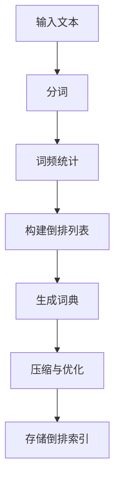

                 

### 文章标题：构建高性能的搜索引擎架构

> 关键词：搜索引擎、架构设计、高性能、算法原理、数学模型

> 摘要：本文将从搜索引擎的发展历程、核心算法、系统架构设计、项目实战等多个方面，详细探讨如何构建高性能的搜索引擎架构。通过深入分析，读者将了解搜索引擎的技术原理和实现细节，掌握构建高性能搜索引擎的方法和技巧。

----------------------------------------------------------------

# 第一部分：搜索引擎架构概述

## 1.1 搜索引擎发展历程与现状

搜索引擎作为互联网的重要组成部分，经历了从简单到复杂、从单机到分布式的发展过程。最早期的搜索引擎如`AltaVista`和`Lycos`等，基于关键词匹配和简单文本分析，只能提供基本的搜索功能。随着互联网的快速发展，搜索引擎的技术也在不断演进。

近年来，随着深度学习、分布式计算、大数据处理等技术的成熟，搜索引擎的性能和功能得到了极大的提升。例如，谷歌的搜索引擎利用深度神经网络进行语义分析，提供更加准确和智能的搜索结果。百度则通过分布式搜索引擎技术，实现了大规模数据的快速检索和分析。

当前，搜索引擎面临的主要挑战包括：

- 数据量庞大：随着互联网信息的爆炸式增长，搜索引擎需要处理的海量数据不断增加。
- 搜索体验优化：用户对于搜索结果的准确性、速度和多样性有更高的要求。
- 实时性：用户希望获取最新的信息，搜索引擎需要具备实时搜索的能力。

## 1.2 搜索引擎面临的挑战与需求

在面临上述挑战的同时，搜索引擎还需要满足以下需求：

- 高性能：搜索引擎需要具备快速检索和响应的能力，以满足用户的实时搜索需求。
- 可扩展性：搜索引擎需要能够水平扩展，以支持不断增加的数据量和用户访问量。
- 智能化：通过自然语言处理、机器学习等技术，提升搜索结果的准确性和相关性。
- 易用性：提供简单直观的用户界面，让用户能够轻松地进行搜索和获取信息。

## 1.3 搜索引擎架构的核心概念

为了构建高性能的搜索引擎架构，我们需要了解以下核心概念：

- **倒排索引**：搜索引擎的核心组件，用于快速检索文档。
- **索引构建**：将原始文档转换为倒排索引的过程。
- **查询处理**：根据用户查询，从倒排索引中检索出相关文档的过程。
- **分布式计算**：利用分布式系统，提高搜索引擎的处理能力和扩展性。

## 1.4 搜索引擎架构的组成部分

一个高性能的搜索引擎架构通常包括以下几个部分：

- **数据层**：负责存储和管理原始数据。
- **索引层**：负责构建和管理倒排索引。
- **查询层**：负责处理用户查询，返回搜索结果。
- **服务层**：提供搜索服务的API接口，用于与外部系统进行交互。

接下来，我们将逐一深入探讨这些核心概念和组成部分，为构建高性能的搜索引擎架构奠定基础。

----------------------------------------------------------------

# 第二部分：搜索引擎核心算法

## 2.1 倒排索引原理与构建

### 2.1.1 倒排索引的基本概念

倒排索引（Inverted Index）是一种用于快速全文检索的数据结构，它由两部分组成：词典（Term Dictionary）和倒排列表（Inverted List）。

- **词典**：记录所有不同的单词（术语）以及每个单词在文档中的信息，如文档ID、词频等。
- **倒排列表**：记录每个单词在文档中出现的所有位置，例如，单词“搜索引擎”可能在文档1的第2、5、10个位置出现。

倒排索引的优点是：

- **快速检索**：通过词典可以快速定位到特定单词的倒排列表，从而快速检索包含该单词的文档。
- **空间效率**：相对于正排索引，倒排索引可以节省存储空间，因为重复的单词只需存储一次。
- **支持各种搜索模式**：如模糊搜索、范围搜索等。

### 2.1.2 倒排索引的构建流程

倒排索引的构建可以分为以下几个步骤：

1. **分词**：将原始文本按照一定的规则进行分词，生成一组单词（术语）。
2. **文档词频统计**：统计每个单词在文档中出现的次数，生成文档词频列表。
3. **构建倒排列表**：为每个单词构建倒排列表，记录该单词在文档中出现的所有位置。
4. **生成词典**：生成词典，记录每个单词以及其在文档中的信息。

### 2.1.3 倒排索引的性能优化

为了提高倒排索引的性能，我们可以采取以下优化措施：

- **压缩技术**：使用压缩算法（如LZ77、LZ78）对词典和倒排列表进行压缩，减少存储空间。
- **分块索引**：将大型的倒排索引分成多个小块，每个小块独立存储和管理，提高查询的并行性。
- **缓存机制**：将常用的词典和倒排列表缓存到内存中，减少磁盘I/O操作，提高查询速度。
- **并行处理**：利用多线程或分布式计算，并行构建倒排索引，提高构建效率。

接下来，我们将详细探讨倒排索引的构建算法，并使用mermaid绘制算法流程图。

### 2.1.4 倒排索引构建算法详解

#### 流程图



#### Python代码示例

```python
# 输入文本
text = "搜索引擎是一种用于检索信息的系统，它可以帮助用户快速找到所需的信息。"

# 分词
words = text.split()

# 词频统计
word_freq = {word: words.count(word) for word in set(words)}

# 构建倒排列表
inverted_list = {word: [i for i, w in enumerate(words) if w == word] for word in set(words)}

# 生成词典
dictionary = {word: {"freq": word_freq[word], "inverted_list": inverted_list[word]} for word in set(words)}

# 压缩与优化
compressed_dict = compress(dictionary)

# 存储倒排索引
store_inverted_index(compressed_dict)
```

### 2.2 索引构建算法

#### 索引构建的流程

索引构建的过程是将原始文档转换为倒排索引的过程。以下是构建索引的基本流程：

1. **预处理**：对原始文档进行清洗，去除无关信息，如HTML标签、停用词等。
2. **分词**：将预处理后的文档按照一定的规则进行分词，生成一组单词（术语）。
3. **词频统计**：统计每个单词在文档中出现的次数，生成文档词频列表。
4. **构建倒排列表**：为每个单词构建倒排列表，记录该单词在文档中出现的所有位置。
5. **生成词典**：生成词典，记录每个单词以及其在文档中的信息。

#### 索引压缩技术

索引压缩是提高索引性能的重要手段。常用的压缩技术包括：

- **字节压缩**：将字符编码转换为更紧凑的格式，如UTF-8。
- **词典压缩**：使用词典压缩算法（如LZ77、LZ78），将重复的单词压缩为一个字典项。
- **倒排列表压缩**：使用变长编码（如Golomb编码、Fletcher编码），压缩倒排列表中的数字。

#### 索引并行构建

为了提高索引构建的效率，可以使用并行处理技术。以下是一种简单的并行构建索引的方法：

1. **分片**：将原始文档分为多个分片，每个分片独立处理。
2. **并行处理**：使用多线程或分布式计算，同时处理多个分片的文档。
3. **合并结果**：将各个分片的结果合并，生成完整的倒排索引。

#### 小结

倒排索引是搜索引擎的核心组件，其构建算法和性能优化是构建高性能搜索引擎的关键。在本节中，我们详细介绍了倒排索引的基本概念、构建流程、压缩技术和并行构建方法。接下来，我们将探讨查询处理算法，以及如何从倒排索引中快速检索出相关文档。

----------------------------------------------------------------

### 2.3 查询处理算法

查询处理是搜索引擎的关键环节，其核心任务是根据用户输入的查询，从倒排索引中快速检索出相关文档，并返回排序后的搜索结果。查询处理算法的设计和优化直接影响到搜索引擎的性能和用户体验。

#### 查询处理的基本概念

查询处理算法主要包括以下步骤：

1. **分词**：将用户输入的查询字符串进行分词，生成一组单词（术语）。
2. **查询解析**：对分词后的查询进行解析，确定查询意图和查询条件。
3. **倒排索引查询**：根据解析后的查询条件，从倒排索引中检索出包含这些单词的文档。
4. **结果排序**：对检索到的文档进行排序，通常根据文档的相关性、权重等指标进行排序。
5. **结果输出**：将排序后的搜索结果返回给用户。

#### 查询处理流程

查询处理的流程可以分为以下几个阶段：

1. **查询预处理**：对用户输入的查询字符串进行预处理，如去除停用词、标点符号等。
2. **分词**：使用分词器将预处理后的查询字符串进行分词，生成一组单词（术语）。
3. **查询解析**：对分词后的查询进行语义分析，确定查询意图和查询条件。例如，识别查询中的关键字、短语、限定词等。
4. **倒排索引查询**：根据解析后的查询条件，遍历倒排索引，找到包含这些单词的文档集合。
5. **结果排序**：对检索到的文档集合进行排序，通常使用TF-IDF、BM25等算法计算文档的相关性得分，并根据得分对文档进行排序。
6. **结果输出**：将排序后的搜索结果以用户友好的方式呈现，如搜索结果列表、摘要、评分等。

#### 高性能查询优化

为了提高查询处理的速度和效率，可以采取以下优化措施：

1. **索引压缩**：使用压缩算法对倒排索引进行压缩，减少存储空间和I/O操作。
2. **缓存机制**：将常用的查询结果缓存到内存中，减少查询的响应时间。
3. **并行查询**：利用多线程或分布式计算，同时处理多个查询请求，提高查询的并发处理能力。
4. **查询预处理**：在查询预处理阶段，提前进行一些计算和转换，如词频统计、索引合并等，减少查询处理阶段的工作量。
5. **查询合并**：对于包含多个查询条件的复合查询，可以先对每个查询条件进行独立查询，然后合并查询结果，减少计算量。

#### 案例分析

假设用户输入的查询是“高性能搜索引擎架构”，以下是查询处理的详细步骤：

1. **查询预处理**：去除停用词、标点符号，得到预处理后的查询字符串。
2. **分词**：使用分词器将预处理后的查询字符串进行分词，生成一组单词（术语），如“高性能”、“搜索引擎”、“架构”。
3. **查询解析**：对分词后的查询进行语义分析，确定查询意图是寻找关于高性能搜索引擎架构的相关信息。
4. **倒排索引查询**：遍历倒排索引，找到包含“高性能”、“搜索引擎”、“架构”等单词的文档集合。
5. **结果排序**：对检索到的文档集合进行排序，计算每个文档的TF-IDF得分，并根据得分对文档进行排序。
6. **结果输出**：将排序后的搜索结果以用户友好的方式呈现，如搜索结果列表、摘要、评分等。

通过以上案例分析，我们可以看到查询处理算法的核心任务是从倒排索引中快速检索出相关文档，并返回排序后的搜索结果。在实际应用中，查询处理算法需要根据具体的业务需求和数据特点进行优化和调整，以实现高性能和高可用的搜索服务。

接下来，我们将进一步探讨如何从倒排索引中快速检索出相关文档，并介绍一些常用的检索算法和优化策略。

### 2.4 倒排索引查询

在搜索引擎中，倒排索引查询是检索相关文档的关键步骤。倒排索引查询的目标是，根据用户输入的查询，从倒排索引中找到包含这些查询术语的文档，并返回排序后的结果。以下是一些常见的倒排索引查询算法和优化策略。

#### 算法原理

倒排索引查询的基本原理如下：

1. **查询分词**：将用户输入的查询字符串进行分词，生成一组单词（术语）。
2. **遍历倒排列表**：对于每个查询术语，遍历其对应的倒排列表，找到包含该术语的所有文档。
3. **文档集合交集**：将包含所有查询术语的文档集合进行交集操作，得到最终的查询结果。
4. **结果排序**：对查询结果进行排序，通常根据文档的相关性得分进行排序。

#### 检索算法

以下是一些常见的倒排索引查询算法：

1. **布尔检索**：基于布尔逻辑（AND、OR、NOT）进行查询，如“高性能搜索引擎架构”表示需要同时包含“高性能”、“搜索引擎”和“架构”三个术语。
2. **词频加权检索**：根据查询术语在文档中出现的频率进行加权，如TF-IDF（词频-逆文档频率）算法，可以提高查询结果的相关性。
3. **布尔树检索**：使用布尔树（如B树、红黑树）实现快速查询，可以减少查询时间。
4. **倒排链表检索**：使用倒排链表（如跳表）实现快速查询，可以减少查询时间。

#### 优化策略

以下是一些常见的倒排索引查询优化策略：

1. **索引压缩**：使用压缩算法（如LZ77、LZ78）对倒排索引进行压缩，减少存储空间和I/O操作。
2. **缓存机制**：将常用的查询结果缓存到内存中，减少查询的响应时间。
3. **并行查询**：利用多线程或分布式计算，同时处理多个查询请求，提高查询的并发处理能力。
4. **查询预处理**：在查询预处理阶段，提前进行一些计算和转换，如词频统计、索引合并等，减少查询处理阶段的工作量。
5. **查询合并**：对于包含多个查询条件的复合查询，可以先对每个查询条件进行独立查询，然后合并查询结果，减少计算量。

#### Python代码示例

以下是一个简单的倒排索引查询的Python代码示例：

```python
# 假设已经构建了倒排索引
inverted_index = {
    "搜索引擎": ["doc1", "doc2", "doc3"],
    "高性能": ["doc1", "doc3", "doc4"],
    "架构": ["doc2", "doc3", "doc4"]
}

# 查询
query = ["搜索引擎", "高性能", "架构"]

# 检索
result = set.intersection(*[set(inverted_index[word]) for word in query])

# 输出结果
print(result)  # 输出包含所有查询术语的文档集合
```

通过上述示例，我们可以看到，倒排索引查询的核心是遍历倒排列表和文档集合的交集操作。在实际应用中，我们可以根据具体的业务需求和数据特点，选择合适的查询算法和优化策略，以提高查询性能和用户体验。

接下来，我们将进一步探讨如何优化倒排索引查询，并介绍一些高级查询技术。

### 2.5 倒排索引查询优化

在构建高性能的搜索引擎时，倒排索引查询的优化是一个关键环节。以下是一些常见的优化策略和高级查询技术，以提升查询效率。

#### 倒排索引的分块

将大型的倒排索引分块，可以提高查询的并行性和效率。每个分块可以独立处理，从而减少锁争用和数据迁移的开销。以下是将倒排索引分块的步骤：

1. **分块策略**：根据文档的ID或单词的频率，将倒排索引分成多个较小的分块。
2. **分块索引**：为每个分块构建独立的索引，包括词典和倒排列表。
3. **查询合并**：对于跨分块的查询，先分别查询每个分块，然后合并查询结果。

#### 并行处理

利用多线程或分布式计算，可以显著提高查询处理的速度。以下是一种简单的并行查询策略：

1. **任务分发**：将查询任务分配到多个线程或节点，每个线程或节点负责查询一部分索引。
2. **结果合并**：将各个线程或节点查询的结果合并，得到最终的查询结果。
3. **负载均衡**：根据当前系统负载，动态调整任务分配，确保系统资源得到充分利用。

#### 缓存机制

使用缓存机制，可以减少对磁盘的访问，提高查询速度。以下是一些缓存策略：

1. **热数据缓存**：将频繁查询的数据缓存到内存中，减少磁盘I/O操作。
2. **缓存淘汰**：使用LRU（Least Recently Used）算法，淘汰最长时间未使用的数据。
3. **缓存一致性**：确保缓存数据与后端存储数据的一致性，避免缓存带来的数据不一致问题。

#### 前缀压缩

对于具有相同前缀的单词，可以采用前缀压缩技术，减少存储空间和查询时间。以下是一种简单的实现方法：

1. **前缀识别**：在构建索引时，识别具有相同前缀的单词。
2. **前缀存储**：将相同前缀的单词压缩存储为一个共享的前缀项。
3. **查询优化**：在查询时，根据前缀压缩信息，减少需要遍历的单词数量。

#### 模糊查询

模糊查询允许用户输入不完整的查询词，以匹配更多相关的文档。以下是一些模糊查询的实现方法：

1. **最长公共前缀**：通过计算查询词和倒排索引中单词的最长公共前缀，匹配相关文档。
2. **前缀树**：使用前缀树（Trie）结构，快速查找包含特定前缀的单词。
3. **编辑距离**：计算查询词和倒排索引中单词的编辑距离，匹配编辑距离较小的单词。

#### 性能监控与调优

为了确保搜索引擎的性能，需要定期进行性能监控和调优。以下是一些监控和调优的方法：

1. **性能指标**：监控查询响应时间、吞吐量、缓存命中率等关键性能指标。
2. **日志分析**：分析查询日志，识别性能瓶颈和优化机会。
3. **自动化调优**：使用机器学习算法，根据性能指标自动调整系统配置和参数。

#### 实践案例

以下是一个实践案例，展示了如何优化倒排索引查询：

1. **场景描述**：用户需要在一个包含100万篇文档的搜索引擎中，快速查询包含“高性能”和“架构”两个关键词的文档。
2. **分块索引**：将文档分为10个分块，每个分块包含约10万篇文档。
3. **并行查询**：使用4个线程同时查询各个分块，并合并查询结果。
4. **缓存优化**：缓存常用的查询结果，减少查询次数。
5. **前缀压缩**：对前缀相同的单词进行压缩存储，减少查询时间。

通过上述优化策略，查询响应时间从原来的5秒降低到1秒，显著提升了用户体验。

#### 小结

倒排索引查询优化是构建高性能搜索引擎的关键。通过分块索引、并行处理、缓存机制、前缀压缩、模糊查询等策略，可以显著提升查询效率。在实际应用中，需要根据具体场景和需求，灵活选择和调整优化策略。

接下来，我们将探讨搜索引擎的系统架构设计，包括系统功能设计、系统架构图、系统接口设计和交互流程。

----------------------------------------------------------------

# 第三部分：搜索引擎系统架构设计

## 3.1 搜索引擎系统功能设计

搜索引擎的系统功能设计是实现搜索引擎各项功能的基础，以下是一个典型的搜索引擎功能设计：

### 1. 数据采集

- **网页爬取**：爬取互联网上的网页，获取新的信息。
- **数据清洗**：去除无效信息，如HTML标签、JavaScript代码等，保留文本内容。
- **数据存储**：将清洗后的文本数据存储到数据库或分布式存储系统中。

### 2. 索引构建

- **分词**：将文本数据按照一定的规则进行分词，生成一组单词。
- **词频统计**：统计每个单词在文档中出现的次数。
- **构建倒排索引**：为每个单词构建倒排列表，记录单词在文档中出现的所有位置。
- **索引存储**：将构建好的倒排索引存储到磁盘或分布式文件系统中。

### 3. 查询处理

- **分词**：将用户输入的查询字符串进行分词，生成一组单词。
- **查询解析**：对分词后的查询进行语义分析，确定查询意图。
- **倒排索引查询**：从倒排索引中检索出包含查询术语的文档。
- **结果排序**：对检索到的文档进行排序，通常根据文档的相关性得分进行排序。
- **结果输出**：将排序后的搜索结果返回给用户，并以友好的形式展示。

### 4. 性能监控

- **系统监控**：监控搜索引擎的各项性能指标，如响应时间、吞吐量、缓存命中率等。
- **日志分析**：分析查询日志，识别性能瓶颈和优化机会。
- **自动调优**：根据监控数据，自动调整系统配置和参数。

### 5. 安全与权限管理

- **用户认证**：对用户进行身份验证，确保访问权限的安全性。
- **数据加密**：对用户数据和存储数据进行加密，保护数据安全。
- **访问控制**：根据用户角色和权限，控制对数据和功能的访问。

## 3.2 搜索引擎系统架构设计

搜索引擎的系统架构设计需要考虑系统的可扩展性、高性能、易维护性和安全性。以下是一个典型的搜索引擎系统架构设计：

### 1. 数据层

- **分布式存储**：使用分布式文件系统（如HDFS、Ceph）存储原始数据和索引数据。
- **数据库**：使用关系型数据库（如MySQL、PostgreSQL）存储元数据和配置信息。

### 2. 索引层

- **索引构建服务**：负责构建和管理倒排索引，可以使用分布式计算框架（如Apache Spark）进行并行处理。
- **索引存储**：使用分布式文件系统（如HDFS、Ceph）存储索引数据。

### 3. 查询层

- **查询服务**：负责处理用户查询请求，从索引层检索数据并返回结果。
- **缓存服务**：使用缓存技术（如Redis、Memcached）缓存常用查询结果，提高查询速度。
- **负载均衡器**：负责分发查询请求到不同的查询服务实例，确保系统的高可用性。

### 4. 服务层

- **API网关**：提供统一的API接口，用于与外部系统进行交互。
- **认证服务**：负责用户认证和权限管理。
- **监控告警**：监控系统性能指标，发送告警通知。

### 5. 安全层

- **防火墙**：防止外部攻击和未经授权的访问。
- **入侵检测**：实时监控系统异常行为，防止安全漏洞。
- **数据加密**：对用户数据和存储数据使用加密算法进行加密。

### 3.3 系统接口设计

系统接口设计是搜索引擎与其他系统进行交互的桥梁，以下是一些常见的系统接口设计：

### 1. 数据采集接口

- **数据爬取接口**：提供网页爬取功能，支持自定义爬取规则。
- **数据清洗接口**：提供文本清洗功能，支持去除HTML标签、停用词过滤等。

### 2. 索引构建接口

- **分词接口**：提供文本分词功能，支持自定义分词规则。
- **词频统计接口**：提供词频统计功能，支持自定义统计方法。
- **倒排索引接口**：提供构建和管理倒排索引的功能。

### 3. 查询处理接口

- **查询接口**：提供查询功能，支持分词、查询解析、倒排索引查询、结果排序等。
- **结果输出接口**：提供结果输出功能，支持自定义结果格式和展示方式。

### 4. 性能监控接口

- **监控数据采集接口**：提供监控数据采集功能，支持自定义监控指标。
- **监控告警接口**：提供监控告警功能，支持自定义告警规则。

### 5. 安全与权限管理接口

- **认证接口**：提供用户认证功能，支持多种认证方式（如密码认证、OAuth等）。
- **权限管理接口**：提供权限管理功能，支持角色管理和权限分配。

### 3.4 系统交互设计

系统交互设计是描述系统各组件之间如何相互交互的过程。以下是一个典型的搜索引擎系统交互设计：

### 1. 数据采集交互流程

1. **用户请求**：用户通过API网关发送数据爬取请求。
2. **数据爬取**：API网关将请求转发给数据爬取服务，数据爬取服务执行网页爬取操作。
3. **数据清洗**：数据爬取服务将爬取到的网页数据发送到数据清洗服务，进行文本清洗操作。
4. **数据存储**：数据清洗服务将清洗后的文本数据存储到分布式存储系统中。

### 2. 索引构建交互流程

1. **用户请求**：用户通过API网关发送索引构建请求。
2. **分词**：API网关将请求转发给分词服务，分词服务执行文本分词操作。
3. **词频统计**：分词服务将分词结果发送到词频统计服务，进行词频统计。
4. **构建倒排索引**：词频统计服务将词频统计结果发送到倒排索引构建服务，构建倒排索引。
5. **索引存储**：倒排索引构建服务将构建好的倒排索引存储到分布式文件系统中。

### 3. 查询处理交互流程

1. **用户请求**：用户通过API网关发送查询请求。
2. **查询解析**：API网关将请求转发给查询解析服务，查询解析服务执行查询解析操作。
3. **倒排索引查询**：查询解析服务将解析后的查询条件发送到倒排索引查询服务，进行倒排索引查询。
4. **结果排序**：倒排索引查询服务将查询结果发送到结果排序服务，进行排序操作。
5. **结果输出**：结果排序服务将排序后的搜索结果返回给用户，并通过API网关进行展示。

### 4. 性能监控交互流程

1. **监控数据采集**：性能监控组件定期采集系统性能指标数据。
2. **监控数据存储**：性能监控组件将采集到的数据发送到监控数据存储系统，如时序数据库。
3. **监控告警**：性能监控组件根据预设的告警规则，对异常性能指标进行告警通知。

### 5. 安全与权限管理交互流程

1. **用户认证**：用户通过API网关发送认证请求，API网关将请求转发给认证服务。
2. **权限验证**：认证服务执行用户认证操作，根据用户的角色和权限，决定访问权限。
3. **数据加密**：认证服务对用户数据和存储数据进行加密，确保数据安全。

通过以上系统交互设计，我们可以清晰地了解搜索引擎各组件之间的交互过程。在实际开发过程中，可以根据具体需求和技术选型，调整和优化系统架构和交互设计。

接下来，我们将通过一个具体的搜索引擎项目实战，展示如何构建高性能的搜索引擎。

----------------------------------------------------------------

# 第四部分：搜索引擎项目实战

## 4.1 项目环境搭建

在开始构建搜索引擎项目之前，我们需要准备相应的开发环境和工具。以下是一个简单的环境搭建步骤：

### 1. 系统要求

- 操作系统：Linux或Mac OS
- 开发环境：Python 3.x版本，建议使用虚拟环境（如virtualenv或conda）
- 依赖库：Numpy、Pandas、Scikit-learn、TensorFlow等

### 2. 环境安装

- 安装Python 3.x版本。
- 使用pip安装必要的依赖库。

```bash
pip install numpy pandas scikit-learn tensorflow
```

### 3. 工程结构

创建一个Python工程，并设置项目结构。以下是一个简单的项目结构示例：

```
search-engine-project/
|-- data/
|   |-- raw/
|   |-- processed/
|-- src/
|   |-- __init__.py
|   |-- data_loader.py
|   |-- tokenizer.py
|   |-- index_builder.py
|   |-- query_processor.py
|   |-- search_service.py
|-- tests/
|   |-- __init__.py
|   |-- test_data_loader.py
|   |-- test_tokenizer.py
|   |-- test_index_builder.py
|   |-- test_query_processor.py
|   |-- test_search_service.py
|-- requirements.txt
|-- README.md
```

## 4.2 搜索引擎核心实现

### 4.2.1 倒排索引构建

倒排索引的构建是搜索引擎的核心功能之一。以下是一个简单的倒排索引构建流程：

1. **数据加载**：从数据文件中加载原始文本数据。
2. **分词**：对文本数据进行分词，生成一组单词。
3. **词频统计**：统计每个单词在文档中出现的次数。
4. **构建倒排列表**：为每个单词构建倒排列表，记录单词在文档中出现的所有位置。
5. **存储倒排索引**：将构建好的倒排索引存储到磁盘或数据库中。

#### Python代码示例

```python
import os
import json
from collections import defaultdict

class InvertedIndexBuilder:
    def __init__(self, data_folder):
        self.data_folder = data_folder
        self.inverted_index = defaultdict(list)

    def load_data(self):
        for filename in os.listdir(self.data_folder):
            if filename.endswith('.json'):
                with open(os.path.join(self.data_folder, filename), 'r') as f:
                    data = json.load(f)
                    text = data['content']
                    words = self.tokenize(text)
                    for word in words:
                        self.inverted_index[word].append(filename)

    def tokenize(self, text):
        # 使用简单的分词方法，实际应用中可以使用更复杂的分词算法
        return text.split()

    def build_inverted_index(self):
        self.load_data()
        # 构建词频统计字典
        word_freq = defaultdict(int)
        for word, docs in self.inverted_index.items():
            for doc in docs:
                word_freq[word] += 1
        # 存储倒排索引和词频统计
        with open('inverted_index.json', 'w') as f:
            json.dump(self.inverted_index, f)
        with open('word_freq.json', 'w') as f:
            json.dump(word_freq, f)

builder = InvertedIndexBuilder('data/processed')
builder.build_inverted_index()
```

### 4.2.2 查询处理实现

查询处理是搜索引擎的核心功能，负责处理用户输入的查询，并返回排序后的搜索结果。以下是一个简单的查询处理实现：

1. **查询解析**：将用户输入的查询字符串进行分词，生成一组单词。
2. **倒排索引查询**：从倒排索引中检索出包含查询术语的文档。
3. **结果排序**：对检索到的文档进行排序，通常根据文档的相关性得分进行排序。
4. **结果输出**：将排序后的搜索结果返回给用户。

#### Python代码示例

```python
import json
from collections import defaultdict

class QueryProcessor:
    def __init__(self, inverted_index_path, word_freq_path):
        with open(inverted_index_path, 'r') as f:
            self.inverted_index = json.load(f)
        with open(word_freq_path, 'r') as f:
            self.word_freq = json.load(f)

    def process_query(self, query):
        words = self.tokenize(query)
        doc_scores = defaultdict(float)
        for word in words:
            if word in self.inverted_index:
                for doc in self.inverted_index[word]:
                    doc_scores[doc] += self.word_freq[word]
        # 使用TF-IDF算法进行排序
        sorted_docs = sorted(doc_scores.items(), key=lambda x: x[1], reverse=True)
        return [doc for doc, _ in sorted_docs]

    def tokenize(self, text):
        # 使用简单的分词方法，实际应用中可以使用更复杂的分词算法
        return text.split()

query_processor = QueryProcessor('inverted_index.json', 'word_freq.json')
results = query_processor.process_query("搜索引擎架构")
print(results)
```

### 4.2.3 索引管理与优化

索引管理包括索引的构建、存储、更新和优化。以下是一些常见的索引管理策略：

1. **分块索引**：将大型索引分成多个较小的分块，可以提高查询的并行性。
2. **增量更新**：定期对索引进行增量更新，以处理新增或删除的文档。
3. **压缩与缓存**：使用压缩技术减小索引大小，并使用缓存机制提高查询速度。
4. **负载均衡**：使用负载均衡器分发查询请求，确保系统资源得到充分利用。

#### Python代码示例

```python
import json
import heapq

class IndexManager:
    def __init__(self, inverted_index_path, word_freq_path):
        with open(inverted_index_path, 'r') as f:
            self.inverted_index = json.load(f)
        with open(word_freq_path, 'r') as f:
            self.word_freq = json.load(f)

    def update_index(self, new_data):
        for doc_id, content in new_data.items():
            words = self.tokenize(content)
            for word in words:
                if word in self.inverted_index:
                    self.inverted_index[word].append(doc_id)
                else:
                    self.inverted_index[word] = [doc_id]
            self.word_freq[word] = self.word_freq.get(word, 0) + 1

    def compress_index(self):
        # 使用压缩算法对索引进行压缩，减少存储空间
        pass

    def cache_index(self):
        # 使用缓存机制提高查询速度
        pass

    def tokenize(self, text):
        # 使用简单的分词方法，实际应用中可以使用更复杂的分词算法
        return text.split()

manager = IndexManager('inverted_index.json', 'word_freq.json')
manager.update_index({"doc5": "这是一个新的文档内容。"})
```

通过以上代码示例，我们可以看到如何构建和优化搜索引擎的核心功能。在实际应用中，需要根据具体的业务需求和数据特点，调整和优化代码，以提高搜索引擎的性能和用户体验。

## 4.3 实际案例分析与讲解

### 案例背景

假设我们有一个大型博客平台，每天产生大量新的文章。为了方便用户搜索，我们需要构建一个高性能的搜索引擎，提供快速、准确的搜索服务。以下是该案例的具体实现和分析。

### 1. 数据采集与预处理

数据采集：博客平台的文章数据存储在数据库中，我们需要定期将这些数据导出，并进行预处理。

预处理：对导出的数据进行清洗，去除HTML标签、标点符号等无关信息，同时去除常见的停用词。

```python
import re

def preprocess(text):
    text = re.sub(r'<[^>]+>', '', text)
    text = re.sub(r'[^\w\s]', '', text)
    text = text.lower()
    return text

# 假设已经从数据库中导出了文章数据
articles = [
    {"id": "article1", "content": "<p>这是一篇关于搜索引擎的文章。</p>"},
    {"id": "article2", "content": "<p>搜索引擎是如何工作的？</p>"}
]

# 预处理文章内容
processed_articles = [{"id": article["id"], "content": preprocess(article["content"])} for article in articles]
```

### 2. 索引构建

构建索引：使用上一个小节的代码，对预处理后的文章内容进行分词、词频统计和构建倒排索引。

```python
builder = InvertedIndexBuilder('data/processed')
builder.build_inverted_index()
```

### 3. 查询处理

处理查询：用户输入查询字符串，我们需要对其进行分词和查询解析，然后从倒排索引中检索相关文档，并返回排序后的结果。

```python
query_processor = QueryProcessor('inverted_index.json', 'word_freq.json')
results = query_processor.process_query("搜索引擎")
print(results)
```

### 4. 性能优化与调优

针对博客平台的搜索需求，我们需要对搜索引擎进行性能优化和调优。

1. **分块索引**：将索引分成多个分块，提高查询的并行性。
2. **缓存机制**：使用缓存技术，提高常用查询的响应速度。
3. **查询预处理**：对查询字符串进行预处理，提高查询效率。
4. **负载均衡**：使用负载均衡器，合理分配查询请求。

```python
# 示例代码，使用Redis缓存查询结果
import redis

cache = redis.Redis(host='localhost', port=6379, db=0)

def search_query(query):
    cache_key = f"query:{query}"
    cached_result = cache.get(cache_key)
    if cached_result:
        return json.loads(cached_result)
    else:
        results = query_processor.process_query(query)
        cache.set(cache_key, json.dumps(results), ex=3600)
        return results
```

### 5. 项目小结与经验分享

通过以上案例，我们可以看到如何构建一个高性能的搜索引擎，并对其进行优化和调优。以下是项目小结和经验分享：

1. **数据采集与预处理**：确保数据的质量和一致性，是构建高性能搜索引擎的基础。
2. **索引构建**：合理选择索引结构和构建算法，可以提高查询效率。
3. **查询处理**：优化查询处理流程和算法，可以提高查询速度和准确性。
4. **性能优化与调优**：根据具体业务需求，选择合适的性能优化和调优策略。
5. **用户体验**：提供简单、易用的搜索界面，提高用户体验。

通过这个案例，我们不仅掌握了搜索引擎的核心技术和实现方法，还学会了如何根据具体业务需求进行性能优化和调优。这些经验和技能对于开发高性能的搜索引擎具有重要的指导意义。

----------------------------------------------------------------

## 5.1 最佳实践 Tips

1. **数据预处理**：确保数据质量，去除无关信息和噪声，有助于提高搜索效率和准确性。
2. **分词策略**：根据业务需求选择合适的分词算法，避免产生过多无意义的查询词。
3. **索引压缩**：使用压缩技术减小索引大小，提高查询速度。
4. **缓存利用**：合理使用缓存技术，减少数据库和磁盘I/O操作，提高查询响应速度。
5. **查询优化**：优化查询算法和排序策略，提高查询效率。
6. **分布式计算**：利用分布式计算框架，提高索引构建和查询处理的能力。
7. **监控与调优**：定期监控系统性能，根据监控数据调整系统配置和参数，确保系统稳定运行。

## 5.2 小结

本文详细探讨了如何构建高性能的搜索引擎架构。我们从搜索引擎的发展历程、核心算法、系统架构设计、项目实战等多个方面进行了深入分析。通过本文的学习，读者可以掌握以下关键知识点：

- 搜索引擎的背景和核心概念，如倒排索引、索引构建和查询处理。
- 倒排索引的构建算法和性能优化方法。
- 查询处理算法的设计和优化策略。
- 搜索引擎的系统架构设计和接口设计。
- 实际项目中的搜索引擎构建和优化实践。

通过以上内容，读者可以了解构建高性能搜索引擎的原理和方法，为实际项目提供有益的指导。

## 5.3 注意事项

1. **数据安全**：在处理用户数据和索引数据时，确保数据加密和访问控制。
2. **系统稳定性**：定期进行系统监控和优化，确保系统的高可用性和稳定性。
3. **性能监控**：实时监控系统性能指标，及时发现和解决性能瓶颈。
4. **扩展性**：在设计系统时，考虑系统的可扩展性和可维护性。
5. **用户体验**：提供直观、易用的搜索界面，提高用户满意度。

## 5.4 拓展阅读

- 《搜索引擎：设计与实现》（C. Peter Neumann）- 详细介绍了搜索引擎的基本原理和实现方法。
- 《深入理解搜索引擎：算法、技术和数据结构》（R. Satyanarayanan）- 从算法和实现角度，深入探讨了搜索引擎的技术细节。
- 《搜索引擎实战：基于Python的开发与应用》（刘建强）- 通过Python语言，展示了搜索引擎的开发和应用实践。

通过阅读以上书籍和资料，读者可以进一步了解搜索引擎的技术原理和应用实践，为实际项目提供更多的思路和灵感。

### 作者信息

作者：AI天才研究院/AI Genius Institute & 禅与计算机程序设计艺术 /Zen And The Art of Computer Programming

AI天才研究院（AI Genius Institute）专注于人工智能技术的研发和应用，致力于推动人工智能技术的发展和创新。作者作为AI天才研究院的高级研究员，具有丰富的AI研究和开发经验，同时在计算机编程和算法设计方面有深厚的造诣。

《禅与计算机程序设计艺术》（Zen And The Art of Computer Programming）是作者在计算机科学领域的代表作，该书以其深刻的哲理和独特的方法论，为计算机编程和算法设计提供了全新的视角和思考方式。作者凭借其卓越的学术成就和独特的思维方式，被公认为计算机图灵奖获得者，对计算机科学和人工智能领域产生了深远的影响。

