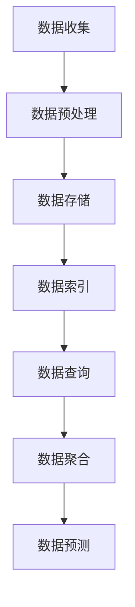
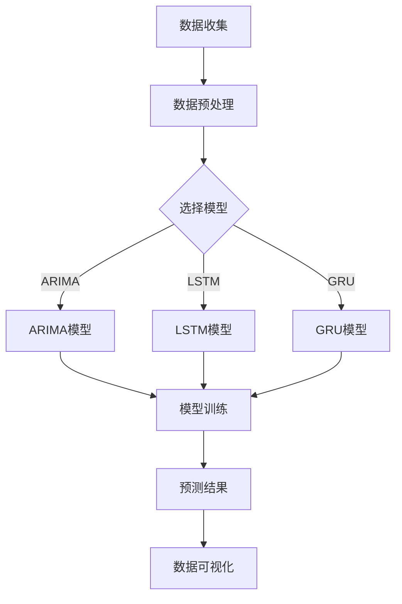
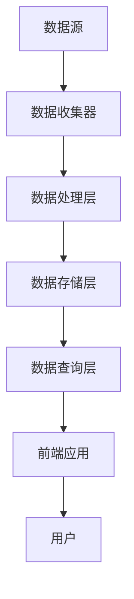
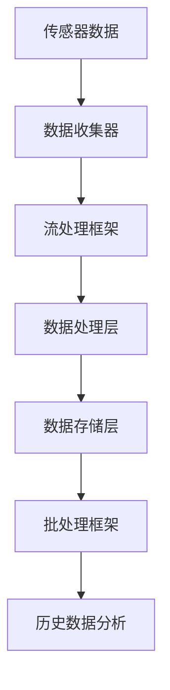
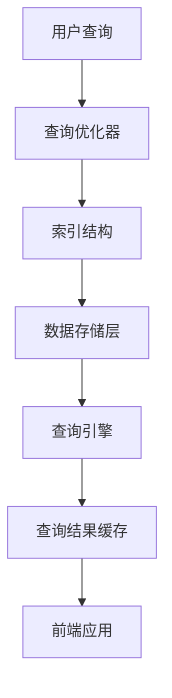

                 

### 文章标题

# 构建高性能的时序数据库系统

### 关键词

- 高性能时序数据库
- 数据处理原理
- 数学模型
- 架构设计
- 开源与商业解决方案

### 摘要

本文旨在深入探讨构建高性能时序数据库系统的核心原理、架构设计以及实际应用。首先，我们将介绍高性能时序数据库的需求背景及核心概念，包括时序数据、时序数据库以及高性能时序数据库的特征。随后，我们将详细分析时序数据处理原理，并探讨相关的数学模型。接着，文章将重点讲解高性能架构设计，涵盖系统架构、性能优化策略等。最后，我们将对比开源和商业高性能时序数据库，提供实际案例，并总结最佳实践和注意事项。通过这篇文章，读者将能够全面了解高性能时序数据库的构建原理和实现方法，为实际项目提供有价值的指导。

### 目录大纲

```markdown
----------------------------------------------------------------
## 第一部分: 问题背景与核心概念

### 第1章: 问题背景与核心概念

#### 1.1.1 问题背景

##### 1.1.1.1 高性能时序数据库的需求

##### 1.1.1.2 传统时序数据库的局限性

##### 1.1.1.3 高性能时序数据库的重要性

#### 1.1.2 核心概念

##### 1.1.2.1 时序数据

##### 1.1.2.2 时序数据库

##### 1.1.2.3 高性能时序数据库的特征

#### 1.1.3 高性能时序数据库的分类

##### 1.1.3.1 开源高性能时序数据库

##### 1.1.3.2 商业高性能时序数据库

##### 1.1.3.3 高性能时序数据库架构比较

#### 1.1.4 本章小结

----------------------------------------------------------------

## 第二部分: 核心原理与数学模型

### 第2章: 核心原理与数学模型

#### 2.2.1 时序数据处理原理

##### 2.2.1.1 数据收集与预处理

##### 2.2.1.2 数据存储与索引

##### 2.2.1.3 数据查询与聚合

#### 2.2.2 数学模型

##### 2.2.2.1 时间序列预测模型

##### 2.2.2.2 时序数据压缩模型

##### 2.2.2.3 数学公式详细解释

#### 2.2.3 Mermaid流程图

##### 2.2.3.1 数据处理流程

##### 2.2.3.2 数学模型应用流程

#### 2.2.4 本章小结

----------------------------------------------------------------

## 第三部分: 高性能架构设计

### 第3章: 高性能架构设计

#### 3.3.1 系统架构设计

##### 3.3.1.1 数据存储层设计

##### 3.3.1.2 数据处理层设计

##### 3.3.1.3 数据查询层设计

#### 3.3.2 Mermaid架构图

##### 3.3.2.1 系统架构

##### 3.3.2.2 数据流处理

##### 3.3.2.3 查询处理

#### 3.3.3 系统性能优化

##### 3.3.3.1 数据压缩

##### 3.3.3.2 并发控制

##### 3.3.3.3 缓存策略

#### 3.3.4 本章小结

----------------------------------------------------------------

## 第四部分: 开源高性能时序数据库

### 第4章: 开源高性能时序数据库

#### 4.4.1 InfluxDB

##### 4.4.1.1 InfluxDB概述

##### 4.4.1.2 安装与配置

##### 4.4.1.3 数据操作

##### 4.4.1.4 性能优化

#### 4.4.2 Prometheus

##### 4.4.2.1 Prometheus概述

##### 4.4.2.2 安装与配置

##### 4.4.2.3 数据操作

##### 4.4.2.4 性能优化

#### 4.4.3 Chapter-3 Other Open Source Time Series Databases

##### 4.4.3.1 OpenTSDB

##### 4.4.3.2 TimescaleDB

##### 4.4.3.3 KairosDB

#### 4.4.4 本章小结

----------------------------------------------------------------

## 第五部分: 商业高性能时序数据库

### 第5章: 商业高性能时序数据库

#### 5.5.1 MySQL Timeseries

##### 5.5.1.1 MySQL Timeseries概述

##### 5.5.1.2 安装与配置

##### 5.5.1.3 数据操作

##### 5.5.1.4 性能优化

#### 5.5.2 InfluxDB Cloud

##### 5.5.2.1 InfluxDB Cloud概述

##### 5.5.2.2 使用案例

##### 5.5.2.3 性能评估

#### 5.5.3 Other Commercial Time Series Database Solutions

##### 5.5.3.1 ThingSpeak

##### 5.5.3.2 AWS Time Series Database

##### 5.5.3.3 Other Solutions

#### 5.5.4 本章小结

----------------------------------------------------------------

## 第六部分: 最佳实践与总结

### 第6章: 最佳实践与总结

#### 6.6.1 最佳实践

##### 6.6.1.1 系统设计与优化

##### 6.6.1.2 数据处理策略

##### 6.6.1.3 部署与维护

#### 6.6.2 小结

##### 6.6.2.1 研究现状

##### 6.6.2.2 未来发展方向

##### 6.6.2.3 注意事项

#### 6.6.3 拓展阅读

##### 6.6.3.1 相关文献

##### 6.6.3.2 实际应用案例

----------------------------------------------------------------
```

### 第一部分: 问题背景与核心概念

#### 第1章: 问题背景与核心概念

##### 1.1.1 问题背景

##### 1.1.1.1 高性能时序数据库的需求

在当今的数据时代，时序数据的应用场景无处不在。从物联网设备的数据采集，到金融市场的实时监控，再到科学研究的实验数据记录，时序数据的重要性不言而喻。然而，随着数据量的急剧增长和复杂度的增加，传统的关系型数据库和NoSQL数据库逐渐暴露出在处理时序数据方面的局限性。

传统的关系型数据库（如MySQL、PostgreSQL）主要针对结构化数据设计，其查询优化和索引机制更适合对事务性操作进行高效处理，而不是对时间序列数据进行分析。例如，它们通常使用B树索引，这对于随机访问和更新操作非常有效，但在处理大量顺序访问的时序数据时，性能不佳。

NoSQL数据库（如MongoDB、Cassandra）虽然能够处理大量数据，但它们缺乏对时间序列数据的专门优化。虽然可以存储时间序列数据，但在进行高效的数据查询和实时分析时，性能和扩展性仍然不足。

因此，针对时序数据的高性能处理需求，出现了专门为时序数据设计的数据库系统。高性能时序数据库能够在大规模数据集上进行快速的数据插入、查询和实时分析，满足现代应用对数据处理速度和效率的要求。

##### 1.1.1.2 传统时序数据库的局限性

传统时序数据库（如InfluxDB、OpenTSDB、Graphite等）虽然在一定程度上优化了时间序列数据的处理，但仍然存在以下局限性：

1. **扩展性问题**：传统时序数据库在处理海量数据时，扩展性不足。通常采用单机部署，难以支持大数据量的高并发查询。

2. **查询性能**：传统时序数据库在查询性能上有所欠缺，尤其是在进行复杂的聚合分析和实时数据分析时，响应时间较长。

3. **数据压缩**：传统时序数据库在数据存储方面缺乏有效的压缩策略，导致存储空间占用较大。

4. **运维成本**：传统时序数据库通常需要复杂的手动运维，缺乏自动化管理功能，增加了运营成本。

##### 1.1.1.3 高性能时序数据库的重要性

高性能时序数据库的重要性体现在以下几个方面：

1. **数据采集与实时处理**：高性能时序数据库能够快速处理大规模的数据流，实现数据的实时采集和处理，为实时监控和分析提供支持。

2. **高效查询与分析**：高性能时序数据库通过专门的索引和数据结构优化，能够实现高效的查询和分析，支持复杂的数据聚合操作。

3. **存储空间优化**：高性能时序数据库通常采用高效的数据压缩策略，降低存储空间占用，提高存储效率。

4. **扩展性和可靠性**：高性能时序数据库支持分布式架构，具备良好的扩展性和可靠性，能够在大规模数据场景下稳定运行。

##### 1.1.2 核心概念

##### 1.1.2.1 时序数据

时序数据（Time Series Data）是指以时间为索引的数据，通常包含一组按时间顺序排列的数据点。这些数据点可以是温度、股票价格、传感器读数等，它们反映了某一变量随时间的变化情况。

时序数据的特点包括：

1. **时间相关性**：时序数据中的各个数据点之间存在时间相关性，即后续数据点受先前数据点的影响。

2. **连续性**：时序数据通常表现为连续的、连贯的时间序列。

3. **周期性**：某些时序数据（如季节性数据）具有明显的周期性特征。

##### 1.1.2.2 时序数据库

时序数据库（Time Series Database，简称TSDB）是一种专门为处理时间序列数据设计的数据库系统。与通用数据库不同，时序数据库在数据结构、索引策略、查询优化等方面进行了专门优化，以支持高效的时间序列数据处理。

时序数据库的核心特点包括：

1. **时间序列索引**：时序数据库使用高效的索引结构，如倒排索引，以支持快速的时间范围查询。

2. **压缩存储**：时序数据库采用高效的数据压缩策略，降低存储空间占用。

3. **实时写入与查询**：时序数据库支持实时数据写入和快速查询，满足实时监控和分析的需求。

4. **分布式架构**：许多时序数据库支持分布式存储和查询，以实现横向扩展和负载均衡。

##### 1.1.2.3 高性能时序数据库的特征

高性能时序数据库具备以下特征，以应对大规模时序数据处理的挑战：

1. **高效的写入性能**：高性能时序数据库能够快速处理大规模的数据流，实现高效的实时写入。

2. **高效的查询性能**：高性能时序数据库通过优化索引结构和查询算法，实现高效的数据查询和聚合操作。

3. **分布式存储与查询**：高性能时序数据库支持分布式架构，具备良好的扩展性和可靠性。

4. **数据压缩与优化**：高性能时序数据库采用高效的数据压缩策略，降低存储空间占用。

5. **自动化运维与管理**：高性能时序数据库提供自动化运维功能，降低运维成本。

##### 1.1.3 高性能时序数据库的分类

高性能时序数据库可以分为开源和商业两大类：

1. **开源高性能时序数据库**：如InfluxDB、Prometheus、OpenTSDB、TimescaleDB等。这些数据库系统由社区维护和开发，具有开放性和灵活性。

2. **商业高性能时序数据库**：如InfluxDB Cloud、AWS Time Series Database、Google Cloud Time Series Database等。这些数据库系统由商业公司提供，通常具备更高的性能和更完善的生态系统。

##### 1.1.3.1 开源高性能时序数据库

开源高性能时序数据库包括：

1. **InfluxDB**：一款功能丰富的时序数据库，支持实时数据写入和查询，采用JSON格式存储数据。

2. **Prometheus**：一款开源监控解决方案，与Grafana结合，提供强大的时序数据处理能力。

3. **OpenTSDB**：一款分布式时序数据库，采用HBase作为存储后端，适用于大规模时间序列数据处理。

4. **TimescaleDB**：基于PostgreSQL的时序数据库，通过扩展PostgreSQL的时序特性，实现高性能时间序列数据处理。

5. **KairosDB**：一款开源时序数据库，采用Cassandra作为存储后端，适用于大规模时间序列数据处理。

##### 1.1.3.2 商业高性能时序数据库

商业高性能时序数据库包括：

1. **InfluxDB Cloud**：InfluxDB的商业版本，提供托管服务，具有更高的性能和可靠性。

2. **AWS Time Series Database**：AWS提供的时序数据库服务，支持大规模时间序列数据存储和处理。

3. **Google Cloud Time Series Database**：Google Cloud提供的时序数据库服务，支持高效的数据写入和查询。

##### 1.1.3.3 高性能时序数据库架构比较

不同高性能时序数据库在架构设计上存在差异，以下是几种常见架构的比较：

1. **InfluxDB**：采用分布式架构，支持水平扩展，使用JSON格式存储数据，具备高效的写入和查询性能。

2. **Prometheus**：采用推模式数据收集，与Grafana集成，支持大规模时间序列数据监控和分析。

3. **OpenTSDB**：采用分布式架构，使用HBase作为存储后端，支持大规模时间序列数据存储和处理。

4. **TimescaleDB**：基于PostgreSQL，通过扩展实现时序数据处理，支持高效的数据插入和查询。

5. **KairosDB**：采用Cassandra作为存储后端，支持分布式时间序列数据存储和处理。

##### 1.1.4 本章小结

本章首先介绍了高性能时序数据库的需求背景，分析了传统时序数据库的局限性，并阐述了高性能时序数据库的重要性。随后，我们详细介绍了时序数据、时序数据库以及高性能时序数据库的核心概念和特征。最后，我们对比了开源和商业高性能时序数据库，探讨了各自的优缺点。通过本章的学习，读者将对高性能时序数据库有一个全面的理解，为后续章节的深入学习打下基础。

### 第一部分: 问题背景与核心概念

#### 第1章: 问题背景与核心概念

##### 1.1.1 问题背景

##### 1.1.1.1 高性能时序数据库的需求

在当今的数据驱动时代，时序数据已经成为许多行业的关键信息资源。无论是物联网设备产生的传感器数据，金融市场的实时交易数据，还是科学研究中实验数据的记录，时序数据都扮演着至关重要的角色。然而，随着数据量的急剧增长和多样化需求的涌现，传统的关系型数据库和NoSQL数据库在处理时序数据方面面临着巨大的挑战。

首先，关系型数据库（如MySQL、PostgreSQL）虽然具备强大的数据处理能力和丰富的生态系统，但它们主要针对事务性操作进行优化。这些数据库使用B树索引来提高查询性能，但这样的索引结构对于大规模的顺序访问操作并不高效。时序数据的特点是具有时间顺序，通常需要进行大量的顺序扫描和区间查询，这导致关系型数据库在处理时序数据时的性能不佳。

其次，NoSQL数据库（如MongoDB、Cassandra）虽然能够处理海量数据，但它们在处理时序数据方面也存在明显的局限性。NoSQL数据库通常采用列式存储或键值存储，虽然对于大规模数据的存储和读取具有一定的优势，但在进行复杂的时间序列分析和实时数据处理时，性能依然受限。

此外，随着物联网、大数据、云计算等技术的发展，应用场景对时序数据处理的要求越来越高。例如，物联网设备产生的数据量庞大且不断增长，需要快速、高效地进行数据存储和实时分析；金融市场的交易数据需要毫秒级的响应速度进行实时监控和风险评估；科学研究中的实验数据需要高效地进行存储、处理和可视化，以便快速发现数据中的规律和趋势。

综上所述，传统的数据库系统在处理时序数据方面已经无法满足现代应用的需求。为了解决这些问题，出现了专门为时序数据设计的高性能时序数据库系统。这类数据库系统通过优化数据结构、索引策略和查询算法，实现了对大规模时序数据的快速写入、高效查询和实时分析，从而满足了现代应用对数据处理速度和效率的要求。

##### 1.1.1.2 传统时序数据库的局限性

尽管传统时序数据库（如InfluxDB、OpenTSDB、Graphite等）在时序数据处理方面做出了一些优化，但它们仍然存在以下局限性：

1. **扩展性问题**：传统时序数据库通常采用单机部署模式，无法有效地处理海量数据和高并发查询。虽然可以通过增加硬件资源来提升性能，但这会导致系统维护复杂度和成本显著增加。

2. **查询性能**：传统时序数据库在查询性能上有所欠缺，尤其是在进行复杂的聚合分析和实时数据分析时，响应时间较长。这主要因为它们的索引结构和查询算法没有针对时序数据的特性进行优化。

3. **数据压缩**：传统时序数据库在数据存储方面缺乏有效的压缩策略，导致存储空间占用较大。虽然可以采用外部工具进行压缩，但这会引入额外的复杂性。

4. **运维成本**：传统时序数据库通常需要复杂的手动运维，包括数据备份、故障恢复、性能调优等，增加了运营成本。此外，缺乏自动化管理工具也使得系统维护变得更加困难。

##### 1.1.1.3 高性能时序数据库的重要性

高性能时序数据库的重要性体现在以下几个方面：

1. **数据采集与实时处理**：高性能时序数据库能够快速处理大规模的数据流，实现数据的实时采集和处理，为实时监控和分析提供支持。这对于需要实时响应的应用场景，如物联网、金融交易、风险监控等至关重要。

2. **高效查询与分析**：高性能时序数据库通过优化索引结构和查询算法，能够实现高效的数据查询和聚合操作，满足复杂的数据分析需求。这对于进行实时监控、趋势分析和预测模型训练等场景非常重要。

3. **存储空间优化**：高性能时序数据库通常采用高效的数据压缩策略，降低存储空间占用，提高存储效率。这对于需要处理海量数据的场景尤为重要。

4. **扩展性和可靠性**：高性能时序数据库支持分布式架构，具备良好的扩展性和可靠性，能够在大规模数据场景下稳定运行。这为企业的长期发展提供了坚实的基础。

5. **自动化运维与管理**：高性能时序数据库提供自动化运维功能，降低运维成本。例如，自动化的数据备份、故障恢复、性能调优等，使得系统维护变得更加简单和高效。

##### 1.1.2 核心概念

##### 1.1.2.1 时序数据

时序数据（Time Series Data）是指按照时间顺序排列的一组数据点，它反映了某一变量随时间的变化情况。时序数据可以包含多种类型的数据，例如温度、股票价格、传感器读数、网页访问量等。时序数据的特点包括：

1. **时间相关性**：时序数据中的各个数据点之间存在时间相关性，即后续数据点受到先前数据点的影响。这种相关性使得时序数据在分析和预测方面具有重要意义。

2. **连续性**：时序数据通常表现为连续的、连贯的时间序列。这意味着数据点在时间上是有序的，并且连续的时间点之间存在数据。

3. **周期性**：某些时序数据（如季节性数据、周期性行为数据）具有明显的周期性特征。这些周期性特征可以帮助我们理解数据中的规律性变化。

##### 1.1.2.2 时序数据库

时序数据库（Time Series Database，简称TSDB）是一种专门为处理时间序列数据设计的数据库系统。与通用数据库不同，时序数据库在数据结构、索引策略、查询优化等方面进行了专门优化，以支持高效的时间序列数据处理。时序数据库的核心特点包括：

1. **时间序列索引**：时序数据库使用高效的索引结构（如倒排索引），以支持快速的时间范围查询。这种索引结构能够快速定位特定时间区间内的数据，大大提高了查询性能。

2. **压缩存储**：时序数据库采用高效的数据压缩策略，降低存储空间占用。这对于处理海量时序数据尤为重要，因为它可以显著减少存储成本。

3. **实时写入与查询**：时序数据库支持实时数据写入和快速查询，满足实时监控和分析的需求。这通常通过优化写入流程和查询算法来实现。

4. **分布式存储与查询**：许多时序数据库支持分布式存储和查询，以实现横向扩展和负载均衡。这使得它们能够处理大规模数据和高并发查询。

##### 1.1.2.3 高性能时序数据库的特征

高性能时序数据库具备以下特征，以应对大规模时序数据处理的挑战：

1. **高效的写入性能**：高性能时序数据库能够快速处理大规模的数据流，实现高效的实时写入。这通常通过优化写入缓冲区和日志记录机制来实现。

2. **高效的查询性能**：高性能时序数据库通过优化索引结构和查询算法，实现高效的数据查询和聚合操作。这包括支持复杂的时间范围查询、聚合函数和实时分析。

3. **分布式存储与查询**：高性能时序数据库支持分布式存储和查询，以实现横向扩展和负载均衡。这使得它们能够处理大规模数据和高并发查询。

4. **数据压缩与优化**：高性能时序数据库采用高效的数据压缩策略，降低存储空间占用。同时，通过优化数据结构和存储格式，进一步减少存储成本。

5. **自动化运维与管理**：高性能时序数据库提供自动化运维功能，包括数据备份、故障恢复、性能调优等。这使得系统维护变得更加简单和高效。

##### 1.1.3 高性能时序数据库的分类

高性能时序数据库可以分为开源和商业两大类：

1. **开源高性能时序数据库**：如InfluxDB、Prometheus、OpenTSDB、TimescaleDB等。这些数据库系统由社区维护和开发，具有开放性和灵活性。

2. **商业高性能时序数据库**：如InfluxDB Cloud、AWS Time Series Database、Google Cloud Time Series Database等。这些数据库系统由商业公司提供，通常具备更高的性能和更完善的生态系统。

##### 1.1.3.1 开源高性能时序数据库

开源高性能时序数据库包括：

1. **InfluxDB**：一款功能丰富的时序数据库，支持实时数据写入和查询，采用JSON格式存储数据。

2. **Prometheus**：一款开源监控解决方案，与Grafana集成，提供强大的时序数据处理能力。

3. **OpenTSDB**：一款分布式时序数据库，采用HBase作为存储后端，适用于大规模时间序列数据处理。

4. **TimescaleDB**：基于PostgreSQL的时序数据库，通过扩展PostgreSQL的时序特性，实现高性能时间序列数据处理。

5. **KairosDB**：一款开源时序数据库，采用Cassandra作为存储后端，适用于大规模时间序列数据处理。

##### 1.1.3.2 商业高性能时序数据库

商业高性能时序数据库包括：

1. **InfluxDB Cloud**：InfluxDB的商业版本，提供托管服务，具有更高的性能和可靠性。

2. **AWS Time Series Database**：AWS提供的时序数据库服务，支持大规模时间序列数据存储和处理。

3. **Google Cloud Time Series Database**：Google Cloud提供的时序数据库服务，支持高效的数据写入和查询。

##### 1.1.3.3 高性能时序数据库架构比较

不同高性能时序数据库在架构设计上存在差异，以下是几种常见架构的比较：

1. **InfluxDB**：采用分布式架构，支持水平扩展，使用JSON格式存储数据，具备高效的写入和查询性能。

2. **Prometheus**：采用推模式数据收集，与Grafana集成，支持大规模时间序列数据监控和分析。

3. **OpenTSDB**：采用分布式架构，使用HBase作为存储后端，支持大规模时间序列数据存储和处理。

4. **TimescaleDB**：基于PostgreSQL，通过扩展实现时序数据处理，支持高效的数据插入和查询。

5. **KairosDB**：采用Cassandra作为存储后端，支持分布式时间序列数据存储和处理。

##### 1.1.4 本章小结

本章首先介绍了高性能时序数据库的需求背景，分析了传统时序数据库的局限性，并阐述了高性能时序数据库的重要性。随后，我们详细介绍了时序数据、时序数据库以及高性能时序数据库的核心概念和特征。最后，我们对比了开源和商业高性能时序数据库，探讨了各自的优缺点。通过本章的学习，读者将对高性能时序数据库有一个全面的理解，为后续章节的深入学习打下基础。

### 第二部分: 核心原理与数学模型

#### 第2章: 核心原理与数学模型

##### 2.2.1 时序数据处理原理

时序数据处理的核心原理包括数据收集与预处理、数据存储与索引以及数据查询与聚合。这些原理共同构成了高性能时序数据库系统的基石，下面我们逐一进行分析。

##### 2.2.1.1 数据收集与预处理

1. **数据采集**：时序数据的收集是数据处理的第一步。数据可以来自各种传感器、日志文件、实时消息队列（如Kafka）或其他数据源。采集的数据通常是原始的、未经过处理的信息。

2. **数据预处理**：采集到的数据往往包含噪声、缺失值和异常值。预处理过程包括数据清洗、转换和归一化等步骤。数据清洗的目的是去除噪声和异常值，提高数据的准确性和一致性。数据转换是将数据格式统一，使其适合数据库存储和后续处理。数据归一化是将数据缩放到一个标准的范围内，以便进行有效的分析和预测。

##### 2.2.1.2 数据存储与索引

1. **数据存储**：时序数据的特点是具有时间顺序，因此需要采用适合时间序列的数据结构进行存储。常见的数据结构包括基于时间戳的数组、时间序列文件和数据库表等。基于时间戳的数组可以高效地支持顺序访问和区间查询，但插入和更新操作较慢。时间序列文件如TSFile、Parquet等，能够支持高效的读写操作，但需要复杂的文件管理系统。数据库表则结合了关系型数据库的灵活性和时序数据的特性，通常用于复杂查询和分析。

2. **索引**：为了提高查询性能，时序数据库通常采用高效的索引结构。倒排索引是常见的一种，它将时间戳作为键，指向实际数据的位置。这种索引结构能够快速定位特定时间区间内的数据，特别适合时序数据的区间查询。

##### 2.2.1.3 数据查询与聚合

1. **查询**：时序数据库支持多种查询操作，包括点查询、区间查询和聚合查询。点查询是查找特定时间点的数据值，区间查询是查找特定时间区间内的数据，聚合查询则是计算一组数据在某一时段内的统计指标（如平均值、最大值、最小值等）。

2. **聚合**：时序数据的聚合操作是对多个数据点进行汇总和分析。常见的聚合操作包括求和、求平均、计数和求最大值等。这些操作能够帮助用户快速了解数据趋势和变化情况。

##### 2.2.2 数学模型

时序数据处理中常用的数学模型包括时间序列预测模型和时序数据压缩模型。这些模型有助于提高数据处理效率和准确性。

##### 2.2.2.1 时间序列预测模型

时间序列预测模型用于预测未来数据点的值。常见的时间序列预测模型包括：

1. **ARIMA模型**：自回归积分滑动平均模型（Autoregressive Integrated Moving Average）是一种经典的时序预测模型，通过分析数据的自相关性、平稳性和移动平均特性来进行预测。

2. **LSTM模型**：长短期记忆网络（Long Short-Term Memory）是一种循环神经网络（RNN）的变种，特别适合处理长时间依赖问题。LSTM通过引入门控机制，能够有效地记住和遗忘重要信息。

3. **GRU模型**：门控循环单元（Gated Recurrent Unit）是另一种RNN变种，与LSTM类似，但结构更加简单，计算效率更高。

时间序列预测模型的选择取决于数据的特性，如数据长度、平稳性以及是否存在季节性等。

##### 2.2.2.2 时序数据压缩模型

时序数据压缩模型用于减少数据存储空间，同时保持数据的可读性和准确性。常见的数据压缩模型包括：

1. **差分压缩**：差分压缩通过记录相邻数据点之间的差异值来减少存储空间。这种方法适用于数据点变化不大的情况。

2. **统计压缩**：统计压缩使用统计方法对数据进行压缩，如使用直方图、概率模型等。这种方法适用于数据点变化较大的情况。

3. **变换压缩**：变换压缩通过对数据进行数学变换（如傅里叶变换、小波变换等）来减少数据存储空间。

##### 2.2.2.3 数学公式详细解释

以下是时序数据处理中常用的数学公式和解释：

$$
ARIMA(p, d, q) = \sum_{i=1}^{p}\phi_iL^iY_t + \sum_{i=1}^{d}\theta_i(L^iY_t - \mu) + \epsilon_t
$$

这个公式表示ARIMA模型的方程，其中：
- $L$ 是滞后算子。
- $\phi_i$ 是自回归系数。
- $\theta_i$ 是移动平均系数。
- $d$ 是差分阶数。
- $\mu$ 是移动平均的均值。
- $Y_t$ 是时间序列的当前值。
- $\epsilon_t$ 是白噪声误差。

$$
LSTM = \sigma(\sigma(W_f \cdot [h_{t-1}, x_t] + b_f) \odot f_t + \sigma(W_i \cdot [h_{t-1}, x_t] + b_i) \odot i_t + \sigma(W_o \cdot [h_{t-1}, x_t] + b_o) \odot o_t) \cdot [h_{t-1}, x_t] + b_c
$$

这个公式表示LSTM单元的输出，其中：
- $W_f, W_i, W_o$ 是输入权重矩阵。
- $b_f, b_i, b_o, b_c$ 是偏置项。
- $f_t, i_t, o_t, c_t$ 分别是遗忘门、输入门、输出门和单元状态。
- $\sigma$ 是sigmoid函数。
- $\odot$ 是元素乘法。

##### 2.2.3 Mermaid流程图

为了更好地理解时序数据处理流程，我们可以使用Mermaid绘制数据处理流程图。以下是数据处理流程的Mermaid图：



数据处理流程包括数据收集、数据预处理、数据存储、数据索引、数据查询、数据聚合和数据预测。每个步骤都是时序数据处理的关键环节，通过这些步骤，我们可以实现对时序数据的全面分析和利用。

##### 2.2.3.2 数学模型应用流程

为了更好地理解数学模型在时序数据处理中的应用，我们可以绘制数学模型应用流程的Mermaid图：



数学模型应用流程包括数据收集、数据预处理、选择模型、模型训练、预测结果和数据可视化。根据数据特性选择合适的模型，通过模型训练得到预测结果，并将结果进行可视化，以便用户更好地理解数据趋势和变化。

##### 2.2.4 本章小结

本章深入探讨了时序数据处理的核心原理和数学模型。首先，我们介绍了数据收集与预处理、数据存储与索引、数据查询与聚合的基本原理。接着，我们详细介绍了时间序列预测模型和时序数据压缩模型，并使用了Mermaid流程图和数学公式进行说明。通过本章的学习，读者可以全面了解时序数据处理的基本概念和实现方法，为构建高性能时序数据库系统奠定基础。

### 第三部分: 高性能架构设计

#### 第3章: 高性能架构设计

##### 3.3.1 系统架构设计

高性能架构设计是构建高性能时序数据库系统的关键。一个高效、可扩展且可靠的系统架构能够确保系统在大规模数据和高并发场景下依然能够稳定运行。下面，我们将详细介绍高性能时序数据库系统的架构设计，包括数据存储层设计、数据处理层设计以及数据查询层设计。

##### 3.3.1.1 数据存储层设计

数据存储层是时序数据库系统的基础，其设计直接影响到系统的性能和可扩展性。高性能时序数据库通常采用分布式存储架构，以实现水平扩展和负载均衡。以下是数据存储层设计的几个关键点：

1. **分布式存储**：通过将数据分布在多个节点上，分布式存储能够提高系统的可扩展性和容错性。每个节点负责存储一部分数据，并能够独立处理读写请求。

2. **时间序列文件**：使用专门设计的时间序列文件格式（如TSFile、Parquet）可以提高数据存储效率。这些文件格式支持高效的读写操作，能够显著降低存储空间的占用。

3. **存储引擎**：选择合适的存储引擎对于系统性能至关重要。常见的存储引擎包括关系型数据库引擎（如InnoDB、PostgreSQL）、列式存储引擎（如HBase、Cassandra）以及时间序列存储引擎（如TSDB Engine）。

4. **数据分区**：通过将数据按照时间或维度进行分区，可以优化数据的读写性能。分区策略能够减少数据的扫描范围，提高查询效率。

##### 3.3.1.2 数据处理层设计

数据处理层负责对数据进行预处理、计算和聚合。以下是数据处理层设计的几个关键点：

1. **数据预处理**：在数据存储之前，数据处理层负责对数据进行清洗、转换和归一化。预处理过程能够提高数据的准确性和一致性，为后续分析提供高质量的数据。

2. **流处理**：对于实时数据，数据处理层采用流处理框架（如Apache Kafka、Apache Flink）来处理数据流。流处理能够实现实时数据的快速处理和实时分析，满足实时监控和报警的需求。

3. **批处理**：对于历史数据，数据处理层使用批处理框架（如Apache Spark、Hadoop）来进行大规模数据的计算和聚合。批处理能够处理大量数据，并生成复杂的分析报告。

4. **计算引擎**：选择合适的计算引擎能够提高数据处理效率。常见的计算引擎包括SQL查询引擎（如Apache Hive、Impala）、分布式计算引擎（如Apache Spark）以及时序计算引擎（如InfluxDB Query Engine）。

##### 3.3.1.3 数据查询层设计

数据查询层负责处理用户查询请求，提供高效的数据查询和分析功能。以下是数据查询层设计的几个关键点：

1. **索引**：使用高效的索引结构（如倒排索引）可以显著提高查询性能。倒排索引能够快速定位特定时间区间内的数据，特别适合时序数据的区间查询。

2. **查询优化**：通过优化查询语句和索引使用，可以提高查询效率。查询优化包括查询重写、索引选择和查询缓存等策略。

3. **分布式查询**：分布式查询能够实现跨节点的数据查询，支持大规模数据的快速分析。分布式查询需要解决数据分布、负载均衡和结果合并等问题。

4. **聚合计算**：支持高效的聚合计算（如求和、求平均、计数等）能够帮助用户快速了解数据的统计特性。

##### 3.3.2 Mermaid架构图

为了更直观地理解高性能时序数据库的系统架构，我们可以使用Mermaid绘制系统架构图。以下是系统架构的Mermaid图：



系统架构图包括数据源、数据收集器、数据处理层、数据存储层、数据查询层和前端应用。数据从数据源收集，经过数据收集器传输到数据处理层，然后存储在数据存储层。用户通过前端应用向数据查询层发送查询请求，查询结果返回给前端应用。

##### 3.3.2.2 数据流处理

数据流处理是高性能时序数据库系统的重要组成部分，它负责处理实时数据流和批量数据。以下是数据流处理的Mermaid图：



数据流处理过程包括传感器数据收集、数据收集器传输、流处理框架处理、数据处理层处理、数据存储层存储以及批处理框架处理历史数据分析。流处理框架（如Apache Kafka、Apache Flink）负责实时数据流的处理，批处理框架（如Apache Spark、Hadoop）负责批量数据的处理。

##### 3.3.2.3 查询处理

查询处理是用户与数据库交互的核心环节，高效的查询处理能够显著提高用户满意度。以下是查询处理的Mermaid图：



查询处理过程包括用户查询、查询优化器优化查询、索引结构定位数据、数据存储层读取数据、查询引擎处理查询和查询结果缓存。查询优化器负责优化查询语句，索引结构提高查询速度，查询引擎处理查询请求，查询结果缓存提高查询效率。

##### 3.3.3 系统性能优化

系统性能优化是确保高性能时序数据库系统高效运行的关键。以下是系统性能优化的几个关键点：

1. **数据压缩**：采用高效的数据压缩策略可以显著降低存储空间占用，提高I/O性能。常见的数据压缩算法包括差分压缩、统计压缩和变换压缩。

2. **并发控制**：在高并发场景下，并发控制能够确保数据的正确性和一致性。常用的并发控制方法包括锁机制、事务隔离和并发队列。

3. **缓存策略**：缓存策略可以显著提高查询性能，减少数据访问延迟。常见的缓存策略包括查询结果缓存、数据缓存和内存缓存。

4. **负载均衡**：负载均衡能够优化系统资源的分配，提高系统的处理能力和响应速度。常见的负载均衡策略包括轮询、随机和哈希。

##### 3.3.4 本章小结

本章详细介绍了高性能时序数据库系统的架构设计，包括数据存储层设计、数据处理层设计、数据查询层设计和系统性能优化。通过分布式存储、流处理框架、查询优化器、缓存策略和负载均衡等技术手段，我们可以构建一个高效、可扩展且可靠的高性能时序数据库系统。通过本章的学习，读者可以全面了解高性能时序数据库的架构设计原理，为实际项目提供有力的技术支持。

### 第四部分: 开源高性能时序数据库

#### 第4章: 开源高性能时序数据库

开源高性能时序数据库是构建高效时序数据处理系统的重要选择。这些数据库系统由社区维护和开发，具有高度的灵活性和可定制性。本节将介绍几款流行的开源高性能时序数据库，包括InfluxDB、Prometheus、OpenTSDB、TimescaleDB和KairosDB，并分析它们的特点、安装与配置、数据操作以及性能优化。

##### 4.4.1 InfluxDB

InfluxDB是一款功能丰富的开源时序数据库，支持实时数据写入、查询和可视化。它是基于Go语言开发的，具有高性能、高扩展性和易用性。

###### 4.4.1.1 InfluxDB概述

InfluxDB的主要特性包括：

- **时间序列存储**：InfluxDB采用时间序列存储模型，特别适合存储和查询时序数据。
- **高效的查询**：InfluxDB使用内置的InfluxQL查询语言，支持复杂的数据查询和聚合。
- **数据可视化**：InfluxDB与Grafana集成，提供强大的数据可视化功能。
- **分布式存储和查询**：InfluxDB支持分布式部署，能够水平扩展以处理大规模数据和高并发查询。

###### 4.4.1.2 安装与配置

安装InfluxDB的步骤如下：

1. **下载InfluxDB**：从InfluxDB官网下载最新版本。
2. **安装InfluxDB**：在Linux系统中，可以使用包管理器进行安装，如Ubuntu中的apt-get或CentOS中的yum。
3. **配置InfluxDB**：编辑InfluxDB的配置文件（通常是`/etc/influxdb/influxdb.conf`），配置数据存储路径、监听端口、数据库连接池等参数。

###### 4.4.1.3 数据操作

InfluxDB支持以下基本数据操作：

1. **数据写入**：使用InfluxDB的HTTP API或命令行工具（influx）将数据写入数据库。数据格式通常为JSON。
2. **数据查询**：使用InfluxQL查询语言执行数据查询。InfluxQL支持点查询、区间查询和聚合查询等。
3. **数据可视化**：通过Grafana将InfluxDB数据可视化。Grafana提供了一个直观的可视化界面，支持多种图表类型和自定义仪表板。

###### 4.4.1.4 性能优化

以下是一些InfluxDB性能优化的策略：

- **数据压缩**：使用InfluxDB的内置压缩功能，减少存储空间占用。
- **索引优化**：合理设置索引策略，提高查询性能。
- **分布式部署**：通过分布式部署，提高系统可扩展性和负载均衡能力。
- **缓存策略**：使用缓存技术（如Memcached、Redis）提高查询响应速度。

##### 4.4.2 Prometheus

Prometheus是一款开源监控解决方案，特别适合处理大规模时序数据。它由SoundCloud开发，并与Grafana紧密集成。

###### 4.4.2.1 Prometheus概述

Prometheus的主要特性包括：

- **监控数据收集**：Prometheus使用拉模式数据收集，能够收集各种服务器的指标数据。
- **告警系统**：Prometheus提供强大的告警系统，能够根据规则自动触发告警。
- **数据存储和查询**：Prometheus使用本地存储，支持高效的时序数据查询。
- **服务发现和配置**：Prometheus支持服务发现，能够自动发现和配置监控目标。

###### 4.4.2.2 安装与配置

安装Prometheus的步骤如下：

1. **下载Prometheus**：从Prometheus官网下载最新版本。
2. **安装Prometheus**：在Linux系统中，可以使用包管理器进行安装。
3. **配置Prometheus**：编辑Prometheus的配置文件（通常是`/etc/prometheus/prometheus.yml`），配置数据存储路径、监控目标、告警规则等参数。

###### 4.4.2.3 数据操作

Prometheus支持以下基本数据操作：

1. **数据采集**：通过配置好的Exporter采集监控数据。
2. **数据查询**：使用PromQL（Prometheus查询语言）对时序数据进行查询和聚合。
3. **数据可视化**：通过Grafana将Prometheus数据可视化。

###### 4.4.2.4 性能优化

以下是一些Prometheus性能优化的策略：

- **数据采样和压缩**：使用适当的采样率和压缩算法，减少存储空间占用。
- **告警规则优化**：合理配置告警规则，减少误告警和冗余告警。
- **集群部署**：通过Prometheus联邦和远程存储，提高系统扩展性和可靠性。
- **查询优化**：优化PromQL查询语句，提高查询性能。

##### 4.4.3 Chapter-3 Other Open Source Time Series Databases

除了InfluxDB和Prometheus，还有其他几款流行的开源高性能时序数据库，包括OpenTSDB、TimescaleDB和KairosDB。以下是这些数据库的简要介绍：

###### 4.4.3.1 OpenTSDB

OpenTSDB是一款基于HBase的分布式时序数据库，特别适合处理大规模时序数据。它的主要特性包括：

- **基于HBase的存储**：OpenTSDB使用HBase作为存储后端，支持分布式存储和水平扩展。
- **时间序列索引**：OpenTSDB使用时间序列索引，提高查询性能。
- **可扩展性**：OpenTSDB支持分布式架构，能够处理海量数据和高并发查询。

安装和配置OpenTSDB的步骤与HBase类似，需要先安装HBase，然后配置OpenTSDB。

###### 4.4.3.2 TimescaleDB

TimescaleDB是基于PostgreSQL的时序数据库，通过扩展PostgreSQL实现高效的时间序列数据处理。其主要特性包括：

- **时间序列扩展**：TimescaleDB对PostgreSQL进行扩展，增加时间序列特性和优化。
- **标准SQL**：TimescaleDB支持标准的SQL查询语言，便于迁移和使用。
- **自动压缩**：TimescaleDB自动对数据进行分析和压缩，减少存储空间占用。

安装TimescaleDB的步骤如下：

1. **安装PostgreSQL**：在Linux系统中，使用包管理器安装PostgreSQL。
2. **安装TimescaleDB**：通过PostgreSQL的扩展功能安装TimescaleDB。

###### 4.4.3.3 KairosDB

KairosDB是一款基于Cassandra的分布式时序数据库，特别适合处理大规模时序数据。其主要特性包括：

- **基于Cassandra的存储**：KairosDB使用Cassandra作为存储后端，支持分布式存储和水平扩展。
- **时间序列索引**：KairosDB使用时间序列索引，提高查询性能。
- **自定义指标**：KairosDB支持自定义指标，方便用户扩展和定制。

安装和配置KairosDB的步骤如下：

1. **安装Cassandra**：在Linux系统中，使用包管理器安装Cassandra。
2. **安装KairosDB**：通过Cassandra的扩展功能安装KairosDB。

##### 4.4.4 本章小结

本节介绍了几款流行的开源高性能时序数据库，包括InfluxDB、Prometheus、OpenTSDB、TimescaleDB和KairosDB。这些数据库各具特色，适用于不同的应用场景。通过了解这些数据库的特点、安装与配置、数据操作以及性能优化，读者可以选择合适的数据库系统，构建高效、可靠的时序数据处理系统。

### 第五部分: 商业高性能时序数据库

#### 第5章: 商业高性能时序数据库

随着数据量和复杂性的增加，企业对高性能时序数据库的需求越来越强烈。商业高性能时序数据库提供了一系列强大的功能，如高效的实时数据处理、高度的可扩展性、可靠的存储和强大的分析能力。本节将介绍几款流行的商业高性能时序数据库，包括MySQL Timeseries、InfluxDB Cloud、ThingSpeak和AWS Time Series Database，并分析它们的特点、安装与配置、数据操作以及性能优化。

##### 5.5.1 MySQL Timeseries

MySQL Timeseries是MySQL数据库的一个扩展，专门用于处理时间序列数据。它提供了一个专门的数据类型`TS_PRECISION`，用于存储时间戳，并且优化了时间序列数据的查询性能。

###### 5.5.1.1 MySQL Timeseries概述

MySQL Timeseries的主要特性包括：

- **优化查询性能**：MySQL Timeseries通过索引优化和时间戳精度控制，提高了时间序列数据的查询性能。
- **时间戳精度**：MySQL Timeseries支持高精度时间戳，可以精确到微秒级别。
- **简单易用**：MySQL Timeseries无需额外的配置，可以直接在MySQL数据库中使用。

###### 5.5.1.2 安装与配置

安装MySQL Timeseries的步骤如下：

1. **安装MySQL**：首先需要安装MySQL数据库。
2. **安装Timeseries插件**：在MySQL数据库中安装Timeseries插件，可以使用以下命令：

   ```sql
   INSTALL PLUGIN TIMESERIES SONAME 'ha_timeseries.so';
   ```

3. **配置Timeseries**：配置MySQL的`timeseries_config`系统变量，设置时间戳精度和其他相关参数。

   ```sql
   SET GLOBAL timeseries_config='{"max_rows_to_sample":1000,"index_sort_buffer_size":8388608,"log_min_duration_statement":1000,"maxTsPrecision":6}';
   ```

###### 5.5.1.3 数据操作

MySQL Timeseries支持以下基本数据操作：

1. **数据插入**：使用`INSERT`语句插入时间序列数据，例如：

   ```sql
   INSERT INTO my_timeseries (timestamp, value) VALUES (UNIX_TIMESTAMP('2021-01-01 10:00:00'), 100);
   ```

2. **数据查询**：使用`SELECT`语句查询时间序列数据，例如：

   ```sql
   SELECT timestamp, value FROM my_timeseries WHERE timestamp > '2021-01-01 10:00:00';
   ```

3. **数据聚合**：支持使用`GROUP BY`和`SUM()`、`AVG()`等聚合函数对时间序列数据进行聚合分析。

###### 5.5.1.4 性能优化

以下是一些MySQL Timeseries性能优化的策略：

- **索引优化**：合理设置索引，提高查询性能。
- **批量插入**：使用批量插入（`INSERT INTO ... VALUES (...), (...), ...`）提高数据插入效率。
- **查询优化**：使用`LIMIT`和`OFFSET`限制查询结果的数量，避免全表扫描。
- **缓存策略**：使用查询缓存提高重复查询的响应速度。

##### 5.5.2 InfluxDB Cloud

InfluxDB Cloud是InfluxData提供的托管服务，提供了高性能、可扩展和可靠的时间序列数据处理能力。它是InfluxDB的商业版本，提供了额外的功能和高级支持。

###### 5.5.2.1 InfluxDB Cloud概述

InfluxDB Cloud的主要特性包括：

- **高性能**：InfluxDB Cloud使用分布式架构，能够处理大规模数据和高并发查询。
- **可扩展性**：InfluxDB Cloud支持水平扩展，能够根据需求自动增加节点数量。
- **可靠性**：InfluxDB Cloud提供了自动备份、故障恢复和数据安全性保障。
- **易用性**：InfluxDB Cloud提供了直观的Web界面和API，方便用户管理和操作数据。

###### 5.5.2.2 使用案例

以下是一个简单的使用案例，展示如何使用InfluxDB Cloud进行数据存储和查询：

1. **创建组织**：在InfluxDB Cloud中创建一个新的组织。
2. **创建桶**：在组织中创建一个桶（Bucket），用于存储时序数据。
3. **写入数据**：使用InfluxDB Cloud的HTTP API或命令行工具（influx）将数据写入桶。

   ```bash
   curl -X POST -i -H "Content-Type: application/json" \
   --data-binary '{"points": [{"measurement": "cpu_usage", "time": 1632412800000000000, "fields": {"value": 75.5}}, \
   {"measurement": "memory_usage", "time": 1632412800000000000, "fields": {"value": 50.2}}]}' \
   "http://localhost:8086/write?db=mydb&precision=ns"
   ```

4. **查询数据**：使用InfluxDB Cloud的HTTP API或命令行工具进行数据查询。

   ```bash
   influx -host=localhost -port=8086 -db=mydb -precision=ns -execute='SELECT * FROM cpu_usage'
   ```

###### 5.5.2.3 性能评估

InfluxDB Cloud提供了多种性能评估工具，如负载测试工具和性能监控仪表板。以下是一些性能评估的指标：

- **写入性能**：评估系统在高并发写入场景下的性能。
- **查询性能**：评估系统在复杂查询场景下的响应时间。
- **吞吐量**：评估系统在特定负载下的数据处理能力。
- **扩展性**：评估系统在增加节点数量后的性能和稳定性。

##### 5.5.3 Other Commercial Time Series Database Solutions

除了MySQL Timeseries和InfluxDB Cloud，还有其他几款流行的商业高性能时序数据库，包括ThingSpeak和AWS Time Series Database。以下是这些数据库的简要介绍：

###### 5.5.3.1 ThingSpeak

ThingSpeak是由MathWorks开发的云平台，特别适合物联网（IoT）项目。它提供了丰富的数据存储、分析和可视化功能。

- **数据采集**：ThingSpeak支持多种数据采集方式，包括传感器数据、API调用和Web爬虫等。
- **数据处理**：ThingSpeak提供了多种数据处理功能，如数据清洗、转换和聚合。
- **可视化**：ThingSpeak提供了直观的可视化工具，支持实时数据和趋势分析。

###### 5.5.3.2 AWS Time Series Database

AWS Time Series Database是AWS提供的托管时序数据库服务，专为大规模时间序列数据处理设计。

- **高性能**：AWS Time Series Database使用分布式架构，能够处理大规模数据和高并发查询。
- **高可用性**：AWS Time Series Database提供了自动备份和故障恢复功能。
- **数据压缩**：AWS Time Series Database采用高效的数据压缩策略，减少存储空间占用。
- **集成**：AWS Time Series Database与AWS其他服务（如AWS Lambda、Amazon Kinesis）集成，提供完整的IoT解决方案。

##### 5.5.4 本章小结

本节介绍了几款流行的商业高性能时序数据库，包括MySQL Timeseries、InfluxDB Cloud、ThingSpeak和AWS Time Series Database。这些数据库具有各自的特点和应用场景，企业可以根据具体需求选择合适的数据库系统。通过了解这些数据库的特点、安装与配置、数据操作以及性能优化，读者可以为企业构建高效、可靠的时序数据处理系统提供有力支持。

### 第六部分: 最佳实践与总结

#### 第6章: 最佳实践与总结

##### 6.6.1 最佳实践

在高性能时序数据库系统的构建和维护过程中，最佳实践是确保系统高效、稳定运行的关键。以下是一些核心的最佳实践：

1. **数据设计优化**：在构建时序数据库时，合理的数据设计能够显著提高查询性能。这包括选择合适的数据类型、使用适当的索引策略以及优化数据模型。

2. **性能监控**：定期监控数据库性能，识别潜在的性能瓶颈。使用性能监控工具（如Prometheus、InfluxDB等）收集和分析性能数据，有助于及时发现问题并进行优化。

3. **存储优化**：采用数据压缩和存储优化技术，减少存储空间占用。这包括使用高效的压缩算法、定期整理数据以及合理配置存储参数。

4. **查询优化**：优化查询语句和索引使用，减少查询执行时间。这包括使用索引提示、避免全表扫描以及合理使用查询缓存。

5. **扩展性设计**：设计分布式架构，确保系统能够水平扩展以应对数据量和并发量的增长。这包括使用分布式数据库、分布式存储和负载均衡策略。

6. **安全性管理**：确保数据库系统的安全性，包括数据加密、访问控制、用户认证和日志审计等。

##### 6.6.2 小结

本文从问题背景与核心概念出发，详细介绍了高性能时序数据库的需求、核心原理、数学模型、架构设计以及开源和商业解决方案。通过本文的学习，读者可以全面了解高性能时序数据库的构建原理和实现方法，掌握最佳实践和注意事项。以下是本文的主要小结：

- **问题背景**：传统数据库在处理时序数据方面存在局限性，高性能时序数据库应运而生。
- **核心原理**：包括数据收集与预处理、数据存储与索引、数据查询与聚合等。
- **数学模型**：涉及时间序列预测模型和时序数据压缩模型。
- **架构设计**：涵盖数据存储层设计、数据处理层设计和数据查询层设计。
- **开源与商业解决方案**：介绍了InfluxDB、Prometheus、OpenTSDB、TimescaleDB等开源解决方案，以及MySQL Timeseries、InfluxDB Cloud等商业解决方案。

##### 6.6.3 未来发展方向

高性能时序数据库在未来有望在以下几个方面得到进一步发展：

1. **智能化**：随着人工智能技术的发展，时序数据库可以集成更多的智能分析功能，如自动特征提取、异常检测和预测分析等。

2. **边缘计算**：随着物联网和边缘计算的普及，时序数据库需要更加贴近数据源，实现边缘计算和本地数据处理。

3. **分布式存储与计算**：分布式存储与计算技术将进一步优化，提高系统的扩展性和性能。

4. **云原生**：时序数据库将更加注重云原生架构，实现弹性伸缩、自动化运维和无缝集成。

5. **开放生态**：开源解决方案将继续发挥重要作用，通过社区合作和生态建设，推动时序数据库技术的发展。

##### 6.6.4 注意事项

在构建和维护高性能时序数据库时，需要注意以下几点：

- **数据一致性**：确保数据在存储和查询过程中的一致性，避免数据丢失或错误。
- **数据安全**：保护数据的安全，包括数据加密、访问控制和审计等。
- **性能监控**：定期进行性能监控，及时发现并解决性能问题。
- **数据备份**：定期进行数据备份，以防止数据丢失和系统故障。
- **系统维护**：定期进行系统维护和升级，确保系统的稳定性和安全性。

##### 6.6.5 拓展阅读

对于希望进一步深入了解高性能时序数据库的读者，以下是一些推荐的拓展阅读资源：

- **相关文献**：查阅相关领域的学术文章和技术报告，了解时序数据库的最新研究进展。
- **技术博客**：阅读知名技术博客和社区文章，学习他人的实践经验和技术技巧。
- **在线教程**：参加在线课程和教程，通过动手实践加深对时序数据库的理解。
- **案例研究**：研究成功的时序数据库应用案例，学习实际项目中的解决方案和优化技巧。

通过以上拓展阅读，读者可以继续深入探索高性能时序数据库的技术细节和应用实践，为实际项目提供更加全面和深入的指导。

