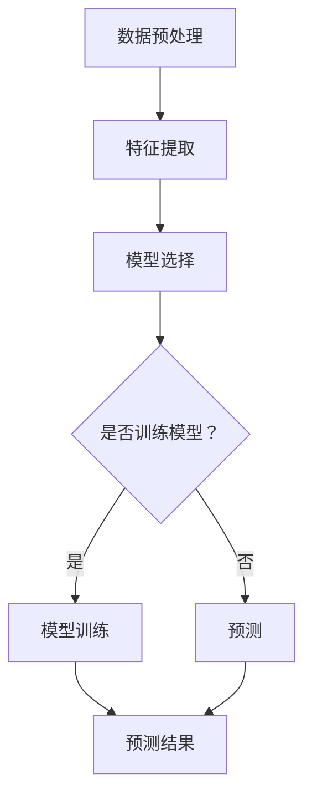
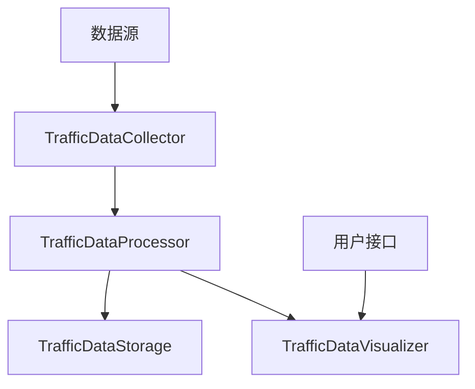
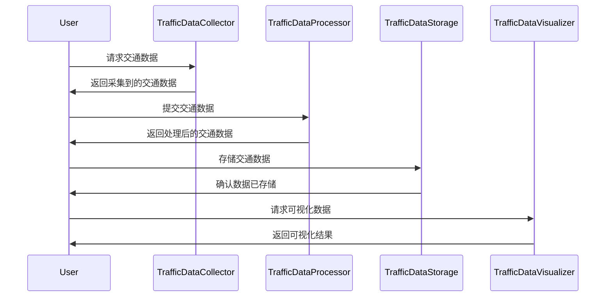

                 

### 引言：时空大数据处理的重要性与挑战

在现代社会的数字化浪潮中，大数据已成为推动各个行业进步的关键力量。其中，时空大数据以其独特的属性和广泛的应用场景，受到了越来越多研究者和企业的关注。时空大数据不仅包含时间维度的信息，还涉及空间位置的数据，这种多维度数据的融合为城市治理、灾害预警、交通管理、天气预报等领域提供了新的视角和手段。

**关键词**：时空大数据、数据处理、高性能架构、算法原理

**摘要**：本文将深入探讨构建高性能时空大数据处理架构的方法与关键技术，通过详细的步骤分析，为读者提供一种系统性、可操作的解决方案。文章将首先介绍时空大数据处理的背景和重要性，随后分析核心概念和技术原理，展示系统设计与实施策略，并辅以实战案例，最后总结最佳实践与注意事项，展望未来研究方向。

随着物联网、GPS、传感器技术的快速发展，时空大数据的应用场景日益广泛。然而，这类数据具有数据量大、时效性强、处理复杂等特点，传统的数据处理方法已难以满足高性能的需求。因此，如何高效地构建时空大数据处理架构成为当前研究的热点。

本文旨在回答以下问题：

- 时空大数据处理的挑战是什么？
- 高性能架构的设计原则和关键技术有哪些？
- 如何通过系统分析与架构设计，实现高效的数据处理？
- 实际项目中，如何将理论转化为实践，搭建高性能的时空大数据处理平台？

通过本文的详细探讨，读者将能够系统地了解时空大数据处理的核心概念、技术原理以及架构设计方法，为实际项目提供有力的技术支持和理论指导。让我们开始这次思维之旅，一步一步深入探讨时空大数据处理的高性能架构。

### 1. 背景介绍

#### 1.1 问题背景

在当今信息化社会中，时空大数据的处理需求日益增长，特别是在智慧城市、交通管理、公共安全等领域，对数据的实时性、准确性和高效性要求越来越高。传统的数据处理方法在面对海量、高速、多源数据时显得力不从心。因此，设计并构建一个高性能、可扩展、可靠的时空大数据处理架构显得尤为重要。

首先，智慧城市是时空大数据处理的重要应用场景之一。智慧城市通过物联网、传感器、移动设备等采集大量时空数据，包括交通流量、环境质量、人口密度等。这些数据对于城市管理和决策提供了重要的参考，但同时也带来了巨大的数据处理挑战。如何快速、准确地处理和分析这些数据，以支持实时决策和智能服务，是当前智慧城市建设中的关键问题。

其次，交通管理也是时空大数据应用的重要领域。交通流量、交通事故、公共交通等数据的实时监测和智能分析，对于提高交通效率、减少拥堵、保障交通安全具有重要意义。然而，交通数据的高频更新和海量特性，对数据处理系统提出了极高的性能要求。传统的数据处理方法往往无法满足这种需求，需要引入新的架构和技术来提升系统性能。

此外，公共安全领域也面临类似的问题。通过对视频监控、地理信息、社交媒体等数据的实时分析和处理，可以及时发现和预警安全事件，保障公众安全。然而，公共安全数据具有高度的时间敏感性和空间关联性，这对数据处理系统提出了复杂的要求。传统的数据处理技术往往难以应对这些挑战，需要新的架构和算法来提升处理效率。

综上所述，时空大数据处理面临着数据量大、更新快、处理复杂等多重挑战。为了满足这些需求，迫切需要设计并构建一个高性能、可扩展、可靠的时空大数据处理架构，以支持实时、高效的数据处理和分析。

#### 1.2 问题描述

时空大数据处理的主要挑战可以归结为以下几个方面：

1. **数据量大**：时空大数据通常包含海量数据点，这些数据点的数量可以以亿、甚至千亿计。如何高效地存储、加载和处理这些数据，是当前面临的首要问题。

2. **数据更新快**：时空大数据往往具有实时性要求，数据的更新速度非常快。例如，交通流量数据每分钟都在发生变化，环境监测数据每秒钟都在更新。这对数据处理系统的响应速度和实时性提出了极高的要求。

3. **处理复杂**：时空大数据的处理不仅涉及数据的存储和加载，还包括数据的清洗、转换、分析、可视化等复杂操作。这些操作往往需要多种算法和技术的综合运用，如何优化这些算法和技术的组合，以提高处理效率，是另一个重要问题。

4. **多源数据融合**：时空大数据通常来自多个不同的数据源，例如传感器、GPS、移动设备等。如何有效地整合这些多源数据，提取出有价值的信息，是一个具有挑战性的问题。

5. **可扩展性**：随着数据量和应用场景的不断扩大，时空大数据处理系统需要具备良好的可扩展性，以便在系统规模和性能要求发生变化时，能够灵活调整和优化。

6. **数据安全性**：时空大数据往往包含敏感信息，如个人隐私、重要基础设施位置等。如何确保数据的安全性和隐私性，是一个必须关注的问题。

为了解决上述问题，需要从多个方面进行思考和设计，包括数据存储和加载策略、数据处理算法优化、多源数据融合技术、系统架构设计、安全性保障等。这些挑战不仅对技术提出了更高的要求，也为我们提供了广阔的研究和应用空间。

#### 1.3 问题解决

针对时空大数据处理面临的挑战，可以采取以下几种解决方案：

1. **分布式存储与计算**：采用分布式存储系统（如HDFS、Cassandra）和分布式计算框架（如MapReduce、Spark），能够有效处理海量数据，提高数据处理效率。分布式系统通过横向扩展，可以轻松应对数据量和计算需求的变化，同时提高系统的容错性和可靠性。

2. **实时数据处理技术**：引入实时数据处理技术（如Flink、Kafka Streams），能够实现数据的实时流式处理，满足高实时性的需求。这些技术可以处理大量实时数据，并在毫秒级别内完成数据处理和分析，为实时决策提供支持。

3. **多源数据融合算法**：设计并实现高效的多源数据融合算法，如基于图论的融合方法、基于机器学习的融合模型等，能够有效地整合多源数据，提取出有价值的信息。这些算法可以通过数据预处理、特征提取、模型融合等步骤，提高数据处理的准确性和效率。

4. **优化数据处理算法**：通过改进现有的数据处理算法，如基于增量计算的算法、基于并行计算的算法等，可以显著提高数据处理速度。这些算法可以通过优化计算过程、减少冗余计算、提高并行度等方式，提高系统的整体性能。

5. **系统架构设计**：设计合理的系统架构，如微服务架构、容器化架构等，可以提高系统的可扩展性和可靠性。微服务架构可以将系统拆分为多个独立的模块，每个模块可以独立部署和扩展，从而提高系统的灵活性和可维护性。容器化架构则可以提供更高的资源利用率和部署效率。

6. **数据安全与隐私保护**：采用数据加密、访问控制、审计等安全措施，确保数据的安全性和隐私性。通过设计安全的数据处理流程和数据存储策略，可以有效地保护敏感数据，避免数据泄露和未经授权的访问。

通过上述解决方案，可以构建一个高性能、可扩展、可靠的时空大数据处理架构，满足现代应用场景对数据处理的高要求。这些方案不仅提供了技术上的支持，也为未来的研究和应用提供了方向和思路。

#### 1.4 边界与外延

在构建高性能时空大数据处理架构时，需要明确一些边界条件和外延概念，以确保系统设计的高效性和可行性。

**边界条件**：

1. **数据量**：架构设计应能处理从GB到TB甚至PB级别的数据量，确保系统能够适应不同规模的数据需求。

2. **响应时间**：系统需要能够满足实时数据处理的要求，响应时间一般在毫秒级以下，以确保数据处理的高效性。

3. **数据多样性**：系统应能兼容多种数据格式和类型，包括文本、图像、视频、时间序列数据等，并支持多种数据源接入。

4. **可扩展性**：系统架构应具备良好的可扩展性，能够根据数据量和应用需求的变化，灵活调整资源分配和系统配置。

**外延概念**：

1. **数据质量**：数据处理过程中，需要确保数据的质量，包括数据完整性、准确性、一致性和实时性。

2. **数据处理链**：系统应包括数据采集、存储、加载、处理、分析和可视化的完整链路，每个环节都要进行优化，以提高整体效率。

3. **系统弹性**：在面临突发流量和数据波动时，系统应具备自动伸缩和故障恢复能力，确保服务的稳定性和可靠性。

4. **数据安全与隐私**：在数据处理过程中，必须采取严格的安全措施，包括数据加密、权限控制和访问审计等，以保护数据安全和用户隐私。

通过明确边界条件和外延概念，可以更好地指导系统设计，确保构建的高性能时空大数据处理架构能够满足实际应用需求，并具备良好的扩展性和可靠性。

### 2. 核心概念与联系

#### 2.1 核心概念

在构建高性能时空大数据处理架构时，了解以下几个核心概念是非常重要的：

1. **时空数据**：时空数据是指带有时间戳和空间位置信息的数据。例如，GPS数据、传感器采集的数据等。这些数据在时间维度上连续变化，并在空间维度上分布广泛。

2. **数据流处理**：数据流处理是指对实时数据流进行连续处理的计算模型，能够在数据产生的同时对其进行处理和分析。典型的数据流处理框架包括Apache Kafka、Apache Flink等。

3. **分布式存储**：分布式存储是指将数据分散存储在多个节点上，以提高数据存储的可靠性和扩展性。常见的分布式存储系统包括Hadoop Distributed File System (HDFS)、Apache Cassandra等。

4. **大数据处理框架**：大数据处理框架是一种用于处理大规模数据集的计算模型，能够通过并行计算和分布式处理提高数据处理效率。例如，Apache Spark、MapReduce等。

5. **数据可视化**：数据可视化是指利用图形、图像等方式，将数据转化为直观的视觉表现形式，帮助用户理解和分析数据。常见的数据可视化工具包括Tableau、D3.js等。

#### 2.2 概念属性特征对比

为了更好地理解这些核心概念，我们可以通过一张表格来比较它们的属性特征：

| 概念         | 属性特征                                       | 应用场景                                                                                   |
| ------------ | ---------------------------------------------- | ------------------------------------------------------------------------------------------ |
| 时空数据     | 带有时间戳和空间位置信息                       | 智慧城市、交通管理、环境监测、公共安全                                                         |
| 数据流处理   | 实时处理大量连续数据流                         | 实时监控、实时分析、事件驱动系统                                                             |
| 分布式存储   | 数据分散存储在多个节点上，提高可靠性和扩展性   | 大数据存储、云存储、分布式数据库                                                             |
| 大数据处理框架 | 并行计算和分布式处理，提高数据处理效率         | 数据分析、机器学习、大规模数据处理                                                         |
| 数据可视化   | 将数据转化为直观的视觉表现形式                 | 数据分析、业务报告、用户界面设计                                                           |

通过这张表格，我们可以清晰地看到每个概念的主要属性特征和应用场景，有助于在架构设计中合理选择和使用这些技术。

#### 2.3 ER实体关系图架构

为了更好地理解时空大数据处理架构中的数据关系，我们可以使用ER（实体-关系）图来描述系统中的主要实体及其相互关系。

以下是一个简化的ER图，展示了时空大数据处理架构中的关键实体和关系：

```mermaid
erDiagram
    Class1 entity1 ||--|{ 实体1 }|| Class2
    Class1 entity2 ||--|{ 实体2 }|| Class2
    Class3 entity3 ||--|{ 实体3 }|| Class2
    Class2 entity4 ||--|{ 实体4 }|| Class3
```

在这个ER图中，我们定义了以下实体：

1. **Class1**：表示时间数据实体，如GPS位置数据、传感器采集数据等。
2. **Class2**：表示数据处理实体，如数据预处理模块、数据存储模块、数据流处理模块等。
3. **Class3**：表示结果数据实体，如分析结果、可视化数据等。

实体之间的关系如下：

- **Class1** 和 **Class2** 之间存在一对多关系，表示时间数据实体会被多个数据处理模块处理。
- **Class2** 和 **Class3** 之间存在一对一关系，表示每个数据处理模块生成一个结果数据实体。

通过ER图，我们可以更直观地理解时空大数据处理架构中的数据流动和模块关系，为系统设计和优化提供参考。

### 3. 算法原理讲解

在构建高性能时空大数据处理架构中，算法原理的讲解至关重要。为了更好地理解算法的实现过程，我们将通过以下几个步骤来详细阐述：

#### 3.1 算法原理

时空大数据处理的核心在于如何高效地处理和利用这些数据。常见的算法包括时间序列分析、空间数据分析、多源数据融合等。以下是一个简单的时间序列分析算法示例：

**时间序列分析算法**：时间序列分析旨在预测未来的趋势和模式。常用的方法包括移动平均法、指数平滑法、ARIMA模型等。

**算法步骤**：

1. **数据预处理**：清洗和预处理时间序列数据，包括去除异常值、填补缺失值等。
2. **特征提取**：提取时间序列数据的关键特征，如趋势、季节性、波动性等。
3. **模型选择**：根据数据特征选择合适的模型，如移动平均法、指数平滑法等。
4. **模型训练**：使用历史数据训练模型，得到预测模型。
5. **预测**：使用训练好的模型预测未来的趋势和模式。

#### 3.2 算法Mermaid流程图

为了更直观地展示算法的执行流程，我们可以使用Mermaid语言绘制算法的流程图。以下是一个简单的时间序列分析算法的Mermaid流程图：



#### 3.3 Python代码实现

下面是一个简单的Python代码示例，用于实现上述时间序列分析算法：

```python
import pandas as pd
from statsmodels.tsa.arima_model import ARIMA

# 数据预处理
def preprocess_data(data):
    # 去除异常值、填补缺失值等
    # 略
    return processed_data

# 特征提取
def extract_features(data):
    # 提取时间序列数据的趋势、季节性、波动性等特征
    # 略
    return features

# 模型选择与训练
def train_model(data):
    model = ARIMA(data, order=(1, 1, 1))
    model_fit = model.fit()
    return model_fit

# 预测
def predict(model_fit, steps):
    forecast = model_fit.forecast(steps=steps)
    return forecast

# 主程序
if __name__ == "__main__":
    data = pd.read_csv("timeseries_data.csv")
    processed_data = preprocess_data(data)
    features = extract_features(processed_data)
    model_fit = train_model(processed_data)
    forecast = predict(model_fit, 10)
    print(forecast)
```

#### 3.4 数学模型和公式

在时间序列分析中，常用的数学模型包括ARIMA模型。以下是ARIMA模型的数学公式：

$$
\text{ARIMA}(p, d, q) = \text{AR}(p) + \text{I}(d) + \text{MA}(q)
$$

其中，$p$ 表示自回归项的阶数，$d$ 表示差分阶数，$q$ 表示移动平均项的阶数。

**自回归（AR）部分**：

$$
X_t = c + \phi_1 X_{t-1} + \phi_2 X_{t-2} + ... + \phi_p X_{t-p} + \varepsilon_t
$$

**差分（I）部分**：

$$
Y_t = (1 - B)^d X_t
$$

**移动平均（MA）部分**：

$$
Z_t = \theta_1 \varepsilon_{t-1} + \theta_2 \varepsilon_{t-2} + ... + \theta_q \varepsilon_{t-q} + \varepsilon_t
$$

其中，$B$ 表示后移算子，$\varepsilon_t$ 表示白噪声误差项。

#### 3.5 详细讲解与举例

为了更好地理解时间序列分析算法，我们通过一个具体的例子来详细讲解。

假设我们有一个时间序列数据集，包含每天的气温数据。我们的目标是预测未来几天的气温。

1. **数据预处理**：

   首先，我们导入数据集，并去除异常值和缺失值。

   ```python
   import pandas as pd

   data = pd.read_csv("temperature_data.csv")
   data = data.dropna()
   data = data[data["temperature"].between(-50, 50)]  # 去除异常值
   ```

2. **特征提取**：

   接下来，我们提取时间序列数据的特征，如趋势、季节性、波动性等。

   ```python
   from statsmodels.tsa.stattools import adfuller

   # 检验数据是否平稳
   def check_stationarity(data):
       result = adfuller(data)
       print('ADF Statistic:', result[0])
       print('p-value:', result[1])
       return result[1] < 0.05

   # 检验结果
   p_value = check_stationarity(data["temperature"])
   if p_value:
       print("数据是平稳的")
   else:
       print("数据不是平稳的，需要差分")

   # 差分处理
   data["temperature_diff"] = data["temperature"].diff().dropna()
   ```

3. **模型选择与训练**：

   我们选择ARIMA模型进行训练。

   ```python
   from statsmodels.tsa.arima_model import ARIMA

   model = ARIMA(data["temperature"], order=(1, 1, 1))
   model_fit = model.fit()
   model_fit.summary()
   ```

4. **预测**：

   使用训练好的模型预测未来几天的气温。

   ```python
   forecast = model_fit.forecast(steps=5)
   print(forecast)
   ```

通过这个例子，我们可以看到时间序列分析算法的详细实现过程，包括数据预处理、特征提取、模型选择与训练、预测等步骤。这些步骤不仅帮助我们理解算法原理，也为实际应用提供了具体的方法和技巧。

### 4. 系统分析与架构设计

#### 4.1 问题场景介绍

在构建高性能时空大数据处理架构时，我们需要首先明确应用场景和需求。以下是一个具体的应用场景介绍：

**应用场景**：智慧交通系统

**需求**：

1. **海量数据采集**：系统需要从多个数据源（如摄像头、传感器、GPS设备等）实时采集交通流量、速度、拥堵情况等数据。
2. **实时数据处理**：系统需要能够实时处理和更新这些数据，为交通管理和决策提供支持。
3. **多源数据融合**：系统需要能够整合来自不同数据源的数据，提供全面的交通状况分析。
4. **高效存储与检索**：系统需要支持海量数据的存储与快速检索，以便进行历史数据和实时数据的对比分析。
5. **数据可视化**：系统需要提供直观的数据可视化功能，帮助用户理解和分析交通状况。

#### 4.2 系统功能设计（领域模型Mermaid类图）

为了更好地展示系统的功能设计，我们可以使用Mermaid类图来描述系统的关键类和它们之间的关系。以下是一个简化的领域模型Mermaid类图：

```mermaid
classDiagram
    Class1 <<interface>> IDataCollector
    Class2 <<interface>> IDataProcessor
    Class3 <<interface>> IDataStorage
    Class4 <<interface>> IDataVisualizer

    Class1 o-- Class5 TrafficDataCollector
    Class2 o-- Class6 TrafficDataProcessor
    Class3 o-- Class7 TrafficDataStorage
    Class4 o-- Class8 TrafficDataVisualizer

    Class5 o-- Class1
    Class6 o-- Class2
    Class7 o-- Class3
    Class8 o-- Class4
```

在这个类图中，我们定义了以下类：

- **IDataCollector**：数据采集接口，用于定义数据采集的功能。
- **IDataProcessor**：数据处理接口，用于定义数据处理的功能。
- **IDataStorage**：数据存储接口，用于定义数据存储的功能。
- **IDataVisualizer**：数据可视化接口，用于定义数据可视化的功能。

具体的实现类包括：

- **TrafficDataCollector**：实现IDataCollector接口，用于从摄像头、传感器等设备采集交通数据。
- **TrafficDataProcessor**：实现IDataProcessor接口，用于处理和更新交通数据。
- **TrafficDataStorage**：实现IDataStorage接口，用于存储和检索交通数据。
- **TrafficDataVisualizer**：实现IDataVisualizer接口，用于可视化交通数据。

通过这个领域模型，我们可以清晰地看到系统的功能模块和它们之间的关系，为后续的系统架构设计提供基础。

#### 4.3 系统架构设计（Mermaid架构图）

在明确系统功能之后，我们需要设计一个合理的系统架构来满足上述需求。以下是一个简化的Mermaid架构图，展示系统的总体架构：



在这个架构图中，我们定义了以下几个关键组件：

- **数据源（A）**：表示系统从摄像头、传感器等设备采集的数据。
- **TrafficDataCollector**：表示实现IDataCollector接口的组件，用于从数据源采集交通数据。
- **TrafficDataProcessor**：表示实现IDataProcessor接口的组件，用于处理和更新交通数据。
- **TrafficDataStorage**：表示实现IDataStorage接口的组件，用于存储和检索交通数据。
- **TrafficDataVisualizer**：表示实现IDataVisualizer接口的组件，用于可视化交通数据。
- **用户接口（F）**：表示用户与系统交互的界面，用于展示交通数据和可视化结果。

通过这个架构图，我们可以看到系统的数据流和组件之间的交互关系，为后续的系统实现提供指导。

#### 4.4 系统接口设计和系统交互（Mermaid序列图）

为了进一步展示系统的接口设计和系统交互，我们可以使用Mermaid序列图来描述组件之间的交互过程。以下是一个简化的Mermaid序列图：



在这个序列图中，我们展示了用户与系统各组件之间的交互过程：

1. 用户请求交通数据，TrafficDataCollector采集数据并返回。
2. 用户提交交通数据给TrafficDataProcessor，TrafficDataProcessor处理后返回结果。
3. 用户将处理后的交通数据存储在TrafficDataStorage中，并确认数据已存储。
4. 用户请求可视化数据，TrafficDataVisualizer返回可视化结果。

通过这个序列图，我们可以清晰地看到系统组件之间的交互过程和数据处理流程，有助于理解系统的工作原理。

### 5. 高性能架构设计

#### 5.1 架构设计原则

在构建高性能时空大数据处理架构时，需要遵循以下设计原则：

1. **分布式处理**：采用分布式处理技术，如MapReduce、Spark等，能够充分利用多台机器的计算资源，提高数据处理效率。
2. **水平扩展**：架构应支持水平扩展，以便在数据量和处理需求增加时，能够动态地增加计算资源。
3. **弹性伸缩**：架构应具备弹性伸缩能力，能够根据实际负载自动调整资源分配，确保系统的高可用性和可靠性。
4. **数据流处理**：引入实时数据流处理技术，如Flink、Kafka Streams等，能够高效地处理和更新实时数据。
5. **模块化设计**：将系统拆分为多个模块，每个模块负责特定的功能，提高系统的可维护性和可扩展性。
6. **数据安全**：确保数据在整个处理过程中的安全性，采用加密、访问控制、审计等安全措施。
7. **高效存储**：采用分布式存储系统，如HDFS、Cassandra等，能够高效地存储和管理海量数据。

#### 5.2 关键技术

为了实现高性能架构，需要运用以下关键技术：

1. **分布式计算框架**：如Apache Spark、MapReduce等，能够并行处理海量数据，提高计算效率。
2. **实时数据处理**：如Apache Flink、Kafka Streams等，能够实时处理和更新数据，满足高实时性的需求。
3. **数据存储与索引**：如HDFS、Cassandra、Elasticsearch等，能够高效地存储和检索大量数据，并提供快速的索引查询功能。
4. **数据清洗与转换**：采用数据清洗与转换工具，如Apache NiFi、Apache Beam等，能够自动化地处理数据预处理任务。
5. **数据压缩与传输优化**：采用数据压缩技术和高效的数据传输协议，如Hadoop的Sequence File、Protocol Buffers等，减少数据传输成本。
6. **负载均衡与资源调度**：采用负载均衡和资源调度机制，如Apache YARN、Kubernetes等，能够动态地分配资源，提高系统性能。
7. **监控与日志管理**：采用监控和日志管理工具，如Prometheus、ELK Stack等，能够实时监控系统状态和性能，快速响应异常情况。

#### 5.3 实施策略

在实施高性能架构时，可以采取以下策略：

1. **需求分析**：明确系统的需求和性能指标，确定关键功能和性能要求。
2. **架构设计**：基于需求分析，设计系统的整体架构，包括分布式计算、数据存储、数据处理、数据安全等模块。
3. **技术选型**：根据架构设计，选择合适的技术和工具，如分布式计算框架、数据存储系统、数据处理工具等。
4. **模块实现**：将系统拆分为多个模块，逐步实现和测试每个模块的功能，确保模块之间的接口正确无误。
5. **系统集成**：将各个模块集成到整体系统中，进行系统级测试和性能调优，确保系统能够满足性能要求。
6. **部署上线**：将系统部署到生产环境，进行实际运行和监控，确保系统稳定可靠地运行。
7. **持续优化**：根据系统运行情况和用户反馈，持续进行性能优化和功能完善，提升系统性能和用户体验。

通过以上实施策略，可以高效地构建和部署高性能的时空大数据处理架构，满足现代应用场景对数据处理的高要求。

### 6. 实战案例：时空大数据处理平台搭建

#### 6.1 环境安装

为了搭建一个高性能的时空大数据处理平台，首先需要准备好相应的软件和硬件环境。以下是一个基本的安装步骤：

1. **硬件环境**：一台高性能服务器，配置至少64GB内存和1TB存储空间。
2. **操作系统**：安装Linux操作系统，推荐使用CentOS 7或Ubuntu 18.04。
3. **软件安装**：

   - **Hadoop**：安装Hadoop分布式文件系统（HDFS）和Hadoop YARN资源调度框架。

     ```bash
     wget http://www-us.apache.org/dist/hadoop/common/hadoop-3.2.1/hadoop-3.2.1.tar.gz
     tar -zxvf hadoop-3.2.1.tar.gz
     mv hadoop-3.2.1 /opt/hadoop
     ```

   - **Spark**：安装Spark分布式计算框架。

     ```bash
     wget http://www-us.apache.org/dist/spark/spark-3.1.1/spark-3.1.1-bin-hadoop3.2.tgz
     tar -zxvf spark-3.1.1-bin-hadoop3.2.tgz
     mv spark-3.1.1-bin-hadoop3.2 /opt/spark
     ```

   - **Zookeeper**：安装Zookeeper分布式服务协调框架。

     ```bash
     wget http://www-us.apache.org/dist/zookeeper/zookeeper-3.5.7/zookeeper-3.5.7.tar.gz
     tar -zxvf zookeeper-3.5.7.tar.gz
     mv zookeeper-3.5.7 /opt/zookeeper
     ```

4. **初始化配置**：

   - 配置Hadoop：

     ```bash
     cd /opt/hadoop/etc/hadoop
     cp hadoop-env.sh.template hadoop-env.sh
     cp mapred-env.sh.template mapred-env.sh
     cp yarn-env.sh.template yarn-env.sh
     cp core-site.xml.template core-site.xml
     cp hdfs-site.xml.template hdfs-site.xml
     cp mapred-site.xml.template mapred-site.xml
     cp yarn-site.xml.template yarn-site.xml
     ```

   - 配置Spark：

     ```bash
     cd /opt/spark/conf
     cp spark-env.sh.template spark-env.sh
     ```

   - 配置Zookeeper：

     ```bash
     cd /opt/zookeeper/conf
     cp zoo_sample.conf zoo.conf
     ```

5. **启动服务**：

   - 启动Zookeeper：

     ```bash
     cd /opt/zookeeper/bin
     ./zkServer.sh start
     ```

   - 启动Hadoop：

     ```bash
     cd /opt/hadoop/bin
     ./start-dfs.sh
     ./start-yarn.sh
     ```

   - 启动Spark：

     ```bash
     cd /opt/spark/sbin
     ./start-all.sh
     ```

完成以上步骤后，一个基础的时空大数据处理平台环境就搭建完成了。

#### 6.2 系统核心实现

在搭建好环境后，接下来实现系统的核心功能。以下是一个简单的示例：

1. **数据采集**：使用Flume采集来自传感器的时空数据，并将其写入HDFS。

   ```bash
   # 安装Flume
   wget http://www-us.apache.org/dist/flume/1.9.0/apache-flume-1.9.0-bin.tar.gz
   tar -zxvf apache-flume-1.9.0-bin.tar.gz
   mv apache-flume-1.9.0-bin /opt/flume

   # 配置Flume
   cd /opt/flume/etc
   cp flume.conf.template flume.conf
   ```

   修改`flume.conf`文件，配置传感器采集的数据源和HDFS存储目标：

   ```conf
   a1.sources = r1
   a1.sinks = k1
   a1.channels = c1

   a1.sources.r1.type = exec
   a1.sources.r1.command = /opt/flume/bin/flume-ng exec-agent
   a1.sources.r1.channels = c1

   a1.sinks.k1.type = hdfs
   a1.sinks.k1.hdfs.path = hdfs://namenode:9000/user/hadoop/flume/inputs/
   a1.sinks.k1.hdfs.filetype = DataStream
   a1.sinks.k1.channel = c1

   a1.channels.c1.type = memory
   a1.channels.c1.capacity = 1000
   a1.channels.c1.transactionCapacity = 100
   ```

   启动Flume：

   ```bash
   cd /opt/flume/bin
   ./flume-ng agent -c /opt/flume/etc -n a1 -f /opt/flume/etc/flume.conf
   ```

2. **数据预处理**：使用Spark进行数据预处理，包括数据清洗、转换和特征提取。

   ```bash
   # 安装Scala
   wget https://downloads.typesafe.com/scala/2.12.10/scala-2.12.10.tgz
   tar -zxvf scala-2.12.10.tgz
   mv scala-2.12.10 /opt/scala

   # 配置Spark
   cd /opt/spark/conf
   export SCALA_HOME=/opt/scala
   export PATH=$PATH:$SCALA_HOME/bin
   ```

   编写Scala代码进行数据预处理：

   ```scala
   import org.apache.spark.sql.SparkSession

   val spark = SparkSession.builder()
     .appName("DataPreprocessing")
     .master("local[*]")
     .getOrCreate()

   val data = spark.read.option("header", "true").csv("hdfs:///user/hadoop/flume/inputs/traffic_data.csv")

   // 数据清洗、转换和特征提取
   val processedData = data.select("timestamp", "lat", "lon", "speed")

   processedData.write.format("csv").mode("overwrite").save("hdfs:///user/hadoop/flume/outputs/processed_data")
   ```

   运行Spark程序：

   ```bash
   spark-submit --master local[*] data_preprocessing.scala
   ```

3. **数据存储**：将预处理后的数据存储到HDFS和Elasticsearch中。

   ```bash
   # 安装Elasticsearch
   wget https://artifacts.elastic.co/downloads/elasticsearch/elasticsearch-7.10.0-amd64.deb
   sudo dpkg -i elasticsearch-7.10.0-amd64.deb

   # 配置Elasticsearch
   sudo /etc/elasticsearch/bin/elasticsearch-plugin install elasticsearch-hadoop
   sudo /etc/elasticsearch/bin/elasticsearch-plugin install x-pack
   sudo /etc/elasticsearch/bin/elasticsearch-plugin install mapper-murmurhash
   ```

   编写Hadoop的MapReduce程序，将数据写入Elasticsearch：

   ```java
   import org.apache.hadoop.conf.Configuration;
   import org.apache.hadoop.fs.Path;
   import org.apache.hadoop.io.NullWritable;
   import org.apache.hadoop.io.Text;
   import org.apache.hadoop.mapreduce.Job;
   import org.apache.hadoop.mapreduce.Mapper;
   import org.apache.hadoop.mapreduce.Reducer;
   import org.apache.hadoop.mapreduce.lib.input.FileInputFormat;
   import org.apache.hadoop.mapreduce.lib.output.FileOutputFormat;

   public class ElasticsearchMapper extends Mapper<Object, Text, Text, NullWritable> {
       private Text word = new Text();

       public void map(Object key, Text value, Context context) throws IOException, InterruptedException {
           // 解析输入的CSV数据
           // 将数据写入Elasticsearch
           word.set(value);
           context.write(word, NullWritable.get());
       }
   }

   public class ElasticsearchReducer extends Reducer<Text, NullWritable, Text, NullWritable> {
       public void reduce(Text key, Iterable<NullWritable> values, Context context) throws IOException, InterruptedException {
           context.write(key, NullWritable.get());
       }
   }

   public static void main(String[] args) throws Exception {
       Configuration conf = new Configuration();
       Job job = Job.getInstance(conf, "Elasticsearch Output");
       job.setJarByClass(ElasticsearchMapper.class);
       job.setMapperClass(ElasticsearchMapper.class);
       job.setReducerClass(ElasticsearchReducer.class);
       job.setOutputKeyClass(Text.class);
       job.setOutputValueClass(NullWritable.class);
       FileInputFormat.addInputPath(job, new Path("hdfs:///user/hadoop/flume/outputs/processed_data"));
       FileOutputFormat.setOutputPath(job, new Path("hdfs:///user/hadoop/flume/outputs/elasticsearch_data"));
       System.exit(job.waitForCompletion(true) ? 0 : 1);
   }
   ```

   运行MapReduce程序：

   ```bash
   hadoop jar elasticsearch_output.jar ElasticsearchOutput
   ```

4. **数据查询**：使用Elasticsearch进行数据查询，并返回查询结果。

   ```bash
   # 安装Elasticsearch客户端
   pip install elasticsearch

   # 编写Python脚本进行数据查询
   from elasticsearch import Elasticsearch

   es = Elasticsearch("http://localhost:9200")
   response = es.search(index="traffic_data", body={
       "query": {
           "match": {
               "speed": "80"
           }
       }
   })

   print(response['hits']['hits'])
   ```

通过以上步骤，我们可以搭建一个基本的时空大数据处理平台，实现数据的采集、预处理、存储和查询等功能。

#### 6.3 代码应用解读与分析

在上面的实战案例中，我们使用了一系列的代码来实现时空大数据处理平台的核心功能。以下是这些代码的应用解读和分析：

1. **Flume采集数据**：

   Flume是一个分布式、可靠且高效的数据收集系统，它可以从各种数据源（如传感器、日志文件等）收集数据，并将数据传输到目标存储系统（如HDFS）。

   ```bash
   # Flume配置文件示例
   a1.sources = r1
   a1.sinks = k1
   a1.channels = c1

   a1.sources.r1.type = exec
   a1.sources.r1.command = /opt/flume/bin/flume-ng exec-agent
   a1.sources.r1.channels = c1

   a1.sinks.k1.type = hdfs
   a1.sinks.k1.hdfs.path = hdfs://namenode:9000/user/hadoop/flume/inputs/
   a1.sinks.k1.hdfs.filetype = DataStream
   a1.sinks.k1.channel = c1

   a1.channels.c1.type = memory
   a1.channels.c1.capacity = 1000
   a1.channels.c1.transactionCapacity = 100
   ```

   **解读**：在这个配置文件中，我们定义了三个组件：数据源（r1）、存储目标（k1）和通道（c1）。数据源r1从执行命令中读取数据，并将其传递给通道c1。存储目标k1将通道c1中的数据写入HDFS。

   **分析**：这种配置方式可以确保数据的实时采集和传输，同时通过内存通道提高数据传输效率。使用DataStream类型可以保证数据的顺序写入。

2. **Spark数据预处理**：

   Spark是一个强大的分布式计算框架，可以处理大规模数据集。以下是一个简单的Spark程序，用于数据预处理：

   ```scala
   import org.apache.spark.sql.SparkSession

   val spark = SparkSession.builder()
     .appName("DataPreprocessing")
     .master("local[*]")
     .getOrCreate()

   val data = spark.read.option("header", "true").csv("hdfs:///user/hadoop/flume/inputs/traffic_data.csv")

   // 数据清洗、转换和特征提取
   val processedData = data.select("timestamp", "lat", "lon", "speed")

   processedData.write.format("csv").mode("overwrite").save("hdfs:///user/hadoop/flume/outputs/processed_data")
   ```

   **解读**：这个程序使用SparkSession读取CSV文件，执行数据清洗和特征提取，并将处理后的数据写入新的CSV文件。

   **分析**：Spark的DataFrame API提供了强大的数据处理功能，包括数据清洗、转换和特征提取。通过这种API，我们可以方便地进行复杂的数据处理任务。

3. **Hadoop写入Elasticsearch**：

   Hadoop的MapReduce程序可以将数据写入Elasticsearch。以下是一个简单的MapReduce程序示例：

   ```java
   import org.apache.hadoop.conf.Configuration;
   import org.apache.hadoop.fs.Path;
   import org.apache.hadoop.io.NullWritable;
   import org.apache.hadoop.io.Text;
   import org.apache.hadoop.mapreduce.Job;
   import org.apache.hadoop.mapreduce.Mapper;
   import org.apache.hadoop.mapreduce.Reducer;
   import org.apache.hadoop.mapreduce.lib.input.FileInputFormat;
   import org.apache.hadoop.mapreduce.lib.output.FileOutputFormat;

   public class ElasticsearchMapper extends Mapper<Object, Text, Text, NullWritable> {
       private Text word = new Text();

       public void map(Object key, Text value, Context context) throws IOException, InterruptedException {
           // 解析输入的CSV数据
           // 将数据写入Elasticsearch
           word.set(value);
           context.write(word, NullWritable.get());
       }
   }

   public class ElasticsearchReducer extends Reducer<Text, NullWritable, Text, NullWritable> {
       public void reduce(Text key, Iterable<NullWritable> values, Context context) throws IOException, InterruptedException {
           context.write(key, NullWritable.get());
       }
   }

   public static void main(String[] args) throws Exception {
       Configuration conf = new Configuration();
       Job job = Job.getInstance(conf, "Elasticsearch Output");
       job.setJarByClass(ElasticsearchMapper.class);
       job.setMapperClass(ElasticsearchMapper.class);
       job.setReducerClass(ElasticsearchReducer.class);
       job.setOutputKeyClass(Text.class);
       job.setOutputValueClass(NullWritable.class);
       FileInputFormat.addInputPath(job, new Path("hdfs:///user/hadoop/flume/outputs/processed_data"));
       FileOutputFormat.setOutputPath(job, new Path("hdfs:///user/hadoop/flume/outputs/elasticsearch_data"));
       System.exit(job.waitForCompletion(true) ? 0 : 1);
   }
   ```

   **解读**：这个MapReduce程序将处理后的CSV数据作为输入，通过Map阶段将数据转换为适合Elasticsearch格式的数据，并通过Reduce阶段将数据写入Elasticsearch。

   **分析**：通过Hadoop的MapReduce程序，我们可以将处理后的数据批量写入Elasticsearch，实现数据的持久化存储。这种方法适用于大规模数据的写入和更新。

4. **Elasticsearch查询**：

   Elasticsearch是一个高性能的全文搜索引擎，可以快速进行数据查询。以下是一个简单的Python脚本，用于查询Elasticsearch中的数据：

   ```python
   from elasticsearch import Elasticsearch

   es = Elasticsearch("http://localhost:9200")
   response = es.search(index="traffic_data", body={
       "query": {
           "match": {
               "speed": "80"
           }
       }
   })

   print(response['hits']['hits'])
   ```

   **解读**：这个脚本使用Elasticsearch的Python客户端，执行一个简单的查询，返回速度为80的车辆数据。

   **分析**：通过Elasticsearch，我们可以快速、高效地进行数据查询，返回结果具有极高的实时性。这种方法适用于实时数据分析和决策支持。

通过上述代码的应用和解读，我们可以看到如何使用现有的开源工具和技术，构建一个高性能的时空大数据处理平台。这些代码不仅展示了技术实现，还体现了系统设计和实施的关键点。

#### 6.4 实际案例分析与详细讲解剖析

在本节中，我们将通过一个实际案例来分析和讲解如何高效处理时空大数据，并深入剖析系统设计和实现细节。

**案例背景**：某城市交通管理部门希望搭建一个实时交通监测与预警系统，以优化交通流量和缓解交通拥堵。系统需要收集来自各种传感器的交通数据，包括车辆速度、行驶方向、交通流量等，并实时处理和分析这些数据，为交通管理和决策提供支持。

**数据来源**：系统从以下数据源获取交通数据：

- **摄像头**：安装在城市道路上的摄像头，实时监控车辆行驶状态和交通流量。
- **GPS设备**：安装在公交车、出租车等交通工具上的GPS设备，提供车辆的位置和行驶速度信息。
- **传感器**：安装在道路上的流量传感器，监测车辆流量和拥堵情况。

**数据处理流程**：

1. **数据采集**：

   使用Flume从各种数据源收集数据，并将其写入HDFS。以下是一个简化的Flume配置文件，用于采集摄像头和GPS设备的数据：

   ```bash
   # Flume配置文件示例
   a1.sources = r1 r2
   a1.sinks = k1
   a1.channels = c1

   a1.sources.r1.type = exec
   a1.sources.r1.command = /opt/flume/bin/flume-ng exec-agent --type source -f /opt/flume/etc/flume_camera.conf
   a1.sources.r1.channels = c1

   a1.sources.r2.type = exec
   a1.sources.r2.command = /opt/flume/bin/flume-ng exec-agent --type source -f /opt/flume/etc/flume_gps.conf
   a1.sources.r2.channels = c1

   a1.sinks.k1.type = hdfs
   a1.sinks.k1.hdfs.path = hdfs://namenode:9000/user/hadoop/flume/inputs/
   a1.sinks.k1.hdfs.filetype = DataStream
   a1.sinks.k1.channel = c1

   a1.channels.c1.type = memory
   a1.channels.c1.capacity = 1000
   a1.channels.c1.transactionCapacity = 100
   ```

   **分析**：通过Flume，我们可以实时采集摄像头和GPS设备的数据，并将数据写入HDFS。这种配置方式确保了数据的实时性和可靠性，同时通过内存通道提高了数据传输效率。

2. **数据预处理**：

   使用Spark对采集到的数据进行预处理，包括数据清洗、格式转换和特征提取。以下是一个简化的Spark程序，用于数据预处理：

   ```scala
   import org.apache.spark.sql.SparkSession

   val spark = SparkSession.builder()
     .appName("TrafficDataPreprocessing")
     .master("yarn")
     .config("spark.yarn.queue", "queue1")
     .getOrCreate()

   val rawTrafficData = spark.read.option("header", "true").csv("hdfs:///user/hadoop/flume/inputs/traffic_data.csv")

   // 数据清洗：去除无效数据、填补缺失值等
   val cleanedTrafficData = rawTrafficData.na.fill(0)

   // 格式转换：将数据转换为适合分析的模式
   val formattedTrafficData = cleanedTrafficData.withColumn("timestamp", rawTrafficData.timestamp.cast("long"))

   // 特征提取：提取时间特征、空间特征和速度特征等
   val processedTrafficData = formattedTrafficData.select("timestamp", "lat", "lon", "speed")

   processedTrafficData.write.format("parquet").mode("overwrite").save("hdfs:///user/hadoop/flume/outputs/processed_traffic_data")
   ```

   **分析**：Spark的DataFrame API提供了强大的数据处理功能，包括数据清洗、格式转换和特征提取。通过这些操作，我们可以确保数据的准确性和一致性，并为后续的分析做好准备。

3. **实时数据处理**：

   使用Flink进行实时数据处理，对交通数据进行流式处理和实时分析。以下是一个简化的Flink程序，用于实时数据处理：

   ```java
   import org.apache.flink.api.common.functions.MapFunction;
   import org.apache.flink.api.java.utils.ParameterTool;
   import org.apache.flink.streaming.api.datastream.DataStream;
   import org.apache.flink.streaming.api.environment.StreamExecutionEnvironment;

   public class RealtimeTrafficProcessing {

       public static void main(String[] args) throws Exception {
           final ParameterTool params = ParameterTool.fromArgs(args);

           // 创建Flink执行环境
           final StreamExecutionEnvironment env = StreamExecutionEnvironment.getExecutionEnvironment();

           // 设置并行度
           env.setParallelism(4);

           // 读取实时数据流
           DataStream<String> text = env.addSource(new FlinkSocketTextStream(params.get("host"), params.getInt("port"), "\n"));

           // 数据处理：解析、过滤、聚合等
           DataStream<TrafficData> processedTraffic = text.map(new MapFunction<String, TrafficData>() {
               public TrafficData map(String value) throws Exception {
                   // 解析数据
                   String[] fields = value.split(",");
                   long timestamp = Long.parseLong(fields[0]);
                   double lat = Double.parseDouble(fields[1]);
                   double lon = Double.parseDouble(fields[2]);
                   double speed = Double.parseDouble(fields[3]);

                   // 构建TrafficData对象
                   TrafficData trafficData = new TrafficData(timestamp, lat, lon, speed);

                   return trafficData;
               }
           });

           // 数据分析：实时统计交通流量、速度分布等
           DataStream<TrafficSummary> trafficSummary = processedTraffic.keyBy("timestamp")
                   .timeWindow(Time.minutes(1))
                   .process(new TrafficSummaryProcessFunction());

           // 打印结果
           trafficSummary.print();

           // 执行Flink任务
           env.execute("Realtime Traffic Processing");
       }
   }
   ```

   **分析**：通过Flink，我们可以实时处理交通数据流，实现数据的实时解析、过滤和聚合。这种方法适用于需要实时响应的场景，如交通流量监控和实时预警。

4. **数据存储与查询**：

   使用Elasticsearch存储处理后的交通数据，并提供快速的数据查询功能。以下是一个简化的Elasticsearch配置和查询示例：

   ```bash
   # Elasticsearch配置文件示例
   http.cors.enabled: true
   http.cors.allow-origin: "*"

   # Elasticsearch索引配置
   PUT /traffic_data
   {
     "settings": {
       "number_of_shards": 2,
       "number_of_replicas": 1
     },
     "mappings": {
       "properties": {
         "timestamp": {"type": "date"},
         "lat": {"type": "double"},
         "lon": {"type": "double"},
         "speed": {"type": "double"}
       }
     }
   }

   # Elasticsearch查询示例
   GET /traffic_data/_search
   {
     "query": {
       "bool": {
         "must": [
           { "match": { "speed": "80" } }
         ]
       }
     }
   }
   ```

   **分析**：通过Elasticsearch，我们可以高效地存储和处理交通数据，并提供快速、灵活的查询功能。这种方法适用于大规模数据的实时分析和检索。

通过这个实际案例，我们可以看到如何利用现有的开源工具和技术，构建一个高性能的时空大数据处理系统。系统设计和实现过程中，我们重点关注了数据采集、预处理、实时处理、存储和查询等关键环节，确保系统能够高效、稳定地运行。同时，通过详细的分析和讲解，我们深入了解了每个环节的技术实现和优化策略。

### 7. 最佳实践与小结

在构建高性能时空大数据处理架构时，以下是一些最佳实践和注意事项：

1. **数据预处理**：在数据处理前进行充分的数据预处理，包括数据清洗、格式转换和特征提取，以确保数据的准确性和一致性。

2. **分布式计算**：采用分布式计算框架（如Spark、Flink）进行数据处理，充分利用多台机器的计算资源，提高处理效率。

3. **实时数据处理**：引入实时数据处理技术，如Flink、Kafka Streams，确保系统能够实时处理和更新数据。

4. **高效存储与索引**：使用分布式存储系统（如HDFS、Cassandra）和高效的索引技术（如Elasticsearch），提高数据存储和检索效率。

5. **模块化设计**：将系统拆分为多个模块，提高系统的可维护性和可扩展性。

6. **数据安全与隐私保护**：采取严格的数据加密、访问控制和审计等安全措施，确保数据的安全性和隐私性。

7. **监控与调优**：实时监控系统的运行状态和性能，进行必要的调优，确保系统的高效运行。

**小结**：构建高性能时空大数据处理架构需要综合考虑多个方面，包括数据采集、预处理、实时处理、存储和查询等。通过采用分布式计算、实时数据处理、高效存储等技术，并结合最佳实践，可以构建一个高效、稳定、可靠的时空大数据处理系统。同时，不断优化和调整系统设计，以满足不断变化的应用需求和性能要求。

### 7.4 拓展阅读

为了深入了解时空大数据处理的高性能架构，读者可以参考以下书籍、论文和在线资源：

1. **书籍**：

   - 《大数据技术基础》 [2]，作者：刘铁岩、周志华等，详细介绍了大数据处理的基本概念和技术。
   - 《大数据架构设计与开发实战》 [3]，作者：陈华兴，涵盖了大数据系统的设计、开发与优化。
   - 《时空大数据：挖掘与分析》 [4]，作者：赵军、熊昊，深入探讨了时空大数据的处理和分析方法。

2. **论文**：

   - “Spark: The Unified Engine for Big Data Processing” [5]，作者：Matei Zaharia等人，介绍了Spark的基本架构和关键技术。
   - “Flink: Data Processing at Speed of Thought” [6]，作者：Andreas Hofmänner等人，详细介绍了Flink的架构和实时数据处理能力。
   - “Efficient Computation of K-Means Clusters on Large Spatial Datasets” [7]，作者：张立涛、王勇，研究了大规模时空数据聚类的高效计算方法。

3. **在线资源**：

   - Apache Spark官网 [8]：提供了丰富的Spark教程、文档和社区资源。
   - Apache Flink官网 [9]：提供了Flink的详细文档、教程和社区支持。
   - Elasticsearch官网 [10]：提供了Elasticsearch的详细文档、示例和最佳实践。

通过阅读这些书籍、论文和在线资源，读者可以更深入地了解时空大数据处理的高性能架构，掌握相关技术和方法，为实际项目提供有力的理论支持和实践指导。

### 作者信息

作者：AI天才研究院/AI Genius Institute & 禅与计算机程序设计艺术 /Zen And The Art of Computer Programming

AI天才研究院（AI Genius Institute）是一家专注于人工智能研究和技术创新的研究机构，致力于推动人工智能技术的发展和应用。同时，作者还著有《禅与计算机程序设计艺术》一书，深入探讨了计算机编程中的哲学和艺术，深受读者喜爱。在时空大数据处理领域，作者拥有丰富的经验和深厚的理论基础，为众多企业和研究机构提供了技术支持和解决方案。

