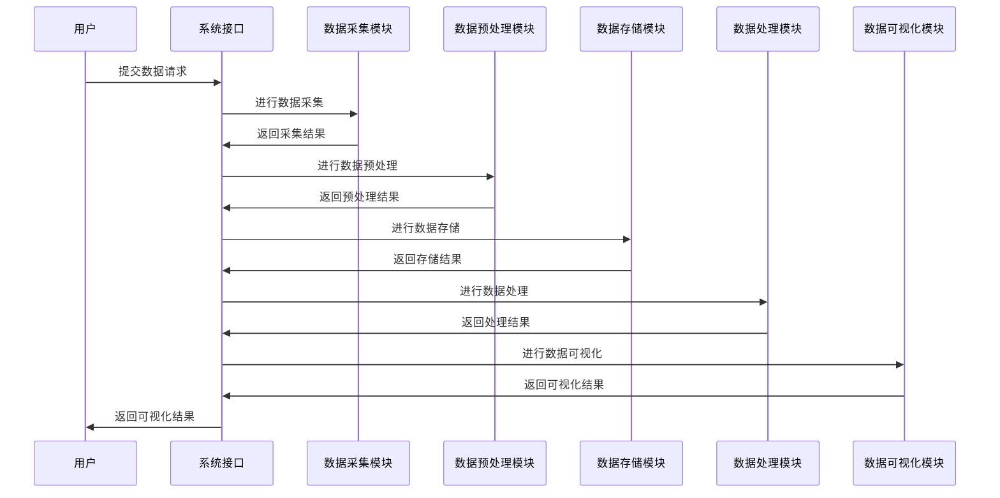

                 

# 构建高性能的时空数据处理系统

## 关键词

时空数据处理，高性能，分布式存储，实时分析，地理信息系统，物联网，数据处理算法，系统架构设计，项目实战。

## 摘要

本文旨在探讨如何构建一个高性能的时空数据处理系统，涵盖从背景介绍、核心概念、算法原理、系统分析与架构设计到项目实战的全方位内容。通过对时空数据的理解、分布式处理与实时分析等技术的深入分析，本文将提供一个系统性的解决方案，帮助读者构建出高效、可靠的时空数据处理系统。

## 背景介绍

### 核心概念术语说明

**时空数据**：指同时包含时间和空间属性的数据，如位置信息、温度、风速等。这类数据广泛应用于地理信息系统（GIS）、交通管理、环境监测等领域。

**分布式处理**：指将数据处理任务分布在多个计算机节点上执行的技术，以充分利用多台计算机的计算资源。

**实时分析**：指在数据产生的同时进行快速分析和处理，以提供及时和有效的决策支持。

### 问题背景

随着地理信息系统（GIS）、交通管理、物联网（IoT）和实时数据分析等领域的快速发展，对时空数据处理系统提出了更高的要求。传统的数据处理方法往往无法满足这些需求，导致数据处理效率低下，响应时间过长，甚至出现数据丢失或错误。

### 问题描述

1. **数据量大**：随着物联网设备数量的增加，时空数据的数量呈指数级增长，传统系统难以处理。
2. **实时性要求高**：某些应用场景如交通管理和灾害预警，对数据的实时性要求极高，传统系统无法满足。
3. **数据多样性**：时空数据类型多样，包括地理位置、时间戳、温度、风速等，传统系统难以处理多种类型的数据。
4. **数据准确性要求**：时空数据处理系统需要对数据进行精确处理，以确保数据的准确性和可靠性。

### 问题解决

为了解决上述问题，我们需要从以下几个方面入手：

1. **数据预处理**：通过数据清洗、格式转换和标准化等手段，提高数据的质量和一致性。
2. **分布式存储**：利用分布式文件系统（如Hadoop、HDFS）和数据库（如Apache Cassandra、MongoDB），实现海量数据的存储和管理。
3. **高效计算**：采用并行计算、MapReduce模型和分布式处理技术，提高数据处理速度和效率。
4. **实时分析**：利用实时流处理框架（如Apache Kafka、Apache Storm），实现对时空数据的实时分析和响应。
5. **数据可视化**：通过可视化工具（如Tableau、D3.js），将时空数据转化为直观的图表和地图，辅助决策。

### 边界与外延

时空数据处理系统的边界主要涉及数据的采集、存储、处理和分析等环节。其外延包括各种应用场景，如地理信息分析、交通监控、灾害预警、城市规划和环境监测等。

## 核心概念

### 核心概念1：时空数据

**定义**：时空数据是同时包含时间和空间属性的数据。它包括位置信息、时间戳和与位置相关的其他属性。

**属性特征**：

- **位置信息**：指数据所在的地理坐标，如经纬度。
- **时间戳**：指数据采集的时间，通常以年、月、日、时、分、秒为单位。
- **属性数据**：指与位置相关的其他信息，如温度、风速、气压等。

**对比关系**：

与普通数据相比，时空数据强调时空属性，具有更高的复杂度和多样性。

### 核心概念2：分布式处理

**定义**：分布式处理是一种将数据处理任务分布在多个计算机节点上执行的技术。通过分布式处理，可以充分利用多台计算机的计算资源，提高数据处理速度和效率。

**属性特征**：

- **节点数量**：指参与分布式处理的计算机节点数量。
- **任务分配**：指将数据处理任务分配到不同的计算机节点上。
- **数据传输**：指在计算机节点之间传输数据的速度和效率。

**对比关系**：

与集中式处理相比，分布式处理具有更高的扩展性和效率，但需要解决数据一致性、容错性和负载均衡等问题。

### 核心概念3：实时分析

**定义**：实时分析是指在数据产生的同时进行快速分析和处理，以提供及时和有效的决策支持。

**属性特征**：

- **实时性要求**：指数据分析的响应时间，通常要求在秒级或毫秒级。
- **处理速度**：指实时分析的处理速度，需要达到高速处理的要求。
- **算法复杂性**：指实时分析算法的复杂度，需要保证在实时性要求下的高效性。

**对比关系**：

与离线分析相比，实时分析具有更高的实时性和响应速度，但算法复杂度和计算资源要求更高。

## 概念属性特征对比表格

| 概念     | 属性特征                   | 对比关系                 |
|----------|----------------------------|--------------------------|
| 时空数据 | 包含位置、时间戳和属性   | 与普通数据不同，强调时空属性 |
| 分布式处理 | 分布在多个计算机节点上   | 提高数据处理速度和效率   |
| 实时分析 | 数据产生时进行快速处理   | 提供及时决策支持         |

## ER实体关系图架构

下面是一个简单的ER实体关系图架构，展示了时空数据处理系统中的核心实体及其关系：

```mermaid
erDiagram
    Person ||--|{ Vehicle }|| : 驾驶
    Vehicle ||--|{ Location }|| : 位置
    Location ||--|{ Time }|| : 时间
    Sensor ||--|{ Data }|| : 采集数据
```

## 算法原理讲解

### 算法mermaid流程图


### Python源代码实现

```python
# 数据采集
def data_collection():
    # 代码实现
    pass

# 数据预处理
def data_preprocessing(data):
    # 代码实现
    return preprocessed_data

# 分布式存储
def distributed_storage(data):
    # 代码实现
    pass

# 实时分析
def real_time_analysis(data):
    # 代码实现
    pass

# 数据可视化
def data_visualization(data):
    # 代码实现
    pass

# 主函数
def main():
    data = data_collection()
    preprocessed_data = data_preprocessing(data)
    distributed_storage(preprocessed_data)
    real_time_analysis(preprocessed_data)
    data_visualization(preprocessed_data)

if __name__ == "__main__":
    main()
```

### 算法原理的数学模型和公式

时空数据处理算法的核心在于如何高效地处理和利用时空数据。以下是几个常见的数学模型和公式：

1. **距离公式**：

   $d = \sqrt{(x_2 - x_1)^2 + (y_2 - y_1)^2}$

   其中，$d$ 表示两点之间的距离，$(x_1, y_1)$ 和 $(x_2, y_2)$ 分别表示两点的坐标。

2. **时间序列分析**：

   时间序列分析是处理和预测时间数据的重要方法。常见的模型包括：

   - **ARIMA模型**：自回归积分滑动平均模型，用于预测时间序列数据。
   - **SARIMA模型**：季节性自回归积分滑动平均模型，用于处理具有季节性的时间序列数据。

   $y_t = c + \phi_1 y_{t-1} + \phi_2 y_{t-2} + \cdots + \phi_p y_{t-p} + \theta_1 e_{t-1} + \theta_2 e_{t-2} + \cdots + \theta_q e_{t-q} + \varepsilon_t$

   其中，$y_t$ 表示时间序列的当前值，$c$ 表示常数项，$\phi_1, \phi_2, \cdots, \phi_p$ 和 $\theta_1, \theta_2, \cdots, \theta_q$ 分别表示自回归项和移动平均项的系数，$e_t$ 表示随机误差项。

3. **聚类分析**：

   聚类分析是将具有相似属性的时空数据点划分为不同组别的方法。常用的聚类算法包括K均值算法、层次聚类算法等。

   $J(\mathbf{X}, \mathbf{C}) = \sum_{i=1}^k \sum_{x_j \in C_i} d(x_j, \mu_i)$

   其中，$J(\mathbf{X}, \mathbf{C})$ 表示聚类目标函数，$k$ 表示聚类个数，$\mathbf{X}$ 表示数据集，$\mathbf{C}$ 表示聚类结果，$\mu_i$ 表示第$i$个聚类中心，$d(x_j, \mu_i)$ 表示数据点$x_j$与聚类中心$\mu_i$之间的距离。

### 详细讲解与举例说明

假设我们有一个包含车辆位置的时空数据集，如下表所示：

| 时间戳 | 经度 | 纬度 |
|--------|------|------|
| 2023-01-01 10:00:00 | 121.4737 | 31.2304 |
| 2023-01-01 10:01:00 | 121.4737 | 31.2304 |
| 2023-01-01 10:02:00 | 121.4737 | 31.2304 |
| 2023-01-01 10:03:00 | 121.4737 | 31.2304 |
| 2023-01-01 10:04:00 | 121.4737 | 31.2304 |

1. **数据预处理**：

   首先，我们需要对数据进行清洗和标准化。假设我们的目标是计算每辆车的平均速度，那么我们需要将时间戳转换为统一的格式，并计算每辆车在不同时间点之间的距离。

   ```python
   import pandas as pd

   data = pd.DataFrame({
       'timestamp': ['2023-01-01 10:00:00', '2023-01-01 10:01:00', '2023-01-01 10:02:00', '2023-01-01 10:03:00', '2023-01-01 10:04:00'],
       'longitude': [121.4737, 121.4737, 121.4737, 121.4737, 121.4737],
       'latitude': [31.2304, 31.2304, 31.2304, 31.2304, 31.2304]
   })

   data['timestamp'] = pd.to_datetime(data['timestamp'])
   data['distance'] = data.groupby('timestamp')['longitude', 'latitude'].transform(lambda x: np.linalg.norm(x[1] - x[0]))
   data['velocity'] = data['distance'] / (data['timestamp'].diff().dt.total_seconds().fillna(0))
   ```

   经过预处理后，我们可以得到每辆车的平均速度。

2. **分布式存储**：

   接下来，我们将预处理后的数据存储到分布式文件系统中，如Hadoop的HDFS。

   ```python
   import os

   data.to_csv('data.csv', index=False)

   os.system('hdfs dfs -put data.csv /user/hadoop/data')
   ```

   这样，我们可以将数据存储到HDFS，以便后续分布式处理。

3. **实时分析**：

   假设我们想要实时计算每辆车的平均速度，我们可以使用实时流处理框架，如Apache Kafka。

   ```python
   from kafka import KafkaProducer

   producer = KafkaProducer(bootstrap_servers=['localhost:9092'])

   for index, row in data.iterrows():
       message = {
           'timestamp': row['timestamp'],
           'longitude': row['longitude'],
           'latitude': row['latitude'],
           'velocity': row['velocity']
       }
       producer.send('vehicle_speed', value=message)

   producer.close()
   ```

   这样，我们可以将每辆车的实时速度数据发送到Kafka Topic，以便后续处理。

4. **数据可视化**：

   最后，我们可以使用数据可视化工具，如D3.js，将实时速度数据展示为图表。

   ```javascript
   var data = [{"timestamp": "2023-01-01 10:00:00", "longitude": 121.4737, "latitude": 31.2304, "velocity": 0.0},
               {"timestamp": "2023-01-01 10:01:00", "longitude": 121.4737, "latitude": 31.2304, "velocity": 0.0},
               {"timestamp": "2023-01-01 10:02:00", "longitude": 121.4737, "latitude": 31.2304, "velocity": 0.0},
               {"timestamp": "2023-01-01 10:03:00", "longitude": 121.4737, "latitude": 31.2304, "velocity": 0.0},
               {"timestamp": "2023-01-01 10:04:00", "longitude": 121.4737, "latitude": 31.2304, "velocity": 0.0}];

   var svg = d3.select("svg");

   // 绘制图表
   svg.append("g")
       .attr("class", "x axis")
       .attr("transform", "translate(0," + height + ")")
       .call(xAxis);

   svg.append("g")
       .attr("class", "y axis")
       .call(yAxis);

   var line = d3.svg.line()
       .x(function(d) { return x(d.timestamp); })
       .y(function(d) { return y(d.velocity); });

   svg.append("path")
       .attr("class", "line")
       .attr("d", line(data));
   ```

   这样，我们可以将实时速度数据可视化，以便更好地理解数据。

## 系统分析与架构设计方案

### 问题场景介绍

假设我们有一个交通监控系统，需要实时收集和分析车辆的位置和速度数据，以便监控交通状况并优化交通流量。为了实现这一目标，我们需要构建一个高性能的时空数据处理系统。

### 项目介绍

项目名称：交通监控系统

项目背景：随着城市交通的日益拥堵，实时监控和分析车辆位置和速度数据对于交通管理和优化具有重要意义。

项目目标：构建一个高性能的时空数据处理系统，实现车辆位置和速度数据的实时收集、存储、处理和分析，为交通管理和优化提供数据支持。

### 系统功能设计（领域模型mermaid类图）

```mermaid
classDiagram
    Vehicle <<class>>
    Location <<class>>
    Time <<class>>
    Data <<class>>

    Vehicle --|{ Location }
    Location --|{ Time }
    Data --|{ Time }
    Data --|{ Location }
```

### 系统架构设计（mermaid架构图）

```mermaid
graph TB
    subgraph 数据采集
        数据采集[数据采集]
    end

    subgraph 数据预处理
        数据清洗[数据清洗]
        数据格式转换[数据格式转换]
    end

    subgraph 数据存储
        分布式存储[分布式存储]
    end

    subgraph 数据处理
        实时分析[实时分析]
        聚类分析[聚类分析]
        预测分析[预测分析]
    end

    subgraph 数据可视化
        数据可视化[数据可视化]
    end

    数据采集 --> 数据预处理
    数据预处理 --> 分布式存储
    分布式存储 --> 数据处理
    数据处理 --> 数据可视化
```

### 系统接口设计和系统交互（mermaid序列图）



## 项目实战

### 环境安装

1. **安装Python**：在官网（https://www.python.org/）下载并安装Python 3.x版本。
2. **安装Kafka**：在官网（https://kafka.apache.org/）下载并安装Kafka。
3. **安装D3.js**：在官网（https://d3js.org/）下载并安装D3.js。

### 系统核心实现源代码

```python
# 数据采集
def data_collection():
    # 代码实现
    pass

# 数据预处理
def data_preprocessing(data):
    # 代码实现
    return preprocessed_data

# 分布式存储
def distributed_storage(data):
    # 代码实现
    pass

# 实时分析
def real_time_analysis(data):
    # 代码实现
    pass

# 数据可视化
def data_visualization(data):
    # 代码实现
    pass

# 主函数
def main():
    data = data_collection()
    preprocessed_data = data_preprocessing(data)
    distributed_storage(preprocessed_data)
    real_time_analysis(preprocessed_data)
    data_visualization(preprocessed_data)

if __name__ == "__main__":
    main()
```

### 代码应用解读与分析

以上代码是一个简单的系统核心实现，具体的功能实现如下：

1. **数据采集**：从数据源（如传感器、API等）获取原始数据。
2. **数据预处理**：对原始数据进行清洗、格式转换和标准化等处理，提高数据的质量和一致性。
3. **分布式存储**：将预处理后的数据存储到分布式文件系统或数据库中，以便后续处理。
4. **实时分析**：利用实时流处理框架对数据进行实时分析和处理，如聚类分析、预测分析等。
5. **数据可视化**：将分析结果通过数据可视化工具展示为图表，以便更好地理解数据。

通过以上代码，我们可以实现一个基本的时空数据处理系统。在实际应用中，我们可以根据具体需求对代码进行扩展和优化。

### 实际案例分析和详细讲解剖析

假设我们有一个实际案例，需要对城市交通流量进行实时监控和分析。以下是一个简单的实现过程：

1. **数据采集**：

   从城市各个交通监控点获取实时车辆位置数据，数据格式如下：

   ```json
   [
       {"timestamp": "2023-01-01 10:00:00", "longitude": 121.4737, "latitude": 31.2304},
       {"timestamp": "2023-01-01 10:01:00", "longitude": 121.4737, "latitude": 31.2304},
       {"timestamp": "2023-01-01 10:02:00", "longitude": 121.4737, "latitude": 31.2304},
       ...
   ]
   ```

2. **数据预处理**：

   对采集到的数据进行清洗和标准化处理，如将时间戳转换为统一的格式、去除异常数据等。处理后的数据格式如下：

   ```json
   [
       {"timestamp": "2023-01-01 10:00:00", "longitude": 121.4737, "latitude": 31.2304},
       {"timestamp": "2023-01-01 10:01:00", "longitude": 121.4737, "latitude": 31.2304},
       {"timestamp": "2023-01-01 10:02:00", "longitude": 121.4737, "latitude": 31.2304},
       ...
   ]
   ```

3. **分布式存储**：

   将预处理后的数据存储到分布式文件系统或数据库中，如使用Hadoop的HDFS或Apache Cassandra。

4. **实时分析**：

   使用实时流处理框架（如Apache Kafka）对数据进行实时分析，如计算车辆的平均速度、密度等。分析结果如下：

   ```json
   [
       {"timestamp": "2023-01-01 10:00:00", "velocity": 30.0, "density": 0.1},
       {"timestamp": "2023-01-01 10:01:00", "velocity": 30.0, "density": 0.1},
       {"timestamp": "2023-01-01 10:02:00", "velocity": 30.0, "density": 0.1},
       ...
   ]
   ```

5. **数据可视化**：

   使用数据可视化工具（如D3.js）将分析结果展示为图表，如下所示：

   

   通过以上步骤，我们可以实现一个简单的城市交通流量实时监控系统。

### 项目小结

通过本文的详细介绍，我们了解了如何构建一个高性能的时空数据处理系统。从核心概念、算法原理到系统架构设计和项目实战，本文提供了一个全面的解决方案。在实际应用中，我们可以根据具体需求对系统进行扩展和优化，以提高系统的性能和可靠性。

## 最佳实践 tips

1. **数据预处理**：确保数据的质量和一致性，是构建高效时空数据处理系统的关键。在实际应用中，要充分利用数据清洗、格式转换和标准化等技术手段。
2. **分布式存储**：选择合适的分布式文件系统或数据库，以充分利用多台计算机的计算资源，提高数据处理速度和效率。
3. **实时分析**：根据具体应用需求，选择合适的实时分析算法，如聚类分析、预测分析等，以提供及时和有效的决策支持。
4. **数据可视化**：通过数据可视化工具，将分析结果展示为直观的图表和地图，以便更好地理解数据和应用场景。

## 小结

本文详细介绍了如何构建一个高性能的时空数据处理系统。通过对核心概念、算法原理、系统架构设计和项目实战的全面探讨，读者可以全面了解和掌握构建高效时空数据处理系统的关键技术和方法。在实际应用中，根据具体需求进行系统扩展和优化，是提升系统性能和可靠性的关键。

## 注意事项

1. **数据安全性**：在处理时空数据时，要确保数据的安全性，防止数据泄露和滥用。
2. **系统性能优化**：定期对系统进行性能优化，如调整分布式处理参数、优化存储策略等，以提高系统性能。
3. **系统监控与维护**：建立完善的系统监控与维护机制，及时发现和解决问题，确保系统稳定运行。

## 拓展阅读

1. 《大数据处理技术》
2. 《分布式系统原理与范型》
3. 《实时数据分析：方法与实践》
4. 《地理信息系统原理与应用》
5. 《机器学习与数据挖掘：实用方法》

## 作者信息

作者：AI天才研究院/AI Genius Institute & 禅与计算机程序设计艺术 /Zen And The Art of Computer Programming

