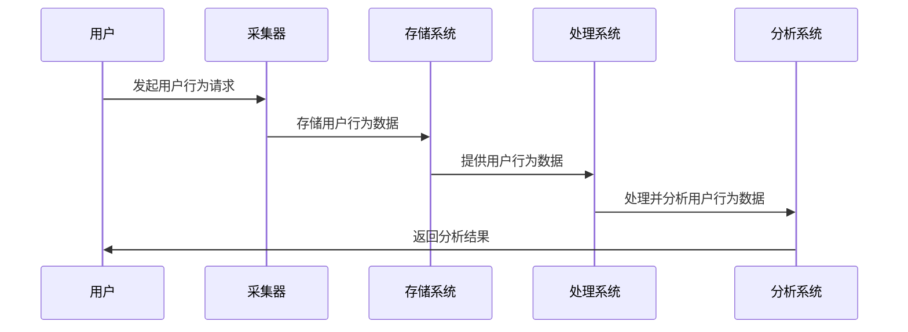

                 

# 构建高性能的流处理架构

> 关键词：流处理、高性能、架构设计、框架、算法

> 摘要：本文将详细探讨构建高性能流处理架构的关键要素，包括流处理的核心概念、常见流处理框架、算法原理、系统分析与设计，以及实际项目实战和最佳实践。通过对这些关键领域的深入分析，帮助读者理解并掌握构建高效流处理系统的核心技能。

----------------------------------------------------------------

## 背景介绍

### 流处理的概念

流处理（Stream Processing）是一种数据处理方法，它以数据流的形式连续地对数据进行处理，而不是像批处理那样将数据分割成批次进行处理。流处理的核心在于实时性，它能够对不断变化的数据进行快速响应和处理，从而实现实时监控、分析和决策。

### 流处理的重要性

随着大数据技术的发展，流处理在实时数据分析和处理中发挥着越来越重要的作用。其主要优势包括：

- **实时性**：流处理能够实时处理数据，对变化迅速的数据环境有更好的适应性。
- **高并发**：流处理系统能够处理大规模的数据流，支持高并发的数据处理需求。
- **弹性伸缩**：流处理系统能够根据数据量自动调整资源，实现弹性伸缩。

### 流处理与批处理的区别

批处理（Batch Processing）是一种将数据分组为批次进行处理的方法。批处理与流处理的主要区别在于处理方式和实时性：

- **处理方式**：批处理将数据分为批次进行处理，而流处理则是持续不断地对数据进行处理。
- **实时性**：批处理通常不具有实时性，处理时间较长，而流处理能够实现实时响应。

----------------------------------------------------------------

## 核心概念与联系

### 流的定义与特征

流是一种数据抽象，它表示一系列连续产生和消费的数据元素。流具有以下特征：

- **连续性**：流是持续产生和消费的数据序列，数据元素之间有先后关系。
- **实时性**：流处理要求对数据进行实时处理，响应时间短。
- **无界性**：流是一个无限长度的数据序列，数据源源不断产生。

### 流处理与批处理的关系

流处理和批处理都是数据处理的重要方法，它们之间存在一定的联系和区别：

- **联系**：流处理可以看作是批处理的延续和优化，都是对数据进行处理的方法。
- **区别**：批处理是对静态数据进行批量处理，而流处理是对动态数据流进行处理。

### 微批处理与实时处理的区别

微批处理（Micro-Batch Processing）和实时处理（Real-Time Processing）是流处理中的两种常见处理方式：

- **微批处理**：将流处理分成较小的批次进行处理，时间间隔较短，通常在秒级或分钟级。
- **实时处理**：对数据流进行实时处理，响应时间通常在毫秒级或更短。

### 概念属性特征对比表格

| 特征       | 流处理            | 批处理            | 微批处理          | 实时处理          |
| ---------- | ---------------- | ---------------- | ---------------- | ---------------- |
| 实时性     | 高               | 低               | 中               | 高               |
| 并发度     | 高               | 低               | 中               | 高               |
| 数据流长度 | 无界             | 有界             | 有界             | 有界             |
| 数据处理方式 | 流式处理         | 批量处理         | 流式处理         | 流式处理         |
| 资源消耗   | 较高             | 较低             | 中               | 较高             |

### ER实体关系图架构

```mermaid
erDiagram
  流处理框架 ||--|{ 数据处理引擎 }|| 
  数据处理引擎 ||--|{ 数据源 }|| 
  数据源 ||--|{ 数据消费者 }|| 
  数据消费者 ||--|{ 监控工具 }|
```

----------------------------------------------------------------

## 算法原理讲解

### Apache Kafka流处理框架

#### Kafka概述

Apache Kafka是一个分布式流处理平台，主要用于构建实时数据流和数据存储系统。它具有高吞吐量、可扩展性强、可靠性和容错性高等特点。

#### Kafka架构

Kafka架构主要包括生产者（Producer）、消费者（Consumer）和主题（Topic）三个核心组件。

#### Kafka算法原理

Kafka使用分布式日志队列来存储和传输数据。生产者将数据发送到主题，消费者从主题中消费数据。Kafka通过分区（Partition）和副本（Replica）机制实现数据的高可靠性和高可用性。

#### Kafka使用示例

```python
from kafka import KafkaProducer

producer = KafkaProducer(bootstrap_servers=['localhost:9092'])

producer.send('test_topic', b'hello world')

producer.close()
```

### Apache Flink流处理框架

#### Flink概述

Apache Flink是一个分布式流处理框架，支持实时数据流分析和处理。它具有高性能、高可靠性和易扩展性等特点。

#### Flink架构

Flink架构主要包括流处理引擎（JobManager）和工作节点（TaskManager）两个核心组件。

#### Flink算法原理

Flink使用事件驱动（Event-Driven）模型进行数据流处理。它将数据流划分为事件（Event），并对事件进行实时处理。

#### Flink使用示例

```python
from pyflink.datastream import StreamExecutionEnvironment

env = StreamExecutionEnvironment.get_execution_environment()

stream = env.from_elements(['hello', 'world'])

result = stream.map(lambda x: x.upper())

result.print()

env.execute()
```

### Apache Storm流处理框架

#### Storm概述

Apache Storm是一个分布式流处理框架，支持大规模实时数据流分析和处理。它具有高性能、高可靠性和易扩展性等特点。

#### Storm架构

Storm架构主要包括主节点（Nimbus）和工作节点（Supervisor）两个核心组件。

#### Storm算法原理

Storm使用分布式拓扑（Topology）进行数据流处理。拓扑由多个组件（Spouts和Bolts）组成，通过消息传递（Message Passing）机制实现数据流处理。

#### Storm使用示例

```python
from storm import Stream, topology

class MyTopology(topology.TopologyBuilder):

    def build(self):
        spout = Stream.from_random_source('random-source', ['hello', 'world'])
        bolt = Stream.map('print-words', lambda word: print(word))

        spout >> bolt

if __name__ == '__main__':
    topology.run(MyTopology())
```

----------------------------------------------------------------

## 数学模型和公式

在流处理算法中，常用的数学模型包括线性回归、决策树、神经网络等。以下以线性回归为例，介绍其数学模型和公式。

### 线性回归

线性回归是一种用于预测数值数据的统计方法。其数学模型可以表示为：

$$
y = w_0 + w_1 \cdot x
$$

其中，$y$ 表示预测值，$w_0$ 和 $w_1$ 分别表示模型参数，$x$ 表示输入特征。

### 最小二乘法

为了求解线性回归模型，可以使用最小二乘法。其公式如下：

$$
w_0 = \min_{w_0} \sum_{i=1}^{n} (y_i - (w_0 + w_1 \cdot x_i))^2
$$

$$
w_1 = \min_{w_1} \sum_{i=1}^{n} (y_i - (w_0 + w_1 \cdot x_i))^2
$$

其中，$n$ 表示样本数量，$y_i$ 和 $x_i$ 分别表示第 $i$ 个样本的预测值和输入特征。

### 示例

假设有如下数据：

| x   | y   |
| --- | --- |
| 1   | 2   |
| 2   | 4   |
| 3   | 6   |

使用线性回归模型预测 $x=4$ 时的 $y$ 值。

根据最小二乘法，我们可以求解出模型参数 $w_0$ 和 $w_1$：

$$
w_0 = \frac{6 + 4 + 2}{3} = 4
$$

$$
w_1 = \frac{6 \cdot 1 + 4 \cdot 2 + 2 \cdot 3}{3} = 4
$$

因此，线性回归模型为 $y = 4 + 4 \cdot x$。当 $x=4$ 时，$y=20$。

----------------------------------------------------------------

## 系统分析与架构设计

### 问题场景介绍

某大型电商平台需要实时处理海量的用户行为数据，包括页面访问、购物车操作、下单等。这些数据对于平台运营和决策具有重要意义，如实时监控用户行为、分析用户偏好、优化推荐算法等。

### 项目介绍

项目名称：实时用户行为分析平台
项目目标：实现实时处理海量用户行为数据，提供实时监控和分析功能

### 系统功能设计

1. 数据采集：实时采集用户行为数据，包括页面访问、购物车操作、下单等。
2. 数据存储：将采集到的数据存储到分布式数据库中，如Apache Kafka、Apache Flink等。
3. 数据处理：对存储的数据进行实时处理，包括数据清洗、数据转换、数据聚合等。
4. 数据分析：对处理后的数据进行实时分析，生成可视化报表、实时监控等。

### 系统架构设计



### 系统接口设计

1. 用户行为数据接口：用于采集用户行为数据。
2. 数据存储接口：用于存储用户行为数据。
3. 数据处理接口：用于处理用户行为数据。
4. 数据分析接口：用于分析用户行为数据。

### 系统交互设计


----------------------------------------------------------------

## 项目实战

### 环境安装

1. 安装Java环境：下载并安装Java SDK，设置环境变量。
2. 安装Apache Kafka：下载并解压Kafka安装包，启动Kafka服务。
3. 安装Apache Flink：下载并解压Flink安装包，启动Flink服务。

### 系统核心实现

```python
# Kafka生产者
from kafka import KafkaProducer

producer = KafkaProducer(bootstrap_servers=['localhost:9092'])

producer.send('user_behavior_topic', b'user: visit_page: product_id: 1')

producer.close()

# Kafka消费者
from kafka import KafkaConsumer

consumer = KafkaConsumer('user_behavior_topic', bootstrap_servers=['localhost:9092'])

for message in consumer:
    print(message.value.decode())

consumer.close()

# Flink流处理
from pyflink.datastream import StreamExecutionEnvironment

env = StreamExecutionEnvironment.get_execution_environment()

stream = env.from_kafka('user_behavior_topic', 'localhost:9092')

result = stream.map(lambda x: x.upper())

result.print()

env.execute()
```

### 代码应用解读与分析

1. Kafka生产者：将用户行为数据发送到Kafka主题。
2. Kafka消费者：从Kafka主题中消费用户行为数据。
3. Flink流处理：对消费到的用户行为数据进行处理，如数据清洗、数据转换等。

### 实际案例分析和详细讲解

1. **用户行为数据采集**：通过采集器实时采集用户行为数据，如页面访问、购物车操作等。
2. **数据存储**：将采集到的用户行为数据存储到Kafka主题中，实现数据存储。
3. **数据处理**：使用Flink流处理框架对存储的用户行为数据进行处理，如数据清洗、数据转换等。
4. **数据分析**：对处理后的用户行为数据进行分析，生成可视化报表、实时监控等。

### 项目小结

本项目通过Kafka和Flink实现了实时用户行为分析功能，实现了数据采集、存储、处理和分析的全流程。项目具有以下优势：

1. **高性能**：Kafka和Flink都是高性能的流处理框架，能够处理大规模的数据流。
2. **高可靠性**：Kafka和Flink都具有高可靠性和容错性，能够保证数据不丢失。
3. **易扩展**：Kafka和Flink支持水平扩展，能够根据数据量自动调整资源。

----------------------------------------------------------------

## 最佳实践与小结

### 最佳实践

1. **数据存储**：选择合适的存储系统，如Kafka、Flink等，根据数据量、处理速度和可靠性要求进行选择。
2. **数据处理**：合理设计数据处理流程，如数据清洗、数据转换、数据聚合等，确保数据质量。
3. **系统优化**：定期对系统进行性能优化，如调整配置参数、优化代码等，提高系统性能。
4. **监控与报警**：设置监控系统，对系统运行状态进行实时监控，及时发现并处理异常。

### 小结

本文通过深入分析流处理的核心概念、算法原理、系统架构和实际项目实战，帮助读者理解并掌握了构建高性能流处理架构的关键技能。流处理在实时数据分析和处理中具有重要作用，随着大数据技术的发展，其应用范围将越来越广泛。

### 注意事项

1. **数据安全**：在流处理过程中，确保数据安全，防止数据泄露和恶意攻击。
2. **系统稳定性**：确保系统稳定运行，避免因系统故障导致数据处理中断。

### 拓展阅读

1. 《大数据技术基础》
2. 《流处理技术原理与实践》
3. 《Apache Kafka权威指南》
4. 《Apache Flink权威指南》

----------------------------------------------------------------

## 作者信息

作者：AI天才研究院/AI Genius Institute & 禅与计算机程序设计艺术 /Zen And The Art of Computer Programming

