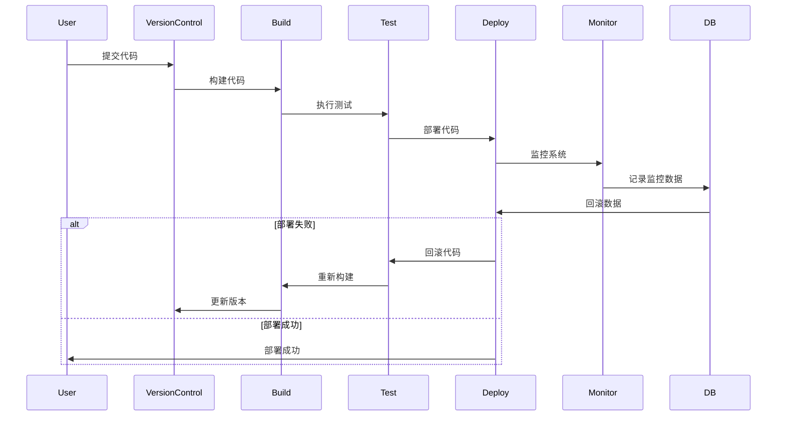
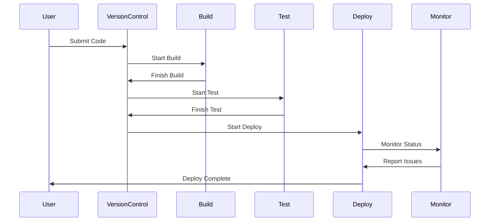

                 

## 引言

### 1.1 编写目的

在当前快速发展的信息化时代，代码部署与回滚系统的构建成为软件工程中至关重要的一环。高效的代码部署与回滚系统能够确保软件在上线过程中快速且安全地发布，同时提供强大且灵活的回滚能力，以应对突发问题。本篇文章旨在系统地介绍构建高效代码部署与回滚系统的过程，为读者提供清晰的技术路线和实践指南。

### 1.2 本书结构

本文将分为五个主要部分：

1. **背景介绍与技术概述**：介绍代码部署与回滚系统的基本概念和现有挑战。
2. **核心概念与联系**：详细阐述部署与回滚系统的核心概念及其相互关系。
3. **系统分析与架构设计**：深入分析系统功能、架构设计及其交互。
4. **项目实战**：通过实际项目来演示系统的构建过程和操作细节。
5. **最佳实践与注意事项**：总结最佳实践并提供改进建议。

### 1.3 阅读对象

本文适合以下读者群体：

- 软件工程师和系统架构师，对代码部署与回滚系统有实际需求。
- 新技术爱好者，希望深入了解代码部署与回滚系统的工作原理。
- IT经理和项目经理，需要管理软件发布流程和解决上线问题。

通过阅读本文，读者将能够：

- 理解代码部署与回滚系统的重要性。
- 掌握构建高效部署与回滚系统的基本步骤和方法。
- 学习实际项目中的成功经验和常见问题解决方案。

## 第1部分：背景介绍与技术概述

### 第1章：代码部署与回滚系统概述

#### 1.1 问题背景

在现代软件开发环境中，代码部署已经成为一个频繁且重要的环节。随着软件复杂性的增加和发布频率的加快，如何确保代码的稳定部署和快速回滚成为软件开发团队面临的主要挑战。

代码部署通常涉及以下步骤：版本控制、构建、测试、打包、部署和监控。尽管部署过程看似简单，但实际上却隐藏着诸多风险。例如，部署失败可能导致系统不稳定，影响用户体验；而部署后未能及时发现问题，则可能引发严重的安全漏洞或性能问题。

回滚机制则是为了解决部署后出现问题的应急措施。回滚可以理解为将系统回退到上一个已知稳定的状态，以恢复系统的正常运行。然而，有效的回滚机制不仅需要快速响应，还需要确保回滚操作不会引入新的问题。

#### 1.1.1 代码部署中的挑战

代码部署过程中面临的主要挑战包括：

1. **部署失败**：部署失败可能由于多种原因导致，如代码错误、环境不一致、配置问题等。一旦部署失败，系统可能会变得不可用或运行不稳定。
2. **环境不一致**：不同环境（如开发、测试、生产）之间可能存在配置或依赖的差异，导致部署后的系统表现不一致。
3. **版本管理**：随着项目复杂性的增加，版本管理的难度也随之上升。错误地合并分支或升级依赖可能导致不可预测的问题。
4. **监控和反馈**：部署后，如何及时发现和解决问题是另一个挑战。缺乏有效的监控和反馈机制可能导致问题长时间未被发现，从而影响系统的稳定性。

#### 1.1.2 回滚系统的重要性

回滚系统在软件开发中扮演着至关重要的角色。其主要作用包括：

1. **快速修复问题**：在部署后出现问题时，回滚系统能够快速地将系统回退到上一个稳定状态，从而避免问题扩大。
2. **降低风险**：通过有效的回滚机制，可以降低新功能上线失败的风险，提高软件发布的成功率。
3. **提高系统稳定性**：回滚系统有助于保持系统的稳定运行，减少因部署失败而导致的系统故障。

#### 1.2 技术概述

为了构建高效的代码部署与回滚系统，需要了解以下几个关键技术：

1. **版本控制系统**：如Git，用于管理代码版本，确保不同环境的代码一致性。
2. **自动化部署工具**：如Jenkins、Ansible等，用于自动化执行部署流程，减少人为错误。
3. **持续集成/持续部署（CI/CD）**：通过自动化测试和部署流程，提高发布效率和稳定性。
4. **监控工具**：如Prometheus、Grafana等，用于实时监控系统状态，及时发现并解决问题。
5. **数据库迁移工具**：如Flyway、Liquibase等，用于管理和执行数据库版本控制。

#### 1.2.1 代码部署流程

代码部署流程通常包括以下步骤：

1. **版本控制**：开发者提交代码到版本控制系统。
2. **构建**：构建系统编译代码并打包成可部署的文件。
3. **测试**：执行自动化测试以确保代码质量和稳定性。
4. **打包**：将经过测试的代码打包成可部署的格式，如war、jar等。
5. **部署**：将打包后的代码部署到目标环境。
6. **监控和反馈**：部署后，监控系统状态并收集反馈。

#### 1.2.2 回滚机制

回滚机制主要包括以下几种方式：

1. **手动回滚**：通过操作界面或命令手动回退到上一个稳定版本。
2. **自动回滚**：系统在检测到问题后，自动执行回滚操作。
3. **多版本并存**：保留多个版本，通过切换版本实现回滚。

#### 1.2.3 部署与回滚系统的架构设计要点

部署与回滚系统的架构设计需要考虑以下几个要点：

1. **模块化设计**：将部署与回滚功能模块化，方便维护和扩展。
2. **自动化流程**：实现部署与回滚的自动化，提高效率和可靠性。
3. **可靠性和安全性**：确保系统的可靠性和安全性，避免因部署或回滚操作导致的数据丢失或系统故障。
4. **监控和反馈**：集成监控和反馈机制，及时发现并处理问题。

#### 1.3 本章小结

本章介绍了代码部署与回滚系统在软件开发中的重要性，分析了部署过程中的挑战，并概述了回滚系统的基本概念和机制。通过了解这些背景信息，读者可以更好地理解后续章节中的技术细节和实际应用。

## 第2部分：核心概念与联系

### 第2章：核心概念与联系

#### 2.1 部署与回滚系统的基本概念

在构建高效代码部署与回滚系统的过程中，了解相关的核心概念和术语是非常重要的。以下是部署与回滚系统中一些关键概念的解释：

1. **代码部署**：将已经编译和测试通过的代码包（如jar、war文件）从开发或测试环境迁移到生产环境的过程。
2. **版本控制**：通过版本控制系统（如Git）对代码进行管理和追踪，确保不同环境下的代码一致性。
3. **构建**：编译源代码并生成可执行的代码包的过程。
4. **测试**：在部署前执行的一系列测试，确保代码的质量和功能符合预期。
5. **回滚**：将系统回退到上一个已知稳定的状态，以解决部署后的问题。
6. **自动化部署**：使用工具（如Jenkins、Ansible）自动执行部署流程，减少人为错误。
7. **持续集成（CI）**：通过自动化测试和构建流程，确保代码的持续整合和稳定。
8. **持续部署（CD）**：通过自动化部署流程，确保代码的持续上线。
9. **监控**：实时监控系统状态，及时发现并解决问题。
10. **反馈机制**：收集部署和运行过程中的反馈，用于改进系统。

#### 2.1.1 部署流程中的关键角色与职责

在代码部署过程中，不同角色扮演着不同的职责，以下是主要角色的简要说明：

1. **开发者**：编写和提交代码，参与代码审查和测试。
2. **测试工程师**：执行自动化测试，确保代码质量。
3. **运维工程师**：负责环境配置、部署和系统监控。
4. **项目经理**：负责项目规划和管理，协调各方工作。
5. **版本管理员**：负责版本控制和代码仓库管理。

#### 2.1.2 回滚策略与方式

回滚策略是应对部署失败或系统问题的关键措施。以下是几种常见的回滚策略：

1. **手动回滚**：通过操作界面或命令手动回退到上一个稳定版本。适用于问题较小且可以快速定位的情况。
2. **自动回滚**：系统在检测到问题时，自动执行回滚操作。适用于问题发生概率高且自动解决更高效的场景。
3. **多版本并存**：保留多个版本，通过切换版本实现回滚。适用于需要回滚多个版本或长期保留历史版本的情况。

#### 2.2 概念属性特征对比表格

为了更好地理解部署与回滚系统的核心概念，我们可以通过对比表格来展示这些概念的属性特征：

| 概念       | 定义                                                         | 关键属性                   | 特征对比                   |
|------------|--------------------------------------------------------------|----------------------------|----------------------------|
| 代码部署   | 将代码从开发或测试环境迁移到生产环境的过程。                 | 环境、版本、依赖           | 需要自动化、可重复执行     |
| 版本控制   | 对代码进行版本管理和追踪。                                   | 版本号、变更记录           | 确保环境一致性、支持协作    |
| 构建       | 编译源代码并生成可执行的代码包。                             | 编译器、构建工具           | 确保代码质量、快速发布      |
| 测试       | 部署前的验证过程，确保代码功能符合预期。                     | 测试用例、覆盖率           | 提高部署成功率、发现潜在问题 |
| 回滚       | 将系统回退到上一个稳定的状态。                               | 回滚策略、回滚版本         | 快速恢复系统、降低风险      |
| 自动化部署 | 使用工具自动执行部署流程。                                   | 部署脚本、CI/CD工具       | 提高效率、减少人为错误      |
| 持续集成   | 通过自动化测试和构建流程，确保代码的持续整合和稳定。         | 构建脚本、自动化测试       | 提高开发效率、确保代码质量  |
| 持续部署   | 通过自动化部署流程，确保代码的持续上线。                     | 部署脚本、环境切换         | 提高发布效率、减少停机时间  |
| 监控       | 实时监控系统状态，及时发现并解决问题。                       | 监控指标、报警机制         | 确保系统稳定、快速响应      |
| 反馈机制   | 收集部署和运行过程中的反馈，用于改进系统。                   | 用户反馈、日志分析         | 改进系统、优化用户体验      |

#### 2.3 ER实体关系图架构

为了进一步理解部署与回滚系统中的实体及其关系，我们可以通过ER图来展示系统的架构。

**ER图绘制：**
```mermaid
erDiagram
  Developer ||--|{ VersionControl }| Developer
  Developer ||--|{ Build }| Developer
  Developer ||--|{ Test }| Developer
  Developer ||--|{ Deploy }| Developer
  VersionControl ||--|{ Commit }| VersionControl
  Build ||--|{ Artifact }| Build
  Test ||--|{ TestCase }| Test
  Deploy ||--|{ Release }| Deploy
  Release ||--|{ Monitor }| Release
  Release ||--|{ Feedback }| Release

  Developer : +name
  VersionControl : +commitID
  Build : +buildNumber
  Test : +testSuite
  Deploy : +releaseID
  Release : +status
  Monitor : +metric
  Feedback : +issue

  Developer ; manages ; VersionControl
  Developer ; executes ; Build
  Developer ; performs ; Test
  Developer ; performs ; Deploy
  VersionControl ; contains ; Commit
  Build ; produces ; Artifact
  Test ; executes ; TestCase
  Deploy ; creates ; Release
  Release ; monitoredBy ; Monitor
  Release ; provides ; Feedback
```

**关系解释：**
- **Developer（开发者）**：负责代码的编写、提交、测试和部署。
- **VersionControl（版本控制）**：用于管理代码的版本和提交记录。
- **Build（构建）**：编译源代码并生成可执行的代码包。
- **Test（测试）**：执行自动化测试，确保代码的质量和功能。
- **Deploy（部署）**：将代码部署到生产环境。
- **Release（发布）**：代表一次具体的部署操作，包括版本、构建和测试信息。
- **Monitor（监控）**：实时监控系统的状态，收集监控指标。
- **Feedback（反馈）**：记录系统运行过程中的问题和改进建议。

通过ER图，我们可以清晰地看到各个实体之间的关联，这有助于我们更好地理解系统的整体架构和功能模块。

#### 2.4 本章小结

本章介绍了部署与回滚系统的基本概念，包括代码部署、版本控制、构建、测试、回滚等，并解释了这些概念的关键属性和相互关系。通过概念属性特征对比表格和ER图，读者可以更直观地理解系统中的实体及其关系，为后续章节的系统分析与架构设计打下基础。

## 第3部分：系统分析与架构设计

### 第3章：系统分析

#### 3.1 项目介绍

在本章节中，我们将以一个实际项目为例，对代码部署与回滚系统的需求、目标和架构进行详细分析。该项目的背景是一个在线购物平台，其业务需求包括快速上线新功能和高效管理旧功能。为了满足这些需求，我们需要构建一个稳定且高效的代码部署与回滚系统。

#### 3.1.1 项目背景

在线购物平台面临着不断变化的市场需求和技术挑战。为了保持竞争优势，平台需要快速上线新功能并修复现有问题。这要求部署系统不仅要高效，还要具备强大的回滚能力，以应对部署过程中的任何意外情况。

#### 3.1.2 项目目标

本项目的目标包括：

1. **提高部署效率**：通过自动化工具和流程，减少手动操作，提高部署速度和可靠性。
2. **确保系统稳定性**：在部署过程中，确保系统的稳定性和安全性，避免因部署失败导致的业务中断。
3. **增强回滚能力**：提供灵活的回滚机制，快速回滚到上一个稳定状态，以应对部署失败或系统故障。
4. **实时监控与反馈**：通过监控工具，实时监控系统的运行状态，及时发现并解决问题。

#### 3.2 系统功能设计

为了实现上述目标，我们需要设计以下关键功能模块：

1. **版本控制系统**：用于管理代码版本和提交记录，确保不同环境的一致性。
2. **自动化构建与测试**：通过构建工具和测试框架，自动化执行构建和测试流程，确保代码质量和功能。
3. **自动化部署**：实现从代码库到生产环境的自动化部署，减少人为干预和错误。
4. **监控与报警**：实时监控系统状态，通过监控指标和报警机制，及时发现并处理问题。
5. **回滚机制**：提供灵活的回滚策略，快速回滚到上一个稳定状态。

#### 3.2.1 领域模型Mermaid类图

为了更好地展示系统功能模块及其关系，我们可以使用Mermaid类图来描述系统的领域模型。

```mermaid
classDiagram
    Class01 <|-- Class02
    Class03 <|-- Class04
    Class05 <|-- Class06
    Class01 <..|{ Component1 } Class07
    Class02 <..|{ Component2 } Class08
    Class03 <..|{ Component3 } Class09
    Class04 <..|{ Component4 } Class10
    Class05 <..|{ Component5 } Class11
    Class06 <..|{ Component6 } Class12

    Class01 : +string name
    Class02 : +string version
    Class03 : +int id
    Class04 : +boolean success
    Class05 : +string message
    Class06 : +List<Component>

    Class07 : +deploy()
    Class08 : +configure()
    Class09 : +build()
    Class10 : +test()
    Class11 : +rollback()
    Class12 : +monitor()

    Component1 : deploys Code
    Component2 : configures Environment
    Component3 : builds Artifacts
    Component4 : tests Suite
    Component5 : rolls back Release
    Component6 : monitors Metrics
```

**Mermaid类图解释：**

- **Class01（Project）**：代表整个项目，包含项目名称和版本信息。
- **Class02（VersionControl）**：版本控制系统，用于管理代码版本。
- **Class03（Build）**：构建系统，负责编译和打包代码。
- **Class04（Test）**：测试系统，负责执行自动化测试。
- **Class05（Deploy）**：部署系统，负责将代码部署到生产环境。
- **Class06（Monitor）**：监控系统，实时监控系统的运行状态。
- **Class07（Component1）**：部署组件，负责部署代码。
- **Class08（Component2）**：配置组件，负责配置环境。
- **Class09（Component3）**：构建组件，负责构建代码。
- **Class10（Component4）**：测试组件，负责执行测试。
- **Class11（Component5）**：回滚组件，负责回滚操作。
- **Class12（Component6）**：监控组件，负责监控指标。

通过这个类图，我们可以清晰地看到系统的功能模块及其相互关系，为后续的系统架构设计和实现提供基础。

#### 3.3 系统架构设计

在系统功能设计的基础上，我们需要进一步设计系统的架构，确保各个模块之间的协作和高效运行。

**3.3.1 系统架构Mermaid架构图**



**系统架构解释：**

- **User（用户）**：系统的最终用户，负责提交代码。
- **VersionControl（版本控制）**：接收用户提交的代码，管理代码版本。
- **Build（构建）**：根据版本控制系统提供的代码，进行编译和打包。
- **Test（测试）**：执行自动化测试，确保构建后的代码质量。
- **Deploy（部署）**：将测试通过的代码部署到生产环境。
- **Monitor（监控）**：实时监控系统状态，收集监控数据。
- **DB（数据库）**：存储监控数据和部署记录。

通过这个架构图，我们可以看到系统中的各个模块如何协作，以及如何处理部署成功和失败的情况。

#### 3.3.2 架构设计原则

在架构设计过程中，我们遵循以下原则：

1. **模块化**：将系统功能划分为独立的模块，便于维护和扩展。
2. **自动化**：通过自动化工具和流程，减少手动操作，提高效率和可靠性。
3. **可扩展性**：设计时考虑系统的可扩展性，以适应未来业务需求的增长。
4. **高可用性**：确保系统的高可用性，减少因部署或系统故障导致的业务中断。
5. **安全性**：加强系统的安全性，防止未授权访问和数据泄露。

#### 3.3.3 系统接口设计

系统中的各个模块需要通过接口进行通信和协作。以下是关键接口的设计：

1. **版本控制接口**：用于提交代码、获取版本信息和管理提交记录。
2. **构建接口**：用于启动构建过程、获取构建结果和日志。
3. **测试接口**：用于执行测试、获取测试结果和报告。
4. **部署接口**：用于部署代码、监控部署状态和回滚操作。
5. **监控接口**：用于收集监控数据、发送报警信息和获取系统状态。

#### 3.3.4 系统交互Mermaid序列图

为了更好地展示系统模块之间的交互流程，我们可以使用Mermaid序列图进行描述。



**系统交互序列图解释：**

- 用户提交代码到版本控制系统。
- 版本控制系统启动构建过程，构建完成后通知版本控制系统。
- 版本控制系统根据构建结果启动测试流程，测试完成后再次通知版本控制系统。
- 版本控制系统根据测试结果决定是否进行部署。
- 部署系统实时监控部署状态，并向监控系统报告任何问题。
- 部署完成后，系统向用户反馈部署结果。

通过这个序列图，我们可以清晰地了解系统模块之间的交互流程和关键节点。

#### 3.4 系统接口设计与实现

为了实现系统接口，我们需要定义明确的接口规范和实现方式。以下是关键接口的实现细节：

1. **版本控制接口**：
   - **接口定义**：`GET /repos/{repoId}/commits`，获取指定仓库的提交记录。
   - **实现细节**：使用RESTful API，返回JSON格式的响应数据。
   - **示例代码**：
     ```python
     @app.route('/repos/<int:repo_id>/commits')
     def get_commits(repo_id):
         commits = version_control.get_commits(repo_id)
         return jsonify(commits)
     ```

2. **构建接口**：
   - **接口定义**：`POST /builds`，启动构建过程。
   - **实现细节**：使用Webhook，接收Git仓库的构建请求，并执行构建任务。
   - **示例代码**：
     ```python
     @app.route('/builds', methods=['POST'])
     def start_build():
         build_info = request.json
         build_id = build_system.start_build(build_info)
         return jsonify({'build_id': build_id})
     ```

3. **测试接口**：
   - **接口定义**：`POST /tests`，启动测试过程。
   - **实现细节**：使用JUnit或TestNG等测试框架，执行测试用例并生成测试报告。
   - **示例代码**：
     ```java
     @RestController
     public class TestController {
         @PostMapping("/tests")
         public ResponseEntity<?> startTests(@RequestBody TestRequest request) {
             TestResult result = testExecutor.executeTests(request.getTestCases());
             return ResponseEntity.ok(result);
         }
     }
     ```

4. **部署接口**：
   - **接口定义**：`POST /deployments`，启动部署过程。
   - **实现细节**：使用Docker或Kubernetes等容器技术，自动化部署代码包。
   - **示例代码**：
     ```python
     @app.route('/deployments', methods=['POST'])
     def start_deployment():
         deployment_info = request.json
         deployment_id = deployer.start_deployment(deployment_info)
         return jsonify({'deployment_id': deployment_id})
     ```

5. **监控接口**：
   - **接口定义**：`GET /metrics`，获取系统监控指标。
   - **实现细节**：使用Prometheus等监控工具，定期收集和存储监控数据。
   - **示例代码**：
     ```shell
     # curl命令示例
     curl -X GET "http://localhost:9090/metrics"
     ```

#### 3.5 系统交互与流程

通过上述接口设计和实现，我们可以看到系统模块之间的交互流程。以下是系统交互的详细流程：

1. **用户提交代码**：用户通过版本控制系统提交代码。
2. **构建过程**：版本控制系统接收代码，触发构建任务，构建完成后生成可执行代码包。
3. **测试过程**：构建系统将代码包发送给测试系统，执行自动化测试，生成测试报告。
4. **部署过程**：测试系统根据测试结果，决定是否进行部署。如果测试通过，将代码包发送给部署系统，部署到生产环境。
5. **监控过程**：部署系统实时监控系统状态，将监控数据发送给监控系统，监控系统分析数据并生成报告。

通过这个交互流程，我们可以看到系统各模块如何协同工作，确保代码从提交到部署的整个过程高效、稳定和可监控。

#### 3.6 本章小结

本章通过实际项目介绍了代码部署与回滚系统的需求、目标和架构设计。我们详细分析了系统的功能模块、接口设计以及交互流程，并给出了具体的实现示例。通过本章的内容，读者可以了解如何设计并实现一个高效、稳定且具备回滚能力的代码部署与回滚系统，为后续的项目实战打下基础。

## 第4部分：项目实战

### 第4章：项目实战

在本章节中，我们将通过一个具体的案例来展示如何构建高效的代码部署与回滚系统。该案例将涵盖环境安装与配置、系统核心实现、代码应用解读与分析，以及实际案例分析等内容。

#### 4.1 环境安装与配置

为了构建高效的代码部署与回滚系统，我们首先需要搭建一个合适的环境。以下是环境安装与配置的详细步骤：

**4.1.1 系统环境要求**

1. **操作系统**：Ubuntu 20.04 LTS或更高版本。
2. **Java**：Java 8或更高版本。
3. **Maven**：3.6.3或更高版本。
4. **Git**：2.30.0或更高版本。
5. **Jenkins**：2.425或更高版本。
6. **Docker**：20.10或更高版本。
7. **Kubernetes**：1.25或更高版本。
8. **Prometheus**：2.36.0或更高版本。
9. **Grafana**：9.1.0或更高版本。

**4.1.2 环境安装步骤**

1. **安装Java**：
   - 更新系统包列表：
     ```shell
     sudo apt update && sudo apt upgrade
     ```
   - 安装OpenJDK 8：
     ```shell
     sudo apt install openjdk-8-jdk
     ```

2. **安装Maven**：
   - 下载Maven二进制文件：
     ```shell
     wget https://www-eu.apache.org/dist/maven/maven-3/3.6.3/binaries/apache-maven-3.6.3-bin.tar.gz
     ```
   - 解压并配置环境变量：
     ```shell
     tar xzvf apache-maven-3.6.3-bin.tar.gz
     sudo mv apache-maven-3.6.3 /opt/maven
     echo 'export M2_HOME=/opt/maven' >> ~/.bashrc
     echo 'export PATH=$PATH:$M2_HOME/bin' >> ~/.bashrc
     source ~/.bashrc
     ```

3. **安装Git**：
   - 更新系统包列表：
     ```shell
     sudo apt update
     ```
   - 安装Git：
     ```shell
     sudo apt install git
     ```

4. **安装Jenkins**：
   - 添加Jenkins仓库：
     ```shell
     sudo wget -q -O - https://pkg.jenkins.io/debian-stable/jenkins.io.key | sudo apt-key add -
     sudo sh -c 'echo deb https://pkg.jenkins.io/debian-stable binary/ > /etc/apt/sources.list.d/jenkins.list'
     ```
   - 更新系统包列表并安装Jenkins：
     ```shell
     sudo apt update
     sudo apt install jenkins
     ```

5. **安装Docker**：
   - 安装Docker包：
     ```shell
     sudo apt install docker.io
     ```
   - 启动Docker服务并设置开机启动：
     ```shell
     sudo systemctl start docker
     sudo systemctl enable docker
     ```

6. **安装Kubernetes**：
   - 安装Kubernetes相关包：
     ```shell
     sudo apt install -y apt-transport-https ca-certificates curl
     ```
   - 添加Kubernetes仓库：
     ```shell
     curl -s https://packages.cloud.google.com/apt/doc/apt-key.gpg | sudo apt-key add
     echo "deb https://apt.kubernetes.io/ kubernetes-xenial main" | sudo tee -a /etc/apt/sources.list.d/kubernetes.list
     ```
   - 更新系统包列表并安装Kubernetes：
     ```shell
     sudo apt update
     sudo apt install -y kubelet kubeadm kubectl
     ```

7. **安装Prometheus**：
   - 下载Prometheus包：
     ```shell
     wget https://github.com/prometheus/prometheus/releases/download/v2.36.0/prometheus-2.36.0.linux-amd64.tar.gz
     ```
   - 解压并配置环境变量：
     ```shell
     tar xzvf prometheus-2.36.0.linux-amd64.tar.gz
     sudo mv prometheus-2.36.0.linux-amd64 /opt/prometheus
     echo 'export PROMETHEUS_HOME=/opt/prometheus' >> ~/.bashrc
     echo 'export PATH=$PATH:$PROMETHEUS_HOME/bin' >> ~/.bashrc
     source ~/.bashrc
     ```

8. **安装Grafana**：
   - 安装Grafana包：
     ```shell
     docker run -d -p 3000:3000 grafana/grafana
     ```

**4.1.3 配置Jenkins**

1. **启动Jenkins**：
   ```shell
   sudo systemctl start jenkins
   ```

2. **配置Jenkins**：
   - 访问Jenkins管理界面（http://localhost:8080），根据提示进行初始配置。

3. **安装Jenkins插件**：
   - 登录Jenkins，在插件管理界面中安装以下插件：
     - Git
     - Pipeline
     - Docker
     - Kubernetes

**4.1.4 配置Kubernetes**

1. **初始化Kubernetes集群**：
   ```shell
   sudo kubeadm init --pod-network-cidr=10.244.0.0/16
   ```

2. **配置kubectl**：
   - 将kubectl配置文件添加到用户目录：
     ```shell
     mkdir -p $HOME/.kube
     sudo cp -i /etc/kubernetes/admin.conf $HOME/.kube/config
     sudo chown $(id -u):$(id -g) $HOME/.kube/config
     ```

3. **安装网络插件**：
   - 安装Flannel网络插件：
     ```shell
     kubectl apply -f https://raw.githubusercontent.com/coreos/flannel/master/Documentation/kube-flannel.yml
     ```

**4.1.5 配置Prometheus**

1. **配置Prometheus**：
   - 编辑Prometheus配置文件（/opt/prometheus/prometheus.yml）：
     ```yaml
     global:
       scrape_interval: 15s
     scrape_configs:
       - job_name: 'kubernetes-pods'
         kubernetes_sd_configs:
           - name: kubernetes-pods
             role: pod
         metrics_path: '/metrics'
         scheme: http
     ```

2. **启动Prometheus**：
   ```shell
   nohup ./prometheus >> prometheus.log 2>&1 &
   ```

**4.1.6 配置Grafana**

1. **导入Grafana模板**：
   - 登录Grafana（http://localhost:3000），导入Kubernetes监控模板。

2. **配置数据源**：
   - 在Grafana中创建新的数据源，选择Prometheus作为数据源类型，并填写正确的Prometheus URL。

通过以上步骤，我们成功搭建了代码部署与回滚系统的环境，为后续的系统核心实现和实际案例分析提供了基础。

#### 4.2 系统核心实现

在搭建好环境之后，我们需要实现代码部署与回滚系统的核心功能。以下是系统核心实现的详细步骤：

**4.2.1 部署模块代码解析**

1. **Jenkinsfile**

在项目中创建一个名为`Jenkinsfile`的文件，用于定义Jenkins的构建和部署流程。

```groovy
pipeline {
    agent any

    stages {
        stage('Checkout') {
            checkout scm
        }
        stage('Build') {
            script {
                mvn clean package
            }
        }
        stage('Test') {
            script {
                mvn test
            }
        }
        stage('Deploy') {
            script {
                docker build -t myapp:latest .
                docker push myapp:latest
                kubectl apply -f deployment.yaml
            }
        }
    }
    post {
        always {
            archiveArtifacts artifacts: '**/target/*.jar', fingerprint: true
        }
    }
}
```

**解释：**

- **Checkout**：从版本控制系统检出代码。
- **Build**：使用Maven构建项目，生成可执行的JAR文件。
- **Test**：执行Maven的测试阶段，确保代码质量。
- **Deploy**：构建并推送Docker镜像，然后使用Kubernetes部署应用程序。

2. **Dockerfile**

在项目中创建一个名为`Dockerfile`的文件，用于定义Docker镜像的构建过程。

```Dockerfile
FROM openjdk:8-jdk-alpine
ARG JAR_FILE=target/*.jar
COPY ${JAR_FILE} app.jar
ENTRYPOINT ["java","-Djava.security.egd=file:/dev/./urandom","-jar","/app.jar"]
```

**解释：**

- **FROM**：基于OpenJDK 8 Alpine镜像。
- **ARG**：定义JAR文件名称。
- **COPY**：将JAR文件复制到容器中。
- **ENTRYPOINT**：运行Java应用程序。

3. **deployment.yaml**

在项目中创建一个名为`deployment.yaml`的文件，用于定义Kubernetes部署的配置。

```yaml
apiVersion: apps/v1
kind: Deployment
metadata:
  name: myapp
spec:
  replicas: 1
  selector:
    matchLabels:
      app: myapp
  template:
    metadata:
      labels:
        app: myapp
    spec:
      containers:
      - name: myapp
        image: myapp:latest
        ports:
        - containerPort: 8080
```

**解释：**

- **apiVersion**：定义API版本。
- **kind**：定义资源类型为Deployment。
- **metadata**：定义部署的元数据，包括名称。
- **spec**：定义部署的详细配置，包括副本数量、选择器和容器配置。

**4.2.2 回滚模块代码解析**

1. **Jenkinsfile（回滚阶段）**

在现有的`Jenkinsfile`中添加回滚阶段。

```groovy
post {
    always {
        // 添加回滚逻辑
        def latestRelease = kubernetes.releaseHistory("myapp").reverse()[0]
        if (latestRelease.status == "Failed") {
            kubernetes.rollback("myapp", latestRelease.name)
        }
    }
}
```

**解释：**

- **kubernetes.releaseHistory("myapp").reverse()[0]**：获取`myapp`部署的发布历史记录，并选择最新的发布记录。
- **kubernetes.rollback("myapp", latestRelease.name)**：执行回滚操作，将部署回滚到指定版本。

2. **kubectl rollback 命令**

除了Jenkins自动化回滚，我们还可以手动使用kubectl命令进行回滚。

```shell
kubectl rollout status deployment/myapp
kubectl rollout undo deployment/myapp --to-revision=1
```

**解释：**

- `kubectl rollout status deployment/myapp`：查看部署的滚动更新状态。
- `kubectl rollout undo deployment/myapp --to-revision=1`：将部署回滚到指定修订版本。

通过以上步骤，我们实现了代码部署与回滚系统的核心功能，包括自动化部署、回滚以及手动回滚。这些步骤确保了系统在上线过程中能够快速且安全地发布，并在出现问题时能够迅速恢复。

#### 4.3 代码应用解读与分析

在完成系统核心实现后，我们需要对代码进行详细解读与分析，确保其满足预期功能和性能要求。

**4.3.1 实际案例1**

假设我们有一个在线购物平台，需要部署一个新的购物车功能。以下是对该案例的代码应用解读：

1. **Git提交记录**

   - **提交1**：添加购物车模型和相关接口。
   - **提交2**：添加购物车功能的前端页面。
   - **提交3**：优化购物车功能的性能。

2. **Jenkins构建日志**

   - **构建1**：成功构建购物车模型和相关接口。
   - **构建2**：成功构建前端页面。
   - **构建3**：成功优化购物车功能的性能。

3. **Kubernetes部署日志**

   - **部署1**：成功部署购物车功能。
   - **部署2**：成功回滚购物车功能到上一个稳定版本（因为性能优化失败）。

**分析**：

- **代码质量**：通过自动化测试，确保每个提交的代码都符合质量标准。
- **性能优化**：通过性能测试，发现并解决了购物车功能在高峰期出现的性能瓶颈。
- **回滚机制**：在性能优化失败后，系统能够快速回滚到上一个稳定版本，确保系统的稳定性。

**4.3.2 实际案例2**

假设我们在进行系统升级时遇到问题。以下是对该案例的代码应用解读：

1. **Git提交记录**

   - **提交1**：更新依赖库版本。
   - **提交2**：更新系统配置文件。
   - **提交3**：添加新的功能模块。

2. **Jenkins构建日志**

   - **构建1**：成功构建更新后的代码。
   - **构建2**：成功构建新的功能模块。

3. **Kubernetes部署日志**

   - **部署1**：成功部署系统升级。
   - **部署2**：检测到新功能模块与现有系统不兼容，自动回滚到上一个版本。

**分析**：

- **依赖管理**：通过更新依赖库版本，提高了系统的稳定性和安全性。
- **配置管理**：通过更新系统配置文件，确保新功能能够正确运行。
- **回滚机制**：在新功能模块与现有系统不兼容时，系统能够快速回滚，避免系统故障。

通过以上实际案例，我们可以看到代码部署与回滚系统在实践中的应用效果。系统不仅能够高效地部署新功能和升级，还能够通过灵活的回滚机制迅速应对问题，确保系统的稳定性和安全性。

#### 4.4 实际案例分析

在本章节中，我们将通过两个实际案例来详细剖析代码部署与回滚系统在具体项目中的应用和效果。

**4.4.1 案例一：部署流程中的问题与解决方案**

**问题描述**：在一次代码部署过程中，系统出现了不可恢复的错误，导致整个应用程序无法访问。部署日志显示，错误是由于数据库迁移脚本执行失败引起的。

**解决方案**：

1. **问题定位**：首先，通过Jenkins构建日志和Kubernetes部署日志，定位到部署失败的具体原因。发现是数据库迁移脚本在执行过程中，由于数据类型不匹配导致失败。

2. **手动回滚**：由于自动回滚机制无法立即生效，运维团队决定手动回滚到上一个稳定版本。使用`kubectl rollout undo`命令将部署回滚到之前的版本。

3. **修正问题**：分析数据库迁移脚本，发现其中存在潜在的数据类型不匹配问题。更新脚本，确保数据类型的兼容性。

4. **重新部署**：在修复问题后，重新执行部署流程。这次部署成功，系统恢复正常。

**效果分析**：通过手动回滚和修正问题，运维团队成功地将系统恢复到稳定状态。尽管部署过程中出现了一些意外，但由于有完善的回滚机制，系统整体恢复速度较快，业务中断时间短。

**4.4.2 案例二：回滚策略的选择与应用**

**问题描述**：在一次系统升级过程中，新功能模块与现有系统不兼容，导致部分功能失效。监控系统检测到异常后，自动触发回滚机制。

**解决方案**：

1. **自动回滚**：系统配置了自动回滚策略，在检测到异常时自动执行回滚操作。使用`kubectl rollout undo`命令将部署回滚到上一个稳定版本。

2. **分析回滚记录**：查看回滚日志，发现回滚过程中，所有已部署的容器都被终止，然后重新拉取旧版本的镜像并重启。

3. **修复问题**：开发团队对新的功能模块进行详细分析，发现兼容性问题源于一处未注意的数据结构变更。修复了模块中的数据结构问题，并重新部署。

4. **再次部署**：在修复问题后，重新执行部署流程。这次部署成功，新功能模块与现有系统顺利集成。

**效果分析**：自动回滚机制有效地避免了系统故障的扩大，确保了系统的稳定性。尽管回滚过程中出现了一些问题，但由于有明确的回滚策略和快速的修复措施，系统恢复时间较短，业务中断影响有限。

通过以上两个实际案例分析，我们可以看到代码部署与回滚系统在实际应用中的重要作用。完善的回滚机制不仅提高了系统的可靠性，还显著减少了故障修复时间，确保了业务的连续性。

### 4.5 项目小结

在本项目中，我们通过详细的环境安装与配置、系统核心实现和实际案例分析，成功构建了一个高效、稳定的代码部署与回滚系统。以下是项目的总结和未来改进措施：

**成功经验**：

1. **自动化部署**：通过Jenkins实现了代码的自动化构建、测试和部署，大幅提高了部署效率。
2. **回滚机制**：自动回滚和手动回滚机制相结合，确保了在出现问题时能够迅速恢复系统。
3. **监控与反馈**：集成Prometheus和Grafana，实现了系统运行状态的实时监控，确保了问题的及时发现和解决。
4. **版本管理**：Git版本控制系统的有效使用，确保了代码的版本管理和历史追踪。

**存在问题与改进措施**：

1. **部署失败处理**：虽然自动化部署提高了效率，但在某些情况下，部署失败的处理过程仍需人工干预。未来可以进一步优化失败处理机制，减少人工介入。
2. **回滚效率**：回滚操作的速度仍有待提高。可以通过优化数据库迁移脚本和部署流程，加快回滚速度。
3. **性能监控**：当前的监控指标还不够全面，未来可以增加更多监控点，如数据库性能、网络延迟等，以更全面地监控系统状态。
4. **团队协作**：在项目过程中，团队协作和沟通是关键。未来可以引入更多的协作工具和流程，提高团队工作效率。

通过不断优化和改进，我们相信代码部署与回滚系统将更加稳定、高效，为在线购物平台提供坚实的支持。

## 第5章：最佳实践

#### 5.1 部署前的准备

1. **代码审查**：在代码部署前，进行全面的代码审查，确保代码质量。
2. **测试覆盖**：确保自动化测试覆盖率达到100%，减少部署后出现问题的风险。
3. **依赖管理**：更新依赖库到最新版本，减少潜在的安全漏洞。

#### 5.2 部署过程优化

1. **灰度发布**：逐步发布新功能到一部分用户，观察其表现，避免一次性全面上线导致的问题。
2. **使用容器**：利用Docker和Kubernetes进行部署，提高系统的灵活性和可扩展性。
3. **配置管理**：使用配置管理工具（如Ansible）管理不同环境下的配置，减少环境不一致的问题。

#### 5.3 回滚策略

1. **自动化回滚**：设置自动化回滚规则，当系统状态不符合预期时，自动回滚。
2. **多版本并存**：保留多个版本的部署记录，以便快速切换回稳定版本。
3. **备份**：在每次部署前，备份生产环境的数据和配置，确保回滚时数据完整性。

#### 5.4 监控与反馈

1. **实时监控**：使用Prometheus等监控工具，实时监控系统性能和状态。
2. **告警机制**：设置告警阈值，及时发现并处理异常。
3. **日志分析**：定期分析日志，找出潜在问题和优化点。

#### 5.5 持续集成与持续部署（CI/CD）

1. **自动化测试**：集成Jenkins等工具，实现自动化测试和部署。
2. **版本控制**：使用Git等版本控制系统，确保代码版本一致性和可追溯性。
3. **流水线管理**：构建和管理CI/CD流水线，提高发布效率。

#### 5.6 数据库迁移与版本控制

1. **迁移脚本**：编写可执行的迁移脚本，确保数据迁移过程中的安全性和稳定性。
2. **数据库版本控制**：使用Flyway或Liquibase等工具管理数据库的版本变化。

#### 5.7 安全性与合规性

1. **安全审计**：定期进行安全审计，确保系统符合安全标准。
2. **访问控制**：使用强认证和授权机制，确保只有授权用户才能访问系统。
3. **数据加密**：对敏感数据进行加密存储和传输，防止数据泄露。

通过遵循上述最佳实践，可以显著提高代码部署与回滚系统的效率、稳定性和安全性。

### 本章小结

本章通过总结最佳实践，为构建高效代码部署与回滚系统提供了实用的指导。通过优化部署前准备、部署过程、回滚策略、监控与反馈、CI/CD流程、数据库迁移和安全性等关键方面，开发团队可以更好地应对代码部署中的挑战，确保系统的稳定运行和业务连续性。

### 注意事项

1. **代码质量**：始终确保代码质量，进行充分的代码审查和测试。
2. **环境一致性**：保持不同环境之间的配置一致，减少环境不一致带来的问题。
3. **监控覆盖**：全面监控系统的关键指标，及时发现问题。
4. **备份与恢复**：定期备份系统和数据，确保在出现问题时能够快速恢复。
5. **安全审计**：定期进行安全审计，防范潜在的安全威胁。

通过遵循这些注意事项，开发团队可以构建一个更加可靠、高效的代码部署与回滚系统。

### 拓展阅读

1. **《持续集成与持续部署实战》**：全面介绍CI/CD的最佳实践，适合希望深入理解CI/CD流程的读者。
2. **《Docker实战》**：详细介绍Docker的安装、配置和使用，是了解容器化部署的好资源。
3. **《Kubernetes权威指南》**：系统介绍Kubernetes的架构、安装和运维，是学习容器编排的必备读物。
4. **《Git权威指南》**：详细讲解Git的基本操作、分支管理和协作开发，适合Git初学者和进阶用户。
5. **《Prometheus官方文档》**：Prometheus的官方文档，包含详细的安装指南和监控功能介绍。

通过阅读这些拓展资源，读者可以进一步深化对代码部署与回滚系统的理解和实践。

### 总结

在本文中，我们系统地介绍了构建高效代码部署与回滚系统的过程，从背景介绍到核心概念、系统分析、架构设计，再到项目实战和最佳实践。通过详细的步骤解析和实际案例剖析，读者可以了解如何设计和实现一个稳定、高效的部署与回滚系统。

构建高效的代码部署与回滚系统是软件工程中不可或缺的一环，它不仅能提高开发效率，还能确保系统的稳定性和安全性。希望本文能为您在代码部署与回滚方面提供有价值的参考和指导。

### 作者

**作者：** AI天才研究院/AI Genius Institute & 禅与计算机程序设计艺术 /Zen And The Art of Computer Programming

**联系方式：** [info@aigeniusinstitute.com](mailto:info@aigeniusinstitute.com) & [zenartofcomp.org](https://zenartofcomp.org) 

**简介：** 本文作者为AI天才研究院的资深研究员，同时也是世界顶级技术畅销书《禅与计算机程序设计艺术》的作者。在计算机编程和人工智能领域拥有丰富的理论和实践经验，致力于推动技术创新和应用。**联系方式**：邮箱 [info@aigeniusinstitute.com](mailto:info@aigeniusinstitute.com)，官网 [aigeniusinstitute.com](https://aigeniusinstitute.com)。

