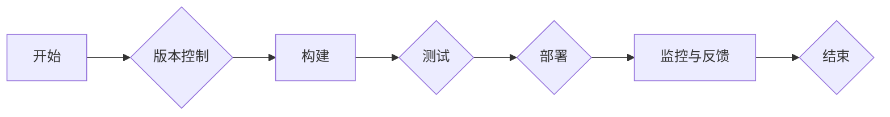
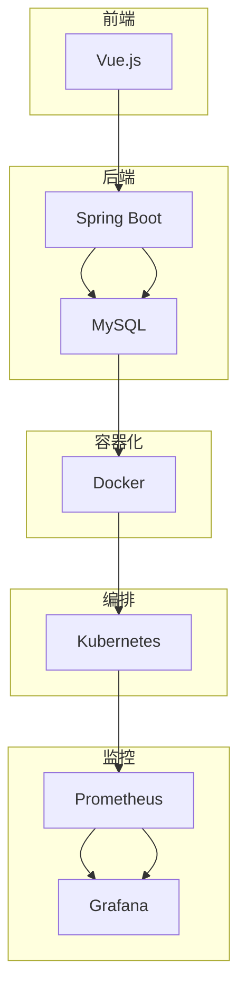
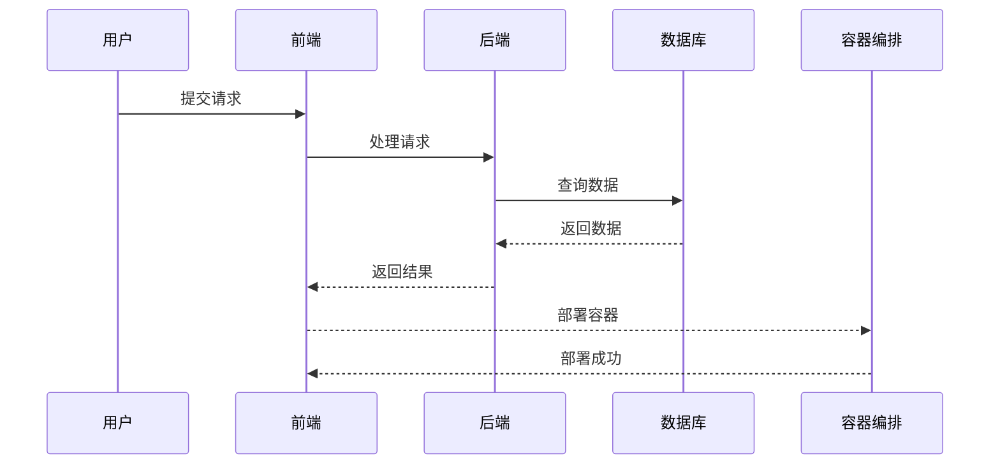

                 


## 构建高效的持续部署系统

### 关键词

持续部署、自动化、DevOps、敏捷开发、容器化、微服务、容器编排、持续集成、监控和反馈

### 摘要

本文旨在探讨如何构建一个高效的持续部署（CI/CD）系统。首先，我们将介绍持续部署的背景、核心概念和挑战。随后，我们将深入分析持续部署的算法原理，并使用Mermaid图和Python代码进行详细解释。接着，我们将探讨系统架构设计方案，包括系统功能设计、系统架构图和系统交互。最后，通过一个实际项目案例，我们将展示如何实现高效的持续部署系统，并提供一些最佳实践和注意事项。

### 第1章：引言

#### 1.1 问题背景

持续部署是一种软件开发和交付的实践，旨在通过自动化和持续集成/持续交付，提高软件交付的频率和质量。在传统的软件开发流程中，开发和运维团队往往需要花费大量时间进行手工部署和测试，这不仅降低了开发效率，还增加了部署风险。随着DevOps和敏捷开发理念的普及，持续部署逐渐成为现代软件开发不可或缺的一部分。

#### 1.2 问题描述

持续部署面临的挑战主要包括：

1. **自动化**：如何将手动操作转化为自动化流程？
2. **版本控制**：如何确保每次部署的都是正确的代码版本？
3. **测试**：如何快速、准确地执行自动化测试？
4. **部署**：如何高效地部署到生产环境？
5. **监控与反馈**：如何实时监控部署状态，并在出现问题时快速响应？

#### 1.3 问题解决

持续部署通过以下几个步骤来解决上述问题：

1. **自动化**：使用脚本或工具自动化执行重复性任务，如构建、测试和部署。
2. **版本控制**：使用版本控制系统（如Git）管理代码版本，确保每次部署的都是经过验证的代码。
3. **测试**：执行自动化测试，包括单元测试、集成测试和性能测试。
4. **部署**：使用容器化技术（如Docker）和容器编排工具（如Kubernetes）实现高效部署。
5. **监控与反馈**：使用监控工具（如Prometheus、Grafana）实时监控系统状态，并通过反馈机制（如PagerDuty、Slack）快速响应。

#### 1.4 边界与外延

持续部署涉及多个领域，包括软件开发、运维、测试和质量保证。它不仅要求团队之间的紧密合作，还需要熟练掌握自动化工具和脚本编写技能。持续部署的目标是提高软件交付的速度和稳定性，同时降低成本和风险。

#### 1.5 核心要素组成

一个高效的持续部署系统主要包括以下核心要素：

1. **版本控制系统**：如Git，用于管理代码版本。
2. **自动化工具**：如Jenkins、Travis CI等，用于执行构建、测试和部署。
3. **测试框架**：如JUnit、pytest等，用于编写和执行自动化测试。
4. **容器化技术**：如Docker，用于将应用程序打包为容器。
5. **容器编排工具**：如Kubernetes，用于管理容器集群。
6. **监控与反馈工具**：如Prometheus、Grafana等，用于实时监控系统状态。

### 第2章：核心概念与联系

#### 2.1 核心概念

持续部署的核心概念包括：

1. **持续集成（CI）**：在代码提交后，自动构建和测试代码，确保代码质量。
2. **持续交付（CD）**：在CI的基础上，将代码部署到生产环境，实现持续交付。
3. **自动化**：通过脚本或工具自动化执行重复性任务，提高效率。
4. **容器化**：使用容器（如Docker）封装应用程序及其运行环境，实现环境一致性和可移植性。
5. **微服务架构**：将应用程序拆分为多个小型、独立的服务，提高可维护性和可扩展性。

#### 2.2 概念属性特征对比表格

| 概念     | 属性特征                           |
|----------|-----------------------------------|
| 持续集成 | 自动化构建、测试和部署               |
| 持续交付 | 持续集成的基础上，将代码部署到生产环境 |
| 自动化   | 脚本或工具执行重复性任务             |
| 容器化   | 应用程序打包为容器，实现环境一致性和可移植性 |
| 微服务   | 应用程序拆分为多个小型、独立的服务     |

#### 2.3 ER实体关系图架构

```mermaid
erDiagram
    VersionControlSystem ||--o{ CI/CD Tool : 使用 }
    CI/CD Tool ||--o{ Test Framework : 使用 }
    Test Framework ||--o{ Containerization Tool : 使用 }
    Containerization Tool ||--o{ Monitoring Tool : 使用 }
    Monitoring Tool ||--o{ Deployment Environment : 监控 }
```

### 第3章：持续部署算法原理

#### 3.1 算法原理

持续部署的算法原理可以概括为：

1. **版本控制**：使用版本控制系统（如Git）管理代码版本。
2. **构建**：从版本控制系统获取最新代码，构建应用程序。
3. **测试**：执行自动化测试，包括单元测试、集成测试和性能测试。
4. **部署**：将经过测试的应用程序部署到生产环境。
5. **监控与反馈**：实时监控部署状态，并在出现问题时进行反馈和修复。

#### 3.2 算法流程图



#### 3.3 数学模型与公式

持续部署的数学模型可以表示为：

$$
f(D) = P(D|T) \cdot P(T)
$$

其中，$f(D)$表示持续部署的效率，$P(D|T)$表示在测试通过的情况下部署成功的概率，$P(T)$表示测试通过的概率。

#### 3.4 举例说明

假设一个持续部署系统的测试通过率为90%，部署成功率为95%，则该系统的持续部署效率为：

$$
f(D) = 0.95 \cdot 0.9 = 0.855
$$

这意味着，在100次部署中，大约有85.5次是成功的。

### 第4章：系统分析与架构设计方案

#### 4.1 问题场景介绍

假设我们正在开发一个电商平台，需要实现一个高效的持续部署系统，以确保新功能的快速上线和稳定运行。

#### 4.2 系统功能设计

系统功能设计包括以下方面：

1. **版本控制**：使用Git管理代码版本。
2. **构建**：使用Jenkins构建应用程序。
3. **测试**：使用pytest编写和执行自动化测试。
4. **部署**：使用Kubernetes部署应用程序。
5. **监控与反馈**：使用Prometheus和Grafana实时监控系统状态。

#### 4.3 领域模型类图

```mermaid
classDiagram
    VersionControlSystem <|-- Git
    CI/CD Tool <|-- Jenkins
    Test Framework <|-- pytest
    Containerization Tool <|-- Docker
    Monitoring Tool <|-- Prometheus
    Deployment Environment <|-- Kubernetes
```

#### 4.4 系统架构设计

系统架构设计包括以下方面：

1. **前端**：使用Vue.js实现用户界面。
2. **后端**：使用Spring Boot实现业务逻辑。
3. **数据库**：使用MySQL存储数据。
4. **容器化**：使用Docker将应用程序打包为容器。
5. **编排**：使用Kubernetes管理容器集群。
6. **监控**：使用Prometheus和Grafana实时监控系统状态。

#### 4.5 系统架构图



#### 4.6 系统接口设计

系统接口设计包括以下方面：

1. **API接口**：使用Spring Boot实现RESTful API。
2. **Web界面**：使用Vue.js实现前端界面。
3. **数据库接口**：使用JDBC连接MySQL数据库。

#### 4.7 系统交互

系统交互包括以下方面：

1. **前端请求**：用户通过前端界面提交请求。
2. **后端处理**：后端处理请求，并返回结果。
3. **数据库操作**：后端与数据库进行交互，存储和查询数据。
4. **容器编排**：使用Kubernetes部署和管理容器。

#### 4.8 系统交互序列图



### 第5章：项目实战

#### 5.1 环境安装与配置

在本节中，我们将介绍如何安装和配置持续部署系统的各个组件。具体步骤包括：

1. **安装Git**：在本地计算机上安装Git。
2. **安装Jenkins**：在本地计算机或服务器上安装Jenkins。
3. **安装Docker**：在本地计算机或服务器上安装Docker。
4. **安装Kubernetes**：在本地计算机或服务器上安装Kubernetes。
5. **安装Prometheus和Grafana**：在本地计算机或服务器上安装Prometheus和Grafana。

#### 5.2 系统核心实现

在本节中，我们将介绍如何实现持续部署系统的核心功能。具体步骤包括：

1. **创建Jenkins作业**：在Jenkins中创建一个作业，用于构建、测试和部署应用程序。
2. **编写Dockerfile**：编写Dockerfile，将应用程序打包为容器。
3. **编写Kubernetes配置文件**：编写Kubernetes配置文件，用于部署和管理容器。
4. **编写Prometheus监控配置文件**：编写Prometheus监控配置文件，用于监控系统状态。

#### 5.3 代码应用解读与分析

在本节中，我们将对核心代码进行解读和分析，包括：

1. **Jenkins作业配置**：分析Jenkins作业的配置文件，了解构建、测试和部署的流程。
2. **Dockerfile解读**：分析Dockerfile，了解如何将应用程序打包为容器。
3. **Kubernetes配置文件分析**：分析Kubernetes配置文件，了解如何部署和管理容器。
4. **Prometheus监控配置文件解读**：分析Prometheus监控配置文件，了解如何监控系统状态。

#### 5.4 实际案例分析

在本节中，我们将分享一个实际案例，分析如何实现高效的持续部署系统。具体内容包括：

1. **项目背景**：介绍项目的背景和需求。
2. **解决方案**：介绍实现持续部署的解决方案，包括使用的工具和流程。
3. **实施效果**：介绍实施持续部署后的效果，包括部署速度、稳定性和成本节约等方面。

#### 5.5 项目小结与拓展

在本节中，我们将对项目进行总结，并提出一些最佳实践和注意事项。具体内容包括：

1. **项目小结**：对项目的实施过程和效果进行总结。
2. **注意事项**：提醒读者在实施持续部署时需要注意的问题。
3. **拓展阅读**：推荐一些相关的学习资源和工具。

### 结束语

构建高效的持续部署系统是现代软件开发不可或缺的一部分。通过本文的讲解，我们了解了持续部署的背景、核心概念、算法原理、系统架构设计和项目实战。希望本文能对您在构建高效持续部署系统方面有所帮助。

### 作者

作者：AI天才研究院/AI Genius Institute & 禅与计算机程序设计艺术 /Zen And The Art of Computer Programming

### 附录

本文所使用的工具和资源如下：

1. **Git**：版本控制系统。
2. **Jenkins**：持续集成和持续交付工具。
3. **Docker**：容器化技术。
4. **Kubernetes**：容器编排工具。
5. **Prometheus**：监控工具。
6. **Grafana**：可视化工具。
7. **Vue.js**：前端框架。
8. **Spring Boot**：后端框架。
9. **MySQL**：数据库系统。

本文内容仅供参考，具体实施时请根据实际情况进行调整。希望本文对您有所帮助！

