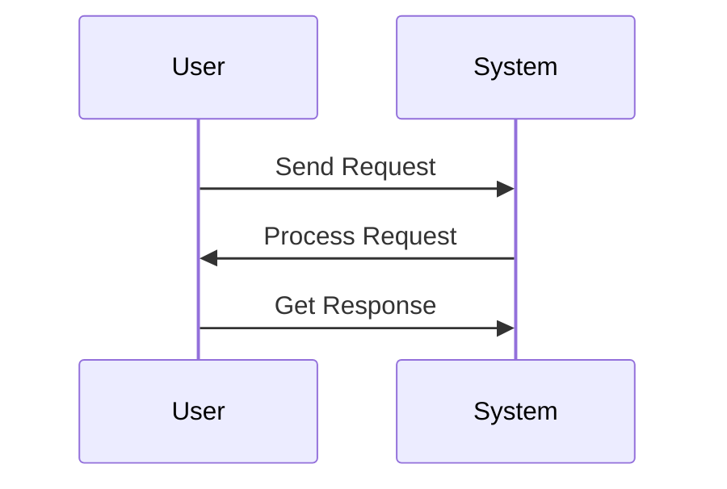
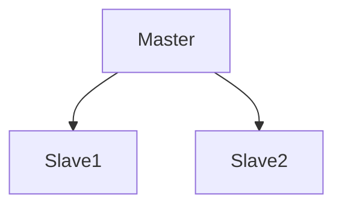
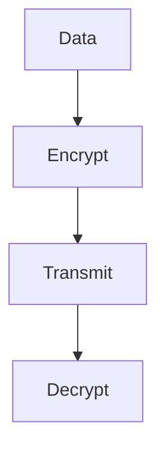
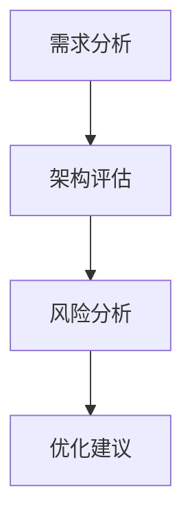
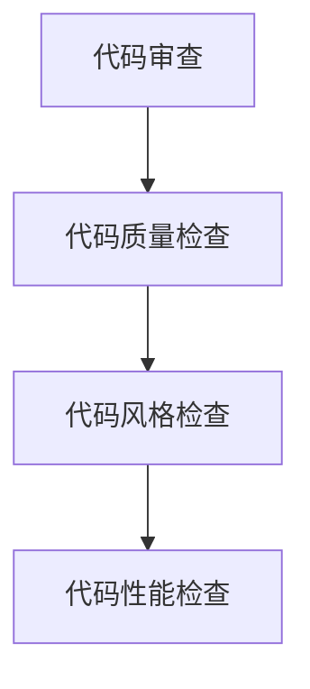
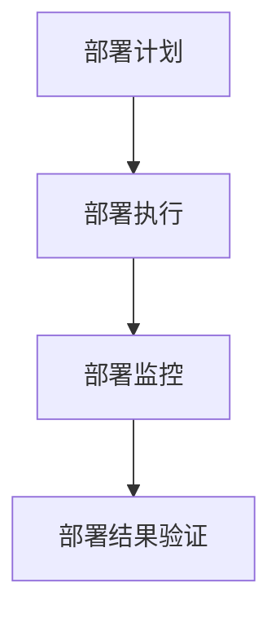
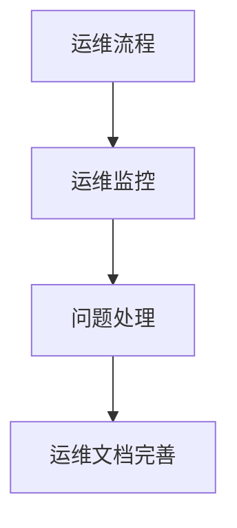

                 

## 文章标题

### 关键词

- 架构传承
- 原则
- 审计
- 文化

### 摘要

本文探讨了架构传承在IT领域的核心重要性，以及如何通过原则、审计和文化三重奏实现有效的架构传承。文章分为四个部分：首先介绍架构传承的背景与重要性，然后详细阐述架构原则、审计与文化的传承方法，接着通过案例研究验证这些方法的有效性，最后分析架构传承面临的挑战和未来趋势。通过这一步步的分析和推理，本文旨在为IT专业人士提供一套完整的架构传承实践指南。

## 引言

在现代信息技术飞速发展的背景下，软件架构的传承变得愈发重要。随着技术的不断演进，企业需要保持其IT系统的可持续性和灵活性，而这离不开有效的架构传承。架构传承不仅仅是技术的传递，更是原则、审计和文化等多方面的综合体现。本文将从三个核心方面探讨架构传承：原则、审计与文化的三重奏。

### 架构传承的背景与重要性

首先，我们需要了解架构传承的背景。信息技术经历了从简单的单机系统到复杂分布式系统、云计算、大数据、人工智能等众多发展阶段。每一个阶段都伴随着技术的变革和业务需求的变化，这就要求企业必须具备快速适应和转型的能力。而架构传承正是这种能力的基础。

架构传承的重要性体现在以下几个方面：

1. **技术积累**：通过架构传承，企业可以积累宝贵的技术经验，避免重复造轮子，提升开发效率。
2. **团队协作**：架构传承有助于团队成员之间的协同工作，形成共同的语言和思维方式。
3. **风险管理**：有效的架构传承可以减少系统故障和风险，确保系统的稳定性和可靠性。
4. **持续创新**：架构传承不仅保持现有系统的稳定，还为未来的创新提供了坚实的基础。

### 原则传承

原则传承是架构传承的核心之一。原则是架构设计的指导思想，它指导着架构师在系统设计过程中的每一个决策。以下是几个关键原则：

1. **可扩展性**：系统能够随着业务需求的变化而扩展。
2. **灵活性**：系统能够适应不同的业务场景和技术变革。
3. **高可用性**：系统能够在故障情况下保持基本功能。
4. **安全性**：系统必须保护数据和资源免受外部威胁。

### 审计传承

审计传承是确保架构传承质量的重要环节。通过审计，企业可以检查现有系统的架构设计是否符合既定的原则和标准。审计的主要内容包括：

1. **架构设计审计**：评估系统的架构设计是否合理、符合原则。
2. **代码审计**：检查代码质量和安全性。
3. **部署审计**：确保系统部署过程符合最佳实践。
4. **运维审计**：评估系统的运维管理是否有效。

### 文化传承

文化传承是架构传承的软实力。它包括企业内部对于架构设计的共同价值观、沟通方式和工作流程。文化传承的关键在于：

1. **共识形成**：通过定期交流和培训，形成团队对架构设计的共识。
2. **知识共享**：鼓励团队成员分享经验和最佳实践。
3. **持续改进**：持续跟踪技术趋势和行业最佳实践，不断优化架构设计。
4. **激励机制**：建立激励机制，鼓励团队成员积极参与架构传承。

## 原则传承

原则传承是架构传承的核心，它为系统设计提供了基本的指导原则。以下将详细讨论几个关键原则及其在架构设计中的应用。

### 可扩展性

可扩展性是指系统在设计时应该考虑到未来可能的业务增长和技术演进。在架构设计中，可扩展性主要体现在以下几个方面：

1. **水平扩展**：通过增加节点来提高系统的处理能力。
2. **垂直扩展**：通过提高单个节点的性能来提升系统能力。
3. **模块化设计**：将系统划分为可独立开发、测试和部署的模块，便于扩展。

#### 模块化设计

模块化设计是实现系统可扩展性的关键。通过将系统划分为模块，可以独立开发、测试和部署各个模块。这不仅提高了开发效率，还便于后续的扩展和维护。

以下是一个模块化设计的ER实体关系图示例：

```mermaid
erDiagram
    User ||--|{ Order }|--| Product
    User ||--|{ Cart }|--| Product
    Product ||--|{ Review }|
    Order ||--|{ Payment }|
```

这个ER图展示了用户、订单、产品、购物车、评论和支付等实体之间的关系。通过模块化设计，可以将这些实体分别实现为独立的模块。

### 灵活性

灵活性是指系统应能够适应不同的业务场景和技术变革。在架构设计中，实现灵活性的方法包括：

1. **标准化接口**：通过定义标准化的接口，确保不同模块之间可以灵活地替换和组合。
2. **配置管理**：通过配置管理，实现系统参数的灵活调整。
3. **动态部署**：通过动态部署技术，实现系统在运行时根据需求调整资源分配。

#### 标准化接口

标准化接口是提高系统灵活性的关键。以下是一个使用mermaid绘制的标准化接口的序列图示例：



这个序列图展示了用户向系统发送请求，系统处理请求并返回响应的过程。通过标准化接口，可以确保不同模块之间可以无缝交互。

### 高可用性

高可用性是指系统在面临故障时能够快速恢复并保持基本功能。在架构设计中，实现高可用性的方法包括：

1. **冗余设计**：通过冗余设计，确保系统在某个部分失效时，其他部分可以继续运行。
2. **故障转移**：通过故障转移机制，将系统的一部分工作转移到其他健康的节点上。
3. **监控与告警**：通过监控和告警机制，及时发现并处理系统故障。

#### 冗余设计

冗余设计是实现高可用性的重要手段。以下是一个使用mermaid绘制的冗余设计的架构图示例：



这个图展示了主节点（Master）与两个从节点（Slave1和Slave2）之间的冗余设计。如果主节点发生故障，从节点可以自动接管其工作。

### 安全性

安全性是指系统应保护数据和资源免受外部威胁。在架构设计中，实现安全性的方法包括：

1. **身份验证与授权**：通过身份验证和授权机制，确保只有授权用户可以访问系统资源。
2. **数据加密**：通过数据加密，确保数据在传输和存储过程中不会被窃取或篡改。
3. **安全审计**：通过安全审计，监控系统访问行为，及时发现并处理安全漏洞。

#### 数据加密

数据加密是保障系统安全的关键。以下是一个使用mermaid绘制的数据加密流程图示例：



这个图展示了数据在传输过程中通过加密和解密保护的过程。通过数据加密，可以确保数据在传输和存储过程中不会被窃取或篡改。

## 审计传承

审计传承是确保架构传承质量的重要环节。通过审计，企业可以检查现有系统的架构设计是否符合既定的原则和标准，从而确保系统的稳定性和可靠性。以下将详细讨论审计传承的关键环节和方法。

### 架构设计审计

架构设计审计是审计传承的第一步，其主要目标是评估系统的架构设计是否符合既定的原则和标准。架构设计审计通常包括以下几个步骤：

1. **需求分析**：了解系统的业务需求和技术需求，明确系统的功能、性能和安全性等要求。
2. **架构评估**：根据需求和既定的原则，对系统的架构设计进行全面评估，包括架构的合理性、模块化程度、扩展性和灵活性等。
3. **风险分析**：识别系统设计中的潜在风险，并提出相应的解决方案。

#### 架构评估

架构评估是架构设计审计的核心步骤。以下是一个使用mermaid绘制的架构评估流程图示例：



这个图展示了从需求分析到架构评估，再到风险分析和优化建议的整个过程。通过架构评估，可以确保系统的架构设计符合既定的原则和标准。

### 代码审计

代码审计是审计传承的第二个关键环节，其主要目标是检查代码质量和安全性。代码审计通常包括以下几个步骤：

1. **代码审查**：通过人工或工具对代码进行审查，检查代码的语法、逻辑和性能等方面。
2. **静态代码分析**：使用静态代码分析工具对代码进行分析，发现潜在的代码缺陷和漏洞。
3. **动态测试**：通过运行代码并监控其行为，检查代码的稳定性和性能。

#### 代码审查

代码审查是代码审计的重要步骤。以下是一个使用mermaid绘制的代码审查流程图示例：



这个图展示了从代码审查到代码质量检查、代码风格检查和代码性能检查的整个过程。通过代码审查，可以确保代码的质量和安全性。

### 部署审计

部署审计是审计传承的第三个关键环节，其主要目标是确保系统部署过程符合最佳实践。部署审计通常包括以下几个步骤：

1. **部署计划**：制定详细的部署计划，明确部署的步骤、资源和时间安排。
2. **部署过程监控**：在部署过程中，实时监控系统的状态和性能，及时发现并处理问题。
3. **部署结果验证**：部署完成后，对系统进行全面的验证，确保系统正常运行。

#### 部署过程监控

部署过程监控是部署审计的重要环节。以下是一个使用mermaid绘制的部署过程监控流程图示例：



这个图展示了从部署计划到部署执行、部署过程监控和部署结果验证的整个过程。通过部署审计，可以确保系统部署过程的顺利进行。

### 运维审计

运维审计是审计传承的最后一个关键环节，其主要目标是评估系统的运维管理是否有效。运维审计通常包括以下几个步骤：

1. **运维流程**：评估系统的运维流程，确保运维活动按照规范进行。
2. **运维监控**：监控系统的运行状态和性能，及时发现并处理问题。
3. **运维文档**：完善系统的运维文档，为后续运维提供参考。

#### 运维监控

运维监控是运维审计的重要环节。以下是一个使用mermaid绘制的运维监控流程图示例：



这个图展示了从运维流程到运维监控、问题处理和运维文档完善的整个过程。通过运维审计，可以确保系统的稳定性和可靠性。

## 文化传承

文化传承是架构传承的软实力，它贯穿于整个架构设计和开发过程。文化传承包括企业内部的共同价值观、沟通方式和工作流程，是确保架构传承顺利进行的基石。以下将详细讨论文化传承的内涵、机制和实践方法。

### 内涵与价值

文化传承的内涵主要包括以下几个方面：

1. **共同价值观**：企业内部的共同价值观是架构传承的灵魂，它指导着团队成员的行为和决策。共同的价值观有助于形成团队的凝聚力，提高工作效率和协作质量。
2. **沟通方式**：有效的沟通方式是文化传承的重要组成部分。团队成员之间通过高效、透明的沟通，可以更好地理解和执行架构设计，降低误解和冲突。
3. **工作流程**：标准化的工作流程有助于规范团队成员的工作行为，提高协作效率和质量。通过流程化的工作，可以确保架构设计的规范性和一致性。

文化传承的价值体现在以下几个方面：

1. **团队凝聚力**：通过文化传承，可以增强团队成员之间的互信和协作，形成强大的团队凝聚力。
2. **工作效率**：文化传承有助于提高团队成员的工作效率，降低沟通成本，提高项目交付质量。
3. **知识共享**：文化传承鼓励团队成员分享经验和最佳实践，促进知识的积累和传承。
4. **持续改进**：文化传承鼓励团队成员不断反思和优化工作流程，推动持续改进。

### 机制与路径

文化传承的机制主要包括以下几个方面：

1. **共识形成**：通过定期交流和培训，形成团队成员对架构设计、开发和运维的共识。共识的形成是文化传承的关键，它有助于统一团队成员的思想和行为。
2. **知识共享**：通过知识共享平台和交流活动，鼓励团队成员分享经验和最佳实践。知识共享不仅可以提高个人能力，还可以促进团队的共同进步。
3. **激励机制**：建立激励机制，鼓励团队成员积极参与文化传承活动。激励机制可以包括奖金、晋升机会等，通过物质和精神双重激励，提高团队成员的积极性。
4. **持续改进**：文化传承是一个持续的过程，需要不断反思和优化。通过定期的回顾和评估，可以发现和解决文化传承中的问题，推动持续改进。

文化传承的路径可以概括为以下几个步骤：

1. **文化诊断**：通过调查和分析，了解企业内部的文化现状，识别文化传承的痛点。
2. **文化规划**：根据文化诊断的结果，制定文化传承的规划和目标。
3. **文化执行**：通过培训和实践活动，推动文化传承的执行和落地。
4. **文化评估**：定期评估文化传承的效果，调整和优化文化传承的策略。

### 实践案例

以下是一个文化传承的实践案例：

1. **共识形成**：某公司通过定期举办技术沙龙和团队建设活动，促进团队成员之间的交流和理解，形成对架构设计、开发和运维的共识。
2. **知识共享**：公司建立了内部知识库和交流平台，鼓励团队成员分享技术文档、项目经验和最佳实践。通过知识共享，团队成员可以快速学习和借鉴他人的经验，提高个人能力和团队水平。
3. **激励机制**：公司设立技术奖项，对在技术领域有突出贡献的团队成员进行奖励。通过激励机制，激发了团队成员的积极性和创造力，促进了文化传承的深入进行。
4. **持续改进**：公司定期进行文化评估，通过调查问卷、访谈等方式了解团队成员对文化传承的看法和建议。根据评估结果，公司不断调整和优化文化传承策略，推动持续改进。

通过这个实践案例，可以看出文化传承在企业内部的有效实施，对于提高团队凝聚力、工作效率和知识共享具有重要作用。

## 架构审计与文化的综合传承

架构审计与文化传承是确保架构传承质量的重要手段。通过综合运用审计和文化传承的方法，企业可以确保架构设计的合理性、稳定性和可持续性。以下将详细讨论架构审计与文化传承的相互作用、机制和实施策略。

### 作用与相互作用

架构审计与文化传承之间存在密切的相互作用。架构审计通过对系统设计和实施过程的全面检查，可以发现和纠正潜在的问题，确保架构设计的合理性和稳定性。而文化传承则为架构审计提供了基础和保障，通过共识形成、知识共享和激励机制，推动团队成员积极参与架构审计，提高审计效果。

具体来说，架构审计与文化传承的相互作用体现在以下几个方面：

1. **提升审计质量**：文化传承有助于提升审计质量。通过共识形成和知识共享，团队成员对架构设计的理解和认知达成一致，使审计过程更加高效和准确。
2. **增强审计意识**：文化传承有助于增强团队成员的审计意识。通过培训和激励机制，团队成员认识到审计的重要性，主动参与审计过程，提高审计的覆盖面和深度。
3. **保障审计实施**：文化传承为审计实施提供了保障。通过标准化流程和持续改进，企业可以确保审计活动的规范性和持续性，提高审计的效果。

### 机制

架构审计与文化传承的综合传承机制主要包括以下几个方面：

1. **共识机制**：通过定期交流和培训，形成团队成员对架构审计和文化传承的共识。共识的形成有助于统一团队成员的思想和行为，提高审计和传承的效果。
2. **知识共享机制**：建立内部知识库和交流平台，鼓励团队成员分享审计经验和最佳实践。知识共享不仅可以提高个人能力，还可以促进团队的整体进步。
3. **激励机制**：建立激励机制，对在审计和文化传承中表现优秀的团队成员进行奖励。激励机制可以包括奖金、晋升机会等，通过物质和精神双重激励，提高团队成员的积极性。
4. **持续改进机制**：通过定期的回顾和评估，发现和解决审计和文化传承中的问题，推动持续改进。持续改进机制有助于提高审计和传承的质量和效果。

### 实施策略

为了确保架构审计与文化传承的综合传承，企业可以采取以下实施策略：

1. **制定审计计划**：根据企业的业务需求和架构特点，制定详细的审计计划。审计计划应包括审计目标、审计内容、审计方法、审计时间等。
2. **建立审计团队**：建立专门的审计团队，负责审计计划的实施和审计报告的撰写。审计团队成员应具备丰富的审计经验和专业技能。
3. **培训与交流**：定期组织培训和交流活动，提高团队成员对架构审计和文化传承的认知和技能。通过培训和交流，可以促进团队成员之间的沟通和协作，提高审计和传承的效果。
4. **激励机制**：建立激励机制，对在审计和文化传承中表现优秀的团队成员进行奖励。通过激励机制，可以激发团队成员的积极性和创造力，提高审计和传承的积极性。
5. **持续改进**：通过定期的回顾和评估，发现和解决审计和文化传承中的问题。根据评估结果，及时调整和优化审计和传承的策略，提高其质量和效果。

### 案例分析

以下是一个架构审计与文化传承的综合传承实践案例：

1. **案例背景**：某公司是一家大型互联网企业，其业务发展迅速，系统架构复杂。为了确保架构设计的合理性和稳定性，公司决定实施架构审计与文化传承的综合传承。
2. **审计计划**：公司制定了详细的审计计划，包括审计目标、审计内容、审计方法和审计时间。审计目标包括评估系统架构的合理性、稳定性和可持续性，发现和纠正潜在的问题。
3. **审计团队**：公司建立了专门的审计团队，团队成员来自不同部门，具备丰富的审计经验和专业技能。审计团队负责审计计划的实施和审计报告的撰写。
4. **培训与交流**：公司定期组织培训和交流活动，提高团队成员对架构审计和文化传承的认知和技能。培训内容包括审计方法、审计工具和审计流程等。
5. **激励机制**：公司建立了激励机制，对在审计和文化传承中表现优秀的团队成员进行奖励。奖励方式包括奖金、晋升机会等。
6. **持续改进**：公司通过定期的回顾和评估，发现和解决审计和文化传承中的问题。根据评估结果，公司及时调整和优化审计和传承的策略，提高其质量和效果。

通过这个实践案例，可以看出架构审计与文化传承的综合传承在企业内部的有效实施，对于提高系统架构的合理性和稳定性具有重要意义。

### 案例研究概述

本部分将通过对两家不同企业的架构传承实践进行深入分析，探讨在架构传承过程中如何应用原则、审计和文化传承的方法，以及这些方法的实际效果。通过案例研究，我们希望能够揭示架构传承的最佳实践，并为其他企业提供参考和启示。

#### 案例选择标准

为了确保案例研究的有效性和代表性，我们选择了以下标准来选择案例：

1. **行业代表性**：选择的案例应具备较高的行业代表性，反映不同行业在架构传承方面的特点和实践。
2. **架构复杂性**：案例中的企业应具有较为复杂的架构，以便更好地展示架构传承的挑战和解决方案。
3. **成果显著**：选择的案例应具备显著的成果，如提高系统性能、降低故障率、提升团队协作效率等。
4. **资料完整性**：案例应提供充分的资料，包括架构设计文档、审计报告、培训记录等，以便进行深入分析。

#### 案例研究目的与方法

案例研究的目的是通过具体实例，验证架构传承原则、审计和文化传承方法的有效性，并总结出最佳实践。具体方法如下：

1. **文献分析**：通过查阅企业的内部文档、审计报告和技术博客，了解企业的架构设计、审计过程和文化传承策略。
2. **访谈**：与企业的架构师、审计员和技术团队成员进行访谈，深入了解他们在架构传承过程中的实践和体会。
3. **数据收集**：收集案例企业在架构传承过程中的关键数据，如系统性能指标、故障率、团队协作效率等，进行定量分析。
4. **案例对比**：对比两家企业的不同实践，分析其成功和失败的原因，总结出可借鉴的经验和教训。

#### 案例研究内容结构

案例研究的内容将分为以下几个部分：

1. **企业背景与架构现状**：介绍两家企业的基本情况，包括行业背景、业务需求、系统架构现状等。
2. **架构原则传承与创新**：分析企业如何传承和运用架构原则，以及创新的具体实践。
3. **审计传承与质量控制**：探讨企业如何实施审计传承，确保架构设计的质量。
4. **文化传承与团队协作**：分析企业如何通过文化传承提升团队协作效率，增强团队凝聚力。
5. **案例分析与总结**：总结两家企业的架构传承实践，分析其成功经验和存在的问题，为其他企业提供借鉴和启示。

### 案例一：某互联网企业的架构传承实践

#### 企业背景与架构现状

某互联网企业（以下简称“企业A”）是一家领先的在线电商平台，业务涵盖商品销售、物流配送、用户服务等多个领域。随着用户规模的不断扩大和业务需求的日益增长，企业A的架构变得愈加复杂。为了保持系统的稳定性和可扩展性，企业A决定进行架构传承，确保新团队成员能够迅速适应和融入现有的架构设计。

#### 架构原则传承与创新

在企业A的架构传承过程中，以下架构原则得到了重点传承和创新：

1. **微服务架构**：企业A采用微服务架构，将系统分解为多个独立的服务模块，每个模块负责特定的功能。通过这种方式，提高了系统的可扩展性和灵活性。
2. **服务自治**：每个微服务具备自治能力，包括自我管理、自我修复和自我扩展。这有助于降低系统故障率和提高系统的稳定性。
3. **标准化接口**：企业A制定了统一的接口标准，确保不同服务之间的通信和数据交换。这提高了系统的可维护性和扩展性。

在传承过程中，企业A不仅注重对现有架构原则的传承，还进行了创新：

1. **数据分层存储**：企业A引入了数据分层存储策略，将数据分为缓存层、数据库层和数据仓库层。这种分层存储提高了数据的访问速度和系统的整体性能。
2. **容器化部署**：企业A采用容器化技术（如Docker和Kubernetes）进行服务的部署和运维，提高了系统的部署效率和运维灵活性。

#### 审计传承与质量控制

企业A非常重视架构审计和质量控制，通过以下措施确保架构传承的质量：

1. **定期审计**：企业A制定了定期的架构审计计划，每季度对系统架构进行全面审计。审计内容包括架构设计的合理性、服务自治性、接口标准化等方面。
2. **自动化测试**：企业A引入了自动化测试工具，对服务模块进行自动化测试，确保每个模块在部署前都经过严格的测试。
3. **代码审查**：企业A建立了代码审查机制，所有代码提交前必须经过审查，确保代码质量符合标准。

#### 文化传承与团队协作

企业A通过文化传承，增强了团队协作和凝聚力：

1. **知识共享**：企业A建立了内部知识库和文档平台，鼓励团队成员分享技术文档、项目经验和最佳实践。通过知识共享，团队成员可以快速学习和借鉴他人的经验。
2. **培训与交流**：企业A定期组织技术培训和内部交流会，提高团队成员的专业技能和协作能力。通过培训和交流，团队成员对架构设计和运维有了更深入的理解。
3. **激励机制**：企业A设立了技术奖项和晋升机制，对在技术领域有突出贡献的团队成员进行奖励。这激发了团队成员的积极性和创造力，推动了文化传承的深入进行。

### 案例二：某金融科技公司的架构传承实践

#### 企业背景与架构现状

某金融科技公司（以下简称“企业B”）是一家专注于金融科技的创新型企业，业务涵盖支付、借贷、投资等多个领域。随着金融科技的快速发展，企业B的架构不断演进，以应对日益复杂的市场需求。为了确保新团队成员能够迅速适应和融入现有的架构设计，企业B决定进行架构传承。

#### 架构原则传承与创新

在企业B的架构传承过程中，以下架构原则得到了重点传承和创新：

1. **高可用性**：企业B强调系统的高可用性，通过冗余设计和故障转移机制，确保系统在面临故障时能够快速恢复。
2. **安全性**：企业B高度重视系统的安全性，通过严格的身份验证、数据加密和安全审计，确保系统数据和资源的安全。
3. **可扩展性**：企业B采用分布式架构，通过水平扩展和垂直扩展，确保系统能够灵活应对业务增长。

在传承过程中，企业B不仅注重对现有架构原则的传承，还进行了创新：

1. **区块链技术**：企业B引入区块链技术，提高了交易的安全性和透明性。区块链技术确保了数据的不可篡改性和可追溯性，为金融业务提供了更高的可靠性。
2. **智能合约**：企业B利用智能合约技术，实现了自动化交易处理和合约执行。智能合约减少了人工干预，提高了交易效率。

#### 审计传承与质量控制

企业B通过以下措施确保架构传承的质量：

1. **全面审计**：企业B制定了详细的审计计划，每季度对系统进行全面审计。审计内容包括架构设计的合理性、安全性、可用性等方面。
2. **自动化监控**：企业B引入了自动化监控工具，实时监控系统的运行状态和性能。通过自动化监控，可以及时发现并处理潜在问题，确保系统的稳定运行。
3. **代码安全审查**：企业B建立了严格的代码安全审查机制，所有代码提交前必须经过安全审查。通过代码安全审查，确保代码符合安全标准，降低安全风险。

#### 文化传承与团队协作

企业B通过文化传承，增强了团队协作和凝聚力：

1. **共享文化**：企业B鼓励团队成员积极参与知识共享和经验交流。通过内部论坛和分享会，团队成员可以分享技术心得和实践经验，促进知识的传播和积累。
2. **培训与发展**：企业B定期组织培训和发展计划，提高团队成员的专业技能和职业素养。通过培训和职业发展，企业B确保团队成员能够跟上行业发展的步伐。
3. **激励机制**：企业B设立了技术竞赛和项目奖励机制，对在技术领域有突出贡献的团队成员进行奖励。这激发了团队成员的积极性和创造力，推动了文化传承的深入进行。

### 案例分析与总结

通过对企业A和企业B的架构传承实践进行分析，我们可以总结出以下成功经验和教训：

#### 成功经验

1. **重视架构原则传承**：企业A和企业B都重视架构原则的传承，确保新团队成员能够理解并遵循既定的架构设计原则。
2. **创新与传承相结合**：企业A和企业B在传承过程中注重创新，结合实际业务需求进行架构优化和新技术应用。
3. **全面审计与质量控制**：企业A和企业B通过定期审计和质量控制，确保架构传承的质量和稳定性。
4. **文化传承与团队协作**：企业A和企业B通过文化传承，增强了团队协作和凝聚力，提高了整体工作效率。

#### 教训与启示

1. **文化传承的重要性**：文化传承是架构传承的关键环节，企业需要注重文化传承，培养共享文化和团队精神。
2. **持续改进与优化**：架构传承是一个持续的过程，企业需要不断改进和优化，以适应不断变化的市场和技术环境。
3. **激励机制与人才培养**：有效的激励机制和人才培养策略可以激发团队成员的积极性和创造力，推动架构传承的深入进行。

### 对其他企业的启示

通过企业A和企业B的架构传承实践，其他企业可以从中得到以下启示：

1. **构建共享文化**：建立共享文化，鼓励团队成员分享知识和经验，促进知识传播和团队协作。
2. **制定详细的审计计划**：制定详细的审计计划，确保架构传承的质量和稳定性。
3. **注重人才培养与激励机制**：注重人才培养，建立有效的激励机制，激发团队成员的积极性和创造力。
4. **灵活应对技术变革**：在架构传承过程中，注重创新和技术变革，确保系统能够适应未来的发展趋势。

### 架构传承的挑战与未来

架构传承在现代IT领域具有重要的意义，但同时也面临着诸多挑战。以下将分析架构传承的挑战，并提出应对策略和最佳实践，探讨架构传承的未来趋势。

#### 挑战

1. **技术变革的挑战**：随着技术的快速演进，企业需要不断更新和优化其架构，以适应新的技术和业务需求。技术变革给架构传承带来了巨大的挑战，如何保持架构的灵活性和适应性成为关键问题。
2. **组织变革的挑战**：架构传承不仅仅涉及技术层面，还需要组织的变革。组织结构的调整、流程的优化和文化的转型都是架构传承过程中的重要环节。组织变革的难度和复杂性增加了架构传承的挑战。
3. **文化传承的挑战**：文化传承是架构传承的重要组成部分，但也是最具挑战性的一环。企业文化的影响深远，改变文化需要时间和耐心，如何形成共识、建立共享文化和激励机制是文化传承的难点。

#### 应对策略与最佳实践

1. **技术传承的策略**：
   - **定期培训**：通过定期培训，提升团队成员的技术能力和知识水平，确保架构传承的顺利进行。
   - **文档化**：建立详细的架构设计文档和开发指南，将技术经验、最佳实践和设计原则进行文档化，便于后续的传承和参考。
   - **持续集成**：采用持续集成和持续部署（CI/CD）工具，自动化测试和部署流程，提高开发效率和质量，减少人为错误。

2. **组织传承的策略**：
   - **组织结构优化**：根据业务需求和架构特点，优化组织结构，确保团队协作的高效性和灵活性。
   - **流程标准化**：建立标准化的工作流程，确保团队成员在架构传承过程中有明确的指导和规范。
   - **领导力培养**：培养具有领导力的团队成员，推动组织变革，确保架构传承的顺利进行。

3. **文化传承的策略**：
   - **共识形成**：通过定期交流和培训，形成团队成员对架构设计和开发文化的共识，增强团队凝聚力。
   - **知识共享**：建立知识共享平台和机制，鼓励团队成员分享经验和最佳实践，促进知识的积累和传承。
   - **激励机制**：建立激励机制，对在架构传承和文化建设中表现优秀的团队成员进行奖励，激发团队成员的积极性和创造力。

#### 未来趋势

1. **技术趋势**：随着云计算、大数据、人工智能等新兴技术的广泛应用，架构传承将更加注重这些技术的应用和融合。企业需要不断学习和掌握新技术，确保架构设计的先进性和适应性。
2. **文化趋势**：文化传承将更加注重多样性和包容性，企业需要建立开放、包容和协作的文化，促进不同背景和经验的团队成员之间的交流和合作。
3. **自动化与智能化**：随着人工智能和自动化技术的发展，架构传承的工具和流程将更加智能化和自动化，提高传承的效率和质量。

## 结论

本文通过分析架构传承的背景、原则、审计和文化传承，以及具体案例，探讨了架构传承在现代IT领域的重要性和实践方法。架构传承不仅是技术层面的传承，更是原则、审计和文化传承的综合体现。通过原则传承，企业可以确保架构设计的合理性；通过审计传承，企业可以保证架构设计的质量；通过文化传承，企业可以增强团队协作和凝聚力。

在未来的发展中，架构传承将面临更多挑战和机遇。企业需要不断学习和适应新技术，优化组织结构和流程，建立开放和包容的文化，以应对快速变化的业务需求和技术环境。通过有效的架构传承，企业可以保持竞争优势，实现可持续发展。

