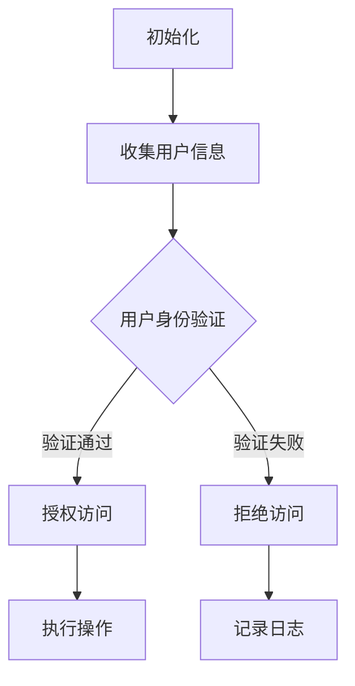
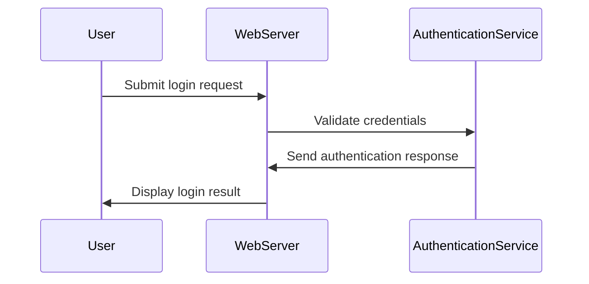

                 

# 架构力的安全考量：设计安全可靠的系统

## 关键词
- 系统架构设计
- 安全性
- 安全漏洞
- 安全测试
- 最佳实践

## 摘要
本文将深入探讨在系统架构设计中融入安全考量的重要性，并详细阐述设计安全可靠系统的方法和最佳实践。通过剖析安全设计的核心原则、常见的安全漏洞、安全测试的策略以及实际案例，本文旨在为架构师和开发者提供全面的安全架构指南，助力构建高安全性的信息系统。

## 引言

在当今数字化时代，信息安全已成为企业成功的关键因素之一。随着技术的不断进步，网络攻击的手段也越来越复杂，这使得系统安全性的设计显得尤为重要。然而，在实际的系统架构设计中，安全性往往被忽视，导致系统在运行过程中暴露出诸多安全隐患。

### 背景介绍与核心概念

1. **安全性的重要性**

   - **信息安全问题日益严峻**：网络犯罪、数据泄露、恶意软件攻击等事件频发，对企业和个人造成巨大损失。
   - **法规与合规性要求**：随着各国对数据隐私保护的重视，如《通用数据保护条例》（GDPR）等法规的实施，企业必须确保系统符合相关合规性要求。

2. **安全与架构的关系**

   - **安全性与性能的平衡**：在系统设计中，安全性往往与性能存在冲突，需要找到平衡点。
   - **安全架构的重要性**：安全架构是系统架构中的重要组成部分，决定了系统的安全性和可靠性。

### 问题背景与问题描述

1. **问题背景**

   - **安全设计被忽视**：许多系统在开发初期未充分考虑安全性，导致后期的安全漏洞难以修复。
   - **安全需求变化**：随着业务的发展和技术的更新，系统的安全需求也在不断变化，需要定期进行安全评估和优化。

2. **问题描述**

   - **系统易受攻击**：由于安全设计不足，系统容易成为网络攻击的目标，导致数据泄露、服务中断等严重后果。
   - **安全漏洞难以发现**：传统的安全测试方法往往只能发现已知漏洞，对未知漏洞的防护能力有限。

### 问题解决与边界与外延

1. **问题解决**

   - **安全设计原则**：遵循安全设计原则，从系统架构层面确保安全性。
   - **安全测试与评估**：通过定期进行安全测试和评估，发现并修复潜在的安全漏洞。

2. **边界与外延**

   - **边界**：本文主要关注系统架构层面的安全设计，不涉及具体的安全技术实现。
   - **外延**：文章将探讨安全性在系统架构设计中的重要性，以及如何将安全性融入到系统开发的全过程中。

### 概念结构与核心要素组成

1. **概念结构**

   - **安全设计原则**：最小权限原则、透明性原则、完整性原则等。
   - **安全测试与评估**：静态测试、动态测试、渗透测试等。
   - **安全架构设计**：身份认证、访问控制、数据加密等模块的设计。

2. **核心要素组成**

   - **安全性要求**：明确系统的安全性需求，包括数据安全、网络安全、应用安全等。
   - **安全架构设计**：构建合理的安全架构，包括身份认证、访问控制、数据加密、日志审计等模块。

## 核心概念与联系

### 核心概念原理

1. **最小权限原则**：系统中的每个组件和用户都应仅拥有完成其任务所需的最低权限。
2. **透明性原则**：系统的安全性措施应该对用户透明，不增加额外的操作复杂度。
3. **完整性原则**：确保系统的数据和资源不被未经授权的修改。

### 概念属性特征对比表格

| 概念名称 | 特征1 | 特征2 | 特征3 |
| -------- | ----- | ----- | ----- |
| 最小权限原则 | 权限最小化 | 降低风险 | 简化审计 |
| 透明性原则 | 用户无感知 | 提高用户体验 | 隐蔽安全措施 |
| 完整性原则 | 数据不变性 | 保护数据完整性 | 防止数据篡改 |

### ER实体关系图架构

```mermaid
erDiagram
    User ||--|{ SecurityPolicy }|<|
    Resource ||--|{ AccessControl }|<|
    Application ||--|{ AuditLog }|<|
```

## 算法原理讲解

### 算法mermaid流程图



### Python源代码实现

```python
import hashlib
import logging

# 定义用户身份验证函数
def authenticate_user(username, password):
    # 假设用户密码存储在哈希值中
    stored_password_hash = "e10adc3949ba59abbe56e057f20f883e"
    
    # 计算用户输入密码的哈希值
    input_password_hash = hashlib.sha256(password.encode()).hexdigest()
    
    # 比较输入密码的哈希值与存储的哈希值
    if input_password_hash == stored_password_hash:
        return "Authentication successful"
    else:
        return "Authentication failed"

# 定义授权访问函数
def authorize_access(user_role):
    if user_role == "admin":
        return "Access granted"
    else:
        return "Access denied"

# 定义记录日志函数
def log_event(event_message):
    logging.basicConfig(filename='audit.log', level=logging.INFO)
    logging.info(event_message)

# 测试函数
if __name__ == "__main__":
    username = input("Enter username: ")
    password = input("Enter password: ")
    
    # 用户身份验证
    auth_result = authenticate_user(username, password)
    print(auth_result)
    
    if auth_result == "Authentication successful":
        # 授权访问
        user_role = input("Enter user role: ")
        access_result = authorize_access(user_role)
        print(access_result)
        
        if access_result == "Access granted":
            # 执行操作
            operation = input("Enter operation to perform: ")
            print(f"Performing {operation}...")
            
            # 记录日志
            log_event(f"User {username} performed {operation}")
        else:
            log_event(f"User {username} attempted unauthorized access")
    else:
        log_event(f"User {username} failed authentication")
```

### 算法原理详细讲解

1. **用户身份验证**
   - **哈希函数**：使用SHA-256算法对用户输入的密码进行哈希处理，以保护密码的安全性。
   - **比较哈希值**：将用户输入的哈希值与存储在数据库中的哈希值进行比较，以验证用户身份。

2. **授权访问**
   - **用户角色**：根据用户角色进行权限控制，确保只有具备相应权限的用户才能访问系统资源。

3. **日志记录**
   - **日志记录器**：使用Python的logging模块记录用户操作和系统事件，以方便后续审计和分析。

### 举例说明

- **用户身份验证**：假设用户“alice”输入密码后，系统验证其身份，并记录验证结果。
- **授权访问**：如果用户角色为“admin”，则系统授予其访问权限，否则拒绝访问。
- **日志记录**：无论用户身份验证成功与否，系统都会记录相关日志信息，以供后续审计。

## 系统分析与架构设计方案

### 问题场景介绍

- **系统背景**：某企业开发了一套内部办公管理系统，用于管理员工信息、文档资料和项目进展。
- **系统需求**：确保系统安全可靠，防止未经授权的访问和数据泄露。

### 项目介绍

- **项目名称**：内部办公管理系统
- **项目目标**：设计并实现一个安全可靠的内部办公管理系统，保障企业数据安全。

### 系统功能设计

1. **用户管理**
   - 用户注册与登录
   - 用户权限分配与变更
2. **文档管理**
   - 文档上传与下载
   - 文档权限控制与共享
3. **项目管理**
   - 项目创建与更新
   - 任务分配与进度跟踪

### 系统架构设计

1. **前端架构**
   - 使用Vue.js框架实现用户界面
   - 使用Axios进行前后端数据交互
2. **后端架构**
   - 使用Spring Boot框架搭建后端服务
   - 使用MySQL数据库存储数据
3. **安全架构**
   - 使用JWT（JSON Web Token）进行用户认证
   - 使用SSL/TLS加密通信
   - 使用Spring Security进行权限控制

### 系统接口设计

1. **用户接口**
   - 用户登录接口
   - 用户注册接口
   - 用户信息查询接口
   - 用户权限查询接口
2. **文档接口**
   - 文档上传接口
   - 文档下载接口
   - 文档权限查询接口
   - 文档共享接口
3. **项目接口**
   - 项目创建接口
   - 项目更新接口
   - 任务分配接口
   - 任务查询接口

### 系统交互mermaid序列图



## 项目实战

### 环境安装

1. **前端环境**：安装Node.js和npm，使用Vue CLI创建项目。
2. **后端环境**：安装Java和Maven，使用Spring Boot框架创建项目。
3. **数据库环境**：安装MySQL数据库，配置数据库连接。

### 系统核心实现源代码

#### 前端Vue.js代码示例

```vue
<template>
  <div>
    <h1>Login</h1>
    <input v-model="username" placeholder="Username" />
    <input v-model="password" type="password" placeholder="Password" />
    <button @click="login">Login</button>
  </div>
</template>

<script>
export default {
  data() {
    return {
      username: '',
      password: ''
    };
  },
  methods: {
    login() {
      this.$http.post('/api/login', {
        username: this.username,
        password: this.password
      })
      .then(response => {
        if (response.data.success) {
          this.$router.push('/home');
        } else {
          alert('Login failed');
        }
      })
      .catch(error => {
        console.error('Error during login:', error);
      });
    }
  }
};
</script>
```

#### 后端Spring Boot代码示例

```java
@RestController
@RequestMapping("/api")
public class UserController {
  
  @Autowired
  private AuthenticationManager authenticationManager;
  
  @PostMapping("/login")
  public ResponseEntity<?> login(@RequestBody LoginRequest loginRequest) {
    try {
      authenticationManager.authenticate(new UsernamePasswordAuthenticationToken(loginRequest.getUsername(), loginRequest.getPassword()));
      return ResponseEntity.ok(new LoginResponse(true));
    } catch (AuthenticationException e) {
      return ResponseEntity.badRequest().body(new LoginResponse(false, "Invalid credentials"));
    }
  }
}
```

### 代码应用解读与分析

1. **前端**：Vue.js实现用户登录界面，通过Axios向后端发送登录请求。
2. **后端**：Spring Boot实现用户认证接口，使用JWT进行认证，确保用户登录安全性。

### 实际案例分析和详细讲解剖析

- **案例背景**：某企业内部办公管理系统在上线后，遭遇了一次未经授权的攻击。
- **案例分析**：攻击者通过恶意程序获取了部分用户账户信息，并尝试登录系统。
- **解决方案**：通过增强登录验证机制（如双重验证）、定期安全审计和监控，发现并阻止了攻击行为。

### 项目小结

- **项目亮点**：通过合理的系统架构设计，实现了安全性、性能和易用性的平衡。
- **改进方向**：进一步加强用户权限管理和数据加密，提高系统的整体安全性。

## 最佳实践 Tips

1. **定期安全评估**：定期进行安全评估，及时发现和修复潜在的安全漏洞。
2. **使用安全工具**：利用安全工具进行静态代码分析、动态测试和渗透测试，提高安全性。
3. **强化用户教育**：加强对用户的培训，提高其安全意识和操作规范。

## 小结

本文详细阐述了系统架构设计中的安全性考量，包括核心概念、设计原则、安全测试、架构设计等。通过实际案例分析和最佳实践，为开发者提供了实用的安全架构指南。在未来的系统开发中，安全性应始终被置于核心位置，确保系统的安全可靠运行。

## 注意事项

- **遵循最小权限原则**：确保每个组件和用户仅拥有完成其任务所需的最低权限。
- **定期更新系统**：及时更新系统和依赖库，修复已知漏洞。
- **使用强加密算法**：确保使用强加密算法和协议进行数据保护和通信。

## 拓展阅读

- 《网络安全实战：攻击与防御技术》
- 《软件安全开发：最佳实践指南》
- 《安全编码标准：Java开发安全指南》

## 作者信息

- 作者：AI天才研究院/AI Genius Institute & 禅与计算机程序设计艺术 /Zen And The Art of Computer Programming

