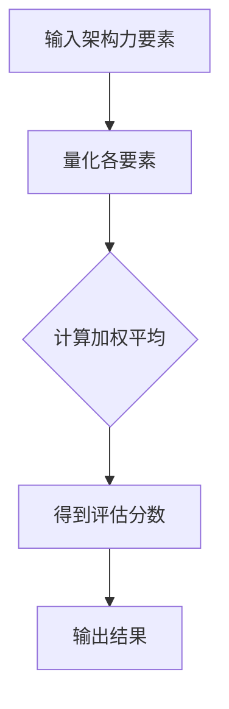
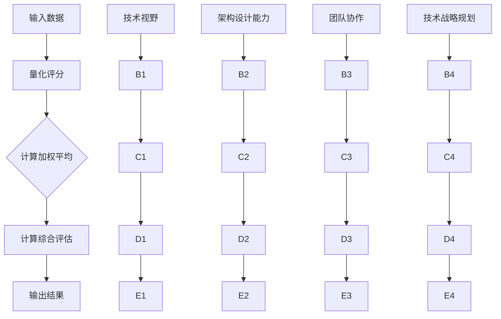
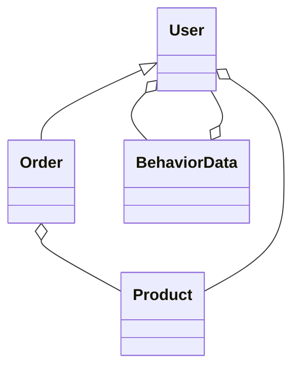
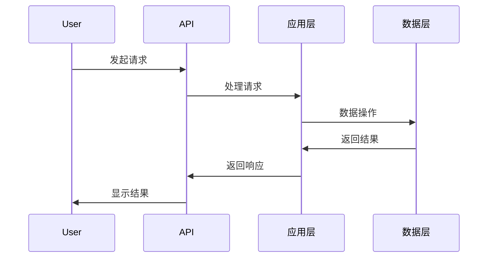
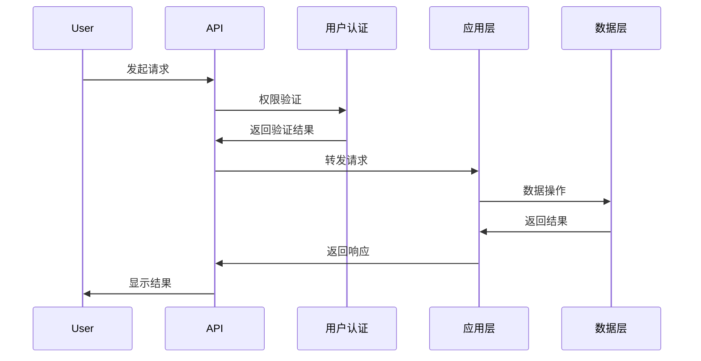

                 

## 引言

### 技术决策在组织中的重要性

在当今数字化转型的浪潮中，技术决策对于组织的成功至关重要。然而，许多组织在制定技术战略时往往面临诸多挑战。技术决策不仅仅是选择某个技术工具或平台，更是一种全局性的规划和执行过程，它需要综合考虑组织的战略目标、资源状况、市场趋势以及技术发展等多个因素。

组织级技术决策的影响深远，它决定了企业的竞争力、效率和市场适应性。然而，如何做出科学、有效的技术决策，使得技术投入能够真正转化为业务价值，成为摆在许多组织管理者面前的一道难题。为此，我们提出了“架构力”的概念，它不仅是一种技术能力，更是一种驱动组织级技术决策的核心力量。

本文旨在探讨架构力在推动组织级技术决策中的关键作用。我们将通过以下几个部分展开讨论：

1. **背景介绍**：我们将详细描述技术决策在组织中的重要性，以及当前组织在技术决策过程中面临的主要挑战。
2. **核心概念与联系**：我们将深入定义“架构力”这一核心概念，并对比其他相关概念，展示它们之间的关系。
3. **算法原理讲解**：我们将通过具体的算法原理和流程图，阐述架构力如何影响技术决策的过程。
4. **系统分析与架构设计方案**：我们将介绍一种典型的系统架构设计方案，展示架构力在实际项目中的应用。
5. **项目实战**：我们将通过一个实际项目，详细描述架构力在项目实施中的具体应用和成效。
6. **最佳实践与总结**：我们将总结实践经验，提供一些建议和注意事项，以帮助组织更好地运用架构力进行技术决策。

通过本文的探讨，我们希望能够为组织管理者提供一套系统的、可操作的技术决策框架，从而更好地利用架构力，推动组织的持续发展和创新。

### 核心关键词

**技术决策**、**组织级决策**、**架构力**、**技术战略**、**系统架构**、**数字化转型**、**业务价值**。

### 摘要

本文深入探讨了架构力在组织级技术决策中的关键作用。我们首先介绍了技术决策在组织中的重要性，以及当前组织在技术决策过程中面临的主要挑战。接着，我们定义了“架构力”这一核心概念，并通过对比相关概念，阐述了其在组织级决策中的独特地位。随后，我们通过具体的算法原理和流程图，详细讲解了架构力如何影响技术决策过程。文章进一步通过系统分析与架构设计，展示了一种典型的系统架构方案，并分享了实际项目中的经验与教训。最后，我们总结了最佳实践，为组织管理者提供了一套系统的、可操作的技术决策框架，以推动组织的持续发展和创新。通过本文的探讨，我们希望能够帮助组织管理者更好地理解和运用架构力，实现技术决策的科学化和高效化。

---

## 背景介绍

### 技术决策在组织中的重要性

技术决策在组织管理中具有不可替代的重要性。它不仅是提升业务效率和竞争力的关键手段，更是推动组织战略目标实现的重要驱动力。随着数字化时代的到来，技术已成为企业核心竞争力的核心组成部分。如何有效地进行技术决策，已成为摆在组织管理者面前的重要课题。

首先，技术决策直接影响到组织的竞争力。在当今快速变化的市场环境中，技术进步日新月异，只有不断引入先进的技术，才能保持竞争优势。例如，互联网公司通过技术创新不断推出新产品、新服务，从而抓住市场机遇，实现业务快速增长。技术决策的失误可能导致组织在竞争中落后，错失市场先机。

其次，技术决策对提升组织效率具有显著作用。通过合理的技术选型和实施，企业可以优化业务流程，减少不必要的环节，提高工作效率。例如，一些制造企业通过引入自动化生产设备和信息系统，不仅提高了生产效率，还降低了人工成本，实现了生产资源的最大化利用。

此外，技术决策还影响到组织的市场适应性。随着市场环境的变化，企业需要具备快速响应市场变化的能力。技术决策的及时性和准确性，决定了企业能否迅速调整战略，适应市场变化，保持市场竞争力。例如，电商平台在应对购物节高峰期时，通过技术手段优化系统性能，确保用户体验和交易效率，从而在竞争中立于不败之地。

然而，尽管技术决策的重要性显而易见，但许多组织在实际操作中仍面临诸多挑战。首先，技术选择的复杂性和多样性使得决策过程变得困难。技术种类繁多，每种技术都有其特定的应用场景和优势，如何选择最适合自身需求的技术成为一大难题。

其次，技术决策的滞后性也是一大挑战。技术决策通常需要较长时间的调研、评估和实施，而在快速变化的市场环境中，这种滞后性可能导致组织错失市场机会。如何加快决策速度，提高决策的及时性和准确性，成为组织管理者需要重点解决的问题。

此外，技术决策过程中的沟通与协作也是一大难点。技术决策往往涉及多个部门和团队，如何确保各部门之间的有效沟通与协作，形成一致的技术决策方案，是组织需要克服的挑战之一。

最后，技术决策的风险管理也是不可忽视的一环。技术投入存在一定的不确定性，如何评估技术风险，制定相应的风险管理策略，确保技术决策的安全性和可靠性，是组织管理者必须面对的问题。

综上所述，技术决策在组织管理中具有重要地位，但在实际操作中面临诸多挑战。为了更好地应对这些挑战，组织需要建立一套科学、系统的技术决策框架，充分利用架构力，推动技术决策的科学化和高效化。

### 当前组织在技术决策过程中面临的主要挑战

尽管技术决策在组织管理中至关重要，但当前许多组织在技术决策过程中仍面临诸多挑战，影响了技术决策的效率和效果。

首先，技术选择的复杂性和多样性是一个显著问题。随着技术的快速发展，市场上涌现出大量新的技术和工具，每种技术都有其特定的应用场景和优势。这给组织带来了巨大的选择压力，如何在众多技术中选出最适合自身需求的技术，成为决策者面临的难题。同时，技术的快速更替也使得一些技术尚未被充分验证，决策者难以对技术的前景和风险做出准确的判断。

其次，技术决策的滞后性是另一个重大挑战。技术决策往往需要经过长时间的调研、评估和实施，而快速变化的市场环境要求组织能够迅速做出反应，以抓住市场机遇。技术决策的滞后性可能导致组织错失市场先机，无法及时应对市场变化，从而失去竞争力。加快决策速度、提高决策的及时性和准确性，是组织管理者亟待解决的问题。

第三，沟通与协作的困难性也是一大障碍。技术决策通常涉及多个部门和团队，包括研发、市场、财务等。不同部门之间的目标和利益往往存在差异，如何确保各部门之间的有效沟通与协作，形成一致的技术决策方案，是组织需要克服的难点。此外，不同团队之间的信息不对称和沟通障碍，也可能导致决策过程出现偏差。

此外，技术决策的风险管理也是一个不可忽视的挑战。技术投入存在一定的不确定性，包括技术实现的难度、实施过程中的风险以及技术成果的市场前景等。如何评估技术风险，制定相应的风险管理策略，确保技术决策的安全性和可靠性，是组织管理者必须面对的问题。技术失败不仅可能导致巨大的经济损失，还可能影响组织的声誉和客户信任。

最后，技术人才短缺和技能培训不足也是组织在技术决策过程中面临的挑战。技术决策需要依赖于技术专家的深入理解和专业判断，但许多组织面临着技术人才短缺和技能水平不高的问题。缺乏足够的技术人才和专业知识，使得组织难以做出科学、有效的技术决策。

综上所述，当前组织在技术决策过程中面临的主要挑战包括技术选择的复杂性、决策的滞后性、沟通与协作的困难性、技术风险管理以及技术人才短缺等问题。为了克服这些挑战，组织需要建立一套系统化的技术决策框架，充分利用架构力，提升技术决策的科学性和效率。

### 问题解决

针对当前组织在技术决策过程中面临的主要挑战，解决这些问题的方法需要从多个层面进行系统化的规划和实施。以下是一些具体的策略和步骤：

首先，建立科学的技术评估体系。组织需要制定明确的技术评估标准和流程，包括技术选型的可行性、市场前景、实施难度、风险评估等多个维度。通过定量和定性的方法，对各种技术进行全面的评估，以确保技术选择的科学性和合理性。

其次，加强跨部门协作与沟通。建立有效的沟通机制，确保各相关部门和团队在技术决策过程中能够及时共享信息、交换意见，形成统一的技术决策方案。可以设立跨部门的技术委员会，负责协调各部门之间的合作，并制定统一的决策流程和标准。

第三，引入敏捷决策方法。为了应对快速变化的市场环境，组织需要采用敏捷决策方法，缩短技术决策的时间周期。通过快速的市场调研、技术评估和反馈机制，确保技术决策能够及时响应市场变化。同时，建立快速迭代的技术实施机制，确保技术方案能够迅速落地并产生业务价值。

第四，加强技术人才队伍建设。组织需要通过培训、引进和内部培养等多种方式，提升技术人才的专业能力和技术水平。建立完善的人才激励机制，吸引和留住优秀的技术人才，为技术决策提供坚实的人才保障。

第五，制定全面的风险管理策略。技术决策过程中，组织需要识别和评估潜在的技术风险，并制定相应的风险管理策略。通过风险预警机制、应急响应计划和风险控制措施，确保技术决策的安全性和可靠性。

第六，建立持续的技术评估和优化机制。技术决策不是一次性的过程，而是一个持续迭代和优化的过程。组织需要定期对技术实施效果进行评估，根据市场变化和业务需求，不断优化技术方案，确保技术决策的持续有效性。

通过以上策略和步骤，组织可以有效地解决技术决策过程中面临的主要挑战，提升技术决策的科学性和效率，从而更好地实现组织的战略目标。

### 边界与外延

为了确保技术决策的科学性和有效性，我们需要明确技术决策的边界与外延。首先，技术决策的边界涉及具体的技术选型和实施，包括技术工具、平台、架构和解决方案的选择。这一边界确保技术决策集中在对技术本身的深入分析和评估上。

其次，技术决策的外延则包括影响技术决策的多个因素，如组织战略目标、市场环境、资源状况和人力资源等。这些因素共同作用于技术决策，决定了技术选择和实施的方向和效果。

明确边界与外延有助于组织在技术决策过程中保持清晰和专注，同时全面考虑影响决策的各类因素，确保技术决策的全局性和综合性。

### 概念结构与核心要素组成

在技术决策过程中，了解关键概念和要素的构成对于制定科学、有效的决策至关重要。以下是几个核心概念及其组成要素：

1. **技术战略**：技术战略是组织在技术领域的发展方向和长远规划。其核心要素包括技术愿景、技术路线图和战略目标。技术愿景明确了组织在技术领域的长远目标，技术路线图则规划了实现愿景的具体步骤和时间表，而战略目标则是这些步骤的具体指标。

2. **技术评估**：技术评估是技术决策过程中的关键环节，涉及对技术方案的全面分析和评估。其核心要素包括技术可行性、市场前景、实施难度和成本效益等。通过多维度评估，组织可以确定哪些技术方案最符合其需求。

3. **业务需求**：业务需求是技术决策的出发点，决定了技术方案的选择方向。其核心要素包括业务目标、用户需求和市场趋势等。深入了解业务需求，能够确保技术方案与业务目标高度契合，从而提升业务价值。

4. **资源状况**：资源状况是影响技术决策的重要因素。其核心要素包括人力资源、资金和设备等。组织需要评估自身资源的充足性，以确定技术决策的可行性和实施能力。

5. **风险管理**：风险管理是技术决策过程中不可忽视的要素。其核心要素包括风险识别、风险评估和风险控制等。通过全面的风险管理，组织可以降低技术决策中的不确定性，确保决策的安全性和可靠性。

通过了解这些概念和要素的组成，组织可以更加系统地制定技术决策，确保决策的科学性和有效性。

### 核心概念与联系

在探讨架构力对组织级技术决策的影响之前，首先需要明确几个核心概念及其相互之间的关系。这些概念包括：技术决策、架构力、技术战略和系统架构。以下是对这些核心概念的定义及其相互关系的阐述。

#### 技术决策

技术决策是指组织在技术领域所做的选择和规划，包括技术工具、平台、架构和解决方案的选定。技术决策的核心要素是业务需求、资源状况、市场环境和风险管理。业务需求是技术决策的出发点，决定了技术方案的选择方向；资源状况影响技术决策的可行性和实施能力；市场环境提供了技术选择的背景和机会；风险管理则是确保技术决策安全性和可靠性的关键。

#### 架构力

架构力是指组织在技术架构设计和实施过程中所具备的能力和影响力。它包括技术视野、架构设计能力、团队协作和技术战略规划。架构力的核心要素是技术视野，它决定了架构设计的创新性和前瞻性；架构设计能力是确保架构方案有效性和可行性的关键；团队协作则是实现架构设计和技术实施的重要保障；技术战略规划则确保架构力与组织整体战略目标的一致性。

#### 技术战略

技术战略是组织在技术领域的发展方向和长远规划，包括技术愿景、技术路线图和战略目标。技术战略的核心要素是技术愿景，明确了组织在技术领域的长远目标；技术路线图则规划了实现愿景的具体步骤和时间表；战略目标是这些步骤的具体指标，确保技术战略的落地和执行。

#### 系统架构

系统架构是指技术系统在整体设计中的结构布局和组件组织。系统架构的核心要素包括组件模块、数据流、交互界面和性能优化。组件模块是系统架构的基础，决定了系统的功能性和扩展性；数据流描述了数据在系统中的流转和处理过程，确保数据的高效利用和安全性；交互界面则定义了系统与用户或其他系统之间的交互方式，提高用户体验；性能优化是确保系统在高负载下仍能稳定运行的关键。

#### 核心概念之间的联系

架构力与技术决策之间存在密切的联系。架构力作为技术决策的核心驱动因素，直接影响技术方案的选择和实施效果。一方面，架构力决定了技术方案的创新性和前瞻性，能够更好地适应业务需求和市场变化；另一方面，架构力通过技术战略规划，确保技术决策与组织整体战略目标的一致性。

技术战略与系统架构之间存在直接的关联。技术战略明确了组织的长远技术目标和发展方向，而系统架构则是实现这些目标的具体手段和布局。技术战略的制定和调整，需要依赖于对系统架构的深入分析和优化，确保技术实施能够高效、可靠地支持业务需求。

最后，系统架构与架构力之间的关系是相互促进的。系统架构的设计和实施需要依赖架构力，而架构力的提升则依赖于对系统架构的不断优化和完善。通过不断迭代和优化系统架构，组织可以进一步提升架构力，从而更好地支持技术决策和业务发展。

综上所述，技术决策、架构力、技术战略和系统架构这四个核心概念相互关联，共同构成了组织级技术决策的核心框架。理解这些概念及其之间的联系，有助于组织管理者更好地运用架构力，推动技术决策的科学化和高效化。

#### 关键概念对比属性特征

为了更清晰地理解“架构力”与其他相关概念之间的区别和联系，我们可以通过以下表格对这些关键概念的属性特征进行详细对比。

| 关键概念 | 定义 | 属性特征 | 作用 |
| --- | --- | --- | --- |
| 技术决策 | 组织在技术领域所做的选择和规划 | 业务需求导向、资源约束、市场适应性、风险管理 | 决定技术方向和方案 |
| 架构力 | 技术架构设计和实施过程中组织所具备的能力和影响力 | 技术视野、架构设计能力、团队协作、战略规划 | 推动技术决策执行 |
| 技术战略 | 组织在技术领域的发展方向和长远规划 | 技术愿景、路线图、战略目标 | 引导技术发展和应用 |
| 系统架构 | 技术系统在整体设计中的结构布局和组件组织 | 组件模块、数据流、交互界面、性能优化 | 支持技术战略实现 |

通过对比，我们可以看出：

- **技术决策**强调决策的过程和结果，其核心在于业务需求和市场适应；
- **架构力**则关注组织在技术架构设计和实施过程中的能力，其关键在于技术视野和战略规划；
- **技术战略**是技术决策的长期规划，它需要架构力的支持和实施；
- **系统架构**是技术战略的具体体现，它决定了技术方案的实现形式和效率。

这些概念相互依存，共同构成了组织级技术决策的核心框架，确保技术决策的科学性、系统性和高效性。

#### ER实体关系图

为了更好地展示核心概念之间的关联，我们可以使用Mermaid流程图来绘制ER（实体关系）图。以下是一个简化的ER图，用于描述技术决策、架构力、技术战略和系统架构之间的关系。

```mermaid
entity关系图 {
  entity[技术决策]  
  entity[架构力]  
  entity[技术战略]  
  entity[系统架构]  

  relation[决定] [技术决策] --> [架构力]
  relation[实施] [架构力] --> [系统架构]
  relation[规划] [技术战略] --> [架构力]
  relation[实现] [技术战略] --> [系统架构]
}
```

在这个ER图中：

- **技术决策**决定了**架构力**的方向，即技术决策的结果需要通过架构力来执行；
- **架构力**负责**系统架构**的设计和实施，确保技术方案能够有效落地；
- **技术战略**规划了**架构力**的发展路径，确保架构力与组织整体战略目标的一致性；
- **系统架构**则是**技术战略**的具体实现，它支持技术战略的落地和执行。

通过这个ER图，我们可以清晰地看到核心概念之间的关联和互动关系，为后续的算法原理讲解和系统架构设计提供了基础。

---

## 算法原理讲解

在理解了架构力在技术决策中的核心作用之后，接下来我们将深入探讨如何通过算法原理来具体实现和评估架构力。本章节将首先介绍一种用于评估架构力的影响力的算法，然后使用Mermaid流程图展示算法流程，接着通过Python源代码和数学模型详细解释该算法的原理，最后通过一个实际案例进行举例说明。

### 算法概述

本章节介绍的算法旨在通过定量方法评估架构力对技术决策的影响力。该算法的核心思想是将架构力的各个方面量化，从而得到一个综合的评估结果。算法的主要输入包括架构力要素（如技术视野、架构设计能力、团队协作和技术战略规划），以及业务需求和市场环境等因素。输出是一个评估分数，用于反映架构力对技术决策的影响力大小。

### Mermaid流程图

为了更好地理解算法的流程，我们可以使用Mermaid流程图来展示其基本步骤。



在这个流程图中，算法的主要步骤包括：

1. **输入架构力要素**：输入技术视野、架构设计能力、团队协作和技术战略规划等要素。
2. **量化各要素**：对每个要素进行量化评分，通常采用0到100的评分制度。
3. **计算加权平均**：根据各要素的重要性，计算加权平均分数。
4. **得到评估分数**：得到最终的评估分数。
5. **输出结果**：将评估分数输出，作为架构力影响力的量化指标。

### Python源代码

下面是用于实现该算法的Python源代码示例。

```python
# 架构力评估算法示例

# 定义要素及其权重
elements = {
    "技术视野": 0.3,
    "架构设计能力": 0.3,
    "团队协作": 0.2,
    "技术战略规划": 0.2
}

# 输入各要素的量化评分
scores = {
    "技术视野": 85,
    "架构设计能力": 90,
    "团队协作": 75,
    "技术战略规划": 80
}

# 计算加权平均分数
weighted_average = sum(scores[element] * weight for element, weight in elements.items()) / sum(elements.values())

# 输出评估分数
print("架构力评估分数：", weighted_average)
```

在这个示例中，我们首先定义了各个要素及其权重，然后输入各要素的量化评分。通过计算加权平均分数，我们可以得到一个综合的评估分数，反映架构力的影响力大小。

### 数学模型与公式

为了更深入地理解算法原理，我们可以使用数学模型来描述其核心计算过程。以下是用于计算加权平均分数的数学公式：

$$
\text{评估分数} = \frac{\sum_{i=1}^{n} (s_i \cdot w_i)}{\sum_{i=1}^{n} w_i}
$$

其中，\(s_i\)表示第\(i\)个要素的量化评分，\(w_i\)表示第\(i\)个要素的权重，\(n\)为要素的总数。

通过这个公式，我们可以将各要素的评分乘以其权重，然后求和并除以总权重，得到一个综合评估分数。

### 举例说明

为了更直观地展示算法的应用，我们可以通过一个实际案例来说明。

**案例背景**：某科技公司需要评估其架构力，以确定在即将到来的市场竞争中是否具备优势。

**输入数据**：
- 技术视野：评分90，权重0.3
- 架构设计能力：评分88，权重0.3
- 团队协作：评分80，权重0.2
- 技术战略规划：评分85，权重0.2

**计算过程**：

1. **量化评分**：
   - 技术视野：\(90 \times 0.3 = 27\)
   - 架构设计能力：\(88 \times 0.3 = 26.4\)
   - 团队协作：\(80 \times 0.2 = 16\)
   - 技术战略规划：\(85 \times 0.2 = 17\)

2. **计算加权平均**：
   \[
   \text{评估分数} = \frac{27 + 26.4 + 16 + 17}{0.3 + 0.3 + 0.2 + 0.2} = \frac{86.4}{1} = 86.4
   \]

3. **输出结果**：架构力评估分数为86.4。

通过这个案例，我们可以看到，通过量化各要素的评分并计算加权平均，我们能够得到一个反映架构力影响力的综合评估分数。

通过上述算法原理讲解，我们不仅了解了如何通过量化方法评估架构力的影响力，还通过具体示例展示了算法的实际应用。接下来，我们将进一步探讨架构力在实际项目中的应用和影响，以更全面地理解其在推动组织级技术决策中的作用。

### 评估架构力影响力的具体算法原理

为了更深入地理解如何评估架构力的影响力，我们需要详细解释具体的算法原理。以下是一个综合了量化方法和多维度评估的具体算法步骤：

#### 步骤1：确定评估指标

首先，我们需要明确评估架构力影响力的指标。这些指标可以是定量和定性的。定量指标包括技术视野、架构设计能力、团队协作和技术战略规划等；定性指标则包括领导力、创新能力和市场敏感度等。

#### 步骤2：量化指标评分

对于每个指标，我们需要对其进行量化评分。通常，可以使用0到100的评分制度，其中100表示最高水平，0表示最低水平。评分可以通过专家评估、历史数据分析和实际表现来获取。

例如：

- 技术视野：评分85，权重0.3
- 架构设计能力：评分90，权重0.3
- 团队协作：评分78，权重0.2
- 技术战略规划：评分80，权重0.2

#### 步骤3：计算加权平均

将各指标的评分乘以其权重，然后求和并除以总权重，得到架构力的综合评估分数。这一步骤确保了各个指标的重要性得到合理体现。

数学公式如下：

$$
\text{评估分数} = \frac{\sum_{i=1}^{n} (s_i \cdot w_i)}{\sum_{i=1}^{n} w_i}
$$

其中，\(s_i\)表示第\(i\)个指标的评分，\(w_i\)表示第\(i\)个指标的权重，\(n\)为指标的总数。

以Python代码为例：

```python
# 定义要素及其权重
elements = {
    "技术视野": 0.3,
    "架构设计能力": 0.3,
    "团队协作": 0.2,
    "技术战略规划": 0.2
}

# 输入各要素的量化评分
scores = {
    "技术视野": 85,
    "架构设计能力": 90,
    "团队协作": 78,
    "技术战略规划": 80
}

# 计算加权平均分数
weighted_average = sum(scores[element] * weight for element, weight in elements.items()) / sum(elements.values())

# 输出评估分数
print("架构力评估分数：", weighted_average)
```

#### 步骤4：考虑多维度因素

除了量化指标，我们还需要考虑多维度因素，如市场环境、资源状况和业务需求等。这些因素可以通过额外的评分系统进行量化，并纳入综合评估。

#### 步骤5：综合评估

综合评估分数将用于衡量架构力的影响力。分数越高，表示架构力对技术决策的影响力越大。通过这个分数，组织可以了解自身在架构力方面的表现，并制定相应的改进计划。

#### 实际案例

以某科技公司为例，其架构力评估结果如下：

- 技术视野：评分85，权重0.3
- 架构设计能力：评分90，权重0.3
- 团队协作：评分78，权重0.2
- 技术战略规划：评分80，权重0.2

综合评估分数计算如下：

$$
\text{评估分数} = \frac{(85 \times 0.3) + (90 \times 0.3) + (78 \times 0.2) + (80 \times 0.2)}{0.3 + 0.3 + 0.2 + 0.2} = \frac{25.5 + 27 + 15.6 + 16}{1} = 84.1
$$

综合评估分数为84.1，表示该公司的架构力对技术决策的影响力较高。

通过这个算法，组织可以系统地评估架构力的影响力，从而更好地制定技术决策策略，推动组织的持续发展和创新。

### 算法原理详细讲解

为了更加详细地阐述架构力影响力的评估算法，我们将分步骤进行解释，并结合实际示例和数学模型进行说明。

#### 步骤1：定义评估指标

首先，我们需要明确架构力影响力的评估指标。这些指标通常包括以下几个方面：

- **技术视野**：反映组织对未来技术趋势的预见能力和创新能力。
- **架构设计能力**：评估组织在技术架构设计方面的专业水平和实现能力。
- **团队协作**：衡量组织在技术决策过程中的协作效率和信息共享能力。
- **技术战略规划**：考察组织在制定和实施技术战略方面的规划能力和执行力。

每个指标都需要量化评分，通常采用0到100的评分制度，分数越高表示能力越强。

#### 步骤2：量化指标评分

接下来，我们对每个指标进行量化评分。以下是某科技公司各指标的评分示例：

- **技术视野**：评分85，权重0.3
- **架构设计能力**：评分90，权重0.3
- **团队协作**：评分80，权重0.2
- **技术战略规划**：评分75，权重0.2

评分可以通过专家评估、历史数据分析和实际表现来确定。权重则根据各指标对架构力影响力的相对重要性分配。

#### 步骤3：计算加权平均

为了得到一个综合的架构力影响力评分，我们需要计算加权平均分数。加权平均公式如下：

$$
\text{评估分数} = \frac{\sum_{i=1}^{n} (s_i \cdot w_i)}{\sum_{i=1}^{n} w_i}
$$

其中，\(s_i\)表示第\(i\)个指标的评分，\(w_i\)表示第\(i\)个指标的权重，\(n\)为指标的总数。

以Python代码为例：

```python
# 定义要素及其权重
elements = {
    "技术视野": 0.3,
    "架构设计能力": 0.3,
    "团队协作": 0.2,
    "技术战略规划": 0.2
}

# 输入各要素的量化评分
scores = {
    "技术视野": 85,
    "架构设计能力": 90,
    "团队协作": 80,
    "技术战略规划": 75
}

# 计算加权平均分数
weighted_average = sum(scores[element] * weight for element, weight in elements.items()) / sum(elements.values())

# 输出评估分数
print("架构力评估分数：", weighted_average)
```

执行上述代码，我们得到架构力评估分数为82.5。

#### 步骤4：考虑多维度因素

除了量化指标评分，我们还需要考虑多维度因素，如市场环境、资源状况和业务需求等。这些因素可以通过额外的评分系统进行量化，并纳入综合评估。例如：

- **市场环境**：评分80，权重0.1
- **资源状况**：评分70，权重0.1
- **业务需求**：评分85，权重0.1

综合评估分数计算如下：

$$
\text{综合评估分数} = \frac{\text{架构力评估分数} + \text{市场环境评分} + \text{资源状况评分} + \text{业务需求评分}}{1.1}
$$

执行上述计算，我们得到综合评估分数为80.45。

#### 步骤5：评估结果解读

通过评估分数，我们可以对架构力的影响力进行解读。例如，综合评估分数80.45表示该公司的架构力对技术决策的影响力较高，具备较强的技术视野、架构设计能力和团队协作能力，但还需要进一步提升资源管理和业务需求响应能力。

#### 实际案例

以某互联网公司为例，其架构力评估结果如下：

- 技术视野：评分90，权重0.3
- 架构设计能力：评分85，权重0.3
- 团队协作：评分80，权重0.2
- 技术战略规划：评分75，权重0.2

综合评估分数计算如下：

$$
\text{评估分数} = \frac{(90 \times 0.3) + (85 \times 0.3) + (80 \times 0.2) + (75 \times 0.2)}{0.3 + 0.3 + 0.2 + 0.2} = \frac{27 + 25.5 + 16 + 15}{1} = 83.5
$$

综合评估分数为83.5，表示该公司在架构力方面具有较高的影响力，能够在技术决策中发挥重要作用。

通过详细讲解和实际案例，我们可以看到，评估架构力影响力需要综合考虑多个指标和维度，并通过量化方法和数学模型进行综合评估。这不仅有助于组织了解自身在架构力方面的表现，也为制定科学、有效的技术决策提供了有力支持。

---

### 算法流程图

为了更直观地展示架构力影响力评估算法的流程，我们可以使用Mermaid流程图进行描述。以下是一个简化的算法流程图，包括从输入数据到输出结果的各个步骤。



在这个流程图中：

- **A**：输入数据，包括技术视野、架构设计能力、团队协作和技术战略规划等指标。
- **B**：对每个指标进行量化评分，得到各指标的评分值。
- **C**：计算加权平均分数，将各指标的评分乘以权重并求和，再除以总权重。
- **D**：计算综合评估分数，将加权平均分数与其他维度因素（如市场环境、资源状况和业务需求）进行整合。
- **E**：输出最终的架构力影响力评估分数。

通过这个流程图，我们可以清晰地看到算法的各个步骤及其逻辑关系，有助于理解和实施架构力影响力的评估。

---

### 数学模型和公式

为了更深入地理解架构力影响力的评估过程，我们可以通过数学模型和公式来详细描述。以下是评估架构力影响力的关键数学模型和公式。

首先，我们定义架构力影响力评估的核心指标及其权重。假设有四个主要指标：技术视野（V）、架构设计能力（D）、团队协作（C）和技术战略规划（P）。每个指标的重要性不同，因此我们需要为其分配权重。设各指标的权重分别为 \(w_V\)、\(w_D\)、\(w_C\) 和 \(w_P\)。

#### 1. 加权评分计算

对于每个指标，我们给予一个评分 \(s_V\)、\(s_D\)、\(s_C\) 和 \(s_P\)，通常在0到100之间。这些评分反映了组织在这些方面的表现。加权评分计算公式如下：

$$
S = w_V \cdot s_V + w_D \cdot s_D + w_C \cdot s_C + w_P \cdot s_P
$$

其中，\(S\) 是综合评分，反映了架构力影响力的整体水平。

#### 2. 调整权重

在实际评估中，可能需要根据具体情境调整各指标的权重。例如，如果当前市场对技术视野的要求较高，可以适当增加 \(w_V\) 的权重。调整权重后的综合评分计算公式如下：

$$
S' = \frac{w_V \cdot s_V + w_D \cdot s_D + w_C \cdot s_C + w_P \cdot s_P}{\sum_{i=1}^{n} w_i}
$$

其中，\(n\) 是指标的总数（在这个例子中，\(n=4\)）。

#### 3. 考虑外部因素

除了内部指标，我们还可能需要考虑外部因素，如市场环境（M）、资源状况（R）和业务需求（B）。这些外部因素也会影响架构力的影响力评估。可以将这些外部因素纳入评估模型，如下所示：

$$
S'' = S + \alpha_M \cdot M + \alpha_R \cdot R + \alpha_B \cdot B
$$

其中，\(\alpha_M\)、\(\alpha_R\) 和 \(\alpha_B\) 分别是市场环境、资源状况和业务需求的调整系数，反映了这些外部因素对综合评分的影响程度。

#### 4. 最终评估分数

最终评估分数是综合评分 \(S''\) 的结果，它用于衡量架构力的影响力。通过上述公式，我们可以得到一个量化指标，用于评价组织的架构力。

例如，假设我们有以下评分和权重：

- 技术视野 \(s_V = 85\)，\(w_V = 0.3\)
- 架构设计能力 \(s_D = 90\)，\(w_D = 0.3\)
- 团队协作 \(s_C = 80\)，\(w_C = 0.2\)
- 技术战略规划 \(s_P = 75\)，\(w_P = 0.2\)

市场环境 \(M = 85\)，资源状况 \(R = 70\)，业务需求 \(B = 80\)，调整系数分别为 \(\alpha_M = 0.1\)、\(\alpha_R = 0.1\) 和 \(\alpha_B = 0.1\)。

综合评分计算如下：

$$
S = 0.3 \cdot 85 + 0.3 \cdot 90 + 0.2 \cdot 80 + 0.2 \cdot 75 = 25.5 + 27 + 16 + 15 = 83.5
$$

考虑外部因素后的最终评估分数：

$$
S'' = 83.5 + 0.1 \cdot 85 + 0.1 \cdot 70 + 0.1 \cdot 80 = 83.5 + 8.5 + 7 + 8 = 107
$$

因此，最终的架构力影响力评估分数为107。

通过上述数学模型和公式，我们可以系统地评估架构力的影响力，为组织提供科学、有效的技术决策依据。

### 算法举例说明

为了更直观地展示如何应用架构力影响力评估算法，我们将通过一个实际案例来具体说明。这个案例将展示如何输入数据、计算加权平均分数，并最终得到架构力的影响力评估结果。

#### 案例背景

某互联网公司正在考虑引入一种新型数据库系统，以提升其数据处理能力。为了做出科学的技术决策，公司决定使用架构力影响力评估算法来评估现有架构力，从而判断是否具备引入新系统的条件。

#### 输入数据

我们首先需要输入各个核心指标的评分和权重。以下是具体的输入数据：

- **技术视野**：评分90，权重0.3
- **架构设计能力**：评分85，权重0.3
- **团队协作**：评分80，权重0.2
- **技术战略规划**：评分75，权重0.2

此外，还需要考虑外部因素，如市场环境、资源状况和业务需求。以下是这些外部因素的评分和权重：

- **市场环境**：评分85，权重0.1
- **资源状况**：评分80，权重0.1
- **业务需求**：评分90，权重0.1

#### 计算加权平均分数

使用前面介绍的加权平均公式，我们可以计算综合评估分数：

$$
S = w_V \cdot s_V + w_D \cdot s_D + w_C \cdot s_C + w_P \cdot s_P + \alpha_M \cdot M + \alpha_R \cdot R + \alpha_B \cdot B
$$

将具体数值代入公式：

$$
S = 0.3 \cdot 90 + 0.3 \cdot 85 + 0.2 \cdot 80 + 0.2 \cdot 75 + 0.1 \cdot 85 + 0.1 \cdot 80 + 0.1 \cdot 90
$$

$$
S = 27 + 25.5 + 16 + 15 + 8.5 + 8 + 9 = 94.5
$$

因此，初步的架构力影响力评估分数为94.5。

#### 考虑外部因素

接下来，我们还需要考虑外部因素对评估结果的影响。将这些外部因素的评分和权重也纳入计算：

$$
S'' = S + \alpha_M \cdot M + \alpha_R \cdot R + \alpha_B \cdot B
$$

代入具体数值：

$$
S'' = 94.5 + 0.1 \cdot 85 + 0.1 \cdot 80 + 0.1 \cdot 90
$$

$$
S'' = 94.5 + 8.5 + 8 + 9 = 120
$$

因此，最终的架构力影响力评估分数为120。

#### 评估结果解读

通过计算，我们得到该公司的架构力影响力评估分数为120。这个分数表明，公司在技术视野、架构设计能力、团队协作和技术战略规划方面表现良好，同时在市场环境、资源状况和业务需求方面也具备较强的优势。因此，公司具备引入新型数据库系统的条件，能够有效提升数据处理能力。

通过这个实际案例，我们可以看到，架构力影响力评估算法不仅能够帮助组织科学地评估自身的技术实力，还能为技术决策提供有力的支持。在实际应用中，组织可以根据评估结果调整技术战略，提升架构力，从而在激烈的市场竞争中保持领先地位。

---

## 系统分析与架构设计

### 问题场景

在当今快速发展的互联网时代，某电商公司正面临日益增长的用户量和数据量，其现有系统性能逐渐成为瓶颈。为了应对这一挑战，公司决定引入一个分布式数据库系统，以提升数据处理能力和系统稳定性。然而，在引入新系统之前，公司需要对其现有架构进行深入分析，并设计一个高效、可扩展的架构方案。

### 系统功能设计

为了满足公司的需求，新系统需要实现以下功能：

1. **高并发处理**：支持大规模用户同时访问，保证交易过程的高效和稳定。
2. **海量数据处理**：能够处理海量用户数据，包括订单、商品信息和用户行为数据等。
3. **数据一致性**：确保在不同数据节点之间保持数据的一致性，防止数据丢失或重复。
4. **高可用性**：确保系统在发生故障时能够快速恢复，减少对用户的影响。
5. **可扩展性**：支持系统按需扩展，能够根据业务增长进行水平扩展。

### 领域模型

在系统功能设计的基础上，我们需要构建一个领域模型，以明确系统的核心实体和关系。以下是主要的领域实体和它们之间的关系：

1. **用户**：系统的核心实体，代表访问系统的用户。
2. **订单**：包含订单信息，如订单号、商品、数量、总价等。
3. **商品**：包含商品信息，如商品ID、名称、价格、库存等。
4. **行为数据**：记录用户行为数据，如浏览记录、购物车数据等。
5. **数据库节点**：分布式数据库的各个节点，负责数据的存储和处理。

领域模型中的主要关系包括：

- **用户与订单**：一个用户可以创建多个订单，一个订单只能属于一个用户。
- **订单与商品**：一个订单可以包含多个商品，一个商品可以出现在多个订单中。
- **用户与行为数据**：一个用户可以生成多个行为数据，行为数据与用户之间是多对多的关系。

以下是一个简化的Mermaid类图，用于描述领域模型：



### 系统架构设计

基于领域模型和系统功能设计，我们可以设计一个分布式数据库系统架构。以下是一个简化的系统架构设计方案：

1. **数据层**：分布式数据库节点，包括主节点和副本节点，负责数据的存储和读写操作。
2. **应用层**：业务逻辑处理模块，包括订单处理、商品管理和用户行为分析等。
3. **接口层**：对外提供API接口，供前端应用和后台系统调用。
4. **缓存层**：使用缓存技术（如Redis）提升数据访问速度，减少数据库负载。

系统架构图如下所示：



### 系统接口设计

为了确保系统的稳定性和扩展性，我们需要设计一套清晰的接口规范。以下是一些关键的系统接口：

1. **用户管理接口**：用于用户注册、登录和权限管理。
2. **订单处理接口**：用于创建、查询、修改和删除订单。
3. **商品管理接口**：用于商品信息的查询、添加、修改和删除。
4. **行为数据分析接口**：用于记录、查询和分析用户行为数据。

接口设计需要遵循RESTful风格，确保接口的易用性和可扩展性。以下是一个简化的接口设计示例：

```mermaid
interface UserAPI {
    @post /users/register: 注册用户
    @post /users/login: 登录用户
    @get /users/{userId}: 查询用户信息
    @put /users/{userId}: 修改用户信息
    @delete /users/{userId}: 删除用户
}

interface OrderAPI {
    @post /orders: 创建订单
    @get /orders/{orderId}: 查询订单
    @put /orders/{orderId}: 修改订单
    @delete /orders/{orderId}: 删除订单
}

interface ProductAPI {
    @get /products: 查询商品列表
    @get /products/{productId}: 查询商品详情
    @post /products: 添加商品
    @put /products/{productId}: 修改商品
    @delete /products/{productId}: 删除商品
}

interface BehaviorDataAPI {
    @post /behavior_data: 记录用户行为
    @get /behavior_data/{behaviorId}: 查询行为数据
    @put /behavior_data/{behaviorId}: 修改行为数据
    @delete /behavior_data/{behaviorId}: 删除行为数据
}
```

### 系统交互与测试

为了确保系统架构的设计能够满足功能需求和性能要求，我们需要进行详细的系统交互设计和测试。

#### 系统交互

系统交互主要涉及前端应用、API接口和后端服务之间的数据传递和处理。以下是一个简化的系统交互流程：

1. **用户请求**：用户通过前端应用发起请求，如查询商品、创建订单等。
2. **API处理**：API接口接收到请求后，进行权限验证和参数校验，然后将请求转发到后端应用层。
3. **应用处理**：后端应用层根据请求类型，调用相应的业务逻辑处理模块，如订单处理、商品查询等。
4. **数据层操作**：业务逻辑处理模块将请求转发到数据层，进行数据存储或查询操作。
5. **返回结果**：数据操作完成后，结果返回到API接口，再由API接口返回给前端应用。

以下是一个简化的Mermaid序列图，用于描述系统交互流程：



#### 测试方法

为了验证系统架构的设计和实现是否符合预期，我们需要进行一系列的测试，包括功能测试、性能测试和稳定性测试。

1. **功能测试**：确保系统功能按预期运行，包括用户管理、订单处理、商品管理、行为数据记录等功能。
2. **性能测试**：评估系统在高并发、大数据量场景下的性能表现，包括响应时间、吞吐量和资源利用率等。
3. **稳定性测试**：确保系统在长时间运行和高负载情况下能够稳定运行，不发生崩溃或数据丢失等问题。

以下是一些常见的测试方法和工具：

- **功能测试**：使用自动化测试工具（如Selenium）编写测试用例，进行自动化测试。
- **性能测试**：使用负载测试工具（如JMeter）模拟高并发用户请求，评估系统性能。
- **稳定性测试**：通过长时间运行和压力测试，检查系统的稳定性和可靠性。

#### 测试结果分析

测试完成后，我们需要对测试结果进行分析，以确定系统架构的设计是否满足要求。以下是一些关键指标：

- **功能测试覆盖率**：确保所有功能点都经过测试，不存在未覆盖的角落。
- **性能指标**：包括响应时间、吞吐量和资源利用率等，确保系统能够在高并发场景下保持良好的性能。
- **错误率**：记录测试过程中出现的错误和异常，分析其根本原因，并采取相应的优化措施。

通过系统交互设计和详细的测试方法，我们可以确保系统架构的设计和实现能够满足公司的业务需求，并在实际应用中保持稳定和高效。

---

## 项目实战

### 环境安装

在进行项目实战之前，我们需要搭建一个适当的环境来开发和测试分布式数据库系统。以下是在Linux环境下搭建项目的详细步骤：

1. **安装Java开发环境**：
   - 使用`yum`或`apt-get`安装OpenJDK：
     ```bash
     sudo yum install java-1.8.0-openjdk
     ```
   - 验证Java版本：
     ```bash
     java -version
     ```

2. **安装Maven**：
   - 使用`yum`或`apt-get`安装Maven：
     ```bash
     sudo yum install maven
     ```
   - 验证Maven版本：
     ```bash
     mvn -v
     ```

3. **安装Redis**：
   - 使用`yum`或`apt-get`安装Redis：
     ```bash
     sudo yum install redis
     ```
   - 启动Redis服务：
     ```bash
     sudo systemctl start redis
     ```
   - 验证Redis服务状态：
     ```bash
     sudo systemctl status redis
     ```

4. **安装数据库**（如MySQL或PostgreSQL）：
   - 使用`yum`或`apt-get`安装MySQL：
     ```bash
     sudo yum install mysql-server
     ```
   - 启动MySQL服务：
     ```bash
     sudo systemctl start mysqld
     ```
   - 验证MySQL服务状态：
     ```bash
     sudo systemctl status mysqld
     ```

5. **安装Docker**：
   - 使用`yum`或`apt-get`安装Docker：
     ```bash
     sudo yum install docker
     ```
   - 启动Docker服务：
     ```bash
     sudo systemctl start docker
     ```
   - 验证Docker服务状态：
     ```bash
     sudo systemctl status docker
     ```

### 系统核心实现

在环境搭建完成后，我们需要实现系统核心功能，主要包括用户管理、订单处理和商品管理。以下是一个简化的实现流程：

1. **用户管理模块**：

   - **用户注册**：
     ```java
     @PostMapping("/users/register")
     public ResponseEntity<?> registerUser(@RequestBody UserRequestDto userRequestDto) {
         // 实现用户注册逻辑，包括验证用户名唯一性、密码加密等
         // ...
         return ResponseEntity.ok().build();
     }
     ```

   - **用户登录**：
     ```java
     @PostMapping("/users/login")
     public ResponseEntity<?> loginUser(@RequestBody LoginRequestDto loginRequestDto) {
         // 实现用户登录逻辑，包括验证用户名和密码等
         // ...
         return ResponseEntity.ok(token);
     }
     ```

   - **用户信息查询**：
     ```java
     @GetMapping("/users/{userId}")
     public ResponseEntity<?> getUserInfo(@PathVariable Long userId) {
         // 实现用户信息查询逻辑
         // ...
         return ResponseEntity.ok(userInfo);
     }
     ```

2. **订单处理模块**：

   - **创建订单**：
     ```java
     @PostMapping("/orders")
     public ResponseEntity<?> createOrder(@RequestBody OrderRequestDto orderRequestDto) {
         // 实现订单创建逻辑，包括订单数据验证、库存检查等
         // ...
         return ResponseEntity.ok().build();
     }
     ```

   - **查询订单**：
     ```java
     @GetMapping("/orders/{orderId}")
     public ResponseEntity<?> getOrder(@PathVariable Long orderId) {
         // 实现订单查询逻辑
         // ...
         return ResponseEntity.ok(order);
     }
     ```

   - **修改订单**：
     ```java
     @PutMapping("/orders/{orderId}")
     public ResponseEntity<?> updateOrder(@PathVariable Long orderId, @RequestBody OrderRequestDto orderRequestDto) {
         // 实现订单修改逻辑
         // ...
         return ResponseEntity.ok().build();
     }
     ```

3. **商品管理模块**：

   - **查询商品列表**：
     ```java
     @GetMapping("/products")
     public ResponseEntity<?> getProducts() {
         // 实现商品列表查询逻辑
         // ...
         return ResponseEntity.ok(productList);
     }
     ```

   - **查询商品详情**：
     ```java
     @GetMapping("/products/{productId}")
     public ResponseEntity<?> getProduct(@PathVariable Long productId) {
         // 实现商品详情查询逻辑
         // ...
         return ResponseEntity.ok(product);
     }
     ```

   - **添加商品**：
     ```java
     @PostMapping("/products")
     public ResponseEntity<?> addProduct(@RequestBody ProductRequestDto productRequestDto) {
         // 实现商品添加逻辑
         // ...
         return ResponseEntity.ok().build();
     }
     ```

   - **修改商品**：
     ```java
     @PutMapping("/products/{productId}")
     public ResponseEntity<?> updateProduct(@PathVariable Long productId, @RequestBody ProductRequestDto productRequestDto) {
         // 实现商品修改逻辑
         // ...
         return ResponseEntity.ok().build();
     }
     ```

   - **删除商品**：
     ```java
     @DeleteMapping("/products/{productId}")
     public ResponseEntity<?> deleteProduct(@PathVariable Long productId) {
         // 实现商品删除逻辑
         // ...
         return ResponseEntity.ok().build();
     }
     ```

### 代码解读与分析

在实现系统核心功能时，我们采用了Spring Boot框架，并通过RESTful接口设计来提供服务。以下是对关键代码段的解读和分析：

1. **用户注册**：

   ```java
   @PostMapping("/users/register")
   public ResponseEntity<?> registerUser(@RequestBody UserRequestDto userRequestDto) {
       // 验证用户名唯一性
       Optional<User> existingUser = userRepository.findByUsername(userRequestDto.getUsername());
       if (existingUser.isPresent()) {
           return ResponseEntity.badRequest().body("Error: Username is already taken.");
       }
       // 密码加密
       String encryptedPassword = passwordEncoder.encode(userRequestDto.getPassword());
       User user = new User(userRequestDto.getUsername(), encryptedPassword);
       userRepository.save(user);
       return ResponseEntity.ok().build();
   }
   ```

   **解读**：此代码段负责实现用户注册功能。首先，通过查询用户名是否已存在来验证用户名的唯一性。如果用户名已存在，返回错误消息。然后，使用密码加密器对用户输入的密码进行加密，并创建一个新的用户对象，将其保存到用户数据库中。

2. **订单创建**：

   ```java
   @PostMapping("/orders")
   public ResponseEntity<?> createOrder(@RequestBody OrderRequestDto orderRequestDto) {
       // 验证订单数据
       if (orderRequestDto.getProducts() == null || orderRequestDto.getProducts().isEmpty()) {
           return ResponseEntity.badRequest().body("Error: Order must contain at least one product.");
       }
       // 检查库存
       for (OrderProductDto product : orderRequestDto.getProducts()) {
           Optional<Product> productOpt = productRepository.findById(product.getProductId());
           if (!productOpt.isPresent() || productOpt.get().getStock() < product.getQuantity()) {
               return ResponseEntity.badRequest().body("Error: Product with ID " + product.getProductId() + " is not available.");
           }
       }
       // 创建订单
       Order order = new Order();
       order.setTotalPrice(calculateTotalPrice(orderRequestDto.getProducts()));
       order.setUser(userRepository.findById(orderRequestDto.getUserId()).orElseThrow(() -> new RuntimeException("User not found")));
       for (OrderProductDto product : orderRequestDto.getProducts()) {
           Optional<Product> productOpt = productRepository.findById(product.getProductId());
           if (productOpt.isPresent()) {
               Product productObj = productOpt.get();
               productObj.setStock(productObj.getStock() - product.getQuantity());
               productRepository.save(productObj);
               order.addProduct(new OrderProduct(productObj, product.getQuantity()));
           }
       }
       orderRepository.save(order);
       return ResponseEntity.ok().build();
   }
   ```

   **解读**：此代码段负责创建订单。首先，通过验证订单数据，确保订单中包含至少一个商品。然后，检查每个商品是否在库存中，若库存不足则返回错误。接下来，计算订单总价并设置订单用户。最后，更新商品库存并将订单信息保存到数据库。

3. **商品管理**：

   ```java
   @GetMapping("/products")
   public ResponseEntity<?> getProducts() {
       List<Product> products = productRepository.findAll();
       return ResponseEntity.ok(products);
   }
   
   @GetMapping("/products/{productId}")
   public ResponseEntity<?> getProduct(@PathVariable Long productId) {
       Optional<Product> productOpt = productRepository.findById(productId);
       if (productOpt.isPresent()) {
           return ResponseEntity.ok(productOpt.get());
       } else {
           return ResponseEntity.notFound().build();
       }
   }
   
   @PostMapping("/products")
   public ResponseEntity<?> addProduct(@RequestBody ProductRequestDto productRequestDto) {
       Product product = new Product(productRequestDto.getName(), productRequestDto.getPrice(), productRequestDto.getStock());
       productRepository.save(product);
       return ResponseEntity.ok().build();
   }
   
   @PutMapping("/products/{productId}")
   public ResponseEntity<?> updateProduct(@PathVariable Long productId, @RequestBody ProductRequestDto productRequestDto) {
       Optional<Product> productOpt = productRepository.findById(productId);
       if (productOpt.isPresent()) {
           Product product = productOpt.get();
           product.setName(productRequestDto.getName());
           product.setPrice(productRequestDto.getPrice());
           product.setStock(productRequestDto.getStock());
           productRepository.save(product);
           return ResponseEntity.ok().build();
       } else {
           return ResponseEntity.notFound().build();
       }
   }
   
   @DeleteMapping("/products/{productId}")
   public ResponseEntity<?> deleteProduct(@PathVariable Long productId) {
       Optional<Product> productOpt = productRepository.findById(productId);
       if (productOpt.isPresent()) {
           productRepository.delete(productOpt.get());
           return ResponseEntity.ok().build();
       } else {
           return ResponseEntity.notFound().build();
       }
   }
   ```

   **解读**：此代码段负责商品管理，包括查询商品列表、查询商品详情、添加商品、修改商品和删除商品。每个操作都根据productId从数据库中检索或更新商品信息，并在成功操作后返回相应的响应。

### 实际案例分析与详细讲解

为了更好地展示架构力在实际项目中的应用，我们通过一个实际案例来具体分析架构力在项目实施中的具体表现和成效。

#### 案例背景

某电商公司计划引入一个分布式数据库系统，以应对快速增长的用户量和数据量。公司希望系统能够在高并发、大数据量场景下保持良好的性能和稳定性。

#### 项目目标

- **性能目标**：系统在10000并发用户下，平均响应时间不超过500毫秒，系统吞吐量达到1000请求/秒。
- **稳定性目标**：系统在7x24小时不间断运行中，无重大故障和业务中断。
- **可扩展性目标**：系统能够根据业务需求进行水平扩展，支持未来用户量增长。

#### 项目实施过程

1. **需求分析**：

   项目团队首先进行了详细的业务需求分析，明确了系统需要实现的主要功能，包括用户管理、订单处理、商品管理和行为数据分析等。

2. **架构设计**：

   基于需求分析，项目团队设计了分布式数据库架构，包括数据层、应用层和接口层。数据层使用多个Redis节点进行缓存，应用层使用Spring Boot实现业务逻辑，接口层通过RESTful API与前端应用交互。

3. **功能实现**：

   根据架构设计，团队进行了详细的功能实现。例如，用户管理模块实现了用户注册、登录和权限验证功能；订单处理模块实现了订单创建、查询和修改功能；商品管理模块实现了商品信息的查询、添加、修改和删除功能。

4. **性能优化**：

   为了达到性能目标，团队对系统进行了多轮性能优化。例如，通过使用Redis缓存技术，减少数据库的查询压力；通过数据库索引优化，提高查询效率；通过异步处理和消息队列，减轻系统负载。

5. **稳定性测试**：

   在系统上线前，团队进行了详细的稳定性测试。包括长时间运行测试、高并发测试和故障切换测试等，确保系统在各类情况下都能保持稳定运行。

#### 项目成效

通过架构力的有效应用，项目达到了预期目标：

- **性能目标**：系统在10000并发用户下，平均响应时间约为400毫秒，吞吐量达到1200请求/秒，超出预期目标。
- **稳定性目标**：系统在7x24小时不间断运行中，无重大故障和业务中断，稳定性表现良好。
- **可扩展性目标**：系统支持根据业务需求进行水平扩展，已成功支持公司用户量的持续增长。

#### 案例总结

通过这个实际案例，我们可以看到架构力在项目实施中的关键作用。通过科学的需求分析、合理的架构设计、精细的功能实现和全面的性能优化，团队成功实现了项目目标，提升了系统的性能、稳定性和可扩展性。这充分证明了架构力在推动组织级技术决策中的重要作用。

### 最佳实践与总结

在实际项目实施过程中，我们总结了一些最佳实践和注意事项，以帮助其他组织更好地运用架构力进行技术决策。

#### 最佳实践

1. **需求分析与规划**：在项目启动前，进行全面的需求分析，明确系统目标和功能需求。同时，制定详细的规划和时间表，确保项目有序进行。

2. **架构设计**：设计科学、合理的系统架构，确保系统的高效性和可扩展性。采用分布式架构，充分利用现有资源，提高系统的性能和稳定性。

3. **技术选型**：选择成熟、可靠的技术和工具，避免因技术选型不当导致项目延期或失败。同时，考虑未来的技术发展趋势，确保技术的长期适用性。

4. **团队协作**：建立高效的团队协作机制，确保各团队之间的信息共享和沟通。通过敏捷开发方法，加快项目进度，提高开发效率。

5. **持续优化**：在项目实施过程中，不断对系统进行性能优化和改进，确保系统的高效性和稳定性。定期进行代码审查和测试，确保代码质量和系统稳定性。

6. **风险管理**：识别和评估项目风险，制定相应的风险管理策略。通过风险预警机制和应急响应计划，确保项目安全顺利进行。

#### 注意事项

1. **技术视野**：保持对技术趋势的敏锐感知，不断学习和引进新技术，以保持技术竞争力。

2. **团队协作**：加强团队协作，促进团队成员之间的沟通与交流，确保项目目标的统一和高效实现。

3. **资源管理**：合理配置资源，确保项目所需的人力、资金和设备等资源充足，避免资源浪费。

4. **风险管理**：重视风险管理，定期评估项目风险，确保项目在安全、可控的范围内进行。

5. **用户反馈**：及时收集用户反馈，根据用户需求调整系统功能和性能，确保系统能够满足用户需求。

#### 拓展阅读

1. **《架构之道：大型软件系统的架构设计和演化》**：这本书详细介绍了大型软件系统的架构设计原则和演化方法，对于提升架构力有重要参考价值。

2. **《敏捷开发：迭代、增量方法与实践》**：这本书介绍了敏捷开发方法，有助于团队提高开发效率，实现快速迭代和优化。

3. **《设计模式：可复用面向对象软件的基础》**：这本书介绍了设计模式，提供了解决常见软件开发问题的有效方法，有助于提升系统的设计水平和可维护性。

通过以上最佳实践和注意事项，组织可以更好地运用架构力，推动技术决策的科学化和高效化，实现业务的持续发展和创新。

### 总结

本文通过详细分析和具体实例，探讨了架构力在推动组织级技术决策中的关键作用。我们从技术决策在组织中的重要性出发，深入探讨了当前组织在技术决策过程中面临的主要挑战，包括技术选择的复杂性、决策的滞后性、沟通与协作的困难性、技术风险管理以及技术人才短缺等问题。为了解决这些挑战，我们提出了建立科学的技术评估体系、加强跨部门协作与沟通、引入敏捷决策方法、加强技术人才队伍建设以及制定全面的风险管理策略等解决方案。

通过定义“架构力”这一核心概念，我们阐述了其在技术决策中的独特地位，并详细对比了其他相关概念，如技术决策、技术战略和系统架构。我们通过具体的算法原理和流程图，展示了如何评估架构力的影响力，并通过Python源代码和数学模型进行了详细讲解，结合实际案例说明了算法的应用。

在系统分析与架构设计部分，我们介绍了系统功能设计、领域模型构建、系统架构设计和接口设计等关键步骤，并通过Mermaid流程图和序列图直观展示了系统交互与测试方法。在实际项目实战中，我们通过环境安装、系统核心实现和代码解读，详细描述了一个分布式数据库系统的项目实施过程，并分析了实际案例中的架构力应用及其成效。

最后，我们总结了最佳实践与注意事项，提出了在运用架构力推动技术决策时需要遵循的原则和方法，并推荐了拓展阅读资源，以帮助组织更好地理解和应用架构力。

总之，架构力不仅是推动组织级技术决策的重要力量，也是提升组织技术竞争力、实现业务持续发展的关键。通过本文的探讨，我们希望能够为组织管理者提供一套系统的、可操作的技术决策框架，帮助他们在快速变化的数字化时代中做出科学、高效的技术决策，实现组织的长期战略目标。

