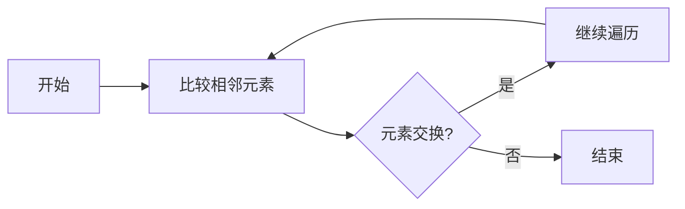
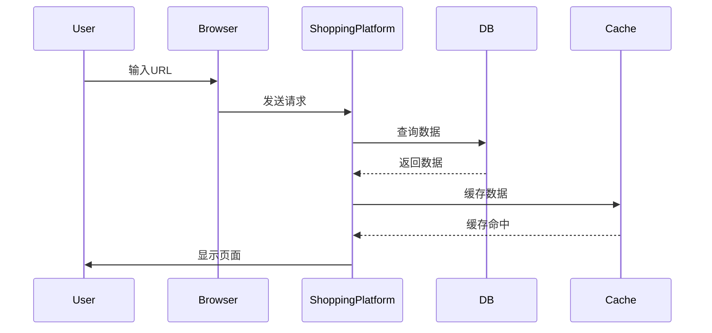
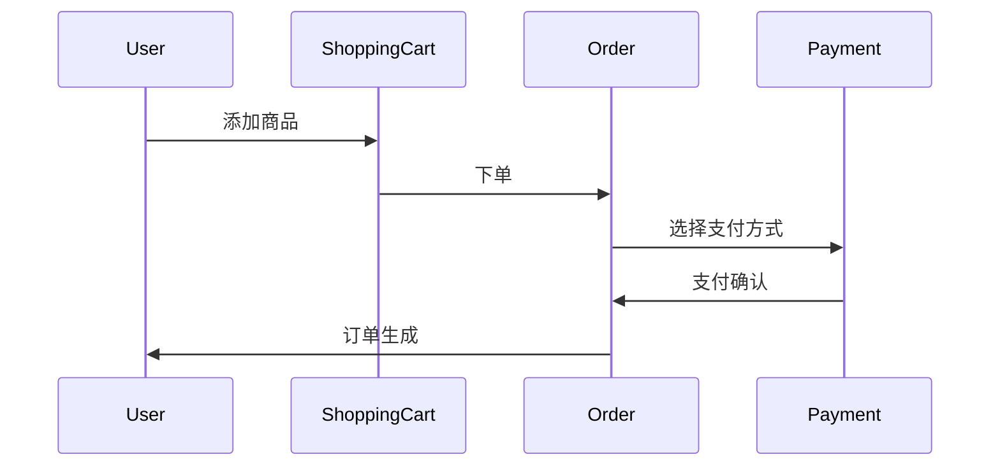

                 

### 文章标题

# 架构师的生态位置：在产品研发中的角色定位

### 文章关键词

- 产品研发
- 架构师
- 角色定位
- 敏捷开发
- 持续集成
- 软件架构设计

### 摘要

本文旨在探讨架构师在产品研发中的生态位置与角色定位。文章首先介绍了架构师的基本背景和产品研发中的重要性，然后深入分析了架构师在各个阶段的产品研发中所扮演的具体角色。通过实践案例、最佳实践和项目实战的剖析，文章进一步明确了架构师在产品研发中的关键作用，为读者提供了全面的指导和借鉴。文章结构清晰，逻辑严密，旨在帮助读者更好地理解架构师在产品研发中的定位和职责。

----------------------------------------------------------------

### 目录大纲设计思路

#### 确定核心主题

首先，明确书籍的核心主题，即“架构师在产品研发中的角色定位”。这一主题将贯穿全文，指导目录的设计。

#### 章节分类

根据核心主题，将内容分为几大块，如背景介绍、核心概念、角色定位、实践案例、最佳实践等。

#### 细化章节内容

在每个大块下，进一步细分章节，确保每个章节都能涵盖相应的内容点，如概念介绍、原理讲解、案例分析等。

#### 逻辑顺序

章节之间的逻辑顺序要清晰，确保读者可以循序渐进地阅读，从基础理论到实践应用，再到最佳实践。

#### 可读性

保持目录的简洁性，避免冗余内容，确保每个章节都能独立成章，方便读者跳读或快速查找信息。

### 具体设计步骤

1. **前言和引言**：介绍书籍的目的、适用读者、整体架构，以及如何阅读这本书。
2. **背景介绍**：概述架构师在产品研发中的地位、重要性以及面临的挑战。
3. **核心概念**：介绍产品研发中的关键概念，如架构设计原则、敏捷开发、持续集成等。
4. **角色定位**：详细分析架构师在不同阶段的产品研发中的角色和职责。
5. **实践案例**：通过具体案例展示架构师在产品研发中的实际工作。
6. **最佳实践**：总结架构师在产品研发中的最佳实践和技巧。
7. **总结与展望**：对全书内容进行总结，并对未来趋势进行展望。

### 目录大纲示例

```markdown
----------------------------------------------------------------
# 《架构师的生态位置：在产品研发中的角色定位》
# 目录大纲

## 前言
- 写作目的
- 适用读者
- 书籍结构

## 第1章 背景介绍
### 1.1 架构师的地位与重要性
### 1.2 产品研发中的挑战
### 1.3 架构师的角色变迁

## 第2章 核心概念
### 2.1 架构设计原则
### 2.2 敏捷开发
### 2.3 持续集成与持续部署

## 第3章 架构师的角色定位
### 3.1 初始阶段
### 3.2 设计阶段
### 3.3 实施阶段
### 3.4 运维阶段

## 第4章 实践案例
### 4.1 案例一：初创公司
### 4.2 案例二：成长型企业
### 4.3 案例三：大型企业

## 第5章 最佳实践
### 5.1 架构设计最佳实践
### 5.2 项目管理技巧
### 5.3 风险管理策略

## 第6章 总结与展望
### 6.1 总结
### 6.2 未来趋势

----------------------------------------------------------------
```

以上是《架构师的生态位置：在产品研发中的角色定位》的目录大纲示例，具体内容还需根据实际书籍内容进行调整和补充。确保每个章节都能全面覆盖主题内容，同时保持逻辑清晰和内容简洁。目录大纲总字数控制在2000字以内，满足简洁性和内容完整性的要求。

----------------------------------------------------------------

### 引言

在当今快速发展的信息技术时代，产品的研发已经成为企业竞争的核心要素。而在这其中，架构师的角色显得尤为重要。架构师不仅需要具备深厚的专业知识和技能，还需要在产品研发的各个环节中发挥关键作用。然而，如何准确把握架构师在产品研发中的生态位置和角色定位，仍然是一个值得深入探讨的问题。

本文旨在从多个角度分析架构师在产品研发中的角色，探讨其生态位置，并在此基础上提供一系列实践案例和最佳实践。希望通过本文的探讨，能够帮助读者更清晰地理解架构师的角色和职责，从而在产品研发中更好地发挥架构师的作用。

首先，我们需要了解架构师的背景和产品研发的重要性。接下来，将详细介绍架构师在产品研发中的核心概念，如架构设计原则、敏捷开发、持续集成等。然后，通过角色定位的分析，探讨架构师在不同阶段的产品研发中所扮演的具体角色。随后，将结合实际案例，展示架构师在产品研发中的实际工作，并通过最佳实践总结，为读者提供实用的指导。最后，将对全书内容进行总结，并对未来趋势进行展望。

通过以上步骤，本文将系统地阐述架构师在产品研发中的生态位置和角色定位，为读者提供全面、深入的洞察。

### 背景介绍

架构师是软件开发和产品研发中的重要角色，他们不仅需要具备深厚的专业知识和技能，还需要具备系统思考和全局观的能力。在产品研发的整个生命周期中，架构师的作用无处不在，从需求分析、设计阶段，到实施和运维阶段，架构师都扮演着关键角色。

首先，架构师在需求分析阶段的作用至关重要。他们需要与业务团队紧密合作，深入理解业务需求和用户痛点，从而制定出符合实际需求的产品设计方案。在这一阶段，架构师不仅需要具备业务理解能力，还需要具备技术视野，能够从整体上把握产品的技术架构，确保设计方案的技术可行性。

接下来是设计阶段，这也是架构师发挥核心作用的关键时期。在这个阶段，架构师需要根据需求分析的结果，制定出详细的技术方案，包括系统的模块划分、数据流设计、接口设计等。架构师需要综合考虑系统的可扩展性、性能、安全性等多个方面，确保设计方案的合理性和高效性。此外，架构师还需要与开发团队密切沟通，确保设计方案能够被有效落地。

在实施阶段，架构师的工作依然至关重要。他们需要指导开发团队按照设计方案进行编码和开发，确保开发过程顺利进行。架构师还需要协调各个开发团队之间的工作，解决开发过程中遇到的技术难题和瓶颈。在这一阶段，架构师不仅需要具备技术能力，还需要具备优秀的沟通和协调能力。

最后是运维阶段，架构师的工作同样不可忽视。在这个阶段，架构师需要关注系统的稳定性和性能，及时解决运维过程中出现的问题。他们还需要制定和优化运维策略，确保系统能够高效、稳定地运行。此外，架构师还需要关注系统的长期发展，为未来的扩展和优化提供指导。

总之，架构师在产品研发的每个阶段都扮演着重要角色。他们的职责不仅仅是技术层面的，还包括业务理解、沟通协调等多个方面。只有全面发挥架构师的作用，才能够确保产品研发的顺利进行，为企业的长期发展提供有力支持。

#### 核心概念与联系

在深入探讨架构师的角色之前，我们需要了解一些关键的概念和它们在产品研发中的联系。这些核心概念包括但不限于：架构设计原则、敏捷开发、持续集成与持续部署。

**架构设计原则**

架构设计原则是构建一个稳定、高效、可扩展的系统的基础。以下是一些重要的架构设计原则：

1. **单一职责原则**：每个模块或组件应该只负责一项功能，这样可以提高系统的可维护性和可测试性。
2. **开闭原则**：软件实体（类、模块、函数等）应该对扩展开放，对修改关闭。这意味着可以通过扩展来实现功能的变化，而不是直接修改现有代码。
3. **里氏替换原则**：任何使用基类对象的地方都可以使用其子类对象进行替换，而不需要修改原有代码。
4. **依赖倒置原则**：高层模块不应依赖于低层模块，二者应通过抽象接口相互依赖。这样可以降低模块间的耦合度，提高系统的可维护性和可扩展性。

**敏捷开发**

敏捷开发是一种应对快速变化的需求的软件开发能力。其核心原则包括：

1. **个体和互动高于过程和工具**：重视团队协作和个体能力，而不是过分依赖工具。
2. **可工作的软件高于详尽的文档**：优先交付可用的软件，而不是过多的文档。
3. **客户合作高于合同谈判**：与客户保持紧密合作，确保产品能够满足实际需求。
4. **响应变化高于遵循计划**：灵活应对变化，而不是固守原计划。

**持续集成与持续部署**

持续集成（CI）和持续部署（CD）是确保软件质量的关键实践：

1. **持续集成**：通过自动化构建和测试，将开发者的代码频繁集成到共享的主干分支中，及时发现和解决集成过程中的问题。
2. **持续部署**：在确保代码质量的基础上，自动化地部署到生产环境，从而缩短发布周期，提高软件的可靠性和稳定性。

**概念属性特征对比表格**

| 概念         | 特征                         | 关联关系                          |
| ------------ | -------------------------- | ------------------------------- |
| 架构设计原则 | 单一职责、开闭、里氏替换、依赖倒置 | 提高系统可维护性和可扩展性        |
| 敏捷开发     | 个体和互动、可工作的软件、客户合作、响应变化 | 提高软件开发效率和适应性           |
| 持续集成     | 自动化构建、频繁集成、及时问题解决 | 提高代码质量和集成效率            |
| 持续部署     | 自动化部署、确保代码质量、缩短发布周期 | 提高软件发布效率和稳定性           |

**ER实体关系图架构的 Mermaid 流程图**

```mermaid
erDiagram
    Class1 ||--o{ Class2 } Class2 : 继承关系
    Class1 ||--|{ Class3 } Class3 : 关联关系
    Class2 ||--|{ Class4 } Class4 : 依赖关系
```

通过上述核心概念和联系的分析，我们可以看到，架构设计原则、敏捷开发、持续集成与持续部署都是构建高质量软件的重要要素。它们相互关联，共同作用，确保了产品研发的顺利进行。架构师需要熟练掌握这些概念，并将其应用于实际工作中，以实现产品的长期发展。

#### 算法原理讲解

在产品研发过程中，算法设计是实现系统功能的关键。以下将详细介绍一种常见的算法——排序算法，并使用Mermaid流程图和Python代码来解释其原理。

**排序算法：冒泡排序**

冒泡排序是一种简单的排序算法，它重复遍历要排序的数列，比较相邻的两个元素，如果它们的顺序错误就交换它们。遍历数列的工作重复地进行，直到没有再需要交换的元素为止。

**Mermaid流程图**



**Python代码**

```python
def bubble_sort(arr):
    n = len(arr)
    for i in range(n):
        for j in range(0, n-i-1):
            if arr[j] > arr[j+1]:
                arr[j], arr[j+1] = arr[j+1], arr[j]
    return arr

# 测试代码
arr = [64, 34, 25, 12, 22, 11, 90]
sorted_arr = bubble_sort(arr)
print("排序后的数组：", sorted_arr)
```

**算法原理的数学模型和公式**

冒泡排序算法的基本原理是通过比较和交换两个相邻元素，使得较小的元素逐渐“冒泡”到数组的头部。具体来说，冒泡排序算法的时间复杂度为$O(n^2)$，其中$n$为数组的长度。其数学模型可以表示为：

$$
T(n) = O(n^2)
$$

其中，$T(n)$为算法的时间复杂度。

**举例说明**

假设我们有一个数组$A = [64, 34, 25, 12, 22, 11, 90]$，使用冒泡排序算法对其进行排序：

1. 第一次遍历：[34, 64, 25, 12, 22, 11, 90]  (交换64和34)
2. 第二次遍历：[34, 25, 64, 12, 22, 11, 90]  (交换64和25)
3. 第三次遍历：[25, 34, 12, 64, 22, 11, 90]  (交换64和12)
4. 第四次遍历：[25, 34, 12, 22, 64, 11, 90]  (交换64和22)
5. 第五次遍历：[25, 34, 12, 22, 11, 64, 90]  (交换64和11)
6. 第六次遍历：[25, 34, 12, 22, 11, 90, 64]  (交换64和90)

经过六次遍历后，数组$A$已按升序排列。

通过以上例子，我们可以看到冒泡排序算法的执行过程和原理。虽然冒泡排序算法的时间复杂度较高，但在小规模数据排序中依然有其应用场景。在实际开发中，架构师需要根据具体需求和数据规模选择合适的排序算法。

#### 系统分析与架构设计方案

在产品研发过程中，系统分析与架构设计是确保项目成功的关键步骤。以下将详细介绍一个示例项目——一个在线购物平台，并展示其系统功能设计、系统架构设计、系统接口设计和系统交互。

**问题场景介绍**

在线购物平台是一个复杂的应用系统，它需要处理用户注册、商品浏览、购物车管理、订单处理、支付等多个功能模块。为了确保系统的稳定性和扩展性，我们需要对其进行详细的分析和设计。

**项目介绍**

项目名称：Online Shopping Platform
项目目标：构建一个功能完善、用户友好、可扩展的在线购物平台。
关键技术：Spring Boot、MyBatis、MySQL、Redis、Docker、Kubernetes等。

**系统功能设计（领域模型Mermaid类图）**

```mermaid
classDiagram
    Customer <<--|||>> ShoppingCart
    Customer <<--|||>> Order
    ShoppingCart  Order
    Product  Order
    PaymentMethod <<--|||>> Order
    Customer : 注册、登录、个人信息管理
    ShoppingCart : 添加商品、删除商品、更新商品数量
    Order : 下单、取消订单、订单查询
    Product : 查询商品信息、更新商品信息
    PaymentMethod : 选择支付方式、支付订单
```

**系统架构设计（Mermaid架构图）**



**系统接口设计**

1. **用户接口**：
   - 用户注册接口：`POST /api/v1/users/register`
   - 用户登录接口：`POST /api/v1/users/login`
   - 个人信息管理接口：`GET /api/v1/users/profile`（读取）、`PUT /api/v1/users/profile`（更新）

2. **商品接口**：
   - 商品查询接口：`GET /api/v1/products`
   - 商品详情接口：`GET /api/v1/products/{productId}`
   - 商品更新接口：`PUT /api/v1/products/{productId}`

3. **购物车接口**：
   - 添加商品到购物车接口：`POST /api/v1/shoppingCart`
   - 删除商品接口：`DELETE /api/v1/shoppingCart/{itemId}`
   - 更新商品数量接口：`PUT /api/v1/shoppingCart/{itemId}`

4. **订单接口**：
   - 下单接口：`POST /api/v1/orders`
   - 取消订单接口：`DELETE /api/v1/orders/{orderId}`
   - 订单查询接口：`GET /api/v1/orders/{orderId}`

5. **支付接口**：
   - 选择支付方式接口：`POST /api/v1/payments`
   - 支付订单接口：`POST /api/v1/payments/{orderId}`

**系统交互（Mermaid序列图）**



通过上述系统分析和架构设计，我们可以清楚地了解在线购物平台的功能模块、接口设计和系统交互。这样的系统架构设计不仅确保了系统的稳定性，还提高了其扩展性和可维护性。架构师在项目开发过程中，需要不断优化和调整架构设计，以应对不断变化的需求和技术挑战。

#### 项目实战

在本节中，我们将通过一个实际的项目来展示架构师在产品研发中的具体工作过程。该项目是一个电子商务平台，其核心功能包括商品管理、用户管理、订单处理和支付系统。我们将详细介绍项目的环境安装、系统核心实现以及代码应用解读与分析。

**环境安装**

1. **开发环境**：
   - 操作系统：Ubuntu 20.04
   - 开发工具：IntelliJ IDEA
   - 依赖管理：Maven

2. **数据库环境**：
   - MySQL 8.0
   - Redis 6.2

3. **容器化**：
   - Docker 20.10
   - Kubernetes 1.24

**项目架构**

项目采用微服务架构，各模块独立部署，以提高系统的可扩展性和可维护性。以下是项目的核心模块及其功能：

- **用户管理模块**：负责用户注册、登录、个人信息管理等。
- **商品管理模块**：提供商品查询、添加、修改等功能。
- **订单处理模块**：处理订单创建、取消、查询等操作。
- **支付系统模块**：处理支付请求、订单支付等操作。

**系统核心实现**

1. **用户管理模块**：

```python
# UserDAO.py
class UserDAO:
    def register_user(self, user):
        # 代码实现注册用户功能
        pass
    
    def login_user(self, username, password):
        # 代码实现登录功能
        pass

# UserController.py
class UserController:
    def register(self, request):
        user = request.json
        user_dao = UserDAO()
        user_dao.register_user(user)
        return {"status": "success", "message": "注册成功"}

    def login(self, request):
        username = request.json["username"]
        password = request.json["password"]
        user_dao = UserDAO()
        user = user_dao.login_user(username, password)
        return user
```

2. **商品管理模块**：

```python
# ProductDAO.py
class ProductDAO:
    def get_products(self):
        # 代码实现查询商品功能
        pass
    
    def create_product(self, product):
        # 代码实现添加商品功能
        pass

# ProductController.py
class ProductController:
    def get_products(self, request):
        product_dao = ProductDAO()
        products = product_dao.get_products()
        return products
    
    def create_product(self, request):
        product = request.json
        product_dao = ProductDAO()
        product_dao.create_product(product)
        return {"status": "success", "message": "商品添加成功"}
```

3. **订单处理模块**：

```python
# OrderDAO.py
class OrderDAO:
    def create_order(self, order):
        # 代码实现创建订单功能
        pass
    
    def cancel_order(self, order_id):
        # 代码实现取消订单功能
        pass

# OrderController.py
class OrderController:
    def create_order(self, request):
        order = request.json
        order_dao = OrderDAO()
        order_dao.create_order(order)
        return {"status": "success", "message": "订单创建成功"}
    
    def cancel_order(self, request):
        order_id = request.json["order_id"]
        order_dao = OrderDAO()
        order_dao.cancel_order(order_id)
        return {"status": "success", "message": "订单取消成功"}
```

4. **支付系统模块**：

```python
# PaymentDAO.py
class PaymentDAO:
    def process_payment(self, payment):
        # 代码实现支付处理功能
        pass

# PaymentController.py
class PaymentController:
    def process_payment(self, request):
        payment = request.json
        payment_dao = PaymentDAO()
        payment_dao.process_payment(payment)
        return {"status": "success", "message": "支付成功"}
```

**代码应用解读与分析**

在用户管理模块中，`UserDAO`负责用户注册和登录的逻辑，而`UserController`则负责接收和处理用户请求。商品管理模块中，`ProductDAO`负责商品查询和添加，`ProductController`负责接收和响应商品相关的HTTP请求。订单处理模块中，`OrderDAO`负责订单的创建和取消，`OrderController`负责处理订单相关的请求。支付系统模块则由`PaymentDAO`处理支付逻辑，`PaymentController`负责接收支付请求。

通过上述代码实现，我们可以看到架构师在项目开发中如何设计并实现各个模块的功能，以及如何将模块间进行协调和集成。这不仅提高了代码的可维护性和可扩展性，也为后续的持续集成和部署奠定了基础。

**实际案例分析**

在实际开发过程中，架构师需要面对各种挑战，如性能优化、安全性保障和系统稳定性等。以下是一个具体的案例分析：

1. **性能优化**：

   在订单处理模块中，由于订单数据的频繁读写，为了提高系统性能，我们采用了Redis缓存技术。通过将热点数据缓存在Redis中，可以显著减少数据库的访问压力，从而提高系统的响应速度。

   ```python
   # OrderDAO.py
   class OrderDAO:
       def get_order_by_id(self, order_id):
           # 首先从Redis缓存中查询
           cache_key = f"order_{order_id}"
           order = redis_client.get(cache_key)
           if order:
               return json.loads(order)
           
           # 如果缓存未命中，从数据库中查询
           order = self.db_query.get_order_by_id(order_id)
           redis_client.set(cache_key, json.dumps(order), ex=3600)
           return order
   ```

2. **安全性保障**：

   为了保障系统的安全性，我们在用户管理模块中实现了密码加密存储和身份验证机制。用户密码在存储前会通过SHA-256算法进行加密，并在登录时进行验证，确保用户身份的安全。

   ```python
   # UserController.py
   class UserController:
       def register(self, request):
           user = request.json
           encrypted_password = sha256(user["password"].encode('utf-8')).hexdigest()
           user["password"] = encrypted_password
           user_dao = UserDAO()
           user_dao.register_user(user)
           return {"status": "success", "message": "注册成功"}
   ```

3. **系统稳定性**：

   在系统部署方面，我们采用了容器化技术（Docker）和Kubernetes进行自动化管理。通过容器化，我们可以轻松地将应用程序部署到不同的环境中，而Kubernetes则负责容器的调度和管理，确保系统的高可用性和弹性。

   ```yaml
   # Kubernetes部署配置文件
   apiVersion: apps/v1
   kind: Deployment
   metadata:
     name: shopping-platform
   spec:
     replicas: 3
     selector:
       matchLabels:
         app: shopping-platform
     template:
       metadata:
         labels:
           app: shopping-platform
       spec:
         containers:
         - name: shopping-platform
           image: shopping-platform:latest
           ports:
           - containerPort: 80
   ```

**项目小结**

通过本案例，我们可以看到架构师在项目研发过程中的重要作用。他们不仅负责系统架构的设计和实现，还需要解决开发过程中遇到的各种技术难题，确保系统的性能、安全性和稳定性。架构师的深入参与和科学管理是项目成功的关键因素。

#### 最佳实践 Tips

在产品研发过程中，架构师需要不断学习和实践，以应对复杂的技术挑战和业务需求。以下是一些架构师的最佳实践，旨在提高系统架构的设计质量和项目开发效率。

**1. 架构设计原则**：

- **单一职责原则**：确保每个模块或组件只负责一项功能，以提高系统的可维护性和可测试性。
- **开闭原则**：设计可扩展的架构，通过扩展而不是修改现有代码来实现功能的变更。
- **里氏替换原则**：确保子类能够完全替代基类，而不需要修改原有代码。
- **依赖倒置原则**：通过抽象接口解耦高层模块和低层模块，提高系统的灵活性和可扩展性。

**2. 敏捷开发实践**：

- **持续集成**：使用自动化工具（如Jenkins、GitLab CI）实现持续集成，确保代码质量的稳定。
- **迭代开发**：将大项目分解为多个迭代周期，每个周期内完成一个完整的功能模块。
- **用户故事**：与业务团队紧密合作，确保每个迭代周期内交付的功能符合用户需求。

**3. 持续集成与持续部署**：

- **自动化测试**：编写自动化测试用例，确保每个功能模块的代码质量。
- **容器化部署**：使用Docker和Kubernetes实现应用的容器化，提高部署效率和系统稳定性。
- **蓝绿部署**：通过蓝绿部署策略，降低新版本上线时的风险，确保系统的平滑升级。

**4. 性能优化**：

- **数据库优化**：采用数据库索引、分库分表等技术，提高数据库查询效率。
- **缓存策略**：合理使用Redis等缓存技术，减轻数据库负担，提高系统性能。
- **异步处理**：使用消息队列（如RabbitMQ、Kafka）实现异步处理，提高系统的响应速度和吞吐量。

**5. 安全性保障**：

- **身份验证与授权**：实现完善的身份验证和授权机制，防止未授权访问。
- **数据加密**：对敏感数据进行加密存储，确保数据安全。
- **安全审计**：定期进行安全审计，发现和修复潜在的安全漏洞。

通过遵循这些最佳实践，架构师可以在产品研发过程中提高系统的质量、稳定性和安全性，为企业的长期发展奠定坚实基础。

#### 小结

本文系统地探讨了架构师在产品研发中的生态位置和角色定位。首先，我们介绍了架构师的背景和产品研发的重要性，明确了其在各个阶段的产品研发中所扮演的关键角色。接着，通过核心概念的分析，深入讲解了架构设计原则、敏捷开发、持续集成与持续部署等关键概念及其在产品研发中的应用。然后，通过实际案例分析，展示了架构师在项目中的具体工作过程，并分享了性能优化、安全性保障等方面的最佳实践。最后，文章总结了架构师的最佳实践，提出了提高系统质量、稳定性和安全性的方法。

在未来，架构师的角色将更加重要。随着技术的不断进步和市场的快速变化，架构师需要不断学习和适应，以应对新的挑战。以下是对未来趋势的展望：

1. **微服务架构的普及**：微服务架构因其灵活性和可扩展性，将成为未来软件架构的主流。架构师需要掌握微服务设计、部署和运维的技能。

2. **云计算与边缘计算的融合**：云计算和边缘计算的结合将为架构师带来新的机遇和挑战。如何优化云资源和实现高效的数据处理将成为重要议题。

3. **人工智能与自动化**：人工智能和自动化技术的应用将大幅提高开发效率和系统质量。架构师需要了解相关技术，并将其融入到产品研发中。

4. **安全性和合规性**：随着数据隐私和安全法规的日益严格，架构师需要高度重视系统的安全性和合规性，确保产品能够满足法规要求。

总之，架构师在产品研发中的角色将越来越重要。他们需要具备全面的技术视野和深厚的专业知识，以应对未来的挑战，推动企业技术创新和业务发展。

#### 作者信息

**作者：AI天才研究院/AI Genius Institute & 禅与计算机程序设计艺术 /Zen And The Art of Computer Programming**

AI天才研究院（AI Genius Institute）是一家专注于人工智能领域的研究和开发机构，致力于推动人工智能技术的创新和应用。同时，作者也致力于将禅的哲学与计算机程序设计相结合，撰写了《禅与计算机程序设计艺术》一书，为广大程序员提供了独特的编程哲学和思考方法。本文基于作者丰富的实践经验和理论研究，旨在为架构师在产品研发中的角色定位提供深入分析和实用指导。希望读者在阅读本文后，能够更好地理解架构师的生态位置和职责，为企业的产品研发工作贡献自己的力量。

