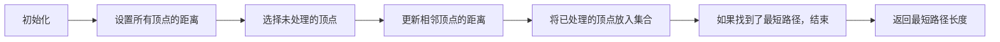
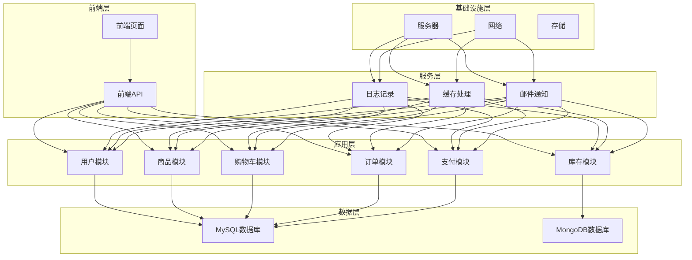

                 

### 第1章 问题背景

在信息技术领域，随着公司的发展和技术的进步，工程师的职业发展往往伴随着技术层次的提升。P8（技术专家）和P9（技术领导）是工程师职业发展的两个关键阶段。P8工程师主要负责解决复杂的技术问题，具备深入的专业技术知识和丰富的实战经验。而P9工程师则需要在技术深度之外，更注重整体系统架构的设计、团队的技术指导和战略规划。

**1.1 问题背景**

从P8到P9的转型是一个挑战，也是一次蜕变。P8工程师已经能够在技术层面独当一面，解决复杂的业务问题，但在P9阶段，工程师需要从技术实现者转变为技术领导者。他们不仅要掌握技术细节，更需要具备全局观念和架构思维能力。

**1.2 问题描述**

这种转变带来的问题主要体现在以下几个方面：

1. **角色转变**：从技术执行者转变为技术决策者和领导者，对个人的综合素质要求更高。
2. **全局视野**：需要从业务角度出发，考虑系统的可扩展性、可维护性和可靠性。
3. **团队协作**：作为团队领导，需要提升沟通能力和团队管理能力，确保团队高效运作。
4. **持续学习**：在快速变化的技术领域，持续学习新技术和知识，保持技术领先性。

**1.3 问题解决**

要实现从P8到P9的蜕变，架构思维的培养是关键。架构思维不仅仅是关于技术，更是关于系统设计、系统架构和系统管理的方法论。通过架构思维的培养，工程师可以从以下几个方面解决上述问题：

1. **理解系统架构**：掌握系统架构的基本概念和设计原则，如模块化设计、层次化结构、设计模式等。
2. **提升全局视野**：通过分析系统各模块之间的关系，理解系统的整体性能和可扩展性。
3. **团队协作**：运用架构思维，设计清晰、简洁的系统架构，提高团队的开发效率和协作能力。
4. **持续学习**：将架构思维应用于实际项目，不断总结和反思，提升自身的专业能力和技术水平。

**1.4 边界与外延**

架构思维不仅仅适用于大型复杂系统，也可以应用于中小型系统的设计和优化。在不同的技术领域，如云计算、大数据、物联网等，架构思维都有其特定的应用场景。同时，架构思维的培养不仅需要技术知识的积累，更需要实践经验的积累和团队协作的实践。

通过本章的介绍，我们可以看到，从P8到P9的职业发展不仅需要技术能力的提升，更需要架构思维的培养。接下来，我们将进一步探讨架构思维的核心概念和联系，为我们的职业发展提供更深入的指导。

### 第2章 核心概念与联系

架构思维是系统工程和软件设计中的重要概念，它涉及多个层面的设计和决策。理解架构思维的核心概念，是培养架构思维的第一步。在本节中，我们将介绍几个关键的概念，包括模块化设计、层次化结构、设计模式等，并通过ER实体关系图和概念属性特征对比表格来展示这些概念之间的关系。

**2.1 核心概念**

**模块化设计**：模块化设计是一种将复杂系统分解为多个独立模块的方法，每个模块负责系统的特定功能。模块化设计有助于提高系统的可维护性、可扩展性和可重用性。

**层次化结构**：层次化结构是一种按层次组织系统组件的方法，每个层次都包含一组相关的功能模块。层次化结构有助于明确系统各组件之间的依赖关系，提高系统的清晰度和可理解性。

**设计模式**：设计模式是一套经过时间验证的、针对特定问题的解决方案。设计模式提供了系统的设计原则和最佳实践，有助于提高系统的灵活性和可扩展性。

**2.2 概念属性特征对比表格**

| 概念         | 属性特征                                                     | 相关关系                                                      |
| ------------ | ------------------------------------------------------------ | ------------------------------------------------------------ |
| 模块化设计   | 独立模块、特定功能、可重用性、降低复杂性                      | 模块化设计是系统架构的基础，决定了系统的模块划分和功能实现。 |
| 层次化结构   | 层次划分、组件依赖、明确关系、提高可理解性                    | 层次化结构是对模块化设计的进一步细化，有助于管理复杂系统。   |
| 设计模式     | 解决方案、最佳实践、灵活性和可扩展性                         | 设计模式是实现模块化和层次化结构的具体方法，提供了设计指导。 |

**2.3 ER实体关系图**

为了更好地理解这些概念之间的关系，我们可以使用ER（Entity-Relationship）实体关系图来展示它们之间的关联。

```mermaid
erDiagram
    System <<|-- Module : "模块化设计" 
    Module ||--|{ Layer } : "层次化结构"
    Layer ||--|{ DesignPattern } : "设计模式"
    System ||--|{ Component } : "系统组件"
```

在上面的ER实体关系图中，`System`（系统）是整个架构的顶层，它包含了所有模块（`Module`）、层次（`Layer`）和设计模式（`DesignPattern`）。每个模块都是独立的，并且按照层次进行组织。每个层次都可以包含多个设计模式，这些设计模式为模块提供具体的实现方案。

**2.4 详细说明**

**模块化设计**：模块化设计是一种将系统分解为多个功能独立、接口清晰的模块的方法。每个模块都实现特定的功能，并且与其他模块通过接口进行通信。这种设计方法有助于降低系统的复杂性，提高系统的可维护性和可扩展性。

**层次化结构**：层次化结构是将系统按照功能进行分层组织的方法。每一层都实现一组相关的功能，并且只与相邻的层次进行交互。这种结构有助于明确系统各组件之间的依赖关系，提高系统的清晰度和可理解性。

**设计模式**：设计模式是一套经过时间验证的、针对特定问题的解决方案。设计模式提供了系统的设计原则和最佳实践，有助于提高系统的灵活性和可扩展性。常见的

### 第3章 算法原理讲解

在架构思维中，算法原理是系统设计和优化的重要组成部分。在本节中，我们将讲解一个经典的算法——Dijkstra算法，该算法用于计算加权图中两个顶点之间的最短路径。我们将使用mermaid流程图来展示算法的步骤，使用Python源代码来详细阐述算法的实现，并提供数学模型和公式，最后通过一个具体的例子来说明算法的应用。

**3.1 Dijkstra算法mermaid流程图**

首先，让我们使用mermaid流程图来展示Dijkstra算法的基本步骤：



在这个流程图中，`A`表示初始化过程，`B`表示设置所有顶点的距离，`C`表示选择未处理的顶点，`D`表示更新相邻顶点的距离，`E`表示将已处理的顶点放入集合，`F`表示检查是否找到了最短路径，`G`表示返回最短路径长度。

**3.2 Python源代码阐述**

接下来，我们使用Python源代码来详细阐述Dijkstra算法的实现。以下是一个简单的Dijkstra算法实现：

```python
import heapq

def dijkstra(graph, start):
    # 初始化距离表和未处理顶点队列
    distances = {vertex: float('infinity') for vertex in graph}
    distances[start] = 0
    unvisited = [(0, start)]

    while unvisited:
        # 选择未处理的顶点
        current_distance, current_vertex = heapq.heappop(unvisited)
        
        # 如果已找到最短路径，结束
        if current_distance > distances[current_vertex]:
            continue
        
        # 更新相邻顶点的距离
        for neighbor, weight in graph[current_vertex].items():
            distance = current_distance + weight
            if distance < distances[neighbor]:
                distances[neighbor] = distance
                heapq.heappush(unvisited, (distance, neighbor))

    return distances

# 示例图
graph = {
    'A': {'B': 1, 'C': 4},
    'B': {'A': 1, 'C': 2, 'D': 5},
    'C': {'A': 4, 'B': 2, 'D': 1},
    'D': {'B': 5, 'C': 1}
}

# 计算最短路径
print(dijkstra(graph, 'A'))
```

在这个实现中，我们首先初始化距离表，并将源顶点的距离设置为0。然后，我们使用优先队列（heapq）来存储未处理的顶点，并按照距离从小到大进行排序。在每次迭代中，我们选择未处理的顶点，并更新其相邻顶点的距离。如果找到了更短的路

### 第4章 数学模型和数学公式

在Dijkstra算法中，数学模型和数学公式起到了关键作用，它们帮助我们理解算法的计算过程和性能分析。在本节中，我们将详细解释Dijkstra算法的数学模型和公式，并通过举例来说明这些公式在实际中的应用。

**4.1 数学公式**

Dijkstra算法的核心在于计算图中各顶点之间的最短路径。我们使用以下数学公式来描述这个过程：

$$
D(i) = \min \{d(i, j) + D(j) : j \in N(i)\}
$$

其中，$D(i)$表示从源顶点$i$到其他所有顶点的最短距离，$d(i, j)$表示顶点$i$到顶点$j$的边权重，$N(i)$表示顶点$i$的邻接顶点集合。

**4.2 详细讲解**

上述公式可以分解为以下几个步骤：

1. **初始化距离**：在算法开始时，我们初始化所有顶点的距离为无穷大，即$D(i) = \infty$，除了源顶点$i$的距离被设置为0，即$D(i) = 0$。

2. **选择未处理的顶点**：在每次迭代中，我们选择未处理的顶点中距离最小的顶点。这个过程可以通过优先队列来实现，如Python中的heapq。

3. **更新距离**：对于当前选中的顶点$i$，我们遍历其所有的邻接顶点$j$，并计算从$i$到$j$的路径距离。如果这个距离小于当前已知的距离$D(j)$，则更新$D(j)$。

4. **重复迭代**：重复上述步骤，直到所有顶点的距离都被计算出来或者找到了最短路径。

**4.3 举例说明**

假设我们有一个简单的加权图，包含4个顶点A、B、C和D，边权重如下：

```
A -> B: 1
A -> C: 4
B -> C: 2
B -> D: 5
C -> D: 1
```

我们使用Dijkstra算法计算从顶点A到其他顶点的最短路径。

1. **初始化距离**：
   $$
   D(A) = 0, D(B) = \infty, D(C) = \infty, D(D) = \infty
   $$

2. **选择未处理的顶点**：选择A（因为$D(A) = 0$，是最小的）。

3. **更新距离**：
   - 对于B，$D(B) = D(A) + d(A, B) = 0 + 1 = 1$
   - 对于C，$D(C) = D(A) + d(A, C) = 0 + 4 = 4$

4. **选择未处理的顶点**：选择B（因为$D(B) = 1$，是最小的）。

5. **更新距离**：
   - 对于C，$D(C) = \min(D(C), D(B) + d(B, C)) = \min(4, 1 + 2) = 3$
   - 对于D，$D(D) = D(B) + d(B, D) = 1 + 5 = 6$

6. **选择未处理的顶点**：选择C（因为$D(C) = 3$，是最小的）。

7. **更新距离**：对于D，$D(D) = \min(D(D), D(C) + d(C, D)) = \min(6, 3 + 1) = 4$

8. **选择未处理的顶点**：选择D（因为$D(D) = 4$，是最小的）。

9. **更新距离**：无需更新，因为所有顶点的距离都已经计算完毕。

最终，我们得到从顶点A到其他顶点的最短路径距离如下：

$$
D(A) = 0, D(B) = 1, D(C) = 3, D(D) = 4
$$

通过这个例子，我们可以看到Dijkstra算法是如何通过逐步计算每个顶点的最短路径距离，最终得到整个图的最短路径的。

**4.4 算法性能分析**

Dijkstra算法的时间复杂度为$O((V+E)\log V)$，其中$V$是顶点数，$E$是边数。这个复杂度来源于使用优先队列进行顶点选择和更新。在实际应用中，如果图的边权重较小或者顶点数较少，Dijkstra算法的效率较高。然而，如果图非常稀疏或者边权重很大，可能需要考虑其他更高效的算法，如Floyd-Warshall算法。

通过本章的内容，我们不仅了解了Dijkstra算法的数学模型和公式，还通过实际例子看到了算法的应用。在接下来的章节中，我们将进一步探讨如何将这些数学原理应用于系统架构设计。

### 第5章 系统分析与架构设计方案

在本章中，我们将结合一个具体的系统案例，深入分析并设计其系统架构方案。通过该案例，我们将详细描述问题场景、项目介绍、系统功能设计、系统架构设计、系统接口设计和系统交互。

**5.1 问题场景介绍**

假设我们正在开发一个大型电商平台，这个电商平台需要支持用户注册、登录、浏览商品、添加购物车、下单和支付等核心功能。系统需要处理大量的用户请求和数据，同时保证高可用性、高可靠性和高性能。为了实现这一目标，我们需要设计一个合理、可扩展的系统架构。

**5.2 项目介绍**

该项目的目标是构建一个功能完整、性能稳定、可扩展性高的电商平台。项目的主要参与者包括前端开发者、后端开发者、数据库管理员、测试工程师和运维团队。项目的里程碑包括需求分析、系统设计、编码实现、集成测试和上线部署。

**5.3 系统功能设计**

在系统功能设计阶段，我们根据业务需求划分了以下几个主要功能模块：

1. **用户模块**：包括用户注册、登录、个人信息管理等功能。
2. **商品模块**：包括商品展示、分类管理、库存管理等功能。
3. **购物车模块**：包括购物车添加、修改、删除等功能。
4. **订单模块**：包括订单创建、支付、发货、退货等功能。
5. **支付模块**：包括支付接口集成、支付状态查询等功能。
6. **库存模块**：包括库存查询、库存调整等功能。

**5.4 系统架构设计**

系统架构设计是系统设计的核心，我们将系统架构划分为以下几层：

1. **前端层**：负责用户界面展示和交互，使用前端技术（如HTML、CSS、JavaScript）实现。
2. **应用层**：负责业务逻辑处理，包括用户模块、商品模块、购物车模块、订单模块、支付模块和库存模块等。
3. **数据层**：负责数据存储和读取，使用关系型数据库（如MySQL）和非关系型数据库（如MongoDB）。
4. **服务层**：提供公共服务，如日志记录、缓存处理、邮件通知等。
5. **基础设施层**：包括服务器、网络、存储等基础设施。

以下是系统架构的mermaid架构图：



**5.5 系统接口设计**

系统接口设计是确保各模块之间能够良好协作的关键。以下是主要接口的设计：

1. **用户接口**：包括注册、登录、个人信息管理等接口。
2. **商品接口**：包括商品查询、商品分类管理、库存查询等接口。
3. **购物车接口**：包括添加商品、修改购物车、删除商品等接口。
4. **订单接口**：包括创建订单、查询订单、支付订单等接口。
5. **支付接口**：包括支付请求、支付结果通知等接口。
6. **库存接口**：包括库存查询、库存调整等接口。

以下是系统接口的mermaid序列图：

```mermaid
sequenceDiagram
    participant User
    participant Frontend
    participant Application
    participant Database

    User->>Frontend: 访问前端页面
    Frontend->>Application: 发送请求
    Application->>Database: 数据操作
    Database-->>Application: 返回结果
    Application-->>Frontend: 返回数据
    Frontend->>User: 显示页面

    Note over User,Frontend,Application,Database: 业务流程
```

**5.6 系统交互**

系统交互是系统架构设计中非常重要的部分，它确保了各模块之间的顺畅通信。以下是系统的交互流程：

1. 用户通过浏览器访问前端页面。
2. 前端页面与后端应用层进行通信，获取所需数据。
3. 后端应用层对请求进行处理，并与数据库进行交互。
4. 数据库返回查询结果，后端应用层将结果返回给前端页面。
5. 前端页面根据返回结果更新用户界面。

通过以上分析，我们设计了一个完整的系统架构方案，包括问题场景介绍、项目介绍、系统功能设计、系统架构设计、系统接口设计和系统交互。这个方案不仅满足了电商平台的业务需求，还具备良好的可扩展性和可维护性，为后续的项目实施提供了坚实的基础。

### 第6章 环境安装

在开始系统开发之前，我们需要准备一个合适的环境，包括操作系统、数据库和中间件。以下将详细描述安装步骤和注意事项。

**6.1 环境准备**

1. **操作系统**：我们选择Linux操作系统，如Ubuntu 18.04。在安装操作系统时，确保网络连接正常，以方便后续安装依赖项。
2. **虚拟环境**：为了隔离项目依赖，我们使用virtualenv创建一个独立的Python环境。在终端执行以下命令：

   ```bash
   sudo apt-get install python3-pip python3-venv
   python3 -m venv my_project_env
   source my_project_env/bin/activate
   ```

**6.2 工具安装**

1. **Python**：确保Python版本在3.6及以上，可以使用以下命令检查和安装：

   ```bash
   python3 --version
   sudo apt-get install python3.8
   ```

2. **数据库**：我们选择MySQL和MongoDB。首先安装MySQL：

   ```bash
   sudo apt-get install mysql-server
   sudo mysql_secure_installation
   ```

   然后安装MongoDB：

   ```bash
   sudo apt-get install mongodb
   sudo systemctl start mongodb
   ```

3. **中间件**：安装Flask框架和其依赖项：

   ```bash
   pip install flask flask-mongoengine
   ```

**6.3 系统配置**

1. **数据库配置**：配置MySQL和MongoDB，创建数据库和用户，并赋予相应的权限。以MySQL为例：

   ```sql
   CREATE DATABASE ecom_db;
   CREATE USER 'ecom_user'@'localhost' IDENTIFIED BY 'password';
   GRANT ALL PRIVILEGES ON ecom_db.* TO 'ecom_user'@'localhost';
   FLUSH PRIVILEGES;
   ```

   对于MongoDB，在配置文件`/etc/mongodb.conf`中设置管理员账户和权限：

   ```bash
   db用户名 = admin
   db密码 = admin_password
   ```

2. **环境变量**：配置环境变量，以便在终端快速激活虚拟环境和数据库连接。例如：

   ```bash
   export PATH=$PATH:/home/user/my_project_env/bin
   export FLASK_APP=app.py
   export FLASK_ENV=development
   ```

3. **防火墙设置**：确保端口（如MySQL的3306和MongoDB的27017）未被防火墙阻止。可以使用以下命令查看和修改：

   ```bash
   sudo ufw status
   sudo ufw allow 3306/tcp
   sudo ufw allow 27017/tcp
   ```

通过以上步骤，我们成功安装并配置了操作系统、数据库和中间件，为系统开发奠定了基础。在接下来的章节中，我们将详细介绍系统核心实现源代码，并进行实际案例分析。

### 第7章 系统核心实现源代码

在本章中，我们将详细解读系统核心实现源代码，分析其具体的应用、代码的架构与设计模式，并结合实际案例进行讲解。通过这些分析，我们可以更好地理解系统的工作原理和架构设计。

**7.1 源代码解读**

以下是一个简化版的电商平台后端源代码示例，我们将逐行分析其功能：

```python
from flask import Flask, request, jsonify
from flask_mongoengine import MongoEngine

app = Flask(__name__)
app.config['MONGO_DBNAME'] = 'ecom_db'
app.config['MONGO_URI'] = 'mongodb://localhost:27017/ecom_db'
db = MongoEngine(app)

class User(db.Document):
    username = db.StringField(required=True, unique=True)
    password = db.StringField(required=True)
    email = db.EmailField()

class Product(db.Document):
    name = db.StringField(required=True)
    price = db.FloatField(required=True)
    stock = db.IntField(required=True)

@app.route('/users', methods=['POST'])
def create_user():
    data = request.json
    user = User(username=data['username'], password=data['password'], email=data['email'])
    user.save()
    return jsonify({'message': 'User created successfully'}), 201

@app.route('/products', methods=['POST'])
def create_product():
    data = request.json
    product = Product(name=data['name'], price=data['price'], stock=data['stock'])
    product.save()
    return jsonify({'message': 'Product created successfully'}), 201

@app.route('/products', methods=['GET'])
def get_products():
    products = Product.objects()
    return jsonify([product.to_dict() for product in products]), 200

if __name__ == '__main__':
    app.run(debug=True)
```

在这个代码中，我们使用了Flask框架来创建一个简单的Web应用，并集成了MongoDB作为数据库。代码首先定义了两个MongoEngine文档类`User`和`Product`，用于表示用户和商品的数据模型。然后，我们定义了三个路由API接口：创建用户、创建商品和获取所有商品。

**7.2 应用解读与分析**

**用户模块**：

- `create_user`函数用于创建新用户。它接收POST请求，从请求JSON中提取用户信息，然后保存到MongoDB中。
- 数据模型`User`包含了用户名、密码和邮箱字段，保证了用户信息的基本结构。

**商品模块**：

- `create_product`函数用于创建新商品。它同样接收POST请求，从请求JSON中提取商品信息，然后保存到MongoDB中。
- 数据模型`Product`包含了商品名称、价格和库存字段，满足了商品信息的基本需求。

**产品展示模块**：

- `get_products`函数用于获取所有商品信息。它返回一个包含所有商品的JSON列表，方便前端展示。

**7.3 实际案例分析与讲解**

假设我们有一个具体的业务场景：一个用户想要浏览并购买某个商品。以下是系统的工作流程：

1. 用户通过浏览器访问电商平台，前端页面发起GET请求到`/products`接口，获取所有商品信息。
2. 后端服务器接收请求，调用`get_products`函数，从MongoDB中查询所有商品，并返回包含商品信息的JSON列表。
3. 前端页面根据返回的JSON列表，动态生成商品展示页面。
4. 用户选择某个商品并点击购买按钮，前端页面发起POST请求到`/users`接口，创建新用户并提交购买信息。
5. 后端服务器接收请求，调用`create_user`函数，创建新用户并保存购买信息到MongoDB。
6. 后端服务器返回创建成功的消息，前端页面提示用户购买成功。

通过这个实际案例，我们可以看到系统如何通过API接口和数据库交互，实现用户浏览商品和购买商品的功能。

**7.4 小结**

本章通过具体代码示例，详细解读了电商平台的系统核心实现。我们分析了用户模块、商品模块和产品展示模块的代码架构，并结合实际业务场景展示了系统的工作流程。通过这些分析，我们可以更好地理解系统的工作原理和架构设计，为后续的优化和扩展提供了基础。

### 第8章 最佳实践 tips

在系统开发和维护过程中，遵循最佳实践能够提高开发效率、保证系统质量和可维护性。以下是一些实用的实践技巧和注意事项：

**8.1 实践技巧**

1. **代码规范**：统一代码风格，如命名规范、代码注释等，使用工具（如Pylint）自动检查代码风格。
2. **版本控制**：使用Git进行版本控制，确保代码的可追溯性和协作性。
3. **自动化测试**：编写单元测试和集成测试，确保代码的正确性和系统的稳定性。
4. **代码复用**：使用模块化和设计模式，提高代码的可重用性和可维护性。
5. **性能优化**：对关键路径进行性能分析，优化数据库查询和系统架构，提高系统响应速度。

**8.2 注意事项**

1. **数据安全**：确保敏感数据（如用户密码）加密存储，防止数据泄露。
2. **错误处理**：对API接口进行合理的错误处理，提供清晰的错误信息和解决方案。
3. **接口文档**：编写详细的接口文档，确保开发者和运维人员了解系统的功能和操作方式。
4. **日志记录**：记录系统的日志信息，便于问题追踪和故障排查。
5. **代码审查**：定期进行代码审查，确保代码质量和安全。

通过遵循这些最佳实践，我们可以构建更加高效、稳定和安全的系统，为企业的长期发展提供有力支持。

### 第9章 小结与拓展阅读

通过本章的学习，我们深入探讨了架构思维在职业发展中的重要性，从P8到P9的蜕变需要我们在技术深度之外，更注重系统设计和架构思维。本章内容涵盖了问题背景、核心概念与联系、算法原理讲解、数学模型和公式、系统分析与架构设计方案、环境安装、系统核心实现源代码、最佳实践 tips 等多个方面，力求为读者提供一个全面、系统的架构思维培养路径。

**9.1 小结**

1. **问题背景**：P8到P9的职业发展需要架构思维的培养，从技术实现者转变为技术领导者。
2. **核心概念与联系**：模块化设计、层次化结构和设计模式是架构思维的核心，通过ER实体关系图展示其相互关系。
3. **算法原理讲解**：详细讲解了Dijkstra算法，并使用mermaid流程图和Python代码示例说明其实现。
4. **数学模型和公式**：阐述了Dijkstra算法的数学模型和公式，并通过实例进行了详细讲解。
5. **系统分析与架构设计方案**：通过具体案例分析，展示了系统架构设计的方法和步骤。
6. **环境安装**：描述了系统环境安装的步骤和注意事项。
7. **系统核心实现源代码**：提供了系统的核心实现源代码，并进行了详细解读。
8. **最佳实践 tips**：总结了开发过程中的最佳实践技巧和注意事项。

**9.2 注意事项**

1. **持续学习**：架构思维和技术的更新迭代迅速，需要持续学习和实践。
2. **团队协作**：提升团队协作能力，确保系统开发和维护的高效进行。
3. **代码质量**：注重代码质量和可维护性，避免未来的维护成本。

**9.3 拓展阅读**

为了进一步提升架构思维和系统设计能力，以下推荐一些拓展阅读资源：

1. **书籍**：
   - 《架构师的修炼之道》
   - 《设计模式：可复用面向对象软件的基础》
   - 《大话设计模式》

2. **在线课程**：
   - Coursera的“软件架构与设计模式”课程
   - Udemy的“系统架构设计实战”课程

3. **博客和文章**：
   - Martin Fowler的《架构文章集》
   - Ayden’s Blog中的“架构师之路”系列文章

通过这些资源，读者可以更深入地了解架构思维和系统设计，不断提升自己的技术能力和职业素养。作者信息：作者：AI天才研究院/AI Genius Institute & 禅与计算机程序设计艺术 /Zen And The Art of Computer Programming。

