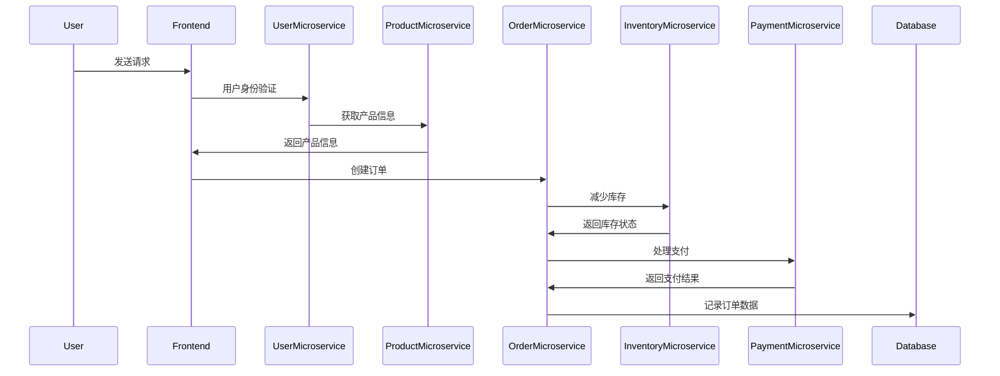
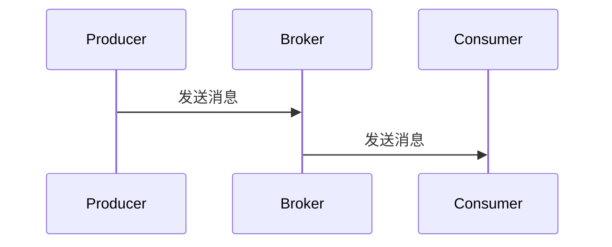

                 

### 1.1.1 从软件 1.0 到软件 2.0 的演进

#### 1.0 软件时代的背景与特点

在软件 1.0 时代，计算机应用主要集中在单机环境，软件系统的功能相对单一，且具有明显的封闭性。这个阶段的软件系统主要依赖于操作系统提供的API进行开发，系统的集成与扩展较为困难，维护成本较高。

- **单机应用**：软件 1.0 时代的应用主要集中在单机环境中，没有形成分布式计算的模式。
- **功能单一**：软件系统主要完成特定的功能，缺乏灵活性和扩展性。
- **封闭性**：软件系统通常由单一供应商提供，与其他系统集成的难度较大。

#### 1.0 软件存在的问题

1. **系统集成困难**：由于软件系统之间的封闭性，系统集成成为一大难题，导致系统间的数据交互和功能调用变得复杂。
2. **可扩展性差**：软件 1.0 时代的系统难以适应业务需求的变化，扩展性差，导致系统更新和维护成本高。
3. **维护成本高**：由于系统封闭和缺乏标准化，软件 1.0 时代的系统维护成本较高，且容易出现因维护不当导致的问题。

#### 2.0 软件时代的背景与特点

随着互联网的普及和计算机技术的不断发展，软件 2.0 时代应运而生。这个时代的软件系统采用了分布式计算的模式，功能丰富且具有高度的开放性。

- **分布式计算**：软件 2.0 时代的应用采用了分布式计算的模式，可以实现跨地域、跨系统的协同工作。
- **功能丰富**：软件系统不仅具备基本功能，还引入了丰富的模块和接口，以满足多样化的业务需求。
- **开放性**：软件 2.0 时代的系统具有高度的开放性，可以通过标准化的接口与外部系统进行集成。

#### 2.0 软件的优势

1. **系统集成容易**：分布式计算模式使得软件系统之间的集成变得更加简单，通过标准化的接口和协议，可以实现无缝的数据交互和功能调用。
2. **可扩展性好**：软件 2.0 时代的系统设计更加灵活，可以通过模块化和组件化的方式实现系统的扩展，适应业务需求的变化。
3. **维护成本低**：由于系统的开放性和标准化，软件 2.0 时代的系统维护成本较低，且易于管理和监控。

### 1.1.2 大模型在软件 2.0 中的核心地位

#### 1.2.1 大模型的定义

大模型是指那些拥有数十亿到数万亿参数的神经网络模型。这些模型通常通过深度学习技术进行训练，具有较高的准确性和效率。

- **数十亿到数万亿参数**：大模型的参数规模远超传统模型，使其能够处理更为复杂的任务。
- **深度学习技术**：大模型采用深度学习技术进行训练，通过多层神经网络的学习，实现对数据的深层特征提取和建模。

#### 1.2.2 大模型在软件 2.0 中的作用

1. **提高算法的准确性和效率**：大模型通过深度学习技术，能够提取出数据的深层特征，从而提高算法的准确性和效率。
2. **实现更复杂的业务逻辑**：大模型能够处理复杂的业务逻辑，使得软件系统能够应对更为多样化的业务需求。
3. **促进人工智能技术的发展**：大模型的广泛应用推动了人工智能技术的快速发展，为软件 2.0 时代带来了更多的创新和机遇。

#### 1.2.3 大模型与传统AI的区别

1. **参数规模**：大模型的参数规模远超传统模型，通常拥有数十亿到数万亿个参数。
2. **训练数据量**：大模型需要大量的训练数据来进行训练，以提取出有效的特征。
3. **计算资源需求**：大模型对计算资源的需求较高，通常需要高性能的计算机集群和 GPU 进行训练。

### 1.1.3 企业级应用开发的新范式

#### 1.3.1 企业级应用的开发流程

企业级应用开发通常包括以下流程：

1. **需求分析**：明确业务需求和功能需求，为后续的设计和开发提供依据。
2. **架构设计**：根据需求分析的结果，设计系统的架构，确定系统的模块划分和接口设计。
3. **编码实现**：根据架构设计，编写代码实现系统的功能。
4. **测试与部署**：对系统进行测试，确保系统的稳定性和可靠性，然后进行部署。

#### 1.3.2 企业级应用开发的挑战

1. **系统复杂性**：企业级应用通常涉及复杂的业务逻辑和数据模型，系统的复杂性较高，给开发带来挑战。
2. **用户体验**：企业级应用需要满足用户的需求，提供良好的用户体验，这对设计、开发和测试提出了更高的要求。
3. **技术选型**：企业级应用需要选择合适的技术和框架，以满足业务需求，同时要考虑技术的前景和可持续性。

#### 1.3.3 大模型在企业级应用开发中的应用

1. **数据分析**：大模型在企业级应用开发中可以用于数据分析和挖掘，提取出有价值的信息，辅助决策。
2. **智能推荐**：大模型可以用于实现智能推荐系统，根据用户行为和偏好，为用户推荐合适的商品或服务。
3. **自动化**：大模型可以帮助实现自动化功能，如自动化审核、自动化运维等，提高系统的效率和可靠性。

### 总结

从软件 1.0 到软件 2.0 的演进，体现了技术发展的必然趋势。大模型在软件 2.0 时代扮演着核心角色，为企业级应用开发带来了新的机遇和挑战。在未来的发展中，企业级应用开发将更加注重用户体验、系统复杂性和技术选型，同时大模型的应用将不断深入，推动企业级应用向更智能、更高效的方向发展。### 1.1.4 软件架构的核心概念与要素

在软件架构设计中，核心概念和要素是理解架构设计的关键。以下将详细介绍软件架构的核心概念、基本要素以及它们之间的联系。

#### 核心概念

**1. 软件架构**

软件架构是指对软件系统的结构、组件、接口和关系的抽象描述。它定义了系统的整体结构和行为，是软件开发和维护的基础。

**2. 构件**

构件是软件架构中的基本组成部分，可以是一个模块、类或组件。构件具有明确的接口，可以独立开发、测试和部署。

**3. 接口**

接口是构件之间交互的桥梁，定义了构件之间的通信方式和规则。接口的设计直接影响系统的可扩展性和可维护性。

**4. 层次结构**

层次结构是软件架构的一种组织形式，将系统划分为不同的层次，每一层负责特定的功能。常见的层次结构包括表示层、业务逻辑层和数据访问层。

**5. 软件设计模式**

软件设计模式是解决常见软件设计问题的模板，它提供了在特定场景下的最佳实践。设计模式可以应用于架构设计，以提高系统的可维护性和可扩展性。

#### 基本要素

**1. 功能性要素**

功能性要素包括系统的功能需求、性能需求、安全性需求等。这些要素决定了系统的整体功能和行为。

**2. 非功能性要素**

非功能性要素包括系统的可靠性、可扩展性、可维护性、用户体验等。这些要素影响了系统的长期运行效率和用户满意度。

**3. 架构风格**

架构风格是指系统架构的总体设计理念，如客户机/服务器架构、微服务架构、事件驱动架构等。不同的架构风格适用于不同的业务场景。

**4. 架构约束**

架构约束是限制架构设计的规则和条件，如技术选型、性能指标、资源限制等。架构约束有助于确保架构设计的可行性和可靠性。

#### 核心概念与要素之间的联系

**1. 功能性要素与非功能性要素**

功能性要素决定了系统的核心功能，而非功能性要素则影响了系统的长期运行效率和用户体验。二者共同决定了软件架构的设计方向。

**2. 架构风格与核心概念**

不同的架构风格适用于不同的核心概念和业务场景。例如，客户机/服务器架构适用于需要高可靠性和集中管理的场景，而微服务架构适用于需要高扩展性和高灵活性的场景。

**3. 架构约束与核心概念**

架构约束是确保软件架构设计可行性和可靠性的关键。它帮助设计者根据业务需求和资源限制，选择合适的架构风格和核心概念。

#### 概念结构与核心要素组成

**1. 概念结构**

概念结构是软件架构的逻辑表示，它通过构件、接口和关系来描述系统的结构和行为。概念结构为设计者提供了清晰的系统视图。

**2. 核心要素组成**

核心要素组成是指构成软件架构的基本元素，如构件、接口、层次结构和设计模式。这些要素共同构建了软件架构的骨架。

通过上述对软件架构核心概念和要素的介绍，我们可以更深入地理解软件架构的设计过程和重要性。在接下来的章节中，我们将进一步探讨软件架构设计的原则、模型和风格，以帮助读者更好地掌握软件架构的设计方法和实践。### 1.2 软件架构设计原则

软件架构设计是一个复杂且关键的过程，其目标是为软件开发提供一个清晰、可扩展且易于维护的结构。为了实现这一目标，设计者需要遵循一系列的软件架构设计原则。以下将详细介绍几条重要的软件架构设计原则，包括开放封闭原则、里氏替换原则、接口隔离原则和依赖倒置原则。

#### 开放封闭原则（Open Closed Principle，OCP）

开放封闭原则是软件架构设计中最基本的原则之一，它由罗伯特·马丁（Robert C. Martin）在其著作《设计模式：可复用面向对象软件的基础》中提出。该原则的核心思想是：软件实体（如类、模块和函数）应该对扩展开放，对修改封闭。

**原则描述：**
- **开放**：软件实体应该容易扩展，以适应新的需求。
- **封闭**：软件实体应该不容易被修改，以确保系统的稳定性和可靠性。

**应用实例：**
- 使用抽象类和接口定义系统的扩展点，而不是直接修改现有代码。
- 通过继承和组合实现扩展，避免对原有代码的修改。

**优点：**
- 提高系统的可扩展性和灵活性。
- 降低维护成本，减少因修改引起的潜在错误。

**缺点：**
- 可能会增加系统设计的复杂度。

#### 里氏替换原则（Liskov Substitution Principle，LSP）

里氏替换原则是另一个重要的设计原则，由巴布科克（Barbara Liskov）提出。该原则强调在继承关系中，子类必须能够替换其基类，而不会导致程序错误。

**原则描述：**
- 所有引用基类的地方必须能透明地使用其子类的对象代替。

**应用实例：**
- 确保子类能够实现基类的所有功能，并且在所有可能的情况下都能像基类一样使用。
- 避免子类对基类的方法产生副作用。

**优点：**
- 提高代码的可复用性和可维护性。
- 确保继承关系的正确性和一致性。

**缺点：**
- 过度使用继承可能导致代码冗余。

#### 接口隔离原则（Interface Segregation Principle，ISP）

接口隔离原则由罗伯特·马丁提出，它强调接口应该尽量细化，避免过大和过于复杂的接口。

**原则描述：**
- 客户不应该依赖他们不需要的接口。

**应用实例：**
- 为不同的客户端提供不同的接口，以减少客户端与接口之间的耦合。
- 设计小而具体的接口，使得客户端只需要实现它们需要的部分功能。

**优点：**
- 降低客户端与接口之间的耦合，提高系统的可维护性和可扩展性。
- 减少因接口变化引起的代码重构。

**缺点：**
- 可能会增加接口的数量，导致系统设计变得更加复杂。

#### 依赖倒置原则（Dependency Inversion Principle，DIP）

依赖倒置原则是另一个由罗伯特·马丁提出的重要设计原则，它强调高层模块不应依赖于低层模块，二者都应依赖于抽象。

**原则描述：**
- 抽象不应依赖于细节，细节应依赖于抽象。

**应用实例：**
- 使用抽象类或接口来定义依赖关系，而不是具体实现。
- 低层模块通过构造函数、设置器或回调函数等方式依赖高层模块的抽象。

**优点：**
- 提高系统的灵活性和可维护性。
- 降低模块之间的耦合，使系统更加模块化。

**缺点：**
- 可能会增加系统设计的复杂度，特别是在处理复杂的依赖关系时。

### 总结

软件架构设计原则是确保软件系统质量的关键。开放封闭原则、里氏替换原则、接口隔离原则和依赖倒置原则共同构成了软件架构设计的基本原则。这些原则帮助设计者构建可扩展、可维护且可靠的软件系统。在实际的架构设计中，设计者需要根据具体的需求和场景，灵活运用这些原则，以达到最佳的设计效果。### 2.1 软件架构模型

在软件架构设计中，模型是一种抽象的工具，用于描述系统的结构、组件及其相互作用。不同的模型可以提供不同的视角，帮助设计者理解和管理复杂系统。以下将介绍几种常见的软件架构模型：粗粒度模型、细粒度模型以及模型之间的转换。

#### 粗粒度模型

粗粒度模型是一种较为抽象的架构模型，它关注系统的整体结构和主要组件。这种模型通常用于初步设计阶段，帮助设计者确定系统的宏观结构和功能划分。

**特点：**
- **抽象度高**：粗粒度模型不涉及细节实现，专注于系统的整体结构和主要功能。
- **易理解**：由于模型较为简洁，易于非技术人员理解。

**应用场景：**
- 初始设计和需求分析阶段。
- 项目立项和可行性研究。

**示例：**
- **层次结构模型**：将系统划分为表示层、业务逻辑层和数据访问层。
- **功能结构模型**：根据系统的功能模块进行划分，如用户管理、订单处理等。

#### 细粒度模型

细粒度模型是一种更为详细的架构模型，它关注系统的具体组件和内部交互。这种模型通常用于详细设计阶段，帮助设计者实现系统的具体功能。

**特点：**
- **详细具体**：细粒度模型涵盖了系统的所有组件及其具体实现细节。
- **技术性强**：细粒度模型需要深入了解系统的技术实现。

**应用场景：**
- 详细设计和编码阶段。
- 代码审查和技术评审。

**示例：**
- **组件模型**：详细描述系统中的各个组件及其接口。
- **序列图**：展示组件之间的交互过程。

#### 模型之间的转换

在软件架构设计中，从粗粒度模型到细粒度模型的转换是一个重要过程。这种转换通常通过逐步细化模型来实现，每个步骤都增加了模型的详细程度。

**转换过程：**
1. **初始模型**：从需求分析中提取粗粒度模型，确定系统的主要结构和功能。
2. **细化模型**：逐步细化模型，增加具体组件和交互细节，形成细粒度模型。
3. **实现与验证**：将细粒度模型转换为实际代码，并进行测试和验证。

**优点：**
- **逐步完善**：通过逐步细化模型，设计者可以逐步完善系统的设计，减少出错的可能性。
- **灵活调整**：在模型转换过程中，设计者可以根据需求变化和技术进步，灵活调整模型。

**缺点：**
- **复杂度增加**：随着模型的细化，系统的复杂度会逐渐增加，对设计者提出了更高的要求。

#### 模型之间的转换方法

1. **自顶向下**：从粗粒度模型开始，逐步细化每个层次，直到达到细粒度模型。
2. **自底向上**：从细粒度模型开始，逐步抽象和合并组件，形成粗粒度模型。
3. **迭代开发**：在软件架构设计中，通常采用迭代的方式，在每次迭代中逐步细化模型，不断调整和优化设计。

通过上述的模型介绍和转换方法，我们可以看到，软件架构模型在软件开发中扮演着重要的角色。无论是粗粒度模型还是细粒度模型，都是设计者理解和构建复杂系统的有力工具。在实际的软件开发过程中，设计者需要根据项目需求和开发阶段，灵活运用这些模型，以提高系统的质量和效率。### 2.2 软件架构风格

在软件架构设计中，架构风格是系统设计的基本理念，它决定了系统的整体结构和设计原则。不同的架构风格适用于不同的业务场景和技术需求，以下将介绍几种常见的架构风格：客户机/服务器架构、微服务架构和大数据架构。

#### 客户机/服务器架构（Client/Server Architecture）

客户机/服务器架构是最传统的架构风格之一，它将系统划分为客户端和服务器两部分。客户端负责与用户交互，服务器负责处理业务逻辑和数据存储。

**特点：**
- **层次结构明显**：客户端负责界面展示和数据输入，服务器负责数据处理和存储。
- **高集中度**：服务器通常负责大部分的业务逻辑和数据存储，具有高度的集中度。

**应用场景：**
- **大型企业应用**：如企业资源规划（ERP）系统、客户关系管理（CRM）系统。
- **Web应用**：如电商平台、在线办公系统。

**优点：**
- **易于管理和维护**：由于服务器集中管理，系统易于维护和管理。
- **性能优化**：可以针对服务器进行性能优化，提高系统的整体性能。

**缺点：**
- **扩展性较差**：随着业务需求的增长，系统的扩展性较差，可能需要重新设计和部署。

#### 微服务架构（Microservices Architecture）

微服务架构是一种基于服务化的架构风格，将系统划分为多个小型、独立的微服务。每个微服务负责一个特定的业务功能，可以独立部署、开发和维护。

**特点：**
- **服务独立性**：每个微服务都是独立的，可以独立部署和扩展。
- **去中心化**：系统没有中央服务器，每个服务都可以直接与其他服务通信。

**应用场景：**
- **分布式系统**：如电商系统、金融系统。
- **高并发场景**：如社交网络、在线游戏。

**优点：**
- **高扩展性**：可以通过水平扩展微服务来应对高并发和大数据场景。
- **灵活性**：每个微服务都可以独立开发、测试和部署，提高了系统的灵活性和可维护性。

**缺点：**
- **复杂性**：系统复杂度增加，需要更多的工具和框架来管理和协调服务。
- **通信开销**：服务之间需要进行大量的通信，可能导致通信开销较大。

#### 大数据架构（Big Data Architecture）

大数据架构是针对大数据处理和分析的架构风格，通常涉及分布式计算、大数据存储和数据分析等环节。

**特点：**
- **分布式计算**：大数据处理通常需要分布式计算框架，如Hadoop、Spark等。
- **大数据存储**：使用分布式文件系统或NoSQL数据库来存储海量数据。
- **实时分析**：通过实时数据处理技术，实现对大数据的实时分析和处理。

**应用场景：**
- **数据分析**：如搜索引擎、推荐系统。
- **数据挖掘**：如商业智能、风险控制。

**优点：**
- **高效处理**：分布式计算和存储技术可以高效地处理海量数据。
- **实时性**：可以实时处理和分析数据，快速响应业务需求。

**缺点：**
- **技术复杂**：需要掌握多种技术和工具，对开发团队的技术水平要求较高。
- **资源消耗**：分布式计算和存储技术需要大量的计算资源和存储空间。

### 总结

不同的软件架构风格适用于不同的业务场景和技术需求。客户机/服务器架构适合大型企业应用，具有明显的层次结构和易于维护的特点；微服务架构适用于分布式系统和高并发场景，具有高扩展性和灵活性；大数据架构则适合大数据处理和分析，通过分布式计算和存储技术高效地处理海量数据。设计者需要根据具体需求和场景，选择合适的架构风格，以构建高质量、高效率的软件系统。### 3.1 架构取舍的必要性

在软件架构设计过程中，取舍是一个至关重要且不可避免的环节。随着技术的不断发展，系统的复杂性日益增加，资源限制、用户体验和项目目标等因素都要求设计者做出一系列的取舍决策。以下将详细分析架构取舍的必要性，以及资源限制、用户体验和项目目标等关键因素。

#### 资源限制

资源限制是架构取舍的首要考虑因素。无论是时间、人力还是硬件资源，都会对架构设计产生影响。在资源有限的情况下，设计者必须做出明智的取舍，以确保系统能够在给定的资源范围内正常运行。

**1. 时间限制**

在软件开发项目中，时间限制往往非常严格。这意味着设计者需要在有限的时间内完成架构设计、开发、测试和部署。为了满足时间要求，设计者可能需要简化某些功能模块，减少不必要的复杂性，以确保核心功能能够按时交付。

**2. 人力限制**

人力资源的有限性也是一个重要的考量因素。大型项目可能需要多个团队和开发人员协作完成，而每个团队和人员的技能和资源都有限。在这种情况下，设计者需要根据团队的实际情况，合理分配任务和责任，以确保项目顺利进行。

**3. 硬件资源限制**

硬件资源，如服务器、存储和网络带宽等，也对架构设计产生重要影响。在硬件资源有限的情况下，设计者可能需要采用更为高效的技术和架构风格，如微服务架构或容器化技术，以优化资源利用率和系统性能。

#### 用户体验

用户体验是软件架构设计的重要目标之一。一个优秀的架构设计应该能够提供良好的用户体验，满足用户的需求和期望。为了实现这一目标，设计者需要在功能实现、性能优化和易用性等方面做出一系列的取舍。

**1. 功能实现**

在满足用户需求的前提下，设计者需要权衡功能的实现优先级。某些功能可能对用户体验至关重要，而另一些功能则可以暂时搁置或简化。通过合理的功能取舍，设计者可以确保系统能够快速、高效地满足核心需求。

**2. 性能优化**

性能是用户体验的重要方面。为了提供良好的性能，设计者可能需要在架构设计中采用一些性能优化策略，如缓存、负载均衡和分布式计算等。然而，这些策略往往需要额外的开发时间和资源，设计者需要在性能优化和资源限制之间做出取舍。

**3. 易用性**

易用性是用户体验的核心。为了提高系统的易用性，设计者可能需要在界面设计、交互逻辑和用户引导等方面投入更多精力。然而，这可能会导致系统设计和开发复杂度的增加，设计者需要在易用性和设计复杂性之间做出权衡。

#### 项目目标

项目目标是架构设计的重要指导原则。不同的项目目标，如快速交付、高可靠性和高扩展性，会对架构设计产生不同的影响。设计者需要在这些目标之间做出权衡，以确保架构设计能够满足项目的整体需求。

**1. 快速交付**

在某些项目中，快速交付可能是最重要的目标。为了实现这一目标，设计者可能需要采用敏捷开发方法，快速迭代和交付最小可行产品（MVP）。这通常意味着在架构设计上做出一些妥协，如简化某些功能模块或采用临时解决方案。

**2. 高可靠性**

高可靠性是许多项目的关键要求。为了确保系统的可靠运行，设计者需要在架构设计上考虑冗余、故障恢复和监控等机制。然而，这些机制往往需要额外的资源和时间投入，设计者需要在可靠性和资源投入之间做出权衡。

**3. 高扩展性**

高扩展性是许多互联网项目的需求。为了实现系统的扩展性，设计者需要在架构设计中考虑可扩展性、分布式和模块化等因素。然而，这可能导致系统设计和开发的复杂度增加，设计者需要在扩展性和设计复杂性之间做出权衡。

### 总结

架构取舍是软件架构设计过程中不可或缺的环节，它涉及到资源限制、用户体验和项目目标等多个方面。设计者需要在这些因素之间做出权衡，以确保架构设计能够在有限的资源下，提供良好的用户体验，并满足项目的整体目标。通过合理的取舍，设计者可以构建出高质量、高效率的软件系统。### 3.2 架构取舍的原则

在软件架构设计中，架构取舍是一个复杂且关键的过程。为了确保架构设计既符合项目的需求，又能够在资源有限的情况下实现，设计者需要遵循一系列的架构取舍原则。以下将详细讨论目标导向、用户优先和可持续发展这三个关键原则，并阐述它们在架构取舍过程中的具体应用。

#### 目标导向

目标导向原则是架构取舍的核心原则之一，它强调架构设计应该始终围绕项目目标进行。在架构设计过程中，设计者需要明确项目的具体目标，并将这些目标作为架构取舍的依据。

**原则描述：**
- 架构设计应该始终服务于项目的核心目标，确保每个设计决策都与目标紧密相关。
- 在面对多个可能的架构方案时，选择能够最好地实现项目目标的方案。

**具体应用：**
- **需求分析**：在项目初期，对需求进行详细分析，明确项目的核心目标和关键功能。
- **优先级排序**：在架构设计阶段，根据项目目标对各个功能模块的重要性进行排序，优先实现关键功能。
- **权衡利弊**：在架构取舍过程中，评估每个设计方案对项目目标的贡献，选择能够最好地满足目标的方案。

**优点：**
- 确保架构设计始终与项目目标保持一致，避免设计偏离。
- 提高项目的成功率和投资回报率。

**缺点：**
- 过于强调目标导向可能导致忽视其他重要的设计原则，如可维护性和可扩展性。

#### 用户优先

用户优先原则强调在架构取舍过程中，应优先考虑用户体验和用户需求。软件系统的最终目的是为用户提供价值，因此，用户体验和用户需求应该是架构设计的重要考量因素。

**原则描述：**
- 用户需求和体验应该优先于其他因素，确保系统能够满足用户的基本需求。
- 在面对不同的架构方案时，选择能够提供更好用户体验的方案。

**具体应用：**
- **用户研究**：在架构设计阶段，进行用户研究和用户测试，深入了解用户的需求和痛点。
- **优先级排序**：根据用户研究的成果，对功能模块进行优先级排序，确保关键功能和用户体验得到优先实现。
- **迭代优化**：在架构取舍过程中，持续关注用户反馈，不断优化用户体验，确保系统能够满足用户需求。

**优点：**
- 提高用户满意度和系统使用率。
- 增强系统的市场竞争力。

**缺点：**
- 过于强调用户体验可能导致系统设计过于复杂，增加开发和维护成本。

#### 可持续发展

可持续发展原则强调在架构取舍过程中，应考虑系统的长期健康和可维护性。一个优秀的架构设计不仅应该满足当前的需求，还应该能够适应未来的变化和扩展。

**原则描述：**
- 架构设计应该具有可持续性，能够适应未来的技术进步和业务需求变化。
- 在面对不同的架构方案时，选择具有更高可维护性和可扩展性的方案。

**具体应用：**
- **技术选型**：在架构设计阶段，选择成熟且具有良好社区支持的技术，确保系统能够长期稳定运行。
- **模块化设计**：通过模块化设计，将系统划分为独立的功能模块，提高系统的可维护性和可扩展性。
- **代码质量**：在架构取舍过程中，注重代码质量和架构的整洁性，确保系统易于维护和扩展。

**优点：**
- 提高系统的可维护性和可扩展性，降低长期的维护成本。
- 增强系统的灵活性和适应性，适应未来的技术变革。

**缺点：**
- 可持续性的架构设计可能需要额外的开发时间和资源投入。

### 总结

架构取舍是软件架构设计过程中不可或缺的环节，它涉及到多个原则和策略。目标导向、用户优先和可持续发展是三个关键原则，它们共同指导设计者在资源有限的情况下，做出合理的架构取舍决策。通过遵循这些原则，设计者可以构建出既满足当前需求，又具有长期可持续性的软件系统。### 3.3 架构取舍的策略

在软件架构设计中，架构取舍不仅是原则的贯彻，还需要具体策略来实施。以下将详细讨论成本效益分析、技术风险评估和团队协作这三个关键策略，并介绍如何在实际项目中应用这些策略。

#### 成本效益分析

成本效益分析是架构取舍的重要工具，它帮助设计者评估不同架构方案的投入和产出，选择最具成本效益的方案。

**策略描述：**
- 评估不同架构方案的初期投入（如开发时间、人力资源和硬件资源）。
- 预测不同架构方案的长远效益（如系统性能、可维护性和扩展性）。
- 通过成本效益分析，选择能够以最低成本实现项目目标且效益最大的架构方案。

**具体步骤：**
1. **定义架构方案**：明确不同的架构方案，包括其核心组件、交互方式和技术选型。
2. **成本评估**：计算每个架构方案的初期投入，包括开发、测试和部署等环节的成本。
3. **效益预测**：预测每个架构方案在系统性能、可维护性和扩展性等方面的长远效益。
4. **成本效益比较**：比较不同架构方案的总成本和总效益，选择成本效益最高的方案。

**应用实例：**
- 在选择数据库系统时，设计者可以比较关系型数据库和NoSQL数据库的初始开发和维护成本，以及它们在处理性能和可扩展性方面的效益。

#### 技术风险评估

技术风险评估是架构取舍的关键策略之一，它帮助设计者评估所选技术的可靠性和风险。

**策略描述：**
- 评估所选技术的稳定性、成熟度和社区支持情况。
- 识别潜在的技术风险，如技术过时、社区支持不足或技术不成熟等。
- 通过技术风险评估，选择技术风险最小的架构方案。

**具体步骤：**
1. **技术评估**：对所选技术进行深入评估，包括其文档、社区支持、使用案例和稳定性。
2. **风险识别**：识别所选技术的潜在风险，如技术过时、社区支持不足或技术不成熟等。
3. **风险评估**：对识别出的风险进行评估，确定其对项目的潜在影响和可能性。
4. **风险应对**：制定风险应对策略，如技术升级、备份方案或替代技术等。

**应用实例：**
- 在选择微服务架构时，设计者需要评估所选技术框架的稳定性、社区支持和成熟度，确保所选框架能够长期支持项目的稳定运行。

#### 团队协作

团队协作是架构取舍的关键，它确保所有团队成员都对架构决策有共同的理解和承诺。

**策略描述：**
- 促进团队成员之间的沟通和协作，确保所有人都能参与架构决策过程。
- 建立统一的架构愿景和目标，确保团队成员对架构设计有共同的理解。
- 通过团队协作，确保架构决策的全面性和可行性。

**具体步骤：**
1. **组建架构团队**：确保团队成员具有多样化的技能和经验，包括开发、测试、运维等。
2. **沟通与协作**：定期召开架构会议，讨论和评估不同的架构方案，确保团队成员之间的信息流通。
3. **决策过程**：建立明确的决策流程和责任分配，确保每个团队成员都有明确的职责和任务。
4. **文档与记录**：记录架构决策的依据和过程，以便后续的回顾和优化。

**应用实例：**
- 在大型项目中，设计者可以组建专门的架构团队，确保不同团队之间的协作和沟通，提高架构设计的质量和效率。

### 总结

架构取舍不仅是原则的贯彻，还需要具体的策略来实施。成本效益分析、技术风险评估和团队协作是三个关键策略，它们帮助设计者在资源有限的情况下，做出合理的架构取舍决策。通过这些策略，设计者可以构建出既满足当前需求，又具有长期可持续性的软件系统。### 4.1 需求分析

需求分析是软件架构设计的重要阶段，它直接关系到架构设计的成败。在这一阶段，设计者需要全面了解用户需求、业务需求和技术需求，为后续的架构设计提供坚实的基础。以下将详细介绍需求分析的具体内容，包括用户需求、业务需求和技术需求的分析方法和过程。

#### 用户需求分析

用户需求分析旨在了解最终用户对软件系统的期望和需求。通过用户需求分析，设计者可以明确用户界面、功能模块和用户体验等方面的需求。

**分析方法：**
1. **访谈与调查**：通过与用户进行面对面访谈或在线调查，收集用户对系统的期望和需求。
2. **用户故事**：使用用户故事（User Story）的方法，描述用户在系统中期望完成的具体任务和功能。
3. **用户场景**：通过用户场景（User Scenario）的方法，模拟用户在系统中的操作流程，了解用户需求。

**过程：**
1. **收集需求**：通过访谈、调查和用户故事等方法，收集用户的期望和需求。
2. **整理需求**：将收集到的需求进行分类和整理，明确每个需求的具体内容和优先级。
3. **需求评审**：组织需求评审会议，确保所有团队成员对用户需求有共同的理解和认识。

#### 业务需求分析

业务需求分析旨在了解企业或组织对软件系统的业务目标和功能需求。通过业务需求分析，设计者可以确保系统功能与企业的战略目标相一致。

**分析方法：**
1. **业务流程图**：通过业务流程图（Business Process Diagram），了解企业的业务流程和关键环节。
2. **业务场景**：通过业务场景（Business Scenario），模拟企业在系统中的业务操作流程，明确业务需求。
3. **业务指标**：分析企业的关键业务指标，如销售额、客户满意度等，确保系统功能能够支持这些指标的提升。

**过程：**
1. **收集业务需求**：通过业务流程图、业务场景和业务指标等方法，收集企业的业务需求和目标。
2. **整理业务需求**：将收集到的业务需求进行分类和整理，明确每个需求的具体内容和优先级。
3. **需求评审**：组织业务需求评审会议，确保所有团队成员对业务需求有共同的理解和认识。

#### 技术需求分析

技术需求分析旨在了解软件系统在技术方面的需求和约束。通过技术需求分析，设计者可以确保系统技术架构的选择和实现能够满足业务需求。

**分析方法：**
1. **技术评估**：对现有技术进行评估，包括其稳定性、成熟度和社区支持等。
2. **技术选型**：根据业务需求和技术评估结果，选择最适合的技术方案。
3. **兼容性分析**：分析所选技术方案与其他系统或服务的兼容性。

**过程：**
1. **收集技术需求**：通过技术评估、技术选型和兼容性分析等方法，收集系统的技术需求。
2. **整理技术需求**：将收集到的技术需求进行分类和整理，明确每个需求的具体内容和优先级。
3. **需求评审**：组织技术需求评审会议，确保所有团队成员对技术需求有共同的理解和认识。

#### 需求分析过程

需求分析是一个迭代和逐步细化的过程，通常包括以下几个阶段：

1. **需求收集**：通过访谈、调查和用户故事等方法，收集用户需求、业务需求和技术需求。
2. **需求整理**：对收集到的需求进行分类和整理，明确每个需求的具体内容和优先级。
3. **需求评审**：组织需求评审会议，确保所有团队成员对需求有共同的理解和认识。
4. **需求文档**：编写需求文档，详细描述用户需求、业务需求和技术需求。
5. **需求验证**：通过用户验证和业务验证，确保需求文档的准确性和可行性。
6. **需求更新**：根据项目进展和需求变化，定期更新需求文档，确保需求的实时性和准确性。

通过详细的需求分析过程，设计者可以全面了解用户、业务和技术需求，为后续的架构设计提供坚实的基础。需求分析的准确性和完整性对软件架构设计至关重要，它直接影响到系统的质量、性能和用户体验。### 4.2 架构设计

架构设计是软件开发过程中至关重要的一环，它决定了系统的整体结构、性能和可维护性。在这一阶段，设计者需要根据需求分析的结果，进行系统的整体规划和设计。以下将详细介绍架构设计的过程，包括初步设计、评审与调整以及实施与部署。

#### 初步设计

初步设计是架构设计的第一个阶段，其主要任务是确定系统的整体结构和主要模块。这一阶段的设计目标是提供一个高层次的系统视图，明确系统的关键组件及其关系。

**设计步骤：**
1. **确定系统架构风格**：根据业务需求和技术特点，选择合适的架构风格，如客户机/服务器架构、微服务架构或大数据架构。
2. **划分功能模块**：将系统划分为多个功能模块，每个模块负责特定的业务功能。
3. **定义模块接口**：为每个功能模块定义清晰的接口，确保模块之间的高内聚、低耦合。
4. **绘制架构图**：使用架构图（如UML类图、组件图等）来可视化系统的结构和模块关系。

**示例**：以一个电商系统为例，初步设计可能包括以下功能模块：
- **用户管理模块**：负责用户注册、登录和权限管理。
- **商品管理模块**：负责商品信息的管理和展示。
- **订单管理模块**：负责订单的创建、支付和配送。
- **库存管理模块**：负责库存信息的更新和管理。

#### 评审与调整

初步设计完成后，需要进行评审与调整。这一阶段的主要任务是确保架构设计符合需求分析的结果，并满足系统的性能、可维护性和可扩展性等要求。

**评审步骤：**
1. **内部评审**：组织内部架构评审会议，邀请开发、测试、产品等相关部门的成员参与，对架构设计进行讨论和评估。
2. **外部评审**：邀请外部专家或客户参与评审，收集外部意见，确保架构设计符合业务需求和用户体验。
3. **调整与优化**：根据评审意见，对架构设计进行调整和优化，确保设计更加合理和可行。

**注意事项：**
- **性能评估**：在评审过程中，需要进行性能评估，确保架构设计能够满足系统的性能要求。
- **可维护性**：考虑系统的可维护性，确保架构设计易于理解和修改。
- **可扩展性**：考虑系统的可扩展性，确保架构设计能够适应未来的业务需求变化。

#### 实施与部署

实施与部署阶段是将架构设计转化为实际代码和系统运行的过程。在这一阶段，设计者需要确保代码的质量、系统的稳定性和可靠性。

**实施步骤：**
1. **开发**：根据架构设计，进行具体的编码实现，开发各个功能模块。
2. **测试**：对开发完成的模块进行单元测试、集成测试和系统测试，确保系统的质量和稳定性。
3. **部署**：将测试通过的模块部署到生产环境，确保系统正常运行。

**注意事项：**
- **版本控制**：使用版本控制系统（如Git）进行代码管理，确保代码的版本可追溯和可回滚。
- **自动化测试**：采用自动化测试工具，提高测试效率和覆盖范围。
- **持续集成与持续部署**：实施持续集成和持续部署（CI/CD）流程，确保代码质量和系统稳定性。

通过以上步骤，设计者可以完成从初步设计到实施部署的整个架构设计过程。有效的架构设计不仅能够满足业务需求，还能提高系统的质量和可维护性，为企业的长期发展奠定基础。### 4.3 架构优化

架构优化是软件架构设计过程中不可或缺的一环，它旨在提高系统的性能、可靠性和可维护性，以满足不断变化的业务需求。以下将详细讨论架构优化的重要过程，包括持续集成、持续交付和架构健康监测。

#### 持续集成

持续集成（Continuous Integration，CI）是一种软件开发实践，通过频繁地将代码合并到主干分支，并自动进行构建、测试和部署，以确保代码的持续健康和一致性。

**原理：**
- **频繁提交**：开发人员频繁提交代码到版本控制系统，每次提交都会触发自动构建和测试。
- **自动构建**：构建系统自动编译代码、执行单元测试和集成测试，确保每次提交的代码都能正常运行。
- **快速反馈**：持续集成系统能够快速提供反馈，如测试失败、代码冲突等，帮助开发人员及时发现问题并进行修复。

**应用步骤：**
1. **集成环境搭建**：搭建持续集成环境，配置构建工具（如Jenkins、GitLab CI等）和自动化测试工具。
2. **自动化脚本编写**：编写自动化脚本，用于构建、测试和部署代码。
3. **持续测试**：持续集成系统能够定期运行自动化测试，确保代码的稳定性和一致性。
4. **反馈与修复**：开发人员根据持续集成系统的反馈，及时修复代码中的问题和缺陷。

**优点：**
- **快速发现和修复缺陷**：通过频繁的测试，可以快速发现并修复代码中的问题。
- **提高代码质量**：持续集成有助于保持代码的健康和一致性，提高整体代码质量。
- **降低风险**：持续集成能够降低代码集成和部署的风险，减少集成时的冲突和错误。

#### 持续交付

持续交付（Continuous Delivery，CD）是一种软件开发和部署实践，通过自动化测试和部署流程，确保每次代码提交后都能快速、安全地交付到生产环境。

**原理：**
- **自动化测试**：在持续交付过程中，代码提交后首先进行自动化测试，确保代码的稳定性和可靠性。
- **部署流水线**：构建自动化部署流水线，将测试通过的代码部署到不同环境（如测试环境、预生产环境和生产环境）。
- **快速迭代**：持续交付允许快速迭代和部署，使团队能够快速响应市场需求和用户反馈。

**应用步骤：**
1. **部署流水线设计**：设计部署流水线，包括构建、测试、部署等环节。
2. **自动化部署脚本**：编写自动化部署脚本，用于在不同环境之间部署代码。
3. **环境配置管理**：管理不同环境的配置，确保环境的一致性。
4. **监控与反馈**：部署完成后，对系统进行监控，确保系统的稳定性和性能，并及时反馈问题。

**优点：**
- **快速部署**：通过自动化部署流水线，可以快速将代码部署到生产环境，缩短发布周期。
- **降低风险**：自动化测试和监控有助于降低部署风险，确保系统的稳定性和可靠性。
- **提高用户满意度**：快速迭代和部署能够更好地满足用户需求，提高用户满意度。

#### 架构健康监测

架构健康监测是确保软件系统长期稳定运行的重要手段。通过实时监测系统的性能、资源利用率和潜在问题，设计者可以及时采取措施，防止系统故障和性能下降。

**原理：**
- **性能监测**：监测系统的性能指标，如响应时间、吞吐量和资源利用率等。
- **故障监测**：监测系统中的异常和故障，如服务中断、数据丢失等。
- **预警机制**：在系统性能或稳定性出现问题时，及时发出警报，通知相关人员进行处理。

**应用步骤：**
1. **性能指标定义**：明确需要监测的性能指标，如响应时间、吞吐量和资源利用率等。
2. **监控工具选择**：选择合适的监控工具（如Prometheus、Zabbix等），进行系统性能和故障监测。
3. **实时数据收集**：通过日志、指标和告警等手段，实时收集系统的运行数据。
4. **分析和预警**：对收集到的数据进行分析，及时发现潜在问题和异常，并发出警报。

**优点：**
- **预防故障**：通过实时监测和预警，可以提前发现系统故障和性能问题，及时采取措施，防止故障发生。
- **提高性能**：通过监测系统的性能指标，可以优化系统配置和资源利用，提高系统性能。
- **提升可靠性**：通过持续的监测和优化，可以提高系统的稳定性和可靠性，降低故障率。

#### 总结

架构优化是确保软件系统长期稳定运行的关键。持续集成、持续交付和架构健康监测是架构优化的重要过程，它们共同作用，提高系统的性能、可靠性和可维护性。通过持续集成，可以快速发现和修复缺陷，提高代码质量；通过持续交付，可以快速迭代和部署，提高用户满意度；通过架构健康监测，可以预防故障，提高系统性能和稳定性。这些优化手段相辅相成，共同支撑软件系统的长期健康发展。### 5.1 企业级应用架构案例

在本节中，我们将探讨一个企业级应用架构的案例，该案例涉及一家大型电商公司的在线购物平台。本案例的目标是通过合理的架构设计，实现系统的可扩展性、高性能和可靠性，以满足快速增长的用户需求。

#### 案例背景

这家大型电商公司正经历高速增长，用户数量和交易量不断增加。为了支持这一增长，公司决定开发一个全新的在线购物平台，以替代现有的老旧系统。新平台需要具备以下特点：

- **高并发处理能力**：能够应对大量用户的并发访问和交易。
- **高可用性**：确保系统在发生故障时能够快速恢复。
- **可扩展性**：能够根据业务需求进行弹性扩展。
- **安全性**：确保用户数据和交易数据的安全。
- **良好的用户体验**：提供流畅、快速的用户操作体验。

#### 架构设计

为了实现上述目标，公司选择了微服务架构，将系统划分为多个独立的微服务。以下是新平台的关键架构设计：

**1. 系统架构图**



**2. 系统架构说明**

- **前端服务（Frontend）**：负责用户界面的展示和用户请求的接收，将请求转发到对应的微服务。
- **用户服务（UserMicroservice）**：负责用户身份验证和权限管理。
- **产品服务（ProductMicroservice）**：负责产品信息的查询和管理。
- **订单服务（OrderMicroservice）**：负责订单的创建、管理和查询。
- **库存服务（InventoryMicroservice）**：负责库存信息的查询和更新。
- **支付服务（PaymentMicroservice）**：负责支付处理和支付结果通知。
- **数据库（Database）**：存储用户数据、产品信息、订单数据和支付数据。

#### 取舍过程

在设计过程中，公司做出了一系列关键的取舍决策，以下是一些重要决策：

**1. 技术选型**

- **前端框架**：选择了React.js，因为它具有较好的性能和灵活性，可以快速开发复杂的前端界面。
- **后端框架**：选择了Spring Boot，因为它支持微服务架构，易于集成和管理。
- **数据库**：选择了MySQL和MongoDB的组合，MySQL用于订单和用户数据的存储，MongoDB用于产品信息和日志数据的存储。

**2. 模块划分**

- **用户服务**：包括用户注册、登录、权限管理和用户信息管理。
- **产品服务**：包括产品分类、产品信息管理和库存管理。
- **订单服务**：包括订单创建、订单状态管理和订单查询。
- **支付服务**：包括支付方式管理、支付处理和支付通知。

**3. 性能优化**

- **缓存**：使用了Redis作为缓存服务，提高了数据查询速度。
- **负载均衡**：使用了Nginx进行负载均衡，确保高并发下的系统稳定运行。
- **异步处理**：使用了消息队列（如RabbitMQ）进行异步处理，减轻了系统的压力。

#### 性能优化

为了确保系统能够在高并发下稳定运行，公司采取了以下性能优化措施：

- **垂直和水平扩展**：通过增加服务器和数据库实例来扩展系统的处理能力。
- **数据库分库分表**：将数据库划分为多个独立的小数据库，减少单点瓶颈。
- **数据缓存**：使用Redis缓存频繁访问的数据，减少数据库查询次数。

#### 总结

通过合理的架构设计和技术选型，这家大型电商公司的在线购物平台在性能、可靠性和可扩展性方面取得了显著提升。微服务架构使得系统更加模块化，易于管理和扩展。性能优化措施确保了系统在高并发下的稳定运行。这个案例展示了如何通过架构取舍实现企业级应用的性能优化和长期发展。### 5.2 开源项目架构案例

在本节中，我们将探讨一个开源项目——Apache Kafka 的架构设计。Apache Kafka 是一个分布式流处理平台，用于处理实时数据流。其架构设计体现了高效、可扩展和可靠的特点，适用于大规模数据处理场景。

#### 案例背景

Apache Kafka 是由 LinkedIn 开发，后由 Apache 软件基金会接管的一个开源项目。它最初用于处理 LinkedIn 的日志数据和活动流，随着需求的增长，Kafka 逐渐成为了一个广泛使用的分布式流处理平台。Kafka 的目标是提供一种高吞吐量、低延迟、可扩展的实时数据流处理解决方案。

#### 架构设计

Kafka 的架构设计采用了分布式系统架构，具有以下特点：

**1. 系统架构图**


**2. 系统架构说明**

- **生产者（Producers）**：负责生成和发送消息，可以将消息发送到一个或多个 Kafka 集群的 topic 中。
- **主题（Topic）**：消息的分类容器，类似于数据库中的表。每个 topic 可以有多个分区（Partition），分区用于并行处理消息。
- **分区（Partition）**：将消息分布在不同的分区中，以提高系统的吞吐量和并发能力。
- **经纪人（Brokers）**：Kafka 集群的管理节点，负责接收、存储和转发消息。每个集群有一个或多个经纪人，负责不同的分区。
- **消费者（Consumers）**：从 Kafka 集群中消费消息，可以是一个或多个消费者组，每个消费者组负责消费特定的分区。

#### 取舍过程

在设计 Kafka 时，开发团队做出了一系列重要的取舍决策，以下是一些关键决策：

**1. 技术选型**

- **分布式架构**：选择了分布式系统架构，以实现高吞吐量和低延迟。
- **磁盘存储**：使用磁盘存储消息，而非内存存储，以支持大规模数据处理。
- **顺序读写**：Kafka 采用顺序读写模型，以减少磁盘寻道时间，提高读写效率。

**2. 模块划分**

- **生产者模块**：负责消息生成和发送，包括消息序列化、批量发送和错误处理等功能。
- **消费者模块**：负责消息消费和处理，包括拉取消息、批量处理和确认消费等功能。
- **经纪人模块**：负责集群管理、分区分配、消息路由和监控等功能。

**3. 扩展性**

- **分区机制**：通过分区机制实现并行处理，提高系统的吞吐量和并发能力。
- **副本机制**：通过副本机制实现数据备份和故障转移，提高系统的可靠性和可用性。

#### 系统接口设计

Kafka 的系统接口设计非常简洁，主要涉及生产者和消费者的 API：

- **生产者接口**：`kafka.producer.Producer`，用于发送消息。
- **消费者接口**：`kafka.consumer.Consumer`，用于消费消息。

以下是一个简单的生产者接口示例：

```python
from kafka import KafkaProducer

producer = KafkaProducer(bootstrap_servers=['localhost:9092'])

# 发送单条消息
producer.send('topic_name', b'message')

# 发送批量消息
producer.send('topic_name', batch_size=10)

# 异步发送消息
producer.send('topic_name', key=b'key', value=b'value', callback=lambda err, msg: print(err, msg))
```

#### 系统交互设计

Kafka 的系统交互设计主要通过主题、分区和经纪人实现消息的生产和消费。以下是一个简单的交互流程：

1. **生产者发送消息**：生产者将消息发送到特定的 topic 和分区。
2. **经纪人接收消息**：经纪人接收消息，并将其存储在本地磁盘上。
3. **消费者拉取消息**：消费者从经纪人拉取消息，并处理消息。

以下是一个简单的交互流程的 Mermaid 序列图：



#### 总结

Apache Kafka 的架构设计体现了分布式系统的高效、可扩展和可靠的特点。通过合理的模块划分、技术选型和扩展性设计，Kafka 成为了一个广泛应用的分布式流处理平台。这个案例展示了如何通过架构取舍和设计优化，实现开源项目的成功和广泛使用。### 7.1 架构取舍的最佳实践

在软件架构设计中，架构取舍是一个复杂且关键的过程。为了确保架构设计既能满足项目的需求，又能够在资源有限的情况下实现，设计者需要遵循一系列最佳实践。以下将介绍一些在架构取舍过程中常用的最佳实践，包括架构决策、风险管理、沟通协作等。

#### 架构决策

**1. 明确项目目标**

在进行架构取舍时，首先要明确项目的目标。项目目标包括功能实现、性能要求、用户体验、安全性等。只有明确目标，才能在架构取舍过程中做出合理的决策。

**2. 多方案比较**

在架构设计中，通常存在多个可能的方案。在做出决策前，应详细比较不同方案的优缺点，包括性能、成本、可维护性等方面，选择最优的方案。

**3. 考虑未来扩展**

在架构取舍时，不仅要考虑当前的需求，还要考虑未来的扩展性。一个良好的架构应该能够适应未来的变化，避免频繁的重构和迁移。

**4. 用户反馈**

在架构决策过程中，用户的反馈至关重要。通过与用户的沟通和测试，可以更好地了解用户的需求和期望，从而做出更符合用户需求的架构决策。

#### 风险管理

**1. 风险评估**

在架构取舍过程中，应进行风险评估，识别可能的风险。风险包括技术风险、业务风险、资源风险等。通过对风险的评估，可以提前制定风险应对策略。

**2. 风险应对**

针对识别出的风险，应制定相应的风险应对策略。风险应对策略包括风险规避、风险转移、风险接受和风险减轻等。

**3. 风险监控**

在架构实施过程中，应持续监控风险的发展，及时发现并处理新的风险。

#### 沟通协作

**1. 团队协作**

架构取舍是一个团队协作的过程，涉及多个部门和专业人员。为了确保架构决策的准确性和一致性，团队成员应保持良好的沟通和协作。

**2. 沟通机制**

建立有效的沟通机制，确保团队成员之间的信息流通。包括定期的架构评审会议、项目进度报告、技术分享会等。

**3. 持续沟通**

在架构设计过程中，应持续与用户、业务部门和开发团队进行沟通。通过持续沟通，可以及时调整架构设计，确保设计与需求的一致性。

#### 总结

架构取舍是软件架构设计过程中不可或缺的环节，它涉及到多个方面，包括架构决策、风险管理和沟通协作等。通过遵循最佳实践，设计者可以做出更合理、更有效的架构取舍决策，确保软件系统的质量和性能。### 7.2 小结

在本篇博客文章中，我们深入探讨了软件架构设计中的核心概念、原则、模型和风格，以及架构取舍的重要性和最佳实践。以下是对文章内容的简要总结和未来研究方向的建议。

#### 总结

1. **软件架构的核心概念与要素**：我们详细介绍了软件架构的核心概念，如软件架构、构件、接口、层次结构和设计模式，并阐述了它们在系统设计中的重要性。
2. **软件架构设计原则**：我们讨论了开放封闭原则、里氏替换原则、接口隔离原则和依赖倒置原则，这些原则为软件架构设计提供了理论基础。
3. **软件架构模型**：我们介绍了粗粒度模型、细粒度模型以及模型之间的转换过程，说明了不同模型在软件开发中的适用场景。
4. **软件架构风格**：我们探讨了客户机/服务器架构、微服务架构和大数据架构，展示了不同架构风格的特点和应用。
5. **架构取舍的必要性**：我们分析了资源限制、用户体验和项目目标等关键因素，强调了架构取舍在软件开发中的重要性。
6. **架构取舍的原则**：我们讨论了目标导向、用户优先和可持续发展等架构取舍原则，并提供了具体的实施策略。
7. **架构优化的过程**：我们介绍了持续集成、持续交付和架构健康监测等优化手段，强调了这些过程在提高系统性能和可靠性中的关键作用。
8. **实战案例分析**：我们通过企业级应用架构和开源项目架构的案例分析，展示了架构设计的实践和取舍过程。

#### 未来研究方向

1. **架构自动化**：随着技术的发展，架构自动化将成为一个重要方向。通过自动化工具和框架，可以大幅提高架构设计和优化的效率。
2. **架构智能化**：结合人工智能技术，实现智能化的架构设计，根据业务需求自动生成和优化架构方案。
3. **微服务架构的优化**：微服务架构虽然在分布式系统中广泛应用，但其复杂性和管理成本也较高。未来可以研究如何优化微服务架构，提高其可维护性和可扩展性。
4. **云原生架构**：随着云计算的普及，云原生架构将成为软件开发的主要方向。研究如何在云原生环境下优化架构设计，提高系统的弹性和可靠性。
5. **DevOps 与架构**：DevOps 文化强调开发和运维的紧密协作，未来可以进一步探讨如何在 DevOps 环境下优化架构设计，提高交付速度和质量。
6. **架构可解释性**：随着系统变得越来越复杂，如何提高架构的可解释性，使其更容易被团队成员理解和维护，是一个值得研究的问题。

通过本文的探讨，我们希望读者能够对软件架构设计有更深入的理解，能够在实际项目中运用这些理论和实践，构建出高质量、高效率的软件系统。### 7.3 注意事项

在软件架构设计中，除了遵循最佳实践和原则外，还有一些关键注意事项需要特别关注，以确保架构设计的质量和系统的稳定性。以下是一些重要的注意事项：

1. **架构设计与业务需求的紧密结合**：架构设计必须与业务需求保持高度一致，确保系统能够满足当前和未来的业务需求。在架构设计过程中，应持续与业务团队沟通，确保设计符合实际业务场景。

2. **架构文档的重要性**：良好的架构文档是确保架构设计顺利实施和后续维护的关键。文档应详细描述架构的各个组件、接口、交互方式和技术选型，并定期更新以反映实际系统状态。

3. **系统性能的持续优化**：架构设计不仅要考虑系统的初始性能，还要考虑长期的性能优化。在设计过程中，应考虑系统的可扩展性和性能监控，以便在系统运行过程中及时发现问题并进行优化。

4. **安全性设计**：在架构设计时，应充分考虑系统的安全性，包括数据加密、身份验证、访问控制等方面。安全性设计应贯穿于整个系统开发过程，确保系统在各种环境下都能保持安全稳定。

5. **架构的可维护性**：良好的架构设计应易于维护和扩展。在设计过程中，应避免过度设计，确保系统模块化，易于理解和修改。

6. **技术债务管理**：在架构设计过程中，应识别并管理技术债务，避免因短期内节省成本而影响系统的长期稳定性和可维护性。

7. **团队协作与沟通**：架构设计是一个团队协作的过程，需要各团队成员的积极参与和沟通。确保团队成员对架构设计有共同的理解和目标，避免因为信息不对称导致的设计缺陷。

通过关注这些注意事项，设计者可以构建出更加稳定、高效和可维护的软件系统。### 7.4 拓展阅读

为了进一步深入理解和掌握软件架构设计和取舍的相关知识，以下推荐一些值得阅读的拓展材料，这些资源涵盖了从基础理论到高级实践的各个方面：

1. **《设计模式：可复用面向对象软件的基础》**（Robert C. Martin）
   - 这本书详细介绍了软件设计模式，是理解软件架构设计的重要参考文献。

2. **《软件架构：实践者的研究方法》**（Len Bass、Paul Clements、Rick Kazman）
   - 本书提供了软件架构的系统性研究和实践方法，对架构设计有很高的指导价值。

3. **《微服务设计》**（Sam Newman）
   - 专注于微服务架构的设计和实践，适合想要深入了解微服务架构的读者。

4. **《大规模分布式系统设计》**（Martin Kleppmann）
   - 这本书详细介绍了大规模分布式系统的设计原则和常见问题，对理解分布式系统架构有很好的帮助。

5. **《云原生应用架构设计》**（Kai-Hoi Hui、Shing Wai Chuen、Jason Lee）
   - 介绍了云原生应用架构的设计原则和实践，适合关注云计算和容器化技术的读者。

6. **《持续交付：释放软件交付的潜力》**（Jez Humble、David Farley）
   - 详细阐述了持续交付的概念和实践，对优化软件开发流程和架构设计有很好的参考价值。

7. **《软件架构的艺术》**（Margaret H. Hamilton）
   - 这本书从系统级的角度探讨了软件架构的设计、实现和维护，对理解软件架构的系统性和复杂性有重要意义。

8. **《架构师的架构思维》**（Simon Brown）
   - 专注于架构师如何思考和实践，提供了许多实用的架构思维方法和技巧。

通过阅读这些书籍和文章，读者可以更全面地掌握软件架构设计和取舍的原理和方法，提高自己在实际项目中的应用能力。### 作者信息

**作者：** AI天才研究院/AI Genius Institute & 禅与计算机程序设计艺术 /Zen And The Art of Computer Programming

- **AI天才研究院（AI Genius Institute）**：AI天才研究院是一家致力于推动人工智能技术和应用研究的前沿机构，专注于培养和孵化新一代人工智能科学家和工程师。
- **禅与计算机程序设计艺术（Zen And The Art of Computer Programming）**：这是一部经典的技术哲学作品，由著名计算机科学家Donald E. Knuth撰写，深入探讨了编程艺术和软件架构设计中的哲学思想。

