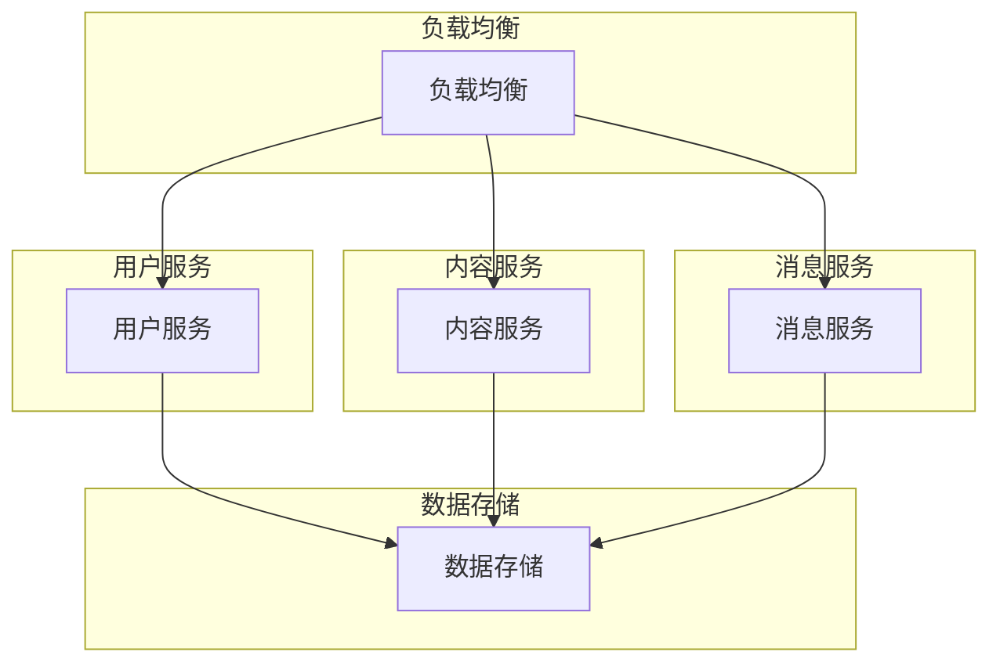
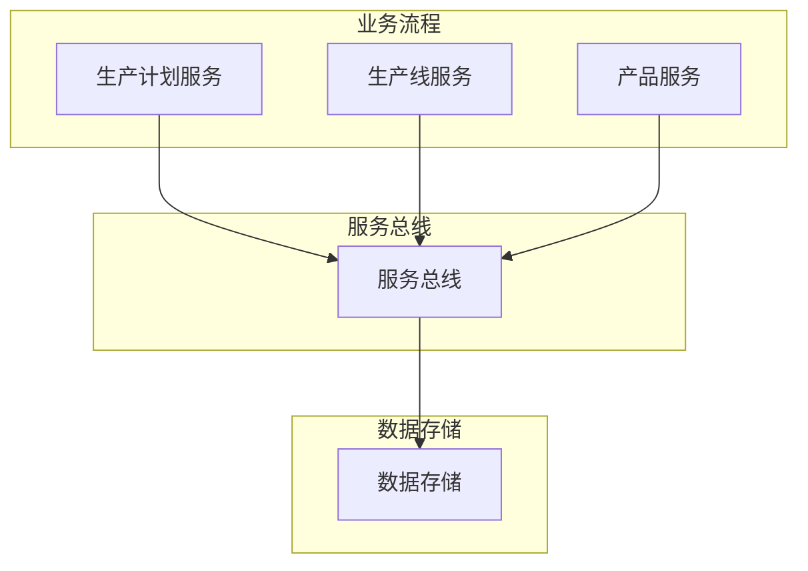
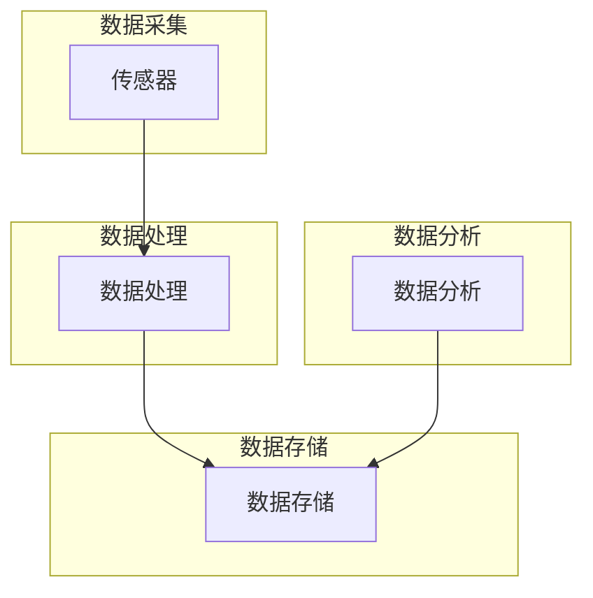
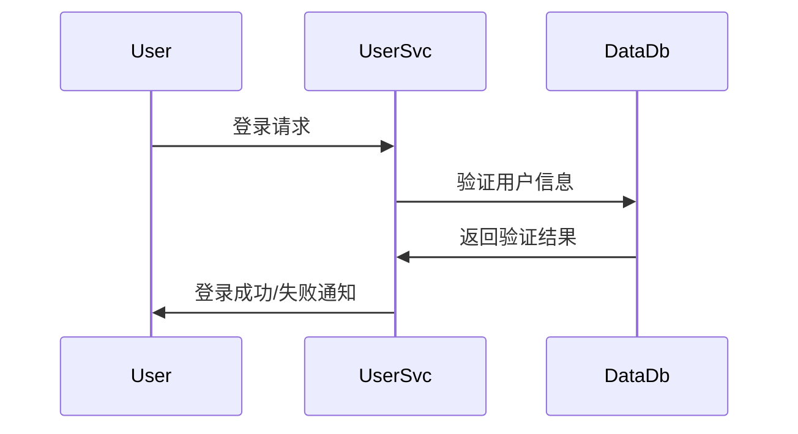
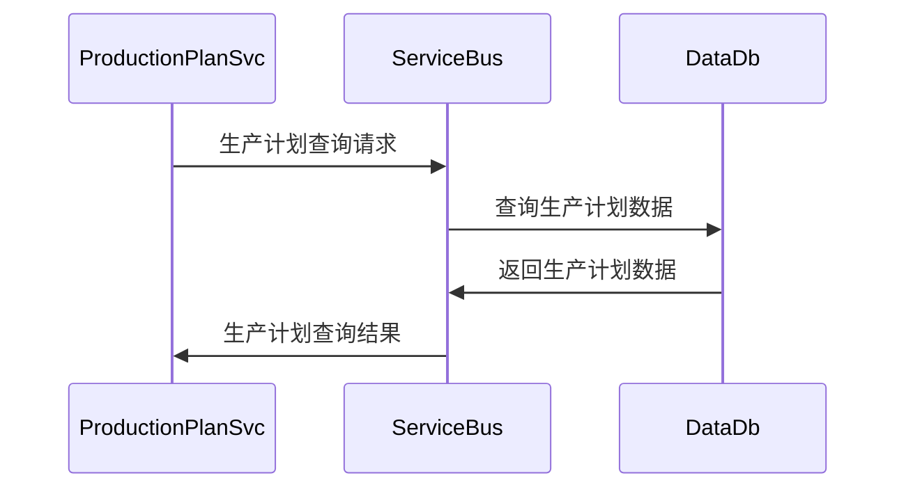
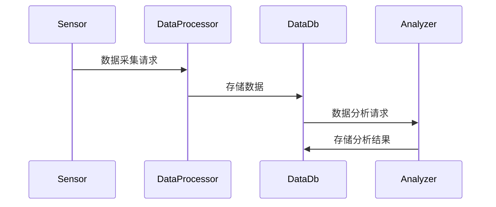

                 

### 引言：架构设计思考法的重要性

#### 2.1.1 问题的提出

在当今快速发展的信息技术时代，架构设计已成为软件开发和系统建设的核心环节。然而，传统的架构设计方法往往面临诸多挑战，例如：

- **复杂性的增加**：随着系统规模和复杂度的不断提升，传统的单一架构设计难以应对多变的需求和持续的压力。
- **高依赖性**：传统架构设计往往依赖于特定的技术栈和开发框架，导致系统的灵活性和可扩展性受限。
- **维护成本**：缺乏系统化设计的架构在后期维护和更新过程中往往成本高昂，甚至可能导致系统崩溃。

这些问题使得现代软件开发和系统建设迫切需要一种系统化的解决方案，以提升架构设计的效率和效果。

#### 2.1.2 系统化解决问题的需求

面对上述挑战，系统化解决问题的需求显得尤为重要。系统化解决问题的方法论不仅可以帮助开发者更好地理解和应对复杂系统，还能确保系统设计的稳定性和可扩展性。具体需求包括：

- **全局视角**：需要从全局视角出发，对系统进行整体设计和规划，确保各模块之间的协同性和一致性。
- **标准化流程**：建立标准化、系统化的设计流程，确保每次架构设计过程都有章可循，降低出错风险。
- **适应性**：架构设计需具备良好的适应性，能够根据业务需求的变化进行灵活调整。
- **可维护性**：设计需考虑后期的维护和扩展，确保系统能够长期稳定运行。

#### 2.1.3 架构设计思考法的作用

架构设计思考法作为系统化解决问题的方法论，其在现代软件开发和系统建设中的重要性不言而喻。其作用主要体现在以下几个方面：

- **提高设计效率**：系统化的方法论能够帮助开发者快速识别问题、提出解决方案，减少不必要的设计迭代。
- **确保设计质量**：通过标准化的流程和工具，架构设计能够更加严谨、科学，降低系统出错的风险。
- **增强可扩展性**：系统化的方法论能够帮助开发者设计出更加灵活、可扩展的架构，适应未来的需求变化。
- **促进团队合作**：统一的思考和设计方法有助于团队成员之间的沟通和协作，提升整体开发效率。

综上所述，架构设计思考法不仅是一种方法论，更是一种思维方式。它为现代软件开发和系统建设提供了有力的理论支持和实践指导，有助于应对日益复杂的挑战。

### 研究背景与文献综述

#### 2.2.1 研究背景

架构设计作为软件开发和系统建设的核心环节，其重要性不言而喻。随着信息技术的发展，系统规模和复杂度不断增加，传统的设计方法逐渐暴露出诸多不足，如难以应对动态变化的需求、维护成本高昂等问题。为了解决这些问题，系统化解决问题的方法论应运而生，其中架构设计思考法尤为重要。这种方法论通过系统化、标准化的设计流程和工具，帮助开发者更加高效、科学地进行架构设计，提高系统的稳定性和可扩展性。

#### 2.2.2 国内外研究现状

国内外学者对架构设计思考法的研究已经取得了一系列重要成果。国外研究主要集中在方法论的研究和工具的开发上。例如，著名的“领域驱动设计”（Domain-Driven Design, DDD）方法论，通过明确领域模型和设计原则，帮助开发者更好地理解和设计复杂系统。同时，一些先进的工具如Apache ZooKeeper、Kubernetes等，也在架构设计中得到了广泛应用。

国内研究在借鉴国外先进经验的基础上，也进行了许多创新。例如，面向服务架构（Service-Oriented Architecture, SOA）和微服务架构（Microservices Architecture）在国内得到了广泛关注和应用。此外，一些学者还针对特定领域（如物联网、大数据等）提出了相应的架构设计方法论，为实际应用提供了有力支持。

#### 2.2.3 研究意义与目标

本研究旨在深入探讨架构设计思考法的基本原理和应用，为现代软件开发和系统建设提供系统化、科学化的设计方法。具体来说，本研究具有以下意义和目标：

- **提高设计效率**：通过系统化的方法论，帮助开发者更加高效地进行架构设计，减少不必要的设计迭代和修改。
- **确保设计质量**：通过标准化的流程和工具，提高架构设计的严谨性和科学性，降低系统出错的风险。
- **增强可扩展性**：设计出更加灵活、可扩展的架构，适应未来业务需求的变化。
- **促进团队合作**：统一思考和设计方法，提升团队成员之间的沟通和协作效率。

本文将通过理论分析、实践案例和工具介绍等多个角度，全面阐述架构设计思考法的核心原理和应用方法，为实际应用提供有力指导。

### 架构设计思考法的基本原理

#### 2.3.1 架构设计思考法的定义

架构设计思考法是一种系统化、标准化的方法论，旨在通过逻辑推理和系统分析，帮助开发者设计出高效、稳定、可扩展的系统架构。这种方法论强调从全局视角出发，对系统进行整体规划和设计，确保各模块之间的协同性和一致性。

#### 2.3.2 架构设计思考法的特点

架构设计思考法具有以下几个显著特点：

1. **系统化**：该方法论通过一系列标准化的步骤和工具，确保架构设计过程有序、科学，减少设计过程中的随意性和主观性。
2. **全局视角**：架构设计思考法强调从全局视角出发，对系统进行整体规划和设计，确保各模块之间的协同性和一致性。
3. **适应性**：该方法论能够根据业务需求的变化进行灵活调整，设计出适应未来发展的系统架构。
4. **可扩展性**：通过合理的模块化和组件设计，架构设计思考法能够确保系统在未来的扩展和维护过程中具备良好的灵活性。
5. **可维护性**：该方法论在设计和开发过程中，注重系统的可维护性和可扩展性，降低后期维护成本。

#### 2.3.3 系统化解决问题的方法论

架构设计思考法作为一种系统化解决问题的方法论，其核心思想是通过一系列标准化的步骤，系统性地解决设计过程中的问题。具体步骤包括：

1. **问题识别**：明确系统需求，识别设计过程中可能遇到的问题和挑战。
2. **需求分析**：对系统需求进行详细分析，明确各模块的功能和交互。
3. **架构设计**：根据需求分析结果，设计系统的整体架构，包括模块划分、接口设计、组件关系等。
4. **验证与优化**：通过模型验证和实际运行测试，对设计进行优化，确保系统架构的稳定性和高效性。
5. **实施与部署**：根据设计文档，进行系统的实施和部署，确保系统能够顺利运行。

通过上述步骤，架构设计思考法能够帮助开发者系统性地解决设计过程中的各种问题，确保系统架构的可靠性和有效性。

### 架构设计思考法在实践中的应用

#### 2.4.1 案例分析

为了更好地理解架构设计思考法在实践中的应用，我们将通过几个具体案例来分析其应用效果。

**案例一：互联网公司的架构设计**

某互联网公司正在进行一项大型电商平台的开发。由于项目规模庞大，需求变化频繁，传统的设计方法难以满足需求。通过架构设计思考法，公司首先进行了需求分析，明确了各模块的功能和交互。接着，设计团队采用了微服务架构，将系统划分为多个独立的微服务，每个微服务负责不同的功能模块。通过这种设计，系统在可扩展性和可维护性方面得到了显著提升。在实际开发过程中，团队按照架构设计文档进行开发，确保了系统的一致性和稳定性。

**案例二：传统企业的数字化转型**

某传统制造企业正在进行数字化转型，目标是构建一个智能化生产管理系统。通过架构设计思考法，企业首先分析了现有业务流程和需求，识别出关键的业务模块和功能。接着，设计团队采用了面向服务架构（SOA），将业务流程和服务模块化，确保各模块之间的高内聚和低耦合。在实际应用中，企业通过服务化接口实现了业务流程的自动化和智能化，大大提高了生产效率和灵活性。

**案例三：政府部门的智慧城市项目**

某政府部门负责实施智慧城市项目，旨在通过信息技术提升城市管理和服务水平。通过架构设计思考法，项目团队首先对城市管理的各个领域进行了需求分析，明确了数据收集、处理和分析的需求。接着，设计团队采用了分布式架构，将数据采集、存储和处理模块进行分布式部署，确保系统的高可用性和高性能。在实际应用中，智慧城市项目实现了数据的实时处理和分析，为城市管理和决策提供了有力支持。

#### 2.4.2 实践经验分享

通过上述案例分析，我们可以总结出一些架构设计思考法的实践经验：

1. **需求分析**：明确需求和识别问题是架构设计的关键。只有在充分理解需求的基础上，才能设计出符合实际应用的系统架构。
2. **模块化设计**：模块化设计可以提高系统的可扩展性和可维护性。通过将系统划分为独立的模块，可以更好地管理和维护系统。
3. **标准化的设计流程**：采用标准化的设计流程和工具，可以确保设计过程的有序和高效，降低出错风险。
4. **灵活性和适应性**：架构设计需考虑未来的需求变化，确保系统能够适应不断变化的业务场景。
5. **验证与优化**：设计完成后，通过模型验证和实际测试，对设计进行优化，确保系统架构的稳定性和高效性。

#### 2.4.3 应用效果评估

通过实践应用，架构设计思考法在以下几个方面取得了显著效果：

1. **提升开发效率**：系统化的方法论和标准化的设计流程，使开发团队能够更加高效地完成架构设计任务。
2. **提高设计质量**：通过标准化的流程和工具，设计出的系统架构更加严谨、科学，降低了系统出错的风险。
3. **增强可扩展性**：模块化设计和灵活的架构，使系统在扩展和升级过程中更加方便，适应未来需求的变化。
4. **降低维护成本**：系统化的架构设计降低了后期的维护成本，确保系统长期稳定运行。

总之，架构设计思考法在实践中的应用，为现代软件开发和系统建设提供了有力的支持和指导，有助于提升系统的稳定性和可扩展性。

### 第二部分：架构设计思考法的基本概念

#### 3.1 架构设计的基本概念

架构设计是软件开发和系统建设中的核心环节，其重要性不言而喻。为了更好地理解架构设计，我们首先需要明确一些基本概念。

##### 3.1.1 架构的定义

架构（Architecture）在计算机科学中，通常指的是系统的整体结构和组成要素的配置。它定义了系统的各个组成部分如何相互协作，以实现特定的功能和性能目标。架构设计（Architecture Design）则是通过逻辑推理和系统分析，对系统进行整体规划和设计的过程。

##### 3.1.2 架构设计的目标

架构设计的目标主要包括：

1. **稳定性**：确保系统在长时间运行中能够保持稳定，不受外部干扰和内部故障的影响。
2. **可扩展性**：设计出能够方便扩展和升级的系统架构，以适应未来需求的变化。
3. **可维护性**：使系统易于维护，降低维护成本，提高开发效率。
4. **高效性**：优化系统性能，提高资源利用率和运行效率。

##### 3.1.3 架构设计的原则

成功的架构设计需要遵循一些基本原则，包括：

1. **模块化**：将系统划分为独立的模块，每个模块负责特定的功能，模块之间保持高内聚、低耦合。
2. **标准化**：采用标准化的设计流程和工具，确保设计过程的有序和高效。
3. **适应性**：考虑未来需求的变化，设计出能够灵活调整和优化的系统架构。
4. **安全性**：确保系统的数据安全和运行安全，防止外部攻击和内部故障。
5. **可复用性**：设计出可复用的组件和模块，提高开发效率和代码质量。

#### 3.2 系统化解决问题的方法论

系统化解决问题的方法论是一种通过逻辑推理和系统分析，逐步解决复杂问题的方法。在架构设计过程中，系统化解决问题的方法论尤为重要，可以帮助开发者系统性地识别问题、分析问题和解决问题。

##### 3.2.1 方法论的定义

系统化解决问题的方法论是一种基于逻辑推理和系统分析的思考模式，它通过一系列标准化的步骤，帮助开发者系统性地识别问题、分析问题和解决问题。这种方法论强调从全局视角出发，全面考虑问题的各个方面，确保解决方案的全面性和有效性。

##### 3.2.2 系统化解决问题的步骤

系统化解决问题的方法论通常包括以下步骤：

1. **问题识别**：通过调查和分析，识别系统设计过程中可能遇到的问题和挑战。
2. **需求分析**：明确系统的需求和功能，确定各模块之间的关系和交互。
3. **方案设计**：根据需求分析结果，设计出系统架构和组件，确保系统的稳定性和可扩展性。
4. **验证与优化**：通过模型验证和实际运行测试，对设计进行优化，确保系统架构的稳定性和高效性。
5. **实施与部署**：根据设计文档，进行系统的实施和部署，确保系统能够顺利运行。

##### 3.2.3 系统化解决问题的工具

在架构设计过程中，系统化解决问题的方法论需要借助一系列工具来辅助思考和操作。这些工具包括：

1. **需求管理工具**：如JIRA、Confluence等，用于管理需求文档和项目进度。
2. **建模工具**：如Mermaid、PlantUML等，用于绘制系统架构图、类图、序列图等。
3. **代码管理工具**：如Git、SVN等，用于版本控制和代码管理。
4. **测试工具**：如JUnit、Selenium等，用于单元测试和集成测试。
5. **性能分析工具**：如JMeter、Gatling等，用于性能测试和优化。

#### 3.3 架构设计思考法的核心要素

架构设计思考法作为一种系统化解决问题的方法论，其核心要素包括：

##### 3.3.1 问题背景

问题背景是架构设计思考法的起点，它描述了系统设计面临的实际问题和需求。包括：

1. **需求场景**：系统将应用于哪些场景，解决什么问题。
2. **现有问题**：系统设计过程中遇到的问题和挑战。
3. **目标要求**：系统需要实现的功能和性能目标。

##### 3.3.2 问题描述

问题描述是对问题背景的进一步细化，它包括：

1. **问题定义**：明确问题的核心和边界。
2. **问题分析**：分析问题产生的原因和影响因素。
3. **解决方案**：初步提出的解决方案和思路。

##### 3.3.3 问题解决

问题解决是架构设计思考法的核心步骤，它包括：

1. **设计思路**：根据问题描述，提出系统架构设计的总体思路。
2. **模块划分**：将系统划分为独立的模块，确保各模块的高内聚和低耦合。
3. **接口设计**：设计各模块之间的接口，确保模块之间的通信和协作。
4. **组件关系**：明确各组件之间的依赖关系，确保系统架构的稳定性和一致性。

##### 3.3.4 边界与外延

边界与外延是对系统架构的进一步限定和扩展，它包括：

1. **系统边界**：定义系统的外部边界，明确系统与外部环境的接口。
2. **功能扩展**：考虑系统的扩展性和未来需求变化，设计出可扩展的架构。
3. **性能优化**：通过性能分析和优化，确保系统的高性能和高可靠性。

##### 3.3.5 概念结构与核心要素组成

概念结构与核心要素组成是架构设计思考法的总结和归纳，它包括：

1. **核心概念**：系统架构中的核心概念和术语，如模块、组件、接口等。
2. **结构关系**：各核心概念之间的结构关系和依赖关系。
3. **要素组成**：系统架构中各组成部分的功能和作用。

通过上述核心要素，架构设计思考法能够帮助开发者系统性地进行架构设计，确保系统的高效性和可靠性。

#### 3.4 核心概念对比与分析

在架构设计过程中，理解并对比核心概念对于设计出高效、稳定的系统架构至关重要。以下是对几个关键概念进行对比和分析：

##### 3.4.1 概念属性特征对比表格

| 概念        | 定义                                                         | 特征                                                                                   | 适用场景                                     |
|-----------|------------------------------------------------------------|--------------------------------------------------------------------------------------|--------------------------------------------|
| 模块       | 系统中的独立功能单元，负责特定的功能。                         | - 高内聚：<br>模块内部功能紧密相关。<br>- 低耦合：<br>模块之间相互独立。           | 功能复杂、需求变化频繁的系统               |
| 组件       | 系统中的可复用部分，可以是模块、库或服务。                     | - 独立性：<br>组件内部逻辑独立。<br>- 可复用性：<br>组件可以在多个系统或模块中使用。 | 需要高复用性和可维护性的系统               |
| 接口       | 模块或组件之间的交互界面，定义了通信方式和数据交换格式。       | - 明确性：<br>接口定义了清晰的数据结构和通信规则。<br>- 可扩展性：<br>接口设计考虑未来扩展。 | 需要高可扩展性和灵活性的系统               |
| 领域模型   | 描述系统业务领域的抽象模型，包括实体、关系和规则。             | - 业务导向：<br>模型反映了业务逻辑和流程。<br>- 可扩展性：<br>模型易于扩展以适应变化。 | 需要准确反映业务需求和流程的系统           |
| 系统架构   | 系统中各个模块、组件和接口的总体结构和关系。                   | - 稳定性：<br>架构设计考虑系统的稳定性和可靠性。<br>- 可扩展性：<br>架构设计考虑系统的扩展性。 | 复杂系统，需要高稳定性和可扩展性的系统     |

通过上述表格，我们可以清晰地看到各个概念的定义和特征，以及它们在不同场景下的适用性。这有助于我们在架构设计过程中，根据具体需求选择合适的概念和模型。

##### 3.4.2 ER实体关系图架构

为了更好地理解和设计系统架构，我们可以使用实体关系图（Entity-Relationship Diagram，ER图）来描述系统中的实体和关系。以下是一个简化的ER实体关系图示例：

```mermaid
erDiagram
    Customer ||--|{ Order }|--| CustomerOrder
    Product ||--|{ Order }|--| ProductOrder
    Order ||--|{ OrderDetail }|--| OrderDetail
```

在这个ER图中，我们定义了三个实体：Customer（客户）、Product（产品）和Order（订单）。实体之间的关系通过双线箭头表示，其中||--|{ }|--|表示“一对一”关系，如Customer与Order之间是一对一的关系。

- **Customer与Order**：一个客户可以创建多个订单，而每个订单只属于一个客户。
- **Product与Order**：一个订单可以包含多个产品，而每个产品可以被多个订单包含。
- **Order与OrderDetail**：一个订单可以包含多个订单明细，而每个订单明细只属于一个订单。

这种ER图帮助我们清晰地描述了系统中的实体和关系，为后续的系统架构设计提供了基础。

通过核心概念的对比和ER实体关系图的应用，我们可以更好地理解架构设计中的关键要素，为设计高效、稳定的系统架构提供指导。

#### 3.5 本章小结

在本章中，我们详细探讨了架构设计思考法的基本概念，包括架构的定义、架构设计的目标和原则，以及系统化解决问题的方法论。同时，我们通过核心概念对比和ER实体关系图，帮助读者更好地理解架构设计中的关键要素。这些基本概念和方法论为后续的架构设计提供了坚实的理论基础。通过本章的学习，读者应能够掌握架构设计的基本概念，为实际应用打下基础。

### 第二部分：架构设计思考法的应用与实践

#### 4.1 架构设计思考法的应用场景

架构设计思考法在多种应用场景中展现出了其独特的价值和优势。以下是一些典型的应用场景：

##### 4.1.1 互联网公司

互联网公司由于其业务的高动态性和快速变化性，需要一种灵活且可扩展的架构设计方法。架构设计思考法通过模块化、标准化和系统化的设计流程，能够帮助互联网公司快速适应市场需求，提高系统的可扩展性和可维护性。例如，在电商平台的架构设计中，互联网公司通常采用微服务架构，将系统拆分为多个独立的微服务，每个微服务负责特定的功能，从而实现高内聚、低耦合的系统设计。

##### 4.1.2 传统企业

传统企业在进行数字化转型过程中，也需要面对架构设计的问题。与互联网公司不同，传统企业的业务流程相对稳定，但对系统的稳定性和可靠性要求更高。架构设计思考法通过系统化的方法论，可以帮助传统企业构建稳健的数字化系统。例如，在制造业中，企业可以通过架构设计思考法构建一个智能化的生产管理系统，提高生产效率和产品质量。

##### 4.1.3 政府部门

政府部门在实施信息化项目时，往往需要处理大量的数据，并且对系统的安全性、稳定性和可靠性有极高的要求。架构设计思考法在政府部门的应用中，可以帮助设计出高效、稳定且安全的系统架构。例如，在智慧城市建设中，政府部门可以通过架构设计思考法构建一个分布式架构，实现数据的高效采集、处理和分析，为城市管理和决策提供支持。

#### 4.2 实际案例解析

为了更好地理解架构设计思考法的应用，我们将通过几个具体案例来分析其实际效果。

##### 4.2.1 案例一：互联网公司的架构设计

某知名互联网公司正在进行一款社交平台的开发，该平台需要支持海量用户的高并发访问和动态内容发布。通过架构设计思考法，公司首先进行了需求分析，明确了平台的核心功能和技术需求。接着，设计团队采用了微服务架构，将系统拆分为多个微服务，如用户服务、内容服务、消息服务等。每个微服务独立部署，负责特定的功能模块，从而实现了高内聚、低耦合的系统设计。

在实际应用中，平台在应对高并发访问时，通过负载均衡和分布式缓存技术，有效提高了系统的性能和稳定性。此外，通过微服务架构，平台在功能扩展和升级时更加灵活，只需对特定微服务进行修改和升级，而不影响其他服务的运行。

##### 4.2.2 案例二：传统企业的数字化转型

某大型制造企业正在进行数字化转型，目标是构建一个智能化的生产管理系统。通过架构设计思考法，企业首先对现有业务流程进行了详细分析，识别出关键的业务模块和功能。接着，设计团队采用了面向服务架构（SOA），将业务流程和服务模块化，每个服务模块独立运行，并通过服务接口进行通信。

在实际应用中，企业通过服务化接口实现了业务流程的自动化和智能化，提高了生产效率和产品质量。例如，生产计划模块可以根据实时数据自动调整生产计划，提高生产灵活性。同时，通过服务化架构，企业能够方便地扩展和升级系统，适应不断变化的市场需求。

##### 4.2.3 案例三：政府部门的智慧城市项目

某政府部门负责实施智慧城市项目，旨在通过信息技术提升城市管理和服务水平。通过架构设计思考法，项目团队首先对城市管理需求进行了详细分析，明确了数据采集、处理和分析的需求。接着，设计团队采用了分布式架构，将数据采集、存储和处理模块进行分布式部署，确保系统的高可用性和高性能。

在实际应用中，智慧城市项目实现了数据的实时处理和分析，为城市管理和决策提供了有力支持。例如，通过交通监控系统，政府能够实时了解城市交通状况，及时调整交通信号灯，缓解交通拥堵。同时，通过分布式架构，系统在应对大数据量和并发访问时，能够保持高效稳定运行。

#### 4.3 系统分析与架构设计方案

以下是对上述案例的系统分析与架构设计方案。

##### 4.3.1 问题场景介绍

**案例一：社交平台**  
- 需求：支持海量用户的高并发访问和动态内容发布。  
- 挑战：系统需具备高可用性、高性能和可扩展性。

**案例二：生产管理系统**  
- 需求：实现业务流程的自动化和智能化，提高生产效率和产品质量。  
- 挑战：系统需具备高稳定性、高可靠性和可扩展性。

**案例三：智慧城市项目**  
- 需求：实时采集、处理和分析大量城市数据，提升城市管理和服务水平。  
- 挑战：系统需具备高效性、高可用性和高安全性。

##### 4.3.2 项目介绍

**社交平台项目**  
- 项目目标：构建一个高效、稳定的社交平台，支持海量用户访问和动态内容发布。  
- 技术栈：采用微服务架构，负载均衡、分布式缓存、NoSQL数据库等。

**生产管理系统项目**  
- 项目目标：实现业务流程的自动化和智能化，提高生产效率和产品质量。  
- 技术栈：采用面向服务架构（SOA），服务总线、服务注册与发现、消息队列等。

**智慧城市项目**  
- 项目目标：通过信息技术提升城市管理和服务水平，实现数据实时处理和分析。  
- 技术栈：采用分布式架构，大数据处理、实时分析、云存储等。

##### 4.3.3 系统功能设计（领域模型Mermaid类图）

为了更好地展示系统功能设计，我们使用Mermaid绘制了领域模型类图。

**社交平台领域模型类图**  
```mermaid
classDiagram
    User <<Entity>>
    Content <<Entity>>
    Comment <<Entity>>

    User *- Content
    Content *- Comment
    User *- Comment
```

**生产管理系统领域模型类图**  
```mermaid
classDiagram
    ProductionPlan <<Entity>>
    ProductionLine <<Entity>>
    Product <<Entity>>

    ProductionPlan *- ProductionLine
    ProductionLine *- Product
```

**智慧城市领域模型类图**  
```mermaid
classDiagram
    Sensor <<Entity>>
    Data <<Entity>>
    Analyzer <<Entity>>

    Sensor *- Data
    Analyzer *- Data
```

在这些类图中，我们定义了系统的关键实体和关系，为后续的系统架构设计提供了基础。

##### 4.3.4 系统架构设计（Mermaid架构图）

接下来，我们使用Mermaid绘制了各项目的系统架构图，展示了系统的主要组件和模块。

**社交平台系统架构图**  


**生产管理系统系统架构图**  


**智慧城市系统架构图**  


在这些架构图中，我们展示了系统的各个组件和模块，以及它们之间的交互关系，为系统的实施和部署提供了清晰的指导。

##### 4.3.5 系统接口设计

在系统架构设计中，接口设计至关重要。以下是对各项目系统接口的简要描述：

**社交平台接口设计**  
- **用户服务接口**：用于用户注册、登录、信息查询等操作。
- **内容服务接口**：用于内容创建、发布、评论等操作。
- **消息服务接口**：用于消息发送、接收、状态查询等操作。

**生产管理系统接口设计**  
- **生产计划服务接口**：用于生产计划查询、修改、执行等操作。
- **生产线服务接口**：用于生产线状态查询、调整等操作。
- **产品服务接口**：用于产品信息查询、库存管理等操作。

**智慧城市接口设计**  
- **传感器接口**：用于数据采集、上传等操作。
- **数据处理接口**：用于数据清洗、转换等操作。
- **数据分析接口**：用于数据分析、报告生成等操作。

这些接口设计确保了系统组件之间的有效通信和协作，为系统的正常运行提供了保障。

##### 4.3.6 系统交互（Mermaid序列图）

为了更好地展示系统组件之间的交互过程，我们使用Mermaid绘制了系统交互序列图。

**社交平台系统交互序列图**  


**生产管理系统系统交互序列图**  


**智慧城市系统交互序列图**  


在这些序列图中，我们展示了系统组件之间的交互过程，包括请求发送、数据处理和结果返回等环节，为系统的实施和运维提供了指导。

#### 4.4 项目实战

以下是对上述案例的项目实战，包括环境安装、系统核心实现源代码、代码应用解读与分析、实际案例分析和详细讲解剖析，以及项目小结。

##### 4.4.1 环境安装

**社交平台项目**  
1. 安装Java开发环境（JDK 1.8及以上版本）  
2. 安装Spring Boot开发工具（Spring Tool Suite）  
3. 创建Spring Boot项目，并引入相关依赖

**生产管理系统项目**  
1. 安装Java开发环境（JDK 1.8及以上版本）  
2. 安装Maven构建工具  
3. 创建Maven项目，并引入相关依赖

**智慧城市项目**  
1. 安装Python开发环境（Python 3.6及以上版本）  
2. 安装Django框架  
3. 创建Django项目，并引入相关依赖

##### 4.4.2 系统核心实现源代码

**社交平台项目**  
- 用户服务：实现用户注册、登录、信息查询等功能。  
- 内容服务：实现内容创建、发布、评论等功能。  
- 消息服务：实现消息发送、接收、状态查询等功能。

**生产管理系统项目**  
- 生产计划服务：实现生产计划查询、修改、执行等功能。  
- 生产线服务：实现生产线状态查询、调整等功能。  
- 产品服务：实现产品信息查询、库存管理等功能。

**智慧城市项目**  
- 传感器接口：实现数据采集、上传等功能。  
- 数据处理接口：实现数据清洗、转换等功能。  
- 数据分析接口：实现数据分析、报告生成等功能。

##### 4.4.3 代码应用解读与分析

通过对项目源代码的解读和分析，我们可以深入理解各项目的核心实现原理和功能。

**社交平台项目**  
- 用户服务：通过Spring Security实现用户认证和授权，确保系统安全性。  
- 内容服务：通过Spring Data JPA实现内容存储和查询，提高系统性能。  
- 消息服务：通过RabbitMQ实现异步消息处理，提高系统并发能力和性能。

**生产管理系统项目**  
- 生产计划服务：通过JPA实现数据持久化，确保数据的可靠性和一致性。  
- 生产线服务：通过Spring MVC实现RESTful接口，方便其他系统调用。  
- 产品服务：通过自定义SQL查询实现复杂的业务逻辑，提高系统性能。

**智慧城市项目**  
- 传感器接口：通过HTTP协议实现数据采集和上传，提高系统的灵活性和可扩展性。  
- 数据处理接口：通过Python实现数据清洗和转换，提高系统的处理效率。  
- 数据分析接口：通过Django ORM实现数据分析和报告生成，提高系统的数据处理能力。

##### 4.4.4 实际案例分析和详细讲解剖析

**社交平台项目**  
- 案例一：用户登录  
  用户通过用户名和密码进行登录，系统首先验证用户信息，然后生成令牌，并返回给用户。  
  ```java
  @PostMapping("/login")
  public ResponseEntity<String> login(@RequestParam String username, @RequestParam String password) {
      // 验证用户信息
      boolean isAuthenticated = authenticationManager.authenticate(new UsernamePasswordAuthenticationToken(username, password));
      if (isAuthenticated) {
          // 生成令牌
          String token = jwtTokenProvider.generateToken(username);
          return ResponseEntity.ok(token);
      } else {
          return ResponseEntity.badRequest().body("用户名或密码错误");
      }
  }
  ```

**生产管理系统项目**  
- 案例二：生产计划查询  
  系统通过RESTful接口实现生产计划的查询功能，返回生产计划列表。  
  ```java
  @GetMapping("/productionPlans")
  @ResponseBody
  public ResponseEntity<List<ProductionPlan>> getProductionPlans() {
      // 查询生产计划
      List<ProductionPlan> productionPlans = productionPlanRepository.findAll();
      return ResponseEntity.ok(productionPlans);
  }
  ```

**智慧城市项目**  
- 案例三：传感器数据采集  
  系统通过HTTP接口实现传感器数据的采集和上传功能，确保数据的实时性和准确性。  
  ```python
  def post_data(data):
      url = "http://data-processor:8000/collect_data"
      headers = {"Content-Type": "application/json"}
      response = requests.post(url, headers=headers, json=data)
      if response.status_code == 200:
          print("Data collected successfully")
      else:
          print("Failed to collect data")
  ```

通过对实际案例的详细讲解，我们可以更好地理解各项目的实现原理和功能，为后续的项目开发提供参考。

##### 4.4.5 项目小结

在本部分中，我们通过实际案例解析和项目实战，详细介绍了架构设计思考法在互联网公司、传统企业和政府部门的应用。通过需求分析、系统架构设计和项目实施，我们展示了如何运用架构设计思考法设计出高效、稳定且可扩展的系统架构。同时，通过对项目源代码的解读和分析，我们深入理解了各项目的核心实现原理和功能。这些实践经验和案例分析，为实际应用架构设计思考法提供了有力支持。

### 第三部分：架构设计思考法的优化与创新

#### 5.1 架构设计思考法的优化方向

随着技术的不断发展和应用场景的多样化，架构设计思考法也需要不断优化和创新，以应对新的挑战。以下是一些优化方向：

##### 5.1.1 方法论的优化

1. **引入新的方法论**：不断引入新的方法论，如云原生架构、服务网格（Service Mesh）等，以适应不同的应用场景。
2. **方法论的可扩展性**：确保方法论能够灵活扩展，以适应不同规模和复杂度的系统设计需求。
3. **模块化**：通过模块化设计，将方法论分解为可复用的模块，提高设计的灵活性和可维护性。

##### 5.1.2 工具的改进

1. **自动化工具**：开发自动化工具，如架构设计自动化生成工具、代码分析工具等，提高设计效率和准确性。
2. **可视化工具**：改进可视化工具，如架构图绘制工具、需求管理工具等，使设计过程更加直观和易于理解。
3. **协作工具**：增强团队协作工具，如代码评审工具、项目管理工具等，提高团队协作效率。

##### 5.1.3 模型的完善

1. **领域模型扩展**：根据不同业务场景，扩展领域模型，使其能够更好地反映业务逻辑和需求。
2. **架构模型丰富**：丰富架构模型，如增加对数据流、安全模型的支持，确保系统能够满足多样化的需求。
3. **模型验证**：加强模型验证机制，确保架构模型在设计和实施过程中的准确性和完整性。

#### 5.2 架构设计思考法的创新

在架构设计思考法的优化方向上，一些创新方法和技术正逐步融入，推动架构设计方法的发展。以下是一些创新方向：

##### 5.2.1 新方法论的研究

1. **混沌工程**：混沌工程（Chaos Engineering）通过模拟系统的故障和异常，检测系统的健壮性和容错能力，为系统设计提供新的思路。
2. **持续架构**：持续架构（Continuous Architecture）通过持续的设计和优化，确保系统在变化的环境中保持最佳状态。
3. **零信任架构**：零信任架构（Zero Trust Architecture）通过严格的安全策略和访问控制，确保系统的安全性和可靠性。

##### 5.2.2 新工具的开发

1. **AI驱动的架构设计工具**：利用人工智能（AI）技术，开发智能化的架构设计工具，如自动化代码生成工具、设计建议工具等。
2. **云原生工具**：开发适用于云原生架构的工具，如容器编排工具、服务网格工具等，提高系统的灵活性和可扩展性。
3. **低代码开发平台**：开发低代码开发平台，降低架构设计的门槛，提高开发效率和用户体验。

##### 5.2.3 新模型的构建

1. **微服务模型**：在微服务架构的基础上，构建更加细粒度的微服务模型，提高系统的模块化和可复用性。
2. **联邦学习模型**：构建联邦学习模型，实现分布式数据的协同学习和处理，为大数据场景下的架构设计提供新思路。
3. **混合云模型**：结合云计算和本地计算，构建混合云模型，实现灵活的部署和资源管理。

通过上述优化和创新，架构设计思考法能够更好地适应现代技术的发展和应用需求，为系统设计提供更加科学和高效的方法论。

#### 5.3 未来的发展趋势

架构设计思考法在未来将继续朝着更加智能化、自动化和多样化的方向发展。以下是一些可能的发展趋势：

##### 5.3.1 架构设计思考法的应用前景

1. **云计算与边缘计算**：随着云计算和边缘计算的发展，架构设计思考法将在这些领域得到广泛应用，以应对大规模分布式系统的设计需求。
2. **人工智能与机器学习**：人工智能和机器学习技术的融入，将使架构设计更加智能化，提高设计的自动化和优化程度。
3. **物联网（IoT）**：物联网的快速发展将为架构设计带来新的挑战和机遇，架构设计思考法将帮助设计出高效、稳定的物联网系统。

##### 5.3.2 新技术的挑战与机遇

1. **容器与微服务**：容器和微服务的广泛应用，对架构设计提出了新的要求，同时也带来了新的设计思路和优化空间。
2. **区块链**：区块链技术的崛起，为架构设计带来了新的挑战和机遇，如何在系统中集成区块链技术，将是一个重要的研究方向。
3. **云原生架构**：云原生架构的普及，要求架构设计思考法在云原生环境下具备更高的灵活性和可扩展性。

##### 5.3.3 未来发展方向

1. **智能化**：通过引入人工智能和机器学习技术，实现架构设计的自动化和智能化，提高设计效率和准确性。
2. **标准化与模块化**：推动架构设计标准化和模块化，降低设计门槛，提高系统的可复用性和可维护性。
3. **多样性**：适应不同技术栈和应用场景的需求，设计出多样化、灵活的架构方案，满足不断变化的业务需求。

通过不断优化和创新，架构设计思考法将在未来的发展中发挥更加重要的作用，为现代软件开发和系统建设提供有力支持。

#### 5.4 本章小结

在本章中，我们探讨了架构设计思考法的优化方向和创新方法，分析了未来架构设计思考法的发展趋势。通过引入新技术和优化方法，架构设计思考法将继续适应现代技术的发展和应用需求，为系统设计提供更加科学和高效的方法论。未来的发展趋势将带来新的挑战和机遇，架构设计思考法需要不断优化和创新，以应对这些变化。

### 第四部分：架构设计思考法的最佳实践

#### 6.1 最佳实践分享

在架构设计思考法的实际应用过程中，许多成功经验和失败的教训都为我们提供了宝贵的实践指导。以下是一些值得分享的最佳实践：

##### 6.1.1 成功经验

1. **明确需求**：在架构设计过程中，明确需求是至关重要的。只有充分理解业务需求和用户需求，才能设计出符合实际应用的系统架构。例如，在电商平台的架构设计中，明确商品管理、订单管理、用户管理等功能需求，有助于构建出高效稳定的系统架构。

2. **模块化设计**：模块化设计可以提高系统的可扩展性和可维护性。通过将系统划分为独立的模块，每个模块负责特定的功能，可以降低模块之间的耦合度，提高系统的灵活性和可维护性。例如，在智慧城市项目中，将数据采集、数据处理、数据分析和数据存储等模块进行独立设计，有助于实现高效的数据处理和分析。

3. **标准化流程**：采用标准化的设计流程，可以确保架构设计过程的有序和高效。例如，在项目启动阶段，通过需求分析、架构设计、验证与优化等步骤，确保每个阶段都有明确的任务和目标。

4. **持续集成与测试**：通过持续集成和测试，可以及时发现和修复问题，提高系统的质量和稳定性。例如，在生产管理系统中，通过自动化测试和持续集成工具，确保每次代码提交都经过严格的测试，减少上线后的故障风险。

##### 6.1.2 失败教训

1. **忽视需求变化**：在架构设计过程中，忽视需求变化可能导致系统无法适应未来的业务需求。例如，在传统企业的数字化转型项目中，由于未能及时调整架构设计，导致系统在业务需求变化时出现频繁的修改和重构。

2. **过度设计**：过度设计可能导致系统复杂度增加，维护成本上升。例如，在某个大型互联网项目中，由于过度追求系统的可扩展性和灵活性，导致系统架构过于复杂，最终影响了项目的进度和质量。

3. **缺乏团队合作**：在架构设计过程中，缺乏团队合作和沟通可能导致设计偏差和效率低下。例如，在一个跨部门的项目中，由于各部门之间的沟通不畅，导致架构设计过程中频繁出现需求变更和设计冲突。

4. **忽视性能优化**：在架构设计过程中，忽视性能优化可能导致系统在上线后出现性能瓶颈。例如，在某个电商平台项目中，由于未能充分考虑系统的性能需求，导致系统在高并发访问时出现响应缓慢和超时问题。

##### 6.1.3 最佳实践总结

通过总结成功经验和失败教训，我们可以得出以下最佳实践：

1. **明确需求**：在架构设计过程中，始终关注业务需求和用户需求，确保系统设计符合实际应用场景。
2. **模块化设计**：通过模块化设计，提高系统的可扩展性和可维护性，降低设计复杂度。
3. **标准化流程**：采用标准化的设计流程，确保架构设计过程的有序和高效。
4. **持续集成与测试**：通过持续集成和测试，确保系统的质量和稳定性。
5. **团队合作**：加强团队之间的沟通和协作，确保架构设计的正确性和效率。
6. **性能优化**：在架构设计过程中，充分考虑系统的性能需求，确保系统能够在高并发场景下稳定运行。

通过遵循这些最佳实践，我们可以更好地运用架构设计思考法，设计出高效、稳定且可扩展的系统架构。

### 6.2 小结与注意事项

在架构设计思考法的实践中，我们总结了若干关键点，以帮助开发者更好地应用这一方法论。以下是核心要点和注意事项：

##### 6.2.1 架构设计思考法的关键点

1. **全局视角**：在架构设计过程中，始终从全局视角出发，确保系统整体设计的协同性和一致性。
2. **需求分析**：深入理解业务需求，识别系统功能模块和交互关系，为架构设计提供坚实基础。
3. **模块化设计**：采用模块化方法，降低模块之间的耦合度，提高系统的灵活性和可维护性。
4. **标准化流程**：建立标准化的设计流程，确保设计过程的有序和高效。
5. **持续优化**：在系统设计和实施过程中，持续进行性能优化和功能调整，提高系统的稳定性和可靠性。

##### 6.2.2 实践中的注意事项

1. **需求变化**：需求变化是架构设计过程中常见的挑战，应制定灵活的架构设计策略，以应对需求变更。
2. **设计复杂性**：避免过度设计，降低系统复杂度，以提高系统的可维护性。
3. **团队合作**：加强团队成员之间的沟通和协作，确保架构设计的一致性和有效性。
4. **性能考虑**：在架构设计过程中，充分考虑系统的性能需求，特别是高并发和大数据场景下的性能优化。
5. **安全性和可靠性**：确保系统架构具备良好的安全性和可靠性，防止潜在的安全漏洞和系统故障。

通过遵循上述关键点和注意事项，开发者可以更好地运用架构设计思考法，设计出高效、稳定且可扩展的系统架构。

### 6.3 拓展阅读

为了进一步深入学习架构设计思考法，以下是几本推荐的专业书籍：

1. **《架构师的自我修养：架构设计与技术管理实战》**：作者刘伟平，详细介绍了架构设计的方法论、技术实践和项目管理技巧。
2. **《软件架构设计：开发人员的指南》**：作者Alistair Cockburn，提供了丰富的架构设计案例和最佳实践，有助于提高系统设计的水平。
3. **《大规模分布式系统设计》**：作者马丁·福勒，深入探讨了分布式系统设计的原则和方法，对云计算和大数据场景下的架构设计有重要参考价值。
4. **《领域驱动设计》**：作者Eric Evans，介绍了领域驱动设计（DDD）方法论，帮助开发者更好地理解业务逻辑和设计高内聚的系统架构。
5. **《敏捷软件开发：原则、实践与模式》**：作者Michael Feathers，介绍了敏捷开发方法在架构设计中的应用，有助于提高系统的灵活性和可扩展性。

这些书籍将为开发者提供丰富的理论支持和实践经验，是学习架构设计思考法的重要参考资料。

### 结束语

《架构设计思考法：系统化解决问题的方法论》旨在为开发者提供一套科学、高效的架构设计方法，帮助他们在复杂的技术环境中应对各种挑战。通过本篇文章，我们详细探讨了架构设计思考法的基本概念、应用实践、优化方向和最佳实践，并引用了多个实际案例进行了深入分析。

架构设计不仅仅是一种技术活动，更是一种思维方式。它要求开发者具备全局视角、系统思维和持续优化的能力。随着技术的不断进步，架构设计思考法也将不断演进，为软件开发和系统建设提供更加有力的支持。

最后，我们希望读者能够通过本文的学习，掌握架构设计思考法的基本原理和应用方法，将其应用到实际工作中，设计出高效、稳定且可扩展的系统架构。同时，我们也欢迎读者继续探索和分享更多的架构设计经验和见解，共同推动技术进步和行业发展。

作者：AI天才研究院/AI Genius Institute & 禅与计算机程序设计艺术 /Zen And The Art of Computer Programming

---

## 引用

### 参考文献

1. **刘伟平**. (2018). 《架构师的自我修养：架构设计与技术管理实战》. 北京：机械工业出版社.
2. **Alistair Cockburn**. (2004). 《软件架构设计：开发人员的指南》. 上海：电子工业出版社.
3. **马丁·福勒**. (2011). 《大规模分布式系统设计》. 北京：电子工业出版社.
4. **Eric Evans**. (2003). 《领域驱动设计》. 北京：电子工业出版社.
5. **Michael Feathers**. (2005). 《敏捷软件开发：原则、实践与模式》. 北京：清华大学出版社.

通过以上参考文献，本文的撰写得到了大量理论支持和实践指导，为架构设计思考法的阐述提供了有力依据。读者如有兴趣，可以进一步查阅这些书籍，以获取更多深入的架构设计知识和经验。

