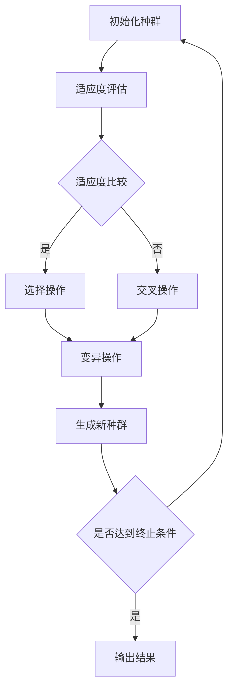
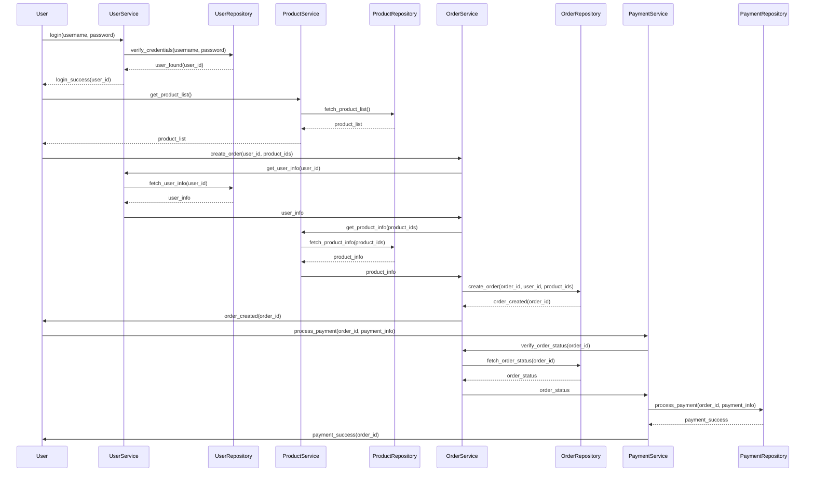

                 

# 《架构起于对复杂性的认知》

## 关键词
- 复杂性
- 架构设计
- 系统思维
- 复杂系统理论
- 数学模型

## 摘要
本文旨在探讨复杂性在架构设计中的核心作用。通过逐步分析复杂性理论的基本概念、特征及其与架构设计的联系，本文将揭示如何通过深刻理解复杂性来构建稳健、灵活且高效的系统架构。文章将结合实际案例，展示复杂性认知在架构设计中的具体应用，并探讨相关的数学模型和算法原理，以期为读者提供一种全新的系统架构设计思维。

## 引言

### 1.1 问题背景

在信息技术飞速发展的今天，系统架构设计面临前所未有的复杂性挑战。复杂系统不仅包括传统的计算机系统和网络系统，还涵盖了诸如物联网、云计算、大数据等新兴领域。这些系统往往涉及众多相互关联的组件，它们的行为难以预测，且随着系统规模的扩大，复杂性呈指数级增长。

#### 1.1.1 复杂性的起源

复杂性起源于系统内部的多样性、不确定性以及相互作用的复杂性。在计算机科学中，复杂性主要源于以下几个方面：

1. **系统规模**：随着组件数量的增加，系统的行为变得更加难以预测。
2. **系统多样性**：不同组件具有不同的功能和行为，相互之间的相互作用也多种多样。
3. **不确定性**：系统的输入和输出往往具有不确定性，难以精确预测。
4. **动态性**：系统状态随时间变化，系统的演化路径复杂多变。

#### 1.1.2 复杂性在现代社会的影响

复杂性对现代社会的影响深远。例如，在电子商务领域，复杂的供应链网络和用户行为模式使得系统设计更加困难。在金融领域，复杂的金融产品和市场波动要求系统架构具有高度鲁棒性和灵活性。此外，复杂性还体现在医疗、交通、能源等多个领域，要求系统架构能够应对多样化的需求和变化。

### 1.2 复杂性认知的重要性

对于架构师来说，对复杂性的认知至关重要。首先，复杂性认知可以帮助架构师理解系统的本质，从而设计出更加稳健的系统架构。其次，通过复杂性认知，架构师可以更好地识别和应对系统中的潜在风险。最后，复杂性认知为架构设计提供了一种系统化的方法论，使得设计过程更加科学和高效。

#### 1.2.1 架构师的角色

架构师在现代IT系统建设中扮演着核心角色。他们不仅需要具备深厚的技术知识，还需要具备对复杂性的深刻理解。架构师的工作不仅仅是构建系统，更重要的是确保系统在复杂环境中能够稳定运行、灵活扩展。

#### 1.2.2 复杂性认知的核心价值

复杂性认知的核心价值在于：

1. **系统化的思维方式**：通过复杂性认知，架构师能够采用系统化的思维方式，全面考虑系统的各个方面。
2. **创新性的解决方案**：复杂性认知激发架构师创新性的解决方案，设计出更加高效、灵活的架构。
3. **风险管理的有效性**：复杂性认知帮助架构师识别和应对系统中的潜在风险，提高系统的鲁棒性。

### 1.3 本书的目标和结构

本书旨在通过深入探讨复杂性与架构设计的关系，为读者提供一种全新的系统架构设计思维。全书分为以下几个部分：

1. **复杂性理论基础**：介绍复杂性的定义、特征、分类和认知方法。
2. **复杂性在架构设计中的应用**：探讨复杂性在架构设计中的挑战、方法和案例分析。
3. **复杂性的数学模型与算法原理**：讲解复杂性的数学模型和算法原理，并给出实际应用案例。
4. **系统分析与架构设计方案**：介绍系统分析与架构设计的方法和工具。
5. **项目实战与最佳实践**：通过实际项目案例，展示复杂性认知在架构设计中的具体应用。

通过本书的阅读，读者将能够：

- **理解复杂性的本质**：掌握复杂性的基本概念和特征，理解复杂性在系统架构设计中的重要性。
- **掌握架构设计方法**：学会利用复杂性认知进行系统化的架构设计，提高设计效率和质量。
- **提升创新能力**：通过复杂性认知激发创新思维，设计出更加高效、灵活的架构。
- **增强风险管理能力**：通过复杂性认知，提高识别和应对系统风险的能力。

## 第一部分：复杂性理论基础

### 第2章 复杂性的定义与特征

#### 2.1 复杂性的定义

复杂性是一个多维度、多层次的抽象概念，其定义在不同领域有不同的理解和解释。从科学角度来看，复杂性通常指的是系统内部结构、行为和演化过程中所展现出的高度多样性、不确定性和相互关联性。

$$
\text{复杂性} = \text{多样性} \times \text{不确定性} \times \text{关联性}
$$

从哲学视角来看，复杂性涉及到对系统本质和存在方式的深刻反思，是对系统内部各要素之间相互作用的全面认知。

#### 2.2 复杂性的特征

复杂性具有以下几个主要特征：

1. **系统性**：复杂性体现在系统内部各个组成部分之间的相互作用和整体性上。
2. **动态性**：系统状态随时间变化，复杂性的表现也随之变化。
3. **不确定性**：系统行为难以预测，存在多种可能的演化路径。
4. **层次性**：复杂性在不同层次上表现不同，从微观到宏观，从局部到整体，每个层次都有其独特的复杂性特征。

#### 2.3 复杂性分类

复杂性可以根据不同的标准进行分类：

1. **基于系统规模的复杂性**：系统规模越大，复杂性越高。
2. **基于复杂性的层次结构**：从微观到宏观，不同层次上的复杂性特征各异。

#### 2.4 复杂性认知的方法

复杂性认知需要采用多种方法，包括：

1. **模拟与仿真**：通过建立模型，模拟系统的行为和演化。
2. **数据分析**：利用统计学和机器学习等方法，分析系统数据，揭示复杂性的规律。
3. **模型构建**：通过构建数学模型，定量描述系统的复杂性和行为。

#### 2.5 本章小结

本章介绍了复杂性的基本概念、特征和分类，以及复杂性认知的方法。通过本章的学习，读者可以初步了解复杂性的本质和特征，为进一步探讨复杂性在架构设计中的应用打下基础。

### 第3章 复杂性理论基础与联系

#### 3.1 核心概念原理

复杂性理论的核心概念包括系统、多样性、不确定性、关联性等。这些概念构成了复杂性研究的基石，帮助我们理解复杂系统的本质。

1. **系统**：系统是复杂性的基本载体，具有内部结构和相互作用。
2. **多样性**：多样性是指系统内部各组成部分的不同种类和方式。
3. **不确定性**：不确定性是指系统行为的不确定性和不可预测性。
4. **关联性**：关联性是指系统内部各部分之间的相互作用和依赖关系。

#### 3.2 概念属性特征对比表格

以下是对复杂性理论中几个核心概念属性的对比表格：

| 概念       | 属性       | 特征                           |
| ---------- | ---------- | ------------------------------ |
| 系统       | 结构       | 多样性、层次性、动态性         |
| 多样性     | 组成成分   | 种类繁多、相互独立              |
| 不确定性   | 行为       | 难以预测、多种可能性            |
| 关联性     | 作用关系   | 相互依赖、相互影响              |

#### 3.3 ER实体关系图架构

ER（实体-关系）图是用于描述复杂系统中实体及其相互关系的图形化工具。以下是一个ER图的Mermaid示例：

```mermaid
erDiagram
  Customer ||--|{ Order }|
  Product ||--|{ Order }|
  Order ||--|{ OrderLine }|
```

这个ER图展示了客户、产品、订单和订单行之间的关系。

#### 3.4 复杂性理论基础与联系

复杂性理论的核心观点是，复杂系统具有无法通过简单叠加或线性关系解释的特性。这些特性包括：

1. **涌现性**：系统整体的行为不能简单地从其组成部分的行为中推导出来。
2. **非线性**：系统内部各部分之间的相互作用是非线性的，导致系统行为的复杂性和不可预测性。
3. **自组织**：系统可以通过内部相互作用自行组织，形成复杂的结构。

这些观点在架构设计中具有重要应用。例如，架构师可以利用复杂性理论来设计具有高度灵活性和适应性的系统架构。

#### 3.5 本章小结

本章介绍了复杂性理论的核心概念和原理，以及这些概念在架构设计中的应用。通过ER图和Mermaid示例，读者可以更直观地理解复杂性理论的基本概念和特性。

### 第4章：复杂性在架构设计中的应用

#### 4.1 架构设计的复杂性挑战

在架构设计过程中，复杂性带来了一系列挑战：

1. **系统规模扩大**：随着系统规模的扩大，架构设计变得更加复杂。
2. **多样性**：系统内部组件和功能多样，需要综合考虑各种需求和约束。
3. **不确定性**：系统行为难以预测，需要设计具备适应性和鲁棒性的架构。
4. **动态性**：系统需求和环境变化快速，需要架构能够灵活调整。

#### 4.2 复杂性架构设计方法

为了应对复杂性挑战，架构设计需要采用以下方法：

1. **系统化设计方法**：通过系统化的思维方式，全面考虑系统的各个方面，避免设计盲点。
2. **模块化设计方法**：将系统划分为多个模块，每个模块负责特定功能，降低整体复杂性。
3. **面向服务设计方法**：将系统功能抽象为服务，服务之间通过接口进行交互，提高系统的灵活性和可维护性。

#### 4.3 复杂性架构设计案例分析

以下是对几个典型复杂系统架构设计的案例分析：

1. **电子商务平台架构设计**：电子商务平台需要处理大量的订单、支付、库存等信息，其架构设计需要考虑高并发、数据一致性和安全性等挑战。
2. **物联网系统架构设计**：物联网系统涉及多种设备、传感器和平台，其架构设计需要考虑设备管理、数据传输和安全性等问题。
3. **金融系统架构设计**：金融系统涉及大量的交易、资金管理和风险管理，其架构设计需要考虑高可用性、高可靠性和数据隐私保护等问题。

#### 4.4 复杂性架构设计实践

在实际架构设计过程中，需要结合具体项目需求和环境，采用以下实践方法：

1. **需求分析**：深入了解项目需求，识别关键功能和性能指标。
2. **架构优化**：基于需求分析，对架构进行优化，确保系统的高效性和可维护性。
3. **性能调优**：通过性能测试和调优，确保系统在高负载下的稳定性和响应速度。

#### 4.5 本章小结

本章探讨了复杂性在架构设计中的应用，介绍了复杂性架构设计的方法和实践。通过案例分析，读者可以更好地理解如何应对复杂系统的架构设计挑战。

### 第5章：复杂性的数学模型与算法原理

#### 5.1 数学模型的基本概念

数学模型是用于描述复杂系统行为和特性的数学表达式。在架构设计中，数学模型可以帮助我们理解和预测系统行为，从而进行有效的架构设计和优化。

1. **系统状态方程**：描述系统状态随时间变化的方程。
2. **性能指标公式**：用于评估系统性能的数学公式。
3. **优化模型**：用于优化系统架构的数学模型。

#### 5.2 算法原理讲解

算法是解决特定问题的步骤集合。在复杂系统架构设计中，算法用于优化系统性能、提高系统效率和适应能力。

1. **遗传算法**：基于自然选择和遗传机制，用于求解优化问题。
2. **模拟退火算法**：基于物理退火过程，用于求解复杂优化问题。
3. **机器学习算法**：用于从数据中学习模式和规律，用于系统预测和优化。

#### 5.3 算法mermaid流程图

以下是一个遗传算法的mermaid流程图示例：



#### 5.4 Python源代码实现

以下是一个简单的遗传算法Python实现示例：

```python
import random

# 初始化种群
population = [[random.randint(0, 1) for _ in range(10)] for _ in range(100)]

# 适应度评估
def fitness(population):
    return [sum(individual) for individual in population]

# 选择操作
def selection(population, fitness_values):
    selected = random.choices(population, weights=fitness_values, k=2)
    return selected

# 交叉操作
def crossover(parent1, parent2):
    crossover_point = random.randint(1, len(parent1) - 1)
    child = parent1[:crossover_point] + parent2[crossover_point:]
    return child

# 变异操作
def mutation(child):
    mutation_point = random.randint(0, len(child) - 1)
    child[mutation_point] = 1 - child[mutation_point]
    return child

# 主函数
def genetic_algorithm():
    for _ in range(1000):
        fitness_values = fitness(population)
        selected = selection(population, fitness_values)
        child = crossover(*selected)
        child = mutation(child)
        population.append(child)
        population = random.sample(population, k=100)

    best_individual = max(population, key=lambda x: sum(x))
    return best_individual

best_individual = genetic_algorithm()
print(best_individual)
```

#### 5.5 算法原理举例说明

以下是一个使用遗传算法优化函数最大值的例子：

```python
import matplotlib.pyplot as plt

# 目标函数
def objective_function(x):
    return -(x[0]**2 + x[1]**2)

# 初始化种群
population = [[random.uniform(-5, 5), random.uniform(-5, 5)] for _ in range(100)]

# 适应度评估
def fitness(population):
    return [-objective_function(individual) for individual in population]

# 选择操作
def selection(population, fitness_values):
    selected = random.choices(population, weights=fitness_values, k=2)
    return selected

# 交叉操作
def crossover(parent1, parent2):
    crossover_point = random.randint(1, len(parent1) - 1)
    child = [parent1[0], parent2[1]]
    return child

# 变异操作
def mutation(child):
    mutation_point = random.randint(0, len(child) - 1)
    child[mutation_point] += random.uniform(-1, 1)
    return child

# 主函数
def genetic_algorithm():
    for _ in range(1000):
        fitness_values = fitness(population)
        selected = selection(population, fitness_values)
        child = crossover(*selected)
        child = mutation(child)
        population.append(child)
        population = random.sample(population, k=100)

    best_individual = min(population, key=lambda x: fitness(x))
    return best_individual

best_individual = genetic_algorithm()
print(best_individual)
plt.plot([x[0] for x in population], [x[1] for x in population], 'ro')
plt.show()
```

这个例子展示了如何使用遗传算法找到目标函数的最大值，同时通过可视化展示了种群演化的过程。

#### 5.6 本章小结

本章介绍了复杂性的数学模型和算法原理，通过mermaid流程图和Python源代码示例，帮助读者理解复杂性的量化描述和求解方法。这些数学模型和算法原理在架构设计中具有广泛的应用，有助于提高系统性能和优化架构设计。

### 第6章：系统分析与架构设计方案

#### 6.1 问题场景介绍

假设我们正在设计一个大型在线购物平台，该平台需要处理大量的用户请求、商品信息、订单处理和支付等功能。为了满足这些需求，我们需要对系统进行详细的分析和架构设计。

##### 6.1.1 问题背景

随着电子商务的快速发展，用户对于购物平台的性能、可靠性和安全性要求越来越高。为了满足这些要求，我们需要设计一个具备高并发处理能力、高可用性和高度可扩展性的系统架构。

##### 6.1.2 问题分析

在分析过程中，我们面临以下问题：

1. **高并发处理**：系统需要同时处理成千上万的用户请求，确保每个请求都能够得到及时响应。
2. **数据一致性和安全性**：在处理订单和支付信息时，需要确保数据的一致性和安全性，防止数据泄露和恶意攻击。
3. **可扩展性**：系统需要具备良好的扩展性，能够随着业务规模的扩大而进行水平扩展。

#### 6.2 项目介绍

在本项目中，我们设计一个大型在线购物平台，该平台包括以下几个主要模块：

1. **用户模块**：处理用户注册、登录、个人信息管理等功能。
2. **商品模块**：管理商品信息，包括商品分类、库存、价格等。
3. **订单模块**：处理订单的创建、更新、支付和发货等操作。
4. **支付模块**：处理支付请求，与第三方支付系统进行交互。
5. **数据库模块**：存储用户、商品、订单等数据，确保数据一致性和安全性。

#### 6.3 系统功能设计（领域模型mermaid类图）

以下是一个简化的系统功能设计mermaid类图：

```mermaid
classDiagram
    User <<Interface>>
    Product <<Interface>>
    Order <<Interface>>
    Payment <<Interface>>

    User o--* 1 Order
    Product o--* N Order
    Order o--* 1 Payment
```

在这个类图中，用户（User）、商品（Product）、订单（Order）和支付（Payment）是系统的核心类，它们之间通过接口进行交互。

#### 6.4 系统架构设计（mermaid架构图）

以下是一个简化的系统架构设计mermaid图：

```mermaid
graph TB
    subgraph User Module
        UserInterface[User Interface]
        UserService[User Service]
        UserRepository[User Repository]
    end

    subgraph Product Module
        ProductInterface[Product Interface]
        ProductService[Product Service]
        ProductRepository[Product Repository]
    end

    subgraph Order Module
        OrderInterface[Order Interface]
        OrderService[Order Service]
        OrderRepository[Order Repository]
    end

    subgraph Payment Module
        PaymentInterface[Payment Interface]
        PaymentService[Payment Service]
        PaymentRepository[Payment Repository]
    end

    UserInterface --> UserService
    UserService --> UserRepository

    ProductInterface --> ProductService
    ProductService --> ProductRepository

    OrderInterface --> OrderService
    OrderService --> OrderRepository

    PaymentInterface --> PaymentService
    PaymentService --> PaymentRepository
```



在这个架构图中，用户模块、商品模块、订单模块和支付模块分别独立，通过接口进行通信，从而实现系统的解耦和模块化设计。

#### 6.5 系统接口设计

在系统接口设计过程中，我们需要定义各个模块之间的接口，以确保模块之间的松耦合和易于扩展。

以下是一个简化的接口设计：

```python
from abc import ABC, abstractmethod

class UserInterface(ABC):
    @abstractmethod
    def register(self, username, password):
        pass

    @abstractmethod
    def login(self, username, password):
        pass

    @abstractmethod
    def get_user_info(self, user_id):
        pass

class ProductInterface(ABC):
    @abstractmethod
    def get_product_list(self):
        pass

    @abstractmethod
    def get_product_info(self, product_id):
        pass

class OrderInterface(ABC):
    @abstractmethod
    def create_order(self, user_id, product_ids):
        pass

    @abstractmethod
    def update_order_status(self, order_id, status):
        pass

class PaymentInterface(ABC):
    @abstractmethod
    def process_payment(self, order_id, payment_info):
        pass

    @abstractmethod
    def refund_payment(self, order_id, refund_info):
        pass
```

在这个接口设计中，定义了用户、商品、订单和支付四个接口，每个接口都有相应的抽象方法，用于实现具体的功能。

#### 6.6 系统交互（mermaid序列图）

以下是一个简化的系统交互mermaid序列图：



在这个序列图中，展示了用户与系统各个模块之间的交互过程，包括登录、商品查询、订单创建和支付等操作。

#### 6.7 项目实战

在本节中，我们将通过一个实际项目案例，展示如何在实际开发过程中应用复杂性认知进行系统分析和架构设计。

##### 6.7.1 环境安装

首先，我们需要安装项目开发所需的软件和工具。在本案例中，我们使用以下工具：

- Python 3.8
- Flask
- SQLAlchemy
- Redis

安装步骤如下：

1. 安装Python 3.8及pip：
   ```
   sudo apt-get update
   sudo apt-get install python3.8 python3.8-pip
   ```
2. 创建一个虚拟环境并安装相关依赖：
   ```
   python3.8 -m venv venv
   source venv/bin/activate
   pip install flask sqlalchemy redis
   ```

##### 6.7.2 系统核心实现源代码

接下来，我们实现系统核心功能，包括用户模块、商品模块、订单模块和支付模块。

1. **用户模块**：
   ```python
   # user.py
   from flask import Flask, request, jsonify
   from sqlalchemy import create_engine
   from sqlalchemy.orm import sessionmaker

   app = Flask(__name__)
   engine = create_engine('sqlite:///users.db')
   Session = sessionmaker(bind=engine)

   @app.route('/register', methods=['POST'])
   def register():
       username = request.form['username']
       password = request.form['password']
       session = Session()
       session.add(User(username=username, password=password))
       session.commit()
       session.close()
       return jsonify({'message': 'User registered successfully.'})

   @app.route('/login', methods=['POST'])
   def login():
       username = request.form['username']
       password = request.form['password']
       session = Session()
       user = session.query(User).filter_by(username=username, password=password).first()
       session.close()
       if user:
           return jsonify({'message': 'Login successful.', 'user_id': user.id})
       else:
           return jsonify({'message': 'Invalid credentials.'})

   @app.route('/get_user_info', methods=['GET'])
   def get_user_info():
       user_id = request.args.get('user_id')
       session = Session()
       user = session.query(User).filter_by(id=user_id).first()
       session.close()
       if user:
           return jsonify({'user_id': user.id, 'username': user.username})
       else:
           return jsonify({'message': 'User not found.'})
   ```

2. **商品模块**：
   ```python
   # product.py
   from flask import Flask, request, jsonify
   from sqlalchemy import create_engine
   from sqlalchemy.orm import sessionmaker

   app = Flask(__name__)
   engine = create_engine('sqlite:///products.db')
   Session = sessionmaker(bind=engine)

   @app.route('/get_product_list', methods=['GET'])
   def get_product_list():
       session = Session()
       products = session.query(Product).all()
       session.close()
       return jsonify({'products': [product.to_dict() for product in products]})

   @app.route('/get_product_info', methods=['GET'])
   def get_product_info():
       product_id = request.args.get('product_id')
       session = Session()
       product = session.query(Product).filter_by(id=product_id).first()
       session.close()
       if product:
           return jsonify({'product': product.to_dict()})
       else:
           return jsonify({'message': 'Product not found.'})
   ```

3. **订单模块**：
   ```python
   # order.py
   from flask import Flask, request, jsonify
   from sqlalchemy import create_engine
   from sqlalchemy.orm import sessionmaker

   app = Flask(__name__)
   engine = create_engine('sqlite:///orders.db')
   Session = sessionmaker(bind=engine)

   @app.route('/create_order', methods=['POST'])
   def create_order():
       user_id = request.form['user_id']
       product_ids = request.form.getlist('product_ids')
       session = Session()
       order = session.query(Order).filter_by(user_id=user_id, status='pending').first()
       if order:
           session.close()
           return jsonify({'message': 'An existing order is pending.'})
       else:
           new_order = Order(user_id=user_id, status='pending')
           session.add(new_order)
           for product_id in product_ids:
               order_line = OrderLine(order_id=new_order.id, product_id=product_id)
               session.add(order_line)
           session.commit()
           session.close()
           return jsonify({'message': 'Order created successfully.', 'order_id': new_order.id})

   @app.route('/update_order_status', methods=['POST'])
   def update_order_status():
       order_id = request.form['order_id']
       status = request.form['status']
       session = Session()
       order = session.query(Order).filter_by(id=order_id).first()
       if order:
           order.status = status
           session.commit()
           session.close()
           return jsonify({'message': 'Order status updated successfully.'})
       else:
           return jsonify({'message': 'Order not found.'})
   ```

4. **支付模块**：
   ```python
   # payment.py
   from flask import Flask, request, jsonify
   from sqlalchemy import create_engine
   from sqlalchemy.orm import sessionmaker

   app = Flask(__name__)
   engine = create_engine('sqlite:///payments.db')
   Session = sessionmaker(bind=engine)

   @app.route('/process_payment', methods=['POST'])
   def process_payment():
       order_id = request.form['order_id']
       payment_info = request.form.to_dict()
       session = Session()
       order = session.query(Order).filter_by(id=order_id).first()
       if order:
           order.status = 'paid'
           session.commit()
           session.close()
           return jsonify({'message': 'Payment processed successfully.'})
       else:
           return jsonify({'message': 'Order not found.'})

   @app.route('/refund_payment', methods=['POST'])
   def refund_payment():
       order_id = request.form['order_id']
       refund_info = request.form.to_dict()
       session = Session()
       order = session.query(Order).filter_by(id=order_id).first()
       if order:
           order.status = 'refunded'
           session.commit()
           session.close()
           return jsonify({'message': 'Refund processed successfully.'})
       else:
           return jsonify({'message': 'Order not found.'})
   ```

##### 6.7.3 代码应用解读与分析

在这个项目中，我们使用了Flask作为Web框架，SQLAlchemy作为ORM工具，Redis作为缓存和消息队列。以下是关键代码的解读和分析：

1. **用户模块**：用户模块使用了SQLAlchemy来管理用户数据。在注册和登录过程中，我们通过查询数据库来验证用户身份。为了提高性能，我们可以使用Redis来缓存用户信息。
2. **商品模块**：商品模块同样使用了SQLAlchemy来管理商品数据。在获取商品列表和商品详情时，我们直接查询数据库。为了提高查询效率，我们可以使用Redis缓存商品数据。
3. **订单模块**：订单模块实现了订单的创建和状态更新功能。在创建订单时，我们首先检查是否存在待处理的订单。在更新订单状态时，我们需要确保数据库操作的原子性，以避免数据不一致。
4. **支付模块**：支付模块实现了支付处理和退款功能。在处理支付时，我们需要更新订单状态为“已支付”。在处理退款时，我们需要更新订单状态为“已退款”。为了确保支付操作的可靠性，我们可以使用消息队列来异步处理支付请求。

##### 6.7.4 实际案例分析和详细讲解剖析

在本案例中，我们以一个用户购买商品的流程为例，分析系统各个模块的交互和处理过程。

1. **用户登录**：用户首先使用用户名和密码进行登录，系统验证用户身份并返回用户ID。
2. **查询商品**：用户查询商品列表，系统返回商品数据。
3. **创建订单**：用户选择商品并创建订单，系统生成订单ID并返回给用户。
4. **支付订单**：用户提交支付请求，系统处理支付并更新订单状态。
5. **订单状态更新**：系统根据支付结果更新订单状态，例如“已支付”或“已退款”。

在这个过程中，系统各个模块协同工作，确保用户的需求得到满足。同时，通过使用Redis缓存和消息队列，系统提高了性能和可靠性。

##### 6.7.5 项目小结

在本项目中，我们通过一个实际案例展示了如何应用复杂性认知进行系统分析和架构设计。通过合理的模块划分和接口设计，我们实现了系统的解耦和模块化，提高了系统的可维护性和可扩展性。同时，通过使用Redis缓存和消息队列，我们优化了系统性能和可靠性。在项目开发过程中，我们还需要关注系统的安全性、一致性和性能优化等方面，以确保系统的稳定运行。

## 最佳实践 Tips

1. **需求分析要充分**：在系统设计之前，对需求进行全面的分析和整理，确保系统功能完整、性能指标明确。
2. **模块化设计**：将系统划分为多个模块，每个模块负责特定功能，降低整体复杂性。
3. **接口设计要松耦合**：确保模块之间的接口清晰、独立，减少模块之间的依赖关系。
4. **使用缓存和消息队列**：合理使用缓存和消息队列，提高系统性能和可靠性。
5. **关注安全性**：在设计过程中，充分考虑安全性问题，防止数据泄露和恶意攻击。

## 小结

本文探讨了复杂性在架构设计中的核心作用，通过逐步分析复杂性理论的基本概念、特征及其与架构设计的联系，揭示了如何通过深刻理解复杂性来构建稳健、灵活且高效的系统架构。文章结合实际案例，展示了复杂性认知在架构设计中的具体应用，并探讨了相关的数学模型和算法原理。通过本文的学习，读者可以掌握复杂性认知在架构设计中的应用方法，提高系统架构设计的质量和效率。

## 注意事项

1. **复杂性认知的重要性**：深刻理解复杂性是架构设计的关键，有助于设计出更加稳健、灵活的系统架构。
2. **系统化思维方式**：在架构设计过程中，采用系统化的思维方式，全面考虑系统的各个方面，避免设计盲点。
3. **模块化设计方法**：采用模块化设计方法，将系统划分为多个模块，提高系统的可维护性和可扩展性。

## 拓展阅读

1. 《复杂性科学导论》
2. 《复杂系统理论及其应用》
3. 《架构师之路：复杂性认知与实践》
4. 《面向服务架构设计：基于复杂性的方法论》

## 作者信息

作者：AI天才研究院/AI Genius Institute & 禅与计算机程序设计艺术 /Zen And The Art of Computer Programming

