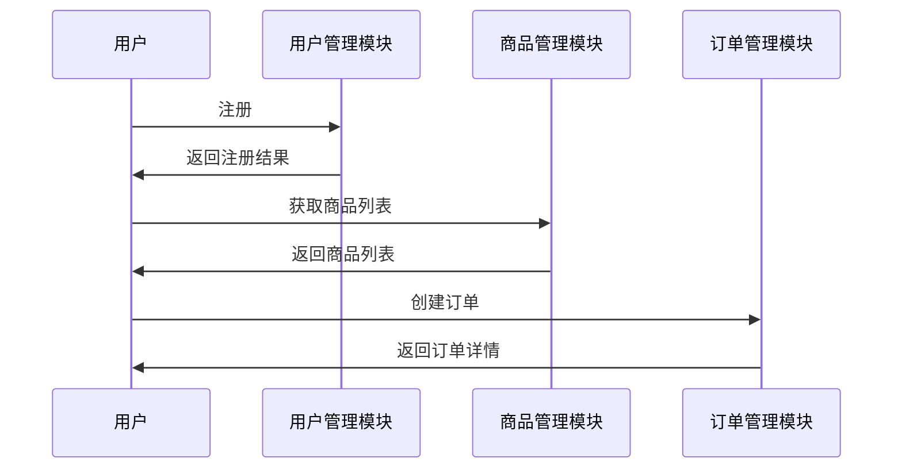

                 

### 引言

在信息技术飞速发展的时代，架构设计已成为软件工程领域的核心议题。面对日益复杂的业务需求和快速变化的市场环境，构建稳健、灵活和可扩展的架构显得尤为重要。然而，在追求卓越性能和完美解决方案的过程中，我们常常陷入种种设计陷阱，如完美主义、风险忽略和单一思维等。这些问题不仅影响系统的长远发展，还可能导致项目失败。

本文旨在探讨如何从复杂性的视角重新审视架构设计，提出一种摒弃完美主义、警觉风险主义、避免单一主义的架构设计方法论。通过深入分析复杂性的本质，我们希望能够揭示架构设计的内在规律，为实际项目提供有价值的指导。

## 关键词

- 复杂性
- 架构设计
- 完美主义
- 风险主义
- 单一主义

## 摘要

本文将探讨在信息技术迅猛发展的背景下，如何构建有效且稳健的架构设计。文章首先阐述复杂性的本质及其在架构设计中的重要性。接着，我们将分析完美主义、风险主义和单一主义在架构设计中的负面影响。在此基础上，文章提出一种以复杂性为导向的架构设计方法论，包括摒弃完美主义、警觉风险主义和避免单一主义。通过实际案例分析，本文将展示这一方法论如何在实际项目中应用，并最终提供一系列最佳实践和总结，以帮助读者在实际工作中更好地应对架构设计挑战。本文将为架构师和软件开发者提供有价值的参考，帮助他们在复杂环境中做出更明智的设计决策。

### 引言

在当今信息技术迅速发展的时代，架构设计已成为软件工程领域的核心议题。随着业务需求的日益复杂化和市场环境的快速变化，构建一个稳健、灵活且可扩展的系统架构变得尤为重要。然而，在追求卓越性能和完美解决方案的过程中，我们常常会陷入各种设计陷阱，如完美主义、风险忽略和单一思维等。这些设计陷阱不仅会影响系统的长远发展，还可能导致项目失败。

本文将探讨如何从复杂性的视角重新审视架构设计，并提出一种以复杂性为导向的架构设计方法论。通过深入分析复杂性的本质，我们希望能够揭示架构设计的内在规律，为实际项目提供有价值的指导。

文章首先介绍复杂性的概念及其在架构设计中的重要性，接着分析完美主义、风险主义和单一主义在架构设计中的负面影响。在此基础上，文章将提出一种以复杂性为导向的架构设计方法论，包括摒弃完美主义、警觉风险主义和避免单一主义。随后，通过实际案例分析和最佳实践分享，我们将展示这一方法论如何在实际项目中应用，帮助读者更好地应对架构设计挑战。

本文将为架构师和软件开发者提供有价值的参考，帮助他们在复杂环境中做出更明智的设计决策。通过深入理解复杂性的本质和应对策略，读者将能够构建更为稳健和灵活的架构，提高项目的成功率和业务价值。

### 复杂性的本质

复杂性是一个多维度且动态变化的概念，它在不同领域有着不同的表现和内涵。在计算机科学和软件工程中，复杂性主要体现在以下几个方面：

首先，复杂性来源于系统的规模和多样性。随着系统规模的不断扩大，组件和模块的数量急剧增加，系统内部的关系和依赖也变得错综复杂。这种复杂性不仅体现在技术层面，还包括业务逻辑、用户需求和管理层面。一个大规模的系统可能包含成千上万个不同的组件和功能，每个组件都需要与其他组件进行有效的交互和集成，从而形成一个高度复杂的整体。

其次，复杂性还源于系统的动态性。现代系统通常需要应对快速变化的外部环境，如市场需求、技术进步和法规要求等。系统的动态性使得设计者在架构设计时需要考虑更多的变化和不确定性。例如，系统的扩展性、可维护性和可测试性等都受到复杂性影响，设计者需要在架构设计中预留足够的灵活性以应对未来的变化。

再者，复杂性还体现在系统的非线性和非确定性行为上。系统的各个组件和模块之间通常存在复杂的非线性关系，这些关系可能导致系统行为出现难以预测的波动和突变。例如，在分布式系统中，网络延迟、节点故障和数据不一致等问题都可能对系统的稳定性产生重大影响，这些问题难以通过简单的线性模型来描述和处理。

最后，复杂性还与系统的复杂性和可理解性之间存在一定的矛盾。复杂的系统往往难以被完全理解和控制，尤其是在系统规模较大、结构复杂的情况下，设计者很难全面把握系统的各个方面。这种矛盾使得系统设计和维护变得更加困难，也增加了项目风险。

总的来说，复杂性的本质在于系统内部和外部因素相互作用所形成的多层次、多维度的复杂性。这种复杂性不仅体现在技术层面，还涉及到业务、管理等多个层面。在架构设计中，我们需要深入理解复杂性的本质，以科学的方法论和设计原则来应对和降低复杂性的负面影响，从而构建一个稳健和高效的系统架构。

### 架构设计的挑战

在架构设计过程中，面对复杂性带来的挑战是不可避免的。具体而言，这些挑战主要体现在以下几个方面：

首先，完美主义的陷阱。完美主义追求极致的解决方案，但往往导致设计过程过于复杂、时间成本高昂，甚至出现设计过度的情况。追求完美可能使架构变得复杂，难以维护和扩展。例如，在某些情况下，过度优化的数据库设计可能导致查询性能的提升，但同时也增加了系统的复杂性和维护难度。

其次，风险意识的重要性。在架构设计过程中，风险意识往往被忽视。设计者可能过于关注功能实现，而忽视了潜在的系统性风险，如安全性漏洞、数据一致性问题等。这些风险如果不及时处理，可能会导致系统崩溃或数据泄露，影响业务的正常运行。

再者，单一主义的危害。单一主义在架构设计中的表现是过度依赖单一技术或组件，如单一数据库、单一框架等。这种设计虽然可能在短期内降低成本和复杂性，但长期来看，可能限制了系统的扩展性和灵活性。例如，如果系统依赖一个特定的数据库，一旦该数据库出现问题，整个系统可能面临重大风险。

总的来说，这些挑战不仅影响系统的稳健性和可扩展性，还增加了项目的风险和成本。因此，在架构设计过程中，我们需要具备深刻的复杂性认知，摒弃完美主义、警觉风险主义、避免单一主义，以科学的方法论和设计原则来应对和解决这些挑战。

### 本书的结构

本书旨在为架构设计提供一种以复杂性为导向的方法论，以帮助读者更好地应对复杂性的挑战。全书共分为八个章节，具体如下：

**第1章 引言**：本章将介绍书籍的目的、读者对象和内容结构，帮助读者了解全书的主线和框架。

**第2章 复杂性的本质**：本章将深入探讨复杂性的概念，包括复杂性的定义、来源和影响，帮助读者理解复杂性在架构设计中的重要性。

**第3章 摒弃完美主义**：本章将分析完美主义在架构设计中的负面影响，并探讨如何摒弃完美主义，以简化设计和提高系统的可维护性。

**第4章 警觉风险主义**：本章将讨论在架构设计过程中如何提高风险意识，识别和应对潜在的系统性风险。

**第5章 避免单一主义**：本章将探讨单一主义在架构设计中的危害，并提供方法以避免过度依赖单一技术或组件。

**第6章 复杂性管理方法论**：本章将介绍一种以复杂性为导向的架构设计方法论，包括具体的设计原则和实践技巧。

**第7章 实际案例解析**：本章将通过实际案例，展示如何将复杂性管理方法论应用于实际的架构设计项目中。

**第8章 最佳实践与总结**：本章将总结全书的主要观点，提供最佳实践建议，并推荐进一步阅读的资源。

通过这八个章节的详细探讨，本书希望能够为读者提供一套完整的复杂性管理和架构设计方法论，帮助他们在复杂环境中做出更明智的设计决策。

### 摒弃完美主义

在架构设计中，完美主义往往是一种常见且危险的倾向。它表现为对解决方案的极致追求，希望设计出完美无瑕的系统。然而，这种追求完美的心态在实际操作中可能导致一系列问题。首先，完美主义会导致设计过程变得异常复杂和冗长。追求每一个细节的优化，往往会使得系统架构中充斥着大量不必要的复杂性。这不仅增加了开发成本，还提高了系统的维护难度。其次，完美主义容易导致项目延期。在追求完美的过程中，设计者和开发者可能会陷入无休止的调整和优化，从而忽视实际交付的时间节点，最终导致项目延误。此外，完美主义还可能带来资源的浪费。过度的优化意味着更多的开发资源、时间和人力投入，而这些资源在一些更关键的领域可能被更好地利用。

在现实的项目中，摒弃完美主义是必要的。首先，我们需要明确一个事实：没有任何系统是完美的。在复杂的环境中，追求完美往往是不切实际的。系统的稳定性和可用性是更为重要的目标。在实际项目中，我们应该关注关键功能和基本性能，确保系统能够满足主要业务需求，而不是陷入无尽的细节优化。例如，在电子商务系统中，确保购物车功能稳定和支付流程顺畅可能比优化数据库查询性能更加重要。其次，我们应该学会妥协和优先级排序。在架构设计时，我们需要明确哪些功能是核心的，哪些是次要的。针对核心功能，我们应该投入更多资源和时间，而对于次要功能，则可以适当简化。最后，我们可以通过迭代开发和持续改进来逐步优化系统。这种方法不仅能够避免完美主义的陷阱，还能够使系统在快速变化的环境中保持灵活性和适应性。

总之，摒弃完美主义并不意味着放弃对系统质量的追求，而是更加务实和高效地对待架构设计。在追求卓越的同时，我们应关注实际可操作性和项目的实际需求，以确保系统能够在复杂环境中稳健运行。

### 警觉风险主义

在架构设计过程中，风险意识至关重要。然而，许多设计者常常忽视潜在的系统风险，导致项目失败或业务中断。风险主义表现为对风险的忽视或低估，这可能导致以下几种问题。首先，安全性漏洞可能成为系统中的致命弱点。例如，缺乏适当的权限控制和数据加密措施可能导致敏感数据泄露，危及用户隐私和公司安全。其次，数据一致性问题是另一个常见的风险。在现代分布式系统中，数据分布在不同节点上，如何确保数据的一致性是一个巨大的挑战。数据不一致可能导致业务逻辑错误和用户体验下降。再者，系统扩展性问题也可能在风险主义的影响下被忽视。设计者可能只关注当前的业务需求，而未预留足够的扩展性空间，导致系统在面对快速增长的业务需求时无法顺利扩展，从而影响业务连续性。

在架构设计过程中，提高风险意识是至关重要的。首先，设计者应进行全面的系统风险评估，识别潜在的风险点。这可以通过历史数据分析、安全测试和压力测试等方法实现。其次，制定详细的应对策略和应急预案。对于识别出的风险，设计者应制定相应的缓解措施和应急方案，确保在风险发生时能够迅速应对。此外，建立持续的风险监测机制也是提高风险意识的重要手段。设计者应定期检查系统的安全性和稳定性，及时发现和解决潜在问题。最后，进行团队风险意识的培训和教育，确保所有团队成员都具备识别和应对风险的基本能力。

通过提高风险意识，设计者可以在架构设计过程中更好地应对潜在的风险，从而提高系统的可靠性和安全性。这不仅有助于项目的成功，还能够为企业的长期发展提供保障。

### 避免单一主义

在架构设计中，单一主义是一种常见的错误思维方式，它表现为过度依赖单一的技术或组件。单一主义在短期内可能带来一定的便利和成本优势，但从长远来看，它可能对系统的稳定性和灵活性造成严重威胁。首先，单一主义限制了系统的扩展性。当系统依赖单一数据库或框架时，一旦该数据库或框架出现问题，整个系统可能面临重大风险。例如，如果系统依赖某个特定的数据库，那么一旦该数据库的版本更新或出现兼容性问题，系统可能需要大规模的调整甚至重构。其次，单一主义降低了系统的容错能力。在复杂的环境中，系统需要能够应对各种异常情况，如节点故障、网络中断等。如果系统依赖单一组件，一旦该组件发生故障，整个系统可能陷入瘫痪。再者，单一主义还可能限制系统的可维护性。复杂的系统通常需要多种工具和技术来支持，单一主义使得系统的维护变得更加困难，增加了维护成本和难度。

为了避免单一主义，我们可以采取以下策略。首先，多样化组件和技术的选择。在架构设计时，应选择多个不同的技术或组件，以实现系统的多样性和灵活性。例如，在数据库选择上，可以同时使用关系数据库和NoSQL数据库，以满足不同数据存储和处理需求。其次，设计模块化系统。通过将系统划分为多个独立的模块，每个模块负责不同的功能，可以降低系统之间的依赖关系，提高系统的可维护性和可扩展性。例如，在微服务架构中，每个微服务都是独立的模块，可以独立部署和扩展。再者，建立备份和冗余机制。在关键组件和模块上，应建立备份和冗余机制，确保在组件或模块出现故障时，系统能够快速切换到备用方案，保证业务的连续性。

总之，避免单一主义是架构设计中的一个重要原则。通过多样化组件和技术的选择、模块化设计和备份冗余机制，我们可以构建一个更加稳健和灵活的架构，从而更好地应对复杂环境中的各种挑战。

### 摒弃完美主义、警觉风险主义、避免单一主义的架构设计方法论

在深入探讨了复杂性的本质及其在架构设计中的挑战之后，我们可以提出一种以复杂性为导向的架构设计方法论，旨在摒弃完美主义、警觉风险主义、避免单一主义，从而在复杂环境中构建稳健和高效的系统。该方法论包括以下几个核心步骤：

**第一步：明确目标和需求**

在架构设计之初，我们需要明确项目的目标和需求。这包括业务目标、功能需求、性能需求等。通过明确需求，我们可以更好地理解系统需要解决的问题，从而为后续设计提供方向。同时，明确需求可以帮助我们避免追求不切实际的完美解决方案，确保设计目标务实和可行。

**第二步：分析复杂性和风险**

在明确需求后，我们需要对系统的复杂性和潜在风险进行深入分析。这包括系统规模、组件数量、依赖关系、外部环境变化等。通过分析复杂性，我们可以识别出系统中的关键组件和模块，了解它们之间的复杂关系，从而为设计提供依据。同时，对潜在风险的分析可以帮助我们提前制定应对策略，降低项目风险。

**第三步：多样化组件和技术的选择**

为了避免单一主义，我们应该在选择组件和技术时采取多样化策略。这意味着在数据库、框架、中间件等方面，我们可以同时使用多个不同的技术或组件，以满足不同的需求。例如，在数据库选择上，可以同时使用关系数据库和NoSQL数据库；在框架选择上，可以选择多种开发框架，以实现系统的多样性和灵活性。

**第四步：设计模块化系统**

模块化设计是提高系统可维护性和扩展性的关键。通过将系统划分为多个独立的模块，每个模块负责不同的功能，可以降低模块之间的依赖关系，提高系统的可维护性和可扩展性。例如，在微服务架构中，每个微服务都是独立的模块，可以独立部署和扩展。模块化设计不仅有助于降低复杂性，还能提高系统的灵活性和适应性。

**第五步：建立备份和冗余机制**

在关键组件和模块上，应建立备份和冗余机制，以确保在组件或模块出现故障时，系统能够快速切换到备用方案，保证业务的连续性。例如，在数据库方面，可以建立主从复制和备份机制；在中间件方面，可以设置冗余节点和负载均衡策略。

**第六步：持续监控和改进**

在系统上线后，我们需要持续监控系统的运行状况，及时发现和解决潜在问题。这包括性能监控、安全性检查和异常处理等。通过持续监控和改进，我们可以确保系统在复杂环境中保持稳健和高效。

通过以上六个步骤，我们可以构建一个摒弃完美主义、警觉风险主义、避免单一主义的架构设计方法论。这种方法论不仅能够帮助我们在复杂环境中做出更明智的设计决策，还能提高系统的可靠性和可扩展性，为项目的成功提供有力保障。

### 实际案例解析

为了更好地展示如何将摒弃完美主义、警觉风险主义和避免单一主义的架构设计方法论应用于实际项目中，我们来看一个具体的案例——某电商平台的架构设计。

**项目背景**

该电商平台是一家快速发展的在线零售商，业务范围涵盖了服装、家居用品、电子产品等多个领域。随着用户数量的增加和订单量的增长，平台面临巨大的性能和稳定性挑战。为了应对这些挑战，项目团队决定对现有的系统进行重构，以构建一个更加灵活和可扩展的架构。

**系统需求**

在项目启动阶段，团队明确了以下几个核心需求：

1. **高可用性**：系统需要能够应对高并发访问，确保在极端情况下（如促销活动）也能保持正常运行。
2. **高性能**：系统需要提供快速响应，确保用户购物体验流畅。
3. **高扩展性**：系统需要能够轻松扩展，以应对未来业务需求的增长。
4. **安全性**：系统需要确保用户数据和交易信息的安全。
5. **可维护性**：系统设计应易于维护和升级，降低运营成本。

**设计思路**

**1. 摒弃完美主义**

在系统设计初期，团队意识到追求完美的解决方案可能会导致项目延期和成本增加。因此，他们决定优先满足核心需求，而不是在所有细节上都追求极致。例如，在数据库选择上，团队没有选择最复杂的分布式数据库系统，而是采用了成熟的关系数据库和NoSQL数据库相结合的方式，以满足不同类型数据的存储需求。

**2. 警觉风险主义**

团队在架构设计过程中，制定了详细的风险评估和应对策略。他们进行了压力测试和性能评估，以确保系统能够在高并发情况下正常运行。同时，团队建立了全面的安全防护措施，包括数据加密、权限控制和网络安全等。

**3. 避免单一主义**

为了避免单一主义，团队采取了多种技术手段和组件组合。例如，他们使用了多个中间件来实现负载均衡、缓存和消息队列等功能，而不是依赖于单一技术。在数据库方面，他们同时使用了关系数据库和NoSQL数据库，以实现数据的快速读写和存储。

**系统架构设计**

**1. 功能模块划分**

根据业务需求，团队将系统划分为多个功能模块，包括用户管理模块、商品管理模块、订单管理模块、支付管理模块、物流管理模块等。每个模块独立开发、部署和扩展，以提高系统的灵活性和可维护性。

**2. 数据库设计**

在数据库设计方面，团队选择了关系数据库（如MySQL）和NoSQL数据库（如MongoDB）相结合的方式。关系数据库用于存储结构化数据，如用户信息和订单记录；NoSQL数据库用于存储非结构化数据，如图像和文档等。

**3. 系统架构图**

以下是系统架构设计的一部分，使用Mermaid绘制：


**系统接口设计**

在接口设计方面，团队采用了RESTful API设计，确保各个模块之间的数据传输和功能调用高效、稳定。以下是部分接口设计示例：

```python
# 用户管理模块接口示例
class UserController:
    def register(self, user_data):
        # 注册用户
        pass

    def login(self, user_credentials):
        # 用户登录
        pass

# 商品管理模块接口示例
class ProductController:
    def get_products(self):
        # 获取商品列表
        pass

    def add_product(self, product_data):
        # 添加商品
        pass

# 订单管理模块接口示例
class OrderController:
    def create_order(self, order_data):
        # 创建订单
        pass

    def get_order(self, order_id):
        # 获取订单详情
        pass
```

**系统交互**

以下是系统交互的一部分，使用Mermaid序列图进行描述：



**代码应用解读与分析**

在代码实现方面，团队采用了微服务架构，将各个模块独立部署和扩展。以下是部分核心代码的解读：

```python
# 用户管理模块实现
class UserController:
    def register(self, user_data):
        # 对用户数据进行验证
        if not self.validate_data(user_data):
            return "无效的用户数据"
        
        # 插入用户数据到数据库
        self.insert_user(user_data)
        return "用户注册成功"

    def validate_data(self, user_data):
        # 验证用户数据
        # ...
        return True

    def insert_user(self, user_data):
        # 插入用户数据到数据库
        # ...
        pass
```

**实际案例分析和详细讲解剖析**

在实际运营中，该电商平台通过不断优化和调整系统架构，成功应对了高并发访问和快速增长的业务需求。以下是几个关键案例：

1. **应对促销活动**

在某一大型促销活动期间，平台访问量急剧增加，系统负载达到峰值。通过监控和调整，团队及时发现并解决了多个性能瓶颈，确保系统在高峰期仍能正常运行。

2. **数据库优化**

在数据存储方面，团队通过分库分表和读写分离策略，优化了数据库性能。同时，他们使用了缓存和索引技术，提高了数据的访问速度。

3. **系统扩展**

随着业务的发展，团队根据实际需求逐步扩展了系统的功能模块和中间件，确保系统能够灵活应对新的业务场景。

**项目小结**

通过该实际案例，我们可以看到，摒弃完美主义、警觉风险主义和避免单一主义在架构设计中的重要性。团队在项目过程中，优先满足核心需求，注重风险控制和系统灵活性，成功构建了一个稳健、高效和可扩展的电商平台。这一成功经验为其他项目提供了有价值的参考，证明了复杂性管理方法论在实际应用中的有效性。

### 最佳实践与总结

在架构设计中，摒弃完美主义、警觉风险主义和避免单一主义是确保系统稳健和高效的关键。以下是几个最佳实践：

1. **明确优先级**：在需求分析阶段，明确系统的核心功能和优先级，确保关键功能得到优先设计和优化。
2. **风险评估**：进行全面的系统风险评估，制定详细的应对策略和应急预案，确保潜在风险得到有效控制。
3. **多样化技术选型**：在组件和技术的选择上，避免过度依赖单一技术，采取多样化策略以提高系统的灵活性和容错能力。
4. **模块化设计**：通过模块化设计，降低系统之间的依赖关系，提高系统的可维护性和可扩展性。
5. **持续监控与改进**：系统上线后，持续监控和改进系统的性能和稳定性，及时调整和优化。

通过以上最佳实践，设计者可以更好地应对复杂性的挑战，构建出更为稳健和高效的架构。本文通过实际案例展示了这些原则的应用效果，为读者提供了有益的参考。未来，随着技术环境的不断变化，架构设计方法也需要不断迭代和优化，以应对新的挑战。

### 结束语

本文探讨了如何从复杂性的视角重新审视架构设计，提出了一种摒弃完美主义、警觉风险主义、避免单一主义的架构设计方法论。通过实际案例的解析，我们展示了这一方法论在实际应用中的效果。未来，随着技术的不断进步，架构设计方法也将不断发展，设计者需要持续学习和实践，以应对日益复杂的挑战。希望本文能为读者提供有价值的参考，帮助他们在架构设计过程中做出更明智的决策。

## 作者信息

作者：AI天才研究院/AI Genius Institute & 禅与计算机程序设计艺术 /Zen And The Art of Computer Programming

感谢您阅读本文，希望它能为您在架构设计领域的探索带来启示。如果您对本文有任何建议或疑问，欢迎在评论区留言。让我们一起在技术之路上不断前行，共创美好未来！

