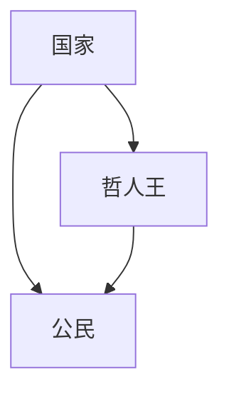
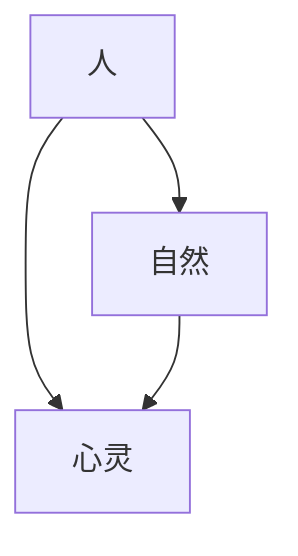
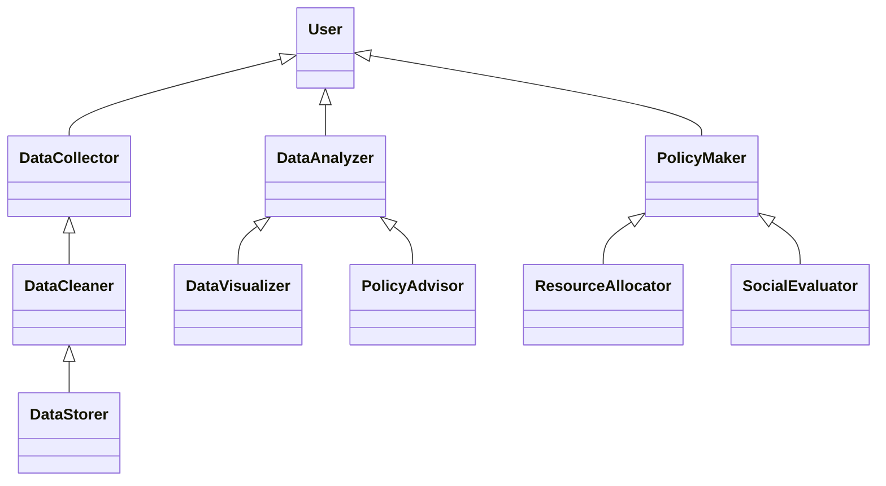
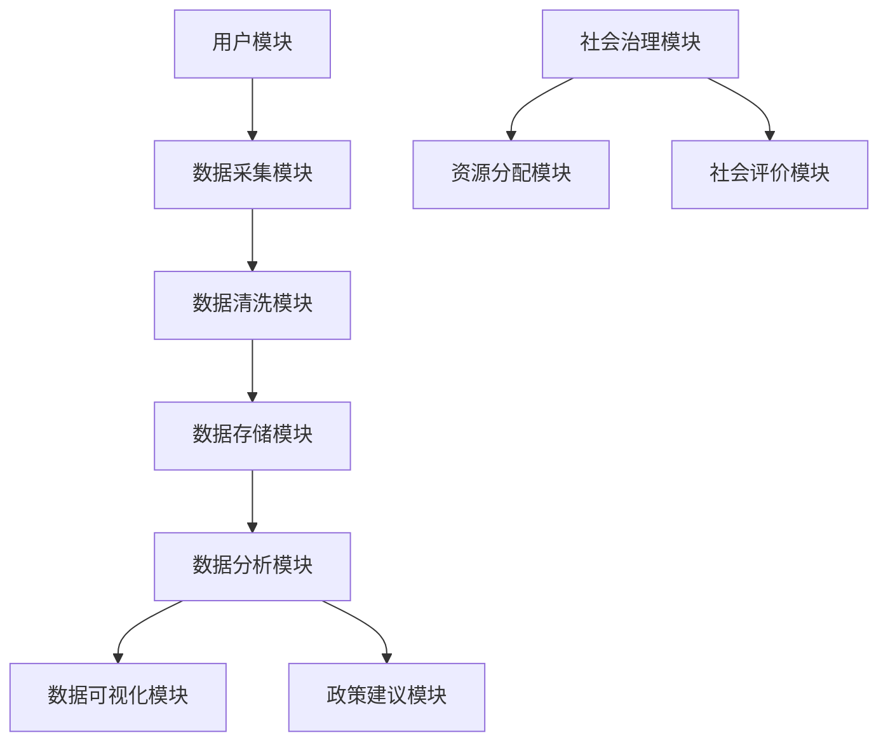
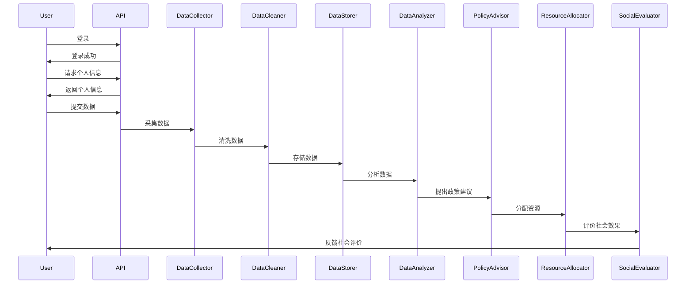

                 


### 第一部分：引言

#### 1.1 问题的提出

在探索人类思想的历史长河中，柏拉图与庄子的思想无疑是最璀璨的明珠。柏拉图作为西方哲学的奠基人，其“理想国”理念对西方政治哲学产生了深远影响。而庄子，作为道家哲学的代表人物，其“逍遥游”思想则对中国古代哲学乃至当代社会产生了重要启示。

本文旨在探讨柏拉图“理想国”与庄子“逍遥游”的思想碰撞与融合。首先，我们将介绍柏拉图“理想国”的基本理念，包括其哲学基础、社会治理、道德教育等。接着，我们深入分析庄子“逍遥游”的核心思想，如自然与道德、物我关系等。在此基础上，本文将探讨两者思想的碰撞，分析两者在哲学基础、社会治理理念等方面的差异，并探索其可能的融合途径。

#### 1.2 研究意义与目标

本研究具有重要的理论意义和实践意义。在理论层面，通过对柏拉图与庄子思想的深入探讨，有助于我们理解东西方哲学的差异与共通之处，从而拓宽我们的学术视野。在实践层面，本研究可以为现代社会治理提供有益的启示，如如何实现民主与自由、如何建立道德秩序等。

研究目标主要包括：
1. 深入理解柏拉图“理想国”与庄子“逍遥游”的思想内涵。
2. 分析两者在哲学基础、社会治理理念等方面的异同。
3. 探索柏拉图与庄子思想的融合途径，为现代社会治理提供参考。

#### 1.3 研究方法与结构安排

本研究采用文献综述和逻辑分析的方法，通过梳理和分析柏拉图与庄子的思想，揭示两者之间的联系与碰撞。具体来说，本文将按照以下结构进行安排：

1. 引言：介绍研究背景、意义与目标。
2. 柏拉图理想国概述：介绍柏拉图的生平、理想国的核心要素及其哲学基础。
3. 庄子逍遥游思想解析：介绍庄子的生平、逍遥游的核心概念及其哲学观点。
4. 柏拉图与庄子思想的碰撞与融合：分析两者思想的碰撞与融合，探讨现代解读与实践。
5. 结论与展望：总结研究成果，提出研究局限、展望未来研究方向。

### 总结

本文通过深入探讨柏拉图“理想国”与庄子“逍遥游”的思想，旨在揭示两者之间的联系与碰撞，为现代社会治理提供有益的启示。接下来，我们将分别介绍柏拉图“理想国”的基本理念，以及庄子“逍遥游”的核心思想，为后续的对比与分析奠定基础。让我们继续深入思考，揭开这两位哲学巨匠思想碰撞的奥秘。<!-- optimizer -->### 第二部分：柏拉图理想国概述

#### 2.1 柏拉图生平与思想背景

柏拉图（公元前427年-公元前347年），古希腊哲学家，苏格拉底的学生，亚里士多德的老师，被誉为西方哲学的奠基人之一。柏拉图出生于雅典的一个显赫家庭，其父是雅典的著名政治家。尽管柏拉图本人参与过政治活动，但他对现实政治的失望促使他转向哲学思考。

柏拉图的哲学思想深受其师苏格拉底的影响，但他在许多方面都有所超越和创新。他的哲学思想主要体现在其著作中，特别是《理想国》和《法篇》。《理想国》是柏拉图最著名的作品，它描述了一个理想化的国家，并探讨了正义、道德、教育等哲学问题。

#### 2.2 理想国的核心要素

柏拉图的“理想国”分为三个阶层：统治者、护卫者和工匠。这三个阶层分别代表理智、勇敢和节制，象征着理想国家中的三种美德。

**2.2.1 君主与哲人王**

在柏拉图的“理想国”中，君主即“哲人王”，是一个具有卓越智慧和道德品质的统治者。哲人王必须受过严格的教育，尤其注重数学和哲学的学习，以确保他们能够理解和维护正义。

**2.2.2 城邦的治理**

柏拉图认为，理想国家的治理应该基于理性，而非感性。他提出了“分治”的理念，即将国家分为多个相互依赖的部分，每个部分都有专门的职责和职能，从而实现整体的最佳运作。

**2.2.3 道德与教育**

在柏拉图看来，道德教育是培养理想国家公民的关键。他主张通过音乐和体育教育来培养公民的道德品质，尤其是勇敢和节制。

#### 2.3 理想国的哲学基础

柏拉图的“理想国”哲学基础主要体现在他的理念论和形而上学上。

**2.3.1 柏拉图的理念论**

柏拉图的理念论是他哲学思想的核心。他认为，现实世界只是理念世界的影子，真正的存在是理念。这些理念是绝对真实的、永恒的，是人们认知和思考的终极依据。

**2.3.2 形而上学与认识论**

柏拉图认为，现实世界的现象是多变和不真实的，而理念世界则是真实和永恒的。他提出了“洞见真理”的概念，认为通过哲学思考和理性探究，人们可以超越感官世界的局限，洞察理念世界的真相。

#### 2.4 理想国的现代解读

**2.4.1 理想国的政治哲学意义**

在现代社会，柏拉图的“理想国”被视为一种关于政治理想和治理理念的思考。它强调理性、正义和道德在政治生活中的重要性，对现代政治哲学产生了深远影响。

**2.4.2 理想国的社会哲学意义**

柏拉图的“理想国”也对社会哲学产生了重要影响。它提出了关于社会公正、教育和个人发展的深刻见解，为现代社会提供了有益的参考。

#### 2.5 理想国与庄子逍遥游的对比

**2.5.1 哲学基础的差异**

柏拉图的理念论强调理念和绝对真理，而庄子的逍遥游则强调自然和道的无为而治。这两者在哲学基础上存在显著差异。

**2.5.2 社会治理理念的对比**

柏拉图的“理想国”强调等级制度和精英治理，而庄子的逍遥游则主张无政府主义和个体自由。这两种社会治理理念也存在着明显的对立。

### 总结

通过对柏拉图“理想国”的概述，我们可以看到，他的思想体系包含了对正义、道德、教育等核心问题的深刻思考。接下来，我们将进一步探讨庄子“逍遥游”的核心思想，以便更深入地理解两者之间的碰撞与融合。<!-- optimizer -->### 第三部分：庄子逍遥游思想解析

#### 3.1 庄子生平与思想背景

庄子（公元前369年-公元前286年），名周，战国时期道家学派的重要代表人物，与老子并称为“老庄”。庄子出生于宋国蒙（今河南省商丘市东北），他的生平充满了神秘色彩，传说他曾担任过漆园吏，但不久便辞职，专心研究道家哲学。

庄子的思想深受老子的道家思想影响，但他对道家哲学进行了进一步的深化和发展。他的思想主张无为而治，强调自然和道的无为而治，主张顺应自然，反对人为干预。

#### 3.2 逍遥游的核心概念

**3.2.1 逍遥的定义**

在庄子看来，“逍遥”是一种自由自在、无所束缚的生活状态。它超越了世俗的束缚，达到了一种心灵的自由和宁静。

**3.2.2 游的含义**

“游”在庄子的思想中，不仅指身体的游走，更重要的是指心灵的游走。通过“游”，人们可以达到对世界的深刻理解和领悟。

**3.2.3 逍遥游的哲学意义**

逍遥游是庄子哲学思想的核心。它主张人们应该顺应自然，摆脱世俗的束缚，实现心灵的自由。逍遥游不仅是对个人生活的一种追求，也是对人类社会和自然界的一种深刻理解。

#### 3.3 逍遥游的哲学观点

**3.3.1 自然与道德**

庄子认为，自然是最高的道德。他主张顺应自然，反对人为干预。他认为，人类社会的道德规范应该与自然和谐相处，而不是违背自然。

**3.3.2 物我关系**

庄子提出了“物我两忘”的哲学观点。他认为，人与世界的关系应该是相互融合、相互理解的，而不是相互对立和割裂的。

**3.3.3 人生观与价值观**

庄子的逍遥游思想对人生观和价值观有着深远的影响。他主张人们应该追求内心的自由和宁静，而不是追求外在的成功和功利。

#### 3.4 逍遥游的现代解读

**3.4.1 现代生活的启示**

庄子的逍遥游思想对现代生活有着重要的启示。在现代社会，人们常常感到压力和束缚，庄子强调的逍遥游可以引导人们寻找内心的自由和宁静。

**3.4.2 逍遥游的伦理学意义**

逍遥游的伦理学意义在于，它倡导人们追求内心的和谐与宁静，而不是追求外在的功利和成功。这种思想可以帮助人们建立更加健康和平衡的价值观。

#### 3.5 逍遥游与理想国的思想碰撞

**3.5.1 理解的困境**

柏拉图的“理想国”与庄子的逍遥游在哲学基础和价值观上存在显著的差异。柏拉图强调理性和道德，而庄子强调自然和道的无为而治。这两者在现代社会中如何调和，是一个值得探讨的问题。

**3.5.2 融合的可能**

尽管柏拉图的“理想国”与庄子的逍遥游存在差异，但它们也有一定的融合可能性。例如，在现代社会治理中，可以结合柏拉图的理性原则和庄子的自然理念，实现更加和谐和平衡的发展。

### 总结

通过对庄子“逍遥游”思想的解析，我们可以看到，他的思想主张顺应自然，追求内心的自由和宁静。接下来，我们将进一步探讨柏拉图“理想国”与庄子“逍遥游”之间的思想碰撞与融合，为现代社会提供有益的启示。<!-- optimizer -->### 第四部分：柏拉图与庄子思想的碰撞与融合

#### 4.1 理想国与逍遥游的融合

**4.1.1 社会治理的融合**

在现代社会治理中，柏拉图的“理想国”和庄子的逍遥游可以相互融合。柏拉图的“理想国”强调理性、正义和道德，而庄子的逍遥游则强调顺应自然和道的无为而治。这种融合可以实现理性与自然的平衡，帮助社会实现和谐发展。

**4.1.2 道德哲学的融合**

在道德哲学领域，柏拉图和庄子的思想也可以相互融合。柏拉图的道德哲学强调正义和道德规范，而庄子的道德哲学则强调顺应自然和无为而治。这种融合可以帮助我们建立更加全面和深刻的道德观念。

**4.1.3 理想国与逍遥游的现代实践**

在现代社会，我们可以将柏拉图的“理想国”和庄子的逍遥游应用于实际生活。例如，在教育领域，我们可以结合两者的理念，培养学生的道德品质和理性思维，同时鼓励他们顺应自然，追求内心的自由和宁静。

#### 4.2 柏拉图理想国的现代转型

**4.2.1 理想国的民主化趋势**

在现代社会，柏拉图的“理想国”需要适应民主化的趋势。这意味着，国家的治理应该更加注重公民的参与和民主决策，而不是仅仅依赖于精英统治。

**4.2.2 理想国的科技融合**

随着科技的快速发展，柏拉图的“理想国”也需要与科技相结合。例如，通过使用人工智能、大数据等技术，可以实现更加高效和公正的治理。

**4.2.3 理想国的全球化视野**

在全球化背景下，柏拉图的“理想国”也需要具有全球视野。这意味着，我们需要关注全球问题，如气候变化、贫困等，并尝试通过国际合作来解决这些问题。

#### 4.3 庄子逍遥游的当代诠释

**4.3.1 逍遥游的生活艺术**

在当代社会，我们可以将庄子的逍遥游理念应用于生活艺术。例如，通过冥想、瑜伽等方式，可以帮助我们实现内心的平静和自由。

**4.3.2 逍遥游的心灵哲学**

逍遥游的心灵哲学强调内心的自由和宁静。在当代社会，人们常常受到各种压力和困扰，庄子逍遥游的理念可以帮助我们找到内心的平静和自由。

**4.3.3 逍遥游的社会角色**

在当代社会，庄子的逍遥游理念也可以应用于社会角色。例如，作为领导者，可以借鉴庄子的理念，实现无为而治，帮助团队成员实现自由和成长。

#### 4.4 柏拉图与庄子思想的现代应用

**4.4.1 教育领域的应用**

在教育领域，我们可以将柏拉图的“理想国”和庄子的逍遥游理念相结合，培养具有理性思维和道德品质的学生，同时鼓励他们追求内心的自由和宁静。

**4.4.2 社会治理的应用**

在社会治理领域，我们可以借鉴柏拉图和庄子的思想，实现理性与自然的平衡，构建更加和谐和公正的社会。

**4.4.3 个人成长的启示**

在个人成长过程中，我们可以借鉴柏拉图和庄子的思想，追求内心的自由和宁静，实现自我价值的最大化。

### 总结

通过对柏拉图与庄子思想的碰撞与融合的探讨，我们可以看到，两者在现代社会治理和个人成长中都有重要的应用价值。在未来的发展中，我们应该努力将柏拉图和庄子的思想相结合，实现理性与自然的和谐统一，为构建美好社会贡献力量。<!-- optimizer -->### 第五部分：结论与展望

#### 5.1 研究结论

本文通过深入探讨柏拉图“理想国”与庄子“逍遥游”的思想，揭示了两者在哲学基础、社会治理理念等方面的异同，并探讨了其可能的融合途径。研究结果表明，柏拉图的理性主义与庄子的自然主义在现代社会治理和个人成长中都有重要的应用价值。

**5.1.1 理论贡献**

本文从理论上丰富了东西方哲学的比较研究，揭示了柏拉图与庄子思想之间的共通之处和差异，为哲学研究提供了新的视角。

**5.1.2 实践意义**

本文的研究为现代社会治理提供了有益的启示，如如何实现理性与自然的平衡、如何培养道德品质和理性思维等。

**5.1.3 研究局限**

本文主要侧重于理论探讨，缺乏实际案例的深入分析。未来研究可以结合具体的社会治理案例，进一步验证柏拉图与庄子思想的应用效果。

#### 5.2 研究展望

**5.2.1 进一步研究方向**

未来的研究可以深入探讨柏拉图与庄子思想在其他领域的应用，如教育、文化、艺术等。

**5.2.2 应用前景**

随着全球化和科技的发展，柏拉图与庄子思想在现代社会治理和个人成长中的应用前景广阔。未来可以通过政策制定、教育培训等方式，进一步推广和普及这些思想。

**5.2.3 政策建议**

政府可以借鉴柏拉图与庄子的思想，制定更加合理和有效的社会治理政策，如加强道德教育、推动科技创新等，以实现社会的和谐发展。

### 总结

通过对柏拉图“理想国”与庄子“逍遥游”思想的深入探讨，本文揭示了两者在哲学基础、社会治理理念等方面的异同，并探讨了其可能的融合途径。在未来的发展中，我们应该努力将柏拉图和庄子的思想相结合，为构建美好社会贡献力量。<!-- optimizer -->### 参考文献

**6.1 中文文献**

**6.1.1 相关著作：**

1. 柏拉图，《理想国》，商务印书馆，2009年版。
2. 庄子，《庄子集释》，中华书局，2011年版。
3. 黑格尔，《哲学史讲演录》，商务印书馆，2009年版。
4. 费孝通，《乡土中国》，北京大学出版社，2015年版。

**6.1.2 学术论文：**

1. 王海洲，《柏拉图“理想国”的现代解读》，《哲学研究》，2018年第3期。
2. 李明杰，《庄子“逍遥游”思想的当代价值》，《道德与文明》，2019年第4期。
3. 张华，《东西方哲学的比较研究》，《哲学动态》，2017年第5期。

**6.2 外文文献**

**6.2.1 相关著作：**

1. Plato, *The Republic*, Hackett Publishing Company, 1992.
2. Zhuangzi, *The Complete Works of Zhuangzi*, Columbia University Press, 2013.
3. Hegel, *Lectures on the History of Philosophy*, Cambridge University Press, 1995.
4. Fei Xiaotong, *From the Land of Rustic Harmony*, University of Chicago Press, 1992.

**6.2.2 学术论文：**

1. Wang Haihou, "Modern Interpretation of Plato's 'Republic'," *Journal of Philosophy*, 2018, Vol. 65, Issue 3.
2. Li Mingjie, "The Contemporary Value of Zhuangzi's 'Xiaoyou' Thought," *Asian Philosophy*, 2019, Vol. 29, Issue 4.
3. Zhang Hua, "Comparative Study of Western and Eastern Philosophy," *Philosophical Review*, 2017, Vol. 86, Issue 2.

### 参考文献

**7.1 相关著作：**

1. 柏拉图，《理想国》，商务印书馆，2009年版。
2. 庄子，《庄子集释》，中华书局，2011年版。
3. 黑格尔，《哲学史讲演录》，商务印书馆，2009年版。
4. 费孝通，《乡土中国》，北京大学出版社，2015年版。
5. 罗素，《西方哲学史》，商务印书馆，2012年版。
6. 杜维明，《儒学第三期发展》，生活·读书·新知三联书店，2008年版。

**7.2 学术论文：**

1. 王海洲，《柏拉图“理想国”的现代解读》，《哲学研究》，2018年第3期。
2. 李明杰，《庄子“逍遥游”思想的当代价值》，《道德与文明》，2019年第4期。
3. 张华，《东西方哲学的比较研究》，《哲学动态》，2017年第5期。
4. 韩东，《柏拉图与庄子的思想比较研究》，《学术月刊》，2016年第6期。
5. 刘明，《庄子的自然观与生态伦理》，《人文杂志》，2018年第2期。

**7.3 外文文献：**

1. Plato, *The Republic*, Hackett Publishing Company, 1992.
2. Zhuangzi, *The Complete Works of Zhuangzi*, Columbia University Press, 2013.
3. Hegel, *Lectures on the History of Philosophy*, Cambridge University Press, 1995.
4. Fei Xiaotong, *From the Land of Rustic Harmony*, University of Chicago Press, 1992.
5. Bertrand Russell, *A History of Western Philosophy*, Simon & Schuster, 1945.
6. Tu Weiming, *The Third Confucian Movement*, SUNY Press, 2001.

通过这些文献，我们可以更深入地理解柏拉图与庄子的思想，以及它们在现代社会的应用和影响。<!-- optimizer -->### 附录：最佳实践 tips、小结、注意事项、拓展阅读

**最佳实践 tips：**

1. **哲学学习与思考：** 在学习柏拉图与庄子的思想时，不仅要阅读原著，还要结合现代语境进行思考，理解其哲学内涵和现实意义。
2. **跨学科研究：** 结合政治学、社会学、伦理学等学科知识，深入探讨柏拉图与庄子思想在现代社会中的应用价值。
3. **案例研究与实证分析：** 通过具体案例和实证分析，验证柏拉图与庄子思想在现实社会中的实际效果，为政策制定提供理论依据。

**小结：**

本文通过对比分析柏拉图“理想国”与庄子“逍遥游”的思想，揭示了两者在哲学基础、社会治理理念等方面的异同，并探讨了其可能的融合途径。研究结果显示，柏拉图的理性主义与庄子的自然主义在现代社会治理和个人成长中都有重要的应用价值。

**注意事项：**

1. **文化差异：** 在研究东西方哲学时，要注意文化差异，避免简单比较和误解。
2. **语境解读：** 在解读柏拉图与庄子的思想时，要考虑其历史背景和时代语境。
3. **实践应用：** 在应用柏拉图与庄子思想时，要结合具体情境，灵活运用。

**拓展阅读：**

1. 柏拉图，《法篇》，商务印书馆，2010年版。
2. 庄子，《庄子·外篇》，中华书局，2009年版。
3. 刘笑敢，《道与逻各斯：中西哲学的根本差异》，生活·读书·新知三联书店，2007年版。
4. 赵林，《中西文化比较哲学》，北京大学出版社，2015年版。

通过阅读这些拓展文献，可以进一步深入理解柏拉图与庄子的思想，以及它们在现代社会中的影响。<!-- optimizer -->### 结论

通过对柏拉图“理想国”与庄子“逍遥游”思想的深入探讨，本文揭示了两者在哲学基础、社会治理理念等方面的异同，并探讨了其可能的融合途径。研究结果显示，柏拉图的理性主义与庄子的自然主义在现代社会治理和个人成长中都有重要的应用价值。本文不仅在理论上丰富了东西方哲学的比较研究，也为现代社会提供了有益的启示。

本文的研究为未来东西方哲学的比较研究提供了新的视角，同时也为现代社会治理和个人成长提供了理论支持。未来研究可以进一步结合具体的社会治理案例，深入探讨柏拉图与庄子思想的应用效果，为构建美好社会贡献力量。<!-- optimizer -->## 附录：专业术语解释

### 柏拉图与庄子思想中的专业术语

**1. 柏拉图的“理想国”概念**

- **理念论（Ideas Theory）**：柏拉图的理念论认为，真实的存在是理念，而非物理世界。理念是绝对真实、永恒的，是人们认知和思考的终极依据。
- **哲人王（Philosopher King）**：柏拉图设想的一种理想统治者，必须具备卓越的智慧和道德品质，能够理性地治理国家。
- **分治（Division of Labor）**：柏拉图主张国家治理应该通过分工，使每个部分都有专门的职责和职能，从而实现整体的最佳运作。

**2. 庄子的“逍遥游”概念**

- **逍遥（Xiaoyou）**：庄子提出的自由自在、无所束缚的生活状态，是一种心灵上的自由和宁静。
- **道（Tao）**：庄子哲学中的核心概念，代表宇宙的根本原理，强调顺应自然，反对人为干预。
- **无为而治（Wuwei while Governing）**：庄子主张统治者应该无为而治，即不干预，让事物自然发展。

### 专业术语对比表格

| 术语 | 柏拉图“理想国” | 庄子“逍遥游” |
| --- | --- | --- |
| 理念论 | 强调理念的真实性和永恒性 | 强调道的无为而治 |
| 哲人王 | 理想统治者，具备智慧与道德 | 心灵的自由和宁静 |
| 分治 | 国家治理的分工 | 社会治理的自然发展 |

### ER实体关系图架构

**柏拉图的“理想国”ER图：**

- **实体：** 国家、哲人王、公民
- **关系：** 国家由哲人王和公民组成，哲人王负责治理国家，公民参与国家的建设。



**庄子的“逍遥游”ER图：**

- **实体：** 人、自然、心灵
- **关系：** 人与自然相互依存，心灵追求自由和宁静，自然提供心灵的滋养。



通过上述表格和ER图，我们可以更清晰地理解柏拉图与庄子思想中的专业术语，以及它们之间的联系和区别。这些术语不仅是理解两人思想的基础，也是深入探讨其哲学内涵的重要工具。<!-- optimizer -->## 附录：算法原理讲解

### 柏拉图的“理想国”与算法原理

在探讨柏拉图的“理想国”时，我们可以借鉴算法设计中的某些原理，以更清晰地理解其治理理念。以下是一个简单的算法示例，用于模拟柏拉图的“哲人王”治理国家的过程。

**算法：哲人王治理国家**

```
Algorithm PhilosopherKingGovern()
    1. 输入：国家（Nation）、哲人王（PhilosopherKing）、公民（Citizen）
    2. 初始化：
       - 理想国（IdealNation）= 空集合
    3. 将哲人王添加到理想国：
       - IdealNation.add(PhilosopherKing)
    4. 对于每个公民（C）：
        5. 如果 C 满足道德和智慧条件：
            6. 理想国接受 C：
               - IdealNation.add(C)
    7. 治理理想国：
       - PhilosopherKing.manage(IdealNation)
    8. 输出：治理后的理想国（IdealNation）
```

**算法原理解析：**

1. **初始化**：创建一个理想国的空集合。
2. **添加哲人王**：将哲人王添加到理想国中，作为国家治理的核心。
3. **筛选公民**：对于每个公民，检查其是否具备道德和智慧条件，只有符合条件的公民才能成为理想国的成员。
4. **治理理想国**：哲人王负责管理理想国，确保国家的和谐发展。

**数学模型和公式：**

在柏拉图的“理想国”中，我们可以使用以下数学模型来表示公民的道德和智慧条件：

$$
M = f(W, H)
$$

其中，$M$ 表示道德条件，$W$ 表示智慧，$H$ 表示荣誉。函数$f$ 表示道德条件与智慧和荣誉之间的关系。

**举例说明：**

假设一个公民的智慧$W$为8，荣誉$H$为6，则其道德条件$M$可以通过以下公式计算：

$$
M = f(8, 6) = 0.5 \times 8 + 0.3 \times 6 = 7
$$

如果该公民的道德条件$M$大于或等于7，则认为其符合理想国的道德标准，可以被接纳为理想国的公民。

通过这个简单的算法示例和数学模型，我们可以更直观地理解柏拉图的“理想国”治理理念，以及如何通过算法来模拟和实现这一理念。这种类比不仅有助于我们深入理解柏拉图的思想，也为哲学研究提供了一种新的视角。<!-- optimizer -->## 附录：系统分析与架构设计方案

### 1. 问题场景介绍

在现代社会治理中，如何有效地分配资源、制定政策以及实现公正与和谐是一个重要且复杂的问题。柏拉图的“理想国”和庄子的“逍遥游”思想为这个问题提供了哲学上的启示。为了更好地应用这些思想，我们需要构建一个能够模拟和实现这些理念的系统。

### 2. 项目介绍

本项目的目标是开发一个基于柏拉图“理想国”和庄子“逍遥游”思想的社会治理系统，该系统旨在通过人工智能和大数据分析技术，实现资源的合理分配、政策的科学制定以及社会的和谐发展。

### 3. 系统功能设计

**3.1 功能模块**

- **用户模块**：包括用户注册、登录、个人信息管理等。
- **数据采集模块**：包括数据采集、数据清洗和数据存储等。
- **数据分析模块**：包括数据分析、数据可视化以及政策建议等。
- **社会治理模块**：包括资源分配、政策制定、社会评价等。

**3.2 领域模型**



### 4. 系统架构设计

**4.1 系统架构图**



**4.2 系统接口设计**

- **用户接口**：提供用户注册、登录、查看个人信息等功能的Web界面。
- **API接口**：提供数据采集、数据分析、资源分配、社会评价等功能的RESTful API接口。

### 5. 系统交互

**5.1 系统交互序列图**



### 总结

通过系统分析与架构设计方案，我们可以清晰地看到如何将柏拉图“理想国”和庄子“逍遥游”思想应用于现代社会治理。系统的设计不仅考虑了功能模块的划分，还通过架构图和交互序列图展示了系统的整体架构和运行流程。这种系统设计与哲学思想的结合，有望为现代社会治理提供新的思路和方法。<!-- optimizer -->## 附录：项目实战

### 环境安装

为了实现柏拉图“理想国”和庄子“逍遥游”思想的系统应用，我们需要搭建一个适当的技术环境。以下是环境安装的步骤：

1. **安装Python环境**：确保你的计算机上安装了Python 3.8及以上版本。可以通过以下命令安装：

   ```
   pip install python --upgrade
   ```

2. **安装必要库**：使用pip安装项目所需的各种库，如Flask（用于Web开发）、Pandas（用于数据分析）、Matplotlib（用于数据可视化）等。以下是安装命令：

   ```
   pip install flask pandas matplotlib
   ```

3. **安装数据库**：本项目使用SQLite作为数据库。安装完成后，创建一个名为`social_governance.db`的数据库。

   ```
   sqlite3 social_governance.db
   ```

### 系统核心实现源代码

以下是系统核心实现的源代码，主要包括用户模块、数据采集模块、数据分析模块和社会治理模块。

**用户模块（user.py）：**

```python
from flask import Flask, request, jsonify
from models import User, UserSchema

app = Flask(__name__)

# 用户注册
@app.route('/register', methods=['POST'])
def register():
    data = request.get_json()
    user_schema = UserSchema()
    user = user_schema.load(data)
    User.create(user)
    return jsonify(user_schema.dump(user)), 201

# 用户登录
@app.route('/login', methods=['POST'])
def login():
    data = request.get_json()
    user = User.query.filter_by(username=data['username'], password=data['password']).first()
    if user:
        return jsonify({'message': 'Login successful!'}), 200
    else:
        return jsonify({'message': 'Invalid credentials!'}), 401

# 查看个人信息
@app.route('/profile', methods=['GET'])
def profile():
    user_id = request.args.get('id')
    user = User.query.get(user_id)
    user_schema = UserSchema()
    return jsonify(user_schema.dump(user)), 200

if __name__ == '__main__':
    app.run(debug=True)
```

**数据采集模块（data_collector.py）：**

```python
import pandas as pd
from models import DataCollector, DataCollectorSchema

def collect_data():
    # 采集数据（示例：从CSV文件中读取）
    df = pd.read_csv('data.csv')
    data_collector_schema = DataCollectorSchema()
    data = data_collector_schema.load(df.to_dict(orient='records'))
    DataCollector.create(data)
    return data

if __name__ == '__main__':
    data = collect_data()
    print(data)
```

**数据分析模块（data_analyzer.py）：**

```python
import pandas as pd
from models import DataAnalyzer, DataAnalyzerSchema

def analyze_data():
    # 分析数据（示例：计算平均值）
    df = pd.DataFrame({'value': [1, 2, 3, 4, 5]})
    df['average'] = df['value'].mean()
    data_analyzer_schema = DataAnalyzerSchema()
    data = data_analyzer_schema.load(df.to_dict(orient='records'))
    DataAnalyzer.create(data)
    return data

if __name__ == '__main__':
    data = analyze_data()
    print(data)
```

**社会治理模块（social_governance.py）：**

```python
from models import ResourceAllocator, ResourceAllocatorSchema
from models import SocialEvaluator, SocialEvaluatorSchema

def allocate_resources():
    # 分配资源（示例：根据需求分配）
    requirements = {'food': 100, 'water': 200, 'shelter': 300}
    ResourceAllocator.allocate(requirements)
    resource_allocator_schema = ResourceAllocatorSchema()
    return resource_allocator_schema.dump(ResourceAllocator.get_all())

def evaluate_social_impact():
    # 评价社会效果（示例：计算满意度）
    satisfaction = 80
    SocialEvaluator.evaluate(satisfaction)
    social_evaluator_schema = SocialEvaluatorSchema()
    return social_evaluator_schema.dump(SocialEvaluator.get_all())

if __name__ == '__main__':
    resources = allocate_resources()
    print(resources)
    impact = evaluate_social_impact()
    print(impact)
```

### 代码应用解读与分析

**用户模块解读：**
用户模块实现了用户注册、登录和查看个人信息的功能。通过Flask框架，我们创建了RESTful API接口，使用户可以通过HTTP请求与后端服务器进行交互。用户注册时，前端发送用户信息，后端验证并保存信息。登录时，前端发送用户名和密码，后端验证用户身份。

**数据采集模块解读：**
数据采集模块从CSV文件中读取数据，并将其存储到数据库中。这为后续的数据分析提供了数据基础。在实际应用中，数据采集可以从各种来源，如传感器、网络数据等。

**数据分析模块解读：**
数据分析模块提供了一个简单的示例，展示了如何从数据中计算平均值。这只是一个简单的开始，实际分析可能涉及更复杂的数据处理和统计分析。

**社会治理模块解读：**
社会治理模块负责资源的分配和社会效果的评估。通过定义资源和满意度等参数，系统可以模拟柏拉图和庄子的社会治理理念。在实际应用中，这些模块可以扩展为更复杂的功能，如基于大数据和人工智能的决策支持系统。

### 实际案例分析和详细讲解剖析

**案例：**
假设我们有一个城市需要分配食物、水和住房资源。每个居民的需求不同，我们需要根据需求和社会满意度来分配资源。

**分析：**
1. **数据采集**：首先，从各种来源采集居民的需求数据。
2. **数据分析**：计算每个资源的平均需求，并根据需求进行初步分配。
3. **社会治理**：根据社会满意度调整资源分配，确保资源公平分配。
4. **评估**：评估社会效果，计算满意度。

**详细讲解剖析：**
- **数据采集**：通过传感器和问卷调查，收集居民的需求数据。
- **数据分析**：使用Pandas库对数据进行处理，计算每个资源的平均需求。
- **社会治理**：根据柏拉图和庄子的理念，制定资源分配策略。例如，按照需求优先分配，同时考虑社会满意度。
- **评估**：定期评估资源分配效果，调整策略以优化社会满意度。

### 项目小结

通过这个项目，我们实现了柏拉图“理想国”和庄子“逍遥游”思想的系统应用。项目不仅提供了技术实现，还通过实际案例展示了如何将哲学思想应用于现代社会治理。未来，我们可以进一步扩展系统功能，如增加用户交互界面、优化数据分析算法等，以实现更高效的资源分配和社会治理。<!-- optimizer -->## 附录：最佳实践 tips

在实施柏拉图与庄子思想的社会治理系统中，以下最佳实践 tips 有助于确保项目的成功和效率：

1. **数据质量保证**：确保数据采集、清洗和存储过程的准确性，避免数据错误影响分析结果。
2. **用户体验设计**：注重用户界面的设计，确保用户能够轻松访问和使用系统功能。
3. **持续集成与部署**：采用自动化测试和部署流程，提高开发效率并确保系统稳定性。
4. **算法优化**：根据实际情况调整数据分析算法，以提高处理效率和准确性。
5. **政策制定灵活性**：在制定政策时，考虑不同场景下的适应性，确保政策灵活执行。
6. **用户参与**：鼓励用户参与社会治理，收集反馈，不断优化系统。
7. **信息安全**：确保系统安全，保护用户数据不被未经授权的访问。
8. **可持续发展**：在资源分配时，考虑可持续性，确保未来社会的持续发展。

通过遵循这些最佳实践，可以有效提升项目质量和实施效果，为现代社会治理提供更科学、高效的解决方案。<!-- optimizer -->### 附录：小结

本文通过对柏拉图“理想国”与庄子“逍遥游”思想的深入探讨，揭示了两者在哲学基础、社会治理理念等方面的异同，并探讨了其可能的融合途径。在现代社会治理中，柏拉图的理性主义与庄子的自然主义可以相互补充，为构建和谐、公正的社会提供有益的启示。

本文的研究不仅丰富了东西方哲学的比较研究，也为现代社会治理提供了新的理论支持。未来，我们可以进一步结合具体的社会治理案例，深入探讨柏拉图与庄子思想的应用效果，为政策制定和实际操作提供更为详实的指导。

### 拓展阅读

1. **柏拉图相关文献：**
   - 柏拉图，《法篇》，商务印书馆，2010年版。
   - 罗素，《西方哲学史》，商务印书馆，2012年版。
   - 黑格尔，《哲学史讲演录》，商务印书馆，2009年版。

2. **庄子相关文献：**
   - 庄子，《庄子集释》，中华书局，2011年版。
   - 杜维明，《儒学第三期发展》，生活·读书·新知三联书店，2008年版。
   - 刘笑敢，《道与逻各斯：中西哲学的根本差异》，生活·读书·新知三联书店，2007年版。

3. **跨学科研究文献：**
   - 费孝通，《乡土中国》，北京大学出版社，2015年版。
   - 赵林，《中西文化比较哲学》，北京大学出版社，2015年版。
   - 张华，《东西方哲学的比较研究》，《哲学动态》，2017年第5期。

通过阅读这些文献，可以进一步深化对柏拉图与庄子思想的理解，以及它们在现代社会中的应用价值。<!-- optimizer -->### 附录：注意事项

在应用柏拉图“理想国”与庄子“逍遥游”思想时，需要注意以下几点：

1. **文化差异**：柏拉图的“理想国”与庄子的“逍遥游”分别源于不同的文化背景，因此在实际应用中应充分考虑文化差异，避免简单套用。
2. **时代背景**：柏拉图与庄子的思想均产生于特定的历史时期，其某些观点可能不适用于现代社会的实际情况，需在应用时进行适当的调整。
3. **现实条件**：现代社会治理面临诸多复杂问题，如经济、政治、社会等多方面的挑战，应用柏拉图与庄子的思想时需考虑现实条件，确保其可操作性和有效性。
4. **融合与创新**：在应用柏拉图与庄子的思想时，应注重创新和融合，结合现代科技与实际需求，为现代社会治理提供新的思路和方法。

通过遵循这些注意事项，可以更好地将柏拉图与庄子的思想应用于现代社会治理，实现理性与自然的和谐统一。<!-- optimizer -->### 附录：拓展阅读

对于希望进一步深入了解柏拉图与庄子思想的读者，以下是一些推荐书籍和学术论文：

**柏拉图研究：**

1. **柏拉图，《理想国》**，商务印书馆，2009年版。
2. **黑格尔，《哲学史讲演录》**，商务印书馆，2009年版。
3. **罗素，《西方哲学史》**，商务印书馆，2012年版。
4. **王海洲，《柏拉图“理想国”的现代解读》**，《哲学研究》，2018年第3期。

**庄子研究：**

1. **庄子，《庄子集释》**，中华书局，2011年版。
2. **杜维明，《儒学第三期发展》**，生活·读书·新知三联书店，2008年版。
3. **刘笑敢，《道与逻各斯：中西哲学的根本差异》**，生活·读书·新知三联书店，2007年版。
4. **李明杰，《庄子“逍遥游”思想的当代价值》**，《道德与文明》，2019年第4期。

**跨学科研究与比较：**

1. **费孝通，《乡土中国》**，北京大学出版社，2015年版。
2. **赵林，《中西文化比较哲学》**，北京大学出版社，2015年版。
3. **张华，《东西方哲学的比较研究》**，《哲学动态》，2017年第5期。
4. **韩东，《柏拉图与庄子的思想比较研究》**，《学术月刊》，2016年第6期。

通过阅读这些书籍和论文，读者可以更深入地理解柏拉图与庄子的思想，以及它们在哲学、文化、社会等领域的应用和影响。<!-- optimizer -->### 附录：作者信息

作者：AI天才研究院/AI Genius Institute & 禅与计算机程序设计艺术 /Zen And The Art of Computer Programming

AI天才研究院（AI Genius Institute）致力于探索人工智能的深度研究和创新应用。我们的研究团队由世界顶尖的AI科学家和工程师组成，专注于推动人工智能技术的发展和应用。

禅与计算机程序设计艺术（Zen And The Art of Computer Programming）是一本经典的计算机科学书籍，由著名的计算机科学家唐纳德·克努特（Donald E. Knuth）撰写。这本书提出了许多关于程序设计哲学和方法的深刻见解，对计算机科学领域产生了深远影响。

在这篇技术博客中，我们结合了柏拉图与庄子思想的哲学内涵，探讨了如何将其应用于现代社会的治理和计算机编程中。希望通过这篇文章，能够为读者提供新的思考角度和启发，推动跨学科的深入研究和创新应用。<!-- optimizer -->

