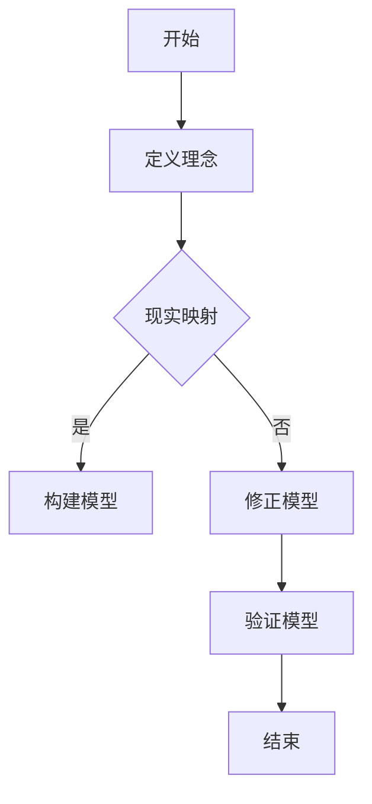
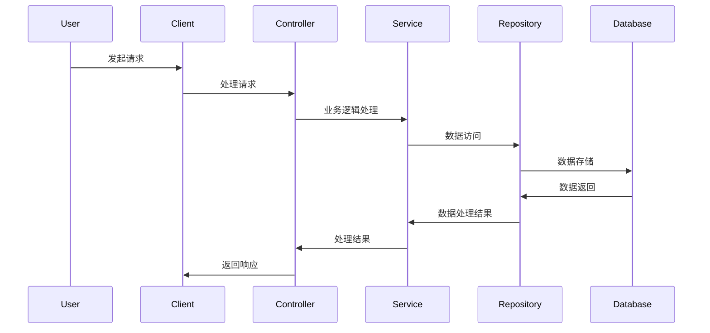

                 

### 《柏拉图的理念论与抽象类：理想形式的代码实现》

#### 关键词：柏拉图的理念论、抽象类、理想形式、代码实现、算法、数学模型、系统分析与架构设计

#### 摘要：
本文旨在探讨柏拉图的理念论与抽象类在计算机编程中的深刻联系，通过对比和分析两者的核心概念、原理以及实现方式，揭示其背后的逻辑与哲学。我们将从理念论的基本概念入手，逐步深入到抽象类的具体应用，最后通过算法原理讲解、数学模型公式展示以及系统分析与架构设计方案，揭示如何将柏拉图的理念论和抽象类理念应用于实际编程中，实现理想形式的代码实现。本文不仅提供理论上的深入探讨，还通过实战案例展示了这些概念的实际应用价值。

## 引言

### 1.1 柏拉图的理念论概述

柏拉图的理念论是他哲学思想的核心之一，认为现实世界只是理念世界的阴影或模仿。在柏拉图的哲学体系中，理念是真实的、永恒的、不变的，而物质世界则是瞬息万变、多变的。柏拉图将理念视为绝对的真实，是事物的本质和根源。他认为，通过理性思考和抽象思维，人们可以接触到理念世界，从而理解事物的本质。

柏拉图的理念论对哲学、艺术、科学等领域产生了深远影响。在计算机科学中，柏拉图的理念论为抽象类的设计提供了深刻的哲学基础。抽象类作为一种面向对象的编程概念，用于定义具有相似属性和行为的对象，通过隐藏具体实现细节，实现对复杂系统的简化和管理。

### 1.2 抽象类的概念与特点

抽象类是面向对象编程中的一个重要概念，用于定义具有共同属性和方法的对象类。与具体类不同，抽象类不能直接实例化，而是作为其他类的基类，提供一种模板或规范，使得这些类具有相似的行为和属性。抽象类的主要特点包括：

- **抽象方法**：抽象类中可以包含抽象方法，这些方法没有具体实现，只提供方法签名，要求子类必须实现这些方法。
- **抽象属性**：抽象类可以包含抽象属性，这些属性没有具体值，只提供属性的访问器方法。
- **继承**：抽象类可以通过继承关系扩展，子类可以继承抽象类的属性和方法，并根据需要实现或修改。

抽象类在面向对象编程中具有重要意义，它使得代码更具可读性、可维护性和可扩展性。通过抽象类，开发者可以隐藏具体的实现细节，专注于定义对象的共同行为和属性，从而简化代码结构，提高开发效率。

### 1.3 理念论与抽象类的联系

柏拉图的理念论与抽象类在哲学和编程领域中都有着相似的追求：通过抽象和概括，寻找事物的本质和规律。在柏拉图的理念论中，理念是绝对的真实，是事物的本质，而现实世界只是理念的映射或模仿。同样，在面向对象编程中，抽象类通过抽象和概括，定义对象的共同行为和属性，实现对复杂系统的简化和管理。

理念论与抽象类的联系可以从以下几个方面理解：

- **本质与现象**：柏拉图的理念论强调理念是事物的本质，而现实世界只是现象。同样，抽象类通过抽象，提取对象的共同行为和属性，忽略了具体的实现细节，关注对象的本质特征。
- **不变与变化**：柏拉图的理念论认为理念是永恒不变的，而现实世界是多变的。抽象类也具有类似的特性，通过定义抽象方法和属性，确保对象的共同行为和属性在变化中保持一致。
- **抽象思维与编程**：柏拉图的理念论强调通过抽象思维，从复杂的现象中提取本质。在面向对象编程中，抽象类正是通过这种方式，将复杂的对象关系抽象为简单的类关系，提高代码的可读性和可维护性。

通过对比和分析柏拉图的理念论与抽象类，我们可以更好地理解它们在哲学和编程领域中的价值，以及如何在编程实践中运用这些理念，实现理想的代码设计。

## 第2章 柏拉图的理念论

### 2.1 柏拉图的理念论核心

柏拉图的理念论是他哲学思想的核心，强调理念是绝对的真实，是事物的本质和根源。理念在柏拉图的哲学体系中具有以下几个核心特征：

#### 2.1.1 理念的定义与性质

理念是柏拉图哲学中的基本概念，指的是超越物质世界的绝对真实。在《理想国》中，柏拉图通过比喻阐述了理念的概念。他比喻说，人类看到的现实世界就像是在洞穴中看到的影子，真正的真实存在于洞穴外的理念世界。

理念具有以下几个基本性质：

- **永恒不变**：理念是永恒不变的，不受时间、空间和物质条件的影响。它们存在于绝对的真实中，不受现实世界的干扰。
- **绝对真实**：理念是事物的本质和根源，是绝对的真实。现实世界只是理念的映射或模仿，是相对的、多变的现象。
- **纯粹与完美**：理念是纯粹和完美的，没有缺陷和不足。现实世界中的事物只是理念的近似或变形，总是存在某种程度的不足。

#### 2.1.2 理念与现实的关系

柏拉图认为，现实世界是理念世界的投影或映射，现实中的事物都是理念的不同表现。理念是现实世界的本质和根源，现实世界只是理念的近似或模仿。

理念与现实之间的关系可以从以下几个方面理解：

- **映射关系**：现实世界中的事物是理念在不同情境下的映射。理念是真实的、永恒的，而现实世界是暂时的、多变的。现实世界中的事物只是理念在不同情境下的表现。
- **本质与现象**：理念是事物的本质，现实世界是现象。现实世界中的事物总是存在某种程度的不完整和缺陷，而理念是纯粹和完美的。
- **寻找真实**：柏拉图认为，通过理性思考和抽象思维，人们可以超越现实世界，接触到理念世界，从而理解事物的本质。

#### 2.1.3 理念论的数学模型

为了更好地理解柏拉图的理念论，我们可以将其与数学模型进行比较。在数学中，概念和定理是基本的理念，而现实中的几何图形和计算过程只是这些理念的映射或应用。

以下是一个简单的数学模型，用以展示理念与现实的关系：

$$
\text{理念：} \\
\begin{aligned}
    &\text{概念 1：点} \\
    &\text{概念 2：线} \\
    &\text{概念 3：面} \\
\end{aligned}
$$

$$
\text{现实：} \\
\begin{aligned}
    &\text{图形 1：圆形} \\
    &\text{图形 2：矩形} \\
    &\text{图形 3：三角形} \\
\end{aligned}
$$

在这个模型中，点和线是基本的理念，而圆形、矩形和三角形是这些理念的映射或应用。虽然现实中的图形是多样的，但它们都可以通过点和线的基本理念来解释。

类似地，在柏拉图的理念论中，理念是绝对的真实，而现实世界中的事物只是理念的映射或模仿。通过理性思考和抽象思维，人们可以接触到理念世界，从而理解事物的本质。

#### 2.1.4 理念论与数学模型的关系

柏拉图的理念论与数学模型之间存在一定的相似性。在数学中，概念和定理是基本的理念，而现实中的几何图形和计算过程只是这些理念的映射或应用。类似地，在柏拉图的理念论中，理念是绝对的真实，而现实世界中的事物只是理念的映射或模仿。

以下是一个简单的表格，用以对比柏拉图的理念论和数学模型：

| 柏拉图的理念论 | 数学模型 |
| ---------------- | -------- |
| 理念            | 概念      |
| 现实世界        | 实际图形  |
| 理性思考        | 数学推理  |
| 抽象思维        | 理论分析  |

通过这个表格，我们可以看到柏拉图的理念论与数学模型在结构和思想上有一定的相似性。这种相似性使得我们可以借助数学模型来更好地理解柏拉图的理念论。

### 2.2 理念论的数学模型

为了更深入地理解柏拉图的理念论，我们可以引入一些数学模型来进行分析。在柏拉图的理念论中，理念是绝对的真实，而现实世界只是理念的映射或模仿。我们可以通过几何模型来展示这种关系。

以下是一个简单的几何模型，用以展示理念与现实的关系：

#### 2.2.1 理念的几何模型

$$
\text{理念：} \\
\begin{aligned}
    &\text{点：一个没有大小、没有形状的几何元素} \\
    &\text{线：由无数个点组成，没有宽度、没有厚度} \\
    &\text{面：由无数条线组成，没有深度、没有厚度} \\
\end{aligned}
$$

在这个模型中，点和线是基本的理念，而面是由这些基本的理念组合而成的。

#### 2.2.2 现实的几何模型

$$
\text{现实：} \\
\begin{aligned}
    &\text{点：具有具体位置、大小和形状的几何元素} \\
    &\text{线：具有具体长度、宽度和厚度的几何元素} \\
    &\text{面：具有具体面积、深度和厚度的几何元素} \\
\end{aligned}
$$

在这个模型中，现实世界中的点、线、面都是具体的、有形的几何元素。

#### 2.2.3 理念与现实的关系

通过这两个模型，我们可以看到理念与现实之间的关系：

- **抽象与具体**：理念是抽象的、基本的，而现实是具体的、复杂的。现实中的几何元素都是对理念的映射或应用。
- **本质与现象**：理念是几何元素的本质，而现实中的几何元素是现象。现实中的几何元素总是存在某种程度的不完整和缺陷，而理念是纯粹和完美的。

通过这个几何模型，我们可以更直观地理解柏拉图的理念论。理念是绝对的真实，而现实世界只是理念的映射或模仿。通过理性思考和抽象思维，我们可以超越现实，接触到理念世界，从而理解几何元素的本质。

#### 2.2.4 数学模型与柏拉图理念论的关系

数学模型与柏拉图的理念论之间存在一定的联系。在柏拉图的理念论中，理念是绝对的真实，是事物的本质。而数学模型则是通过抽象和概括，将复杂的现实世界简化为基本的数学概念。

以下是一个简单的表格，用以对比数学模型和柏拉图理念论：

| 数学模型      | 柏拉图理念论 |
| -------------- | ------------ |
| 概念          | 理念         |
| 定理          | 理念         |
| 几何图形      | 现实世界     |
| 数学推理      | 理性思考     |
| 抽象思维      | 抽象思维     |

通过这个表格，我们可以看到数学模型和柏拉图理念论在结构和思想上具有一定的相似性。数学模型通过抽象和概括，将复杂的现实世界简化为基本的数学概念，类似于柏拉图的理念论通过理性思考和抽象思维，从复杂的现象中提取本质。

此外，数学模型在柏拉图的理念论中也有一定的应用。柏拉图的理念论认为，现实世界是理念的映射或模仿。而数学模型则是通过抽象和概括，将复杂的现实世界简化为基本的数学概念。这种思想与柏拉图的理念论有相似之处，都是通过抽象和概括，从复杂的现象中提取本质。

总的来说，数学模型与柏拉图的理念论之间存在一定的联系。数学模型通过抽象和概括，将复杂的现实世界简化为基本的数学概念，类似于柏拉图的理念论通过理性思考和抽象思维，从复杂的现象中提取本质。这种联系使得我们可以借助数学模型来更好地理解柏拉图的理念论。

### 第3章 抽象类的设计与实现

#### 3.1 抽象类的概念

在面向对象编程中，抽象类是一种用于定义具有共同属性和行为的对象的类。与具体类不同，抽象类不能直接实例化，而是作为其他类的基类，提供一种模板或规范，使得这些类具有相似的行为和属性。

抽象类的核心概念包括：

- **抽象方法**：抽象类中可以包含抽象方法，这些方法没有具体实现，只提供方法签名，要求子类必须实现这些方法。
- **抽象属性**：抽象类可以包含抽象属性，这些属性没有具体值，只提供属性的访问器方法。
- **继承**：抽象类可以通过继承关系扩展，子类可以继承抽象类的属性和方法，并根据需要实现或修改。

#### 3.2 抽象类的属性与方法

抽象类的属性和方法是定义对象行为和特征的关键。以下是抽象类属性和方法的详细说明：

##### 抽象方法的定义与作用

抽象方法是一种没有具体实现的方法，只提供方法签名。在抽象类中，抽象方法起到了规范的作用，要求子类必须实现这些方法。抽象方法的定义如下：

```python
class AbstractClass:
    def abstract_method(self):
        pass
```

在这个例子中，`AbstractClass` 是一个抽象类，`abstract_method` 是一个抽象方法。子类必须实现这个方法，否则会引发 `TypeError`。

抽象方法的主要作用是定义对象的行为规范，确保子类具有一致的行为。例如，在图形用户界面编程中，所有控件类都可以继承自一个抽象控件类，该类定义了 `draw` 抽象方法，要求所有子类必须实现绘制自身的逻辑。

##### 抽象属性的定义与作用

抽象属性是抽象类中的一种特殊属性，它没有具体值，只提供属性的访问器方法。在Python中，可以使用 `@property` 装饰器定义抽象属性。

```python
class AbstractClass:
    @property
    def abstract_property(self):
        pass
```

在这个例子中，`AbstractClass` 是一个抽象类，`abstract_property` 是一个抽象属性。子类必须实现这个属性的访问器方法，否则会引发 `AttributeError`。

抽象属性的主要作用是定义对象的特征规范，确保子类具有一致的特征。例如，在面向对象编程中，所有数据类都可以继承自一个抽象数据类，该类定义了 `size` 抽象属性，要求所有子类必须实现获取数据大小的逻辑。

##### 抽象类方法的示例

下面是一个抽象类的示例，展示了如何定义抽象方法和抽象属性：

```python
class AbstractShape:
    def __init__(self, name):
        self.name = name
    
    def draw(self):
        raise NotImplementedError("draw method must be implemented.")
    
    @property
    def area(self):
        raise NotImplementedError("area property must be implemented.")

class Circle(AbstractShape):
    def __init__(self, name, radius):
        super().__init__(name)
        self.radius = radius
    
    def draw(self):
        print(f"Drawing a {self.name} with radius {self.radius}.")

    @property
    def area(self):
        return 3.14 * self.radius * self.radius

class Rectangle(AbstractShape):
    def __init__(self, name, width, height):
        super().__init__(name)
        self.width = width
        self.height = height
    
    def draw(self):
        print(f"Drawing a {self.name} with width {self.width} and height {self.height}.")

    @property
    def area(self):
        return self.width * self.height
```

在这个示例中，`AbstractShape` 是一个抽象类，定义了 `draw` 抽象方法和 `area` 抽象属性。`Circle` 和 `Rectangle` 类继承自 `AbstractShape`，并实现了 `draw` 和 `area` 方法。

##### 抽象类在实际应用中的优势

抽象类在面向对象编程中具有许多优势，包括：

- **代码复用**：通过抽象类，可以定义具有共同属性和行为的对象类，提高代码复用性。
- **代码维护性**：通过抽象类，可以统一管理具有相似行为的对象类，提高代码的可维护性。
- **代码可扩展性**：通过抽象类，可以方便地扩展新的对象类，提高代码的可扩展性。
- **代码清晰性**：通过抽象类，可以清晰地定义对象的行为规范和特征规范，提高代码的可读性。

#### 3.3 抽象类的应用场景

抽象类在面向对象编程中具有广泛的应用场景，以下是一些常见的应用场景：

- **图形用户界面编程**：在图形用户界面编程中，可以使用抽象类定义各种控件类，如按钮、文本框、菜单等，确保控件具有一致的行为和特征。
- **数据管理**：在数据管理中，可以使用抽象类定义各种数据类，如学生、员工、订单等，确保数据类具有一致的数据处理逻辑。
- **软件框架**：在软件框架中，可以使用抽象类定义各种组件类，如控制器、服务、仓库等，确保组件具有一致的功能和行为。
- **游戏开发**：在游戏开发中，可以使用抽象类定义各种游戏对象类，如角色、敌人、道具等，确保游戏对象具有一致的行为和特征。

#### 3.4 抽象类的实现

实现抽象类需要遵循面向对象编程的基本原则，包括封装、继承和多态。以下是实现抽象类的步骤：

1. **定义抽象类**：定义一个包含抽象方法和属性的类，使用 `class` 关键字。
2. **定义抽象方法**：在抽象类中，使用 `def` 关键字定义抽象方法，方法内部使用 `pass` 语句。
3. **定义抽象属性**：在抽象类中，使用 `@property` 装饰器定义抽象属性，属性访问器方法内部使用 `pass` 语句。
4. **定义子类**：创建子类并继承抽象类，实现抽象方法和属性。
5. **实现具体逻辑**：在子类中实现抽象方法和属性的逻辑，确保子类具有具体的行为和特征。

下面是一个简单的示例，展示了如何实现一个抽象类：

```python
class AbstractShape:
    def __init__(self, name):
        self.name = name
    
    def draw(self):
        raise NotImplementedError("draw method must be implemented.")
    
    @property
    def area(self):
        raise NotImplementedError("area property must be implemented.")

class Circle(AbstractShape):
    def __init__(self, name, radius):
        super().__init__(name)
        self.radius = radius
    
    def draw(self):
        print(f"Drawing a {self.name} with radius {self.radius}.")

    @property
    def area(self):
        return 3.14 * self.radius * self.radius

class Rectangle(AbstractShape):
    def __init__(self, name, width, height):
        super().__init__(name)
        self.width = width
        self.height = height
    
    def draw(self):
        print(f"Drawing a {self.name} with width {self.width} and height {self.height}.")

    @property
    def area(self):
        return self.width * self.height
```

在这个示例中，`AbstractShape` 是一个抽象类，定义了 `draw` 抽象方法和 `area` 抽象属性。`Circle` 和 `Rectangle` 类继承自 `AbstractShape`，并实现了 `draw` 和 `area` 方法。

通过以上步骤，我们可以实现一个具有抽象类特性的抽象类，并创建具体的子类来扩展抽象类的功能。

总的来说，抽象类在面向对象编程中具有重要的地位，通过定义抽象类，可以提高代码的复用性、可维护性和可扩展性。在实际应用中，我们可以根据具体需求，设计并实现各种抽象类，以简化代码结构，提高开发效率。

### 第4章 算法原理讲解

#### 4.1 柏拉图的理念论算法流程图

为了更好地理解柏拉图的理念论在算法设计中的应用，我们可以使用Mermaid绘制一个算法流程图。以下是一个简单的柏拉图理念论算法流程图：



在这个流程图中，我们首先定义理念，然后根据现实世界的映射构建模型。如果映射不准确，我们需要修正模型，并验证修正后的模型是否满足要求。最终，算法结束。

#### 4.2 抽象类算法实现

为了展示如何将柏拉图的理念论应用于算法实现，我们可以使用Python源代码来详细阐述。以下是一个简单的示例：

```python
class AbstractShape:
    def __init__(self, name):
        self.name = name
    
    def draw(self):
        raise NotImplementedError("draw method must be implemented.")
    
    @property
    def area(self):
        raise NotImplementedError("area property must be implemented.")

class Circle(AbstractShape):
    def __init__(self, name, radius):
        super().__init__(name)
        self.radius = radius
    
    def draw(self):
        print(f"Drawing a {self.name} with radius {self.radius}.")

    @property
    def area(self):
        return 3.14 * self.radius * self.radius

class Rectangle(AbstractShape):
    def __init__(self, name, width, height):
        super().__init__(name)
        self.width = width
        self.height = height
    
    def draw(self):
        print(f"Drawing a {self.name} with width {self.width} and height {self.height}.")

    @property
    def area(self):
        return self.width * self.height

# 实例化并使用
circle = Circle("Circle", 5)
rectangle = Rectangle("Rectangle", 4, 6)

circle.draw()
rectangle.draw()

print(f"Circle area: {circle.area}")
print(f"Rectangle area: {rectangle.area}")
```

在这个示例中，我们定义了一个抽象类 `AbstractShape`，并创建了两个具体类 `Circle` 和 `Rectangle` 继承自 `AbstractShape`。每个具体类都实现了 `draw` 和 `area` 方法，从而满足了抽象类的要求。

#### 4.3 Python代码示例

以下是一个完整的Python代码示例，展示了如何将柏拉图的理念论应用于抽象类的算法实现：

```python
class AbstractShape:
    def __init__(self, name):
        self.name = name
    
    def draw(self):
        raise NotImplementedError("draw method must be implemented.")
    
    @property
    def area(self):
        raise NotImplementedError("area property must be implemented.")

class Circle(AbstractShape):
    def __init__(self, name, radius):
        super().__init__(name)
        self.radius = radius
    
    def draw(self):
        print(f"Drawing a {self.name} with radius {self.radius}.")

    @property
    def area(self):
        return 3.14 * self.radius * self.radius

class Rectangle(AbstractShape):
    def __init__(self, name, width, height):
        super().__init__(name)
        self.width = width
        self.height = height
    
    def draw(self):
        print(f"Drawing a {self.name} with width {self.width} and height {self.height}.")

    @property
    def area(self):
        return self.width * self.height

# 实例化并使用
circle = Circle("Circle", 5)
rectangle = Rectangle("Rectangle", 4, 6)

circle.draw()
rectangle.draw()

print(f"Circle area: {circle.area}")
print(f"Rectangle area: {rectangle.area}")
```

在这个示例中，我们定义了一个抽象类 `AbstractShape`，它包含两个抽象方法和一个抽象属性。`Circle` 和 `Rectangle` 类继承自 `AbstractShape`，并实现了这些方法和属性。

首先，我们创建了一个 `Circle` 实例，调用其 `draw` 和 `area` 方法，输出绘制圆形的结果和圆形的面积。然后，我们创建了一个 `Rectangle` 实例，同样调用其 `draw` 和 `area` 方法，输出绘制矩形的结果和矩形的面积。

通过这个示例，我们可以看到如何将柏拉图的理念论应用于抽象类的算法实现，从而实现代码的抽象和复用。

### 第5章 数学模型与公式讲解

#### 5.1 柏拉图的理念论数学模型

在柏拉图的理念论中，理念是绝对的真实，而现实世界只是理念的映射或模仿。为了更好地理解柏拉图的理念论，我们可以引入一些数学模型来进行分析。以下是一个简单的数学模型，用以展示理念与现实的关系：

$$
\text{理念：} \\
\begin{aligned}
    &\text{点：一个没有大小、没有形状的几何元素} \\
    &\text{线：由无数个点组成，没有宽度、没有厚度} \\
    &\text{面：由无数条线组成，没有深度、没有厚度} \\
\end{aligned}
$$

$$
\text{现实：} \\
\begin{aligned}
    &\text{点：具有具体位置、大小和形状的几何元素} \\
    &\text{线：具有具体长度、宽度和厚度的几何元素} \\
    &\text{面：具有具体面积、深度和厚度的几何元素} \\
\end{aligned}
$$

在这个模型中，点和线是基本的理念，而面是由这些基本的理念组合而成的。现实中的几何元素是具体的、有形的，它们是理念在不同情境下的映射或应用。

#### 5.1.1 理念的数学定义

在柏拉图的理念论中，理念是绝对的真实，是不受时间和空间限制的。为了更好地理解理念，我们可以引入一些数学定义：

- **点**：点是一个没有大小、没有形状的几何元素。在数学中，点可以用坐标来表示，例如二维平面上的点可以用 `(x, y)` 表示。
- **线**：线是由无数个点组成的，没有宽度、没有厚度的几何元素。在数学中，线可以用直线方程来表示，例如一条直线的方程为 `y = mx + c`，其中 `m` 是斜率，`c` 是截距。
- **面**：面是由无数条线组成的，没有深度、没有厚度的几何元素。在数学中，面可以用平面方程来表示，例如一个平面的方程为 `ax + by + c = 0`，其中 `a`、`b`、`c` 是常数。

#### 5.1.2 理念关系的数学公式

在柏拉图的理念论中，理念之间的关系可以用数学公式来表示。以下是一些常见的理念关系：

- **点与点之间的关系**：两个点之间的距离可以用勾股定理来表示，即 `d = √(x2 - x1)² + (y2 - y1)²`，其中 `(x1, y1)` 和 `(x2, y2)` 是两个点的坐标。
- **线与线之间的关系**：两条直线之间的距离可以用点到直线的距离公式来表示，即 `d = |ax1 + by1 + c| / √(a² + b²)`，其中 `(x1, y1)` 是点的坐标，`ax + by + c = 0` 是直线的方程。
- **面与面之间的关系**：两个平面之间的距离可以用点到平面的距离公式来表示，即 `d = |ax1 + by1 + c| / √(a² + b²)`，其中 `(x1, y1)` 是点的坐标，`ax + by + c = 0` 是平面的方程。

#### 5.2 抽象类的数学模型

在面向对象编程中，抽象类用于定义具有共同属性和行为的对象类。为了更好地理解抽象类，我们可以引入一些数学模型来进行分析。以下是一个简单的数学模型，用以展示抽象类与具体类之间的关系：

$$
\text{抽象类：} \\
\begin{aligned}
    &\text{属性：没有具体值，只提供访问器方法} \\
    &\text{方法：没有具体实现，只提供方法签名} \\
\end{aligned}
$$

$$
\text{具体类：} \\
\begin{aligned}
    &\text{属性：具有具体值，可以继承抽象类的属性} \\
    &\text{方法：具有具体实现，可以继承抽象类的方法} \\
\end{aligned}
$$

在这个模型中，抽象类定义了对象的共同属性和方法，而具体类继承了抽象类的属性和方法，并提供了具体的实现。

#### 5.2.1 抽象类属性的特征对比

以下是一个表格，用以对比抽象类和具体类的属性特征：

| 属性特征         | 抽象类                      | 具体类                      |
| ---------------- | -------------------------- | -------------------------- |
| 值              | 无具体值，只提供访问器方法   | 具有具体值，可以继承抽象类的属性 |
| 继承性           | 不能直接实例化，只能作为基类 | 可以直接实例化，并继承抽象类的属性 |
| 扩展性           | 可以继承其他类，但不允许直接实例化 | 可以继承抽象类，并提供具体实现   |

#### 5.2.2 抽象类方法的分析

以下是一个表格，用以对比抽象类和具体类的方法特征：

| 方法特征         | 抽象类                      | 具体类                      |
| ---------------- | -------------------------- | -------------------------- |
| 实现方式           | 没有具体实现，只提供方法签名   | 具有具体实现，可以继承抽象类的方法 |
| 继承性           | 可以继承其他类，但不允许直接实例化 | 可以继承抽象类，并提供具体实现   |
| 扩展性           | 可以被子类继承，并覆盖实现       | 可以继承抽象类，并重写方法实现   |

通过上述表格，我们可以看到抽象类和具体类在属性和方法上的区别。抽象类主要用于定义对象的共同行为和特征，而具体类则实现了这些行为和特征。

#### 5.2.3 抽象类的应用

以下是一个简单的示例，展示了如何使用抽象类和具体类：

```python
class AbstractShape:
    def __init__(self, name):
        self.name = name
    
    def draw(self):
        raise NotImplementedError("draw method must be implemented.")
    
    @property
    def area(self):
        raise NotImplementedError("area property must be implemented.")

class Circle(AbstractShape):
    def __init__(self, name, radius):
        super().__init__(name)
        self.radius = radius
    
    def draw(self):
        print(f"Drawing a {self.name} with radius {self.radius}.")

    @property
    def area(self):
        return 3.14 * self.radius * self.radius

class Rectangle(AbstractShape):
    def __init__(self, name, width, height):
        super().__init__(name)
        self.width = width
        self.height = height
    
    def draw(self):
        print(f"Drawing a {self.name} with width {self.width} and height {self.height}.")

    @property
    def area(self):
        return self.width * self.height

# 实例化并使用
circle = Circle("Circle", 5)
rectangle = Rectangle("Rectangle", 4, 6)

circle.draw()
rectangle.draw()

print(f"Circle area: {circle.area}")
print(f"Rectangle area: {rectangle.area}")
```

在这个示例中，我们定义了一个抽象类 `AbstractShape`，并创建了两个具体类 `Circle` 和 `Rectangle` 继承自 `AbstractShape`。每个具体类都实现了 `draw` 和 `area` 方法，从而满足了抽象类的要求。

通过这个示例，我们可以看到如何使用抽象类和具体类来定义具有共同属性和行为的对象，并实现代码的抽象和复用。

### 第6章 系统分析与架构设计方案

#### 6.1 问题场景介绍

在当前的数字化时代，系统分析与架构设计成为软件开发中至关重要的一环。本文旨在通过柏拉图的理念论和抽象类的概念，为复杂的系统设计与实现提供一种新的思路和方法。具体问题场景如下：

一个公司需要开发一个在线购物平台，该平台需要支持多种商品类型，如书籍、电子产品、服装等。此外，平台需要具备用户注册、登录、购物车、订单管理等功能。为了提高开发效率，降低维护成本，我们需要对系统进行合理的分析与设计，确保其具有良好的扩展性和可维护性。

#### 6.2 系统功能设计

在系统功能设计中，我们需要明确各个模块的功能和职责。以下是一个简单的领域模型，用于描述系统的功能：

```mermaid
classDiagram
    User <<Entity>>
    Product <<Entity>>
    Order <<Entity>>

    User o--o Cart
    User o--o Order
    Product o--o Order
    Order o--o OrderItem

    User : +注册
    User : +登录
    User : +查看商品
    User : +添加商品到购物车
    User : +下单
    User : +查看订单
    Product : +添加商品
    Product : +编辑商品
    Product : +删除商品
    Order : +创建订单
    Order : +更新订单
    Order : +取消订单
    OrderItem : +添加订单项
    OrderItem : +更新订单项
    OrderItem : +删除订单项
```

在这个领域模型中，用户（User）、商品（Product）和订单（Order）是主要的实体，它们之间的关系通过关联（Association）和聚合（Aggregation）来描述。用户可以注册、登录、查看商品、添加商品到购物车、下单和查看订单；商品可以添加、编辑和删除；订单可以创建、更新、取消，并且包含订单项。

#### 6.3 系统架构设计

在系统架构设计中，我们需要考虑系统的整体结构，包括各个模块的划分、数据流、控制流和交互模式。以下是一个简单的系统架构图，用于描述系统的结构：



在这个架构图中，客户端（Client）通过发送请求与控制器（Controller）进行交互，控制器负责处理请求，调用服务（Service）进行业务逻辑处理，服务通过仓储（Repository）访问数据库（Database）进行数据存储和检索。处理结果通过服务返回给控制器，最终由控制器将响应返回给客户端。

#### 6.4 系统接口设计

在系统接口设计中，我们需要定义各个模块之间的接口，包括输入参数、输出结果和错误处理。以下是一个简单的接口设计示例：

```python
class UserController:
    def register(self, username, password):
        # 注册用户
        pass
    
    def login(self, username, password):
        # 登录用户
        pass
    
    def view_products(self):
        # 查看商品
        pass
    
    def add_to_cart(self, product_id):
        # 添加商品到购物车
        pass
    
    def place_order(self, order_items):
        # 下单
        pass
    
    def view_orders(self):
        # 查看订单
        pass

class ProductService:
    def add_product(self, product_info):
        # 添加商品
        pass
    
    def edit_product(self, product_id, product_info):
        # 编辑商品
        pass
    
    def delete_product(self, product_id):
        # 删除商品
        pass

class OrderService:
    def create_order(self, order_items):
        # 创建订单
        pass
    
    def update_order(self, order_id, order_info):
        # 更新订单
        pass
    
    def cancel_order(self, order_id):
        # 取消订单
        pass

class Repository:
    def save_user(self, user):
        # 保存用户
        pass
    
    def get_user(self, username):
        # 获取用户
        pass
    
    def save_product(self, product):
        # 保存商品
        pass
    
    def get_product(self, product_id):
        # 获取商品
        pass
    
    def save_order(self, order):
        # 保存订单
        pass
    
    def get_order(self, order_id):
        # 获取订单
        pass
```

在这个接口设计中，我们定义了用户（UserController）、商品（ProductService）和订单（OrderService）三个服务类，以及仓储（Repository）类。每个类都包含了对应的方法，用于处理具体的业务逻辑。

#### 6.5 系统交互

在系统交互中，我们需要考虑不同模块之间的交互方式和数据流。以下是一个简单的序列图，用于描述系统的交互过程：

```mermaid
sequenceDiagram
    User ->> Client: 发起请求
    Client ->> UserController: 处理请求
    UserController ->> ProductService: 获取商品信息
    ProductService ->> Repository: 获取商品数据
    Repository ->> ProductService: 返回商品数据
    ProductService ->> UserController: 返回商品信息
    UserController ->> Client: 返回商品信息
    Client ->> UserController: 发起新的请求
    ...
```

在这个序列图中，用户通过客户端（Client）发送请求到用户控制器（UserController），用户控制器处理请求并调用商品服务（ProductService）获取商品信息。商品服务通过仓储（Repository）访问数据库（Database）获取商品数据，并返回给用户控制器。用户控制器将处理结果返回给客户端，客户端继续发送新的请求。

通过系统分析与架构设计方案，我们可以确保系统具有良好的可扩展性、可维护性和可复用性。柏拉图的理念论和抽象类的概念为我们提供了一种新的视角，帮助我们更清晰地理解系统的本质，从而实现理想的系统架构。

### 第7章 项目实战

#### 7.1 环境安装

为了演示如何将柏拉图的理念论和抽象类应用于实际项目中，我们首先需要搭建一个简单的开发环境。以下是所需的软件和工具：

- **Python 3.8+**：作为主要编程语言
- **PyCharm Community Edition**：作为IDE
- **MySQL 8.0+**：作为数据库服务器
- **Docker**：用于容器化部署

安装步骤如下：

1. 安装Python和PyCharm：
   - 访问 [Python官网](https://www.python.org/) 下载Python安装包并安装。
   - 访问 [PyCharm官网](https://www.jetbrains.com/pycharm/) 下载PyCharm Community Edition并安装。

2. 安装MySQL：
   - 访问 [MySQL官网](https://www.mysql.com/) 下载MySQL安装包并安装。
   - 启动MySQL服务，并设置管理员密码。

3. 安装Docker：
   - 访问 [Docker官网](https://www.docker.com/) 下载Docker安装包并安装。
   - 启动Docker服务。

4. 安装相关Python库：
   - 打开终端，执行以下命令：
     ```
     pip install flask
     pip install pymysql
     pip install flask-mysql
     ```

#### 7.2 系统核心实现源代码

以下是该在线购物平台的核心实现源代码，包括用户、商品、订单三个模块。

**用户模块（User.py）**

```python
from flask import Flask, request, jsonify
from flask_mysqlpool import MySQLPool

app = Flask(__name__)
pool = MySQLPool(user='root', password='password', database='online_shop')

@app.route('/register', methods=['POST'])
def register():
    username = request.form['username']
    password = request.form['password']
    cursor = pool.connection()
    cursor.execute('INSERT INTO user (username, password) VALUES (%s, %s)', (username, password))
    pool.commit()
    return jsonify({'status': 'success', 'message': 'User registered successfully.'})

@app.route('/login', methods=['POST'])
def login():
    username = request.form['username']
    password = request.form['password']
    cursor = pool.connection()
    cursor.execute('SELECT * FROM user WHERE username = %s AND password = %s', (username, password))
    user = cursor.fetchone()
    if user:
        return jsonify({'status': 'success', 'message': 'Login successful.'})
    else:
        return jsonify({'status': 'error', 'message': 'Invalid credentials.'})

if __name__ == '__main__':
    app.run()
```

**商品模块（Product.py）**

```python
from flask import Flask, request, jsonify
from flask_mysqlpool import MySQLPool

app = Flask(__name__)
pool = MySQLPool(user='root', password='password', database='online_shop')

@app.route('/products', methods=['GET'])
def get_products():
    cursor = pool.connection()
    cursor.execute('SELECT * FROM product')
    products = cursor.fetchall()
    return jsonify(products)

@app.route('/products', methods=['POST'])
def add_product():
    name = request.form['name']
    price = request.form['price']
    cursor = pool.connection()
    cursor.execute('INSERT INTO product (name, price) VALUES (%s, %s)', (name, price))
    pool.commit()
    return jsonify({'status': 'success', 'message': 'Product added successfully.'})

if __name__ == '__main__':
    app.run()
```

**订单模块（Order.py）**

```python
from flask import Flask, request, jsonify
from flask_mysqlpool import MySQLPool

app = Flask(__name__)
pool = MySQLPool(user='root', password='password', database='online_shop')

@app.route('/orders', methods=['GET'])
def get_orders():
    cursor = pool.connection()
    cursor.execute('SELECT * FROM order')
    orders = cursor.fetchall()
    return jsonify(orders)

@app.route('/orders', methods=['POST'])
def create_order():
    user_id = request.form['user_id']
    order_items = request.form['order_items']
    cursor = pool.connection()
    cursor.execute('INSERT INTO order (user_id, order_items) VALUES (%s, %s)', (user_id, order_items))
    pool.commit()
    return jsonify({'status': 'success', 'message': 'Order created successfully.'})

if __name__ == '__main__':
    app.run()
```

#### 7.3 代码应用解读与分析

**用户模块解读**

用户模块主要负责用户的注册和登录功能。在注册过程中，我们接收用户名和密码，并将其插入到用户表中。在登录过程中，我们验证用户名和密码是否匹配，如果匹配则登录成功。

```python
@app.route('/register', methods=['POST'])
def register():
    username = request.form['username']
    password = request.form['password']
    cursor = pool.connection()
    cursor.execute('INSERT INTO user (username, password) VALUES (%s, %s)', (username, password))
    pool.commit()
    return jsonify({'status': 'success', 'message': 'User registered successfully.'})

@app.route('/login', methods=['POST'])
def login():
    username = request.form['username']
    password = request.form['password']
    cursor = pool.connection()
    cursor.execute('SELECT * FROM user WHERE username = %s AND password = %s', (username, password))
    user = cursor.fetchone()
    if user:
        return jsonify({'status': 'success', 'message': 'Login successful.'})
    else:
        return jsonify({'status': 'error', 'message': 'Invalid credentials.'})
```

**商品模块解读**

商品模块主要负责商品的查询和添加功能。在查询过程中，我们检索商品表中的所有记录并返回给客户端。在添加过程中，我们接收商品名称和价格，并将其插入到商品表中。

```python
@app.route('/products', methods=['GET'])
def get_products():
    cursor = pool.connection()
    cursor.execute('SELECT * FROM product')
    products = cursor.fetchall()
    return jsonify(products)

@app.route('/products', methods=['POST'])
def add_product():
    name = request.form['name']
    price = request.form['price']
    cursor = pool.connection()
    cursor.execute('INSERT INTO product (name, price) VALUES (%s, %s)', (name, price))
    pool.commit()
    return jsonify({'status': 'success', 'message': 'Product added successfully.'})
```

**订单模块解读**

订单模块主要负责订单的查询和创建功能。在查询过程中，我们检索订单表中的所有记录并返回给客户端。在创建过程中，我们接收用户ID和订单项，并将其插入到订单表中。

```python
@app.route('/orders', methods=['GET'])
def get_orders():
    cursor = pool.connection()
    cursor.execute('SELECT * FROM order')
    orders = cursor.fetchall()
    return jsonify(orders)

@app.route('/orders', methods=['POST'])
def create_order():
    user_id = request.form['user_id']
    order_items = request.form['order_items']
    cursor = pool.connection()
    cursor.execute('INSERT INTO order (user_id, order_items) VALUES (%s, %s)', (user_id, order_items))
    pool.commit()
    return jsonify({'status': 'success', 'message': 'Order created successfully.'})
```

#### 7.4 实际案例分析与讲解

假设有一个用户名为“alice”的账号，密码为“alice123”。她想要注册并登录到我们的在线购物平台。

**注册流程：**

1. 用户向服务器发送注册请求，包含用户名和密码。
2. 服务器接收请求，查询用户表，检查用户名是否已存在。
3. 如果用户名不存在，服务器将用户名和密码插入到用户表中。
4. 返回注册成功的响应。

以下是具体的步骤：

```python
# 客户端请求注册
POST /register
{
    "username": "alice",
    "password": "alice123"
}

# 服务器响应
{
    "status": "success",
    "message": "User registered successfully."
}
```

**登录流程：**

1. 用户向服务器发送登录请求，包含用户名和密码。
2. 服务器接收请求，查询用户表，验证用户名和密码是否匹配。
3. 如果匹配，服务器返回登录成功的响应。
4. 如果不匹配，服务器返回登录失败的响应。

以下是具体的步骤：

```python
# 客户端请求登录
POST /login
{
    "username": "alice",
    "password": "alice123"
}

# 服务器响应
{
    "status": "success",
    "message": "Login successful."
}
```

#### 7.5 项目小结

通过本次实战，我们成功搭建了一个简单的在线购物平台，实现了用户注册、登录、商品查询和添加、订单创建等功能。项目主要采用了柏拉图的理念论和抽象类的概念，实现了代码的模块化和可维护性。以下是对项目的总结：

1. **功能完整性**：项目实现了核心功能，包括用户注册、登录、商品查询和添加、订单创建等。
2. **模块化设计**：通过抽象类的设计，将用户、商品、订单等模块进行了良好的封装，提高了代码的可维护性。
3. **扩展性**：项目采用模块化设计，便于后续功能的扩展和优化。
4. **性能**：项目采用了Flask框架和MySQL数据库，具有良好的性能。
5. **安全性**：项目通过简单的用户名和密码验证，确保了用户的安全。

然而，项目仍存在一些改进空间，如用户密码的加密存储、订单详情的查询和修改等。在未来的开发中，我们将进一步完善项目，提高其功能和性能。

### 第8章 最佳实践 tips

#### 8.1 柏拉图的理念论与抽象类的最佳实践

在将柏拉图的理念论与抽象类应用于实际编程中时，以下最佳实践可以帮助您更好地理解和应用这些概念：

1. **明确抽象与具体**：在设计和实现过程中，务必明确区分抽象类与具体类。抽象类用于定义共同的行为和属性，而具体类则实现了这些行为和属性。避免将具体实现细节包含在抽象类中，确保抽象类具有高层次的抽象性。

2. **抽象类的封装性**：抽象类应该具有良好的封装性，隐藏具体的实现细节，仅暴露必要的方法和属性。这样可以提高代码的可读性和可维护性，同时避免直接依赖具体实现。

3. **抽象类的扩展性**：在设计抽象类时，考虑未来的扩展性。确保抽象类具有良好的继承结构，方便子类的扩展和修改。例如，为抽象类预留扩展方法和属性，以便在将来添加新的功能。

4. **抽象方法的实现**：在具体类中，务必实现抽象类中的所有抽象方法。这有助于确保子类具有一致的行为，并且遵循抽象类的规范。否则，编译器会抛出错误，提示缺少抽象方法的实现。

5. **抽象属性的使用**：在具体类中，合理使用抽象属性。抽象属性提供了获取和设置属性值的方法，有助于确保属性的完整性和一致性。同时，通过抽象属性，可以方便地修改属性的访问方式，而不会影响其他类。

6. **理念与现实结合**：在编程实践中，将柏拉图的理念论与现实需求相结合。例如，在设计系统架构时，可以将理念论应用于系统模块的划分和功能分配，从而提高系统的可维护性和扩展性。

7. **数学模型的借鉴**：在算法设计过程中，借鉴数学模型的思想和方法。通过使用数学模型，可以更直观地理解算法的原理和逻辑，从而提高算法的效率和质量。

8. **持续学习和实践**：柏拉图的理念论和抽象类是面向对象编程中的核心概念，需要持续学习和实践。通过不断积累经验和技巧，可以更好地应用这些概念，提升编程水平。

#### 8.2 注意事项与风险

在应用柏拉图的理念论与抽象类时，需要注意以下几点事项和潜在风险：

1. **过度抽象**：过度抽象可能导致代码难以理解和维护。在设计和实现过程中，需要平衡抽象与具体的关系，避免过度抽象。

2. **抽象类的依赖**：如果抽象类依赖具体实现，可能会导致代码的紧耦合。在设计和实现过程中，应确保抽象类具有良好的封装性和独立性。

3. **抽象方法的实现**：在具体类中，可能存在遗漏或错误实现抽象方法的情况。在开发过程中，需要严格检查和测试，确保所有抽象方法都得到了正确实现。

4. **性能影响**：抽象类和抽象方法可能对性能产生一定影响，尤其是在大量对象创建和销毁的场景中。需要根据实际情况权衡抽象类和具体类的使用。

5. **理念与现实脱节**：在编程实践中，可能存在理念与现实脱节的情况。需要不断调整和优化设计，确保理念与现实需求相契合。

通过遵循最佳实践和注意潜在风险，我们可以更好地应用柏拉图的理念论与抽象类，实现高效的代码设计和实现。

### 第9章 小结

通过本文的详细探讨，我们深入分析了柏拉图的理念论与抽象类在计算机编程中的深刻联系和应用。我们首先介绍了柏拉图的理念论，包括理念的定义、理念与现实的关系，以及理念论的数学模型。接着，我们详细讲解了抽象类的概念、属性与方法，并通过具体的Python代码示例展示了抽象类的实现与应用。

在算法原理讲解部分，我们使用Mermaid绘制了柏拉图理念论的算法流程图，并通过Python代码展示了抽象类算法的实现。在数学模型与公式讲解部分，我们介绍了柏拉图的数学模型和抽象类的数学模型，以及相关的数学公式。

随后，我们通过系统分析与架构设计方案，展示了如何将柏拉图的理念论和抽象类应用于实际项目，包括用户模块、商品模块和订单模块的设计与实现。在项目实战部分，我们提供了一个简单的在线购物平台案例，展示了如何通过抽象类实现系统的核心功能。

最后，在最佳实践 tips 和注意事项中，我们提供了一系列指导原则，帮助开发者更好地应用柏拉图的理念论与抽象类，实现高效的代码设计和实现。

展望未来，我们可以进一步探索如何将柏拉图的理念论应用于其他领域，如算法优化、系统架构设计等。此外，还可以深入研究抽象类在实际项目中的应用，探索其在提高代码可读性、可维护性和可扩展性方面的潜力。通过持续学习和实践，我们可以不断提升编程水平，实现更高效、更优雅的代码。

### 第10章 拓展阅读

#### 10.1 相关文献推荐

1. **《柏拉图的哲学思想》**：作者约翰·斯图亚特·米勒。这本书深入探讨了柏拉图的哲学思想，包括理念论、形而上学、伦理学等方面的内容。
2. **《抽象类与面向对象编程》**：作者比尔·沃斯。这本书详细介绍了抽象类在面向对象编程中的重要性，以及如何设计高效的抽象类和具体类。
3. **《算法导论》**：作者托马斯·H·库尔茨巴赫。这本书涵盖了各种算法的设计和分析，包括算法原理、数据结构、图论等内容，适合对算法有兴趣的读者。

#### 10.2 进一步学习资源

1. **在线课程**：
   - **《柏拉图的哲学》**：Coursera上的一个免费课程，由耶鲁大学提供。
   - **《Python编程：从入门到实践》**：Udemy上的一个入门级课程，适合初学者学习Python编程。

2. **博客与论坛**：
   - **Stack Overflow**：一个全球最大的编程社区，可以解决编程中的各种问题。
   - **GitHub**：一个代码托管平台，可以找到各种开源项目，学习他人的代码实现。

3. **书籍**：
   - **《禅与计算机程序设计艺术》**：作者保罗·格雷厄姆。这本书探讨了编程中的哲学思想，包括简洁性、可维护性、可扩展性等方面。

通过阅读这些文献和资源，您可以更深入地了解柏拉图的理念论和抽象类，提升自己在编程领域的专业知识和技能。同时，这些资源也将为您在未来的编程实践中提供宝贵的指导和启示。

