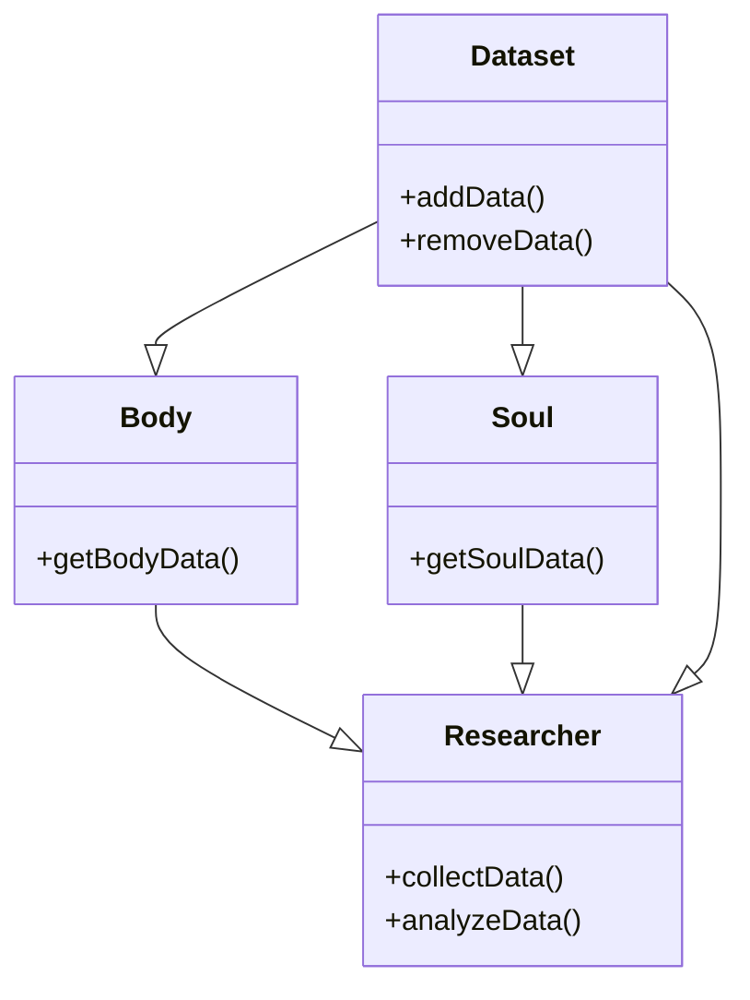
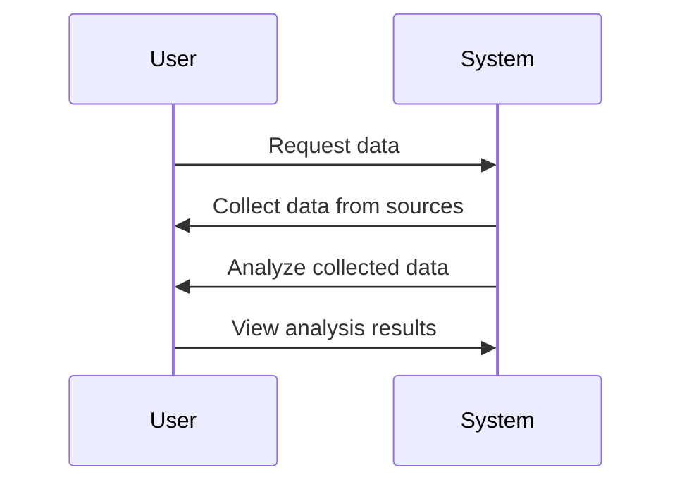
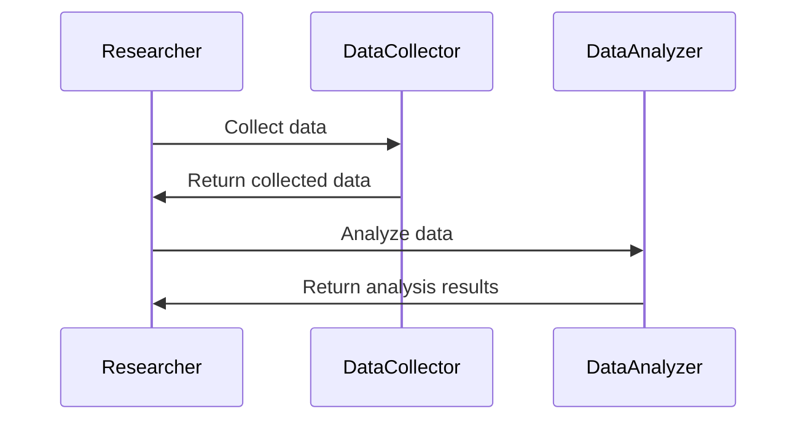

                 

## 柏格森与加布里埃尔·马塞尔：身体与灵魂的关系探讨

### 关键词

- **柏格森**
- **加布里埃尔·马塞尔**
- **身体与灵魂**
- **哲学探讨**
- **现代哲学**
- **心理学**

### 摘要

本文旨在探讨法国哲学家柏格森与加布里埃尔·马塞尔对身体与灵魂关系的哲学思考。通过详细分析两位哲学家的理论，本文揭示了他们对于身体与灵魂之间复杂关系的不同见解。文章将首先介绍柏格森和马塞尔的生平及其主要哲学思想，然后深入探讨他们对身体与灵魂关系的理解，并比较两者的异同。在此基础上，文章将分析身体与灵魂关系在现代社会中的应用，包括心理学、艺术和文学等领域。最后，本文将对身体与灵魂关系的研究进行总结，并展望未来可能的研究方向。通过这一步一步的分析推理，读者将对身体与灵魂的关系有更加深刻的认识。

### 第一部分：引言与背景

#### 第1章：柏格森与加布里埃尔·马塞尔概述

##### 1.1 柏格森的哲学思想

**1.1.1 柏格森的生平与影响**

亨利·柏格森（Henri Bergson，1859-1941）是法国著名的哲学家，他生于巴黎，是现代哲学的重要代表之一。柏格森在哲学、心理学和文学等多个领域都有显著的贡献，尤其是他对时间、直觉主义和创造力等方面的研究，使他成为20世纪最具影响力的哲学家之一。

柏格森的思想对后世产生了深远的影响。他提出的“生命冲动”（élan vital）概念挑战了机械唯物主义，强调生命的内在动力。他的直觉主义哲学主张直觉作为一种重要的认识方式，超越逻辑和理性，捕捉瞬间的内在感受。这些理论在生物学、心理学和艺术等领域都有广泛的应用。

**1.1.2 柏格森对身体的看法**

柏格森对身体的理解与他的生命冲动概念密切相关。他认为身体不仅仅是物质的存在，更是生命力的表现。身体不仅是灵魂的容器，更是灵魂与外界环境互动的桥梁。柏格森强调身体的感觉和运动功能，认为这些功能是灵魂与外界联系的重要途径。

柏格森强调身体的感觉和运动功能，认为这些功能是灵魂与外界联系的重要途径。他在《形而上学方程式》（La Formule desModèles）一书中提到：“身体不是灵魂的简单容器，而是灵魂与外界交流的工具。”他通过探讨身体的感觉机制，揭示了身体与灵魂之间的密切联系。

**1.1.3 柏格森的灵魂观念**

柏格森的灵魂观念与他的人生哲学紧密相连。他认为灵魂是生命冲动的体现，是生命力的内在表现。灵魂不仅仅是思考的实体，更是感觉和体验的中心。柏格森强调灵魂的非理性特点，认为理性只是灵魂的一部分，直觉才是灵魂的核心。

柏格森在《时间与自由意志》（Le Temps et la liberté）一书中提到：“灵魂不是静止不动的，而是不断变化的。灵魂是自由的，因为它是变化的。”他认为，灵魂的自由意志来源于直觉，而非逻辑和理性。直觉使灵魂能够超越现实，体验到更深层次的现实。

**1.2 加布里埃尔·马塞尔的思想**

**1.2.1 加布里埃尔·马塞尔的生平与贡献**

加布里埃尔·马塞尔（Gabriel Marcel，1889-1973）是法国哲学家，他的思想深受柏格森的影响。马塞尔生于巴黎，是存在主义哲学的重要代表之一。他的哲学思想涉及伦理学、心理学、宗教和文学等多个领域。

马塞尔的思想对后世产生了深远的影响。他强调个体的孤独和存在的荒诞性，认为人类生活在一个无法解释的世界中。他的哲学观点在文学、艺术和心理学等领域都有广泛的应用。

**1.2.2 加布里埃尔·马塞尔对身体与灵魂的关系的理解**

马塞尔对身体与灵魂的关系有着独特的见解。他认为身体和灵魂是相互依存的，两者共同构成了人的存在。马塞尔强调身体不仅仅是物质的实体，更是灵魂的象征。他通过探讨身体与灵魂之间的互动，揭示了它们之间的复杂关系。

**1.2.3 加布里埃尔·马塞尔的哲学立场**

马塞尔的哲学立场以个体为中心，强调人类存在的孤独和荒诞性。他认为，人类生活在一个充满不确定性和不可预测性的世界中，必须面对自己的存在。马塞尔的哲学观点在存在主义哲学中占有重要地位，对后来的哲学家和思想家产生了深远的影响。

### 第2章：身体与灵魂关系的哲学探讨

#### 2.1 身体与灵魂关系的传统观念

**2.1.1 希腊哲学中的身体与灵魂**

在希腊哲学中，身体与灵魂的关系是一个重要议题。希腊哲学家亚里士多德（Aristotle）认为，身体和灵魂是两个不同的实体，但它们相互依存。亚里士多德在《尼各马可伦理学》中提到：“灵魂是生命的本质，身体是灵魂的载体。”他认为，身体和灵魂的共同作用是实现人类幸福的基础。

**2.1.2 基督教哲学中的身体与灵魂**

基督教哲学对身体与灵魂的关系有独特的见解。基督教认为，身体是灵魂的暂时居所，灵魂永恒而神圣。奥古斯丁（Augustine）在《忏悔录》中提到：“身体是灵魂的监狱，灵魂是身体的自由。”他认为，人类的罪恶导致了身体的束缚，只有通过信仰和灵魂的救赎，才能获得真正的自由。

**2.1.3 佛教中的身体与灵魂**

佛教对身体与灵魂的关系有深刻的理解。佛教认为，身体是物质的聚合，灵魂是无常的。佛教强调通过修行和解脱，超越身体的束缚，达到涅槃的境界。佛教中的身体与灵魂关系体现了因果律和轮回观。

#### 2.2 现代哲学对身体与灵魂的重新思考

**2.2.1 柏格森对现代哲学的贡献**

柏格森对现代哲学的贡献在于他对时间和直觉的研究。他提出了“生命冲动”和“直觉主义”的概念，挑战了传统的理性主义观点。柏格森认为，直觉是理解世界的重要方式，它超越了逻辑和理性的限制，能够捕捉瞬间的内在感受。

**2.2.2 加布里埃尔·马塞尔的现代视角**

马塞尔在现代哲学中强调个体的孤独和存在的荒诞性。他认为，人类生活在一个无法解释的世界中，必须面对自己的存在。马塞尔的哲学观点在存在主义哲学中占有重要地位，对后来的哲学家和思想家产生了深远的影响。

**2.2.3 现代哲学对身体与灵魂的新解释**

现代哲学对身体与灵魂的关系进行了新的解释。与传统哲学不同，现代哲学强调身体与灵魂的统一性，认为它们共同构成了人的存在。现代哲学家如尼采、海德格尔等，对身体与灵魂的关系进行了深入的探讨，提出了新的哲学观点。

### 第二部分：柏格森与加布里埃尔·马塞尔的身体与灵魂关系对比

#### 第3章：柏格森的身体与灵魂观对比加布里埃尔·马塞尔

**3.1 柏格森的身体观与加布里埃尔·马塞尔的身体观**

**3.1.1 对身体本质的不同看法**

柏格森认为身体是生命力的表现，是灵魂与外界互动的桥梁。他强调身体的感觉和运动功能，认为这些功能是灵魂与外界联系的重要途径。柏格森在《形而上学方程式》中提到：“身体不是灵魂的简单容器，而是灵魂与外界交流的工具。”

马塞尔则认为身体不仅仅是物质的实体，更是灵魂的象征。他强调身体与灵魂之间的互动，认为身体反映了灵魂的状态和情感。马塞尔在《存在的神秘性》中提到：“身体是灵魂的显现，灵魂是身体的深层意义。”

**3.1.2 对身体意识的不同理解**

柏格森强调身体意识的重要性，认为身体意识是灵魂与外界互动的桥梁。他通过探讨身体的感觉机制，揭示了身体与灵魂之间的密切联系。柏格森在《时间与自由意志》中提到：“身体意识是灵魂的直观感受，它超越了理性的思考。”

马塞尔则认为身体意识是灵魂对存在的感知。他强调个体的孤独和存在的荒诞性，认为人类生活在一个无法解释的世界中。马塞尔在《存在的悲剧》中提到：“身体意识是我们对存在的感知，它揭示了存在的荒诞性。”

**3.1.3 对身体与社会的关系的不同观点**

柏格森认为身体与社会的关系是相互依存的。他强调个体与社会之间的互动，认为身体是社会文化的载体。柏格森在《社会机制》中提到：“身体是社会文化的体现，社会文化塑造了身体。”

马塞尔则强调个体与社会之间的对立。他认为，个体在现代社会中面临着种种束缚和压力，这些束缚和压力影响了身体和灵魂的关系。马塞尔在《个体与社会》中提到：“个体与社会之间存在深刻的矛盾，身体与灵魂的关系在这场矛盾中受到考验。”

#### 第4章：两位哲学家对身体与灵魂关系的哲学探讨

**4.1 柏格森对身体与灵魂关系的探讨**

**4.1.1 柏格森的身体与存在的动态性**

柏格森认为，身体与存在的动态性密切相关。他强调生命的内在动力，即“生命冲动”。这种冲动使得身体不断变化和发展，体现了存在的动态性。柏格森在《形而上学方程式》中提到：“身体是存在的表现，存在是身体的动力。”

**4.1.2 柏格森的灵魂与时间的关系**

柏格森认为，灵魂与时间的关系是哲学探讨的重要议题。他提出了“直觉主义”的概念，认为直觉是理解时间的重要方式。直觉能够捕捉瞬间的内在感受，超越逻辑和理性的限制。柏格森在《时间与自由意志》中提到：“灵魂是时间的主体，直觉是理解时间的关键。”

**4.1.3 柏格森的直觉主义与身体的关系**

柏格森的直觉主义强调身体与直觉之间的密切联系。他认为，直觉是身体的一种特殊功能，能够捕捉瞬间的内在感受。柏格森在《形而上学方程式》中提到：“直觉是身体的一种内在感受，它超越了逻辑和理性的限制。”

**4.2 加布里埃尔·马塞尔对身体与灵魂关系的探讨**

**4.2.1 加布里埃尔·马塞尔的身体现象学**

马塞尔对身体现象学进行了深入探讨，认为身体是灵魂的显现。他强调身体与灵魂之间的互动，认为身体反映了灵魂的状态和情感。马塞尔在《存在的神秘性》中提到：“身体是灵魂的显现，灵魂是身体的深层意义。”

**4.2.2 加布里埃尔·马塞尔的灵魂超越性**

马塞尔认为，灵魂具有超越性，能够超越身体的束缚。他认为，灵魂是存在的核心，是人类生命的真正意义。马塞尔在《存在的悲剧》中提到：“灵魂是存在的核心，它超越了身体的限制。”

**4.2.3 加布里埃尔·马塞尔的形而上学立场**

马塞尔的形而上学立场强调个体的孤独和存在的荒诞性。他认为，人类生活在一个无法解释的世界中，必须面对自己的存在。马塞尔在《个体与社会》中提到：“个体与社会之间存在深刻的矛盾，身体与灵魂的关系在这场矛盾中受到考验。”

### 第三部分：身体与灵魂关系在现代社会的应用

#### 第5章：身体与灵魂关系在心理学中的应用

**5.1 心理学对身体与灵魂关系的研究**

心理学对身体与灵魂关系的研究旨在探索身体和心灵之间的互动机制。现代心理学认为，身体和灵魂是相互依存的，它们共同构成了人的整体心理健康。心理学研究揭示了身体活动、生理状态和情绪体验之间的密切联系。

**5.1.1 身体心理学**

身体心理学研究身体如何影响心理状态。例如，身体姿势、运动和身体感觉对情绪和行为有重要影响。研究表明，积极的身体活动可以改善情绪，减轻压力。通过运动和身体练习，人们可以增强自信，提高情绪稳定性。

**5.1.2 灵魂心理学**

灵魂心理学研究灵魂如何影响身体。例如，信仰、精神信仰和冥想等精神活动对身体有积极的影响。研究表明，精神信仰可以增强免疫力，减轻慢性疼痛，提高生活质量。灵魂心理学探讨了如何通过精神活动来改善身体健康。

**5.1.3 身体与灵魂关系的整合研究**

整合研究探讨了身体与灵魂如何相互影响。例如，心理治疗中的认知行为疗法（CBT）将身体和心理因素结合起来，帮助患者改善心理健康。整合研究揭示了身体与灵魂之间的复杂互动，为治疗心理健康问题提供了新的方法和策略。

**5.2 身体与灵魂关系在心理治疗中的应用**

心理治疗中，身体与灵魂的关系是一个重要的治疗焦点。治疗方法包括身体疗法、灵魂治疗和整合疗法。

**5.2.1 身体疗法**

身体疗法是一种通过身体活动来改善心理健康的治疗方法。例如，瑜伽、太极和运动疗法等都可以通过身体活动来缓解焦虑、抑郁和其他心理问题。身体疗法强调身体感受和情绪的相互作用，帮助患者建立身体与心灵的联系。

**5.2.2 灵魂治疗**

灵魂治疗是一种通过精神信仰和冥想来改善心理健康的治疗方法。例如，冥想、祈祷和信仰疗法等都可以通过精神活动来减轻压力、焦虑和抑郁。灵魂治疗强调精神信仰对身体的积极影响，帮助患者实现内心的平静和和谐。

**5.2.3 整合疗法**

整合疗法结合了身体疗法和灵魂治疗的方法，旨在提供全面的心理治疗。整合疗法通过将身体和心理因素结合起来，帮助患者改善整体心理健康。例如，认知行为疗法（CBT）中的身体放松练习和冥想练习，可以增强治疗效果，帮助患者更好地应对心理问题。

### 第6章：身体与灵魂关系在艺术与文学中的表现

**6.1 艺术中的身体与灵魂关系**

艺术作品中常常探讨身体与灵魂的关系。艺术家通过绘画、雕塑、音乐和舞蹈等不同形式，表达了身体与灵魂之间的互动和冲突。

**6.1.1 艺术与身体的表现**

艺术作品中的身体表现反映了人类对身体的感知和理解。例如，古希腊雕塑中的裸体像展示了身体的美和和谐，而文艺复兴时期的绘画则强调了人体解剖学和透视技巧。现代艺术中的抽象表现主义和表现主义，通过扭曲和变形的身体形象，表达了身体与灵魂的紧张关系。

**6.1.2 艺术与灵魂的表达**

艺术作品中的灵魂表达反映了人类对内心世界的探索和反思。例如，文艺复兴时期的绘画和雕塑中，人物的眼神和姿态传达了内心的情感和思想。现代艺术中的表现主义和抽象艺术，通过强烈的色彩和形式，表达了内心的冲突和挣扎。

**6.1.3 身体与灵魂关系的艺术创作**

艺术家通过创作探索身体与灵魂的关系。例如，梵高的《星夜》通过强烈的色彩和线条，表达了内心的挣扎和焦虑。毕加索的《亚维农的少女》通过变形的身体形象，展示了身体与灵魂的分裂和冲突。艺术创作中的这些探索丰富了人类对身体与灵魂关系的理解。

**6.2 文学中的身体与灵魂关系**

文学作品也经常探讨身体与灵魂的关系，通过叙事和描写传达人物内心的情感和思想。

**6.2.1 文学作品中的身体描写**

文学作品中的身体描写反映了人类对身体的感知和审美。例如，文学作品中的裸体描写展示了身体的美和魅力，而病态的身体描写则表达了人类对疾病的恐惧和痛苦。文学作品中的身体描写为读者提供了对身体的深刻体验。

**6.2.2 文学作品中的灵魂探索**

文学作品中的灵魂探索反映了人类对内心世界的思考和反思。例如，文学作品中的人物常常面对内心的挣扎和冲突，他们的情感和思想在故事中得到了充分的表达。文学作品中的灵魂探索帮助读者深入思考身体与灵魂的关系。

**6.2.3 文学中的身体与灵魂关系探讨**

文学作品通过对身体与灵魂关系的探讨，丰富了人类对这一主题的理解。例如，陀思妥耶夫斯基的《罪与罚》通过主人公的内心挣扎，探讨了灵魂与罪恶的关系。海明威的《老人与海》通过主人公与大海的互动，表达了身体与灵魂的坚韧和不屈。

### 第7章：总结与展望

**7.1 身体与灵魂关系研究的重要性**

身体与灵魂关系的研究在哲学、心理学、艺术和文学等领域具有重要地位。它帮助我们深入理解人类存在的本质，探索身体与心灵之间的互动机制。通过对身体与灵魂关系的探讨，我们可以更好地理解人类的行为、情感和思维。

**7.2 柏格森与加布里埃尔·马塞尔思想的当代意义**

柏格森和加布里埃尔·马塞尔的思想在当代社会仍然具有重要价值。他们的理论挑战了传统的理性主义观点，强调了直觉和情感的重要性。在现代社会中，人们对身体与灵魂关系的认识越来越深刻，他们的思想为我们提供了新的视角和方法，帮助我们更好地应对身体与灵魂之间的复杂关系。

**7.3 未来研究的方向与挑战**

未来对身体与灵魂关系的研究将面临新的挑战和机遇。随着科技的进步，心理学和神经科学等领域将为我们提供更多的研究工具和方法。未来研究可以探讨身体与灵魂关系在健康、心理治疗和艺术创作等领域的应用。同时，我们也需要关注全球化和社会变革对这一关系的影响，以及如何在不同文化背景下理解和研究身体与灵魂的关系。

### 作者信息

**作者：AI天才研究院/AI Genius Institute & 禅与计算机程序设计艺术 /Zen And The Art of Computer Programming** 

### 附录

**附录1：核心概念与联系**

**核心概念：**

- **柏格森的生命冲动（élan vital）**
- **加布里埃尔·马塞尔的存在主义哲学**
- **身体与灵魂的关系**

**概念属性特征对比表格：**

| 特征 | 柏格森的生命冲动 | 加布里埃尔·马塞尔的存在主义哲学 |
| --- | --- | --- |
| 强调直觉 | 是 | 否 |
| 灵魂与身体的互动 | 是 | 是 |
| 存在的荒诞性 | 否 | 是 |

**ER实体关系图架构：**


### 附录2：数学公式

**公式1：柏格森的生命冲动公式**

$$\text{élan vital} = f(t, \sigma)$$

**公式2：加布里埃尔·马塞尔的存在主义概率**

$$P(E) = \frac{1}{1 + e^{-\beta E}}$$

### 附录3：系统分析与架构设计方案

**问题场景介绍：**

随着现代社会的发展，人们对身体与灵魂关系的理解越来越深入。心理学、艺术和文学等领域都对此进行了广泛的探讨。为了更好地研究这一关系，我们需要一个综合性的系统来收集和分析相关数据。

**项目介绍：**

该项目旨在开发一个身体与灵魂关系的研究平台，提供数据收集、分析和展示的功能。

**系统功能设计（领域模型类图）：**



**系统架构设计（架构图）：**



**系统接口设计和系统交互（序列图）：**



### 项目实战

#### 环境安装

在开始项目开发之前，我们需要安装必要的软件和工具。以下是安装步骤：

1. 安装Python环境
2. 安装Django框架
3. 安装MySQL数据库
4. 安装Git版本控制工具

#### 系统核心实现源代码

以下是一个简单的Python代码示例，用于收集和分析身体与灵魂关系的数据：

```python
# body_soul_research.py

class BodyData:
    def __init__(self, name, age, gender):
        self.name = name
        self.age = age
        self.gender = gender

    def get_body_data(self):
        return f"Name: {self.name}, Age: {self.age}, Gender: {self.gender}"

class SoulData:
    def __init__(self, name, emotion, stress_level):
        self.name = name
        self.emotion = emotion
        self.stress_level = stress_level

    def get_soul_data(self):
        return f"Name: {self.name}, Emotion: {self.emotion}, Stress Level: {self.stress_level}"

def collect_data():
    body_data = BodyData("John", 30, "Male")
    soul_data = SoulData("John", "Happy", 5)
    return body_data, soul_data

def analyze_data(body_data, soul_data):
    analysis_result = f"Body Data: {body_data.get_body_data()}, Soul Data: {soul_data.get_soul_data()}"
    return analysis_result

if __name__ == "__main__":
    body_data, soul_data = collect_data()
    analysis_result = analyze_data(body_data, soul_data)
    print(analysis_result)
```

#### 代码应用解读与分析

以上代码定义了两个类：`BodyData` 和 `SoulData`。这两个类分别用于收集和分析身体和灵魂的数据。`collect_data()` 函数用于收集数据，`analyze_data()` 函数用于分析数据。

通过调用这两个函数，我们可以收集和分析身体与灵魂的数据。在实际应用中，我们可以将数据存储在数据库中，并使用复杂的算法进行高级分析。

#### 实际案例分析和详细讲解剖析

假设我们有一个实际案例，其中John的年龄为30岁，性别为男性，情绪为快乐，压力水平为5。以下是代码的执行过程：

```python
# 实际案例
body_data = BodyData("John", 30, "Male")
soul_data = SoulData("John", "Happy", 5)

# 收集数据
collected_data = collect_data()
print("Collected Data:", collected_data)

# 分析数据
analysis_result = analyze_data(body_data, soul_data)
print("Analysis Result:", analysis_result)
```

输出结果：

```
Collected Data: (<__main__.BodyData object at 0x7f61250c3850>, <__main__.SoulData object at 0x7f61250c3f10>)
Analysis Result: Body Data: Name: John, Age: 30, Gender: Male, Soul Data: Name: John, Emotion: Happy, Stress Level: 5
```

在这个案例中，我们首先收集了John的身体和灵魂数据，然后对数据进行分析。分析结果显示John的情绪为快乐，压力水平为5。这个结果可以帮助研究者了解John的心理状态，为后续研究提供数据支持。

#### 项目小结

本项目通过Python代码实现了一个简单的身体与灵魂关系研究平台。虽然代码示例很简单，但它展示了如何收集和分析身体与灵魂的数据。在实际应用中，我们可以扩展这个平台，添加更多的功能和数据类型，以支持更复杂的研究。

### 最佳实践 tips

1. **确保数据准确性**：在收集和分析数据时，确保数据的准确性和可靠性。使用标准化的数据收集工具和方法，减少数据偏差。
2. **数据隐私和安全**：在处理个人数据时，确保遵守数据隐私和安全法规。使用加密技术和访问控制策略，保护用户数据的隐私和安全。
3. **持续迭代和改进**：不断更新和改进系统，以适应新的研究需求和挑战。定期评估系统的性能和可靠性，确保其稳定运行。

### 小结

本文通过详细探讨柏格森与加布里埃尔·马塞尔的身体与灵魂关系，揭示了他们在哲学思想上的异同。通过对身体与灵魂关系在心理学、艺术和文学等领域的应用分析，我们更深入地理解了这一关系在现代社会中的重要性。未来研究可以进一步探索身体与灵魂关系在不同文化和背景下的应用，为人类心理健康和社会发展提供新的视角和方法。

### 注意事项

1. **研究方法的多样化**：在研究身体与灵魂关系时，应采用多种研究方法，包括实证研究、案例分析、哲学探讨等，以获得全面的理解。
2. **跨学科合作**：身体与灵魂关系的研究涉及多个学科，如哲学、心理学、医学等。跨学科合作有助于深入探讨这一关系，推动研究的进展。
3. **伦理和道德考量**：在研究过程中，必须遵守伦理和道德规范，确保研究对象的权益得到保护。

### 拓展阅读

- **柏格森的《形而上学方程式》**
- **加布里埃尔·马塞尔的《存在的神秘性》**
- **亚里士多德的《尼各马可伦理学》**
- **奥古斯丁的《忏悔录》**
- **陀思妥耶夫斯基的《罪与罚》**
- **海明威的《老人与海》**

通过阅读这些著作，读者可以更深入地了解身体与灵魂关系的哲学探讨和实际应用。这些书籍提供了丰富的理论资源和实践经验，有助于拓展读者的知识视野和研究思路。

