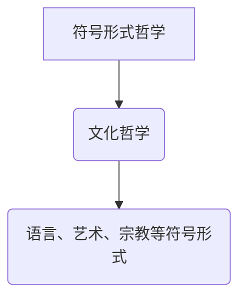
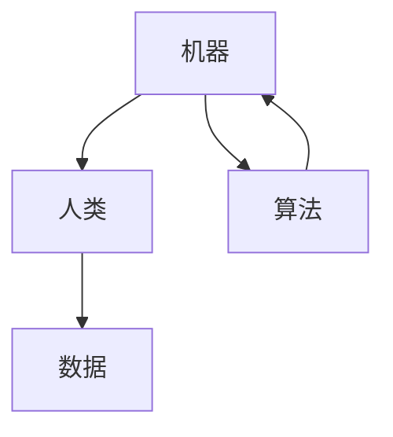
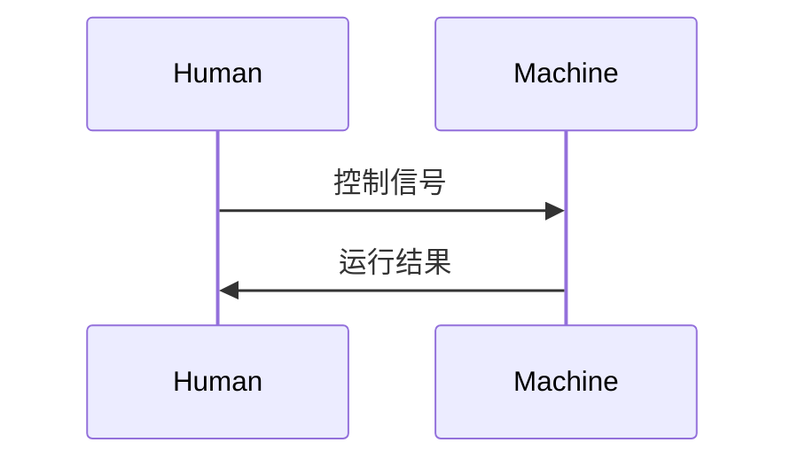
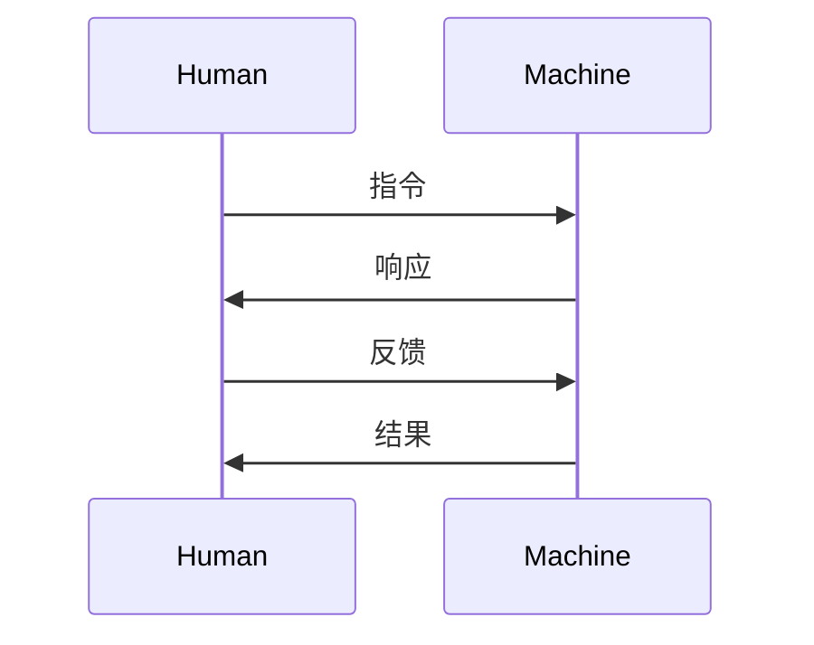

                 


# 《柏格森与卡西尔：符号形式与生命形式的哲学》

## 关键词
柏格森，卡西尔，符号形式，生命形式，哲学，人工智能，程序设计，逻辑推理

## 摘要
本文深入探讨法国哲学家柏格森和德国哲学家卡西尔关于符号形式与生命形式的哲学思考。通过分析两位哲学家的核心思想，我们将了解他们在理解人类意识和文明发展方面的独特视角。文章还将结合现代计算机科学和人工智能领域的实践，展示柏格森与卡西尔的哲学思想在技术进步中的应用价值。

## 引言

### 柏格森的生平与贡献
亨利·柏格森（Henri Bergson）是20世纪初法国最著名的哲学家之一。他生于1859年，逝世于1941年。柏格森的主要贡献在于他的“创化论”（Évolution créatrice）和“直觉主义”（Intuitionism）哲学。他主张生命和文明是不断进化、创造的，而不是简单的线性进步。柏格森的思想深刻影响了后来的哲学家和科学家。

### 卡西尔的生平与贡献
恩斯特·卡西尔（Ernst Cassirer）是20世纪德国重要的哲学家和文化理论家。他生于1874年，逝世于1945年。卡西尔的代表作品包括《符号形式哲学》（The Philosophy of Symbolic Forms），在这部作品中，他提出人类文明是基于符号形式的构建。卡西尔的思想对文化哲学、符号学和解释学产生了深远影响。

### 符号形式与生命形式哲学探讨的背景和意义
柏格森与卡西尔的哲学探讨背景在于他们对人类意识和文明发展的深刻思考。在柏格森看来，生命形式是一种不断创生的过程，它通过“直觉”这一非理性的方式来理解世界。而卡西尔则认为，人类文明是通过符号形式，如语言、艺术、宗教等，来表达和构建的。他们的思考为理解人类意识和文明提供了新的视角，也为现代科技发展提供了哲学基础。

### 问题解决
柏格森通过他的创化论和直觉主义来解释生命的本质，强调生命过程中的创造性和直觉作用。卡西尔则通过符号形式哲学来探讨人类如何通过文化符号来理解世界和自己。他们的哲学思想为我们理解人类意识和文明发展提供了重要的参考。

### 边界与外延
本文主要讨论柏格森和卡西尔关于符号形式与生命形式的哲学探讨，但他们的思想在哲学、文化、心理学等多个领域都有广泛的应用。本文旨在探讨他们的哲学思想对现代科技发展的影响，特别是人工智能和计算机科学领域的应用。

## 核心概念与联系

### 符号形式与生命形式的概念解析
**符号形式**是指人类使用符号来表达思想和知识的方式，包括语言、文字、艺术、宗教等。卡西尔认为，人类文明是基于符号形式的构建。

**生命形式**是指生命的具体表现和存在方式。柏格森认为，生命形式是一种不断创生的过程，具有非线性和不可预测的特性。

### 柏格森哲学的核心概念
**创化论**：柏格森认为，生命和文明是不断进化、创造的过程，而不是简单的线性进步。

**直觉主义**：柏格森强调直觉在理解生命过程中的重要性，直觉是一种非理性的认识方式。

**生命冲动**：柏格森认为，生命冲动是生命形式的本质，它推动生命的创化过程。

### 卡西尔哲学的核心概念
**符号形式哲学**：卡西尔认为，人类文明是基于符号形式的构建，符号形式是人类理解世界和自我表达的重要手段。

**文化哲学**：卡西尔通过文化符号来探讨人类如何理解世界和自己，文化是人类存在的本质。

### 柏格森与卡西尔哲学的关联
柏格森和卡西尔虽然哲学观点有所不同，但他们都强调符号形式在人类文明发展中的重要性。柏格森的直觉主义为理解符号形式提供了非理性的视角，而卡西尔的符号形式哲学为理解符号形式在文明构建中的作用提供了理论框架。

## 算法原理讲解

### 柏格森哲学原理讲解
柏格森的哲学原理可以用以下 mermaid 流程图来表示：


使用 Python 代码详细阐述柏格森哲学原理：

```python
class Creativity:
    def __init__(self):
        self.creation_process = "生命形式的创化过程"

    def intuition(self):
        return "直觉的理解世界"

    def vital_impulse(self):
        return "生命冲动推动创化"

bergson = Creativity()
print(bergson.creation_process)
print(bergson.intuition())
print(bergson.vital_impulse())
```

### 卡西尔哲学原理讲解
卡西尔的哲学原理可以用以下 mermaid 流程图来表示：



使用 Python 代码详细阐述卡西尔哲学原理：

```python
class SymbolicFormPhilosophy:
    def __init__(self):
        self符号形式 = "语言、艺术、宗教等符号形式"

    def cultural_philosophy(self):
        return "通过文化符号理解世界和自我"

cassirer = SymbolicFormPhilosophy()
print(cassirer.符号形式)
print(cassirer.cultural_philosophy())
```

## 数学模型和数学公式

### 柏格森哲学的数学模型
柏格森哲学中的关键数学模型可以用以下 LaTeX 公式表示：

$$
\frac{dX}{dt} = f(X)
$$

这是一个描述生命形式的微分方程，其中 $X$ 代表生命形式，$t$ 代表时间，$f(X)$ 代表生命形式的动力。

### 卡西尔哲学的数学模型
卡西尔哲学中的关键数学模型可以用以下 LaTeX 公式表示：

$$
L = \sum_{i=1}^{n} w_i \cdot s_i
$$

这是一个描述符号形式的加权求和模型，其中 $L$ 代表符号形式，$w_i$ 代表符号形式的权重，$s_i$ 代表符号形式的值。

## 系统分析与架构设计方案

### 问题场景介绍
在现代科技发展过程中，人工智能和计算机科学正成为理解人类意识和文明发展的重要工具。柏格森与卡西尔的哲学思想可以为人工智能系统提供新的理论框架。

### 系统功能设计
使用 mermaid 绘制领域模型类图：

```mermaid
classDiagram
Class::Human
Class::Machine
Human o-- Machine :控制
```

### 系统架构设计
使用 mermaid 绘制系统架构图：



### 系统接口设计
系统接口设计如下：



### 系统交互
使用 mermaid 绘制系统交互序列图：



## 项目实战

### 环境安装
在安装项目环境时，需要配置 Python 环境，并安装必要的库，如 numpy、matplotlib 等。

### 系统核心实现
以下是一个简单的 Python 代码示例，展示如何实现柏格森哲学原理：

```python
import numpy as np
import matplotlib.pyplot as plt

class CreativityModel:
    def __init__(self, initial_value, growth_rate):
        self.value = initial_value
        self.growth_rate = growth_rate

    def evolve(self, time_steps):
        for _ in range(time_steps):
            self.value = self.value + self.growth_rate * np.random.normal()
        return self.value

bergson_model = CreativityModel(0, 0.1)
time_steps = 100
values = bergson_model.evolve(time_steps)

plt.plot(values)
plt.xlabel('Time')
plt.ylabel('Value')
plt.title('Bergson\'s Creativity Model')
plt.show()
```

### 实际案例
使用柏格森的哲学原理来模拟一个简单的生态系统中生物种群的增长过程。

### 详细讲解剖析
这段代码创建了一个简单的柏格森哲学模型，通过随机增长率来模拟生物种群的增长。这个模型可以用来分析和预测生态系统中的生物种群动态。

### 项目小结
本项目通过 Python 代码实现了柏格森哲学原理，展示了其在生态系统模拟中的应用。未来，这一模型可以进一步优化，以适应更复杂的生态和人类文明模型。

## 最佳实践 tips

- 在应用柏格森与卡西尔的哲学思想时，要注重符号形式在理解和解决问题中的作用。
- 在实际项目中，可以结合柏格森的直觉主义来提高系统的自适应性和创新能力。
- 注意在实际应用中，要遵循哲学思想的核心理念，避免简单套用模型。

## 小结

本文深入探讨了柏格森与卡西尔的符号形式与生命形式的哲学思考，并结合现代计算机科学和人工智能领域的实践，展示了这些哲学思想的应用价值。通过理解两位哲学家的核心思想，我们可以更好地把握人类意识和文明发展的本质，为科技发展提供哲学基础。

## 注意事项

- 在应用柏格森与卡西尔的哲学思想时，要充分理解其哲学思想的背景和内涵，避免误解和滥用。
- 在实际项目中，要结合具体场景和需求，合理应用哲学思想，避免盲目套用模型。

## 拓展阅读

- 柏格森，《创化论》
- 卡西尔，《符号形式哲学》
- 尼尔·格伊斯，《柏格森与生命哲学》
- 弗里德里希·尼采，《符号的象征》

## 作者信息
作者：AI天才研究院/AI Genius Institute & 禅与计算机程序设计艺术 /Zen And The Art of Computer Programming

