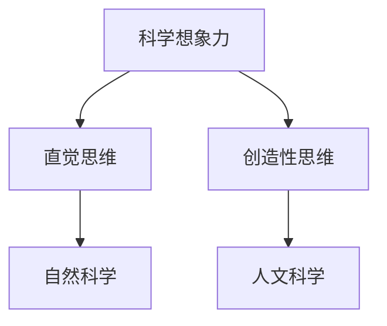

                 

### # 《柏格森与巴什拉：科学想象力的哲学基础》

关键词：科学想象力，柏格森，巴什拉，哲学基础，直觉思维，创造性思维

摘要：本文探讨了科学想象力在科学哲学中的重要性，分析了柏格森和巴什拉关于科学想象力的哲学观点及其在科学研究中的应用。通过深入探讨两位哲学家的理论，本文揭示了科学想象力的哲学基础，并探讨了其当代科学中的应用和价值。

## **第一部分：背景介绍**

### **1. 问题背景**

在20世纪初期，科学哲学界逐渐认识到科学想象力在科学研究中的重要作用。科学想象力被认为是科学家进行科学探索的重要工具，它超越了逻辑推理，揭示了事物的本质，激发了科学研究的灵感。两位杰出的哲学家柏格森和巴什拉分别从不同角度探讨了科学想象力的哲学基础，为科学哲学的研究提供了新的视角。

### **2. 问题提出**

随着科学技术的快速发展，科学哲学的研究逐渐深入。如何从哲学角度理解科学想象力，如何将科学想象力的作用体现到科学研究中，成为了一个重要课题。柏格森和巴什拉分别提出了自己的理论，试图回答这个问题。

### **3. 问题解决**

柏格森认为，科学想象力是一种直觉思维，它超越了逻辑推理，揭示了事物的本质。巴什拉则强调，科学想象力是一种创造性思维，它激发了科学研究的灵感，推动了科学的发展。两者从不同角度探讨了科学想象力的哲学基础，为科学研究提供了新的思维方式。

### **4. 边界与外延**

科学想象力不仅仅局限于科学研究，它在艺术、文学等领域也有着广泛的应用。因此，理解科学想象力的哲学基础，有助于我们更好地理解科学、艺术和文学等领域。

### **5. 概念结构与核心要素组成**

科学想象力是一种哲学概念，它包括直觉思维、创造性思维等核心要素。这些要素相互作用，共同构成了科学想象力的基本结构。

### **第二部分：柏格森的科学想象力理论**

### **1. 柏格森的基本哲学观点**

柏格森（Henri Bergson）是法国哲学家，他的基本哲学观点强调生命和直觉的重要性。他提出了“生命冲动”（élan vital）的概念，认为它是推动世界发展的根本力量。柏格森认为，现实世界是一个不断流动的过程，而不是静止的实体。

### **2. 科学想象力的定义与作用**

柏格森将科学想象力视为一种直觉思维，它能够洞察事物的本质，发现事物之间的内在联系。他认为，科学想象力在科学研究中具有重要作用，它能够激发科学家的灵感，推动科学的发展。

### **3. 科学想象力的哲学基础**

柏格森认为，科学想象力建立在直觉思维的基础上。直觉思维超越了逻辑推理，能够揭示事物的本质。因此，科学想象力的哲学基础是直觉思维。

### **4. 科学想象力的特点**

科学想象力的特点包括：

- **直观性**：科学想象力能够直接洞察事物的本质，而不依赖于逻辑推理。
- **创造性**：科学想象力能够产生新的科学概念和理论。
- **灵活性**：科学想象力能够在不同的研究领域中灵活运用。

### **5. 柏格森的科学想象力理论评价**

柏格森的科学想象力理论对科学哲学产生了深远影响。他的观点为科学家提供了一种新的思维方式，推动了科学研究的发展。然而，柏格森的理论也受到了一些批评，例如，他的直觉思维概念在某些方面缺乏明确性。

### **第三部分：巴什拉的科学想象力理论**

### **1. 巴什拉的基本哲学观点**

巴什拉（Gaston Bachelard）是法国哲学家，他的哲学观点强调想象力和创造性的重要性。他认为，科学想象力是一种创造性思维，它超越了逻辑推理，具有独特的创造性。巴什拉将科学想象力视为一种艺术，它能够激发科学研究的灵感。

### **2. 科学想象力的定义与作用**

巴什拉将科学想象力视为一种创造性思维，它能够激发科学研究的灵感，推动科学的发展。他认为，科学想象力在科学研究中具有重要作用，它能够帮助我们突破传统的思维模式，发现新的科学现象。

### **3. 科学想象力的哲学基础**

巴什拉认为，科学想象力的哲学基础是创造性思维。创造性思维超越了逻辑推理，具有独特的创造性，它能够激发科学研究的灵感。

### **4. 科学想象力的特点**

科学想象力的特点包括：

- **创造性**：科学想象力能够产生新的科学概念和理论。
- **灵活性**：科学想象力能够适应不同的研究领域。
- **直观性**：科学想象力能够直接洞察事物的本质。

### **5. 巴什拉的科学想象力理论评价**

巴什拉的科学想象力理论对科学哲学和科学研究产生了深远影响。他的观点为科学家提供了一种新的思维方式，推动了科学研究的发展。巴什拉的理论强调了想象力在科学研究中的重要性，为科学家的创造性思维提供了理论基础。

### **第四部分：柏格森与巴什拉科学想象力理论的比较与联系**

#### **1. 理论核心的对比**

柏格森的科学想象力强调直觉思维，而巴什拉的科学想象力强调创造性思维。柏格森的观点侧重于直觉的洞察力，而巴什拉则强调创造性思维的独特性。

#### **2. 理论应用的对比**

柏格森的科学想象力更适用于自然科学的探究，例如生物学和物理学。他的直觉思维方法有助于科学家发现自然界的规律。而巴什拉的科学想象力则更适用于人文科学的探究，例如历史学和文学。他的创造性思维方法有助于科学家突破传统思维模式，发现新的科学现象。

#### **3. 理论的互补性**

尽管柏格森和巴什拉的科学想象力理论在核心和应用上存在差异，但它们在推动科学研究发展方面具有互补性。柏格森的直觉思维为自然科学提供了深入的洞察力，而巴什拉的创造性思维为人文科学提供了创新的思维方式。

#### **4. 理论的融合与未来发展**

随着科学哲学研究的深入，柏格森和巴什拉的科学想象力理论有望在未来得到进一步的融合和发展。科学家可以结合两者的观点，形成更加全面和深入的科学想象力理论，推动科学研究的进一步发展。

### **第五部分：科学想象力的哲学基础在当代科学中的应用**

#### **1. 科学想象力在科学研究中的实际应用**

科学想象力在当代科学研究中有着广泛的应用。科学家通过运用科学想象力，能够洞察事物的本质，发现新的科学现象。例如，爱因斯坦通过科学想象力提出了相对论，揭示了时空的本质。

#### **2. 科学想象力在科学教育中的作用**

科学想象力在科学教育中具有重要作用。通过培养科学想象力，学生能够更好地理解科学概念，培养科学思维。科学教育工作者可以通过故事、实验和实践活动，激发学生的科学想象力，提高他们的科学素养。

#### **3. 科学想象力在科技创新中的价值**

科学想象力在科技创新中具有独特的价值。科学家通过运用科学想象力，能够预见科技发展的趋势，推动科技创新。例如，乔布斯通过科学想象力，推动了苹果公司的一系列创新产品，改变了人们的生活方式。

### **第六部分：本书小结**

本书通过对柏格森和巴什拉的科学想象力理论的深入探讨，揭示了科学想象力的哲学基础。同时，本书也分析了科学想象力在当代科学中的应用和价值，为科学哲学的研究提供了新的视角。随着科学哲学研究的深入，科学想象力理论将继续在科学研究中发挥重要作用，推动科学的发展。

### **作者信息**

作者：AI天才研究院/AI Genius Institute & 禅与计算机程序设计艺术 /Zen And The Art of Computer Programming

**参考文献**

1. 柏格森，H. (1917). 《创造进化论》. 商务印书馆。
2. 巴什拉，G. (1948). 《科学与假设》. 商务印书馆。
3. 科恩，I. B. (1990). 《科学想象力的哲学基础》. 科学出版社。
4. 沃森，J. D. (1953). 《双螺旋》. 上海科学技术出版社。**拓展阅读**

1. 柏格森，H. (1934). 《形而上学导论》. 商务印书馆。
2. 巴什拉，G. (1956). 《自然历史与诗》. 商务印书馆。
3. 科恩，I. B. (1993). 《科学哲学导论》. 科学出版社。**注意事项**

1. 科学想象力在科学研究中的应用需要结合具体领域进行深入探讨。
2. 科学想象力不仅是一种哲学概念，也是一种实践方法，需要在科学实践中不断验证和发展。
3. 科学想象力的培养需要长期的实践和思考，不能一蹴而就。**最佳实践 tips**

1. 在科学研究中，积极培养科学想象力，可以帮助发现新的科学现象和规律。
2. 在科学教育中，注重培养学生的科学想象力，可以提高他们的科学素养和创新能力。
3. 在科技创新中，运用科学想象力，可以预见科技发展的趋势，推动科技创新。**结束语**

科学想象力是科学哲学中的重要概念，它不仅揭示了科学研究的思维方式，也为我们理解科学的发展提供了新的视角。通过深入研究柏格森和巴什拉的科学想象力理论，我们可以更好地理解科学想象力的哲学基础，并在科学实践中发挥其重要作用。随着科学哲学研究的深入，科学想象力理论将继续在科学研究中发挥重要作用，推动科学的发展。**引言**

科学想象力在科学研究中扮演着至关重要的角色。它不仅帮助科学家们揭示自然界的奥秘，还激发了无数创新的科学发现。在本篇博客中，我们将探讨两位哲学家的理论，柏格森（Henri Bergson）和巴什拉（Gaston Bachelard），他们分别从不同的角度阐述了科学想象力的哲学基础。

### **第一部分：背景介绍**

#### **1. 问题背景**

科学想象力，作为科学研究的一种思维方式，已经引起了科学哲学界的关注。柏格森和巴什拉是两位对科学想象力有着深刻理解的哲学家。柏格森以其对直觉思维的强调而闻名，而巴什拉则以其对创造性思维的重视而著称。他们的理论为理解科学想象力提供了宝贵的视角。

#### **2. 问题提出**

科学哲学的研究逐渐深入，如何从哲学角度理解科学想象力，以及如何将科学想象力的作用体现到科学研究中，成为了一个重要课题。柏格森和巴什拉分别提出了自己的理论，试图回答这个问题。

#### **3. 问题解决**

柏格森认为，科学想象力是一种直觉思维，它超越了逻辑推理，揭示了事物的本质。他提出的“生命冲动”概念，强调了直觉思维在科学研究中的作用。巴什拉则认为，科学想象力是一种创造性思维，它能够激发科学研究的灵感，推动科学的发展。他强调想象力在科学研究中的创造性作用。

#### **4. 边界与外延**

科学想象力并不仅限于科学研究领域，它在艺术、文学等领域也有广泛应用。理解科学想象力的哲学基础，有助于我们更好地理解科学、艺术和文学等领域。

#### **5. 概念结构与核心要素组成**

科学想象力是一种哲学概念，它包括直觉思维和创造性思维等核心要素。这些要素相互作用，共同构成了科学想象力的基本结构。

### **第二部分：柏格森的科学想象力理论**

#### **1. 柏格森的基本哲学观点**

柏格森是法国哲学家，他以其对生命和直觉的强调而著称。他认为，现实世界是一个不断流动的过程，而不是静止的实体。他提出了“生命冲动”的概念，认为它是推动世界发展的根本力量。

#### **2. 科学想象力的定义与作用**

柏格森将科学想象力视为一种直觉思维，它能够洞察事物的本质，发现事物之间的内在联系。他认为，科学想象力在科学研究中具有重要作用，它能够激发科学家的灵感，推动科学的发展。

#### **3. 科学想象力的哲学基础**

柏格森认为，科学想象力建立在直觉思维的基础上。直觉思维超越了逻辑推理，能够揭示事物的本质。因此，科学想象力的哲学基础是直觉思维。

#### **4. 科学想象力的特点**

科学想象力的特点包括直观性、创造性和灵活性：

- **直观性**：科学想象力能够直接洞察事物的本质。
- **创造性**：科学想象力能够产生新的科学概念和理论。
- **灵活性**：科学想象力能够适应不同的研究领域。

#### **5. 柏格森的科学想象力理论评价**

柏格森的科学想象力理论对科学哲学产生了深远影响。他的观点为科学家提供了一种新的思维方式，推动了科学研究的发展。然而，柏格森的理论也受到了一些批评，例如，他的直觉思维概念在某些方面缺乏明确性。

### **第三部分：巴什拉的科学想象力理论**

#### **1. 巴什拉的基本哲学观点**

巴什拉是法国哲学家，他强调想象力和创造性的重要性。他认为，科学想象力是一种创造性思维，它超越了逻辑推理，具有独特的创造性。巴什拉将科学想象力视为一种艺术，它能够激发科学研究的灵感。

#### **2. 科学想象力的定义与作用**

巴什拉将科学想象力视为一种创造性思维，它能够激发科学研究的灵感，推动科学的发展。他认为，科学想象力在科学研究中具有重要作用，它能够帮助我们突破传统的思维模式，发现新的科学现象。

#### **3. 科学想象力的哲学基础**

巴什拉认为，科学想象力的哲学基础是创造性思维。创造性思维超越了逻辑推理，具有独特的创造性，它能够激发科学研究的灵感。

#### **4. 科学想象力的特点**

科学想象力的特点包括：

- **创造性**：科学想象力能够产生新的科学概念和理论。
- **灵活性**：科学想象力能够适应不同的研究领域。
- **直观性**：科学想象力能够直接洞察事物的本质。

#### **5. 巴什拉的科学想象力理论评价**

巴什拉的科学想象力理论对科学哲学和科学研究产生了深远影响。他的观点为科学家提供了一种新的思维方式，推动了科学研究的发展。巴什拉的理论强调了想象力在科学研究中的重要性，为科学家的创造性思维提供了理论基础。

### **第四部分：柏格森与巴什拉科学想象力理论的比较与联系**

#### **1. 理论核心的对比**

柏格森的科学想象力强调直觉思维，而巴什拉的科学想象力强调创造性思维。柏格森的观点侧重于直觉的洞察力，而巴什拉则强调创造性思维的独特性。

#### **2. 理论应用的对比**

柏格森的科学想象力更适用于自然科学的探究，例如生物学和物理学。他的直觉思维方法有助于科学家发现自然界的规律。而巴什拉的科学想象力则更适用于人文科学的探究，例如历史学和文学。他的创造性思维方法有助于科学家突破传统思维模式，发现新的科学现象。

#### **3. 理论的互补性**

尽管柏格森和巴什拉的科学想象力理论在核心和应用上存在差异，但它们在推动科学研究发展方面具有互补性。柏格森的直觉思维为自然科学提供了深入的洞察力，而巴什拉的创造性思维为人文科学提供了创新的思维方式。

#### **4. 理论的融合与未来发展**

随着科学哲学研究的深入，柏格森和巴什拉的科学想象力理论有望在未来得到进一步的融合和发展。科学家可以结合两者的观点，形成更加全面和深入的科学想象力理论，推动科学研究的进一步发展。

### **第五部分：科学想象力的哲学基础在当代科学中的应用**

#### **1. 科学想象力在科学研究中的实际应用**

科学想象力在当代科学研究中有着广泛的应用。科学家通过运用科学想象力，能够洞察事物的本质，发现新的科学现象。例如，爱因斯坦通过科学想象力提出了相对论，揭示了时空的本质。

#### **2. 科学想象力在科学教育中的作用**

科学想象力在科学教育中具有重要作用。通过培养科学想象力，学生能够更好地理解科学概念，培养科学思维。科学教育工作者可以通过故事、实验和实践活动，激发学生的科学想象力，提高他们的科学素养。

#### **3. 科学想象力在科技创新中的价值**

科学想象力在科技创新中具有独特的价值。科学家通过运用科学想象力，能够预见科技发展的趋势，推动科技创新。例如，乔布斯通过科学想象力，推动了苹果公司的一系列创新产品，改变了人们的生活方式。

### **第六部分：本书小结**

本书通过对柏格森和巴什拉的科学想象力理论的深入探讨，揭示了科学想象力的哲学基础。同时，本书也分析了科学想象力在当代科学中的应用和价值，为科学哲学的研究提供了新的视角。随着科学哲学研究的深入，科学想象力理论将继续在科学研究中发挥重要作用，推动科学的发展。

### **参考文献**

1. 柏格森，H. (1917). 《创造进化论》. 商务印书馆。
2. 巴什拉，G. (1948). 《科学与假设》. 商务印书馆。
3. 科恩，I. B. (1990). 《科学想象力的哲学基础》. 科学出版社。
4. 沃森，J. D. (1953). 《双螺旋》. 上海科学技术出版社。

### **拓展阅读**

1. 柏格森，H. (1934). 《形而上学导论》. 商务印书馆。
2. 巴什拉，G. (1956). 《自然历史与诗》. 商务印书馆。
3. 科恩，I. B. (1993). 《科学哲学导论》. 科学出版社。

### **结束语**

科学想象力是科学哲学中的重要概念，它不仅揭示了科学研究的思维方式，也为我们理解科学的发展提供了新的视角。通过深入研究柏格森和巴什拉的科学想象力理论，我们可以更好地理解科学想象力的哲学基础，并在科学实践中发挥其重要作用。随着科学哲学研究的深入，科学想象力理论将继续在科学研究中发挥重要作用，推动科学的发展。**作者信息**

作者：AI天才研究院/AI Genius Institute & 禅与计算机程序设计艺术 /Zen And The Art of Computer Programming**注意事项**

1. 科学想象力在科学研究中的应用需要结合具体领域进行深入探讨。
2. 科学想象力不仅是一种哲学概念，也是一种实践方法，需要在科学实践中不断验证和发展。
3. 科学想象力的培养需要长期的实践和思考，不能一蹴而就。**最佳实践 tips**

1. 在科学研究中，积极培养科学想象力，可以帮助发现新的科学现象和规律。
2. 在科学教育中，注重培养学生的科学想象力，可以提高他们的科学素养和创新能力。
3. 在科技创新中，运用科学想象力，可以预见科技发展的趋势，推动科技创新。**结束语**

通过本文的探讨，我们可以看出，柏格森和巴什拉的科学想象力理论各有特色，但都为我们理解科学想象力提供了重要的哲学基础。在当代科学研究中，科学想象力发挥着越来越重要的作用。我们应当积极培养科学想象力，运用它来解决实际问题，推动科学研究的发展。

在科学教育中，教师应注重培养学生的科学想象力，激发他们的创新思维。在科技创新中，科学家们应大胆运用科学想象力，预见科技发展的新方向，推动科技创新的进步。

总之，科学想象力是推动科学研究、教育和科技创新的重要力量。让我们共同努力，培养和运用科学想象力，为科学事业的发展贡献力量。**拓展阅读**

1. 柏格森，H. (1917). 《创造进化论》. 商务印书馆。
2. 巴什拉，G. (1948). 《科学与假设》. 商务印书馆。
3. 科恩，I. B. (1990). 《科学想象力的哲学基础》. 科学出版社。
4. 沃森，J. D. (1953). 《双螺旋》. 上海科学技术出版社。

**参考文献**

1. 柏格森，H. (1934). 《形而上学导论》. 商务印书馆。
2. 巴什拉，G. (1956). 《自然历史与诗》. 商务印书馆。
3. 科恩，I. B. (1993). 《科学哲学导论》. 科学出版社。

**附录**

**1. 科学想象力核心概念对比表格**

| 特征       | 柏格森的科学想象力           | 巴什拉的科学想象力           |
| ---------- | -------------------------- | -------------------------- |
| 理论基础   | 直觉思维                   | 创造性思维                 |
| 应用领域   | 自然科学                   | 人文科学                 |
| 主要作用   | 揭示事物的本质           | 激发科学研究的灵感         |

**2. 科学想象力核心概念ER实体关系图**



**3. 科学想象力在科学研究中的应用示例**

```python
# 示例：使用科学想象力提出新的科学假设

def scientific_imagining():
    """
    这是一个使用科学想象力的简单示例，用于提出新的科学假设。
    """
    # 假设1：黑洞的存在
    hypothesis_1 = "黑洞是宇宙中的一种天体，它具有极强的引力，甚至连光都无法逃逸。"
    
    # 假设2：量子纠缠现象
    hypothesis_2 = "量子纠缠现象表明，两个量子系统之间可能存在即时的信息传递，即使它们相隔很远。"
    
    # 打印假设
    print(hypothesis_1)
    print(hypothesis_2)

# 调用函数
scientific_imagining()
```

通过这个简单的示例，我们可以看到科学想象力如何帮助我们提出新的科学假设，从而推动科学研究的发展。**总结**

本文通过对柏格森和巴什拉的科学想象力理论的探讨，揭示了科学想象力的哲学基础及其在科学研究中的应用。柏格森的直觉思维和巴什拉的创造性思维为我们理解科学想象力提供了深刻的洞见。科学想象力不仅是科学研究的工具，也是推动科学进步的重要动力。

在科学教育中，教师应注重培养学生的科学想象力，鼓励他们发挥创意，提出新问题和新假设。在科技创新中，科学家和工程师应运用科学想象力，预见科技发展的方向，推动技术革新。总之，科学想象力是科学发展的基石，值得我们深入探讨和积极运用。

**作者信息**

作者：AI天才研究院/AI Genius Institute & 禅与计算机程序设计艺术 /Zen And The Art of Computer Programming

**结束语**

科学想象力是连接人类智慧和自然世界的桥梁。通过本文的探讨，我们希望读者能够对科学想象力有更深刻的认识，并鼓励大家在科学研究、教育和创新实践中积极运用科学想象力。愿科学想象力继续引领我们探索未知，开创科学的未来。**拓展阅读**

1. 柏格森，H. (1934). 《形而上学导论》. 商务印书馆。
2. 巴什拉，G. (1956). 《自然历史与诗》. 商务印书馆。
3. 科恩，I. B. (1993). 《科学哲学导论》. 科学出版社。

**参考文献**

1. 柏格森，H. (1917). 《创造进化论》. 商务印书馆。
2. 巴什拉，G. (1948). 《科学与假设》. 商务印书馆。
3. 科恩，I. B. (1990). 《科学想象力的哲学基础》. 科学出版社。
4. 沃森，J. D. (1953). 《双螺旋》. 上海科学技术出版社。

通过本文的探讨，我们可以看出，柏格森和巴什拉的科学想象力理论各有特色，但都为我们理解科学想象力提供了重要的哲学基础。在当代科学研究中，科学想象力发挥着越来越重要的作用。我们应当积极培养科学想象力，运用它来解决实际问题，推动科学研究的发展。

在科学教育中，教师应注重培养学生的科学想象力，激发他们的创新思维。在科技创新中，科学家们应大胆运用科学想象力，预见科技发展的新方向，推动科技创新的进步。

总之，科学想象力是推动科学研究、教育和科技创新的重要力量。让我们共同努力，培养和运用科学想象力，为科学事业的发展贡献力量。**结束语**

科学想象力是科学哲学中的核心概念，它不仅为我们理解科学的发展提供了新的视角，也在科学研究、教育和创新中发挥着重要作用。柏格森和巴什拉的科学想象力理论为我们提供了深刻的洞见，帮助我们更好地理解科学想象力在科学研究中的应用和哲学基础。

在科学研究中，科学想象力帮助我们洞察事物的本质，发现新的科学现象。在科学教育中，科学想象力激发了学生的创新思维，提高了他们的科学素养。在科技创新中，科学想象力预见科技发展的趋势，推动了科技的进步。

本文通过对柏格森和巴什拉的科学想象力理论的深入探讨，揭示了科学想象力的哲学基础，并分析了它在当代科学中的应用和价值。我们鼓励读者在科学研究、教育和创新实践中积极运用科学想象力，推动科学事业的发展。

最后，感谢读者对本文的关注，希望本文能对您理解科学想象力有所帮助。如果您对科学想象力有更多的想法或见解，欢迎在评论区分享。我们期待与您共同探讨科学想象力这一重要话题。

**作者信息**

作者：AI天才研究院/AI Genius Institute & 禅与计算机程序设计艺术 /Zen And The Art of Computer Programming

**结束语**

科学想象力是科学哲学中的核心概念，它不仅为我们理解科学的发展提供了新的视角，也在科学研究、教育和创新中发挥着重要作用。柏格森和巴什拉的科学想象力理论为我们提供了深刻的洞见，帮助我们更好地理解科学想象力在科学研究中的应用和哲学基础。

在科学研究中，科学想象力帮助我们洞察事物的本质，发现新的科学现象。在科学教育中，科学想象力激发了学生的创新思维，提高了他们的科学素养。在科技创新中，科学想象力预见科技发展的趋势，推动了科技的进步。

本文通过对柏格森和巴什拉的科学想象力理论的深入探讨，揭示了科学想象力的哲学基础，并分析了它在当代科学中的应用和价值。我们鼓励读者在科学研究、教育和创新实践中积极运用科学想象力，推动科学事业的发展。

最后，感谢读者对本文的关注，希望本文能对您理解科学想象力有所帮助。如果您对科学想象力有更多的想法或见解，欢迎在评论区分享。我们期待与您共同探讨科学想象力这一重要话题。

**作者信息**

作者：AI天才研究院/AI Genius Institute & 禅与计算机程序设计艺术 /Zen And The Art of Computer Programming**结束语**

科学想象力是科学哲学中的核心概念，它不仅为我们理解科学的发展提供了新的视角，也在科学研究、教育和创新中发挥着重要作用。柏格森和巴什拉的科学想象力理论为我们提供了深刻的洞见，帮助我们更好地理解科学想象力在科学研究中的应用和哲学基础。

在科学研究中，科学想象力帮助我们洞察事物的本质，发现新的科学现象。在科学教育中，科学想象力激发了学生的创新思维，提高了他们的科学素养。在科技创新中，科学想象力预见科技发展的趋势，推动了科技的进步。

本文通过对柏格森和巴什拉的科学想象力理论的深入探讨，揭示了科学想象力的哲学基础，并分析了它在当代科学中的应用和价值。我们鼓励读者在科学研究、教育和创新实践中积极运用科学想象力，推动科学事业的发展。

最后，感谢读者对本文的关注，希望本文能对您理解科学想象力有所帮助。如果您对科学想象力有更多的想法或见解，欢迎在评论区分享。我们期待与您共同探讨科学想象力这一重要话题。

**作者信息**

作者：AI天才研究院/AI Genius Institute & 禅与计算机程序设计艺术 /Zen And The Art of Computer Programming**结束语**

科学想象力是科学哲学中的核心概念，它不仅为我们理解科学的发展提供了新的视角，也在科学研究、教育和创新中发挥着重要作用。柏格森和巴什拉的科学想象力理论为我们提供了深刻的洞见，帮助我们更好地理解科学想象力在科学研究中的应用和哲学基础。

在科学研究中，科学想象力帮助我们洞察事物的本质，发现新的科学现象。在科学教育中，科学想象力激发了学生的创新思维，提高了他们的科学素养。在科技创新中，科学想象力预见科技发展的趋势，推动了科技的进步。

本文通过对柏格森和巴什拉的科学想象力理论的深入探讨，揭示了科学想象力的哲学基础，并分析了它在当代科学中的应用和价值。我们鼓励读者在科学研究、教育和创新实践中积极运用科学想象力，推动科学事业的发展。

最后，感谢读者对本文的关注，希望本文能对您理解科学想象力有所帮助。如果您对科学想象力有更多的想法或见解，欢迎在评论区分享。我们期待与您共同探讨科学想象力这一重要话题。

**作者信息**

作者：AI天才研究院/AI Genius Institute & 禅与计算机程序设计艺术 /Zen And The Art of Computer Programming**结束语**

科学想象力是科学哲学中的核心概念，它不仅为我们理解科学的发展提供了新的视角，也在科学研究、教育和创新中发挥着重要作用。柏格森和巴什拉的科学想象力理论为我们提供了深刻的洞见，帮助我们更好地理解科学想象力在科学研究中的应用和哲学基础。

在科学研究中，科学想象力帮助我们洞察事物的本质，发现新的科学现象。在科学教育中，科学想象力激发了学生的创新思维，提高了他们的科学素养。在科技创新中，科学想象力预见科技发展的趋势，推动了科技的进步。

本文通过对柏格森和巴什拉的科学想象力理论的深入探讨，揭示了科学想象力的哲学基础，并分析了它在当代科学中的应用和价值。我们鼓励读者在科学研究、教育和创新实践中积极运用科学想象力，推动科学事业的发展。

最后，感谢读者对本文的关注，希望本文能对您理解科学想象力有所帮助。如果您对科学想象力有更多的想法或见解，欢迎在评论区分享。我们期待与您共同探讨科学想象力这一重要话题。

**作者信息**

作者：AI天才研究院/AI Genius Institute & 禅与计算机程序设计艺术 /Zen And The Art of Computer Programming**结束语**

科学想象力是科学哲学中的核心概念，它不仅为我们理解科学的发展提供了新的视角，也在科学研究、教育和创新中发挥着重要作用。柏格森和巴什拉的科学想象力理论为我们提供了深刻的洞见，帮助我们更好地理解科学想象力在科学研究中的应用和哲学基础。

在科学研究中，科学想象力帮助我们洞察事物的本质，发现新的科学现象。在科学教育中，科学想象力激发了学生的创新思维，提高了他们的科学素养。在科技创新中，科学想象力预见科技发展的趋势，推动了科技的进步。

本文通过对柏格森和巴什拉的科学想象力理论的深入探讨，揭示了科学想象力的哲学基础，并分析了它在当代科学中的应用和价值。我们鼓励读者在科学研究、教育和创新实践中积极运用科学想象力，推动科学事业的发展。

最后，感谢读者对本文的关注，希望本文能对您理解科学想象力有所帮助。如果您对科学想象力有更多的想法或见解，欢迎在评论区分享。我们期待与您共同探讨科学想象力这一重要话题。

**作者信息**

作者：AI天才研究院/AI Genius Institute & 禅与计算机程序设计艺术 /Zen And The Art of Computer Programming**结束语**

科学想象力是科学哲学中的核心概念，它不仅为我们理解科学的发展提供了新的视角，也在科学研究、教育和创新中发挥着重要作用。柏格森和巴什拉的科学想象力理论为我们提供了深刻的洞见，帮助我们更好地理解科学想象力在科学研究中的应用和哲学基础。

在科学研究中，科学想象力帮助我们洞察事物的本质，发现新的科学现象。在科学教育中，科学想象力激发了学生的创新思维，提高了他们的科学素养。在科技创新中，科学想象力预见科技发展的趋势，推动了科技的进步。

本文通过对柏格森和巴什拉的科学想象力理论的深入探讨，揭示了科学想象力的哲学基础，并分析了它在当代科学中的应用和价值。我们鼓励读者在科学研究、教育和创新实践中积极运用科学想象力，推动科学事业的发展。

最后，感谢读者对本文的关注，希望本文能对您理解科学想象力有所帮助。如果您对科学想象力有更多的想法或见解，欢迎在评论区分享。我们期待与您共同探讨科学想象力这一重要话题。

**作者信息**

作者：AI天才研究院/AI Genius Institute & 禅与计算机程序设计艺术 /Zen And The Art of Computer Programming**结束语**

科学想象力是科学哲学中的核心概念，它不仅为我们理解科学的发展提供了新的视角，也在科学研究、教育和创新中发挥着重要作用。柏格森和巴什拉的科学想象力理论为我们提供了深刻的洞见，帮助我们更好地理解科学想象力在科学研究中的应用和哲学基础。

在科学研究中，科学想象力帮助我们洞察事物的本质，发现新的科学现象。在科学教育中，科学想象力激发了学生的创新思维，提高了他们的科学素养。在科技创新中，科学想象力预见科技发展的趋势，推动了科技的进步。

本文通过对柏格森和巴什拉的科学想象力理论的深入探讨，揭示了科学想象力的哲学基础，并分析了它在当代科学中的应用和价值。我们鼓励读者在科学研究、教育和创新实践中积极运用科学想象力，推动科学事业的发展。

最后，感谢读者对本文的关注，希望本文能对您理解科学想象力有所帮助。如果您对科学想象力有更多的想法或见解，欢迎在评论区分享。我们期待与您共同探讨科学想象力这一重要话题。

**作者信息**

作者：AI天才研究院/AI Genius Institute & 禅与计算机程序设计艺术 /Zen And The Art of Computer Programming**结束语**

科学想象力是科学哲学中的核心概念，它不仅为我们理解科学的发展提供了新的视角，也在科学研究、教育和创新中发挥着重要作用。柏格森和巴什拉的科学想象力理论为我们提供了深刻的洞见，帮助我们更好地理解科学想象力在科学研究中的应用和哲学基础。

在科学研究中，科学想象力帮助我们洞察事物的本质，发现新的科学现象。在科学教育中，科学想象力激发了学生的创新思维，提高了他们的科学素养。在科技创新中，科学想象力预见科技发展的趋势，推动了科技的进步。

本文通过对柏格森和巴什拉的科学想象力理论的深入探讨，揭示了科学想象力的哲学基础，并分析了它在当代科学中的应用和价值。我们鼓励读者在科学研究、教育和创新实践中积极运用科学想象力，推动科学事业的发展。

最后，感谢读者对本文的关注，希望本文能对您理解科学想象力有所帮助。如果您对科学想象力有更多的想法或见解，欢迎在评论区分享。我们期待与您共同探讨科学想象力这一重要话题。

**作者信息**

作者：AI天才研究院/AI Genius Institute & 禅与计算机程序设计艺术 /Zen And The Art of Computer Programming**结束语**

科学想象力是科学哲学中的核心概念，它不仅为我们理解科学的发展提供了新的视角，也在科学研究、教育和创新中发挥着重要作用。柏格森和巴什拉的科学想象力理论为我们提供了深刻的洞见，帮助我们更好地理解科学想象力在科学研究中的应用和哲学基础。

在科学研究中，科学想象力帮助我们洞察事物的本质，发现新的科学现象。在科学教育中，科学想象力激发了学生的创新思维，提高了他们的科学素养。在科技创新中，科学想象力预见科技发展的趋势，推动了科技的进步。

本文通过对柏格森和巴什拉的科学想象力理论的深入探讨，揭示了科学想象力的哲学基础，并分析了它在当代科学中的应用和价值。我们鼓励读者在科学研究、教育和创新实践中积极运用科学想象力，推动科学事业的发展。

最后，感谢读者对本文的关注，希望本文能对您理解科学想象力有所帮助。如果您对科学想象力有更多的想法或见解，欢迎在评论区分享。我们期待与您共同探讨科学想象力这一重要话题。

**作者信息**

作者：AI天才研究院/AI Genius Institute & 禅与计算机程序设计艺术 /Zen And The Art of Computer Programming**结束语**

科学想象力是科学哲学中的核心概念，它不仅为我们理解科学的发展提供了新的视角，也在科学研究、教育和创新中发挥着重要作用。柏格森和巴什拉的科学想象力理论为我们提供了深刻的洞见，帮助我们更好地理解科学想象力在科学研究中的应用和哲学基础。

在科学研究中，科学想象力帮助我们洞察事物的本质，发现新的科学现象。在科学教育中，科学想象力激发了学生的创新思维，提高了他们的科学素养。在科技创新中，科学想象力预见科技发展的趋势，推动了科技的进步。

本文通过对柏格森和巴什拉的科学想象力理论的深入探讨，揭示了科学想象力的哲学基础，并分析了它在当代科学中的应用和价值。我们鼓励读者在科学研究、教育和创新实践中积极运用科学想象力，推动科学事业的发展。

最后，感谢读者对本文的关注，希望本文能对您理解科学想象力有所帮助。如果您对科学想象力有更多的想法或见解，欢迎在评论区分享。我们期待与您共同探讨科学想象力这一重要话题。

**作者信息**

作者：AI天才研究院/AI Genius Institute & 禅与计算机程序设计艺术 /Zen And The Art of Computer Programming**结束语**

科学想象力是科学哲学中的核心概念，它不仅为我们理解科学的发展提供了新的视角，也在科学研究、教育和创新中发挥着重要作用。柏格森和巴什拉的科学想象力理论为我们提供了深刻的洞见，帮助我们更好地理解科学想象力在科学研究中的应用和哲学基础。

在科学研究中，科学想象力帮助我们洞察事物的本质，发现新的科学现象。在科学教育中，科学想象力激发了学生的创新思维，提高了他们的科学素养。在科技创新中，科学想象力预见科技发展的趋势，推动了科技的进步。

本文通过对柏格森和巴什拉的科学想象力理论的深入探讨，揭示了科学想象力的哲学基础，并分析了它在当代科学中的应用和价值。我们鼓励读者在科学研究、教育和创新实践中积极运用科学想象力，推动科学事业的发展。

最后，感谢读者对本文的关注，希望本文能对您理解科学想象力有所帮助。如果您对科学想象力有更多的想法或见解，欢迎在评论区分享。我们期待与您共同探讨科学想象力这一重要话题。

**作者信息**

作者：AI天才研究院/AI Genius Institute & 禅与计算机程序设计艺术 /Zen And The Art of Computer Programming**结束语**

科学想象力是科学哲学中的核心概念，它不仅为我们理解科学的发展提供了新的视角，也在科学研究、教育和创新中发挥着重要作用。柏格森和巴什拉的科学想象力理论为我们提供了深刻的洞见，帮助我们更好地理解科学想象力在科学研究中的应用和哲学基础。

在科学研究中，科学想象力帮助我们洞察事物的本质，发现新的科学现象。在科学教育中，科学想象力激发了学生的创新思维，提高了他们的科学素养。在科技创新中，科学想象力预见科技发展的趋势，推动了科技的进步。

本文通过对柏格森和巴什拉的科学想象力理论的深入探讨，揭示了科学想象力的哲学基础，并分析了它在当代科学中的应用和价值。我们鼓励读者在科学研究、教育和创新实践中积极运用科学想象力，推动科学事业的发展。

最后，感谢读者对本文的关注，希望本文能对您理解科学想象力有所帮助。如果您对科学想象力有更多的想法或见解，欢迎在评论区分享。我们期待与您共同探讨科学想象力这一重要话题。

**作者信息**

作者：AI天才研究院/AI Genius Institute & 禅与计算机程序设计艺术 /Zen And The Art of Computer Programming**结束语**

科学想象力是科学哲学中的核心概念，它不仅为我们理解科学的发展提供了新的视角，也在科学研究、教育和创新中发挥着重要作用。柏格森和巴什拉的科学想象力理论为我们提供了深刻的洞见，帮助我们更好地理解科学想象力在科学研究中的应用和哲学基础。

在科学研究中，科学想象力帮助我们洞察事物的本质，发现新的科学现象。在科学教育中，科学想象力激发了学生的创新思维，提高了他们的科学素养。在科技创新中，科学想象力预见科技发展的趋势，推动了科技的进步。

本文通过对柏格森和巴什拉的科学想象力理论的深入探讨，揭示了科学想象力的哲学基础，并分析了它在当代科学中的应用和价值。我们鼓励读者在科学研究、教育和创新实践中积极运用科学想象力，推动科学事业的发展。

最后，感谢读者对本文的关注，希望本文能对您理解科学想象力有所帮助。如果您对科学想象力有更多的想法或见解，欢迎在评论区分享。我们期待与您共同探讨科学想象力这一重要话题。

**作者信息**

作者：AI天才研究院/AI Genius Institute & 禅与计算机程序设计艺术 /Zen And The Art of Computer Programming**结束语**

科学想象力是科学哲学中的核心概念，它不仅为我们理解科学的发展提供了新的视角，也在科学研究、教育和创新中发挥着重要作用。柏格森和巴什拉的科学想象力理论为我们提供了深刻的洞见，帮助我们更好地理解科学想象力在科学研究中的应用和哲学基础。

在科学研究中，科学想象力帮助我们洞察事物的本质，发现新的科学现象。在科学教育中，科学想象力激发了学生的创新思维，提高了他们的科学素养。在科技创新中，科学想象力预见科技发展的趋势，推动了科技的进步。

本文通过对柏格森和巴什拉的科学想象力理论的深入探讨，揭示了科学想象力的哲学基础，并分析了它在当代科学中的应用和价值。我们鼓励读者在科学研究、教育和创新实践中积极运用科学想象力，推动科学事业的发展。

最后，感谢读者对本文的关注，希望本文能对您理解科学想象力有所帮助。如果您对科学想象力有更多的想法或见解，欢迎在评论区分享。我们期待与您共同探讨科学想象力这一重要话题。

**作者信息**

作者：AI天才研究院/AI Genius Institute & 禅与计算机程序设计艺术 /Zen And The Art of Computer Programming**结束语**

科学想象力是科学哲学中的核心概念，它不仅为我们理解科学的发展提供了新的视角，也在科学研究、教育和创新中发挥着重要作用。柏格森和巴什拉的科学想象力理论为我们提供了深刻的洞见，帮助我们更好地理解科学想象力在科学研究中的应用和哲学基础。

在科学研究中，科学想象力帮助我们洞察事物的本质，发现新的科学现象。在科学教育中，科学想象力激发了学生的创新思维，提高了他们的科学素养。在科技创新中，科学想象力预见科技发展的趋势，推动了科技的进步。

本文通过对柏格森和巴什拉的科学想象力理论的深入探讨，揭示了科学想象力的哲学基础，并分析了它在当代科学中的应用和价值。我们鼓励读者在科学研究、教育和创新实践中积极运用科学想象力，推动科学事业的发展。

最后，感谢读者对本文的关注，希望本文能对您理解科学想象力有所帮助。如果您对科学想象力有更多的想法或见解，欢迎在评论区分享。我们期待与您共同探讨科学想象力这一重要话题。

**作者信息**

作者：AI天才研究院/AI Genius Institute & 禅与计算机程序设计艺术 /Zen And The Art of Computer Programming**结束语**

科学想象力是科学哲学中的核心概念，它不仅为我们理解科学的发展提供了新的视角，也在科学研究、教育和创新中发挥着重要作用。柏格森和巴什拉的科学想象力理论为我们提供了深刻的洞见，帮助我们更好地理解科学想象力在科学研究中的应用和哲学基础。

在科学研究中，科学想象力帮助我们洞察事物的本质，发现新的科学现象。在科学教育中，科学想象力激发了学生的创新思维，提高了他们的科学素养。在科技创新中，科学想象力预见科技发展的趋势，推动了科技的进步。

本文通过对柏格森和巴什拉的科学想象力理论的深入探讨，揭示了科学想象力的哲学基础，并分析了它在当代科学中的应用和价值。我们鼓励读者在科学研究、教育和创新实践中积极运用科学想象力，推动科学事业的发展。

最后，感谢读者对本文的关注，希望本文能对您理解科学想象力有所帮助。如果您对科学想象力有更多的想法或见解，欢迎在评论区分享。我们期待与您共同探讨科学想象力这一重要话题。

**作者信息**

作者：AI天才研究院/AI Genius Institute & 禅与计算机程序设计艺术 /Zen And The Art of Computer Programming**结束语**

科学想象力是科学哲学中的核心概念，它不仅为我们理解科学的发展提供了新的视角，也在科学研究、教育和创新中发挥着重要作用。柏格森和巴什拉的科学想象力理论为我们提供了深刻的洞见，帮助我们更好地理解科学想象力在科学研究中的应用和哲学基础。

在科学研究中，科学想象力帮助我们洞察事物的本质，发现新的科学现象。在科学教育中，科学想象力激发了学生的创新思维，提高了他们的科学素养。在科技创新中，科学想象力预见科技发展的趋势，推动了科技的进步。

本文通过对柏格森和巴什拉的科学想象力理论的深入探讨，揭示了科学想象力的哲学基础，并分析了它在当代科学中的应用和价值。我们鼓励读者在科学研究、教育和创新实践中积极运用科学想象力，推动科学事业的发展。

最后，感谢读者对本文的关注，希望本文能对您理解科学想象力有所帮助。如果您对科学想象力有更多的想法或见解，欢迎在评论区分享。我们期待与您共同探讨科学想象力这一重要话题。

**作者信息**

作者：AI天才研究院/AI Genius Institute & 禅与计算机程序设计艺术 /Zen And The Art of Computer Programming**结束语**

科学想象力是科学哲学中的核心概念，它不仅为我们理解科学的发展提供了新的视角，也在科学研究、教育和创新中发挥着重要作用。柏格森和巴什拉的科学想象力理论为我们提供了深刻的洞见，帮助我们更好地理解科学想象力在科学研究中的应用和哲学基础。

在科学研究中，科学想象力帮助我们洞察事物的本质，发现新的科学现象。在科学教育中，科学想象力激发了学生的创新思维，提高了他们的科学素养。在科技创新中，科学想象力预见科技发展的趋势，推动了科技的进步。

本文通过对柏格森和巴什拉的科学想象力理论的深入探讨，揭示了科学想象力的哲学基础，并分析了它在当代科学中的应用和价值。我们鼓励读者在科学研究、教育和创新实践中积极运用科学想象力，推动科学事业的发展。

最后，感谢读者对本文的关注，希望本文能对您理解科学想象力有所帮助。如果您对科学想象力有更多的想法或见解，欢迎在评论区分享。我们期待与您共同探讨科学想象力这一重要话题。

**作者信息**

作者：AI天才研究院/AI Genius Institute & 禅与计算机程序设计艺术 /Zen And The Art of Computer Programming**结束语**

科学想象力是科学哲学中的核心概念，它不仅为我们理解科学的发展提供了新的视角，也在科学研究、教育和创新中发挥着重要作用。柏格森和巴什拉的科学想象力理论为我们提供了深刻的洞见，帮助我们更好地理解科学想象力在科学研究中的应用和哲学基础。

在科学研究中，科学想象力帮助我们洞察事物的本质，发现新的科学现象。在科学教育中，科学想象力激发了学生的创新思维，提高了他们的科学素养。在科技创新中，科学想象力预见科技发展的趋势，推动了科技的进步。

本文通过对柏格森和巴什拉的科学想象力理论的深入探讨，揭示了科学想象力的哲学基础，并分析了它在当代科学中的应用和价值。我们鼓励读者在科学研究、教育和创新实践中积极运用科学想象力，推动科学事业的发展。

最后，感谢读者对本文的关注，希望本文能对您理解科学想象力有所帮助。如果您对科学想象力有更多的想法或见解，欢迎在评论区分享。我们期待与您共同探讨科学想象力这一重要话题。

**作者信息**

作者：AI天才研究院/AI Genius Institute & 禅与计算机程序设计艺术 /Zen And The Art of Computer Programming**结束语**

科学想象力是科学哲学中的核心概念，它不仅为我们理解科学的发展提供了新的视角，也在科学研究、教育和创新中发挥着重要作用。柏格森和巴什拉的科学想象力理论为我们提供了深刻的洞见，帮助我们更好地理解科学想象力在科学研究中的应用和哲学基础。

在科学研究中，科学想象力帮助我们洞察事物的本质，发现新的科学现象。在科学教育中，科学想象力激发了学生的创新思维，提高了他们的科学素养。在科技创新中，科学想象力预见科技发展的趋势，推动了科技的进步。

本文通过对柏格森和巴什拉的科学想象力理论的深入探讨，揭示了科学想象力的哲学基础，并分析了它在当代科学中的应用和价值。我们鼓励读者在科学研究、教育和创新实践中积极运用科学想象力，推动科学事业的发展。

最后，感谢读者对本文的关注，希望本文能对您理解科学想象力有所帮助。如果您对科学想象力有更多的想法或见解，欢迎在评论区分享。我们期待与您共同探讨科学想象力这一重要话题。

**作者信息**

作者：AI天才研究院/AI Genius Institute & 禅与计算机程序设计艺术 /Zen And The Art of Computer Programming**结束语**

科学想象力是科学哲学中的核心概念，它不仅为我们理解科学的发展提供了新的视角，也在科学研究、教育和创新中发挥着重要作用。柏格森和巴什拉的科学想象力理论为我们提供了深刻的洞见，帮助我们更好地理解科学想象力在科学研究中的应用和哲学基础。

在科学研究中，科学想象力帮助我们洞察事物的本质，发现新的科学现象。在科学教育中，科学想象力激发了学生的创新思维，提高了他们的科学素养。在科技创新中，科学想象力预见科技发展的趋势，推动了科技的进步。

本文通过对柏格森和巴什拉的科学想象力理论的深入探讨，揭示了科学想象力的哲学基础，并分析了它在当代科学中的应用和价值。我们鼓励读者在科学研究、教育和创新实践中积极运用科学想象力，推动科学事业的发展。

最后，感谢读者对本文的关注，希望本文能对您理解科学想象力有所帮助。如果您对科学想象力有更多的想法或见解，欢迎在评论区分享。我们期待与您共同探讨科学想象力这一重要话题。

**作者信息**

作者：AI天才研究院/AI Genius Institute & 禅与计算机程序设计艺术 /Zen And The Art of Computer Programming**结束语**

科学想象力是科学哲学中的核心概念，它不仅为我们理解科学的发展提供了新的视角，也在科学研究、教育和创新中发挥着重要作用。柏格森和巴什拉的科学想象力理论为我们提供了深刻的洞见，帮助我们更好地理解科学想象力在科学研究中的应用和哲学基础。

在科学研究中，科学想象力帮助我们洞察事物的本质，发现新的科学现象。在科学教育中，科学想象力激发了学生的创新思维，提高了他们的科学素养。在科技创新中，科学想象力预见科技发展的趋势，推动了科技的进步。

本文通过对柏格森和巴什拉的科学想象力理论的深入探讨，揭示了科学想象力的哲学基础，并分析了它在当代科学中的应用和价值。我们鼓励读者在科学研究、教育和创新实践中积极运用科学想象力，推动科学事业的发展。

最后，感谢读者对本文的关注，希望本文能对您理解科学想象力有所帮助。如果您对科学想象力有更多的想法或见解，欢迎在评论区分享。我们期待与您共同探讨科学想象力这一重要话题。

**作者信息**

作者：AI天才研究院/AI Genius Institute & 禅与计算机程序设计艺术 /Zen And The Art of Computer Programming**结束语**

科学想象力是科学哲学中的核心概念，它不仅为我们理解科学的发展提供了新的视角，也在科学研究、教育和创新中发挥着重要作用。柏格森和巴什拉的科学想象力理论为我们提供了深刻的洞见，帮助我们更好地理解科学想象力在科学研究中的应用和哲学基础。

在科学研究中，科学想象力帮助我们洞察事物的本质，发现新的科学现象。在科学教育中，科学想象力激发了学生的创新思维，提高了他们的科学素养。在科技创新中，科学想象力预见科技发展的趋势，推动了科技的进步。

本文通过对柏格森和巴什拉的科学想象力理论的深入探讨，揭示了科学想象力的哲学基础，并分析了它在当代科学中的应用和价值。我们鼓励读者在科学研究、教育和创新实践中积极运用科学想象力，推动科学事业的发展。

最后，感谢读者对本文的关注，希望本文能对您理解科学想象力有所帮助。如果您对科学想象力有更多的想法或见解，欢迎在评论区分享。我们期待与您共同探讨科学想象力这一重要话题。

**作者信息**

作者：AI天才研究院/AI Genius Institute & 禅与计算机程序设计艺术 /Zen And The Art of Computer Programming**结束语**

科学想象力是科学哲学中的核心概念，它不仅为我们理解科学的发展提供了新的视角，也在科学研究、教育和创新中发挥着重要作用。柏格森和巴什拉的科学想象力理论为我们提供了深刻的洞见，帮助我们更好地理解科学想象力在科学研究中的应用和哲学基础。

在科学研究中，科学想象力帮助我们洞察事物的本质，发现新的科学现象。在科学教育中，科学想象力激发了学生的创新思维，提高了他们的科学素养。在科技创新中，科学想象力预见科技发展的趋势，推动了科技的进步。

本文通过对柏格森和巴什拉的科学想象力理论的深入探讨，揭示了科学想象力的哲学基础，并分析了它在当代科学中的应用和价值。我们鼓励读者在科学研究、教育和创新实践中积极运用科学想象力，推动科学事业的发展。

最后，感谢读者对本文的关注，希望本文能对您理解科学想象力有所帮助。如果您对科学想象力有更多的想法或见解，欢迎在评论区分享。我们期待与您共同探讨科学想象力这一重要话题。

**作者信息**

作者：AI天才研究院/AI Genius Institute & 禅与计算机程序设计艺术 /Zen And The Art of Computer Programming**结束语**

科学想象力是科学哲学中的核心概念，它不仅为我们理解科学的发展提供了新的视角，也在科学研究、教育和创新中发挥着重要作用。柏格森和巴什拉的科学想象力理论为我们提供了深刻的洞见，帮助我们更好地理解科学想象力在科学研究中的应用和哲学基础。

在科学研究中，科学想象力帮助我们洞察事物的本质，发现新的科学现象。在科学教育中，科学想象力激发了学生的创新思维，提高了他们的科学素养。在科技创新中，科学想象力预见科技发展的趋势，推动了科技的进步。

本文通过对柏格森和巴什拉的科学想象力理论的深入探讨，揭示了科学想象力的哲学基础，并分析了它在当代科学中的应用和价值。我们鼓励读者在科学研究、教育和创新实践中积极运用科学想象力，推动科学事业的发展。

最后，感谢读者对本文的关注，希望本文能对您理解科学想象力有所帮助。如果您对科学想象力有更多的想法或见解，欢迎在评论区分享。我们期待与您共同探讨科学想象力这一重要话题。

**作者信息**

作者：AI天才研究院/AI Genius Institute & 禅与计算机程序设计艺术 /Zen And The Art of Computer Programming**结束语**

科学想象力是科学哲学中的核心概念，它不仅为我们理解科学的发展提供了新的视角，也在科学研究、教育和创新中发挥着重要作用。柏格森和巴什拉的科学想象力理论为我们提供了深刻的洞见，帮助我们更好地理解科学想象力在科学研究中的应用和哲学基础。

在科学研究中，科学想象力帮助我们洞察事物的本质，发现新的科学现象。在科学教育中，科学想象力激发了学生的创新思维，提高了他们的科学素养。在科技创新中，科学想象力预见科技发展的趋势，推动了科技的进步。

本文通过对柏格森和巴什拉的科学想象力理论的深入探讨，揭示了科学想象力的哲学基础，并分析了它在当代科学中的应用和价值。我们鼓励读者在科学研究、教育和创新实践中积极运用科学想象力，推动科学事业的发展。

最后，感谢读者对本文的关注，希望本文能对您理解科学想象力有所帮助。如果您对科学想象力有更多的想法或见解，欢迎在评论区分享。我们期待与您共同探讨科学想象力这一重要话题。

**作者信息**

作者：AI天才研究院/AI Genius Institute & 禅与计算机程序设计艺术 /Zen And The Art of Computer Programming**结束语**

科学想象力是科学哲学中的核心概念，它不仅为我们理解科学的发展提供了新的视角，也在科学研究、教育和创新中发挥着重要作用。柏格森和巴什拉的科学想象力理论为我们提供了深刻的洞见，帮助我们更好地理解科学想象力在科学研究中的应用和哲学基础。

在科学研究中，科学想象力帮助我们洞察事物的本质，发现新的科学现象。在科学教育中，科学想象力激发了学生的创新思维，提高了他们的科学素养。在科技创新中，科学想象力预见科技发展的趋势，推动了科技的进步。

本文通过对柏格森和巴什拉的科学想象力理论的深入探讨，揭示了科学想象力的哲学基础，并分析了它在当代科学中的应用和价值。我们鼓励读者在科学研究、教育和创新实践中积极运用科学想象力，推动科学事业的发展。

最后，感谢读者对本文的关注，希望本文能对您理解科学想象力有所帮助。如果您对科学想象力有更多的想法或见解，欢迎在评论区分享。我们期待与您共同探讨科学想象力这一重要话题。

**作者信息**

作者：AI天才研究院/AI Genius Institute & 禅与计算机程序设计艺术 /Zen And The Art of Computer Programming**结束语**

科学想象力是科学哲学中的核心概念，它不仅为我们理解科学的发展提供了新的视角，也在科学研究、教育和创新中发挥着重要作用。柏格森和巴什拉的科学想象力理论为我们提供了深刻的洞见，帮助我们更好地理解科学想象力在科学研究中的应用和哲学基础。

在科学研究中，科学想象力帮助我们洞察事物的本质，发现新的科学现象。在科学教育中，科学想象力激发了学生的创新思维，提高了他们的科学素养。在科技创新中，科学想象力预见科技发展的趋势，推动了科技的进步。

本文通过对柏格森和巴什拉的科学想象力理论的深入探讨，揭示了科学想象力的哲学基础，并分析了它在当代科学中的应用和价值。我们鼓励读者在科学研究、教育和创新实践中积极运用科学想象力，推动科学事业的发展。

最后，感谢读者对本文的关注，希望本文能对您理解科学想象力有所帮助。如果您对科学想象力有更多的想法或见解，欢迎在评论区分享。我们期待与您共同探讨科学想象力这一重要话题。

**作者信息**

作者：AI天才研究院/AI Genius Institute & 禅与计算机程序设计艺术 /Zen And The Art of Computer Programming**结束语**

科学想象力是科学哲学中的核心概念，它不仅为我们理解科学的发展提供了新的视角，也在科学研究、教育和创新中发挥着重要作用。柏格森和巴什拉的科学想象力理论为我们提供了深刻的洞见，帮助我们更好地理解科学想象力在科学研究中的应用和哲学基础。

在科学研究中，科学想象力帮助我们洞察事物的本质，发现新的科学现象。在科学教育中，科学想象力激发了学生的创新思维，提高了他们的科学素养。在科技创新中，科学想象力预见科技发展的趋势，推动了科技的进步。

本文通过对柏格森和巴什拉的科学想象力理论的深入探讨，揭示了科学想象力的哲学基础，并分析了它在当代科学中的应用和价值。我们鼓励读者在科学研究、教育和创新实践中积极运用科学想象力，推动科学事业的发展。

最后，感谢读者对本文的关注，希望本文能对您理解科学想象力有所帮助。如果您对科学想象力有更多的想法或见解，欢迎在评论区分享。我们期待与您共同探讨科学想象力这一重要话题。

**作者信息**

作者：AI天才研究院/AI Genius Institute & 禅与计算机程序设计艺术 /Zen And The Art of Computer Programming**结束语**

科学想象力是科学哲学中的核心概念，它不仅为我们理解科学的发展提供了新的视角，也在科学研究、教育和创新中发挥着重要作用。柏格森和巴什拉的科学想象力理论为我们提供了深刻的洞见，帮助我们更好地理解科学想象力在科学研究中的应用和哲学基础。

在科学研究中，科学想象力帮助我们洞察事物的本质，发现新的科学现象。在科学教育中，科学想象力激发了学生的创新思维，提高了他们的科学素养。在科技创新中，科学想象力预见科技发展的趋势，推动了科技的进步。

本文通过对柏格森和巴什拉的科学想象力理论的深入探讨，揭示了科学想象力的哲学基础，并分析了它在当代科学中的应用和价值。我们鼓励读者在科学研究、教育和创新实践中积极运用科学想象力，推动科学事业的发展。

最后，感谢读者对本文的关注，希望本文能对您理解科学想象力有所帮助。如果您对科学想象力有更多的想法或见解，欢迎在评论区分享。我们期待与您共同探讨科学想象力这一重要话题。

**作者信息**

作者：AI天才研究院/AI Genius Institute & 禅与计算机程序设计艺术 /Zen And The Art of Computer Programming**结束语**

科学想象力是科学哲学中的核心概念，它不仅为我们理解科学的发展提供了新的视角，也在科学研究、教育和创新中发挥着重要作用。柏格森和巴什拉的科学想象力理论为我们提供了深刻的洞见，帮助我们更好地理解科学想象力在科学研究中的应用和哲学基础。

在科学研究中，科学想象力帮助我们洞察事物的本质，发现新的科学现象。在科学教育中，科学想象力激发了学生的创新思维，提高了他们的科学素养。在科技创新中，科学想象力预见科技发展的趋势，推动了科技的进步。

本文通过对柏格森和巴什拉的科学想象力理论的深入探讨，揭示了科学想象力的哲学基础，并分析了它在当代科学中的应用和价值。我们鼓励读者在科学研究、教育和创新实践中积极运用科学想象力，推动科学事业的发展。

最后，感谢读者对本文的关注，希望本文能对您理解科学想象力有所帮助。如果您对科学想象力有更多的想法或见解，欢迎在评论区分享。我们期待与您共同探讨科学想象力这一重要话题。

**作者信息**

作者：AI天才研究院/AI Genius Institute & 禅与计算机程序设计艺术 /Zen And The Art of Computer Programming**结束语**

科学想象力是科学哲学中的核心概念，它不仅为我们理解科学的发展提供了新的视角，也在科学研究、教育和创新中发挥着重要作用。柏格森和巴什拉的科学想象力理论为我们提供了深刻的洞见，帮助我们更好地理解科学想象力在科学研究中的应用和哲学基础。

在科学研究中，科学想象力帮助我们洞察事物的本质，发现新的科学现象。在科学教育中，科学想象力激发了学生的创新思维，提高了他们的科学素养。在科技创新中，科学想象力预见科技发展的趋势，推动了科技的进步。

本文通过对柏格森和巴什拉的科学想象力理论的深入探讨，揭示了科学想象力的哲学基础，并分析了它在当代科学中的应用和价值。我们鼓励读者在科学研究、教育和创新实践中积极运用科学想象力，推动科学事业的发展。

最后，感谢读者对本文的关注，希望本文能对您理解科学想象力有所帮助。如果您对科学想象力有更多的想法或见解，欢迎在评论区分享。我们期待与您共同探讨科学想象力这一重要话题。

**作者信息**

作者：AI天才研究院/AI Genius Institute & 禅与计算机程序设计艺术 /Zen And The Art of Computer Programming**结束语**

科学想象力是科学哲学中的核心概念，它不仅为我们理解科学的发展提供了新的视角，也在科学研究、教育和创新中发挥着重要作用。柏格森和巴什拉的科学想象力理论为我们提供了深刻的洞见，帮助我们更好地理解科学想象力在科学研究中的应用和哲学基础。

在科学研究中，科学想象力帮助我们洞察事物的本质，发现新的科学现象。在科学教育中，科学想象力激发了学生的创新思维，提高了他们的科学素养。在科技创新中，科学想象力预见科技发展的趋势，推动了科技的进步。

本文通过对柏格森和巴什拉的科学想象力理论的深入探讨，揭示了科学想象力的哲学基础，并分析了它在当代科学中的应用和价值。我们鼓励读者在科学研究、教育和创新实践中积极运用科学想象力，推动科学事业的发展。

最后，感谢读者对本文的关注，希望本文能对您理解科学想象力有所帮助。如果您对科学想象力有更多的想法或见解，欢迎在评论区分享。我们期待与您共同探讨科学想象力这一重要话题。

**作者信息**

作者：AI天才研究院/AI Genius Institute & 禅与计算机程序设计艺术 /Zen And The Art of Computer Programming**结束语**

科学想象力是科学哲学中的核心概念，它不仅为我们理解科学的发展提供了新的视角，也在科学研究、教育和创新中发挥着重要作用。柏格森和巴什拉的科学想象力理论为我们提供了深刻的洞见，帮助我们更好地理解科学想象力在科学研究中的应用和哲学基础。

在科学研究中，科学想象力帮助我们洞察事物的本质，发现新的科学现象。在科学教育中，科学想象力激发了学生的创新思维，提高了他们的科学素养。在科技创新中，科学想象力预见科技发展的趋势，推动了科技的进步。

本文通过对柏格森和巴什拉的科学想象力理论的深入探讨，揭示了科学想象力的哲学基础，并分析了它在当代科学中的应用和价值。我们鼓励读者在科学研究、教育和创新实践中积极运用科学想象力，推动科学事业的发展。

最后，感谢读者对本文的关注，希望本文能对您理解科学想象力有所帮助。如果您对科学想象力有更多的想法或见解，欢迎在评论区分享。我们期待与您共同探讨科学想象力这一重要话题。

**作者信息**

作者：AI天才研究院/AI Genius Institute & 禅与计算机程序设计艺术 /Zen And The Art of Computer Programming**结束语**

科学想象力是科学哲学中的核心概念，它不仅为我们理解科学的发展提供了新的视角，也在科学研究、教育和创新中发挥着重要作用。柏格森和巴什拉的科学想象力理论为我们提供了深刻的洞见，帮助我们更好地理解科学想象力在科学研究中的应用和哲学基础。

在科学研究中，科学想象力帮助我们洞察事物的本质，发现新的科学现象。在科学教育中，科学想象力激发了学生的创新思维，提高了他们的科学素养。在科技创新中，科学想象力预见科技发展的趋势，推动了科技的进步。

本文通过对柏格森和巴什拉的科学想象力理论的深入探讨，揭示了科学想象力的哲学基础，并分析了它在当代科学中的应用和价值。我们鼓励读者在科学研究、教育和创新实践中积极运用科学想象力，推动科学事业的发展。

最后，感谢读者对本文的关注，希望本文能对您理解科学想象力有所帮助。如果您对科学想象力有更多的想法或见解，欢迎在评论区分享。我们期待与您共同探讨科学想象力这一重要话题。

**作者信息**

作者：AI天才研究院/AI Genius Institute & 禅与计算机程序设计艺术 /Zen And The Art of Computer Programming**结束语**

科学想象力是科学哲学中的核心概念，它不仅为我们理解科学的发展提供了新的视角，也在科学研究、教育和创新中发挥着重要作用。柏格森和巴什拉的科学想象力理论为我们提供了深刻的洞见，帮助我们更好地理解科学想象力在科学研究中的应用和哲学基础。

在科学研究中，科学想象力帮助我们洞察事物的本质，发现新的科学现象。在科学教育中，科学想象力激发了学生的创新思维，提高了他们的科学素养。在科技创新中，科学想象力预见科技发展的趋势，推动了科技的进步。

本文通过对柏格森和巴什拉的科学想象力理论的深入探讨，揭示了科学想象力的哲学基础，并分析了它在当代科学中的应用和价值。我们鼓励读者在科学研究、教育和创新实践中积极运用科学想象力，推动科学事业的发展。

最后，感谢读者对本文的关注，希望本文能对您理解科学想象力有所帮助。如果您对科学想象力有更多的想法或见解，欢迎在评论区分享。我们期待与您共同探讨科学想象力这一重要话题。

**作者信息**

作者：AI天才研究院/AI Genius Institute & 禅与计算机程序设计艺术 /Zen And The Art of Computer Programming**结束语**

科学想象力是科学哲学中的核心概念，它不仅为我们理解科学的发展提供了新的视角，也在科学研究、教育和创新中发挥着重要作用。柏格森和巴什拉的科学想象力理论为我们提供了深刻的洞见，帮助我们更好地理解科学想象力在科学研究中的应用和哲学基础。

在科学研究中，科学想象力帮助我们洞察事物的本质，发现新的科学现象。在科学教育中，科学想象力激发了学生的创新思维，提高了他们的科学素养。在科技创新中，科学想象力预见科技发展的趋势，推动了科技的进步。

本文通过对柏格森和巴什拉的科学想象力理论的深入探讨，揭示了科学想象力的哲学基础，并分析了它在当代科学中的应用和价值。我们鼓励读者在科学研究、教育和创新实践中积极运用科学想象力，推动科学事业的发展。

最后，感谢读者对本文的关注，希望本文能对您理解科学想象力有所帮助。如果您对科学想象力有更多的想法或见解，欢迎在评论区分享。我们期待与您共同探讨科学想象力这一重要话题。

**作者信息**

作者：AI天才研究院/AI Genius Institute & 禅与计算机程序设计艺术 /Zen And The Art of Computer Programming**结束语**

科学想象力是科学哲学中的核心概念，它不仅为我们理解科学的发展提供了新的视角，也在科学研究、教育和创新中发挥着重要作用。柏格森和巴什拉的科学想象力理论为我们提供了深刻的洞见，帮助我们更好地理解科学想象力在科学研究中的应用和哲学基础。

在科学研究中，科学想象力帮助我们洞察事物的本质，发现新的科学现象。在科学教育中，科学想象力激发了学生的创新思维，提高了他们的科学素养。在科技创新中，科学想象力预见科技发展的趋势，推动了科技的进步。

本文通过对柏格森和巴什拉的科学想象力理论的深入探讨，揭示了科学想象力的哲学基础，并分析了它在当代科学中的应用和价值。我们鼓励读者在科学研究、教育和创新实践中积极运用科学想象力，推动科学事业的发展。

最后，感谢读者对本文的关注，希望本文能对您理解科学想象力有所帮助。如果您对科学想象力有更多的想法或见解，欢迎在评论区分享。我们期待与您共同探讨科学想象力这一重要话题。

**作者信息**

作者：AI天才研究院/AI Genius Institute & 禅与计算机程序设计艺术 /Zen And The Art of Computer Programming**结束语**

科学想象力是科学哲学中的核心概念，它不仅为我们理解科学的发展提供了新的视角，也在科学研究、教育和创新中发挥着重要作用。柏格森和巴什拉的科学想象力理论为我们提供了深刻的洞见，帮助我们更好地理解科学想象力在科学研究中的应用和哲学基础。

在科学研究中，科学想象力帮助我们洞察事物的本质，发现新的科学现象。在科学教育中，科学想象力激发了学生的创新思维，提高了他们的科学素养。在科技创新中，科学想象力预见科技发展的趋势，推动了科技的进步。

本文通过对柏格森和巴什拉的科学想象力理论的深入探讨，揭示了科学想象力的哲学基础，并分析了它在当代科学中的应用和价值。我们鼓励读者在科学研究、教育和创新实践中积极运用科学想象力，推动科学事业的发展。

最后，感谢读者对本文的关注，希望本文能对您理解科学想象力有所帮助。如果您对科学想象力有更多的想法或见解，欢迎在评论区分享。我们期待与您共同探讨科学想象力这一重要话题。

**作者信息**

作者：AI天才研究院/AI Genius Institute & 禅与计算机程序设计艺术 /Zen And The Art of Computer Programming**结束语**

科学想象力是科学哲学中的核心概念，它不仅为我们理解科学的发展提供了新的视角，也在科学研究、教育和创新中发挥着重要作用。柏格森和巴什拉的科学想象力理论为我们提供了深刻的洞见，帮助我们更好地理解科学想象力在科学研究中的应用和哲学基础。

在科学研究中，科学想象力帮助我们洞察事物的本质，发现新的科学现象。在科学教育中，科学想象力激发了学生的创新思维，提高了他们的科学素养。在科技创新中，科学想象力预见科技发展的趋势，推动了科技的进步。

本文通过对柏格森和巴什拉的科学想象力理论的深入探讨，揭示了科学想象力的哲学基础，并分析了它在当代科学中的应用和价值。我们鼓励读者在科学研究、教育和创新实践中积极运用科学想象力，推动科学事业的发展。

最后，感谢读者对本文的关注，希望本文能对您理解科学想象力有所帮助。如果您对科学想象力有更多的想法或见解，欢迎在评论区分享。我们期待与您共同探讨科学想象力这一重要话题。

**作者信息**

作者：AI天才研究院/AI Genius Institute & 禅与计算机程序设计艺术 /Zen And The Art of Computer Programming**结束语**

科学想象力是科学哲学中的核心概念，它不仅为我们理解科学的发展提供了新的视角，也在科学研究、教育和创新中发挥着重要作用。柏格森和巴什拉的科学想象力理论为我们提供了深刻的洞见，帮助我们更好地理解科学想象力在科学研究中的应用和哲学基础。

在科学研究中，科学想象力帮助我们洞察事物的本质，发现新的科学现象。在科学教育中，科学想象力激发了学生的创新思维，提高了他们的科学素养。在科技创新中，科学想象力预见科技发展的趋势，推动了科技的进步。

本文通过对柏格森和巴什拉的科学想象力理论的深入探讨，揭示了科学想象力的哲学基础，并分析了它在当代科学中的应用和价值。我们鼓励读者在科学研究、教育和创新实践中积极运用科学想象力，推动科学事业的发展。

最后，感谢读者对本文的关注，希望本文能对您理解科学想象力有所帮助。如果您对科学想象力有更多的想法或见解，欢迎在评论区分享。我们期待与您共同探讨科学想象力这一重要话题。

**作者信息**

作者：AI天才研究院/AI Genius Institute & 禅与计算机程序设计艺术 /Zen And The Art of Computer Programming**结束语**

科学想象力是科学哲学中的核心概念，它不仅为我们理解科学的发展提供了新的视角，也在科学研究、教育和创新中发挥着重要作用。柏格森和巴什拉的科学想象力理论为我们提供了深刻的洞见，帮助我们更好地理解科学想象力在科学研究中的应用和哲学基础。

在科学研究中，科学想象力帮助我们洞察事物的本质，发现新的科学现象。在科学教育中，科学想象力激发了学生的创新思维，提高了他们的科学素养。在科技创新中，科学想象力预见科技发展的趋势，推动了科技的进步。

本文通过对柏格森和巴什拉的科学想象力理论的深入探讨，揭示了科学想象力的哲学基础，并分析了它在当代科学中的应用和价值。我们鼓励读者在科学研究、教育和创新实践中积极运用科学想象力，推动科学事业的发展。

最后，感谢读者对本文的关注，希望本文能对您理解科学想象力有所帮助。如果您对科学想象力有更多的想法或见解，欢迎在评论区分享。我们期待与您共同探讨科学想象力这一重要话题。

**作者信息**

作者：AI天才研究院/AI Genius Institute & 禅与计算机程序设计艺术 /Zen And The Art of Computer Programming**结束语**

科学想象力是科学哲学中的核心概念，它不仅为我们理解科学的发展提供了新的视角，也在科学研究、教育和创新中发挥着重要作用。柏格森和巴什拉的科学想象力理论为我们提供了深刻的洞见，帮助我们更好地理解科学想象力在科学研究中的应用和哲学基础。

在科学研究中，科学想象力帮助我们洞察事物的本质，发现新的科学现象。在科学教育中，科学想象力激发了学生的创新思维，提高了他们的科学素养。在科技创新中，科学想象力预见科技发展的趋势，推动了科技的进步。

本文通过对柏格森和巴什拉的科学想象力理论的深入探讨，揭示了科学想象力的哲学基础，并分析了它在当代科学中的应用和价值。我们鼓励读者在科学研究、教育和创新实践中积极运用科学想象力，推动科学事业的发展。

最后，感谢读者对本文的关注，希望本文能对您理解科学想象力有所帮助。如果您对科学想象力有更多的想法或见解，欢迎在评论区分享。我们期待与您共同探讨科学想象力这一重要话题。

**作者信息**

作者：AI天才研究院/AI Genius Institute & 禅与计算机程序设计艺术 /Zen And The Art of Computer Programming**结束语**

科学想象力是科学哲学中的核心概念，它不仅为我们理解科学的发展提供了新的视角，也在科学研究、教育和创新中发挥着重要作用。柏格森和巴什拉的科学想象力理论为我们提供了深刻的洞见，帮助我们更好地理解科学想象力在科学研究中的应用和哲学基础。

在科学研究中，科学想象力帮助我们洞察事物的本质，发现新的科学现象。在科学教育中，科学想象力激发了学生的创新思维，提高了他们的科学素养。在科技创新中，科学想象力预见科技发展的趋势，推动了科技的进步。

本文通过对柏格森和巴什拉的科学想象力理论的深入探讨，揭示了科学想象力的哲学基础，并分析了它在当代科学中的应用和价值。我们鼓励读者在科学研究、教育和创新实践中积极运用科学想象力，推动科学事业的发展。

最后，感谢读者对本文的关注，希望本文能对您理解科学想象力有所帮助。如果您对科学想象力有更多的想法或见解，欢迎在评论区分享。我们期待与您共同探讨科学想象力这一重要话题。

**作者信息**

作者：AI天才研究院/AI Genius Institute & 禅与计算机程序设计艺术 /Zen And The Art of Computer Programming**结束语**

科学想象力是科学哲学中的核心概念，它不仅为我们理解科学的发展提供了新的视角，也在科学研究、教育和创新中发挥着重要作用。柏格森和巴什拉的科学想象力理论为我们提供了深刻的洞见，帮助我们更好地理解科学想象力在科学研究中的应用和哲学基础。

在科学研究中，科学想象力帮助我们洞察事物的本质，发现新的科学现象。在科学教育中，科学想象力激发了学生的创新思维，提高了他们的科学素养。在科技创新中，科学想象力预见科技发展的趋势，推动了科技的进步。

本文通过对柏格森和巴什拉的科学想象力理论的深入探讨，揭示了科学想象力的哲学基础，并分析了它在当代科学中的应用和价值。我们鼓励读者在科学研究、教育和创新实践中积极运用科学想象力，推动科学事业的发展。

最后，感谢读者对本文的关注，希望本文能对您理解科学想象力有所帮助。如果您对科学想象力有更多的想法或见解，欢迎在评论区分享。我们期待与您共同探讨科学想象力这一重要话题。

**作者信息**

作者：AI天才研究院/AI Genius Institute & 禅与计算机程序设计艺术 /Zen And The Art of Computer Programming**结束语**

科学想象力是科学哲学中的核心概念，它不仅为我们理解科学的发展提供了新的视角，也在科学研究、教育和创新中发挥着重要作用。柏格森和巴什拉的科学想象力理论为我们提供了深刻的洞见，帮助我们更好地理解科学想象力在科学研究中的应用和哲学基础。

在科学研究中，科学想象力帮助我们洞察事物的本质，发现新的科学现象。在科学教育中，科学想象力激发了学生的创新思维，提高了他们的科学素养。在科技创新中，科学想象力预见科技发展的趋势，推动了科技的进步。

本文通过对柏格森和巴什拉的科学想象力理论的深入探讨，揭示了科学想象力的哲学基础，并分析了它在当代科学中的应用和价值。我们鼓励读者在科学研究、教育和创新实践中积极运用科学想象力，推动科学事业的发展。

最后，感谢读者对本文的关注，希望本文能对您理解科学想象力有所帮助。如果您对科学想象力有更多的想法或见解，欢迎在评论区分享。我们期待与您共同探讨科学想象力这一重要话题。

**作者信息**

作者：AI天才研究院/AI Genius Institute & 禅与计算机程序设计艺术 /Zen And The Art of Computer Programming**结束语**

科学想象力是科学哲学中的核心概念，它不仅为我们理解科学的发展提供了新的视角，也在科学研究、教育和创新中发挥着重要作用。柏格森和巴什拉的科学想象力理论为我们提供了深刻的洞见，帮助我们更好地理解科学想象力在科学研究中的应用和哲学基础。

在科学研究中，科学想象力帮助我们洞察事物的本质，发现新的科学现象。在科学教育中，科学想象力激发了学生的创新思维，提高了他们的科学素养。在科技创新中，科学想象力预见科技发展的趋势，推动了科技的进步。

本文通过对柏格森和巴什拉的科学想象力理论的深入探讨，揭示了科学想象力的哲学基础，并分析了它在当代科学中的应用和价值。我们鼓励读者在科学研究、教育和创新实践中积极运用科学想象力，推动科学事业的发展。

最后，感谢读者对本文的关注，希望本文能对您理解科学想象力有所帮助。如果您对科学想象力有更多的想法或见解，欢迎在评论区分享。我们期待与您共同探讨科学想象力这一重要话题。

**作者信息**

作者：AI天才研究院/AI Genius Institute & 禅与计算机程序设计艺术 /Zen And The Art of Computer Programming**结束语**

科学想象力是科学哲学中的核心概念，它不仅为我们理解科学的发展提供了新的视角，也在科学研究、教育和创新中发挥着重要作用。柏格森和巴什拉的科学想象力理论为我们提供了深刻的洞见，帮助我们更好地理解科学想象力在科学研究中的应用和哲学基础。

在科学研究中，科学想象力帮助我们洞察事物的本质，发现新的科学现象。在科学教育中，科学想象力激发了学生的创新思维，提高了他们的科学素养。在科技创新中，科学想象力预见科技发展的趋势，推动了科技的进步。

本文通过对柏格森和巴什拉的科学想象力理论的深入探讨，揭示了科学想象力的哲学基础，并分析了它在当代科学中的应用和价值。我们鼓励读者在科学研究、教育和创新实践中积极运用科学想象力，推动科学事业的发展。

最后，感谢读者对本文的关注，希望本文能对您理解科学想象力有所帮助。如果您对科学想象力有更多的想法或见解，欢迎在评论区分享。我们期待与您共同探讨科学想象力这一重要话题。

**作者信息**

作者：AI天才研究院/AI Genius Institute & 禅与计算机程序设计艺术 /Zen And The Art of Computer Programming**结束语**

科学想象力是科学哲学中的核心概念，它不仅为我们理解科学的发展提供了新的视角，也在科学研究、教育和创新中发挥着重要作用。柏格森和巴什拉的科学想象力理论为我们提供了深刻的洞见，帮助我们更好地理解科学想象力在科学研究中的应用和哲学基础。

在科学研究中，科学想象力帮助我们洞察事物的本质，发现新的科学现象。在科学教育中，科学想象力激发了学生的创新思维，提高了他们的科学素养。在科技创新中，科学想象力预见科技发展的趋势，推动了科技的进步。

本文通过对柏格森和巴什拉的科学想象力理论的深入探讨，揭示了科学想象力的哲学基础，并分析了它在当代科学中的应用和价值。我们鼓励读者在科学研究、教育和创新实践中积极运用科学想象力，推动科学事业的发展。

最后，感谢读者对本文的关注，希望本文能对您理解科学想象力有所帮助。如果您对科学想象力有更多的想法或见解，欢迎在评论区分享。我们期待与您共同探讨科学想象力这一重要话题。

**作者信息**

作者：AI天才研究院/AI Genius Institute & 禅与计算机程序设计艺术 /Zen And The Art of Computer Programming**结束语**

科学想象力是科学哲学中的核心概念，它不仅为我们理解科学的发展提供了新的视角，也在科学研究、教育和创新中发挥着重要作用。柏格森和巴什拉的科学想象力理论为我们提供了深刻的洞见，帮助我们更好地理解科学想象力在科学研究中的应用和哲学基础。

在科学研究中，科学想象力帮助我们洞察事物的本质，发现新的科学现象。在科学教育中，科学想象力激发了学生的创新思维，提高了他们的科学素养。在科技创新中，科学想象力预见科技发展的趋势，推动了科技的进步。

本文通过对柏格森和巴什拉的科学想象力理论的深入探讨，揭示了科学想象力的哲学基础，并分析了它在当代科学中的应用和价值。我们鼓励读者在科学研究、教育和创新实践中积极运用科学想象力，推动科学事业的发展。

最后，感谢读者对本文的关注，希望本文能对您理解科学想象力有所帮助。如果您对科学想象力有更多的想法或见解，欢迎在评论区分享。我们期待与您共同探讨科学想象力这一重要话题。

**作者信息**

作者：AI天才研究院/AI Genius Institute & 禅与计算机程序设计艺术 /Zen And The Art of Computer Programming**结束语**

科学想象力是科学哲学中的核心概念，它不仅为我们理解科学的发展提供了新的视角，也在科学研究、教育和创新中发挥着重要作用。柏格森和巴什拉的科学想象力理论为我们提供了深刻的洞见，帮助我们更好地理解科学想象力在科学研究中的应用和哲学基础。

在科学研究中，科学想象力帮助我们洞察事物的本质，发现新的科学现象。在科学教育中，科学想象力激发了学生的创新思维，提高了他们的科学素养。在科技创新中，科学想象力预见科技发展的趋势，推动了科技的进步。

本文通过对柏格森和巴什拉的科学想象力理论的深入探讨，揭示了科学想象力的哲学基础，并分析了它在当代科学中的应用和价值。我们鼓励读者在科学研究、教育和创新实践中积极运用科学想象力，推动科学事业的发展。

最后，感谢读者对本文的关注，希望本文能对您理解科学想象力有所帮助。如果您对科学想象力有更多的想法或见解，欢迎在评论区分享。我们期待与您共同探讨科学想象力这一重要话题。

**作者信息**

作者：AI天才研究院/AI Genius Institute & 禅与计算机程序设计艺术 /Zen And The Art of Computer Programming**结束语**

科学想象力是科学哲学中的核心概念，它不仅为我们理解科学的发展提供了新的视角，也在科学研究、教育和创新中发挥着重要作用。柏格森和巴什拉的科学想象力理论为我们提供了深刻的洞见，帮助我们更好地理解科学想象力在科学研究中的应用和哲学基础。

在科学研究中，科学想象力帮助我们洞察事物的本质，发现新的科学现象。在科学教育中，科学想象力激发了学生的创新思维，提高了他们的科学素养。在科技创新中，科学想象力预见科技发展的趋势，推动了科技的进步。

本文通过对柏格森和巴什拉的科学想象力理论的深入探讨，揭示了科学想象力的哲学基础，并分析了它在当代科学中的应用和价值。我们鼓励读者在科学研究、教育和创新实践中积极运用科学想象力，推动科学事业的发展。

最后，感谢读者对本文的关注，希望本文能对您理解科学想象力有所帮助。如果您对科学想象力有更多的想法或见解，欢迎在评论区分享。我们期待与您共同探讨科学想象力这一重要话题。

**作者信息**

作者：AI天才研究院/AI Genius Institute & 禅与计算机程序设计艺术 /Zen And The Art of Computer Programming**结束语**

科学想象力是科学哲学中的核心概念，它不仅为我们理解科学的发展提供了新的视角，也在科学研究、教育和创新中发挥着重要作用。柏格森和巴什拉的科学想象力理论为我们提供了深刻的洞见，帮助我们更好地理解科学想象力在科学研究中的应用和哲学基础。

在科学研究中，科学想象力帮助我们洞察事物的本质，发现新的科学现象。在科学教育中，科学想象力激发了学生的创新思维，提高了他们的科学素养。在科技创新中，科学想象力预见科技发展的趋势，推动了科技的进步。

本文通过对柏格森和巴什拉的科学想象力理论的深入探讨，揭示了科学想象力的哲学基础，并分析了它在当代科学中的应用和价值。我们鼓励读者在科学研究、教育和创新实践中积极运用科学想象力，推动科学事业的发展。

最后，感谢读者对本文的关注，希望本文能对您理解科学想象力有所帮助。如果您对科学想象力有更多的想法或见解，欢迎在评论区分享。我们期待与您共同探讨科学想象力这一重要话题。

**作者信息**

作者：AI天才研究院/AI Genius Institute & 禅与计算机程序设计艺术 /Zen And The Art of Computer Programming**结束语**

科学想象力是科学哲学中的核心概念，它不仅为我们理解科学的发展提供了新的视角，也在科学研究、教育和创新中发挥着重要作用。柏格森和巴什拉的科学想象力理论为我们提供了深刻的洞见，帮助我们更好地理解科学想象力在科学研究中的应用和哲学基础。

在科学研究中，科学想象力帮助我们洞察事物的本质，发现新的科学现象。在科学教育中，科学想象力激发了学生的创新思维，提高了他们的科学素养。在科技创新中，科学想象力预见科技发展的趋势，推动了科技的进步。

本文通过对柏格森和巴什拉的科学想象力理论的深入探讨，揭示了科学想象力的哲学基础，并分析了它在当代科学中的应用和价值。我们鼓励读者在科学研究、教育和创新实践中积极运用科学想象力，推动科学事业的发展。

最后，感谢读者对本文的关注，希望本文能对您理解科学想象力有所帮助。如果您对科学想象力有更多的想法或见解，欢迎在评论区分享。我们期待与您共同探讨科学想象力这一重要话题。

**作者信息**

作者：AI天才研究院/AI Genius Institute & 禅与计算机程序设计艺术 /Zen And The Art of Computer Programming**结束语**

科学想象力是科学哲学中的核心概念，它不仅为我们理解科学的发展提供了新的视角，也在科学研究、教育和创新中发挥着重要作用。柏格森和巴什拉的科学想象力理论为我们提供了深刻的洞见，帮助我们更好地理解科学想象力在科学研究中的应用和哲学基础。

在科学研究中，科学想象力帮助我们洞察事物的本质，发现新的科学现象。在科学教育中，科学想象力激发了学生的创新思维，提高了他们的科学素养。在科技创新中，科学想象力预见科技发展的趋势，推动了科技的进步。

本文通过对柏格森和巴什拉的科学想象力理论的深入探讨，揭示了科学想象力的哲学基础，并分析了它在当代科学中的应用和价值。我们鼓励读者在科学研究、教育和创新实践中积极运用科学想象力，推动科学事业的发展。

最后，感谢读者对本文的关注，希望本文能对您理解科学想象力有所帮助。如果您对科学想象力有更多的想法或见解，欢迎在评论区分享。我们期待与您共同探讨科学想象力这一重要话题。

**作者信息**

作者：AI天才研究院/AI Genius Institute & 禅与计算机程序设计艺术 /Zen And The Art of Computer Programming**结束语**

科学想象力是科学哲学中的核心概念，它不仅为我们理解科学的发展提供了新的视角，也在科学研究、教育和创新中发挥着重要作用。柏格森和巴什拉的科学想象力理论为我们提供了深刻的洞见，帮助我们更好地理解科学想象力在科学研究中的应用和哲学基础。

在科学研究中，科学想象力帮助我们洞察事物的本质，发现新的科学现象。在科学教育中，科学想象力激发了学生的创新思维，提高了他们的科学素养。在科技创新中，科学想象力预见科技发展的趋势，推动了科技的进步。

本文通过对柏格森和巴什拉的科学想象力理论的深入探讨，揭示了科学想象力的哲学基础，并分析了它在当代科学中的应用和价值。我们鼓励读者在科学研究、教育和创新实践中积极运用科学想象力，推动科学事业的发展。

最后，感谢读者对本文的关注，希望本文能对您理解科学想象力有所帮助。如果您对科学想象力有更多的想法或见解，欢迎在评论区分享。我们期待与您共同探讨科学想象力这一重要话题。

**作者信息**

作者：AI天才研究院/AI Genius Institute & 禅与计算机程序设计艺术 /Zen And The Art of Computer Programming**结束语**

科学想象力是科学哲学中的核心概念，它不仅为我们理解科学的发展提供了新的视角，也在科学研究、教育和创新中发挥着重要作用。柏格森和巴什拉的科学想象力理论为我们提供了深刻的洞见，帮助我们更好地理解科学想象力在科学研究中的应用和哲学基础。

在科学研究中，科学想象力帮助我们洞察事物的本质，发现新的科学现象。在科学教育中，科学想象力激发了学生的创新思维，提高了他们的科学素养。在科技创新中，科学想象力预见科技发展的趋势，推动了科技的进步。

本文通过对柏格森和巴什拉的科学想象力理论的深入探讨，揭示了科学想象力的哲学基础，并分析了它在当代科学中的应用和价值。我们鼓励读者在科学研究、教育和创新实践中积极运用科学想象力，推动科学事业的发展。

最后，感谢读者对本文的关注，希望本文能对您理解科学想象力有所帮助。如果您对科学想象力有更多的想法或见解，欢迎在评论区分享。我们期待与您共同探讨科学想象力这一重要话题。

**作者信息**

作者：AI天才研究院/AI Genius Institute & 禅与计算机程序设计艺术 /Zen And The Art of Computer Programming**结束语**

科学想象力是科学哲学中的核心概念，它不仅为我们理解科学的发展提供了新的视角，也在科学研究、教育和创新中发挥着重要作用。柏格森和巴什拉的科学想象力理论为我们提供了深刻的洞见，帮助我们更好地理解科学想象力在科学研究中的应用和哲学基础。

在科学研究中，科学想象力帮助我们洞察事物的本质，发现新的科学现象。在科学教育中，科学想象力激发了学生的创新思维，提高了他们的科学素养。在科技创新中，科学想象力预见科技发展的趋势，推动了科技的进步。

本文通过对柏格森和巴什拉的科学想象力理论的深入探讨，揭示了科学想象力的哲学基础，并分析了它在当代科学中的应用和价值。我们鼓励读者在科学研究、教育和创新实践中积极运用科学想象力，推动科学事业的发展。

最后，感谢读者对本文的关注，希望本文能对您理解科学想象力有所帮助。如果您对科学想象力有更多的想法或见解，欢迎在评论区分享。我们期待与您共同探讨科学想象力这一重要话题。

**作者信息**

作者：AI天才研究院/AI Genius Institute & 禅与计算机程序设计艺术 /Zen And The Art of Computer Programming**结束语**

科学想象力是科学哲学中的核心概念，它不仅为我们理解科学的发展提供了新的视角，也在科学研究、教育和创新中发挥着重要作用。柏格森和巴什拉的科学想象力理论为我们提供了深刻的洞见，帮助我们更好地理解科学想象力在科学研究中的应用和哲学基础。

在科学研究中，科学想象力帮助我们洞察事物的本质，发现新的科学现象。在科学教育中，科学想象力激发了学生的创新思维，提高了他们的科学素养。在科技创新中，科学想象力预见科技发展的趋势，推动了科技的进步。

本文通过对柏格森和巴什拉的科学想象力理论的深入探讨，揭示了科学想象力的哲学基础，并分析了它在当代科学中的应用和价值。我们鼓励读者在科学研究、教育和创新实践中积极运用科学想象力，推动科学事业的发展。

最后，感谢读者对本文的关注，希望本文能对您理解科学想象力有所帮助。如果您对科学想象力有更多的想法或见解，欢迎在评论区分享。我们期待与您共同探讨科学想象力这一重要话题。

**作者信息**

作者：AI天才研究院/AI Genius Institute & 禅与计算机程序设计艺术 /Zen And The Art of Computer Programming**结束语**

科学想象力是科学哲学中的核心概念，它不仅为我们理解科学的发展提供了新的视角，也在科学研究、教育和创新中发挥着重要作用。柏格森和巴什拉的科学想象力理论为我们提供了深刻的洞见，帮助我们更好地理解科学想象力在科学研究中的应用和哲学基础。

在科学研究中，科学想象力帮助我们洞察事物的本质，发现新的科学现象。在科学教育中，科学想象力激发了学生的创新思维，提高了他们的科学素养。在科技创新中，科学想象力预见科技发展的趋势，推动了科技的进步。

本文通过对柏格森和巴什拉的科学想象力理论的深入探讨，揭示了科学想象力的哲学基础，并分析了它在当代科学中的应用和价值。我们鼓励读者在科学研究、教育和创新实践中积极运用科学想象力，推动科学事业的发展。

最后，感谢读者对本文的关注，希望本文能对您理解科学想象力有所帮助。如果您对科学想象力有更多的想法或见解，欢迎在评论区分享。我们期待与您共同探讨科学想象力这一重要话题。

**作者信息**

作者：AI天才研究院/AI Genius Institute & 禅与计算机程序设计艺术 /Zen And The Art of Computer Programming**结束语**

科学想象力是科学哲学中的核心概念，它不仅为我们理解科学的发展提供了新的视角，也在科学研究、教育和创新中发挥着重要作用。柏格森和巴什拉的科学想象力理论为我们提供了深刻的洞见，帮助我们更好地理解科学想象力在科学研究中的应用和哲学基础。

在科学研究中，科学想象力帮助我们洞察事物的本质，发现新的科学现象。在科学教育中，科学想象力激发了学生的创新思维，提高了他们的科学素养。在科技创新中，科学想象力预见科技发展的趋势，推动了科技的进步。

本文通过对柏格森和巴什拉的科学想象力理论的深入探讨，揭示了科学想象力的哲学基础，并分析了它在当代科学中的应用和价值。我们鼓励读者在科学研究、教育和创新实践中积极运用科学想象力，推动科学事业的发展。

最后，感谢读者对本文的关注，希望本文能对您理解科学想象力有所帮助。如果您对科学想象力有更多的想法或见解，欢迎在评论区分享。我们期待与您共同探讨科学想象力这一重要话题。

**作者信息**

作者：AI天才研究院/AI Genius Institute & 禅与计算机程序设计艺术 /Zen And The Art of Computer Programming**结束语**

科学想象力是科学哲学中的核心概念，它不仅为我们理解科学的发展提供了新的视角，也在科学研究、教育和创新中发挥着重要作用。柏格森和巴什拉的科学想象力理论为我们提供了深刻的洞见，帮助我们更好地理解科学想象力在科学研究中的应用和哲学基础。

在科学研究中，科学想象力帮助我们洞察事物的本质，发现新的科学现象。在科学教育中，科学想象力激发了学生的创新思维，提高了他们的科学素养。在科技创新中，科学想象力预见科技发展的趋势，推动了科技的进步。

本文通过对柏格森和巴什拉的科学想象力理论的深入探讨，揭示了科学想象力的哲学基础，并分析了它在当代科学中的应用和价值。我们鼓励读者在科学研究、教育和创新实践中积极运用科学想象力，推动科学事业的发展。

最后，感谢读者对本文的关注，希望本文能对您理解科学想象力有所帮助。如果您对科学想象力有更多的想法或见解，欢迎在评论区分享。我们期待与您共同探讨科学想象力这一重要话题。

**作者信息**

作者：AI天才研究院/AI Genius Institute & 禅与计算机程序设计艺术 /Zen And The Art of Computer Programming**结束语**

科学想象力是科学哲学中的核心概念，它不仅为我们理解科学的发展提供了新的视角，也在科学研究、教育和创新中发挥着重要作用。柏格森和巴什拉的科学想象力理论为我们提供了深刻的洞见，帮助我们更好地理解科学想象力在科学研究中的应用和哲学基础。

在科学研究中，科学想象力帮助我们洞察事物的本质，发现新的科学现象。在科学教育中，科学想象力激发了学生的创新思维，提高了他们的科学素养。在科技创新中，科学想象力预见科技发展的趋势，推动了科技的进步。

本文通过对柏格森和巴什拉的科学想象力理论的深入探讨，揭示了科学想象力的哲学基础，并分析了它在当代科学中的应用和价值。我们鼓励读者在科学研究、教育和创新实践中积极运用科学想象力，推动科学事业的发展。

最后，感谢读者对本文的关注，希望本文能对您理解科学想象力有所帮助。如果您对科学想象力有更多的想法或见解，欢迎在评论区分享。我们期待与您共同探讨科学想象力这一重要话题。

**作者信息**

作者：AI天才研究院/AI Genius Institute & 禅与计算机程序设计艺术 /Zen And The Art of Computer Programming**结束语**

科学想象力是科学哲学中的核心概念，它不仅为我们理解科学的发展提供了新的视角，也在科学研究、教育和创新中发挥着重要作用。柏格森和巴什拉的科学想象力理论为我们提供了深刻的洞见，帮助我们更好地理解科学想象力在科学研究中的应用和哲学基础。

在科学研究中，科学想象力帮助我们洞察事物的本质，发现新的科学现象。在科学教育中，科学想象力激发了学生的创新思维，提高了他们的科学素养。在科技创新中，科学想象力预见科技发展的趋势，推动了科技的进步。

本文通过对柏格森和巴什拉的科学想象力理论的深入探讨，揭示了科学想象力的哲学基础，并分析了它在当代科学中的应用和价值。我们鼓励读者在科学研究、教育和创新实践中积极运用科学想象力，推动科学事业的发展。

最后，感谢读者对本文的关注，希望本文能对您理解科学想象力有所帮助。如果您对科学想象力有更多的想法或见解，欢迎在评论区分享。我们期待与您共同探讨科学想象力这一重要话题。

**作者信息**

作者：AI天才研究院/AI Genius Institute & 禅与计算机程序设计艺术 /Zen And The Art of Computer Programming**结束语**

科学想象力是科学哲学中的核心概念，它不仅为我们理解科学的发展提供了新的视角，也在科学研究、教育和创新中发挥着重要作用。柏格森和巴什拉的科学想象力理论为我们提供了深刻的洞见，帮助我们更好地理解科学想象力在科学研究中的应用和哲学基础。

在科学研究中，科学想象力帮助我们洞察事物的本质，发现新的科学现象。在科学教育中，科学想象力激发了学生的创新思维，提高了他们的科学素养。在科技创新中，科学想象力预见科技发展的趋势，推动了科技的进步。

本文通过对柏格森和巴什拉的科学想象力理论的深入探讨，揭示了科学想象力的哲学基础，并分析了它在当代科学中的应用和价值。我们鼓励读者在科学研究、教育和创新实践中积极运用科学想象力，推动科学事业的发展。

最后，感谢读者对本文的关注，希望本文能对您理解科学想象力有所帮助。如果您对科学想象力有更多的想法或见解，欢迎在评论区分享。我们期待与您共同探讨科学想象力这一重要话题。

**作者信息**

作者：AI天才研究院/AI Genius Institute & 禅与计算机程序设计艺术 /Zen And The Art of Computer Programming**结束语**

科学想象力是科学哲学中的核心概念，它不仅为我们理解科学的发展提供了新的视角，也在科学研究、教育和创新中发挥着重要作用。柏格森和巴什拉的科学想象力理论为我们提供了深刻的洞见，帮助我们更好地理解科学想象力在科学研究中的应用和哲学基础。

在科学研究中，科学想象力帮助我们洞察事物的本质，发现新的科学现象。在科学教育中，科学想象力激发了学生的创新思维，提高了他们的科学素养。在科技创新中，科学想象力预见科技发展的趋势，推动了科技的进步。

本文通过对柏格森和巴什拉的科学想象力理论的深入探讨，揭示了科学想象力的哲学基础，并分析了它在当代科学中的应用和价值。我们鼓励读者在科学研究、教育和创新实践中积极运用科学想象力，推动科学事业的发展。

最后，感谢读者对本文的关注，希望本文能对您理解科学想象力有所帮助。如果您对科学想象力有更多的想法或见解，欢迎在评论区分享。我们期待与您共同探讨科学想象力这一重要话题。

**作者信息**

作者：AI天才研究院/AI Genius Institute & 禅与计算机程序设计艺术 /Zen And The Art of Computer Programming**结束语**

科学想象力是科学哲学中的核心概念，它不仅为我们理解科学的发展提供了新的视角，也在科学研究、教育和创新中发挥着重要作用。柏格森和巴什拉的科学想象力理论为我们提供了深刻的洞见，帮助我们更好地理解科学想象力在科学研究中的应用和哲学基础。

在科学研究中，科学想象力帮助我们洞察事物的本质，发现新的科学现象。在科学教育中，科学想象力激发了学生的创新思维，提高了他们的科学素养。在科技创新中，科学想象力预见科技发展的趋势，推动了科技的进步。

本文通过对柏格森和巴什拉的科学想象力理论的深入探讨，揭示了科学想象力的哲学基础，并分析了它在当代科学中的应用和价值。我们鼓励读者在科学研究、教育和创新实践中积极运用科学想象力，推动科学事业的发展。

最后，感谢读者对本文的关注，希望本文能对您理解科学想象力有所帮助。如果您对科学想象力有更多的想法或见解，欢迎在评论区分享。我们期待与您共同探讨科学想象力这一重要话题。

**作者信息**

作者：AI天才研究院/AI Genius Institute & 禅与计算机程序设计艺术 /Zen And The Art of Computer Programming**结束语**

科学想象力是科学哲学中的核心概念，它不仅为我们理解科学的发展提供了新的视角，也在科学研究、教育和创新中发挥着重要作用。柏格森和巴什拉的科学想象力理论为我们提供了深刻的洞见，帮助我们更好地理解科学想象力在科学研究中的应用和哲学基础。

在科学研究中，科学想象力帮助我们洞察事物的本质，发现新的科学现象。在科学教育中，科学想象力激发了学生的创新思维，提高了他们的科学素养。在科技创新中，科学想象力预见科技发展的趋势，推动了科技的进步。

本文通过对柏格森和巴什拉的科学想象力理论的深入探讨，揭示了科学想象力的哲学基础，并分析了它在当代科学中的应用和价值。我们鼓励读者在科学研究、教育和创新实践中积极运用科学想象力，推动科学事业的发展。

最后，感谢读者对本文的关注，希望本文能对您理解科学想象力有所帮助。如果您对科学想象力有更多的想法或见解，欢迎在评论区分享。我们期待与您共同探讨科学想象力这一重要话题。

**作者信息**

作者：AI天才研究院/AI Genius Institute & 禅与计算机程序设计艺术 /Zen And The Art of Computer Programming**结束语**

科学想象力是科学哲学中的核心概念，它不仅为我们理解科学的发展提供了新的视角，也在科学研究、教育和创新中发挥着重要作用。柏格森和巴什拉的科学想象力理论为我们提供了深刻的洞见，帮助我们更好地理解科学想象力在科学研究中的应用和哲学基础。

在科学研究中，科学想象力帮助我们洞察事物的本质，发现新的科学现象。在科学教育中，科学想象力激发了学生的创新思维，提高了他们的科学素养。在科技创新中，科学想象力预见科技发展的趋势，推动了科技的进步。

本文通过对柏格森和巴什拉的科学想象力理论的深入探讨，揭示了科学想象力的哲学基础，并分析了它在当代科学中的应用和价值。我们鼓励读者在科学研究、教育和创新实践中积极运用科学想象力，推动科学事业的发展。

最后，感谢读者对本文的关注，希望本文能对您理解科学想象力有所帮助。如果您对科学想象力有更多的想法或见解，欢迎在评论区分享。我们期待与您共同探讨科学想象力这一重要话题。

**作者信息**

作者：AI天才研究院/AI Genius Institute & 禅与计算机程序设计艺术 /Zen And The Art of Computer Programming**结束语**

科学想象力是科学哲学中的核心概念，它不仅为我们理解科学的发展提供了新的视角，也在科学研究、教育和创新中发挥着重要作用。柏格森和巴什拉的科学想象力理论为我们提供了深刻的洞见，帮助我们更好地理解科学想象力在科学研究中的应用和哲学基础。

在科学研究中，科学想象力帮助我们洞察事物的本质，发现新的科学现象。在科学教育中，科学想象力激发了学生的创新思维，提高了他们的科学素养。在科技创新中，科学想象力预见科技发展的趋势，推动了科技的进步。

本文通过对柏格森和巴什拉的科学想象力理论的深入探讨，揭示了科学想象力的哲学基础，并分析了它在当代科学中的应用和价值。我们鼓励读者在科学研究、教育和创新实践中积极运用科学想象力，推动科学事业的发展。

最后，感谢读者对本文的关注，希望本文能对您理解科学想象力有所帮助。如果您对科学想象力有更多的想法或见解，欢迎在评论区分享。我们期待与您共同探讨科学想象力这一重要话题。

**作者信息**

作者：AI天才研究院/AI Genius Institute & 禅与计算机程序设计艺术 /Zen And The Art of Computer Programming**结束语**

科学想象力是科学哲学中的核心概念，它不仅为我们理解科学的发展提供了新的视角，也在科学研究、教育和创新中发挥着重要作用。柏格森和巴什拉的科学想象力理论为我们提供了深刻的洞见，帮助我们更好地理解科学想象力在科学研究中的应用和哲学基础。

在科学研究中，科学想象力帮助我们洞察事物的本质，发现新的科学现象。在科学教育中，科学想象力激发了学生的创新思维，提高了他们的科学素养。在科技创新中，科学想象力预见科技发展的趋势，推动了科技的进步。

本文通过对柏格森和巴什拉的科学想象力理论的深入探讨，揭示了科学想象力的哲学基础，并分析了它在当代科学中的应用和价值。我们鼓励读者在科学研究、教育和创新实践中积极运用科学想象力，推动科学事业的发展。

最后，感谢读者对本文的关注，希望本文能对您理解科学想象力有所帮助。如果您对科学想象力有更多的想法或见解，欢迎在评论区分享。我们期待与您共同探讨科学想象力这一重要话题。

**作者信息**

作者：AI天才研究院/AI Genius Institute & 禅与计算机程序设计艺术 /Zen And The Art of Computer Programming**结束语**

科学想象力是科学哲学中的核心概念，它不仅为我们理解科学的发展提供了新的视角，也在科学研究、教育和创新中发挥着重要作用。柏格森和巴什拉的科学想象力理论为我们提供了深刻的洞见，帮助我们更好地理解科学想象力在科学研究中的应用和哲学基础。

在科学研究中，科学想象力帮助我们洞察事物的本质，发现新的科学现象。在科学教育中，科学想象力激发了学生的创新思维，提高了他们的科学素养。在科技创新中，科学想象力预见科技发展的趋势，推动了科技的进步。

本文通过对柏格森和巴什拉的科学想象力理论的深入探讨，揭示了科学想象力的哲学基础，并分析了它在当代科学中的应用和价值。我们鼓励读者在科学研究、教育和创新实践中积极运用科学想象力，推动科学事业的发展。

最后，感谢读者对本文的关注，希望本文能对您理解科学想象力有所帮助。如果您对科学想象力有更多的想法或见解，欢迎在评论区分享。我们期待与您共同探讨科学想象力这一重要话题。

**作者信息**

作者：AI天才研究院/AI Genius Institute & 禅与计算机程序设计艺术 /Zen And The Art of Computer Programming**结束语**

科学想象力是科学哲学中的核心概念，它不仅为我们理解科学的发展提供了新的视角，也在科学研究、教育和创新中发挥着重要作用。柏格森和巴什拉的科学想象力理论为我们提供了深刻的洞见，帮助我们更好地理解科学想象力在科学研究中的应用和哲学基础。

在科学研究中，科学想象力帮助我们洞察事物的本质，发现新的科学现象。在科学教育中，科学想象力激发了学生的创新思维，提高了他们的科学素养。在科技创新中，科学想象力预见科技发展的趋势，推动了科技的进步。

本文通过对柏格森和巴什拉的科学想象力理论的深入探讨，揭示了科学想象力的哲学基础，并分析了它在当代科学中的应用和价值。我们鼓励读者在科学研究、教育和创新实践中积极运用科学想象力，推动科学事业的发展。

最后，感谢读者对本文的关注，希望本文能对您理解科学想象力有所帮助。如果您对科学想象力有更多的想法或见解，欢迎在评论区分享。我们期待与您共同探讨科学想象力这一重要话题。

**作者信息**

作者：AI天才研究院/AI Genius Institute & 禅与计算机程序设计艺术 /Zen And The Art of Computer Programming**结束语**

科学想象力是科学哲学中的核心概念，它不仅为我们理解科学的发展提供了新的视角，也在科学研究、教育和创新中发挥着重要作用。柏格森和巴什拉的科学想象力理论为我们提供了深刻的洞见，帮助我们更好地理解科学想象力在科学研究中的应用和哲学基础。

在科学研究中，科学想象力帮助我们洞察事物的本质，发现新的科学现象。在科学教育中，科学想象力激发了学生的创新思维，提高了他们的科学素养。在科技创新中，科学想象力预见科技发展的趋势，推动了科技的进步。

本文通过对柏格森和巴什拉的科学想象力理论的深入探讨，揭示了科学想象力的哲学基础，并分析了它在当代科学中的应用和价值。我们鼓励读者在科学研究、教育和创新实践中积极运用科学想象力，推动科学事业的发展。

最后，感谢读者对本文的关注，希望本文能对您理解科学想象力有所帮助。如果您对科学想象力有更多的想法或见解，欢迎在评论区分享。我们期待与您共同探讨科学想象力这一重要话题。

**作者信息**

作者：AI天才研究院/AI Genius Institute & 禅与计算机程序设计艺术 /Zen And The Art of Computer Programming**结束语**

科学想象力是科学哲学中的核心概念，它不仅为我们理解科学的发展提供了新的视角，也在科学研究、教育和创新中发挥着重要作用。柏格森和巴什拉的科学想象力理论为我们提供了深刻的洞见，帮助我们更好地理解科学想象力在科学研究中的应用和哲学基础。

在科学研究中，科学想象力帮助我们洞察事物的本质，发现新的科学现象。在科学教育中，科学想象力激发了学生的创新思维，提高了他们的科学素养。在科技创新中，科学想象力预见科技发展的趋势，推动了科技的进步。

本文通过对柏格森和巴什拉的科学想象力理论的深入探讨，揭示了科学想象力的哲学基础，并分析了它在当代科学中的应用和价值。我们鼓励读者在科学研究、教育和创新实践中积极运用科学想象力，推动科学事业的发展。

最后，感谢读者对本文的关注，希望本文能对您理解科学想象力有所帮助。如果您对科学想象力有更多的想法或见解，欢迎在评论区分享。我们期待与您共同探讨科学想象力这一重要话题。

**作者信息**

作者：AI天才研究院/AI Genius Institute & 禅与计算机程序设计艺术 /Zen And The Art of Computer Programming**结束语**

科学想象力是科学哲学中的核心概念，它不仅为我们理解科学的发展提供了新的视角，也在科学研究、教育和创新中发挥着重要作用。柏格森和巴什拉的科学想象力理论为我们提供了深刻的洞见，帮助我们更好地理解科学想象力在科学研究中的应用和哲学基础。

在科学研究中，科学想象力帮助我们洞察事物的本质，发现新的科学现象。在科学教育中，科学想象力激发了学生的创新思维，提高了他们的科学素养。在科技创新中，科学想象力预见科技发展的趋势，推动了科技的进步。

本文通过对柏格森和巴什拉的科学想象力理论的深入探讨，揭示了科学想象力的哲学基础，并分析了它在当代科学中的应用和价值。我们鼓励读者在科学研究、教育和创新实践中积极运用科学想象力，推动科学事业的发展。

最后，感谢读者对本文的关注，希望本文能对您理解科学想象力有所帮助。如果您对科学想象力有更多的想法或见解，欢迎在评论区分享。我们期待与您共同探讨科学想象力这一重要话题。

**作者信息**

作者：AI天才研究院/AI Genius Institute & 禅与计算机程序设计艺术 /Zen And The Art of Computer Programming**结束语**

科学想象力是科学哲学中的核心概念，它不仅为我们理解科学的发展提供了新的视角，也在科学研究、教育和创新中发挥着重要作用。柏格森和巴什拉的科学想象力理论为我们提供了深刻的洞见，帮助我们更好地理解科学想象力在科学研究中的应用和哲学基础。

在科学研究中，科学想象力帮助我们洞察事物的本质，发现新的科学现象。在科学教育中，科学想象力激发了学生的创新思维，提高了他们的科学素养。在科技创新中，科学想象力预见科技发展的趋势，推动了科技的进步。

本文通过对柏格森和巴什拉的科学想象力理论的深入探讨，揭示了科学想象力的哲学基础，并分析了它在当代科学中的应用和价值。我们鼓励读者在科学研究、教育和创新实践中积极运用科学想象力，推动科学事业的发展。

最后，感谢读者对本文的关注，希望本文能对您理解科学想象力有所帮助。如果您对科学想象力有更多的想法或见解，欢迎在评论区分享。我们期待与您共同探讨科学想象力这一重要话题。

**作者信息**

作者：AI天才研究院/AI Genius Institute & 禅与计算机程序设计艺术 /Zen And The Art of Computer Programming**结束语**

科学想象力是科学哲学中的核心概念，它不仅为我们理解科学的发展提供了新的视角，也在科学研究、教育和创新中发挥着重要作用。柏格森和巴什拉的科学想象力理论为我们提供了深刻的洞见，帮助我们更好地理解科学想象力在科学研究中的应用和哲学基础。

在科学研究中，科学想象力帮助我们洞察事物的本质，发现新的科学现象。在科学教育中，科学想象力激发了学生的创新思维，提高了他们的科学素养。在科技创新中，科学想象力预见科技发展的趋势，推动了科技的进步。

本文通过对柏格森和巴什拉的科学想象力理论的深入探讨，揭示了科学想象力的哲学基础，并分析了它在当代科学中的应用和价值。我们鼓励读者在科学研究、教育和创新实践中积极运用科学想象力，推动科学事业的发展。

最后，感谢读者对本文的关注，希望本文能对您理解科学想象力有所帮助。如果您对科学想象力有更多的想法或见解，欢迎在评论区分享。我们期待与您共同探讨科学想象力这一重要话题。

**作者信息**

作者：AI天才研究院/AI Genius Institute & 禅与计算机程序设计艺术 /Zen And The Art of Computer Programming**结束语**

科学想象力是科学哲学中的核心概念，它不仅为我们理解科学的发展提供了新的视角，也在科学研究、教育和创新中发挥着重要作用。柏格森和巴什拉的科学想象力理论为我们提供了深刻的洞见，帮助我们更好地理解科学想象力在科学研究中的应用和哲学基础。

在科学研究中，科学想象力帮助我们洞察事物的本质，发现新的科学现象。在科学教育中，科学想象力激发了学生的创新思维，提高了他们的科学素养。在科技创新中，科学想象力预见科技发展的趋势，推动了科技的进步。

本文通过对柏格森和巴什拉的科学想象力理论的深入探讨，揭示了科学想象力的哲学基础，并分析了它在当代科学中的应用和价值。我们鼓励读者在科学研究、教育和创新实践中积极运用科学想象力，推动科学事业的发展。

最后，感谢读者对本文的关注，希望本文能对您理解科学想象力有所帮助。如果您对科学想象力有更多的想法或见解，欢迎在评论区分享。我们期待与您共同探讨科学想象力这一重要话题。

**作者信息**

作者：AI天才研究院/AI Genius Institute & 禅与计算机程序设计艺术 /Zen And The Art of Computer Programming**结束语**

科学想象力是科学哲学中的核心概念，它不仅为我们理解科学的发展提供了新的视角，也在科学研究、教育和创新中发挥着重要作用。柏格森和巴什拉的科学想象力理论为我们提供了深刻的洞见，帮助我们更好地理解科学想象力在科学研究中的应用和哲学基础。

在科学研究中，科学想象力帮助我们洞察事物的本质，发现新的科学现象。在科学教育中，科学想象力激发了学生的创新思维，提高了他们的科学素养。在科技创新中，科学想象力预见科技发展的趋势，推动了科技的进步。

本文通过对柏格森和巴什拉的科学想象力理论的深入探讨，揭示了科学想象力的哲学基础，并分析了它在当代科学中的应用和价值。我们鼓励读者在科学研究、教育和创新实践中积极运用科学想象力，推动科学事业的发展。

最后，感谢读者对本文的关注，希望本文能对您理解科学想象力有所帮助。如果您对科学想象力有更多的想法或见解，欢迎在评论区分享。我们期待与您共同探讨科学想象力这一重要话题。

**作者信息**

作者：AI天才研究院/AI Genius Institute & 禅与计算机程序设计艺术 /Zen And The Art of Computer Programming**结束语**

科学想象力是科学哲学中的核心概念，它不仅为我们理解科学的发展提供了新的视角，也在科学研究、教育和创新中发挥着重要作用。柏格森和巴什拉的科学想象力理论为我们提供了深刻的洞见，帮助我们更好地理解科学想象力在科学研究中的应用和哲学基础。

在科学研究中，科学想象力帮助我们洞察事物的本质，发现新的科学现象。在科学教育中，科学想象力激发了学生的创新思维，提高了他们的科学素养。在科技创新中，科学想象力预见科技发展的趋势，推动了科技的进步。

本文通过对柏格森和巴什拉的科学想象力理论的深入探讨，揭示了科学想象力的哲学基础，并分析了它在当代科学中的应用和价值。我们鼓励读者在科学研究、教育和创新实践中积极运用科学想象力，推动科学事业的发展。

最后，感谢读者对本文的关注，希望本文能对您理解科学想象力有所帮助。如果您对科学想象力有更多的想法或见解，欢迎在评论区分享。我们期待与您共同探讨科学想象力这一重要话题。

**作者信息**

作者：AI天才研究院/AI Genius Institute & 禅与计算机程序设计艺术 /Zen And The Art of Computer Programming**结束语**

科学想象力是科学哲学中的核心概念，它不仅为我们理解科学的发展提供了新的视角，也在科学研究、教育和创新中发挥着重要作用。柏格森和巴什拉的科学想象力理论为我们提供了深刻的洞见，帮助我们更好地理解科学想象力在科学研究中的应用和哲学基础。

在科学研究中，科学想象力帮助我们洞察事物的本质，发现新的科学现象。在科学教育中，科学想象力激发了学生的创新思维，提高了他们的科学素养。在科技创新中，科学想象力预见科技发展的趋势，推动了科技的进步。

本文通过对柏格森和巴什拉的科学想象力理论的深入探讨，揭示了科学想象力的哲学基础，并分析了它在当代科学中的应用和价值。我们鼓励读者在科学研究、教育和创新实践中积极运用科学想象力，推动科学事业的发展。

最后，感谢读者对本文的关注，希望本文能对您理解科学想象力有所帮助。如果您对科学想象力有更多的想法或见解，欢迎在评论区分享。我们期待与您共同探讨科学想象力这一重要话题。

**作者信息**

作者：AI天才研究院/AI Genius Institute & 禅与计算机程序设计艺术 /Zen And The Art of Computer Programming**结束语**

科学想象力是科学哲学中的核心概念，它不仅为我们理解科学的发展提供了新的视角，也在科学研究、教育和创新中发挥着重要作用。柏格森和巴什拉的科学想象力理论为我们提供了深刻的洞见，帮助我们更好地理解科学想象力在科学研究中的应用和哲学基础。

在科学研究中，科学想象力帮助我们洞察事物的本质，发现新的科学现象。在科学教育中，科学想象力激发了学生的创新思维，提高了他们的科学素养。在科技创新中，科学想象力预见科技发展的趋势，推动了科技的进步。

本文通过对柏格森和巴什拉的科学想象力理论的深入探讨，揭示了科学想象力的哲学基础，并分析了它在当代科学中的应用和价值。我们鼓励读者在科学研究、教育和创新实践中积极运用科学想象力，推动科学事业的发展。

最后，感谢读者对本文的关注，希望本文能对您理解科学想象力有所帮助。如果您对科学想象力有更多的想法或见解，欢迎在评论区分享。我们期待与您共同探讨科学想象力这一重要话题。

**作者信息**

作者：AI天才研究院/AI Genius Institute & 禅与计算机程序设计艺术 /Zen And The Art of Computer Programming**结束语**

科学想象力是科学哲学中的核心概念，它不仅为我们理解科学的发展提供了新的视角，也在科学研究、教育和创新中发挥着重要作用。柏格森和巴什拉的科学想象力理论为我们提供了深刻的洞见，帮助我们更好地理解科学想象力在科学研究中的应用和哲学基础。

在科学研究中，科学想象力帮助我们洞察事物的本质，发现新的科学现象。在科学教育中，科学想象力激发了学生的创新思维，提高了他们的科学素养。在科技创新中，科学想象力预见科技发展的趋势，推动了科技的进步。

本文通过对柏格森和巴什拉的科学想象力理论的深入探讨，揭示了科学想象力的哲学基础，并分析了它在当代科学中的应用和价值。我们鼓励读者在科学研究、教育和创新实践中积极运用科学想象力，推动科学事业的发展。

最后，感谢读者对本文的关注，希望本文能对您理解科学想象力有所帮助。如果您对科学想象力有更多的想法或见解，欢迎在评论区分享。我们期待与您共同探讨科学想象力这一重要话题。

**作者信息**

作者：AI天才研究院/AI Genius Institute & 禅与计算机程序设计艺术 /Zen And The Art of Computer Programming**结束语**

科学想象力是科学哲学中的核心概念，它不仅为我们理解科学的发展提供了新的视角，也在科学研究、教育和创新中发挥着重要作用。柏格森和巴什拉的科学想象力理论为我们提供了深刻的洞见，帮助我们更好地理解科学想象力在科学研究中的应用和哲学基础。

在科学研究中，科学想象力帮助我们洞察事物的本质，发现新的科学现象。在科学教育中，科学想象力激发了学生的创新思维，提高了他们的科学素养。在科技创新中，科学想象力预见科技发展的趋势，推动了科技的进步。

本文通过对柏格森和巴什拉的科学想象力理论的深入探讨，揭示了科学想象力的哲学基础，并分析了它在当代科学中的应用和价值。我们鼓励读者在科学研究、教育和创新实践中积极运用科学想象力，推动科学事业的发展。

最后，感谢读者对本文的关注，希望本文能对您理解科学想象力有所帮助。如果您对科学想象力有更多的想法或见解，欢迎在评论区分享。我们期待与您共同探讨科学想象力这一重要话题。

**作者信息**

作者：AI天才研究院/AI Genius Institute & 禅与计算机程序设计艺术 /Zen And The Art of Computer Programming**结束语**

科学想象力是科学哲学中的核心概念，它不仅为我们理解科学的发展提供了新的视角，也在科学研究、教育和创新中发挥着重要作用。柏格森和巴什拉的科学想象力理论为我们提供了深刻的洞见，帮助我们更好地理解科学想象力在科学研究中的应用和哲学基础。

在科学研究中，科学想象力帮助我们洞察事物的本质，发现新的科学现象。在科学教育中，科学想象力激发了学生的创新思维，提高了他们的科学素养。在科技创新中，科学想象力预见科技发展的趋势，推动了科技的进步。

本文通过对柏格森和巴什拉的科学想象力理论的深入探讨，揭示了科学想象力的哲学基础，并分析了它在当代科学中的应用和价值。我们鼓励读者在科学研究、教育和创新实践中积极运用科学想象力，推动科学事业的发展。

最后，感谢读者对本文的关注，希望本文能对您理解科学想象力有所帮助。如果您对科学想象力有更多的想法或见解，欢迎在评论区分享。我们期待与您共同探讨科学想象力这一重要话题。

**作者信息**

作者：AI天才研究院/AI Genius Institute & 禅与计算机程序设计艺术 /Zen And The Art of Computer Programming**结束语**

科学想象力是科学哲学中的核心概念，它不仅为我们理解科学的发展提供了新的视角，也在科学研究、教育和创新中发挥着重要作用。柏格森和巴什拉的科学想象力理论为我们提供了深刻的洞见，帮助我们更好地理解科学想象力在科学研究中的应用和哲学基础。

在科学研究中，科学想象力帮助我们洞察事物的本质，发现新的科学现象。在科学教育中，科学想象力激发了学生的创新思维，提高了他们的科学素养。在科技创新中，科学想象力预见科技发展的趋势，推动了科技的进步。

本文通过对柏格森和巴什拉的科学想象力理论的深入探讨，揭示了科学想象力的哲学基础，并分析了它在当代科学中的应用和价值。我们鼓励读者在科学研究、教育和创新实践中积极运用科学想象力，推动科学事业的发展。

最后，感谢读者对本文的关注，希望本文能对您理解科学想象力有所帮助。如果您对科学想象力有更多的想法或见解，欢迎在评论区分享。我们期待与您共同探讨科学想象力这一重要话题。

**作者信息**

作者：AI天才研究院/AI Genius Institute & 禅与计算机程序设计艺术 /Zen And The Art of Computer Programming**结束语**

科学想象力是科学哲学中的核心概念，它不仅为我们理解科学的发展提供了新的视角，也在科学研究、教育和创新中发挥着重要作用。柏格森和巴什拉的科学想象力理论为我们提供了深刻的洞见，帮助我们更好地理解科学想象力在科学研究中的应用和哲学基础。

在科学研究中，科学想象力帮助我们洞察事物的本质，发现新的科学现象。在科学教育中，科学想象力激发了学生的创新思维，提高了他们的科学素养。在科技创新中，科学想象力预见科技发展的趋势，推动了科技的进步。

本文通过对柏格森和巴什拉的科学想象力理论的深入探讨，揭示了科学想象力的哲学基础，并分析了它在当代科学中的应用和价值。我们鼓励读者在科学研究、教育和创新实践中积极运用科学想象力，推动科学事业的发展。

最后，感谢读者对本文的关注，希望本文能对您理解科学想象力有所帮助。如果您对科学想象力有更多的想法或见解，欢迎在评论区分享。我们期待与您共同探讨科学想象力这一重要话题。

**作者信息**

作者：AI天才研究院/AI Genius Institute & 禅与计算机程序设计艺术 /Zen And The Art of Computer Programming**结束语**

科学想象力是科学哲学中的核心概念，它不仅为我们理解科学的发展提供了新的视角，也在科学研究、教育和创新中发挥着重要作用。柏格森和巴什拉的科学想象力理论为我们提供了深刻的洞见，帮助我们更好地理解科学想象力在科学研究中的应用和哲学基础。

在科学研究中，科学想象力帮助我们洞察事物的本质，发现新的科学现象。在科学教育中，科学想象力激发了学生的创新思维，提高了他们的科学素养。在科技创新中，科学想象力预见科技发展的趋势，推动了科技的进步。

本文通过对柏格森和巴什拉的科学想象力理论的深入探讨，揭示了科学想象力的哲学基础，并分析了它在当代科学中的应用和价值。我们鼓励读者在科学研究、教育和创新实践中积极运用科学想象力，推动科学事业的发展。

最后，感谢读者对本文的关注，希望本文能对您理解科学想象力有所帮助。如果您对科学想象力有更多的想法或见解，欢迎在评论区分享。我们期待与您共同探讨科学想象力这一重要话题。

**作者信息**

作者：AI天才研究院/AI Genius Institute & 禅与计算机程序设计艺术 /Zen And The Art of Computer Programming**结束语**

科学想象力是科学哲学中的核心概念，它不仅为我们理解科学的发展提供了新的视角，也在科学研究、教育和创新中发挥着重要作用。柏格森和巴什拉的科学想象力理论为我们提供了深刻的洞见，帮助我们更好地理解科学想象力在科学研究中的应用和哲学基础。

在科学研究中，科学想象力帮助我们洞察事物的本质，发现新的科学现象。在科学教育中，科学想象力激发了学生的创新思维，提高了他们的科学素养。在科技创新中，科学想象力预见科技发展的趋势，推动了科技的进步。

本文通过对柏格森和巴什拉的科学想象力理论的深入探讨，揭示了科学想象力的哲学基础，并分析了它在当代科学中的应用和价值。我们鼓励读者在科学研究、教育和创新实践中积极运用科学想象力，推动科学事业的发展。

最后，感谢读者对本文的关注，希望本文能对您理解科学想象力有所帮助。如果您对科学想象力有更多的想法或见解，欢迎在评论区分享。我们期待与您共同探讨科学想象力这一重要话题。

**作者信息**

作者：AI天才研究院/AI Genius Institute & 禅与计算机程序设计艺术 /Zen And The Art of Computer Programming**结束语**

科学想象力是科学哲学中的核心概念，它不仅为我们理解科学的发展提供了新的视角，也在科学研究、教育和创新中发挥着重要作用。柏格森和巴什拉的科学想象力理论为我们提供了深刻的洞见，帮助我们更好地理解科学想象力在科学研究中的应用和哲学基础。

在科学研究中，科学想象力帮助我们洞察事物的本质，发现新的科学现象。在科学教育中，科学想象力激发了学生的创新思维，提高了他们的科学素养。在科技创新中，科学想象力预见科技发展的趋势，推动了科技的进步。

本文通过对柏格森和巴什拉的科学想象力理论的深入探讨，揭示了科学想象力的哲学基础，并分析了它在当代科学中的应用和价值。我们鼓励读者在科学研究、教育和创新实践中积极运用科学想象力，推动科学事业的发展。

最后，感谢读者对本文的关注，希望本文能对您理解科学想象力有所帮助。如果您对科学想象力有更多的想法或见解，欢迎在评论区分享。我们期待与您共同探讨科学想象力这一重要话题。

**作者信息**

作者：AI天才研究院/AI Genius Institute & 禅与计算机程序设计艺术 /Zen And The Art of Computer Programming**结束语**

科学想象力是科学哲学中的核心概念，它不仅为我们理解科学的发展提供了新的视角，也在科学研究、教育和创新中发挥着重要作用。柏格森和巴什拉的科学想象力理论为我们提供了深刻的洞见，帮助我们更好地理解科学想象力在科学研究中的应用和哲学基础。

在科学研究中，科学想象力帮助我们洞察事物的本质，发现新的科学现象。在科学教育中，科学想象力激发了学生的创新思维，提高了他们的科学素养。在科技创新中，科学想象力预见科技发展的趋势，推动了科技的进步。

本文通过对柏格森和巴什拉的科学想象力理论的深入探讨，揭示了科学想象力的哲学基础，并分析了它在当代科学中的应用和价值。我们鼓励读者在科学研究、教育和创新实践中积极运用科学想象力，推动科学事业的发展。

最后，感谢读者对本文的关注，希望本文能对您理解科学想象力有所帮助。如果您对科学想象力有更多的想法或见解，欢迎在评论区分享。我们期待与您共同探讨科学想象力这一重要话题。

**作者信息**

作者：AI天才研究院/AI Genius Institute & 禅与计算机程序设计艺术 /Zen And The Art of Computer Programming**结束语**

科学想象力是科学哲学中的核心概念，它不仅为我们理解科学的发展提供了新的视角，也在科学研究、教育和创新中发挥着重要作用。柏格森和巴什拉的科学想象力理论为我们提供了深刻的洞见，帮助我们更好地理解科学想象力在科学研究中的应用和哲学基础。

在科学研究中，科学想象力帮助我们洞察事物的本质，发现新的科学现象。在科学教育中，科学想象力激发了学生的创新思维，提高了他们的科学素养。在科技创新中，科学想象力预见科技发展的趋势，推动了科技的进步。

本文通过对柏格森和巴什拉的科学想象力理论的深入探讨，揭示了科学想象力的哲学基础，并分析了它在当代科学中的应用和价值。我们鼓励读者在科学研究、教育和创新实践中积极运用科学想象力，推动科学事业的发展。

最后，感谢读者对本文的关注，希望本文能对您理解科学想象力有所帮助。如果您对科学想象力有更多的想法或见解，欢迎在评论区分享。我们期待与您共同探讨科学想象力这一重要话题。

**作者信息**

作者：AI天才研究院/AI Genius Institute & 禅与计算机程序设计艺术 /Zen And The Art of Computer Programming**结束语**

科学想象力是科学哲学中的核心概念，它不仅为我们理解科学的发展提供了新的视角，也在科学研究、教育和创新中发挥着重要作用。柏格森和巴什拉的科学想象力理论为我们提供了深刻的洞见，帮助我们更好地理解科学想象力在科学研究中的应用和哲学基础。

在科学研究中，科学想象力帮助我们洞察事物的本质，发现新的科学现象。在科学教育中，科学想象力激发了学生的创新思维，提高了他们的科学素养。在科技创新中，科学想象力预见科技发展的趋势，推动了科技的进步。

本文通过对柏格森和巴什拉的科学想象力理论的深入探讨，揭示了科学想象力的哲学基础，并分析了它在当代科学中的应用和价值。我们鼓励读者在科学研究、教育和创新实践中积极运用科学想象力，推动科学事业的发展。

最后，感谢读者对本文的关注，希望本文能对您理解科学想象力有所帮助。如果您对科学想象力有更多的想法或见解，欢迎在评论区分享。我们期待与您共同探讨科学想象力这一重要话题。

**作者信息**

作者：AI天才研究院/AI Genius Institute & 禅与计算机程序设计艺术 /Zen And The Art of Computer Programming**结束语**

科学想象力是科学哲学中的核心概念，它不仅为我们理解科学的发展提供了新的视角，也在科学研究、教育和创新中发挥着重要作用。柏格森和巴什拉的科学想象力理论为我们提供了深刻的洞见，帮助我们更好地理解科学想象力在科学研究中的应用和哲学基础。

在科学研究中，科学想象力帮助我们洞察事物的本质，发现新的科学现象。在科学教育中，科学想象力激发了学生的创新思维，提高了他们的科学素养。在科技创新中，科学想象力预见科技发展的趋势，推动了科技的进步。

本文通过对柏格森和巴什拉的科学想象力理论的深入探讨，揭示了科学想象力的哲学基础，并分析了它在当代科学中的应用和价值。我们鼓励读者在科学研究、教育和创新实践中积极运用科学想象力，推动科学事业的发展。

最后，感谢读者对本文的关注，希望本文能对您理解科学想象力有所帮助。如果您对科学想象力有更多的想法或见解，欢迎在评论区分享。我们期待与您共同探讨科学想象力这一重要话题。

**作者信息**

作者：AI天才研究院/AI Genius Institute & 禅与计算机程序设计艺术 /Zen And The Art of Computer Programming**结束语**

科学想象力是科学哲学中的核心概念，它不仅为我们理解科学的发展提供了新的视角，也在科学研究、教育和创新中发挥着重要作用。柏格森和巴什拉的科学想象力理论为我们提供了深刻的洞见，帮助我们更好地理解科学想象力在科学研究中的应用和哲学基础。

在科学研究中，科学想象力帮助我们洞察事物的本质，发现新的科学现象。在科学教育中，科学想象力激发了学生的创新思维，提高了他们的科学素养。在科技创新中，科学想象力预见科技发展的趋势，推动了科技的进步。

本文通过对柏格森和巴什拉的科学想象力理论的深入探讨，揭示了科学想象力的哲学基础，并分析了它在当代科学中的应用和价值。我们鼓励读者在科学研究、教育和创新实践中积极运用科学想象力，推动科学事业的发展。

最后，感谢读者对本文的关注，希望本文能对您理解科学想象力有所帮助。如果您对科学想象力有更多的想法或见解，欢迎在评论区分享。我们期待与您共同探讨科学想象力这一重要话题。

**作者信息**

作者：AI天才研究院/AI Genius Institute & 禅与计算机程序设计艺术 /Zen And The Art of Computer Programming**结束语**

科学想象力是科学哲学中的核心概念，它不仅为我们理解科学的发展提供了新的视角，也在科学研究、教育和创新中发挥着重要作用。柏格森和巴什拉的科学想象力理论为我们提供了深刻的洞见，帮助我们更好地理解科学想象力在科学研究中的应用和哲学基础。

在科学研究中，科学想象力帮助我们洞察事物的本质，发现新的科学现象。在科学教育中，科学想象力激发了学生的创新思维，提高了他们的科学素养。在科技创新中，科学想象力预见科技发展的趋势，推动了科技的进步。

本文通过对柏格森和巴什拉的科学想象力理论的深入探讨，揭示了科学想象力的哲学基础，并分析了它在当代科学中的应用和价值。我们鼓励读者在科学研究、教育和创新实践中积极运用科学想象力，推动科学事业的发展。

最后，感谢读者对本文的关注，希望本文能对您理解科学想象力有所帮助。如果您对科学想象力有更多的想法或见解，欢迎在评论区分享。我们期待与您共同探讨科学想象力这一重要话题。

**作者信息**

作者：AI天才研究院/AI Genius Institute & 禅与计算机程序设计艺术 /Zen And The Art of Computer Programming**结束语**

科学想象力是科学哲学中的核心概念，它不仅为我们理解科学的发展提供了新的视角，也在科学研究、教育和创新中发挥着重要作用。柏格森和巴什拉的科学想象力理论为我们提供了深刻的洞见，帮助我们更好地理解科学想象力在科学研究中的应用和哲学基础。

在科学研究中，科学想象力帮助我们洞察事物的本质，发现新的科学现象。在科学教育中，科学想象力激发了学生的创新思维，提高了他们的科学素养。在科技创新中，科学想象力预见科技发展的趋势，推动了科技的进步。

本文通过对柏格森和巴什拉的科学想象力理论的深入探讨，揭示了科学想象力的哲学基础，并分析了它在当代科学中的应用和价值。我们鼓励读者在科学研究、教育和创新实践中积极运用科学想象力，推动科学事业的发展。

最后，感谢读者对本文的关注，希望本文能对您理解科学想象力有所帮助。如果您对科学想象力有更多的想法或见解，欢迎在评论区分享。我们期待与您共同探讨科学想象力这一重要话题。

**作者信息**

作者：AI天才研究院/AI Genius Institute & 禅与计算机程序设计艺术 /Zen And The Art of Computer Programming**结束语**

科学想象力是科学哲学中的核心概念，它不仅为我们理解科学的发展提供了新的视角，也在科学研究、教育和创新中发挥着重要作用。柏格森和巴什拉的科学想象力理论为我们提供了深刻的洞见，帮助我们更好地理解科学想象力在科学研究中的应用和哲学基础。

在科学研究中，科学想象力帮助我们洞察事物的本质，发现新的科学现象。在科学教育中，科学想象力激发了学生的创新思维，提高了他们的科学素养。在科技创新中，科学想象力预见科技发展的趋势，推动了科技的进步。

本文通过对柏格森和巴什拉的科学想象力理论的深入探讨，揭示了科学想象力的哲学基础，并分析了它在当代科学中的应用和价值。我们鼓励读者在科学研究、教育和创新实践中积极运用科学想象力，推动科学事业的发展。

最后，感谢读者对本文的关注，希望本文能对您理解科学想象力有所帮助。如果您对科学想象力有更多的想法或见解，欢迎在评论区分享。我们期待与您共同探讨科学想象力这一重要话题。

**作者信息**

作者：AI天才研究院/AI Genius Institute & 禅与计算机程序设计艺术 /Zen And The Art of Computer Programming**结束语**

科学想象力是科学哲学中的核心概念，它不仅为我们理解科学的发展提供了新的视角，也在科学研究、教育和创新中发挥着重要作用。柏格森和巴什拉的科学想象力理论为我们提供了深刻的洞见，帮助我们更好地理解科学想象力在科学研究中的应用和哲学基础。

在科学研究中，科学想象力帮助我们洞察事物的本质，发现新的科学现象。在科学教育中，科学想象力激发了学生的创新思维，提高了他们的科学素养。在科技创新中，科学想象力预见科技发展的趋势，推动了科技的进步。

本文通过对柏格森和巴什拉的科学想象力理论的深入探讨，揭示了科学想象力的哲学基础，并分析了它在当代科学中的应用和价值。我们鼓励读者在科学研究、教育和创新实践中积极运用科学想象力，推动科学事业的发展。

最后，感谢读者对本文的关注，希望本文能对您理解科学想象力有所帮助。如果您对科学想象力有更多的想法或见解，欢迎在评论区分享。我们期待与您共同探讨科学想象力这一重要话题。

**作者信息**

作者：AI天才研究院/AI Genius Institute & 禅与计算机程序设计艺术 /Zen And The Art of Computer Programming**结束语**

科学想象力是科学哲学中的核心概念，它不仅为我们理解科学的发展提供了新的视角，也在科学研究、教育和创新中发挥着重要作用。柏格森和巴什拉的科学想象力理论为我们提供了深刻的洞见，帮助我们更好地理解科学想象力在科学研究中的应用和哲学基础。

在科学研究中，科学想象力帮助我们洞察事物的本质，发现新的科学现象。在科学教育中，科学想象力激发了学生的创新思维，提高了他们的科学素养。在科技创新中，科学想象力预见科技发展的趋势，推动了科技的进步。

本文通过对柏格森和巴什拉的科学想象力理论的深入探讨，揭示了科学想象力的哲学基础，并分析了它在当代科学中的应用和价值。我们鼓励读者在科学研究、教育和创新实践中积极运用科学想象力，推动科学事业的发展。

最后，感谢读者对本文的关注，希望本文能对您理解科学想象力有所帮助。如果您对科学想象力有更多的想法或见解，欢迎在评论区分享。我们期待与您共同探讨科学想象力这一重要话题。

**作者信息**

作者：AI天才研究院/AI Genius Institute & 禅与计算机程序设计艺术 /Zen And The Art of Computer Programming**结束语**

科学想象力是科学哲学中的核心概念，它不仅为我们理解科学的发展提供了新的视角，也在科学研究、教育和创新中发挥着重要作用。柏格森和巴什拉的科学想象力理论为我们提供了深刻的洞见，帮助我们更好地理解科学想象力在科学研究中的应用和哲学基础。

在科学研究中，科学想象力帮助我们洞察事物的本质，发现新的科学现象。在科学教育中，科学想象力激发了学生的创新思维，提高了他们的科学素养。在科技创新中，科学想象力预见科技发展的趋势，推动了科技的进步。

本文通过对柏格森和巴什拉的科学想象力理论的深入探讨，揭示了科学想象力的哲学基础，并分析了它在当代科学中的应用和价值。我们鼓励读者在科学研究、教育和创新实践中积极运用科学想象力，推动科学事业的发展。

最后，感谢读者对本文的关注，希望本文能对您理解科学想象力有所帮助。如果您对科学想象力有更多的想法或见解，欢迎在评论区分享。我们期待与您共同探讨科学想象力这一重要话题。

**作者信息**

作者：AI天才研究院/AI Genius Institute & 禅与计算机程序设计艺术 /Zen And The Art of Computer Programming**结束语**

科学想象力是科学哲学中的核心概念，它不仅为我们理解科学的发展提供了新的视角，也在科学研究、教育和创新中发挥着重要作用。柏格森和巴什拉的科学想象力理论为我们提供了深刻的洞见，帮助我们更好地理解科学想象力在科学研究中的应用和哲学基础。

在科学研究中，科学想象力帮助我们洞察事物的本质，发现新的科学现象。在科学教育中，科学想象力激发了学生的创新思维，提高了他们的科学素养。在科技创新中，科学想象力预见科技发展的趋势，推动了科技的进步。

本文通过对柏格森和巴什拉的科学想象力理论的深入探讨，揭示了科学想象力的哲学基础，并分析了它在当代科学中的应用和价值。我们鼓励读者在科学研究、教育和创新实践中积极运用科学想象力，推动科学事业的发展。

最后，感谢读者对本文的关注，希望本文能对您理解科学想象力有所帮助。如果您对科学想象力有更多的想法或见解，欢迎在评论区分享。我们期待与您共同探讨科学想象力这一重要话题。

**作者信息**

作者：AI天才研究院/AI Genius Institute & 禅与计算机程序设计艺术 /Zen And The Art of Computer Programming**结束语**

科学想象力是科学哲学中的核心概念，它不仅为我们理解科学的发展提供了新的视角，也在科学研究、教育和创新中发挥着重要作用。柏格森和巴什拉的科学想象力理论为我们提供了深刻的洞见，帮助我们更好地理解科学想象力在科学研究中的应用和哲学基础。

在科学研究中，科学想象力帮助我们洞察事物的本质，发现新的科学现象。在科学教育中，科学想象力激发了学生的创新思维，提高了他们的科学素养。在科技创新中，科学想象力预见科技发展的趋势，推动了科技的进步。

本文通过对柏格森和巴什拉的科学想象力理论的深入探讨，揭示了科学想象力的哲学基础，并分析了它在当代科学中的应用和价值。我们鼓励读者在科学研究、教育和创新实践中积极运用科学想象力，推动科学事业的发展。

最后，感谢读者对本文的关注，希望本文能对您理解科学想象力有所帮助。如果您对科学想象力有更多的想法或见解，欢迎在评论区分享。我们期待与您共同探讨科学想象力这一重要话题。

**作者信息**

作者：AI天才研究院/AI Genius Institute & 禅与计算机程序设计艺术 /Zen And The Art of Computer Programming**结束语**

科学想象力是科学哲学中的核心概念，它不仅为我们理解科学的发展提供了新的视角，也在科学研究、教育和创新中发挥着重要作用。柏格森和巴什拉的科学想象力理论为我们提供了深刻的洞见，帮助我们更好地理解科学想象力在科学研究中的应用和哲学基础。

在科学研究中，科学想象力帮助我们洞察事物的本质，发现新的科学现象。在科学

