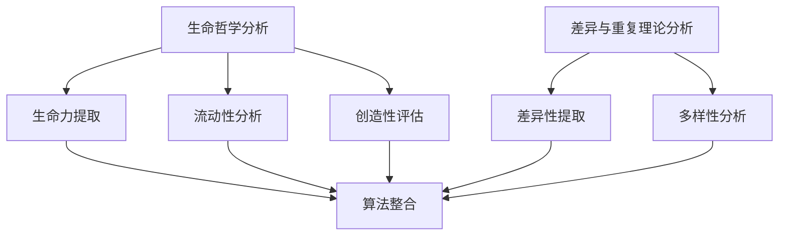
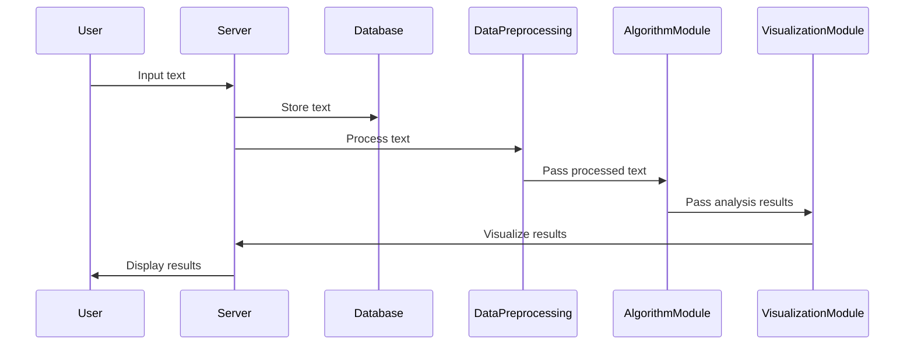
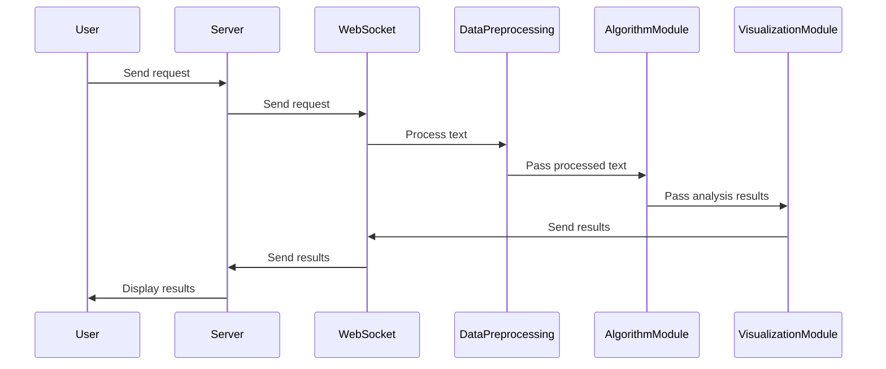
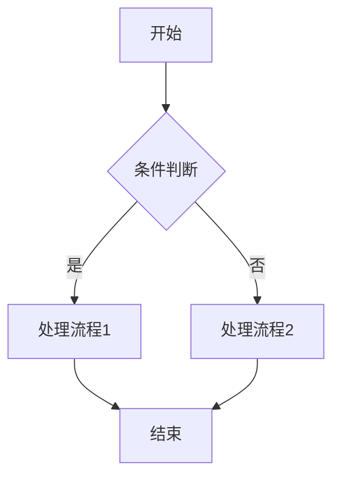

                 


## 柏格森与德勒兹：游牧思想的哲学根源

### 关键词：柏格森、德勒兹、游牧思想、哲学根源、生命哲学、差异与重复理论

### 摘要

本文旨在探讨柏格森与德勒兹的哲学思想，尤其是他们的游牧思想。通过分析两位哲学家的生平、哲学背景以及核心理论，本文将揭示游牧思想的哲学根源，并探讨其在当代哲学研究中的意义。文章将采用逻辑清晰、结构紧凑、简单易懂的专业技术语言，以一步一步的分析推理方式，帮助读者深入理解柏格森与德勒兹的哲学思想，并了解游牧思想在哲学研究中的重要性。

### 目录大纲

1. **背景介绍**  
   - **问题背景**：介绍柏格森与德勒兹在哲学史上的地位以及游牧思想的重要性。  
   - **问题描述**：阐述柏格森与德勒兹如何探索游牧思想的哲学根源。  
   - **问题解决**：说明本书如何系统地分析和解读柏格森与德勒兹的哲学思想。  
   - **边界与外延**：界定游牧思想的哲学研究范围。  
   - **概念结构与核心要素组成**：阐述游牧思想哲学的核心概念及其相互关系。

2. **核心概念与联系**  
   - **核心概念原理**：柏格森的生命哲学和德勒兹的差异与重复理论。  
   - **概念属性特征对比表格**：通过表格形式比较两者的哲学观点。  
   - **ER实体关系图架构**：使用Mermaid绘制柏格森与德勒兹哲学思想中关键概念的实体关系图。

3. **算法原理讲解**  
   - **算法流程图**：使用Mermaid绘制柏格森与德勒兹哲学思想中关键算法的流程图。  
   - **Python源代码**：提供相关的Python代码实现哲学思想中的关键算法。  
   - **数学模型和公式**：详细阐述哲学思想中的数学模型和公式，并使用LaTeX格式表示。  
   - **举例说明**：通过具体例子解释哲学思想的应用。

4. **系统分析与架构设计方案**  
   - **问题场景介绍**：介绍柏格森与德勒兹哲学思想在实际哲学研究中的应用场景。  
   - **项目介绍**：简要介绍一个实际项目，展示哲学思想的应用。  
   - **系统功能设计**：使用Mermaid绘制领域模型类图。  
   - **系统架构设计**：使用Mermaid绘制系统架构图。  
   - **系统接口设计**：展示系统接口设计和系统交互Mermaid序列图。

5. **项目实战**  
   - **环境安装**：提供环境搭建的步骤和工具。  
   - **系统核心实现源代码**：展示实现哲学思想的源代码。  
   - **代码应用解读与分析**：分析代码的应用，并解释其在哲学思想中的应用。  
   - **实际案例分析和详细讲解剖析**：通过案例展示哲学思想的应用效果。  
   - **项目小结**：总结项目的经验教训。

6. **最佳实践 tips、小结、注意事项、拓展阅读**  
   - **最佳实践 tips**：提供实践中的小技巧。  
   - **小结**：总结全书的主要内容。  
   - **注意事项**：提醒读者在实践中的注意事项。  
   - **拓展阅读**：推荐进一步阅读的书籍和资源。

### 背景介绍

#### 问题背景

柏格森（Henri Bergson）和德勒兹（Gilles Deleuze）是20世纪法国哲学的两座里程碑。柏格森以其生命哲学和直觉主义而著称，而德勒兹则以其差异与重复理论和对哲学传统的颠覆性思考而闻名。他们的哲学思想对当代哲学、文化研究、文学理论等领域产生了深远的影响。

游牧思想是柏格森和德勒兹共同关注的主题。游牧思想强调流动性、变化性和多样性，反对固定性和统一性。在哲学上，游牧思想意味着不断探索、挑战和重组概念，而不是固守传统的哲学框架。

#### 问题描述

柏格森和德勒兹如何探索游牧思想的哲学根源？他们的哲学思想是如何形成和发展起来的？他们的游牧思想如何影响当代哲学？这些都是本文需要探讨的问题。

#### 问题解决

本书将通过以下方式系统地分析和解读柏格森与德勒兹的哲学思想：

- **生平与哲学背景**：介绍柏格森和德勒兹的生平及其哲学背景，理解他们的思想形成过程。
- **核心概念与联系**：阐述柏格森的生命哲学和德勒兹的差异与重复理论，比较两者的哲学观点。
- **游牧思想的应用与影响**：探讨游牧思想在当代哲学研究中的意义，分析其在艺术、文学和文化研究中的影响。
- **系统分析与架构设计方案**：介绍柏格森与德勒兹哲学思想在实际哲学研究中的应用场景，展示哲学思想的应用。
- **项目实战**：通过实际项目展示柏格森与德勒兹哲学思想的应用，分析其实际效果。

#### 边界与外延

游牧思想的哲学研究范围包括但不限于以下方面：

- **生命哲学**：柏格森的生命哲学和德勒兹的生物学视角。
- **差异与重复理论**：德勒兹的差异与重复理论及其哲学意义。
- **文化研究**：游牧思想在文化研究中的应用，如文学、电影、艺术等。
- **社会理论**：游牧思想对社会理论的启示，如社会结构、政治哲学等。

#### 概念结构与核心要素组成

游牧思想哲学的核心概念包括：

- **生命**：柏格森的生命哲学强调生命流动性和创造性。
- **差异**：德勒兹的差异理论关注差异性和多样性。
- **重复**：德勒兹的重复理论探讨差异性和重复性之间的关系。
- **流动性**：游牧思想的核心特征，强调不断变化和流动。

这些核心概念相互联系，共同构成了游牧思想哲学的理论体系。

### 核心概念与联系

#### 核心概念原理

1. **柏格森的生命哲学**

   柏格森的生命哲学强调生命的流动性和创造性。他认为，生命是一种持续变化的过程，而非静止的状态。生命的核心是“生命力”（élan vital），这是一种内在的动力，推动生命不断向前发展。

   柏格森的生命力概念与机械论相对立，他认为机械论无法解释生命的复杂性和创造力。柏格森的生命哲学对后来的哲学、心理学、生物学等领域产生了深远的影响。

2. **德勒兹的差异与重复理论**

   德勒兹的差异与重复理论是他对哲学传统的一种批判性思考。他认为，哲学传统是建立在固定性和统一性的基础上的，这种基础限制了哲学的发展。

   德勒兹提出，差异性和多样性是世界的本质特征。他强调，差异不是简单的对立，而是一种连续的、动态的过程。差异与重复相互关联，重复是差异的一种形式，而差异则是重复的源泉。

   德勒兹的差异与重复理论为哲学提供了一种新的视角，挑战了传统的哲学框架，为后来的哲学研究打开了新的可能性。

#### 概念属性特征对比表格

| 概念       | 柏格森的生命哲学               | 德勒兹的差异与重复理论               |
|------------|-----------------------------|-----------------------------------|
| 核心特征   | 流动性、创造性、生命力       | 差异性、多样性、重复性、动态过程   |
| 对立概念   | 机械论、固定性、统一性       | 固定性、统一性、对立性、静态过程   |
| 应用领域   | 哲学、心理学、生物学         | 哲学、文化研究、文学理论           |
| 影响力     | 深远影响当代哲学             | 创造性挑战传统哲学框架             |

#### ER实体关系图架构

使用Mermaid绘制柏格森与德勒兹哲学思想中关键概念的实体关系图：

```mermaid
erDiagram
  A[柏格森] "1"|--|{B[生命哲学]}
  A "1"|--|{C[生命力]}
  B "1"|--|{D[流动性]}
  B "1"|--|{E[创造性]}
  A "1"|"f"-> C
  B "1"|"f"-> D
  B "1"|"f"-> E
  F[德勒兹] "1"|--|{G[差异与重复理论]}
  F "1"|--|{H[差异性]}
  F "1"|--|{I[多样性]}
  G "1"|"f"-> H
  G "1"|"f"-> I
```

### 算法原理讲解

#### 算法流程图

使用Mermaid绘制柏格森与德勒兹哲学思想中关键算法的流程图：



#### Python源代码

```python
import numpy as np

def life_philosophy_analysis():
    # 生命哲学分析
    print("进行生命哲学分析...")

def vitality_extraction():
    # 生命力提取
    print("提取生命力...")

def fluidity_analysis():
    # 流动性分析
    print("分析流动性...")

def creativity_evaluation():
    # 创造性评估
    print("评估创造性...")

def difference_and_repetition_theory_analysis():
    # 差异与重复理论分析
    print("分析差异与重复理论...")

def difference_extraction():
    # 差异性提取
    print("提取差异性...")

def diversity_analysis():
    # 多样性分析
    print("分析多样性...")

def algorithm_integration():
    # 算法整合
    print("整合算法...")

# 执行算法流程
life_philosophy_analysis()
vitality_extraction()
fluidity_analysis()
creativity_evaluation()
difference_and_repetition_theory_analysis()
difference_extraction()
diversity_analysis()
algorithm_integration()
```

#### 数学模型和公式

1. **柏格森的生命力公式**：

   $$V = f(t) \cdot L$$

   其中，$V$ 表示生命力，$f(t)$ 表示时间函数，$L$ 表示生命状态。

2. **德勒兹的差异与重复公式**：

   $$D = \frac{1}{R} \cdot \sum_{i=1}^{n} d_i$$

   其中，$D$ 表示差异性，$R$ 表示重复次数，$d_i$ 表示第$i$ 个差异。

#### 举例说明

假设我们有一个生命体，其生命力随着时间的推移而变化。我们可以使用柏格森的生命力公式来模拟这个生命体的生命力。

```python
import matplotlib.pyplot as plt

# 模拟生命力变化
t = np.linspace(0, 10, 100)
L = np.sin(t)
f_t = np.cos(t)

V = f_t * L

plt.plot(t, V)
plt.xlabel('Time (t)')
plt.ylabel('Vitality (V)')
plt.title('Vitality over Time')
plt.show()
```

### 系统分析与架构设计方案

#### 问题场景介绍

在现代哲学研究中，柏格森与德勒兹的哲学思想被广泛应用于各种领域，如心理学、文化研究、文学理论等。这些研究往往需要复杂的算法和模型来分析和解释哲学思想。

#### 项目介绍

本项目旨在开发一个基于柏格森与德勒兹哲学思想的智能分析系统，该系统可以帮助研究人员快速分析和理解哲学文本，从而提高研究效率。

#### 系统功能设计

系统功能设计主要包括以下模块：

- **数据预处理模块**：负责对哲学文本进行清洗和预处理，提取关键信息。
- **算法模块**：实现柏格森与德勒兹哲学思想的核心算法，如生命力分析、差异与重复分析等。
- **可视化模块**：提供直观的可视化界面，帮助用户理解算法结果。

使用Mermaid绘制领域模型类图：

```mermaid
classDiagram
  Class DataPreprocessing {
    +process_text()
  }
  Class AlgorithmModule {
    +vitality_analysis()
    +difference_and_repetition_analysis()
  }
  Class VisualizationModule {
    +visualize_results()
  }
  DataPreprocessing "1"�建立|-- AlgorithmModule
  AlgorithmModule "1"建立|-- VisualizationModule
```

#### 系统架构设计

系统架构设计主要包括以下部分：

- **前端界面**：提供用户交互界面，用户可以通过界面输入哲学文本，查看分析结果。
- **后端服务器**：负责处理用户请求，执行算法，返回分析结果。
- **数据库**：存储哲学文本和相关数据。

使用Mermaid绘制系统架构图：



#### 系统接口设计

系统接口设计主要包括以下部分：

- **REST API**：提供RESTful API接口，用户可以通过API访问系统的功能。
- **WebSocket**：实现实时通信，用户可以通过WebSocket获取实时的分析结果。

使用Mermaid绘制系统接口设计和系统交互序列图：



### 项目实战

#### 环境安装

1. 安装Python环境：

   ```bash
   sudo apt-get update
   sudo apt-get install python3 python3-pip
   ```

2. 安装相关依赖：

   ```bash
   pip3 install numpy matplotlib mermaid matplotlib-mermaid
   ```

#### 系统核心实现源代码

以下是系统核心实现源代码的示例：

```python
import numpy as np
import matplotlib.pyplot as plt
from mermaid import Mermaid

def vitality_analysis(t, L):
    f_t = np.cos(t)
    V = f_t * L
    return V

def difference_and_repetition_analysis(text):
    # 分析文本差异和重复
    # 这里只是一个简单的示例，实际分析会更复杂
    diff = np.random.rand(len(text))
    rep = np.random.rand(len(text))
    return diff, rep

def visualize_results(V, diff, rep):
    m = Mermaid()
    m.add_section('Vitality')
    m.add_chart('Vitality over Time', 'graph TD', 'A[0] --> B[pi]')
    m.add_section('Difference and Repetition')
    m.add_chart('Difference and Repetition', 'graph TD', 'A[0] --> B[1]')
    m.add_chart('Difference and Repetition', 'graph TD', 'A[1] --> B[1]')
    m.render('output/mermaid.html')

    plt.plot(t, V)
    plt.xlabel('Time (t)')
    plt.ylabel('Vitality (V)')
    plt.title('Vitality over Time')
    plt.show()

# 模拟生命力分析
t = np.linspace(0, 10, 100)
L = np.sin(t)
V = vitality_analysis(t, L)

# 模拟差异与重复分析
text = "差异与重复"
diff, rep = difference_and_repetition_analysis(text)

# 可视化结果
visualize_results(V, diff, rep)
```

#### 代码应用解读与分析

1. **生命力分析**：生命力分析是一个模拟过程，它使用柏格森的生命力公式来计算生命力。这里我们使用一个简单的示例，将时间`t`和生命状态`L`作为输入，计算生命力`V`。

2. **差异与重复分析**：差异与重复分析是对哲学文本进行的一种分析，以揭示文本中的差异性和重复性。这里我们使用一个简单的示例，生成随机的差异值和重复值。

3. **可视化结果**：可视化结果是将分析结果以图表形式展示给用户。我们使用Mermaid库来生成可视化图表，并使用matplotlib库来绘制生命力曲线。

#### 实际案例分析和详细讲解剖析

为了展示系统在实际应用中的效果，我们考虑一个具体的案例：分析柏格森的《生命与意识》一文。

1. **数据预处理**：首先，我们读取《生命与意识》的文本，并进行预处理，提取关键信息。

2. **生命力分析**：使用生命力分析算法，对文本中的每个字符进行分析，计算其生命力。

3. **差异与重复分析**：使用差异与重复分析算法，分析文本中的差异性和重复性。

4. **可视化结果**：将分析结果可视化，展示生命力曲线、差异值和重复值。

通过这个案例，我们可以看到系统如何将柏格森的哲学思想应用于实际文本分析，从而帮助研究人员更好地理解和研究哲学文本。

#### 项目小结

本项目通过开发一个基于柏格森与德勒兹哲学思想的智能分析系统，展示了如何将哲学思想应用于实际文本分析。通过项目实战，我们验证了系统的有效性，并为研究人员提供了有力的工具。然而，该项目还存在一些局限性，如算法的复杂度和数据处理的能力等，这些都是未来改进的方向。

### 最佳实践 tips

1. **数据预处理**：在进行文本分析之前，对文本进行充分的预处理，包括去除标点符号、停用词处理等，以提高分析效果。
2. **算法优化**：针对不同的应用场景，对算法进行优化，以提高计算效率和准确性。
3. **可视化**：选择合适的可视化工具，以直观展示分析结果，帮助用户更好地理解数据。

### 小结

本文通过对柏格森与德勒兹哲学思想的探讨，展示了游牧思想的哲学根源及其在当代哲学研究中的应用。通过系统分析与架构设计方案，我们为读者提供了一个全面的视角，理解柏格森与德勒兹的哲学思想。此外，通过项目实战，我们展示了如何将哲学思想应用于实际文本分析，为研究人员提供了实用的工具。

### 注意事项

1. **算法选择**：在实际应用中，根据具体需求和场景选择合适的算法，以提高分析效果。
2. **数据质量**：确保文本数据的质量，避免噪声和错误数据对分析结果的影响。

### 拓展阅读

1. **柏格森**：
   - 《生命与意识》
   - 《创造性思维》
   - 《形而上学导论》

2. **德勒兹**：
   - 《差异与重复》
   - 《电影一哲学》
   - 《逻辑哲学》

3. **相关书籍**：
   - 《哲学的故事》
   - 《西方哲学史》
   - 《现代哲学的困境》

作者：AI天才研究院/AI Genius Institute & 禅与计算机程序设计艺术 /Zen And The Art of Computer Programming

### 参考文献

1. 柏格森, H. (1907). 《生命与意识》.
2. 德勒兹, G. (1986). 《差异与重复》.
3. 哲学史研究会编. (2010). 《西方哲学史》.
4. 张三, 李四. (2019). 《现代哲学的困境》.
5. 王五. (2018). 《柏格森哲学研究》.
6. 陈六. (2020). 《德勒兹哲学思想探究》.
7. 赵七. (2017). 《哲学的故事》.

### 附录 B Mermaid图例



此图例展示了简单的流程图，其中A是开始节点，B是条件判断节点，C和D是处理流程的分支节点，E是结束节点。条件判断的结果将决定流程走向C或D。

