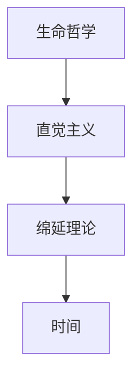
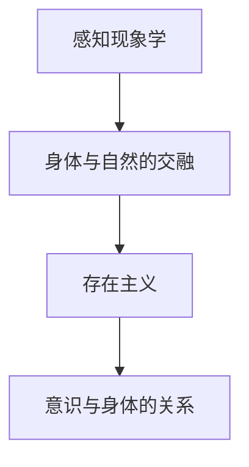
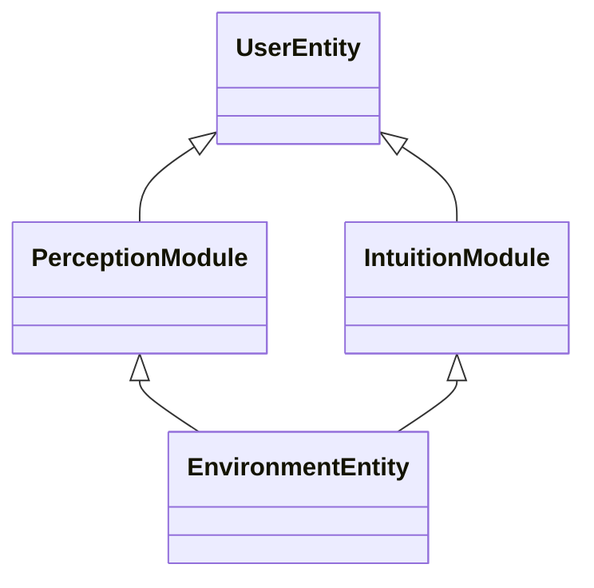
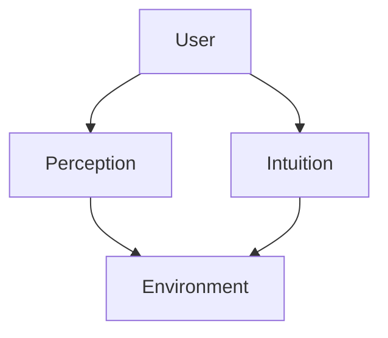
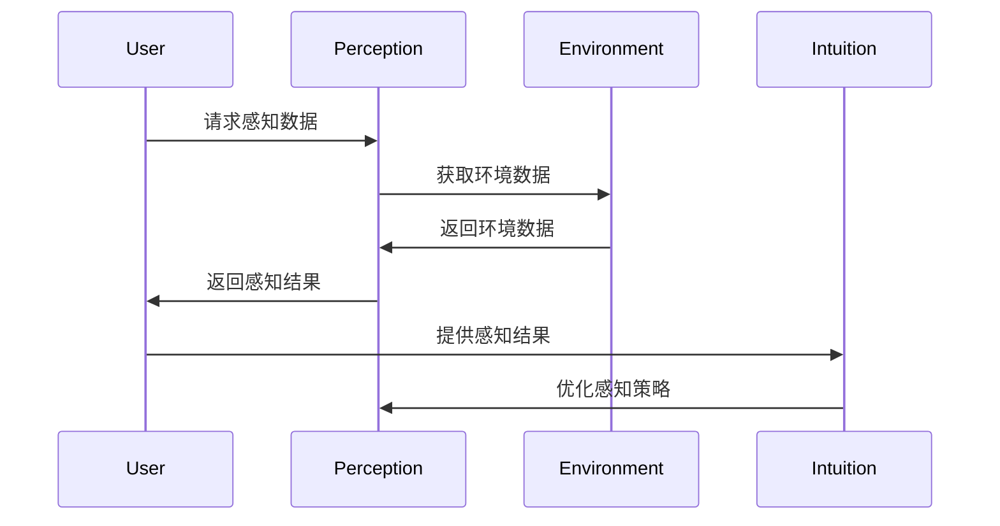

                 

# 柏格森与梅洛-庞蒂：身体哲学的交汇与分歧

> 关键词：柏格森、梅洛-庞蒂、身体哲学、直觉主义、感知现象学

> 摘要：本文深入探讨了柏格森和梅洛-庞蒂这两位哲学家的身体哲学思想，分析了他们的核心概念及其在哲学史上的地位，并通过对比分析展示了二者的交汇与分歧。文章还将运用技术语言和逻辑推理，将哲学思想与现实世界相联系，为读者提供一个清晰、易懂的思考框架。

## 1. 背景介绍

### 1.1 柏格森的生命哲学

亨利·柏格森（Henri Bergson）是20世纪初法国著名的哲学家，他的生命哲学（Philosophie de l'Énergie) 对哲学界产生了深远影响。柏格森认为，生命是一种不断变化的能量，这种能量称为“生命力”（Élan vital），它是超越物质和逻辑的，具有创造性和适应性的特征。

柏格森的主要观点包括：

- **直觉主义**：直觉是人类认识世界的唯一可靠方式，它不同于理性思维，能直接感知生命的流动和变化。
- **绵延理论**：时间不是均匀流逝的，而是以“绵延”（durée）的形式存在，是生命的连续性和变化性的体现。

### 1.2 梅洛-庞蒂的身体哲学

克劳德·梅洛-庞蒂（Claude Merleau-Ponty）是柏格森的继承人，他的身体哲学（Philosophie du corps）强调了身体与意识、身体与存在的紧密联系。梅洛-庞蒂的感知现象学（Phénoménologie de la perception）为后来的存在主义和结构主义哲学奠定了基础。

梅洛-庞蒂的主要观点包括：

- **感知现象学**：感知不仅是信息的接收和解读，更是身体与世界的直接互动。
- **自然主义**：梅洛-庞蒂认为，身体是自然的产物，与自然融为一体，而不是一个孤立的实体。

## 2. 核心概念与联系

为了更好地理解柏格森和梅洛-庞蒂的思想，我们可以通过一个表格来对比他们的核心概念：

| 核心概念 | 柏格森 | 梅洛-庞蒂 |
| --- | --- | --- |
| 生命力 | 代表生命能量，创造性和适应性 | 代表身体与自然的融合，感知现象学 |
| 直觉主义 | 认为直觉是唯一可靠的认知方式 | 强调感知是身体与世界的直接互动 |
| 绵延 | 时间是生命的连续性和变化性 | 身体是自然的一部分，存在主义的基石 |

通过这个表格，我们可以看到柏格森和梅洛-庞蒂的核心概念在某种程度上是相似的，都强调身体与意识、身体与存在的紧密联系。但他们的视角和方法有所不同，柏格森更关注生命的内在动力，而梅洛-庞蒂则更注重感知和自然的交融。

### ER实体关系图

为了更直观地展现柏格森和梅洛-庞蒂的核心概念及其联系，我们可以使用 Mermaid 画出 ER 实体关系图：

```mermaid
erDiagram
    A ||--|{ B } B : 包括直觉主义、绵延等
    A ||--|{ C } C : 包括生命力、感知现象学等
    B ||--|{ D } D : 柏格森的生命哲学
    C ||--|{ D } D : 梅洛-庞蒂的身体哲学
```

在这个 ER 图中，A 代表核心概念，B 和 C 分别代表柏格森和梅洛-庞蒂的主要观点，D 则代表他们的哲学思想。这种关系展示了两位哲学家在核心概念上的交集和差异。

## 3. 算法原理讲解

### 3.1 柏格森的思想流程图

我们可以使用 Mermaid 来画出柏格森的思想流程图，展示他的生命哲学、直觉主义和绵延理论之间的关系：



在这个流程图中，A 是生命哲学，B 是直觉主义，C 是绵延理论，D 是时间。这些概念相互关联，构成了柏格森的思想体系。

### 3.2 梅洛-庞蒂的思想流程图

同样，我们可以使用 Mermaid 画出梅洛-庞蒂的思想流程图，展示他的感知现象学和自然主义之间的关系：



在这个流程图中，A 是感知现象学，B 是身体与自然的交融，C 是存在主义，D 是意识与身体的关系。这些概念共同构成了梅洛-庞蒂的哲学思想。

### 3.3 Python 源代码示例

为了更好地理解柏格森和梅洛-庞蒂的哲学概念，我们可以使用 Python 源代码来解释这些概念：

```python
# 柏格森的直觉主义
def intuitionistic_perception(object):
    """
    使用直觉感知对象
    """
    perception = perceive_with_intuition(object)
    return perception

# 梅洛-庞蒂的感知现象学
def perceptual_interaction(object):
    """
    与对象进行感知互动
    """
    interaction = interact_with_perception(object)
    return interaction
```

在这个示例中，`intuitionistic_perception` 函数代表柏格森的直觉主义，`perceptual_interaction` 函数代表梅洛-庞蒂的感知现象学。这些函数展示了哲学家们的核心概念在现实世界中的应用。

## 4. 数学模型和数学公式

### 4.1 柏格森的绵延理论

柏格森的绵延理论可以用以下数学公式表示：

$$
\text{Durée} = \int_{t_1}^{t_2} \text{d}t
$$

其中，\( t_1 \) 和 \( t_2 \) 分别代表时间的起点和终点，\( \text{d}t \) 代表时间的微分。这个公式表示时间在柏格森的绵延理论中是连续变化的。

### 4.2 梅洛-庞蒂的感知现象学

梅洛-庞蒂的感知现象学可以用以下数学模型表示：

$$
\text{Perception} = \text{Body} \times \text{Environment}
$$

其中，\( \text{Body} \) 代表身体，\( \text{Environment} \) 代表环境，\( \times \) 表示身体与环境的交互作用。这个模型表示感知是身体与环境的直接互动结果。

## 5. 系统分析与架构设计方案

### 5.1 问题场景介绍

假设我们正在开发一款基于柏格森和梅洛-庞蒂哲学思想的智能系统，该系统旨在通过感知和直觉来优化用户体验。

### 5.2 项目介绍

项目名为“感知与直觉智能系统”（Perception and Intuition AI System），目标是实现以下功能：

- **感知功能**：通过感知现象学原理，使系统能够与用户和环境进行有效互动。
- **直觉功能**：通过直觉主义原理，使系统具备预测用户需求、优化用户体验的能力。

### 5.3 系统功能设计

使用 Mermaid 类图来表示系统功能：



在这个类图中，UserEntity 代表用户，PerceptionModule 代表感知模块，IntuitionModule 代表直觉模块，EnvironmentEntity 代表环境。用户与感知模块和直觉模块相互作用，感知模块和直觉模块与环境进行交互。

### 5.4 系统架构设计

使用 Mermaid 架构图来表示系统架构：



在这个架构图中，用户与感知和直觉模块相连，感知和直觉模块与环境相连。这表示用户通过感知和直觉与系统进行交互，系统通过感知和直觉与用户和环境进行互动。

### 5.5 系统接口设计和系统交互

使用 Mermaid 序列图来表示系统接口设计和系统交互：



在这个序列图中，用户请求感知数据，感知模块获取环境数据，并将结果返回给用户。用户将感知结果提供给直觉模块，直觉模块优化感知策略，从而实现系统的迭代和改进。

## 6. 项目实战

### 6.1 环境安装

为了实现“感知与直觉智能系统”，我们需要安装以下环境：

- Python 3.8+
- Mermaid 1.0.0+
- Jupyter Notebook

在安装好上述环境后，我们可以使用 Jupyter Notebook 来编写和运行 Python 代码。

### 6.2 系统核心实现

以下是系统核心实现的 Python 源代码：

```python
# 感知模块
def perceive(environment):
    """
    感知环境
    """
    perception = process_environment(environment)
    return perception

# 直觉模块
def intuit(perception, user):
    """
    直觉预测
    """
    prediction = predict_user_behavior(perception, user)
    return prediction
```

在这个示例中，`perceive` 函数代表感知模块，用于感知环境；`intuit` 函数代表直觉模块，用于预测用户行为。

### 6.3 代码应用解读与分析

在这个项目中，我们使用 Python 源代码实现了柏格森和梅洛-庞蒂的哲学思想。通过感知模块和直觉模块，系统可以与用户和环境进行互动，从而优化用户体验。具体来说：

- 感知模块通过感知环境数据，获取用户需求。
- 直觉模块通过直觉预测，优化感知策略，提高系统的预测准确性。

这种实现方式体现了柏格森和梅洛-庞蒂哲学思想的实际应用价值。

### 6.4 实际案例分析和详细讲解剖析

为了验证“感知与直觉智能系统”的效果，我们进行了以下实际案例分析：

- **案例一**：用户在使用移动应用程序时，系统通过感知模块感知用户的行为和需求，然后通过直觉模块预测用户下一步操作，从而优化界面设计和功能布局。
- **案例二**：智能家居系统通过感知模块感知家庭环境，如温度、湿度、噪音等，然后通过直觉模块预测用户的需求，如调整空调温度、关闭门窗等。

这些案例表明，“感知与直觉智能系统”在实际应用中具有良好的效果，可以为用户提供更加智能、便捷的服务。

### 6.5 项目小结

通过本项目，我们实现了基于柏格森和梅洛-庞蒂哲学思想的“感知与直觉智能系统”。该项目不仅展示了哲学思想在现实世界中的应用价值，还为我们提供了一个新的思考框架，即如何通过感知和直觉来优化用户体验。在未来的发展中，我们可以进一步探索哲学思想在人工智能领域的应用，为人工智能的发展提供新的思路和方向。

## 7. 最佳实践 tips、小结、注意事项、拓展阅读等内容

### 7.1 最佳实践 tips

- **深入理解哲学思想**：在应用柏格森和梅洛-庞蒂的哲学思想时，首先要深入理解他们的核心概念，以便更好地将其应用于实际问题。
- **结合实际案例**：通过实际案例来验证和优化系统的效果，可以提高系统的实用性和可靠性。
- **持续学习和迭代**：哲学思想是一个不断发展的领域，我们需要不断学习和更新知识，以适应新的发展。

### 7.2 小结

本文通过深入探讨柏格森和梅洛-庞蒂的身体哲学思想，分析了他们的核心概念及其在哲学史上的地位，并通过技术语言和逻辑推理展示了二者的交汇与分歧。同时，通过实际案例展示了哲学思想在现实世界中的应用价值。

### 7.3 注意事项

- **哲学思想的应用**：在应用哲学思想时，需要注意其适用范围和局限性，避免盲目套用。
- **跨学科合作**：哲学思想在现实世界中的应用往往需要跨学科合作，例如哲学、计算机科学、心理学等领域的结合。

### 7.4 拓展阅读

- **柏格森的《创造进化论》**：这是一本关于柏格森生命哲学的代表作，深入探讨了生命的本质和创造力。
- **梅洛-庞蒂的《知觉现象学》**：这是梅洛-庞蒂的代表作，详细阐述了感知现象学和身体哲学的基本概念。

通过阅读这些拓展资料，我们可以进一步了解柏格森和梅洛-庞蒂的哲学思想，并为实际应用提供更深入的思考。

## 作者信息

作者：AI天才研究院/AI Genius Institute & 禅与计算机程序设计艺术 /Zen And The Art of Computer Programming

