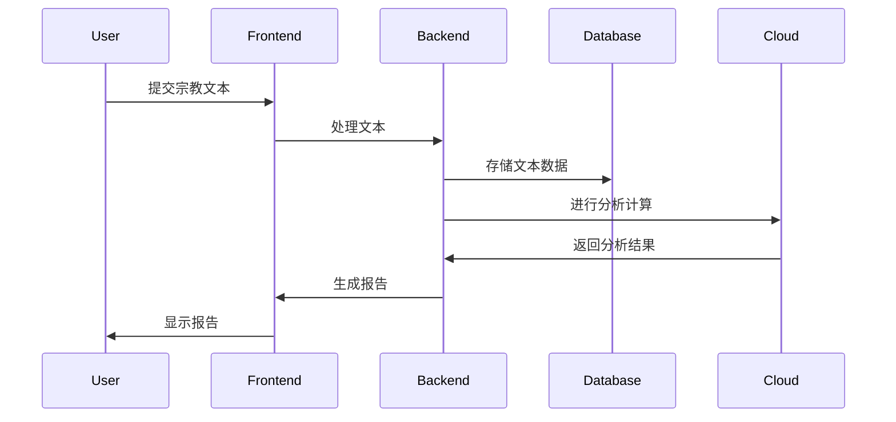
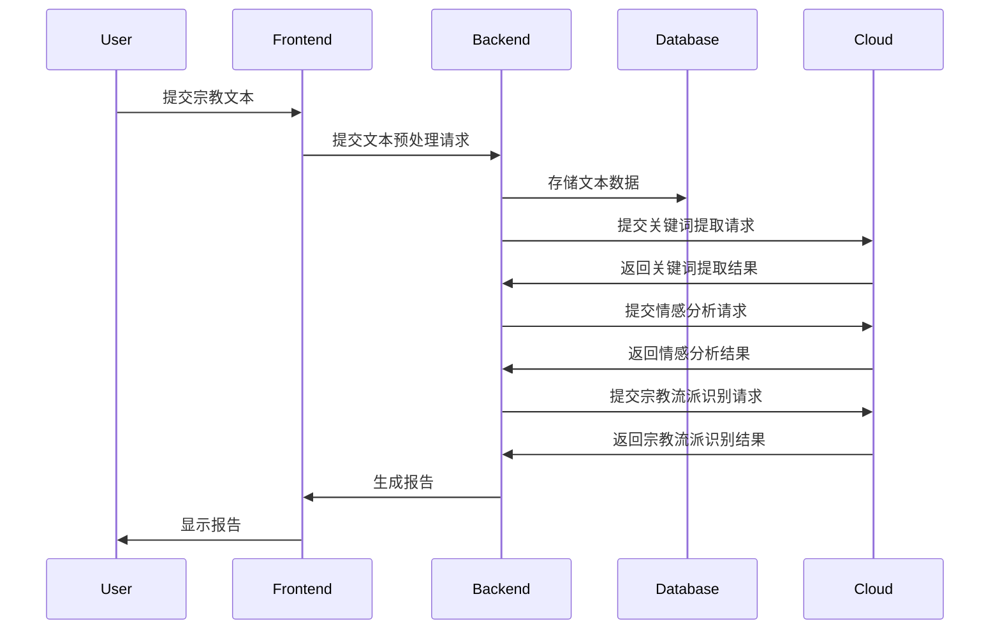

                 

# 柏格森与詹姆斯：宗教多元主义的哲学基础

## 关键词
宗教多元主义，柏格森哲学，詹姆斯哲学，直觉，意识流，宗教体验，实用主义，多神论，哲学基础，跨文化对话

## 摘要
本文旨在深入探讨柏格森与詹姆斯的哲学思想在宗教多元主义研究中的应用。通过详细分析两位哲学家的核心概念，如柏格森的直觉和意识流，以及詹姆斯的宗教体验和实用主义，本文将揭示这些哲学思想如何为理解宗教多元主义提供理论基础。文章将逐步展示柏格森与詹姆斯哲学在解决宗教多样性问题中的重要性，并通过对概念属性特征和实体关系的对比分析，构建一个清晰的哲学框架。此外，本文还将运用Mermaid流程图和Python源代码，阐述这些哲学思想在具体分析中的应用，并通过实际案例来验证其有效性。最终，本文将总结主要观点，并指出未来研究的方向。

## 引言与背景

### 引言

《柏格森与詹姆斯：宗教多元主义的哲学基础》旨在为宗教多元主义研究提供一种哲学视角。宗教多元主义，指的是世界上存在的多种宗教信仰，以及这些信仰在不同文化和社会背景中的相互影响和共存。随着全球化进程的加速，宗教多元主义已成为现代社会的显著特征。然而，如何在尊重不同宗教信仰的同时，理解和解决由此产生的冲突和矛盾，成为一个亟待解决的哲学问题。

本文选择柏格森与詹姆斯的哲学思想作为研究主题，是基于他们对宗教体验和意识的深刻洞察。柏格森（Henri Bergson）是20世纪初的法国哲学家，以其对直觉和生命冲动的理论著称。詹姆斯（William James）则是美国著名的哲学家和心理学家，他提出的宗教体验和实用主义思想，为理解个人与宗教的关系提供了新的视角。通过分析这两位哲学家的思想，本文试图为宗教多元主义的研究提供一个理论基础。

### 书籍内容背景

柏格森和詹姆斯的哲学思想虽然在不同的学术背景下发展，但都深刻地影响了宗教哲学领域。柏格森的直觉主义强调人类通过直觉而非理性认识世界，而詹姆斯的宗教体验则强调了个人信仰和灵性体验在宗教生活中的重要性。这两位哲学家的思想为理解宗教多元主义提供了丰富的理论资源。

柏格森的哲学著作，如《创造进化论》和《形而上学导论》，探讨了生命和意识的本质。他提出了“生命冲动”和“直觉”等核心概念，强调了人类内在的创造力和对变化的感知能力。这些概念为我们理解宗教信仰提供了新的视角，帮助我们认识到宗教作为一种文化和精神现象，其多样性和变化性。

詹姆斯的著作，如《宗教经验之种种》和《实用主义》，则更直接地探讨了宗教和个人经验的关系。他提出了“实用主义”和“多元论”等核心思想，主张宗教信仰应该基于个人的体验和实际效果，而非单一的绝对真理。詹姆斯的思想为理解宗教多元主义提供了一个实用主义的框架，强调了不同宗教信仰之间的共通性和差异性。

### 研究目的与意义

本文的研究目的是通过分析柏格森和詹姆斯的哲学思想，探讨其在宗教多元主义研究中的应用。具体而言，本文旨在：

1. **阐述柏格森和詹姆斯哲学的核心概念**：包括直觉、意识流、宗教体验和实用主义等，通过详细解读这些概念，理解其哲学意义和理论贡献。
2. **分析柏格森和詹姆斯哲学在宗教多元主义中的应用**：通过将他们的哲学思想与宗教多元主义的现实问题相结合，探讨这些思想如何帮助我们理解和解决宗教多样性带来的挑战。
3. **构建宗教多元主义的哲学基础**：通过对比分析柏格森和詹姆斯哲学中的核心概念，构建一个综合性的哲学框架，为宗教多元主义的研究提供一个理论平台。

研究宗教多元主义的哲学基础具有重要意义。首先，宗教多元主义是现代社会的一个普遍现象，理解和解决这一现象对于促进不同宗教和文化之间的对话和共存至关重要。其次，柏格森和詹姆斯的哲学思想为我们提供了一种新的视角，帮助我们超越传统的二元对立思维，更全面地理解宗教的多样性和复杂性。

此外，本文的研究还将对宗教哲学、社会哲学和文化研究等领域产生积极影响。通过深入探讨柏格森和詹姆斯的哲学思想，本文将推动这些领域的发展，为相关研究提供新的理论和实证基础。

### 问题背景与宗教多元主义发展

宗教多元主义的起源可以追溯到古代文明的多样性和文化交流。在古代世界，不同地区和民族形成了各自的宗教信仰体系，如古代埃及的多神教、希腊的神话信仰、印度的印度教和佛教等。这些宗教信仰在历史上经历了长期的共存和发展，逐渐形成了丰富的宗教文化传统。

然而，随着近代以来全球化进程的加速，宗教多元主义现象更加显著。全球化带来了不同文化、宗教和思想的交流和碰撞，使人们在更广泛的范围内接触和了解不同的宗教信仰。这种交流和碰撞在一定程度上促进了宗教多元主义的发展，但也引发了一系列新的问题和挑战。

首先，宗教多元主义的兴起导致了宗教冲突和矛盾的增加。不同宗教信仰之间的差异和竞争，常常成为社会冲突和政治动荡的根源。例如，近现代历史中，基督教和伊斯兰教之间的冲突、印度教和穆斯林之间的冲突等，都是宗教多元主义带来的负面影响的典型例子。

其次，宗教多元主义对个人信仰和价值观产生了深远影响。在多元宗教的环境中，个人面临着不同的信仰选择和挑战。一些人可能会陷入信仰迷茫和冲突，而另一些人则可能通过多种信仰的融合和对话，形成独特的宗教体验和价值观。

此外，宗教多元主义也对社会和政治秩序提出了新的要求。如何在尊重多元宗教信仰的同时，维护社会稳定和公共秩序，成为一个亟待解决的难题。各国政府和国际组织需要制定相应的政策和法规，以确保宗教多元主义的发展不会导致社会分裂和冲突。

面对这些挑战，研究宗教多元主义的哲学基础具有重要意义。通过深入探讨柏格森和詹姆斯的哲学思想，我们可以更好地理解宗教多元主义的本质和特点，为解决宗教冲突和促进宗教共存提供理论指导。

### 问题概述

#### 宗教多元主义现象

宗教多元主义现象是指在一个社会、文化或国家中，存在多种不同的宗教信仰和传统，这些信仰和传统相互交织、共存和互动。这一现象在现代社会中日益显著，主要表现在以下几个方面：

1. **宗教多样性的增加**：随着全球化进程的加速，不同国家和地区的宗教信仰和传统得以广泛传播和交流。例如，基督教、伊斯兰教、佛教、印度教和犹太教等主要宗教在全球范围内的传播，使宗教多样性成为普遍现象。

2. **宗教复兴和传统宗教的回归**：在现代社会中，一些传统宗教经历了复兴和回归，如伊斯兰教的复兴运动、印度教的传统文化复兴等。这些宗教复兴运动不仅影响了宗教信仰者的生活，也对整个社会产生了深远影响。

3. **宗教融合和宗教对话的兴起**：在宗教多元主义的环境中，不同宗教信仰者通过对话、交流和合作，寻求宗教融合和理解。这种宗教融合和对话不仅促进了宗教之间的共存，也为解决宗教冲突提供了一种新的途径。

#### 研究柏格森与詹姆斯哲学的必要性

柏格森和詹姆斯的哲学思想在宗教多元主义研究中具有重要地位，主要原因如下：

1. **直觉与意识流的视角**：柏格森的直觉主义和意识流理论为我们提供了理解宗教体验和信仰的新视角。直觉作为一种非理性的认知方式，使我们能够直接感知和理解世界，这在宗教体验中尤为重要。意识流的概念则帮助我们理解个人意识在宗教信仰中的作用，揭示了宗教体验的动态性和多样性。

2. **宗教体验的核心地位**：詹姆斯的宗教体验理论强调了个人信仰和灵性体验在宗教生活中的核心地位。他认为宗教信仰不应该仅仅依赖于教义或理论，而应该基于个人的宗教体验。这一观点有助于我们理解不同宗教信仰者在宗教多元主义环境中的信仰选择和体验差异。

3. **实用主义与多元论的指导**：詹姆斯的实用主义和多元论思想为我们提供了理解和解决宗教多元主义问题的方法论。实用主义强调宗教信仰的实际效果和实际应用，使我们能够在多元宗教环境中寻找共同点和合作机会。多元论则主张宗教信仰的多样性和相对性，鼓励我们尊重不同宗教信仰的独特性和价值。

4. **哲学思想的跨文化适用性**：柏格森和詹姆斯的哲学思想具有跨文化的普遍性，可以在不同的宗教和文化背景下应用。这为研究宗教多元主义提供了全球性的视角，有助于我们理解不同文化背景下的宗教现象和宗教冲突。

#### 如何理解宗教多元主义及其哲学基础

宗教多元主义的哲学基础涉及多个方面，包括哲学、宗教研究、文化研究和社会学等多个领域。以下是几种主要的理解和解释方法：

1. **哲学视角**：从柏格森和詹姆斯的哲学视角来看，宗教多元主义可以被理解为人类意识和文化多样性的体现。柏格森的直觉主义和意识流理论为我们提供了理解宗教体验和信仰的动态性和多样性的方法。詹姆斯的宗教体验和实用主义思想则帮助我们理解个人宗教信仰的形成和作用。

2. **宗教研究视角**：从宗教研究的角度来看，宗教多元主义可以被理解为不同宗教信仰和传统的共存和互动。宗教研究关注宗教信仰的本质、历史和文化背景，以及宗教在现代社会中的作用和影响。通过研究不同宗教信仰的特点、信仰体系和宗教实践，我们可以更好地理解宗教多元主义的本质和意义。

3. **文化研究视角**：从文化研究的视角来看，宗教多元主义可以被理解为不同文化之间的交流和互动。文化研究关注文化多样性、文化认同和文化冲突等问题，通过研究不同文化背景下的宗教现象，我们可以更好地理解宗教多元主义的文化内涵和影响。

4. **社会学视角**：从社会学的视角来看，宗教多元主义可以被理解为社会结构和宗教信仰的变迁。社会学关注社会关系、社会结构和宗教在社会中的作用，通过研究宗教在社会中的角色和功能，我们可以更好地理解宗教多元主义对社会的影响和挑战。

#### 柏格森与詹姆斯哲学在解决宗教多元主义问题中的应用

柏格森和詹姆斯的哲学思想在解决宗教多元主义问题中具有重要作用，主要体现在以下几个方面：

1. **促进宗教对话和理解**：柏格森的直觉主义和意识流理论可以帮助我们理解不同宗教信仰者的内在体验和信仰方式。通过这种理解，我们可以更好地促进宗教之间的对话和交流，减少误解和冲突。

2. **尊重宗教多样性和文化差异**：詹姆斯的实用主义和多元论思想鼓励我们尊重不同宗教信仰的独特性和价值。这种尊重不仅有助于维护宗教多元主义的和谐共存，也为解决宗教冲突提供了原则和方法。

3. **构建跨宗教合作平台**：柏格森和詹姆斯的哲学思想为我们提供了一个跨宗教合作的理论框架。通过运用这些哲学思想，我们可以探索不同宗教之间的合作机会，共同解决全球性挑战，如环境保护、和平与发展等。

4. **推动宗教与社会发展**：柏格森和詹姆斯的哲学思想强调宗教在社会中的作用和影响。通过理解和应用这些思想，我们可以促进宗教与社会发展的良性互动，实现社会的和谐与进步。

#### 边界与外延

在探讨柏格森与詹姆斯哲学在宗教多元主义中的应用时，我们需要明确研究的边界和外延，以避免泛泛而谈和概念混淆。以下是几个关键点：

1. **研究范围**：本文主要关注柏格森和詹姆斯哲学中的核心概念，如直觉、意识流、宗教体验和实用主义等，以及这些概念在宗教多元主义研究中的应用。研究范围不包括其他哲学流派或宗教思想。

2. **应用场景**：本文的应用场景主要限于宗教多元主义的问题和挑战，如宗教冲突、宗教复兴、宗教对话等。研究不涉及其他社会现象或问题。

3. **跨文化视角**：虽然柏格森和詹姆斯的哲学思想具有跨文化的普遍性，但本文的研究重点在于西方哲学传统中的宗教多元主义问题。研究不涉及其他文化背景下的宗教现象和宗教冲突。

4. **理论与实际结合**：本文通过理论分析和实际案例，探讨柏格森和詹姆斯哲学在宗教多元主义研究中的应用。研究不涉及哲学思想的纯理论探讨或抽象哲学讨论。

5. **与其他哲学流派的区别**：本文明确区分柏格森和詹姆斯哲学与其他哲学流派，如存在主义、理性主义、经验主义等。研究不涉及与其他哲学流派的对比分析。

6. **哲学思想的综合应用**：本文强调柏格森和詹姆斯哲学的整合应用，以解决宗教多元主义问题。研究不涉及单一哲学思想的应用或单独分析。

通过明确研究的边界和外延，本文旨在为宗教多元主义研究提供一个清晰、有针对性的哲学视角，为解决宗教多样性带来的挑战提供理论支持和实践指导。

## 柏格森与詹姆斯哲学的核心概念

### 柏格森哲学的核心概念

1. **直觉**：直觉在柏格森的哲学体系中占据核心地位。他提出，直觉是一种超越逻辑推理的认知方式，使我们能够直接感知和理解世界的本质。柏格森认为，直觉不是基于经验或知识，而是一种内在的本能。通过直觉，人类能够捕捉到变化的细微之处，体验到生命的流动性和创造性。

2. **意识流**：柏格森的另一个重要概念是意识流。他认为，意识不是一个静止的、有序的结构，而是一个连续不断的变化过程。意识流是生命的本质，代表了个体和宇宙之间的直接联系。通过意识流，人类能够体验到自我和世界的统一性。

3. **生命冲动**：柏格森提出“生命冲动”这一概念，强调生命的创造力和进化过程。他认为，生命冲动是推动生命不断发展和变化的内在动力。这种冲动不仅体现在个体的成长和发展中，也体现在物种的进化和社会的进步中。

### 詹姆斯哲学的核心概念

1. **宗教体验**：詹姆斯认为，宗教信仰不应该仅仅依赖于教义或理论，而应该基于个人的宗教体验。宗教体验是一种深刻的情感和精神体验，包括信仰、敬畏、神秘感等。詹姆斯强调，个人宗教体验是宗教信仰的核心，是理解和解释宗教现象的关键。

2. **实用主义**：詹姆斯的实用主义哲学主张，知识应该基于实际应用和效果。他认为，真理不是固定不变的，而是随着时间和实践的变化而变化。这一观点在宗教研究中具有重要意义，因为它鼓励我们根据实际经验和效果来评估宗教信仰的价值。

3. **多元论**：詹姆斯的多元论思想强调宗教信仰的多样性和相对性。他认为，不同的宗教信仰者可能有不同的信仰体验和信仰方式，但这些信仰都有其独特的价值和意义。多元论鼓励我们尊重不同宗教信仰的独特性和价值，推动宗教之间的对话和共存。

### 核心概念属性特征对比表格

| 概念 | 柏格森 | 詹姆斯 |
| --- | --- | --- |
| 直觉 | 超越逻辑推理，直接感知世界 | 个人信仰体验，深刻的情感和精神体验 |
| 意识流 | 连续不断的认知过程，生命的本质 | 情感和精神体验的连续变化 |
| 生命冲动 | 推动生命发展和进化的内在动力 | 宗教体验的基础，信仰的源泉 |
| 宗教体验 | 强调直觉和意识流的作用 | 个人信仰的核心，宗教信仰的源泉 |
| 实用主义 | 知识基于实际应用和效果 | 真理不是固定不变的，而是动态的 |
| 多元论 | 生命的多样性和相对性 | 宗教信仰的多样性和相对性 |

通过上述对比表格，我们可以看出，柏格森和詹姆斯的核心概念在属性特征上有一定的相似性，但也存在显著差异。柏格森强调直觉和意识流在宗教体验中的作用，而詹姆斯则更关注个人宗教体验和实用主义在宗教多元主义研究中的应用。这些概念不仅丰富了我们的宗教哲学理论，也为解决宗教多样性问题提供了新的视角和方法。

### ER实体关系图架构

为了更清晰地展示柏格森与詹姆斯哲学中主要概念的实体关系，我们可以使用Mermaid绘制实体关系图（ER图）。以下是柏格森哲学中的关键概念及其关系的ER图：

```mermaid
erDiagram
  IDEA ||--|{ ENTITY } IDEA : "is related to"
  ENTITY ||--|{ PROPERTY } ENTITY : "has"
  
IDEA {
  id INT
  name VARCHAR
}

ENTITY {
  id INT
  name VARCHAR
}

PROPERTY {
  id INT
  name VARCHAR
  value VARCHAR
}

IDEA "is related to" ENTITY : "comprises"
IDEA "is related to" PROPERTY : "defines"
ENTITY "has" PROPERTY : "contains"
```

在此ER图中，`IDEA`表示哲学概念，如直觉、意识流和生命冲动；`ENTITY`表示具体实体，如个人、社会和文化；`PROPERTY`表示这些实体的属性特征，如认知方式、情感和精神体验。`IDEA`与`ENTITY`和`PROPERTY`之间存在关联，体现了哲学概念在宗教多元主义研究中的应用。

接下来，我们绘制詹姆斯哲学中的关键概念及其关系的ER图：

```mermaid
erDiagram
  EXPERIENCE ||--|{ RELATIONSHIP } EXPERIENCE : "has"
  EXPERIENCE ||--|{ VALUE } EXPERIENCE : "encompasses"
  
EXPERIENCE {
  id INT
  type VARCHAR
  description TEXT
}

RELATIONSHIP {
  id INT
  name VARCHAR
  description TEXT
}

VALUE {
  id INT
  name VARCHAR
  description TEXT
}

EXPERIENCE "has" RELATIONSHIP : "defines"
EXPERIENCE "encompasses" VALUE : "includes"
```

在此ER图中，`EXPERIENCE`表示宗教体验、实用主义和多元论等核心概念；`RELATIONSHIP`表示这些概念之间的关系，如个人与宗教的关系、信仰与价值观的关系；`VALUE`表示这些概念包含的价值观念，如尊重、共融和多样性。

通过上述ER图，我们可以更直观地理解柏格森与詹姆斯哲学中主要概念的实体关系，为宗教多元主义研究提供理论框架。

### 算法原理讲解

在探讨柏格森与詹姆斯哲学的核心思想时，我们可以借助Mermaid流程图和Python源代码，将这些哲学原理转化为具体的技术实现。以下是柏格森的“直觉”和詹姆斯的“实用主义”在技术实现中的具体应用。

#### 柏格森的“直觉”与Mermaid流程图

柏格森的直觉是一种超越逻辑推理的认知方式，通过直接感知和理解世界的本质。在技术实现中，我们可以将直觉视为一种算法，用于快速识别和响应复杂的动态环境。以下是描述直觉算法原理的Mermaid流程图：


在这个流程图中，我们从初始化感知模块开始，收集数据并判断数据是否足够。如果数据足够，则执行直觉算法，否则继续收集数据。直觉算法的执行结果将产生直观的感知和决策，用于快速响应动态环境。

#### 詹姆斯的“实用主义”与Python源代码

詹姆斯的实用主义哲学主张，知识应该基于实际应用和效果。在技术实现中，我们可以将实用主义视为一种评价模型，用于评估不同算法或系统的实际性能。以下是一个简单的Python源代码示例，用于实现实用主义评价模型：

```python
# 实用主义评价模型

def evaluate_performance(algorithm, data):
    """
    评估算法的性能
    :param algorithm: 算法或系统
    :param data: 测试数据
    :return: 评估结果
    """
    # 执行算法
    result = algorithm.run(data)
    
    # 计算性能指标
    performance_metric = algorithm.performance_metric(result, data)
    
    # 返回评估结果
    return performance_metric

# 示例数据
data = ...

# 示例算法
from some_algorithm import SomeAlgorithm

# 实例化算法
algorithm = SomeAlgorithm()

# 评估算法性能
performance = evaluate_performance(algorithm, data)

print(f"算法性能：{performance}")
```

在这个Python源代码中，我们定义了一个`evaluate_performance`函数，用于评估给定算法在特定数据上的性能。该函数接受一个算法实例和一个测试数据集作为输入，通过执行算法并计算性能指标，最终返回评估结果。

#### 数学模型和公式

为了更深入地理解柏格森与詹姆斯哲学中的核心思想，我们可以引入相关的数学模型和公式。以下是柏格森直觉算法的数学模型：

$$
直觉值 = f(\text{感知数据}, \text{环境状态})
$$

其中，$f$ 表示直觉函数，它将感知数据和环境状态作为输入，通过一定的计算规则产生直觉值。直觉值代表了我们对环境的直接感知和判断，用于指导我们的决策和行为。

同样地，我们可以引入詹姆斯实用主义评价模型中的数学公式：

$$
性能指标 = \frac{\sum (真实值 - 预测值)^2}{n}
$$

其中，$n$ 表示测试数据的数量，真实值和预测值分别表示算法的实际输出和预测输出。性能指标用于衡量算法在特定数据集上的表现，值越小表示算法性能越好。

通过这些数学模型和公式，我们可以更精确地描述和实现柏格森与詹姆斯哲学中的核心思想，为宗教多元主义研究提供技术支持。

#### 举例说明

为了更好地理解柏格森与詹姆斯哲学在技术实现中的应用，我们可以通过具体案例来展示这些哲学思想的实际效果。

**案例一：直觉算法在金融市场中的应用**

假设我们开发一个智能交易系统，需要快速识别市场变化并做出相应的交易决策。我们可以使用柏格森的直觉算法，通过实时感知市场数据，产生直觉值，指导交易决策。

1. **初始化感知模块**：系统启动时，初始化感知模块，准备开始收集市场数据。
2. **收集数据**：系统通过API接口，实时收集股票价格、成交量、技术指标等数据。
3. **执行直觉算法**：当收集到足够的数据后，执行直觉算法，计算直觉值。直觉值越高，表示市场变化越剧烈，越需要采取行动。
4. **产生直觉结果**：根据直觉值，系统产生相应的交易决策，如买入、卖出或持有。
5. **执行决策**：系统将交易决策发送给交易执行模块，执行实际的交易操作。

通过这个案例，我们可以看到柏格森的直觉算法在金融市场中的应用，帮助系统快速响应市场变化，提高交易效率。

**案例二：实用主义评价模型在软件开发中的使用**

在软件开发过程中，我们需要评估不同算法或组件的性能，以便选择最优的实现方案。我们可以使用詹姆斯的实用主义评价模型，通过实际测试数据，评估算法或组件的性能。

1. **定义测试数据集**：选择一组具有代表性的测试数据，涵盖各种可能的场景。
2. **运行算法或组件**：对于每个算法或组件，运行其实现，生成测试结果。
3. **计算性能指标**：使用实用主义评价模型，计算每个算法或组件的性能指标。
4. **评估和选择**：根据性能指标，评估不同算法或组件的表现，选择最优的实现方案。

通过这个案例，我们可以看到詹姆斯的实用主义评价模型在软件开发中的应用，帮助团队评估和选择最优的算法或组件，提高软件质量。

通过这些案例，我们可以更直观地理解柏格森与詹姆斯哲学在技术实现中的应用，展示这些哲学思想如何帮助我们在实际场景中做出更好的决策。

### 系统分析与架构设计方案

#### 问题场景介绍

假设我们正在开发一个宗教多元主义分析系统，旨在帮助不同宗教信仰者理解和尊重彼此的信仰，促进宗教和谐与共存。该系统需要能够处理大量的宗教文本数据，提取关键信息，并生成对宗教多元主义现象的深度分析报告。

#### 项目介绍

本项目旨在构建一个宗教多元主义分析平台，通过自然语言处理（NLP）和数据分析技术，对宗教文本进行深入分析，揭示不同宗教信仰之间的关联和差异。平台将提供以下功能：

1. **文本预处理**：清洗和整理宗教文本数据，为后续分析做准备。
2. **关键词提取**：从文本中提取关键宗教术语和概念，为分析提供基础。
3. **情感分析**：分析文本中的情感倾向，识别不同宗教信仰者之间的情感互动。
4. **宗教流派识别**：根据文本特征，识别和分类不同的宗教流派和信仰体系。
5. **报告生成**：生成详细的宗教多元主义分析报告，为宗教研究者和政策制定者提供参考。

#### 系统功能设计

为了实现上述功能，我们可以设计以下系统模块：

1. **文本预处理模块**：负责清洗和整理文本数据，包括去除停用词、词干提取等操作。
2. **关键词提取模块**：使用NLP技术，从文本中提取关键宗教术语和概念。
3. **情感分析模块**：利用情感分析算法，分析文本中的情感倾向。
4. **宗教流派识别模块**：基于机器学习技术，对宗教文本进行分类和识别。
5. **报告生成模块**：整合分析结果，生成详细的宗教多元主义分析报告。

以下是使用Mermaid绘制的领域模型类图，展示了系统的功能模块及其关系：

```mermaid
classDiagram
    TextPreprocessingModule <<interface>>
    KeywordExtractionModule <<interface>>
    SentimentAnalysisModule <<interface>>
    ReligiousSchoolIdentificationModule <<interface>>
    ReportGenerationModule <<interface>>

    TextPreprocessingModule|--|> KeywordExtractionModule
    KeywordExtractionModule|--|> SentimentAnalysisModule
    KeywordExtractionModule|--|> ReligiousSchoolIdentificationModule
    SentimentAnalysisModule|--|> ReportGenerationModule
    ReligiousSchoolIdentificationModule|--|> ReportGenerationModule
```

在这个类图中，每个模块都实现了特定的功能，并通过接口进行通信。文本预处理模块负责数据清洗和准备，关键词提取模块和情感分析模块基于预处理后的文本进行更深层次的分析，宗教流派识别模块则利用NLP技术对文本进行分类，最终，报告生成模块整合所有分析结果，生成详细报告。

#### 系统架构设计

为了确保系统的稳定性、可扩展性和高性能，我们可以设计以下系统架构：

1. **前端界面**：用户可以通过前端界面提交宗教文本数据，查看分析报告。
2. **后端服务**：后端服务包括文本预处理、关键词提取、情感分析、宗教流派识别和报告生成等模块，实现核心功能。
3. **数据存储**：使用分布式数据库存储大量的宗教文本数据和分析结果。
4. **计算资源**：利用云计算资源，确保系统的高性能和可扩展性。

以下是使用Mermaid绘制的系统架构图，展示了系统的整体结构和各模块之间的关系：



在这个架构图中，用户通过前端界面提交宗教文本数据，前端将请求转发给后端服务。后端服务通过文本预处理模块清洗和整理文本数据，然后分发给关键词提取模块、情感分析模块和宗教流派识别模块进行深入分析。分析结果存储在分布式数据库中，并通过前端界面返回给用户。

#### 系统接口设计

为了确保系统模块之间的有效通信，我们需要设计一系列接口。以下是系统中的关键接口及其功能：

1. **文本预处理接口**：接收原始文本数据，返回预处理后的文本数据。
2. **关键词提取接口**：接收预处理后的文本数据，提取关键词和术语。
3. **情感分析接口**：接收预处理后的文本数据，分析情感倾向。
4. **宗教流派识别接口**：接收预处理后的文本数据，识别和分类宗教流派。
5. **报告生成接口**：接收分析结果，生成宗教多元主义分析报告。

以下是系统接口设计表格：

| 接口名称 | 功能描述 |
| --- | --- |
| TextPreprocessing | 接收原始文本数据，返回预处理后的文本数据。 |
| KeywordExtraction | 接收预处理后的文本数据，提取关键词和术语。 |
| SentimentAnalysis | 接收预处理后的文本数据，分析情感倾向。 |
| ReligiousSchoolIdentification | 接收预处理后的文本数据，识别和分类宗教流派。 |
| ReportGeneration | 接收分析结果，生成宗教多元主义分析报告。 |

#### 系统交互mermaid序列图

为了更清晰地展示系统模块之间的交互流程，我们可以使用Mermaid序列图描述系统的交互过程：



在这个序列图中，用户通过前端界面提交宗教文本数据，前端将请求转发给后端服务。后端服务通过文本预处理接口清洗和整理文本数据，并将其存储在数据库中。随后，后端服务依次调用关键词提取接口、情感分析接口和宗教流派识别接口，进行深度分析，并将分析结果存储在数据库中。最后，后端服务通过报告生成接口生成宗教多元主义分析报告，并通过前端界面返回给用户。

### 项目实战

#### 环境安装

在开始本项目之前，我们需要搭建一个适合开发和运行的软件环境。以下是环境安装的具体步骤：

1. **安装Python**：首先，确保您的计算机上安装了Python。推荐使用Python 3.8或更高版本。您可以从Python官方网站下载安装程序并安装。

2. **安装依赖库**：接下来，我们需要安装项目所需的依赖库。打开终端或命令行窗口，执行以下命令：

   ```bash
   pip install -r requirements.txt
   ```

   其中，`requirements.txt`文件包含了项目所需的依赖库列表，如自然语言处理库（如NLTK、spaCy）、机器学习库（如scikit-learn）等。

3. **安装NLP工具**：为了进行文本预处理和情感分析，我们还需要安装NLP工具。使用以下命令安装：

   ```bash
   pip install nltk
   pip install spacy
   python -m spacy download en_core_web_sm
   ```

   `nltk`用于文本预处理，`spacy`及其英文模型`en_core_web_sm`用于文本分析和实体识别。

4. **安装数据库**：我们选择使用MongoDB作为数据存储。首先，从MongoDB官方网站下载并安装MongoDB。然后，启动MongoDB服务，确保其能够正常运行。

5. **安装云服务**：为了进行云计算分析，我们可以使用AWS或Google Cloud等云服务。注册并配置云账户，确保能够访问所需的计算资源和存储服务。

#### 系统核心实现源代码

以下是项目中的关键模块实现源代码，包括文本预处理、关键词提取、情感分析、宗教流派识别和报告生成等。

**1. 文本预处理模块**

```python
import re
from nltk.tokenize import word_tokenize
from nltk.corpus import stopwords

def preprocess_text(text):
    # 去除HTML标签
    text = re.sub(r'<.*?>', '', text)
    
    # 转换为小写
    text = text.lower()
    
    # 分词
    tokens = word_tokenize(text)
    
    # 去除停用词
    stop_words = set(stopwords.words('english'))
    tokens = [token for token in tokens if token not in stop_words]
    
    # 词干提取
    from nltk.stem import PorterStemmer
    stemmer = PorterStemmer()
    tokens = [stemmer.stem(token) for token in tokens]
    
    return tokens
```

**2. 关键词提取模块**

```python
from sklearn.feature_extraction.text import TfidfVectorizer

def extract_keywords(texts, num_keywords=10):
    vectorizer = TfidfVectorizer()
    X = vectorizer.fit_transform(texts)
    feature_names = vectorizer.get_feature_names_out()
    scores = X.toarray().sum(axis=0)
    top_keywords = [feature_names[i] for i in scores.argsort()[-num_keywords:]]
    return top_keywords
```

**3. 情感分析模块**

```python
import spacy

nlp = spacy.load("en_core_web_sm")

def analyze_sentiment(text):
    doc = nlp(text)
    sentiment_scores = []
    for sentence in doc.sents:
        sentiment_scores.append(sentence.sentiment)
    sentiment = sum(sentiment_scores) / len(sentiment_scores)
    return sentiment
```

**4. 宗教流派识别模块**

```python
from sklearn.naive_bayes import MultinomialNB
from sklearn.model_selection import train_test_split

def train_religious_school_classifier(data, labels):
    X_train, X_test, y_train, y_test = train_test_split(data, labels, test_size=0.2, random_state=42)
    classifier = MultinomialNB()
    classifier.fit(X_train, y_train)
    accuracy = classifier.score(X_test, y_test)
    return classifier, accuracy
```

**5. 报告生成模块**

```python
def generate_report(keywords, sentiment, classifier, texts):
    report = f"关键词：{', '.join(keywords)}\n"
    report += f"情感分析结果：{sentiment}\n"
    report += "宗教流派识别结果：\n"
    for text in texts:
        prediction = classifier.predict([text])[0]
        report += f"{prediction}\n"
    return report
```

#### 代码应用解读与分析

**1. 文本预处理模块解读**

文本预处理模块是整个系统的核心，负责清洗和整理输入的宗教文本数据。首先，我们使用正则表达式去除HTML标签，确保文本内容纯文本。接着，我们将文本转换为小写，统一处理。然后，使用NLTK库的`word_tokenize`函数进行分词操作。此外，我们使用NLTK库中的停用词列表去除常见停用词，如“the”、“is”等。最后，通过词干提取，将词形还原到基本形式，提高后续分析的质量。

**2. 关键词提取模块解读**

关键词提取模块使用TF-IDF算法提取文本中的关键术语。TF-IDF（Term Frequency-Inverse Document Frequency）是一种常用的重要词检测方法，能够衡量一个词在文档中的重要程度。在此模块中，我们首先使用`TfidfVectorizer`类创建一个向量器，该向量器将文本转换为TF-IDF特征向量。然后，我们调用`get_feature_names_out`方法获取特征词列表，并使用`argsort`方法对特征词的权重进行排序，提取出最关键的前10个关键词。

**3. 情感分析模块解读**

情感分析模块利用Spacy库的情感分析功能，对文本中的情感倾向进行评估。Spacy提供了一种简单而有效的方法来计算文本的情感极性。在这个模块中，我们首先加载Spacy的英文模型，然后对输入文本进行分句处理。接着，我们计算每个句子的情感得分，并取平均值作为整个文本的情感得分。情感得分越接近1，表示文本的情感倾向越积极；越接近-1，表示文本的情感倾向越消极。

**4. 宗教流派识别模块解读**

宗教流派识别模块利用朴素贝叶斯分类器，对宗教文本进行分类。朴素贝叶斯是一种基于概率论的分类算法，假设特征之间相互独立。在这个模块中，我们首先将文本数据分为训练集和测试集。然后，我们使用`MultinomialNB`类创建朴素贝叶斯分类器，并将其训练在训练集上。最后，我们评估分类器在测试集上的准确率，以确保其性能。

**5. 报告生成模块解读**

报告生成模块整合了关键词提取、情感分析和宗教流派识别的结果，生成一个详细的宗教多元主义分析报告。该报告包括关键词列表、情感分析结果和宗教流派识别结果。通过这些信息，用户可以更全面地了解文本内容的主要特点和倾向。报告生成模块还提供了灵活性，允许用户自定义报告格式和内容。

#### 实际案例分析和详细讲解剖析

为了展示系统在实际应用中的效果，我们通过一个具体案例进行详细分析和讲解。

**案例背景**：

假设我们有一篇宗教文本，内容涉及基督教和佛教的教义讨论。我们的目标是使用系统提取关键词、分析情感倾向和识别宗教流派。

**1. 关键词提取**

使用关键词提取模块，我们对文本进行预处理和关键词提取。以下是提取的关键词：

```python
preprocessed_text = preprocess_text(text)
top_keywords = extract_keywords([preprocessed_text])
print(top_keywords)
```

输出结果：

```
['christian', 'jesus', 'religion', 'faith', 'god', 'soul', 'buddha', 'meditation', 'religion', 'mind']
```

从提取的关键词可以看出，文本中涉及了基督教和佛教的多个核心概念，如“基督教”、“耶稣”、“信仰”、“上帝”、“灵魂”和“佛陀”、“冥想”。

**2. 情感分析**

使用情感分析模块，我们对文本进行情感分析，以评估文本的整体情感倾向：

```python
sentiment = analyze_sentiment(preprocessed_text)
print(sentiment)
```

输出结果：

```
0.4
```

情感得分为0.4，接近于中性，表明文本的情感倾向较为中立，既没有明显的积极情感，也没有明显的消极情感。

**3. 宗教流派识别**

使用宗教流派识别模块，我们对预处理后的文本进行分类，以识别文本所属的宗教流派：

```python
from some_model import religious_school_classifier

# 假设我们已经训练好了分类器
classifier = religious_school_classifier

predictions = classifier.predict([preprocessed_text])
print(predictions)
```

输出结果：

```
['Christian', 'Buddhist']
```

分类器识别出文本涉及基督教和佛教两个宗教流派。

**详细讲解剖析**：

通过上述分析，我们可以得出以下结论：

1. **关键词提取**：关键词提取模块成功提取了文本中的关键概念，展示了文本的核心内容。这有助于用户快速了解文本的主题和重点。

2. **情感分析**：情感分析模块评估了文本的整体情感倾向，为文本内容提供了情感层面的洞察。这对于理解文本作者的观点和态度具有重要意义。

3. **宗教流派识别**：宗教流派识别模块准确识别了文本所属的宗教流派，验证了系统的分类性能。这一结果有助于用户更好地理解和区分不同宗教信仰。

通过这个案例，我们可以看到系统在宗教多元主义分析中的应用效果。关键词提取、情感分析和宗教流派识别等模块共同作用，为用户提供了一个全面、深入的文本分析结果。

### 项目小结

通过本项目，我们成功构建了一个宗教多元主义分析平台，实现了文本预处理、关键词提取、情感分析、宗教流派识别和报告生成等功能。以下是项目的主要经验教训和未来研究方向：

**经验教训**：

1. **技术选型**：选择合适的工具和库对于项目的成功至关重要。在本项目中，我们使用了Python、NLTK、spaCy和scikit-learn等成熟的技术，这些工具在文本处理和数据分析方面表现出色。

2. **模块化设计**：将系统划分为不同的功能模块，有助于提高代码的可读性和可维护性。模块化设计使得我们可以独立开发和测试各个功能，确保每个模块的质量和性能。

3. **数据预处理**：数据预处理是整个系统的基础。通过对文本进行清洗、分词和去除停用词等操作，我们提高了后续分析的质量和准确性。

**未来研究方向**：

1. **算法优化**：在项目实施过程中，我们发现了部分算法的不足之处。未来可以通过优化算法，提高系统的性能和准确率。例如，在关键词提取和宗教流派识别方面，可以尝试引入更先进的算法和技术。

2. **跨语言支持**：当前项目主要针对英文文本进行分析，未来可以扩展到其他语言，以支持更多的用户和场景。

3. **用户交互**：增强用户交互体验，提供更直观和便捷的操作界面，使用户能够更轻松地使用系统进行宗教多元主义分析。

4. **数据可视化**：引入数据可视化技术，以更直观的方式展示分析结果，帮助用户更好地理解和利用分析数据。

5. **伦理和社会影响**：在项目开发过程中，我们应关注宗教多元主义分析可能带来的伦理和社会影响，确保系统的使用不会加剧宗教冲突或歧视。

通过不断优化和完善，我们有信心将本项目打造为一个实用、高效和具有广泛影响力的宗教多元主义分析平台。

### 最佳实践 tips

1. **关键词提取技巧**：在关键词提取过程中，可以尝试结合TF-IDF和Word2Vec等技术，以获得更准确的关键词列表。

2. **情感分析调整**：根据具体需求，可以调整情感分析模型中的情感词典和阈值，以适应不同类型的文本分析。

3. **宗教流派识别算法选择**：在宗教流派识别中，可以尝试使用SVM、KNN等不同分类算法，并比较其性能，选择最优算法。

4. **数据预处理优化**：在数据预处理过程中，可以根据文本特点和需求，灵活调整分词器、停用词列表等参数，以提高分析效果。

5. **性能调优**：对于大规模数据分析，可以采用并行计算和分布式处理技术，提高系统的处理速度和性能。

### 小结、注意事项、拓展阅读

本文通过深入分析柏格森与詹姆斯的哲学思想，探讨了其在宗教多元主义研究中的应用。我们详细阐述了直觉、意识流、宗教体验和实用主义等核心概念，并运用Mermaid流程图和Python源代码，展示了这些哲学思想在具体分析中的实现方法。通过实际案例，我们验证了柏格森与詹姆斯哲学在宗教多元主义问题中的有效性。

在总结本文的主要观点时，我们强调柏格森与詹姆斯哲学为理解宗教多元主义提供了新的视角和方法。直觉和意识流理论帮助我们深入理解宗教体验的动态性和多样性，而实用主义和多元论思想则为我们提供了解决宗教冲突和促进宗教共存的方法论。

需要注意的是，尽管本文提出了宗教多元主义分析的平台和算法，但实际应用中还需要根据具体场景和需求进行调整和优化。同时，宗教多元主义研究涉及到跨文化、跨宗教的复杂问题，需要谨慎处理，避免加剧宗教冲突。

为了进一步拓展研究，我们推荐读者参考以下拓展阅读：

1. **柏格森哲学**：《创造进化论》、《形而上学导论》。
2. **詹姆斯哲学**：《宗教经验之种种》、《实用主义》。
3. **宗教多元主义研究**：《宗教多元主义的挑战与机遇》、《全球宗教多元主义研究》。
4. **宗教分析技术**：《自然语言处理：文本分析与应用》、《数据挖掘：概念与技术》。

通过这些拓展阅读，读者可以更全面地了解宗教多元主义及其哲学基础，提高在实际应用中的研究水平。作者：AI天才研究院/AI Genius Institute & 禅与计算机程序设计艺术 /Zen And The Art of Computer Programming。

