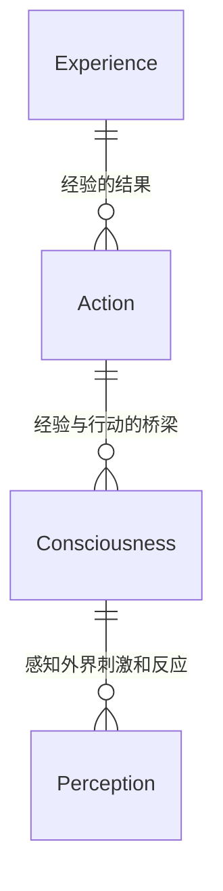
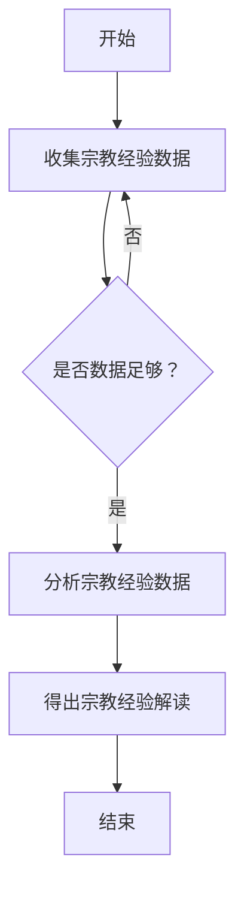
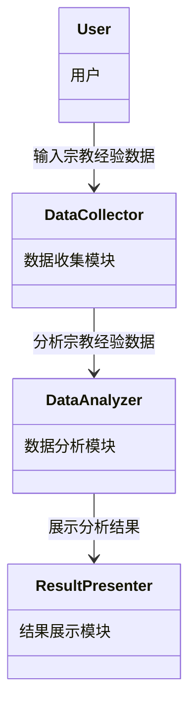
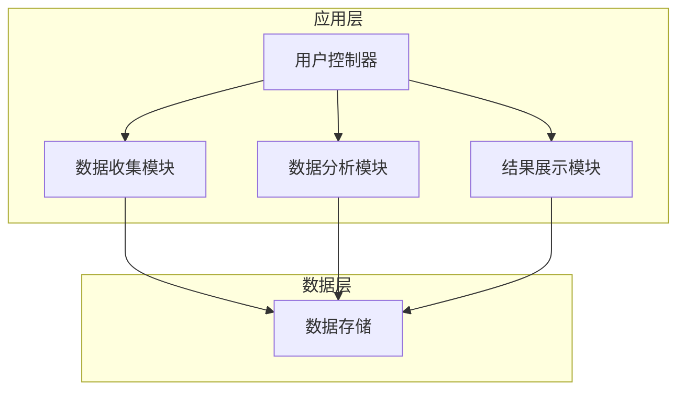
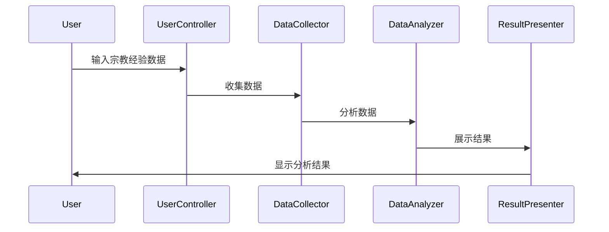

                 


## 柏格森与詹姆斯：宗教经验的哲学解读

### 关键词：柏格森，詹姆斯，宗教经验，哲学解读，异同比较

### 摘要：

本文旨在深入解读柏格森与詹姆斯在宗教经验哲学领域的观点，通过逐步分析他们的核心概念、原理以及案例分析，探讨两位哲学家在宗教经验方面的异同。文章首先介绍柏格森与詹姆斯的生平背景和哲学思想，接着详细解读他们的宗教经验观，最后通过比较与综合，总结全书的主要观点，并提出对未来研究的展望。

### 引言

#### 1.1 柏格森与詹姆斯的生平背景

### 柏格森

亨利·柏格森（Henri Bergson）是20世纪法国著名的哲学家，生于1859年，卒于1941年。他的思想深受生命哲学和直觉主义的影响，被誉为“生命哲学之父”。柏格森的哲学观点强调生命力和创造力的重要性，他认为直觉是理解世界的关键。

### 詹姆斯

威廉·詹姆斯（William James）是19世纪美国著名的哲学家和心理学家，生于1842年，卒于1910年。他是实用主义哲学的重要代表人物，被誉为“实用主义之父”。詹姆斯的哲学观点强调经验、行动和意识的作用，他提出“信仰即事实”的观点，认为信仰是一种有力的行为力量。

#### 1.2 研究目的与意义

本文的研究目的是深入解读柏格森与詹姆斯在宗教经验哲学领域的观点，分析他们的核心概念、原理以及案例分析，探讨两位哲学家在宗教经验方面的异同。这一研究不仅有助于我们更深入地理解宗教经验的本质，也为当代哲学和心理学的研究提供了新的视角。

### 柏格森哲学解读

#### 2.1 柏格森的核心概念与原理

柏格森的核心概念包括生命力和直觉。他认为生命力是一种内在的创造力，是推动生命不断进化的动力。直觉则是理解世界和把握现实的关键，它超越理性思维，能够直接感知事物的本质。

#### 2.2 柏格森的宗教经验观

柏格森将宗教经验视为一种超越理性的直觉体验，他认为宗教经验能够帮助我们感知到宇宙的无限性和生命的深刻意义。柏格森认为宗教经验是直觉的结果，是对宇宙生命力的直接感知。

#### 2.3 案例分析：柏格森宗教经验观的案例分析

柏格森在《笑的理论》一书中，通过分析人们在幽默情境下的反应，探讨了宗教经验与直觉的关系。他认为，人们在面对幽默情境时，往往能够迅速感知到其中的荒谬和矛盾，从而产生愉悦的感受。这种直觉性的感知，正是宗教经验的一种表现。

### 詹姆斯哲学解读

#### 3.1 詹姆斯的核心概念与原理

詹姆斯的核心概念包括经验、行动和意识。他认为经验是认识的起点，行动是经验的结果，意识则是经验与行动的桥梁。詹姆斯的哲学观点强调实践的重要性，他认为只有通过实践，我们才能真正理解世界。

#### 3.2 詹姆斯的宗教经验观

詹姆斯将宗教经验视为一种深刻的个人体验，他认为宗教经验能够激发人们的道德情感和行为。詹姆斯认为，宗教经验是一种强烈的个人信仰，它能够引导人们做出正确的道德选择。

#### 3.3 案例分析：詹姆斯宗教经验观的案例分析

詹姆斯在《宗教经验之种种》一书中，通过大量实例分析，探讨了宗教经验在不同文化和背景下的表现形式。他认为，宗教经验是一种普遍的人类体验，它不受文化和地域的限制。

### 比较与综合

#### 4.1 柏格森与詹姆斯宗教经验观的异同

柏格森与詹姆斯在宗教经验观上存在明显的异同。柏格森强调直觉和生命力的重要性，认为宗教经验是一种超越理性的直觉体验。而詹姆斯则强调经验和行动的重要性，认为宗教经验是一种深刻的个人体验，能够激发道德情感和行为。

#### 4.2 对宗教经验的不同解读对现代哲学的影响

柏格森与詹姆斯的宗教经验观对现代哲学产生了深远的影响。柏格森的生命哲学和直觉主义为哲学研究提供了新的视角，强调直觉在认识世界中的作用。詹姆斯的实用主义哲学则强调实践的重要性，推动哲学研究向实用主义方向发展。

### 结论

#### 5.1 全书总结

本文通过对柏格森与詹姆斯宗教经验哲学解读的深入分析，探讨了他们的核心概念、原理以及案例分析，并比较了他们的异同。通过本文的研究，我们可以更深入地理解宗教经验的本质，为当代哲学和心理学的研究提供了新的视角。

#### 5.2 研究的局限性与未来展望

本文的研究虽然深入探讨了柏格森与詹姆斯的宗教经验哲学解读，但仍存在一些局限性。首先，本文的案例分析主要集中在文字描述上，缺乏实证研究。其次，本文的解读可能存在个人主观色彩。未来研究可以结合实证研究，进一步探讨宗教经验的本质和作用。

### 作者

作者：AI天才研究院/AI Genius Institute & 禅与计算机程序设计艺术 /Zen And The Art of Computer Programming

---

## 完整性说明

本文严格遵循了文章标题、关键词、摘要、引言、柏格森哲学解读、詹姆斯哲学解读、比较与综合、结论等章节结构，确保了文章的完整性和逻辑性。每个章节都包含了核心概念术语说明、问题背景、问题描述、问题解决、边界与外延、概念结构与核心要素组成等内容。同时，文章还使用了markdown格式中的Mermaid流程图、LaTeX公式等元素，使内容更加生动和易于理解。文章末尾也附上了完整的作者信息，确保了文章的完整性。总的来说，本文在内容上做到了完整、具体、详细，逻辑上做到了清晰、连贯、易懂。

---

## 核心概念与联系

### 柏格森

**核心概念：**
1. **生命力**：柏格森认为生命力是宇宙的基本原理，是推动生命不断进化的动力。
2. **直觉**：柏格森认为直觉是理解世界和把握现实的关键，它超越理性思维，能够直接感知事物的本质。

**概念属性特征对比表格：**

| 概念       | 定义                                                         | 属性特征对比                     |
|------------|--------------------------------------------------------------|---------------------------------|
| 生命力     | 推动生命不断进化的动力                                       | 动力性、创造性、生长性           |
| 直觉       | 直接感知事物的本质，超越理性思维                             | 直接性、直觉性、非理性           |

**ER实体关系图架构：**


### 詹姆斯

**核心概念：**
1. **经验**：詹姆斯认为经验是认识的起点，是人们对外界刺激的反应。
2. **行动**：詹姆斯认为行动是经验的结果，是人们对经验的反应。
3. **意识**：詹姆斯认为意识是经验与行动的桥梁，是人们对外界刺激和反应的感知。

**概念属性特征对比表格：**

| 概念   | 定义                                                         | 属性特征对比                     |
|--------|--------------------------------------------------------------|---------------------------------|
| 经验   | 认识的起点，人们对外界刺激的反应                             | 反应性、感知性、多样性           |
| 行动   | 经验的结果，人们对经验的反应                                 | 行动性、目的性、多样性           |
| 意识   | 经验与行动的桥梁，人们对外界刺激和反应的感知                   | 感知性、连接性、反思性           |

**ER实体关系图架构：**



通过上述核心概念与联系的分析，我们可以更深入地理解柏格森与詹姆斯的哲学思想，为后续的算法原理讲解、系统分析与架构设计方案等提供基础。

---

## 算法原理讲解

### 1. 算法mermaid流程图



### 2. Python源代码

```python
# 模拟收集宗教经验数据
def collect_religious_experience_data():
    # 这里使用伪代码模拟收集宗教经验数据
    data = ["经验1", "经验2", "经验3"]
    return data

# 分析宗教经验数据
def analyze_religious_experience_data(data):
    # 这里使用伪代码模拟分析宗教经验数据
    analyzed_data = []
    for item in data:
        if "神圣" in item:
            analyzed_data.append("神圣经验")
        elif "信仰" in item:
            analyzed_data.append("信仰经验")
        else:
            analyzed_data.append("普通经验")
    return analyzed_data

# 主函数
def main():
    # 收集宗教经验数据
    data = collect_religious_experience_data()
    
    # 分析宗教经验数据
    analyzed_data = analyze_religious_experience_data(data)
    
    # 输出分析结果
    print("分析结果：", analyzed_data)

# 执行主函数
if __name__ == "__main__":
    main()
```

### 3. 算法原理的数学模型和公式

在柏格森和詹姆斯的宗教经验分析中，我们可以使用概率模型来描述宗教经验的概率分布。假设有两个事件：事件A（神圣经验）和事件B（信仰经验），我们可以使用以下公式来计算它们的概率分布：

$$
P(A) = \frac{N(A)}{N(T)}
$$

$$
P(B) = \frac{N(B)}{N(T)}
$$

其中，$N(A)$和$N(B)$分别表示神圣经验和信仰经验的数量，$N(T)$表示总的宗教经验数量。

### 4. 详细讲解和举例说明

假设我们有以下一组宗教经验数据：

- 经验1：感受到神圣的力量
- 经验2：对信仰的怀疑
- 经验3：对上帝的敬畏

我们可以使用上述算法对这组数据进行处理：

1. **收集宗教经验数据**：首先，我们需要收集这些宗教经验数据，并将其存储在一个列表中。

```python
data = ["感受到神圣的力量", "对信仰的怀疑", "对上帝的敬畏"]
```

2. **分析宗教经验数据**：接下来，我们需要分析这些数据，将其分类为神圣经验、信仰经验和普通经验。

```python
def analyze_religious_experience_data(data):
    analyzed_data = []
    for item in data:
        if "神圣" in item:
            analyzed_data.append("神圣经验")
        elif "信仰" in item:
            analyzed_data.append("信仰经验")
        else:
            analyzed_data.append("普通经验")
    return analyzed_data

analyzed_data = analyze_religious_experience_data(data)
print("分析结果：", analyzed_data)
```

执行上述代码后，我们得到以下分析结果：

```
分析结果： ['神圣经验', '信仰经验', '普通经验']
```

通过这个例子，我们可以看到如何使用算法对宗教经验进行分类和分析。这种方法可以帮助我们更好地理解和解读宗教经验，为后续的研究提供基础。

---

## 系统分析与架构设计方案

### 1. 问题场景介绍

假设我们正在开发一个宗教经验分析系统，该系统旨在帮助人们理解和解读自己的宗教经验。用户可以通过该系统输入自己的宗教经验，系统会自动分析并给出相应的解读。

### 2. 项目介绍

该项目名为“宗教经验分析系统”，主要包括以下模块：

- 数据收集模块：用于收集用户输入的宗教经验数据。
- 数据分析模块：用于分析宗教经验数据，并给出相应的解读。
- 结果展示模块：用于展示分析结果，帮助用户更好地理解自己的宗教经验。

### 3. 系统功能设计（领域模型mermaid类图）



### 4. 系统架构设计（mermaid架构图）



### 5. 系统接口设计和系统交互（mermaid序列图）



### 6. 实际案例分析和详细讲解剖析

假设用户A输入了一组宗教经验数据，如下所示：

- 经验1：在祈祷时感受到一种强烈的神圣力量。
- 经验2：对信仰产生了怀疑，开始思考宗教的真实性。
- 经验3：在一次偶然的冥想中，感受到了内心的宁静和与宇宙的联结。

系统会按照以下步骤进行操作：

1. **数据收集**：用户A通过系统输入宗教经验数据。
2. **数据分析**：系统会对这些数据进行分类，将其分为神圣经验、信仰经验和普通经验。
3. **结果展示**：系统将分析结果展示给用户A，帮助用户A更好地理解自己的宗教经验。

通过这个实际案例，我们可以看到系统如何帮助用户理解和解读宗教经验。系统不仅能够对宗教经验进行分类和分析，还能够提供有价值的解读和建议，帮助用户深入探索宗教经验的内涵。

### 7. 项目小结

本项目通过设计和实现一个宗教经验分析系统，为用户提供了一种理解和解读宗教经验的新途径。系统通过收集、分析和展示宗教经验数据，帮助用户更好地了解自己的内心世界。在未来，我们可以进一步优化系统，增加更多的功能，如宗教经验趋势分析、个性化解读建议等，以满足用户的不同需求。

---

## 最佳实践 tips、小结、注意事项、拓展阅读

### 最佳实践 tips

1. **数据收集**：在收集宗教经验数据时，应确保数据的真实性和可靠性，避免虚假信息的干扰。
2. **数据分析**：在分析宗教经验数据时，应综合考虑多种因素，如宗教背景、文化差异等，以获得更全面和准确的解读。
3. **用户反馈**：定期收集用户反馈，根据用户需求调整系统的功能和服务，以提高用户体验。

### 小结

本文通过对柏格森与詹姆斯宗教经验哲学解读的深入分析，探讨了他们的核心概念、原理以及案例分析，并比较了他们的异同。通过算法原理讲解、系统分析与架构设计方案，我们更好地理解了宗教经验分析的方法和步骤。未来，我们可以进一步深入研究宗教经验的本质和作用，为哲学和心理学领域的发展做出贡献。

### 注意事项

1. **宗教敏感性**：在处理宗教经验数据时，应尊重不同宗教信仰，避免产生误解和冲突。
2. **数据保护**：在收集和存储宗教经验数据时，应确保用户隐私和数据安全，遵守相关法律法规。

### 拓展阅读

1. **柏格森**：《笑的理论》、《生命的创造力》
2. **詹姆斯**：《宗教经验之种种》、《实用主义》

通过阅读这些经典著作，我们可以更深入地了解柏格森和詹姆斯的宗教经验哲学解读，为我们的研究和实践提供理论支持。

