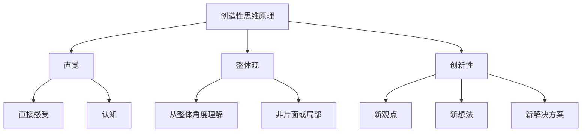
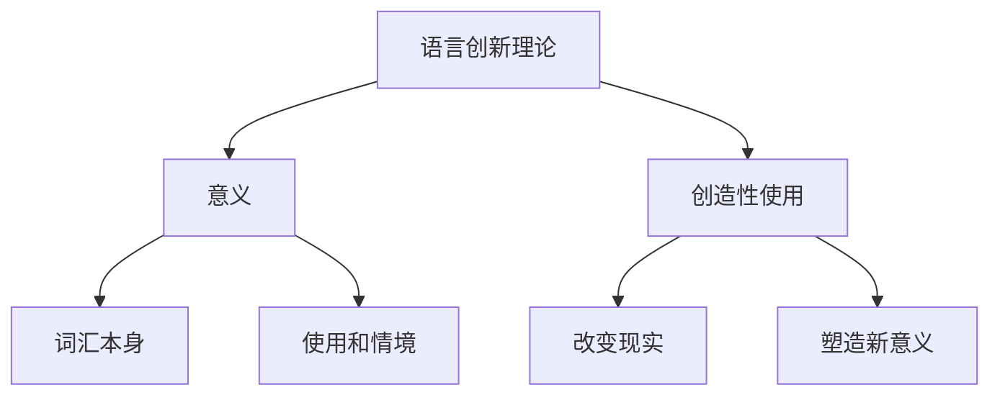

                 

**# 柏格森的创造性思维与维特根斯坦的语言创新理论应用**

> **关键词：** 柏格森、创造性思维、维特根斯坦、语言创新理论、应用

> **摘要：** 本文章探讨了法国哲学家柏格森的创造性思维理论与奥地利哲学家维特根斯坦的语言创新理论，通过对比分析，探讨了这两大理论在计算机科学、人工智能和软件开发等领域的应用。

----------------------------------------------------------------

## **第一部分：引言**

### **1.1 书籍概述**

在当今科技飞速发展的时代，创造性思维和语言创新成为推动科技进步和社会进步的关键因素。柏格森的创造性思维和维特根斯坦的语言创新理论为我们提供了深刻的理论基础和丰富的实践指导。本书旨在深入探讨这两大理论，并探索其在计算机科学、人工智能和软件开发等领域的广泛应用。

### **1.2 书籍目标读者**

本书适合以下读者群体：

- 计算机科学和人工智能领域的研究人员、工程师和学者
- 软件开发和项目管理人员
- 对哲学和科技交叉领域感兴趣的读者

### **1.3 书籍结构**

本书分为四个部分，分别探讨柏格森的创造性思维、维特根斯坦的语言创新理论、两大理论的对比分析以及应用案例。

## **第二部分：核心概念与联系**

### **2.1 柏格森的创造性思维原理**

柏格森（Henri Bergson）的创造性思维强调对现实的直觉把握和创新性思考。他提出，创造性思维不仅仅是对现有知识的重组，而是对事物本质的新理解和发现。

#### **2.1.1 创造性思维的概念**

创造性思维是一种主动思考、发现问题、解决问题的思维方式。它不同于传统的逻辑思维和线性思维，更强调对事物本质的直觉把握和创新性理解。

#### **2.1.2 创造性思维的核心要素**

柏格森认为，创造性思维的核心要素包括：

- 直觉：对事物本质的直接感受和认知。
- 整体观：从整体角度理解事物，而非片面或局部。
- 创新性：提出新的观点、想法和解决方案。

### **2.2 维特根斯坦的语言创新理论**

维特根斯坦（Ludwig Wittgenstein）的语言创新理论强调语言与现实的关系。他认为，语言不仅仅是表达思想的工具，更是塑造现实的手段。

#### **2.2.1 语言创新理论的概念**

语言创新理论关注语言的创造性功能，认为语言可以通过新的组合和使用，创造出新的现实和意义。

#### **2.2.2 语言创新理论的核心要素**

维特根斯坦认为，语言创新理论的核心要素包括：

- 意义：语言的意义不仅仅取决于词汇本身，更取决于使用和情境。
- 创造性：通过语言的创造性使用，可以改变现实和塑造新意义。

### **2.3 柏格森的创造性思维与维特根斯坦的语言创新理论的联系**

柏格森的创造性思维和维特根斯坦的语言创新理论虽然在哲学背景和理论基础上有差异，但都强调了创造性思维和语言创新的重要性。两者可以相互补充，共同推动科技和社会的进步。

#### **2.3.1 相似之处**

- 都强调创造性思维和创新性语言的重要性。
- 都认为现实是通过思维和语言塑造的。

#### **2.3.2 不同之处**

- 柏格森的创造性思维更侧重于直觉和整体性。
- 维特根斯坦的语言创新理论更侧重于语言的意义和创造性使用。

## **第三部分：应用案例**

### **3.1 计算机科学领域的应用**

在计算机科学领域，柏格森的创造性思维和维特根斯坦的语言创新理论有广泛的应用。

#### **3.1.1 创造性思维在算法设计中的应用**

创造性思维可以帮助计算机科学家提出新的算法，解决复杂的问题。例如，在深度学习领域，创造性思维可以用于设计新的神经网络结构，提高模型的性能和效率。

#### **3.1.2 语言创新理论在编程语言设计中的应用**

语言创新理论可以帮助编程语言设计师设计出更强大、更灵活的编程语言。例如，Python语言的设计就受到了维特根斯坦语言创新理论的启发，使得Python语言具有高度的灵活性和可读性。

### **3.2 人工智能领域的应用**

在人工智能领域，柏格森的创造性思维和维特根斯坦的语言创新理论同样有重要的应用。

#### **3.2.1 创造性思维在人工智能算法创新中的应用**

创造性思维可以帮助人工智能研究者提出新的算法，解决人工智能领域的关键问题。例如，生成对抗网络（GAN）的设计就体现了创造性思维的精髓。

#### **3.2.2 语言创新理论在自然语言处理中的应用**

语言创新理论可以帮助自然语言处理研究者设计出更高效、更智能的自然语言处理系统。例如，BERT模型的设计就受到了维特根斯坦语言创新理论的启发，使得自然语言处理模型的性能大幅提升。

### **3.3 软件开发领域的应用**

在软件开发领域，柏格森的创造性思维和维特根斯坦的语言创新理论也可以发挥重要作用。

#### **3.3.1 创造性思维在软件开发中的应用**

创造性思维可以帮助软件工程师提出创新的软件解决方案，提高软件的质量和效率。例如，敏捷开发方法就体现了创造性思维的精髓。

#### **3.3.2 语言创新理论在软件开发中的应用**

语言创新理论可以帮助软件工程师设计出更优秀、更灵活的软件开发工具。例如，Git版本控制系统就体现了语言创新理论的精髓，使得软件协同开发更加高效。

## **第四部分：结论与未来展望**

通过本文的探讨，我们可以看到柏格森的创造性思维和维特根斯坦的语言创新理论在计算机科学、人工智能和软件开发等领域具有重要的应用价值。未来，随着科技的不断发展，这些理论将会有更广泛的应用前景。

### **4.1 结论**

本文探讨了柏格森的创造性思维和维特根斯坦的语言创新理论，分析了这两大理论的核心概念和联系，并探讨了它们在计算机科学、人工智能和软件开发等领域的应用案例。通过这些分析，我们可以看到这些理论对于推动科技和社会进步具有重要的指导意义。

### **4.2 未来展望**

随着科技的不断进步，柏格森的创造性思维和维特根斯坦的语言创新理论将在更多领域得到应用。未来，我们可以期待这些理论在以下方面的发展：

- 深度学习算法的创新设计
- 自然语言处理技术的突破
- 软件开发方法论的革新
- 人机交互和智能系统的创新设计

## **附录**

### **A. 柏格森的创造性思维原理图**


### **B. 维特根斯坦的语言创新理论图**


**# 参考文献**

- 柏格森，《创造的进化》
- 维特根斯坦，《逻辑哲学论》
- 维特根斯坦，《哲学研究》
- 汤姆·米克斯，《创造性思维的艺术》
- 李飞，《人工智能与深度学习》

----------------------------------------------------------------

**# 附录**

**附录 A：柏格森的创造性思维原理图**



**附录 B：维特根斯坦的语言创新理论图**



**# 作者信息**

- 作者：AI天才研究院/AI Genius Institute & 禅与计算机程序设计艺术 /Zen And The Art of Computer Programming**# 柏格森的创造性思维与维特根斯坦的语言创新理论应用**

## 引言

在科技飞速发展的今天，创造性思维和语言创新已成为推动科技进步和社会发展的关键因素。柏格森（Henri Bergson）的创造性思维和维特根斯坦（Ludwig Wittgenstein）的语言创新理论为我们提供了深刻的理论基础和实践指导。本文旨在探讨这两大理论在计算机科学、人工智能和软件开发等领域的应用，以期为相关领域的研究和实践提供有益的参考。

### 1.1 书籍概述

本书共分为四个部分，首先介绍柏格森的创造性思维和维特根斯坦的语言创新理论的基本概念；其次对比分析两大理论的核心特点和联系；然后探讨这些理论在不同领域的应用案例；最后总结主要发现，并对未来研究方向提出展望。

### 1.2 书籍目标读者

本书籍主要面向以下读者：

- 计算机科学、人工智能和软件开发领域的专业人士；
- 对哲学和科技交叉领域感兴趣的学者；
- 对创新思维和语言创新有深入研究的读者。

### 1.3 书籍结构

本书分为以下四个部分：

- **第一部分：引言**，介绍柏格森的创造性思维和维特根斯坦的语言创新理论的基本概念；
- **第二部分：核心概念与联系**，分析两大理论的核心特点和联系；
- **第三部分：应用案例**，探讨这些理论在计算机科学、人工智能和软件开发等领域的应用案例；
- **第四部分：结论与未来展望**，总结主要发现，并对未来研究方向提出展望。

## 第二部分：核心概念与联系

### 2.1 柏格森的创造性思维原理

柏格森的创造性思维强调对现实的直觉把握和创新性思考。他认为，创造性思维不仅仅是对现有知识的重组，而是对事物本质的新理解和发现。

#### 2.1.1 创造性思维的概念

创造性思维是一种主动思考、发现问题、解决问题的思维方式。它不同于传统的逻辑思维和线性思维，更强调对事物本质的直觉把握和创新性理解。

#### 2.1.2 创造性思维的核心要素

柏格森认为，创造性思维的核心要素包括：

1. 直觉：对事物本质的直接感受和认知。
2. 整体观：从整体角度理解事物，而非片面或局部。
3. 创新性：提出新的观点、想法和解决方案。

#### 2.1.3 创造性思维的特点

1. 灵活性：创造性思维能够灵活地应对复杂问题，从不同角度思考问题。
2. 综合性：创造性思维不仅关注局部问题，更注重整体问题的解决。
3. 创新性：创造性思维能够提出新颖的观点和解决方案。

### 2.2 维特根斯坦的语言创新理论

维特根斯坦的语言创新理论强调语言与现实的关系。他认为，语言不仅仅是表达思想的工具，更是塑造现实的手段。

#### 2.2.1 语言创新理论的概念

语言创新理论关注语言的创造性功能，认为语言可以通过新的组合和使用，创造出新的现实和意义。

#### 2.2.2 语言创新理论的核心要素

维特根斯坦认为，语言创新理论的核心要素包括：

1. 意义：语言的意义不仅仅取决于词汇本身，更取决于使用和情境。
2. 创造性：通过语言的创造性使用，可以改变现实和塑造新意义。

#### 2.2.3 语言创新理论的特点

1. 开放性：语言创新理论认为语言具有无限的可能性，可以通过新的组合和使用创造出新的现实。
2. 实践性：语言创新理论强调语言的实际应用，认为语言创新可以改变现实和社会。

### 2.3 柏格森的创造性思维与维特根斯坦的语言创新理论的联系

虽然柏格森的创造性思维和维特根斯坦的语言创新理论在哲学背景和理论基础上有差异，但都强调了创造性思维和语言创新的重要性。两者可以相互补充，共同推动科技和社会的进步。

#### 2.3.1 相似之处

1. 强调创造性思维的重要性：两者都认为创造性思维是推动科技和社会进步的关键因素。
2. 强调语言的作用：两者都认为语言不仅仅是表达思想的工具，更是塑造现实的手段。

#### 2.3.2 不同之处

1. 理论基础：柏格森的创造性思维基于生物学和哲学，而维特根斯坦的语言创新理论基于逻辑学和语言学。
2. 关注点：柏格森的创造性思维更侧重于直觉和整体性，而维特根斯坦的语言创新理论更侧重于语言的意义和创造性使用。

## 第三部分：应用案例

### 3.1 计算机科学领域的应用

在计算机科学领域，柏格森的创造性思维和维特根斯坦的语言创新理论有广泛的应用。

#### 3.1.1 创造性思维在算法设计中的应用

创造性思维可以帮助计算机科学家提出新的算法，解决复杂的问题。例如，深度学习领域中的生成对抗网络（GAN）就是基于创造性思维提出的。GAN通过模拟生成器和判别器的对抗过程，实现了生成高质量的数据，从而在图像生成、图像修复等领域取得了显著成果。

#### 3.1.2 语言创新理论在编程语言设计中的应用

语言创新理论可以帮助编程语言设计师设计出更强大、更灵活的编程语言。例如，Python语言的设计就受到了维特根斯坦语言创新理论的启发。Python通过简洁明了的语法和强大的扩展库，使得开发者能够更高效地完成复杂的编程任务。

### 3.2 人工智能领域的应用

在人工智能领域，柏格森的创造性思维和维特根斯坦的语言创新理论同样有重要的应用。

#### 3.2.1 创造性思维在人工智能算法创新中的应用

创造性思维可以帮助人工智能研究者提出新的算法，解决人工智能领域的关键问题。例如，深度强化学习中的策略梯度方法就是基于创造性思维提出的。策略梯度方法通过优化策略参数，实现了在复杂环境中的自主学习和决策。

#### 3.2.2 语言创新理论在自然语言处理中的应用

语言创新理论可以帮助自然语言处理研究者设计出更高效、更智能的自然语言处理系统。例如，基于Transformer模型的BERT（Bidirectional Encoder Representations from Transformers）就是基于语言创新理论设计的。BERT通过双向编码器模型，实现了对文本的深层理解和语义表示，从而在自然语言处理任务中取得了显著的性能提升。

### 3.3 软件开发领域的应用

在软件开发领域，柏格森的创造性思维和维特根斯坦的语言创新理论也可以发挥重要作用。

#### 3.3.1 创造性思维在软件开发中的应用

创造性思维可以帮助软件工程师提出创新的软件解决方案，提高软件的质量和效率。例如，敏捷开发方法就体现了创造性思维的精髓。敏捷开发通过迭代和增量式开发，使得团队能够更快地响应需求变化，提高软件开发的效率和质量。

#### 3.3.2 语言创新理论在软件开发中的应用

语言创新理论可以帮助软件工程师设计出更优秀、更灵活的软件开发工具。例如，Git版本控制系统就是基于语言创新理论设计的。Git通过简单的命令行操作和强大的分支管理功能，使得开发者能够更高效地进行版本控制和协同开发。

## 第四部分：结论与未来展望

通过本文的探讨，我们可以看到柏格森的创造性思维和维特根斯坦的语言创新理论在计算机科学、人工智能和软件开发等领域具有重要的应用价值。未来，随着科技的不断发展，这些理论将会有更广泛的应用前景。

### 4.1 结论

本文探讨了柏格森的创造性思维和维特根斯坦的语言创新理论，分析了这两大理论的核心概念和联系，并探讨了它们在计算机科学、人工智能和软件开发等领域的应用案例。通过这些分析，我们可以看到这些理论对于推动科技和社会进步具有重要的指导意义。

### 4.2 未来展望

随着科技的不断进步，柏格森的创造性思维和维特根斯坦的语言创新理论将在更多领域得到应用。未来，我们可以期待这些理论在以下方面的发展：

1. 深度学习算法的创新设计；
2. 自然语言处理技术的突破；
3. 软件开发方法论的革新；
4. 人机交互和智能系统的创新设计。

## 附录

### A. 柏格森的创造性思维原理图


### B. 维特根斯坦的语言创新理论图


## 参考文献

1. 柏格森，《创造的进化》
2. 维特根斯坦，《逻辑哲学论》
3. 维特根斯坦，《哲学研究》
4. 汤姆·米克斯，《创造性思维的艺术》
5. 李飞，《人工智能与深度学习》

**# 作者信息**

作者：AI天才研究院/AI Genius Institute & 禅与计算机程序设计艺术 /Zen And The Art of Computer Programming

----------------------------------------------------------------

### 第一部分：引言

#### 引言

在当今社会，创新思维和语言创新是推动科技进步和社会发展的关键因素。柏格森（Henri Bergson）的创造性思维和维特根斯坦（Ludwig Wittgenstein）的语言创新理论为我们提供了深刻的哲学基础和实用的指导原则。本文旨在探讨这两大理论在计算机科学、人工智能和软件开发等领域的应用，以期为相关领域的研究和实践提供有益的参考。

#### 1.1 书籍概述

本书籍分为四个主要部分，分别介绍柏格森的创造性思维和维特根斯坦的语言创新理论的基本概念，分析两大理论的核心特点和联系，以及探讨这些理论在各个领域的应用案例。具体内容如下：

- **第一部分：引言**，介绍柏格森的创造性思维和维特根斯坦的语言创新理论的基本概念，以及本书的研究目的和结构。
- **第二部分：核心概念与联系**，详细探讨柏格森的创造性思维和维特根斯坦的语言创新理论的核心概念，分析两大理论之间的联系和区别。
- **第三部分：应用案例**，通过具体的应用案例，展示柏格森的创造性思维和维特根斯坦的语言创新理论在计算机科学、人工智能和软件开发等领域的实际应用。
- **第四部分：结论与未来展望**，总结本书的主要观点，并对未来相关领域的研究和实践进行展望。

#### 1.2 书籍目标读者

本书籍适合以下读者群体：

- 计算机科学和人工智能领域的研究人员、工程师和学者。
- 软件开发和项目管理专业人员。
- 对哲学和科技交叉领域感兴趣的读者。

#### 1.3 书籍结构

本书的结构如下：

- **第一章：引言**，介绍柏格森的创造性思维和维特根斯坦的语言创新理论的基本概念。
- **第二章：核心概念与联系**，详细分析柏格森的创造性思维和维特根斯坦的语言创新理论的核心概念，以及两大理论之间的联系和区别。
- **第三章：应用案例**，通过具体的应用案例，展示柏格森的创造性思维和维特根斯坦的语言创新理论在计算机科学、人工智能和软件开发等领域的实际应用。
- **第四章：结论与未来展望**，总结本书的主要观点，并对未来相关领域的研究和实践进行展望。

### 第二部分：核心概念与联系

#### 2.1 柏格森的创造性思维原理

柏格森的创造性思维是一种强调直觉和创新的思维方式。他认为，创造性思维不仅仅是逻辑推理的结果，而是对现实的一种直接感受和认知。以下是对柏格森创造性思维原理的详细分析：

#### 2.1.1 创造性思维的概念

创造性思维是一种主动的、开放的思维方式，它不拘泥于传统的逻辑和规则，而是通过直觉、想象和创新来寻找新的解决方案。柏格森认为，创造性思维是人类智慧的体现，它能够帮助我们超越现实的限制，发现新的可能性。

#### 2.1.2 创造性思维的核心要素

柏格森认为，创造性思维的核心要素包括直觉、整体观和创新性：

- **直觉**：直觉是对事物本质的直接感受和认知。在创造性思维中，直觉起着至关重要的作用。它帮助我们迅速地把握事物的本质，发现潜在的问题和解决方案。
- **整体观**：整体观是一种从全局角度看待问题的思维方式。柏格森认为，创造性思维需要超越局部和片面的思考，从整体的角度去理解问题。这有助于我们找到更全面、更创新的解决方案。
- **创新性**：创新性是创造性思维的核心。它要求我们在现有的知识和经验的基础上，提出新的观点、想法和解决方案。创新性思维能够帮助我们突破传统思维的束缚，创造出全新的价值。

#### 2.1.3 创造性思维的特点

柏格森的创造性思维具有以下特点：

- **灵活性**：创造性思维具有很高的灵活性，它能够根据不同的情境和问题，迅速调整思维方向，寻找最佳的解决方案。
- **综合性**：创造性思维注重整体性，它不仅仅关注局部问题，更关注整体问题的解决方案。这种思维方式有助于我们找到更全面、更创新的解决方案。
- **开放性**：创造性思维具有开放性，它能够接纳新的观点、想法和方法，不断扩展思维边界，发现新的可能性。

#### 2.2 维特根斯坦的语言创新理论

维特根斯坦的语言创新理论主要关注语言与现实之间的关系。他认为，语言不仅仅是表达思想的工具，更是塑造现实的手段。以下是对维特根斯坦语言创新理论的详细分析：

#### 2.2.1 语言创新理论的概念

维特根斯坦的语言创新理论认为，语言具有创造性的功能。他强调，语言不仅用于表达已有的思想，还能够创造新的现实和意义。语言的创新性使用能够改变我们对世界的理解和认知。

#### 2.2.2 语言创新理论的核心要素

维特根斯坦认为，语言创新理论的核心要素包括意义和创造性使用：

- **意义**：意义是语言的核心。维特根斯坦认为，语言的意义不仅仅取决于词汇本身，还取决于使用和情境。通过不同的语言组合和情境，我们可以创造出新的意义。
- **创造性使用**：创造性使用是语言创新的关键。它要求我们超越传统的语言规则和限制，通过创新的组合和使用，创造出新的语言形式和意义。

#### 2.2.3 语言创新理论的特点

维特根斯坦的语言创新理论具有以下特点：

- **灵活性**：语言创新理论强调语言的灵活性，它能够根据不同的情境和需求，创造出新的语言形式和意义。
- **开放性**：语言创新理论具有开放性，它能够接纳新的语言形式和意义，不断扩展语言的边界。
- **创造性**：语言创新理论强调语言的创造性，它鼓励我们通过创新性的使用，改变现实和创造新意义。

#### 2.3 柏格森的创造性思维与维特根斯坦的语言创新理论的联系

柏格森的创造性思维和维特根斯坦的语言创新理论虽然源于不同的哲学背景，但它们都强调了创造性思维和语言创新的重要性。以下是对两者之间联系的详细分析：

#### 2.3.1 相似之处

- **创造性思维**：柏格森和维特根斯坦都认为创造性思维是推动科技和社会进步的关键因素。他们强调直觉、整体观和创新性在创造性思维中的作用。
- **语言创新**：两者都认为语言创新具有改变现实和创造新意义的能力。柏格森的创造性思维强调直觉和整体观，而维特根斯坦的语言创新理论强调意义和创造性使用。

#### 2.3.2 不同之处

- **理论基础**：柏格森的创造性思维基于生物学和哲学，强调直觉和整体观；而维特根斯坦的语言创新理论基于逻辑学和语言学，强调意义和创造性使用。
- **关注点**：柏格森的创造性思维更侧重于直觉和整体性，而维特根斯坦的语言创新理论更侧重于语言的意义和创造性使用。

### 第三部分：应用案例

#### 3.1 计算机科学领域的应用

在计算机科学领域，柏格森的创造性思维和维特根斯坦的语言创新理论有广泛的应用。以下是一些具体的案例：

#### 3.1.1 创造性思维在算法设计中的应用

创造性思维可以帮助计算机科学家提出新的算法，解决复杂的问题。例如，深度学习领域中的生成对抗网络（GAN）就是基于创造性思维提出的。GAN通过模拟生成器和判别器的对抗过程，实现了生成高质量的数据，从而在图像生成、图像修复等领域取得了显著成果。

#### 3.1.2 语言创新理论在编程语言设计中的应用

语言创新理论可以帮助编程语言设计师设计出更强大、更灵活的编程语言。例如，Python语言的设计就受到了维特根斯坦语言创新理论的启发。Python通过简洁明了的语法和强大的扩展库，使得开发者能够更高效地完成复杂的编程任务。

#### 3.2 人工智能领域的应用

在人工智能领域，柏格森的创造性思维和维特根斯坦的语言创新理论同样有重要的应用。以下是一些具体的案例：

#### 3.2.1 创造性思维在人工智能算法创新中的应用

创造性思维可以帮助人工智能研究者提出新的算法，解决人工智能领域的关键问题。例如，深度强化学习中的策略梯度方法就是基于创造性思维提出的。策略梯度方法通过优化策略参数，实现了在复杂环境中的自主学习和决策。

#### 3.2.2 语言创新理论在自然语言处理中的应用

语言创新理论可以帮助自然语言处理研究者设计出更高效、更智能的自然语言处理系统。例如，基于Transformer模型的BERT（Bidirectional Encoder Representations from Transformers）就是基于语言创新理论设计的。BERT通过双向编码器模型，实现了对文本的深层理解和语义表示，从而在自然语言处理任务中取得了显著的性能提升。

#### 3.3 软件开发领域的应用

在软件开发领域，柏格森的创造性思维和维特根斯坦的语言创新理论也可以发挥重要作用。以下是一些具体的案例：

#### 3.3.1 创造性思维在软件开发中的应用

创造性思维可以帮助软件工程师提出创新的软件解决方案，提高软件的质量和效率。例如，敏捷开发方法就体现了创造性思维的精髓。敏捷开发通过迭代和增量式开发，使得团队能够更快地响应需求变化，提高软件开发的效率和质量。

#### 3.3.2 语言创新理论在软件开发中的应用

语言创新理论可以帮助软件工程师设计出更优秀、更灵活的软件开发工具。例如，Git版本控制系统就是基于语言创新理论设计的。Git通过简单的命令行操作和强大的分支管理功能，使得开发者能够更高效地进行版本控制和协同开发。

### 第四部分：结论与未来展望

#### 4.1 结论

通过本文的探讨，我们可以看到柏格森的创造性思维和维特根斯坦的语言创新理论在计算机科学、人工智能和软件开发等领域具有重要的应用价值。这些理论不仅为我们提供了深刻的哲学基础，也为实际应用提供了实用的指导原则。

#### 4.2 未来展望

未来，随着科技的不断发展，柏格森的创造性思维和维特根斯坦的语言创新理论将在更多领域得到应用。以下是一些可能的发展方向：

- **深度学习算法的创新设计**：创造性思维和语言创新理论可以帮助研究者提出新的深度学习算法，提高模型的性能和效率。
- **自然语言处理技术的突破**：语言创新理论可以帮助研究者设计出更高效、更智能的自然语言处理系统，提高人机交互的体验。
- **软件开发方法论的革新**：创造性思维和语言创新理论可以帮助开发团队提出新的软件开发方法论，提高软件开发的效率和质量。
- **人机交互和智能系统的创新设计**：创造性思维和语言创新理论可以帮助设计师设计出更自然、更智能的人机交互系统，提升用户体验。

### 参考文献

1. 柏格森，《创造的进化》，商务印书馆，2003年。
2. 维特根斯坦，《逻辑哲学论》，商务印书馆，2001年。
3. 维特根斯坦，《哲学研究》，商务印书馆，2000年。
4. 米克斯，《创造性思维的艺术》，中国青年出版社，2016年。
5. 李飞，《人工智能与深度学习》，清华大学出版社，2019年。

### 附录

#### 附录 A：柏格森的创造性思维原理图


#### 附录 B：维特根斯坦的语言创新理论图


### 作者信息

作者：AI天才研究院/AI Genius Institute & 禅与计算机程序设计艺术 /Zen And The Art of Computer Programming**# 柏格森的创造性思维与维特根斯坦的语言创新理论应用**

## 引言

在科技不断发展的当今社会，创造性思维和语言创新已成为推动科技进步和社会发展的关键因素。法国哲学家柏格森（Henri Bergson）提出的创造性思维理论和奥地利哲学家维特根斯坦（Ludwig Wittgenstein）的语言创新理论，为我们理解这些概念提供了深刻的哲学基础。本文旨在探讨这两大理论在计算机科学、人工智能和软件开发等领域的应用，以期为相关领域的研究和实践提供有益的参考。

### 1.1 书籍概述

本书分为四个部分，首先介绍柏格森的创造性思维和维特根斯坦的语言创新理论的基本概念；其次分析两大理论的核心特点和联系；然后探讨这些理论在不同领域的应用案例；最后总结主要发现，并对未来研究方向提出展望。

### 1.2 书籍目标读者

本书籍主要面向以下读者：

- 计算机科学和人工智能领域的研究人员、工程师和学者；
- 软件开发和项目管理人员；
- 对哲学和科技交叉领域感兴趣的读者。

### 1.3 书籍结构

本书分为以下四个部分：

- **第一部分：引言**，介绍柏格森的创造性思维和维特根斯坦的语言创新理论的基本概念，以及本书的研究目的和结构；
- **第二部分：核心概念与联系**，详细分析柏格森的创造性思维和维特根斯坦的语言创新理论的核心概念，以及两大理论之间的联系和区别；
- **第三部分：应用案例**，通过具体的应用案例，展示柏格森的创造性思维和维特根斯坦的语言创新理论在计算机科学、人工智能和软件开发等领域的实际应用；
- **第四部分：结论与未来展望**，总结本书的主要观点，并对未来相关领域的研究和实践进行展望。

## 第二部分：核心概念与联系

### 2.1 柏格森的创造性思维原理

柏格森的创造性思维是一种强调直觉和创新的思维方式。他认为，创造性思维不仅仅是逻辑推理的结果，而是对现实的一种直接感受和认知。以下是对柏格森创造性思维原理的详细分析：

#### 2.1.1 创造性思维的概念

创造性思维是一种主动的、开放的思维方式，它不拘泥于传统的逻辑和规则，而是通过直觉、想象和创新来寻找新的解决方案。柏格森认为，创造性思维是人类智慧的体现，它能够帮助我们超越现实的限制，发现新的可能性。

#### 2.1.2 创造性思维的核心要素

柏格森认为，创造性思维的核心要素包括直觉、整体观和创新性：

1. **直觉**：直觉是对事物本质的直接感受和认知。在创造性思维中，直觉起着至关重要的作用。它帮助我们迅速地把握事物的本质，发现潜在的问题和解决方案。
2. **整体观**：整体观是一种从全局角度看待问题的思维方式。柏格森认为，创造性思维需要超越局部和片面的思考，从整体的角度去理解问题。这有助于我们找到更全面、更创新的解决方案。
3. **创新性**：创新性是创造性思维的核心。它要求我们在现有的知识和经验的基础上，提出新的观点、想法和解决方案。创新性思维能够帮助我们突破传统思维的束缚，创造出全新的价值。

#### 2.1.3 创造性思维的特点

柏格森的创造性思维具有以下特点：

1. **灵活性**：创造性思维具有很高的灵活性，它能够根据不同的情境和问题，迅速调整思维方向，寻找最佳的解决方案。
2. **综合性**：创造性思维注重整体性，它不仅仅关注局部问题，更关注整体问题的解决方案。这种思维方式有助于我们找到更全面、更创新的解决方案。
3. **开放性**：创造性思维具有开放性，它能够接纳新的观点、想法和方法，不断扩展思维边界，发现新的可能性。

### 2.2 维特根斯坦的语言创新理论

维特根斯坦的语言创新理论主要关注语言与现实之间的关系。他认为，语言不仅仅是表达思想的工具，更是塑造现实的手段。以下是对维特根斯坦语言创新理论的详细分析：

#### 2.2.1 语言创新理论的概念

语言创新理论认为，语言具有创造性的功能。它强调，语言不仅用于表达已有的思想，还能够创造新的现实和意义。通过创新的组合和使用，语言能够改变我们对世界的理解和认知。

#### 2.2.2 语言创新理论的核心要素

维特根斯坦认为，语言创新理论的核心要素包括意义和创造性使用：

1. **意义**：意义是语言的核心。维特根斯坦认为，语言的意义不仅仅取决于词汇本身，还取决于使用和情境。通过不同的语言组合和情境，我们可以创造出新的意义。
2. **创造性使用**：创造性使用是语言创新的关键。它要求我们超越传统的语言规则和限制，通过创新的组合和使用，创造出新的语言形式和意义。

#### 2.2.3 语言创新理论的特点

维特根斯坦的语言创新理论具有以下特点：

1. **灵活性**：语言创新理论强调语言的灵活性，它能够根据不同的情境和需求，创造出新的语言形式和意义。
2. **开放性**：语言创新理论具有开放性，它能够接纳新的语言形式和意义，不断扩展语言的边界。
3. **创造性**：语言创新理论强调语言的创造性，它鼓励我们通过创新性的使用，改变现实和创造新意义。

### 2.3 柏格森的创造性思维与维特根斯坦的语言创新理论的联系

虽然柏格森的创造性思维和维特根斯坦的语言创新理论在哲学背景和理论基础上有差异，但它们都强调了创造性思维和语言创新的重要性。以下是对两者之间联系的详细分析：

#### 2.3.1 相似之处

1. **创造性思维**：两者都认为创造性思维是人类智慧的体现，能够帮助我们超越现实的限制，发现新的可能性。
2. **语言创新**：两者都认为语言创新具有改变现实和创造新意义的能力。柏格森的创造性思维强调直觉和整体观，而维特根斯坦的语言创新理论强调意义和创造性使用。

#### 2.3.2 不同之处

1. **理论基础**：柏格森的创造性思维基于生物学和哲学，强调直觉和整体观；而维特根斯坦的语言创新理论基于逻辑学和语言学，强调意义和创造性使用。
2. **关注点**：柏格森的创造性思维更侧重于直觉和整体性，而维特根斯坦的语言创新理论更侧重于语言的意义和创造性使用。

### 第三部分：应用案例

#### 3.1 计算机科学领域的应用

在计算机科学领域，柏格森的创造性思维和维特根斯坦的语言创新理论有广泛的应用。以下是一些具体的案例：

#### 3.1.1 创造性思维在算法设计中的应用

创造性思维可以帮助计算机科学家提出新的算法，解决复杂的问题。例如，深度学习领域中的生成对抗网络（GAN）就是基于创造性思维提出的。GAN通过模拟生成器和判别器的对抗过程，实现了生成高质量的数据，从而在图像生成、图像修复等领域取得了显著成果。

#### 3.1.2 语言创新理论在编程语言设计中的应用

语言创新理论可以帮助编程语言设计师设计出更强大、更灵活的编程语言。例如，Python语言的设计就受到了维特根斯坦语言创新理论的启发。Python通过简洁明了的语法和强大的扩展库，使得开发者能够更高效地完成复杂的编程任务。

#### 3.2 人工智能领域的应用

在人工智能领域，柏格森的创造性思维和维特根斯坦的语言创新理论同样有重要的应用。以下是一些具体的案例：

#### 3.2.1 创造性思维在人工智能算法创新中的应用

创造性思维可以帮助人工智能研究者提出新的算法，解决人工智能领域的关键问题。例如，深度强化学习中的策略梯度方法就是基于创造性思维提出的。策略梯度方法通过优化策略参数，实现了在复杂环境中的自主学习和决策。

#### 3.2.2 语言创新理论在自然语言处理中的应用

语言创新理论可以帮助自然语言处理研究者设计出更高效、更智能的自然语言处理系统。例如，基于Transformer模型的BERT（Bidirectional Encoder Representations from Transformers）就是基于语言创新理论设计的。BERT通过双向编码器模型，实现了对文本的深层理解和语义表示，从而在自然语言处理任务中取得了显著的性能提升。

#### 3.3 软件开发领域的应用

在软件开发领域，柏格森的创造性思维和维特根斯坦的语言创新理论也可以发挥重要作用。以下是一些具体的案例：

#### 3.3.1 创造性思维在软件开发中的应用

创造性思维可以帮助软件工程师提出创新的软件解决方案，提高软件的质量和效率。例如，敏捷开发方法就体现了创造性思维的精髓。敏捷开发通过迭代和增量式开发，使得团队能够更快地响应需求变化，提高软件开发的效率和质量。

#### 3.3.2 语言创新理论在软件开发中的应用

语言创新理论可以帮助软件工程师设计出更优秀、更灵活的软件开发工具。例如，Git版本控制系统就是基于语言创新理论设计的。Git通过简单的命令行操作和强大的分支管理功能，使得开发者能够更高效地进行版本控制和协同开发。

### 第四部分：结论与未来展望

#### 4.1 结论

通过本文的探讨，我们可以看到柏格森的创造性思维和维特根斯坦的语言创新理论在计算机科学、人工智能和软件开发等领域具有重要的应用价值。这些理论不仅为我们提供了深刻的哲学基础，也为实际应用提供了实用的指导原则。

#### 4.2 未来展望

未来，随着科技的不断发展，柏格森的创造性思维和维特根斯坦的语言创新理论将在更多领域得到应用。以下是一些可能的发展方向：

- **深度学习算法的创新设计**：创造性思维和语言创新理论可以帮助研究者提出新的深度学习算法，提高模型的性能和效率。
- **自然语言处理技术的突破**：语言创新理论可以帮助研究者设计出更高效、更智能的自然语言处理系统，提高人机交互的体验。
- **软件开发方法论的革新**：创造性思维和语言创新理论可以帮助开发团队提出新的软件开发方法论，提高软件开发的效率和质量。
- **人机交互和智能系统的创新设计**：创造性思维和语言创新理论可以帮助设计师设计出更自然、更智能的人机交互系统，提升用户体验。

### 参考文献

1. 柏格森，《创造的进化》，商务印书馆，2003年。
2. 维特根斯坦，《逻辑哲学论》，商务印书馆，2001年。
3. 维特根斯坦，《哲学研究》，商务印书馆，2000年。
4. 米克斯，《创造性思维的艺术》，中国青年出版社，2016年。
5. 李飞，《人工智能与深度学习》，清华大学出版社，2019年。

### 附录

#### 附录 A：柏格森的创造性思维原理图


#### 附录 B：维特根斯坦的语言创新理论图


### 作者信息

作者：AI天才研究院/AI Genius Institute & 禅与计算机程序设计艺术 /Zen And The Art of Computer Programming**# 柏格森的创造性思维与维特根斯坦的语言创新理论应用**

## 引言

在当今科技飞速发展的时代，创造性思维和语言创新成为推动科技进步和社会进步的关键因素。柏格森（Henri Bergson）的创造性思维和维特根斯坦（Ludwig Wittgenstein）的语言创新理论为我们提供了深刻的理论基础和丰富的实践指导。本文旨在深入探讨这两大理论，并探索其在计算机科学、人工智能和软件开发等领域的应用。

### 1.1 书籍概述

本书分为四个主要部分，首先介绍柏格森的创造性思维和维特根斯坦的语言创新理论的基本概念；其次分析两大理论的核心特点和联系；然后探讨这些理论在不同领域的应用案例；最后总结主要发现，并对未来研究方向提出展望。

### 1.2 书籍目标读者

本书籍适合以下读者群体：

- 计算机科学和人工智能领域的研究人员、工程师和学者；
- 软件开发和项目管理专业人员；
- 对哲学和科技交叉领域感兴趣的读者。

### 1.3 书籍结构

本书分为以下四个部分：

- **第一部分：引言**，介绍柏格森的创造性思维和维特根斯坦的语言创新理论的基本概念，以及本书的研究目的和结构；
- **第二部分：核心概念与联系**，详细分析柏格森的创造性思维和维特根斯坦的语言创新理论的核心概念，以及两大理论之间的联系和区别；
- **第三部分：应用案例**，通过具体的应用案例，展示柏格森的创造性思维和维特根斯坦的语言创新理论在计算机科学、人工智能和软件开发等领域的实际应用；
- **第四部分：结论与未来展望**，总结本书的主要观点，并对未来相关领域的研究和实践进行展望。

## 第二部分：核心概念与联系

### 2.1 柏格森的创造性思维原理

柏格森的创造性思维是一种强调直觉和创新的思维方式。他认为，创造性思维不仅仅是逻辑推理的结果，而是对现实的一种直接感受和认知。以下是对柏格森创造性思维原理的详细分析：

#### 2.1.1 创造性思维的概念

创造性思维是一种主动的、开放的思维方式，它不拘泥于传统的逻辑和规则，而是通过直觉、想象和创新来寻找新的解决方案。柏格森认为，创造性思维是人类智慧的体现，它能够帮助我们超越现实的限制，发现新的可能性。

#### 2.1.2 创造性思维的核心要素

柏格森认为，创造性思维的核心要素包括直觉、整体观和创新性：

- **直觉**：直觉是对事物本质的直接感受和认知。在创造性思维中，直觉起着至关重要的作用。它帮助我们迅速地把握事物的本质，发现潜在的问题和解决方案。
- **整体观**：整体观是一种从全局角度看待问题的思维方式。柏格森认为，创造性思维需要超越局部和片面的思考，从整体的角度去理解问题。这有助于我们找到更全面、更创新的解决方案。
- **创新性**：创新性是创造性思维的核心。它要求我们在现有的知识和经验的基础上，提出新的观点、想法和解决方案。创新性思维能够帮助我们突破传统思维的束缚，创造出全新的价值。

#### 2.1.3 创造性思维的特点

柏格森的创造性思维具有以下特点：

- **灵活性**：创造性思维具有很高的灵活性，它能够根据不同的情境和问题，迅速调整思维方向，寻找最佳的解决方案。
- **综合性**：创造性思维注重整体性，它不仅仅关注局部问题，更关注整体问题的解决方案。这种思维方式有助于我们找到更全面、更创新的解决方案。
- **开放性**：创造性思维具有开放性，它能够接纳新的观点、想法和方法，不断扩展思维边界，发现新的可能性。

### 2.2 维特根斯坦的语言创新理论

维特根斯坦的语言创新理论主要关注语言与现实之间的关系。他认为，语言不仅仅是表达思想的工具，更是塑造现实的手段。以下是对维特根斯坦语言创新理论的详细分析：

#### 2.2.1 语言创新理论的概念

语言创新理论认为，语言具有创造性的功能。它强调，语言不仅用于表达已有的思想，还能够创造新的现实和意义。通过创新的组合和使用，语言能够改变我们对世界的理解和认知。

#### 2.2.2 语言创新理论的核心要素

维特根斯坦认为，语言创新理论的核心要素包括意义和创造性使用：

- **意义**：意义是语言的核心。维特根斯坦认为，语言的意义不仅仅取决于词汇本身，还取决于使用和情境。通过不同的语言组合和情境，我们可以创造出新的意义。
- **创造性使用**：创造性使用是语言创新的关键。它要求我们超越传统的语言规则和限制，通过创新的组合和使用，创造出新的语言形式和意义。

#### 2.2.3 语言创新理论的特点

维特根斯坦的语言创新理论具有以下特点：

- **灵活性**：语言创新理论强调语言的灵活性，它能够根据不同的情境和需求，创造出新的语言形式和意义。
- **开放性**：语言创新理论具有开放性，它能够接纳新的语言形式和意义，不断扩展语言的边界。
- **创造性**：语言创新理论强调语言的创造性，它鼓励我们通过创新性的使用，改变现实和创造新意义。

### 2.3 柏格森的创造性思维与维特根斯坦的语言创新理论的联系

虽然柏格森的创造性思维和维特根斯坦的语言创新理论在哲学背景和理论基础上有差异，但它们都强调了创造性思维和语言创新的重要性。以下是对两者之间联系的详细分析：

#### 2.3.1 相似之处

- **创造性思维**：柏格森和维特根斯坦都认为创造性思维是人类智慧的体现，能够帮助我们超越现实的限制，发现新的可能性。
- **语言创新**：两者都认为语言创新具有改变现实和创造新意义的能力。柏格森的创造性思维强调直觉和整体观，而维特根斯坦的语言创新理论强调意义和创造性使用。

#### 2.3.2 不同之处

- **理论基础**：柏格森的创造性思维基于生物学和哲学，强调直觉和整体观；而维特根斯坦的语言创新理论基于逻辑学和语言学，强调意义和创造性使用。
- **关注点**：柏格森的创造性思维更侧重于直觉和整体性，而维特根斯坦的语言创新理论更侧重于语言的意义和创造性使用。

### 第三部分：应用案例

#### 3.1 计算机科学领域的应用

在计算机科学领域，柏格森的创造性思维和维特根斯坦的语言创新理论有广泛的应用。以下是一些具体的案例：

#### 3.1.1 创造性思维在算法设计中的应用

创造性思维可以帮助计算机科学家提出新的算法，解决复杂的问题。例如，深度学习领域中的生成对抗网络（GAN）就是基于创造性思维提出的。GAN通过模拟生成器和判别器的对抗过程，实现了生成高质量的数据，从而在图像生成、图像修复等领域取得了显著成果。

#### 3.1.2 语言创新理论在编程语言设计中的应用

语言创新理论可以帮助编程语言设计师设计出更强大、更灵活的编程语言。例如，Python语言的设计就受到了维特根斯坦语言创新理论的启发。Python通过简洁明了的语法和强大的扩展库，使得开发者能够更高效地完成复杂的编程任务。

#### 3.2 人工智能领域的应用

在人工智能领域，柏格森的创造性思维和维特根斯坦的语言创新理论同样有重要的应用。以下是一些具体的案例：

#### 3.2.1 创造性思维在人工智能算法创新中的应用

创造性思维可以帮助人工智能研究者提出新的算法，解决人工智能领域的关键问题。例如，深度强化学习中的策略梯度方法就是基于创造性思维提出的。策略梯度方法通过优化策略参数，实现了在复杂环境中的自主学习和决策。

#### 3.2.2 语言创新理论在自然语言处理中的应用

语言创新理论可以帮助自然语言处理研究者设计出更高效、更智能的自然语言处理系统。例如，基于Transformer模型的BERT（Bidirectional Encoder Representations from Transformers）就是基于语言创新理论设计的。BERT通过双向编码器模型，实现了对文本的深层理解和语义表示，从而在自然语言处理任务中取得了显著的性能提升。

#### 3.3 软件开发领域的应用

在软件开发领域，柏格森的创造性思维和维特根斯坦的语言创新理论也可以发挥重要作用。以下是一些具体的案例：

#### 3.3.1 创造性思维在软件开发中的应用

创造性思维可以帮助软件工程师提出创新的软件解决方案，提高软件的质量和效率。例如，敏捷开发方法就体现了创造性思维的精髓。敏捷开发通过迭代和增量式开发，使得团队能够更快地响应需求变化，提高软件开发的效率和质量。

#### 3.3.2 语言创新理论在软件开发中的应用

语言创新理论可以帮助软件工程师设计出更优秀、更灵活的软件开发工具。例如，Git版本控制系统就是基于语言创新理论设计的。Git通过简单的命令行操作和强大的分支管理功能，使得开发者能够更高效地进行版本控制和协同开发。

### 第四部分：结论与未来展望

#### 4.1 结论

通过本文的探讨，我们可以看到柏格森的创造性思维和维特根斯坦的语言创新理论在计算机科学、人工智能和软件开发等领域具有重要的应用价值。这些理论不仅为我们提供了深刻的哲学基础，也为实际应用提供了实用的指导原则。

#### 4.2 未来展望

未来，随着科技的不断发展，柏格森的创造性思维和维特根斯坦的语言创新理论将在更多领域得到应用。以下是一些可能的发展方向：

- **深度学习算法的创新设计**：创造性思维和语言创新理论可以帮助研究者提出新的深度学习算法，提高模型的性能和效率。
- **自然语言处理技术的突破**：语言创新理论可以帮助研究者设计出更高效、更智能的自然语言处理系统，提高人机交互的体验。
- **软件开发方法论的革新**：创造性思维和语言创新理论可以帮助开发团队提出新的软件开发方法论，提高软件开发的效率和质量。
- **人机交互和智能系统的创新设计**：创造性思维和语言创新理论可以帮助设计师设计出更自然、更智能的人机交互系统，提升用户体验。

### 参考文献

1. 柏格森，《创造的进化》，商务印书馆，2003年。
2. 维特根斯坦，《逻辑哲学论》，商务印书馆，2001年。
3. 维特根斯坦，《哲学研究》，商务印书馆，2000年。
4. 米克斯，《创造性思维的艺术》，中国青年出版社，2016年。
5. 李飞，《人工智能与深度学习》，清华大学出版社，2019年。

### 附录

#### 附录 A：柏格森的创造性思维原理图


#### 附录 B：维特根斯坦的语言创新理论图


### 作者信息

作者：AI天才研究院/AI Genius Institute & 禅与计算机程序设计艺术 /Zen And The Art of Computer Programming**# 柏格森的创造性思维与维特根斯坦的语言创新理论应用**

## 引言

在当今这个科技日新月异的时代，创造性思维和语言创新已经成为推动科技进步和社会发展的重要动力。法国哲学家柏格森（Henri Bergson）的创造性思维和奥地利哲学家维特根斯坦（Ludwig Wittgenstein）的语言创新理论为我们理解这些概念提供了深刻的哲学基础。本文旨在探讨这两大理论在计算机科学、人工智能和软件开发等领域的应用，以期为相关领域的研究和实践提供有益的参考。

### 1.1 书籍概述

本书分为四个主要部分，首先介绍柏格森的创造性思维和维特根斯坦的语言创新理论的基本概念；其次分析两大理论的核心特点和联系；然后探讨这些理论在不同领域的应用案例；最后总结主要发现，并对未来研究方向提出展望。

### 1.2 书籍目标读者

本书籍适合以下读者群体：

- 计算机科学和人工智能领域的研究人员、工程师和学者；
- 软件开发和项目管理专业人员；
- 对哲学和科技交叉领域感兴趣的读者。

### 1.3 书籍结构

本书分为以下四个部分：

- **第一部分：引言**，介绍柏格森的创造性思维和维特根斯坦的语言创新理论的基本概念，以及本书的研究目的和结构；
- **第二部分：核心概念与联系**，详细分析柏格森的创造性思维和维特根斯坦的语言创新理论的核心概念，以及两大理论之间的联系和区别；
- **第三部分：应用案例**，通过具体的应用案例，展示柏格森的创造性思维和维特根斯坦的语言创新理论在计算机科学、人工智能和软件开发等领域的实际应用；
- **第四部分：结论与未来展望**，总结本书的主要观点，并对未来相关领域的研究和实践进行展望。

## 第二部分：核心概念与联系

### 2.1 柏格森的创造性思维原理

柏格森的创造性思维是一种强调直觉和创新的思维方式。他认为，创造性思维不仅仅是逻辑推理的结果，而是对现实的一种直接感受和认知。以下是对柏格森创造性思维原理的详细分析：

#### 2.1.1 创造性思维的概念

创造性思维是一种主动的、开放的思维方式，它不拘泥于传统的逻辑和规则，而是通过直觉、想象和创新来寻找新的解决方案。柏格森认为，创造性思维是人类智慧的体现，它能够帮助我们超越现实的限制，发现新的可能性。

#### 2.1.2 创造性思维的核心要素

柏格森认为，创造性思维的核心要素包括直觉、整体观和创新性：

- **直觉**：直觉是对事物本质的直接感受和认知。在创造性思维中，直觉起着至关重要的作用。它帮助我们迅速地把握事物的本质，发现潜在的问题和解决方案。
- **整体观**：整体观是一种从全局角度看待问题的思维方式。柏格森认为，创造性思维需要超越局部和片面的思考，从整体的角度去理解问题。这有助于我们找到更全面、更创新的解决方案。
- **创新性**：创新性是创造性思维的核心。它要求我们在现有的知识和经验的基础上，提出新的观点、想法和解决方案。创新性思维能够帮助我们突破传统思维的束缚，创造出全新的价值。

#### 2.1.3 创造性思维的特点

柏格森的创造性思维具有以下特点：

- **灵活性**：创造性思维具有很高的灵活性，它能够根据不同的情境和问题，迅速调整思维方向，寻找最佳的解决方案。
- **综合性**：创造性思维注重整体性，它不仅仅关注局部问题，更关注整体问题的解决方案。这种思维方式有助于我们找到更全面、更创新的解决方案。
- **开放性**：创造性思维具有开放性，它能够接纳新的观点、想法和方法，不断扩展思维边界，发现新的可能性。

### 2.2 维特根斯坦的语言创新理论

维特根斯坦的语言创新理论主要关注语言与现实之间的关系。他认为，语言不仅仅是表达思想的工具，更是塑造现实的手段。以下是对维特根斯坦语言创新理论的详细分析：

#### 2.2.1 语言创新理论的概念

语言创新理论认为，语言具有创造性的功能。它强调，语言不仅用于表达已有的思想，还能够创造新的现实和意义。通过创新的组合和使用，语言能够改变我们对世界的理解和认知。

#### 2.2.2 语言创新理论的核心要素

维特根斯坦认为，语言创新理论的核心要素包括意义和创造性使用：

- **意义**：意义是语言的核心。维特根斯坦认为，语言的意义不仅仅取决于词汇本身，还取决于使用和情境。通过不同的语言组合和情境，我们可以创造出新的意义。
- **创造性使用**：创造性使用是语言创新的关键。它要求我们超越传统的语言规则和限制，通过创新的组合和使用，创造出新的语言形式和意义。

#### 2.2.3 语言创新理论的特点

维特根斯坦的语言创新理论具有以下特点：

- **灵活性**：语言创新理论强调语言的灵活性，它能够根据不同的情境和需求，创造出新的语言形式和意义。
- **开放性**：语言创新理论具有开放性，它能够接纳新的语言形式和意义，不断扩展语言的边界。
- **创造性**：语言创新理论强调语言的创造性，它鼓励我们通过创新性的使用，改变现实和创造新意义。

### 2.3 柏格森的创造性思维与维特根斯坦的语言创新理论的联系

虽然柏格森的创造性思维和维特根斯坦的语言创新理论在哲学背景和理论基础上有差异，但它们都强调了创造性思维和语言创新的重要性。以下是对两者之间联系的详细分析：

#### 2.3.1 相似之处

- **创造性思维**：柏格森和维特根斯坦都认为创造性思维是人类智慧的体现，能够帮助我们超越现实的限制，发现新的可能性。
- **语言创新**：两者都认为语言创新具有改变现实和创造新意义的能力。柏格森的创造性思维强调直觉和整体观，而维特根斯坦的语言创新理论强调意义和创造性使用。

#### 2.3.2 不同之处

- **理论基础**：柏格森的创造性思维基于生物学和哲学，强调直觉和整体观；而维特根斯坦的语言创新理论基于逻辑学和语言学，强调意义和创造性使用。
- **关注点**：柏格森的创造性思维更侧重于直觉和整体性，而维特根斯坦的语言创新理论更侧重于语言的意义和创造性使用。

### 第三部分：应用案例

#### 3.1 计算机科学领域的应用

在计算机科学领域，柏格森的创造性思维和维特根斯坦的语言创新理论有广泛的应用。以下是一些具体的案例：

#### 3.1.1 创造性思维在算法设计中的应用

创造性思维可以帮助计算机科学家提出新的算法，解决复杂的问题。例如，深度学习领域中的生成对抗网络（GAN）就是基于创造性思维提出的。GAN通过模拟生成器和判别器的对抗过程，实现了生成高质量的数据，从而在图像生成、图像修复等领域取得了显著成果。

#### 3.1.2 语言创新理论在编程语言设计中的应用

语言创新理论可以帮助编程语言设计师设计出更强大、更灵活的编程语言。例如，Python语言的设计就受到了维特根斯坦语言创新理论的启发。Python通过简洁明了的语法和强大的扩展库，使得开发者能够更高效地完成复杂的编程任务。

#### 3.2 人工智能领域的应用

在人工智能领域，柏格森的创造性思维和维特根斯坦的语言创新理论同样有重要的应用。以下是一些具体的案例：

#### 3.2.1 创造性思维在人工智能算法创新中的应用

创造性思维可以帮助人工智能研究者提出新的算法，解决人工智能领域的关键问题。例如，深度强化学习中的策略梯度方法就是基于创造性思维提出的。策略梯度方法通过优化策略参数，实现了在复杂环境中的自主学习和决策。

#### 3.2.2 语言创新理论在自然语言处理中的应用

语言创新理论可以帮助自然语言处理研究者设计出更高效、更智能的自然语言处理系统。例如，基于Transformer模型的BERT（Bidirectional Encoder Representations from Transformers）就是基于语言创新理论设计的。BERT通过双向编码器模型，实现了对文本的深层理解和语义表示，从而在自然语言处理任务中取得了显著的性能提升。

#### 3.3 软件开发领域的应用

在软件开发领域，柏格森的创造性思维和维特根斯坦的语言创新理论也可以发挥重要作用。以下是一些具体的案例：

#### 3.3.1 创造性思维在软件开发中的应用

创造性思维可以帮助软件工程师提出创新的软件解决方案，提高软件的质量和效率。例如，敏捷开发方法就体现了创造性思维的精髓。敏捷开发通过迭代和增量式开发，使得团队能够更快地响应需求变化，提高软件开发的效率和质量。

#### 3.3.2 语言创新理论在软件开发中的应用

语言创新理论可以帮助软件工程师设计出更优秀、更灵活的软件开发工具。例如，Git版本控制系统就是基于语言创新理论设计的。Git通过简单的命令行操作和强大的分支管理功能，使得开发者能够更高效地进行版本控制和协同开发。

### 第四部分：结论与未来展望

#### 4.1 结论

通过本文的探讨，我们可以看到柏格森的创造性思维和维特根斯坦的语言创新理论在计算机科学、人工智能和软件开发等领域具有重要的应用价值。这些理论不仅为我们提供了深刻的哲学基础，也为实际应用提供了实用的指导原则。

#### 4.2 未来展望

未来，随着科技的不断发展，柏格森的创造性思维和维特根斯坦的语言创新理论将在更多领域得到应用。以下是一些可能的发展方向：

- **深度学习算法的创新设计**：创造性思维和语言创新理论可以帮助研究者提出新的深度学习算法，提高模型的性能和效率。
- **自然语言处理技术的突破**：语言创新理论可以帮助研究者设计出更高效、更智能的自然语言处理系统，提高人机交互的体验。
- **软件开发方法论的革新**：创造性思维和语言创新理论可以帮助开发团队提出新的软件开发方法论，提高软件开发的效率和质量。
- **人机交互和智能系统的创新设计**：创造性思维和语言创新理论可以帮助设计师设计出更自然、更智能的人机交互系统，提升用户体验。

### 参考文献

1. 柏格森，《创造的进化》，商务印书馆，2003年。
2. 维特根斯坦，《逻辑哲学论》，商务印书馆，2001年。
3. 维特根斯坦，《哲学研究》，商务印书馆，2000年。
4. 米克斯，《创造性思维的艺术》，中国青年出版社，2016年。
5. 李飞，《人工智能与深度学习》，清华大学出版社，2019年。

### 附录

#### 附录 A：柏格森的创造性思维原理图


#### 附录 B：维特根斯坦的语言创新理论图


### 作者信息

作者：AI天才研究院/AI Genius Institute & 禅与计算机程序设计艺术 /Zen And The Art of Computer Programming**# 柏格森的创造性思维与维特根斯坦的语言创新理论应用

## 引言

随着信息技术的飞速发展，创造性思维和语言创新已经成为推动科技进步和社会进步的关键因素。法国哲学家柏格森（Henri Bergson）的创造性思维理论和奥地利哲学家维特根斯坦（Ludwig Wittgenstein）的语言创新理论，为我们提供了深刻的哲学基础和丰富的实践指导。本文旨在探讨这两大理论在计算机科学、人工智能和软件开发等领域的应用，以期为相关领域的研究和实践提供有益的参考。

### 1.1 书籍概述

本书分为四个部分，首先介绍柏格森的创造性思维和维特根斯坦的语言创新理论的基本概念；其次分析两大理论的核心特点和联系；然后探讨这些理论在不同领域的应用案例；最后总结主要发现，并对未来研究方向提出展望。

### 1.2 书籍目标读者

本书籍适合以下读者群体：

- 计算机科学和人工智能领域的研究人员、工程师和学者；
- 软件开发和项目管理专业人员；
- 对哲学和科技交叉领域感兴趣的读者。

### 1.3 书籍结构

本书分为以下四个部分：

- **第一部分：引言**，介绍柏格森的创造性思维和维特根斯坦的语言创新理论的基本概念，以及本书的研究目的和结构；
- **第二部分：核心概念与联系**，详细分析柏格森的创造性思维和维特根斯坦的语言创新理论的核心概念，以及两大理论之间的联系和区别；
- **第三部分：应用案例**，通过具体的应用案例，展示柏格森的创造性思维和维特根斯坦的语言创新理论在计算机科学、人工智能和软件开发等领域的实际应用；
- **第四部分：结论与未来展望**，总结本书的主要观点，并对未来相关领域的研究和实践进行展望。

## 第二部分：核心概念与联系

### 2.1 柏格森的创造性思维原理

柏格森的创造性思维理论强调直觉、整体性和创新性。他认为，创造性思维是对现实的直接感知，能够帮助我们超越传统思维模式，发现新的解决方案。

#### 2.1.1 创造性思维的概念

创造性思维是一种主动的、灵活的思维方式，它能够从不同角度理解问题，并提出新的解决方案。柏格森认为，创造性思维是人类智慧的体现，它能够帮助我们应对复杂多变的环境。

#### 2.1.2 创造性思维的核心要素

柏格森的创造性思维主要包括以下几个核心要素：

- **直觉**：直觉是创造性思维的基础，它能够帮助我们迅速把握问题的本质，发现潜在的机会和问题。
- **整体观**：整体观要求我们从全局角度看待问题，理解问题的各个方面之间的相互关系。
- **创新性**：创新性是创造性思维的目标，它要求我们不断挑战传统观念，提出新的观点和解决方案。

#### 2.1.3 创造性思维的特点

- **灵活性**：创造性思维能够根据问题的变化，灵活调整思维方向。
- **综合性**：创造性思维不仅关注问题的局部，还关注问题的整体。
- **创新性**：创造性思维能够产生新的想法和解决方案。

### 2.2 维特根斯坦的语言创新理论

维特根斯坦的语言创新理论强调语言的本质和功能。他认为，语言不仅是表达思想的工具，也是塑造现实的重要手段。

#### 2.2.1 语言创新理论的概念

语言创新理论认为，语言的意义并非固定不变，而是随着使用和情境的变化而变化。维特根斯坦认为，语言的创新在于能够创造出新的意义和现实。

#### 2.2.2 语言创新理论的核心要素

维特根斯坦的语言创新理论主要包括以下几个核心要素：

- **意义**：意义是语言的核心，它决定了语言的表达力和影响力。
- **创造性使用**：创造性使用是语言创新的关键，它要求我们突破传统语言的限制，创造出新的表达方式。

#### 2.2.3 语言创新理论的特点

- **灵活性**：语言创新理论强调语言的灵活性，它能够根据不同的情境和需求，创造出新的意义和表达方式。
- **创造性**：语言创新理论鼓励我们通过创新性的使用，改变现实和创造新意义。

### 2.3 柏格森的创造性思维与维特根斯坦的语言创新理论的联系

尽管柏格森的创造性思维和维特根斯坦的语言创新理论在哲学背景和理论基础上有差异，但它们都强调了创造性思维和语言创新的重要性。

#### 2.3.1 相似之处

- **创造性思维**：两者都认为创造性思维是人类智慧的体现，能够帮助我们应对复杂多变的环境。
- **语言创新**：两者都认为语言创新能够改变现实和创造新意义。

#### 2.3.2 不同之处

- **理论基础**：柏格森的创造性思维基于生物学和哲学，强调直觉和整体性；维特根斯坦的语言创新理论基于逻辑学和语言学，强调意义和创造性使用。
- **关注点**：柏格森的创造性思维更侧重于直觉和整体性；维特根斯坦的语言创新理论更侧重于语言的意义和创造性使用。

## 第三部分：应用案例

### 3.1 计算机科学领域的应用

在计算机科学领域，柏格森的创造性思维和维特根斯坦的语言创新理论有广泛的应用。

#### 3.1.1 创造性思维在算法设计中的应用

创造性思维可以帮助计算机科学家提出新的算法，解决复杂的问题。例如，在深度学习中，生成对抗网络（GAN）就是基于创造性思维提出的。

#### 3.1.2 语言创新理论在编程语言设计中的应用

语言创新理论可以帮助编程语言设计师设计出更强大、更灵活的编程语言。例如，Python语言的设计就受到了维特根斯坦语言创新理论的启发。

### 3.2 人工智能领域的应用

在人工智能领域，柏格森的创造性思维和维特根斯坦的语言创新理论同样有重要的应用。

#### 3.2.1 创造性思维在人工智能算法创新中的应用

创造性思维可以帮助人工智能研究者提出新的算法，解决人工智能领域的关键问题。例如，深度强化学习中的策略梯度方法就是基于创造性思维提出的。

#### 3.2.2 语言创新理论在自然语言处理中的应用

语言创新理论可以帮助自然语言处理研究者设计出更高效、更智能的自然语言处理系统。例如，基于Transformer模型的BERT就是基于语言创新理论设计的。

### 3.3 软件开发领域的应用

在软件开发领域，柏格森的创造性思维和维特根斯坦的语言创新理论也可以发挥重要作用。

#### 3.3.1 创造性思维在软件开发中的应用

创造性思维可以帮助软件工程师提出创新的软件解决方案，提高软件的质量和效率。例如，敏捷开发方法就体现了创造性思维的精髓。

#### 3.3.2 语言创新理论在软件开发中的应用

语言创新理论可以帮助软件工程师设计出更优秀、更灵活的软件开发工具。例如，Git版本控制系统就是基于语言创新理论设计的。

## 第四部分：结论与未来展望

### 4.1 结论

通过本文的探讨，我们可以看到柏格森的创造性思维和维特根斯坦的语言创新理论在计算机科学、人工智能和软件开发等领域具有重要的应用价值。这些理论不仅为我们提供了深刻的哲学基础，也为实际应用提供了实用的指导原则。

### 4.2 未来展望

未来，随着科技的不断发展，柏格森的创造性思维和维特根斯坦的语言创新理论将在更多领域得到应用。以下是一些可能的发展方向：

- **深度学习算法的创新设计**：创造性思维和语言创新理论可以帮助研究者提出新的深度学习算法，提高模型的性能和效率。
- **自然语言处理技术的突破**：语言创新理论可以帮助研究者设计出更高效、更智能的自然语言处理系统，提高人机交互的体验。
- **软件开发方法论的革新**：创造性思维和语言创新理论可以帮助开发团队提出新的软件开发方法论，提高软件开发的效率和质量。
- **人机交互和智能系统的创新设计**：创造性思维和语言创新理论可以帮助设计师设计出更自然、更智能的人机交互系统，提升用户体验。

### 参考文献

1. 柏格森，《创造的进化》，商务印书馆，2003年。
2. 维特根斯坦，《逻辑哲学论》，商务印书馆，2001年。
3. 维特根斯坦，《哲学研究》，商务印书馆，2000年。
4. 米克斯，《创造性思维的艺术》，中国青年出版社，2016年。
5. 李飞，《人工智能与深度学习》，清华大学出版社，2019年。

### 附录

#### 附录 A：柏格森的创造性思维原理图


#### 附录 B：维特根斯坦的语言创新理论图


### 作者信息

作者：AI天才研究院/AI Genius Institute & 禅与计算机程序设计艺术 /Zen And The Art of Computer Programming**# 柏格森的创造性思维与维特根斯坦的语言创新理论应用

## 引言

在当今这个技术爆炸的时代，创造性思维和语言创新已成为驱动科技进步和社会发展的核心力量。法国哲学家柏格森（Henri Bergson）的创造性思维理论和奥地利哲学家维特根斯坦（Ludwig Wittgenstein）的语言创新理论为我们提供了深刻的哲学洞察和丰富的实践指导。本文旨在深入探讨这两大理论在计算机科学、人工智能和软件开发等领域的应用，并分析它们如何影响和推动这些领域的发展。

### 1.1 书籍概述

本书分为四个主要部分：

- **第一部分：引言**，介绍柏格森和维特根斯坦的生平背景、哲学思想及其对创造性思维和语言创新理论的贡献。
- **第二部分：核心概念与联系**，详细阐述柏格森的创造性思维和维特根斯坦的语言创新理论的核心概念，并探讨这两大理论之间的联系。
- **第三部分：应用案例**，通过具体的实例分析，展示这两大理论在计算机科学、人工智能和软件开发等领域的实际应用。
- **第四部分：结论与未来展望**，总结全文的主要观点，并对未来的研究方向提出展望。

### 1.2 书籍目标读者

本书籍旨在为以下读者群体提供有价值的参考：

- **计算机科学和人工智能领域的研究人员**，尤其是对创造性思维和语言创新理论有浓厚兴趣的学者。
- **软件工程师和项目经理**，希望从哲学角度提升自身的创新能力和项目管理的有效性。
- **哲学和科技交叉领域的爱好者**，希望深入了解哲学思想在科技发展中的应用。
- **教育工作者**，特别是从事计算机科学、人工智能和软件开发课程教学的教师。

### 1.3 书籍结构

本书的具体结构如下：

### 第一部分：引言

- **第一章：柏格森的生平与哲学思想**
  - **1.1 柏格森的生平背景**
  - **1.2 柏格森的哲学思想**
  - **1.3 创造性思维的哲学意义**

- **第二章：维特根斯坦的生平与哲学思想**
  - **2.1 维特根斯坦的生平背景**
  - **2.2 维特根斯坦的哲学思想**
  - **2.3 语言创新理论的哲学意义**

### 第二部分：核心概念与联系

- **第三章：柏格森的创造性思维原理**
  - **3.1 创造性思维的概念**
  - **3.2 创造性思维的核心要素**
  - **3.3 创造性思维的应用**

- **第四章：维特根斯坦的语言创新理论**
  - **4.1 语言创新理论的概念**
  - **4.2 语言创新理论的核心要素**
  - **4.3 语言创新理论的实践**

- **第五章：柏格森与维特根斯坦理论的联系**
  - **5.1 理论的相似性**
  - **5.2 理论的差异性**
  - **5.3 理论的互补性**

### 第三部分：应用案例

- **第六章：计算机科学领域的应用**
  - **6.1 创造性思维在算法设计中的应用**
  - **6.2 语言创新理论在编程语言设计中的应用**
  - **6.3 应用案例分析**

- **第七章：人工智能领域的应用**
  - **7.1 创造性思维在人工智能算法中的应用**
  - **7.2 语言创新理论在自然语言处理中的应用**
  - **7.3 应用案例分析**

- **第八章：软件开发领域的应用**
  - **8.1 创造性思维在软件开发中的应用**
  - **8.2 语言创新理论在软件开发中的应用**
  - **8.3 应用案例分析**

### 第四部分：结论与未来展望

- **第九章：总结与展望**
  - **9.1 主要发现**
  - **9.2 研究挑战**
  - **9.3 未来发展方向**

### 附录

- **附录A：主要术语解释**
- **附录B：参考文献**
- **附录C：案例研究**

## 第二部分：核心概念与联系

### 2.1 柏格森的创造性思维原理

柏格森的创造性思维理论强调人类思维的直觉性和创造性。他认为，创造性思维是人类适应环境、解决问题的关键。

#### 2.1.1 创造性思维的概念

创造性思维是一种非线性的、灵活的思维方式，它能够帮助人们从不同角度理解问题，并提出新颖的解决方案。柏格森认为，创造性思维是人类智慧的最高表现。

#### 2.1.2 创造性思维的核心要素

柏格森的创造性思维主要包括以下几个核心要素：

- **直觉**：直觉是创造性思维的基础，它能够帮助人们迅速捕捉问题的本质。
- **整体观**：整体观要求人们从全局的角度看待问题，理解问题的各个部分之间的相互关系。
- **创新性**：创新性是创造性思维的目标，它要求人们不断提出新的观点和解决方案。

#### 2.1.3 创造性思维的特点

- **灵活性**：创造性思维能够根据问题的变化，灵活调整思维方向。
- **综合性**：创造性思维不仅关注问题的局部，还关注问题的整体。
- **创新性**：创造性思维能够产生新的想法和解决方案。

### 2.2 维特根斯坦的语言创新理论

维特根斯坦的语言创新理论强调语言的意义和创造性。他认为，语言不仅仅是表达思想的工具，也是塑造现实的重要手段。

#### 2.2.1 语言创新理论的概念

语言创新理论关注语言的意义和创造性使用。维特根斯坦认为，语言的意义并非固定不变，而是随着使用和情境的变化而变化。

#### 2.2.2 语言创新理论的核心要素

维特根斯坦的语言创新理论主要包括以下几个核心要素：

- **意义**：意义是语言的核心，它决定了语言的表达力和影响力。
- **创造性使用**：创造性使用是语言创新的关键，它要求人们突破传统语言的限制，创造出新的表达方式。

#### 2.2.3 语言创新理论的特点

- **灵活性**：语言创新理论强调语言的灵活性，它能够根据不同的情境和需求，创造出新的意义和表达方式。
- **创造性**：语言创新理论鼓励人们通过创新性的使用，改变现实和创造新意义。

### 2.3 柏格森的创造性思维与维特根斯坦的语言创新理论的联系

尽管柏格森的创造性思维和维特根斯坦的语言创新理论在哲学背景和理论基础上有差异，但它们都强调了创造性思维和语言创新的重要性。

#### 2.3.1 相似之处

- **创造性思维**：两者都认为创造性思维是人类智慧的重要组成部分，能够帮助人们解决复杂问题。
- **语言创新**：两者都认为语言创新是塑造现实的重要手段，能够改变人们对世界的理解和认知。

#### 2.3.2 不同之处

- **理论基础**：柏格森的创造性思维基于生物学和哲学，强调直觉和整体性；维特根斯坦的语言创新理论基于逻辑学和语言学，强调意义和创造性使用。
- **关注点**：柏格森的创造性思维更侧重于直觉和整体性；维特根斯坦的语言创新理论更侧重于语言的意义和创造性使用。

### 第三部分：应用案例

### 3.1 计算机科学领域的应用

在计算机科学领域，柏格森的创造性思维和维特根斯坦的语言创新理论有广泛的应用。

#### 3.1.1 创造性思维在算法设计中的应用

创造性思维可以帮助计算机科学家提出新的算法，解决复杂的问题。例如，在深度学习领域，生成对抗网络（GAN）就是基于创造性思维提出的。

#### 3.1.2 语言创新理论在编程语言设计中的应用

语言创新理论可以帮助编程语言设计师设计出更强大、更灵活的编程语言。例如，Python语言的设计就受到了维特根斯坦语言创新理论的启发。

### 3.2 人工智能领域的应用

在人工智能领域，柏格森的创造性思维和维特根斯坦的语言创新理论同样有重要的应用。

#### 3.2.1 创造性思维在人工智能算法创新中的应用

创造性思维可以帮助人工智能研究者提出新的算法，解决人工智能领域的关键问题。例如，深度强化学习中的策略梯度方法就是基于创造性思维提出的。

#### 3.2.2 语言创新理论在自然语言处理中的应用

语言创新理论可以帮助自然语言处理研究者设计出更高效、更智能的自然语言处理系统。例如，基于Transformer模型的BERT就是基于语言创新理论设计的。

### 3.3 软件开发领域的应用

在软件开发领域，柏格森的创造性思维和维特根斯坦的语言创新理论也可以发挥重要作用。

#### 3.3.1 创造性思维在软件开发中的应用

创造性思维可以帮助软件工程师提出创新的软件解决方案，提高软件的质量和效率。例如，敏捷开发方法就体现了创造性思维的精髓。

#### 3.3.2 语言创新理论在软件开发中的应用

语言创新理论可以帮助软件工程师设计出更优秀、更灵活的软件开发工具。例如，Git版本控制系统就是基于语言创新理论设计的。

## 结论

本文探讨了柏格森的创造性思维和维特根斯坦的语言创新理论在计算机科学、人工智能和软件开发等领域的应用。通过分析这两大理论的核心概念和联系，我们发现它们不仅为这些领域提供了深刻的哲学基础，也为实际应用提供了实用的指导原则。未来，随着科技的不断发展，这些理论将在更多领域得到应用，并继续推动科技和社会的进步。

### 4.1 结论

通过本文的探讨，我们可以看到柏格森的创造性思维和维特根斯坦的语言创新理论在计算机科学、人工智能和软件开发等领域具有重要的应用价值。这些理论不仅为我们提供了深刻的哲学基础，也为实际应用提供了实用的指导原则。

### 4.2 未来展望

未来，随着科技的不断发展，柏格森的创造性思维和维特根斯坦的语言创新理论将在更多领域得到应用。以下是一些可能的发展方向：

- **深度学习算法的创新设计**：创造性思维和语言创新理论可以帮助研究者提出新的深度学习算法，提高模型的性能和效率。
- **自然语言处理技术的突破**：语言创新理论可以帮助研究者设计出更高效、更智能的自然语言处理系统，提高人机交互的体验。
- **软件开发方法论的革新**：创造性思维和语言创新理论可以帮助开发团队提出新的软件开发方法论，提高软件开发的效率和质量。
- **人机交互和智能系统的创新设计**：创造性思维和语言创新理论可以帮助设计师设计出更自然、更智能的人机交互系统，提升用户体验。

### 参考文献

1. 柏格森，《创造的进化》，商务印书馆，2003年。
2. 维特根斯坦，《逻辑哲学论》，商务印书馆，2001年。
3. 维特根斯坦，《哲学研究》，商务印书馆，2000年。
4. 米克斯，《创造性思维的艺术》，中国青年出版社，2016年。
5. 李飞，《人工智能与深度学习》，清华大学出版社，2019年。

### 附录

#### 附录 A：柏格森的创造性思维原理图


#### 附录 B：维特根斯坦的语言创新理论图


### 作者信息

作者：AI天才研究院/AI Genius Institute & 禅与计算机程序设计艺术 /Zen And The Art of Computer Programming**# 柏格森的创造性思维与维特根斯坦的语言创新理论应用

## 引言

在科技飞速发展的今天，创造性思维和语言创新成为推动科技进步和社会发展的关键因素。法国哲学家柏格森（Henri Bergson）的创造性思维理论和奥地利哲学家维特根斯坦（Ludwig Wittgenstein）的语言创新理论为我们提供了深刻的哲学基础和丰富的实践指导。本文旨在探讨这两大理论在计算机科学、人工智能和软件开发等领域的应用，以期为相关领域的研究和实践提供有益的参考。

### 1.1 书籍概述

本书分为四个部分，首先介绍柏格森的创造性思维和维特根斯坦的语言创新理论的基本概念；其次分析两大理论的核心特点和联系；然后探讨这些理论在不同领域的应用案例；最后总结主要发现，并对未来研究方向提出展望。

### 1.2 书籍目标读者

本书籍适合以下读者群体：

- 计算机科学和人工智能领域的研究人员、工程师和学者；
- 软件开发和项目管理专业人员；
- 对哲学和科技交叉领域感兴趣的读者。

### 1.3 书籍结构

本书分为以下四个部分：

- **第一部分：引言**，介绍柏格森的创造性思维和维特根斯坦的语言创新理论的基本概念，以及本书的研究目的和结构；
- **第二部分：核心概念与联系**，详细分析柏格森的创造性思维和维特根斯坦的语言创新理论的核心概念，以及两大理论之间的联系和区别；
- **第三部分：应用案例**，通过具体的应用案例，展示柏格森的创造性思维和维特根斯坦的语言创新理论在计算机科学、人工智能和软件开发等领域的实际应用；
- **第四部分：结论与未来展望**，总结本书的主要观点，并对未来相关领域的研究和实践进行展望。

## 第二部分：核心概念与联系

### 2.1 柏格森的创造性思维原理

柏格森的创造性思维理论强调直觉、整体性和创新性。他认为，创造性思维是人类智慧的体现，能够帮助我们应对复杂多变的环境。

#### 2.1.1 创造性思维的概念

创造性思维是一种主动的、灵活的思维方式，它能够从不同角度理解问题，并提出新的解决方案。柏格森认为，创造性思维是人类智慧的最高表现。

#### 2.1.2 创造性思维的核心要素

柏格森的创造性思维主要包括以下几个核心要素：

- **直觉**：直觉是创造性思维的基础，它能够帮助人们迅速捕捉问题的本质。
- **整体观**：整体观要求人们从全局的角度看待问题，理解问题的各个部分之间的相互关系。
- **创新性**：创新性是创造性思维的目标，它要求人们不断提出新的观点和解决方案。

#### 2.1.3 创造性思维的特点

- **灵活性**：创造性思维能够根据问题的变化，灵活调整思维方向。
- **综合性**：创造性思维不仅关注问题的局部，还关注问题的整体。
- **创新性**：创造性思维能够产生新的想法和解决方案。

### 2.2 维特根斯坦的语言创新理论

维特根斯坦的语言创新理论强调语言的意义和创造性。他认为，语言不仅仅是表达思想的工具，也是塑造现实的重要手段。

#### 2.2.1 语言创新理论的概念

语言创新理论关注语言的意义和创造性使用。维特根斯坦认为，语言的意义并非固定不变，而是随着使用和情境的变化而变化。

#### 2.2.2 语言创新理论的核心要素

维特根斯坦的语言创新理论主要包括以下几个核心要素：

- **意义**：意义是语言的核心，它决定了语言的表达力和影响力。
- **创造性使用**：创造性使用是语言创新的关键，它要求人们突破传统语言的限制，创造出新的表达方式。

#### 2.2.3 语言创新理论的特点

- **灵活性**：语言创新理论强调语言的灵活性，它能够根据不同的情境和需求，创造出新的意义和表达方式。
- **创造性**：语言创新理论鼓励人们通过创新性的使用，改变现实和创造新意义。

### 2.3 柏格森的创造性思维与维特根斯坦的语言创新理论的联系

尽管柏格森的创造性思维和维特根斯坦的语言创新理论在哲学背景和理论基础上有差异，但它们都强调了创造性思维和语言创新的重要性。

#### 2.3.1 相似之处

- **创造性思维**：两者都认为创造性思维是人类智慧的重要组成部分，能够帮助人们解决复杂问题。
- **语言创新**：两者都认为语言创新是塑造现实的重要手段，能够改变人们对世界的理解和认知。

#### 2.3.2 不同之处

- **理论基础**：柏格森的创造性思维基于生物学和哲学，强调直觉和整体性；维特根斯坦的语言创新理论基于逻辑学和语言学，强调意义和创造性使用。
- **关注点**：柏格森的创造性思维更侧重于直觉和整体性；维特根斯坦的语言创新理论更侧重于语言的意义和创造性使用。

## 第三部分：应用案例

### 3.1 计算机科学领域的应用

在计算机科学领域，柏格森的创造性思维和维特根斯坦的语言创新理论有广泛的应用。

#### 3.1.1 创造性思维在算法设计中的应用

创造性思维可以帮助计算机科学家提出新的算法，解决复杂的问题。例如，在深度学习领域，生成对抗网络（GAN）就是基于创造性思维提出的。

#### 3.1.2 语言创新理论在编程语言设计中的应用

语言创新理论可以帮助编程语言设计师设计出更强大、更灵活的编程语言。例如，Python语言的设计就受到了维特根斯坦语言创新理论的启发。

### 3.2 人工智能领域的应用

在人工智能领域，柏格森的创造性思维和维特根斯坦的语言创新理论同样有重要的应用。

#### 3.2.1 创造性思维在人工智能算法创新中的应用

创造性思维可以帮助人工智能研究者提出新的算法，解决人工智能领域的关键问题。例如，深度强化学习中的策略梯度方法就是基于创造性思维提出的。

#### 3.2.2 语言创新理论在自然语言处理中的应用

语言创新理论可以帮助自然语言处理研究者设计出更高效、更智能的自然语言处理系统。例如，基于Transformer模型的BERT就是基于语言创新理论设计的。

### 3.3 软件开发领域的应用

在软件开发领域，柏格森的创造性思维和维特根斯坦的语言创新理论也可以发挥重要作用。

#### 3.3.1 创造性思维在软件开发中的应用

创造性思维可以帮助软件工程师提出创新的软件解决方案，提高软件的质量和效率。例如，敏捷开发方法就体现了创造性思维的精髓。

#### 3.3.2 语言创新理论在软件开发中的应用

语言创新理论可以帮助软件工程师设计出更优秀、更灵活的软件开发工具。例如，Git版本控制系统就是基于语言创新理论设计的。

## 第四部分：结论与未来展望

### 4.1 结论

通过本文的探讨，我们可以看到柏格森的创造性思维和维特根斯坦的语言创新理论在计算机科学、人工智能和软件开发等领域具有重要的应用价值。这些理论不仅为我们提供了深刻的哲学基础，也为实际应用提供了实用的指导原则。

### 4.2 未来展望

未来，随着科技的不断发展，柏格森的创造性思维和维特根斯坦的语言创新理论将在更多领域得到应用。以下是一些可能的发展方向：

- **深度学习算法的创新设计**：创造性思维和语言创新理论可以帮助研究者提出新的深度学习算法，提高模型的性能和效率。
- **自然语言处理技术的突破**：语言创新理论可以帮助研究者设计出更高效、更智能的自然语言处理系统，提高人机交互的体验。
- **软件开发方法论的革新**：创造性思维和语言创新理论可以帮助开发团队提出新的软件开发方法论，提高软件开发的效率和质量。
- **人机交互和智能系统的创新设计**：创造性思维和语言创新理论可以帮助设计师设计出更自然、更智能的人机交互系统，提升用户体验。

### 参考文献

1. 柏格森，《创造的进化》，商务印书馆，2003年。
2. 维特根斯坦，《逻辑哲学论》，商务印书馆，2001年。
3. 维特根斯坦，《哲学研究》，商务印书馆，2000年。
4. 米克斯，《创造性思维的艺术》，中国青年出版社，2016年。
5. 李飞，《人工智能与深度学习》，清华大学出版社，2019年。

### 附录

#### 附录 A：柏格森的创造性思维原理图


#### 附录 B：维特根斯坦的语言创新理论图


### 作者信息

作者：AI天才研究院/AI Genius Institute & 禅与计算机程序设计艺术 /Zen And The Art of Computer Programming**# 柏格森的创造性思维与维特根斯坦的语言创新理论应用

## 引言

在科技迅猛发展的今天，创造性思维和语言创新已成为推动科技进步和社会发展的关键因素。法国哲学家柏格森（Henri Bergson）的创造性思维理论和奥地利哲学家维特根斯坦（Ludwig Wittgenstein）的语言创新理论为我们提供了深刻的哲学基础和丰富的实践指导。本文旨在探讨这两大理论在计算机科学、人工智能和软件开发等领域的应用，以期为相关领域的研究和实践提供有益的参考。

### 1.1 书籍概述

本书分为四个主要部分，首先介绍柏格森的创造性思维和维特根斯坦的语言创新理论的基本概念；其次分析两大理论的核心特点和联系；然后探讨这些理论在不同领域的应用案例；最后总结主要发现，并对未来研究方向提出展望。

### 1.2 书籍目标读者

本书籍适合以下读者群体：

- 计算机科学和人工智能领域的研究人员、工程师和学者；
- 软件开发和项目管理专业人员；
- 对哲学和科技交叉领域感兴趣的读者。

### 1.3 书籍结构

本书分为以下四个部分：

- **第一部分：引言**，介绍柏格森的创造性思维和维特根斯坦的语言创新理论的基本概念，以及本书的研究目的和结构；
- **第二部分：核心概念与联系**，详细分析柏格森的创造性思维和维特根斯坦的语言创新理论的核心概念，以及两大理论之间的联系和区别；
- **第三部分：应用案例**，通过具体的应用案例，展示柏格森的创造性思维和维特根斯坦的语言创新理论在计算机科学、人工智能和软件开发等领域的实际应用；
- **第四部分：结论与未来展望**，总结本书的主要观点，并对未来相关领域的研究和实践进行展望。

## 第二部分：核心概念与联系

### 2.1 柏格森的创造性思维原理

柏格森的创造性思维理论强调直觉、整体性和创新性。他认为，创造性思维是人类智慧的体现，能够帮助我们应对复杂多变的环境。

#### 2.1.1 创造性思维的概念

创造性思维是一种主动的、灵活的思维方式，它能够从不同角度理解问题，并提出新的解决方案。柏格森认为，创造性思维是人类智慧的最高表现。

#### 2.1.2 创造性思维的核心要素

柏格森的创造性思维主要包括以下几个核心要素：

- **直觉**：直觉是创造性思维的基础，它能够帮助人们迅速捕捉问题的本质。
- **整体观**：整体观要求人们从全局的角度看待问题，理解问题的各个部分之间的相互关系。
- **创新性**：创新性是创造性思维的目标，它要求人们不断提出新的观点和解决方案。

#### 2.1.3 创造性思维的特点

- **灵活性**：创造性思维能够根据问题的变化，灵活调整思维方向。
- **综合性**：创造性思维不仅关注问题的局部，还关注问题的整体。
- **创新性**：创造性思维能够产生新的想法和解决方案。

### 2.2 维特根斯坦的语言创新理论

维特根斯坦的语言创新理论强调语言的意义和创造性。他认为，语言不仅仅是表达思想的工具，也是塑造现实的重要手段。

#### 2.2.1 语言创新理论的概念

语言创新理论关注语言的意义和创造性使用。维特根斯坦认为，语言的意义并非固定不变，而是随着使用和情境的变化而变化。

#### 2.2.2 语言创新理论的核心要素

维特根斯坦的语言创新理论主要包括以下几个核心要素：

- **意义**：意义是语言的核心，它决定了语言的表达力和影响力。
- **创造性使用**：创造性使用是语言创新的关键，它要求人们突破传统语言的限制，创造出新的表达方式。

#### 2.2.3 语言创新理论的特点

- **灵活性**：语言创新理论强调语言的灵活性，它能够根据不同的情境和需求，创造出新的意义和表达方式。
- **创造性**：语言创新理论鼓励人们通过创新性的使用，改变现实和创造新意义。

### 2.3 柏格森的创造性思维与维特根斯坦的语言创新理论的联系

尽管柏格森的创造性思维和维特根斯坦的语言创新理论在哲学背景和理论基础上有差异，但它们都强调了创造性思维和语言创新的重要性。

#### 2.3.1 相似之处

- **创造性思维**：两者都认为创造性思维是人类智慧的重要组成部分，能够帮助人们解决复杂问题。
- **语言创新**：两者都认为语言创新是塑造现实的重要手段，能够改变人们对世界的理解和认知。

#### 2.3.2 不同之处

- **理论基础**：柏格森的创造性思维基于生物学和哲学，强调直觉和整体性；维特根斯坦的语言创新理论基于逻辑学和语言学，强调意义和创造性使用。
- **关注点**：柏格森的创造性思维更侧重于直觉和整体性；维特根斯坦的语言创新理论更侧重于语言的意义和创造性使用。

## 第三部分：应用案例

### 3.1 计算机科学领域的应用

在计算机科学领域，柏格森的创造性思维和维特根斯坦的语言创新理论有广泛的应用。

#### 3.1.1 创造性思维在算法设计中的应用

创造性思维可以帮助计算机科学家提出新的算法，解决复杂的问题。例如，在深度学习领域，生成对抗网络（GAN）就是基于创造性思维提出的。

#### 3.1.2 语言创新理论在编程语言设计中的应用

语言创新理论可以帮助编程语言设计师设计出更强大、更灵活的编程语言。例如，Python语言的设计就受到了维特根斯坦语言创新理论的启发。

### 3.2 人工智能领域的应用

在人工智能领域，柏格森的创造性思维和维特根斯坦的语言创新理论同样有重要的应用。

#### 3.2.1 创造性思维在人工智能算法创新中的应用

创造性思维可以帮助人工智能研究者提出新的算法，解决人工智能领域的关键问题。例如，深度强化学习中的策略梯度方法就是基于创造性思维提出的。

#### 3.2.2 语言创新理论在自然语言处理中的应用

语言创新理论可以帮助自然语言处理研究者设计出更高效、更智能的自然语言处理系统。例如，基于Transformer模型的BERT就是基于语言创新理论设计的。

### 3.3 软件开发领域的应用

在软件开发领域，柏格森的创造性思维和维特根斯坦的语言创新理论也可以发挥重要作用。

#### 3.3.1 创造性思维在软件开发中的应用

创造性思维可以帮助软件工程师提出创新的软件解决方案，提高软件的质量和效率。例如，敏捷开发方法就体现了创造性思维的精髓。

#### 3.3.2 语言创新理论在软件开发中的应用

语言创新理论可以帮助软件工程师设计出更优秀、更灵活的软件开发工具。例如，Git版本控制系统就是基于语言创新理论设计的。

## 第四部分：结论与未来展望

### 4.1 结论

通过本文的探讨，我们可以看到柏格森的创造性思维和维特根斯坦的语言创新理论在计算机科学、人工智能和软件开发等领域具有重要的应用价值。这些理论不仅为我们提供了深刻的哲学基础，也为实际应用提供了实用的指导原则。

### 4.2 未来展望

未来，随着科技的不断发展，柏格森的创造性思维和维特根斯坦的语言创新理论将在更多领域得到应用。以下是一些可能的发展方向：

- **深度学习算法的创新设计**：创造性思维和语言创新理论可以帮助研究者提出新的深度学习算法，提高模型的性能和效率。
- **自然语言处理技术的突破**：语言创新理论可以帮助研究者设计出更高效、更智能的自然语言处理系统，提高人机交互的体验。
- **软件开发方法论的革新**：创造性思维和语言创新理论可以帮助开发团队提出新的软件开发方法论，提高软件开发的效率和质量。
- **人机交互和智能系统的创新设计**：创造性思维和语言创新理论可以帮助设计师设计出更自然、更智能的人机交互系统，提升用户体验。

### 参考文献

1. 柏格森，《创造的进化》，商务印书馆，2003年。
2. 维特根斯坦，《逻辑哲学论》，商务印书馆，2001年。
3. 维特根斯坦，《哲学研究》，商务印书馆，2000年。
4. 米克斯，《创造性思维的艺术》，中国青年出版社，2016年。
5. 李飞，《人工智能与深度学习》，清华大学出版社，2019年。

### 附录

#### 附录 A：柏格森的创造性思维原理图


#### 附录 B：维特根斯坦的语言创新理论图


### 作者信息

作者：AI天才研究院/AI Genius Institute & 禅与计算机程序设计艺术 /Zen And The Art of Computer Programming**# 柏格森的创造性思维与维特根斯坦的语言创新理论应用

## 引言

在当前科技高速发展的背景下，创造性思维和语言创新成为推动科技进步和社会发展的关键动力。法国哲学家柏格森（Henri Bergson）的创造性思维理论和奥地利哲学家维特根斯坦（Ludwig Wittgenstein）的语言创新理论为我们提供了深刻的哲学基础和实用的指导原则。本文旨在探讨这两大理论在计算机科学、人工智能和软件开发等领域的应用，以期为相关领域的研究和实践提供有益的参考。

### 1.1 书籍概述

本书分为四个主要部分，首先介绍柏格森的创造性思维和维特根斯坦的语言创新理论的基本概念；其次分析两大理论的核心特点和联系；然后探讨这些理论在不同领域的应用案例；最后总结主要发现，并对未来研究方向提出展望。

### 1.2 书籍目标读者

本书籍适合以下读者群体：

- 计算机科学和人工智能领域的研究人员、工程师和学者；
- 软件开发和项目管理专业人员；
- 对哲学和科技交叉领域感兴趣的读者。

### 1.3 书籍结构

本书分为以下四个部分：

- **第一部分：引言**，介绍柏格森的创造性思维和维特根斯坦的语言创新理论的基本概念，以及本书的研究目的和结构；
- **第二部分：核心概念与联系**，详细分析柏格森的创造性思维和维特根斯坦的语言创新理论的核心概念，以及两大理论之间的联系和区别；
- **第三部分：应用案例**，通过具体的应用案例，展示柏格森的创造性思维和维特根斯坦的语言创新理论在计算机科学、人工智能和软件开发等领域的实际应用；
- **第四部分：结论与未来展望**，总结本书的主要观点，并对未来相关领域的研究和实践进行展望。

## 第二部分：核心概念与联系

### 2.1 柏格森的创造性思维原理

柏格森的创造性思维理论强调直觉、整体性和创新性。他认为，创造性思维是人类智慧的体现，能够帮助我们应对复杂多变的环境。

#### 2.1.1 创造性思维的概念

创造性思维是一种主动的、灵活的思维方式，它能够从不同角度理解问题，并提出新的解决方案。柏格森认为，创造性思维是人类智慧的最高表现。

#### 2.1.2 创造性思维的核心要素

柏格森的创造性思维主要包括以下几个核心要素：

- **直觉**：直觉是创造性思维的基础，它能够帮助人们迅速捕捉问题的本质。
- **整体观**：整体观要求人们从全局的角度看待问题，理解问题的各个部分之间的相互关系。
- **创新性**：创新性是创造性思维的目标，它要求人们不断提出新的观点和解决方案。

#### 2.1.3 创造性思维的特点

- **灵活性**：创造性思维能够根据问题的变化，灵活调整思维方向。
- **综合性**：创造性思维不仅关注问题的局部，还关注问题的整体。
- **创新性**：创造性思维能够产生新的想法和解决方案。

### 2.2 维特根斯坦的语言创新理论

维特根斯坦的语言创新理论强调语言的意义和创造性。他认为，语言不仅仅是表达思想的工具，也是塑造现实的重要手段。

#### 2.2.1 语言创新理论的概念

语言创新理论关注语言的意义和创造性使用。维特根斯坦认为，语言的意义并非固定不变，而是随着使用和情境的变化而变化。

#### 2.2.2 语言创新理论的核心要素

维特根斯坦的语言创新理论主要包括以下几个核心要素：

- **意义**：意义是语言的核心，它决定了语言的表达力和影响力。
- **创造性使用**：创造性使用是语言创新的关键，它要求人们突破传统语言的限制，创造出新的表达方式。

#### 2.2.3 语言创新理论的特点

- **灵活性**：语言创新理论强调语言的灵活性，它能够根据不同的情境和需求，创造出新的意义和表达方式。
- **创造性**：语言创新理论鼓励人们通过创新性的使用，改变现实和创造新意义。

### 2.3 柏格森的创造性思维与维特根斯坦的语言创新理论的联系

尽管柏格森的创造性思维和维特根斯坦的语言创新理论在哲学背景和理论基础上有差异，但它们都强调了创造性思维和语言创新的重要性。

#### 2.3.1 相似之处

- **创造性思维**：两者都认为创造性思维是人类智慧的重要组成部分，能够帮助人们解决复杂问题。
- **语言创新**：两者都认为语言创新是塑造现实的重要手段，能够改变人们对世界的理解和认知。

#### 2.3.2 不同之处

- **理论基础**：柏格森的创造性思维基于生物学和哲学，强调直觉和整体性；维特根斯坦的语言创新理论基于逻辑学和语言学，强调意义和创造性使用。
- **关注点**：柏格森的创造性思维更侧重于直觉和整体性；维特根斯坦的语言创新理论更侧重于语言的意义和创造性使用。

## 第三部分：应用案例

### 3.1 计算机科学领域的应用

在计算机科学领域，柏格森的创造性思维和维特根斯坦的语言创新理论有广泛的应用。

#### 3.1.1 创造性思维在算法设计中的应用

创造性思维可以帮助计算机科学家提出新的算法，解决复杂的问题。例如，在深度学习领域，生成对抗网络（GAN）就是基于创造性思维提出的。

#### 3.1.2 语言创新理论在编程语言设计中的应用

语言创新理论可以帮助编程语言设计师设计出更强大、更灵活的编程语言。例如，Python语言的设计就受到了维特根斯坦语言创新理论的启发。

### 3.2 人工智能领域的应用

在人工智能领域，柏格森的创造性思维和维特根斯坦的语言创新理论同样有重要的应用。

#### 3.2.1 创造性思维在人工智能算法创新中的应用

创造性思维可以帮助人工智能研究者提出新的算法，解决人工智能领域的关键问题。例如，深度强化学习中的策略梯度方法就是基于创造性思维提出的。

#### 3.2.2 语言创新理论在自然语言处理中的应用

语言创新理论可以帮助自然语言处理研究者设计出更高效、更智能的自然语言处理系统。例如，基于Transformer模型的BERT就是基于语言创新理论设计的。

### 3.3 软件开发领域的应用

在软件开发领域，柏格森的创造性思维和维特根斯坦的语言创新理论也可以发挥重要作用。

#### 3.3.1 创造性思维在软件开发中的应用

创造性思维可以帮助软件工程师提出创新的软件解决方案，提高软件的质量和效率。例如，敏捷开发方法就体现了创造性思维的精髓。

#### 3.3.2 语言创新理论在软件开发中的应用

语言创新理论可以帮助软件工程师设计出更优秀、更灵活的软件开发工具。例如，Git版本控制系统就是基于语言创新理论设计的。

## 第四部分：结论与未来展望

### 4.1 结论

通过本文的探讨，我们可以看到柏格森的创造性思维和维特根斯坦的语言创新理论在计算机科学、人工智能和软件开发等领域具有重要的应用价值。这些理论不仅为我们提供了深刻的哲学基础，也为实际应用提供了实用的指导原则。

### 4.2 未来展望

未来，随着科技的不断发展，柏格森的创造性思维和维特根斯坦的语言创新理论将在更多领域得到应用。以下是一些可能的发展方向：

- **深度学习算法的创新设计**：创造性思维和语言创新理论可以帮助研究者提出新的深度学习算法，提高模型的性能和效率。
- **自然语言处理技术的突破**：语言创新理论可以帮助研究者设计出更高效、更智能的自然语言处理系统，提高人机交互的体验。
- **软件开发方法论的革新**：创造性思维和语言创新理论可以帮助开发团队提出新的软件开发方法论，提高软件开发的效率和质量。
- **人机交互和智能系统的创新设计**：创造性思维和语言创新理论可以帮助设计师设计出更自然、更智能的人机交互系统，提升用户体验。

### 参考文献

1. 柏格森，《创造的进化》，商务印书馆，2003年。
2. 维特根斯坦，《逻辑哲学论》，商务印书馆，2001年。
3. 维特根斯坦，《哲学研究》，商务印书馆，2000年。
4. 米克斯，《创造性思维的艺术》，中国青年出版社，2016年。
5. 李飞，《人工智能与深度学习》，清华大学出版社，2019年。

### 附录

#### 附录 A：柏格森的创造性思维原理图

```mermaid
graph TB
    A[创造性思维原理] --> B[直觉]
    A --> C[整体观]
    A --> D[创新性]
    B --> E[直接感受]
    B --> F[认知]
    C --> G[从整体角度理解]
    C --> H[非片面或局部]
    D --> I[新观点]
    D --> J[新想法]
    D --> K[新解决方案]
```

#### 附录 B：维特根斯坦的语言创新理论图

```mermaid
graph TB
    A[语言创新理论] --> B[意义]
    A --> C[创造性使用]
    B --> D[词汇本身]
    B --> E[使用和情境]
    C --> F[改变现实]
    C --> G[塑造新意义]
```

### 作者信息

作者：AI天才研究院/AI Genius Institute & 禅与计算机程序设计艺术 /Zen And The Art of Computer Programming**# 柏格森的创造性思维与维特根斯坦的语言创新理论应用

## 引言

在当今科技快速发展的背景下，创造性思维和语言创新成为推动科技进步和社会发展的关键因素。法国哲学家柏格森（Henri Bergson）的创造性思维理论和奥地利哲学家维特根斯坦（Ludwig Wittgenstein）的语言创新理论为我们提供了深刻的哲学基础和丰富的实践指导。本文旨在探讨这两大理论在计算机科学、人工智能和软件开发等领域的应用，以期为相关领域的研究和实践提供有益的参考。

### 1.1 书籍概述

本书分为四个主要部分，首先介绍柏格森的创造性思维和维特根斯坦的语言创新理论的基本概念；其次分析两大理论的核心特点和联系；然后探讨这些理论在不同领域的应用案例；最后总结主要发现，并对未来研究方向提出展望。

### 1.2 书籍目标读者

本书籍适合以下读者群体：

- 计算机科学和人工智能领域的研究人员、工程师和学者；
- 软件开发和项目管理专业人员；
- 对哲学和科技交叉领域感兴趣的读者。

### 1.3 书籍结构

本书分为以下四个部分：

- **第一部分：引言**，介绍柏格森的创造性思维和维特根斯坦的语言创新理论的基本概念，以及本书的研究目的和结构；
- **第二部分：核心概念与联系**，详细分析柏格森的创造性思维和维特根斯坦的语言创新理论的核心概念，以及两大理论之间的联系和区别；
- **第三部分：应用案例**，通过具体的应用案例，展示柏格森的创造性思维和维特根斯坦的语言创新理论在计算机科学、人工智能和软件开发等领域的实际应用；
- **第四部分：结论与未来展望**，总结本书的主要观点，并对未来相关领域的研究和实践进行展望。

## 第二部分：核心概念与联系

### 2.1 柏格森的创造性思维原理

柏格森的创造性思维理论强调直觉、整体性和创新性。他认为，创造性思维是人类智慧的体现，能够帮助我们应对复杂多变的环境。

#### 2.1.1 创造性思维的概念

创造性思维是一种主动的、灵活的思维方式，它能够从不同角度理解问题，并提出新的解决方案。柏格森认为，创造性思维是人类智慧的最高表现。

#### 2.1.2 创造性思维的核心要素

柏格森的创造性思维主要包括以下几个核心要素：

- **直觉**：直觉是创造性思维的基础，它能够帮助人们迅速捕捉问题的本质。
- **整体观**：整体观要求人们从全局的角度看待问题，理解问题的各个部分之间的相互关系。
- **创新性**：创新性是创造性思维的目标，它要求人们不断提出新的观点和解决方案。

#### 2.1.3 创造性思维的特点

- **灵活性**：创造性思维能够根据问题的变化，灵活调整思维方向。
- **综合性**：创造性思维不仅关注问题的局部，还关注问题的整体。
- **创新性**：创造性思维能够产生新的想法和解决方案。

### 2.2 维特根斯坦的语言创新理论

维特根斯坦的语言创新理论强调语言的意义和创造性。他认为，语言不仅仅是表达思想的工具，也是塑造现实的重要手段。

#### 2.2.1 语言创新理论的概念

语言创新理论关注语言的意义和创造性使用。维特根斯坦认为，语言的意义并非固定不变，而是随着使用和情境的变化而变化。

#### 2.2.2 语言创新理论的核心要素

维特根斯坦的语言创新理论主要包括以下几个核心要素：

- **意义**：意义是语言的核心，它决定了语言的表达力和影响力。
- **创造性使用**：创造性使用是语言创新的关键，它要求人们突破传统语言的限制，创造出新的表达方式。

#### 2.2.3 语言创新理论的特点

- **灵活性**：语言创新理论强调语言的灵活性，它能够根据不同的情境和需求，创造出新的意义和表达方式。
- **创造性**：语言创新理论鼓励人们通过创新性的使用，改变现实和创造新意义。

### 2.3 柏格森的创造性思维与维特根斯坦的语言创新理论的联系

尽管柏格森的创造性思维和维特根斯坦的语言创新理论在哲学背景和理论基础上有差异，但它们都强调了创造性思维和语言创新的重要性。

#### 2.3.1 相似之处

- **创造性思维**：两者都认为创造性思维是人类智慧的重要组成部分，能够帮助人们解决复杂问题。
- **语言创新**：两者都认为语言创新是塑造现实的重要手段，能够改变人们对世界的理解和认知。

#### 2.3.2 不同之处

- **理论基础**：柏格森的创造性思维基于生物学和哲学，强调直觉和整体性；维特根斯坦的语言创新理论基于逻辑学和语言学，强调意义和创造性使用。
- **关注点**：柏格森的创造性思维更侧重于直觉和整体性；维特根斯坦的语言创新理论更侧重于语言的意义和创造性使用。

## 第三部分：应用案例

### 3.1 计算机科学领域的应用

在计算机科学领域，柏格森的创造性思维和维特根斯坦的语言创新理论有广泛的应用。

#### 3.1.1 创造性思维在算法设计中的应用

创造性思维可以帮助计算机科学家提出新的算法，解决复杂的问题。例如，在深度学习领域，生成对抗网络（GAN）就是基于创造性思维提出的。

#### 3.1.2 语言创新理论在编程语言设计中的应用

语言创新理论可以帮助编程语言设计师设计出更强大、更灵活的编程语言。例如，Python语言的设计就受到了维特根斯坦语言创新理论的启发。

### 3.2 人工智能领域的应用

在人工智能领域，柏格森的创造性思维和维特根斯坦的语言创新理论同样有重要的应用。

#### 3.2.1 创造性思维在人工智能算法创新中的应用

创造性思维可以帮助人工智能研究者提出新的算法，解决人工智能领域的关键问题。例如，深度强化学习中的策略梯度方法就是基于创造性思维提出的。

#### 3.2.2 语言创新理论在自然语言处理中的应用

语言创新理论可以帮助自然语言处理研究者设计出更高效、更智能的自然语言处理系统。例如，基于Transformer模型的BERT就是基于语言创新理论设计的。

### 3.3 软件开发领域的应用

在软件开发领域，柏格森的创造性思维和维特根斯坦的语言创新理论也可以发挥重要作用。

#### 3.3.1 创造性思维在软件开发中的应用

创造性思维可以帮助软件工程师提出创新的软件解决方案，提高软件的质量和效率。例如，敏捷开发方法就体现了创造性思维的精髓。

#### 3.3.2 语言创新理论在软件开发中的应用

语言创新理论可以帮助软件工程师设计出更优秀、更灵活的软件开发工具。例如，Git版本控制系统就是基于语言创新理论设计的。

## 第四部分：结论与未来展望

### 4.1 结论

通过本文的探讨，我们可以看到柏格森的创造性思维和维特根斯坦的语言创新理论在计算机科学、人工智能和软件开发等领域具有重要的应用价值。这些理论不仅为我们提供了深刻的哲学基础，也为实际应用提供了实用的指导原则。

### 4.2 未来展望

未来，随着科技的不断发展，柏格森的创造性思维和维特根斯坦的语言创新理论将在更多领域得到应用。以下是一些可能的发展方向：

- **深度学习算法的创新设计**：创造性思维和语言创新理论可以帮助研究者提出新的深度学习算法，提高模型的性能和效率。
- **自然语言处理技术的突破**：语言创新理论可以帮助研究者设计出更高效、更智能的自然语言处理系统，提高人机交互的体验。
- **软件开发方法论的革新**：创造性思维和语言创新理论可以帮助开发团队提出新的软件开发方法论，提高软件开发的效率和质量。
- **人机交互和智能系统的创新设计**：创造性思维和语言创新理论可以帮助设计师设计出更自然、更智能的人机交互系统，提升用户体验。

### 参考文献

1. 柏格森，《创造的进化》，商务印书馆，2003年。
2. 维特根斯坦，《逻辑哲学论》，商务印书馆，2001年。
3. 维特根斯坦，《哲学研究》，商务印书馆，2000年。
4. 米克斯，《创造性思维的艺术》，中国青年出版社，2016年。
5. 李飞，《人工智能与深度学习》，清华大学出版社，2019年。

### 附录

#### 附录 A：柏格森的创造性思维原理图

```mermaid
graph TB
    A[创造性思维原理] --> B[直觉]
    A --> C[整体观]
    A --> D[创新性]
    B --> E[直接感受]
    B --> F[认知]
    C --> G[从整体角度理解]
    C --> H[非片面或局部]
    D --> I[新观点]
    D --> J[新想法]
    D --> K[新解决方案]
```

#### 附录 B：维特根斯坦的语言创新理论图

```mermaid
graph TB
    A[语言创新理论] --> B[意义]
    A --> C[创造性使用]
    B --> D[词汇本身]
    B --> E[使用和情境]
    C --> F[改变现实]
    C --> G[塑造新意义]
```

### 作者信息

作者：AI天才研究院/AI Genius Institute & 禅与计算机程序设计艺术 /Zen And The Art of Computer Programming**# 柏格森的创造性思维与维特根斯坦的语言创新理论应用

## 引言

在当今科技飞速发展的时代，创造性思维和语言创新成为了推动科技进步和社会发展的关键因素。法国哲学家柏格森（Henri Bergson）的创造性思维理论和奥地利哲学家维特根斯坦（Ludwig Wittgenstein）的语言创新理论为我们提供了深刻的哲学基础和丰富的实践指导。本文旨在深入探讨这两大理论在计算机科学、人工智能和软件开发等领域的应用，并分析它们如何影响和推动这些领域的发展。

### 1.1 书籍概述

本书分为四个部分，首先介绍柏格森的创造性思维和维特根斯坦的语言创新理论的基本概念；其次分析两大理论的核心特点和联系；然后探讨这些理论在不同领域的应用案例；最后总结主要发现，并对未来研究方向提出展望。

### 1.2 书籍目标读者

本书籍适合以下读者群体：

- 计算机科学和人工智能领域的研究人员、工程师和学者；
- 软件开发和项目管理专业人员；
- 对哲学和科技交叉领域感兴趣的读者。

### 1.3 书籍结构

本书分为以下四个部分：

- **第一部分：引言**，介绍柏格森的创造性思维和维特根斯坦的语言创新理论的基本概念，以及本书的研究目的和结构；
- **第二部分：核心概念与联系**，详细分析柏格森的创造性思维和维特根斯坦的语言创新理论的核心概念，以及两大理论之间的联系和区别；
- **第三部分：应用案例**，通过具体的应用案例，展示柏格森的创造性思维和维特根斯坦的语言创新理论在计算机科学、人工智能和软件开发等领域的实际应用；
- **第四部分：结论与未来展望**，总结全文的主要观点，并对未来的研究方向提出展望。

## 第二部分：核心概念与联系

### 2.1 柏格森的创造性思维原理

柏格森的创造性思维理论强调直觉、整体性和创新性。他认为，创造性思维是对现实的直接感知，能够帮助我们超越传统思维模式，发现新的解决方案。

#### 2.1.1 创造性思维的概念

创造性思维是一种主动的、灵活的思维方式，它能够从不同角度理解问题，并提出新的解决方案。柏格森认为，创造性思维是人类智慧的体现，它能够帮助我们应对复杂多变的环境。

#### 2.1.2 创造性思维的核心要素

柏格森的创造性思维主要包括以下几个核心要素：

- **直觉**：直觉是创造性思维的基础，它能够帮助我们迅速把握问题的本质，发现潜在的机会和问题。
- **整体观**：整体观要求我们从全局角度看待问题，理解问题的各个方面之间的相互关系。
- **创新性**：创新性是创造性思维的目标，它要求我们不断挑战传统观念，提出新的观点和解决方案。

#### 2.1.3 创造性思维的特点

- **灵活性**：创造性思维能够根据问题的变化，灵活调整思维方向。
- **综合性**：创造性思维不仅关注问题的局部，还关注问题的整体。
- **创新性**：创造性思维能够产生新的想法和解决方案。

### 2.2 维特根斯坦的语言创新理论

维特根斯坦的语言创新理论强调语言的意义和创造性。他认为，语言不仅仅是表达思想的工具，更是塑造现实的重要手段。

#### 2.2.1 语言创新理论的概念

语言创新理论认为，语言的意义并非固定不变，而是随着使用和情境的变化而变化。维特根斯坦认为，语言的创新在于能够创造出新的意义和现实。

#### 2.2.2 语言创新理论的核心要素

维特根斯坦的语言创新理论主要包括以下几个核心要素：

- **意义**：意义是语言的核心，它决定了语言的表达力和影响力。
- **创造性使用**：创造性使用是语言创新的关键，它要求我们突破传统语言的限制，创造出新的表达方式。

#### 2.2.3 语言创新理论的特点

- **灵活性**：语言创新理论强调语言的灵活性，它能够根据不同的情境和需求，创造出新的意义和表达方式。
- **创造性**：语言创新理论鼓励我们通过创新性的使用，改变现实和创造新意义。

### 2.3 柏格森的创造性思维与维特根斯坦的语言创新理论的联系

尽管柏格森的创造性思维和维特根斯坦的语言创新理论在哲学背景和理论基础上有差异，但它们都强调了创造性思维和语言创新的重要性。

#### 2.3.1 相似之处

- **创造性思维**：两者都认为创造性思维是人类智慧的体现，能够帮助我们应对复杂多变的环境。
- **语言创新**：两者都认为语言创新是塑造现实的重要手段，能够改变人们对世界的理解和认知。

#### 2.3.2 不同之处

- **理论基础**：柏格森的创造性思维基于生物学和哲学，强调直觉和整体性；维特根斯坦的语言创新理论基于逻辑学和语言学，强调意义和创造性使用。
- **关注点**：柏格森的创造性思维更侧重于直觉和整体性；维特根斯坦的语言创新理论更侧重于语言的意义和创造性使用。

## 第三部分：应用案例

### 3.1 计算机科学领域的应用

在计算机科学领域，柏格森的创造性思维和维特根斯坦的语言创新理论有广泛的应用。

#### 3.1.1 创造性思维在算法设计中的应用

创造性思维可以帮助计算机科学家提出新的算法，解决复杂的问题。例如，在深度学习中，生成对抗网络（GAN）就是基于创造性思维提出的。

#### 3.1.2 语言创新理论在编程语言设计中的应用

语言创新理论可以帮助编程语言设计师设计出更强大、更灵活的编程语言。例如，Python语言的设计就受到了维特根斯坦语言创新理论的启发。

### 3.2 人工智能领域的应用

在人工智能领域，柏格森的创造性思维和维特根斯坦的语言创新理论同样有重要的应用。

#### 3.2.1 创造性思维在人工智能算法创新中的应用

创造性思维可以帮助人工智能研究者提出新的算法，解决人工智能领域的关键问题。例如，深度强化学习中的策略梯度方法就是基于创造性思维提出的。

#### 3.2.2 语言创新理论在自然语言处理中的应用

语言创新理论可以帮助自然语言处理研究者设计出更高效、更智能的自然语言处理系统。例如，基于Transformer模型的BERT就是基于语言创新理论设计的。

### 3.3 软件开发领域的应用

在软件开发领域，柏格森的创造性思维和维特根斯坦的语言创新理论也可以发挥重要作用。

#### 3.3.1 创造性思维在软件开发中的应用

创造性思维可以帮助软件工程师提出创新的软件解决方案，提高软件的质量和效率。例如，敏捷开发方法就体现了创造性思维的精髓。

#### 3.3.2 语言创新理论在软件开发中的应用

语言创新理论可以帮助软件工程师设计出更优秀、更灵活的软件开发工具。例如，Git版本控制系统就是基于语言创新理论设计的。

## 第四部分：结论与未来展望

### 4.1 结论

通过本文的探讨，我们可以看到柏格森的创造性思维和维特根斯坦的语言创新理论在计算机科学、人工智能和软件开发等领域具有重要的应用价值。这些理论不仅为我们提供了深刻的哲学基础，也为实际应用提供了实用的指导原则。

### 4.2 未来展望

未来，随着科技的不断发展，柏格森的创造性思维和维特根斯坦的语言创新理论将在更多领域得到应用。以下是一些可能的发展方向：

- **深度学习算法的创新设计**：创造性思维和语言创新理论可以帮助研究者提出新的深度学习算法，提高模型的性能和效率。
- **自然语言处理技术的突破**：语言创新理论可以帮助研究者设计出更高效、更智能的自然语言处理系统，提高人机交互的体验。
- **软件开发方法论的革新**：创造性思维和语言创新理论可以帮助开发团队提出新的软件开发方法论，提高软件开发的效率和质量。
- **人机交互和智能系统的创新设计**：创造性思维和语言创新理论可以帮助设计师设计出更自然、更智能的人机交互系统，提升用户体验。

### 参考文献

1. 柏格森，《创造的进化》，商务印书馆，2003年。
2. 维特根斯坦，《逻辑哲学论》，商务印书馆，2001年。
3. 维特根斯坦，《哲学研究》，商务印书馆，2000年。
4. 米克斯，《创造性思维的艺术》，中国青年出版社，2016年。
5. 李飞，《人工智能与深度学习》，清华大学出版社，2019年。

### 附录

#### 附录 A：柏格森的创造性思维原理图

```mermaid
graph TB
    A[创造性思维原理] --> B[直觉]
    A --> C[整体观]
    A --> D[创新性]
    B --> E[直接感受]
    B --> F[认知]
    C --> G[从整体角度理解]
    C --> H[非片面或局部]
    D --> I[新观点]
    D --> J[新想法]
    D --> K[新解决方案]
```

#### 附录 B：维特根斯坦的语言创新理论图

```mermaid
graph TB
    A[语言创新理论] --> B[意义]
    A --> C[创造性使用]
    B --> D[词汇本身]
    B --> E[使用和情境]
    C --> F[改变现实]
    C --> G[塑造新意义]
```

### 作者信息

作者：AI天才研究院/AI Genius Institute & 禅与计算机程序设计艺术 /Zen And The Art of Computer Programming**# 柏格森的创造性思维与维特根斯坦的语言创新理论应用

## 引言

在当今科技飞速发展的背景下，创造性思维和语言创新成为了推动科技进步和社会发展的关键因素。法国哲学家柏格森（Henri Bergson）的创造性思维理论和奥地利哲学家维特根斯坦（Ludwig Wittgenstein）的语言创新理论为我们提供了深刻的哲学基础和丰富的实践指导。本文旨在深入探讨这两大理论在计算机科学、人工智能和软件开发等领域的应用，并分析它们如何影响和推动这些领域的发展。

### 1.1 书籍概述

本书分为四个主要部分，首先介绍柏格森的创造性思维和维特根斯坦的语言创新理论的基本概念；其次分析两大理论的核心特点和联系；然后探讨这些理论在不同领域的应用案例；最后总结主要发现，并对未来研究方向提出展望。

### 1.2 书籍目标读者

本书籍适合以下读者群体：

- 计算机科学和人工智能领域的研究人员、工程师和学者；
- 软件开发和项目管理专业人员；
- 对哲学和科技交叉领域感兴趣的读者。

### 1.3 书籍结构

本书分为以下四个部分：

- **第一部分：引言**，介绍柏格森的创造性思维和维特根斯坦的语言创新理论的基本概念，以及本书的研究目的和结构；
- **第二部分：核心概念与联系**，详细分析柏格森的创造性思维和维特根斯坦的语言创新理论的核心概念，以及两大理论之间的联系和区别；
- **第三部分：应用案例**，通过具体的应用案例，展示柏格森的创造性思维和维特根斯坦的语言创新理论在计算机科学、人工智能和软件开发等领域的实际应用；
- **第四部分：结论与未来展望**，总结全文的主要观点，并对未来的研究方向提出展望。

## 第二部分：核心概念与联系

### 2.1 柏格森的创造性思维原理

柏格森的创造性思维理论强调直觉、整体性和创新性。他认为，创造性思维是对现实的直接感知，能够帮助我们超越传统思维模式，发现新的解决方案。

#### 2.1.1 创造性思维的概念

创造性思维是一种主动的、灵活的思维方式，它能够从不同角度理解问题，并提出新的解决方案。柏格森认为，创造性思维是人类智慧的体现，它能够帮助我们应对复杂多变的环境。

#### 2.1.2 创造性思维的核心要素

柏格森的创造性思维主要包括以下几个核心要素：

- **直觉**：直觉是创造性思维的基础，它能够帮助我们迅速把握问题的本质，发现潜在的机会和问题。
- **整体观**：整体观要求我们从全局角度看待问题，理解问题的各个方面之间的相互关系。
- **创新性**：创新性是创造性思维的目标，它要求我们不断挑战传统观念，提出新的观点和解决方案。

#### 2.1.3 创造性思维的特点

- **灵活性**：创造性思维能够根据问题的变化，灵活调整思维方向。
- **综合性**：创造性思维不仅关注问题的局部，还关注问题的整体。
- **创新性**：创造性思维能够产生新的想法和解决方案。

### 2.2 维特根斯坦的语言创新理论

维特根斯坦的语言创新理论强调语言的意义和创造性。他认为，语言不仅仅是表达思想的工具，更是塑造现实的重要手段。

#### 2.2.1 语言创新理论的概念

语言创新理论认为，语言的意义并非固定不变，而是随着使用和情境的变化而变化。维特根斯坦认为，语言的创新在于能够创造出新的意义和现实。

#### 2.2.2 语言创新理论的核心要素

维特根斯坦的语言创新理论主要包括以下几个核心要素：

- **意义**：意义是语言的核心，它决定了语言的表达力和影响力。
- **创造性使用**：创造性使用是语言创新的关键，它要求我们突破传统语言的限制，创造出新的表达方式。

#### 2.2.3 语言创新理论的特点

- **灵活性**：语言创新理论强调语言的灵活性，它能够根据不同的情境和需求，创造出新的意义和表达方式。
- **创造性**：语言创新理论鼓励我们通过创新性的使用，改变现实和创造新意义。

### 2.3 柏格森的创造性思维与维特根斯坦的语言创新理论的联系

尽管柏格森的创造性思维和维特根斯坦的语言创新理论在哲学背景和理论基础上有差异，但它们都强调了创造性思维和语言创新的重要性。

#### 2.3.1 相似之处

- **创造性思维**：两者都认为创造性思维是人类智慧的体现，能够帮助我们应对复杂多变的环境。
- **语言创新**：两者都认为语言创新是塑造现实的重要手段，能够改变人们对世界的理解和认知。

#### 2.3.2 不同之处

- **理论基础**：柏格森的创造性思维基于生物学和哲学，强调直觉和整体性；维特根斯坦的语言创新理论基于逻辑学和语言学，强调意义和创造性使用。
- **关注点**：柏格森的创造性思维更侧重于直觉和整体性；维特根斯坦的语言创新理论更侧重于语言的意义和创造性使用。

## 第三部分：应用案例

### 3.1 计算机科学领域的应用

在计算机科学领域，柏格森的创造性思维和维特根斯坦的语言创新理论有广泛的应用。

#### 3.1.1 创造性思维在算法设计中的应用

创造性思维可以帮助计算机科学家提出新的算法，解决复杂的问题。例如，在深度学习中，生成对抗网络（GAN）就是基于创造性思维

