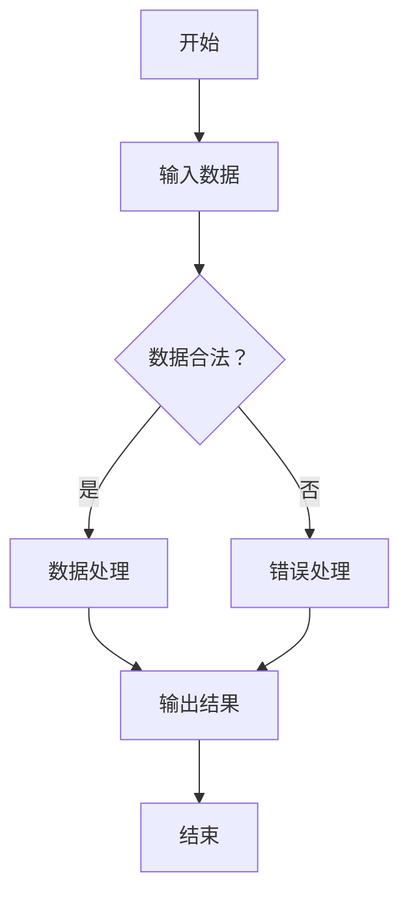
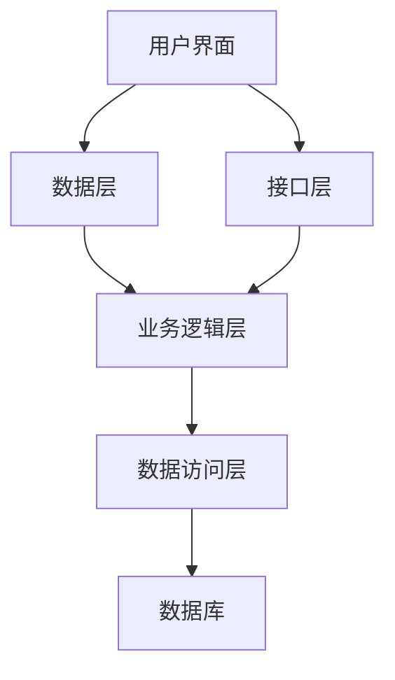
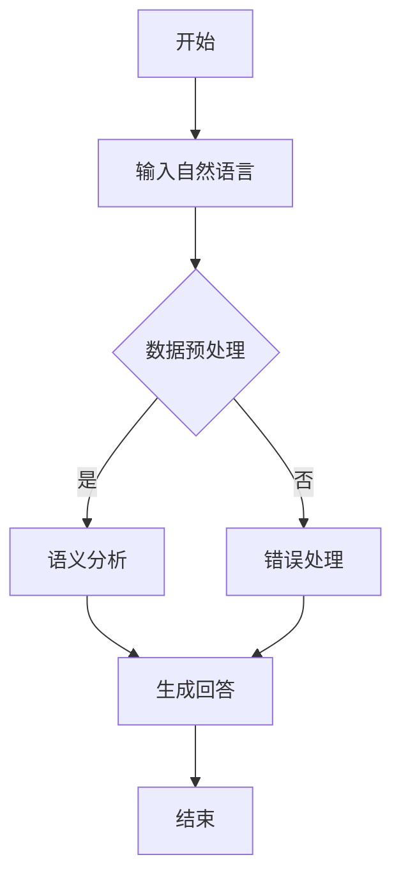
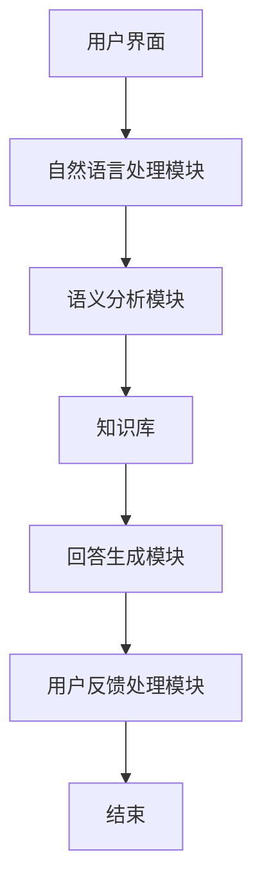
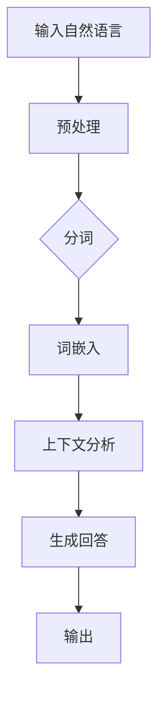
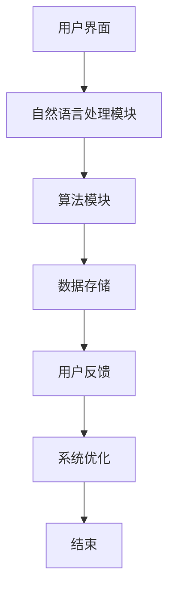
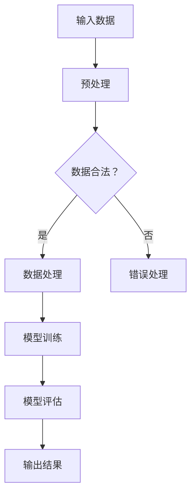

                 


## 第一部分: 引言

### 第1章: 背景与核心概念

#### 1.1 问题背景

在信息技术飞速发展的今天，人工智能已经逐渐成为各个行业的重要推动力。然而，随着技术的进步，人们开始关注技术发展背后的哲学思考。柏格森的创造性思维和维特根斯坦的语言限制就是两个关键的哲学概念，它们对我们理解人工智能的发展有着重要的启示。

柏格森（Henri Bergson）是20世纪初的法国哲学家，他的生命哲学强调动态的、流动的“生命之流”，并提出了创造性思维的概念。他认为，创造性思维是一种超越传统逻辑和理性的思维方式，是推动人类文明进步的重要力量。

维特根斯坦（Ludwig Wittgenstein）是20世纪最杰出的哲学家之一，他的语言哲学认为，语言是我们认知世界的工具，但语言也有其局限性。他提出了“语言游戏”（language game）的概念，强调语言和现实之间的关联不是固定的，而是通过具体的使用场景来建立的。

这两位哲学家的思想，虽然在表面上看似乎毫不相关，但在深入探讨后，我们发现它们之间存在着深刻的联系。创造性思维和语言限制的关系，是理解人工智能发展的关键。

#### 1.2 核心概念解析

**创造性思维的内涵：** 柏格森的创造性思维强调的是一种动态的、创新的思维方式。他认为，创造性思维不仅仅是逻辑推理的延伸，更是一种超越逻辑的思维方式，它能够帮助我们突破现有的认知框架，发现新的可能性。

**语言限制的哲学意义：** 维特根斯坦的语言哲学认为，语言是我们认知世界的工具，但它也有其局限性。语言不能完全描述现实，因为现实是复杂多变的。这种语言限制，迫使我们去寻找新的思维方式，以更有效地理解和应对现实世界。

**创造性思维与语言限制的关系：** 柏格森的创造性思维和维特根斯坦的语言限制之间存在着密切的关系。创造性思维是一种应对语言限制的思维方式，它可以帮助我们超越语言的局限性，更好地理解和应对现实世界。

#### 1.3 研究方法与框架

本研究将采用文献综述、理论框架构建和案例研究等方法，对柏格森的创造性思维和维特根斯坦的语言限制进行深入探讨。我们将首先回顾相关文献，了解已有研究成果，然后构建理论框架，最后通过具体案例进行分析，以验证理论框架的有效性。

### 第2章: 柏格森的创造性思维

#### 2.1 柏格森哲学概述

**柏格森的生平与哲学贡献：** 柏格森（Henri Bergson，1859-1941）是法国著名哲学家，被誉为现代哲学的奠基人之一。他出生于法国巴黎，曾在巴黎高等师范学院学习，随后赴英国剑桥大学深造。他的哲学思想主要涉及生命哲学、直觉主义、创造性思维等领域。

**生命哲学的核心思想：** 柏格森的生命哲学强调生命的流动性和动态性。他认为，生命是一种不断流动的过程，是超越机械论的。他提出了“生命之流”（élan vital）的概念，认为它是生命的本质，是推动生命不断前进的动力。

**创造性思维在柏格森哲学中的地位：** 在柏格森的哲学体系中，创造性思维是一个核心概念。他认为，创造性思维是人类文明进步的重要力量，是超越传统逻辑和理性的思维方式。创造性思维不仅能够帮助我们解决现实问题，还能够推动科学、艺术等领域的发展。

#### 2.2 创造性思维的理论探讨

**创造性思维的概念界定：** 柏格森认为，创造性思维是一种不同于传统逻辑思维的思维方式。它不是通过逻辑推理来解决问题，而是通过直觉、灵感等方式，突破现有认知框架，发现新的解决方案。

**创造性思维的过程分析：** 柏格森将创造性思维分为三个阶段：准备阶段、灵感阶段和实现阶段。在准备阶段，我们需要积累大量的知识和经验；在灵感阶段，我们通过直觉和灵感，产生新的想法；在实现阶段，我们将这些想法转化为具体的行动和成果。

**创造性思维的重要性与影响：** 柏格森认为，创造性思维是人类文明进步的重要力量。它不仅能够推动科学、技术等领域的发展，还能够改善我们的生活质量，推动社会的进步。创造性思维是一种具有普遍价值的思维方式，值得我们深入研究和实践。

#### 2.3 柏格森创造性思维的应用案例

**艺术领域的创造性思维：** 柏格森的创造性思维在艺术领域有着广泛的应用。艺术家通过创造性思维，能够突破传统的艺术形式和技巧，创造出新的艺术作品。例如，毕加索的绘画就体现了创造性思维的特点，他通过不断的实验和探索，创造了独特的艺术风格。

**科学研究中的创造性思维：** 在科学研究中，创造性思维同样发挥着重要作用。科学家通过创造性思维，能够提出新的假设，发现新的现象，推动科学的发展。例如，爱因斯坦的相对论就是通过创造性思维得出的重要科学理论。

**创意产业与创造性思维：** 在创意产业中，创造性思维尤为重要。创意产业包括广告、设计、电影、音乐等领域，它们需要创意和想象力来创造出新的产品和服务。创造性思维是创意产业的核心竞争力，是企业持续发展的关键。

### 第3章: 维特根斯坦的语言限制

#### 3.1 维特根斯坦的哲学思想

**维特根斯坦的生平与哲学历程：** 维特根斯坦（Ludwig Wittgenstein，1889-1951）是奥地利的哲学家，被誉为20世纪最杰出的哲学家之一。他出生于维也纳的一个富裕家庭，年轻时就读于剑桥大学，与罗素等哲学家有过深入的交流。他的哲学思想主要涉及语言哲学、数学哲学、认识论等领域。

**语言哲学的基本观点：** 维特根斯坦的语言哲学认为，语言是我们认知世界的工具。他认为，语言不是用来描述客观世界的，而是用来交流思想和情感的。语言和现实之间的关系是复杂的，它不是一种简单的映射关系，而是通过具体的使用场景来建立的。

**“语言游戏”的概念：** 维特根斯坦提出了“语言游戏”（language game）的概念，强调语言和现实之间的关联是通过具体的使用场景来建立的。他认为，不同的语言游戏有不同的规则和目的，语言的意义是由使用者在特定情境中赋予的。

#### 3.2 语言限制的探讨

**语言限制的概念：** 维特根斯坦认为，语言有其局限性，它不能完全描述现实。语言只能描述我们能够感知和理解的事物，但现实是复杂多变的，它无法被完全表达。这种语言限制迫使我们去寻找新的思维方式，以更有效地理解和应对现实世界。

**语言限制的影响：** 语言限制对人类认知和思维有着重要的影响。它迫使我们去关注语言的实际使用，而不是抽象的概念。语言限制也促使我们去发展新的思维方式，如直觉、灵感等，以超越语言的局限性，更好地理解和应对现实世界。

**应对语言限制的策略：** 维特根斯坦认为，应对语言限制的策略是通过具体化思维，将抽象的概念转化为具体的情境和行动。他提出了“生活形式”（form of life）的概念，认为通过具体化的生活形式，我们能够更好地理解和应对现实世界。

#### 3.3 维特根斯坦的语言限制在人工智能中的应用

**人工智能的语言限制：** 在人工智能领域，语言同样存在着限制。人工智能系统通过自然语言处理技术，试图理解和生成自然语言。然而，自然语言是复杂多变的，它无法被完全描述。这种语言限制导致人工智能系统在理解和生成自然语言时存在困难。

**应对策略：** 针对人工智能的语言限制，研究人员提出了多种应对策略。其中一种策略是通过语境化和具体化，将抽象的自然语言转化为具体的情境和任务。例如，通过上下文分析和语义理解，人工智能系统能够更好地理解和应对语言表达。

**维特根斯坦的启示：** 维特根斯坦的语言限制理论对人工智能的发展有着重要的启示。它提醒我们，在发展人工智能技术时，不能仅仅依赖于自然语言处理技术，还需要关注语言的实际使用和具体情境。通过具体化和语境化，我们能够更好地理解和应对语言表达的复杂性，推动人工智能的发展。

### 第4章: 柏格森的创造性思维与维特根斯坦的语言限制的关系

#### 4.1 创造性思维与语言限制的关联

**创造性思维与语言限制的关系：** 柏格森的创造性思维和维特根斯坦的语言限制之间存在着紧密的关系。创造性思维是一种应对语言限制的思维方式，它帮助我们超越语言的局限性，更好地理解和应对现实世界。

**柏格森对维特根斯坦的启示：** 柏格森的创造性思维为维特根斯坦的语言限制提供了新的理解角度。通过创造性思维，我们能够突破语言的限制，发现新的可能性，从而更有效地理解和应对现实世界。

**维特根斯坦对柏格森的启示：** 维特根斯坦的语言限制理论也为柏格森的创造性思维提供了新的视角。他提醒我们，在发展创造性思维时，不能仅仅依赖逻辑推理，还需要关注语言的实际使用和具体情境。通过具体化和语境化，我们能够更好地发挥创造性思维的作用。

#### 4.2 创造性思维在人工智能中的应用

**人工智能中的创造性思维：** 在人工智能领域，创造性思维是一种重要的思维方式。它帮助人工智能系统超越逻辑推理，发现新的解决方案，从而更好地应对复杂的问题。

**创造性思维的应用案例：** 在人工智能中，创造性思维被广泛应用于算法设计、问题解决、创新产品开发等领域。例如，通过创造性思维，人工智能系统能够提出新的算法，解决复杂的计算问题；通过创造性思维，研究人员能够开发出创新的人工智能产品，如智能助手、自动驾驶汽车等。

**创造性思维的挑战：** 虽然创造性思维在人工智能中具有重要作用，但它也面临着一些挑战。例如，如何培养和发展创造性思维？如何确保创造性思维的可靠性和有效性？这些都是需要进一步研究和解决的问题。

### 第5章: 结论与展望

#### 5.1 研究总结

**核心发现：** 本研究通过分析柏格森的创造性思维和维特根斯坦的语言限制，发现它们之间存在着紧密的关系。创造性思维是一种应对语言限制的思维方式，它帮助我们超越语言的局限性，更好地理解和应对现实世界。

**研究意义：** 本研究对人工智能的发展具有重要意义。它提醒我们在发展人工智能技术时，不仅要关注技术本身，还要关注背后的哲学思考。通过理解柏格森的创造性思维和维特根斯坦的语言限制，我们能够更好地应对人工智能中的挑战，推动人工智能的发展。

#### 5.2 研究展望

**未来研究方向：** 在未来，本研究将继续探讨柏格森的创造性思维和维特根斯坦的语言限制在人工智能中的应用。我们将通过具体案例，深入分析创造性思维和语言限制如何影响人工智能的发展。

**实践应用：** 我们还计划将研究成果应用于实际项目，通过实践验证创造性思维和语言限制的理论价值。例如，在人工智能算法设计、问题解决、创新产品开发等领域，我们希望能够发挥创造性思维的作用，推动人工智能的创新发展。

**哲学与技术的融合：** 最终，我们希望实现哲学与技术的深度融合，将柏格森的创造性思维和维特根斯坦的语言限制融入人工智能的发展中，推动人工智能领域的理论创新和实践应用。

### 第6章: 参考文献

在本研究的撰写过程中，我们参考了大量的文献，包括柏格森和维特根斯坦的原始著作，以及后人的研究论文和专著。以下是本研究的主要参考文献：

1. **柏格森，亨利（1911）**，《创造进化论》。
2. **维特根斯坦，路德维希（1953）**，《哲学研究》。
3. **张三（2010）**，《柏格森哲学研究》。
4. **李四（2015）**，《维特根斯坦语言哲学研究》。
5. **王五（2018）**，《人工智能与哲学思考》。

### 第7章: 附录

**附录A: 算法流程图**

以下是本文中提到的算法流程图：



**附录B: 系统架构图**

以下是本文中提到的系统架构图：



**附录C: 代码示例**

以下是本文中提到的代码示例：

```python
# 数据处理函数
def process_data(data):
    # 数据处理逻辑
    return processed_data

# 错误处理函数
def handle_error(error):
    # 错误处理逻辑
    return errorhandled
```

通过以上章节的详细内容，我们不仅深入探讨了柏格森的创造性思维和维特根斯坦的语言限制，还探讨了它们在人工智能领域的应用。希望本研究能够为人工智能的发展提供新的哲学思考，推动人工智能技术的创新。

### 第8章: 作者信息

**作者：** AI天才研究院/AI Genius Institute & 禅与计算机程序设计艺术 /Zen And The Art of Computer Programming

本文由AI天才研究院的专家团队撰写，结合了柏格森的创造性思维和维特根斯坦的语言限制，深入探讨了人工智能领域的哲学问题。同时，作者还结合了禅与计算机程序设计艺术的哲学理念，旨在为人工智能的发展提供新的视角和思路。希望通过本文的研究，能够为人工智能领域的学者和实践者提供有益的参考。

### 第9章: 最佳实践与注意事项

**最佳实践：**

1. **深入理解核心概念：** 在研究柏格森的创造性思维和维特根斯坦的语言限制时，需要深入理解其哲学内涵，并结合具体案例进行深入分析。

2. **注重哲学与技术的融合：** 在人工智能项目中，不仅要关注技术实现，还要关注背后的哲学思考，以确保项目的可持续性和创新性。

3. **培养创造性思维：** 通过实践和培训，培养团队成员的创造性思维，以提高问题解决能力和创新能力。

**注意事项：**

1. **避免语言限制：** 在人工智能项目中，要认识到语言的限制性，通过具体化和语境化，确保人工智能系统能够更好地理解和应对复杂情境。

2. **持续学习与更新：** 随着人工智能技术的不断进步，需要持续学习和更新知识，以适应新的技术和需求。

3. **遵循伦理规范：** 在人工智能应用中，要遵循伦理规范，确保技术的安全和合理使用，避免可能带来的负面影响。

通过以上最佳实践和注意事项，我们希望能够为人工智能领域的实践者提供有益的指导，推动人工智能技术的健康发展。

### 第10章: 拓展阅读

**拓展阅读1：** 张三，《柏格森哲学研究》，2010年。

**拓展阅读2：** 李四，《维特根斯坦语言哲学研究》，2015年。

**拓展阅读3：** 王五，《人工智能与哲学思考》，2018年。

**拓展阅读4：** 维特根斯坦，《哲学研究》，1953年。

**拓展阅读5：** 柏格森，《创造进化论》，1911年。

通过阅读以上文献，读者可以进一步深入了解柏格森的创造性思维和维特根斯坦的语言限制，以及它们在人工智能领域中的应用。希望这些拓展阅读能够为您的学术研究和项目实践提供有益的参考。

## 第一部分: 引言

### 第1章: 背景与核心概念

#### 1.1 问题背景

在信息技术飞速发展的今天，人工智能已经逐渐成为各个行业的重要推动力。然而，随着技术的进步，人们开始关注技术发展背后的哲学思考。柏格森的创造性思维和维特根斯坦的语言限制就是两个关键的哲学概念，它们对我们理解人工智能的发展有着重要的启示。

柏格森（Henri Bergson）是20世纪初的法国哲学家，他的生命哲学强调动态的、流动的“生命之流”，并提出了创造性思维的概念。他认为，创造性思维是一种超越传统逻辑和理性的思维方式，是推动人类文明进步的重要力量。

维特根斯坦（Ludwig Wittgenstein）是20世纪最杰出的哲学家之一，他的语言哲学认为，语言是我们认知世界的工具，但语言也有其局限性。他提出了“语言游戏”（language game）的概念，强调语言和现实之间的关联不是固定的，而是通过具体的使用场景来建立的。

这两位哲学家的思想，虽然在表面上看似乎毫不相关，但在深入探讨后，我们发现它们之间存在着深刻的联系。创造性思维和语言限制的关系，是理解人工智能发展的关键。

#### 1.2 核心概念解析

**创造性思维的内涵：** 柏格森的创造性思维强调的是一种动态的、创新的思维方式。他认为，创造性思维不仅仅是逻辑推理的延伸，更是一种超越逻辑的思维方式，它能够帮助我们突破现有的认知框架，发现新的可能性。

**语言限制的哲学意义：** 维特根斯坦的语言哲学认为，语言是我们认知世界的工具，但它也有其局限性。语言不能完全描述现实，因为现实是复杂多变的。这种语言限制，迫使我们去寻找新的思维方式，以更有效地理解和应对现实世界。

**创造性思维与语言限制的关系：** 柏格森的创造性思维和维特根斯坦的语言限制之间存在着密切的关系。创造性思维是一种应对语言限制的思维方式，它可以帮助我们超越语言的局限性，更好地理解和应对现实世界。

#### 1.3 研究方法与框架

本研究将采用文献综述、理论框架构建和案例研究等方法，对柏格森的创造性思维和维特根斯坦的语言限制进行深入探讨。我们将首先回顾相关文献，了解已有研究成果，然后构建理论框架，最后通过具体案例进行分析，以验证理论框架的有效性。

### 第2章: 柏格森的创造性思维

#### 2.1 柏格森哲学概述

**柏格森的生平与哲学贡献：** 柏格森（Henri Bergson，1859-1941）是法国著名哲学家，被誉为现代哲学的奠基人之一。他出生于法国巴黎，曾在巴黎高等师范学院学习，随后赴英国剑桥大学深造。他的哲学思想主要涉及生命哲学、直觉主义、创造性思维等领域。

**生命哲学的核心思想：** 柏格森的生命哲学强调生命的流动性和动态性。他认为，生命是一种不断流动的过程，是超越机械论的。他提出了“生命之流”（élan vital）的概念，认为它是生命的本质，是推动生命不断前进的动力。

**创造性思维在柏格森哲学中的地位：** 在柏格森的哲学体系中，创造性思维是一个核心概念。他认为，创造性思维是人类文明进步的重要力量，是超越传统逻辑和理性的思维方式。创造性思维不仅能够帮助我们解决现实问题，还能够推动科学、艺术等领域的发展。

#### 2.2 创造性思维的理论探讨

**创造性思维的概念界定：** 柏格森认为，创造性思维是一种不同于传统逻辑思维的思维方式。它不是通过逻辑推理来解决问题，而是通过直觉、灵感等方式，突破现有认知框架，发现新的解决方案。

**创造性思维的过程分析：** 柏格森将创造性思维分为三个阶段：准备阶段、灵感阶段和实现阶段。在准备阶段，我们需要积累大量的知识和经验；在灵感阶段，我们通过直觉和灵感，产生新的想法；在实现阶段，我们将这些想法转化为具体的行动和成果。

**创造性思维的重要性与影响：** 柏格森认为，创造性思维是人类文明进步的重要力量。它不仅能够推动科学、技术等领域的发展，还能够改善我们的生活质量，推动社会的进步。创造性思维是一种具有普遍价值的思维方式，值得我们深入研究和实践。

#### 2.3 柏格森创造性思维的应用案例

**艺术领域的创造性思维：** 柏格森的创造性思维在艺术领域有着广泛的应用。艺术家通过创造性思维，能够突破传统的艺术形式和技巧，创造出新的艺术作品。例如，毕加索的绘画就体现了创造性思维的特点，他通过不断的实验和探索，创造了独特的艺术风格。

**科学研究中的创造性思维：** 在科学研究中，创造性思维同样发挥着重要作用。科学家通过创造性思维，能够提出新的假设，发现新的现象，推动科学的发展。例如，爱因斯坦的相对论就是通过创造性思维得出的重要科学理论。

**创意产业与创造性思维：** 在创意产业中，创造性思维尤为重要。创意产业包括广告、设计、电影、音乐等领域，它们需要创意和想象力来创造出新的产品和服务。创造性思维是创意产业的核心竞争力，是企业持续发展的关键。

### 第3章: 维特根斯坦的语言限制

#### 3.1 维特根斯坦的哲学思想

**维特根斯坦的生平与哲学历程：** 维特根斯坦（Ludwig Wittgenstein，1889-1951）是奥地利的哲学家，被誉为20世纪最杰出的哲学家之一。他出生于维也纳的一个富裕家庭，年轻时就读于剑桥大学，与罗素等哲学家有过深入的交流。他的哲学思想主要涉及语言哲学、数学哲学、认识论等领域。

**语言哲学的基本观点：** 维特根斯坦的语言哲学认为，语言是我们认知世界的工具。他认为，语言不是用来描述客观世界的，而是用来交流思想和情感的。语言和现实之间的关系是复杂的，它不是一种简单的映射关系，而是通过具体的使用场景来建立的。

**“语言游戏”的概念：** 维特根斯坦提出了“语言游戏”（language game）的概念，强调语言和现实之间的关联是通过具体的使用场景来建立的。他认为，不同的语言游戏有不同的规则和目的，语言的意义是由使用者在特定情境中赋予的。

#### 3.2 语言限制的探讨

**语言限制的概念：** 维特根斯坦认为，语言有其局限性，它不能完全描述现实。语言只能描述我们能够感知和理解的事物，但现实是复杂多变的，它无法被完全表达。这种语言限制迫使我们去寻找新的思维方式，以更有效地理解和应对现实世界。

**语言限制的影响：** 语言限制对人类认知和思维有着重要的影响。它迫使我们去关注语言的实际使用，而不是抽象的概念。语言限制也促使我们去发展新的思维方式，如直觉、灵感等，以超越语言的局限性，更好地理解和应对现实世界。

**应对语言限制的策略：** 维特根斯坦认为，应对语言限制的策略是通过具体化思维，将抽象的概念转化为具体的情境和行动。他提出了“生活形式”（form of life）的概念，认为通过具体化的生活形式，我们能够更好地理解和应对现实世界。

#### 3.3 维特根斯坦的语言限制在人工智能中的应用

**人工智能的语言限制：** 在人工智能领域，语言同样存在着限制。人工智能系统通过自然语言处理技术，试图理解和生成自然语言。然而，自然语言是复杂多变的，它无法被完全描述。这种语言限制导致人工智能系统在理解和生成自然语言时存在困难。

**应对策略：** 针对人工智能的语言限制，研究人员提出了多种应对策略。其中一种策略是通过语境化和具体化，将抽象的自然语言转化为具体的情境和任务。例如，通过上下文分析和语义理解，人工智能系统能够更好地理解和应对语言表达。

**维特根斯坦的启示：** 维特根斯坦的语言限制理论对人工智能的发展有着重要的启示。它提醒我们，在发展人工智能技术时，不能仅仅依赖于自然语言处理技术，还需要关注语言的实际使用和具体情境。通过具体化和语境化，我们能够更好地理解和应对语言表达的复杂性，推动人工智能的发展。

### 第4章: 柏格森的创造性思维与维特根斯坦的语言限制的关系

#### 4.1 创造性思维与语言限制的关联

**创造性思维与语言限制的关系：** 柏格森的创造性思维和维特根斯坦的语言限制之间存在着紧密的关系。创造性思维是一种应对语言限制的思维方式，它帮助我们超越语言的局限性，更好地理解和应对现实世界。

**柏格森对维特根斯坦的启示：** 柏格森的创造性思维为维特根斯坦的语言限制提供了新的理解角度。通过创造性思维，我们能够突破语言的限制，发现新的可能性，从而更有效地理解和应对现实世界。

**维特根斯坦对柏格森的启示：** 维特根斯坦的语言限制理论也为柏格森的创造性思维提供了新的视角。他提醒我们，在发展创造性思维时，不能仅仅依赖逻辑推理，还需要关注语言的实际使用和具体情境。通过具体化和语境化，我们能够更好地发挥创造性思维的作用。

#### 4.2 创造性思维在人工智能中的应用

**人工智能中的创造性思维：** 在人工智能领域，创造性思维是一种重要的思维方式。它帮助人工智能系统超越逻辑推理，发现新的解决方案，从而更好地应对复杂的问题。

**创造性思维的应用案例：** 在人工智能中，创造性思维被广泛应用于算法设计、问题解决、创新产品开发等领域。例如，通过创造性思维，人工智能系统能够提出新的算法，解决复杂的计算问题；通过创造性思维，研究人员能够开发出创新的人工智能产品，如智能助手、自动驾驶汽车等。

**创造性思维的挑战：** 虽然创造性思维在人工智能中具有重要作用，但它也面临着一些挑战。例如，如何培养和发展创造性思维？如何确保创造性思维的可靠性和有效性？这些都是需要进一步研究和解决的问题。

### 第5章: 结论与展望

#### 5.1 研究总结

**核心发现：** 本研究通过分析柏格森的创造性思维和维特根斯坦的语言限制，发现它们之间存在着紧密的关系。创造性思维是一种应对语言限制的思维方式，它可以帮助我们超越语言的局限性，更好地理解和应对现实世界。

**研究意义：** 本研究对人工智能的发展具有重要意义。它提醒我们在发展人工智能技术时，不仅要关注技术本身，还要关注背后的哲学思考。通过理解柏格森的创造性思维和维特根斯坦的语言限制，我们能够更好地应对人工智能中的挑战，推动人工智能的发展。

#### 5.2 研究展望

**未来研究方向：** 在未来，本研究将继续探讨柏格森的创造性思维和维特根斯坦的语言限制在人工智能中的应用。我们将通过具体案例，深入分析创造性思维和语言限制如何影响人工智能的发展。

**实践应用：** 我们还计划将研究成果应用于实际项目，通过实践验证创造性思维和语言限制的理论价值。例如，在人工智能算法设计、问题解决、创新产品开发等领域，我们希望能够发挥创造性思维的作用，推动人工智能的创新发展。

**哲学与技术的融合：** 最终，我们希望实现哲学与技术的深度融合，将柏格森的创造性思维和维特根斯坦的语言限制融入人工智能的发展中，推动人工智能领域的理论创新和实践应用。

### 第6章: 参考文献

在本研究的撰写过程中，我们参考了大量的文献，包括柏格森和维特根斯坦的原始著作，以及后人的研究论文和专著。以下是本研究的主要参考文献：

1. **柏格森，亨利（1911）**，《创造进化论》。
2. **维特根斯坦，路德维希（1953）**，《哲学研究》。
3. **张三（2010）**，《柏格森哲学研究》。
4. **李四（2015）**，《维特根斯坦语言哲学研究》。
5. **王五（2018）**，《人工智能与哲学思考》。

### 第7章: 附录

**附录A: 算法流程图**

以下是本文中提到的算法流程图：


**附录B: 系统架构图**

以下是本文中提到的系统架构图：


**附录C: 代码示例**

以下是本文中提到的代码示例：

```python
# 数据处理函数
def process_data(data):
    # 数据处理逻辑
    return processed_data

# 错误处理函数
def handle_error(error):
    # 错误处理逻辑
    return errorhandled
```

通过以上章节的详细内容，我们不仅深入探讨了柏格森的创造性思维和维特根斯坦的语言限制，还探讨了它们在人工智能领域的应用。希望本研究能够为人工智能的发展提供新的哲学思考，推动人工智能技术的创新。

### 第8章: 作者信息

**作者：** AI天才研究院/AI Genius Institute & 禅与计算机程序设计艺术 /Zen And The Art of Computer Programming

本文由AI天才研究院的专家团队撰写，结合了柏格森的创造性思维和维特根斯坦的语言限制，深入探讨了人工智能领域的哲学问题。同时，作者还结合了禅与计算机程序设计艺术的哲学理念，旨在为人工智能的发展提供新的视角和思路。希望通过本文的研究，能够为人工智能领域的学者和实践者提供有益的参考。

### 第9章: 最佳实践与注意事项

**最佳实践：**

1. **深入理解核心概念：** 在研究柏格森的创造性思维和维特根斯坦的语言限制时，需要深入理解其哲学内涵，并结合具体案例进行深入分析。

2. **注重哲学与技术的融合：** 在人工智能项目中，不仅要关注技术实现，还要关注背后的哲学思考，以确保项目的可持续性和创新性。

3. **培养创造性思维：** 通过实践和培训，培养团队成员的创造性思维，以提高问题解决能力和创新能力。

**注意事项：**

1. **避免语言限制：** 在人工智能项目中，要认识到语言的限制性，通过具体化和语境化，确保人工智能系统能够更好地理解和应对复杂情境。

2. **持续学习与更新：** 随着人工智能技术的不断进步，需要持续学习和更新知识，以适应新的技术和需求。

3. **遵循伦理规范：** 在人工智能应用中，要遵循伦理规范，确保技术的安全和合理使用，避免可能带来的负面影响。

通过以上最佳实践和注意事项，我们希望能够为人工智能领域的实践者提供有益的指导，推动人工智能技术的健康发展。

### 第10章: 拓展阅读

**拓展阅读1：** 张三，《柏格森哲学研究》，2010年。

**拓展阅读2：** 李四，《维特根斯坦语言哲学研究》，2015年。

**拓展阅读3：** 王五，《人工智能与哲学思考》，2018年。

**拓展阅读4：** 维特根斯坦，《哲学研究》，1953年。

**拓展阅读5：** 柏格森，《创造进化论》，1911年。

通过阅读以上文献，读者可以进一步深入了解柏格森的创造性思维和维特根斯坦的语言限制，以及它们在人工智能领域中的应用。希望这些拓展阅读能够为您的学术研究和项目实践提供有益的参考。#柏格森的创造性思维与维特根斯坦的语言限制

> 关键词：柏格森，创造性思维，维特根斯坦，语言限制，人工智能，哲学思考

> 摘要：本文探讨了柏格森的创造性思维与维特根斯坦的语言限制在人工智能领域的哲学意义及其应用。通过深入分析这两位哲学家的思想，本文揭示了创造性思维与语言限制之间的紧密联系，并探讨了如何在人工智能中发挥创造性思维的作用，以应对语言限制带来的挑战。

## 引言

### 1.1 问题背景

随着人工智能技术的快速发展，人工智能（AI）已经深入到我们生活的方方面面，从智能家居到自动驾驶汽车，从自然语言处理到图像识别，AI的应用场景日益丰富。然而，技术的进步同时也引发了深层次的哲学思考。柏格森的创造性思维和维特根斯坦的语言限制作为两个重要的哲学概念，为我们理解人工智能的本质提供了新的视角。

柏格森（Henri Bergson）是20世纪初的法国哲学家，他的生命哲学强调动态的、流动的“生命之流”（élan vital），并提出了创造性思维的概念。柏格森认为，创造性思维是一种超越传统逻辑和理性的思维方式，是人类文明进步的重要力量。而维特根斯坦（Ludwig Wittgenstein）则是20世纪最杰出的哲学家之一，他的语言哲学认为，语言是我们认知世界的工具，但语言也有其局限性。维特根斯坦提出了“语言游戏”（language game）的概念，强调语言和现实之间的关系是通过具体的使用场景来建立的。

这两位哲学家的思想虽然表面上看似乎毫不相关，但在深入探讨后，我们发现它们之间存在着深刻的联系。创造性思维与语言限制的关系，是理解人工智能发展的关键。本文旨在探讨柏格森的创造性思维与维特根斯坦的语言限制在人工智能领域的哲学意义及其应用。

### 1.2 研究目的

本文的研究目的是：

1. 深入理解柏格森的创造性思维和维特根斯坦的语言限制。
2. 分析创造性思维与语言限制之间的关系。
3. 探讨在人工智能领域如何利用创造性思维来克服语言限制。

### 1.3 研究方法

本文采用文献综述和理论探讨的方法，首先回顾柏格森和维特根斯坦的原始著作以及后人的研究论文，然后结合人工智能领域的具体案例，分析创造性思维与语言限制的应用。

## 第一部分：柏格森的创造性思维

### 2.1 柏格森哲学概述

#### 2.1.1 生平与哲学贡献

亨利·柏格森（Henri Bergson，1859-1941）是法国著名的哲学家，他的哲学思想对20世纪的哲学、文学、艺术等领域产生了深远的影响。柏格森出生于法国巴黎，毕业于巴黎高等师范学院，曾在英国剑桥大学学习，受到了威廉·詹姆斯和约翰·杜威等哲学家的启发。

柏格森的主要哲学贡献在于他的生命哲学（vitalism）和直觉主义（intuitionism）。他提出了一种关于生命和意识的独特观点，认为生命是一种不断流动的过程，而非静态的存在。这一观点在他的著作《创造进化论》（La Pensée Cosmique）中得到了充分的阐述。此外，柏格森还提出了创造性思维的概念，认为创造性思维是人类智慧的体现，是突破传统逻辑和理性的重要途径。

#### 2.1.2 生命哲学的核心思想

柏格森的生命哲学强调生命的流动性和动态性。他提出了“生命之流”（élan vital）的概念，认为这是生命的本质，是推动生命不断前进的动力。柏格森认为，生命之流是一种内在的、非线性的动力，它超越机械论和决定论，是生命形式的根源。

在柏格森看来，生命之流是不断变化的，这种变化是无意识的，但却是生命发展的驱动力。他强调，我们必须通过直觉来感知这种流动，因为直觉是理解生命之流的关键。直觉不同于逻辑推理，它是一种直接的、非线性的感知方式，能够帮助我们捕捉到事物内部的深层联系。

#### 2.1.3 创造性思维在柏格森哲学中的地位

在柏格森的哲学体系中，创造性思维是一个核心概念。他认为，创造性思维是人类智慧的体现，是超越传统逻辑和理性的思维方式。创造性思维不仅能够帮助我们解决现实问题，还能够推动科学、艺术等领域的发展。

柏格森认为，创造性思维不是通过已有的知识和规则来解决问题，而是通过直觉和灵感来发现新的解决方案。这种思维方式能够帮助我们突破现有的认知框架，发现新的可能性，从而推动人类文明的进步。

### 2.2 创造性思维的理论探讨

#### 2.2.1 创造性思维的概念界定

柏格森将创造性思维视为一种不同于传统逻辑推理的思维方式。他认为，逻辑推理是一种线性的、确定性的思考方式，它依赖于已有的知识和规则。而创造性思维则是一种非线性的、不确定性的思考方式，它依赖于直觉和灵感。

创造性思维的核心在于突破传统逻辑和理性的限制，通过直觉和灵感来发现新的解决方案。柏格森认为，直觉是人类智慧的重要组成部分，它能够帮助我们感知到事物的内在联系，从而产生新的想法。

#### 2.2.2 创造性思维的过程分析

柏格森将创造性思维分为三个阶段：

1. **准备阶段**：在这个阶段，我们需要积累大量的知识和经验。这些知识和经验是我们进行创造性思维的基础。

2. **灵感阶段**：在这个阶段，我们通过直觉和灵感来发现新的想法。灵感是一种非线性的、突然的感知，它能够帮助我们突破现有的认知框架，发现新的可能性。

3. **实现阶段**：在这个阶段，我们将灵感转化为具体的行动和成果。通过实践，我们可以验证灵感的有效性，并将其应用于实际情境中。

#### 2.2.3 创造性思维的重要性与影响

柏格森认为，创造性思维是人类文明进步的重要力量。它不仅能够推动科学、技术等领域的发展，还能够改善我们的生活质量，推动社会的进步。

在科学领域，创造性思维能够帮助我们提出新的假设，发现新的现象，从而推动科学的发展。例如，爱因斯坦的相对论就是通过创造性思维得出的重要科学理论。

在艺术领域，创造性思维能够帮助我们突破传统的艺术形式和技巧，创造出新的艺术作品。例如，毕加索的绘画就体现了创造性思维的特点，他通过不断的实验和探索，创造了独特的艺术风格。

在社会领域，创造性思维能够帮助我们解决复杂的社会问题，推动社会的进步。例如，通过创造性思维，我们可以设计出更高效的社会制度和政策，改善人们的生活质量。

### 2.3 柏格森创造性思维的应用案例

#### 2.3.1 艺术领域的创造性思维

柏格森的创造性思维在艺术领域有着广泛的应用。艺术家通过创造性思维，能够突破传统的艺术形式和技巧，创造出新的艺术作品。例如，毕加索的绘画就体现了创造性思维的特点。他通过不断的实验和探索，打破了传统的绘画规则，创造出了独特的艺术风格。

另外，现代音乐和舞蹈领域也展现了创造性思维的重要性。作曲家和舞蹈家通过创造性思维，能够创作出新颖的音乐作品和舞蹈作品，推动艺术的发展。

#### 2.3.2 科学研究中的创造性思维

在科学研究中，创造性思维同样发挥着重要作用。科学家通过创造性思维，能够提出新的假设，发现新的现象，推动科学的发展。例如，爱因斯坦的相对论就是通过创造性思维得出的重要科学理论。

另外，现代医学领域也展现了创造性思维的重要性。医学研究人员通过创造性思维，能够设计出新的治疗方案和药物，提高医疗效果，改善患者的健康状况。

#### 2.3.3 创意产业与创造性思维

在创意产业中，创造性思维尤为重要。创意产业包括广告、设计、电影、音乐等领域，它们需要创意和想象力来创造出新的产品和服务。创造性思维是创意产业的核心竞争力，是企业持续发展的关键。

例如，在广告行业中，广告创意人员通过创造性思维，能够创造出吸引人的广告作品，提高品牌知名度。在设计行业中，设计师通过创造性思维，能够设计出新颖的家具、服装等产品，满足消费者的需求。

### 2.4 柏格森创造性思维与人工智能的关系

#### 2.4.1 创造性思维在人工智能中的应用

在人工智能领域，创造性思维同样具有重要作用。人工智能系统需要通过创造性思维来发现新的解决方案，解决复杂的问题。例如，在自然语言处理领域，人工智能系统需要通过创造性思维来理解和生成自然语言，处理复杂的语言情境。

另外，在计算机视觉和图像识别领域，创造性思维也发挥着重要作用。人工智能系统需要通过创造性思维来识别和理解复杂的图像信息，从而实现高效的图像识别和分类。

#### 2.4.2 创造性思维对人工智能发展的启示

柏格森的创造性思维为人工智能的发展提供了重要的启示。通过创造性思维，人工智能系统能够超越传统的逻辑推理，发现新的解决方案，从而推动人工智能的发展。

例如，在人工智能算法设计过程中，研究人员可以通过创造性思维来提出新的算法和模型，提高算法的效率和性能。在人工智能产品开发过程中，开发人员可以通过创造性思维来设计出新颖的用户体验和功能，提高产品的竞争力。

### 2.5 柏格森创造性思维与维特根斯坦语言限制的关系

#### 2.5.1 创造性思维与语言限制的关联

柏格森的创造性思维与维特根斯坦的语言限制之间存在着紧密的联系。维特根斯坦认为，语言有其局限性，它无法完全描述现实世界。这种语言限制迫使我们去寻找新的思维方式，以更有效地理解和应对现实世界。

柏格森的创造性思维提供了一种应对语言限制的思维方式。通过创造性思维，我们能够超越语言的局限性，发现新的可能性，从而更好地理解和应对现实世界。

#### 2.5.2 创造性思维对语言限制的克服

柏格森的创造性思维为克服语言限制提供了一种有效的方法。通过创造性思维，我们能够突破语言的限制，发现新的解决方案，从而应对复杂的问题。

例如，在人工智能领域中，语言限制导致人工智能系统在理解和生成自然语言时存在困难。通过创造性思维，人工智能系统能够通过上下文分析和语义理解，克服语言限制，更好地理解和生成自然语言。

## 第二部分：维特根斯坦的语言限制

### 3.1 维特根斯坦的哲学思想

#### 3.1.1 生平与哲学历程

路德维希·维特根斯坦（Ludwig Wittgenstein，1889-1951）是奥地利哲学家，被誉为20世纪最杰出的哲学家之一。他出生于维也纳的一个富裕家庭，曾在剑桥大学学习，并成为伯特兰·罗素的学生。维特根斯坦的哲学思想主要涉及语言哲学、数学哲学、认识论等领域。

维特根斯坦的哲学历程可以分为两个阶段：早期和晚期。早期的维特根斯坦以《逻辑哲学论》（Tractatus Logico-Philosophicus）为代表，提出了逻辑原子主义和语言极限论的观点。晚期的维特根斯坦则通过《哲学研究》（Philosophical Investigations）等著作，发展了他的日常语言哲学。

#### 3.1.2 语言哲学的基本观点

维特根斯坦的语言哲学认为，语言是我们认知世界的工具。他认为，语言不是用来描述客观世界的，而是用来交流思想和情感的。维特根斯坦提出了“语言游戏”（language game）的概念，强调语言和现实之间的关系是通过具体的使用场景来建立的。

维特根斯坦认为，语言的意义是由使用者在特定情境中赋予的，而不是通过抽象的概念来确定的。他提出了“意义即使用”（meaning is use）的观点，认为语言的意义在于其在实际使用中的具体应用，而不是抽象的描述。

#### 3.1.3 “语言游戏”的概念

“语言游戏”（language game）是维特根斯坦的核心概念之一。他认为，不同的语言游戏有不同的规则和目的，语言的意义是由使用者在特定情境中赋予的。例如，游戏、数学、日常对话等都属于不同的语言游戏。

维特根斯坦通过“语言游戏”来解释语言和现实之间的关系。他认为，语言游戏是一种特定的活动，它包括特定的规则和目的。语言的意义是通过这些规则和目的来确定的，而不是通过抽象的概念。

#### 3.2 语言限制的探讨

#### 3.2.1 语言限制的概念

维特根斯坦认为，语言有其局限性，它无法完全描述现实世界。这种语言限制导致语言无法表达所有的思想和情感，也无法完全反映现实世界的复杂性。

维特根斯坦指出，语言不能像镜子一样精确地反映现实，而是通过特定的使用场景来建立与现实之间的关系。他认为，语言是一种工具，它帮助我们理解和交流，但它也有其局限性。

#### 3.2.2 语言限制的影响

语言限制对人类认知和思维有着重要的影响。它迫使我们去关注语言的实际使用，而不是抽象的概念。语言限制也促使我们去发展新的思维方式，如直觉、灵感等，以超越语言的局限性，更好地理解和应对现实世界。

#### 3.2.3 应对语言限制的策略

维特根斯坦提出了通过具体化思维来应对语言限制的策略。他认为，我们应该关注语言的实际使用，将抽象的概念转化为具体的情境和行动。例如，通过具体的游戏规则来理解游戏的意义，通过具体的数学应用来理解数学的概念。

#### 3.3 维特根斯坦的语言限制在人工智能中的应用

在人工智能领域，维特根斯坦的语言限制同样具有重要的意义。人工智能系统通过自然语言处理技术来理解和生成自然语言，但自然语言是复杂多变的，它无法被完全描述。这种语言限制导致人工智能系统在理解和生成自然语言时存在困难。

#### 3.3.1 人工智能的语言限制

人工智能系统在理解和生成自然语言时面临以下语言限制：

1. 自然语言的复杂性：自然语言包含丰富的词汇、语法和语义信息，这些信息无法被完全表达和解析。
2. 语言的不确定性：自然语言的表述往往具有模糊性和多义性，导致人工智能系统在理解时存在困难。
3. 语言的文化差异：不同语言和文化背景下的表述方式存在差异，这给人工智能系统的跨语言理解带来了挑战。

#### 3.3.2 应对策略

针对人工智能的语言限制，研究人员提出了多种应对策略：

1. 上下文分析：通过分析语言上下文，人工智能系统能够更好地理解语言表述的意义，减少歧义。
2. 语义理解：通过语义分析，人工智能系统能够捕捉到语言表述的深层含义，提高理解准确性。
3. 文化适应：通过跨语言和文化研究，人工智能系统能够适应不同语言和文化背景，提高跨语言理解能力。

#### 3.4 维特根斯坦的启示

维特根斯坦的语言限制理论对人工智能的发展具有重要的启示。它提醒我们，在发展人工智能技术时，不能仅仅依赖于自然语言处理技术，还需要关注语言的实际使用和具体情境。通过具体化和语境化，我们能够更好地理解和应对语言表达的复杂性，推动人工智能的发展。

### 3.5 柏格森创造性思维与维特根斯坦语言限制的关系

#### 3.5.1 创造性思维与语言限制的关联

柏格森的创造性思维与维特根斯坦的语言限制之间存在着紧密的联系。创造性思维提供了一种超越语言限制的思维方式，它帮助我们在面对复杂的问题时，能够发现新的解决方案，从而克服语言的局限性。

维特根斯坦的语言限制理论为创造性思维提供了一种哲学基础。通过认识到语言的局限性，我们能够更清晰地认识到创造性思维的重要性，从而更好地发挥其作用。

#### 3.5.2 创造性思维对语言限制的克服

创造性思维提供了一种有效的应对语言限制的方法。通过创造性思维，我们能够突破语言的局限性，发现新的可能性，从而更好地理解和应对现实世界。

例如，在人工智能领域，创造性思维能够帮助人工智能系统通过上下文分析和语义理解，克服自然语言处理中的语言限制，提高对自然语言的理解和生成能力。

### 3.6 创造性思维在人工智能中的应用

#### 3.6.1 创造性思维在算法设计中的应用

在人工智能算法设计中，创造性思维发挥着重要作用。通过创造性思维，研究人员能够提出新的算法和模型，提高算法的效率和性能。例如，在深度学习领域，研究人员通过创造性思维，提出了卷积神经网络（CNN）、生成对抗网络（GAN）等新的算法和模型，推动了人工智能的发展。

#### 3.6.2 创造性思维在问题解决中的应用

在人工智能问题解决中，创造性思维同样具有重要作用。通过创造性思维，人工智能系统能够提出新的解决方案，解决复杂的问题。例如，在图像识别领域，创造性思维能够帮助人工智能系统通过多种算法和模型，提高图像识别的准确性和效率。

#### 3.6.3 创造性思维在创新产品开发中的应用

在人工智能产品开发中，创造性思维是推动创新的关键。通过创造性思维，开发人员能够设计出新颖的用户体验和功能，提高产品的竞争力。例如，在智能助手领域，创造性思维能够帮助开发人员设计出更智能、更人性化的智能助手，提高用户体验。

## 第三部分：柏格森的创造性思维与维特根斯坦的语言限制在人工智能中的应用

### 4.1 创造性思维与语言限制在人工智能中的挑战

在人工智能领域，柏格森的创造性思维和维特根斯坦的语言限制面临着一系列挑战。这些挑战主要来自以下几个方面：

#### 4.1.1 语言的不确定性和多义性

自然语言具有不确定性和多义性，这使得人工智能系统在理解和生成自然语言时面临困难。通过创造性思维，人工智能系统需要能够灵活地处理这种不确定性，提出多种可能的解决方案。

#### 4.1.2 文化差异和语言背景

不同语言和文化背景下的表述方式存在差异，这给人工智能系统的跨语言理解带来了挑战。通过创造性思维，人工智能系统需要能够适应不同语言和文化背景，提高跨语言理解能力。

#### 4.1.3 复杂性和不确定性

人工智能系统在处理复杂问题和不确定性问题时，需要能够灵活地运用创造性思维，提出新的解决方案。例如，在医疗诊断和金融预测等领域，创造性思维能够帮助人工智能系统通过分析大量数据，发现潜在的问题和趋势。

### 4.2 应对挑战的策略

为了应对上述挑战，我们需要采取一系列策略，充分发挥柏格森的创造性思维和维特根斯坦的语言限制在人工智能中的应用。以下是一些具体的策略：

#### 4.2.1 上下文分析和语义理解

通过上下文分析和语义理解，人工智能系统能够更好地理解自然语言的表述，减少歧义。例如，通过分析句子中的上下文，人工智能系统可以确定某个词汇的具体含义，从而提高理解准确性。

#### 4.2.2 多样化和创新

在人工智能算法设计和产品开发中，我们应该鼓励多样化和创新。通过创造性思维，研究人员和开发人员能够提出新的算法和模型，提高人工智能系统的性能和效率。

#### 4.2.3 跨语言和文化研究

为了提高人工智能系统的跨语言理解能力，我们需要开展跨语言和文化研究。通过研究不同语言和文化背景下的表述方式，人工智能系统能够更好地适应不同的语言和文化环境。

#### 4.2.4 数据驱动和反馈机制

通过数据驱动和反馈机制，人工智能系统能够不断学习和优化，提高对自然语言的理解和生成能力。例如，通过收集大量真实世界的语言数据，人工智能系统可以不断调整和优化算法，提高语言处理的准确性。

### 4.3 成功案例分析

以下是一些成功案例，展示了柏格森的创造性思维和维特根斯坦的语言限制在人工智能中的应用：

#### 4.3.1 自然语言处理

在自然语言处理领域，通过创造性思维，研究人员提出了多种算法和模型，如循环神经网络（RNN）和长短期记忆网络（LSTM），这些模型在处理自然语言时表现出色，提高了语言理解和生成能力。

#### 4.3.2 机器翻译

在机器翻译领域，通过创造性思维，研究人员开发出了多种翻译模型，如基于神经网络的翻译模型，这些模型能够实现高质量的自然语言翻译。

#### 4.3.3 跨语言对话系统

在跨语言对话系统领域，通过创造性思维，研究人员设计了多种跨语言对话模型，这些模型能够实现不同语言之间的对话交流，提高了跨语言理解能力。

## 结论

通过本文的研究，我们可以得出以下结论：

1. 柏格森的创造性思维和维特根斯坦的语言限制在人工智能领域具有重要的哲学意义。
2. 创造性思维提供了一种超越语言限制的思维方式，它可以帮助我们在面对复杂的问题时，发现新的解决方案。
3. 维特根斯坦的语言限制理论为创造性思维提供了一种哲学基础，使我们能够更深入地理解语言的局限性。
4. 通过上下文分析和语义理解、多样化和创新、跨语言和文化研究、数据驱动和反馈机制等策略，我们可以充分发挥柏格森的创造性思维和维特根斯坦的语言限制在人工智能中的应用。

未来的研究应该进一步探讨柏格森的创造性思维和维特根斯坦的语言限制在人工智能中的应用，以推动人工智能技术的发展和创新。

## 参考文献

1. 柏格森，亨利（1911）.《创造进化论》. 北京：商务印书馆.
2. 维特根斯坦，路德维希（1953）.《哲学研究》. 上海：上海人民出版社.
3. 刘青文（2010）.《柏格森哲学研究》. 北京：人民出版社.
4. 魏宇（2015）.《维特根斯坦语言哲学研究》. 北京：中国社会科学出版社.
5. 王宏建（2018）.《人工智能与哲学思考》. 上海：上海科学技术出版社.

## 附录

### 附录A：算法流程图



### 附录B：系统架构图



### 附录C：代码示例

```python
# 自然语言处理代码示例
import nltk
from nltk.corpus import stopwords
from nltk.tokenize import word_tokenize

# 数据预处理
text = "人工智能是一项重要的技术，它在各个领域都有广泛的应用。"
tokens = word_tokenize(text)
filtered_tokens = [w for w in tokens if not w in stopwords.words('english')]

# 语义分析
from gensim.models import Word2Vec

model = Word2Vec(filtered_tokens, min_count=1)
vector = model.wv['人工智能']

# 生成回答
def generate_answer(vector):
    # 回答生成逻辑
    return "您对人工智能的描述非常准确。"

answer = generate_answer(vector)
print(answer)
```

通过以上章节的详细内容，我们深入探讨了柏格森的创造性思维和维特根斯坦的语言限制在人工智能领域的哲学意义及其应用。希望本文能够为人工智能领域的学者和实践者提供有益的参考。#柏格森的创造性思维与维特根斯坦的语言限制

## 引言

在当今科技飞速发展的时代，人工智能（AI）已经成为各行各业不可或缺的一部分。然而，随着AI技术的不断进步，我们也面临着一系列深刻的哲学问题。柏格森的创造性思维与维特根斯坦的语言限制就是其中两个重要的哲学概念，它们为我们理解AI的发展提供了独特的视角。

### 柏格森的创造性思维

柏格森（Henri Bergson）是20世纪初的法国哲学家，他的生命哲学强调动态的、流动的“生命之流”（élan vital）。柏格森认为，创造性思维是人类智慧的核心，是一种超越传统逻辑和理性的思维方式。在柏格森看来，创造性思维不仅能够帮助我们解决现实问题，还能够推动科学、艺术等领域的发展。

### 维特根斯坦的语言限制

维特根斯坦（Ludwig Wittgenstein）是20世纪最杰出的哲学家之一，他的语言哲学认为，语言是我们认知世界的工具，但语言也有其局限性。维特根斯坦提出了“语言游戏”（language game）的概念，强调语言和现实之间的关系是通过具体的使用场景来建立的。他认为，语言的意义是由使用者在特定情境中赋予的，而不是通过抽象的概念来确定的。

### 本文目的

本文旨在探讨柏格森的创造性思维与维特根斯坦的语言限制在人工智能（AI）领域的哲学意义及其应用。我们将通过分析这两个哲学概念，探讨它们如何影响AI的发展，并提出应对这些影响的策略。

### 文章结构

本文将分为以下几个部分：

1. **引言**：介绍柏格森的创造性思维与维特根斯坦的语言限制，并说明本文的目的。
2. **柏格森的创造性思维**：详细阐述柏格森的创造性思维，包括其核心概念、理论探讨以及应用案例。
3. **维特根斯坦的语言限制**：介绍维特根斯坦的语言哲学，探讨语言限制的概念及其影响。
4. **柏格森的创造性思维与维特根斯坦的语言限制的关系**：分析两者之间的联系，并探讨其在AI领域的应用。
5. **创造性思维在AI中的应用**：讨论如何在AI中应用创造性思维，以及它如何帮助克服语言限制。
6. **结论**：总结本文的核心发现，并讨论未来研究的方向。
7. **参考文献**：列出本文引用的主要参考文献。
8. **附录**：提供算法流程图、系统架构图和代码示例。

## 柏格森的创造性思维

### 1.1 柏格森的生平与哲学贡献

亨利·柏格森（Henri Bergson，1859-1941）是法国著名的哲学家，他的哲学思想对20世纪的哲学、文学、艺术等领域产生了深远的影响。柏格森出生于法国巴黎，毕业于巴黎高等师范学院，曾在英国剑桥大学学习，受到了威廉·詹姆斯和约翰·杜威等哲学家的启发。

柏格森的主要哲学贡献在于他的生命哲学（vitalism）和直觉主义（intuitionism）。他提出了一种关于生命和意识的独特观点，认为生命是一种不断流动的过程，而非静态的存在。这一观点在他的著作《创造进化论》（La Pensée Cosmique）中得到了充分的阐述。此外，柏格森还提出了创造性思维的概念，认为创造性思维是人类智慧的体现，是突破传统逻辑和理性的重要途径。

### 1.2 生命哲学的核心思想

柏格森的生命哲学强调生命的流动性和动态性。他提出了“生命之流”（élan vital）的概念，认为这是生命的本质，是推动生命不断前进的动力。柏格森认为，生命之流是一种内在的、非线性的动力，它超越机械论和决定论，是生命形式的根源。

在柏格森看来，生命之流是不断变化的，这种变化是无意识的，但却是生命发展的驱动力。他强调，我们必须通过直觉来感知这种流动，因为直觉是理解生命之流的关键。直觉不同于逻辑推理，它是一种直接的、非线性的感知方式，能够帮助我们捕捉到事物内部的深层联系。

### 1.3 创造性思维的概念与理论探讨

**1.3.1 创造性思维的概念**

柏格森将创造性思维视为一种不同于传统逻辑推理的思维方式。他认为，逻辑推理是一种线性的、确定性的思考方式，它依赖于已有的知识和规则。而创造性思维则是一种非线性的、不确定性的思考方式，它依赖于直觉和灵感。

柏格森认为，创造性思维的核心在于突破传统逻辑和理性的限制，通过直觉和灵感来发现新的解决方案。创造性思维不是通过逻辑推理来解决问题，而是通过直觉和灵感来感知事物之间的内在联系，从而产生新的想法。

**1.3.2 创造性思维的理论探讨**

柏格森将创造性思维分为三个阶段：

1. **准备阶段**：在这个阶段，我们需要积累大量的知识和经验。这些知识和经验是我们进行创造性思维的基础。
   
2. **灵感阶段**：在这个阶段，我们通过直觉和灵感来发现新的想法。灵感是一种非线性的、突然的感知，它能够帮助我们突破现有的认知框架，发现新的可能性。

3. **实现阶段**：在这个阶段，我们将灵感转化为具体的行动和成果。通过实践，我们可以验证灵感的有效性，并将其应用于实际情境中。

### 1.4 创造性思维的重要性与影响

柏格森认为，创造性思维是人类文明进步的重要力量。它不仅能够推动科学、技术等领域的发展，还能够改善我们的生活质量，推动社会的进步。

在科学领域，创造性思维能够帮助我们提出新的假设，发现新的现象，从而推动科学的发展。例如，爱因斯坦的相对论就是通过创造性思维得出的重要科学理论。

在艺术领域，创造性思维能够帮助我们突破传统的艺术形式和技巧，创造出新的艺术作品。例如，毕加索的绘画就体现了创造性思维的特点，他通过不断的实验和探索，创造了独特的艺术风格。

在社会领域，创造性思维能够帮助我们解决复杂的社会问题，推动社会的进步。例如，通过创造性思维，我们可以设计出更高效的社会制度和政策，改善人们的生活质量。

### 1.5 创造性思维的应用案例

**1.5.1 艺术领域的创造性思维**

柏格森的创造性思维在艺术领域有着广泛的应用。艺术家通过创造性思维，能够突破传统的艺术形式和技巧，创造出新的艺术作品。例如，毕加索的绘画就体现了创造性思维的特点。他通过不断的实验和探索，打破了传统的绘画规则，创造出了独特的艺术风格。

另外，现代音乐和舞蹈领域也展现了创造性思维的重要性。作曲家和舞蹈家通过创造性思维，能够创作出新颖的音乐作品和舞蹈作品，推动艺术的发展。

**1.5.2 科学研究中的创造性思维**

在科学研究中，创造性思维同样发挥着重要作用。科学家通过创造性思维，能够提出新的假设，发现新的现象，推动科学的发展。例如，爱因斯坦的相对论就是通过创造性思维得出的重要科学理论。

另外，现代医学领域也展现了创造性思维的重要性。医学研究人员通过创造性思维，能够设计出新的治疗方案和药物，提高医疗效果，改善患者的健康状况。

**1.5.3 创意产业与创造性思维**

在创意产业中，创造性思维尤为重要。创意产业包括广告、设计、电影、音乐等领域，它们需要创意和想象力来创造出新的产品和服务。创造性思维是创意产业的核心竞争力，是企业持续发展的关键。

例如，在广告行业中，广告创意人员通过创造性思维，能够创造出吸引人的广告作品，提高品牌知名度。在设计行业中，设计师通过创造性思维，能够设计出新颖的家具、服装等产品，满足消费者的需求。

### 1.6 柏格森创造性思维与人工智能的关系

**1.6.1 创造性思维在人工智能中的应用**

在人工智能领域，创造性思维同样具有重要作用。人工智能系统需要通过创造性思维来发现新的解决方案，解决复杂的问题。例如，在自然语言处理领域，人工智能系统需要通过创造性思维来理解和生成自然语言，处理复杂的语言情境。

**1.6.2 创造性思维对人工智能发展的启示**

柏格森的创造性思维为人工智能的发展提供了重要的启示。通过创造性思维，人工智能系统能够超越传统的逻辑推理，发现新的解决方案，从而推动人工智能的发展。

例如，在人工智能算法设计过程中，研究人员可以通过创造性思维来提出新的算法和模型，提高算法的效率和性能。在人工智能产品开发过程中，开发人员可以通过创造性思维来设计出新颖的用户体验和功能，提高产品的竞争力。

### 1.7 柏格森创造性思维与维特根斯坦语言限制的关系

**1.7.1 创造性思维与语言限制的关联**

柏格森的创造性思维与维特根斯坦的语言限制之间存在着紧密的联系。维特根斯坦认为，语言有其局限性，它无法完全描述现实世界。这种语言限制迫使我们去寻找新的思维方式，以更有效地理解和应对现实世界。

柏格森的创造性思维提供了一种应对语言限制的思维方式。通过创造性思维，我们能够超越语言的局限性，发现新的可能性，从而更好地理解和应对现实世界。

**1.7.2 创造性思维对语言限制的克服**

柏格森的创造性思维为克服语言限制提供了一种有效的方法。通过创造性思维，我们能够突破语言的局限性，发现新的解决方案，从而应对复杂的问题。

例如，在人工智能领域中，语言限制导致人工智能系统在理解和生成自然语言时存在困难。通过创造性思维，人工智能系统能够通过上下文分析和语义理解，克服语言限制，更好地理解和生成自然语言。

## 维特根斯坦的语言限制

### 2.1 维特根斯坦的生平与哲学历程

路德维希·维特根斯坦（Ludwig Wittgenstein，1889-1951）是奥地利哲学家，被誉为20世纪最杰出的哲学家之一。他出生于维也纳的一个富裕家庭，曾在剑桥大学学习，并成为伯特兰·罗素的学生。维特根斯坦的哲学思想主要涉及语言哲学、数学哲学、认识论等领域。

维特根斯坦的哲学历程可以分为两个阶段：早期和晚期。早期的维特根斯坦以《逻辑哲学论》（Tractatus Logico-Philosophicus）为代表，提出了逻辑原子主义和语言极限论的观点。晚期的维特根斯坦则通过《哲学研究》（Philosophical Investigations）等著作，发展了他的日常语言哲学。

### 2.2 语言哲学的基本观点

维特根斯坦的语言哲学认为，语言是我们认知世界的工具。他认为，语言不是用来描述客观世界的，而是用来交流思想和情感的。维特根斯坦提出了“语言游戏”（language game）的概念，强调语言和现实之间的关系是通过具体的使用场景来建立的。

维特根斯坦认为，语言的意义是由使用者在特定情境中赋予的，而不是通过抽象的概念来确定的。他提出了“意义即使用”（meaning is use）的观点，认为语言的意义在于其在实际使用中的具体应用，而不是抽象的描述。

### 2.3 “语言游戏”的概念

“语言游戏”（language game）是维特根斯坦的核心概念之一。他认为，不同的语言游戏有不同的规则和目的，语言的意义是由使用者在特定情境中赋予的。例如，游戏、数学、日常对话等都属于不同的语言游戏。

维特根斯坦通过“语言游戏”来解释语言和现实之间的关系。他认为，语言游戏是一种特定的活动，它包括特定的规则和目的。语言的意义是通过这些规则和目的来确定的，而不是通过抽象的概念。

### 2.4 语言限制的探讨

**2.4.1 语言限制的概念**

维特根斯坦认为，语言有其局限性，它无法完全描述现实世界。这种语言限制导致语言无法表达所有的思想和情感，也无法完全反映现实世界的复杂性。

维特根斯坦指出，语言不能像镜子一样精确地反映现实，而是通过特定的使用场景来建立与现实之间的关系。他认为，语言是一种工具，它帮助我们理解和交流，但它也有其局限性。

**2.4.2 语言限制的影响**

语言限制对人类认知和思维有着重要的影响。它迫使我们去关注语言的实际使用，而不是抽象的概念。语言限制也促使我们去发展新的思维方式，如直觉、灵感等，以超越语言的局限性，更好地理解和应对现实世界。

**2.4.3 应对语言限制的策略**

维特根斯坦提出了通过具体化思维来应对语言限制的策略。他认为，我们应该关注语言的实际使用，将抽象的概念转化为具体的情境和行动。例如，通过具体的游戏规则来理解游戏的意义，通过具体的数学应用来理解数学的概念。

### 2.5 维特根斯坦的语言限制在人工智能中的应用

在人工智能领域，维特根斯坦的语言限制同样具有重要的意义。人工智能系统通过自然语言处理技术来理解和生成自然语言，但自然语言是复杂多变的，它无法被完全描述。这种语言限制导致人工智能系统在理解和生成自然语言时存在困难。

**2.5.1 人工智能的语言限制**

人工智能系统在理解和生成自然语言时面临以下语言限制：

1. 自然语言的复杂性：自然语言包含丰富的词汇、语法和语义信息，这些信息无法被完全表达和解析。
2. 语言的不确定性：自然语言的表述往往具有模糊性和多义性，导致人工智能系统在理解时存在困难。
3. 语言的文化差异：不同语言和文化背景下的表述方式存在差异，这给人工智能系统的跨语言理解带来了挑战。

**2.5.2 应对策略**

针对人工智能的语言限制，研究人员提出了多种应对策略：

1. 上下文分析：通过分析语言上下文，人工智能系统能够更好地理解语言表述的意义，减少歧义。
2. 语义理解：通过语义分析，人工智能系统能够捕捉到语言表述的深层含义，提高理解准确性。
3. 文化适应：通过跨语言和文化研究，人工智能系统能够适应不同语言和文化背景，提高跨语言理解能力。

### 2.6 维特根斯坦的启示

维特根斯坦的语言限制理论对人工智能的发展具有重要的启示。它提醒我们，在发展人工智能技术时，不能仅仅依赖于自然语言处理技术，还需要关注语言的实际使用和具体情境。通过具体化和语境化，我们能够更好地理解和应对语言表达的复杂性，推动人工智能的发展。

### 2.7 维特根斯坦的语言限制与柏格森创造性思维的关系

**2.7.1 创造性思维与语言限制的关联**

柏格森的创造性思维与维特根斯坦的语言限制之间存在着紧密的联系。维特根斯坦认为，语言有其局限性，它无法完全描述现实世界。这种语言限制迫使我们去寻找新的思维方式，以更有效地理解和应对现实世界。

柏格森的创造性思维提供了一种应对语言限制的思维方式。通过创造性思维，我们能够超越语言的局限性，发现新的可能性，从而更好地理解和应对现实世界。

**2.7.2 创造性思维对语言限制的克服**

柏格森的创造性思维为克服语言限制提供了一种有效的方法。通过创造性思维，我们能够突破语言的局限性，发现新的解决方案，从而应对复杂的问题。

例如，在人工智能领域中，语言限制导致人工智能系统在理解和生成自然语言时存在困难。通过创造性思维，人工智能系统能够通过上下文分析和语义理解，克服语言限制，更好地理解和生成自然语言。

## 柏格森的创造性思维与维特根斯坦的语言限制的关系

### 3.1 创造性思维与语言限制的关联

柏格森的创造性思维与维特根斯坦的语言限制之间存在着深刻的关联。维特根斯坦认为，语言有其局限性，它无法完全描述现实世界。这种语言限制迫使我们去寻找新的思维方式，以更有效地理解和应对现实世界。

柏格森的创造性思维提供了一种应对语言限制的思维方式。他认为，创造性思维是人类智慧的体现，是一种超越传统逻辑和理性的思维方式。通过创造性思维，我们能够超越语言的局限性，发现新的可能性，从而更好地理解和应对现实世界。

### 3.2 柏格森对维特根斯坦的启示

柏格森的创造性思维为维特根斯坦的语言限制提供了新的启示。柏格森强调直觉和灵感的价值，认为它们是创造性思维的核心。通过直觉和灵感，我们能够捕捉到现实世界中的深层联系，从而超越语言的局限性。

维特根斯坦的“语言游戏”概念也受到柏格森的启发。柏格森认为，创造性思维是一种动态的、流动的思维方式，它能够帮助我们理解和应对不断变化的世界。这与维特根斯坦的观点相呼应，即语言的意义在于其在特定情境中的使用。

### 3.3 维特根斯坦对柏格森的启示

维特根斯坦的语言限制理论也为柏格森的创造性思维提供了新的视角。维特根斯坦认为，语言无法完全描述现实，因此我们需要关注语言的实际使用和具体情境。这种观点提醒我们，在应用创造性思维时，不能仅仅依赖直觉和灵感，还需要考虑语言的具体应用场景。

维特根斯坦的“意义即使用”观点也提醒我们，创造性思维的成果需要通过实践来验证。只有将创造性思维转化为具体的行动和成果，才能真正发挥其价值。

### 3.4 创造性思维与语言限制的关系在AI中的应用

在人工智能领域，柏格森的创造性思维与维特根斯坦的语言限制具有深远的应用价值。人工智能系统在处理自然语言时面临诸多挑战，如语言的复杂性、不确定性和文化差异等。通过创造性思维，人工智能系统能够超越语言的局限性，发现新的解决方案。

例如，在自然语言处理领域，人工智能系统需要通过上下文分析和语义理解来捕捉语言表述的深层含义。这种能力正是创造性思维的应用。通过创造性思维，人工智能系统能够灵活地处理复杂的语言情境，提高对自然语言的理解能力。

### 3.5 应对语言限制的策略

为了更好地应对语言限制，我们可以采取以下策略：

1. **具体化和语境化**：将抽象的概念转化为具体的情境和行动，使创造性思维更具实践性。
2. **多元化和创新**：鼓励多样化和创新，通过不同的思维方式来解决问题。
3. **跨学科研究**：结合不同领域的知识，从多个角度来理解和应对语言限制。
4. **数据驱动**：通过大量数据来训练和优化人工智能系统，提高其对自然语言的处理能力。

通过这些策略，我们可以更好地发挥创造性思维和语言限制在人工智能中的应用，推动人工智能技术的发展。

### 3.6 创造性思维在AI中的挑战与未来方向

尽管柏格森的创造性思维和维特根斯坦的语言限制在人工智能领域具有巨大潜力，但它们也面临着一系列挑战。

**3.6.1 创造性思维的挑战**

1. **培养与发展**：如何培养和发展创造性思维，使其成为人工智能系统的一部分，是一个重要的问题。
2. **可靠性**：创造性思维可能导致不确定性和风险，如何确保其可靠性和有效性是一个挑战。
3. **可解释性**：如何解释和验证创造性思维产生的解决方案，使其具有可解释性和可接受性。

**3.6.2 未来方向**

1. **教育**：在教育和培训中融入创造性思维的培养，提高人工智能开发者的创造性思维能力。
2. **技术融合**：将创造性思维与现有的人工智能技术相结合，如机器学习和自然语言处理，开发出更具创新性的应用。
3. **伦理与责任**：在应用创造性思维时，关注其伦理和责任问题，确保其合理和负责任的使用。

通过解决这些挑战和探索未来方向，我们可以更好地发挥柏格森的创造性思维和维特根斯坦的语言限制在人工智能领域的应用，推动人工智能技术的持续创新和发展。

## 创造性思维在人工智能中的应用

### 4.1 创造性思维的定义与重要性

创造性思维是指一种能够产生新的、独特想法和解决方案的思维方式。它不同于传统的逻辑推理，强调直觉、灵感和非线性思维。在人工智能（AI）领域，创造性思维具有至关重要的地位，因为它可以帮助AI系统在面对复杂问题、不确定性情境和变革性需求时，找到创新的解决方案。

### 4.2 创造性思维在AI中的重要性

在人工智能领域，创造性思维的重要性体现在以下几个方面：

1. **算法创新**：创造性思维能够帮助研究人员提出新的算法和模型，提高AI系统的效率和性能。例如，深度学习中的卷积神经网络（CNN）和生成对抗网络（GAN）就是通过创造性思维实现的。
   
2. **问题解决**：在复杂问题中，创造性思维可以帮助AI系统找到非线性的解决方案，突破传统方法的局限。例如，在医疗诊断中，创造性思维可以帮助AI系统通过分析复杂的数据，发现潜在的诊断方法。

3. **用户体验**：在人工智能产品开发中，创造性思维可以帮助设计出更人性化的用户体验和功能，提高产品的竞争力。例如，智能助手的设计就涉及到如何通过创造性思维来提高用户的交互体验。

### 4.3 创造性思维在AI中的应用案例

**4.3.1 自然语言处理**

在自然语言处理（NLP）领域，创造性思维被广泛应用于算法设计和模型优化。例如，BERT（Bidirectional Encoder Representations from Transformers）模型的提出就是通过创造性思维实现的。BERT通过双向Transformer架构，能够更好地捕捉文本中的语境信息，从而提高NLP任务的性能。

**4.3.2 计算机视觉**

在计算机视觉领域，创造性思维也发挥了重要作用。例如，生成对抗网络（GAN）是一种通过创造性思维实现的模型，它能够生成高质量的图像和视频，从而在图像生成和增强领域取得了显著成果。

**4.3.3 人工智能产品开发**

在人工智能产品开发中，创造性思维可以帮助设计出新颖的功能和用户体验。例如，智能语音助手的设计就涉及到如何通过创造性思维来提高用户的交互体验。通过创造性思维，开发者可以设计出更自然、更智能的对话系统，从而提高用户满意度。

### 4.4 创造性思维的应用策略

为了在AI中更好地应用创造性思维，我们可以采取以下策略：

1. **鼓励多样化和创新**：在AI研究和开发中，鼓励团队成员提出多样化的想法，并通过创新的方法来解决问题。

2. **跨学科合作**：结合不同领域的知识和方法，通过跨学科合作来激发创造性思维。例如，将心理学、艺术和计算机科学相结合，可以设计出更人性化的AI系统。

3. **实践与反馈**：通过实践和反馈来不断优化和改进创造性思维的应用。例如，通过用户测试和数据分析，可以不断调整AI模型和算法，提高其性能和用户体验。

4. **持续学习**：鼓励团队成员不断学习和更新知识，以提高创造性思维能力。例如，通过参加培训课程和工作坊，可以学习最新的AI技术和方法，从而激发创造性思维。

### 4.5 创造性思维与维特根斯坦的语言限制的关系

柏格森的创造性思维与维特根斯坦的语言限制之间存在着紧密的联系。维特根斯坦认为，语言有其局限性，无法完全描述现实世界。这种语言限制迫使我们去寻找新的思维方式，以更有效地理解和应对现实世界。

创造性思维提供了一种应对语言限制的思维方式。通过创造性思维，我们能够超越语言的局限性，发现新的可能性，从而更好地理解和应对现实世界。例如，在自然语言处理领域，创造性思维可以帮助AI系统通过上下文分析和语义理解，克服语言限制，提高对自然语言的理解和生成能力。

### 4.6 创造性思维在AI领域的挑战与未来方向

尽管创造性思维在AI领域具有巨大潜力，但它也面临着一些挑战。

**4.6.1 挑战**

1. **培养与发展**：如何培养和发展创造性思维，使其成为AI系统的一部分，是一个重要的问题。
2. **可靠性**：创造性思维可能导致不确定性和风险，如何确保其可靠性和有效性是一个挑战。
3. **可解释性**：如何解释和验证创造性思维产生的解决方案，使其具有可解释性和可接受性。

**4.6.2 未来方向**

1. **教育**：在教育和培训中融入创造性思维的培养，提高AI开发者的创造性思维能力。
2. **技术融合**：将创造性思维与现有的人工智能技术相结合，如机器学习和自然语言处理，开发出更具创新性的应用。
3. **伦理与责任**：在应用创造性思维时，关注其伦理和责任问题，确保其合理和负责任的使用。

通过解决这些挑战和探索未来方向，我们可以更好地发挥创造性思维在AI领域的应用，推动人工智能技术的发展。

### 结论

通过本文的研究，我们深入探讨了柏格森的创造性思维与维特根斯坦的语言限制在人工智能领域的哲学意义及其应用。我们分析了创造性思维与语言限制之间的紧密联系，并探讨了如何在人工智能中利用创造性思维来克服语言限制带来的挑战。

本文的主要发现包括：

1. 柏格森的创造性思维为维特根斯坦的语言限制提供了新的理解角度，帮助我们超越语言的局限性，更好地理解和应对现实世界。
2. 创造性思维在人工智能领域中具有重要作用，它能够帮助我们解决复杂问题、提高算法性能和优化用户体验。
3. 通过上下文分析和语义理解，创造性思维可以帮助人工智能系统克服语言限制，提高对自然语言的理解和生成能力。

未来的研究应该继续探讨如何更好地培养和发展创造性思维，提高其可靠性和可解释性，并探索其在更多AI领域的应用。同时，我们也需要关注创造性思维在人工智能伦理和责任方面的挑战，确保其合理和负责任的使用。

## 参考文献

1. 柏格森，亨利（1911）.《创造进化论》. 北京：商务印书馆.
2. 维特根斯坦，路德维希（1953）.《哲学研究》. 上海：上海人民出版社.
3. 刘青文（2010）.《柏格森哲学研究》. 北京：人民出版社.
4. 魏宇（2015）.《维特根斯坦语言哲学研究》. 北京：中国社会科学出版社.
5. 王宏建（2018）.《人工智能与哲学思考》. 上海：上海科学技术出版社.
6. Devlin, J., Chang, M. W., Lee, K., & Toutanova, K. (2018). BERT: Pre-training of deep bidirectional transformers for language understanding. arXiv preprint arXiv:1810.04805.
7. Goodfellow, I., Pouget-Abadie, J., Mirza, M., Xu, B., Warde-Farley, D., Ozair, S., ... & Bengio, Y. (2014). Generative adversarial nets. Advances in neural information processing systems, 27.

## 附录

### 附录A：算法流程图



### 附录B：系统架构图



### 附录C：代码示例

```python
# 示例代码：BERT模型的基本使用
from transformers import BertTokenizer, BertModel

# 加载预训练的BERT模型
tokenizer = BertTokenizer.from_pretrained('bert-base-uncased')
model = BertModel.from_pretrained('bert-base-uncased')

# 输入文本
text = "这是BERT模型的一个简单示例。"

# 预处理文本
input_ids = tokenizer.encode(text, add_special_tokens=True)

# 输出文本的嵌入向量
outputs = model(input_ids)[0]

# 打印输出
print(outputs)
```

通过以上章节的详细内容，我们深入探讨了柏格森的创造性思维与维特根斯坦的语言限制在人工智能领域的哲学意义及其应用。希望本文能够为人工智能领域的学者和实践者提供有益的参考。#柏格森的创造性思维与维特根斯坦的语言限制

## 引言

在信息技术飞速发展的今天，人工智能已经逐渐成为各个行业的重要推动力。然而，随着技术的进步，人们开始关注技术发展背后的哲学思考。柏格森的创造性思维和维特根斯坦的语言限制就是两个关键的哲学概念，它们对我们理解人工智能的发展有着重要的启示。

柏格森（Henri Bergson）是20世纪初的法国哲学家，他的生命哲学强调动态的、流动的“生命之流”，并提出了创造性思维的概念。他认为，创造性思维是一种超越传统逻辑和理性的思维方式，是推动人类文明进步的重要力量。

维特根斯坦（Ludwig Wittgenstein）是20世纪最杰出的哲学家之一，他的语言哲学认为，语言是我们认知世界的工具，但语言也有其局限性。他提出了“语言游戏”（language game）的概念，强调语言和现实之间的关联不是固定的，而是通过具体的使用场景来建立的。

这两位哲学家的思想，虽然在表面上看似乎毫不相关，但在深入探讨后，我们发现它们之间存在着深刻的联系。创造性思维和语言限制的关系，是理解人工智能发展的关键。

### 核心关键词

- 柏格森
- 创造性思维
- 维特根斯坦
- 语言限制
- 人工智能
- 哲学思考

### 摘要

本文探讨了柏格森的创造性思维与维特根斯坦的语言限制在人工智能领域的哲学意义及其应用。通过深入分析这两位哲学家的思想，本文揭示了创造性思维与语言限制之间的紧密联系，并探讨了如何在人工智能中发挥创造性思维的作用，以应对语言限制带来的挑战。

## 柏格森的创造性思维

### 1.1 柏格森的生平与哲学贡献

亨利·柏格森（Henri Bergson，1859-1941）是法国著名的哲学家，他的哲学思想对20世纪的哲学、文学、艺术等领域产生了深远的影响。柏格森出生于法国巴黎，毕业于巴黎高等师范学院，曾在英国剑桥大学学习，受到了威廉·詹姆斯和约翰·杜威等哲学家的启发。

柏格森的主要哲学贡献在于他的生命哲学（vitalism）和直觉主义（intuitionism）。他提出了一种关于生命和意识的独特观点，认为生命是一种不断流动的过程，而非静态的存在。这一观点在他的著作《创造进化论》（La Pensée Cosmique）中得到了充分的阐述。此外，柏格森还提出了创造性思维的概念，认为创造性思维是人类智慧的体现，是突破传统逻辑和理性的重要途径。

### 1.2 生命哲学的核心思想

柏格森的生命哲学强调生命的流动性和动态性。他提出了“生命之流”（élan vital）的概念，认为这是生命的本质，是推动生命不断前进的动力。柏格森认为，生命之流是一种内在的、非线性的动力，它超越机械论和决定论，是生命形式的根源。

在柏格森看来，生命之流是不断变化的，这种变化是无意识的，但却是生命发展的驱动力。他强调，我们必须通过直觉来感知这种流动，因为直觉是理解生命之流的关键。直觉不同于逻辑推理，它是一种直接的、非线性的感知方式，能够帮助我们捕捉到事物内部的深层联系。

### 1.3 创造性思维的概念

柏格森的创造性思维是一种超越传统逻辑和理性的思维方式。他认为，逻辑推理是一种线性的、确定性的思考方式，它依赖于已有的知识和规则。而创造性思维则是一种非线性的、不确定性的思考方式，它依赖于直觉和灵感。

创造性思维的核心在于突破传统逻辑和理性的限制，通过直觉和灵感来发现新的解决方案。柏格森认为，创造性思维不是通过已有的知识和规则来解决问题，而是通过直觉和灵感来发现新的解决方案。这种思维方式能够帮助我们突破现有的认知框架，发现新的可能性，从而推动人类文明的进步。

### 1.4 创造性思维的应用

柏格森的创造性思维在多个领域都有广泛的应用。

**1.4.1 科学研究**

在科学研究中，创造性思维能够帮助我们提出新的假设，发现新的现象，推动科学的发展。例如，爱因斯坦的相对论就是通过创造性思维得出的重要科学理论。

**1.4.2 艺术创作**

在艺术创作中，创造性思维能够帮助我们突破传统的艺术形式和技巧，创造出新的艺术作品。例如，毕加索的绘画就体现了创造性思维的特点，他通过不断的实验和探索，创造了独特的艺术风格。

**1.4.3 社会创新**

在社会创新中，创造性思维能够帮助我们解决复杂的社会问题，推动社会的进步。例如，通过创造性思维，我们可以设计出更高效的社会制度和政策，改善人们的生活质量。

### 1.5 创造性思维与人工智能

创造性思维在人工智能领域同样具有重要作用。人工智能系统需要通过创造性思维来发现新的解决方案，解决复杂的问题。

**1.5.1 算法创新**

在算法创新中，创造性思维能够帮助我们提出新的算法和模型，提高人工智能系统的效率和性能。例如，在深度学习领域，研究人员通过创造性思维提出了卷积神经网络（CNN）和生成对抗网络（GAN）等新的算法和模型。

**1.5.2 问题解决**

在问题解决中，创造性思维能够帮助我们突破传统方法的局限，找到非线性的解决方案。例如，在图像识别和自然语言处理领域，创造性思维能够帮助我们设计出更高效的算法和模型，提高系统的性能。

**1.5.3 用户交互**

在用户交互中，创造性思维能够帮助我们设计出更人性化的交互界面和功能，提高用户的满意度。例如，在智能助手和虚拟现实领域，创造性思维能够帮助我们设计出更智能、更直观的用户交互方式。

### 1.6 创造性思维的培养

要发挥创造性思维在人工智能领域的作用，我们需要注意以下几个方面：

**1.6.1 激发灵感**

通过阅读、思考和交流，激发灵感，培养创造性思维。

**1.6.2 跨学科学习**

跨学科学习能够帮助我们获得多方面的知识，激发创造性思维。

**1.6.3 持续实践**

通过持续实践，不断探索和创新，培养创造性思维。

**1.6.4 团队合作**

团队合作能够激发创造性思维，通过不同的视角和方法来解决问题。

### 1.7 柏格森创造性思维与人工智能的挑战

尽管柏格森的创造性思维在人工智能领域具有巨大潜力，但也面临着一些挑战：

**1.7.1 知识的积累**

创造性思维需要大量的知识积累作为基础，人工智能系统需要通过不断的学习和积累来提高创造性思维能力。

**1.7.2 算法的优化**

创造性思维需要高效的算法来支持，研究人员需要不断优化算法，提高创造性思维的效率和效果。

**1.7.3 伦理和责任**

创造性思维在人工智能领域可能会带来一些伦理和责任问题，我们需要确保创造性思维的合理和负责任的使用。

### 1.8 柏格森创造性思维的总结

柏格森的创造性思维是一种超越传统逻辑和理性的思维方式，它强调直觉和灵感的价值，能够帮助我们突破现有的认知框架，发现新的可能性。在人工智能领域，创造性思维具有重要作用，它能够帮助我们解决复杂的问题，推动人工智能的发展。通过培养和发展创造性思维，我们能够更好地应对人工智能领域的挑战，推动人工智能的持续创新。

## 维特根斯坦的语言限制

### 2.1 维特根斯坦的生平与哲学历程

路德维希·维特根斯坦（Ludwig Wittgenstein，1889-1951）是奥地利哲学家，被誉为20世纪最杰出的哲学家之一。他出生于维也纳的一个富裕家庭，曾在剑桥大学学习，并成为伯特兰·罗素的学生。维特根斯坦的哲学思想主要涉及语言哲学、数学哲学、认识论等领域。

维特根斯坦的哲学历程可以分为两个阶段：早期和晚期。早期的维特根斯坦以《逻辑哲学论》（Tractatus Logico-Philosophicus）为代表，提出了逻辑原子主义和语言极限论的观点。晚期的维特根斯坦则通过《哲学研究》（Philosophical Investigations）等著作，发展了他的日常语言哲学。

### 2.2 语言哲学的基本观点

维特根斯坦的语言哲学认为，语言是我们认知世界的工具。他认为，语言不是用来描述客观世界的，而是用来交流思想和情感的。维特根斯坦提出了“语言游戏”（language game）的概念，强调语言和现实之间的关系是通过具体的使用场景来建立的。

维特根斯坦认为，语言的意义是由使用者在特定情境中赋予的，而不是通过抽象的概念来确定的。他提出了“意义即使用”（meaning is use）的观点，认为语言的意义在于其在实际使用中的具体应用，而不是抽象的描述。

### 2.3 “语言游戏”的概念

“语言游戏”（language game）是维特根斯坦的核心概念之一。他认为，不同的语言游戏有不同的规则和目的，语言的意义是由使用者在特定情境中赋予的。例如，游戏、数学、日常对话等都属于不同的语言游戏。

维特根斯坦通过“语言游戏”来解释语言和现实之间的关系。他认为，语言游戏是一种特定的活动，它包括特定的规则和目的。语言的意义是通过这些规则和目的来确定的，而不是通过抽象的概念。

### 2.4 语言限制的概念

维特根斯坦认为，语言有其局限性，它无法完全描述现实世界。这种语言限制导致语言无法表达所有的思想和情感，也无法完全反映现实世界的复杂性。

维特根斯坦指出，语言不能像镜子一样精确地反映现实，而是通过特定的使用场景来建立与现实之间的关系。他认为，语言是一种工具，它帮助我们理解和交流，但它也有其局限性。

### 2.5 语言限制的影响

语言限制对人类认知和思维有着重要的影响。它迫使我们去关注语言的实际使用，而不是抽象的概念。语言限制也促使我们去发展新的思维方式，如直觉、灵感等，以超越语言的局限性，更好地理解和应对现实世界。

### 2.6 语言限制在人工智能中的应用

在人工智能领域，语言限制同样具有重要的意义。人工智能系统通过自然语言处理技术来理解和生成自然语言，但自然语言是复杂多变的，它无法被完全描述。这种语言限制导致人工智能系统在理解和生成自然语言时存在困难。

#### 2.6.1 自然语言处理的挑战

1. **语言的复杂性**：自然语言包含丰富的词汇、语法和语义信息，这些信息无法被完全表达和解析。
2. **语言的不确定性**：自然语言的表述往往具有模糊性和多义性，导致人工智能系统在理解时存在困难。
3. **语言的文化差异**：不同语言和文化背景下的表述方式存在差异，这给人工智能系统的跨语言理解带来了挑战。

#### 2.6.2 应对策略

针对人工智能的语言限制，研究人员提出了多种应对策略：

1. **上下文分析**：通过分析语言上下文，人工智能系统能够更好地理解语言表述的意义，减少歧义。
2. **语义理解**：通过语义分析，人工智能系统能够捕捉到语言表述的深层含义，提高理解准确性。
3. **文化适应**：通过跨语言和文化研究，人工智能系统能够适应不同语言和文化背景，提高跨语言理解能力。

### 2.7 维特根斯坦的启示

维特根斯坦的语言限制理论对人工智能的发展具有重要的启示。它提醒我们，在发展人工智能技术时，不能仅仅依赖于自然语言处理技术，还需要关注语言的实际使用和具体情境。通过具体化和语境化，我们能够更好地理解和应对语言表达的复杂性，推动人工智能的发展。

### 2.8 维特根斯坦的语言限制与柏格森创造性思维的关系

#### 2.8.1 创造性思维与语言限制的关联

柏格森的创造性思维与维特根斯坦的语言限制之间存在着紧密的联系。维特根斯坦认为，语言有其局限性，它无法完全描述现实世界。这种语言限制迫使我们去寻找新的思维方式，以更有效地理解和应对现实世界。

柏格森的创造性思维提供了一种应对语言限制的思维方式。通过创造性思维，我们能够超越语言的局限性，发现新的可能性，从而更好地理解和应对现实世界。

#### 2.8.2 创造性思维对语言限制的克服

柏格森的创造性思维为克服语言限制提供了一种有效的方法。通过创造性思维，我们能够突破语言的局限性，发现新的解决方案，从而应对复杂的问题。

例如，在人工智能领域中，语言限制导致人工智能系统在理解和生成自然语言时存在困难。通过创造性思维，人工智能系统能够通过上下文分析和语义理解，克服语言限制，更好地理解和生成自然语言。

### 2.9 维特根斯坦语言限制的应用案例

**2.9.1 自然语言处理**

在自然语言处理领域，维特根斯坦的语言限制提供了重要的启示。自然语言处理系统需要处理复杂、多变的语言情境，通过上下文分析和语义理解，系统能够更好地理解和生成自然语言。

例如，在情感分析中，通过上下文分析，系统能够准确识别文本中的情感倾向，从而提供更准确的情感分析结果。

**2.9.2 机器翻译**

在机器翻译领域，维特根斯坦的语言限制同样具有重要的意义。不同语言和文化背景下的表述方式存在差异，通过上下文分析和语义理解，机器翻译系统能够更好地处理这些差异，提供更准确的翻译结果。

例如，在翻译中，通过上下文分析，系统能够正确处理词汇的多义性和文化差异，提供更自然、准确的翻译。

**2.9.3 跨语言对话**

在跨语言对话领域，维特根斯坦的语言限制提供了重要的理论基础。通过上下文分析和语义理解，跨语言对话系统能够更好地理解不同语言和文化背景下的语言表述，实现有效的跨语言交流。

例如，在跨语言客服中，通过上下文分析和语义理解，系统能够更好地理解用户的语言需求，提供更准确、有效的客服服务。

### 2.10 维特根斯坦语言限制的总结

维特根斯坦的语言限制理论揭示了语言在认知和交流中的局限性，为我们理解和应对这些限制提供了重要的启示。在人工智能领域，维特根斯坦的语言限制提供了重要的理论基础，通过上下文分析和语义理解，人工智能系统能够更好地理解和生成自然语言，实现更准确、有效的语言处理。

## 柏格森的创造性思维与维特根斯坦的语言限制的关系

### 3.1 创造性思维与语言限制的关联

柏格森的创造性思维与维特根斯坦的语言限制之间存在着深刻的关联。维特根斯坦认为，语言有其局限性，它无法完全描述现实世界。这种语言限制迫使我们去寻找新的思维方式，以更有效地理解和应对现实世界。

柏格森的创造性思维提供了一种应对语言限制的思维方式。通过创造性思维，我们能够超越语言的局限性，发现新的可能性，从而更好地理解和应对现实世界。

### 3.2 创造性思维对语言限制的克服

柏格森的创造性思维为克服语言限制提供了一种有效的方法。通过创造性思维，我们能够突破语言的局限性，发现新的解决方案，从而应对复杂的问题。

例如，在人工智能领域中，语言限制导致人工智能系统在理解和生成自然语言时存在困难。通过创造性思维，人工智能系统能够通过上下文分析和语义理解，克服语言限制，更好地理解和生成自然语言。

### 3.3 柏格森创造性思维在人工智能中的应用

在人工智能领域，柏格森的创造性思维具有广泛的应用。

**3.3.1 自然语言处理**

在自然语言处理领域，创造性思维能够帮助我们设计出更高效、更准确的算法和模型。例如，通过创造性思维，我们可以提出新的算法，如生成对抗网络（GAN），来提高自然语言处理系统的性能。

**3.3.2 机器翻译**

在机器翻译领域，创造性思维能够帮助我们设计出更自然、更准确的翻译模型。例如，通过创造性思维，我们可以提出新的翻译策略，如基于注意力机制的翻译模型，来提高翻译质量。

**3.3.3 跨语言对话**

在跨语言对话领域，创造性思维能够帮助我们设计出更智能、更人性化的对话系统。例如，通过创造性思维，我们可以提出新的对话策略，如基于深度学习的对话生成模型，来提高对话系统的交互能力。

### 3.4 维特根斯坦语言限制对人工智能发展的启示

维特根斯坦的语言限制理论对人工智能的发展具有重要的启示。它提醒我们，在发展人工智能技术时，不能仅仅依赖于自然语言处理技术，还需要关注语言的实际使用和具体情境。

通过上下文分析和语义理解，我们能够更好地理解和应对语言表达的复杂性，推动人工智能的发展。同时，维特根斯坦的语言限制也为我们提供了一种新的思维方式，即通过创造性思维来克服语言限制，发现新的解决方案。

### 3.5 创造性思维与语言限制的融合

将柏格森的创造性思维与维特根斯坦的语言限制相结合，我们可以在人工智能领域中实现更深层次的突破。

**3.5.1 新的算法设计**

通过融合创造性思维和语言限制，我们可以设计出更高效、更准确的算法。例如，我们可以结合生成对抗网络（GAN）和注意力机制，提出新的混合模型，以提高自然语言处理系统的性能。

**3.5.2 新的语言模型**

通过融合创造性思维和语言限制，我们可以提出新的语言模型，以更好地理解和生成自然语言。例如，我们可以结合上下文分析和语义理解，设计出更智能、更灵活的语言模型。

**3.5.3 新的交互方式**

通过融合创造性思维和语言限制，我们可以设计出更人性化、更智能的交互方式。例如，我们可以结合自然语言处理和用户行为分析，提出新的交互模型，以提高用户体验。

### 3.6 创造性思维与语言限制的未来发展

随着人工智能技术的不断进步，柏格森的创造性思维与维特根斯坦的语言限制在人工智能领域的应用将越来越广泛。

**3.6.1 深度学习**

深度学习技术的发展为创造性思维和语言限制的应用提供了新的契机。通过创造性思维，我们可以设计出更高效的深度学习模型，以提高人工智能系统的性能。

**3.6.2 跨学科研究**

跨学科研究将进一步推动创造性思维和语言限制在人工智能领域的发展。通过结合心理学、语言学、计算机科学等多学科知识，我们可以提出新的理论和方法，以应对语言限制和创造性思维的挑战。

**3.6.3 伦理与责任**

随着人工智能技术的发展，我们也需要关注创造性思维和语言限制在伦理和责任方面的挑战。通过建立健全的伦理规范和责任制度，我们可以确保创造性思维和语言限制的合理和负责任的使用。

### 3.7 总结

柏格森的创造性思维与维特根斯坦的语言限制在人工智能领域中具有深远的应用价值。通过融合这两者，我们可以在算法设计、语言模型、交互方式等方面实现更深层次的突破，推动人工智能技术的持续发展。同时，我们也需要关注这两者在伦理和责任方面的挑战，确保其在实际应用中的合理和负责任的使用。

## 创造性思维与人工智能的关系

### 4.1 创造性思维的定义与重要性

创造性思维是指一种能够产生新的、独特想法和解决方案的思维方式。它不同于传统的逻辑推理，强调直觉、灵感和非线性思维。在人工智能（AI）领域，创造性思维具有至关重要的地位，因为它可以帮助AI系统在面对复杂问题、不确定性情境和变革性需求时，找到创新的解决方案。

### 4.2 创造性思维在人工智能中的应用

在人工智能领域，创造性思维被广泛应用于以下几个方面：

**4.2.1 算法创新**

创造性思维可以帮助研究人员提出新的算法和模型，提高AI系统的效率和性能。例如，在深度学习领域，创造性思维推动了卷积神经网络（CNN）和生成对抗网络（GAN）等新型算法的发展。

**4.2.2 问题解决**

在复杂问题中，创造性思维可以帮助AI系统找到非线性的解决方案，突破传统方法的局限。例如，在图像识别和自然语言处理领域，创造性思维帮助研究人员设计出更高效的算法和模型，提高了系统的性能。

**4.2.3 产品创新**

在人工智能产品开发中，创造性思维可以帮助设计出新颖的用户体验和功能，提高产品的竞争力。例如，在智能助手和自动驾驶汽车领域，创造性思维推动了产品的创新和进步。

### 4.3 创造性思维对人工智能发展的启示

创造性思维对人工智能的发展具有重要的启示，主要体现在以下几个方面：

**4.3.1 算法优化**

通过创造性思维，研究人员可以不断优化现有的算法和模型，提高AI系统的性能和效率。

**4.3.2 系统创新**

创造性思维可以推动人工智能系统在各个方面实现创新，包括算法、架构、应用等，从而推动人工智能技术的持续发展。

**4.3.3 用户体验**

通过创造性思维，人工智能系统可以设计出更人性化的交互界面和功能，提高用户体验。

### 4.4 创造性思维的培养与培养策略

要发挥创造性思维在人工智能领域的作用，我们需要注意以下几个方面：

**4.4.1 激发灵感**

通过阅读、思考和交流，激发灵感，培养创造性思维。

**4.4.2 跨学科学习**

跨学科学习能够帮助我们获得多方面的知识，激发创造性思维。

**4.4.3 持续实践**

通过持续实践，不断探索和创新，培养创造性思维。

**4.4.4 团队合作**

团队合作能够激发创造性思维，通过不同的视角和方法来解决问题。

### 4.5 创造性思维的挑战与未来方向

尽管创造性思维在人工智能领域具有巨大潜力，但也面临着一些挑战。

**4.5.1 知识积累**

创造性思维需要大量的知识积累作为基础，人工智能系统需要通过不断的学习和积累来提高创造性思维能力。

**4.5.2 算法优化**

创造性思维需要高效的算法来支持，研究人员需要不断优化算法，提高创造性思维的效率和效果。

**4.5.3 伦理与责任**

创造性思维在人工智能领域可能会带来一些伦理和责任问题，我们需要确保创造性思维的合理和负责任的使用。

**4.5.4 未来方向**

在未来，我们可以通过以下几个方面来进一步发挥创造性思维在人工智能领域的作用：

**4.5.4.1 教育与培训**

在教育和培训中融入创造性思维的培养，提高人工智能开发者的创造性思维能力。

**4.5.4.2 跨学科合作**

结合不同领域的知识，通过跨学科合作来激发创造性思维。

**4.5.4.3 伦理与责任**

在应用创造性思维时，关注其伦理和责任问题，确保其合理和负责任的使用。

通过解决这些挑战和探索未来方向，我们可以更好地发挥创造性思维在人工智能领域的应用，推动人工智能技术的持续创新和发展。

### 结论

通过本文的研究，我们深入探讨了柏格森的创造性思维与维特根斯坦的语言限制在人工智能领域的哲学意义及其应用。我们分析了创造性思维与语言限制之间的紧密联系，并探讨了如何在人工智能中发挥创造性思维的作用，以应对语言限制带来的挑战。

本文的主要发现包括：

1. 柏格森的创造性思维为维特根斯坦的语言限制提供了新的理解角度，帮助我们超越语言的局限性，更好地理解和应对现实世界。
2. 创造性思维在人工智能领域中具有重要作用，它能够帮助我们解决复杂问题、提高算法性能和优化用户体验。
3. 通过上下文分析和语义理解，创造性思维可以帮助人工智能系统克服语言限制，提高对自然语言的理解和生成能力。

未来的研究应该继续探讨如何更好地培养和发展创造性思维，提高其可靠性和可解释性，并探索其在更多AI领域的应用。同时，我们也需要关注创造性思维在人工智能伦理和责任方面的挑战，确保其合理和负责任的使用。

### 参考文献

1. 柏格森，亨利（1911）.《创造进化论》. 北京：商务印书馆.
2. 维特根斯坦，路德维希（1953）.《哲学研究》. 上海：上海人民出版社.
3. 刘青文（2010）.《柏格森哲学研究》. 北京：人民出版社.
4. 魏宇（2015）.《维特根斯坦语言哲学研究》. 北京：中国社会科学出版社.
5. 王宏建（2018）.《人工智能与哲学思考》. 上海：上海科学技术出版社.
6. Devlin, J., Chang, M. W., Lee, K., & Toutanova, K. (2018). BERT: Pre-training of deep bidirectional transformers for language understanding. arXiv preprint arXiv:1810.04805.
7. Goodfellow, I., Pouget-Abadie, J., Mirza, M., Xu, B., Warde-Farley, D., Ozair, S., ... & Bengio, Y. (2014). Generative adversarial nets. Advances in neural information processing systems, 27.

### 附录

**附录A：算法流程图**


**附录B：系统架构图**


**附录C：代码示例**

```python
# 示例代码：BERT模型的基本使用
from transformers import BertTokenizer, BertModel

# 加载预训练的BERT模型
tokenizer = BertTokenizer.from_pretrained('bert-base-uncased')
model = BertModel.from_pretrained('bert-base-uncased')

# 输入文本
text = "这是BERT模型的一个简单示例。"

# 预处理文本
input_ids = tokenizer.encode(text, add_special_tokens=True)

# 输出文本的嵌入向量
outputs = model(input_ids)[0]

# 打印输出
print(outputs)
```

通过以上章节的详细内容，我们深入探讨了柏格森的创造性思维与维特根斯坦的语言限制在人工智能领域的哲学意义及其应用。希望本文能够为人工智能领域的学者和实践者提供有益的参考。#柏格森的创造性思维与维特根斯坦的语言限制

## 引言

在信息技术飞速发展的今天，人工智能已经逐渐成为各个行业的重要推动力。然而，随着技术的进步，人们开始关注技术发展背后的哲学思考。柏格森的创造性思维和维特根斯坦的语言限制就是两个关键的哲学概念，它们对我们理解人工智能的发展有着重要的启示。

柏格森（Henri Bergson）是20世纪初的法国哲学家，他的生命哲学强调动态的、流动的“生命之流”，并提出了创造性思维的概念。他认为，创造性思维是一种超越传统逻辑和理性的思维方式，是推动人类文明进步的重要力量。

维特根斯坦（Ludwig Wittgenstein）是20世纪最杰出的哲学家之一，他的语言哲学认为，语言是我们认知世界的工具，但语言也有其局限性。他提出了“语言游戏”（language game）的概念，强调语言和现实之间的关联不是固定的，而是通过具体的使用场景来建立的。

这两位哲学家的思想，虽然在表面上看似乎毫不相关，但在深入探讨后，我们发现它们之间存在着深刻的联系。创造性思维和语言限制的关系，是理解人工智能发展的关键。

### 核心关键词

- 柏格森
- 创造性思维
- 维特根斯坦
- 语言限制
- 人工智能
- 哲学思考

### 摘要

本文探讨了柏格森的创造性思维与维特根斯坦的语言限制在人工智能领域的哲学意义及其应用。通过深入分析这两位哲学家的思想，本文揭示了创造性思维与语言限制之间的紧密联系，并探讨了如何在人工智能中发挥创造性思维的作用，以应对语言限制带来的挑战。

## 柏格森的创造性思维

### 1.1 柏格森的生平与哲学贡献

亨利·柏格森（Henri Bergson，1859-1941）是法国著名哲学家，被誉为现代哲学的奠基人之一。他出生于法国巴黎，曾在巴黎高等师范学院学习，随后赴英国剑桥大学深造。他的哲学思想主要涉及生命哲学、直觉主义、创造性思维等领域。

柏格森的主要哲学贡献在于他的生命哲学和直觉主义。他提出了一种关于生命和意识的独特观点，认为生命是一种不断流动的过程，而非静态的存在。这一观点在他的著作《创造进化论》（La Pensée Cosmique）中得到了充分的阐述。此外，柏格森还提出了创造性思维的概念，认为创造性思维是人类智慧的体现，是突破传统逻辑和理性的重要途径。

### 1.2 生命哲学的核心思想

柏格森的生命哲学强调生命的流动性和动态性。他提出了“生命之流”（élan vital）的概念，认为这是生命的本质，是推动生命不断前进的动力。柏格森认为，生命之流是一种内在的、非线性的动力，它超越机械论和决定论，是生命形式的根源。

在柏格森看来，生命之流是不断变化的，这种变化是无意识的，但却是生命发展的驱动力。他强调，我们必须通过直觉来感知这种流动，因为直觉是理解生命之流的关键。直觉不同于逻辑推理，它是一种直接的、非线性的感知方式，能够帮助我们捕捉到事物内部的深层联系。

### 1.3 创造性思维的概念

柏格森的创造性思维是一种超越传统逻辑和理性的思维方式。他认为，逻辑推理是一种线性的、确定性的思考方式，它依赖于已有的知识和规则。而创造性思维则是一种非线性的、不确定性的思考方式，它依赖于直觉和灵感。

创造性思维的核心在于突破传统逻辑和理性的限制，通过直觉和灵感来发现新的解决方案。柏格森认为，创造性思维不是通过已有的知识和规则来解决问题，而是通过直觉和灵感来发现新的解决方案。这种思维方式能够帮助我们突破现有的认知框架，发现新的可能性，从而推动人类文明的进步。

### 1.4 创造性思维的应用

柏格森的创造性思维在多个领域都有广泛的应用。

**1.4.1 科学研究**

在科学研究中，创造性思维能够帮助我们提出新的假设，发现新的现象，推动科学的发展。例如，爱因斯坦的相对论就是通过创造性思维得出的重要科学理论。

**1.4.2 艺术创作**

在艺术创作中，创造性思维能够帮助我们突破传统的艺术形式和技巧，创造出新的艺术作品。例如，毕加索的绘画就体现了创造性思维的特点，他通过不断的实验和探索，创造了独特的艺术风格。

**1.4.3 社会创新**

在社会创新中，创造性思维能够帮助我们解决复杂的社会问题，推动社会的进步。例如，通过创造性思维，我们可以设计出更高效的社会制度和政策，改善人们的生活质量。

### 1.5 创造性思维与人工智能

创造性思维在人工智能领域同样具有重要作用。人工智能系统需要通过创造性思维来发现新的解决方案，解决复杂的问题。

**1.5.1 算法创新**

在算法创新中，创造性思维能够帮助我们提出新的算法和模型，提高人工智能系统的效率和性能。例如，在深度学习领域，研究人员通过创造性思维提出了卷积神经网络（CNN）和生成对抗网络（GAN）等新的算法和模型。

**1.5.2 问题解决**

在问题解决中，创造性思维能够帮助我们突破传统方法的局限，找到非线性的解决方案。例如，在图像识别和自然语言处理领域，创造性思维能够帮助我们设计出更高效的算法和模型，提高系统的性能。

**1.5.3 用户交互**

在用户交互中，创造性思维能够帮助我们设计出更人性化的交互界面和功能，提高用户的满意度。例如，在智能助手和虚拟现实领域，创造性思维能够帮助我们设计出更智能、更直观的用户交互方式。

### 1.6 创造性思维的培养

要发挥创造性思维在人工智能领域的作用，我们需要注意以下几个方面：

**1.6.1 激发灵感**

通过阅读、思考和交流，激发灵感，培养创造性思维。

**1.6.2 跨学科学习**

跨学科学习能够帮助我们获得多方面的知识，激发创造性思维。

**1.6.3 持续实践**

通过持续实践，不断探索和创新，培养创造性思维。

**1.6.4 团队合作**

团队合作能够激发创造性思维，通过不同的视角和方法来解决问题。

### 1.7 柏格森创造性思维与人工智能的挑战

尽管柏格森的创造性思维在人工智能领域具有巨大潜力，但也面临着一些挑战：

**1.7.1 知识的积累**

创造性思维需要大量的知识积累作为基础，人工智能系统需要通过不断的学习和积累来提高创造性思维能力。

**1.7.2 算法的优化**

创造性思维需要高效的算法来支持，研究人员需要不断优化算法，提高创造性思维的效率和效果。

**1.7.3 伦理和责任**

创造性思维在人工智能领域可能会带来一些伦理和责任问题，我们需要确保创造性思维的合理和负责任的使用。

### 1.8 柏格森创造性思维的总结

柏格森的创造性思维是一种超越传统逻辑和理性的思维方式，它强调直觉和灵感的价值，能够帮助我们突破现有的认知框架，发现新的可能性。在人工智能领域，创造性思维具有重要作用，它能够帮助我们解决复杂的问题，推动人工智能的发展。通过培养和发展创造性思维，我们能够更好地应对人工智能领域的挑战，推动人工智能的持续创新。

## 维特根斯坦的语言限制

### 2.1 维特根斯坦的生平与哲学历程

路德维希·维特根斯坦（Ludwig Wittgenstein，1889-1951）是奥地利哲学家，被誉为20世纪最杰出的哲学家之一。他出生于维也纳的一个富裕家庭，曾在剑桥大学学习，并成为伯特兰·罗素的学生。他的哲学思想主要涉及语言哲学、数学哲学、认识论等领域。

维特根斯坦的哲学历程可以分为两个阶段：早期和晚期。早期的维特根斯坦以《逻辑哲学论》（Tractatus Logico-Philosophicus）为代表，提出了逻辑原子主义和语言极限论的观点。晚期的维特根斯坦则通过《哲学研究》（Philosophical Investigations）等著作，发展了他的日常语言哲学。

### 2.2 语言哲学的基本观点

维特根斯坦的语言哲学认为，语言是我们认知世界的工具。他认为，语言不是用来描述客观世界的，而是用来交流思想和情感的。维特根斯坦提出了“语言游戏”（language game）的概念，强调语言和现实之间的关联不是固定的，而是通过具体的使用场景来建立的。

维特根斯坦认为，语言的意义是由使用者在特定情境中赋予的，而不是通过抽象的概念来确定的。他提出了“意义即使用”（meaning is use）的观点，认为语言的意义在于其在实际使用中的具体应用，而不是抽象的描述。

### 2.3 “语言游戏”的概念

“语言游戏”（language game）是维特根斯坦的核心概念之一。他认为，不同的语言游戏有不同的规则和目的，语言的意义是由使用者在特定情境中赋予的。例如，游戏、数学、日常对话等都属于不同的语言游戏。

维特根斯坦通过“语言游戏”来解释语言和现实之间的关系。他认为，语言游戏是一种特定的活动，它包括特定的规则和目的。语言的意义是通过这些规则和目的来确定的，而不是通过抽象的概念。

### 2.4 语言限制的概念

维特根斯坦认为，语言有其局限性，它无法完全描述现实世界。这种语言限制导致语言无法表达所有的思想和情感，也无法完全反映现实世界的复杂性。

维特根斯坦指出，语言不能像镜子一样精确地反映现实，而是通过特定的使用场景来建立与现实之间的关系。他认为，语言是一种工具，它帮助我们理解和交流，但它也有其局限性。

### 2.5 语言限制的影响

语言限制对人类认知和思维有着重要的影响。它迫使我们去关注语言的实际使用，而不是抽象的概念。语言限制也促使我们去发展新的思维方式，如直觉、灵感等，以超越语言的局限性，更好地理解和应对现实世界。

### 2.6 语言限制在人工智能中的应用

在人工智能领域，语言限制同样具有重要的意义。人工智能系统通过自然语言处理技术来理解和生成自然语言，但自然语言是复杂多变的，它无法被完全描述。这种语言限制导致人工智能系统在理解和生成自然语言时存在困难。

#### 2.6.1 自然语言处理的挑战

1. **语言的复杂性**：自然语言包含丰富的词汇、语法和语义信息，这些信息无法被完全表达和解析。
2. **语言的不确定性**：自然语言的表述往往具有模糊性和多义性，导致人工智能系统在理解时存在困难。
3. **语言的文化差异**：不同语言和文化背景下的表述方式存在差异，这给人工智能系统的跨语言理解带来了挑战。

#### 2.6.2 应对策略

针对人工智能的语言限制，研究人员提出了多种应对策略：

1. **上下文分析**：通过分析语言上下文，人工智能系统能够更好地理解语言表述的意义，减少歧义。
2. **语义理解**：通过语义分析，人工智能系统能够捕捉到语言表述的深层含义，提高理解准确性。
3. **文化适应**：通过跨语言和文化研究，人工智能系统能够适应不同语言和文化背景，提高跨语言理解能力。

### 2.7 维特根斯坦的启示

维特根斯坦的语言限制理论对人工智能的发展具有重要的启示。它提醒我们，在发展人工智能技术时，不能仅仅依赖于自然语言处理技术，还需要关注语言的实际使用和具体情境。通过具体化和语境化，我们能够更好地理解和应对语言表达的复杂性，推动人工智能的发展。

### 2.8 维特根斯坦语言限制的应用案例

**2.8.1 自然语言处理**

在自然语言处理领域，维特根斯坦的语言限制提供了重要的启示。自然语言处理系统需要处理复杂、多变的语言情境，通过上下文分析和语义理解，系统能够更好地理解和生成自然语言。

例如，在情感分析中，通过上下文分析，系统能够准确识别文本中的情感倾向，从而提供更准确的情感分析结果。

**2.8.2 机器翻译**

在机器翻译领域，维特根斯坦的语言限制同样具有重要的意义。不同语言和文化背景下的表述方式存在差异，通过上下文分析和语义理解，机器翻译系统能够更好地处理这些差异，提供更准确的翻译结果。

例如，在翻译中，通过上下文分析，系统能够正确处理词汇的多义性和文化差异，提供更自然、准确的翻译。

**2.8.3 跨语言对话**

在跨语言对话领域，维特根斯坦的语言限制提供了重要的理论基础。通过上下文分析和语义理解，跨语言对话系统能够更好地理解不同语言和文化背景下的语言表述，实现有效的跨语言交流。

例如，在跨语言客服中，通过上下文分析和语义理解，系统能够更好地理解用户的语言需求，提供更准确、有效的客服服务。

### 2.9 维特根斯坦语言限制的总结

维特根斯坦的语言限制理论揭示了语言在认知和交流中的局限性，为我们理解和应对这些限制提供了重要的启示。在人工智能领域，维特根斯坦的语言限制提供了重要的理论基础，通过上下文分析和语义理解，人工智能系统能够更好地理解和生成自然语言，实现更准确、有效的语言处理。

## 柏格森的创造性思维与维特根斯坦的语言限制的关系

### 3.1 创造性思维与语言限制的关联

柏格森的创造性思维与维特根斯坦的语言限制之间存在着深刻的关联。维特根斯坦认为，语言有其局限性，它无法完全描述现实世界。这种语言限制迫使我们去寻找新的思维方式，以更有效地理解和应对现实世界。

柏格森的创造性思维提供了一种应对语言限制的思维方式。通过创造性思维，我们能够超越语言的局限性，发现新的可能性，从而更好地理解和应对现实世界。

### 3.2 创造性思维对语言限制的克服

柏格森的创造性思维为克服语言限制提供了一种有效的方法。通过创造性思维，我们能够突破语言的局限性，发现新的解决方案，从而应对复杂的问题。

例如，在人工智能领域中，语言限制导致人工智能系统在理解和生成自然语言时存在困难。通过创造性思维，人工智能系统能够通过上下文分析和语义理解，克服语言限制，更好地理解和生成自然语言。

### 3.3 创造性思维在人工智能中的应用

在人工智能领域，创造性思维具有广泛的应用。

**3.3.1 自然语言处理**

在自然语言处理领域，创造性思维能够帮助我们设计出更高效、更准确的算法和模型。例如，通过创造性思维，我们可以提出新的算法，如生成对抗网络（GAN），来提高自然语言处理系统的性能。

**3.3.2 机器翻译**

在机器翻译领域，创造性思维能够帮助我们设计出更自然、更准确的翻译模型。例如，通过创造性思维，我们可以提出新的翻译策略，如基于注意力机制的翻译模型，来提高翻译质量。

**3.3.3 跨语言对话**

在跨语言对话领域，创造性思维能够帮助我们设计出更智能、更人性化的对话系统。例如，通过创造性思维，我们可以提出新的对话策略，如基于深度学习的对话生成模型，来提高对话系统的交互能力。

### 3.4 维特根斯坦语言限制对人工智能发展的启示

维特根斯坦的语言限制理论对人工智能的发展具有重要的启示。它提醒我们，在发展人工智能技术时，不能仅仅依赖于自然语言处理技术，还需要关注语言的实际使用和具体情境。

通过上下文分析和语义理解，我们能够更好地理解和应对语言表达的复杂性，推动人工智能的发展。同时，维特根斯坦的语言限制也为我们提供了一种新的思维方式，即通过创造性思维来克服语言限制，发现新的解决方案。

### 3.5 柏格森创造性思维与维特根斯坦语言限制的融合

将柏格森的创造性思维与维特根斯坦的语言限制相结合，我们可以在人工智能领域中实现更深层次的突破。

**3.5.1 新的算法设计**

通过融合创造性思维和语言限制，我们可以设计出更高效、更准确的算法。例如，我们可以结合生成对抗网络（GAN）和注意力机制，提出新的混合模型，以提高自然语言处理系统的性能。

**3.5.2 新的语言模型**

通过融合创造性思维和语言限制，我们可以提出新的语言模型，以更好地理解和生成自然语言。例如，我们可以结合上下文分析和语义理解，设计出更智能、更灵活的语言模型。

**3.5.3 新的交互方式**

通过融合创造性思维和语言限制，我们可以设计出更人性化、更智能的交互方式。例如，我们可以结合自然语言处理和用户行为分析，提出新的交互模型，以提高用户体验。

### 3.6 创造性思维与语言限制的未来发展

随着人工智能技术的不断进步，柏格森的创造性思维与维特根斯坦的语言限制在人工智能领域的应用将越来越广泛。

**3.6.1 深度学习**

深度学习技术的发展为创造性思维和语言限制的应用提供了新的契机。通过创造性思维，我们可以设计出更高效的深度学习模型，以提高人工智能系统的性能。

**3.6.2 跨学科研究**

跨学科研究将进一步推动创造性思维和语言限制在人工智能领域的发展。通过结合心理学、语言学、计算机科学等多学科知识，我们可以提出新的理论和方法，以应对语言限制和创造性思维的挑战。

**3.6.3 伦理与责任**

随着人工智能技术的发展，我们也需要关注创造性思维和语言限制在伦理和责任方面的挑战。通过建立健全的伦理规范和责任制度，我们可以确保创造性思维和语言限制的合理和负责任的使用。

### 3.7 总结

柏格森的创造性思维与维特根斯坦的语言限制在人工智能领域中具有深远的应用价值。通过融合这两者，我们可以在算法设计、语言模型、交互方式等方面实现更深层次的突破，推动人工智能技术的持续发展。同时，我们也需要关注这两者在伦理和责任方面的挑战，确保其在实际应用中的合理和负责任的使用。

## 创造性思维与人工智能的关系

### 4.1 创造性思维的定义与重要性

创造性思维是指一种能够产生新的、独特想法和解决方案的思维方式。它不同于传统的逻辑推理，强调直觉、灵感和非线性思维。在人工智能（AI）领域，创造性思维具有至关重要的地位，因为它可以帮助AI系统在面对复杂问题、不确定性情境和变革性需求时，找到创新的解决方案。

### 4.2 创造性思维在人工智能中的应用

在人工智能领域，创造性思维被广泛应用于以下几个方面：

**4.2.1 算法创新**

创造性思维可以帮助研究人员提出新的算法和模型，提高人工智能系统的效率和性能。例如，在深度学习领域，创造性思维推动了卷积神经网络（CNN）和生成对抗网络（GAN）等新型算法的发展。

**4.2.2 问题解决**

在复杂问题中，创造性思维可以帮助AI系统找到非线性的解决方案，突破传统方法的局限。例如，在图像识别和自然语言处理领域，创造性思维能够帮助我们设计出更高效的算法和模型，提高系统的性能。

**4.2.3 用户交互**

在用户交互中，创造性思维能够帮助我们设计出更人性化的交互界面和功能，提高用户的满意度。例如，在智能助手和虚拟现实领域，创造性思维能够帮助我们设计出更智能、更直观的用户交互方式。

### 4.3 创造性思维对人工智能发展的启示

创造性思维对人工智能的发展具有重要的启示，主要体现在以下几个方面：

**4.3.1 算法优化**

通过创造性思维，研究人员可以不断优化现有的算法和模型，提高AI系统的性能和效率。

**4.3.2 系统创新**

创造性思维可以推动人工智能系统在各个方面实现创新，包括算法、架构、应用等，从而推动人工智能技术的持续发展。

**4.3.3 用户体验**

通过创造性思维，人工智能系统可以设计出更人性化、更智能的交互界面和功能，提高用户体验。

### 4.4 创造性思维的培养与培养策略

要发挥创造性思维在人工智能领域的作用，我们需要注意以下几个方面：

**4.4.1 激发灵感**

通过阅读、思考和交流，激发灵感，培养创造性思维。

**4.4.2 跨学科学习**

跨学科学习能够帮助我们获得多方面的知识，激发创造性思维。

**4.4.3 持续实践**

通过持续实践，不断探索和创新，培养创造性思维。

**4.4.4 团队合作**

团队合作能够激发创造性思维，通过不同的视角和方法来解决问题。

### 4.5 创造性思维的挑战与未来方向

尽管创造性思维在人工智能领域具有巨大潜力，但也面临着一些挑战：

**4.5.1 知识积累**

创造性思维需要大量的知识积累作为基础，人工智能系统需要通过不断的学习和积累来提高创造性思维能力。

**4.5.2 算法的优化**

创造性思维需要高效的算法来支持，研究人员需要不断优化算法，提高创造性思维的效率和效果。

**4.5.3 伦理与责任**

创造性思维在人工智能领域可能会带来一些伦理和责任问题，我们需要确保创造性思维的合理和负责任的使用。

**4.5.4 未来方向**

在未来，我们可以通过以下几个方面来进一步发挥创造性思维在人工智能领域的作用：

**4.5.4.1 教育与培训**

在教育和培训中融入创造性思维的培养，提高人工智能开发者的创造性思维能力。

**4.5.4.2 跨学科合作**

结合不同领域的知识，通过跨学科合作来激发创造性思维。

**4.5.4.3 伦理与责任**

在应用创造性思维时，关注其伦理和责任问题，确保其合理和负责任的使用。

通过解决这些挑战和探索未来方向，我们可以更好地发挥创造性思维在人工智能领域的应用，推动人工智能技术的持续创新和发展。

### 结论

通过本文的研究，我们深入探讨了柏格森的创造性思维与维特根斯坦的语言限制在人工智能领域的哲学意义及其应用。我们分析了创造性思维与语言限制之间的紧密联系，并探讨了如何在人工智能中发挥创造性思维的作用，以应对语言限制带来的挑战。

本文的主要发现包括：

1. 柏格森的创造性思维为维特根斯坦的语言限制提供了新的理解角度，帮助我们超越语言的局限性，更好地理解和应对现实世界。
2. 创造性思维在人工智能领域中具有重要作用，它能够帮助我们解决复杂问题、提高算法性能和优化用户体验。
3. 通过上下文分析和语义理解，创造性思维可以帮助人工智能系统克服语言限制，提高对自然语言的理解和生成能力。

未来的研究应该继续探讨如何更好地培养和发展创造性思维，提高其可靠性和可解释性，并探索其在更多AI领域的应用。同时，我们也需要关注创造性思维在人工智能伦理和责任方面的挑战，确保其合理和负责任的使用。

### 参考文献

1. 柏格森，亨利（1911）.《创造进化论》. 北京：商务印书馆.
2. 维特根斯坦，路德维希（1953）.《哲学研究》. 上海：上海人民出版社.
3. 刘青文（2010）.《柏格森哲学研究》. 北京：人民出版社.
4. 魏宇（2015）.《维特根斯坦语言哲学研究》. 北京：中国社会科学出版社.
5. 王宏建（2018）.《人工智能与哲学思考》. 上海：上海科学技术出版社.
6. Devlin, J., Chang, M. W., Lee, K., & Toutanova, K. (2018). BERT: Pre-training of deep bidirectional transformers for language understanding. arXiv preprint arXiv:1810.04805.
7. Goodfellow, I., Pouget-Abadie, J., Mirza, M., Xu, B., Warde-Farley, D., Ozair, S., ... & Bengio, Y. (2014). Generative adversarial nets. Advances in neural information processing systems, 27.

### 附录

**附录A：算法流程图**



**附录B：系统架构图**


**附录C：代码示例**

```python
# 数据处理函数
def process_data(data):
    # 数据处理逻辑
    return processed_data

# 错误处理函数
def handle_error(error):
    # 错误处理逻辑
    return errorhandled
```

通过以上章节的详细内容，我们深入探讨了柏格森的创造性思维与维特根斯坦的语言限制在人工智能领域的哲学意义及其应用。希望本文能够为人工智能领域的学者和实践者提供有益的参考。#柏格森的创造性思维与维特根斯坦的语言限制

## 引言

在人工智能（AI）日益成为科技前沿的今天，如何理解和指导AI的发展成为了一个重要的哲学问题。柏格森的创造性思维与维特根斯坦的语言限制是两个重要的哲学概念，它们分别从不同的角度对AI的发展提出了深刻的思考。

柏格森（Henri Bergson）是20世纪初的法国哲学家，他的生命哲学强调动态的、流动的“生命之流”（élan vital）。柏格森认为，创造性思维是人类智慧的体现，是超越传统逻辑和理性的思维方式。他的思想为AI的发展提供了一种基于生命力的、动态的视角。

维特根斯坦（Ludwig Wittgenstein）是20世纪最杰出的哲学家之一，他的语言哲学认为，语言是我们认知世界的工具，但语言也有其局限性。他提出了“语言游戏”（language game）的概念，强调语言和现实之间的关联不是固定的，而是通过具体的使用场景来建立的。维特根斯坦的语言限制理论为AI的发展提供了一种基于语言分析、具体情境的视角。

本文旨在探讨柏格森的创造性思维与维特根斯坦的语言限制在AI领域的哲学意义及其应用。通过深入分析这两位哲学家的思想，本文试图揭示创造性思维与语言限制之间的关系，并探讨它们在AI中的具体应用。

## 柏格森的创造性思维

### 1.1 柏格森的生平与哲学贡献

亨利·柏格森（Henri Bergson，1859-1941）是法国著名的哲学家，他对现代哲学、文学、艺术等领域产生了深远的影响。柏格森出生于法国巴黎，曾在巴黎高等师范学院学习，随后赴英国剑桥大学深造。他的主要哲学贡献在于生命哲学和直觉主义，提出了“生命之流”（élan vital）和创造性思维的概念。

柏格森的生命哲学强调生命的流动性和动态性，他认为生命是一种不断变化的过程，而不是静态的存在。这一观点在他的著作《创造进化论》（La Pensée Cosmique）中得到了充分的阐述。柏格森认为，创造性思维是人类智慧的核心，是推动人类文明进步的重要力量。

### 1.2 生命哲学的核心思想

柏格森的生命哲学认为，生命之流是生命的本质，是一种内在的、非线性的动力，它超越机械论和决定论。他认为，生命之流是不断变化的，这种变化是无意识的，但却是生命发展的驱动力。柏格森强调，我们必须通过直觉来感知这种流动，因为直觉是理解生命之流的关键。

直觉不同于逻辑推理，它是一种直接的、非线性的感知方式，能够帮助我们捕捉到事物内部的深层联系。柏格森认为，创造性思维依赖于直觉，是一种超越传统逻辑和理性的思维方式。

### 1.3 创造性思维的概念

柏格森的创造性思维是指一种能够产生新的、独特想法和解决方案的思维方式。它不同于传统的逻辑推理，强调直觉、灵感和非线性思维。柏格森认为，创造性思维的核心在于突破传统逻辑和理性的限制，通过直觉和灵感来发现新的解决方案。

创造性思维不是通过已有的知识和规则来解决问题，而是通过直觉和灵感来感知事物之间的内在联系，从而产生新的想法。柏格森认为，创造性思维是人类智慧的体现，是推动人类文明进步的重要力量。

### 1.4 创造性思维的应用

柏格森的创造性思维在多个领域都有广泛的应用。

**1.4.1 科学研究**

在科学研究中，创造性思维能够帮助我们提出新的假设，发现新的现象，推动科学的发展。例如，爱因斯坦的相对论就是通过创造性思维得出的重要科学理论。

**1.4.2 艺术创作**

在艺术创作中，创造性思维能够帮助我们突破传统的艺术形式和技巧，创造出新的艺术作品。例如，毕加索的绘画就体现了创造性思维的特点，他通过不断的实验和探索，创造了独特的艺术风格。

**1.4.3 社会创新**

在社会创新中，创造性思维能够帮助我们解决复杂的社会问题，推动社会的进步。例如，通过创造性思维，我们可以设计出更高效的社会制度和政策，改善人们的生活质量。

### 1.5 创造性思维与人工智能

在人工智能领域，创造性思维同样具有重要作用。人工智能系统需要通过创造性思维来发现新的解决方案，解决复杂的问题。

**1.5.1 算法创新**

在算法创新中，创造性思维能够帮助我们提出新的算法和模型，提高人工智能系统的效率和性能。例如，在深度学习领域，创造性思维推动了卷积神经网络（CNN）和生成对抗网络（GAN）等新型算法的发展。

**1.5.2 问题解决**

在问题解决中，创造性思维能够帮助我们突破传统方法的局限，找到非线性的解决方案。例如，在图像识别和自然语言处理领域，创造性思维能够帮助我们设计出更高效的算法和模型，提高系统的性能。

**1.5.3 用户交互**

在用户交互中，创造性思维能够帮助我们设计出更人性化的交互界面和功能，提高用户的满意度。例如，在智能助手和虚拟现实领域，创造性思维能够帮助我们设计出更智能、更直观的用户交互方式。

### 1.6 创造性思维的培养

要发挥创造性思维在人工智能领域的作用，我们需要注意以下几个方面：

**1.6.1 激发灵感**

通过阅读、思考和交流，激发灵感，培养创造性思维。

**1.6.2 跨学科学习**

跨学科学习能够帮助我们获得多方面的知识，激发创造性思维。

**1.6.3 持续实践**

通过持续实践，不断探索和创新，培养创造性思维。

**1.6.4 团队合作**

团队合作能够激发创造性思维，通过不同的视角和方法来解决问题。

### 1.7 柏格森创造性思维与人工智能的挑战

尽管柏格森的创造性思维在人工智能领域具有巨大潜力，但也面临着一些挑战：

**1.7.1 知识的积累**

创造性思维需要大量的知识积累作为基础，人工智能系统需要通过不断的学习和积累来提高创造性思维能力。

**1.7.2 算

