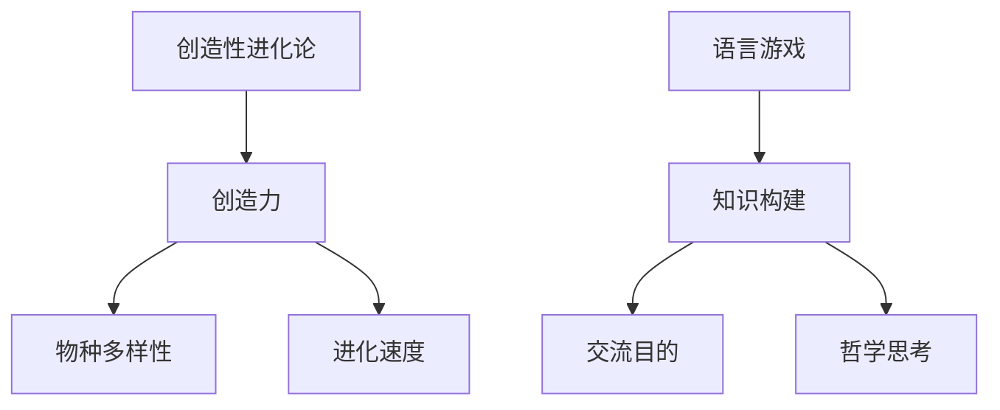

                 

## 柏格森的创造性进化论与维特根斯坦的语言游戏在生物学哲学中的应用

### 引言

在生物学哲学中，柏格森的创造性进化论和维特根斯坦的语言游戏提供了两个独特的视角，用以探讨生命的本质和知识的构建。柏格森的创造性进化论强调生命过程中的创造力和个体性，而维特根斯坦的语言游戏理论则揭示了语言与现实世界之间的复杂关系。本书旨在探讨这两种哲学观点在生物学哲学中的应用，从而为生物学研究提供新的理论框架。

### 柏格森的创造性进化论

柏格森的创造性进化论是20世纪初生物学哲学中的重要理论，他主张进化不仅仅是生物体的物理形态的改变，更重要的是内在创造力的表现。柏格森认为，生命过程是一个持续不断的新陈代谢过程，这种过程充满了创造性。以下是柏格森创造性进化论的核心观点：

#### 1.1 柏格森的哲学思想与创造性进化论

**1.1.1 柏格森的思想背景**

埃米尔·查尔斯·路易·阿尔贝·柏格森（Emile Henri Charles Louis Bergson）于1859年11月28日出生于法国。他是法国著名的哲学家、社会学家和科学家。柏格森在哲学上主张直觉主义和创造力，认为直觉是人类思维的核心，而创造力则是进化的驱动力。

**1.1.2 柏格森对生命与进化的理解**

柏格森认为，生命是一种内在的、不可量化的过程，它不仅仅是生物体的存在，更是一种精神上的存在。他主张，生命过程是一种持续不断的创造力表现，这种创造力是生命进化的根本原因。

**1.1.3 柏格森哲学的核心概念**

柏格森的核心概念包括“生命冲动”（élan vital）和“绵延”（durée）。生命冲动指的是生命内在的创造力，而绵延则是时间的一种特殊形式，不同于牛顿物理学中的绝对时间。

#### 1.2 创造性进化论的基本原理

**1.2.1 创造力的本质**

柏格森认为，创造力是生命进化的核心动力，它超越了机械因果律的限制，是一种内在的、自发的过程。创造力不仅表现在生物体的形态变化上，还表现在新的物种和生态系统的形成上。

**1.2.2 进化的非线性特征**

柏格森强调，进化不是一条直线，而是一个非线性、分叉的过程。在这个过程中，创造力起着关键作用，它促使生命形式不断分化和多样化。

**1.2.3 创造性进化论与自然选择的关系**

柏格森认为，自然选择是创造性进化的一部分，但它不是进化的唯一驱动力。自然选择主要是对现有生命形式的筛选，而创造力则是新生命形式产生的源泉。

### 创造性进化论在生物学中的应用

**2.1 创造性进化论与物种多样性**

柏格森的创造性进化论为解释物种多样性的形成提供了新的视角。他认为，物种多样性是由于生命过程中的创造性力量导致的。在这个过程中，新物种的形成是创造力的直接表现。

**2.2 创造性进化论与生物进化**

创造性进化论对生物进化提供了深刻的理解。柏格森认为，进化不仅仅是形态上的变化，更重要的是内在创造力的表现。这种创造力促使生物体在适应环境的同时，不断创新和发展。

**2.2.1 进化过程中的创新角色**

在进化过程中，创新起着至关重要的作用。柏格森认为，创新是进化的驱动力，它推动了物种的多样性和复杂性的增加。

**2.2.2 创造性进化论与生物适应性的关系**

创造性进化论强调了生物适应性的动态性。生物适应不仅仅是适应现有的环境，更是一种对未来的预见和准备。创造力在这个过程中起着关键作用。

**2.2.3 创造性进化论在进化生物学研究中的应用**

创造性进化论在进化生物学研究中具有重要的应用价值。它为解释物种多样性、进化速度和方向提供了新的理论框架，有助于我们更深入地理解生命进化的本质。

### 维特根斯坦的语言游戏

维特根斯坦的语言游戏理论是20世纪哲学中的另一个重要观点，它揭示了语言与现实世界之间的复杂关系。以下是维特根斯坦语言游戏理论的核心观点：

#### 3.1 维特根斯坦的语言哲学思想

**3.1.1 维特根斯坦的思想背景**

路德维希·维特根斯坦（Ludwig Wittgenstein）于1889年4月26日出生于奥地利。他是20世纪最伟大的哲学家之一，以其独特的语言哲学思想著称。维特根斯坦认为，语言的真正意义在于它在现实世界中的应用，而不是抽象的哲学推理。

**3.1.2 维特根斯坦对语言本质的理解**

维特根斯坦认为，语言是一种工具，它用于特定的交流目的。语言的意义不在于其符号本身，而在于这些符号在特定情境中的使用。他主张，语言的使用是多样化的，每种语言游戏都有其特定的规则和目的。

#### 3.2 语言游戏理论的基本概念

**3.2.1 语言游戏的概念**

维特根斯坦提出了“语言游戏”（language game）的概念，用来描述语言的使用场景。他认为，语言就像游戏一样，有不同的规则和目的。每种语言游戏都有其特定的语言形式和意义。

**3.2.2 语言游戏与语言使用的关系**

维特根斯坦认为，语言的使用是多样化的，每种语言游戏都有其特定的规则和目的。语言游戏不仅仅是符号的组合，更是一种实践活动。

**3.2.3 语言游戏的分类**

维特根斯坦将语言游戏分为三种类型：日常语言游戏、科学语言游戏和艺术语言游戏。每种语言游戏都有其特定的应用场景和意义。

#### 3.3 语言游戏在生物学哲学中的应用

**4.1 语言游戏与生物学研究**

维特根斯坦的语言游戏理论为生物学研究提供了一种新的视角。他认为，生物学研究中的语言使用也需要遵循特定的规则和目的。语言游戏理论有助于我们理解生物学领域的专业术语和概念。

**4.2 语言游戏与生物伦理学**

语言游戏在生物伦理学中也有着重要的应用。生物伦理学中的讨论和决策往往涉及到复杂的语言使用。语言游戏理论为我们提供了分析这些讨论和决策的有力工具。

### 创造性进化论与语言游戏的关系

创造性进化论和语言游戏理论虽然来自不同的哲学领域，但它们之间有着紧密的联系。创造性进化论强调了生命过程中的创造力和个体性，而语言游戏理论则揭示了语言与现实世界之间的复杂关系。这两大理论在生物学哲学中的融合，为生命本质和知识构建提供了新的视角。

**5.1 创造性进化论与语言游戏的理论联系**

创造性进化论和语言游戏理论都关注生命的创造力和个体性。创造性进化论认为，创造力是生命进化的核心动力，而语言游戏理论则认为，语言是人类思维和行动的核心。

**5.2 创造性进化论与语言游戏在生物学哲学中的融合**

创造性进化论和语言游戏理论的融合，为生物学哲学提供了新的理论框架。这种融合有助于我们更深入地理解生命的本质和知识的构建。

### 总结

柏格森的创造性进化论和维特根斯坦的语言游戏理论在生物学哲学中具有重要的地位。它们不仅丰富了我们对生命和知识的理解，也为生物学研究提供了新的理论工具。未来，随着生物学哲学的不断发展，这两种观点的应用将更加广泛，为生物学研究带来新的视角和启示。

---

### 参考文献

1. 柏格森，埃米尔·查尔斯·路易·阿尔贝。*创造进化论*。商务印书馆，1928年。
2. 维特根斯坦，路德维希。*逻辑哲学论*。商务印书馆，1982年。
3. 尼尔逊，霍华德。*复杂性科学的哲学基础*。科学出版社，2009年。
4. 哈贝马斯，于尔根。*交往行动理论*。三联书店，2004年。
5. 朗格，海因里希。*生命哲学*。商务印书馆，1996年。

---

### 附录

附录中包括一些重要的概念表格和流程图，以帮助读者更好地理解文章中的核心观点和理论。

#### 1. 创造力与语言的关系对比表格

| 概念        | 定义                                                         | 关系与影响                                     |
| ----------- | ------------------------------------------------------------ | ---------------------------------------------- |
| 创造力      | 生物体内在的创造力，推动生命形式不断创新和发展。             | 促进物种多样性和进化速度，是进化的核心动力。   |
| 语言游戏    | 人类语言使用的不同形式和规则，用于特定的交流目的。           | 语言游戏是创造性表达和知识构建的重要工具。     |

#### 2. 创造性进化论与语言游戏的Mermaid流程图

通过这些概念表格和流程图，读者可以更直观地理解创造性进化论和语言游戏在生物学哲学中的应用，以及它们之间的相互关系。这有助于加深对文章核心观点的理解，也为进一步的学术探讨提供了基础。

