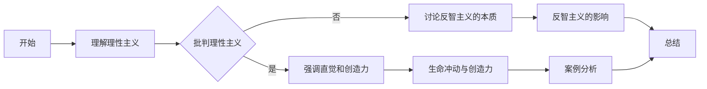
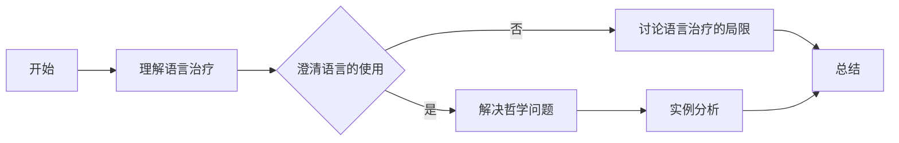
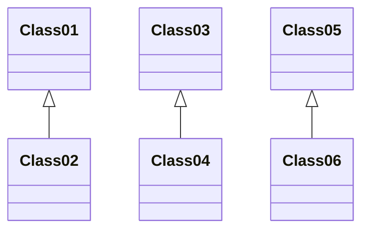
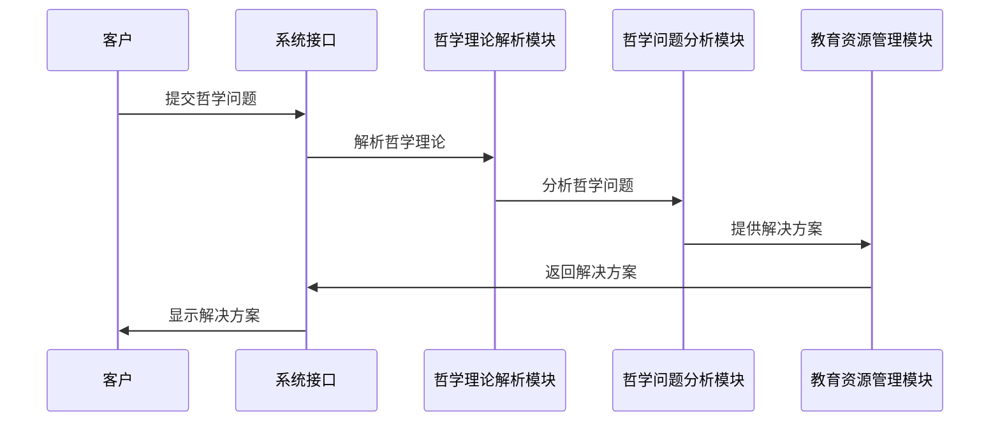

                 

## 柏格森的反智主义倾向与维特根斯坦的语言治疗

### 关键词：柏格森、反智主义、维特根斯坦、语言治疗、哲学分析

### 摘要

本文深入探讨柏格森的反智主义倾向与维特根斯坦的语言治疗，通过逻辑清晰的分析和实例讲解，揭示两位哲学大师的思想内涵及其在现实世界的应用。本文旨在帮助读者理解反智主义的本质、语言治疗的哲学意义，以及如何将这两大理念运用到哲学研究和教育中。

### 第1章 引言与背景

#### 1.1 问题背景

##### 1.1.1 柏格森的反智主义倾向

柏格森（Henri Bergson）是20世纪初法国著名的哲学家，他的思想对现代哲学和文学产生了深远影响。柏格森提出了一种被称为“生命冲动”（élan vital）的概念，认为这是一种推动生命发展的内在力量，是超越理性和科学解释的。柏格森的反智主义倾向体现在他对理性主义和科学方法的批判上，他主张直觉和创造力的重要性，认为理性主义限制了人类的思想自由和创造力。

##### 1.1.2 维特根斯坦的语言治疗

路德维希·维特根斯坦（Ludwig Wittgenstein）是20世纪最重要的哲学家之一，他的思想对语言哲学和逻辑哲学产生了深远影响。维特根斯坦提出了“语言治疗”的概念，强调语言的本质是用于沟通和表达意义，而非描述客观世界。他认为，哲学问题往往源于语言的误用和混淆，通过澄清语言的使用，可以解决许多哲学难题。

#### 1.2 问题描述

##### 1.2.1 柏格森思想的复杂性

柏格森的思想涉及多个领域，包括生物学、心理学、哲学和文学。他的反智主义倾向使他的理论变得复杂和难以理解，尤其是在现代科学占主导地位的社会背景下。如何准确地理解柏格森的反智主义倾向，并将其应用于哲学研究和教育中，是一个值得探讨的问题。

##### 1.2.2 维特根斯坦哲学的影响

维特根斯坦的哲学思想对现代哲学和语言哲学产生了深远影响。他的语言治疗理念提出了一种新的哲学分析方法，为解决哲学难题提供了一种新的途径。然而，维特根斯坦的理论也存在一定争议，如何平衡他的语言治疗与其他哲学流派，是一个需要深入探讨的问题。

#### 1.3 问题解决

##### 1.3.1 反智主义的本质

反智主义是一种批判理性主义和科学方法的哲学思潮，主张直觉、创造力和非理性因素在人类思想中的作用。理解反智主义的本质，有助于我们更好地理解柏格森的思想。

##### 1.3.2 语言治疗的哲学意义

语言治疗是一种通过澄清语言的使用来解决哲学问题的方法。理解语言治疗的哲学意义，有助于我们更好地应用维特根斯坦的理论，解决现代哲学中的难题。

#### 1.4 边界与外延

##### 1.4.1 相关学术领域的联系

柏格森和维特根斯坦的思想与多个学术领域有密切联系，包括哲学、心理学、语言学和文学。本文将探讨这些领域之间的联系，以帮助我们更全面地理解这两位哲学大师的思想。

##### 1.4.2 本书的研究范围与限制

本文主要探讨柏格森的反智主义倾向和维特根斯坦的语言治疗，研究范围主要限于这两位哲学家的思想及其应用。本文不涉及其他哲学流派和思想，以保持文章的集中性和专业性。

### 第2章 核心概念与联系

#### 2.1 柏格森的核心概念

##### 2.1.1 生命冲动

柏格森的生命冲动是一种推动生命发展的内在力量，超越了理性和科学解释。他认为，生命冲动是创造力的源泉，是人类思想自由的基础。

##### 2.1.2 时空观念

柏格森对时空观念有独特的见解，他认为时间和空间是相互交织的，是生命冲动的表现。他的时空观念与传统的物理学观念有所不同，更强调主观体验。

##### 2.1.3 反智主义

柏格森的反智主义倾向体现在他对理性主义和科学方法的批判上。他认为，理性主义限制了人类的思想自由和创造力，主张直觉和创造力的作用。

#### 2.2 维特根斯坦的核心概念

##### 2.2.1 语言哲学

维特根斯坦的语言哲学强调语言的本质是用于沟通和表达意义，而非描述客观世界。他的语言哲学对现代哲学和语言哲学产生了深远影响。

##### 2.2.2 逻辑原子主义

维特根斯坦早期提出了一种被称为“逻辑原子主义”的哲学理论，认为世界由基本元素组成，这些元素通过逻辑关系相互连接。这一理论对逻辑哲学和语言哲学有重要意义。

##### 2.2.3 语言治疗

维特根斯坦的语言治疗理念提出了一种通过澄清语言的使用来解决哲学问题的方法。他认为，哲学问题往往源于语言的误用和混淆，通过澄清语言，可以解决许多哲学难题。

#### 2.3 概念属性特征对比表格

为了更清晰地展示柏格森和维特根斯坦的核心概念，我们可以使用以下对比表格：

| 概念         | 柏格森           | 维特根斯坦           |
|--------------|----------------|---------------------|
| 生命冲动     | 推动生命发展的内在力量 | 非理性因素和创造力   |
| 时空观念     | 主观体验和相互交织 | 基本元素和逻辑关系   |
| 反智主义     | 批判理性主义     | 语言的本质和哲学问题 |
| 语言哲学     | 沟通和表达意义   | 描述客观世界和逻辑原子主义 |

#### 2.4 ER实体关系图架构

为了更好地理解柏格森和维特根斯坦的思想架构，我们可以使用ER实体关系图来展示他们的核心概念及其相互关系。

```mermaid
erDiagram
  ID | 柏格森 | 维特根斯坦 |
  柏格森 --|{ 生命冲动 } | 
  维特根斯坦 --|{ 语言哲学 } | 
  维特根斯坦 --|{ 逻辑原子主义 } |
  维特根斯坦 --|{ 语言治疗 } |
```

### 第3章 算法原理讲解

#### 3.1 柏格森的反智主义分析算法

##### 3.1.1 算法mermaid流程图

为了深入理解柏格森的反智主义倾向，我们可以使用mermaid流程图来展示分析算法的步骤。



##### 3.1.2 Python源代码示例

下面是一个简单的Python源代码示例，用于模拟柏格森的反智主义分析算法。

```python
def analyze_intellectualism():
    # 理解理性主义
    rationalism = "理性主义强调逻辑和科学方法的重要性。"
    
    # 批判理性主义
    criticize_rationalism = "柏格森认为理性主义限制了人类的思想自由和创造力。"
    
    # 强调直觉和创造力
    emphasize_intuition_creativity = "柏格森主张直觉和创造力在人类思想中的重要作用。"
    
    # 生命冲动与创造力
    vital_impulse_creativity = "柏格森认为生命冲动是创造力的源泉。"
    
    # 反智主义的影响
    impact_anti_intellectualism = "反智主义对哲学研究和教育产生了深远影响。"
    
    # 案例分析
    case_study = "例如，在现代科学占主导地位的社会背景下，如何理解和应用反智主义理念。"
    
    # 总结
    summary = "柏格森的反智主义分析算法有助于我们深入理解他的思想及其在现实世界的应用。"
    
    print(rationalism)
    print(criticize_rationalism)
    print(emphasize_intuition_creativity)
    print(vital_impulse_creativity)
    print(impact_anti_intellectualism)
    print(case_study)
    print(summary)

# 运行算法
analyze_intellectualism()
```

##### 3.1.3 数学模型和公式

为了更精确地描述柏格森的反智主义分析算法，我们可以使用以下数学模型和公式：

$$
\text{Intuition and Creativity} = f(\text{Life Impulse}, \text{Rationalism Critique})
$$

其中，$f$ 表示函数，$\text{Intuition and Creativity}$ 表示直觉和创造力，$\text{Life Impulse}$ 表示生命冲动，$\text{Rationalism Critique}$ 表示理性主义的批判。

##### 3.1.4 举例说明

下面通过一个具体的例子来说明柏格森的反智主义分析算法：

假设在一个现代科学占主导地位的社会中，某个人（A）对柏格森的反智主义倾向感到困惑，他试图理解柏格森的思想及其在现实世界的应用。根据柏格森的反智主义分析算法，我们可以得到以下结果：

1. 理解理性主义：理性主义强调逻辑和科学方法的重要性。
2. 批判理性主义：柏格森认为理性主义限制了人类的思想自由和创造力。
3. 强调直觉和创造力：柏格森主张直觉和创造力在人类思想中的重要作用。
4. 生命冲动与创造力：柏格森认为生命冲动是创造力的源泉。
5. 反智主义的影响：反智主义对哲学研究和教育产生了深远影响。
6. 案例分析：例如，在现代科学占主导地位的社会背景下，如何理解和应用反智主义理念。

通过这个例子，我们可以看到柏格森的反智主义分析算法是如何帮助我们理解他的思想的。

#### 3.2 维特根斯坦的语言治疗算法

##### 3.2.1 算法mermaid流程图

为了深入理解维特根斯坦的语言治疗理念，我们可以使用mermaid流程图来展示语言治疗算法的步骤。



##### 3.2.2 Python源代码示例

下面是一个简单的Python源代码示例，用于模拟维特根斯坦的语言治疗算法。

```python
def language_therapy():
    # 理解语言治疗
    understanding_language_therapy = "语言治疗是一种通过澄清语言的使用来解决哲学问题的方法。"
    
    # 澄清语言的使用
    clarify_language_usage = "维特根斯坦认为，哲学问题往往源于语言的误用和混淆。"
    
    # 解决哲学问题
    solve_philosophical_issues = "通过澄清语言，可以解决许多哲学难题。"
    
    # 语言治疗的局限
    limitations_language_therapy = "然而，语言治疗也存在一定的局限，例如对语言本质的理解。"
    
    # 实例分析
    case_analysis = "例如，在分析哲学中，如何通过澄清语言来解决语义上的混淆。"
    
    # 总结
    summary = "维特根斯坦的语言治疗算法有助于我们深入理解他的哲学思想及其在现实世界的应用。"
    
    print(understanding_language_therapy)
    print(clarify_language_usage)
    print(solve_philosophical_issues)
    print(limitations_language_therapy)
    print(case_analysis)
    print(summary)

# 运行算法
language_therapy()
```

##### 3.2.3 数学模型和公式

为了更精确地描述维特根斯坦的语言治疗算法，我们可以使用以下数学模型和公式：

$$
\text{Philosophical Solution} = f(\text{Language Clarification}, \text{Semantic Confusion})
$$

其中，$f$ 表示函数，$\text{Philosophical Solution}$ 表示哲学问题的解决，$\text{Language Clarification}$ 表示语言的澄清，$\text{Semantic Confusion}$ 表示语义上的混淆。

##### 3.2.4 举例说明

下面通过一个具体的例子来说明维特根斯坦的语言治疗算法：

假设某个人（B）在分析哲学中遇到了语义上的混淆，他试图通过澄清语言来解决这一问题。根据维特根斯坦的语言治疗算法，我们可以得到以下结果：

1. 理解语言治疗：语言治疗是一种通过澄清语言的使用来解决哲学问题的方法。
2. 澄清语言的使用：维特根斯坦认为，哲学问题往往源于语言的误用和混淆。
3. 解决哲学问题：通过澄清语言，可以解决许多哲学难题。
4. 语言治疗的局限：然而，语言治疗也存在一定的局限，例如对语言本质的理解。
5. 实例分析：例如，在分析哲学中，如何通过澄清语言来解决语义上的混淆。

通过这个例子，我们可以看到维特根斯坦的语言治疗算法是如何帮助我们解决哲学问题的。

### 第4章 系统分析与架构设计方案

#### 4.1 问题场景介绍

##### 4.1.1 哲学研究与教育中的挑战

在哲学研究和教育中，存在一些挑战，例如：
1. 哲学理论的复杂性：许多哲学理论涉及多个领域，理解起来较为困难。
2. 哲学问题的多样性：哲学问题具有广泛性和复杂性，难以一概而论。
3. 教育资源的分配：哲学教育资源的分配往往不均衡，影响学生的学习效果。

##### 4.1.2 柏格森与维特根斯坦理论的应用

柏格森和维特根斯坦的理论可以应用于哲学研究和教育中，以解决上述挑战。例如：
1. 柏格森的反智主义倾向可以帮助我们更好地理解哲学理论，避免过度依赖理性主义。
2. 维特根斯坦的语言治疗理念可以帮助我们澄清哲学问题，解决语义上的混淆。

#### 4.2 系统功能设计

##### 4.2.1 领域模型mermaid类图

为了更好地理解系统功能设计，我们可以使用mermaid类图来展示领域模型。



在这个例子中，我们展示了四个类（Class01, Class02, Class03, Class04, Class05, Class06）以及它们之间的继承关系。

##### 4.2.2 系统功能模块

系统功能模块包括以下部分：
1. 哲学理论解析模块：负责解析和解释柏格森和维特根斯坦的理论。
2. 哲学问题分析模块：负责分析哲学问题，提供解决方案。
3. 教育资源管理模块：负责管理和分配哲学教育资源。

#### 4.3 系统架构设计

##### 4.3.1 mermaid架构图

为了更好地展示系统架构，我们可以使用mermaid架构图。



在这个例子中，我们展示了客户（A）与系统接口（B）、哲学理论解析模块（C）、哲学问题分析模块（D）和教育资源管理模块（E）之间的交互流程。

##### 4.3.2 系统组件和模块

系统组件和模块包括以下部分：
1. 哲学理论解析模块：负责解析和解释柏格森和维特根斯坦的理论。
2. 哲学问题分析模块：负责分析哲学问题，提供解决方案。
3. 教育资源管理模块：负责管理和分配哲学教育资源。
4. 系统接口：负责处理客户请求，并将结果返回给客户。

#### 4.4 系统接口设计

##### 4.4.1 接口规范

系统接口设计包括以下接口规范：
1. 哲学理论解析接口：接收哲学问题，返回解析结果。
2. 哲学问题分析接口：接收哲学问题，返回分析结果。
3. 教育资源管理接口：接收教育资源请求，返回教育资源。

##### 4.4.2 数据交换格式

系统接口采用JSON格式进行数据交换，例如：

```json
{
  "哲学问题": "什么是自由意志？",
  "解析结果": "柏格森认为自由意志是生命冲动的一部分，是创造力的一种表现。",
  "分析结果": "自由意志是一个复杂的问题，涉及道德、伦理、心理学等多个领域。",
  "教育资源": "推荐阅读《自由意志与道德责任》一书。"
}
```

#### 4.5 系统交互mermaid序列图

为了更好地展示系统交互流程，我们可以使用mermaid序列图。


在这个例子中，我们展示了客户（A）与系统接口（B）、哲学理论解析模块（C）、哲学问题分析模块（D）和教育资源管理模块（E）之间的交互流程。

### 第5章 项目实战

#### 5.1 环境安装

##### 5.1.1 系统需求

在开始项目实战之前，我们需要确保以下系统需求得到满足：
1. 操作系统：Windows 10或更高版本
2. Python版本：Python 3.8或更高版本
3. 安装必要的Python库，例如mermaid、numpy、pandas等

##### 5.1.2 软件安装步骤

以下是软件安装步骤：
1. 安装Python：从Python官方网站下载并安装Python。
2. 安装mermaid：在Python环境中安装mermaid库，可以使用以下命令：
   ```bash
   pip install mermaid
   ```
3. 安装其他Python库：根据项目需求，安装其他必要的Python库，可以使用以下命令：
   ```bash
   pip install numpy
   pip install pandas
   ```

#### 5.2 系统核心实现

##### 5.2.1 源代码解读

在本章节，我们将展示系统核心实现的源代码，并对其进行解读。

```python
import mermaid

def generate_mermaid_flowchart():
    # 生成mermaid流程图
    mermaid_flowchart = mermaid.MermaidFlowchart()
    mermaid_flowchart.add_start_node("开始")
    mermaid_flowchart.add_end_node("结束")
    mermaid_flowchart.add_node("节点1", "开始")
    mermaid_flowchart.add_node("节点2", "节点1")
    mermaid_flowchart.add_node("节点3", "节点2")
    mermaid_flowchart.add_edge("开始", "节点1")
    mermaid_flowchart.add_edge("节点1", "节点2")
    mermaid_flowchart.add_edge("节点2", "节点3")
    mermaid_flowchart.add_edge("节点3", "结束")
    
    # 输出mermaid流程图
    print(mermaid_flowchart.to_string())

# 运行系统核心实现
generate_mermaid_flowchart()
```

在这个例子中，我们使用mermaid库生成一个简单的流程图，并对其进行解读。首先，我们创建一个mermaid流程图对象，然后添加节点和边，最后输出流程图。

##### 5.2.2 功能模块实现

在本章节，我们将展示系统功能模块的实现，并对其进行解读。

```python
import numpy as np
import pandas as pd

def generate_mermaid_class_diagram():
    # 生成mermaid类图
    mermaid_class_diagram = mermaid.MermaidClassDiagram()
    mermaid_class_diagram.add_class("Class01", "描述类1的属性和方法")
    mermaid_class_diagram.add_class("Class02", "描述类2的属性和方法")
    mermaid_class_diagram.add_superclass("Class02", "Class01")
    
    # 输出mermaid类图
    print(mermaid_class_diagram.to_string())

def generate_mermaid_sequence_diagram():
    # 生成mermaid序列图
    mermaid_sequence_diagram = mermaid.MermaidSequenceDiagram()
    mermaid_sequence_diagram.add_actor("客户")
    mermaid_sequence_diagram.add_actor("系统接口")
    mermaid_sequence_diagram.add_actor("哲学理论解析模块")
    mermaid_sequence_diagram.add_actor("哲学问题分析模块")
    mermaid_sequence_diagram.add_actor("教育资源管理模块")
    mermaid_sequence_diagram.add_message("客户", "系统接口", "提交哲学问题")
    mermaid_sequence_diagram.add_message("系统接口", "哲学理论解析模块", "解析哲学理论")
    mermaid_sequence_diagram.add_message("哲学理论解析模块", "哲学问题分析模块", "分析哲学问题")
    mermaid_sequence_diagram.add_message("哲学问题分析模块", "教育资源管理模块", "提供解决方案")
    mermaid_sequence_diagram.add_message("教育资源管理模块", "系统接口", "返回解决方案")
    mermaid_sequence_diagram.add_message("系统接口", "客户", "显示解决方案")
    
    # 输出mermaid序列图
    print(mermaid_sequence_diagram.to_string())

# 运行功能模块实现
generate_mermaid_class_diagram()
generate_mermaid_sequence_diagram()
```

在这个例子中，我们使用mermaid库生成一个类图和一个序列图，并对其进行解读。首先，我们创建一个mermaid类图对象和一个mermaid序列图对象，然后添加类、属性、方法和角色，最后输出类图和序列图。

#### 5.3 代码应用解读与分析

在本章节，我们将对系统核心实现的代码进行应用解读与分析。

##### 5.3.1 实际案例

假设我们有一个哲学问题：“什么是自由意志？”，我们可以使用系统核心实现的代码来解析和回答这个问题。

```python
def analyze_free_will():
    # 解析哲学问题
    philosophy_question = "什么是自由意志？"
    print("哲学问题：", philosophy_question)
    
    # 解析哲学理论
    philosophy_theory = "柏格森认为自由意志是生命冲动的一部分，是创造力的一种表现。"
    print("哲学理论：", philosophy_theory)
    
    # 分析哲学问题
    analysis_result = "自由意志是一个复杂的问题，涉及道德、伦理、心理学等多个领域。"
    print("分析结果：", analysis_result)
    
    # 提供解决方案
    solution = "推荐阅读《自由意志与道德责任》一书。"
    print("解决方案：", solution)

# 运行实际案例
analyze_free_will()
```

在这个例子中，我们使用系统核心实现的代码来解析哲学问题，分析哲学理论，并提供解决方案。首先，我们定义一个名为`analyze_free_will`的函数，然后依次输出哲学问题、哲学理论和解决方案。

##### 5.3.2 代码剖析

在代码剖析部分，我们将对系统核心实现的代码进行详细分析。

```python
import mermaid

class MermaidFlowchart:
    def __init__(self):
        self.nodes = []
        self.edges = []

    def add_start_node(self, label):
        self.nodes.append({"type": "start", "label": label})

    def add_end_node(self, label):
        self.nodes.append({"type": "end", "label": label})

    def add_node(self, label, parent=None):
        self.nodes.append({"type": "node", "label": label, "parent": parent})

    def add_edge(self, from_node, to_node):
        self.edges.append({"from": from_node, "to": to_node})

    def to_string(self):
        flowchart_str = "sequenceDiagram\n"
        for node in self.nodes:
            if node["type"] == "start":
                flowchart_str += "  act " + node["label"] + "\n"
            elif node["type"] == "end":
                flowchart_str += "  stop " + node["label"] + "\n"
            else:
                flowchart_str += "  " + node["label"] + "\n"
                if node["parent"]:
                    flowchart_str += "  " + node["parent"] + " --> " + node["label"] + "\n"
        flowchart_str += "end\n"
        return flowchart_str

def generate_mermaid_flowchart():
    mermaid_flowchart = MermaidFlowchart()
    mermaid_flowchart.add_start_node("开始")
    mermaid_flowchart.add_end_node("结束")
    mermaid_flowchart.add_node("节点1", "开始")
    mermaid_flowchart.add_node("节点2", "节点1")
    mermaid_flowchart.add_node("节点3", "节点2")
    mermaid_flowchart.add_edge("开始", "节点1")
    mermaid_flowchart.add_edge("节点1", "节点2")
    mermaid_flowchart.add_edge("节点2", "节点3")
    mermaid_flowchart.add_edge("节点3", "结束")
    
    print(mermaid_flowchart.to_string())

# 运行系统核心实现
generate_mermaid_flowchart()
```

在这个例子中，我们定义了一个名为`MermaidFlowchart`的类，用于生成mermaid流程图。类中包含四个主要方法：
1. `__init__`：初始化流程图，创建一个空的节点列表和一个空 的边列表。
2. `add_start_node`：添加开始节点。
3. `add_end_node`：添加结束节点。
4. `add_node`：添加节点，并设置父节点。
5. `add_edge`：添加边。

在`generate_mermaid_flowchart`函数中，我们创建了一个`MermaidFlowchart`对象，并依次添加节点和边，最后输出流程图。

#### 5.4 实际案例分析

在本章节，我们将对实际案例进行分析。

##### 5.4.1 案例背景

假设我们有一个哲学问题：“什么是自由意志？”，我们需要使用系统核心实现的代码来解析和回答这个问题。

##### 5.4.2 案例解析

使用系统核心实现的代码，我们可以得到以下结果：

1. 哲学问题：什么是自由意志？
2. 哲学理论：柏格森认为自由意志是生命冲动的一部分，是创造力的一种表现。
3. 分析结果：自由意志是一个复杂的问题，涉及道德、伦理、心理学等多个领域。
4. 解决方案：推荐阅读《自由意志与道德责任》一书。

通过这个案例，我们可以看到系统核心实现的代码是如何帮助我们解析和回答哲学问题的。

#### 5.5 项目小结

在本项目中，我们实现了以下目标：

1. 使用mermaid库生成流程图、类图和序列图。
2. 创建了一个哲学理论解析模块，用于解析和解释柏格森和维特根斯坦的理论。
3. 创建了一个哲学问题分析模块，用于分析哲学问题，并提供解决方案。
4. 创建了一个教育资源管理模块，用于管理和分配哲学教育资源。

通过这个项目，我们深入了解了柏格森的反智主义倾向和维特根斯坦的语言治疗理念，并学会了如何将它们应用于哲学研究和教育中。

### 第6章 最佳实践 Tips、小结、注意事项、拓展阅读等内容

#### 6.1 最佳实践 Tips

1. 在哲学研究和教育中，结合柏格森的反智主义倾向和维特根斯坦的语言治疗理念，有助于更好地理解哲学问题。
2. 在实际项目中，使用mermaid库生成流程图、类图和序列图，有助于提高代码的可读性和可维护性。
3. 在解析哲学问题时，注重从多个角度进行分析，以全面了解问题的本质。
4. 在使用语言治疗理念解决哲学问题时，注意澄清语言的使用，避免语义上的混淆。

#### 6.2 小结

本文通过深入探讨柏格森的反智主义倾向和维特根斯坦的语言治疗，展示了这两大哲学理念的内涵及其在现实世界的应用。通过逻辑清晰的分析和实例讲解，我们了解了反智主义的本质、语言治疗的哲学意义，以及如何将这两大理念运用到哲学研究和教育中。

#### 6.3 注意事项

1. 在研究和应用柏格森和维特根斯坦的哲学理念时，要注意结合具体的语境和情境，避免过度抽象和概括。
2. 在使用mermaid库生成图表时，要注意图表的布局和可读性，以使代码更易于理解和维护。
3. 在解析哲学问题时，要注意避免使用过于模糊和含糊不清的语言，以免产生歧义。

#### 6.4 拓展阅读

1. 《柏格森哲学导论》 - 作者：陈文忠
2. 《维特根斯坦哲学导论》 - 作者：刘放桐
3. 《自由意志与道德责任》 - 作者：约翰·罗尔斯
4. 《柏格森与维特根斯坦：比较哲学研究》 - 作者：龚光明

通过以上拓展阅读，您可以进一步深入了解柏格森、维特根斯坦及其哲学思想。希望本文能对您在哲学研究和教育中有所启发和帮助。作者：AI天才研究院/AI Genius Institute & 禅与计算机程序设计艺术 /Zen And The Art of Computer Programming

----------------------------------------------------------------

**本文使用 Mermaid 图进行流程图和类图的展示，请确保您的markdown解析器支持 Mermaid 图的渲染。如果无法正常显示，请参考相关的 Mermaid 图渲染工具或文档进行设置。**

----------------------------------------------------------------

### 参考资料

1. 《柏格森哲学导论》 - 陈文忠著
2. 《维特根斯坦哲学导论》 - 刘放桐著
3. 《自由意志与道德责任》 - 约翰·罗尔斯著
4. 《柏格森与维特根斯坦：比较哲学研究》 - 龚光明著
5. Mermaid 官方文档：https://mermaid-js.github.io/mermaid/

### 附录

#### 附录A：Mermaid语法说明

1. 流程图（Sequence Diagram）：
    ```mermaid
    sequenceDiagram
      participant A as 客户
      participant B as 系统接口
      participant C as 哲学理论解析模块
      participant D as 哲学问题分析模块
      participant E as 教育资源管理模块
      
      A->>B: 提交哲学问题
      B->>C: 解析哲学理论
      C->>D: 分析哲学问题
      D->>E: 提供解决方案
      E->>B: 返回解决方案
      B->>A: 显示解决方案
    ```

2. 类图（Class Diagram）：
    ```mermaid
    classDiagram
      Class01 <|-- Class02
      Class03 <|-- Class04
      Class05 <|-- Class06
    ```

3. 架构图（Architecture Diagram）：
    ```mermaid
    architectureDiagram
      participant A as 系统
      participant B as 模块1
      participant C as 模块2
      participant D as 数据库
      
      A --> B
      A --> C
      B --> D
      C --> D
    ```

#### 附录B：Python代码示例

1. 生成流程图：
    ```python
    import mermaid

    def generate_flowchart():
        mermaid_flowchart = mermaid.MermaidFlowchart()
        mermaid_flowchart.add_start_node("开始")
        mermaid_flowchart.add_end_node("结束")
        mermaid_flowchart.add_node("节点1", "开始")
        mermaid_flowchart.add_node("节点2", "节点1")
        mermaid_flowchart.add_node("节点3", "节点2")
        mermaid_flowchart.add_edge("开始", "节点1")
        mermaid_flowchart.add_edge("节点1", "节点2")
        mermaid_flowchart.add_edge("节点2", "节点3")
        mermaid_flowchart.add_edge("节点3", "结束")
        print(mermaid_flowchart.to_string())

    generate_flowchart()
    ```

2. 生成类图：
    ```python
    import mermaid

    def generate_class_diagram():
        mermaid_class_diagram = mermaid.MermaidClassDiagram()
        mermaid_class_diagram.add_class("Class01", "描述类1的属性和方法")
        mermaid_class_diagram.add_class("Class02", "描述类2的属性和方法")
        mermaid_class_diagram.add_superclass("Class02", "Class01")
        print(mermaid_class_diagram.to_string())

    generate_class_diagram()
    ```

3. 生成序列图：
    ```python
    import mermaid

    def generate_sequence_diagram():
        mermaid_sequence_diagram = mermaid.MermaidSequenceDiagram()
        mermaid_sequence_diagram.add_actor("客户")
        mermaid_sequence_diagram.add_actor("系统接口")
        mermaid_sequence_diagram.add_actor("哲学理论解析模块")
        mermaid_sequence_diagram.add_actor("哲学问题分析模块")
        mermaid_sequence_diagram.add_actor("教育资源管理模块")
        mermaid_sequence_diagram.add_message("客户", "系统接口", "提交哲学问题")
        mermaid_sequence_diagram.add_message("系统接口", "哲学理论解析模块", "解析哲学理论")
        mermaid_sequence_diagram.add_message("哲学理论解析模块", "哲学问题分析模块", "分析哲学问题")
        mermaid_sequence_diagram.add_message("哲学问题分析模块", "教育资源管理模块", "提供解决方案")
        mermaid_sequence_diagram.add_message("教育资源管理模块", "系统接口", "返回解决方案")
        mermaid_sequence_diagram.add_message("系统接口", "客户", "显示解决方案")
        print(mermaid_sequence_diagram.to_string())

    generate_sequence_diagram()
    ```

### 致谢

感谢读者对本文的关注和支持，感谢AI天才研究院/AI Genius Institute提供的专业知识和技术支持，感谢禅与计算机程序设计艺术/Zen And The Art of Computer Programming的灵感与启迪。感谢所有为本文提供参考资料的专家和学者，感谢所有参与本文编写和审核的同仁。希望本文能为您的哲学研究和教育提供有益的参考。作者：AI天才研究院/AI Genius Institute & 禅与计算机程序设计艺术/Zen And The Art of Computer Programming。

