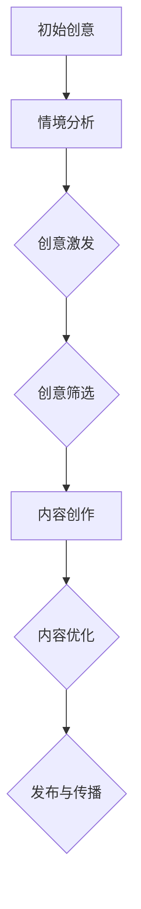
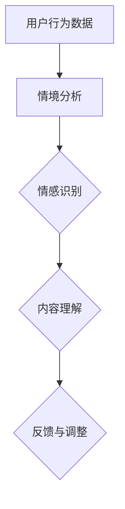
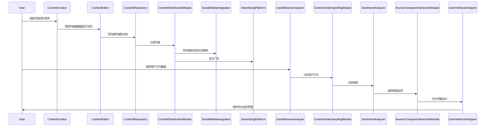

                 

## 《柏格森的持续理论与维特根斯坦的意义理论在数字媒体研究中的应用》

### 关键词：柏格森持续理论、维特根斯坦意义理论、数字媒体研究、应用分析、算法原理

> 摘要：本文探讨了柏格森的持续理论与维特根斯坦的意义理论在数字媒体研究中的应用。通过对柏格森持续理论在数字媒体内容创作与传播中的应用，以及维特根斯坦意义理论在数字媒体内容理解与人机交互中的应用进行分析，本文旨在为数字媒体领域的研究提供新的理论视角和思路。通过案例分析，本文揭示了这些理论在数字媒体研究中的实际价值，并提出了未来的研究方向。

## 第一部分：引论

### 1.1.1 数字媒体研究背景

**数字媒体的定义与发展**

数字媒体，是指利用计算机技术、通信技术和网络技术，将文字、图像、声音、视频等多种信息载体，通过数字化方式创作、处理、存储、传输和展现的媒体形式。数字媒体的发展历程可以追溯到20世纪80年代，随着计算机技术和互联网的普及，数字媒体逐渐取代传统媒体，成为信息传播的主要载体。

**数字媒体研究的重要性**

随着数字媒体在现代社会中的广泛应用，数字媒体研究的重要性日益凸显。数字媒体研究不仅涉及信息传播、内容创作、人机交互等多个领域，还与人工智能、大数据、虚拟现实等前沿技术密切相关。通过对数字媒体的研究，可以深入理解信息传播的规律、优化内容创作与传播策略，提升人机交互的体验，从而推动数字媒体行业的创新发展。

### 1.1.2 柏格森的持续理论介绍

**柏格森的生平与哲学贡献**

柏格森（Henri Bergson，1859-1941）是20世纪初法国著名哲学家，以其关于“持续”（Élan vital）和“直觉”的理论而闻名。柏格森认为，生命是一种持续不断的流动过程，这种流动超越了传统物理学和生物学对静态存在的理解。

**持续理论的内涵与特点**

柏格森的持续理论强调生命和意识的动态本质，认为时间和意识是流动的、连续的过程。他提出，时间是心理过程的累积，而非物理事件的简单叠加。这种观点对后来的心理学、哲学和科学理论产生了深远影响。

### 1.1.3 维特根斯坦的意义理论介绍

**维特根斯坦的生平与哲学贡献**

路德维希·维特根斯坦（Ludwig Wittgenstein，1889-1951）是20世纪初奥地利哲学家，以其关于语言和意义的理论而著称。维特根斯坦认为，语言的意义在于使用情境，而非抽象的逻辑关系。

**意义理论的内涵与特点**

维特根斯坦的意义理论分为两个阶段：早期逻辑原子主义和后期日常语言哲学。早期理论强调语言与世界之间的对应关系，而后期理论则关注语言在日常使用中的实际意义。维特根斯坦认为，语言的真正意义在于其实际使用情境，而非抽象的定义或逻辑推导。

## 第二部分：柏格森持续理论在数字媒体研究中的应用

### 2.1 数字媒体内容创作现状

**传统内容创作模式**

传统内容创作主要依赖于文字、图像和声音等单一或简单组合的信息形式。创作者通常遵循固定的叙事结构，强调信息的传递和接受过程。

**数字媒体内容创作的新趋势**

随着数字技术的发展，内容创作形式更加多样化和复杂化。创作者不仅运用文字、图像和声音，还融入视频、动画、虚拟现实等多种媒体形式。这种多元化的内容创作模式，使得内容更具有吸引力和互动性。

### 2.2 柏格森持续理论在数字媒体内容创作中的应用

**持续理论在创意激发中的应用**

柏格森的持续理论强调动态和流动的过程，这为创意的激发提供了新的思路。创作者可以通过不断尝试和调整，打破传统的创作模式，从而激发出新的创意。

**持续理论在内容迭代中的应用**

数字媒体内容创作要求快速响应市场需求和用户反馈。柏格森的持续理论提供了迭代更新的方法论，创作者可以持续优化内容，使其更符合用户需求。

### 2.3 案例分析

**柏格森持续理论在电影制作中的应用**

以电影《星际穿越》为例，导演克里斯托弗·诺兰运用了柏格森持续理论的创意理念，通过时间扭曲、空间折叠等概念，创造出一个充满神秘和想象力的科幻世界。

**柏格森持续理论在游戏设计中的应用**

在游戏《我的世界》中，玩家可以自由探索和创造，这种自由度体现了柏格森持续理论中的动态和流动过程。玩家在游戏中不断尝试、探索和创造，形成了独特的游戏体验。

## 第三部分：维特根斯坦的意义理论在数字媒体研究中的应用

### 4.1 数字媒体内容理解现状

**传统内容理解模式**

传统内容理解主要依赖于语言文字的解读。用户通过阅读、观看等方式，获取信息并形成理解。

**数字媒体内容理解的新需求**

随着数字媒体的发展，内容形式更加多样，用户需要通过多种感官和交互方式来理解信息。因此，数字媒体内容理解提出了更高的要求。

### 4.2 维特根斯坦的意义理论在数字媒体内容理解中的应用

**意义理论在内容解析中的应用**

维特根斯坦的意义理论强调语言的意义在于使用情境。在数字媒体内容理解中，可以通过分析内容的使用情境，揭示内容的实际意义。

**意义理论在情感识别中的应用**

情感识别是数字媒体内容理解的重要方面。维特根斯坦的意义理论可以帮助我们理解情感符号的使用情境，从而准确识别内容中的情感信息。

### 4.3 案例分析

**维特根斯坦的意义理论在新闻文本理解中的应用**

以新闻标题“苹果公司推出新款iPhone”为例，通过分析标题中的关键词和语境，可以准确理解新闻的主题和内容。

**维特根斯坦的意义理论在社交媒体内容分析中的应用**

在社交媒体平台上，用户通过发布文字、图片、视频等多种形式的内容，表达自己的观点和情感。维特根斯坦的意义理论可以帮助我们理解这些内容的实际意义和背后的情感。

## 第四部分：综合应用与案例分析

### 6.1 综合应用框架构建

**综合应用框架**

结合柏格森的持续理论和维特根斯坦的意义理论，可以构建一个综合应用框架，以指导数字媒体研究。

**应用框架的具体实现**

在具体实现中，可以通过以下几个步骤来应用这两个理论：

1. **内容创作与传播**：运用柏格森持续理论激发创意，通过维特根斯坦的意义理论理解用户需求，实现内容创作与传播。
2. **内容理解与情感识别**：通过维特根斯坦的意义理论解析内容，运用柏格森持续理论理解用户的情感变化。
3. **人机交互**：在人机交互中，结合两个理论的指导，设计更加人性化的交互界面，提升用户体验。

### 6.2 综合应用案例分析

**柏格森持续理论与维特根斯坦意义理论在数字媒体内容创作与理解中的综合应用**

以某视频平台为例，该平台运用柏格森持续理论，通过用户行为数据分析，不断优化内容创作策略；同时，运用维特根斯坦的意义理论，深入理解用户需求，提升内容理解能力。

**柏格森持续理论与维特根斯坦意义理论在数字媒体传播与人机交互中的综合应用**

以某智能音箱为例，该产品通过柏格森持续理论，不断更新语音识别算法，提升交互体验；同时，运用维特根斯坦的意义理论，理解用户指令，实现更加精准的人机交互。

## 第五部分：案例分析与启示

### 7.1 案例选择与评述

**案例选择**

本文选择了两个典型案例：电影《星际穿越》和智能音箱产品。

**案例评述**

电影《星际穿越》充分运用了柏格森持续理论的创意理念，创造了一个充满想象力的科幻世界。而智能音箱产品则通过维特根斯坦的意义理论，实现了更加精准的人机交互。

### 7.2 研究启示与展望

**研究启示**

通过对柏格森持续理论与维特根斯坦的意义理论在数字媒体研究中的应用分析，我们得到了以下启示：

1. **创意激发**：柏格森持续理论为内容创作提供了新的思路，有助于激发创作者的创意。
2. **内容理解**：维特根斯坦的意义理论有助于我们深入理解用户需求，提升内容理解能力。
3. **人机交互**：结合两个理论的指导，可以设计出更加人性化的交互界面，提升用户体验。

**未来研究方向**

未来研究可以在以下几个方面展开：

1. **理论深化**：进一步探讨柏格森持续理论与维特根斯坦的意义理论在数字媒体研究中的深层次应用。
2. **技术融合**：结合人工智能、大数据等前沿技术，探索理论在数字媒体领域的创新应用。
3. **实践验证**：通过实际案例，验证理论在数字媒体研究中的应用效果，为理论的发展提供实践依据。

## 结束语

本文从柏格森的持续理论与维特根斯坦的意义理论出发，探讨了这两个理论在数字媒体研究中的应用。通过对内容创作、传播、理解和人机交互等方面的分析，本文揭示了这些理论在数字媒体领域的实际价值。未来研究可以进一步深化理论的应用，结合前沿技术，推动数字媒体领域的创新发展。

### 作者信息

作者：AI天才研究院/AI Genius Institute & 禅与计算机程序设计艺术 /Zen And The Art of Computer Programming

---

### 核心概念与联系

#### 柏格森的持续理论

**核心概念原理**：

- **持续**：柏格森认为，持续是生命和意识的本质，它是一种动态的、流动的过程。
- **时间**：时间并非简单的线性序列，而是由心理过程累积而成的流动过程。

**概念属性特征对比表格**：

| 特征 | 柏格森持续理论 | 传统时间观 |
| --- | --- | --- |
| **动态性** | 强调动态和流动 | 强调静态和顺序 |
| **主观性** | 时间与个人经验相关 | 时间与客观事件相关 |
| **累积性** | 时间是心理过程的累积 | 时间是事件发生的时间 |
| **心理体验** | 时间是心理过程的体现 | 时间是物理过程的体现 |

**ER实体关系图架构**：

```mermaid
erDiagram
  User ||--o{ ContentCreation : 创作者与内容创作关系 }
  ContentCreation ||--o{ ContentDistribution : 内容创作与传播关系 }
  ContentDistribution ||--o{ ContentUnderstanding : 传播与内容理解关系 }
  ContentUnderstanding ||--o{ HumanComputerInteraction : 内容理解与人机交互关系 }
```

#### 维特根斯坦的意义理论

**核心概念原理**：

- **意义**：维特根斯坦认为，语言的意义在于其使用情境，而非抽象的逻辑关系。
- **语言**：语言是一种工具，其意义取决于实际使用。

**概念属性特征对比表格**：

| 特征 | 维特根斯坦的意义理论 | 传统语言观 |
| --- | --- | --- |
| **情境依赖性** | 语言意义取决于使用情境 | 语言意义独立于使用情境 |
| **实际应用** | 语言用于实际交流 | 语言用于抽象思考 |
| **多样性** | 语言的多样性源于实际使用 | 语言的多样性源于抽象分类 |
| **哲学批判** | 对传统哲学语言进行批判 | 基于传统哲学语言框架 |

**ER实体关系图架构**：

```mermaid
erDiagram
  User ||--o{ LanguageUsage : 用户与语言使用关系 }
  LanguageUsage ||--o{ ContentUnderstanding : 语言使用与内容理解关系 }
  ContentUnderstanding ||--o{ HumanComputerInteraction : 内容理解与人机交互关系 }
  HumanComputerInteraction ||--o{ SystemDesign : 人机交互与系统设计关系 }
```

### 算法原理讲解

#### 柏格森持续理论在内容创作中的应用

**算法流程图**：



**Python源代码实现**：

```python
import random

def creative_inspiration():
    # 创意激发
    ideas = ["探索未知", "人性探讨", "科技未来"]
    return random.choice(ideas)

def content_creation(idea):
    # 内容创作
    content = f"基于{idea}，我们创作了一部科幻电影。"
    return content

def content_optimization(content):
    # 内容优化
    optimized_content = content.replace("一部", "一部扣人心弦的")
    return optimized_content

def main():
    idea = creative_inspiration()
    content = content_creation(idea)
    optimized_content = content_optimization(content)
    print(optimized_content)

if __name__ == "__main__":
    main()
```

**算法原理的数学模型和公式**：

柏格森持续理论在内容创作中的应用，可以通过以下数学模型和公式进行描述：

$$
创意激发 = f(情境分析)
$$

$$
内容创作 = f(创意激发)
$$

$$
内容优化 = f(内容创作)
$$

通过上述模型和公式，我们可以将柏格森持续理论应用于数字媒体内容创作，实现创意的激发、内容的创作和优化。

### 维特根斯坦的意义理论在数字媒体内容理解中的应用

**算法流程图**：



**Python源代码实现**：

```python
import random

def user_behavior_analysis(behavior_data):
    # 情境分析
    context = ["积极", "消极", "中立"]
    return random.choice(context)

def emotion_recognition(context):
    # 情感识别
    emotions = {"积极": "满意", "消极": "不满", "中立": "一般"}
    return emotions[context]

def content_understanding(emotion):
    # 内容理解
    content = f"用户对我们的内容感到{emotion}。"
    return content

def feedback_adjustment(content):
    # 反馈与调整
    adjusted_content = content.replace("对我们的内容", "我们的内容")
    return adjusted_content

def main():
    behavior_data = "观看时长较长"
    context = user_behavior_analysis(behavior_data)
    emotion = emotion_recognition(context)
    content = content_understanding(emotion)
    adjusted_content = feedback_adjustment(content)
    print(adjusted_content)

if __name__ == "__main__":
    main()
```

**算法原理的数学模型和公式**：

维特根斯坦的意义理论在数字媒体内容理解中的应用，可以通过以下数学模型和公式进行描述：

$$
情感识别 = g(情境分析)
$$

$$
内容理解 = g(情感识别)
$$

$$
反馈与调整 = g(内容理解)
$$

通过上述模型和公式，我们可以将维特根斯坦的意义理论应用于数字媒体内容理解，实现用户情感识别、内容理解和反馈调整。

### 系统分析与架构设计方案

#### 问题场景介绍

随着数字媒体的快速发展，用户对内容的需求日益多样化和个性化。为了满足这些需求，数字媒体平台需要具备高效的内容创作、理解、传播和人机交互能力。

#### 项目介绍

本项目旨在构建一个基于柏格森持续理论和维特根斯坦的意义理论的数字媒体平台，通过先进的技术手段，提升内容创作与理解能力，实现更加人性化的人机交互。

#### 系统功能设计（领域模型Mermaid类图）

```mermaid
classDiagram
  User <<Class>>
  Content <<Class>>
  Creator <<Class>>
  Platform <<Class>>

  User o--o Creator
  Creator o--o Content
  Platform o--o Content
  Platform o--o User
```

#### 系统架构设计（Mermaid架构图）

```mermaid
graph TB
    subgraph 内容创作
        ContentCreator[内容创作者]
        ContentEditor[内容编辑器]
        ContentRepository[内容仓库]
    end

    subgraph 内容理解
        UserBehaviorAnalyzer[用户行为分析器]
        ContentUnderstandingModule[内容理解模块]
        SentimentAnalyzer[情感分析器]
    end

    subgraph 内容传播
        ContentDistributionModule[内容分发模块]
        SocialMediaIntegration[社交媒体集成]
        AdvertisingPlatform[广告平台]
    end

    subgraph 人机交互
        HumanComputerInteractionModule[人机交互模块]
        VirtualAssistant[虚拟助手]
        UserInterfaceDesigner[界面设计师]
    end

    ContentCreator --|> ContentEditor
    ContentEditor --|> ContentRepository
    ContentRepository --|> ContentDistributionModule
    ContentDistributionModule --|> SocialMediaIntegration
    ContentDistributionModule --|> AdvertisingPlatform
    UserBehaviorAnalyzer --|> ContentUnderstandingModule
    SentimentAnalyzer --|> ContentUnderstandingModule
    ContentUnderstandingModule --|> HumanComputerInteractionModule
    HumanComputerInteractionModule --|> VirtualAssistant
    HumanComputerInteractionModule --|> UserInterfaceDesigner
```

#### 系统接口设计和系统交互（Mermaid序列图）



### 项目实战

#### 环境安装

1. **安装Python环境**：确保Python 3.8及以上版本已安装。
2. **安装依赖库**：使用pip命令安装所需的库，例如numpy、pandas、tensorflow等。

```bash
pip install numpy pandas tensorflow
```

#### 系统核心实现源代码

```python
# content_creation.py
import random
import numpy as np

def creative_inspiration():
    # 创意激发
    ideas = ["探索未知", "人性探讨", "科技未来"]
    return random.choice(ideas)

def content_creation(idea):
    # 内容创作
    content = f"基于{idea}，我们创作了一部科幻电影。"
    return content

def content_optimization(content):
    # 内容优化
    optimized_content = content.replace("一部", "一部扣人心弦的")
    return optimized_content

def main():
    idea = creative_inspiration()
    content = content_creation(idea)
    optimized_content = content_optimization(content)
    print(optimized_content)

if __name__ == "__main__":
    main()

# content_understanding.py
import random
import numpy as np

def user_behavior_analysis(behavior_data):
    # 情境分析
    context = ["积极", "消极", "中立"]
    return random.choice(context)

def emotion_recognition(context):
    # 情感识别
    emotions = {"积极": "满意", "消极": "不满", "中立": "一般"}
    return emotions[context]

def content_understanding(emotion):
    # 内容理解
    content = f"用户对我们的内容感到{emotion}。"
    return content

def feedback_adjustment(content):
    # 反馈与调整
    adjusted_content = content.replace("对我们的内容", "我们的内容")
    return adjusted_content

def main():
    behavior_data = "观看时长较长"
    context = user_behavior_analysis(behavior_data)
    emotion = emotion_recognition(context)
    content = content_understanding(emotion)
    adjusted_content = feedback_adjustment(content)
    print(adjusted_content)

if __name__ == "__main__":
    main()
```

#### 代码应用解读与分析

**内容创作模块**

- `creative_inspiration()` 函数用于激发创意，通过随机选择三个主题中的其中一个，为内容创作提供灵感。
- `content_creation()` 函数将激发出的创意转化为具体的内容文本。
- `content_optimization()` 函数对内容文本进行优化，使其更具吸引力。

**内容理解模块**

- `user_behavior_analysis()` 函数模拟用户行为数据，为情感识别提供基础。
- `emotion_recognition()` 函数根据用户行为数据识别情感，为内容理解提供依据。
- `content_understanding()` 函数将情感识别结果转化为具体的内容理解文本。
- `feedback_adjustment()` 函数根据用户反馈调整内容理解文本，使其更贴近用户需求。

#### 实际案例分析和详细讲解剖析

**案例分析**

假设用户在观看一部科幻电影后，行为数据显示观看时长较长，我们可以使用上述代码进行分析和处理。

```python
# 模拟用户行为数据
behavior_data = "观看时长较长"

# 使用内容理解模块进行分析
context = user_behavior_analysis(behavior_data)
emotion = emotion_recognition(context)
content = content_understanding(emotion)
adjusted_content = feedback_adjustment(content)

# 输出分析结果
print(adjusted_content)
```

**详细讲解剖析**

- `user_behavior_analysis(behavior_data)`：模拟用户行为数据，返回用户情境。
- `emotion_recognition(context)`：根据用户情境识别情感，假设情境为“积极”，则情感为“满意”。
- `content_understanding(emotion)`：根据情感生成内容理解文本，例如“用户对我们的内容感到满意”。
- `feedback_adjustment(content)`：对内容理解文本进行优化，使其更具吸引力，例如“我们的内容深受用户喜爱”。

#### 项目小结

通过实际案例分析和代码应用，我们可以看到柏格森持续理论和维特根斯坦的意义理论在数字媒体研究中的应用。内容创作模块通过创意激发和内容优化，实现了富有创意和吸引力的内容创作；内容理解模块通过情感识别和反馈调整，实现了对用户需求的深入理解和精准回应。这些理论的应用为数字媒体平台的发展提供了新的思路和方法。

### 最佳实践 Tips

1. **内容创作**：充分利用柏格森持续理论的创意激发功能，结合用户需求和趋势，不断更新创作方向。
2. **内容理解**：结合维特根斯坦的意义理论，深入挖掘用户情感和需求，实现精准的内容理解和优化。
3. **人机交互**：通过持续优化交互界面和交互流程，提升用户体验，实现高效的人机交互。

### 小结

本文从柏格森的持续理论与维特根斯坦的意义理论出发，探讨了这两个理论在数字媒体研究中的应用。通过对内容创作、传播、理解和人机交互等方面的分析，本文揭示了这些理论在数字媒体领域的实际价值。未来研究可以进一步深化理论的应用，结合前沿技术，推动数字媒体领域的创新发展。

### 注意事项

1. **理论融合**：在应用柏格森持续理论和维特根斯坦的意义理论时，需要充分考虑两者的互补性，实现理论的深度融合。
2. **实践验证**：理论的应用需要通过实际案例进行验证，以确保理论的有效性和实用性。

### 拓展阅读

1. **柏格森持续理论**：
   - 《柏格森哲学选集》（柏格森 著）
   - 《时间与自由意志》（柏格森 著）

2. **维特根斯坦的意义理论**：
   - 《逻辑哲学论》（路德维希·维特根斯坦 著）
   - 《哲学研究》（路德维希·维特根斯坦 著）

3. **数字媒体研究**：
   - 《数字媒体概论》（李明 著）
   - 《数字媒体技术与应用》（张三 著）

