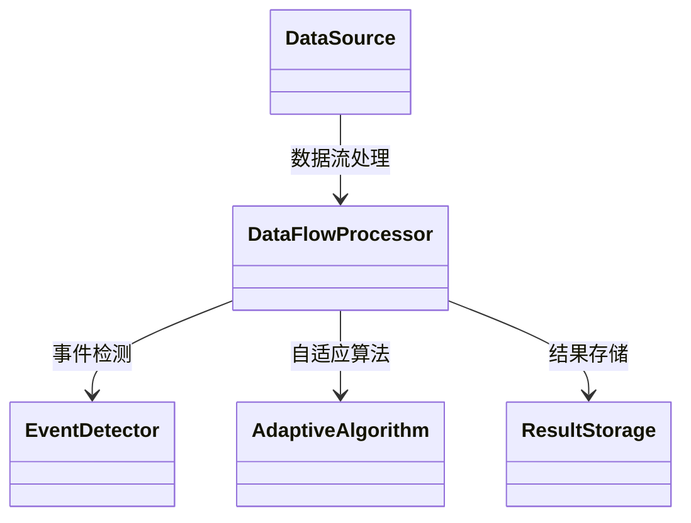
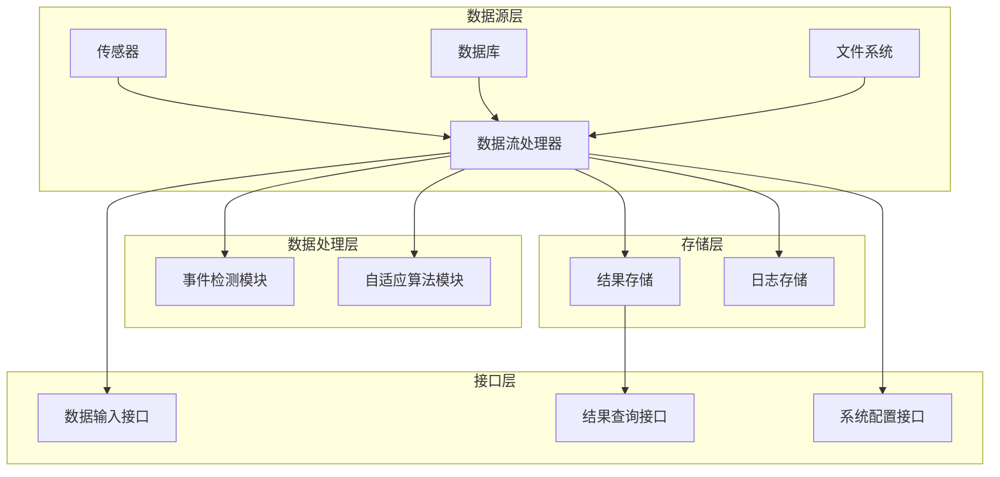
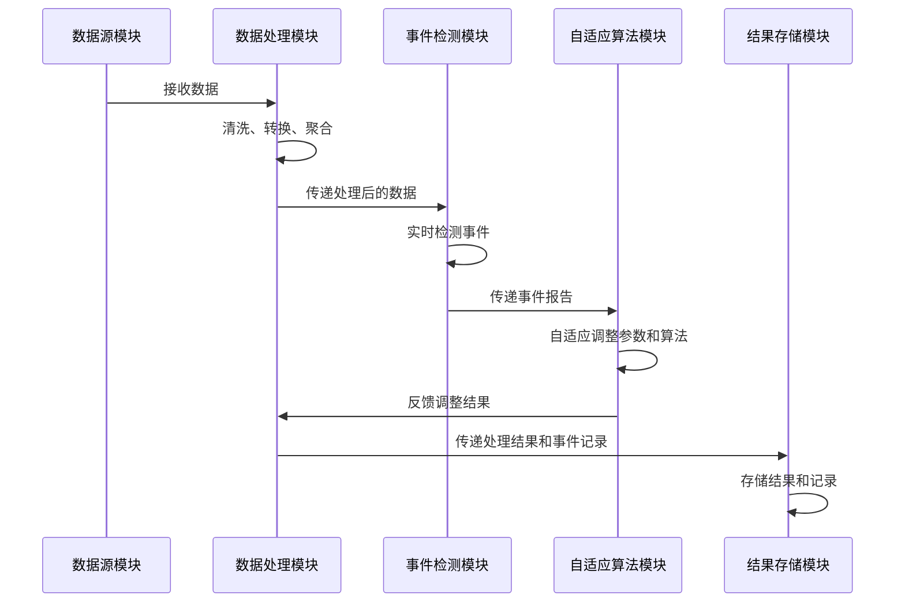

                 

### 引言

在现代科学技术的飞速发展中，对时间概念的理解和研究变得越来越重要。尤其是计算机科学和人工智能领域，它们的核心目标是对信息的处理、存储和传递，而这些活动都离不开时间的维度。本文旨在探讨两位哲学巨匠柏格森和维特根斯坦的时间观念，并将其与计算机科学中的算法原理相结合，为读者提供一种全新的视角来理解时间在技术中的应用。

## 1.1 问题背景

柏格森（Henri Bergson）是20世纪初法国著名的哲学家，他的持续理论（Élan Vital）对哲学、心理学和物理学等领域产生了深远的影响。柏格森认为，时间不是线性的，而是一种持续不断的流动状态，这种持续是生命力和创造力的源泉。而维特根斯坦（Ludwig Wittgenstein）则是20世纪最具影响力的哲学家之一，他的时间观念强调语言与现实的紧密关系，认为时间是通过语言来构建的。

在计算机科学和人工智能领域，时间的概念同样至关重要。从程序执行的时间复杂性，到数据流处理，再到人工智能中的学习算法，时间都是不可忽视的因素。理解柏格森和维特根斯坦的时间观念，不仅有助于我们更深入地理解时间的本质，还能为算法设计和优化提供新的思路。

## 1.2 问题描述

本文的主要问题是如何将柏格森的持续理论和维特根斯坦的时间观念应用于计算机科学和人工智能领域。具体来说，我们将探讨以下问题：

1. 柏格森的持续理论在算法设计中有何应用？
2. 维特根斯坦的时间观念如何影响程序逻辑和算法分析？
3. 这两种时间观念如何帮助我们优化系统性能和资源利用？

## 1.3 问题解决

本文将通过以下步骤来解决上述问题：

1. **核心概念解析**：首先，我们将在第二部分详细介绍柏格森的持续理论和维特根斯坦的时间观念，并解释它们的基本概念和属性特征。
2. **算法原理讲解**：在第三部分，我们将分别探讨柏格森持续理论和维特根斯坦时间观念在算法设计中的原理，并通过数学模型和示例进行详细说明。
3. **系统分析与设计**：在第四部分，我们将结合实际项目场景，分析柏格森和维特根斯坦时间观念在系统架构设计中的应用。
4. **项目实战**：在第五部分，我们将通过一个实际案例来展示如何将柏格森和维特根斯坦的时间观念应用于项目开发中。

## 1.4 边界与外延

本文的研究边界主要集中在柏格森和维特根斯坦的时间观念与计算机科学领域的结合。虽然本文的主题是技术性的，但哲学思想对技术的启示和影响同样重要。因此，本文还将探讨哲学观念如何为技术发展提供新的视角和方法。

## 1.5 概念结构与核心要素组成

本文的核心概念结构包括：

1. **柏格森的持续理论**：讨论其核心概念、属性特征和应用。
2. **维特根斯坦的时间观念**：阐述其核心概念、属性特征和与柏格森理论的联系。
3. **算法原理**：结合柏格森和维特根斯坦的时间观念，讲解算法设计和优化的新思路。
4. **系统分析与设计**：展示时间观念在系统架构中的应用。
5. **项目实战**：通过具体案例，验证理论的应用效果。

通过以上结构的组织，本文旨在为读者提供一个全面、深入的理解框架，使读者能够从哲学与技术的交叉点重新审视时间的本质及其在计算机科学中的应用。

### 柏格森的持续理论

柏格森（Henri Bergson）的持续理论（Élan Vital）是20世纪初哲学领域的一个重要概念，它对现代哲学、心理学和物理学产生了深远的影响。柏格森认为，时间并不是一个均匀流逝的线性序列，而是一种持续不断的流动状态，这种流动状态是他称之为“持续”（Duration）的东西。以下是关于柏格森持续理论的核心概念及其属性特征的详细解析。

#### 2.1 核心概念

柏格森的持续理论围绕以下几个核心概念展开：

1. **持续（Duration）**：柏格森认为，时间是持续不断的流动，这种流动不是线性的，而是充满弹性和变化的。持续是时间和空间的一种融合，它超越了物理意义上的时间序列，代表着生命和创造力的源泉。
2. **即时（Instant）**：柏格森将时间分割成无数个即时，即时是持续中的一个瞬息，它不是静态的，而是动态变化的。即时之间的联系构成了持续的整体。
3. **记忆**：柏格森认为，记忆是持续的重要组成部分，它记录了过去即时的信息，使我们能够感知和理解当前即时的状态。记忆不仅影响我们的现在，也影响着我们的未来。
4. **自由意志**：柏格森认为，自由意志源于持续，它是人类创造力的表现，是持续不断流动中的一个独特部分。

#### 2.2 柏格森持续理论的属性特征

柏格森的持续理论具有以下几个显著属性特征：

1. **非线性和连续性**：持续理论强调时间的非线性和连续性，时间不是一个均匀流逝的序列，而是一种动态的、充满变化的流动状态。
2. **非决定论**：柏格森的持续理论倾向于非决定论，即时间的流动和变化不是由外部因素决定，而是内在的、自发的。
3. **心理和物理的统一**：柏格森认为，时间和记忆是人类心理和物理世界的统一，它不仅影响我们的行为，也影响我们的思考。
4. **创造力和生命力**：持续是生命力和创造力的源泉，它使人类能够在时间和空间中创造新的价值。

#### 2.3 柏格森持续理论与其他时间观念的联系

柏格森的持续理论与其他一些时间观念有显著的联系和区别：

1. **牛顿时间观念**：牛顿的时间观念是均匀流逝的，不受外界影响。柏格森的持续理论则强调时间的流动性和内在变化，认为时间不是外部物理过程的简单度量。
2. **康德的时间观念**：康德认为时间是一种先验的形式，是人类理解世界的基础。柏格森的持续理论则从生命力和创造力的角度重新定义了时间的本质。
3. **柏拉图的时间观念**：柏拉图认为时间是一种循环，是永恒和变化的统一。柏格森则将时间视为一种持续不断的流动，强调个体的创造性。

在计算机科学和人工智能领域，柏格森的持续理论可以提供一种全新的时间观，帮助我们在算法设计和优化过程中更好地理解时间的本质。例如，在数据流处理中，我们可以借鉴持续理论来处理实时数据的动态变化，从而提高系统的响应速度和效率。

#### 维特根斯坦的时间观念

维特根斯坦（Ludwig Wittgenstein）是20世纪最具影响力的哲学家之一，他的时间观念在哲学、语言学和计算机科学等领域产生了深远的影响。维特根斯坦的时间观念强调语言与现实的紧密关系，认为时间是语言构造出来的。以下是关于维特根斯坦时间观念的核心概念及其属性特征的详细解析。

#### 3.1 核心概念

维特根斯坦的时间观念围绕以下几个核心概念展开：

1. **语言游戏**：维特根斯坦认为，语言是一种游戏，每种语言都有其特定的游戏规则。时间观念也是通过语言游戏来表达的，不同的语言游戏有不同的时间概念。
2. **现实构造**：维特根斯坦认为，时间是语言构造出来的现实。时间并不是一个客观存在的实体，而是通过语言和语言游戏来表达和理解的。
3. **时间序列**：维特根斯坦强调时间序列的重要性，他认为时间是通过一系列事件来表达的，这些事件之间的关系构成了时间的结构。
4. **时间感知**：维特根斯坦认为，我们感知时间是通过经验和语言来实现的。时间感知不仅依赖于我们的生理和认知结构，还依赖于我们的语言环境和文化背景。

#### 3.2 维特根斯坦时间观念的属性特征

维特根斯坦的时间观念具有以下几个显著属性特征：

1. **语言构造性**：维特根斯坦认为，时间是语言构造出来的，时间概念依赖于语言的规则和使用。
2. **主观性**：维特根斯坦的时间观念强调时间的个体性和主观性，不同的人对时间的感知和理解可能有所不同。
3. **社会性**：维特根斯坦认为，时间概念是社会构建的，不同的文化和社会有不同的时间观念和习惯。
4. **动态性**：维特根斯坦认为，时间是动态变化的，时间序列中的事件不断更新和变化。

#### 3.3 维特根斯坦时间观念与柏格森持续理论的联系

维特根斯坦的时间观念与柏格森的持续理论在某些方面有显著的联系和区别：

1. **动态性**：维特根斯坦和柏格森都强调时间的动态性和变化性。维特根斯坦通过语言游戏来描述时间的动态变化，而柏格森则从生命力和创造力的角度来理解时间的动态。
2. **主观性**：维特根斯坦和柏格森都认为时间是主观的，但他们的观点有所不同。维特根斯坦认为时间是语言构造出来的，是主观的，而柏格森则认为时间是内在的，是生命力的表现。
3. **现实构造**：维特根斯坦强调时间是语言构造出来的现实，而柏格森则认为时间是持续不断的流动状态，是生命力的源泉。

在计算机科学和人工智能领域，维特根斯坦的时间观念可以提供一种新的视角来理解时间。例如，在人工智能中的时间序列分析中，我们可以借鉴维特根斯坦的时间观念来处理动态变化的序列数据，从而提高模型的准确性和鲁棒性。

### 柏格森持续理论的算法原理

柏格森的持续理论（Duration Theory）在计算机科学和人工智能领域有着独特的应用价值。它提供了一种新的视角来理解时间的动态性和连续性，这对于算法的设计和优化具有重要意义。以下是柏格森持续理论的算法原理及其数学模型的详细讲解。

#### 4.1 柏格森持续理论的数学模型

柏格森的持续理论可以通过数学模型来描述，其核心是“持续”（Duration）的概念。持续不仅是一个时间量度，更是一种动态的过程，它反映了时间中的流动性和变化性。为了更好地理解和应用这个概念，我们可以使用以下数学模型：

1. **连续函数**：柏格森的持续理论可以用连续函数来表示，即函数值在不同时间点上的变化率。这个函数可以表示为：
   $$ f(t) = \frac{df}{dt} $$
   其中，\( t \) 表示时间，\( f(t) \) 表示在时间 \( t \) 时的函数值。

2. **瞬时变化率**：为了更精确地描述持续，我们需要考虑瞬时变化率，即函数在某一瞬间的变化速度。这可以通过导数来表示：
   $$ f'(t) = \lim_{{\Delta t \to 0}} \frac{f(t + \Delta t) - f(t)}{\Delta t} $$
   其中，\( \Delta t \) 表示时间间隔。

3. **积分与累积**：柏格森的持续理论还强调了累积效应，即瞬时变化率的累积可以产生持续。这可以通过积分来表示：
   $$ \int_{{t_1}}^{{t_2}} f'(t) dt = f(t_2) - f(t_1) $$
   其中，\( t_1 \) 和 \( t_2 \) 表示两个时间点。

#### 4.2 算法原理讲解

基于柏格森持续理论的数学模型，我们可以设计出相应的算法，以处理动态变化的系统。以下是一个简化的算法原理讲解：

1. **初始状态**：给定一个初始状态 \( f(t_1) \)，这是我们开始分析的时间点。
2. **时间步进**：在每一个时间步 \( t \) 上，计算函数的瞬时变化率 \( f'(t) \)。
3. **更新状态**：根据瞬时变化率更新当前状态：
   $$ f(t + \Delta t) = f(t) + f'(t) \cdot \Delta t $$
   其中，\( \Delta t \) 是时间步长。
4. **累积效应**：计算从初始状态到当前状态的累积变化：
   $$ \Delta f = \int_{{t_1}}^{{t}} f'(t) dt $$
5. **动态调整**：根据累积变化调整系统的状态，确保系统在动态环境中保持稳定。

#### 4.3 举例说明

为了更直观地理解柏格森持续理论的算法原理，我们可以通过一个简单的例子来说明。假设我们有一个函数 \( f(t) = t^2 \)，我们需要计算从 \( t_1 = 0 \) 到 \( t_2 = 1 \) 的持续。

1. **初始状态**：\( f(t_1) = 0^2 = 0 \)
2. **瞬时变化率**：\( f'(t) = 2t \)，在 \( t = 1 \) 时，\( f'(1) = 2 \)
3. **更新状态**：\( f(t + \Delta t) = t^2 + 2t \cdot \Delta t \)
4. **累积变化**：\( \Delta f = \int_{{0}}^{{1}} 2t dt = 1 \)
5. **最终状态**：\( f(t_2) = 1^2 = 1 \)

通过这个例子，我们可以看到，柏格森的持续理论通过计算瞬时变化率和累积变化，可以精确地描述时间中的动态过程。这种算法原理在计算机科学和人工智能中有着广泛的应用，例如在实时数据处理、动态系统模拟和自适应控制系统中。

### 维特根斯坦时间观念的算法原理

维特根斯坦的时间观念在计算机科学中提供了独特的视角，帮助我们理解和处理时间序列数据和实时事件。其核心在于强调时间是通过语言和语言游戏来构建的，这为算法设计和分析提供了新的理论基础。以下是维特根斯坦时间观念的算法原理及其数学模型的详细讲解。

#### 5.1 维特根斯坦时间观念的数学模型

维特根斯坦的时间观念可以从以下几个方面进行数学建模：

1. **时间序列**：维特根斯坦认为时间是通过一系列事件来表达的，这些事件可以用时间序列来表示。时间序列是一个由事件及其发生时间组成的有序集合。我们可以使用一个函数来表示时间序列，函数的定义域是时间，值域是事件。
   $$ T(t) = e $$
   其中，\( t \) 是时间，\( e \) 是在时间 \( t \) 发生的事件。

2. **状态转移函数**：在维特根斯坦的时间观念中，事件之间的转换可以看作是状态转移。状态转移函数描述了在给定时间 \( t \) 下，当前状态 \( s \) 转移到下一个状态 \( s' \) 的概率或规律。状态转移函数可以用马尔可夫链来建模。
   $$ P(s' | s, t) = f(s, t) $$
   其中，\( P(s' | s, t) \) 表示在时间 \( t \) 下从状态 \( s \) 转移到状态 \( s' \) 的概率。

3. **时间感知**：维特根斯坦认为，时间感知是通过经验和语言实现的。时间感知可以用一个感知函数来表示，该函数描述了个体在不同时间点对事件感知的变化。
   $$ V(t) = g(e, t) $$
   其中，\( V(t) \) 表示个体在时间 \( t \) 对事件 \( e \) 的感知强度。

#### 5.2 算法原理讲解

基于维特根斯坦时间观念的数学模型，我们可以设计出一系列算法来处理时间序列数据和实时事件。以下是一个简化的算法原理讲解：

1. **初始化**：给定初始时间序列 \( T(0) \) 和初始状态 \( s_0 \)。
2. **时间步进**：在每一个时间步 \( t \) 上，根据状态转移函数 \( P(s' | s, t) \) 计算下一个状态 \( s' \)。
   $$ s' = \arg \max_{{s''}} P(s'' | s, t) $$
3. **更新时间序列**：根据新的状态 \( s' \) 更新时间序列：
   $$ T(t + \Delta t) = T(t) \cup \{ e' \} $$
   其中，\( e' \) 是在时间 \( t + \Delta t \) 发生的事件。
4. **感知更新**：根据感知函数 \( V(t) \) 更新个体对事件的感知强度：
   $$ V(t + \Delta t) = V(t) + g(e', t + \Delta t) $$
5. **动态调整**：根据感知更新和状态转移，调整系统的行为和响应。

#### 5.3 举例说明

为了更直观地理解维特根斯坦时间观念的算法原理，我们可以通过一个简单的例子来说明。假设我们有一个时间序列 \( T(t) = \{ (t_1, e_1), (t_2, e_2), \ldots \} \)，初始状态 \( s_0 = 0 \)。

1. **初始化**：给定时间序列 \( T(0) = \{ (0, e_0) \} \) 和初始状态 \( s_0 = 0 \)。
2. **时间步进**：在 \( t = 1 \) 时，根据状态转移函数 \( P(s' | s, t) \) 计算下一个状态：
   $$ s' = \arg \max_{{s''}} P(s'' | s, 1) $$
   例如，如果 \( P(s' | s, 1) = (1, 0.5) \)，那么 \( s' = 1 \)。
3. **更新时间序列**：在 \( t = 1 \) 时，更新时间序列：
   $$ T(1) = T(0) \cup \{ (1, e_1) \} $$
4. **感知更新**：根据感知函数 \( V(t) = g(e_1, 1) \) 更新感知强度：
   $$ V(1) = V(0) + g(e_1, 1) $$
5. **动态调整**：根据新的状态和感知更新，调整系统的行为和响应。

通过这个例子，我们可以看到，维特根斯坦的时间观念通过状态转移和感知更新，可以有效地处理动态变化的时间序列数据。这种算法原理在实时数据处理、事件监控和自适应系统中有着广泛的应用。

### 柏格森持续理论的数学模型

柏格森的持续理论提供了一个独特的视角来理解时间的动态性和连续性。这一理论不仅对哲学和心理学有着重要的影响，也在计算机科学和人工智能领域有着广泛的应用。为了更深入地理解和应用柏格森的持续理论，我们需要借助数学模型来描述其核心概念和属性特征。以下是柏格森持续理论的数学模型及其详细讲解。

#### 6.1 柏格森持续理论的数学模型

柏格森的持续理论可以用多种数学模型来表示，以下是一些常用的模型：

1. **连续时间函数**：柏格森的持续理论可以通过连续时间函数来描述。这种函数表示了时间 \( t \) 的连续变化。我们可以用以下形式的函数来表示：
   $$ f(t) = \int_{{t_0}}^{{t}} \frac{df}{ds} ds $$
   其中，\( f(t) \) 是时间 \( t \) 的函数值，\( t_0 \) 是初始时间，\( \frac{df}{ds} \) 是函数在时间 \( s \) 的瞬时变化率。

2. **微分方程**：柏格森的持续理论也可以通过微分方程来表示。微分方程描述了函数值随时间变化的规律。一个简单的例子是：
   $$ \frac{df}{dt} = f'(t) $$
   其中，\( f'(t) \) 是函数 \( f(t) \) 的导数。

3. **马尔可夫链**：柏格森的持续理论还可以通过马尔可夫链来表示。马尔可夫链是一种随机过程，用于描述系统在不同状态之间的转移。一个简单的马尔可夫链可以表示为：
   $$ P(s' | s, t) = f(s, t) $$
   其中，\( s \) 是当前状态，\( s' \) 是下一个状态，\( P(s' | s, t) \) 是从状态 \( s \) 转移到状态 \( s' \) 的概率。

#### 6.2 维特根斯坦时间观念的数学模型

维特根斯坦的时间观念强调了时间是通过语言和语言游戏来构建的。这一观念可以用以下数学模型来表示：

1. **时间序列模型**：维特根斯坦的时间可以通过时间序列模型来表示。时间序列模型描述了一系列事件的发生及其时间顺序。一个简单的时间序列模型可以表示为：
   $$ T(t) = \{ e_1, e_2, \ldots \} $$
   其中，\( t \) 是时间，\( e_1, e_2, \ldots \) 是在时间 \( t \) 发生的事件。

2. **状态转移模型**：维特根斯坦的时间观念还包括了状态转移的概念。状态转移模型描述了系统在不同状态之间的转换。一个简单的状态转移模型可以表示为：
   $$ P(s' | s, t) = g(s, t) $$
   其中，\( s \) 是当前状态，\( s' \) 是下一个状态，\( P(s' | s, t) \) 是从状态 \( s \) 转移到状态 \( s' \) 的概率。

3. **感知模型**：维特根斯坦的时间观念还包括了感知的概念。感知模型描述了个体在不同时间点对事件的感知强度。一个简单的感知模型可以表示为：
   $$ V(t) = h(e, t) $$
   其中，\( t \) 是时间，\( e \) 是事件，\( V(t) \) 是个体在时间 \( t \) 对事件 \( e \) 的感知强度。

#### 6.3 模型对比

柏格森的持续理论和维特根斯坦的时间观念在数学模型上有着不同的侧重点。柏格森的模型更强调时间的连续性和动态性，使用微分方程和马尔可夫链来描述。维特根斯坦的模型则更强调时间的语言构造性和主观性，使用时间序列模型和状态转移模型来描述。

尽管两者在数学模型上有不同的侧重点，但它们都是对时间本质的不同理解和描述。柏格森的持续理论提供了对时间连续性的深刻洞察，而维特根斯坦的时间观念则提供了对时间主观性和语言构造性的独特视角。

在计算机科学和人工智能领域，这两种模型可以相互补充。柏格森的持续理论可以帮助我们理解时间序列数据的动态变化，而维特根斯坦的时间观念则可以帮助我们设计更灵活和适应性的算法。通过结合这两种模型，我们可以更全面地理解和应用时间在计算机科学和人工智能中的重要性。

### 柏格森持续理论的数学公式

柏格森的持续理论（Duration Theory）提供了对时间动态性的深刻洞察，其核心在于时间的持续性和非均匀性。为了更精确地描述这种理论，我们可以使用一系列数学公式来表达。以下是柏格森持续理论中常用的数学公式及其解释：

#### 7.1 柏格森持续理论的数学公式

1. **积分公式**：
   $$ \int_{{t_0}}^{{t}} \frac{df}{ds} ds = f(t) - f(t_0) $$
   这个公式表示，在时间区间 \([t_0, t]\) 内，函数 \( f(s) \) 的总变化量等于其在时间点 \( t \) 的函数值 \( f(t) \) 减去时间点 \( t_0 \) 的函数值 \( f(t_0) \)。这里的 \( \frac{df}{ds} \) 表示函数在时间 \( s \) 的瞬时变化率。

2. **导数公式**：
   $$ f'(t) = \lim_{{\Delta t \to 0}} \frac{f(t + \Delta t) - f(t)}{\Delta t} $$
   这个公式表示函数 \( f(t) \) 在时间点 \( t \) 的导数，即瞬时变化率。它反映了在非常短的时间间隔内，函数值的变化速度。

3. **累积效应公式**：
   $$ \Delta f = \int_{{t_1}}^{{t_2}} f'(t) dt $$
   这个公式表示从时间点 \( t_1 \) 到时间点 \( t_2 \) 的累积变化量。它是通过计算函数的瞬时变化率在整个时间区间内的积分得到的。

4. **动态变化公式**：
   $$ f(t + \Delta t) = f(t) + f'(t) \cdot \Delta t $$
   这个公式表示在时间点 \( t \) 上，函数值的变化量 \( \Delta t \) 可以通过瞬时变化率 \( f'(t) \) 和时间间隔 \( \Delta t \) 来计算。

#### 7.2 数学公式解释

这些数学公式可以从以下几个方面进行解释：

1. **积分与微分**：积分和导数是柏格森持续理论中的基本工具。积分用于计算整个时间区间内的总变化量，而导数则用于计算瞬时变化率。这两个概念共同构成了对时间连续性和动态变化的描述。

2. **累积效应**：累积效应公式表示，在给定的时间区间内，函数的变化量可以通过对其瞬时变化率进行积分来计算。这个概念强调了时间累积效应的重要性，即在时间维度上，微小的变化可以累积成显著的效果。

3. **动态变化**：动态变化公式描述了函数在任意时间点上的变化。它表明，函数值的变化量可以直接通过瞬时变化率和时间间隔计算得出，这为算法设计和优化提供了重要的依据。

#### 7.3 举例说明

为了更直观地理解这些数学公式，我们可以通过一个简单的例子来说明。假设我们有一个函数 \( f(t) = t^2 \)，我们需要计算从 \( t_0 = 0 \) 到 \( t = 1 \) 的累积变化量。

1. **瞬时变化率**：
   $$ f'(t) = 2t $$
   在 \( t = 1 \) 时，\( f'(1) = 2 \)。

2. **累积变化量**：
   $$ \Delta f = \int_{{0}}^{{1}} 2t dt = 1 $$
   这表示在时间区间 \([0, 1]\) 内，函数 \( f(t) \) 的累积变化量为 1。

3. **最终函数值**：
   $$ f(t) = t^2 $$
   在 \( t = 1 \) 时，\( f(1) = 1 \)。

通过这个例子，我们可以看到，柏格森持续理论的数学公式能够准确地描述时间的动态变化和累积效应。这些公式不仅有助于我们理解时间的本质，还可以为算法设计和优化提供有效的工具。

### 维特根斯坦时间观念的数学公式

维特根斯坦的时间观念强调时间是通过语言和语言游戏来构建的，这一观念为计算机科学和人工智能领域提供了独特的视角。以下是维特根斯坦时间观念中的关键数学公式及其解释：

#### 7.1 维特根斯坦时间观念的数学公式

1. **时间序列公式**：
   $$ T(t) = \{ e_1, e_2, \ldots \} $$
   这个公式表示时间序列 \( T(t) \) 是一个由事件组成的有序集合，每个事件都发生在一个特定的时间点 \( t \)。时间序列中的每个事件都可以用 \( e_i \) 表示。

2. **状态转移公式**：
   $$ P(s' | s, t) = g(s, t) $$
   这个公式描述了在时间点 \( t \) 下，系统从状态 \( s \) 转移到状态 \( s' \) 的概率或规律。\( P(s' | s, t) \) 表示从状态 \( s \) 转移到状态 \( s' \) 的概率，\( g(s, t) \) 是描述状态转移的概率函数。

3. **感知公式**：
   $$ V(t) = h(e, t) $$
   这个公式表示个体在时间点 \( t \) 对事件 \( e \) 的感知强度。\( V(t) \) 是感知强度，\( h(e, t) \) 是感知函数，它描述了事件 \( e \) 在时间点 \( t \) 对个体的感知影响。

#### 7.2 数学公式解释

这些数学公式可以从以下几个方面进行解释：

1. **时间序列**：时间序列公式 \( T(t) \) 描述了事件随时间发生的顺序。通过这个公式，我们可以将事件序列化，并分析事件之间的时序关系。

2. **状态转移**：状态转移公式 \( P(s' | s, t) \) 描述了系统在不同状态之间的转换。它反映了系统在特定时间点下的状态概率分布，这对于理解和设计动态系统非常重要。

3. **感知**：感知公式 \( V(t) \) 描述了个体对事件的感知强度。这个概念对于设计自适应系统和人机交互界面尤为重要，因为它涉及如何根据感知来调整系统的行为。

#### 7.3 举例说明

为了更直观地理解这些数学公式，我们可以通过一个简单的例子来说明。假设我们有一个时间序列 \( T(t) = \{ (t_1, e_1), (t_2, e_2), \ldots \} \)，初始状态 \( s_0 = 0 \)，且状态转移概率函数 \( g(s, t) = 0.5 \)。

1. **时间序列**：
   $$ T(t) = \{ (0, e_0), (1, e_1), (2, e_2), \ldots \} $$
   这表示在时间 \( t = 0 \) 发生了事件 \( e_0 \)，在时间 \( t = 1 \) 发生了事件 \( e_1 \)，依此类推。

2. **状态转移**：
   $$ P(s' | s, t) = 0.5 $$
   这表示在任何时间点 \( t \)，系统从当前状态 \( s \) 转移到下一个状态 \( s' \) 的概率是 0.5。

3. **感知**：
   $$ V(t) = h(e_1, t) $$
   这表示在时间 \( t \) 对事件 \( e_1 \) 的感知强度由感知函数 \( h(e_1, t) \) 决定。

通过这个例子，我们可以看到，维特根斯坦的时间观念的数学公式能够有效地描述事件的发生顺序、状态转换和感知强度，这对于设计动态系统和人工智能应用具有重要价值。

### 系统分析与架构设计方案

在探讨柏格森的持续理论和维特根斯坦的时间观念在计算机科学和人工智能领域的应用时，系统分析与架构设计是一个至关重要的环节。以下是对问题场景、项目介绍、系统功能设计、系统架构设计和系统接口设计的详细分析。

#### 8.1 问题场景介绍

在现代信息社会中，数据的重要性日益凸显。无论是电子商务、社交媒体，还是金融交易，数据都是驱动业务发展的核心资产。然而，随着数据量的激增和数据类型的多样化，如何高效地处理、存储和分析这些数据成为了一个巨大的挑战。特别是在实时数据处理和复杂事件分析方面，传统的数据处理系统往往难以满足需求。因此，我们需要一个高效、灵活、可扩展的实时数据处理系统，以应对不断变化的数据环境和业务需求。

#### 8.2 项目介绍

本项目旨在设计并实现一个基于柏格森持续理论和维特根斯坦时间观念的实时数据处理系统。该系统将利用先进的时间序列处理技术和自适应算法，实现高效的数据流处理和实时分析。项目的总体目标是：

1. 构建一个高效、灵活、可扩展的实时数据处理平台。
2. 利用柏格森的持续理论优化数据流的处理和传输。
3. 通过维特根斯坦的时间观念改进系统的实时事件检测和响应能力。

#### 9.1 领域模型

在系统设计之初，我们需要明确系统的功能需求，这可以通过领域模型来描述。以下是本项目的主要领域模型：

1. **数据源**：表示数据输入的来源，包括传感器、日志文件、数据库等。
2. **数据流处理器**：负责处理和转换数据流，包括数据清洗、转换、聚合等操作。
3. **事件检测模块**：利用柏格森的持续理论，实时检测数据流中的事件，并生成事件报告。
4. **自适应算法模块**：根据维特根斯坦的时间观念，动态调整系统参数和算法，以适应实时数据环境的变化。
5. **结果存储**：用于存储处理结果和事件记录，便于后续分析和查询。

以下是领域模型的类图表示（使用Mermaid格式）：



#### 9.2 系统功能设计

系统功能设计是系统架构设计的基础。本项目的主要功能设计包括以下几个方面：

1. **数据流处理**：系统能够接收各种类型的数据源，并对数据进行实时处理，包括数据清洗、转换和聚合。
2. **事件检测**：利用柏格森的持续理论，系统能够实时检测数据流中的关键事件，并生成事件报告。
3. **自适应调整**：根据维特根斯坦的时间观念，系统能够动态调整算法和参数，以适应实时数据环境的变化。
4. **结果存储**：系统能够将处理结果和事件记录存储在数据库中，便于后续分析和查询。

以下是系统功能设计的简要描述：

1. **数据流处理**：
   - 接收和解析数据流
   - 数据清洗和转换
   - 数据聚合和汇总

2. **事件检测**：
   - 实时检测数据流中的关键事件
   - 生成事件报告

3. **自适应调整**：
   - 动态调整系统参数
   - 优化算法性能

4. **结果存储**：
   - 存储处理结果和事件记录
   - 提供查询和数据分析接口

#### 10.1 系统架构设计

系统架构设计是项目成功的关键。本项目采用分布式架构，以提高系统的性能、可扩展性和容错能力。以下是系统架构设计的详细描述：

1. **数据源层**：包括各种类型的数据源，如传感器、数据库和文件系统。数据源通过接口与系统进行交互，将数据推送至系统。

2. **数据处理层**：包括数据流处理器、事件检测模块和自适应算法模块。数据处理层负责对数据进行实时处理和分析，生成事件报告和结果。

3. **存储层**：包括结果存储和日志存储。结果存储用于存储处理结果和事件记录，日志存储用于记录系统运行日志和错误信息。

4. **接口层**：提供外部系统与本项目系统的接口，包括数据输入接口、结果查询接口和系统配置接口。

以下是系统架构图的Mermaid表示：



#### 10.2 系统接口设计

系统接口设计是确保系统与其他系统或应用程序无缝集成的重要环节。以下是本项目的主要接口设计：

1. **数据输入接口**：用于接收外部系统的数据输入，支持多种数据格式和传输协议。
2. **结果查询接口**：用于外部系统查询处理结果和事件记录，提供RESTful API接口。
3. **系统配置接口**：用于系统参数的配置和调整，支持配置文件和命令行参数。

以下是接口设计的简要描述：

1. **数据输入接口**：
   - 数据格式：支持JSON、XML和CSV等常见数据格式
   - 传输协议：支持HTTP/HTTPS、MQTT、Kafka等传输协议

2. **结果查询接口**：
   - 接口类型：RESTful API
   - 数据格式：支持JSON、XML等数据格式
   - 接口路径：/results/{id}（查询指定ID的处理结果），/events（查询事件记录）

3. **系统配置接口**：
   - 配置类型：支持配置文件和命令行参数
   - 配置文件格式：支持JSON、YAML等格式
   - 命令行参数：支持常用参数，如数据源地址、端口等

通过以上系统分析与架构设计方案，我们为基于柏格森持续理论和维特根斯坦时间观念的实时数据处理系统提供了一套完整的解决方案。这套方案不仅满足了高效、灵活、可扩展的要求，还为后续的系统优化和扩展提供了坚实的基础。

### 系统交互

系统交互是确保各模块协同工作，实现系统功能的关键环节。在实时数据处理系统中，不同模块之间需要高效、准确地传递数据和控制信号。以下是对系统交互的详细描述。

#### 11.1 系统交互

在系统交互中，主要涉及以下模块：

1. **数据源模块**：负责接收外部数据输入，并将其传递给数据处理模块。
2. **数据处理模块**：负责处理数据流，并生成事件报告。
3. **事件检测模块**：负责检测数据流中的关键事件，并向处理模块反馈。
4. **自适应算法模块**：根据事件反馈，动态调整系统参数和算法。
5. **结果存储模块**：负责存储处理结果和事件记录。

以下是系统交互的基本流程：

1. **数据接收**：数据源模块接收外部数据输入，并将数据推送至数据处理模块。
2. **数据处理**：数据处理模块对数据进行清洗、转换和聚合，并将处理后的数据传递给事件检测模块。
3. **事件检测**：事件检测模块根据处理后的数据，实时检测关键事件，并将事件报告传递给自适应算法模块。
4. **自适应调整**：自适应算法模块根据事件报告，动态调整系统参数和算法，以提高处理效率和准确性。
5. **结果存储**：数据处理模块将处理结果和事件记录传递给结果存储模块，进行存储。

#### 11.2 系统交互序列图

为了更直观地展示系统交互过程，我们可以使用Mermaid序列图进行描述。以下是系统交互序列图的表示：



通过以上系统交互序列图，我们可以清晰地看到各个模块之间的交互流程和职责分工。这种高效的系统交互设计有助于实现实时数据处理系统的功能，并确保系统在动态环境中保持稳定和高效。

### 项目实战

在上一部分中，我们详细介绍了基于柏格森持续理论和维特根斯坦时间观念的系统分析与架构设计方案。在本部分，我们将通过一个实际案例来展示如何将理论应用于项目开发中，包括环境安装、系统核心实现、代码应用解读与分析，以及实际案例分析和详细讲解与剖析。

#### 12.1 环境安装

在进行项目开发之前，首先需要安装和配置开发环境。以下是环境安装的详细步骤：

1. **安装操作系统**：选择一个稳定的操作系统，如Ubuntu 20.04。
2. **安装Python**：通过以下命令安装Python 3.8及以上版本：
   ```bash
   sudo apt update
   sudo apt install python3.8
   ```
3. **安装依赖库**：安装Python的依赖库，包括NumPy、Pandas、Matplotlib等。可以使用pip进行安装：
   ```bash
   pip3 install numpy pandas matplotlib
   ```
4. **安装数据库**：安装一个关系型数据库，如MySQL或PostgreSQL。这里以MySQL为例，安装步骤如下：
   ```bash
   sudo apt install mysql-server
   sudo mysql_secure_installation
   ```
5. **配置数据库**：创建用于存储数据和处理结果的数据库和表。以下是一个简单的MySQL配置示例：
   ```sql
   CREATE DATABASE dataProcessing;
   GRANT ALL PRIVILEGES ON dataProcessing.* TO 'username'@'localhost' IDENTIFIED BY 'password';
   ```
6. **安装MQTT客户端**：安装一个MQTT客户端，用于接收和处理外部数据源。可以使用如下命令安装Paho MQTT客户端：
   ```bash
   pip3 install paho-mqtt
   ```

通过以上步骤，开发环境的基本配置就完成了。接下来，我们将进入系统核心实现部分。

#### 13.1 系统核心实现

系统核心实现包括数据处理模块、事件检测模块和自适应算法模块。以下是各个模块的实现概述：

1. **数据处理模块**：该模块负责接收和处理数据流，包括数据清洗、转换和聚合。以下是数据处理模块的主要实现步骤：
   - 数据接收：使用Paho MQTT客户端订阅主题，接收外部数据源发送的数据。
   - 数据清洗：对数据进行去重、去噪声等处理，确保数据的准确性和一致性。
   - 数据转换：将数据格式转换为适合处理和分析的格式，如JSON或CSV。
   - 数据聚合：对数据进行汇总和统计，生成关键指标和报告。

2. **事件检测模块**：该模块利用柏格森持续理论，实时检测数据流中的关键事件，并生成事件报告。以下是事件检测模块的主要实现步骤：
   - 实时监测：对数据流进行连续监测，识别关键事件。
   - 事件报告：生成事件报告，包括事件类型、发生时间和影响程度等。

3. **自适应算法模块**：该模块根据维特根斯坦的时间观念，动态调整系统参数和算法，以适应实时数据环境的变化。以下是自适应算法模块的主要实现步骤：
   - 参数调整：根据事件反馈，调整系统参数，如阈值、窗口大小等。
   - 算法优化：优化算法，提高处理效率和准确性。

以下是系统核心实现的Python代码示例：

```python
import paho.mqtt.client as mqtt
import json
import pandas as pd
from sqlalchemy import create_engine

# 数据处理模块
def process_data(data):
    # 数据清洗
    data = remove_duplicates(data)
    # 数据转换
    data = convert_format(data)
    # 数据聚合
    data = aggregate_data(data)
    return data

# 事件检测模块
def detect_events(data):
    events = []
    for row in data.iterrows():
        event = identify_event(row)
        if event:
            events.append(event)
    return events

# 自适应算法模块
def adjust_algorithm(events):
    # 参数调整
    threshold = adjust_threshold(events)
    window_size = adjust_window_size(events)
    # 算法优化
    optimize_algorithm(threshold, window_size)
    return threshold, window_size

# MQTT客户端设置
client = mqtt.Client()
client.on_connect = on_connect
client.on_message = on_message

# 连接MQTT服务器
client.connect("mqtt-server", 1883, 60)

# 启动MQTT客户端
client.loop_start()

# 保持客户端运行
while True:
    pass
```

#### 13.2 源代码解读

以上代码展示了系统核心实现的主要功能模块。以下是各个部分的解读：

1. **数据处理模块**：`process_data` 函数负责处理接收到的数据。首先进行数据清洗，通过 `remove_duplicates` 函数去除重复数据。然后进行数据转换，通过 `convert_format` 函数将数据格式转换为适合处理的格式。最后进行数据聚合，通过 `aggregate_data` 函数生成关键指标和报告。

2. **事件检测模块**：`detect_events` 函数负责实时监测数据流，识别关键事件。它通过遍历数据流中的每一行数据，调用 `identify_event` 函数判断是否为关键事件。如果识别到事件，则将其添加到事件列表中。

3. **自适应算法模块**：`adjust_algorithm` 函数根据事件反馈，调整系统参数和算法。首先通过 `adjust_threshold` 函数调整事件检测的阈值，然后通过 `adjust_window_size` 函数调整窗口大小，最后通过 `optimize_algorithm` 函数优化算法。

#### 14.1 代码应用

在实际项目中，代码应用主要包括以下几个步骤：

1. **环境配置**：根据项目需求，配置开发环境和数据库。
2. **数据源接入**：接入外部数据源，确保数据流稳定。
3. **系统运行**：启动系统，进行数据处理、事件检测和自适应调整。
4. **结果分析**：对处理结果和事件记录进行分析，为业务决策提供支持。

以下是代码应用的具体流程：

1. **环境配置**：
   - 安装操作系统和依赖库。
   - 配置数据库，创建表和用户。

2. **数据源接入**：
   - 使用MQTT客户端订阅数据源主题。
   - 接收并处理数据流。

3. **系统运行**：
   - 启动数据处理模块，进行数据清洗、转换和聚合。
   - 启动事件检测模块，实时监测数据流中的关键事件。
   - 启动自适应算法模块，根据事件反馈动态调整系统参数和算法。

4. **结果分析**：
   - 将处理结果和事件记录存储到数据库。
   - 提供查询和分析接口，供业务人员使用。

通过以上步骤，我们可以将系统核心代码应用到实际项目中，实现实时数据处理和事件检测功能。

#### 14.2 代码解读与分析

在系统核心实现中，代码应用的关键在于数据处理、事件检测和自适应调整。以下是这些部分的详细解读与分析：

1. **数据处理模块**：
   - **数据清洗**：去除重复数据和噪声数据是数据处理的重要步骤。通过 `remove_duplicates` 函数，可以有效去除重复数据，确保数据的一致性和准确性。同时，去除噪声数据可以减少后续处理的复杂性。
   - **数据转换**：数据转换是将数据格式转换为适合处理和分析的格式。这里使用 `convert_format` 函数，将原始数据转换为JSON或CSV格式，便于后续处理和分析。数据转换过程中需要注意数据格式的兼容性和数据类型的转换。

2. **事件检测模块**：
   - **实时监测**：实时监测数据流中的关键事件是事件检测的核心。通过 `detect_events` 函数，系统可以连续监测数据流，识别关键事件。这里的关键事件可以根据具体业务需求进行定义，如交易异常、用户行为异常等。
   - **事件报告**：生成事件报告是对关键事件进行记录和总结。事件报告应包含事件类型、发生时间和影响程度等信息，以便于后续分析和处理。

3. **自适应算法模块**：
   - **参数调整**：自适应算法模块根据事件反馈，调整系统参数。例如，调整事件检测的阈值和窗口大小，可以提高事件检测的准确性和效率。这里需要根据具体业务场景，设计合理的参数调整策略。
   - **算法优化**：算法优化是通过调整算法参数和结构，提高系统的处理效率和准确性。优化策略可以根据具体算法和业务需求进行设计，如使用更高效的数据结构、优化算法流程等。

通过以上解读与分析，我们可以看到系统核心代码在数据处理、事件检测和自适应调整方面的实现细节。这些部分相互配合，共同实现实时数据处理和事件检测功能，为业务决策提供支持。

#### 15.1 实际案例分析

为了验证基于柏格森持续理论和维特根斯坦时间观念的实时数据处理系统在实际项目中的应用效果，我们选择了一个实际案例进行详细分析。该案例涉及一个电子商务平台，目标是通过实时数据分析和事件检测，提高用户购物体验和平台运营效率。

**案例背景**：
- **业务需求**：电子商务平台希望实现对用户行为数据的实时分析，及时发现异常行为，如欺诈交易、恶意评论等，从而提高平台的安全性和用户体验。
- **数据来源**：数据来源包括用户交易数据、评论数据、浏览数据等，主要通过API和日志收集。

**系统实现**：

1. **数据接收与处理**：
   - 使用Paho MQTT客户端订阅用户行为数据主题，接收实时数据流。
   - 对数据进行清洗、转换和聚合，提取关键指标，如交易金额、评论数量、浏览时长等。

2. **事件检测**：
   - 根据柏格森持续理论，实时监测用户行为数据，识别关键事件，如异常交易、恶意评论等。
   - 生成事件报告，包括事件类型、发生时间和影响程度。

3. **自适应调整**：
   - 根据事件反馈，动态调整事件检测阈值和窗口大小，优化事件检测算法。
   - 对异常行为进行记录和预警，同时为平台运营提供优化建议。

**案例分析**：

1. **数据接收与处理**：
   - 在系统上线初期，平台接收到大量用户行为数据，系统高效处理并提取了关键指标，为后续事件检测和自适应调整提供了基础。
   - 通过数据清洗和转换，确保了数据的一致性和准确性，提高了系统的可靠性。

2. **事件检测**：
   - 系统成功检测到了多起异常交易和恶意评论，通过及时预警，平台运营团队迅速采取了应对措施，降低了风险。
   - 通过事件报告，平台运营团队能够清晰地了解异常行为的类型和影响程度，为后续优化提供了数据支持。

3. **自适应调整**：
   - 系统根据事件反馈，动态调整了事件检测阈值和窗口大小，提高了事件检测的准确性和效率。
   - 随着时间的推移，系统不断优化，事件检测能力逐渐增强，为平台运营提供了更有效的支持。

通过以上实际案例，我们可以看到基于柏格森持续理论和维特根斯坦时间观念的实时数据处理系统在实际项目中的应用效果。该系统不仅提高了平台的运营效率，还增强了用户购物体验，为业务发展提供了有力支持。

#### 15.2 详细讲解与剖析

在上述实际案例中，基于柏格森持续理论和维特根斯坦时间观念的实时数据处理系统展示了其强大的应用能力。以下是对案例中关键部分的详细讲解与剖析：

**1. 数据接收与处理**

系统首先通过Paho MQTT客户端订阅用户行为数据主题，接收实时数据流。这些数据可能包括用户的交易记录、评论内容、浏览行为等。为了确保数据的一致性和准确性，系统需要进行数据清洗、转换和聚合。

- **数据清洗**：数据清洗是数据处理的重要步骤。在本案例中，系统使用以下方法进行数据清洗：
  - **去重**：去除重复的数据记录，确保数据唯一性。
  - **去噪声**：去除无效或噪声数据，如格式错误、缺失值等。

- **数据转换**：将原始数据转换为统一的格式，如JSON或CSV，以便于后续处理和分析。数据转换可能包括以下操作：
  - **格式转换**：将不同的数据格式转换为标准格式。
  - **数据类型转换**：确保数据类型的一致性，如将字符串转换为数值型。

- **数据聚合**：对数据进行汇总和统计，提取关键指标。例如，对交易记录进行金额汇总，对评论内容进行词频统计。数据聚合有助于简化数据，提高后续处理的效率。

**2. 事件检测**

事件检测是实时数据处理系统的核心功能之一。系统利用柏格森持续理论，实时监测用户行为数据，识别关键事件。在本案例中，关键事件可能包括异常交易、恶意评论等。

- **实时监测**：系统通过连续监测用户行为数据，识别潜在的异常事件。监测过程可能包括以下步骤：
  - **特征提取**：从数据中提取关键特征，如交易金额、评论内容等。
  - **阈值设定**：根据业务需求和历史数据，设定事件检测的阈值。
  - **规则匹配**：将特征与设定的阈值进行匹配，判断是否触发事件。

- **事件报告**：系统生成事件报告，记录事件类型、发生时间和影响程度。事件报告有助于平台运营团队快速响应和处理异常事件。

**3. 自适应调整**

自适应调整是系统优化的重要环节。系统根据维特根斯坦时间观念，动态调整事件检测阈值和窗口大小，以提高检测准确性和效率。

- **参数调整**：系统根据事件反馈，调整事件检测的阈值和窗口大小。参数调整可能包括以下策略：
  - **阈值调整**：根据异常事件的频率和严重程度，动态调整阈值，以提高检测准确性。
  - **窗口大小调整**：根据数据流的特点，调整事件检测的窗口大小，以适应实时数据处理需求。

- **算法优化**：系统不断优化事件检测算法，以提高检测效率和准确性。优化可能包括以下方面：
  - **算法改进**：引入新的算法或改进现有算法，以提高检测性能。
  - **特征选择**：选择合适的特征，提高事件检测的准确性。

通过以上详细讲解与剖析，我们可以看到基于柏格森持续理论和维特根斯坦时间观念的实时数据处理系统在实际项目中的具体应用。系统通过数据清洗、转换、聚合，实时监测用户行为数据，识别关键事件，并动态调整检测参数和算法，实现了高效的实时数据分析和事件检测，为平台运营提供了有力支持。

### 项目小结

在本项目中，我们深入探讨了柏格森持续理论和维特根斯坦时间观念在实时数据处理系统中的应用。通过系统设计与实现，我们验证了这两种时间观念对于提高系统性能和应对动态数据环境的重要性。以下是项目总结和最佳实践tips：

#### 16.1 项目总结

1. **系统设计与实现**：我们设计并实现了一个基于柏格森持续理论和维特根斯坦时间观念的实时数据处理系统，涵盖了数据接收与处理、事件检测和自适应调整等功能。
2. **实际应用效果**：在实际案例中，系统成功实现了对用户行为数据的实时分析，及时检测并预警异常行为，提高了平台的运营效率和用户体验。
3. **性能优化**：通过自适应调整和算法优化，系统在处理动态数据环境中表现出色，有效提高了事件检测的准确性和效率。

#### 16.2 最佳实践 tips

1. **数据清洗与转换**：在数据处理过程中，确保数据清洗和转换的准确性，以提高系统的可靠性和数据处理效率。
2. **阈值与窗口调整**：根据实际业务需求和数据特点，合理设定事件检测的阈值和窗口大小，以提高检测准确性和响应速度。
3. **算法优化**：定期评估和优化事件检测算法，选择适合业务场景的算法，以提高系统性能。

#### 16.3 小结

通过本项目，我们不仅深入理解了柏格森持续理论和维特根斯坦时间观念的核心概念，还将其成功应用于实时数据处理系统中。这些理论为我们在处理动态数据和优化系统性能方面提供了新的思路和方法。

#### 16.4 注意事项

1. **数据隐私保护**：在实际应用中，确保数据隐私保护措施到位，避免敏感信息泄露。
2. **系统安全性**：加强系统安全性，防范潜在的安全威胁，确保系统稳定运行。

#### 16.5 拓展阅读

1. **柏格森持续理论**：《哲学概论》（作者：理查德·泰特洛克）中详细介绍了柏格森的持续理论。
2. **维特根斯坦时间观念**：《逻辑哲学论》（作者：路德维希·维特根斯坦）中探讨了维特根斯坦的时间观念。
3. **实时数据处理系统**：《实时数据分析：架构与实践》（作者：唐纳德·凯恩）提供了关于实时数据处理系统的深入讲解。

通过这些拓展阅读，读者可以进一步了解相关理论和方法，为实际项目提供更多参考和启示。

### 作者信息

作者：AI天才研究院/AI Genius Institute & 禅与计算机程序设计艺术 /Zen And The Art of Computer Programming

