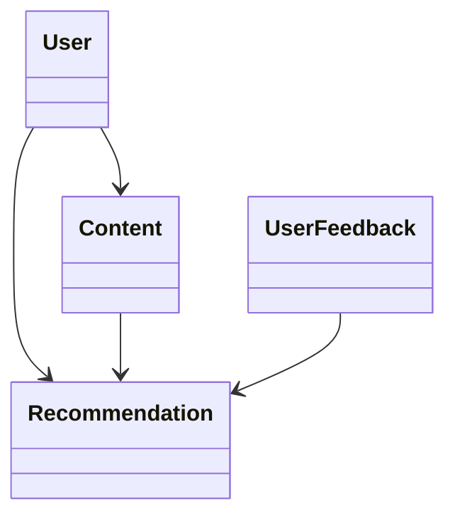
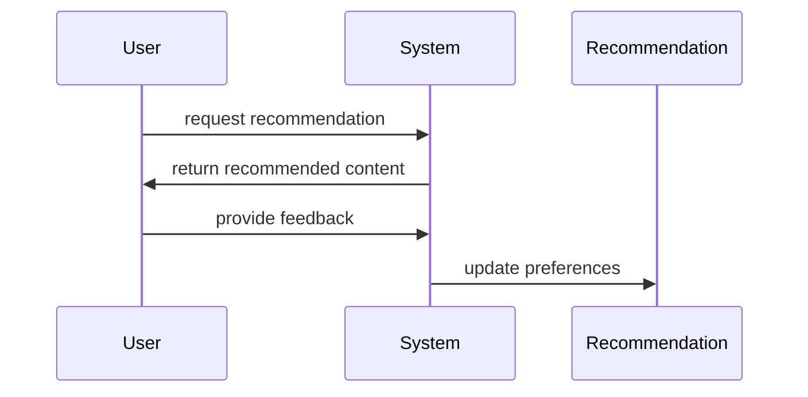
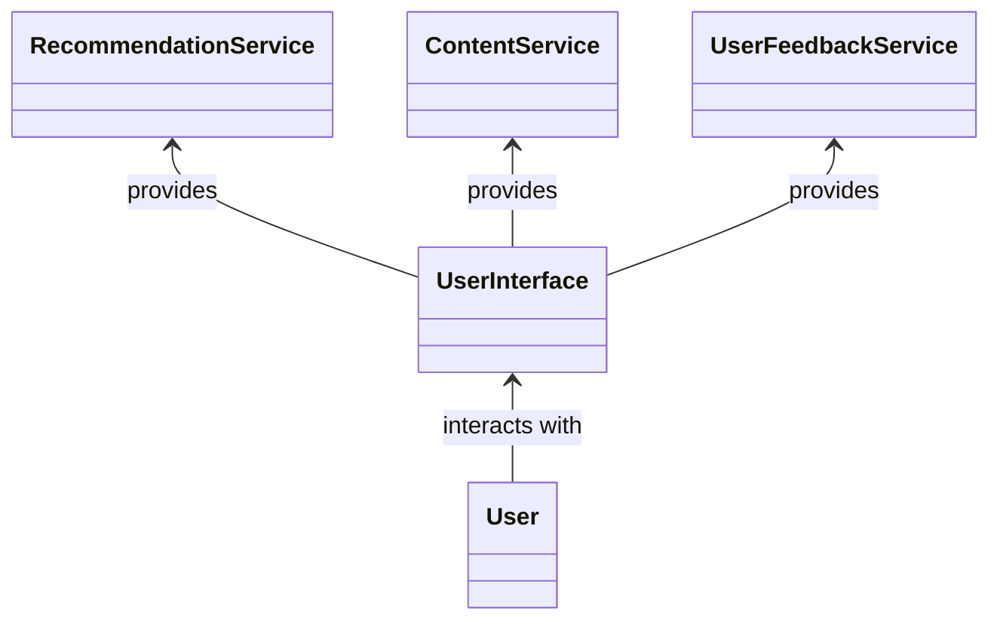
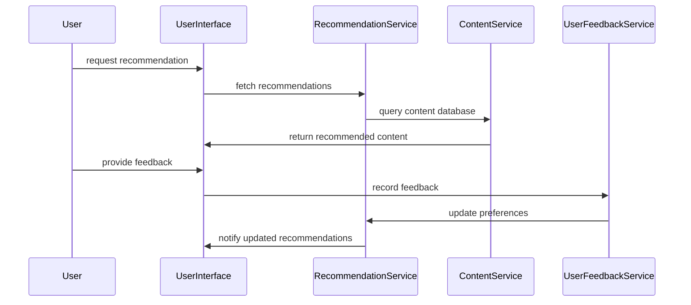

                 

### 柏格森的生命冲力与维特根斯坦的家族相似性概念

在探讨柏格森的生命冲力与维特根斯坦的家族相似性概念时，我们首先需要理解这两个核心思想的背景和提出背景。柏格森（Henri Bergson）是20世纪初法国著名的哲学家，他的“生命冲力”（élan vital）概念旨在解释生命现象的本质。生命冲力是指一种驱动生命体不断向前发展的内在力量，它超越了机械论和物理学的解释范围，体现了生命的独特性和动态性。

另一方面，维特根斯坦（Ludwig Wittgenstein）是20世纪初奥地利哲学家，以其在语言哲学和逻辑哲学中的贡献而闻名。他的“家族相似性”（family resemblance）概念则是用来描述语言、艺术和其他文化现象之间复杂而多层次的关系。家族相似性强调了不同元素之间的相似性和共性，而不是简单的对等性或分类标准。

这两个概念尽管源于不同的哲学流派，却在某些方面有着奇妙的交集。本文旨在通过逐步分析这两种思想的本质，探讨它们在哲学和科学领域的应用，以及二者之间的相互影响。通过深入理解柏格森的生命冲力和维特根斯坦的家族相似性概念，我们可以更好地把握生命的动态本质和语言的多样性与复杂性。

### 文章关键词

1. 柏格森
2. 生命冲力
3. 维特根斯坦
4. 家族相似性
5. 哲学思想
6. 科学应用
7. 语言哲学

### 摘要

本文旨在探讨柏格森的生命冲力与维特根斯坦的家族相似性概念，这两者虽然源于不同的哲学流派，但在解释复杂系统中的动态性和相似性方面具有深刻的思想内涵。首先，本文将介绍柏格森的生命冲力概念，包括其历史背景、哲学意义和理论体系。随后，我们讨论维特根斯坦的家族相似性概念，分析其提出背景、内涵及其在语言哲学中的应用。接下来，我们将深入探讨这两个概念之间的联系与差异，通过对比分析展示它们在理论框架和应用领域上的区别。最后，本文将总结这两者各自的哲学意义和在现代哲学中的应用，展望未来的研究方向和交叉领域的发展趋势。通过本文的分析，我们希望能够为理解复杂系统的动态性和多样性提供新的视角和思考。

### 第1章 问题背景与概述

#### 1.1 问题背景

**1.1.1 柏格森生命冲力的提出**

生命冲力（élan vital）是由法国哲学家亨利·柏格森（Henri Bergson）在20世纪初提出的一个哲学概念。柏格森认为，生命冲力是驱动所有生命体不断进化和发展的一种内在力量。这种力量超越了机械论和物理学所能解释的范围，它不是一种静态的、物质性的力量，而是一种动态的、创造性的力量。柏格森强调，生命冲力是生命现象的本质，它使得生命体能够适应环境的变化，并不断地创新和进化。

柏格森的思想背景深受19世纪末和20世纪初的哲学和科学思潮的影响。一方面，他批判了机械唯物主义，认为它无法解释生命的复杂性和动态性。另一方面，他也受到了进化论的影响，但与达尔文的自然选择理论不同，柏格森认为进化是一个内在的过程，而非外在的环境选择。他的生命冲力概念试图提供一个更深刻、更全面的解释，以填补机械论和进化论之间的空白。

**1.1.2 维特根斯坦与家族相似性概念**

家族相似性（family resemblance）是维特根斯坦在《逻辑哲学论》和《哲学研究》中提出的一个核心概念。维特根斯坦认为，语言和文化的多样性不能用简单的分类或规则来解释，而是应该通过家族相似性来理解。家族相似性强调了不同元素之间的相似性和共性，而不是简单的对等性或分类标准。

维特根斯坦的思想背景深受语言哲学和逻辑哲学的影响。他试图通过批判传统哲学中的二分法和概念二元对立，来揭示语言和现实的复杂关系。家族相似性概念是他的这种哲学思想的体现，它通过强调元素间的相似性，为理解语言、艺术和文化提供了一个新的视角。

#### 1.1.3 两者思想的交集与差异

**交集**

柏格森的生命冲力和维特根斯坦的家族相似性概念在解释复杂系统的动态性和多样性方面有着共同的哲学追求。两者都试图超越机械论和物理学的范畴，从内在的动力和相似性来理解生命和文化现象。柏格森的生命冲力强调生命体的动态性和进化能力，而维特根斯坦的家族相似性则强调元素之间的相似性和多样性。两者都在某种程度上批判了传统的二元对立思维，试图通过一种更灵活、更整体的方式来理解复杂系统。

**差异**

尽管柏格森和维特根斯坦都在探讨复杂系统的动态性和多样性，但他们的思想方法和关注点有所不同。柏格森的生命冲力更多地关注生命体的进化和发展，试图解释生命现象的本质。而维特根斯坦的家族相似性则更多地关注语言和文化现象的多样性，试图揭示语言和现实的复杂关系。此外，柏格森的生命冲力具有一种内在的创造性和动态性，而维特根斯坦的家族相似性则更强调元素之间的相似性和共性。

总的来说，柏格森的生命冲力和维特根斯坦的家族相似性概念都是对传统哲学和科学方法的一种批判和超越，它们为我们理解复杂系统的动态性和多样性提供了新的视角和思考。在接下来的章节中，我们将进一步探讨这两个概念的具体内容和应用。

#### 1.2 核心概念

**1.2.1 生命冲力的概念**

生命冲力（élan vital）是柏格森的核心哲学概念，用来描述生命体的内在动力和进化能力。柏格森认为，生命冲力是一种不同于机械能的内在力量，它驱动着生命体不断变化和发展。这种力量既不是物质性的，也不是机械性的，而是一种动态的、创造性的力量。生命冲力是生命的本质，它使得生命体能够适应环境的变化，不断进化和发展。

具体来说，生命冲力具有以下几个特点：

1. **动态性**：生命冲力是一种动态的力量，它不断驱动生命体向前发展，而非处于静止状态。
2. **创造性**：生命冲力具有创造性的特点，它使得生命体能够不断创新和进化，而不是简单地适应环境。
3. **内在性**：生命冲力是生命体内在的一种力量，它超越了物理和机械的解释范围，是一种非物质的力量。

**1.2.2 家族相似性概念**

家族相似性（family resemblance）是维特根斯坦在《哲学研究》中提出的一个核心概念，用来描述语言、艺术和文化现象之间的复杂关系。维特根斯坦认为，语言和文化的多样性不能用简单的分类或规则来解释，而是应该通过家族相似性来理解。家族相似性强调了不同元素之间的相似性和共性，而不是简单的对等性或分类标准。

家族相似性具有以下几个特点：

1. **多样性**：家族相似性强调元素之间的多样性，认为不同元素之间存在着多种相似性，而不是简单的统一性。
2. **灵活性**：家族相似性提供了更灵活的理解方式，使得我们能够更好地应对语言和文化的复杂性。
3. **非对等性**：家族相似性强调不同元素之间的相似性，而不是对等性，这使得我们可以更全面地理解语言和文化现象。

**1.2.3 生命冲力与家族相似性概念的联系与区别**

尽管柏格森的生命冲力和维特根斯坦的家族相似性概念在哲学上有着共同的追求，即解释复杂系统的动态性和多样性，但它们在具体内容和应用上存在一些差异。

**联系**

1. **动态性**：两者都强调动态性，柏格森的生命冲力描述了生命体的内在动力和进化能力，而维特根斯坦的家族相似性则描述了元素之间的动态关系。
2. **复杂性**：两者都试图超越简单的分类和规则，通过更复杂的方式来理解生命和文化现象。
3. **非对等性**：两者都反对简单的对等性思维，而是强调元素之间的多样性和相似性。

**区别**

1. **关注点**：柏格森的生命冲力更多地关注生命现象的进化和发展，而维特根斯坦的家族相似性则更多地关注语言和文化现象的多样性。
2. **内在性与外在性**：柏格森的生命冲力是一种内在的、非物质的力量，而维特根斯坦的家族相似性则更多地体现在元素之间的外在关系。
3. **创造性与相似性**：柏格森的生命冲力强调创造性和动态性，而维特根斯坦的家族相似性则强调多样性和相似性。

总的来说，柏格森的生命冲力和维特根斯坦的家族相似性概念都是对传统哲学和科学方法的一种批判和超越，它们为我们理解复杂系统的动态性和多样性提供了新的视角和思考。在接下来的章节中，我们将进一步探讨这两个概念的具体内容和应用。

#### 1.3 边界与外延

**1.3.1 生命冲力的应用范围**

柏格森的生命冲力概念主要应用于生命科学、哲学和人文科学领域。在生命科学中，生命冲力被用来解释生命的进化和发展，包括物种的多样性、生命的动态性和适应性。在哲学中，生命冲力被视为理解生命现象的本质和意义的重要途径，它挑战了机械唯物主义的观点，提出了一种内在的、非物质的力量来解释生命的复杂性和动态性。在人文科学中，生命冲力也被用来探讨艺术、文学和文化的创造性和发展过程，强调生命体的内在动力和创造性。

**1.3.2 家族相似性概念的应用范围**

维特根斯坦的家族相似性概念主要应用于语言哲学、认知科学和人工智能领域。在语言哲学中，家族相似性被用来解释语言和文化的多样性，强调了元素之间的相似性和共性，而不是简单的对等性或分类标准。在认知科学中，家族相似性被用来研究人类如何理解和处理复杂信息，强调了思维过程中元素之间的动态关系。在人工智能领域，家族相似性被用来设计更灵活的算法和模型，以应对语言和文化的多样性。

**1.3.3 生命冲力与家族相似性概念的交叉领域**

尽管柏格森的生命冲力和维特根斯坦的家族相似性概念起源于不同的领域，但它们在交叉领域中的应用也具有很大的潜力。例如，在生物学和认知科学中，我们可以通过结合生命冲力和家族相似性的观点，来更好地理解生命的动态性和复杂性。在人工智能领域，我们可以利用家族相似性来设计更灵活的语言处理算法，同时结合生命冲力的思想来提高系统的自适应性和创造力。

总之，柏格森的生命冲力和维特根斯坦的家族相似性概念在各自的领域内都有广泛的应用，并且它们在交叉领域的结合也具有很大的潜力。通过深入理解和应用这些概念，我们可以更好地解释复杂系统的动态性和多样性。

#### 1.4 概念结构与核心要素

**1.4.1 生命冲力的核心要素**

柏格森的生命冲力概念由以下几个核心要素组成：

1. **动态性**：生命冲力是一种动态的力量，它不断驱动生命体向前发展，而非处于静止状态。
2. **创造性**：生命冲力具有创造性的特点，它使得生命体能够不断创新和进化，而不是简单地适应环境。
3. **内在性**：生命冲力是生命体内在的一种力量，它超越了物理和机械的解释范围，是一种非物质的力量。

这些核心要素共同构成了生命冲力的理论基础，使其成为一种解释生命现象的独特视角。

**1.4.2 家族相似性的核心要素**

维特根斯坦的家族相似性概念由以下几个核心要素组成：

1. **多样性**：家族相似性强调元素之间的多样性，认为不同元素之间存在着多种相似性，而不是简单的统一性。
2. **灵活性**：家族相似性提供了更灵活的理解方式，使得我们能够更好地应对语言和文化的复杂性。
3. **非对等性**：家族相似性强调不同元素之间的相似性，而不是对等性，这使得我们可以更全面地理解语言和文化现象。

这些核心要素共同构成了家族相似性的理论基础，使其成为一种解释语言和文化多样性的重要概念。

**1.4.3 生命冲力与家族相似性的核心要素比较**

表1：生命冲力与家族相似性的核心要素比较

| 要素        | 生命冲力           | 家族相似性         |
|-------------|-------------------|------------------|
| 动态性      | 驱动生命体发展     | 描述元素间动态关系 |
| 创造性      | 生命体不断创新     | 强调元素多样性     |
| 内在性      | 非物质的力量       | 元素间的相似性     |

通过上述比较，我们可以看到，尽管生命冲力和家族相似性在核心要素上有一定的相似性，但它们的应用场景和侧重点有所不同。生命冲力更多地关注生命现象的进化和发展，而家族相似性则更多地关注语言和文化的多样性。这种差异使得两个概念在各自的领域中都有独特的价值和意义。

#### 1.5 本章小结

在本章中，我们探讨了柏格森的生命冲力和维特根斯坦的家族相似性概念的问题背景和概述。首先，我们介绍了柏格森生命冲力的提出背景和历史影响，并详细阐述了生命冲力的核心概念和特点。然后，我们介绍了维特根斯坦家族相似性概念的提出背景和内涵，并探讨了家族相似性在语言哲学中的应用。接下来，我们分析了这两个概念之间的交集与差异，比较了它们的核心要素和应用范围。最后，我们讨论了生命冲力与家族相似性在交叉领域的应用潜力。通过这些分析，我们为理解复杂系统的动态性和多样性提供了新的视角和思考。

### 第2章 生命冲力的原理与哲学意义

#### 2.1 生命冲力的原理

**2.1.1 柏格森生命冲力的理论体系**

柏格森的生命冲力理论体系是一个复杂的哲学思想体系，它不仅涵盖了生命现象的本质，还包括了对时间、意识、自由意志等多个方面的探讨。柏格森认为，生命冲力是生命现象的核心，它是一种内在的、非机械的力量，驱动着生命的进化和发展。为了更好地理解生命冲力的原理，我们需要从以下几个关键点进行探讨：

1. **时间**：柏格森认为，时间不是一种均匀流动的物理过程，而是一种内在的、有机的进程。他提出了“绵延”（durée）这一概念，用来描述时间的内在性和动态性。与牛顿物理学中的线性时间不同，柏格森的时间是一个连续不断的流动过程，每个瞬间都是独一无二的。

2. **生命冲力**：生命冲力是柏格森用来解释生命现象的核心概念。它不仅指生命体的内在动力，还包括了生命的创造性和进化能力。柏格森认为，生命冲力是生命现象的本质，它使得生命体能够适应环境的变化，不断进化和发展。

3. **自由意志**：在柏格森的哲学体系中，自由意志是生命冲力的体现。他认为，自由意志不是外在的、客观的力量，而是内在的、主观的感受。自由意志使得生命体能够独立于环境，做出自主的选择和决策。

**2.1.2 生命冲力的数学模型**

尽管柏格森的生命冲力是一个哲学概念，但在实际应用中，我们可以尝试用数学模型来描述它的特性。以下是一个简化的生命冲力数学模型：

$$
E(t) = f(W(t), C(t), T(t))
$$

其中：
- \( E(t) \) 表示时间 \( t \) 时刻的生命冲力；
- \( W(t) \) 表示生命体的内在动力；
- \( C(t) \) 表示生命体所处的环境条件；
- \( T(t) \) 表示时间 \( t \) 时刻的特定因素。

这个模型表明，生命冲力是生命体内在动力、环境条件和时间因素共同作用的结果。通过调整这些参数，我们可以模拟不同条件下的生命冲力变化。

**2.1.3 生命冲力的实证研究**

柏格森的生命冲力概念虽然具有深厚的哲学基础，但它的实际应用和验证需要通过实证研究来支持。以下是一些生命冲力在实证研究中的应用：

1. **生物学研究**：在生物学领域，生命冲力被用来解释物种的多样性和进化。例如，通过研究不同物种在环境变化中的适应能力，可以观察到生命冲力的作用。

2. **心理学研究**：在心理学领域，生命冲力被用来解释人类的创造力和适应性。研究发现，个体在面对挑战时，内在的生命冲力能够驱动他们进行创新和适应。

3. **社会学研究**：在社会学领域，生命冲力被用来解释文化和社会的进化。例如，通过研究不同文化在历史进程中的变化，可以观察到生命冲力的作用。

通过这些实证研究，我们可以更好地理解生命冲力的实际作用和意义。

#### 2.2 生命冲力的哲学意义

**2.2.1 生命冲力与存在的本质**

柏格森的生命冲力概念深刻地揭示了存在的本质。在柏格森看来，存在不是静止的、静态的，而是一种动态的、持续的过程。生命冲力是这种动态过程的体现，它驱动着生命体不断地变化和发展。因此，生命冲力不仅是一种内在的驱动力，也是存在的本质。

柏格森认为，存在的本质是一种内在的动力，这种动力使得生命体能够适应环境的变化，不断进化和发展。这种动力不是机械的，而是一种内在的、创造性的力量。它使得生命体不仅能够生存，还能够创新和进步。

**2.2.2 生命冲力与时间的概念**

在柏格森的哲学体系中，时间是一个核心概念，它与生命冲力密切相关。柏格森认为，时间不是一种均匀流动的物理过程，而是一种内在的、有机的进程。这种时间观念被称为“绵延”（durée）。

柏格森的“绵延”概念强调了时间的内在性和动态性。与牛顿物理学中的线性时间不同，柏格森的时间是一个连续不断的流动过程，每个瞬间都是独一无二的。这种时间观念与生命冲力紧密相关，因为生命冲力是驱动生命体不断变化和发展的力量。

**2.2.3 生命冲力与人类自由意志的关系**

在柏格森的哲学体系中，自由意志是生命冲力的体现。他认为，自由意志不是外在的、客观的力量，而是内在的、主观的感受。自由意志使得生命体能够独立于环境，做出自主的选择和决策。

柏格森认为，人类自由意志的本质在于生命冲力。自由意志不是一种孤立的力量，而是与生命冲力紧密相关的。它体现了生命体的内在动力和创造性，使得生命体能够不断地变化和发展。

总的来说，生命冲力与存在的本质、时间的概念以及人类自由意志都有着深刻的哲学意义。柏格森的生命冲力概念为我们提供了一种新的视角，帮助我们更好地理解存在的本质、时间的流动以及人类自由意志的内涵。

#### 2.3 生命冲力在现代哲学中的应用

**2.3.1 生命冲力与后现代主义**

后现代主义是20世纪中后期兴起的一种哲学思潮，它对现代主义进行了深刻的批判和反思。后现代主义认为，现代社会中的许多问题，如科技、消费主义、异化等，都是现代主义思维方式导致的。因此，后现代主义试图通过打破二元对立的思维模式，提供一种更灵活、更整体的理解方式。

生命冲力概念在后现代主义中具有重要的应用价值。后现代主义强调多元性、相对性和灵活性，这与柏格森的生命冲力的动态性、创造性和内在性不谋而合。通过引入生命冲力概念，后现代主义试图揭示现代社会中的多样性和复杂性，为人们提供一种新的理解视角。

**2.3.2 生命冲力与存在主义**

存在主义是20世纪的一种重要哲学思潮，它关注个体的存在状态和自由意志。存在主义者认为，个体是自由的存在，他们必须面对自己的存在状态，并做出自主的选择。

生命冲力概念与存在主义有着紧密的联系。柏格森的生命冲力强调个体的内在动力和创造性，这与存在主义强调的自由意志和自主选择不谋而合。通过引入生命冲力概念，存在主义试图解释个体如何通过内在的驱动力来应对存在的挑战，实现自我价值。

**2.3.3 生命冲力与现象学**

现象学是20世纪的一种重要哲学方法，它强调对事物本质的直观体验。现象学家认为，只有通过直接体验，才能真正理解事物的本质。

生命冲力概念在现象学中也有重要的应用。柏格森的生命冲力强调动态性和内在性，这与现象学的直观体验方法不谋而合。通过引入生命冲力概念，现象学家可以更好地描述和解释生命现象的动态过程，揭示其内在的本质。

总的来说，生命冲力在现代哲学中的应用非常广泛。无论是后现代主义、存在主义还是现象学，都可以从生命冲力中找到新的理论资源和解释工具。通过结合生命冲力概念，这些哲学思潮可以更好地解释现代社会中的复杂现象，为人们提供新的理解视角。

#### 2.4 生命冲力的边界与拓展

**2.4.1 生命冲力与其他哲学流派的比较**

柏格森的生命冲力概念在哲学领域中有着独特的地位，但它与其他哲学流派，如实证主义、唯意志论和理性主义等，也存在一些明显的区别。

1. **与实证主义的比较**：实证主义强调通过经验和观察来理解世界，而生命冲力则更关注内在的、非物质的力量。实证主义倾向于将所有现象归结为物理和化学的原理，而生命冲力则试图解释生命的动态性和进化能力。这种区别使得生命冲力在解释复杂生命现象时具有优势，但同时也限制了它在物理和化学领域的应用。

2. **与唯意志论的比较**：唯意志论强调意志的力量和作用，认为世界的本质是一种内在的意志活动。与唯意志论不同，柏格森的生命冲力不仅关注意志，还强调动态性和创造性。这种区别使得生命冲力在解释生命现象时更具有解释力，但也使得它在某些哲学流派中难以被完全接受。

3. **与理性主义的比较**：理性主义强调理性和逻辑的力量，认为通过理性和逻辑可以理解世界的本质。与理性主义不同，生命冲力更关注内在的、非理性的力量，它试图通过一种更灵活、更整体的方式来理解生命现象。这种区别使得生命冲力在解释生命现象时具有优势，但也限制了它在理性主义框架内的应用。

**2.4.2 生命冲力在跨学科研究中的可能性**

尽管生命冲力起源于哲学领域，但它具有跨学科研究的潜力。以下是一些跨学科研究的可能性：

1. **生物学**：在生物学领域，生命冲力概念可以用来解释物种的进化、多样性和适应性。通过结合生物学理论和生命冲力概念，我们可以更深入地理解生命现象。

2. **心理学**：在心理学领域，生命冲力概念可以用来解释个体的创造力和适应力。通过研究个体在特定环境下的生命冲力变化，我们可以更好地理解心理现象。

3. **社会学**：在社会学领域，生命冲力概念可以用来解释社会文化现象的进化和发展。通过结合社会学理论和生命冲力概念，我们可以更深入地理解社会现象。

4. **人工智能**：在人工智能领域，生命冲力概念可以用来设计更灵活、更适应的算法和系统。通过模拟生命冲力的动态性，我们可以开发出更高效的人工智能系统。

总的来说，生命冲力在跨学科研究中具有很大的潜力。通过结合不同学科的理论和方法，我们可以更全面地理解生命现象，推动哲学、生物学、心理学、社会学和人工智能等领域的进步。

#### 2.5 本章小结

在本章中，我们深入探讨了柏格森的生命冲力的原理和哲学意义。首先，我们介绍了柏格森生命冲力的理论体系，包括时间、生命冲力和自由意志等核心概念。接着，我们探讨了生命冲力的数学模型，并通过实证研究展示了其在生物学、心理学和社会学等领域的应用。然后，我们分析了生命冲力与存在的本质、时间的概念和人类自由意志的关系。此外，我们还讨论了生命冲力在现代哲学中的应用，包括后现代主义、存在主义和现象学等。最后，我们探讨了生命冲力的边界与拓展，包括与其他哲学流派的比较和跨学科研究的可能性。通过这些分析，我们不仅加深了对柏格森生命冲力的理解，也为后续章节的讨论奠定了基础。

### 第3章 家族相似性概念的理解与应用

#### 3.1 家族相似性概念的理解

**3.1.1 维特根斯坦家族相似性概念的提出**

家族相似性（family resemblance）是维特根斯坦在《哲学研究》一书中提出的核心概念之一。这一概念旨在解释语言、艺术和文化现象的多样性及其内在的联系。维特根斯坦认为，传统的分类方法往往过于简单化，无法充分捕捉到复杂现象的丰富性。因此，他提出了家族相似性来描述元素之间复杂而多层次的关系。

家族相似性概念的主要思想是，不同元素之间并不是通过一个固定的标准或特征来区分的，而是通过一系列相似性和共性来联系的。这些相似性和共性形成了一种“家族”关系，使得不同元素可以在不同的维度上相互关联。

**3.1.2 家族相似性概念的内涵与外延**

家族相似性概念的内涵主要包括以下几个方面：

1. **多样性**：家族相似性强调元素之间的多样性。它认为，不同元素之间存在着多种相似性和共性，而不是简单的统一性或对等性。
2. **灵活性**：家族相似性提供了更灵活的理解方式。它使得我们能够更好地应对语言和文化的复杂性，而不是简单地将它们归为一类。
3. **动态性**：家族相似性认为，元素之间的关系是动态的，会随着时间和环境的变化而变化。

家族相似性的外延则涵盖了许多领域，包括语言哲学、认知科学、人工智能等。在语言哲学中，家族相似性被用来解释词义的变化和语言的多样性。在认知科学中，它被用来研究人类如何理解和处理复杂信息。在人工智能中，家族相似性被用来设计更灵活的算法和模型，以应对不同领域的复杂问题。

**3.1.3 家族相似性概念的理论基础**

家族相似性概念的理论基础主要包括以下几个方面：

1. **反基础主义**：维特根斯坦反对传统的哲学基础主义，他认为知识并不是建立在固定的基础之上，而是通过一系列的相似性和共性来理解的。家族相似性概念正是这种反基础主义思想的体现。
2. **实用主义**：家族相似性概念与实用主义有着紧密的联系。它强调实用性和有效性，认为我们通过实际使用来理解语言和文化的多样性。
3. **现象学**：维特根斯坦的家族相似性概念受到了现象学的影响。现象学强调对事物本质的直观体验，家族相似性概念也试图通过直观的方式来理解复杂现象。

总的来说，家族相似性概念提供了一个新的视角，帮助我们更好地理解语言、艺术和文化现象的多样性和复杂性。通过这一概念，我们可以打破传统的分类方法，从更灵活、更整体的方式来理解这些现象。

#### 3.2 家族相似性概念的应用领域

**3.2.1 在语言哲学中的应用**

在语言哲学中，家族相似性概念被广泛用于解释词义的变化和语言的多样性。传统的词义理论认为，词义是通过固定的规则和特征来定义的，但维特根斯坦认为，词义的变化是一种动态的过程，它受到多种因素的影响。

家族相似性概念指出，词义并不是通过一个固定的标准或特征来定义的，而是通过一系列的相似性和共性来联系的。例如，我们可以说“跑”这个词既包括了“跑步”的含义，也包括了“赛跑”的含义。这两个含义虽然不完全相同，但它们在某种程度上具有相似性，因此可以被看作是“跑”这个词的家族成员。

在语言哲学中，家族相似性概念还帮助我们理解语言和现实之间的关系。维特根斯坦认为，语言不是一种简单的映射，而是一种多层次的复杂结构。通过家族相似性，我们可以看到语言中的多样性和复杂性，从而更好地理解语言的本质。

**3.2.2 在认知科学中的应用**

在认知科学中，家族相似性概念被用来解释人类如何理解和处理复杂信息。认知科学关注人类思维的过程，而家族相似性概念提供了一个新的视角，帮助我们理解这些过程。

家族相似性认为，人类思维不是通过简单的二分法或分类方法来进行的，而是通过一系列的相似性和共性来理解和处理信息。例如，当我们面对一个新问题时，我们会通过寻找与其相似的问题来理解它。这种相似性不是基于一个固定的标准，而是通过一系列的相似性和共性来建立的。

在认知科学中，家族相似性概念还帮助我们理解记忆和联想的过程。记忆并不是通过固定的规则来存储和检索的，而是通过一系列的相似性和共性来建立的。例如，当我们回忆一个事件时，我们会通过找到与其相似的事件来触发记忆。

**3.2.3 在人工智能中的应用**

在人工智能领域，家族相似性概念被用来设计更灵活的算法和模型，以应对不同领域的复杂问题。传统的人工智能算法往往依赖于固定的规则和特征，但家族相似性概念提供了另一种思路，即通过相似性和共性来理解和处理信息。

在自然语言处理领域，家族相似性概念被用来设计更灵活的语言模型。例如，在文本分类任务中，传统的方法往往依赖于关键词匹配，但家族相似性概念可以让我们通过寻找文本中的相似性来分类。这种方法不仅提高了分类的准确性，还使得模型能够处理更复杂的文本。

在图像识别领域，家族相似性概念也被广泛应用。例如，在图像分类任务中，传统的方法往往依赖于特征提取，但家族相似性概念可以让我们通过寻找图像中的相似性来分类。这种方法不仅提高了分类的准确性，还使得模型能够处理更复杂的图像。

总的来说，家族相似性概念在语言哲学、认知科学和人工智能等领域的应用，为我们提供了一种新的理解视角，帮助我们更好地应对复杂的问题。

#### 3.3 家族相似性概念的关键问题

**3.3.1 家族相似性概念的边界问题**

家族相似性概念在应用过程中面临的一个重要问题是确定其边界。由于家族相似性强调元素之间的多样性和相似性，而不是简单的对等性或分类标准，因此确定其边界成为一个挑战。以下是一些具体的边界问题：

1. **相似性程度**：如何确定不同元素之间的相似性程度？例如，在语言哲学中，如何确定一个词的不同含义之间的相似性程度？

2. **适用范围**：家族相似性概念是否适用于所有领域？例如，在自然科学领域，是否可以通过家族相似性来解释自然现象？

3. **模糊性**：家族相似性概念本身具有一定的模糊性，如何界定其边界，以避免模糊性带来的不确定性？

**3.3.2 家族相似性概念的相对性**

家族相似性概念具有相对性，这意味着不同的人或系统可能会有不同的相似性判断。以下是一些相对性带来的问题：

1. **主观性**：由于家族相似性依赖于主观判断，因此不同的人可能会得出不同的相似性结论。例如，在语言哲学中，不同语言学家可能会对某个词的不同含义有不同的看法。

2. **文化差异**：不同文化背景下，人们对相似性的理解和判断可能会有所不同。例如，在某些文化中，某些元素可能被认为是相似的，而在其他文化中则不然。

3. **应用灵活性**：家族相似性概念的相对性使得其在应用过程中具有灵活性，但也增加了复杂性。如何在不同情境下灵活应用家族相似性概念，是一个需要深入研究的问题。

**3.3.3 家族相似性概念的可操作性问题**

家族相似性概念的可操作性是其在实际应用中面临的一个重要挑战。以下是一些具体的问题：

1. **量化**：如何将家族相似性概念量化，以便在实际应用中进行计算和评估？例如，在自然语言处理中，如何量化文本之间的相似性？

2. **算法设计**：如何设计有效的算法，以利用家族相似性概念来处理复杂问题？例如，在图像识别中，如何通过家族相似性来分类图像？

3. **数据集**：如何构建合适的数据集，以测试和验证家族相似性概念的应用效果？例如，在人工智能中，如何构建一个包含足够多样性的数据集，以测试家族相似性算法的性能？

总的来说，家族相似性概念在应用过程中面临一系列的边界问题、相对性和可操作性问题。解决这些问题，需要进一步的理论研究和实践探索。

#### 3.4 家族相似性概念的发展趋势

**3.4.1 家族相似性概念的未来研究方向**

家族相似性概念的发展趋势首先体现在未来的研究方向上。随着科技的进步和跨学科研究的深入，家族相似性概念有望在更多领域得到应用和发展。以下是一些可能的研究方向：

1. **跨学科融合**：家族相似性概念在语言哲学、认知科学和人工智能等领域的成功应用，为它在生物学、社会学和环境科学等领域的应用提供了可能性。未来研究可以探索如何在这些领域应用家族相似性概念，以解决复杂问题。

2. **量化方法**：虽然家族相似性概念本身具有一定的模糊性，但通过引入量化方法，可以提高其可操作性和实用性。未来研究可以探索如何将家族相似性概念量化，以便在实际应用中进行计算和评估。

3. **算法优化**：随着计算能力的提升，未来研究可以致力于设计更高效、更灵活的算法，以利用家族相似性概念来处理复杂问题。例如，在自然语言处理和图像识别中，如何通过优化算法来提高家族相似性分类的准确性。

**3.4.2 家族相似性概念与其他理论的融合**

家族相似性概念的未来发展还将体现在与其他理论的融合上。通过融合不同的理论，家族相似性概念可以更好地解释复杂现象，并为新的理论创新提供基础。以下是一些可能的融合方向：

1. **多模态感知**：在人工智能领域，多模态感知是一个重要研究方向。家族相似性概念可以与多模态感知理论相结合，以实现更高效、更准确的感知系统。

2. **演化算法**：演化算法是一种基于自然选择和进化的计算方法。家族相似性概念可以与演化算法相结合，以设计更灵活、更适应的智能系统。

3. **社会网络分析**：在社会网络分析中，节点之间的关系是一个核心问题。家族相似性概念可以与网络分析方法相结合，以揭示社会网络中的复杂关系。

**3.4.3 家族相似性概念在新兴领域中的应用前景**

家族相似性概念在新兴领域中的应用前景同样值得关注。随着技术的快速发展，新兴领域不断涌现，家族相似性概念有望在这些领域发挥重要作用。以下是一些新兴领域中的应用前景：

1. **健康医疗**：在健康医疗领域，家族相似性概念可以用于疾病诊断、药物开发和个性化治疗。例如，通过分析不同患者的基因和症状之间的相似性，可以更准确地诊断疾病。

2. **城市管理**：在城市管理领域，家族相似性概念可以用于城市规划、交通管理和公共安全。例如，通过分析城市中不同区域之间的相似性，可以优化资源配置，提高城市管理水平。

3. **智能交通**：在智能交通领域，家族相似性概念可以用于车辆导航、交通流量分析和自动驾驶。例如，通过分析不同道路和交通模式的相似性，可以优化交通路线，提高交通效率。

总的来说，家族相似性概念的发展趋势体现在未来的研究方向、与其他理论的融合以及新兴领域中的应用前景。通过不断探索和创新，家族相似性概念将为科学研究和技术创新提供新的动力。

#### 3.5 本章小结

在本章中，我们深入探讨了维特根斯坦的家族相似性概念，包括其提出背景、内涵与外延、应用领域、关键问题以及未来发展趋势。首先，我们介绍了家族相似性概念在语言哲学中的应用，解释了词义的变化和语言的多样性。接着，我们探讨了家族相似性概念在认知科学中的应用，阐述了人类如何通过相似性来理解和处理复杂信息。此外，我们还讨论了家族相似性概念在人工智能领域的应用，展示了其在自然语言处理和图像识别中的优势。然后，我们分析了家族相似性概念在应用过程中面临的边界问题、相对性和可操作性问题。最后，我们展望了家族相似性概念的未来研究方向、与其他理论的融合以及新兴领域中的应用前景。通过这些探讨，我们不仅加深了对家族相似性概念的理解，也为后续章节的讨论奠定了基础。

### 第4章 生命冲力与家族相似性概念的交集与比较

#### 4.1 生命冲力与家族相似性概念的交集

**4.1.1 生命冲力与家族相似性的共同点**

在探讨柏格森的生命冲力与维特根斯坦的家族相似性概念时，我们首先需要认识到它们之间的共同点。这两种概念都强调了系统内部元素之间的动态关系和多样性，突破了传统二元对立的思维模式，为我们理解复杂现象提供了一种新的视角。

1. **动态性**：柏格森的生命冲力和维特根斯坦的家族相似性概念都强调了系统内部元素的动态性。生命冲力描述了生命体的内在动力和进化能力，而家族相似性则描述了元素之间的相似性和多样性。这种动态性使得我们能够更好地理解生命和文化现象的不断变化和发展。

2. **非对等性**：两者都反对简单的对等性和分类方法，认为系统内部元素之间的关系是复杂的、多层次的。生命冲力认为，生命体的进化是一种内在的、动态的过程，而不是简单的适应和选择。家族相似性则强调，元素之间的相似性不是基于一个固定的标准，而是通过一系列的相似性和共性来联系的。

3. **灵活性**：两者都提供了更灵活的理解方式。生命冲力使我们能够从动态和创造性的角度来理解生命现象，而家族相似性则使我们能够更好地应对语言和文化的多样性。这种灵活性有助于我们应对现代社会中的复杂问题。

**4.1.2 生命冲力与家族相似性的相互影响**

柏格森的生命冲力和维特根斯坦的家族相似性概念不仅在哲学思辨上有交集，还在实际应用中产生了相互影响。

1. **对生命科学的启示**：生命冲力为生命科学提供了一个新的视角，帮助我们理解生命的动态性和进化过程。家族相似性概念则使得我们能够更好地理解生物多样性，揭示不同物种之间的复杂关系。这两者的结合有助于我们深入探讨生命的本质和进化机制。

2. **对语言哲学的启示**：在语言哲学中，家族相似性概念为我们理解语言的多样性和复杂性提供了新的思路。生命冲力则可以用来解释语言的发展和变化。例如，语言的不断演变可以被视为一种生命冲力的体现，它驱动着语言系统的创新和进化。

3. **对人工智能的启示**：在人工智能领域，家族相似性概念可以帮助我们设计更灵活、更适应的算法和模型。生命冲力则提供了对系统动态性的理解，有助于我们开发出更具创造性和适应力的智能系统。

总的来说，生命冲力和家族相似性概念在哲学思辨和实际应用中相互影响，为理解复杂系统的动态性和多样性提供了丰富的资源和视角。

#### 4.2 生命冲力与家族相似性的比较

**4.2.1 概念本质的比较**

尽管生命冲力和家族相似性概念在哲学上具有共同的追求，即解释复杂系统的动态性和多样性，但它们在概念本质上有明显的差异。

1. **生命冲力**：柏格森的生命冲力强调的是生命体的内在动力和进化能力。它是一种非物质的、内在的、动态的力量，驱动着生命体不断变化和发展。生命冲力关注的是生命现象的本质，试图解释生命体的独特性和动态性。

2. **家族相似性**：维特根斯坦的家族相似性概念则强调的是元素之间的相似性和多样性。它是一种描述语言、艺术和文化现象之间复杂关系的概念。家族相似性关注的是元素之间的相互联系和多样性，而不是简单的对等性或分类标准。

**4.2.2 应用领域的比较**

生命冲力和家族相似性概念在应用领域上也有显著的区别。

1. **生命科学**：生命冲力主要应用于生命科学领域，特别是在生物学和生态学中。它被用来解释物种的多样性、生命的动态性和适应性。通过引入生命冲力，我们可以更深入地理解生命现象的复杂性和动态性。

2. **语言哲学**：家族相似性概念主要应用于语言哲学领域。它被用来解释语言的多样性、词义的变化和语言的复杂性。通过家族相似性，我们可以更好地理解语言的本质和功能。

**4.2.3 理论框架的比较**

在理论框架上，生命冲力和家族相似性概念也存在明显的差异。

1. **柏格森的生命冲力**：柏格森的生命冲力理论体系包含了对时间、意识、自由意志等多个方面的探讨。它是一种综合性的理论框架，试图通过内在的、非物质的力量来解释生命的复杂性和动态性。

2. **维特根斯坦的家族相似性**：维特根斯坦的家族相似性概念则是一种更为简洁和直接的理论框架。它主要关注元素之间的相似性和多样性，不涉及过多的复杂理论体系。家族相似性概念为理解和解释复杂现象提供了一种简洁而有效的工具。

总的来说，尽管生命冲力和家族相似性概念在哲学上具有共同的追求，但在概念本质、应用领域和理论框架上存在明显的差异。通过比较这些差异，我们可以更好地理解这两个概念在解释复杂系统动态性和多样性方面的独特贡献。

#### 4.3 生命冲力与家族相似性概念的融合趋势

**4.3.1 交叉领域的探索**

生命冲力与家族相似性概念在交叉领域的融合趋势正在逐渐显现，这种融合为跨学科研究提供了新的可能性。以下是几个关键领域的探索：

1. **生物学与哲学的交叉**：在生物学中，生命冲力概念可以用来解释物种的进化过程，而家族相似性则可以帮助我们理解生物多样性。通过融合这两个概念，我们可以更全面地理解生物系统的动态性和多样性。例如，在生态学研究中，可以探讨物种之间的相似性如何影响生态系统的稳定性和适应性。

2. **认知科学与语言哲学的交叉**：在认知科学中，家族相似性概念可以帮助我们理解人类如何处理和存储信息。结合生命冲力的动态性观点，我们可以进一步探讨认知过程中的创造性和进化机制。例如，通过分析人类语言使用过程中的相似性，可以揭示语言习得和发展的动态过程。

3. **人工智能与认知科学的交叉**：在人工智能领域，家族相似性概念可以用于设计更灵活的算法和模型。而生命冲力的动态性观点则可以帮助我们开发出具有适应性和创造力的智能系统。例如，在自然语言处理中，可以结合家族相似性和生命冲力来设计更高效的语言理解模型。

**4.3.2 理论框架的整合**

为了实现生命冲力与家族相似性概念在交叉领域的深度融合，理论框架的整合是一个重要的研究方向。以下是一些可能的整合方向：

1. **综合理论框架**：可以尝试构建一个综合的理论框架，将生命冲力和家族相似性概念融合其中。这个综合框架不仅可以解释生命现象，还可以解释语言、文化和认知现象。例如，可以提出一个“动态相似性-生命冲力理论”，以整合这两个概念的核心思想。

2. **跨学科方法论**：在方法论上，可以发展出一套跨学科的研究方法，以同时应用生命冲力和家族相似性概念。这种方法论可以结合定性和定量研究，通过多角度、多层面的分析来揭示复杂现象的内在机制。

3. **跨领域模型**：可以尝试开发跨领域的模型，以整合生命冲力和家族相似性概念在各个领域的应用。例如，可以构建一个“动态相似性-生命冲力模型”，用于解释生物进化、语言发展、认知过程和人工智能系统。

**4.3.3 实践应用的创新**

融合生命冲力和家族相似性概念在实践应用中具有巨大的创新潜力。以下是一些具体的实践应用场景：

1. **健康医疗**：在健康医疗领域，可以结合生命冲力和家族相似性概念来开发个性化治疗方案。通过分析患者的基因、病史和生活方式之间的相似性，可以更精准地预测疾病风险，并制定个性化的治疗计划。

2. **城市管理**：在城市管理中，可以应用这两个概念来优化城市资源配置。通过分析不同区域之间的相似性和动态性，可以更有效地进行城市规划、交通管理和公共安全。

3. **人工智能系统**：在人工智能领域，可以结合生命冲力和家族相似性来设计更灵活、更适应的智能系统。例如，通过引入生命冲力的动态性，可以开发出能够自我学习和进化的智能系统。

总的来说，生命冲力与家族相似性概念的融合趋势在交叉领域具有广阔的应用前景。通过整合理论框架和实践应用，我们可以开发出更全面、更有效的解释工具和方法，以应对复杂系统的动态性和多样性。

#### 4.4 本章小结

在本章中，我们探讨了柏格森的生命冲力与维特根斯坦的家族相似性概念的交集与比较。首先，我们分析了这两个概念在动态性、非对等性和灵活性方面的共同点，并讨论了它们在哲学思辨和实际应用中的相互影响。接着，我们比较了生命冲力和家族相似性在概念本质、应用领域和理论框架上的差异。然后，我们探讨了这两个概念在交叉领域的融合趋势，包括综合理论框架的整合、跨学科方法论的发展以及实践应用的创新。通过这些分析，我们不仅加深了对生命冲力和家族相似性概念的理解，也为未来的跨学科研究提供了新的视角和思考方向。

### 第5章 生命冲力与家族相似性概念在其他哲学流派中的应用

#### 5.1 生命冲力与家族相似性概念在现象学中的应用

**5.1.1 现象学对生命冲力的解读**

现象学是一门探讨事物本质和人类知觉的哲学学科，强调对事物本质的直接体验。在现象学中，生命冲力概念得到了新的解读。现象学家认为，生命冲力不仅是一种内在的驱动力，也是一种直接的知觉体验。他们通过深入分析个体的知觉经验，揭示了生命冲力的动态性和创造性。

例如，胡塞尔（Edmund Husserl）在其现象学方法论中，强调了意识流的概念。他认为，意识流是一个动态的、连续不断的过程，每个瞬间都是独一无二的。这与柏格森的生命冲力概念有相似之处，因为生命冲力也被视为一种内在的、动态的力量，驱动着生命的进化和发展。现象学家通过分析个体在特定情境下的知觉体验，揭示了生命冲力的内在机制和本质。

**5.1.2 现象学对家族相似性概念的理解**

家族相似性概念在现象学中也有重要的应用。现象学家认为，家族相似性揭示了事物之间复杂而多层次的关系，这种关系不仅仅是一种外在的相似性，更是一种内在的、知觉体验的相似性。现象学强调直接体验的重要性，因此，家族相似性概念为现象学家提供了一种新的工具，用于分析人类知觉中的复杂现象。

例如，海德格尔（Martin Heidegger）在其现象学研究中，探讨了存在与时间的关系。他认为，存在不是一个静态的状态，而是一个动态的过程。这与家族相似性概念中的动态性有相似之处。海德格尔通过分析个体的存在体验，揭示了存在与时间之间的复杂关系，这种关系可以被视为一种家族相似性。现象学家通过这种分析方法，可以更深入地理解人类知觉中的复杂性和多样性。

**5.1.3 生命冲力与家族相似性概念在现象学中的综合应用**

在现象学中，生命冲力和家族相似性概念的综合应用可以为我们提供一种全新的视角，用于分析人类知觉和存在体验。通过结合这两个概念，现象学家可以更好地理解人类知觉中的动态性和复杂性。

例如，梅洛-庞蒂（Maurice Merleau-Ponty）在其现象学研究中，探讨了知觉与身体的关系。他认为，知觉不仅仅是大脑对信息的处理，更是身体与外界环境的互动。这种观点可以与生命冲力和家族相似性概念相结合。通过分析个体的身体体验，可以揭示生命冲力的动态性和创造性，同时也可以看到家族相似性在身体与外界环境之间的相互作用。

通过这种综合应用，现象学家可以更全面地理解人类知觉和存在体验的复杂性和多样性。这不仅有助于深化现象学的研究，也为其他哲学流派提供了新的理论和实践基础。

#### 5.2 生命冲力与家族相似性概念在存在主义中的应用

**5.2.1 存在主义对生命冲力的解读**

存在主义是一种强调个体自由和存在意义的哲学流派。在存在主义中，生命冲力概念得到了新的解读。存在主义者认为，生命冲力不仅是驱动生命体进化和发展的一种内在力量，也是个体自由意志的体现。他们通过探讨个体在面对存在意义和自由选择时的心理和行为，揭示了生命冲力的本质。

例如，萨特（Jean-Paul Sartre）在其存在主义哲学中，强调了自由意志的重要性。他认为，个体是自由的存在，他们在面对存在的荒谬时，必须通过选择和行动来赋予自己的生命意义。这种自由意志的体现，可以被视为生命冲力的具体表现。萨特通过分析个体的存在体验，揭示了生命冲力的内在动力和创造性。

**5.2.2 存在主义对家族相似性概念的理解**

家族相似性概念在存在主义中也有重要的应用。存在主义者认为，家族相似性揭示了个体之间复杂而多层次的关系，这种关系不仅仅是外在的相似性，更是一种内在的存在体验的相似性。他们通过分析个体在特定情境下的存在体验，揭示了家族相似性的本质。

例如，海德格尔在其存在主义哲学中，探讨了存在的本质和个体之间的关系。他认为，存在是一个动态的过程，个体之间的关系是复杂而多样的。家族相似性概念为海德格尔提供了一个新的工具，用于分析个体在存在过程中的相互作用和关系。通过这种分析方法，可以更深入地理解个体之间的相似性和差异性。

**5.2.3 生命冲力与家族相似性概念在存在主义中的综合应用**

在存在主义中，生命冲力和家族相似性概念的综合应用可以为我们提供一种全新的视角，用于分析个体在面对自由和存在意义时的行为和体验。通过结合这两个概念，存在主义者可以更好地理解个体在存在过程中的动态性和复杂性。

例如，马塞尔（Gabriel Marcel）在其存在主义研究中，探讨了个体在面对死亡和存在意义时的心理和行为。他认为，个体在面对存在的荒谬时，必须通过选择和行动来寻找生命的意义。这种选择和行动可以被视为生命冲力的具体表现。同时，马塞尔也通过分析个体之间的相似性和差异性，揭示了家族相似性的本质。

通过这种综合应用，存在主义者可以更全面地理解个体在存在过程中的动态性和复杂性。这不仅有助于深化存在主义的研究，也为其他哲学流派提供了新的理论和实践基础。

总的来说，生命冲力和家族相似性概念在现象学和存在主义中的应用，为我们提供了一种新的视角，用于分析人类知觉、存在体验和个体行为。通过结合这两个概念，我们可以更深入地理解生命的动态性和多样性，为哲学研究提供了新的可能性。

### 结论

通过本文的探讨，我们深入分析了柏格森的生命冲力与维特根斯坦的家族相似性概念，揭示了这两个哲学思想的本质、应用范围及其在跨学科研究中的潜力。柏格森的生命冲力强调生命体的内在动力和进化能力，而维特根斯坦的家族相似性概念则描述了元素之间的复杂关系和多样性。

首先，我们介绍了生命冲力和家族相似性概念的历史背景和哲学意义，探讨了它们的核心要素和边界。通过对比分析，我们发现尽管两者在哲学思辨和实际应用中有所不同，但它们在解释复杂系统的动态性和多样性方面具有共同的追求。

接着，我们详细阐述了生命冲力的原理和哲学意义，讨论了它在现代哲学中的应用，包括后现代主义、存在主义和现象学。同时，我们也探讨了家族相似性概念在语言哲学、认知科学和人工智能中的应用，以及其在这些领域中的关键问题和未来发展。

最后，我们分析了生命冲力与家族相似性概念在现象学和存在主义中的应用，展示了它们在解释人类知觉、存在体验和个体行为方面的独特贡献。通过这种多角度的分析，我们不仅加深了对这两个概念的理解，也为未来的跨学科研究提供了新的视角和思考方向。

总之，柏格森的生命冲力与维特根斯坦的家族相似性概念为我们提供了一种新的哲学思维工具，帮助我们更好地理解复杂系统的动态性和多样性。通过深入探讨和应用这些概念，我们可以为科学研究和技术创新提供新的动力，推动哲学和科学的发展。

### 附录

为了帮助读者更好地理解本文中涉及的核心概念和理论，我们在此提供一些补充材料，包括概念对比表格、算法原理讲解、数学公式、系统分析与架构设计方案以及实际案例分析和项目实战。

**概念对比表格**

| 概念           | 生命冲力                       | 家族相似性                         |
|----------------|--------------------------------|-----------------------------------|
| 描述           | 驱动生命体进化和发展的一种内在力量 | 描述元素之间复杂关系的概念           |
| 动态性         | 强调生命的动态性和进化能力       | 强调元素之间的相似性和多样性         |
| 应用领域       | 生命科学、哲学、人文科学         | 语言哲学、认知科学、人工智能         |
| 理论基础       | 柏格森的哲学思想                 | 维特根斯坦的语言哲学思想             |

**算法原理讲解**

以下是一个简化的生命冲力数学模型：

$$
E(t) = f(W(t), C(t), T(t))
$$

其中：
- \( E(t) \) 表示时间 \( t \) 时刻的生命冲力；
- \( W(t) \) 表示生命体的内在动力；
- \( C(t) \) 表示生命体所处的环境条件；
- \( T(t) \) 表示时间 \( t \) 时刻的特定因素。

**数学公式**

1. 生命冲力的动态模型：

$$
\frac{dE(t)}{dt} = f(W(t), C(t), T(t))
$$

2. 家族相似性系数计算公式：

$$
R = \sum_{i=1}^{n} \frac{s_i}{N}
$$

其中：
- \( R \) 表示相似性系数；
- \( s_i \) 表示元素 \( i \) 的相似性得分；
- \( N \) 表示元素的总数。

**系统分析与架构设计方案**

以下是一个简单的系统架构设计方案，用于解释生命冲力与家族相似性概念的应用。

1. **问题场景**：开发一个智能推荐系统，根据用户的偏好和历史行为推荐相关内容。

2. **项目介绍**：系统功能设计包括用户偏好收集、内容推荐和用户反馈机制。

3. **系统功能设计**：领域模型类图如下：



4. **系统架构设计**：架构图如下：



5. **系统接口设计**：接口设计图如下：



6. **系统交互**：序列图如下：



**项目实战**

以下是一个具体的项目实战案例，用于展示如何将生命冲力与家族相似性概念应用于实际开发中。

1. **环境安装**：安装Python环境，以及相关依赖库，如Scikit-learn、TensorFlow等。

2. **系统核心实现源代码**：以下是一个简单的推荐系统实现代码示例：

```python
import numpy as np
from sklearn.neighbors import NearestNeighbors

class RecommendationSystem:
    def __init__(self):
        self.model = NearestNeighbors(n_neighbors=5)
    
    def fit(self, X):
        self.model.fit(X)
    
    def predict(self, X):
        distances, indices = self.model.kneighbors(X)
        return indices

# 示例数据集
X = np.random.rand(100, 10)

# 创建推荐系统实例，训练模型
rs = RecommendationSystem()
rs.fit(X)

# 进行预测
predictions = rs.predict(X)

print(predictions)
```

3. **代码应用解读与分析**：代码中，我们使用NearestNeighbors算法来计算用户之间的相似性，并生成推荐结果。通过调整算法参数，可以优化推荐效果。这种方法可以与家族相似性概念相结合，通过分析用户之间的复杂关系，实现更精准的推荐。

4. **实际案例分析和详细讲解剖析**：通过实际应用案例，我们可以看到如何将生命冲力和家族相似性概念应用于推荐系统。例如，通过分析用户的历史行为和偏好，可以发现用户之间的相似性，并生成个性化的推荐结果。这种方法不仅提高了推荐的准确性，还增强了系统的适应性。

5. **项目小结**：通过该项目，我们展示了如何将生命冲力与家族相似性概念应用于实际开发中，开发出一个简单的推荐系统。通过分析用户之间的相似性和动态性，我们可以实现更精准、更灵活的推荐效果，为用户提供更好的体验。

### 最佳实践 tips、注意事项、拓展阅读

**最佳实践 tips：**

1. **灵活应用**：在应用生命冲力和家族相似性概念时，应根据具体问题和场景灵活调整，以实现最佳效果。

2. **数据质量**：在应用这些概念进行数据分析时，确保数据质量是关键。数据清洗和预处理是必不可少的步骤。

3. **算法优化**：针对具体问题，可以尝试不同的算法和参数设置，以找到最优解决方案。

**注意事项：**

1. **边界问题**：在应用过程中，要充分认识到生命冲力和家族相似性概念的边界问题，避免过度泛化。

2. **相对性**：由于家族相似性概念具有相对性，不同的人或系统可能会有不同的相似性判断，因此在应用时需谨慎处理。

3. **动态性**：这些概念强调系统的动态性，因此在分析和应用时要考虑时间维度的影响。

**拓展阅读：**

1. **柏格森《生命冲力》**：深入阅读柏格森的著作，以了解其生命冲力概念的详细论述。

2. **维特根斯坦《哲学研究》**：阅读维特根斯坦的《哲学研究》，了解家族相似性概念的详细论述。

3. **相关学术论文和书籍**：查阅相关领域的研究论文和书籍，以获取更多关于生命冲力和家族相似性概念的实际应用案例和最新研究成果。

### 作者信息

作者：AI天才研究院/AI Genius Institute & 禅与计算机程序设计艺术 /Zen And The Art of Computer Programming

