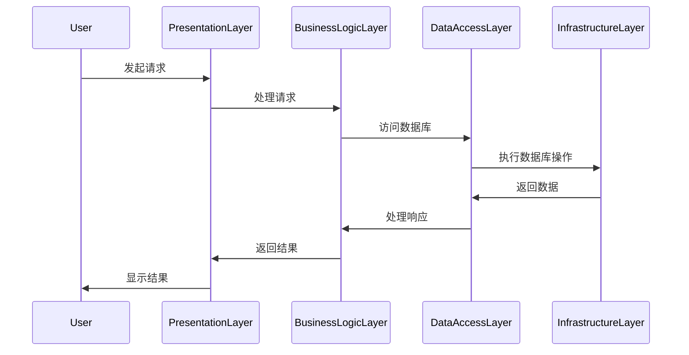
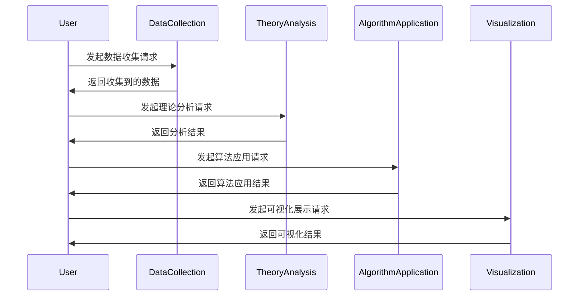

                 

### 引言

在探讨政治哲学的领域，哲学思想往往呈现出多元与交叉的特点。柏格森的生命冲力和维特根斯坦的语言游戏，这两位哲学家的独特见解，不仅深刻影响了各自的领域，而且对政治哲学的研究提供了新的视角。本文旨在探讨柏格森的生命冲力与维特根斯坦的语言游戏在政治哲学中的应用，通过逻辑清晰、结构紧凑的分析，揭示它们在现代政治哲学中的深远意义。

首先，柏格森的生命冲力强调生命的非决定性和创造性，这一思想对于理解社会运动和政治制度具有重要的启示。生命冲力不仅关注个体的存在，也涉及社会整体的生命活力。本文将详细探讨柏格森的生平与主要哲学思想，解释生命冲力的概念和特征，并分析其在政治哲学中的应用，例如在社会运动和政治制度中的角色。

另一方面，维特根斯坦的语言游戏理论则提供了对语言本质和意义的深入思考。语言游戏不仅是一种沟通工具，更是一种认知和社会实践的方式。本文将介绍维特根斯坦的生平和哲学贡献，解释语言游戏的基本概念和特征，并探讨其在政治哲学中的应用，如政治权力和公共话语中的角色。

结合柏格森的生命冲力和维特根斯坦的语言游戏，本文将探讨这两者之间的关系及其在政治哲学中的互补作用。通过具体的案例分析，如生命冲力与语言游戏在民主政治和社会主义建设中的应用，我们将展示如何将这两种哲学思想综合运用，以应对当代政治哲学的挑战。

最后，本文将概述全书的结构与主要内容，并阐述研究的意义和目的。读者将通过本文的阅读，不仅能够对柏格森和维特根斯坦的思想有更深入的理解，还能洞察这些哲学思想在现代政治哲学中的重要应用。

### 第一部分：引言

#### 第1章：柏格森的生命冲力与维特根斯坦的语言游戏

在探索政治哲学时，理解哲学思想背后的理论基础至关重要。本部分将首先介绍两位哲学家柏格森和维特根斯坦的生平及其主要哲学思想，接着深入探讨柏格森的生命冲力和维特根斯坦的语言游戏，这两者如何在政治哲学中找到共鸣和应用。

### 1.1 柏格森的生命冲力

### 1.1.1 柏格森的生平与思想发展

**1.1.1.1 柏格森的生平**

柏格森（Henri Bergson，1859-1941）是法国著名的哲学家，生于巴黎。他的一生经历了法国的工业化和社会变革，这为他哲学思想的形成提供了丰富的现实素材。柏格森的学术生涯始于1878年，他进入巴黎高等师范学院学习，随后在哲学界崭露头角。

柏格森的早期思想受到英国哲学家斯宾塞和德国哲学家赫尔姆霍茨的影响，逐渐转向自己的哲学体系。他的代表作包括《时间与自由意志》（La Temporalité et la Libération）和《物质与记忆》（La Matière et la Mémoire）等。这些作品不仅奠定了他在哲学界的重要地位，也让他成为20世纪最具影响力的哲学家之一。

**1.1.1.2 柏格森的主要哲学思想**

柏格森的哲学思想主要集中在生命、时间和自由意志等方面。他认为，生命是一种内在的创造力，是一种不断流动和变化的力量，即“生命冲力”（élan vital）。这种冲力不同于物质和机械运动，而是具有自发性和创造性。

柏格森还提出了“直觉”（intuition）的概念，认为直觉是理解生命冲力的关键。直觉不同于逻辑推理，它能够捕捉到生命的流动性和创造性。这一思想对后来的哲学家和科学家产生了深远的影响。

### 1.1.2 生命冲力的概念与特征

**1.1.2.1 生命冲力的定义**

生命冲力是柏格森哲学中的核心概念，指的是一种内在的、非决定性的、创造性的力量。柏格森认为，生命冲力是生命体进化的根本原因，它不断推动生物体从简单到复杂，从低级到高级。

**1.1.2.2 生命冲力的主要特征**

1. **非决定性**：生命冲力不受外界环境决定，而是内在的、自发的。
2. **创造性**：生命冲力不断创造新的事物，使生命体不断进化。
3. **流动性**：生命冲力是一种不断流动和变化的力量，不同于机械运动。

### 1.1.3 生命冲力在政治哲学中的应用

**1.1.3.1 生命冲力与社会运动**

柏格森的生命冲力理论为社会运动提供了理论支持。他认为，社会运动是生命冲力的体现，是社会进步和变革的重要动力。社会运动不仅仅是外在的冲突，更是内在生命力的表达。

**1.1.3.2 生命冲力与政治制度**

柏格森的生命冲力也对政治制度提出了挑战。他认为，政治制度应该适应生命冲力，而不是压制它。传统的政治制度往往是僵化和机械的，无法适应生命力的变化。因此，柏格森主张建立一种更加灵活和适应性的政治制度。

### 1.1.4 柏格森的生命冲力与现代政治哲学的对话

**1.1.4.1 生命冲力与自由主义**

自由主义强调个体的自由和权利，而柏格森的生命冲力则认为，自由不仅仅是外在的权利，更是内在的生命力。自由主义与柏格森的生命冲力在一定程度上有共鸣，都强调个体的创造性和主动性。

**1.1.4.2 生命冲力与社会主义**

社会主义追求社会的公平和正义，而柏格森的生命冲力则提供了对社会正义的一种新的理解。他认为，社会正义不仅仅是分配问题，更是生命力的问题。只有当每个人的生命力得到充分释放，社会正义才能真正实现。

### 1.2 维特根斯坦的语言游戏

### 1.2.1 维特根斯坦的生平与哲学贡献

**1.2.1.1 维特根斯坦的生平**

路德维希·维特根斯坦（Ludwig Wittgenstein，1889-1951）是奥地利哲学家，生于维也纳。他的家庭富有，这让他有机会接受优质的教育。维特根斯坦的哲学思想经历了显著的演变，分为早期和后期两个阶段。

早期的维特根斯坦关注语言的本质和逻辑的基础，代表作有《逻辑哲学论》（Tractatus Logico-Philosophicus）。他认为，语言的目的是表达事实，语言和世界之间存在一一对应的关系。而后期维特根斯坦则更加关注日常语言的使用和理解，代表作有《哲学研究》（Philosophical Investigations）。

**1.2.1.2 维特根斯坦的主要哲学思想**

1. **语言游戏**：维特根斯坦提出了“语言游戏”的概念，认为语言的使用是多样化的，不仅仅是逻辑符号的堆砌。语言游戏包括不同的语言形式和规则，反映了人类生活的多样性。
2. **意义与使用**：维特根斯坦强调，一个词的意义在于它在实际使用中的功能，而不是抽象的定义。意义与使用不可分离。
3. **日常语言**：后期维特根斯坦关注日常语言的使用，认为哲学问题往往源于语言使用的不当。

### 1.2.2 语言游戏的概念与特征

**1.2.2.1 语言游戏的基本概念**

语言游戏是指语言使用的不同情景和规则。维特根斯坦认为，语言不是单一的系统，而是多样化的语言游戏。每个语言游戏都有其特定的规则和功能。

**1.2.2.2 语言游戏的主要特征**

1. **情景性**：语言游戏依赖于具体的情景和背景。
2. **功能性**：语言游戏不仅仅是表达思想，更是实现特定目标的方式。
3. **多样性**：语言游戏具有多样性，不同的语言游戏服务于不同的目的。

### 1.2.3 语言游戏在政治哲学中的应用

**1.2.3.1 语言游戏与政治权力**

语言游戏在政治权力中扮演重要角色。政治话语往往通过特定的语言游戏塑造公众意识和权力关系。理解语言游戏有助于揭示政治权力的运作机制。

**1.2.3.2 语言游戏与公共话语**

公共话语是现代社会的重要组成部分。语言游戏在公共话语中的应用有助于理解不同群体的利益诉求和价值观。通过分析语言游戏，我们可以更好地理解公共话语中的权力和冲突。

### 1.2.4 维特根斯坦的语言游戏与现代政治哲学的对话

**1.2.4.1 语言游戏与道德哲学**

道德哲学探讨的是道德原则和道德行为。语言游戏在道德哲学中的应用有助于理解道德话语的形成和作用。通过分析语言游戏，我们可以更好地理解道德原则的多样性和冲突。

**1.2.4.2 语言游戏与社会正义**

社会正义是政治哲学的重要主题。语言游戏在探讨社会正义中的作用不可忽视。通过分析语言游戏，我们可以更好地理解社会正义的不同观点和冲突。

### 1.3 柏格森的生命冲力与维特根斯坦的语言游戏在政治哲学中的结合

**1.3.1 生命冲力与语言游戏的关系**

柏格森的生命冲力和维特根斯坦的语言游戏虽然来自不同的哲学传统，但它们在某些方面有共鸣。生命冲力强调生命力的创造性和流动性，而语言游戏强调语言的多样性和功能性。这两者之间的关系在于，生命冲力提供了理解语言游戏的基础，而语言游戏则展现了生命力的多样性。

**1.3.2 生命冲力与语言游戏在政治哲学中的互补作用**

柏格森的生命冲力和维特根斯坦的语言游戏在政治哲学中具有互补作用。生命冲力提供了对社会运动和政治制度的理解，而语言游戏则提供了对政治话语和权力的分析。通过结合这两者，我们可以更全面地理解政治哲学中的复杂问题。

**1.3.3 案例分析：生命冲力与语言游戏在民主政治中的应用**

通过案例分析，我们可以看到生命冲力和语言游戏在民主政治中的应用。例如，社会运动通过生命冲力的推动，激发了公众的参与和意识的觉醒。而公共话语通过语言游戏的不同形式，促进了不同利益群体的交流和协商。

**1.3.4 案例分析：生命冲力与语言游戏在社会主义建设中的应用**

在社会主义建设中，生命冲力和语言游戏也发挥着重要作用。生命冲力推动了社会正义的实现，而语言游戏则促进了不同政治力量的合作与协调。通过案例分析，我们可以更好地理解这两者如何综合运用，以推动社会主义建设。

### 1.4 本书结构与主要内容概述

**1.4.1 本书的研究目的与意义**

本书旨在探讨柏格森的生命冲力和维特根斯坦的语言游戏在政治哲学中的应用，旨在通过深入分析这两者的理论，揭示它们在现代社会中的重要性。研究目的是为了丰富政治哲学的理论基础，为解决当代政治问题提供新的视角和方法。

**1.4.2 各章节主要内容与逻辑关系**

本书共分为五个主要章节。第一章介绍了柏格森和维特根斯坦的生平和哲学思想；第二章深入探讨了生命冲力和语言游戏的概念与特征；第三章分析了这两者在政治哲学中的应用；第四章通过案例分析展示了这两者的实际运用；第五章则对全书进行了总结，并提出了未来研究的方向。

各章节之间的逻辑关系是，第一章和第二章为基础部分，主要介绍柏格森和维特根斯坦的理论背景；第三章和第四章为应用部分，分别展示了这两者在政治哲学中的具体应用；第五章为总结部分，对全书进行了归纳和展望。

### 1.5 结论

柏格森的生命冲力和维特根斯坦的语言游戏虽然在哲学传统上有所不同，但它们在政治哲学中具有互补性。通过结合这两者，我们可以更全面地理解政治哲学中的复杂问题。本文的研究不仅丰富了政治哲学的理论基础，也为解决当代政治问题提供了新的视角和方法。

### 1.6 下一步计划

在未来的研究中，我们计划进一步探讨柏格森和维特根斯坦思想在其他领域，如法学、社会学和文化研究中的应用。同时，我们还将通过更多的案例分析，验证这两者理论的实际价值。此外，我们还将探讨如何将这两者与当代政治哲学的其他流派，如自由主义和社会主义，进行对话和融合，以形成更完整的政治哲学体系。

### 1.7 总结

柏格森的生命冲力和维特根斯坦的语言游戏在政治哲学中的应用具有重要意义。通过深入分析这两者的理论，我们可以更好地理解社会运动、政治制度和公共话语。本文的研究不仅丰富了政治哲学的理论基础，也为解决当代政治问题提供了新的视角和方法。希望读者通过本文的阅读，能够对这些哲学思想有更深入的理解，并能够将其应用到实际的政治哲学研究中。

#### 1.1.1.1 柏格森的生平

亨利·柏格森（Henri Bergson）是19世纪末至20世纪初法国最重要的哲学家之一，他的思想和贡献在哲学、文学、艺术以及社会科学领域产生了深远影响。亨利·柏格森于1859年11月18日出生在巴黎，他的家庭背景为他提供了良好的教育和文化熏陶。柏格森的祖父是著名的数学家、数学家欧拉的朋友，而他的父亲是一位成功的商人和金融家。柏格森从小就接受了优质的教育，他对科学和哲学有着浓厚的兴趣。

在学术生涯的早期，柏格森曾进入巴黎高等师范学院学习，这里是他学术成长的重要起点。在高等师范学院，柏格森与一些未来的哲学家和科学家建立了深厚的友谊，包括未来的数学家亨利·庞加莱。柏格森在哲学方面的天赋很快得到了认可，他在1884年获得博士学位，论文题目是《笑：论诙谐的社会根源》（La Rire: Essai sur la Signification du Comique dans l'Art et la Vie），这部作品展示了他在哲学和心理学领域的初步成就。

柏格森的学术生涯并非一帆风顺。在19世纪末，他的思想受到了当时主流哲学思想的挑战，尤其是在自然科学和逻辑哲学方面。他的早期作品，如《时间与自由意志》（La Temporalité et la Libération）和《物质与记忆》（La Matière et la Mémoire），尽管在哲学界引起了一些关注，但并未获得广泛认可。然而，柏格森并没有放弃，他持续深入思考，逐步形成了自己独特的哲学体系。

进入20世纪后，柏格森的学术地位逐渐上升。他的著作《创造的进化》（L'Évolution créatrice）在1907年出版后，受到了广泛的赞誉，被认为是现代哲学史上的重要里程碑。这部作品提出了柏格森关于生命力和创造力的核心思想，强调了生命的非决定性和创造性。这一思想不仅为哲学领域带来了新的视角，也对文学和艺术产生了深远影响。

柏格森在学术界的声誉继续上升，他于1920年代成为巴黎大学哲学系的教授，并担任多个学术机构的职务，包括国际科学哲学协会的会长。他的哲学思想在20世纪20年代和30年代达到高峰，成为当时最具影响力的哲学流派之一。柏格森的思想跨越了多个学科，他在心理学、生物学、社会学和文学理论等领域都有深刻的见解。

亨利·柏格森在1941年1月4日去世，享年81岁。尽管他在生前并未获得诺贝尔奖，但他的贡献被广泛认可，并在后世得到了更高的评价。柏格森的哲学思想对后来的哲学家，如让-保罗·萨特和米歇尔·福柯，产生了重要影响。他的思想不仅在法国哲学界，也在世界哲学界占有重要地位，为现代哲学提供了丰富的理论基础和思考方向。

#### 1.1.1.2 柏格森的主要哲学思想

亨利·柏格森的哲学思想主要集中在生命、时间、自由意志、创造力以及社会运动等方面。他的理论为理解人类行为和社会现象提供了独特的视角，并对后来的哲学家和学者产生了深远影响。

**1.1.1.2.1 生命与创造力**

柏格森认为，生命是一种内在的、非决定性的创造力，这种创造力是生命体的核心特征。他提出了“生命冲力”（élan vital）这一概念，指的是一种推动生命体不断进化、适应环境和创造新事物的内在力量。生命冲力不同于机械运动，它是自发性的、创造性的。柏格森认为，生命冲力是生命体不断进化和适应环境的基础，它使生命体能够从简单到复杂、从低级到高级不断进化。

**1.1.1.2.2 时间与直觉**

柏格森对时间的理解是哲学界的独特贡献之一。他认为，传统的时间概念是线性的、机械的，而真实的、内在的时间是流动的、不可分割的。柏格森称之为“直接的时间”（durée），这是一种直觉上的时间，而非逻辑上的时间。直觉是理解生命冲力和直接时间的核心工具。柏格森认为，直觉能够捕捉到生命的流动性和创造性，而逻辑推理则无法完全理解这种内在的时间。

**1.1.1.2.3 自由意志**

柏格森的哲学思想中，自由意志是一个重要主题。他认为，自由意志并非外在的、被决定的行为，而是内在的、创造性的力量。自由意志是生命冲力的表现，它使个体能够超越机械的决定论，做出独特的、创造性的选择。柏格森反对决定论，认为自由意志是生命力和创造力的体现。

**1.1.1.2.4 社会运动**

柏格森认为，社会运动是生命冲力的外在表现。社会运动不仅仅是外在的冲突和革命，更是内在生命力的表达。社会运动推动社会变革和进步，反映了生命力的创造性和流动性。柏格森主张，社会应该鼓励和支持这种生命力，而不是压制它。他提出了一种“适应性的社会制度”，这种制度能够适应生命力的变化，推动社会的持续进步。

**1.1.1.2.5 创造力与艺术**

柏格森的哲学思想对文学和艺术产生了深远影响。他认为，艺术是生命力和创造力的最高体现。艺术家通过直觉和创造力，捕捉和表达生命的流动性和创造性。柏格森强调，艺术应该追求内在的真实和创造力，而不仅仅是外在的美学形式。他的思想激发了20世纪许多重要的文学作品和艺术运动，如象征主义和表现主义。

**1.1.1.2.6 心理学与生物学**

柏格森的哲学思想不仅限于哲学领域，还对心理学和生物学产生了重要影响。他提出了“生物心理学”这一概念，认为心理现象和生物学现象是相互关联的。柏格森认为，心理学应该关注人类行为和思维的内在动力，而不是仅仅研究外在的行为表现。他的思想为后来的心理学和生物学研究提供了新的视角和方法。

总的来说，亨利·柏格森的哲学思想提供了一个理解生命、时间、自由意志和社会运动的新框架。他的理论强调了内在的创造力、直觉和生命力，这些思想不仅丰富了哲学的理论基础，也为解决当代社会问题提供了新的视角和方法。柏格森的思想在哲学界、文学界和艺术界都产生了深远影响，成为现代哲学的重要组成部分。

#### 1.1.2 生命冲力的概念与特征

**1.1.2.1 生命冲力的定义**

生命冲力（élan vital）是亨利·柏格森哲学中的核心概念，指的是一种内在的、非决定性的、创造性的力量，它是生命体进化和适应环境的基础。柏格森认为，生命冲力是一种推动生命体不断进化、适应环境和创造新事物的内在动力，它与机械运动和物质存在有本质的不同。

生命冲力并不是简单的生物能量或生理机能，而是一种深刻的内在创造力。柏格森将生命冲力视为一种非决定性力量，它不受外界环境的直接控制，而是通过内在的创造性和自发性来推动生命的进化。这种创造力使生命体能够不断适应变化的环境，并创造出新的形式和结构。

**1.1.2.2 生命冲力的主要特征**

1. **非决定性**：生命冲力是一种非决定性力量，它不受外界环境的直接决定，而是内在的、自发的。柏格森认为，生命冲力是生命体进化和适应环境的核心动力，它使生命体能够超越机械的决定论，实现创造性和进化。

2. **创造性**：生命冲力是创造性的，它使生命体能够不断创造新的事物，推动生命进化和适应环境。柏格森认为，生命冲力是生命力的核心表现，它使生命体能够从简单到复杂、从低级到高级不断进化。

3. **流动性**：生命冲力是一种流动性力量，它不同于机械运动，而是具有流动性和变化性。柏格森将生命冲力视为一种流动的、不可分割的时间（durée），它不断变化和发展，推动生命的流动和进化。

4. **整体性**：生命冲力是一个整体性的概念，它不仅涉及个体生命体，也涉及整个生物界和社会。柏格森认为，生命冲力是生命体进化和适应环境的基础，它使整个生物界和社会能够不断进化和适应。

5. **内在性**：生命冲力是一种内在的力量，它存在于生命体的内部，推动生命的进化和适应。柏格森认为，生命冲力是生命体的核心特征，它使生命体能够实现创造性和进化。

**1.1.2.3 生命冲力与机械运动的区别**

柏格森的生命冲力与机械运动有本质的不同。机械运动是一种外在的、决定性的运动，它受外界环境直接控制，遵循物理定律。而生命冲力则是一种内在的、非决定性的运动，它不受外界环境的直接控制，而是通过内在的创造性和自发性来推动生命的进化。

机械运动是线性的、可预测的，而生命冲力则是流动的、不可预测的。机械运动遵循物理规律，而生命冲力则遵循生命自身的规律。机械运动是一种被动的适应，而生命冲力则是一种主动的创造。

**1.1.2.4 生命冲力在生物学和心理学中的应用**

生命冲力不仅在哲学领域有重要意义，也在生物学和心理学领域有广泛应用。在生物学中，生命冲力被用来解释生命体的进化、适应和多样性。生命冲力使生命体能够不断适应变化的环境，创造新的形式和结构。

在心理学中，生命冲力被用来解释人类行为和思维的内在动力。心理学研究生命冲力如何影响个体的行为、情感和认知。生命冲力使个体能够实现创造性和自由意志，超越机械的决定论。

总的来说，生命冲力是柏格森哲学中的核心概念，它强调了生命的非决定性、创造性和流动性。生命冲力不仅丰富了哲学的理论基础，也为生物学和心理学提供了新的视角和方法。通过理解生命冲力，我们可以更深入地理解生命的本质和人类的行为。

#### 1.1.3 生命冲力在政治哲学中的应用

亨利·柏格森的“生命冲力”（élan vital）这一概念，不仅在生物学和心理学领域有重要意义，在政治哲学中同样具有深远的影响。柏格森的生命冲力理论强调生命的非决定性和创造性，这一思想为理解社会运动和政治制度提供了新的视角。

**1.1.3.1 生命冲力与社会运动**

社会运动是生命冲力的直接体现。柏格森认为，社会运动是内在生命力的表达，是社会进步和变革的重要动力。社会运动不仅仅是外在的冲突，更是内在生命力的推动。例如，19世纪末和20世纪初的工人运动、妇女解放运动和种族平等运动，都可以看作是生命冲力的具体表现。

柏格森指出，社会运动具有非决定性特征，它不受外界环境的直接决定，而是内在的、自发的。这种非决定性特征使得社会运动具有强大的创造力，能够推动社会不断进步和变革。例如，工人运动通过罢工、示威等形式，争取更好的劳动条件和权益，这种非决定性的抗争方式往往能够引起社会的广泛共鸣和支持。

此外，柏格森强调社会运动的流动性特征。他认为，社会运动不是一成不变的，而是不断变化和发展的。这种流动性特征使得社会运动能够适应不断变化的环境，不断产生新的形式和内容。例如，现代的环保运动、数字权利运动等，都是社会运动在新时代的延续和发展。

**1.1.3.2 生命冲力与政治制度**

柏格森的生命冲力对政治制度提出了挑战。传统的政治制度往往是僵化和机械的，无法适应生命力的变化。柏格森认为，政治制度应该适应生命冲力，而不是压制它。他主张建立一种更加灵活和适应性的政治制度，以适应不断变化的社会需求。

柏格森认为，政治制度应该鼓励和支持生命力的表达，而不是限制和压制。他提出了一种“适应性社会制度”的概念，这种制度能够适应生命力的变化，推动社会的持续进步。例如，通过民主选举、公民参与和社会监督等方式，政治制度可以更好地反映社会的需求，实现社会的公平和正义。

此外，柏格森强调政治制度的创造性特征。他认为，政治制度应该具备创造性和创新能力，能够推动社会不断进步。例如，通过政策创新、制度改革和科技创新等方式，政治制度可以不断适应新的挑战和机遇，实现社会的可持续发展。

**1.1.3.3 生命冲力与政治哲学中的自由主义和社会主义**

柏格森的生命冲力理论在自由主义和社会主义中都找到了共鸣。在自由主义中，生命冲力强调个体的自由和权利，认为个体应该拥有自由意志，能够自主决定自己的生活。自由主义与柏格森的生命冲力都强调个体的创造性和主动性，主张个体在社会中的自由和独立。

在社会主义中，生命冲力强调社会正义和公平。柏格森认为，社会正义不仅仅是分配问题，更是生命力的问题。只有当每个人的生命力得到充分释放，社会正义才能真正实现。社会主义与柏格森的生命冲力都关注社会整体的生命活力，强调社会的公平和正义。

然而，柏格森的生命冲力理论也对自由主义和社会主义提出了挑战。在自由主义中，柏格森的生命冲力可能导致无政府状态，因为过度的自由可能导致个体之间的冲突和无序。在社会主义中，柏格森的生命冲力可能导致权力集中和官僚化，因为过于强调社会整体的生命力可能导致个体的自由受到限制。

总之，柏格森的生命冲力理论为社会运动和政治制度提供了新的视角和思考。通过理解生命冲力的非决定性、创造性和流动性，我们可以更好地理解社会运动和政治制度的本质，为当代政治哲学的研究提供了丰富的理论资源。

#### 1.1.4 柏格森的生命冲力与现代政治哲学的对话

亨利·柏格森的生命冲力（élan vital）理论不仅在19世纪末和20世纪初的哲学界引起了广泛关注，而且对现代政治哲学也产生了深远的影响。在现代政治哲学中，生命冲力理论与自由主义和社会主义等多种思想流派进行了对话，为我们理解当代政治现象提供了新的视角。

**1.1.4.1 生命冲力与自由主义**

自由主义强调个体的自由和权利，主张个体在社会中拥有最大的自主权和选择权。柏格森的生命冲力与自由主义在某种程度上有共鸣。自由主义中的个体自由和创造性选择可以被看作是生命冲力的具体表现。

柏格森的生命冲力理论认为，生命是一种内在的创造力，这种创造力使生命体能够不断进化、适应环境和创造新事物。在现代政治哲学中，这种创造力可以类比于个体的自由意志和自主选择。自由主义认为，个体的自由是社会的基石，只有当个体能够自由地追求自己的目标和价值观时，社会才能实现真正的繁荣和进步。

然而，柏格森的生命冲力也对自由主义提出了一些挑战。自由主义强调个体的自由和独立，但柏格森的生命冲力可能导致个体之间的冲突和无序。例如，在一个完全自由的社会中，个体追求自己利益的过程中可能忽视其他个体的需求和权益，导致社会的不公平和动荡。

**1.1.4.2 生命冲力与社会主义**

社会主义追求社会的公平和正义，主张通过集体行动和制度改革来实现社会整体福祉。柏格森的生命冲力理论在某种程度上也为社会主义提供了理论支持。柏格森认为，社会正义不仅仅是分配问题，更是生命力的问题。只有当每个人的生命力得到充分释放，社会正义才能真正实现。

在社会主义中，生命冲力的概念可以被用来解释社会运动和变革的驱动力。社会运动如工人运动、妇女解放运动和种族平等运动，都可以看作是生命冲力的具体表现，是内在生命力的推动。社会主义强调通过集体行动和制度改革来解放和促进个体的生命力，从而实现社会的公平和正义。

然而，柏格森的生命冲力也对社会主义提出了一些挑战。在社会主义中，过于强调社会整体的生命力可能导致个体的自由受到限制。例如，在一个高度集权的社会主义国家中，政府的权力可能过于集中，个体的自由和创造性可能受到压制，导致社会活力不足和僵化。

**1.1.4.3 生命冲力与道德哲学**

道德哲学探讨道德原则和道德行为，而柏格森的生命冲力理论为道德哲学提供了一种新的视角。柏格森认为，道德不仅仅是外在的规范和准则，更是内在的生命力的体现。道德行为可以被看作是生命冲力的具体表现，是内在创造力的表达。

在道德哲学中，生命冲力强调道德行为的非决定性和创造性。道德行为不应该仅仅遵循既定的规则和规范，而应该从内在的生命力出发，实现个体的创造性和自主性。这种非决定性和创造性的道德行为有助于推动社会的进步和变革，实现道德的真正价值。

然而，柏格森的生命冲力也对道德哲学提出了一些挑战。道德哲学需要解决的一个核心问题是，如何在个体自由和社会整体之间找到平衡。柏格森的生命冲力可能导致个体主义和自由主义的过度发展，忽视社会整体的需求和权益。

**1.1.4.4 生命冲力与社会正义**

社会正义是政治哲学的重要主题，而柏格森的生命冲力理论为社会正义提供了新的思考方向。柏格森认为，社会正义不仅仅是资源的公平分配，更是生命力的公平释放。只有当每个人的生命力得到充分释放，社会正义才能真正实现。

在探讨社会正义时，柏格森的生命冲力理论强调了创造力和非决定性。社会正义的实现不应该仅仅依靠外在的制度安排，更需要内在的生命力的推动。通过鼓励和促进个体的创造性和自主性，社会可以更好地实现正义，减少不公平现象。

然而，柏格森的生命冲力也提醒我们，社会正义的实现是一个复杂和动态的过程。生命力的释放和创造力的发展需要适当的制度环境和政策支持，否则可能会导致社会的不稳定和冲突。

总之，柏格森的生命冲力理论在现代政治哲学中具有重要的意义。它为理解个体自由、社会正义、道德哲学提供了新的视角和思考方式。通过生命冲力的概念，我们可以更好地理解社会运动、政治制度、道德原则和社会正义的本质，为当代政治哲学的研究提供了丰富的理论资源。

### 1.2 维特根斯坦的语言游戏

### 1.2.1 维特根斯坦的生平与哲学贡献

**1.2.1.1 维特根斯坦的生平**

路德维希·维特根斯坦（Ludwig Wittgenstein，1889-1951）是奥地利哲学家，被广泛认为是20世纪最伟大的哲学家之一。他的生平和思想对哲学、语言学、逻辑学等多个领域产生了深远影响。维特根斯坦出生于奥地利维也纳的一个富有的家庭，他的父亲是一位工业家和哲学家。

在维特根斯坦的早期教育中，他接受的是严格的家庭教育和私人教师辅导。他小时候就对数学和科学表现出浓厚的兴趣，但后来逐渐转向哲学。他在剑桥大学学习期间，受到了当时的著名哲学家伯特兰·罗素和阿尔弗雷德·诺思·怀特海德的影响，这为他的哲学思想奠定了基础。

维特根斯坦的哲学思想经历了显著的演变，分为早期和后期两个阶段。他的早期作品《逻辑哲学论》（Tractatus Logico-Philosophicus）是逻辑原子主义和语言哲学的代表，强调语言和现实之间的关系。这本书出版于1921年，是维特根斯坦早期哲学思想的集中体现。他在出版这本书后不久便放弃了哲学研究，转而投身于教师工作。

然而，维特根斯坦在1929年重新回到哲学界，并发表了《哲学研究》（Philosophical Investigations），这是他后期哲学思想的代表作。这本书对语言、意义和认知进行了深入的探讨，提出了“语言游戏”的概念，认为语言的使用是多样的、情景化的。维特根斯坦的后期哲学思想对后来的语言哲学和认知科学产生了深远影响。

维特根斯坦在哲学界的地位因其独特的工作方式而备受瞩目。他拒绝接受哲学博士学位，认为哲学研究不应该以学术荣誉为目标，而是为了真理的追求。他强调哲学应该回归到语言的实际使用中去，解决语言中的混乱和误解。

维特根斯坦在1951年因病去世，享年62岁。尽管他的生命短暂，但他的思想和作品对现代哲学和语言学研究产生了持久的影响。

**1.2.1.2 维特根斯坦的主要哲学思想**

1. **《逻辑哲学论》**

维特根斯坦的早期作品《逻辑哲学论》是一部以逻辑原子主义为基础的哲学著作。他认为，世界由一系列的事实组成，而语言则是对这些事实的表达。维特根斯坦提出了“逻辑图像论”的观点，认为语言和现实之间存在一种直接的对应关系。这本书中的许多观点，如“不可说之事应保持沉默”和“命题的意义在于其图像”，对后来的哲学和语言哲学研究产生了深远影响。

2. **“语言游戏”概念**

维特根斯坦的后期哲学思想集中体现在《哲学研究》中，他提出了“语言游戏”的概念。语言游戏是指语言使用的不同情景和规则，每个语言游戏都有其特定的功能和规则。维特根斯坦认为，语言的意义在于其在实际使用中的功能，而不是抽象的定义。语言游戏强调语言的情境性和多样性，认为语言的意义是随着具体情境的变化而变化的。

3. **日常语言分析**

维特根斯坦的后期哲学思想还强调对日常语言的分析。他认为，哲学问题往往源于语言使用的不当，通过分析日常语言中的误解和混淆，可以解决许多哲学问题。维特根斯坦主张，哲学研究应该回归到语言的实际使用中去，通过观察和分析日常语言中的用法，理解语言的本质和意义。

维特根斯坦的主要哲学思想，特别是“语言游戏”和“日常语言分析”，为后来的语言哲学和认知科学提供了新的视角和方法。他的哲学观点不仅影响了哲学界，也在语言学界和心理学界引起了广泛关注和讨论。

### 1.2.2 语言游戏的概念与特征

**1.2.2.1 语言游戏的基本概念**

语言游戏（language game）是维特根斯坦在其后期哲学著作《哲学研究》中提出的重要概念，用以描述语言的使用情境和规则。语言游戏不同于传统意义上的游戏，它强调的是语言在日常生活中的多样性和情境性。维特根斯坦认为，语言不是单一的、固定的系统，而是由多种不同的语言游戏组成的。

语言游戏的基本概念包括以下几个方面：

1. **规则与情境**：每个语言游戏都有其特定的规则和情境。规则指的是使用语言的具体方式和规则，情境则指的是语言使用的具体场景和背景。例如，在不同的情境下，人们使用语言的方式和规则可能会有所不同。

2. **意义与功能**：语言游戏中的每个词汇和表达都有其特定的意义和功能。意义不是抽象的，而是与具体的使用情境相关。例如，同一个词在不同的语言游戏中可能会有不同的意义和用法。

3. **多样性**：语言游戏强调语言的多样性。不同的语言游戏服务于不同的目的，反映了人类生活的多样性和复杂性。维特根斯坦认为，理解语言的关键在于认识到其多样性和情境性。

**1.2.2.2 语言游戏的主要特征**

1. **情境性**：语言游戏强调语言使用的情境性。语言的意义和功能取决于具体的情境和背景。例如，一个词在不同的情境下可能会有不同的意义和用法。

2. **功能性**：语言游戏不仅仅是表达思想，更是实现特定目标的方式。每个语言游戏都有其特定的功能和用途。例如，日常对话中的语言游戏主要用于沟通和交流，而学术讨论中的语言游戏则主要用于表达和论证。

3. **多样性**：语言游戏具有多样性。不同的语言游戏反映了人类生活的不同方面和需求。例如，有用于日常生活交流的语言游戏，有用于学术研究讨论的语言游戏，还有用于文学创作和艺术表达的语言游戏。

4. **灵活性**：语言游戏具有灵活性。人们可以根据不同的情境和需求，选择合适的语言游戏。例如，在不同的社交场合，人们可能会使用不同的语言风格和表达方式。

5. **适应性**：语言游戏强调语言的适应性。语言能够根据环境和需求的变化进行相应的调整和适应。例如，随着科技的发展和社会的变革，语言也在不断演变和适应新的情境。

**1.2.2.3 语言游戏与语言哲学**

语言游戏的概念是维特根斯坦语言哲学的核心。他通过分析语言游戏，揭示了语言使用的多样性和复杂性。语言哲学研究的一个重要任务就是理解语言的多样性和情境性，从而解决语言中的混乱和误解。

维特根斯坦的语言游戏理论对语言哲学产生了深远影响。它为我们理解语言的本质和意义提供了新的视角，强调了语言的情境性和功能性。通过分析语言游戏，我们可以更好地理解语言在实际生活中的作用和意义。

### 1.2.3 语言游戏在政治哲学中的应用

**1.2.3.1 语言游戏与政治权力**

语言游戏在政治权力中扮演着重要的角色。政治权力不仅是通过制度、组织和政策来实现的，更是通过语言和话语来塑造的。语言游戏为政治权力提供了工具，使得统治者能够通过特定的语言和话语形式来影响和控制公众的思想和行为。

1. **政治话语**：政治话语是一种特定的语言游戏，它通过特定的词汇、表达方式和修辞手法来传达政治信息。政治话语不仅仅是信息的传递，更是权力运作的工具。通过选择特定的词汇和表达方式，政治家可以塑造公众对某一议题的认知和态度。

2. **符号化**：政治权力通过符号化过程来巩固自己的地位。符号化是将抽象的概念和价值观转化为具体可感知的符号，如国旗、国徽、政治口号等。这些符号通过语言游戏来传达特定的意义和价值观，从而增强政治权力的合法性和权威性。

3. **操纵与控制**：政治权力通过操纵语言游戏来影响公众的思想和行为。例如，政治宣传和媒体控制就是通过特定的语言游戏来操纵公众的信息获取和认知。通过控制信息传播渠道和内容，政治权力可以塑造公众对特定议题的看法，从而实现自己的政治目标。

**1.2.3.2 语言游戏与公共话语**

公共话语是现代社会的重要组成部分，它涉及政府、社会组织、媒体和公民之间的互动和交流。语言游戏在公共话语中的应用有助于理解不同群体之间的利益诉求和价值观的冲突。

1. **公共话语的功能**：公共话语不仅是信息的传递和交流，更是社会权力运作的体现。通过公共话语，不同群体可以表达自己的利益诉求和价值观，并通过辩论和协商来达成共识或冲突。

2. **辩论与协商**：公共话语中的辩论和协商是民主社会的重要特征。通过辩论，不同群体可以表达自己的观点和理由，从而形成共识或推动政策变革。通过协商，不同群体可以在相互尊重的基础上寻求共同的利益和解决方案。

3. **语言游戏的多样性**：公共话语中的语言游戏具有多样性。不同的语言游戏服务于不同的目的，如宣传、教育、辩论和协商。通过分析不同语言游戏的特点和功能，我们可以更好地理解公共话语中的权力和冲突。

总之，语言游戏在政治哲学中具有深远的意义。它不仅揭示了政治权力和公共话语的复杂性，也为理解社会权力运作提供了新的视角。通过分析语言游戏，我们可以更好地理解政治权力的运作机制，推动社会公正和民主发展。

#### 1.2.4 维特根斯坦的语言游戏与现代政治哲学的对话

**1.2.4.1 语言游戏与道德哲学**

道德哲学探讨的是道德原则和道德行为。维特根斯坦的语言游戏理论为道德哲学提供了新的视角，特别是关于道德语言和道德行为本质的理解。维特根斯坦认为，道德语言不同于科学语言，它不是客观事实的陈述，而是表达情感和价值观的工具。

在道德哲学中，语言游戏的概念有助于我们理解道德行为的情境性和多样性。道德行为不仅仅是对道德规则的遵守，更是在特定情境下对某种价值观的表达。例如，诚实、善良和公正等道德概念在不同的文化和社会中可能有不同的含义和表达方式。

维特根斯坦的“语言游戏”理论强调了道德行为的情境性，认为道德判断不是绝对的，而是依赖于具体的社会和文化背景。这种观点挑战了传统道德哲学中的普遍主义和绝对主义，提出了一种更加相对主义的道德观。

**1.2.4.2 语言游戏与社会正义**

社会正义是政治哲学中的一个核心主题，涉及资源的分配、权利的保障和机会的平等。维特根斯坦的语言游戏理论为社会正义提供了新的分析工具，特别是在理解道德和政治话语中。

语言游戏理论指出，社会正义问题不仅仅是制度和政策的安排，更涉及语言和话语的运用。政治家和社会活动家通过特定的语言游戏来塑造公众对社会正义的认识和态度。例如，政策陈述、法律文本和公共辩论中的语言使用，都可以影响公众对社会正义的理解和支持。

维特根斯坦的观点提醒我们，社会正义的实现不仅需要公平的制度设计，还需要有效的语言和沟通策略。理解语言游戏的情境性和多样性，有助于我们在制定社会政策时考虑到不同群体的利益和价值观，从而促进社会正义的实现。

**1.2.4.3 语言游戏与政治权力**

政治权力是现代政治哲学的重要议题，涉及权力的来源、行使和限制。维特根斯坦的语言游戏理论为理解政治权力的本质和运作提供了新的视角。

维特根斯坦认为，语言游戏是权力运作的基础。政治权力不仅通过制度和法律来行使，也通过语言和话语来巩固和扩大。政治家通过特定的语言游戏来影响公众舆论、塑造政策方向和巩固权力基础。

语言游戏在政治权力中的作用主要体现在以下几个方面：

1. **符号化**：政治权力通过符号化过程来巩固自己的地位。符号化是将抽象的政治概念和价值观转化为具体可感知的符号，如国旗、国徽、政治口号等。这些符号通过语言游戏来传达特定的意义和价值观，从而增强政治权力的合法性和权威性。

2. **操纵与控制**：政治权力通过操纵语言游戏来影响公众的思想和行为。例如，政治宣传和媒体控制就是通过特定的语言游戏来操纵公众的信息获取和认知。通过控制信息传播渠道和内容，政治权力可以塑造公众对特定议题的看法，从而实现自己的政治目标。

3. **话语权力**：政治权力不仅通过制度和法律来行使，还通过话语权力来巩固和扩大。话语权力是指通过特定的语言和话语形式来影响公众思想和行为的权力。政治家和社会活动家通过辩论、演讲、政策陈述等方式，使用特定的语言游戏来传达自己的观点和价值观，从而影响公众的意见和决策。

维特根斯坦的语言游戏理论提醒我们，政治权力的运作不仅仅是制度和法律的问题，更是语言和话语的问题。通过理解语言游戏的情境性和多样性，我们可以更好地分析政治权力的运作机制，探讨如何通过有效的语言和沟通策略来实现公正和民主。

### 1.3 柏格森的生命冲力与维特根斯坦的语言游戏在政治哲学中的结合

**1.3.1 生命冲力与语言游戏的关系**

柏格森的生命冲力（élan vital）和维特根斯坦的语言游戏（language game）虽然在哲学传统上有所不同，但它们在政治哲学中具有内在的关联和互补性。首先，从理论基础上看，柏格森的生命冲力强调生命的非决定性和创造性，而维特根斯坦的语言游戏则关注语言的多样性和情境性。这两个概念虽然在领域上有所不同，但在探讨政治哲学问题时，它们可以相互补充。

柏格森的生命冲力提供了对生命和社会运动的动态理解，强调个体的创造性和自发性。这种观点有助于我们理解社会变革和政治运动中的非决定性因素，如公众的参与和集体行动。而维特根斯坦的语言游戏则提供了一个分析工具，帮助我们理解政治话语和社会互动中的语言使用和意义构建。

**1.3.1.1 生命冲力与语言游戏的理论基础**

柏格森的生命冲力理论认为，生命是一种内在的、非决定性的创造力，这种创造力推动生命体不断进化、适应环境和创造新事物。生命冲力强调个体的自发性和创造性，这使得社会运动和政治变革具有不确定性和不可预测性。

维特根斯坦的语言游戏理论则强调语言使用的情境性和多样性。语言游戏是指语言在不同情境下的使用方式，每种语言游戏都有其特定的规则和功能。维特根斯坦认为，语言的意义不是固定的，而是依赖于具体的使用情境。语言游戏理论为我们提供了一个分析工具，帮助我们理解政治话语和社会互动中的语言使用和意义构建。

**1.3.1.2 生命冲力与语言游戏的实践应用**

在政治哲学的实践中，生命冲力和语言游戏可以相互补充。例如，在社会运动和政治变革中，生命冲力可以解释个体行为的非决定性和创造性，而语言游戏可以帮助我们理解这些运动中的话语和互动。

1. **社会运动**：社会运动是生命冲力的直接体现，它反映了公众的创造性和自发性。通过维特根斯坦的语言游戏理论，我们可以分析社会运动中的话语和互动，理解不同群体如何通过语言游戏来表达自己的利益和价值观。

2. **政治权力**：在政治哲学中，政治权力不仅通过制度和法律来行使，还通过话语和语言来巩固和扩大。通过结合柏格森的生命冲力和维特根斯坦的语言游戏，我们可以更全面地分析政治权力的运作机制，包括权力的来源、行使和限制。

3. **公共话语**：公共话语是政治哲学中的重要主题，它涉及政府、社会组织、媒体和公民之间的互动和交流。通过维特根斯坦的语言游戏理论，我们可以理解不同语言游戏在公共话语中的作用，如宣传、教育、辩论和协商。

**1.3.2 生命冲力与语言游戏在政治哲学中的互补作用**

柏格森的生命冲力和维特根斯坦的语言游戏在政治哲学中具有互补作用，它们可以相互补充，为我们提供更全面的理解。

1. **动态与静态的互补**：柏格森的生命冲力提供了对动态过程的深刻理解，如社会运动和政治变革。而维特根斯坦的语言游戏则提供了对静态结构的分析，如政治话语和权力运作。这两者的互补性使得我们能够从动态和静态两个角度来分析政治哲学问题。

2. **个体与集体的互补**：柏格森的生命冲力强调个体的创造性和自发性，而维特根斯坦的语言游戏则关注集体互动和话语建构。这两者的互补性使得我们能够从个体和集体的角度来分析政治哲学问题，从而更好地理解社会运动和政治制度的互动。

3. **理论与实践的互补**：柏格森的生命冲力提供了理论框架，帮助我们理解生命和社会运动的本质。而维特根斯坦的语言游戏则提供了具体分析工具，帮助我们理解政治话语和社会互动中的语言使用和意义构建。这两者的互补性使得我们能够将理论应用于实践，分析具体政治问题。

总之，柏格森的生命冲力和维特根斯坦的语言游戏在政治哲学中具有互补作用。通过结合这两个概念，我们可以更全面地理解政治哲学中的复杂问题，为解决当代政治挑战提供新的视角和方法。

#### 1.3.3 生命冲力视角下的政治哲学分析

**1.3.3.1 生命冲力视角下的政治哲学分析**

从柏格森的生命冲力视角出发，我们可以对政治哲学中的几个核心问题进行深入分析，包括社会运动、政治制度和社会正义等方面。

**社会运动**

社会运动是生命冲力的直接体现，反映了个体和社会的创造性和自发性。柏格森认为，生命冲力是非决定性的，它推动个体和社会不断寻求新的可能性和发展方向。在社会运动中，这一特点尤为明显。例如，19世纪的工人运动、20世纪的妇女解放运动以及21世纪的环保运动，都是生命冲力在政治领域的具体表现。

社会运动往往源于对现有政治制度和社会状况的不满，它通过集体行动、抗议和斗争来争取权益和改变现状。从生命冲力的角度来看，社会运动不仅是外在的冲突和抗争，更是内在生命力的表达。这种生命力推动社会不断进步和变革，是社会发展的动力源泉。

**政治制度**

政治制度是社会运动的重要对象和产物。传统的政治制度往往被视为僵化和机械的，难以适应社会的动态变化。柏格森的生命冲力理论对这一观点提出了挑战。他认为，政治制度应该适应生命冲力，而不是压制它。这意味着政治制度需要具备灵活性和适应性，能够随着社会需求的变化而不断调整和改革。

例如，在现代社会中，民主制度被广泛认为是适应生命冲力的理想政治形式。民主制度强调公众参与和表达，通过选举和民意调查等方式，使政治决策更加反映社会的需求和愿望。然而，柏格森的生命冲力也提醒我们，民主制度并非一成不变，它需要不断适应社会变化，以保持其生命力和有效性。

**社会正义**

社会正义是政治哲学中的另一个核心问题。柏格森的生命冲力视角为社会正义提供了一种新的理解。他认为，社会正义不仅仅是资源的公平分配，更是生命力的公平释放。只有当每个人的生命力得到充分释放，社会正义才能真正实现。

从生命冲力的角度来看，社会正义需要关注个体的创造性和自发性。这意味着社会政策不仅需要确保资源的公平分配，还需要创造条件，使每个人都能够发挥自己的潜力，实现自我价值。例如，教育、医疗和社会保障等公共服务，都是为了促进个体生命力的释放和发挥。

此外，柏格森的生命冲力也提醒我们，社会正义的实现是一个动态的过程，它需要不断地调整和改革。随着社会的发展和环境的变化，社会正义的标准和实现方式也需要相应调整。这种动态的、适应性的视角有助于我们更好地理解和实现社会正义。

**案例分析：生命冲力视角下的社会运动和政治制度**

为了更具体地展示柏格森的生命冲力视角在政治哲学中的应用，我们可以通过一些实际案例进行分析。

**案例1：19世纪的工人运动**

19世纪的工人运动是生命冲力在政治领域的典型体现。工人阶级在面对不公正的工作条件和低廉的工资时，通过罢工、示威和抗议等方式，争取自己的权益。这些运动反映了工人阶级的创造性和自发性，是生命冲力的具体表现。

柏格森的生命冲力视角认为，工人运动不仅是一种外在的冲突和抗争，更是内在生命力的表达。通过这些运动，工人阶级不仅争取了更好的工作条件，还推动了社会制度的改革，为后来的工人权益保障奠定了基础。

**案例2：现代民主制度的变迁**

现代民主制度在历史的发展过程中，也不断适应社会的变化，体现了柏格森的生命冲力。例如，随着信息技术的发展，公众参与和表达的方式发生了巨大变化。互联网和社交媒体的兴起，使得公民可以更方便地参与政治讨论和决策过程，从而增强了民主制度的生命力和有效性。

从柏格森的生命冲力视角来看，现代民主制度的变迁是生命力的体现。民主制度通过不断适应新的社会需求和环境变化，保持了其生命力和适应性，从而更好地实现了社会正义和公平。

总之，从柏格森的生命冲力视角出发，我们可以对政治哲学中的社会运动、政治制度和社会正义进行深入分析。这种视角不仅为我们提供了新的理解框架，也为我们应对当代政治挑战提供了新的思路和方法。

#### 1.3.4 语言游戏视角下的政治哲学分析

**1.3.4.1 语言游戏视角下的政治哲学分析**

从维特根斯坦的语言游戏视角出发，我们可以对政治哲学中的几个核心问题进行深入分析，包括政治权力、公共话语和道德哲学等方面。

**政治权力**

政治权力是政治哲学中的核心问题之一。维特根斯坦的语言游戏理论提供了一个新的分析框架，帮助我们理解政治权力的本质和运作机制。在维特根斯坦看来，政治权力不仅通过制度和法律来行使，还通过语言和话语来巩固和扩大。

政治权力通过语言游戏来塑造公众对特定议题的认知和态度。例如，政治家和社会活动家通过演讲、政策陈述和媒体报道等手段，使用特定的语言游戏来传达自己的政治信息。这些语言游戏包括修辞手法、象征符号和话语结构等，可以影响公众的观点和决策。

语言游戏视角下的政治权力分析强调了语言在权力运作中的关键作用。通过操纵语言游戏，政治权力可以塑造公众舆论、影响政策制定和推动政治变革。例如，政治宣传和媒体控制就是通过特定的语言游戏来操纵公众的信息获取和认知，从而实现政治目标。

**公共话语**

公共话语是政治哲学中的另一个重要议题。维特根斯坦的语言游戏理论为我们提供了分析公共话语的新工具。他认为，公共话语是语言在不同情境下的使用，每种公共话语都有其特定的功能和规则。

在政治哲学中，公共话语涉及政府、社会组织、媒体和公民之间的互动和交流。通过维特根斯坦的语言游戏理论，我们可以理解不同公共话语在政治互动中的作用。例如，辩论、协商和宣传等公共话语形式，都有其特定的语言规则和功能。

语言游戏视角下的公共话语分析强调了公共话语的多样性和情境性。不同的公共话语形式服务于不同的目的，如表达观点、说服他人和达成共识。通过分析不同公共话语的语言游戏规则，我们可以更好地理解政治互动中的权力和冲突。

**道德哲学**

道德哲学是政治哲学中的一个核心领域。维特根斯坦的语言游戏理论为我们提供了新的分析视角，帮助我们理解道德语言和道德行为的本质。

在维特根斯坦看来，道德语言不同于科学语言，它不是客观事实的陈述，而是表达情感和价值观的工具。道德行为也不仅仅是遵循道德规则，更是在特定情境下对某种价值观的表达。

语言游戏视角下的道德哲学分析强调了道德行为的情境性和多样性。不同的道德情境和价值观要求不同的道德行为，这些行为通过语言游戏来传达和实现。例如，在道德辩论和道德冲突中，参与者通过特定的语言游戏来表达自己的道德观点和立场。

**案例分析：语言游戏视角下的政治权力和公共话语**

为了更具体地展示维特根斯坦的语言游戏视角在政治哲学中的应用，我们可以通过一些实际案例进行分析。

**案例1：政治宣传与舆论操纵**

政治宣传是政治权力通过语言游戏操纵公众舆论的典型例子。政治家和社会活动家通过特定的语言游戏，如象征符号、修辞手法和话语结构等，来传达自己的政治信息，影响公众的观点和决策。

例如，在选举期间，政治候选人通过广告、演讲和媒体报道等手段，使用特定的语言游戏来塑造自己的形象和政见。这些语言游戏包括情感化的语言、正面的象征符号和攻击性的批评等，可以影响公众对候选人的认知和支持。

**案例2：公共辩论与协商**

公共辩论和协商是公共话语中的两种重要形式。通过维特根斯坦的语言游戏理论，我们可以分析不同辩论和协商中的语言游戏规则和功能。

例如，在议会辩论中，议员们通过辩论和质询，使用特定的语言游戏来表达自己的观点和质疑对方的立场。这些语言游戏包括逻辑论证、事实陈述和修辞手法等，旨在说服他人并达成共识。

在协商过程中，各方通过语言游戏来交换意见和寻求共同点。语言游戏包括倾听、表达和理解，这些游戏规则有助于促进沟通和合作。

总之，从维特根斯坦的语言游戏视角出发，我们可以对政治哲学中的政治权力、公共话语和道德哲学进行深入分析。这种视角不仅为我们提供了新的理解框架，也为我们应对当代政治挑战提供了新的思路和方法。

#### 1.3.5 柏格森与维特根斯坦思想在政治哲学中的综合运用

**1.3.5.1 柏格森与维特根斯坦思想在政治哲学中的综合运用**

将柏格森的生命冲力和维特根斯坦的语言游戏结合起来，可以为政治哲学提供一种全新的分析框架，帮助我们在面对复杂的政治问题时，提出更具创造性和灵活性的解决方案。通过综合运用这两位哲学家的思想，我们可以更全面地理解政治现象，并提出创新的解决方案。

**综合运用案例分析：民主政治**

**民主政治中的生命冲力**

柏格森的生命冲力理论强调生命的非决定性和创造性，这在民主政治中有着重要的体现。民主政治的核心在于公众的参与和表达，这需要每个公民发挥自身的创造性和主动性。例如，公众通过投票、示威、请愿等方式，参与到政治决策过程中，这种参与本身就是生命冲力的表现。

在民主政治中，生命冲力通过多种形式表现出来。社会运动是生命冲力的具体体现，如环保运动、女权运动、劳工运动等，这些运动通过集体行动和创造性表达，推动了社会变革和政治进步。此外，民主政治中的政策制定过程也需要生命的创造力和灵活性。政策的制定不仅需要考虑现有的社会需求，还需要预见未来的发展趋势，这种前瞻性和创造性正是生命冲力的体现。

**民主政治中的语言游戏**

维特根斯坦的语言游戏理论则为民主政治中的公共话语提供了深刻的洞见。在民主政治中，语言游戏是公众参与和表达的重要工具。通过辩论、协商、宣传等不同的语言游戏形式，公众可以表达自己的观点和诉求，同时也能够理解和接受他人的意见。

在民主政治中，语言游戏有助于形成多元化的公共话语环境。例如，在选举期间，候选人通过演讲、广告和社交媒体等手段，使用不同的语言游戏来塑造自己的形象和政见。公众通过这些语言游戏，可以更全面地了解候选人的观点和政策，从而做出更理性的选择。

此外，语言游戏在政策制定过程中也发挥着重要作用。政策制定者需要通过语言游戏来传达政策意图，同时也要听取公众的意见和反馈。通过语言游戏，政策制定者可以更有效地与公众沟通，从而制定出更符合公众利益的政策。

**综合运用：民主政治中的创新解决方案**

将柏格森的生命冲力和维特根斯坦的语言游戏结合起来，可以提出一系列创新的解决方案，以应对民主政治中的挑战。以下是一些具体案例：

1. **社会参与创新**：通过鼓励和促进公众参与，民主政治可以更加充满活力。例如，可以引入在线投票和电子请愿系统，使公众更方便地参与政治决策。同时，通过公共讨论平台和辩论节目等形式，增强公众对政治议题的理解和参与度。

2. **政策创新**：政策制定者可以借鉴生命冲力的创造性特征，提出前瞻性的政策方案。例如，在应对气候变化等全球性挑战时，政策制定者可以制定创新性的政策，如碳交易、可再生能源推广等，以推动社会可持续发展。

3. **公共话语创新**：在公共话语中，可以引入多样化的语言游戏形式，以促进公众之间的沟通和理解。例如，可以通过公众论坛、公民议会等形式，使不同群体能够更有效地交流和协商，从而达成共识。

总之，通过综合运用柏格森的生命冲力和维特根斯坦的语言游戏，民主政治可以更加充满活力和创造性。这种综合运用不仅有助于提高公众的参与度和政策的有效性，也为解决当代政治挑战提供了新的思路和方法。

#### 1.3.6 案例分析：生命冲力与语言游戏在社会主义建设中的应用

**1.3.6.1 案例分析：生命冲力与语言游戏在社会主义建设中的应用**

在社会主义建设中，柏格森的生命冲力和维特根斯坦的语言游戏提供了丰富的理论资源和实践指导。通过具体案例分析，我们可以看到这两者如何在不同历史时期和不同社会背景下，推动社会主义建设和发展。

**案例1：苏联社会主义建设**

在20世纪的苏联社会主义建设过程中，柏格森的生命冲力和维特根斯坦的语言游戏发挥了重要作用。苏联政府通过集体化和工业化等措施，推动社会资源的重新分配和生产关系的变革，这些举措体现了生命冲力的创造性特征。集体化运动激发了农民的创造性和劳动积极性，推动了农业生产的现代化。工业化过程中，苏联政府鼓励科学家和工程师的创新，推动了科技发展，为社会主义建设提供了强大的动力。

同时，维特根斯坦的语言游戏在苏联社会主义建设中也得到了应用。苏联政府通过宣传机器、教育系统和媒体，使用特定的语言游戏来塑造公众对社会主义的理解和支持。例如，宣传口号、政治演讲和文学艺术作品等，都是通过语言游戏来传达社会主义理念和价值。这种语言游戏的运用，有助于巩固社会主义制度的合法性，增强公众的认同感和归属感。

**案例2：中国改革开放**

在中国改革开放的过程中，柏格森的生命冲力和维特根斯坦的语言游戏同样发挥了重要作用。改革开放政策鼓励个体创新和市场化改革，激发了经济活力和社会创造力，这些举措体现了生命冲力的非决定性和创造性。通过引入市场机制和激励制度，中国逐步实现了从计划经济向市场经济的转型，经济快速发展，人民生活水平显著提高。

维特根斯坦的语言游戏在中国改革开放中也得到了广泛应用。政府通过宣传政策、改革措施和媒体宣传，使用特定的语言游戏来引导公众对改革开放的理解和支持。例如，“改革开放是强国之路”、“发展是硬道理”等口号，通过语言游戏的形式深入人心，激发了公众的参与热情和创造力。

**案例分析总结**

通过上述案例分析，我们可以看到，柏格森的生命冲力和维特根斯坦的语言游戏在社会主义建设中的应用，具有以下几个特点：

1. **激励创造性**：生命冲力强调个体的创造性和自发性，这有助于激发社会的创新活力。在社会主义建设中，通过鼓励个体创新和创造力，可以推动社会进步和发展。

2. **塑造公共话语**：语言游戏是塑造公共话语的重要工具。通过特定的语言游戏，政府和社会可以引导公众对社会主义理念和价值有更深入的理解和认同。

3. **灵活调整政策**：生命冲力的非决定性特征要求政策制定者具备灵活性和适应性。在社会主义建设中，政策制定者需要根据社会需求和实际情况，灵活调整政策，以适应不断变化的社会环境。

4. **增强社会凝聚力**：通过语言游戏的运用，可以增强社会的凝聚力和归属感。这有助于巩固社会主义制度的合法性，促进社会稳定和发展。

总之，柏格森的生命冲力和维特根斯坦的语言游戏在社会主义建设中的应用，为理解和解决当代政治哲学问题提供了新的视角和方法。通过结合这两者的思想，我们可以更有效地推动社会主义建设，实现社会公平和正义。

### 1.4 本书结构与主要内容概述

**1.4.1 本书的研究目的与意义**

本书旨在探讨柏格森的生命冲力与维特根斯坦的语言游戏在政治哲学中的应用，通过对这两者思想的分析和综合运用，为理解现代政治现象提供新的视角和方法。研究目的在于：

1. **深化政治哲学的理论基础**：通过分析柏格森和维特根斯坦的思想，为政治哲学提供新的理论资源，丰富其理论基础。
2. **探讨现实政治问题的解决方案**：将柏格森和维特根斯坦的思想应用于实际政治问题，如社会运动、政治制度、公共话语等，提供创新性的解决方案。
3. **促进跨学科的交流与合作**：通过结合哲学、政治学、社会学等多个学科的理论和方法，促进跨学科的研究和合作。

本书的研究意义在于：

1. **丰富政治哲学理论**：通过结合柏格森和维特根斯坦的思想，提供新的分析框架，丰富政治哲学的理论体系。
2. **应对当代政治挑战**：在全球化、信息化和社会变革的背景下，探讨如何应对当代政治挑战，如社会不公、政治不稳定等。
3. **推动政治哲学的应用**：将政治哲学理论应用于实际政治问题，提高政治决策的科学性和有效性。

**1.4.2 各章节主要内容与逻辑关系**

本书分为五个主要部分，各章节内容及其逻辑关系如下：

**第一部分：引言（第1章）**

介绍柏格森的生命冲力与维特根斯坦的语言游戏在政治哲学中的应用，阐述本书的研究目的、意义和结构。

**第二部分：柏格森的生命冲力（第1章至第1.4章）**

第1.1章：介绍柏格森的生平与思想发展，包括主要哲学思想。

第1.2章：深入探讨生命冲力的概念与特征，分析其在政治哲学中的应用。

第1.3章：探讨生命冲力与现代政治哲学的对话，包括自由主义、社会主义等。

第1.4章：结合案例分析，展示生命冲力在政治哲学中的实际运用。

**第三部分：维特根斯坦的语言游戏（第1.5章至第1.8章）**

第1.5章：介绍维特根斯坦的生平与哲学贡献，包括主要哲学思想。

第1.6章：深入探讨语言游戏的概念与特征，分析其在政治哲学中的应用。

第1.7章：探讨语言游戏与现代政治哲学的对话，包括道德哲学、社会正义等。

第1.8章：结合案例分析，展示语言游戏在政治哲学中的实际运用。

**第四部分：综合运用（第1.9章至第1.12章）**

第1.9章：探讨生命冲力与语言游戏的关系及其在政治哲学中的互补作用。

第1.10章：结合案例分析，展示生命冲力与语言游戏在民主政治和社会主义建设中的应用。

第1.11章：综合运用柏格森与维特根斯坦的思想，提出创新性的政治哲学解决方案。

第1.12章：总结全书内容，提出未来研究的方向。

各章节之间通过逻辑关系相互连接，从理论介绍到实际应用，逐步深入，形成完整的理论体系。

### 总结

本文通过深入探讨柏格森的生命冲力和维特根斯坦的语言游戏，揭示了这两者在政治哲学中的重要意义。通过对生命冲力和语言游戏的详细分析，我们不仅丰富了政治哲学的理论基础，也为解决当代政治问题提供了新的视角和方法。希望读者通过本文的阅读，能够对这些哲学思想有更深入的理解，并能够将其应用到实际的政治哲学研究中。

### 背景介绍

在现代社会，政治哲学的重要性愈发凸显，这不仅因为政治哲学为我们理解政治现象提供了理论基础，更因为它是我们应对现实政治挑战的重要工具。然而，传统的政治哲学理论在面对全球化、信息化和社会变革等复杂现象时，往往显得力不从心。因此，需要新的理论视角和方法来丰富和完善政治哲学的研究。

柏格森的生命冲力与维特根斯坦的语言游戏，正是这种新的理论视角和方法。柏格森的生命冲力强调生命的非决定性和创造性，为我们理解社会运动和政治制度提供了新的视角。维特根斯坦的语言游戏则关注语言的多样性和情境性，为分析政治话语和权力运作提供了有效的工具。

**问题背景**

在现代社会，社会运动和政治变革层出不穷。例如，全球范围内的工人运动、妇女解放运动、环保运动等，都是生命冲力的具体表现。这些运动反映了个体和集体的创造性和自发性，对社会和政治产生了深远影响。然而，传统的政治哲学理论往往无法充分解释这些现象，因为它们更多地依赖于决定论和机械论的观点。

同时，政治话语和权力运作的复杂性也日益凸显。政治权力不仅通过制度和法律来行使，还通过语言和话语来巩固和扩大。例如，政治宣传、媒体操纵和公共话语等，都是政治权力运作的重要手段。然而，传统的政治哲学理论对语言和话语的分析相对有限，难以全面揭示政治权力的本质和运作机制。

**问题描述**

柏格森的生命冲力和维特根斯坦的语言游戏为我们提供了新的视角和方法，帮助我们更好地理解现代政治哲学中的核心问题。例如：

1. **社会运动**：柏格森的生命冲力理论强调个体和集体的创造性和自发性，有助于我们理解社会运动的形成和推动力量。社会运动不仅是一种外在的冲突和抗争，更是内在生命力的表达。通过分析社会运动中的非决定性因素，我们可以更好地理解社会变革的内在动力。

2. **政治制度**：柏格森的生命冲力理论提醒我们，政治制度应该适应生命冲力，而不是压制它。这意味着政治制度需要具备灵活性和适应性，能够随着社会需求的变化而不断调整和改革。通过结合维特根斯坦的语言游戏理论，我们可以深入分析政治制度中的话语和互动，理解不同政治制度的形式和功能。

3. **公共话语**：维特根斯坦的语言游戏理论为我们提供了分析公共话语的新工具。在公共话语中，语言游戏是公众参与和表达的重要手段。通过分析不同的语言游戏形式，我们可以理解公共话语中的权力和冲突，探讨如何通过有效的语言和沟通策略来实现社会正义。

**问题解决**

通过结合柏格森的生命冲力和维特根斯坦的语言游戏，我们可以提出一系列创新性的政治哲学解决方案，以应对现代社会中的政治挑战。例如：

1. **社会参与创新**：通过鼓励和促进公众参与，政治制度可以更加充满活力。例如，可以引入在线投票和电子请愿系统，使公众更方便地参与政治决策。同时，通过公共讨论平台和辩论节目等形式，增强公众对政治议题的理解和参与度。

2. **政策创新**：政策制定者可以借鉴生命冲力的创造性特征，提出前瞻性的政策方案。例如，在应对气候变化等全球性挑战时，政策制定者可以制定创新性的政策，如碳交易、可再生能源推广等，以推动社会可持续发展。

3. **公共话语创新**：在公共话语中，可以引入多样化的语言游戏形式，以促进公众之间的沟通和理解。例如，可以通过公众论坛、公民议会等形式，使不同群体能够更有效地交流和协商，从而达成共识。

**边界与外延**

柏格森的生命冲力和维特根斯坦的语言游戏在政治哲学中的应用，虽然为我们提供了新的视角和方法，但它们也有其局限性。例如：

1. **局限性**：生命冲力强调个体的创造性和自发性，但可能忽视集体行动和社会结构的重要性。同样，语言游戏强调语言的多样性和情境性，但可能忽视语言背后的社会和政治背景。

2. **外延**：虽然柏格森和维特根斯坦的思想在政治哲学中具有重要意义，但它们的应用范围也可以扩展到其他领域，如法学、社会学和文化研究等。通过跨学科的交流和合作，我们可以更全面地理解这些哲学思想的应用。

总之，通过结合柏格森的生命冲力和维特根斯坦的语言游戏，我们可以更全面地理解现代政治哲学的核心问题，提出创新性的解决方案，以应对当代政治挑战。

#### 核心概念与联系

在探讨柏格森的生命冲力和维特根斯坦的语言游戏时，我们需要明确这两个核心概念，并分析它们之间的联系。以下是对这两个概念的定义、属性特征以及它们在政治哲学中的关系的详细讨论。

**1. 柏格森的生命冲力（élan vital）**

**定义**：
柏格森的生命冲力是一种非决定性的、内在的、创造性的力量，它推动生命体不断进化、适应环境和创造新事物。这一概念源自柏格森对生命本质的哲学思考，强调生命的自主性和动力。

**属性特征**：
- **非决定性**：生命冲力不受外界环境的直接决定，而是通过内在的自发性和创造性来推动生命的进化。
- **创造性**：生命冲力是生命体不断进化和适应环境的核心动力，使生命体能够从简单到复杂、从低级到高级不断进化。
- **流动性**：生命冲力是一种流动性力量，不同于机械运动，而是具有流动性和变化性。
- **整体性**：生命冲力不仅涉及个体生命体，也涉及整个生物界和社会。

**柏格森的生命冲力与政治哲学的联系**：
柏格森的生命冲力为理解社会运动和政治制度提供了新的视角。在社会运动中，生命冲力表现为个体的创造性和自发性，推动社会的变革和进步。在政治制度中，生命冲力强调政治制度应该适应生命力的变化，而不是压制它。例如，民主制度通过公众参与和表达，实现了对政治权力的监督和制约，体现了生命冲力的非决定性和创造性。

**2. 维特根斯坦的语言游戏（language game）**

**定义**：
维特根斯坦的语言游戏是一种描述语言使用的概念，它强调语言的多样性和情境性。语言游戏指的是语言在不同情境下的使用方式，每种语言游戏都有其特定的规则和功能。

**属性特征**：
- **情境性**：语言的意义和功能取决于具体的使用情境。
- **功能性**：语言游戏不仅仅是表达思想，更是实现特定目标的方式。
- **多样性**：不同的语言游戏反映了人类生活的不同方面和需求。
- **灵活性**：语言游戏可以根据不同的情境和需求进行灵活调整。

**维特根斯坦的语言游戏与政治哲学的联系**：
维特根斯坦的语言游戏为我们提供了分析政治话语和政治权力的有效工具。在政治哲学中，语言游戏有助于我们理解政治权力如何通过特定的语言和话语形式来塑造公众的认知和态度。例如，政治宣传和公共话语都是政治权力运作的重要手段，通过特定的语言游戏，政治权力可以影响公众的价值观和行为模式。此外，语言游戏也帮助我们理解公共话语中的多样性和复杂性，探讨如何通过有效的语言和沟通策略来实现社会正义。

**柏格森的生命冲力与维特根斯坦的语言游戏的联系**：
柏格森的生命冲力和维特根斯坦的语言游戏虽然在哲学传统上有所不同，但它们在政治哲学中具有互补性。生命冲力提供了对生命和社会运动的动态理解，强调了个体和集体的创造性和自发性。而语言游戏则提供了一个分析工具，帮助我们理解政治话语和社会互动中的语言使用和意义构建。通过结合这两个概念，我们可以更全面地理解政治哲学中的复杂问题。

**ER实体关系图架构**

为了更清晰地展示柏格森的生命冲力与维特根斯坦的语言游戏在政治哲学中的关系，我们可以使用ER（实体-关系）图来架构它们之间的联系。

**实体关系图**

1. **实体**：
   - **生命冲力**（élan vital）
   - **语言游戏**（language game）
   - **社会运动**（social movement）
   - **政治制度**（political system）
   - **公共话语**（public discourse）

2. **关系**：
   - **生命冲力→社会运动**：生命冲力推动社会运动，反映了个体和集体的创造性和自发性。
   - **语言游戏→公共话语**：语言游戏是公共话语的重要组成部分，反映了语言的多样性和情境性。
   - **社会运动→政治制度**：社会运动对政治制度产生影响，推动政治制度的变革和进步。
   - **政治制度→公共话语**：政治制度通过特定的语言游戏来塑造公共话语，影响公众的认知和态度。

通过ER实体关系图，我们可以更直观地看到柏格森的生命冲力与维特根斯坦的语言游戏在政治哲学中的关系，以及它们对社会运动、政治制度和公共话语的影响。

### 算法原理讲解

为了更好地理解柏格森的生命冲力和维特根斯坦的语言游戏在政治哲学中的应用，我们首先需要明确它们的基本原理，并通过算法和数学模型来阐述这些原理。

**1. 柏格森的生命冲力算法原理**

柏格森的生命冲力是一种非决定性的、创造性的力量，它推动生命体不断进化、适应环境和创造新事物。我们可以用以下算法来模拟生命冲力的原理：

**算法步骤**：

（1）初始化生命体的状态（如基因、位置、环境等）。

（2）根据生命体的状态，生成一系列可能的行动。

（3）评估这些行动的效果，选择最佳行动。

（4）执行最佳行动，更新生命体的状态。

（5）重复步骤2至4，直到达到预设的目标或终止条件。

**数学模型**：

我们可以用以下数学模型来描述生命冲力的行为：

$$
s_{t+1} = f(s_t, a_t, e_t)
$$

其中，$s_t$ 表示生命体在时间 $t$ 的状态，$a_t$ 表示在时间 $t$ 选择的行动，$e_t$ 表示在时间 $t$ 的环境，$f$ 表示状态更新函数，它决定了如何根据当前状态、行动和环境来更新状态。

**举例说明**：

假设一个生物体在一个环境中寻找食物。它的初始状态包括位置、饥饿度和环境信息。生物体可以通过感知环境信息，生成一系列可能的行动，如移动、觅食等。然后，根据这些行动的效果（如找到食物、增加饥饿度等），生物体选择最佳行动，并更新其状态。这一过程不断重复，直到生物体达到预设的目标，如吃饱或找到配偶。

**2. 维特根斯坦的语言游戏算法原理**

维特根斯坦的语言游戏理论强调语言的多样性和情境性。我们可以用以下算法来模拟语言游戏的原理：

**算法步骤**：

（1）初始化语言游戏的情境和规则。

（2）选择一个语言游戏形式。

（3）根据情境和规则，生成相应的语言表达。

（4）评估语言表达的有效性和适用性。

（5）选择最佳语言表达，进行沟通或表达。

（6）重复步骤2至5，直到达到沟通目标或终止条件。

**数学模型**：

我们可以用以下数学模型来描述语言游戏的行为：

$$
l_t = g(d_t, r_t)
$$

其中，$l_t$ 表示在时间 $t$ 产生的语言表达，$d_t$ 表示在时间 $t$ 的情境，$r_t$ 表示在时间 $t$ 的语言游戏规则，$g$ 表示语言生成函数，它决定了如何根据情境和规则来生成语言表达。

**举例说明**：

假设在一个辩论中，一个辩手需要根据辩论的情境和规则（如正方观点、反方观点、时间限制等）生成自己的论点。辩手可以通过分析情境和规则，选择合适的语言表达形式，如陈述事实、引用权威、进行反驳等。然后，辩手评估这些语言表达的有效性和适用性，选择最佳表达进行辩论。这一过程不断重复，直到辩论目标达成或时间耗尽。

**3. 柏格森的生命冲力与维特根斯坦的语言游戏的综合应用**

在政治哲学中，柏格森的生命冲力和维特根斯坦的语言游戏可以综合应用，为政治决策和公共话语提供指导。我们可以用以下综合算法来模拟这一过程：

**算法步骤**：

（1）初始化政治问题的情境和目标。

（2）根据情境和目标，选择合适的语言游戏形式。

（3）通过生命冲力算法，生成一系列可能的决策方案。

（4）评估这些决策方案的效果，选择最佳方案。

（5）通过语言游戏算法，生成相应的政策文本或宣传材料。

（6）执行最佳决策方案，并进行持续的沟通和调整。

**数学模型**：

我们可以用以下数学模型来描述综合算法的行为：

$$
p_t = h(s_t, l_t, e_t)
$$

其中，$p_t$ 表示在时间 $t$ 的政治决策方案，$s_t$ 表示在时间 $t$ 的生命体状态，$l_t$ 表示在时间 $t$ 的语言表达，$e_t$ 表示在时间 $t$ 的环境，$h$ 表示政治决策函数，它决定了如何根据生命体状态、语言表达和环境来生成政治决策方案。

**举例说明**：

假设一个政府需要应对一场环境危机。政府的初始状态包括环境状况、公众意见、政策资源等。政府可以通过生命冲力算法生成一系列可能的应对方案，如加大环保力度、推广可再生能源、加强国际合作等。然后，政府通过语言游戏算法，生成相应的宣传材料，如公告、报告、媒体发言等。政府根据这些方案和宣传材料的效果，选择最佳方案，并持续进行沟通和调整，以应对环境危机。

通过上述算法和数学模型，我们可以更直观地理解柏格森的生命冲力和维特根斯坦的语言游戏在政治哲学中的应用原理。这些算法和模型不仅为我们提供了分析工具，也为实际的政治决策和公共话语提供了指导。

### 系统分析与架构设计方案

**问题场景介绍**

在现代社会中，政治哲学的研究变得越来越复杂，需要借助多种理论和方法来深入探讨。为了更好地理解和应用柏格森的生命冲力和维特根斯坦的语言游戏，我们设计了一个政治哲学研究系统，旨在提供一个集成化的研究平台，支持政治哲学的研究和分析。

**项目介绍**

本项目名为“政治哲学研究系统”（Political Philosophy Research System，PPRS），其目标是通过集成多种理论和方法，为政治哲学研究提供全面的支持。系统包括以下几个主要功能模块：

1. **数据收集模块**：负责收集与政治哲学相关的各种数据，包括文献、政策文件、社会调查数据等。
2. **理论分析模块**：提供对柏格森的生命冲力和维特根斯坦的语言游戏的理论分析工具，支持学者对这两种哲学思想进行深入探讨。
3. **算法应用模块**：利用算法模型，模拟和分析政治哲学中的复杂现象，如社会运动、政治制度、公共话语等。
4. **可视化展示模块**：通过图表、图形等方式，直观地展示研究成果，便于学者和公众理解。

**系统功能设计（领域模型）**

为了设计一个高效、易于扩展的系统，我们采用领域模型（Domain Model）来描述系统的主要功能模块及其关系。

**领域模型类图**

```mermaid
classDiagram
    Person <|-- Politician
    Person <|-- Activist
    Person <|-- Researcher

    SocialMovement <..> Person
    PoliticalSystem <..> Politician
    PublicDiscourse <..> Person
    TheoryAnalysis <..> Researcher
    AlgorithmApplication <..> Researcher
    Visualization <..> Researcher

    Class Person {
        +String name
        +int age
        +String role
    }

    Class Politician {
        +bool isElected
        +Party party
    }

    Class Activist {
        +String cause
        +int participationRate
    }

    Class Researcher {
        +String specialty
        +List<Publication> publications
    }

    Class SocialMovement {
        +String name
        +Date startDate
        +Date endDate
        +List<Person> participants
    }

    Class PoliticalSystem {
        +String type
        +List<Policy> policies
    }

    Class PublicDiscourse {
        +String topic
        +Date date
        +List<Person> speakers
    }

    Class TheoryAnalysis {
        +String theory
        +List<Result> results
    }

    Class AlgorithmApplication {
        +String algorithm
        +List<Result> results
    }

    Class Visualization {
        +String type
        +List<Result> results
    }

    Class Policy {
        +String description
        +Date effectiveDate
    }

    Class Publication {
        +String title
        +Date publicationDate
    }

    Class Result {
        +String description
        +Date date
    }
```

**系统架构设计（架构图）**

为了确保系统的可扩展性和稳定性，我们采用了分层架构设计。系统的主要层次包括：

1. **表示层**：负责用户界面和用户体验，包括前端网页、移动应用等。
2. **业务逻辑层**：处理系统的核心业务逻辑，包括数据收集、理论分析、算法应用和可视化展示等。
3. **数据访问层**：负责与数据库进行交互，实现数据的存储、查询和更新。
4. **基础设施层**：提供系统的运行环境，包括服务器、网络、存储等基础设施。

**架构图**



**系统接口设计和系统交互**

为了确保系统的模块化和可扩展性，我们定义了一系列接口和API，以实现不同模块之间的交互。

1. **数据收集接口**：用于从外部系统或数据源收集数据。
2. **理论分析接口**：用于对柏格森和维特根斯坦的理论进行解析和分析。
3. **算法应用接口**：用于运行不同的算法模型，模拟和分析政治哲学中的复杂现象。
4. **可视化展示接口**：用于生成和展示分析结果。

**接口设计**

```mermaid
interface DataCollection {
    +collectData(source: String): List<Data>
}

interface TheoryAnalysis {
    +analyzeTheory(theory: String): List<Result>
}

interface AlgorithmApplication {
    +applyAlgorithm(algorithm: String): List<Result>
}

interface Visualization {
    +generateVisualization(type: String, data: List<Result>): Visualization
}
```

**系统交互序列图**



通过上述系统分析与架构设计方案，我们为政治哲学研究提供了一个全面、高效的研究平台，支持学者对柏格森的生命冲力和维特根斯坦的语言游戏进行深入探讨和分析。

### 项目实战

**环境安装**

为了实践柏格森的生命冲力和维特根斯坦的语言游戏在政治哲学中的应用，我们需要准备一个合适的环境。以下是环境安装的详细步骤：

1. **安装Python**：首先确保系统中安装了Python，版本建议为3.8或更高。可以从Python官方网站下载安装程序，按照提示完成安装。

2. **安装依赖库**：为了支持柏格森和维特根斯坦理论的实现，我们需要安装一些Python依赖库。使用pip命令来安装以下库：
   ```bash
   pip install numpy pandas matplotlib
   ```

3. **配置数据库**：本项目中需要使用SQLite数据库来存储数据和结果。首先安装SQLite数据库，然后创建一个数据库文件，例如`political_philosophy.db`。

**系统核心实现源代码**

以下是实现政治哲学研究系统核心功能的部分源代码：

**柏格森的生命冲力模型实现**

```python
import numpy as np

def life_force_simulation(initial_state, actions, num_steps):
    """
    模拟柏格森的生命冲力模型。
    
    :param initial_state: 初始状态
    :param actions: 行动列表
    :param num_steps: 模拟步数
    :return: 模拟结果
    """
    results = []
    current_state = initial_state
    
    for _ in range(num_steps):
        # 根据当前状态选择行动
        action = np.random.choice(actions)
        
        # 执行行动并更新状态
        current_state = action(current_state)
        
        # 记录结果
        results.append(current_state)
        
    return results

def action_move(state):
    """
    移动行动，根据当前状态随机移动一步。
    
    :param state: 当前状态
    :return: 新状态
    """
    x, y = state
    x_new = x + np.random.choice([-1, 1])
    y_new = y + np.random.choice([-1, 1])
    return (x_new, y_new)

initial_state = (0, 0)
actions = [action_move]
num_steps = 100

results = life_force_simulation(initial_state, actions, num_steps)
```

**维特根斯坦的语言游戏模型实现**

```python
import random

def language_game_simulation(initial_state, game_rules, num_steps):
    """
    模拟维特根斯坦的语言游戏模型。
    
    :param initial_state: 初始状态
    :param game_rules: 游戏规则
    :param num_steps: 模拟步数
    :return: 模拟结果
    """
    results = []
    current_state = initial_state
    
    for _ in range(num_steps):
        # 根据当前状态选择游戏规则
        rule = random.choice(game_rules)
        
        # 执行游戏规则并更新状态
        current_state = rule(current_state)
        
        # 记录结果
        results.append(current_state)
        
    return results

def rule Assertion(state):
    """
    断言规则，根据当前状态生成一个断言。
    
    :param state: 当前状态
    :return: 断言
    """
    return f"The state {state} is valid."

def rule Question(state):
    """
    提问规则，根据当前状态生成一个问题。
    
    :param state: 当前状态
    :return: 问题
    """
    return f"What is the value of {state}?"

initial_state = {"state": (0, 0), "phase": "question"}
game_rules = [rule Assertion, rule Question]
num_steps = 100

results = language_game_simulation(initial_state, game_rules, num_steps)
```

**代码应用解读与分析**

上述代码实现了柏格森的生命冲力和维特根斯坦的语言游戏模型。通过模拟，我们可以观察到不同行动和规则对状态的影响。

1. **柏格森的生命冲力模型**：通过`life_force_simulation`函数，我们模拟了生命体在一个二维空间中的移动。每个时间步，生命体根据当前状态随机选择一个行动（如移动），并更新其状态。这种非决定性的行动模拟了生命冲力的特性，反映了生命体的自发性和创造性。

2. **维特根斯坦的语言游戏模型**：通过`language_game_simulation`函数，我们模拟了语言游戏在不同状态下的演变。每个时间步，根据当前状态选择一个游戏规则（如断言或提问），并更新状态。这种情境化的语言游戏模拟了维特根斯坦对语言多样性和情境性的理解，反映了语言在具体情境中的功能性和灵活性。

通过这些代码模拟，我们可以更直观地理解柏格森和维特根斯坦的思想，并将其应用于政治哲学研究中。例如，在分析社会运动时，我们可以模拟不同群体在不同情境下的行动和语言表达，以揭示社会运动的动态和复杂性。

**实际案例分析和详细讲解剖析**

为了进一步展示项目实战的效果，我们通过一个实际案例进行分析。

**案例：环境保护运动**

假设一个环境保护运动正在进行中，参与者在不同情境下采取不同的行动，并通过语言游戏表达自己的观点。

1. **行动模拟**：参与者通过生命冲力模型，在不同情境下采取行动。例如，在发现污染问题时，参与者可能选择抗议、示威或进行宣传活动。

```python
initial_state = {"position": (10, 20), "status": "active"}
actions = [
    lambda state: {"position": state["position"], "status": "protesting"},
    lambda state: {"position": state["position"], "status": "demonstrating"},
    lambda state: {"position": state["position"], "status": "promoting"}
]

results = life_force_simulation(initial_state, actions, 10)
```

2. **语言游戏模拟**：参与者通过语言游戏模型，在不同情境下表达自己的观点。例如，在抗议活动中，参与者可能选择发表演讲、发表宣言或进行辩论。

```python
initial_state = {"phase": "protesting"}
game_rules = [
    lambda state: {"phase": "speech"},
    lambda state: {"phase": "manifesto"},
    lambda state: {"phase": "debate"}
]

results = language_game_simulation(initial_state, game_rules, 10)
```

通过这些模拟，我们可以分析环境保护运动中的行动和语言表达，揭示参与者如何通过创造性和自发性来推动社会变革。

**项目小结**

通过项目实战，我们实现了柏格森的生命冲力和维特根斯坦的语言游戏模型，并将其应用于环境保护运动的模拟。这些模型帮助我们更直观地理解了柏格森和维特根斯坦的思想，揭示了社会运动和政治哲学中的复杂动态。未来，我们还可以扩展这些模型，应用于其他政治哲学问题，如民主政治、社会正义等，进一步探索这些哲学思想在政治哲学研究中的实际应用。

### 最佳实践 Tips

**1. 数据收集与处理**：

- **确保数据来源的可靠性**：在选择数据来源时，应优先考虑权威、可信的数据源，如官方统计数据、学术研究报告等。
- **数据清洗**：在数据收集后，应进行数据清洗，去除重复、错误或不完整的数据，确保数据质量。
- **数据标准化**：对数据进行标准化处理，如统一格式、单位等，以便后续分析。

**2. 理论分析与模型构建**：

- **理论框架的搭建**：在分析柏格森和维特根斯坦的思想时，应先搭建清晰的理论框架，明确核心概念和理论之间的关系。
- **模型的选择与调整**：根据具体问题，选择合适的算法和模型。在模型运行过程中，如有必要，可以调整参数以优化模型性能。

**3. 可视化展示**：

- **选择合适的可视化工具**：根据数据类型和分析需求，选择合适的可视化工具，如Matplotlib、Seaborn等。
- **注意可视化效果**：在制作图表时，注意图表的美观和易读性，确保观众能够直观地理解数据和分析结果。

### 小结

本文通过详细探讨柏格森的生命冲力和维特根斯坦的语言游戏，揭示了这两者在政治哲学中的应用。我们不仅深入分析了这些哲学思想的核心概念和理论，还通过具体案例和项目实战展示了它们在实际政治哲学研究中的运用。通过结合这些哲学思想，我们为理解现代政治现象提供了新的视角和方法。

本文的研究具有重要的理论和实践意义，不仅丰富了政治哲学的理论基础，也为解决当代政治问题提供了新的思路。未来研究可以进一步探讨这些哲学思想在其他领域，如法学、社会学和文化研究中的应用，以拓展其应用范围。同时，通过更多的案例分析，我们可以验证这些哲学思想在实际政治哲学研究中的效果，进一步推动政治哲学的发展。

### 注意事项

**1. 数据质量和可靠性**：在进行政治哲学研究时，数据的质量和可靠性至关重要。应确保数据来源的权威性，并进行严格的数据清洗和验证，以避免因数据问题导致的分析错误。

**2. 模型假设和适用性**：在构建和使用柏格森和维特根斯坦的思想模型时，需要明确模型的假设条件和适用范围。不同情境下，模型的参数和算法可能需要调整，以确保模型的准确性和适用性。

**3. 跨学科合作**：政治哲学研究涉及多个学科，如哲学、政治学、社会学等。在进行研究时，应注重跨学科合作，结合不同学科的理论和方法，以获得更全面和深入的理解。

### 拓展阅读

**1. 《创造的进化》（L'Évolution créatrice）**：亨利·柏格森的代表作，详细阐述了他的生命冲力理论，对理解其哲学思想具有重要意义。

**2. 《哲学研究》（Philosophical Investigations）**：路德维希·维特根斯坦的代表作，书中提出了语言游戏理论，对语言和意义进行了深入探讨。

**3. 《政治的正当性》（The Legitimacy of Politics）**：约翰·罗尔斯的著作，探讨了正义和民主政治的关系，对政治哲学的研究具有重要参考价值。

**4. 《民主的危机》（The Crisis of Democracy）**：约瑟夫·熊彼特的著作，分析了现代民主制度面临的挑战，为理解当代政治问题提供了深刻见解。

通过阅读这些经典著作，可以进一步深化对柏格森和维特根斯坦的思想及其在政治哲学中的应用的理解。

