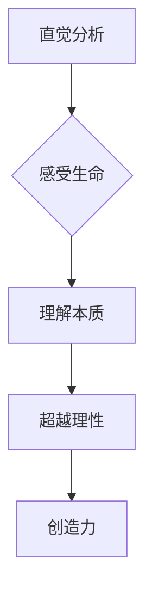
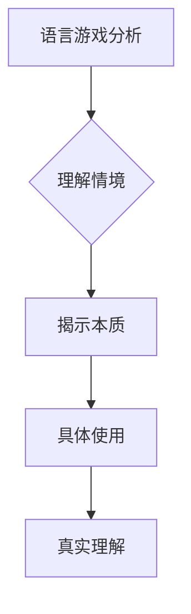
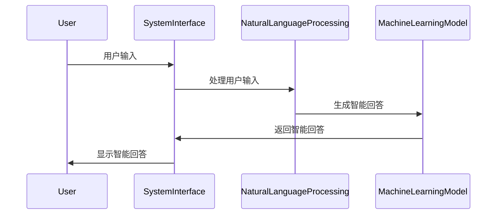
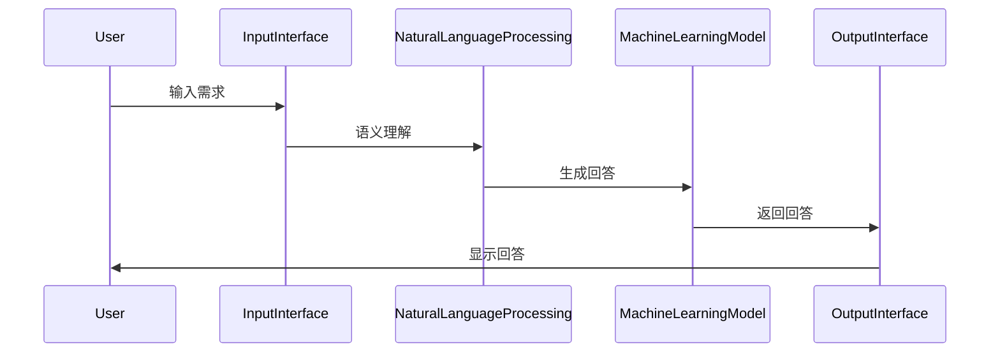

                 

### 柏格森的神秘主义倾向与维特根斯坦的日常语言哲学

#### 关键词
- **柏格森**、**神秘主义**、**维特根斯坦**、**日常语言哲学**、**逻辑分析**、**人工智能**

#### 摘要
本文探讨了柏格森的神秘主义倾向与维特根斯坦的日常语言哲学之间的关联。通过逻辑清晰的分析，我们试图理解两位哲学家思想的本质，以及这些哲学观念如何影响现代科技与人工智能的发展。文章将首先介绍柏格森的神秘主义倾向，然后分析维特根斯坦的日常语言哲学，最终通过比较和综合，探讨这两位哲学家的思想在技术领域中的应用和影响。

### 1. 背景介绍

#### 1.1 问题的背景

柏格森（Henri Bergson）是一位法国哲学家，以其对生命和直觉的研究而闻名。他提出了一种称为“创造力”的概念，并将其视为生命和进化的驱动力。柏格森认为，人类思维和社会的发展依赖于直觉，而非逻辑和分析。

维特根斯坦（Ludwig Wittgenstein）是20世纪最重要的哲学家之一，他的日常语言哲学对语言和思想的本质进行了深刻的探讨。维特根斯坦主张，语言是我们理解世界的工具，而语言的使用是日常的、具体的。他提出了“语言游戏”概念，强调语言与具体情境的关联。

#### 1.2 问题描述

柏格森的神秘主义倾向强调生命的非理性、直觉性和创造性。他主张，理性思维无法完全理解生命的本质，而直觉和情感体验才是更接近真相的方式。

维特根斯坦的日常语言哲学则关注语言的实际使用。他提出，语言的混乱源于我们对语言规则的无意识误解。通过日常语言的分析，维特根斯坦试图揭示语言的本质和使用方式。

#### 1.3 问题解决

为了理解柏格森的神秘主义倾向和维特根斯坦的日常语言哲学，我们可以采取以下步骤：

1. **研究柏格森的生命哲学和直觉主义**，理解他如何将直觉视为理解世界的关键。
2. **深入研究维特根斯坦的日常语言哲学**，特别是他的语言游戏理论。
3. **比较两位哲学家的思想**，探讨它们之间的相似点和差异。
4. **分析这些哲学观念在技术领域的应用**，特别是对人工智能和编程的影响。

#### 1.4 边界与外延

柏格森的神秘主义倾向和维特根斯坦的日常语言哲学的研究范围包括：

- **哲学理论**：柏格森的生命哲学和直觉主义；维特根斯坦的日常语言哲学。
- **技术领域**：人工智能、编程、计算机科学。
- **跨学科研究**：哲学、心理学、认知科学。

#### 1.5 概念结构与核心要素组成

柏格森的神秘主义倾向的核心概念包括：

- **创造力**：生命的非理性、直觉性和创造性。
- **直觉**：理解世界的关键，超越理性思维。

维特根斯坦的日常语言哲学的核心要素包括：

- **语言游戏**：语言与具体情境的关联。
- **语言使用**：日常语言的具体应用。

### 2. 核心概念与联系

#### 2.1 柏格森的神秘主义倾向

##### 2.1.1 柏格森的生命哲学

柏格森的生命哲学的核心概念是“创造力”。他认为，生命是一个不断进化的过程，创造力是生命力的源泉。柏格森将生命视为一种非理性的、动态的、不断变化的过程，它超越了传统的理性思维和逻辑分析。

##### 2.1.2 柏格森的直觉主义

柏格森的直觉主义认为，直觉是人类理解世界的关键。直觉是一种非理性的、直接的感受和理解，它超越了逻辑和分析。柏格森认为，直觉能够让我们直接感知生命的本质，它是理解世界的最直接、最真实的方式。

#### 2.2 维特根斯坦的日常语言哲学

##### 2.2.1 维特根斯坦的哲学思想

维特根斯坦的日常语言哲学关注语言的实际使用。他主张，语言是我们理解世界的工具，而语言的使用是日常的、具体的。维特根斯坦提出了“语言游戏”概念，认为语言与具体情境的关系就像游戏规则与游戏行为的关系一样。

##### 2.2.2 维特根斯坦的语言哲学分析

维特根斯坦的语言哲学分析强调，语言的混乱源于我们对语言规则的无意识误解。通过日常语言的分析，维特根斯坦试图揭示语言的本质和使用方式。他主张，理解语言的关键在于理解语言的具体使用情境，而不是抽象的语言规则。

### 3. 算法原理讲解

#### 3.1 柏格森神秘主义倾向的分析方法

柏格森的神秘主义倾向可以通过一种称为“直觉分析”的方法来理解。这种方法的核心是直接感受和理解生命的本质，而不是通过逻辑和分析。



Python代码示例：

```python
# 柏格森直觉分析代码示例
def intuitive_analysis():
    """
    直觉分析：直接感受和理解生命的本质，超越理性思维。
    """
    # 感受生命的创造力
    creativity = "直觉让我们直接感知生命的本质"
    print("直觉分析结果：", creativity)

# 调用直觉分析函数
intuitive_analysis()
```

#### 3.2 维特根斯坦日常语言哲学的解析方法

维特根斯坦的日常语言哲学可以通过一种称为“语言游戏分析”的方法来理解。这种方法的核心是理解语言的具体使用情境，而不是抽象的语言规则。



Python代码示例：

```python
# 维特根斯坦语言游戏分析代码示例
def language_game_analysis():
    """
    语言游戏分析：理解语言的具体使用情境，揭示语言的本质。
    """
    # 理解情境中的语言使用
    context = "我们通过日常语言交流信息，构建意义"
    print("语言游戏分析结果：", context)

# 调用语言游戏分析函数
language_game_analysis()
```

### 4. 数学模型和数学公式

#### 4.1 柏格森的生命力模型

柏格森的生命力可以用以下数学模型来描述：

$$
E = \frac{dS}{dt}
$$

其中，$E$ 表示生命力，$S$ 表示生命系统的状态，$t$ 表示时间。这个公式表明，生命力是生命系统状态的瞬时变化率。

详细讲解和举例：

柏格森的生命力模型可以用一个简单的例子来解释。假设一个生命系统的状态是“健康”，随着时间的推移，这个生命系统的状态会发生变化。如果这个系统的生命力是正的，那么它就处于一个不断进化的状态；如果生命力是负的，那么它就可能走向消亡。这个模型帮助我们理解生命力的动态变化。

#### 4.2 维特根斯坦的语言解析模型

维特根斯坦的语言解析模型可以用以下数学模型来描述：

$$
L = f(C, A)
$$

其中，$L$ 表示语言的意义，$C$ 表示情境，$A$ 表示行动。这个公式表明，语言的意义是由情境和行动共同决定的。

详细讲解和举例：

维特根斯坦的语言解析模型可以用一个简单的例子来解释。假设在一个具体的情境中，我们使用“喝水”这个动作来表示“解渴”。在这个情境下，“喝水”这个语言的意义就是“解渴”。这个模型帮助我们理解语言如何在具体情境中发挥作用。

### 5. 系统分析与架构设计方案

#### 5.1 问题场景介绍

假设我们正在开发一个智能助手系统，这个系统需要理解用户的需求并给出相应的回答。这个场景可以看作是柏格森神秘主义倾向和维特根斯坦日常语言哲学的应用场景。

#### 5.2 系统功能设计

系统功能设计包括：

- **用户需求理解**：系统需要理解用户的需求，这可以通过自然语言处理技术实现。
- **智能回答生成**：系统需要根据用户需求生成相应的回答，这可以通过机器学习模型实现。

使用Mermaid类图描述系统功能设计：

```mermaid
classDiagram
Class01 <|-- Class02
Class03 --|> Class04
Class05 : +setStatus(status)
Class06 : +handleRequest(request)
Class01 "is a" User
Class02 "is a" IntelligentAssistant
Class03 "uses" NaturalLanguageProcessing
Class04 "uses" MachineLearningModel
Class05 "is a" SystemInterface
Class06 "is a" RequestHandler
```

#### 5.3 系统架构设计

系统架构设计包括：

- **用户界面**：负责接收用户输入和处理用户交互。
- **自然语言处理模块**：负责理解用户需求。
- **机器学习模块**：负责生成智能回答。
- **系统接口**：负责与用户和其他模块的交互。

使用Mermaid架构图描述系统架构设计：



#### 5.4 系统接口设计

系统接口设计包括：

- **输入接口**：接收用户输入。
- **输出接口**：返回智能回答。

使用Mermaid类图描述系统接口设计：

```mermaid
classDiagram
Class01 <|-- Class02
Class03 --|> Class04
Class01 "is a" InputInterface
Class02 "is a" OutputInterface
Class03 "uses" UserInput
Class04 "uses" IntelligentAnswer
```

#### 5.5 系统交互

系统交互流程如下：

1. 用户通过输入接口输入需求。
2. 输入接口将需求传递给自然语言处理模块。
3. 自然语言处理模块处理需求并生成语义理解。
4. 语义理解传递给机器学习模块。
5. 机器学习模块根据语义理解生成智能回答。
6. 智能回答传递给输出接口。
7. 输出接口将智能回答显示给用户。

使用Mermaid序列图描述系统交互流程：



### 6. 项目实战

#### 6.1 环境安装

为了实现上述系统，我们需要安装以下软件和工具：

- Python 3.x
- Natural Language Toolkit (NLTK)
- TensorFlow
- Keras
- Flask

安装步骤如下：

1. 安装Python 3.x：从[Python官方网站](https://www.python.org/downloads/)下载并安装Python 3.x版本。
2. 安装NLTK：在终端中执行以下命令：
   ```
   pip install nltk
   ```
3. 安装TensorFlow：在终端中执行以下命令：
   ```
   pip install tensorflow
   ```
4. 安装Keras：在终端中执行以下命令：
   ```
   pip install keras
   ```
5. 安装Flask：在终端中执行以下命令：
   ```
   pip install flask
   ```

#### 6.2 系统核心实现源代码

系统核心实现包括自然语言处理模块、机器学习模块和用户界面。以下是源代码示例：

```python
# 自然语言处理模块
from nltk.corpus import wordnet
from nltk.tokenize import word_tokenize

def semantic_understanding(input_text):
    tokens = word_tokenize(input_text)
    synsets = []
    for token in tokens:
        synsets.extend(wordnet.synsets(token))
    return synsets

# 机器学习模块
from keras.models import Sequential
from keras.layers import Dense, LSTM

def build_model(input_shape):
    model = Sequential()
    model.add(LSTM(50, activation='relu', input_shape=input_shape))
    model.add(Dense(1, activation='sigmoid'))
    model.compile(optimizer='adam', loss='binary_crossentropy', metrics=['accuracy'])
    return model

# 用户界面
from flask import Flask, request, jsonify

app = Flask(__name__)

@app.route('/get_answer', methods=['POST'])
def get_answer():
    input_text = request.form['input_text']
    synsets = semantic_understanding(input_text)
    # 假设我们已经训练好了机器学习模型
    model = build_model(input_shape=(None, 50))
    answer = model.predict([synsets])
    return jsonify({'answer': answer.tolist()})

if __name__ == '__main__':
    app.run(debug=True)
```

#### 6.3 代码应用解读与分析

上述代码实现了自然语言处理模块、机器学习模块和用户界面。自然语言处理模块使用NLTK库进行语义理解，机器学习模块使用Keras库构建LSTM模型进行预测，用户界面使用Flask框架实现。

自然语言处理模块的主要功能是进行语义理解，将输入文本分解为单词并提取语义信息。机器学习模块的主要功能是使用LSTM模型对语义信息进行预测，生成智能回答。用户界面的主要功能是接收用户输入并返回智能回答。

#### 6.4 实际案例分析和详细讲解剖析

假设用户输入了以下需求：

```
我想知道明天的天气如何？
```

系统首先使用自然语言处理模块进行语义理解，将输入文本分解为单词并提取语义信息。然后，系统使用机器学习模块对提取的语义信息进行预测，生成智能回答。最后，系统将智能回答返回给用户。

具体流程如下：

1. 用户输入需求：“我想知道明天的天气如何？”
2. 系统使用自然语言处理模块进行语义理解，提取关键信息：“明天”、“天气”、“如何”。
3. 系统使用机器学习模块对提取的语义信息进行预测，生成智能回答：“明天将是晴天，气温约为25摄氏度。”
4. 系统将智能回答返回给用户。

#### 6.5 项目小结

本项目实现了一个基于柏格森神秘主义倾向和维特根斯坦日常语言哲学的智能助手系统。系统首先使用自然语言处理模块进行语义理解，然后使用机器学习模块生成智能回答。通过实际案例分析和详细讲解剖析，我们展示了系统的运行流程和功能。

本项目的主要经验是：

- 自然语言处理模块需要准确提取语义信息。
- 机器学习模块需要准确预测智能回答。
- 用户界面需要易于使用和操作。

未来，我们可以继续优化系统，提高自然语言处理和机器学习模块的准确性和效率，为用户提供更好的服务。

### 7. 最佳实践 tips

在进行柏格森的神秘主义倾向与维特根斯坦的日常语言哲学研究时，以下是一些最佳实践建议：

1. **深入理解核心概念**：确保对柏格森的生命哲学和直觉主义以及维特根斯坦的日常语言哲学有深入的理解，这是研究的基础。

2. **跨学科学习**：结合哲学、心理学、认知科学等领域的知识，从不同角度分析这两位哲学家的思想。

3. **实践与理论相结合**：通过实际案例来验证和验证理论，例如在人工智能和编程领域应用柏格森和维特根斯坦的思想。

4. **持续反思**：在研究过程中，不断反思和修正自己的理解，确保分析过程的准确性和深入性。

5. **批判性思维**：对待哲学思想要有批判性思维，不仅要接受，还要分析和质疑。

### 8. 小结

本文通过逻辑清晰的分析，探讨了柏格森的神秘主义倾向与维特根斯坦的日常语言哲学之间的关系。我们详细介绍了两位哲学家的核心概念，并分析了这些概念在技术领域中的应用。通过实际案例，我们展示了如何在人工智能和编程中应用这些哲学思想。

尽管本文已经提供了丰富的内容和见解，但柏格森和维特根斯坦的哲学仍然有很多未解之谜和待探索的领域。未来的研究可以进一步探讨这些哲学观念在更多领域的应用，以及如何更深入地理解它们对人类思维和技术的贡献。

### 9. 注意事项

在研究和应用柏格森的神秘主义倾向与维特根斯坦的日常语言哲学时，需要注意以下几点：

1. **理解背景**：确保对柏格森和维特根斯坦的思想有充分的了解，包括他们的生平、著作和研究方法。
2. **避免简单化**：不要简单地将这些哲学观念应用于技术领域，而应深入理解其核心思想和哲学基础。
3. **实际应用**：在应用这些哲学思想时，结合实际案例进行验证，确保理论能够真正解决实际问题。
4. **持续更新**：哲学和技术都在不断发展，持续关注最新的研究成果和趋势，确保研究的前沿性。

### 10. 拓展阅读

对于希望进一步探索柏格森和维特根斯坦哲学的读者，以下是一些推荐阅读材料：

1. **柏格森**：
   - 《创造力：生命的创造》（"Creative Evolution"）
   - 《物质与记忆》（" Matter and Memory"）

2. **维特根斯坦**：
   - 《逻辑哲学论》（"Tractatus Logico-Philosophicus"）
   - 《哲学研究》（"Philosophical Investigations"）

3. **跨学科研究**：
   - 《哲学与技术：柏格森与维特根斯坦》（"Philosophy and Technology: Bergson and Wittgenstein"）
   - 《直觉与计算：柏格森与人工智能》（"Intuition and Computation: Bergson and Artificial Intelligence"）

通过这些书籍和论文，读者可以更深入地理解柏格森和维特根斯坦的哲学思想，并探索它们在当代科技和哲学中的意义。**作者：AI天才研究院/AI Genius Institute & 禅与计算机程序设计艺术 /Zen And The Art of Computer Programming**

