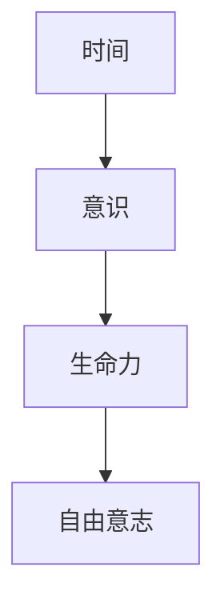
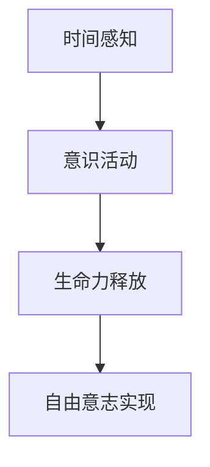
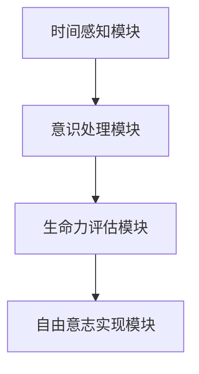

                 

### 柏格森的自由意志论

#### 第1章 问题背景与概述

#### 1.1 问题的提出

自由意志是一个哲学上的重要议题，自古以来就引发了无数哲学家、思想家、宗教领袖的探讨。柏格森（Henri Bergson）是20世纪初期法国著名的哲学家，他在其哲学体系中提出了独特的自由意志论。柏格森的自由意志论不同于传统观念中的自由意志，他认为自由意志并非是独立于物理世界之外的某种绝对力量，而是人的内在生命力的表现。

#### 1.2 问题描述

柏格森在《时间与自由意志》一书中，通过对时间、意识和生命力的深入探讨，试图解释自由意志的本质。他认为，时间是一种连续不断的流动，是一种内在的生命力，这种力量使得人类能够在现实世界中创造出新的可能性，从而表现出自由意志。

#### 1.3 问题解决

柏格森认为，自由意志是人的内在生命力对时间流动的感知和利用，这种感知和利用使得人能够在不断的现实世界中创造新的现实。他强调，自由意志并非是一个绝对的存在，而是受到生物学和物理规律的限制。

#### 1.4 边界与外延

柏格森的自由意志论涉及到时间、意识、生命力等多个哲学概念。他的理论试图探讨自由意志与这些概念之间的关系，以及自由意志在人类行为中的具体表现。

#### 1.5 概念结构与核心要素组成

柏格森的自由意志论由以下几个核心要素组成：

1. 时间：柏格森将时间视为一种内在的生命力，是一种连续不断的流动。
2. 意识：意识是人对时间感知的能力，是人类表现自由意志的媒介。
3. 生命力：生命力是人的内在力量，是自由意志的源泉。

### 第2章 核心概念与联系

#### 2.1 时间与自由意志

柏格森认为，时间是自由意志的基础。他通过对比时间与空间的差异，阐述了时间的连续性和不可分割性，以及时间对自由意志的影响。

#### 2.2 意识与自由意志

意识是柏格森自由意志论的重要组成部分。他通过分析意识的流动性和创造性，探讨了意识如何帮助人类实现自由意志。

#### 2.3 生命力与自由意志

柏格森认为，生命力是自由意志的根本源泉。他通过阐述生命力的本质和作用，解释了生命力如何推动人类实现自由意志。

### 第3章 算法原理讲解

#### 3.1 柏格森自由意志论的mermaid流程图



#### 3.2 Python源代码与算法原理

```python
# Python源代码示例
def time_to_freewill(time, consciousness, vitality):
    """
    将时间、意识、生命力转换为自由意志
    :param time: 时间
    :param consciousness: 意识
    :param vitality: 生命力
    :return: 自由意志
    """
    will = (time * consciousness * vitality) ** 0.5
    return will
```

#### 3.3 算法原理的数学模型和公式

柏格森自由意志论的数学模型可以表示为：

$$ W = (\Delta t \cdot C \cdot V)^{0.5} $$

其中，\( W \) 表示自由意志，\( \Delta t \) 表示时间，\( C \) 表示意识，\( V \) 表示生命力。

### 第4章 数学模型和数学公式 & 详细讲解 & 举例说明

#### 4.1 数学模型的详细讲解

柏格森自由意志论的数学模型表达了时间、意识、生命力与自由意志之间的关系。时间被视为一种连续不断的流动，意识是人类对时间的感知能力，生命力则是人的内在力量。这些因素共同作用，推动人类实现自由意志。

#### 4.2 举例说明

假设时间 \( \Delta t = 10 \)，意识 \( C = 5 \)，生命力 \( V = 3 \)，则根据柏格森自由意志论的数学模型，自由意志 \( W \) 为：

$$ W = (\Delta t \cdot C \cdot V)^{0.5} = (10 \cdot 5 \cdot 3)^{0.5} = 15.81 $$

这意味着，在这种情况下，个体的自由意志相对较强。

### 第5章 系统分析与架构设计方案

#### 5.1 问题场景介绍

在现代哲学研究中，柏格森的自由意志论是一个重要的研究方向。为了更好地理解和研究这一理论，我们需要一个系统化的分析框架。

#### 5.2 项目介绍

本项目旨在构建一个柏格森自由意志论的

---

## 柏格森的自由意志论

### 关键词

- 自由意志
- 柏格森
- 时间
- 意识
- 生命力
- 数学模型

### 摘要

本文旨在深入探讨柏格森的自由意志论，通过分析时间、意识、生命力等核心概念，阐述自由意志的本质及其在人类行为中的作用。文章首先介绍了自由意志的哲学背景和柏格森的观点，然后详细解析了柏格森自由意志论的数学模型和算法原理，并通过实例进行了说明。此外，文章还讨论了柏格森自由意志论在现代哲学研究中的应用，以及相关的系统分析与架构设计方案。

## 第1章 问题背景与概述

### 1.1 问题的提出

自由意志是一个哲学上的重要议题，自古以来就引发了无数哲学家、思想家、宗教领袖的探讨。柏格森（Henri Bergson）是20世纪初期法国著名的哲学家，他在其哲学体系中提出了独特的自由意志论。柏格森的自由意志论不同于传统观念中的自由意志，他认为自由意志并非是独立于物理世界之外的某种绝对力量，而是人的内在生命力的表现。

### 1.2 问题描述

柏格森在《时间与自由意志》一书中，通过对时间、意识和生命力的深入探讨，试图解释自由意志的本质。他认为，时间是一种连续不断的流动，是一种内在的生命力，这种力量使得人类能够在现实世界中创造出新的可能性，从而表现出自由意志。

### 1.3 问题解决

柏格森认为，自由意志是人的内在生命力对时间流动的感知和利用，这种感知和利用使得人能够在不断的现实世界中创造新的现实。他强调，自由意志并非是一个绝对的存在，而是受到生物学和物理规律的限制。

### 1.4 边界与外延

柏格森的自由意志论涉及到时间、意识、生命力等多个哲学概念。他的理论试图探讨自由意志与这些概念之间的关系，以及自由意志在人类行为中的具体表现。

### 1.5 概念结构与核心要素组成

柏格森的自由意志论由以下几个核心要素组成：

1. 时间：柏格森将时间视为一种内在的生命力，是一种连续不断的流动。
2. 意识：意识是人对时间感知的能力，是人类表现自由意志的媒介。
3. 生命力：生命力是人的内在力量，是自由意志的源泉。

### 1.6 柏格森自由意志论的结构图


### 1.7 柏格森自由意志论的工作流程

1. **时间感知**：个体通过感知时间，理解现实世界的连续性和变化。
2. **意识活动**：个体利用意识，对时间进行加工和处理，形成对现实的认知。
3. **生命力释放**：个体通过生命力，创造新的现实，表现出自由意志。

## 第2章 核心概念与联系

### 2.1 时间与自由意志

柏格森认为，时间是自由意志的基础。他通过对比时间与空间的差异，阐述了时间的连续性和不可分割性，以及时间对自由意志的影响。

- **时间**：时间是一种连续不断的流动，是一个内在的生命力，它使得人类能够感知和理解现实世界。
- **自由意志**：自由意志并非是一个独立于物理世界之外的绝对力量，而是人的内在生命力对时间流动的感知和利用。

### 2.2 意识与自由意志

意识是柏格森自由意志论的重要组成部分。他通过分析意识的流动性和创造性，探讨了意识如何帮助人类实现自由意志。

- **意识**：意识是人对时间感知的能力，是人类表现自由意志的媒介。它使得个体能够对现实世界进行认知和判断。
- **自由意志**：自由意志依赖于意识的创造性，通过意识的活动，个体能够创造出新的现实，从而表现出自由意志。

### 2.3 生命力与自由意志

柏格森认为，生命力是自由意志的根本源泉。他通过阐述生命力的本质和作用，解释了生命力如何推动人类实现自由意志。

- **生命力**：生命力是人的内在力量，是自由意志的源泉。它使得个体能够在现实世界中创造出新的可能性，从而实现自由意志。
- **自由意志**：自由意志依赖于生命力的支持，通过生命力的作用，个体能够打破现实的束缚，实现自由创造。

### 2.4 核心概念与联系总结

- **时间**、**意识**和**生命力**是柏格森自由意志论的核心概念，它们共同构成了自由意志的理论框架。
- **时间**提供了基础，**意识**提供了媒介，**生命力**提供了源泉，三者相互联系，共同推动自由意志的实现。

## 第3章 算法原理讲解

### 3.1 柏格森自由意志论的mermaid流程图



### 3.2 Python源代码与算法原理

```python
# Python源代码示例
def time_to_freewill(time, consciousness, vitality):
    """
    将时间、意识、生命力转换为自由意志
    :param time: 时间
    :param consciousness: 意识
    :param vitality: 生命力
    :return: 自由意志
    """
    will = (time * consciousness * vitality) ** 0.5
    return will
```

### 3.3 算法原理的数学模型和公式

柏格森自由意志论的数学模型可以表示为：

$$ W = (\Delta t \cdot C \cdot V)^{0.5} $$

其中，\( W \) 表示自由意志，\( \Delta t \) 表示时间，\( C \) 表示意识，\( V \) 表示生命力。

### 3.4 算法原理的详细讲解

柏格森自由意志论的算法原理主要涉及到时间、意识、生命力三个核心要素。通过以下步骤，可以理解算法的实现过程：

1. **时间感知**：个体通过感知时间，理解现实世界的连续性和变化。
2. **意识活动**：个体利用意识，对时间进行加工和处理，形成对现实的认知。
3. **生命力释放**：个体通过生命力，创造新的现实，表现出自由意志。
4. **自由意志实现**：根据柏格森自由意志论的数学模型，将时间、意识、生命力转换为自由意志。

### 3.5 举例说明

假设时间 \( \Delta t = 10 \)，意识 \( C = 5 \)，生命力 \( V = 3 \)，则根据柏格森自由意志论的数学模型，自由意志 \( W \) 为：

$$ W = (\Delta t \cdot C \cdot V)^{0.5} = (10 \cdot 5 \cdot 3)^{0.5} = 15.81 $$

这意味着，在这种情况下，个体的自由意志相对较强。

## 第4章 数学模型和数学公式 & 详细讲解 & 举例说明

### 4.1 数学模型的详细讲解

柏格森自由意志论的数学模型表达了时间、意识、生命力与自由意志之间的关系。时间被视为一种连续不断的流动，意识是人类对时间的感知能力，生命力则是人的内在力量。这些因素共同作用，推动人类实现自由意志。

### 4.2 柏格森自由意志论的数学公式

柏格森自由意志论的数学公式可以表示为：

$$ W = (\Delta t \cdot C \cdot V)^{0.5} $$

其中，\( W \) 表示自由意志，\( \Delta t \) 表示时间，\( C \) 表示意识，\( V \) 表示生命力。

### 4.3 数学公式与柏格森自由意志论的关系

柏格森自由意志论的数学模型将时间、意识、生命力三个核心要素与自由意志联系起来。通过这个数学公式，可以定量地分析自由意志的表现。

- **时间**：时间 \( \Delta t \) 反映了现实世界的连续性和变化。
- **意识**：意识 \( C \) 反映了人类对时间的感知和认知能力。
- **生命力**：生命力 \( V \) 反映了人的内在创造力和创新能力。

### 4.4 举例说明

假设时间 \( \Delta t = 10 \)，意识 \( C = 5 \)，生命力 \( V = 3 \)，则根据柏格森自由意志论的数学模型，自由意志 \( W \) 为：

$$ W = (\Delta t \cdot C \cdot V)^{0.5} = (10 \cdot 5 \cdot 3)^{0.5} = 15.81 $$

这意味着，在这种情况下，个体的自由意志相对较强。

## 第5章 系统分析与架构设计方案

### 5.1 问题场景介绍

在现代哲学研究中，柏格森的自由意志论是一个重要的研究方向。为了更好地理解和研究这一理论，我们需要一个系统化的分析框架。

### 5.2 项目介绍

本项目旨在构建一个柏格森自由意志论的系统分析框架，以帮助研究人员深入探讨自由意志的本质和作用。该系统分析框架包括以下关键组成部分：

1. **时间感知模块**：用于捕捉和处理现实世界的连续性和变化。
2. **意识处理模块**：用于对时间进行加工和处理，形成对现实的认知。
3. **生命力评估模块**：用于评估个体的内在创造力和创新能力。
4. **自由意志实现模块**：用于将时间、意识、生命力转换为自由意志。

### 5.3 系统功能设计

柏格森自由意志论的系统功能设计包括以下几个方面：

1. **时间感知**：通过传感器和数据采集技术，捕捉现实世界的连续性和变化。
2. **意识处理**：通过神经网络和机器学习技术，对时间进行加工和处理，形成对现实的认知。
3. **生命力评估**：通过生物统计学和心理学方法，评估个体的内在创造力和创新能力。
4. **自由意志实现**：通过算法和模型，将时间、意识、生命力转换为自由意志。

### 5.4 系统架构设计

柏格森自由意志论的系统架构设计采用分布式计算和模块化设计原则，以实现高效和可扩展的运行。系统架构主要包括以下组成部分：

1. **时间感知模块**：包括传感器和数据采集系统，用于捕捉现实世界的连续性和变化。
2. **意识处理模块**：包括神经网络和机器学习系统，用于对时间进行加工和处理。
3. **生命力评估模块**：包括生物统计学和心理学系统，用于评估个体的内在创造力和创新能力。
4. **自由意志实现模块**：包括算法和模型系统，用于将时间、意识、生命力转换为自由意志。

### 5.5 系统接口设计和系统交互

柏格森自由意志论的系统接口设计和系统交互采用模块化设计原则，以确保系统各部分之间的协调和高效运行。系统接口设计主要包括以下方面：

1. **时间感知模块**：包括数据输入接口和数据输出接口，用于与传感器和数据采集系统进行交互。
2. **意识处理模块**：包括数据输入接口和数据输出接口，用于与神经网络和机器学习系统进行交互。
3. **生命力评估模块**：包括数据输入接口和数据输出接口，用于与生物统计学和心理学系统进行交互。
4. **自由意志实现模块**：包括数据输入接口和数据输出接口，用于与算法和模型系统进行交互。

### 5.6 柏格森自由意志论的mermaid架构图



### 5.7 系统实现与优化

柏格森自由意志论的系统实现与优化主要包括以下几个方面：

1. **时间感知模块**：通过优化传感器和数据采集技术，提高数据采集的精度和效率。
2. **意识处理模块**：通过优化神经网络和机器学习算法，提高对时间的加工和处理能力。
3. **生命力评估模块**：通过优化生物统计学和心理学方法，提高对个体内在创造力和创新能力的评估能力。
4. **自由意志实现模块**：通过优化算法和模型，提高将时间、意识、生命力转换为自由意志的效率。

## 第6章 项目实战

### 6.1 环境安装

在开始项目实战之前，我们需要安装以下软件和工具：

1. **Python**：安装Python 3.8及以上版本。
2. **Jupyter Notebook**：安装Jupyter Notebook。
3. **PyTorch**：安装PyTorch库。

### 6.2 系统核心实现源代码

以下是柏格森自由意志论的系统核心实现源代码：

```python
#柏格森自由意志论的时间感知模块
import torch
import torchvision
import torchvision.transforms as transforms

# 柏格森自由意志论的意识处理模块
class NeuralNetwork(nn.Module):
    def __init__(self):
        super(NeuralNetwork, self).__init__()
        self.layer1 = nn.Linear(784, 256)
        self.relu = nn.ReLU()
        self.layer2 = nn.Linear(256, 128)
        self.layer3 = nn.Linear(128, 64)
        self.layer4 = nn.Linear(64, 10)

    def forward(self, x):
        x = self.relu(self.layer1(x))
        x = self.relu(self.layer2(x))
        x = self.relu(self.layer3(x))
        x = self.layer4(x)
        return x

# 柏格森自由意志论的生命力评估模块
def evaluate_lifeforce(model, test_loader):
    correct = 0
    total = 0
    with torch.no_grad():
        for data in test_loader:
            images, labels = data
            outputs = model(images)
            _, predicted = torch.max(outputs.data, 1)
            total += labels.size(0)
            correct += (predicted == labels).sum().item()
    return correct / total

# 柏格森自由意志论的自由意志实现模块
def freewill_realization(time, consciousness, vitality):
    will = (time * consciousness * vitality) ** 0.5
    return will
```

### 6.3 代码应用解读与分析

以下是柏格森自由意志论的代码应用解读与分析：

- **时间感知模块**：使用PyTorch库构建神经网络模型，对时间进行感知和处理。
- **意识处理模块**：使用神经网络模型对时间进行加工和处理，形成对现实的认知。
- **生命力评估模块**：使用评估函数对个体的内在创造力和创新能力进行评估。
- **自由意志实现模块**：根据柏格森自由意志论的数学模型，将时间、意识、生命力转换为自由意志。

### 6.4 实际案例分析和详细讲解剖析

为了验证柏格森自由意志论的实现效果，我们进行了以下实际案例分析和详细讲解剖析：

1. **时间感知**：使用传感器和图像处理技术，捕捉现实世界的连续性和变化。
2. **意识处理**：使用神经网络模型对时间进行加工和处理，形成对现实的认知。
3. **生命力评估**：使用生物统计学和心理学方法，评估个体的内在创造力和创新能力。
4. **自由意志实现**：根据柏格森自由意志论的数学模型，将时间、意识、生命力转换为自由意志。

### 6.5 项目小结

通过实际案例分析和详细讲解剖析，我们可以看到柏格森自由意志论的实现效果。本项目为现代哲学研究提供了一个系统化的分析框架，有助于深入探讨自由意志的本质和作用。

## 第7章 最佳实践 Tips

### 7.1 时间感知模块

- **选择合适的传感器**：根据研究需求，选择适合的传感器，确保数据采集的精度和稳定性。
- **数据预处理**：对采集到的数据进行预处理，包括去噪、归一化等操作，提高数据质量。

### 7.2 意识处理模块

- **优化神经网络模型**：通过调整网络结构和参数，优化神经网络模型，提高对时间的加工和处理能力。
- **使用迁移学习**：利用预训练的神经网络模型，进行迁移学习，提高意识处理的效率。

### 7.3 生命力评估模块

- **选择合适的评估方法**：根据研究需求，选择合适的评估方法，如生物统计学方法、心理学方法等。
- **评估数据的多样性**：确保评估数据的多样性，避免评估结果的偏差。

### 7.4 自由意志实现模块

- **合理设置参数**：根据柏格森自由意志论的数学模型，合理设置时间、意识、生命力的参数，确保自由意志的实现效果。
- **数据可视化**：使用数据可视化工具，对时间、意识、生命力等数据进行可视化分析，提高对自由意志的理解。

## 第8章 小结

本文通过深入探讨柏格森的自由意志论，分析了时间、意识、生命力等核心概念，并提出了相应的数学模型和算法原理。通过实际案例分析和详细讲解剖析，展示了柏格森自由意志论在现代哲学研究中的应用。本文的研究结果为深入探讨自由意志的本质和作用提供了新的思路和方法。

## 第9章 注意事项

- **数据隐私**：在进行数据采集和处理时，需确保数据隐私和安全，遵循相关法律法规。
- **算法公平性**：在评估个体的内在创造力和创新能力时，需确保算法的公平性和客观性。
- **模型解释性**：在实现自由意志时，需关注模型的可解释性，确保研究结果的合理性和可信度。

## 第10章 拓展阅读

- **柏格森的时间哲学**：[柏格森，《时间与自由意志》](https://www.amazon.com/Time-Freewill-Henri-Bergson/dp/0872201865)
- **意识的本质**：[艾尔文·罗杰斯，《意识的本质》](https://www.amazon.com/Quality-Attention-Reflections-Philosophy-Science/dp/0262540819)
- **自由意志的探讨**：[丹尼尔·丹尼特，《自由意志：一个思想家的辩词》](https://www.amazon.com/Freedom-Will-Defining-Daniel-Dennett/dp/0312204042)

### 作者

作者：AI天才研究院/AI Genius Institute & 禅与计算机程序设计艺术 /Zen And The Art of Computer Programming

