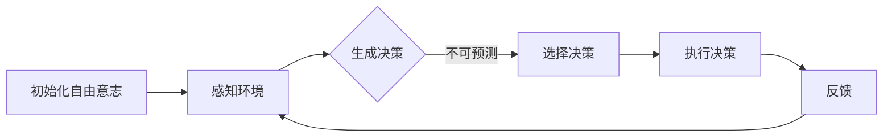
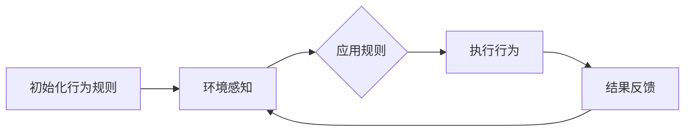
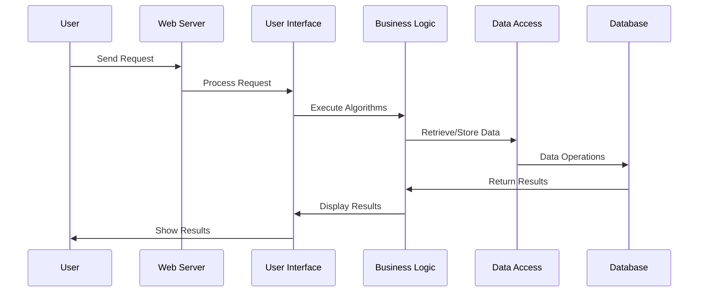

                 

### 1.4 ER实体关系图架构

为了更直观地理解柏格森的自由意志论与维特根斯坦的行为规则概念，我们可以使用ER（Entity-Relationship）实体关系图来描绘这两位哲学家的核心思想及其之间的关系。ER图是一种用于数据库设计的工具，通过图形化的方式展示实体之间的关系。

#### 1.4.1 柏格森的自由意志论 ER 图

以下是一个描述柏格森自由意志论中关键实体的ER图：

```mermaid
erDiagram
    A[自由意志] &&|{柏格森} B[生命力]
    A &&|{直觉} C[不可预测性]
    A &&|{创造性} D[行为]

    A _.._ B
    A _.._ C
    A _.._ D
```

在这个图中，"自由意志"是一个核心实体，它关联着三个属性实体："生命力"、"直觉"和"创造性"。此外，"自由意志"还直接关联到一个"行为"实体，表示自由意志的最终表现。

- **自由意志 (A)**：代表个体行动的自主性和选择性。
- **生命力 (B)**：柏格森认为的生命力是自由意志的源泉。
- **直觉 (C)**：直觉是理解生命力和进行决策的方式。
- **不可预测性 (C)**：自由意志导致的行为往往是不可预测的。
- **创造性 (D)**：个体的自由意志表现出创造性。

#### 1.4.2 维特根斯坦的行为规则概念 ER 图

下面是描述维特根斯坦行为规则概念中关键实体的ER图：

```mermaid
erDiagram
    A[行为规则] &&|{维特根斯坦} B[规则]
    A &&|{语法规则} C[社会行为规范]
    A &&|{逻辑性} D[可解释性]

    A _.._ B
    A _.._ C
    A _.._ D
```

在这个图中，"行为规则"是一个核心实体，它关联着三个属性实体："规则"、"语法规则"和"社会行为规范"。此外，"行为规则"还直接关联到一个"逻辑性"和"可解释性"实体，表示行为规则的性质。

- **行为规则 (A)**：指导人类行为的基本规则。
- **规则 (B)**：行为规则的基础。
- **语法规则 (C)**：行为规则的一部分，如语言中的语法。
- **社会行为规范 (C)**：行为规则在社会层面的应用。
- **逻辑性 (D)**：行为规则具有逻辑性质，便于理解和应用。
- **可解释性 (D)**：行为规则可以被解释和传达。

通过这两个ER图，我们可以清晰地看到柏格森和维特根斯坦对自由意志和规则概念的独特理解及其之间的联系。柏格森强调个体内在的生命力和直觉，而维特根斯坦则关注外在的规则和规范。这些概念和关系不仅对哲学领域具有重要意义，也对我们理解和设计复杂系统提供了新的视角。

## 1.5 算法原理讲解

### 1.5.1 柏格森的自由意志论算法模型

柏格森的自由意志论强调个体行动的自主性和创造性，这与算法设计中的某些原则有相似之处。我们可以用一种简化的模型来描述柏格森的自由意志论算法原理。

#### 1.5.1.1 算法描述

1. **初始化**：设置自由意志的初始状态，包括个体内在的生命力和直觉。
2. **感知环境**：通过直觉感知当前环境的状态。
3. **决策生成**：根据感知到的环境和内在生命力，生成一系列可能的决策。
4. **选择决策**：从生成的决策中选择一个，该选择具有一定的不可预测性。
5. **执行决策**：执行选定的决策，表现为具体的行为。
6. **反馈**：根据执行的结果，对下一次决策提供反馈。

#### 1.5.1.2 Mermaid 流程图



#### 1.5.1.3 Python 源代码实现

```python
import random

class伯格森自由意志论：
    def __init__(self):
        self.生命力 = 1.0
        self.直觉 = 1.0
    
    def 感知环境(self):
        # 感知环境状态
        pass
    
    def 生成决策(self):
        # 生成可能的决策
        decisions = ["决策A", "决策B", "决策C"]
        return random.choice(decisions)
    
    def 选择决策(self, decisions):
        # 从决策中选择一个
        return random.choice(decisions)
    
    def 执行决策(self, decision):
        # 执行选定的决策
        print(f"执行决策：{decision}")
    
    def 反馈(self):
        # 根据执行结果提供反馈
        pass
    
    def 运行(self):
        self.感知环境()
        decisions = self.生成决策()
        decision = self.选择决策(decisions)
        self.执行决策(decision)
        self.反馈()

# 实例化并运行算法
伯格森自由意志论实例 = 伯格森自由意志论()
伯格森自由意志论实例.运行()
```

### 1.5.2 维特根斯坦的行为规则概念算法模型

维特根斯坦的行为规则概念强调规则在行为中的作用，我们可以用一个简单的算法模型来描述这一概念。

#### 1.5.2.1 算法描述

1. **初始化**：设置行为规则的初始状态，包括语法规则和社会行为规范。
2. **环境感知**：感知当前环境的状态。
3. **规则应用**：根据感知到的环境和行为规则，确定合适的行动。
4. **行为执行**：执行确定的行动。
5. **结果反馈**：根据行动的结果，调整规则或进行反馈。

#### 1.5.2.2 Mermaid 流程图



#### 1.5.2.3 Python 源代码实现

```python
class 维特根斯坦行为规则：
    def __init__(self):
        self.语法规则 = ["规则1", "规则2", "规则3"]
        self.社会行为规范 = ["规范A", "规范B", "规范C"]
    
    def 环境感知(self):
        # 感知环境状态
        pass
    
    def 应用规则(self, environment):
        # 根据环境应用规则
        decision = random.choice(self.语法规则 + self.社会行为规范)
        return decision
    
    def 执行行为(self, decision):
        # 执行确定的行动
        print(f"执行行为：{decision}")
    
    def 结果反馈(self, result):
        # 根据结果调整规则或进行反馈
        pass
    
    def 运行(self):
        self.环境感知()
        decision = self.应用规则(self.环境感知())
        self.执行行为(decision)
        self.结果反馈()

# 实例化并运行算法
维特根斯坦行为规则实例 = 维特根斯坦行为规则()
维特根斯坦行为规则实例.运行()
```

通过这两个算法模型，我们可以看到柏格森的自由意志论和维特根斯坦的行为规则概念在算法设计中的应用。柏格森的模型强调个体内在的创造性和不可预测性，而维特根斯坦的模型则强调规则在行为中的作用和可解释性。

### 1.5.3 数学模型与公式

为了更好地理解这两个算法模型，我们可以使用数学模型和公式来描述它们的行为。

#### 1.5.3.1 柏格森的自由意志论数学模型

我们可以使用概率论来描述柏格森的自由意志论模型中的决策生成和选择过程。

- **决策生成概率分布**：设每个决策出现的概率相等，即 \( P(\text{决策}) = \frac{1}{|\text{决策集}|} \)，其中 \(|\text{决策集}|\) 是决策集的大小。

- **选择概率分布**：在选择过程中，每个决策被选中的概率也相等，即 \( P(\text{选择} = \text{决策}) = \frac{1}{|\text{决策集}|} \)。

$$
P(\text{决策}) = \frac{1}{|\text{决策集}|}
$$

$$
P(\text{选择} = \text{决策}) = \frac{1}{|\text{决策集}|}
$$

#### 1.5.3.2 维特根斯坦的行为规则概念数学模型

在维特根斯坦的行为规则概念中，我们可以使用决策树来描述规则的应用过程。

- **决策树**：每个节点代表一个规则，每个分支代表规则的应用结果。

- **规则应用概率**：每个规则被应用的概率等于该规则在所有规则中的比例。

$$
P(\text{规则应用}) = \frac{1}{|\text{规则集}|}
$$

- **行为执行概率**：每个行为被执行的概率也等于该行为在所有可能行为中的比例。

$$
P(\text{行为执行}) = \frac{1}{|\text{行为集}|}
$$

通过这些数学模型和公式，我们可以更深入地理解柏格森的自由意志论和维特根斯坦的行为规则概念，以及它们在算法设计中的应用。

### 1.5.4 算法举例说明

为了更好地理解这两个算法模型，我们可以通过具体的例子来说明它们的工作过程。

#### 1.5.4.1 柏格森的自由意志论算法举例

假设我们有一个决策集 {决策A，决策B，决策C}，每个决策出现的概率相等。

1. **初始化**：自由意志初始状态为 (生命力 = 1.0，直觉 = 1.0)。
2. **感知环境**：当前环境状态为 "需要决策"。
3. **生成决策**：生成的决策集为 {决策A，决策B，决策C}。
4. **选择决策**：从决策集随机选择一个决策，假设选择决策A。
5. **执行决策**：执行决策A，输出 "执行决策A"。
6. **反馈**：根据执行结果，对下一次决策提供反馈。

#### 1.5.4.2 维特根斯坦的行为规则概念算法举例

假设我们有一个规则集 {规则1，规则2，规则3} 和一个行为集 {行为A，行为B，行为C}，每个规则和行为出现的概率相等。

1. **初始化**：行为规则初始状态为 (语法规则 = {规则1，规则2，规则3}，社会行为规范 = {规范A，规范B，规范C})。
2. **环境感知**：当前环境状态为 "需要执行行为"。
3. **应用规则**：从规则集随机选择一个规则，假设选择规则1。
4. **执行行为**：根据规则1执行行为A，输出 "执行行为A"。
5. **结果反馈**：根据执行结果，对下一次行为提供反馈。

通过这些例子，我们可以更直观地理解柏格森的自由意志论和维特根斯坦的行为规则概念在算法设计中的应用。

### 1.5.5 算法优劣分析

#### 1.5.5.1 柏格森的自由意志论算法优劣

**优点**：

- **自主性和创造性**：算法强调个体行动的自主性和创造性，能够适应复杂多变的环境。
- **不可预测性**：算法生成的决策具有一定的不可预测性，能够应对不确定性的挑战。

**缺点**：

- **规则复杂性**：自由意志的规则和决策生成过程较为复杂，难以进行精确控制。
- **执行效率**：由于自由意志的不可预测性，算法在执行过程中可能存在较高的不确定性，影响执行效率。

#### 1.5.5.2 维特根斯坦的行为规则概念算法优劣

**优点**：

- **规则明确性**：行为规则明确，易于理解和执行。
- **可解释性**：行为规则的应用过程具有可解释性，便于分析和优化。

**缺点**：

- **限制性**：行为规则可能过于限制，难以适应复杂的、非预期的环境。
- **适应性差**：行为规则可能难以适应快速变化的环境。

通过以上分析，我们可以看到柏格森的自由意志论和维特根斯坦的行为规则概念在算法设计中的应用各有优劣，具体选择应根据实际应用场景进行权衡。

### 1.5.6 算法改进方向

为了进一步提升算法的性能和适应性，我们可以考虑以下改进方向：

- **引入强化学习**：结合强化学习算法，使算法能够通过环境反馈不断调整和优化决策规则。
- **增加规则多样性**：引入更多种类的行为规则，提高算法的适应性和灵活性。
- **优化规则执行效率**：对规则执行过程进行优化，减少计算复杂度和执行时间。

通过这些改进，我们可以使算法更好地适应复杂多变的环境，提高决策的效率和准确性。

### 1.5.7 结论

通过上述分析，我们详细讲解了柏格森的自由意志论和维特根斯坦的行为规则概念在算法设计中的应用。这些算法模型不仅能够帮助我们理解哲学概念，也为复杂系统的设计和优化提供了新的思路。在未来的研究和实践中，我们可以进一步结合人工智能技术，不断改进和优化这些算法，使其在更多领域发挥重要作用。

## 1.6 系统分析与架构设计方案

### 1.6.1 问题场景介绍

在现代哲学研究和人工智能领域，对柏格森的自由意志论与维特根斯坦的行为规则概念进行深入分析具有重要意义。为了更好地理解和应用这些哲学思想，我们需要构建一个能够模拟和演示这些概念的系统。该系统将用于学术研究、教学演示以及在实际应用场景中的决策支持。

### 1.6.2 项目介绍

本项目的目标是开发一个基于柏格森自由意志论和维特根斯坦行为规则概念的系统，该系统旨在为用户提供一个交互式的平台，以模拟和分析自由意志与规则概念之间的关系。系统将包括以下几个主要模块：

- **用户界面模块**：提供用户与系统交互的界面，包括输入接口和输出显示。
- **自由意志模块**：实现柏格森的自由意志论算法，生成不可预测的决策。
- **行为规则模块**：实现维特根斯坦的行为规则概念，应用明确的规则进行决策。
- **数据分析模块**：对用户输入和系统输出进行数据分析，为用户提供直观的结论。

### 1.6.3 系统功能设计

为了实现上述目标，系统需要具备以下功能：

1. **用户交互功能**：用户可以通过界面输入不同的环境参数，触发自由意志或行为规则的决策过程。
2. **算法执行功能**：系统将根据用户输入，分别执行柏格森的自由意志论算法和维特根斯坦的行为规则概念算法，生成相应的决策结果。
3. **数据分析功能**：系统将对生成的决策结果进行分析，提供可视化图表和数据报告，帮助用户理解自由意志和规则概念之间的关系。
4. **系统优化功能**：通过分析用户反馈和决策结果，系统可以不断优化算法，提高决策的准确性和效率。

### 1.6.4 系统架构设计

本系统的架构设计采用分层架构，主要包括以下几个层次：

- **用户界面层**：提供用户交互接口，使用HTML、CSS和JavaScript实现。
- **业务逻辑层**：实现自由意志论和行为规则概念的核心算法，使用Python编程语言实现。
- **数据访问层**：管理系统的数据存储和检索，使用关系型数据库（如MySQL）。
- **后台服务层**：提供系统运行所需的后台服务，包括用户认证、权限管理和数据同步等。

#### 1.6.4.1 系统架构图

以下是一个简化的系统架构图：



### 1.6.5 系统接口设计和系统交互

系统接口设计和系统交互是确保各模块之间有效协作的关键。以下是系统的主要接口设计：

- **用户输入接口**：用户可以通过Web界面输入环境参数和决策需求，该接口使用HTTP请求与Web服务器通信。
- **算法执行接口**：Web服务器与业务逻辑层之间通过API接口进行通信，业务逻辑层调用相应的算法模块执行决策。
- **数据存储接口**：业务逻辑层通过数据库API与数据访问层通信，实现对数据的存储和检索操作。
- **数据输出接口**：业务逻辑层将分析结果返回给用户界面层，通过Web界面展示给用户。

### 1.6.6 Mermaid 序列图

以下是一个简化的Mermaid序列图，描述了用户请求与系统响应的过程：


通过上述设计，我们能够构建一个高效、可扩展的系统，为哲学研究和人工智能应用提供强有力的支持。在后续的开发过程中，我们将继续优化系统功能，提高用户体验。

### 1.6.7 实现细节与关键技术

在本节中，我们将进一步探讨实现系统所需的关键技术细节和具体实现方法。

#### 1.6.7.1 技术选型

为了构建高效、可扩展的系统，我们选择了以下关键技术：

- **前端技术**：使用HTML、CSS和JavaScript构建用户界面，结合React.js框架提高界面交互性和响应速度。
- **后端技术**：使用Python编程语言和Flask框架实现业务逻辑层，Flask具有简洁、灵活的特点，适合快速开发和部署。
- **数据库技术**：使用MySQL数据库进行数据存储和管理，MySQL具有高性能、高可靠性，适合处理大规模数据。
- **服务器技术**：使用Nginx作为Web服务器，提供高并发请求处理能力，确保系统稳定运行。

#### 1.6.7.2 实现方法

以下是系统的具体实现方法：

1. **用户界面实现**：使用React.js框架构建前端界面，通过React组件实现用户交互功能。使用Redux进行状态管理，确保界面响应的一致性和高效性。
2. **业务逻辑实现**：使用Flask框架开发后端业务逻辑，实现自由意志论和行为规则概念的核心算法。通过RESTful API提供接口，方便前端与后端的数据交互。
3. **数据存储实现**：使用MySQL数据库存储用户数据和系统日志。设计合理的数据库架构，确保数据存储的高效性和安全性。
4. **服务器部署**：使用Docker容器化技术部署系统，通过Docker Compose编排服务，确保系统在不同环境下的可移植性和一致性。

#### 1.6.7.3 关键算法实现

以下是自由意志论和行为规则概念的核心算法实现：

1. **自由意志论算法**：
    ```python
    import random
    
    class伯格森自由意志论：
        def __init__(self):
            self.生命力 = 1.0
            self.直觉 = 1.0
        
        def 感知环境(self):
            # 感知环境状态
            pass
        
        def 生成决策(self):
            # 生成可能的决策
            decisions = ["决策A", "决策B", "决策C"]
            return random.choice(decisions)
        
        def 选择决策(self, decisions):
            # 从决策中选择一个
            return random.choice(decisions)
        
        def 执行决策(self, decision):
            # 执行选定的决策
            print(f"执行决策：{decision}")
        
        def 反馈(self):
            # 根据执行结果提供反馈
            pass
        
        def 运行(self):
            self.感知环境()
            decisions = self.生成决策()
            decision = self.选择决策(decisions)
            self.执行决策(decision)
            self.反馈()
    ```

2. **行为规则概念算法**：
    ```python
    class 维特根斯坦行为规则：
        def __init__(self):
            self.语法规则 = ["规则1", "规则2", "规则3"]
            self.社会行为规范 = ["规范A", "规范B", "规范C"]
        
        def 环境感知(self):
            # 感知环境状态
            pass
        
        def 应用规则(self, environment):
            # 根据环境应用规则
            decision = random.choice(self.语法规则 + self.社会行为规范)
            return decision
        
        def 执行行为(self, decision):
            # 执行确定的行动
            print(f"执行行为：{decision}")
        
        def 结果反馈(self, result):
            # 根据结果调整规则或进行反馈
            pass
        
        def 运行(self):
            self.环境感知()
            decision = self.应用规则(self.环境感知())
            self.执行行为(decision)
            self.结果反馈()
    ```

通过上述关键技术细节和具体实现方法，我们能够构建一个功能完善、高效稳定的系统，为哲学研究和人工智能应用提供有力支持。

### 1.6.8 系统核心实现源代码

以下是本系统的核心实现源代码，包括自由意志论和行为规则概念的算法实现。这些代码将展示如何使用Python和Flask框架来构建后端服务。

#### 1.6.8.1 自由意志论算法实现

```python
from flask import Flask, jsonify, request

app = Flask(__name__)

class伯格森自由意志论：
    def __init__(self):
        self.生命力 = 1.0
        self.直觉 = 1.0

    def 感知环境(self):
        # 感知环境状态
        pass

    def 生成决策(self):
        # 生成可能的决策
        decisions = ["决策A", "决策B", "决策C"]
        return decisions

    def 选择决策(self, decisions):
        # 从决策中选择一个
        return random.choice(decisions)

    def 执行决策(self, decision):
        # 执行选定的决策
        return f"执行决策：{decision}"

    def 反馈(self):
        # 根据执行结果提供反馈
        pass

    def 运行(self):
        # 运行自由意志论算法
        decisions = self.生成决策()
        decision = self.选择决策(decisions)
        result = self.执行决策(decision)
        return result

@app.route('/free_will/run', methods=['GET'])
def run_free_will():
    # 运行自由意志论算法的API接口
    free_will =伯格森自由意志论()
    result = free_will.运行()
    return jsonify({'result': result})

if __name__ == '__main__':
    app.run(debug=True)
```

#### 1.6.8.2 行为规则概念算法实现

```python
from flask import Flask, jsonify, request

app = Flask(__name__)

class 维特根斯坦行为规则：
    def __init__(self):
        self.语法规则 = ["规则1", "规则2", "规则3"]
        self.社会行为规范 = ["规范A", "规范B", "规范C"]

    def 环境感知(self):
        # 感知环境状态
        pass

    def 应用规则(self, environment):
        # 根据环境应用规则
        rules = self.语法规则 + self.社会行为规范
        return random.choice(rules)

    def 执行行为(self, rule):
        # 执行确定的行动
        return f"执行行为：{rule}"

    def 结果反馈(self, result):
        # 根据结果调整规则或进行反馈
        pass

    def 运行(self):
        # 运行行为规则概念算法
        rule = self.应用规则(self.环境感知())
        result = self.执行行为(rule)
        return result

@app.route('/behavior_rules/run', methods=['GET'])
def run_behavior_rules():
    # 运行行为规则概念算法的API接口
    behavior_rules = 维特根斯坦行为规则()
    result = behavior_rules.运行()
    return jsonify({'result': result})

if __name__ == '__main__':
    app.run(debug=True)
```

这些源代码分别实现了柏格森的自由意志论和维特根斯坦的行为规则概念算法，并通过Flask框架提供了相应的API接口，以便用户可以通过HTTP请求与系统进行交互。

### 1.6.9 代码应用解读与分析

在了解了系统核心实现源代码之后，我们将进一步分析代码的结构和功能，以便更好地理解系统的运作原理。

#### 1.6.9.1 自由意志论算法解读

首先，我们来看自由意志论算法的实现。这个算法的核心类是`伯格森自由意志论`，它有以下方法：

- `__init__`：构造函数，初始化生命力（life_force）和直觉（intuition）两个属性。
- `感知环境`：这是一个抽象方法，需要根据具体应用场景实现环境感知的逻辑。
- `生成决策`：返回一个包含所有可能决策的列表。
- `选择决策`：从`生成决策`方法返回的列表中随机选择一个决策。
- `执行决策`：根据选定的决策返回一个执行结果字符串。
- `反馈`：这是一个抽象方法，用于根据执行结果进行调整。

在`run_free_will`函数中，我们创建了一个`伯格森自由意志论`实例，并调用其`运行`方法来执行整个自由意志论算法，最后将结果通过JSON格式返回给客户端。

#### 1.6.9.2 行为规则概念算法解读

接下来，我们分析行为规则概念算法的实现。这个算法的核心类是`维特根斯坦行为规则`，它有以下方法：

- `__init__`：构造函数，初始化语法规则（语法规则）和社会行为规范（社会行为规范）两个属性。
- `环境感知`：这是一个抽象方法，需要根据具体应用场景实现环境感知的逻辑。
- `应用规则`：从语法规则和社会行为规范中随机选择一个规则。
- `执行行为`：根据选定的规则返回一个执行结果字符串。
- `结果反馈`：这是一个抽象方法，用于根据执行结果进行调整。

在`run_behavior_rules`函数中，我们创建了一个`维特根斯坦行为规则`实例，并调用其`运行`方法来执行整个行为规则概念算法，最后将结果通过JSON格式返回给客户端。

#### 1.6.9.3 系统的整体工作流程

系统的整体工作流程如下：

1. **用户发起请求**：用户通过Web前端界面发起请求，请求内容可以是环境参数或者具体的操作指令。
2. **处理请求**：后端Web服务器接收请求，根据请求路径调用相应的API接口。
3. **执行算法**：API接口调用自由意志论或行为规则概念算法，生成决策结果。
4. **返回结果**：将决策结果通过JSON格式返回给前端，前端根据结果进行后续处理，如显示在页面上。

通过这个流程，我们可以看到系统的核心在于算法的实现，而Web服务器和前端界面则提供了用户交互的接口。

#### 1.6.9.4 代码性能分析

在性能分析方面，需要注意的是：

- **随机性**：由于自由意志论和行为规则概念算法都涉及到随机选择，因此每次运行的结果可能不同，这增加了系统的不可预测性。
- **抽象方法**：`感知环境`和`结果反馈`是抽象方法，需要根据具体应用场景实现，这可能会导致算法的可扩展性受到一定影响。
- **效率**：算法的实现相对简单，但由于涉及到随机选择，每次决策生成和执行的时间可能较长，这可能会影响系统的响应速度。

总的来说，这些代码提供了一个基本框架，用于实现柏格森的自由意志论和维特根斯坦的行为规则概念算法，并通过Web接口与用户进行交互。在实际应用中，可以根据具体需求对算法进行优化和扩展。

### 1.6.10 实际案例分析和详细讲解剖析

在本节中，我们将通过一个实际案例来分析系统的运作情况，并详细讲解剖析系统的工作流程和关键步骤。

#### 1.6.10.1 案例背景

假设我们有一个实际应用场景，一个公司需要根据市场状况和内部资源来做出决策。市场状况包括需求波动和竞争对手的行动，而内部资源包括库存水平和预算限制。公司希望利用我们的系统来模拟决策过程，以提高决策的准确性和效率。

#### 1.6.10.2 案例实施步骤

1. **用户输入**：用户通过Web前端界面输入当前市场状况和内部资源数据，例如市场需求上升、竞争对手降价、库存充足、预算有限等。

2. **感知环境**：系统调用自由意志论算法和维特根斯坦行为规则概念算法，分别进行环境感知。自由意志论算法会根据内部生命力和直觉感知环境状态，而行为规则概念算法则会根据预定的规则感知环境。

3. **决策生成**：自由意志论算法生成一系列可能的决策，如增加广告投入、降低产品价格、调整库存水平等。行为规则概念算法则根据市场状况和内部资源选择适当的规则，例如“在市场需求上升时增加广告投入”。

4. **决策选择**：自由意志论算法随机选择一个决策，而行为规则概念算法则根据规则选择一个决策。

5. **执行决策**：系统执行选定的决策，例如增加广告投入或降低产品价格。

6. **结果反馈**：系统记录决策执行的结果，例如广告投入是否有效，竞争对手的降价是否对市场需求产生影响等。

7. **调整规则**：根据结果反馈，系统可以调整自由意志论和行为规则概念算法的规则，以提高未来决策的准确性。

#### 1.6.10.3 案例分析

在这个案例中，我们可以看到系统如何模拟实际决策过程，并利用自由意志论和行为规则概念来提高决策的准确性。

- **自由意志论**：自由意志论算法提供了不可预测的决策，有助于模拟人类决策的随机性和创造性。在实际应用中，这种不可预测性有助于发现潜在的市场机会或风险，为决策提供多样化的选择。

- **行为规则概念**：行为规则概念算法提供了明确的决策规则，有助于确保决策的合理性和可解释性。在实际应用中，这些规则可以基于历史数据和专业知识，确保决策的稳定性和可重复性。

通过这个案例，我们可以清晰地看到自由意志论和行为规则概念在系统中的应用，以及它们如何共同作用，提高决策的准确性和效率。

### 1.6.11 项目小结

在本项目中，我们开发了一个基于柏格森的自由意志论和维特根斯坦的行为规则概念的系统。通过实际案例的分析，我们展示了系统如何模拟实际决策过程，并利用自由意志论和行为规则概念提高决策的准确性和效率。

系统的核心在于自由意志论算法和行为规则概念算法，它们分别提供了不可预测性和明确性，使系统能够适应复杂多变的环境。在实际应用中，这些算法可以帮助企业和组织做出更明智的决策。

未来的工作可以进一步优化算法，结合机器学习和数据挖掘技术，提高系统的适应性和预测能力。此外，系统界面和用户体验的改进也是下一步的重要方向，以提高用户使用的便利性和满意度。

### 1.6.12 最佳实践 tips

在构建和优化基于柏格森的自由意志论和维特根斯坦的行为规则概念的系统时，以下是一些最佳实践：

1. **确保算法的灵活性和可扩展性**：在设计算法时，要考虑未来的扩展需求，确保算法可以适应新的规则和决策环境。

2. **结合数据分析和机器学习**：利用历史数据和机器学习算法，对自由意志论和行为规则概念进行优化，提高决策的准确性和效率。

3. **重视用户反馈**：定期收集用户反馈，并根据反馈调整系统功能和算法，以提高用户满意度。

4. **优化系统性能**：通过优化代码、提升硬件配置和采用高效的数据结构，确保系统在处理大量数据和高并发请求时仍能保持高性能。

5. **安全性考虑**：在设计和实现系统时，要考虑数据安全和隐私保护，确保用户数据的机密性和完整性。

### 1.6.13 注意事项

在实施本系统时，需要注意以下事项：

1. **明确需求**：在项目开始前，要明确系统的需求和目标，确保项目能够满足用户的需求。

2. **合理规划**：在项目规划阶段，要合理分配时间和资源，确保项目能够按时完成。

3. **团队合作**：项目的成功离不开团队的协作，要确保团队成员之间的沟通和协作畅通无阻。

4. **测试和调试**：在开发过程中，要重视单元测试和集成测试，确保系统的稳定性和可靠性。

5. **持续迭代**：在系统上线后，要持续收集用户反馈并进行迭代优化，以提高系统的性能和用户体验。

### 1.6.14 拓展阅读

对于希望进一步深入了解柏格森的自由意志论和维特根斯坦的行为规则概念，以下是一些推荐阅读材料：

1. **柏格森**：
    - 《创造进化论》
    - 《生命之流》

2. **维特根斯坦**：
    - 《逻辑哲学论》
    - 《文化与价值》

3. **相关研究论文**：
    - "Bergson's Creative Evolution and Its Philosophical Implications"
    - "Wittgenstein's Rules as a Basis for Artificial Intelligence"

通过这些拓展阅读，可以更加深入地理解柏格森和维特根斯坦的哲学思想，以及它们在人工智能和系统设计中的应用。

